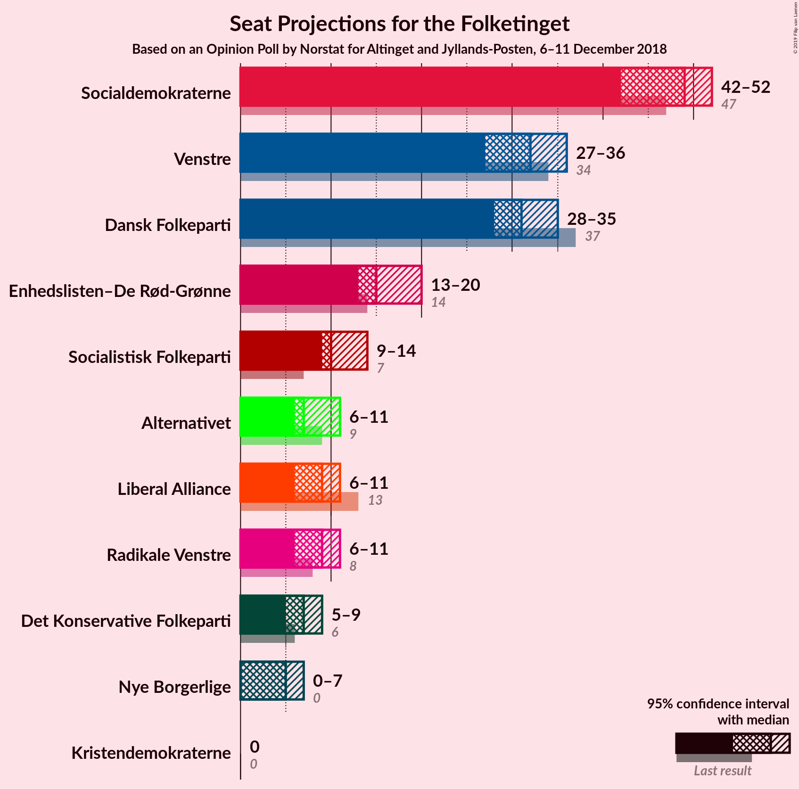
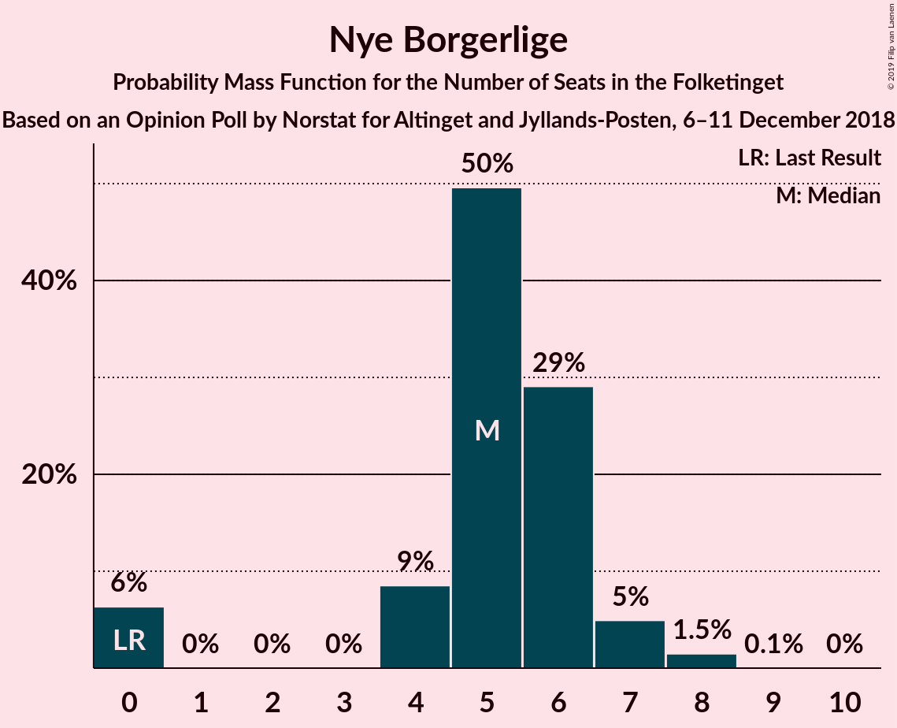
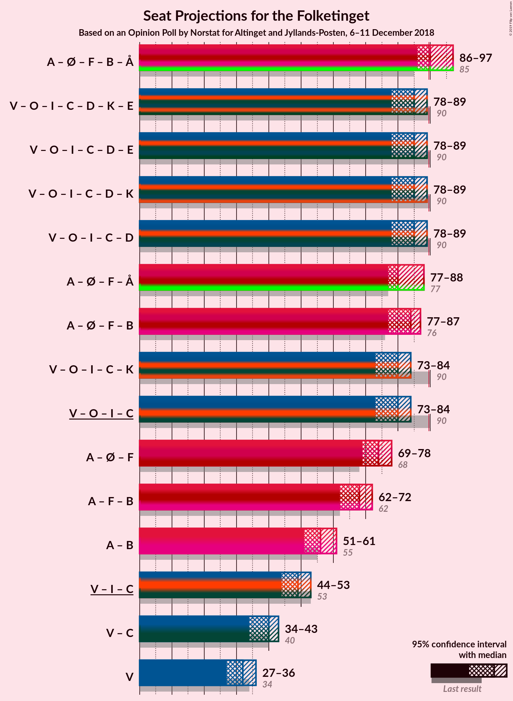
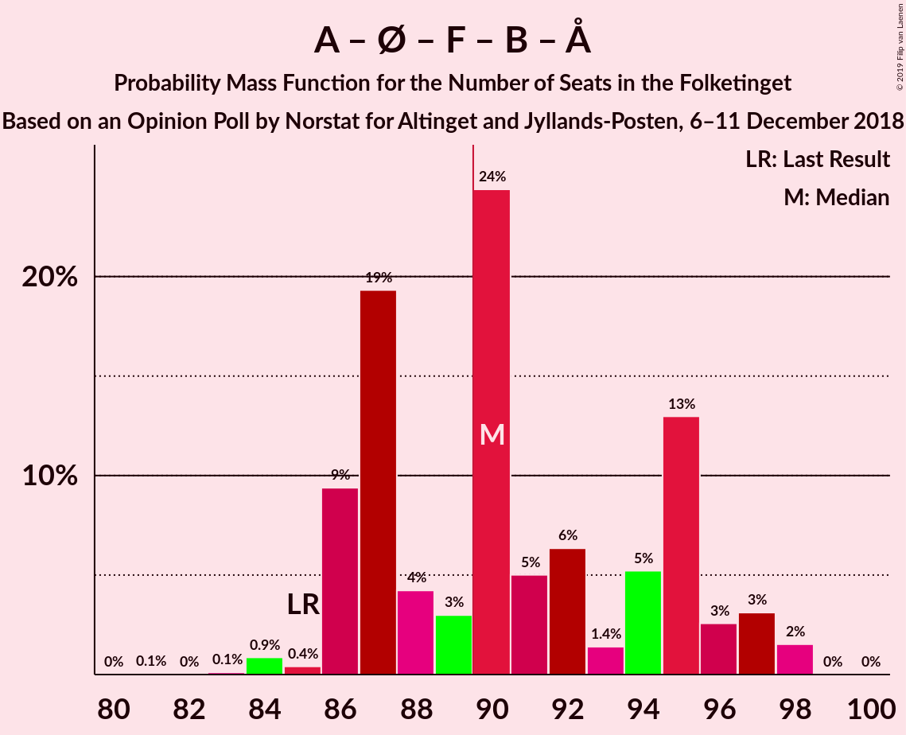
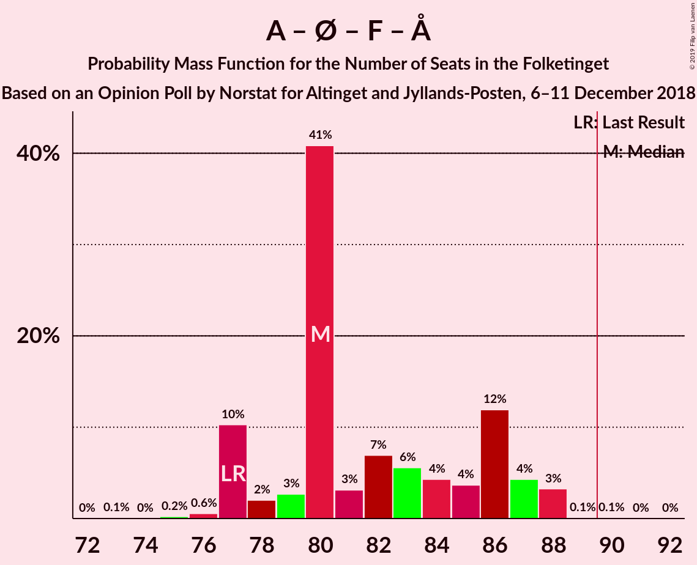
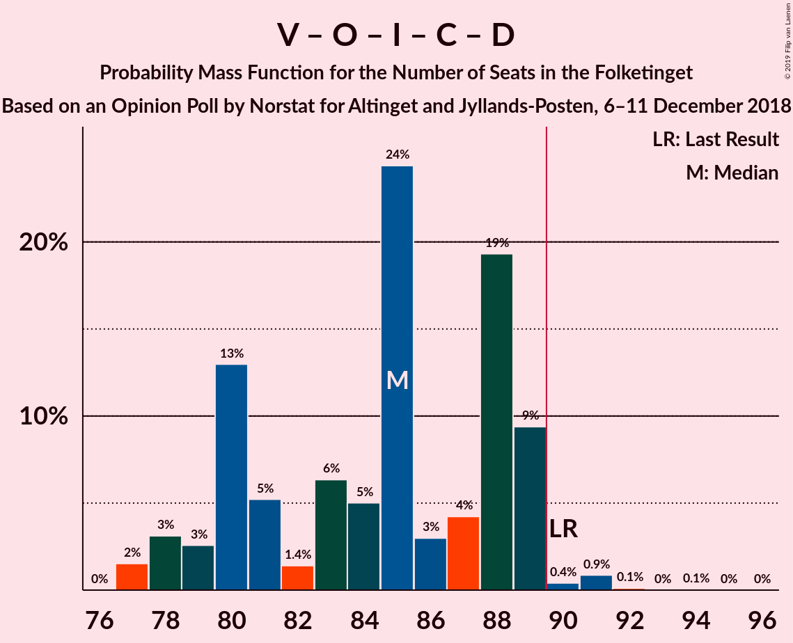
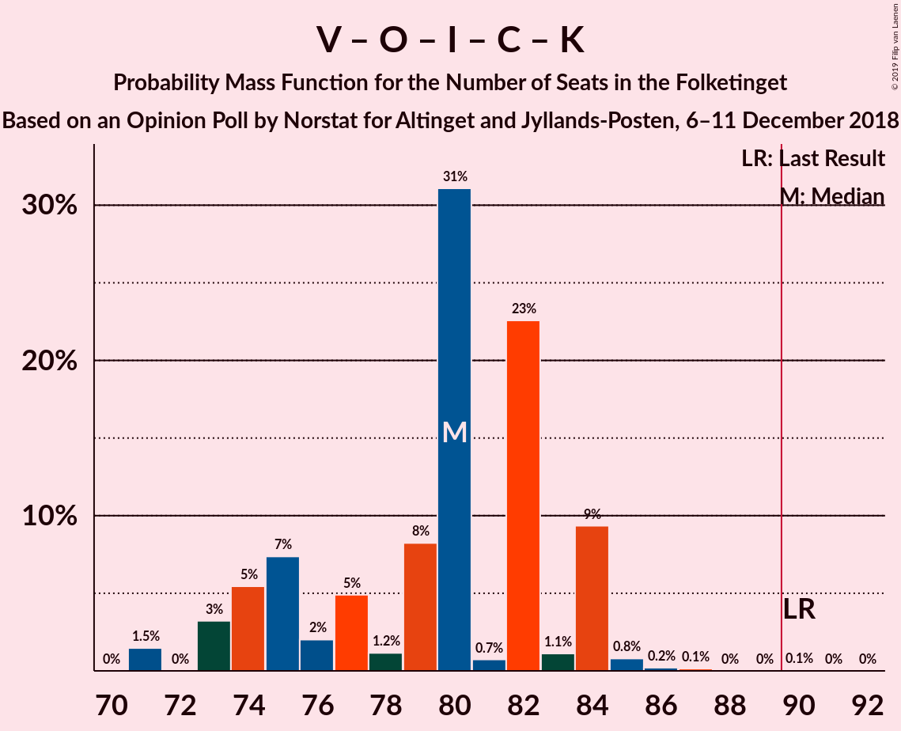
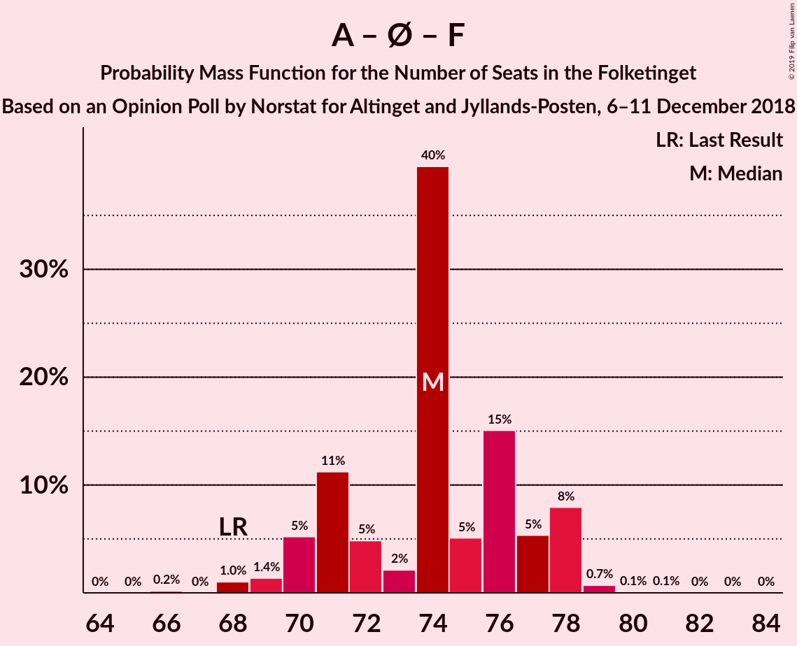
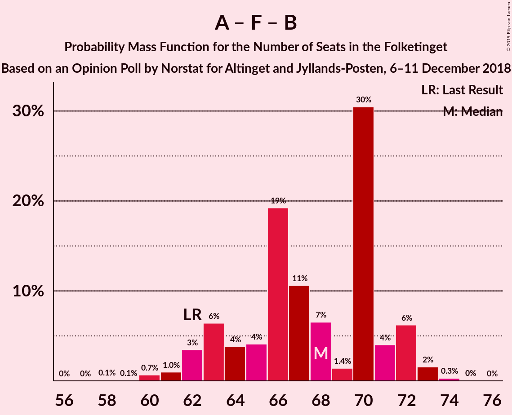

# Opinion Poll by Norstat for Altinget and Jyllands-Posten, 6–11 December 2018

<a href="#voting-intentions">Voting Intentions</a> | <a href="#seats">Seats</a> | <a href="#coalitions">Coalitions</a> | <a href="#technical-information">Technical Information</a>

## Voting Intentions

### Confidence Intervals

| Party | Last Result | Poll Result | 80% Confidence Interval | 90% Confidence Interval | 95% Confidence Interval | 99% Confidence Interval |
|:-----:|:-----------:|:-----------:|:-----------------------:|:-----------------------:|:-----------------------:|:-----------------------:|
| Socialdemokraterne | 26.3% | 26.6% | 25.0–28.3% |24.6–28.7% |24.2–29.1% |23.4–29.9% |
| Venstre | 19.5% | 18.2% | 16.9–19.7% |16.5–20.1% |16.1–20.5% |15.5–21.2% |
| Dansk Folkeparti | 21.1% | 17.6% | 16.3–19.1% |15.9–19.5% |15.6–19.9% |15.0–20.6% |
| Enhedslisten–De Rød-Grønne | 7.8% | 8.8% | 7.8–9.9% |7.5–10.2% |7.3–10.5% |6.9–11.1% |
| Socialistisk Folkeparti | 4.2% | 6.3% | 5.5–7.3% |5.3–7.6% |5.1–7.8% |4.7–8.3% |
| Liberal Alliance | 7.5% | 5.2% | 4.4–6.1% |4.2–6.3% |4.1–6.6% |3.7–7.0% |
| Radikale Venstre | 4.6% | 4.8% | 4.1–5.7% |3.9–6.0% |3.8–6.2% |3.5–6.6% |
| Alternativet | 4.8% | 4.5% | 3.8–5.4% |3.6–5.6% |3.5–5.8% |3.2–6.3% |
| Det Konservative Folkeparti | 3.4% | 3.9% | 3.3–4.8% |3.1–5.0% |3.0–5.2% |2.7–5.6% |
| Nye Borgerlige | 0.0% | 2.8% | 2.3–3.5% |2.1–3.7% |2.0–3.9% |1.8–4.3% |
| Kristendemokraterne | 0.8% | 0.5% | 0.3–0.9% |0.3–1.0% |0.2–1.1% |0.2–1.3% |

*Note:* The poll result column reflects the actual value used in the calculations. Published results may vary slightly, and in addition be rounded to fewer digits.

## Seats

### Confidence Intervals

| Party | Last Result | Median | 80% Confidence Interval | 90% Confidence Interval | 95% Confidence Interval | 99% Confidence Interval |
|:-----:|:-----------:|:------:|:-----------------------:|:-----------------------:|:-----------------------:|:-----------------------:|
| <a href="#socialdemokraterne">Socialdemokraterne</a> | 47 | 54 | 46–54 |45–54 |45–54 |45–54 |
| <a href="#venstre">Venstre</a> | 34 | 30 | 30–33 |30–35 |30–35 |30–35 |
| <a href="#dansk-folkeparti">Dansk Folkeparti</a> | 37 | 30 | 29–30 |29–34 |27–34 |27–34 |
| <a href="#enhedslisten–de-rød-grønne">Enhedslisten–De Rød-Grønne</a> | 14 | 17 | 17–19 |16–19 |16–22 |14–22 |
| <a href="#socialistisk-folkeparti">Socialistisk Folkeparti</a> | 7 | 10 | 10 |10–11 |9–11 |9–11 |
| <a href="#liberal-alliance">Liberal Alliance</a> | 13 | 9 | 8–9 |6–9 |6–10 |6–10 |
| <a href="#radikale-venstre">Radikale Venstre</a> | 8 | 7 | 7–9 |7–12 |7–12 |7–12 |
| <a href="#alternativet">Alternativet</a> | 9 | 5 | 5–6 |5–7 |5–7 |5–7 |
| <a href="#det-konservative-folkeparti">Det Konservative Folkeparti</a> | 6 | 8 | 6–8 |5–8 |5–8 |5–8 |
| <a href="#nye-borgerlige">Nye Borgerlige</a> | 0 | 5 | 5–6 |4–9 |4–9 |4–9 |
| <a href="#kristendemokraterne">Kristendemokraterne</a> | 0 | 0 | 0 |0 |0 |0 |

### Socialdemokraterne

*For a full overview of the results for this party, see the [Socialdemokraterne](party-socialdemokraterne.html) page.*

| Number of Seats | Probability | Accumulated | Special Marks |
|:---------------:|:-----------:|:-----------:|:-------------:|
| 43 | 0.1% | 100% |  |
| 44 | 0.2% | 99.9% |  |
| 45 | 7% | 99.7% |  |
| 46 | 13% | 93% |  |
| 47 | 0% | 79% | Last Result |
| 48 | 0% | 79% |  |
| 49 | 0% | 79% |  |
| 50 | 0% | 79% |  |
| 51 | 0% | 79% |  |
| 52 | 0% | 79% |  |
| 53 | 0.2% | 79% |  |
| 54 | 79% | 79% | Median |
| 55 | 0% | 0% |  |

### Venstre

*For a full overview of the results for this party, see the [Venstre](party-venstre.html) page.*

| Number of Seats | Probability | Accumulated | Special Marks |
|:---------------:|:-----------:|:-----------:|:-------------:|
| 30 | 80% | 100% | Median |
| 31 | 0.1% | 20% |  |
| 32 | 0% | 20% |  |
| 33 | 13% | 20% |  |
| 34 | 0% | 7% | Last Result |
| 35 | 7% | 7% |  |
| 36 | 0% | 0% |  |

### Dansk Folkeparti

*For a full overview of the results for this party, see the [Dansk Folkeparti](party-danskfolkeparti.html) page.*

| Number of Seats | Probability | Accumulated | Special Marks |
|:---------------:|:-----------:|:-----------:|:-------------:|
| 27 | 4% | 100% |  |
| 28 | 0% | 96% |  |
| 29 | 9% | 96% |  |
| 30 | 79% | 87% | Median |
| 31 | 0% | 8% |  |
| 32 | 0.3% | 8% |  |
| 33 | 0.2% | 7% |  |
| 34 | 7% | 7% |  |
| 35 | 0.1% | 0.1% |  |
| 36 | 0% | 0% |  |
| 37 | 0% | 0% | Last Result |

### Enhedslisten–De Rød-Grønne

*For a full overview of the results for this party, see the [Enhedslisten–De Rød-Grønne](party-enhedslisten–derød-grønne.html) page.*

| Number of Seats | Probability | Accumulated | Special Marks |
|:---------------:|:-----------:|:-----------:|:-------------:|
| 14 | 0.6% | 100% | Last Result |
| 15 | 0% | 99.4% |  |
| 16 | 7% | 99.4% |  |
| 17 | 79% | 92% | Median |
| 18 | 0% | 13% |  |
| 19 | 9% | 13% |  |
| 20 | 0% | 4% |  |
| 21 | 0% | 4% |  |
| 22 | 4% | 4% |  |
| 23 | 0% | 0% |  |

### Socialistisk Folkeparti

*For a full overview of the results for this party, see the [Socialistisk Folkeparti](party-socialistiskfolkeparti.html) page.*

| Number of Seats | Probability | Accumulated | Special Marks |
|:---------------:|:-----------:|:-----------:|:-------------:|
| 7 | 0% | 100% | Last Result |
| 8 | 0% | 100% |  |
| 9 | 4% | 100% |  |
| 10 | 87% | 96% | Median |
| 11 | 9% | 10% |  |
| 12 | 0.3% | 0.4% |  |
| 13 | 0% | 0.1% |  |
| 14 | 0.1% | 0.1% |  |
| 15 | 0% | 0% |  |

### Liberal Alliance

*For a full overview of the results for this party, see the [Liberal Alliance](party-liberalalliance.html) page.*

| Number of Seats | Probability | Accumulated | Special Marks |
|:---------------:|:-----------:|:-----------:|:-------------:|
| 6 | 7% | 100% |  |
| 7 | 0% | 93% |  |
| 8 | 9% | 93% |  |
| 9 | 79% | 83% | Median |
| 10 | 4% | 4% |  |
| 11 | 0.1% | 0.3% |  |
| 12 | 0% | 0.2% |  |
| 13 | 0% | 0.2% | Last Result |
| 14 | 0.2% | 0.2% |  |
| 15 | 0% | 0% |  |

### Radikale Venstre

*For a full overview of the results for this party, see the [Radikale Venstre](party-radikalevenstre.html) page.*

| Number of Seats | Probability | Accumulated | Special Marks |
|:---------------:|:-----------:|:-----------:|:-------------:|
| 6 | 0.2% | 100% |  |
| 7 | 80% | 99.8% | Median |
| 8 | 0% | 20% | Last Result |
| 9 | 13% | 20% |  |
| 10 | 0% | 7% |  |
| 11 | 0% | 7% |  |
| 12 | 7% | 7% |  |
| 13 | 0% | 0% |  |

### Alternativet

*For a full overview of the results for this party, see the [Alternativet](party-alternativet.html) page.*

| Number of Seats | Probability | Accumulated | Special Marks |
|:---------------:|:-----------:|:-----------:|:-------------:|
| 5 | 80% | 100% | Median |
| 6 | 13% | 20% |  |
| 7 | 7% | 7% |  |
| 8 | 0% | 0.3% |  |
| 9 | 0.3% | 0.3% | Last Result |
| 10 | 0% | 0% |  |

### Det Konservative Folkeparti

*For a full overview of the results for this party, see the [Det Konservative Folkeparti](party-detkonservativefolkeparti.html) page.*

| Number of Seats | Probability | Accumulated | Special Marks |
|:---------------:|:-----------:|:-----------:|:-------------:|
| 5 | 9% | 100% |  |
| 6 | 7% | 91% | Last Result |
| 7 | 4% | 83% |  |
| 8 | 79% | 80% | Median |
| 9 | 0% | 0.2% |  |
| 10 | 0.1% | 0.1% |  |
| 11 | 0% | 0% |  |

### Nye Borgerlige

*For a full overview of the results for this party, see the [Nye Borgerlige](party-nyeborgerlige.html) page.*

| Number of Seats | Probability | Accumulated | Special Marks |
|:---------------:|:-----------:|:-----------:|:-------------:|
| 0 | 0% | 100% | Last Result |
| 1 | 0% | 100% |  |
| 2 | 0% | 100% |  |
| 3 | 0% | 100% |  |
| 4 | 7% | 100% |  |
| 5 | 79% | 93% | Median |
| 6 | 4% | 14% |  |
| 7 | 0.2% | 10% |  |
| 8 | 0.2% | 9% |  |
| 9 | 9% | 9% |  |
| 10 | 0% | 0% |  |

### Kristendemokraterne

*For a full overview of the results for this party, see the [Kristendemokraterne](party-kristendemokraterne.html) page.*

| Number of Seats | Probability | Accumulated | Special Marks |
|:---------------:|:-----------:|:-----------:|:-------------:|
| 0 | 100% | 100% | Last Result, Median |

## Coalitions

### Confidence Intervals

| Coalition | Last Result | Median | Majority? | 80% Confidence Interval | 90% Confidence Interval | 95% Confidence Interval | 99% Confidence Interval |
|:---------:|:-----------:|:------:|:---------:|:-----------------------:|:-----------------------:|:-----------------------:|:-----------------------:|
| Socialdemokraterne – Enhedslisten–De Rød-Grønne – Socialistisk Folkeparti – Radikale Venstre – Alternativet | 85 | 93 | 99.6% | 91–93 | 90–93 | 90–93 | 90–93 |
| Socialdemokraterne – Enhedslisten–De Rød-Grønne – Socialistisk Folkeparti – Radikale Venstre | 76 | 88 | 0% | 85–88 | 83–88 | 83–88 | 83–88 |
| Socialdemokraterne – Enhedslisten–De Rød-Grønne – Socialistisk Folkeparti – Alternativet | 77 | 86 | 0% | 82–86 | 78–86 | 78–86 | 78–86 |
| Venstre – Dansk Folkeparti – Liberal Alliance – Det Konservative Folkeparti – Nye Borgerlige – Kristendemokraterne | 90 | 82 | 0.3% | 82–84 | 82–85 | 82–85 | 82–85 |
| Venstre – Dansk Folkeparti – Liberal Alliance – Det Konservative Folkeparti – Nye Borgerlige | 90 | 82 | 0.3% | 82–84 | 82–85 | 82–85 | 82–85 |
| Venstre – Dansk Folkeparti – Liberal Alliance – Det Konservative Folkeparti – Kristendemokraterne | 90 | 77 | 0% | 77 | 75–81 | 75–81 | 75–81 |
| Venstre – Dansk Folkeparti – Liberal Alliance – Det Konservative Folkeparti | 90 | 77 | 0% | 77 | 75–81 | 75–81 | 75–81 |
| Socialdemokraterne – Enhedslisten–De Rød-Grønne – Socialistisk Folkeparti | 68 | 81 | 0% | 76–81 | 71–81 | 71–81 | 71–81 |
| Socialdemokraterne – Socialistisk Folkeparti – Radikale Venstre | 62 | 71 | 0% | 66–71 | 66–71 | 64–71 | 64–71 |
| Socialdemokraterne – Radikale Venstre | 55 | 61 | 0% | 55–61 | 55–61 | 55–61 | 55–61 |
| Venstre – Liberal Alliance – Det Konservative Folkeparti | 53 | 47 | 0% | 47 | 46–47 | 46–50 | 46–50 |
| Venstre – Det Konservative Folkeparti | 40 | 38 | 0% | 38–40 | 38–41 | 38–41 | 38–41 |
| Venstre | 34 | 30 | 0% | 30–33 | 30–35 | 30–35 | 30–35 |

### Socialdemokraterne – Enhedslisten–De Rød-Grønne – Socialistisk Folkeparti – Radikale Venstre – Alternativet

| Number of Seats | Probability | Accumulated | Special Marks |
|:---------------:|:-----------:|:-----------:|:-------------:|
| 83 | 0.3% | 100% |  |
| 84 | 0% | 99.7% |  |
| 85 | 0% | 99.7% | Last Result |
| 86 | 0% | 99.7% |  |
| 87 | 0% | 99.7% |  |
| 88 | 0% | 99.7% |  |
| 89 | 0% | 99.6% |  |
| 90 | 7% | 99.6% | Majority |
| 91 | 9% | 93% |  |
| 92 | 4% | 83% |  |
| 93 | 79% | 79% | Median |
| 94 | 0% | 0% |  |

### Socialdemokraterne – Enhedslisten–De Rød-Grønne – Socialistisk Folkeparti – Radikale Venstre

| Number of Seats | Probability | Accumulated | Special Marks |
|:---------------:|:-----------:|:-----------:|:-------------:|
| 74 | 0.2% | 100% |  |
| 75 | 0% | 99.8% |  |
| 76 | 0% | 99.8% | Last Result |
| 77 | 0% | 99.8% |  |
| 78 | 0.1% | 99.8% |  |
| 79 | 0% | 99.7% |  |
| 80 | 0% | 99.6% |  |
| 81 | 0% | 99.6% |  |
| 82 | 0% | 99.6% |  |
| 83 | 7% | 99.6% |  |
| 84 | 0% | 93% |  |
| 85 | 9% | 93% |  |
| 86 | 4% | 83% |  |
| 87 | 0% | 79% |  |
| 88 | 79% | 79% | Median |
| 89 | 0% | 0% |  |

### Socialdemokraterne – Enhedslisten–De Rød-Grønne – Socialistisk Folkeparti – Alternativet

| Number of Seats | Probability | Accumulated | Special Marks |
|:---------------:|:-----------:|:-----------:|:-------------:|
| 76 | 0.1% | 100% |  |
| 77 | 0.2% | 99.9% | Last Result |
| 78 | 7% | 99.7% |  |
| 79 | 0% | 93% |  |
| 80 | 0% | 93% |  |
| 81 | 0% | 93% |  |
| 82 | 9% | 93% |  |
| 83 | 4% | 83% |  |
| 84 | 0.2% | 80% |  |
| 85 | 0% | 79% |  |
| 86 | 79% | 79% | Median |
| 87 | 0% | 0% |  |

### Venstre – Dansk Folkeparti – Liberal Alliance – Det Konservative Folkeparti – Nye Borgerlige – Kristendemokraterne

| Number of Seats | Probability | Accumulated | Special Marks |
|:---------------:|:-----------:|:-----------:|:-------------:|
| 82 | 79% | 100% | Median |
| 83 | 4% | 21% |  |
| 84 | 9% | 17% |  |
| 85 | 7% | 7% |  |
| 86 | 0% | 0.3% |  |
| 87 | 0% | 0.3% |  |
| 88 | 0% | 0.3% |  |
| 89 | 0% | 0.3% |  |
| 90 | 0% | 0.3% | Last Result, Majority |
| 91 | 0% | 0.3% |  |
| 92 | 0.3% | 0.3% |  |
| 93 | 0% | 0% |  |

### Venstre – Dansk Folkeparti – Liberal Alliance – Det Konservative Folkeparti – Nye Borgerlige

| Number of Seats | Probability | Accumulated | Special Marks |
|:---------------:|:-----------:|:-----------:|:-------------:|
| 82 | 79% | 100% | Median |
| 83 | 4% | 21% |  |
| 84 | 9% | 17% |  |
| 85 | 7% | 7% |  |
| 86 | 0% | 0.3% |  |
| 87 | 0% | 0.3% |  |
| 88 | 0% | 0.3% |  |
| 89 | 0% | 0.3% |  |
| 90 | 0% | 0.3% | Last Result, Majority |
| 91 | 0% | 0.3% |  |
| 92 | 0.3% | 0.3% |  |
| 93 | 0% | 0% |  |

### Venstre – Dansk Folkeparti – Liberal Alliance – Det Konservative Folkeparti – Kristendemokraterne

| Number of Seats | Probability | Accumulated | Special Marks |
|:---------------:|:-----------:|:-----------:|:-------------:|
| 75 | 9% | 100% |  |
| 76 | 0.3% | 91% |  |
| 77 | 83% | 91% | Median |
| 78 | 0.1% | 7% |  |
| 79 | 0% | 7% |  |
| 80 | 0% | 7% |  |
| 81 | 7% | 7% |  |
| 82 | 0% | 0.3% |  |
| 83 | 0% | 0.3% |  |
| 84 | 0% | 0.3% |  |
| 85 | 0.2% | 0.3% |  |
| 86 | 0% | 0.1% |  |
| 87 | 0.1% | 0.1% |  |
| 88 | 0% | 0% |  |
| 89 | 0% | 0% |  |
| 90 | 0% | 0% | Last Result, Majority |

### Venstre – Dansk Folkeparti – Liberal Alliance – Det Konservative Folkeparti

| Number of Seats | Probability | Accumulated | Special Marks |
|:---------------:|:-----------:|:-----------:|:-------------:|
| 75 | 9% | 100% |  |
| 76 | 0.3% | 91% |  |
| 77 | 83% | 91% | Median |
| 78 | 0.1% | 7% |  |
| 79 | 0% | 7% |  |
| 80 | 0% | 7% |  |
| 81 | 7% | 7% |  |
| 82 | 0% | 0.3% |  |
| 83 | 0% | 0.3% |  |
| 84 | 0% | 0.3% |  |
| 85 | 0.2% | 0.3% |  |
| 86 | 0% | 0.1% |  |
| 87 | 0.1% | 0.1% |  |
| 88 | 0% | 0% |  |
| 89 | 0% | 0% |  |
| 90 | 0% | 0% | Last Result, Majority |

### Socialdemokraterne – Enhedslisten–De Rød-Grønne – Socialistisk Folkeparti

| Number of Seats | Probability | Accumulated | Special Marks |
|:---------------:|:-----------:|:-----------:|:-------------:|
| 68 | 0.2% | 100% | Last Result |
| 69 | 0% | 99.8% |  |
| 70 | 0% | 99.8% |  |
| 71 | 7% | 99.8% |  |
| 72 | 0% | 93% |  |
| 73 | 0% | 93% |  |
| 74 | 0% | 93% |  |
| 75 | 0% | 93% |  |
| 76 | 9% | 93% |  |
| 77 | 4% | 83% |  |
| 78 | 0% | 79% |  |
| 79 | 0.2% | 79% |  |
| 80 | 0% | 79% |  |
| 81 | 79% | 79% | Median |
| 82 | 0% | 0% |  |

### Socialdemokraterne – Socialistisk Folkeparti – Radikale Venstre

| Number of Seats | Probability | Accumulated | Special Marks |
|:---------------:|:-----------:|:-----------:|:-------------:|
| 60 | 0.2% | 100% |  |
| 61 | 0% | 99.8% |  |
| 62 | 0% | 99.7% | Last Result |
| 63 | 0% | 99.7% |  |
| 64 | 4% | 99.7% |  |
| 65 | 0% | 96% |  |
| 66 | 9% | 96% |  |
| 67 | 7% | 87% |  |
| 68 | 0% | 79% |  |
| 69 | 0% | 79% |  |
| 70 | 0% | 79% |  |
| 71 | 79% | 79% | Median |
| 72 | 0.2% | 0.2% |  |
| 73 | 0% | 0% |  |

### Socialdemokraterne – Radikale Venstre

| Number of Seats | Probability | Accumulated | Special Marks |
|:---------------:|:-----------:|:-----------:|:-------------:|
| 50 | 0.3% | 100% |  |
| 51 | 0% | 99.7% |  |
| 52 | 0% | 99.7% |  |
| 53 | 0% | 99.6% |  |
| 54 | 0% | 99.6% |  |
| 55 | 13% | 99.6% | Last Result |
| 56 | 0% | 87% |  |
| 57 | 7% | 87% |  |
| 58 | 0% | 79% |  |
| 59 | 0% | 79% |  |
| 60 | 0.2% | 79% |  |
| 61 | 79% | 79% | Median |
| 62 | 0% | 0% |  |

### Venstre – Liberal Alliance – Det Konservative Folkeparti

| Number of Seats | Probability | Accumulated | Special Marks |
|:---------------:|:-----------:|:-----------:|:-------------:|
| 44 | 0.2% | 100% |  |
| 45 | 0% | 99.7% |  |
| 46 | 9% | 99.7% |  |
| 47 | 86% | 91% | Median |
| 48 | 0% | 4% |  |
| 49 | 0% | 4% |  |
| 50 | 4% | 4% |  |
| 51 | 0% | 0.3% |  |
| 52 | 0.3% | 0.3% |  |
| 53 | 0% | 0% | Last Result |

### Venstre – Det Konservative Folkeparti

| Number of Seats | Probability | Accumulated | Special Marks |
|:---------------:|:-----------:|:-----------:|:-------------:|
| 36 | 0.3% | 100% |  |
| 37 | 0% | 99.7% |  |
| 38 | 89% | 99.7% | Median |
| 39 | 0% | 11% |  |
| 40 | 4% | 11% | Last Result |
| 41 | 7% | 7% |  |
| 42 | 0% | 0% |  |

### Venstre

| Number of Seats | Probability | Accumulated | Special Marks |
|:---------------:|:-----------:|:-----------:|:-------------:|
| 30 | 80% | 100% | Median |
| 31 | 0.1% | 20% |  |
| 32 | 0% | 20% |  |
| 33 | 13% | 20% |  |
| 34 | 0% | 7% | Last Result |
| 35 | 7% | 7% |  |
| 36 | 0% | 0% |  |

## Technical Information

### Opinion Poll

+ **Polling firm:** Norstat
+ **Commissioner(s):** Altinget and Jyllands-Posten
+ **Fieldwork period:** 6–11 December 2018

### Calculations

+ **Sample size:** 1219
+ **Simulations done:** 1,024
+ **Error estimate:** 4.47%

