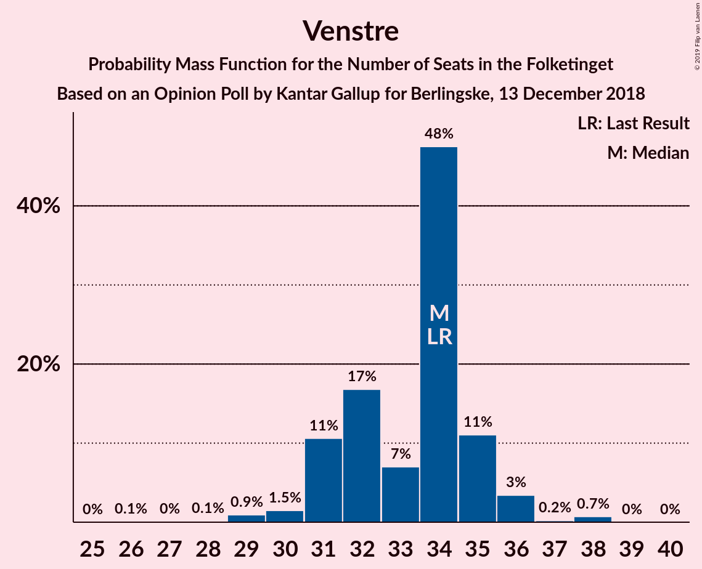
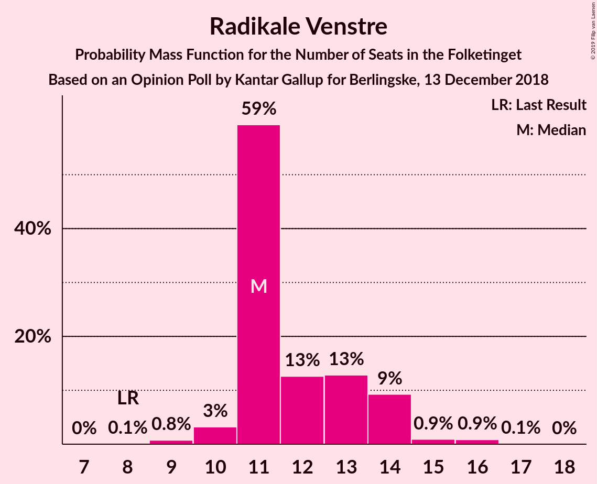

# Opinion Poll by Kantar Gallup for Berlingske, 13 December 2018

<a href="#voting-intentions">Voting Intentions</a> | <a href="#seats">Seats</a> | <a href="#coalitions">Coalitions</a> | <a href="#technical-information">Technical Information</a>

## Voting Intentions

### Confidence Intervals

| Party | Last Result | Poll Result | 80% Confidence Interval | 90% Confidence Interval | 95% Confidence Interval | 99% Confidence Interval |
|:-----:|:-----------:|:-----------:|:-----------------------:|:-----------------------:|:-----------------------:|:-----------------------:|
| Socialdemokraterne | 26.3% | 26.4% | 25.0–27.8% |24.6–28.2% |24.3–28.6% |23.6–29.3% |
| Dansk Folkeparti | 21.1% | 18.3% | 17.1–19.6% |16.8–20.0% |16.5–20.3% |15.9–20.9% |
| Venstre | 19.5% | 18.3% | 17.1–19.6% |16.8–20.0% |16.5–20.3% |15.9–20.9% |
| Enhedslisten–De Rød-Grønne | 7.8% | 8.4% | 7.6–9.4% |7.3–9.6% |7.1–9.9% |6.8–10.4% |
| Radikale Venstre | 4.6% | 6.7% | 5.9–7.5% |5.7–7.8% |5.5–8.0% |5.2–8.4% |
| Socialistisk Folkeparti | 4.2% | 5.6% | 4.9–6.4% |4.7–6.6% |4.6–6.9% |4.3–7.3% |
| Liberal Alliance | 7.5% | 5.4% | 4.8–6.2% |4.6–6.4% |4.4–6.6% |4.1–7.1% |
| Det Konservative Folkeparti | 3.4% | 4.9% | 4.3–5.7% |4.1–5.9% |4.0–6.1% |3.7–6.5% |
| Alternativet | 4.8% | 3.3% | 2.8–4.0% |2.7–4.1% |2.5–4.3% |2.3–4.6% |
| Nye Borgerlige | 0.0% | 1.4% | 1.1–1.8% |1.0–2.0% |0.9–2.1% |0.8–2.3% |
| Kristendemokraterne | 0.8% | 0.7% | 0.5–1.0% |0.4–1.1% |0.4–1.2% |0.3–1.4% |

*Note:* The poll result column reflects the actual value used in the calculations. Published results may vary slightly, and in addition be rounded to fewer digits.

## Seats

### Confidence Intervals

| Party | Last Result | Median | 80% Confidence Interval | 90% Confidence Interval | 95% Confidence Interval | 99% Confidence Interval |
|:-----:|:-----------:|:------:|:-----------------------:|:-----------------------:|:-----------------------:|:-----------------------:|
| <a href="#socialdemokraterne">Socialdemokraterne</a> | 47 | 48 | 45–50 |44–51 |43–51 |42–52 |
| <a href="#dansk-folkeparti">Dansk Folkeparti</a> | 37 | 33 | 30–36 |30–37 |29–38 |28–39 |
| <a href="#venstre">Venstre</a> | 34 | 32 | 29–35 |29–35 |29–36 |28–37 |
| <a href="#enhedslisten–de-rød-grønne">Enhedslisten–De Rød-Grønne</a> | 14 | 15 | 13–17 |13–17 |12–18 |12–19 |
| <a href="#radikale-venstre">Radikale Venstre</a> | 8 | 13 | 11–14 |9–15 |9–15 |9–16 |
| <a href="#socialistisk-folkeparti">Socialistisk Folkeparti</a> | 7 | 10 | 8–12 |8–12 |8–12 |7–13 |
| <a href="#liberal-alliance">Liberal Alliance</a> | 13 | 10 | 8–11 |8–11 |7–12 |7–13 |
| <a href="#det-konservative-folkeparti">Det Konservative Folkeparti</a> | 6 | 8 | 7–11 |7–11 |7–11 |6–12 |
| <a href="#alternativet">Alternativet</a> | 9 | 6 | 5–8 |5–8 |4–8 |4–9 |
| <a href="#nye-borgerlige">Nye Borgerlige</a> | 0 | 0 | 0 |0 |0–4 |0–4 |
| <a href="#kristendemokraterne">Kristendemokraterne</a> | 0 | 0 | 0 |0 |0 |0 |

### Socialdemokraterne

*For a full overview of the results for this party, see the [Socialdemokraterne](party-socialdemokraterne.html) page.*

| Number of Seats | Probability | Accumulated | Special Marks |
|:---------------:|:-----------:|:-----------:|:-------------:|
| 40 | 0.1% | 100% |  |
| 41 | 0.2% | 99.9% |  |
| 42 | 2% | 99.8% |  |
| 43 | 2% | 98% |  |
| 44 | 5% | 96% |  |
| 45 | 5% | 91% |  |
| 46 | 12% | 86% |  |
| 47 | 18% | 74% | Last Result |
| 48 | 22% | 57% | Median |
| 49 | 21% | 35% |  |
| 50 | 7% | 13% |  |
| 51 | 5% | 6% |  |
| 52 | 0.4% | 0.7% |  |
| 53 | 0.2% | 0.4% |  |
| 54 | 0.2% | 0.2% |  |
| 55 | 0% | 0% |  |

### Dansk Folkeparti

*For a full overview of the results for this party, see the [Dansk Folkeparti](party-danskfolkeparti.html) page.*

| Number of Seats | Probability | Accumulated | Special Marks |
|:---------------:|:-----------:|:-----------:|:-------------:|
| 27 | 0.3% | 100% |  |
| 28 | 1.3% | 99.7% |  |
| 29 | 1.5% | 98% |  |
| 30 | 8% | 97% |  |
| 31 | 5% | 89% |  |
| 32 | 16% | 83% |  |
| 33 | 19% | 68% | Median |
| 34 | 23% | 49% |  |
| 35 | 10% | 26% |  |
| 36 | 10% | 16% |  |
| 37 | 3% | 6% | Last Result |
| 38 | 2% | 3% |  |
| 39 | 0.6% | 0.6% |  |
| 40 | 0% | 0% |  |

### Venstre

*For a full overview of the results for this party, see the [Venstre](party-venstre.html) page.*

| Number of Seats | Probability | Accumulated | Special Marks |
|:---------------:|:-----------:|:-----------:|:-------------:|
| 27 | 0.3% | 100% |  |
| 28 | 1.1% | 99.7% |  |
| 29 | 14% | 98.5% |  |
| 30 | 19% | 85% |  |
| 31 | 9% | 65% |  |
| 32 | 13% | 57% | Median |
| 33 | 15% | 44% |  |
| 34 | 18% | 30% | Last Result |
| 35 | 7% | 12% |  |
| 36 | 3% | 5% |  |
| 37 | 1.0% | 1.4% |  |
| 38 | 0.3% | 0.4% |  |
| 39 | 0% | 0.1% |  |
| 40 | 0% | 0.1% |  |
| 41 | 0% | 0% |  |

### Enhedslisten–De Rød-Grønne

*For a full overview of the results for this party, see the [Enhedslisten–De Rød-Grønne](party-enhedslisten–derød-grønne.html) page.*

| Number of Seats | Probability | Accumulated | Special Marks |
|:---------------:|:-----------:|:-----------:|:-------------:|
| 11 | 0.5% | 100% |  |
| 12 | 2% | 99.5% |  |
| 13 | 12% | 97% |  |
| 14 | 21% | 85% | Last Result |
| 15 | 22% | 64% | Median |
| 16 | 27% | 42% |  |
| 17 | 13% | 15% |  |
| 18 | 2% | 3% |  |
| 19 | 0.6% | 0.7% |  |
| 20 | 0.1% | 0.1% |  |
| 21 | 0% | 0% |  |

### Radikale Venstre

*For a full overview of the results for this party, see the [Radikale Venstre](party-radikalevenstre.html) page.*

| Number of Seats | Probability | Accumulated | Special Marks |
|:---------------:|:-----------:|:-----------:|:-------------:|
| 8 | 0.2% | 100% | Last Result |
| 9 | 6% | 99.8% |  |
| 10 | 4% | 94% |  |
| 11 | 21% | 90% |  |
| 12 | 18% | 69% |  |
| 13 | 30% | 51% | Median |
| 14 | 15% | 20% |  |
| 15 | 5% | 6% |  |
| 16 | 1.0% | 1.1% |  |
| 17 | 0.1% | 0.1% |  |
| 18 | 0% | 0% |  |

### Socialistisk Folkeparti

*For a full overview of the results for this party, see the [Socialistisk Folkeparti](party-socialistiskfolkeparti.html) page.*

| Number of Seats | Probability | Accumulated | Special Marks |
|:---------------:|:-----------:|:-----------:|:-------------:|
| 7 | 0.5% | 100% | Last Result |
| 8 | 13% | 99.5% |  |
| 9 | 13% | 87% |  |
| 10 | 38% | 74% | Median |
| 11 | 25% | 36% |  |
| 12 | 9% | 11% |  |
| 13 | 2% | 2% |  |
| 14 | 0.1% | 0.2% |  |
| 15 | 0.1% | 0.1% |  |
| 16 | 0% | 0% |  |

### Liberal Alliance

*For a full overview of the results for this party, see the [Liberal Alliance](party-liberalalliance.html) page.*

| Number of Seats | Probability | Accumulated | Special Marks |
|:---------------:|:-----------:|:-----------:|:-------------:|
| 6 | 0.1% | 100% |  |
| 7 | 3% | 99.9% |  |
| 8 | 10% | 97% |  |
| 9 | 36% | 87% |  |
| 10 | 29% | 52% | Median |
| 11 | 19% | 23% |  |
| 12 | 3% | 4% |  |
| 13 | 0.8% | 0.9% | Last Result |
| 14 | 0.1% | 0.1% |  |
| 15 | 0% | 0% |  |

### Det Konservative Folkeparti

*For a full overview of the results for this party, see the [Det Konservative Folkeparti](party-detkonservativefolkeparti.html) page.*

| Number of Seats | Probability | Accumulated | Special Marks |
|:---------------:|:-----------:|:-----------:|:-------------:|
| 6 | 2% | 100% | Last Result |
| 7 | 12% | 98% |  |
| 8 | 37% | 86% | Median |
| 9 | 28% | 50% |  |
| 10 | 10% | 22% |  |
| 11 | 11% | 12% |  |
| 12 | 0.7% | 0.8% |  |
| 13 | 0.1% | 0.1% |  |
| 14 | 0% | 0% |  |

### Alternativet

*For a full overview of the results for this party, see the [Alternativet](party-alternativet.html) page.*

| Number of Seats | Probability | Accumulated | Special Marks |
|:---------------:|:-----------:|:-----------:|:-------------:|
| 4 | 3% | 100% |  |
| 5 | 26% | 97% |  |
| 6 | 42% | 71% | Median |
| 7 | 15% | 29% |  |
| 8 | 13% | 14% |  |
| 9 | 0.8% | 0.8% | Last Result |
| 10 | 0.1% | 0.1% |  |
| 11 | 0% | 0% |  |

### Nye Borgerlige

*For a full overview of the results for this party, see the [Nye Borgerlige](party-nyeborgerlige.html) page.*

| Number of Seats | Probability | Accumulated | Special Marks |
|:---------------:|:-----------:|:-----------:|:-------------:|
| 0 | 95% | 100% | Last Result, Median |
| 1 | 0% | 5% |  |
| 2 | 0% | 5% |  |
| 3 | 0% | 5% |  |
| 4 | 4% | 5% |  |
| 5 | 0.3% | 0.3% |  |
| 6 | 0% | 0% |  |

### Kristendemokraterne

*For a full overview of the results for this party, see the [Kristendemokraterne](party-kristendemokraterne.html) page.*

| Number of Seats | Probability | Accumulated | Special Marks |
|:---------------:|:-----------:|:-----------:|:-------------:|
| 0 | 100% | 100% | Last Result, Median |

## Coalitions

### Confidence Intervals

| Coalition | Last Result | Median | Majority? | 80% Confidence Interval | 90% Confidence Interval | 95% Confidence Interval | 99% Confidence Interval |
|:---------:|:-----------:|:------:|:---------:|:-----------------------:|:-----------------------:|:-----------------------:|:-----------------------:|
| Socialdemokraterne – Enhedslisten–De Rød-Grønne – Radikale Venstre – Socialistisk Folkeparti – Alternativet | 85 | 91 | 76% | 87–95 | 86–95 | 85–95 | 84–97 |
| Dansk Folkeparti – Venstre – Liberal Alliance – Det Konservative Folkeparti – Nye Borgerlige – Kristendemokraterne | 90 | 84 | 4% | 80–88 | 80–89 | 80–90 | 78–91 |
| Dansk Folkeparti – Venstre – Liberal Alliance – Det Konservative Folkeparti – Kristendemokraterne | 90 | 83 | 4% | 80–87 | 80–89 | 80–90 | 78–91 |
| Dansk Folkeparti – Venstre – Liberal Alliance – Det Konservative Folkeparti – Nye Borgerlige | 90 | 84 | 4% | 80–88 | 80–89 | 80–90 | 78–91 |
| Dansk Folkeparti – Venstre – Liberal Alliance – Det Konservative Folkeparti | 90 | 83 | 4% | 80–87 | 80–89 | 80–90 | 78–91 |
| Socialdemokraterne – Enhedslisten–De Rød-Grønne – Radikale Venstre – Socialistisk Folkeparti | 76 | 86 | 1.4% | 81–87 | 80–88 | 79–89 | 78–91 |
| Socialdemokraterne – Radikale Venstre – Socialistisk Folkeparti | 62 | 71 | 0% | 66–73 | 65–73 | 64–74 | 63–76 |
| Socialdemokraterne – Radikale Venstre | 55 | 61 | 0% | 56–62 | 55–63 | 55–64 | 53–65 |
| Venstre – Liberal Alliance – Det Konservative Folkeparti | 53 | 50 | 0% | 47–54 | 47–55 | 47–57 | 46–58 |
| Venstre – Det Konservative Folkeparti | 40 | 40 | 0% | 37–44 | 37–45 | 37–46 | 36–48 |
| Venstre | 34 | 32 | 0% | 29–35 | 29–35 | 29–36 | 28–37 |

### Socialdemokraterne – Enhedslisten–De Rød-Grønne – Radikale Venstre – Socialistisk Folkeparti – Alternativet

| Number of Seats | Probability | Accumulated | Special Marks |
|:---------------:|:-----------:|:-----------:|:-------------:|
| 83 | 0.3% | 100% |  |
| 84 | 2% | 99.7% |  |
| 85 | 2% | 98% | Last Result |
| 86 | 4% | 96% |  |
| 87 | 3% | 92% |  |
| 88 | 10% | 89% |  |
| 89 | 4% | 79% |  |
| 90 | 9% | 76% | Majority |
| 91 | 18% | 66% |  |
| 92 | 8% | 48% | Median |
| 93 | 22% | 40% |  |
| 94 | 5% | 18% |  |
| 95 | 12% | 13% |  |
| 96 | 0.7% | 1.5% |  |
| 97 | 0.5% | 0.8% |  |
| 98 | 0.1% | 0.3% |  |
| 99 | 0.1% | 0.2% |  |
| 100 | 0% | 0.1% |  |
| 101 | 0% | 0% |  |

### Dansk Folkeparti – Venstre – Liberal Alliance – Det Konservative Folkeparti – Nye Borgerlige – Kristendemokraterne

| Number of Seats | Probability | Accumulated | Special Marks |
|:---------------:|:-----------:|:-----------:|:-------------:|
| 75 | 0% | 100% |  |
| 76 | 0.1% | 99.9% |  |
| 77 | 0.1% | 99.8% |  |
| 78 | 0.5% | 99.7% |  |
| 79 | 0.7% | 99.2% |  |
| 80 | 12% | 98.5% |  |
| 81 | 5% | 87% |  |
| 82 | 22% | 82% |  |
| 83 | 8% | 60% | Median |
| 84 | 18% | 52% |  |
| 85 | 9% | 34% |  |
| 86 | 4% | 24% |  |
| 87 | 10% | 21% |  |
| 88 | 3% | 11% |  |
| 89 | 4% | 8% |  |
| 90 | 2% | 4% | Last Result, Majority |
| 91 | 2% | 2% |  |
| 92 | 0.3% | 0.3% |  |
| 93 | 0% | 0% |  |

### Dansk Folkeparti – Venstre – Liberal Alliance – Det Konservative Folkeparti – Kristendemokraterne

| Number of Seats | Probability | Accumulated | Special Marks |
|:---------------:|:-----------:|:-----------:|:-------------:|
| 75 | 0.1% | 100% |  |
| 76 | 0.2% | 99.9% |  |
| 77 | 0.2% | 99.8% |  |
| 78 | 0.7% | 99.6% |  |
| 79 | 1.3% | 98.8% |  |
| 80 | 12% | 98% |  |
| 81 | 7% | 86% |  |
| 82 | 22% | 79% |  |
| 83 | 7% | 57% | Median |
| 84 | 19% | 49% |  |
| 85 | 8% | 31% |  |
| 86 | 4% | 23% |  |
| 87 | 9% | 19% |  |
| 88 | 2% | 10% |  |
| 89 | 4% | 8% |  |
| 90 | 2% | 4% | Last Result, Majority |
| 91 | 2% | 2% |  |
| 92 | 0.3% | 0.3% |  |
| 93 | 0% | 0% |  |

### Dansk Folkeparti – Venstre – Liberal Alliance – Det Konservative Folkeparti – Nye Borgerlige

| Number of Seats | Probability | Accumulated | Special Marks |
|:---------------:|:-----------:|:-----------:|:-------------:|
| 75 | 0% | 100% |  |
| 76 | 0.1% | 99.9% |  |
| 77 | 0.1% | 99.8% |  |
| 78 | 0.5% | 99.7% |  |
| 79 | 0.7% | 99.2% |  |
| 80 | 12% | 98.5% |  |
| 81 | 5% | 87% |  |
| 82 | 22% | 82% |  |
| 83 | 8% | 60% | Median |
| 84 | 18% | 52% |  |
| 85 | 9% | 34% |  |
| 86 | 4% | 24% |  |
| 87 | 10% | 21% |  |
| 88 | 3% | 11% |  |
| 89 | 4% | 8% |  |
| 90 | 2% | 4% | Last Result, Majority |
| 91 | 2% | 2% |  |
| 92 | 0.3% | 0.3% |  |
| 93 | 0% | 0% |  |

### Dansk Folkeparti – Venstre – Liberal Alliance – Det Konservative Folkeparti

| Number of Seats | Probability | Accumulated | Special Marks |
|:---------------:|:-----------:|:-----------:|:-------------:|
| 75 | 0.1% | 100% |  |
| 76 | 0.2% | 99.9% |  |
| 77 | 0.2% | 99.8% |  |
| 78 | 0.7% | 99.6% |  |
| 79 | 1.3% | 98.8% |  |
| 80 | 12% | 98% |  |
| 81 | 7% | 86% |  |
| 82 | 22% | 79% |  |
| 83 | 7% | 57% | Median |
| 84 | 19% | 49% |  |
| 85 | 8% | 31% |  |
| 86 | 4% | 23% |  |
| 87 | 9% | 19% |  |
| 88 | 2% | 10% |  |
| 89 | 4% | 8% |  |
| 90 | 2% | 4% | Last Result, Majority |
| 91 | 2% | 2% |  |
| 92 | 0.3% | 0.3% |  |
| 93 | 0% | 0% |  |

### Socialdemokraterne – Enhedslisten–De Rød-Grønne – Radikale Venstre – Socialistisk Folkeparti

| Number of Seats | Probability | Accumulated | Special Marks |
|:---------------:|:-----------:|:-----------:|:-------------:|
| 76 | 0.1% | 100% | Last Result |
| 77 | 0.1% | 99.9% |  |
| 78 | 0.9% | 99.8% |  |
| 79 | 4% | 98.9% |  |
| 80 | 3% | 95% |  |
| 81 | 3% | 92% |  |
| 82 | 3% | 90% |  |
| 83 | 10% | 86% |  |
| 84 | 11% | 76% |  |
| 85 | 14% | 65% |  |
| 86 | 10% | 51% | Median |
| 87 | 35% | 41% |  |
| 88 | 2% | 6% |  |
| 89 | 2% | 3% |  |
| 90 | 0.8% | 1.4% | Majority |
| 91 | 0.3% | 0.6% |  |
| 92 | 0.2% | 0.4% |  |
| 93 | 0.2% | 0.2% |  |
| 94 | 0% | 0% |  |

### Socialdemokraterne – Radikale Venstre – Socialistisk Folkeparti

| Number of Seats | Probability | Accumulated | Special Marks |
|:---------------:|:-----------:|:-----------:|:-------------:|
| 61 | 0% | 100% |  |
| 62 | 0.3% | 99.9% | Last Result |
| 63 | 0.6% | 99.6% |  |
| 64 | 2% | 99.1% |  |
| 65 | 5% | 97% |  |
| 66 | 3% | 92% |  |
| 67 | 7% | 89% |  |
| 68 | 6% | 82% |  |
| 69 | 9% | 76% |  |
| 70 | 16% | 67% |  |
| 71 | 24% | 51% | Median |
| 72 | 15% | 27% |  |
| 73 | 7% | 12% |  |
| 74 | 3% | 5% |  |
| 75 | 1.1% | 2% |  |
| 76 | 0.6% | 0.9% |  |
| 77 | 0.2% | 0.3% |  |
| 78 | 0.1% | 0.1% |  |
| 79 | 0% | 0% |  |

### Socialdemokraterne – Radikale Venstre

| Number of Seats | Probability | Accumulated | Special Marks |
|:---------------:|:-----------:|:-----------:|:-------------:|
| 52 | 0.1% | 100% |  |
| 53 | 0.8% | 99.9% |  |
| 54 | 1.2% | 99.0% |  |
| 55 | 3% | 98% | Last Result |
| 56 | 9% | 95% |  |
| 57 | 7% | 86% |  |
| 58 | 5% | 79% |  |
| 59 | 4% | 73% |  |
| 60 | 16% | 70% |  |
| 61 | 33% | 54% | Median |
| 62 | 13% | 21% |  |
| 63 | 4% | 8% |  |
| 64 | 2% | 4% |  |
| 65 | 1.1% | 1.5% |  |
| 66 | 0.3% | 0.4% |  |
| 67 | 0% | 0.1% |  |
| 68 | 0% | 0% |  |

### Venstre – Liberal Alliance – Det Konservative Folkeparti

| Number of Seats | Probability | Accumulated | Special Marks |
|:---------------:|:-----------:|:-----------:|:-------------:|
| 44 | 0.1% | 100% |  |
| 45 | 0.4% | 99.9% |  |
| 46 | 1.3% | 99.6% |  |
| 47 | 9% | 98% |  |
| 48 | 26% | 90% |  |
| 49 | 10% | 64% |  |
| 50 | 10% | 53% | Median |
| 51 | 14% | 44% |  |
| 52 | 11% | 30% |  |
| 53 | 4% | 20% | Last Result |
| 54 | 9% | 16% |  |
| 55 | 2% | 7% |  |
| 56 | 1.5% | 5% |  |
| 57 | 2% | 3% |  |
| 58 | 0.9% | 1.1% |  |
| 59 | 0.2% | 0.2% |  |
| 60 | 0.1% | 0.1% |  |
| 61 | 0% | 0% |  |

### Venstre – Det Konservative Folkeparti

| Number of Seats | Probability | Accumulated | Special Marks |
|:---------------:|:-----------:|:-----------:|:-------------:|
| 35 | 0.1% | 100% |  |
| 36 | 0.8% | 99.9% |  |
| 37 | 12% | 99.1% |  |
| 38 | 12% | 87% |  |
| 39 | 15% | 75% |  |
| 40 | 12% | 60% | Last Result, Median |
| 41 | 11% | 47% |  |
| 42 | 8% | 37% |  |
| 43 | 12% | 29% |  |
| 44 | 7% | 17% |  |
| 45 | 6% | 10% |  |
| 46 | 3% | 4% |  |
| 47 | 0.8% | 1.3% |  |
| 48 | 0.4% | 0.5% |  |
| 49 | 0.1% | 0.1% |  |
| 50 | 0% | 0% |  |

### Venstre

| Number of Seats | Probability | Accumulated | Special Marks |
|:---------------:|:-----------:|:-----------:|:-------------:|
| 27 | 0.3% | 100% |  |
| 28 | 1.1% | 99.7% |  |
| 29 | 14% | 98.5% |  |
| 30 | 19% | 85% |  |
| 31 | 9% | 65% |  |
| 32 | 13% | 57% | Median |
| 33 | 15% | 44% |  |
| 34 | 18% | 30% | Last Result |
| 35 | 7% | 12% |  |
| 36 | 3% | 5% |  |
| 37 | 1.0% | 1.4% |  |
| 38 | 0.3% | 0.4% |  |
| 39 | 0% | 0.1% |  |
| 40 | 0% | 0.1% |  |
| 41 | 0% | 0% |  |

## Technical Information

### Opinion Poll

+ **Polling firm:** Kantar Gallup
+ **Commissioner(s):** Berlingske
+ **Fieldwork period:** 13 December 2018

### Calculations

+ **Sample size:** 1604
+ **Simulations done:** 1,048,576
+ **Error estimate:** 1.80%

