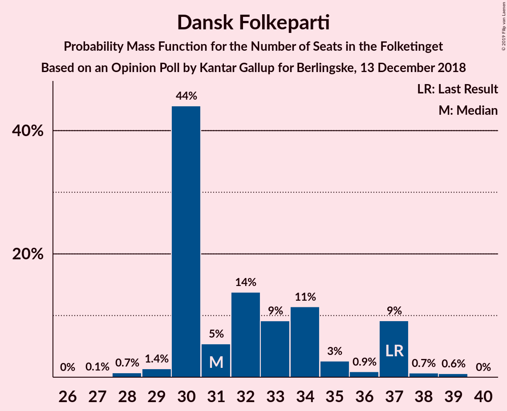
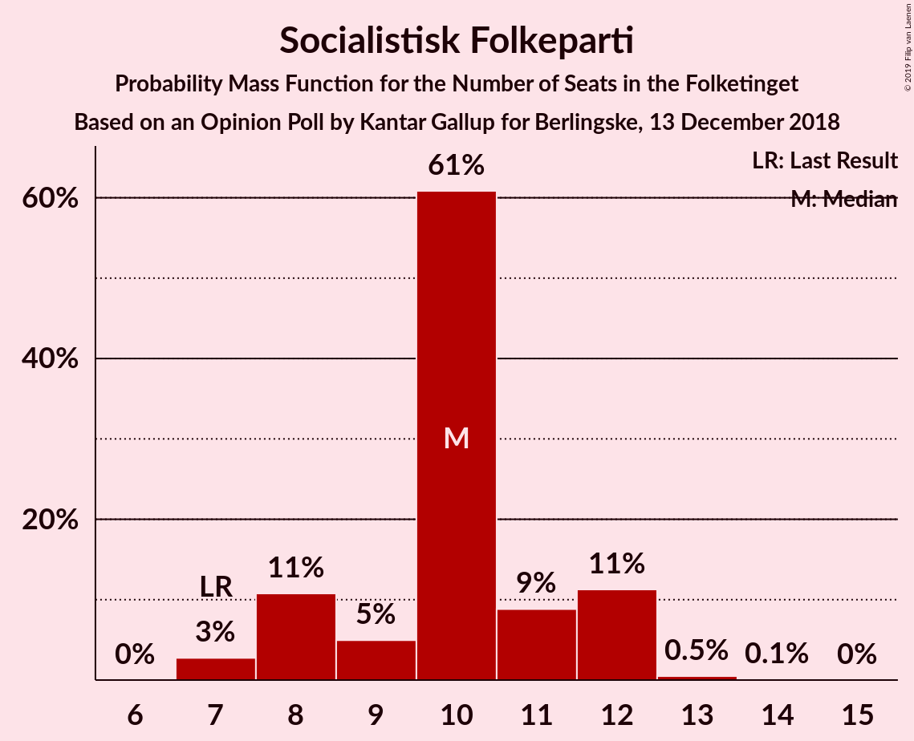
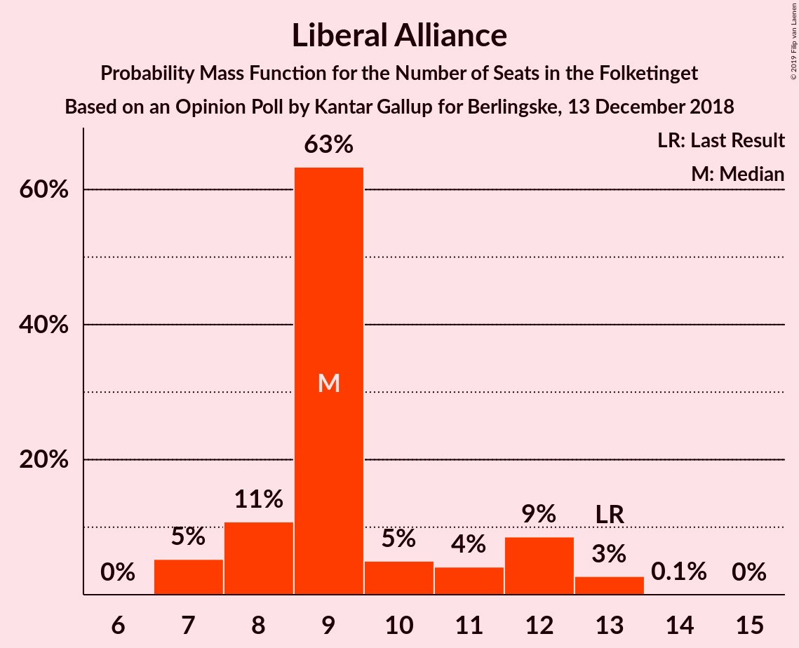
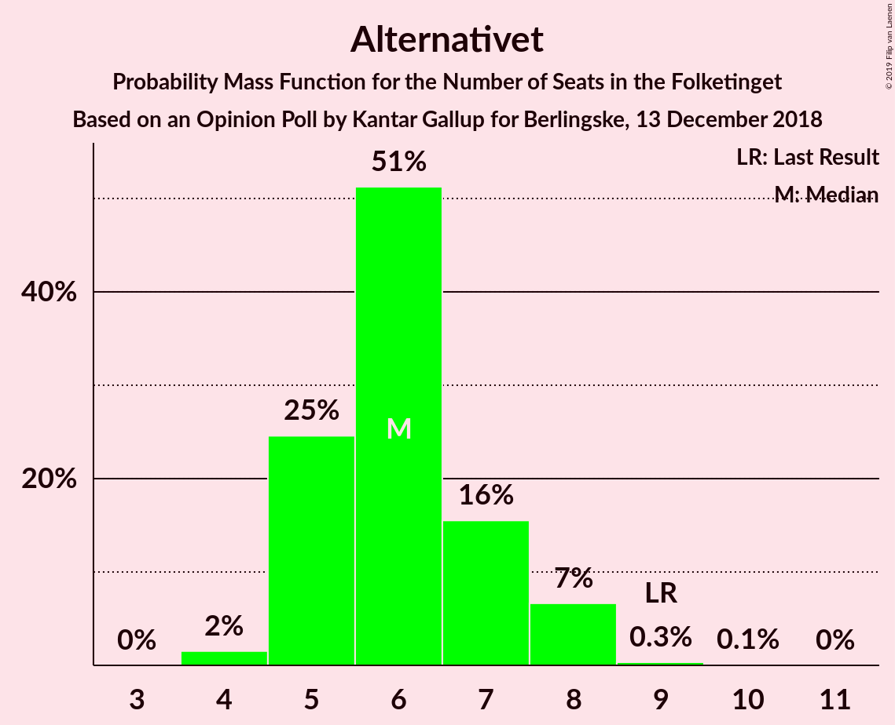
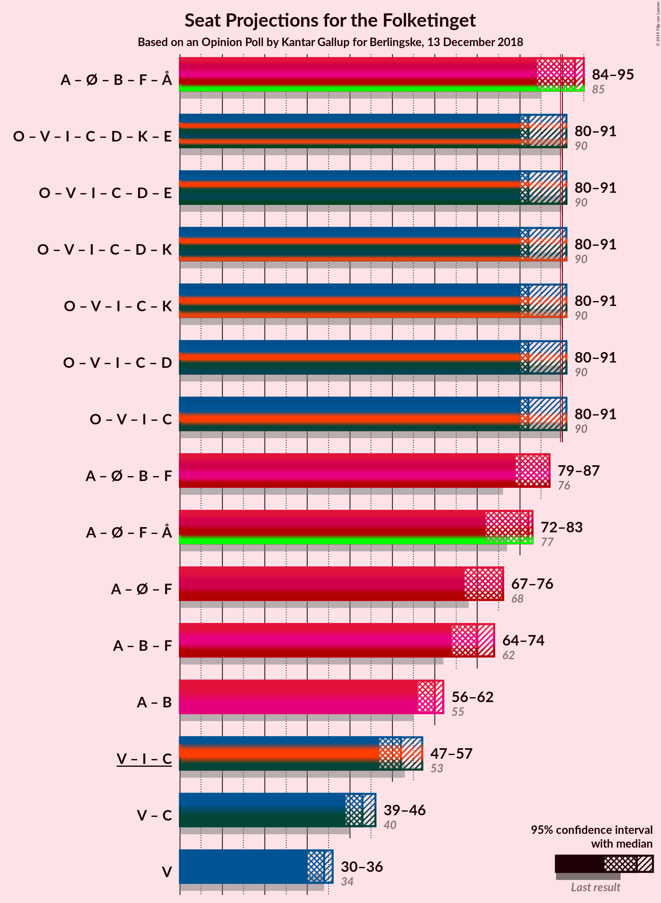
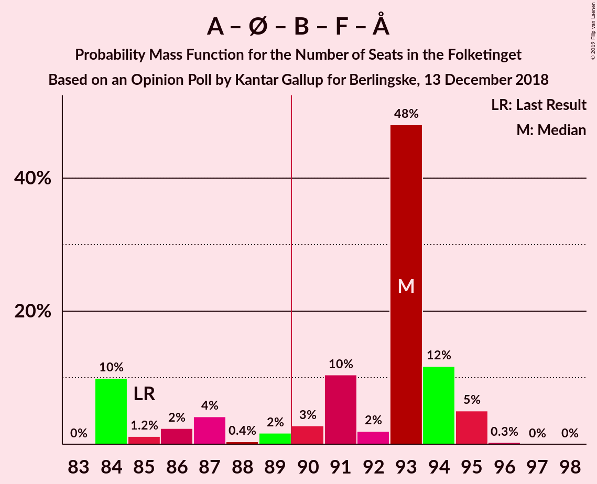
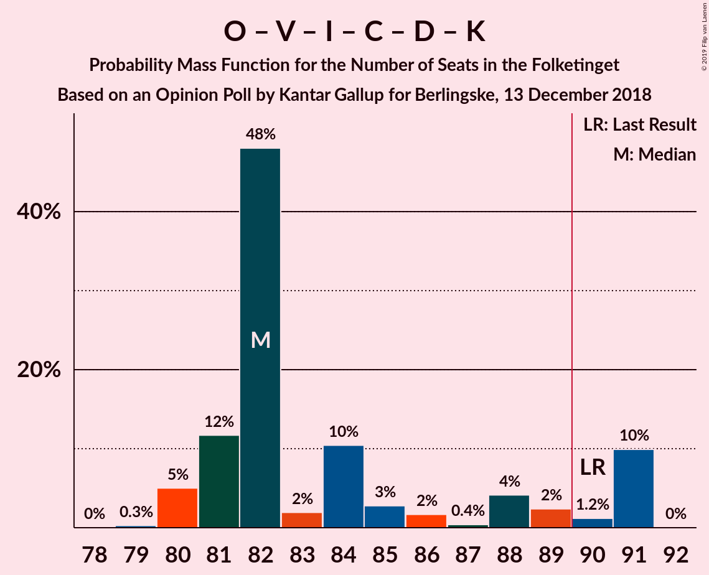
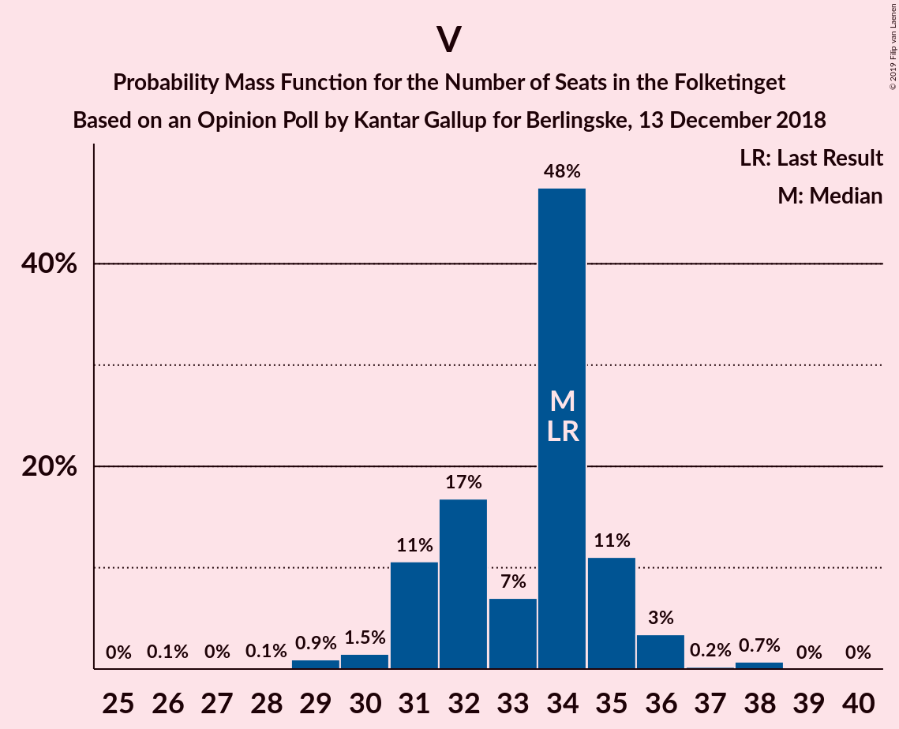

# Opinion Poll by Kantar Gallup for Berlingske, 13 December 2018

<a href="#voting-intentions">Voting Intentions</a> | <a href="#seats">Seats</a> | <a href="#coalitions">Coalitions</a> | <a href="#technical-information">Technical Information</a>

## Voting Intentions

### Confidence Intervals

| Party | Last Result | Poll Result | 80% Confidence Interval | 90% Confidence Interval | 95% Confidence Interval | 99% Confidence Interval |
|:-----:|:-----------:|:-----------:|:-----------------------:|:-----------------------:|:-----------------------:|:-----------------------:|
| Socialdemokraterne | 26.3% | 26.4% | 25.0–27.8% |24.6–28.2% |24.3–28.6% |23.6–29.3% |
| Dansk Folkeparti | 21.1% | 18.3% | 17.1–19.6% |16.8–20.0% |16.5–20.3% |15.9–20.9% |
| Venstre | 19.5% | 18.3% | 17.1–19.6% |16.8–20.0% |16.5–20.3% |15.9–20.9% |
| Enhedslisten–De Rød-Grønne | 7.8% | 8.4% | 7.6–9.4% |7.3–9.6% |7.1–9.9% |6.8–10.4% |
| Radikale Venstre | 4.6% | 6.7% | 5.9–7.5% |5.7–7.8% |5.5–8.0% |5.2–8.4% |
| Socialistisk Folkeparti | 4.2% | 5.6% | 4.9–6.4% |4.7–6.6% |4.6–6.9% |4.3–7.3% |
| Liberal Alliance | 7.5% | 5.4% | 4.8–6.2% |4.6–6.4% |4.4–6.6% |4.1–7.1% |
| Det Konservative Folkeparti | 3.4% | 4.9% | 4.3–5.7% |4.1–5.9% |4.0–6.1% |3.7–6.5% |
| Alternativet | 4.8% | 3.3% | 2.8–4.0% |2.7–4.1% |2.5–4.3% |2.3–4.6% |
| Nye Borgerlige | 0.0% | 1.4% | 1.1–1.8% |1.0–2.0% |0.9–2.1% |0.8–2.3% |
| Kristendemokraterne | 0.8% | 0.7% | 0.5–1.0% |0.4–1.1% |0.4–1.2% |0.3–1.4% |

*Note:* The poll result column reflects the actual value used in the calculations. Published results may vary slightly, and in addition be rounded to fewer digits.

## Seats

### Confidence Intervals

| Party | Last Result | Median | 80% Confidence Interval | 90% Confidence Interval | 95% Confidence Interval | 99% Confidence Interval |
|:-----:|:-----------:|:------:|:-----------------------:|:-----------------------:|:-----------------------:|:-----------------------:|
| <a href="#socialdemokraterne">Socialdemokraterne</a> | 47 | 49 | 44–51 |44–51 |44–51 |42–51 |
| <a href="#dansk-folkeparti">Dansk Folkeparti</a> | 37 | 31 | 30–37 |30–37 |30–37 |28–39 |
| <a href="#venstre">Venstre</a> | 34 | 34 | 31–35 |31–35 |30–36 |29–38 |
| <a href="#enhedslisten–de-rød-grønne">Enhedslisten–De Rød-Grønne</a> | 14 | 16 | 13–17 |13–17 |12–17 |12–19 |
| <a href="#radikale-venstre">Radikale Venstre</a> | 8 | 11 | 11–14 |11–14 |10–14 |9–16 |
| <a href="#socialistisk-folkeparti">Socialistisk Folkeparti</a> | 7 | 10 | 8–12 |8–12 |7–12 |7–13 |
| <a href="#liberal-alliance">Liberal Alliance</a> | 13 | 9 | 8–12 |7–12 |7–13 |7–13 |
| <a href="#det-konservative-folkeparti">Det Konservative Folkeparti</a> | 6 | 9 | 8–10 |8–10 |7–11 |6–12 |
| <a href="#alternativet">Alternativet</a> | 9 | 6 | 5–7 |5–8 |5–8 |4–8 |
| <a href="#nye-borgerlige">Nye Borgerlige</a> | 0 | 0 | 0 |0 |0 |0–4 |
| <a href="#kristendemokraterne">Kristendemokraterne</a> | 0 | 0 | 0 |0 |0 |0 |

### Socialdemokraterne

*For a full overview of the results for this party, see the [Socialdemokraterne](party-socialdemokraterne.html) page.*

| Number of Seats | Probability | Accumulated | Special Marks |
|:---------------:|:-----------:|:-----------:|:-------------:|
| 41 | 0.2% | 100% |  |
| 42 | 0.6% | 99.8% |  |
| 43 | 0.8% | 99.2% |  |
| 44 | 9% | 98% |  |
| 45 | 2% | 89% |  |
| 46 | 7% | 87% |  |
| 47 | 6% | 81% | Last Result |
| 48 | 14% | 75% |  |
| 49 | 49% | 61% | Median |
| 50 | 0.9% | 12% |  |
| 51 | 11% | 11% |  |
| 52 | 0.1% | 0.3% |  |
| 53 | 0.1% | 0.2% |  |
| 54 | 0% | 0% |  |

### Dansk Folkeparti

*For a full overview of the results for this party, see the [Dansk Folkeparti](party-danskfolkeparti.html) page.*

| Number of Seats | Probability | Accumulated | Special Marks |
|:---------------:|:-----------:|:-----------:|:-------------:|
| 27 | 0.1% | 100% |  |
| 28 | 0.7% | 99.9% |  |
| 29 | 1.4% | 99.2% |  |
| 30 | 44% | 98% |  |
| 31 | 5% | 54% | Median |
| 32 | 14% | 48% |  |
| 33 | 9% | 35% |  |
| 34 | 11% | 25% |  |
| 35 | 3% | 14% |  |
| 36 | 0.9% | 11% |  |
| 37 | 9% | 10% | Last Result |
| 38 | 0.7% | 1.3% |  |
| 39 | 0.6% | 0.6% |  |
| 40 | 0% | 0% |  |

### Venstre

*For a full overview of the results for this party, see the [Venstre](party-venstre.html) page.*

| Number of Seats | Probability | Accumulated | Special Marks |
|:---------------:|:-----------:|:-----------:|:-------------:|
| 26 | 0.1% | 100% |  |
| 27 | 0% | 99.9% |  |
| 28 | 0.1% | 99.9% |  |
| 29 | 0.9% | 99.8% |  |
| 30 | 1.5% | 98.8% |  |
| 31 | 11% | 97% |  |
| 32 | 17% | 87% |  |
| 33 | 7% | 70% |  |
| 34 | 48% | 63% | Last Result, Median |
| 35 | 11% | 15% |  |
| 36 | 3% | 4% |  |
| 37 | 0.2% | 1.0% |  |
| 38 | 0.7% | 0.8% |  |
| 39 | 0% | 0.1% |  |
| 40 | 0% | 0% |  |

### Enhedslisten–De Rød-Grønne

*For a full overview of the results for this party, see the [Enhedslisten–De Rød-Grønne](party-enhedslisten–derød-grønne.html) page.*

| Number of Seats | Probability | Accumulated | Special Marks |
|:---------------:|:-----------:|:-----------:|:-------------:|
| 11 | 0.3% | 100% |  |
| 12 | 2% | 99.7% |  |
| 13 | 12% | 97% |  |
| 14 | 12% | 85% | Last Result |
| 15 | 21% | 73% |  |
| 16 | 5% | 52% | Median |
| 17 | 45% | 47% |  |
| 18 | 0.8% | 2% |  |
| 19 | 1.1% | 1.2% |  |
| 20 | 0.1% | 0.1% |  |
| 21 | 0% | 0% |  |

### Radikale Venstre

*For a full overview of the results for this party, see the [Radikale Venstre](party-radikalevenstre.html) page.*

| Number of Seats | Probability | Accumulated | Special Marks |
|:---------------:|:-----------:|:-----------:|:-------------:|
| 8 | 0.1% | 100% | Last Result |
| 9 | 0.8% | 99.9% |  |
| 10 | 3% | 99.1% |  |
| 11 | 59% | 96% | Median |
| 12 | 13% | 37% |  |
| 13 | 13% | 24% |  |
| 14 | 9% | 11% |  |
| 15 | 0.9% | 2% |  |
| 16 | 0.9% | 1.0% |  |
| 17 | 0.1% | 0.2% |  |
| 18 | 0% | 0% |  |

### Socialistisk Folkeparti

*For a full overview of the results for this party, see the [Socialistisk Folkeparti](party-socialistiskfolkeparti.html) page.*

| Number of Seats | Probability | Accumulated | Special Marks |
|:---------------:|:-----------:|:-----------:|:-------------:|
| 7 | 3% | 100% | Last Result |
| 8 | 11% | 97% |  |
| 9 | 5% | 86% |  |
| 10 | 61% | 82% | Median |
| 11 | 9% | 21% |  |
| 12 | 11% | 12% |  |
| 13 | 0.5% | 0.5% |  |
| 14 | 0.1% | 0.1% |  |
| 15 | 0% | 0% |  |

### Liberal Alliance

*For a full overview of the results for this party, see the [Liberal Alliance](party-liberalalliance.html) page.*

| Number of Seats | Probability | Accumulated | Special Marks |
|:---------------:|:-----------:|:-----------:|:-------------:|
| 7 | 5% | 100% |  |
| 8 | 11% | 95% |  |
| 9 | 63% | 84% | Median |
| 10 | 5% | 21% |  |
| 11 | 4% | 16% |  |
| 12 | 9% | 11% |  |
| 13 | 3% | 3% | Last Result |
| 14 | 0.1% | 0.1% |  |
| 15 | 0% | 0% |  |

### Det Konservative Folkeparti

*For a full overview of the results for this party, see the [Det Konservative Folkeparti](party-detkonservativefolkeparti.html) page.*

| Number of Seats | Probability | Accumulated | Special Marks |
|:---------------:|:-----------:|:-----------:|:-------------:|
| 6 | 2% | 100% | Last Result |
| 7 | 3% | 98% |  |
| 8 | 25% | 96% |  |
| 9 | 53% | 70% | Median |
| 10 | 14% | 18% |  |
| 11 | 2% | 4% |  |
| 12 | 2% | 2% |  |
| 13 | 0.2% | 0.2% |  |
| 14 | 0% | 0% |  |

### Alternativet

*For a full overview of the results for this party, see the [Alternativet](party-alternativet.html) page.*

| Number of Seats | Probability | Accumulated | Special Marks |
|:---------------:|:-----------:|:-----------:|:-------------:|
| 4 | 2% | 100% |  |
| 5 | 25% | 98% |  |
| 6 | 51% | 74% | Median |
| 7 | 16% | 23% |  |
| 8 | 7% | 7% |  |
| 9 | 0.3% | 0.4% | Last Result |
| 10 | 0.1% | 0.1% |  |
| 11 | 0% | 0% |  |

### Nye Borgerlige

*For a full overview of the results for this party, see the [Nye Borgerlige](party-nyeborgerlige.html) page.*

| Number of Seats | Probability | Accumulated | Special Marks |
|:---------------:|:-----------:|:-----------:|:-------------:|
| 0 | 98% | 100% | Last Result, Median |
| 1 | 0% | 2% |  |
| 2 | 0% | 2% |  |
| 3 | 0% | 2% |  |
| 4 | 2% | 2% |  |
| 5 | 0.2% | 0.2% |  |
| 6 | 0% | 0% |  |

### Kristendemokraterne

*For a full overview of the results for this party, see the [Kristendemokraterne](party-kristendemokraterne.html) page.*

| Number of Seats | Probability | Accumulated | Special Marks |
|:---------------:|:-----------:|:-----------:|:-------------:|
| 0 | 100% | 100% | Last Result, Median |

## Coalitions

### Confidence Intervals

| Coalition | Last Result | Median | Majority? | 80% Confidence Interval | 90% Confidence Interval | 95% Confidence Interval | 99% Confidence Interval |
|:---------:|:-----------:|:------:|:---------:|:-----------------------:|:-----------------------:|:-----------------------:|:-----------------------:|
| Socialdemokraterne – Enhedslisten–De Rød-Grønne – Radikale Venstre – Socialistisk Folkeparti – Alternativet | 85 | 93 | 80% | 85–94 | 84–95 | 84–95 | 84–95 |
| Dansk Folkeparti – Venstre – Liberal Alliance – Det Konservative Folkeparti – Nye Borgerlige – Kristendemokraterne | 90 | 82 | 11% | 81–90 | 80–91 | 80–91 | 80–91 |
| Dansk Folkeparti – Venstre – Liberal Alliance – Det Konservative Folkeparti – Kristendemokraterne | 90 | 82 | 11% | 81–90 | 80–91 | 80–91 | 80–91 |
| Dansk Folkeparti – Venstre – Liberal Alliance – Det Konservative Folkeparti – Nye Borgerlige | 90 | 82 | 11% | 81–90 | 80–91 | 80–91 | 80–91 |
| Dansk Folkeparti – Venstre – Liberal Alliance – Det Konservative Folkeparti | 90 | 82 | 11% | 81–90 | 80–91 | 80–91 | 80–91 |
| Socialdemokraterne – Enhedslisten–De Rød-Grønne – Radikale Venstre – Socialistisk Folkeparti | 76 | 87 | 0.1% | 79–87 | 79–87 | 79–87 | 79–89 |
| Socialdemokraterne – Enhedslisten–De Rød-Grønne – Socialistisk Folkeparti – Alternativet | 77 | 82 | 0% | 73–83 | 72–83 | 72–83 | 72–83 |
| Socialdemokraterne – Enhedslisten–De Rød-Grønne – Socialistisk Folkeparti | 68 | 76 | 0% | 68–76 | 67–76 | 67–76 | 66–77 |
| Socialdemokraterne – Radikale Venstre – Socialistisk Folkeparti | 62 | 70 | 0% | 64–74 | 64–74 | 64–74 | 64–76 |
| Socialdemokraterne – Radikale Venstre | 55 | 60 | 0% | 56–62 | 56–62 | 56–62 | 54–65 |
| Venstre – Liberal Alliance – Det Konservative Folkeparti | 53 | 52 | 0% | 48–57 | 47–57 | 47–57 | 47–58 |
| Venstre – Det Konservative Folkeparti | 40 | 43 | 0% | 39–45 | 39–45 | 39–46 | 37–46 |
| Venstre | 34 | 34 | 0% | 31–35 | 31–35 | 30–36 | 29–38 |

### Socialdemokraterne – Enhedslisten–De Rød-Grønne – Radikale Venstre – Socialistisk Folkeparti – Alternativet

| Number of Seats | Probability | Accumulated | Special Marks |
|:---------------:|:-----------:|:-----------:|:-------------:|
| 84 | 10% | 100% |  |
| 85 | 1.2% | 90% | Last Result |
| 86 | 2% | 89% |  |
| 87 | 4% | 86% |  |
| 88 | 0.4% | 82% |  |
| 89 | 2% | 82% |  |
| 90 | 3% | 80% | Majority |
| 91 | 10% | 77% |  |
| 92 | 2% | 67% | Median |
| 93 | 48% | 65% |  |
| 94 | 12% | 17% |  |
| 95 | 5% | 5% |  |
| 96 | 0.3% | 0.3% |  |
| 97 | 0% | 0.1% |  |
| 98 | 0% | 0% |  |

### Dansk Folkeparti – Venstre – Liberal Alliance – Det Konservative Folkeparti – Nye Borgerlige – Kristendemokraterne

| Number of Seats | Probability | Accumulated | Special Marks |
|:---------------:|:-----------:|:-----------:|:-------------:|
| 78 | 0% | 100% |  |
| 79 | 0.3% | 99.9% |  |
| 80 | 5% | 99.7% |  |
| 81 | 12% | 95% |  |
| 82 | 48% | 83% |  |
| 83 | 2% | 35% | Median |
| 84 | 10% | 33% |  |
| 85 | 3% | 23% |  |
| 86 | 2% | 20% |  |
| 87 | 0.4% | 18% |  |
| 88 | 4% | 18% |  |
| 89 | 2% | 14% |  |
| 90 | 1.2% | 11% | Last Result, Majority |
| 91 | 10% | 10% |  |
| 92 | 0% | 0% |  |

### Dansk Folkeparti – Venstre – Liberal Alliance – Det Konservative Folkeparti – Kristendemokraterne

| Number of Seats | Probability | Accumulated | Special Marks |
|:---------------:|:-----------:|:-----------:|:-------------:|
| 77 | 0% | 100% |  |
| 78 | 0.1% | 99.9% |  |
| 79 | 0.3% | 99.9% |  |
| 80 | 5% | 99.6% |  |
| 81 | 12% | 94% |  |
| 82 | 48% | 82% |  |
| 83 | 2% | 34% | Median |
| 84 | 11% | 32% |  |
| 85 | 3% | 21% |  |
| 86 | 2% | 19% |  |
| 87 | 0.3% | 17% |  |
| 88 | 4% | 17% |  |
| 89 | 2% | 13% |  |
| 90 | 1.2% | 11% | Last Result, Majority |
| 91 | 10% | 10% |  |
| 92 | 0% | 0% |  |

### Dansk Folkeparti – Venstre – Liberal Alliance – Det Konservative Folkeparti – Nye Borgerlige

| Number of Seats | Probability | Accumulated | Special Marks |
|:---------------:|:-----------:|:-----------:|:-------------:|
| 78 | 0% | 100% |  |
| 79 | 0.3% | 99.9% |  |
| 80 | 5% | 99.7% |  |
| 81 | 12% | 95% |  |
| 82 | 48% | 83% |  |
| 83 | 2% | 35% | Median |
| 84 | 10% | 33% |  |
| 85 | 3% | 23% |  |
| 86 | 2% | 20% |  |
| 87 | 0.4% | 18% |  |
| 88 | 4% | 18% |  |
| 89 | 2% | 14% |  |
| 90 | 1.2% | 11% | Last Result, Majority |
| 91 | 10% | 10% |  |
| 92 | 0% | 0% |  |

### Dansk Folkeparti – Venstre – Liberal Alliance – Det Konservative Folkeparti

| Number of Seats | Probability | Accumulated | Special Marks |
|:---------------:|:-----------:|:-----------:|:-------------:|
| 77 | 0% | 100% |  |
| 78 | 0.1% | 99.9% |  |
| 79 | 0.3% | 99.9% |  |
| 80 | 5% | 99.6% |  |
| 81 | 12% | 94% |  |
| 82 | 48% | 82% |  |
| 83 | 2% | 34% | Median |
| 84 | 11% | 32% |  |
| 85 | 3% | 21% |  |
| 86 | 2% | 19% |  |
| 87 | 0.3% | 17% |  |
| 88 | 4% | 17% |  |
| 89 | 2% | 13% |  |
| 90 | 1.2% | 11% | Last Result, Majority |
| 91 | 10% | 10% |  |
| 92 | 0% | 0% |  |

### Socialdemokraterne – Enhedslisten–De Rød-Grønne – Radikale Venstre – Socialistisk Folkeparti

| Number of Seats | Probability | Accumulated | Special Marks |
|:---------------:|:-----------:|:-----------:|:-------------:|
| 76 | 0% | 100% | Last Result |
| 77 | 0% | 100% |  |
| 78 | 0.2% | 100% |  |
| 79 | 10% | 99.7% |  |
| 80 | 4% | 89% |  |
| 81 | 3% | 85% |  |
| 82 | 1.0% | 82% |  |
| 83 | 1.1% | 81% |  |
| 84 | 2% | 80% |  |
| 85 | 3% | 79% |  |
| 86 | 10% | 75% | Median |
| 87 | 63% | 65% |  |
| 88 | 1.1% | 2% |  |
| 89 | 0.9% | 1.1% |  |
| 90 | 0.1% | 0.1% | Majority |
| 91 | 0% | 0% |  |

### Socialdemokraterne – Enhedslisten–De Rød-Grønne – Socialistisk Folkeparti – Alternativet

| Number of Seats | Probability | Accumulated | Special Marks |
|:---------------:|:-----------:|:-----------:|:-------------:|
| 70 | 0% | 100% |  |
| 71 | 0.1% | 99.9% |  |
| 72 | 9% | 99.9% |  |
| 73 | 3% | 91% |  |
| 74 | 2% | 89% |  |
| 75 | 0.8% | 87% |  |
| 76 | 4% | 86% |  |
| 77 | 9% | 82% | Last Result |
| 78 | 5% | 73% |  |
| 79 | 1.3% | 68% |  |
| 80 | 6% | 66% |  |
| 81 | 2% | 61% | Median |
| 82 | 48% | 58% |  |
| 83 | 10% | 11% |  |
| 84 | 0.3% | 0.4% |  |
| 85 | 0.1% | 0.1% |  |
| 86 | 0% | 0% |  |

### Socialdemokraterne – Enhedslisten–De Rød-Grønne – Socialistisk Folkeparti

| Number of Seats | Probability | Accumulated | Special Marks |
|:---------------:|:-----------:|:-----------:|:-------------:|
| 65 | 0.2% | 100% |  |
| 66 | 0.7% | 99.8% |  |
| 67 | 8% | 99.1% |  |
| 68 | 3% | 91% | Last Result |
| 69 | 5% | 88% |  |
| 70 | 0.5% | 83% |  |
| 71 | 1.1% | 82% |  |
| 72 | 10% | 81% |  |
| 73 | 5% | 71% |  |
| 74 | 11% | 66% |  |
| 75 | 1.5% | 55% | Median |
| 76 | 53% | 54% |  |
| 77 | 0.6% | 0.7% |  |
| 78 | 0% | 0.1% |  |
| 79 | 0% | 0% |  |

### Socialdemokraterne – Radikale Venstre – Socialistisk Folkeparti

| Number of Seats | Probability | Accumulated | Special Marks |
|:---------------:|:-----------:|:-----------:|:-------------:|
| 62 | 0.1% | 100% | Last Result |
| 63 | 0.1% | 99.9% |  |
| 64 | 12% | 99.8% |  |
| 65 | 3% | 88% |  |
| 66 | 2% | 85% |  |
| 67 | 2% | 83% |  |
| 68 | 2% | 81% |  |
| 69 | 3% | 79% |  |
| 70 | 43% | 77% | Median |
| 71 | 3% | 34% |  |
| 72 | 18% | 30% |  |
| 73 | 1.0% | 13% |  |
| 74 | 11% | 12% |  |
| 75 | 0.1% | 0.7% |  |
| 76 | 0.5% | 0.5% |  |
| 77 | 0% | 0% |  |

### Socialdemokraterne – Radikale Venstre

| Number of Seats | Probability | Accumulated | Special Marks |
|:---------------:|:-----------:|:-----------:|:-------------:|
| 52 | 0.1% | 100% |  |
| 53 | 0.1% | 99.9% |  |
| 54 | 0.6% | 99.8% |  |
| 55 | 1.2% | 99.2% | Last Result |
| 56 | 9% | 98% |  |
| 57 | 7% | 88% |  |
| 58 | 3% | 82% |  |
| 59 | 1.5% | 79% |  |
| 60 | 44% | 77% | Median |
| 61 | 8% | 33% |  |
| 62 | 22% | 25% |  |
| 63 | 1.0% | 2% |  |
| 64 | 0.8% | 1.4% |  |
| 65 | 0.5% | 0.6% |  |
| 66 | 0.1% | 0.1% |  |
| 67 | 0% | 0% |  |

### Venstre – Liberal Alliance – Det Konservative Folkeparti

| Number of Seats | Probability | Accumulated | Special Marks |
|:---------------:|:-----------:|:-----------:|:-------------:|
| 45 | 0.1% | 100% |  |
| 46 | 0.2% | 99.9% |  |
| 47 | 9% | 99.7% |  |
| 48 | 2% | 90% |  |
| 49 | 20% | 89% |  |
| 50 | 1.5% | 69% |  |
| 51 | 3% | 68% |  |
| 52 | 46% | 65% | Median |
| 53 | 3% | 19% | Last Result |
| 54 | 0.9% | 16% |  |
| 55 | 4% | 15% |  |
| 56 | 0.5% | 11% |  |
| 57 | 10% | 11% |  |
| 58 | 0.5% | 0.6% |  |
| 59 | 0.1% | 0.1% |  |
| 60 | 0% | 0% |  |

### Venstre – Det Konservative Folkeparti

| Number of Seats | Probability | Accumulated | Special Marks |
|:---------------:|:-----------:|:-----------:|:-------------:|
| 35 | 0.1% | 100% |  |
| 36 | 0.1% | 99.9% |  |
| 37 | 0.6% | 99.8% |  |
| 38 | 1.4% | 99.3% |  |
| 39 | 8% | 98% |  |
| 40 | 18% | 89% | Last Result |
| 41 | 2% | 72% |  |
| 42 | 8% | 69% |  |
| 43 | 45% | 62% | Median |
| 44 | 3% | 16% |  |
| 45 | 10% | 14% |  |
| 46 | 4% | 4% |  |
| 47 | 0.2% | 0.4% |  |
| 48 | 0% | 0.3% |  |
| 49 | 0.2% | 0.2% |  |
| 50 | 0% | 0% |  |

### Venstre

| Number of Seats | Probability | Accumulated | Special Marks |
|:---------------:|:-----------:|:-----------:|:-------------:|
| 26 | 0.1% | 100% |  |
| 27 | 0% | 99.9% |  |
| 28 | 0.1% | 99.9% |  |
| 29 | 0.9% | 99.8% |  |
| 30 | 1.5% | 98.8% |  |
| 31 | 11% | 97% |  |
| 32 | 17% | 87% |  |
| 33 | 7% | 70% |  |
| 34 | 48% | 63% | Last Result, Median |
| 35 | 11% | 15% |  |
| 36 | 3% | 4% |  |
| 37 | 0.2% | 1.0% |  |
| 38 | 0.7% | 0.8% |  |
| 39 | 0% | 0.1% |  |
| 40 | 0% | 0% |  |

## Technical Information

### Opinion Poll

+ **Polling firm:** Kantar Gallup
+ **Commissioner(s):** Berlingske
+ **Fieldwork period:** 13 December 2018

### Calculations

+ **Sample size:** 1604
+ **Simulations done:** 131,072
+ **Error estimate:** 2.99%

