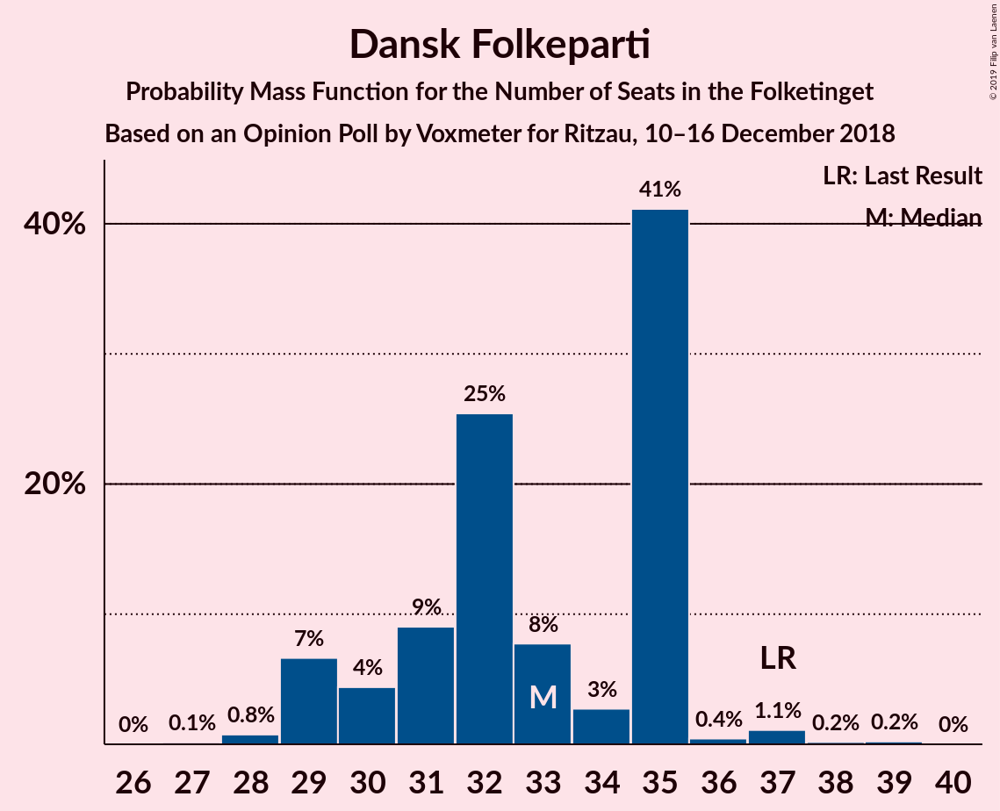
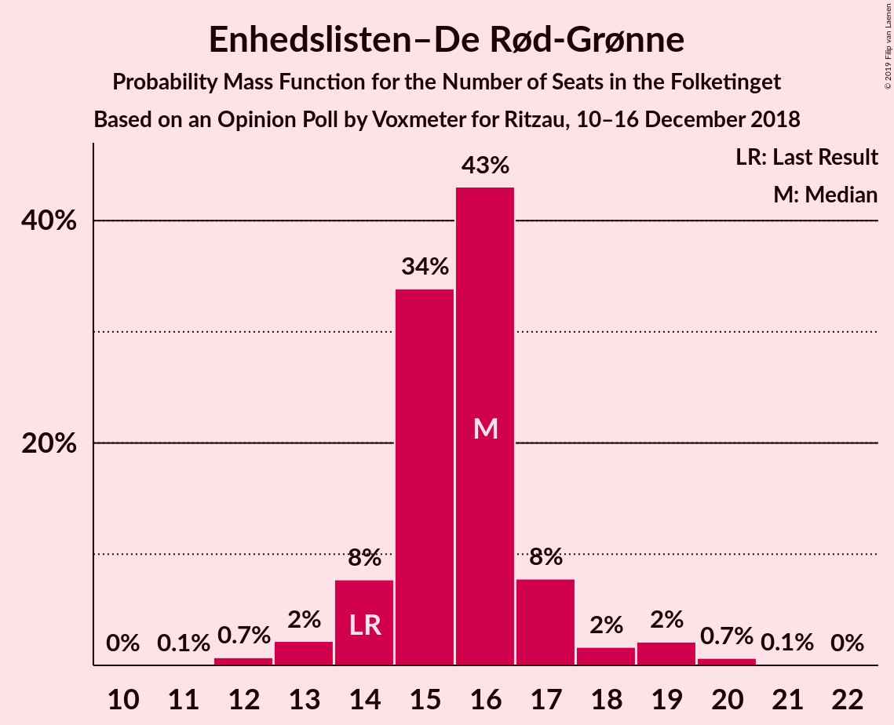

# Opinion Poll by Voxmeter for Ritzau, 10–16 December 2018

<a href="#voting-intentions">Voting Intentions</a> | <a href="#seats">Seats</a> | <a href="#coalitions">Coalitions</a> | <a href="#technical-information">Technical Information</a>

## Voting Intentions

### Confidence Intervals

| Party | Last Result | Poll Result | 80% Confidence Interval | 90% Confidence Interval | 95% Confidence Interval | 99% Confidence Interval |
|:-----:|:-----------:|:-----------:|:-----------------------:|:-----------------------:|:-----------------------:|:-----------------------:|
| Socialdemokraterne | 26.3% | 26.3% | 24.6–28.1% |24.1–28.7% |23.7–29.1% |22.9–30.0% |
| Venstre | 19.5% | 18.6% | 17.1–20.3% |16.7–20.7% |16.4–21.1% |15.7–21.9% |
| Dansk Folkeparti | 21.1% | 18.4% | 16.9–20.1% |16.5–20.5% |16.2–20.9% |15.5–21.7% |
| Enhedslisten–De Rød-Grønne | 7.8% | 8.8% | 7.7–10.0% |7.4–10.4% |7.2–10.7% |6.7–11.3% |
| Radikale Venstre | 4.6% | 7.1% | 6.2–8.3% |5.9–8.6% |5.7–8.9% |5.3–9.4% |
| Liberal Alliance | 7.5% | 5.4% | 4.6–6.4% |4.3–6.7% |4.1–6.9% |3.8–7.4% |
| Socialistisk Folkeparti | 4.2% | 5.1% | 4.3–6.1% |4.1–6.3% |3.9–6.6% |3.5–7.1% |
| Alternativet | 4.8% | 3.8% | 3.1–4.7% |2.9–4.9% |2.8–5.2% |2.5–5.6% |
| Det Konservative Folkeparti | 3.4% | 3.6% | 3.0–4.5% |2.8–4.7% |2.6–4.9% |2.3–5.4% |
| Nye Borgerlige | 0.0% | 1.6% | 1.2–2.2% |1.1–2.4% |1.0–2.5% |0.8–2.9% |
| Kristendemokraterne | 0.8% | 1.0% | 0.7–1.5% |0.6–1.6% |0.5–1.8% |0.4–2.1% |

*Note:* The poll result column reflects the actual value used in the calculations. Published results may vary slightly, and in addition be rounded to fewer digits.

## Seats

### Confidence Intervals

| Party | Last Result | Median | 80% Confidence Interval | 90% Confidence Interval | 95% Confidence Interval | 99% Confidence Interval |
|:-----:|:-----------:|:------:|:-----------------------:|:-----------------------:|:-----------------------:|:-----------------------:|
| <a href="#socialdemokraterne">Socialdemokraterne</a> | 47 | 47 | 43–47 |43–48 |43–51 |40–53 |
| <a href="#venstre">Venstre</a> | 34 | 34 | 32–34 |32–35 |32–36 |30–37 |
| <a href="#dansk-folkeparti">Dansk Folkeparti</a> | 37 | 35 | 31–35 |30–35 |30–35 |28–37 |
| <a href="#enhedslisten–de-rød-grønne">Enhedslisten–De Rød-Grønne</a> | 14 | 16 | 15–17 |15–18 |13–19 |12–19 |
| <a href="#radikale-venstre">Radikale Venstre</a> | 8 | 13 | 13–14 |12–14 |11–14 |10–16 |
| <a href="#liberal-alliance">Liberal Alliance</a> | 13 | 9 | 9–10 |9–10 |8–11 |7–12 |
| <a href="#socialistisk-folkeparti">Socialistisk Folkeparti</a> | 7 | 8 | 8–12 |8–12 |8–12 |7–12 |
| <a href="#alternativet">Alternativet</a> | 9 | 6 | 6–8 |6–8 |5–9 |5–9 |
| <a href="#det-konservative-folkeparti">Det Konservative Folkeparti</a> | 6 | 7 | 6–7 |6–7 |6–8 |5–9 |
| <a href="#nye-borgerlige">Nye Borgerlige</a> | 0 | 0 | 0–4 |0–4 |0–4 |0–4 |
| <a href="#kristendemokraterne">Kristendemokraterne</a> | 0 | 0 | 0 |0 |0 |0 |

### Socialdemokraterne

*For a full overview of the results for this party, see the [Socialdemokraterne](party-socialdemokraterne.html) page.*

| Number of Seats | Probability | Accumulated | Special Marks |
|:---------------:|:-----------:|:-----------:|:-------------:|
| 40 | 0.9% | 100% |  |
| 41 | 0.2% | 99.0% |  |
| 42 | 0.2% | 98.8% |  |
| 43 | 10% | 98.7% |  |
| 44 | 1.0% | 89% |  |
| 45 | 2% | 88% |  |
| 46 | 3% | 86% |  |
| 47 | 75% | 83% | Last Result, Median |
| 48 | 3% | 7% |  |
| 49 | 0.8% | 4% |  |
| 50 | 0.6% | 3% |  |
| 51 | 0.4% | 3% |  |
| 52 | 1.2% | 2% |  |
| 53 | 0.7% | 1.0% |  |
| 54 | 0.3% | 0.3% |  |
| 55 | 0% | 0% |  |

### Venstre

*For a full overview of the results for this party, see the [Venstre](party-venstre.html) page.*

| Number of Seats | Probability | Accumulated | Special Marks |
|:---------------:|:-----------:|:-----------:|:-------------:|
| 27 | 0% | 100% |  |
| 28 | 0.1% | 99.9% |  |
| 29 | 0.2% | 99.9% |  |
| 30 | 0.5% | 99.7% |  |
| 31 | 1.1% | 99.2% |  |
| 32 | 11% | 98% |  |
| 33 | 16% | 87% |  |
| 34 | 65% | 72% | Last Result, Median |
| 35 | 2% | 6% |  |
| 36 | 2% | 4% |  |
| 37 | 2% | 2% |  |
| 38 | 0.2% | 0.2% |  |
| 39 | 0% | 0% |  |

### Dansk Folkeparti

*For a full overview of the results for this party, see the [Dansk Folkeparti](party-danskfolkeparti.html) page.*

| Number of Seats | Probability | Accumulated | Special Marks |
|:---------------:|:-----------:|:-----------:|:-------------:|
| 27 | 0.1% | 100% |  |
| 28 | 0.5% | 99.9% |  |
| 29 | 1.4% | 99.4% |  |
| 30 | 5% | 98% |  |
| 31 | 13% | 93% |  |
| 32 | 0.8% | 80% |  |
| 33 | 11% | 79% |  |
| 34 | 3% | 68% |  |
| 35 | 64% | 65% | Median |
| 36 | 0.3% | 1.5% |  |
| 37 | 1.1% | 1.2% | Last Result |
| 38 | 0.1% | 0.1% |  |
| 39 | 0% | 0% |  |

### Enhedslisten–De Rød-Grønne

*For a full overview of the results for this party, see the [Enhedslisten–De Rød-Grønne](party-enhedslisten–derød-grønne.html) page.*

| Number of Seats | Probability | Accumulated | Special Marks |
|:---------------:|:-----------:|:-----------:|:-------------:|
| 12 | 0.9% | 100% |  |
| 13 | 2% | 99.0% |  |
| 14 | 0.8% | 97% | Last Result |
| 15 | 15% | 97% |  |
| 16 | 66% | 82% | Median |
| 17 | 11% | 16% |  |
| 18 | 2% | 5% |  |
| 19 | 3% | 3% |  |
| 20 | 0.2% | 0.4% |  |
| 21 | 0.2% | 0.2% |  |
| 22 | 0% | 0% |  |

### Radikale Venstre

*For a full overview of the results for this party, see the [Radikale Venstre](party-radikalevenstre.html) page.*

| Number of Seats | Probability | Accumulated | Special Marks |
|:---------------:|:-----------:|:-----------:|:-------------:|
| 8 | 0.2% | 100% | Last Result |
| 9 | 0.1% | 99.8% |  |
| 10 | 2% | 99.7% |  |
| 11 | 3% | 98% |  |
| 12 | 4% | 95% |  |
| 13 | 77% | 91% | Median |
| 14 | 12% | 14% |  |
| 15 | 1.1% | 2% |  |
| 16 | 0.7% | 0.9% |  |
| 17 | 0.2% | 0.2% |  |
| 18 | 0% | 0% |  |

### Liberal Alliance

*For a full overview of the results for this party, see the [Liberal Alliance](party-liberalalliance.html) page.*

| Number of Seats | Probability | Accumulated | Special Marks |
|:---------------:|:-----------:|:-----------:|:-------------:|
| 6 | 0.1% | 100% |  |
| 7 | 0.5% | 99.9% |  |
| 8 | 3% | 99.4% |  |
| 9 | 68% | 97% | Median |
| 10 | 24% | 28% |  |
| 11 | 3% | 5% |  |
| 12 | 1.2% | 2% |  |
| 13 | 0.4% | 0.5% | Last Result |
| 14 | 0.1% | 0.1% |  |
| 15 | 0% | 0% |  |

### Socialistisk Folkeparti

*For a full overview of the results for this party, see the [Socialistisk Folkeparti](party-socialistiskfolkeparti.html) page.*

| Number of Seats | Probability | Accumulated | Special Marks |
|:---------------:|:-----------:|:-----------:|:-------------:|
| 6 | 0.3% | 100% |  |
| 7 | 2% | 99.7% | Last Result |
| 8 | 65% | 98% | Median |
| 9 | 13% | 33% |  |
| 10 | 6% | 20% |  |
| 11 | 1.5% | 14% |  |
| 12 | 13% | 13% |  |
| 13 | 0.1% | 0.1% |  |
| 14 | 0% | 0% |  |

### Alternativet

*For a full overview of the results for this party, see the [Alternativet](party-alternativet.html) page.*

| Number of Seats | Probability | Accumulated | Special Marks |
|:---------------:|:-----------:|:-----------:|:-------------:|
| 4 | 0.4% | 100% |  |
| 5 | 3% | 99.6% |  |
| 6 | 67% | 96% | Median |
| 7 | 12% | 29% |  |
| 8 | 14% | 17% |  |
| 9 | 3% | 4% | Last Result |
| 10 | 0.4% | 0.5% |  |
| 11 | 0.1% | 0.1% |  |
| 12 | 0% | 0% |  |

### Det Konservative Folkeparti

*For a full overview of the results for this party, see the [Det Konservative Folkeparti](party-detkonservativefolkeparti.html) page.*

| Number of Seats | Probability | Accumulated | Special Marks |
|:---------------:|:-----------:|:-----------:|:-------------:|
| 4 | 0.1% | 100% |  |
| 5 | 2% | 99.8% |  |
| 6 | 24% | 98% | Last Result |
| 7 | 70% | 73% | Median |
| 8 | 3% | 4% |  |
| 9 | 0.5% | 0.5% |  |
| 10 | 0% | 0.1% |  |
| 11 | 0% | 0% |  |

### Nye Borgerlige

*For a full overview of the results for this party, see the [Nye Borgerlige](party-nyeborgerlige.html) page.*

| Number of Seats | Probability | Accumulated | Special Marks |
|:---------------:|:-----------:|:-----------:|:-------------:|
| 0 | 88% | 100% | Last Result, Median |
| 1 | 0% | 12% |  |
| 2 | 0% | 12% |  |
| 3 | 0% | 12% |  |
| 4 | 12% | 12% |  |
| 5 | 0.1% | 0.1% |  |
| 6 | 0% | 0% |  |

### Kristendemokraterne

*For a full overview of the results for this party, see the [Kristendemokraterne](party-kristendemokraterne.html) page.*

| Number of Seats | Probability | Accumulated | Special Marks |
|:---------------:|:-----------:|:-----------:|:-------------:|
| 0 | 99.8% | 100% | Last Result, Median |
| 1 | 0% | 0.2% |  |
| 2 | 0% | 0.2% |  |
| 3 | 0% | 0.2% |  |
| 4 | 0.2% | 0.2% |  |
| 5 | 0% | 0% |  |

## Coalitions

### Confidence Intervals

| Coalition | Last Result | Median | Majority? | 80% Confidence Interval | 90% Confidence Interval | 95% Confidence Interval | 99% Confidence Interval |
|:---------:|:-----------:|:------:|:---------:|:-----------------------:|:-----------------------:|:-----------------------:|:-----------------------:|
| Socialdemokraterne – Enhedslisten–De Rød-Grønne – Radikale Venstre – Socialistisk Folkeparti – Alternativet | 85 | 90 | 93% | 90–95 | 88–95 | 88–96 | 85–97 |
| Socialdemokraterne – Enhedslisten–De Rød-Grønne – Radikale Venstre – Socialistisk Folkeparti | 76 | 84 | 2% | 83–87 | 83–87 | 81–89 | 80–91 |
| Venstre – Dansk Folkeparti – Liberal Alliance – Det Konservative Folkeparti – Nye Borgerlige – Kristendemokraterne | 90 | 85 | 0.7% | 80–85 | 80–87 | 79–87 | 78–90 |
| Venstre – Dansk Folkeparti – Liberal Alliance – Det Konservative Folkeparti – Kristendemokraterne | 90 | 85 | 0.6% | 80–85 | 80–85 | 79–87 | 77–90 |
| Venstre – Dansk Folkeparti – Liberal Alliance – Det Konservative Folkeparti – Nye Borgerlige | 90 | 85 | 0.6% | 80–85 | 80–87 | 79–87 | 78–90 |
| Venstre – Dansk Folkeparti – Liberal Alliance – Det Konservative Folkeparti | 90 | 85 | 0.6% | 80–85 | 80–85 | 79–87 | 77–90 |
| Socialdemokraterne – Radikale Venstre – Socialistisk Folkeparti | 62 | 68 | 0% | 66–72 | 66–72 | 65–73 | 63–75 |
| Socialdemokraterne – Radikale Venstre | 55 | 60 | 0% | 57–60 | 57–61 | 56–63 | 54–65 |
| Venstre – Liberal Alliance – Det Konservative Folkeparti | 53 | 50 | 0% | 48–50 | 48–52 | 48–53 | 45–54 |
| Venstre – Det Konservative Folkeparti | 40 | 41 | 0% | 38–41 | 38–41 | 38–43 | 37–45 |
| Venstre | 34 | 34 | 0% | 32–34 | 32–35 | 32–36 | 30–37 |

### Socialdemokraterne – Enhedslisten–De Rød-Grønne – Radikale Venstre – Socialistisk Folkeparti – Alternativet

| Number of Seats | Probability | Accumulated | Special Marks |
|:---------------:|:-----------:|:-----------:|:-------------:|
| 84 | 0% | 100% |  |
| 85 | 0.6% | 99.9% | Last Result |
| 86 | 0.4% | 99.3% |  |
| 87 | 1.4% | 99.0% |  |
| 88 | 3% | 98% |  |
| 89 | 1.4% | 95% |  |
| 90 | 72% | 93% | Median, Majority |
| 91 | 0.5% | 21% |  |
| 92 | 1.0% | 21% |  |
| 93 | 0.8% | 20% |  |
| 94 | 0.9% | 19% |  |
| 95 | 13% | 18% |  |
| 96 | 3% | 4% |  |
| 97 | 1.2% | 2% |  |
| 98 | 0.2% | 0.4% |  |
| 99 | 0.1% | 0.2% |  |
| 100 | 0.1% | 0.1% |  |
| 101 | 0% | 0% |  |

### Socialdemokraterne – Enhedslisten–De Rød-Grønne – Radikale Venstre – Socialistisk Folkeparti

| Number of Seats | Probability | Accumulated | Special Marks |
|:---------------:|:-----------:|:-----------:|:-------------:|
| 76 | 0% | 100% | Last Result |
| 77 | 0.1% | 99.9% |  |
| 78 | 0.2% | 99.8% |  |
| 79 | 0.1% | 99.6% |  |
| 80 | 1.2% | 99.5% |  |
| 81 | 2% | 98% |  |
| 82 | 1.1% | 96% |  |
| 83 | 12% | 95% |  |
| 84 | 63% | 84% | Median |
| 85 | 0.8% | 20% |  |
| 86 | 0.6% | 20% |  |
| 87 | 15% | 19% |  |
| 88 | 0.6% | 4% |  |
| 89 | 0.8% | 3% |  |
| 90 | 1.0% | 2% | Majority |
| 91 | 1.0% | 1.1% |  |
| 92 | 0.1% | 0.1% |  |
| 93 | 0% | 0% |  |

### Venstre – Dansk Folkeparti – Liberal Alliance – Det Konservative Folkeparti – Nye Borgerlige – Kristendemokraterne

| Number of Seats | Probability | Accumulated | Special Marks |
|:---------------:|:-----------:|:-----------:|:-------------:|
| 75 | 0.1% | 100% |  |
| 76 | 0.1% | 99.9% |  |
| 77 | 0.2% | 99.8% |  |
| 78 | 1.2% | 99.6% |  |
| 79 | 3% | 98% |  |
| 80 | 13% | 96% |  |
| 81 | 0.9% | 82% |  |
| 82 | 0.8% | 81% |  |
| 83 | 1.0% | 80% |  |
| 84 | 0.5% | 79% |  |
| 85 | 72% | 79% | Median |
| 86 | 1.4% | 7% |  |
| 87 | 3% | 5% |  |
| 88 | 1.4% | 2% |  |
| 89 | 0.4% | 1.0% |  |
| 90 | 0.6% | 0.7% | Last Result, Majority |
| 91 | 0% | 0.1% |  |
| 92 | 0% | 0% |  |

### Venstre – Dansk Folkeparti – Liberal Alliance – Det Konservative Folkeparti – Kristendemokraterne

| Number of Seats | Probability | Accumulated | Special Marks |
|:---------------:|:-----------:|:-----------:|:-------------:|
| 75 | 0.2% | 100% |  |
| 76 | 0.2% | 99.7% |  |
| 77 | 0.2% | 99.6% |  |
| 78 | 1.2% | 99.3% |  |
| 79 | 3% | 98% |  |
| 80 | 14% | 95% |  |
| 81 | 10% | 82% |  |
| 82 | 1.2% | 72% |  |
| 83 | 3% | 71% |  |
| 84 | 0.4% | 68% |  |
| 85 | 64% | 68% | Median |
| 86 | 1.0% | 4% |  |
| 87 | 0.9% | 3% |  |
| 88 | 1.1% | 2% |  |
| 89 | 0.2% | 0.8% |  |
| 90 | 0.6% | 0.6% | Last Result, Majority |
| 91 | 0% | 0% |  |

### Venstre – Dansk Folkeparti – Liberal Alliance – Det Konservative Folkeparti – Nye Borgerlige

| Number of Seats | Probability | Accumulated | Special Marks |
|:---------------:|:-----------:|:-----------:|:-------------:|
| 75 | 0.1% | 100% |  |
| 76 | 0.1% | 99.9% |  |
| 77 | 0.2% | 99.8% |  |
| 78 | 1.2% | 99.6% |  |
| 79 | 3% | 98% |  |
| 80 | 13% | 96% |  |
| 81 | 0.9% | 82% |  |
| 82 | 0.8% | 81% |  |
| 83 | 1.1% | 80% |  |
| 84 | 0.5% | 79% |  |
| 85 | 72% | 79% | Median |
| 86 | 1.4% | 6% |  |
| 87 | 3% | 5% |  |
| 88 | 1.4% | 2% |  |
| 89 | 0.4% | 1.0% |  |
| 90 | 0.6% | 0.6% | Last Result, Majority |
| 91 | 0% | 0.1% |  |
| 92 | 0% | 0% |  |

### Venstre – Dansk Folkeparti – Liberal Alliance – Det Konservative Folkeparti

| Number of Seats | Probability | Accumulated | Special Marks |
|:---------------:|:-----------:|:-----------:|:-------------:|
| 74 | 0% | 100% |  |
| 75 | 0.2% | 99.9% |  |
| 76 | 0.2% | 99.7% |  |
| 77 | 0.2% | 99.6% |  |
| 78 | 1.2% | 99.3% |  |
| 79 | 3% | 98% |  |
| 80 | 14% | 95% |  |
| 81 | 10% | 82% |  |
| 82 | 1.2% | 72% |  |
| 83 | 3% | 71% |  |
| 84 | 0.4% | 68% |  |
| 85 | 64% | 67% | Median |
| 86 | 1.0% | 4% |  |
| 87 | 0.9% | 3% |  |
| 88 | 1.1% | 2% |  |
| 89 | 0.2% | 0.8% |  |
| 90 | 0.6% | 0.6% | Last Result, Majority |
| 91 | 0% | 0% |  |

### Socialdemokraterne – Radikale Venstre – Socialistisk Folkeparti

| Number of Seats | Probability | Accumulated | Special Marks |
|:---------------:|:-----------:|:-----------:|:-------------:|
| 61 | 0.1% | 100% |  |
| 62 | 0.1% | 99.9% | Last Result |
| 63 | 2% | 99.8% |  |
| 64 | 0.6% | 98% |  |
| 65 | 0.5% | 98% |  |
| 66 | 9% | 97% |  |
| 67 | 1.1% | 88% |  |
| 68 | 68% | 87% | Median |
| 69 | 0.9% | 19% |  |
| 70 | 1.4% | 18% |  |
| 71 | 1.3% | 17% |  |
| 72 | 13% | 15% |  |
| 73 | 0.8% | 3% |  |
| 74 | 0.4% | 2% |  |
| 75 | 1.1% | 1.4% |  |
| 76 | 0.3% | 0.3% |  |
| 77 | 0% | 0% |  |

### Socialdemokraterne – Radikale Venstre

| Number of Seats | Probability | Accumulated | Special Marks |
|:---------------:|:-----------:|:-----------:|:-------------:|
| 53 | 0.1% | 100% |  |
| 54 | 1.1% | 99.8% |  |
| 55 | 0.8% | 98.7% | Last Result |
| 56 | 1.2% | 98% |  |
| 57 | 9% | 97% |  |
| 58 | 4% | 88% |  |
| 59 | 3% | 84% |  |
| 60 | 76% | 81% | Median |
| 61 | 0.3% | 5% |  |
| 62 | 1.4% | 5% |  |
| 63 | 0.9% | 3% |  |
| 64 | 0.5% | 2% |  |
| 65 | 2% | 2% |  |
| 66 | 0.2% | 0.3% |  |
| 67 | 0.1% | 0.1% |  |
| 68 | 0% | 0% |  |

### Venstre – Liberal Alliance – Det Konservative Folkeparti

| Number of Seats | Probability | Accumulated | Special Marks |
|:---------------:|:-----------:|:-----------:|:-------------:|
| 43 | 0.1% | 100% |  |
| 44 | 0.1% | 99.9% |  |
| 45 | 0.3% | 99.8% |  |
| 46 | 0.5% | 99.5% |  |
| 47 | 0.6% | 99.0% |  |
| 48 | 9% | 98% |  |
| 49 | 18% | 89% |  |
| 50 | 65% | 71% | Median |
| 51 | 0.9% | 6% |  |
| 52 | 1.3% | 6% |  |
| 53 | 3% | 4% | Last Result |
| 54 | 1.2% | 2% |  |
| 55 | 0.2% | 0.4% |  |
| 56 | 0.1% | 0.2% |  |
| 57 | 0.1% | 0.1% |  |
| 58 | 0% | 0% |  |

### Venstre – Det Konservative Folkeparti

| Number of Seats | Probability | Accumulated | Special Marks |
|:---------------:|:-----------:|:-----------:|:-------------:|
| 33 | 0.1% | 100% |  |
| 34 | 0% | 99.9% |  |
| 35 | 0% | 99.9% |  |
| 36 | 0.3% | 99.9% |  |
| 37 | 0.8% | 99.6% |  |
| 38 | 10% | 98.8% |  |
| 39 | 14% | 89% |  |
| 40 | 5% | 76% | Last Result |
| 41 | 66% | 71% | Median |
| 42 | 2% | 5% |  |
| 43 | 2% | 3% |  |
| 44 | 0.2% | 1.2% |  |
| 45 | 0.8% | 1.0% |  |
| 46 | 0.1% | 0.2% |  |
| 47 | 0.1% | 0.1% |  |
| 48 | 0% | 0% |  |

### Venstre

| Number of Seats | Probability | Accumulated | Special Marks |
|:---------------:|:-----------:|:-----------:|:-------------:|
| 27 | 0% | 100% |  |
| 28 | 0.1% | 99.9% |  |
| 29 | 0.2% | 99.9% |  |
| 30 | 0.5% | 99.7% |  |
| 31 | 1.1% | 99.2% |  |
| 32 | 11% | 98% |  |
| 33 | 16% | 87% |  |
| 34 | 65% | 72% | Last Result, Median |
| 35 | 2% | 6% |  |
| 36 | 2% | 4% |  |
| 37 | 2% | 2% |  |
| 38 | 0.2% | 0.2% |  |
| 39 | 0% | 0% |  |

## Technical Information

### Opinion Poll

+ **Polling firm:** Voxmeter
+ **Commissioner(s):** Ritzau
+ **Fieldwork period:** 10–16 December 2018

### Calculations

+ **Sample size:** 1026
+ **Simulations done:** 524,288
+ **Error estimate:** 1.10%

