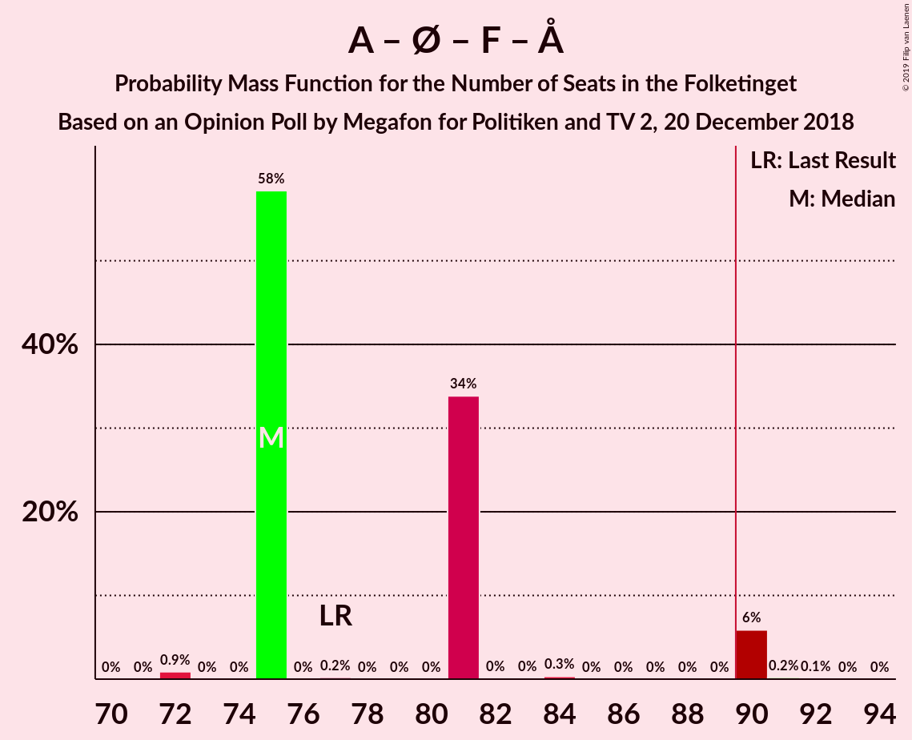
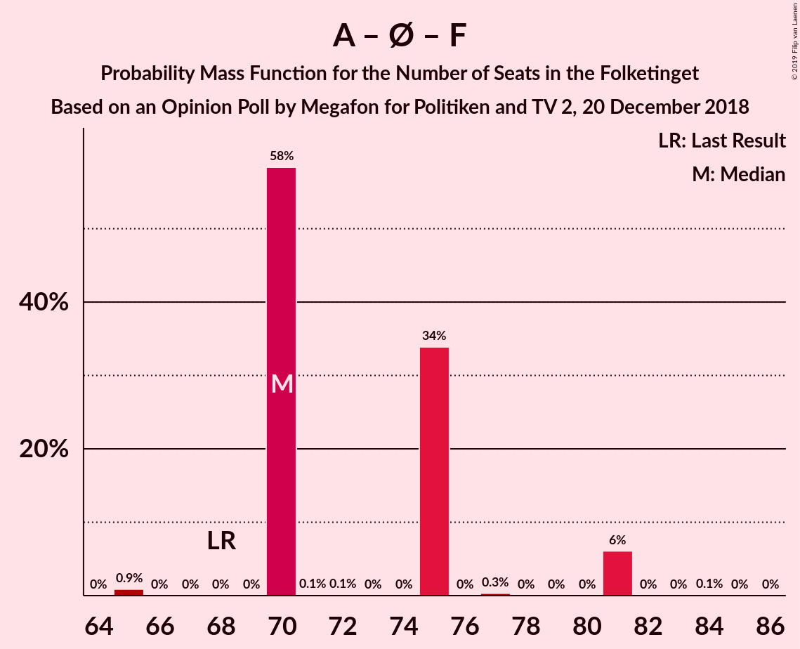

# Opinion Poll by Megafon for Politiken and TV 2, 20 December 2018

<a href="#voting-intentions">Voting Intentions</a> | <a href="#seats">Seats</a> | <a href="#coalitions">Coalitions</a> | <a href="#technical-information">Technical Information</a>

## Voting Intentions

### Confidence Intervals

| Party | Last Result | Poll Result | 80% Confidence Interval | 90% Confidence Interval | 95% Confidence Interval | 99% Confidence Interval |
|:-----:|:-----------:|:-----------:|:-----------------------:|:-----------------------:|:-----------------------:|:-----------------------:|
| Socialdemokraterne | 26.3% | 25.1% | 23.4–26.9% |22.9–27.4% |22.5–27.9% |21.7–28.8% |
| Venstre | 19.5% | 17.0% | 15.5–18.6% |15.2–19.1% |14.8–19.5% |14.1–20.3% |
| Dansk Folkeparti | 21.1% | 16.2% | 14.8–17.8% |14.4–18.2% |14.0–18.6% |13.4–19.4% |
| Enhedslisten–De Rød-Grønne | 7.8% | 9.9% | 8.8–11.2% |8.5–11.6% |8.2–11.9% |7.7–12.6% |
| Radikale Venstre | 4.6% | 7.4% | 6.4–8.6% |6.2–8.9% |5.9–9.2% |5.5–9.8% |
| Socialistisk Folkeparti | 4.2% | 6.4% | 5.5–7.5% |5.3–7.8% |5.0–8.1% |4.6–8.7% |
| Liberal Alliance | 7.5% | 4.9% | 4.1–5.9% |3.9–6.2% |3.7–6.4% |3.4–6.9% |
| Det Konservative Folkeparti | 3.4% | 4.5% | 3.8–5.5% |3.6–5.7% |3.4–6.0% |3.0–6.5% |
| Alternativet | 4.8% | 4.1% | 3.4–5.0% |3.2–5.3% |3.0–5.5% |2.7–6.0% |
| Nye Borgerlige | 0.0% | 3.1% | 2.5–3.9% |2.3–4.2% |2.2–4.4% |1.9–4.8% |
| Kristendemokraterne | 0.8% | 0.9% | 0.6–1.4% |0.5–1.6% |0.5–1.7% |0.4–2.0% |

*Note:* The poll result column reflects the actual value used in the calculations. Published results may vary slightly, and in addition be rounded to fewer digits.

## Seats

### Confidence Intervals

| Party | Last Result | Median | 80% Confidence Interval | 90% Confidence Interval | 95% Confidence Interval | 99% Confidence Interval |
|:-----:|:-----------:|:------:|:-----------------------:|:-----------------------:|:-----------------------:|:-----------------------:|
| <a href="#socialdemokraterne">Socialdemokraterne</a> | 47 | 44 | 42–46 |41–46 |39–48 |39–49 |
| <a href="#venstre">Venstre</a> | 34 | 30 | 28–30 |26–33 |26–34 |26–35 |
| <a href="#dansk-folkeparti">Dansk Folkeparti</a> | 37 | 27 | 26–30 |26–31 |26–31 |24–34 |
| <a href="#enhedslisten–de-rød-grønne">Enhedslisten–De Rød-Grønne</a> | 14 | 19 | 16–19 |15–20 |15–20 |14–22 |
| <a href="#radikale-venstre">Radikale Venstre</a> | 8 | 14 | 11–14 |11–15 |11–16 |10–17 |
| <a href="#socialistisk-folkeparti">Socialistisk Folkeparti</a> | 7 | 11 | 11–13 |10–14 |10–14 |9–15 |
| <a href="#liberal-alliance">Liberal Alliance</a> | 13 | 7 | 7–10 |7–11 |7–11 |6–12 |
| <a href="#det-konservative-folkeparti">Det Konservative Folkeparti</a> | 6 | 10 | 7–10 |6–11 |6–11 |5–12 |
| <a href="#alternativet">Alternativet</a> | 9 | 8 | 7–9 |6–9 |5–10 |5–11 |
| <a href="#nye-borgerlige">Nye Borgerlige</a> | 0 | 6 | 5–6 |5–7 |4–7 |4–8 |
| <a href="#kristendemokraterne">Kristendemokraterne</a> | 0 | 0 | 0 |0 |0 |0–4 |

### Socialdemokraterne

*For a full overview of the results for this party, see the [Socialdemokraterne](party-socialdemokraterne.html) page.*

| Number of Seats | Probability | Accumulated | Special Marks |
|:---------------:|:-----------:|:-----------:|:-------------:|
| 37 | 0.1% | 100% |  |
| 38 | 0.2% | 99.8% |  |
| 39 | 2% | 99.6% |  |
| 40 | 2% | 97% |  |
| 41 | 3% | 96% |  |
| 42 | 4% | 93% |  |
| 43 | 3% | 90% |  |
| 44 | 51% | 86% | Median |
| 45 | 23% | 35% |  |
| 46 | 8% | 12% |  |
| 47 | 0.8% | 5% | Last Result |
| 48 | 3% | 4% |  |
| 49 | 0.4% | 0.6% |  |
| 50 | 0.1% | 0.3% |  |
| 51 | 0.1% | 0.1% |  |
| 52 | 0% | 0.1% |  |
| 53 | 0% | 0% |  |

### Venstre

*For a full overview of the results for this party, see the [Venstre](party-venstre.html) page.*

| Number of Seats | Probability | Accumulated | Special Marks |
|:---------------:|:-----------:|:-----------:|:-------------:|
| 24 | 0.1% | 100% |  |
| 25 | 0.3% | 99.9% |  |
| 26 | 6% | 99.6% |  |
| 27 | 0.6% | 94% |  |
| 28 | 4% | 93% |  |
| 29 | 3% | 89% |  |
| 30 | 77% | 86% | Median |
| 31 | 2% | 10% |  |
| 32 | 1.0% | 8% |  |
| 33 | 3% | 7% |  |
| 34 | 3% | 4% | Last Result |
| 35 | 0.8% | 0.9% |  |
| 36 | 0% | 0.1% |  |
| 37 | 0% | 0.1% |  |
| 38 | 0% | 0% |  |

### Dansk Folkeparti

*For a full overview of the results for this party, see the [Dansk Folkeparti](party-danskfolkeparti.html) page.*

| Number of Seats | Probability | Accumulated | Special Marks |
|:---------------:|:-----------:|:-----------:|:-------------:|
| 22 | 0.1% | 100% |  |
| 23 | 0.3% | 99.9% |  |
| 24 | 0.3% | 99.6% |  |
| 25 | 2% | 99.3% |  |
| 26 | 43% | 98% |  |
| 27 | 7% | 55% | Median |
| 28 | 7% | 48% |  |
| 29 | 5% | 41% |  |
| 30 | 29% | 36% |  |
| 31 | 5% | 7% |  |
| 32 | 0.9% | 2% |  |
| 33 | 0.2% | 0.7% |  |
| 34 | 0.3% | 0.6% |  |
| 35 | 0.2% | 0.3% |  |
| 36 | 0.1% | 0.1% |  |
| 37 | 0% | 0% | Last Result |

### Enhedslisten–De Rød-Grønne

*For a full overview of the results for this party, see the [Enhedslisten–De Rød-Grønne](party-enhedslisten–derød-grønne.html) page.*

| Number of Seats | Probability | Accumulated | Special Marks |
|:---------------:|:-----------:|:-----------:|:-------------:|
| 12 | 0.1% | 100% |  |
| 13 | 0.3% | 99.9% |  |
| 14 | 1.1% | 99.6% | Last Result |
| 15 | 8% | 98.5% |  |
| 16 | 27% | 90% |  |
| 17 | 6% | 64% |  |
| 18 | 5% | 57% |  |
| 19 | 44% | 52% | Median |
| 20 | 6% | 8% |  |
| 21 | 0.6% | 2% |  |
| 22 | 1.4% | 1.4% |  |
| 23 | 0% | 0.1% |  |
| 24 | 0% | 0% |  |

### Radikale Venstre

*For a full overview of the results for this party, see the [Radikale Venstre](party-radikalevenstre.html) page.*

| Number of Seats | Probability | Accumulated | Special Marks |
|:---------------:|:-----------:|:-----------:|:-------------:|
| 8 | 0% | 100% | Last Result |
| 9 | 0.2% | 100% |  |
| 10 | 2% | 99.8% |  |
| 11 | 26% | 98% |  |
| 12 | 3% | 72% |  |
| 13 | 14% | 70% |  |
| 14 | 49% | 55% | Median |
| 15 | 3% | 7% |  |
| 16 | 3% | 3% |  |
| 17 | 0.4% | 0.6% |  |
| 18 | 0.1% | 0.2% |  |
| 19 | 0.1% | 0.1% |  |
| 20 | 0% | 0% |  |

### Socialistisk Folkeparti

*For a full overview of the results for this party, see the [Socialistisk Folkeparti](party-socialistiskfolkeparti.html) page.*

| Number of Seats | Probability | Accumulated | Special Marks |
|:---------------:|:-----------:|:-----------:|:-------------:|
| 7 | 0% | 100% | Last Result |
| 8 | 0.4% | 100% |  |
| 9 | 1.1% | 99.6% |  |
| 10 | 6% | 98% |  |
| 11 | 50% | 93% | Median |
| 12 | 8% | 43% |  |
| 13 | 29% | 35% |  |
| 14 | 5% | 6% |  |
| 15 | 1.2% | 1.3% |  |
| 16 | 0% | 0.1% |  |
| 17 | 0% | 0% |  |

### Liberal Alliance

*For a full overview of the results for this party, see the [Liberal Alliance](party-liberalalliance.html) page.*

| Number of Seats | Probability | Accumulated | Special Marks |
|:---------------:|:-----------:|:-----------:|:-------------:|
| 5 | 0.1% | 100% |  |
| 6 | 2% | 99.9% |  |
| 7 | 64% | 98% | Median |
| 8 | 14% | 34% |  |
| 9 | 4% | 20% |  |
| 10 | 10% | 16% |  |
| 11 | 5% | 6% |  |
| 12 | 1.4% | 1.5% |  |
| 13 | 0% | 0.1% | Last Result |
| 14 | 0% | 0% |  |

### Det Konservative Folkeparti

*For a full overview of the results for this party, see the [Det Konservative Folkeparti](party-detkonservativefolkeparti.html) page.*

| Number of Seats | Probability | Accumulated | Special Marks |
|:---------------:|:-----------:|:-----------:|:-------------:|
| 4 | 0.1% | 100% |  |
| 5 | 0.5% | 99.9% |  |
| 6 | 9% | 99.4% | Last Result |
| 7 | 9% | 90% |  |
| 8 | 5% | 81% |  |
| 9 | 24% | 75% |  |
| 10 | 46% | 52% | Median |
| 11 | 5% | 6% |  |
| 12 | 0.7% | 0.8% |  |
| 13 | 0% | 0% |  |

### Alternativet

*For a full overview of the results for this party, see the [Alternativet](party-alternativet.html) page.*

| Number of Seats | Probability | Accumulated | Special Marks |
|:---------------:|:-----------:|:-----------:|:-------------:|
| 4 | 0.1% | 100% |  |
| 5 | 5% | 99.9% |  |
| 6 | 2% | 95% |  |
| 7 | 14% | 93% |  |
| 8 | 51% | 80% | Median |
| 9 | 24% | 29% | Last Result |
| 10 | 3% | 4% |  |
| 11 | 1.1% | 1.2% |  |
| 12 | 0% | 0% |  |

### Nye Borgerlige

*For a full overview of the results for this party, see the [Nye Borgerlige](party-nyeborgerlige.html) page.*

| Number of Seats | Probability | Accumulated | Special Marks |
|:---------------:|:-----------:|:-----------:|:-------------:|
| 0 | 0.1% | 100% | Last Result |
| 1 | 0% | 99.9% |  |
| 2 | 0% | 99.9% |  |
| 3 | 0% | 99.9% |  |
| 4 | 4% | 99.9% |  |
| 5 | 37% | 95% |  |
| 6 | 51% | 58% | Median |
| 7 | 6% | 7% |  |
| 8 | 0.7% | 0.8% |  |
| 9 | 0% | 0.1% |  |
| 10 | 0.1% | 0.1% |  |
| 11 | 0% | 0% |  |

### Kristendemokraterne

*For a full overview of the results for this party, see the [Kristendemokraterne](party-kristendemokraterne.html) page.*

| Number of Seats | Probability | Accumulated | Special Marks |
|:---------------:|:-----------:|:-----------:|:-------------:|
| 0 | 99.0% | 100% | Last Result, Median |
| 1 | 0% | 1.0% |  |
| 2 | 0% | 1.0% |  |
| 3 | 0% | 1.0% |  |
| 4 | 1.0% | 1.0% |  |
| 5 | 0% | 0% |  |

## Coalitions

### Confidence Intervals

| Coalition | Last Result | Median | Majority? | 80% Confidence Interval | 90% Confidence Interval | 95% Confidence Interval | 99% Confidence Interval |
|:---------:|:-----------:|:------:|:---------:|:-----------------------:|:-----------------------:|:-----------------------:|:-----------------------:|
| Socialdemokraterne – Enhedslisten–De Rød-Grønne – Radikale Venstre – Socialistisk Folkeparti – Alternativet | 85 | 95 | 98% | 93–96 | 91–97 | 90–98 | 87–101 |
| Socialdemokraterne – Enhedslisten–De Rød-Grønne – Radikale Venstre – Socialistisk Folkeparti | 76 | 88 | 2% | 84–88 | 83–89 | 82–89 | 78–92 |
| Socialdemokraterne – Enhedslisten–De Rød-Grønne – Socialistisk Folkeparti – Alternativet | 77 | 82 | 0% | 79–83 | 76–83 | 75–86 | 74–89 |
| Venstre – Dansk Folkeparti – Liberal Alliance – Det Konservative Folkeparti – Nye Borgerlige – Kristendemokraterne | 90 | 80 | 0.2% | 79–82 | 78–84 | 77–85 | 74–88 |
| Venstre – Dansk Folkeparti – Liberal Alliance – Det Konservative Folkeparti – Nye Borgerlige | 90 | 80 | 0.2% | 79–82 | 78–84 | 77–85 | 74–88 |
| Venstre – Dansk Folkeparti – Liberal Alliance – Det Konservative Folkeparti – Kristendemokraterne | 90 | 73 | 0% | 73–77 | 72–79 | 72–80 | 69–82 |
| Venstre – Dansk Folkeparti – Liberal Alliance – Det Konservative Folkeparti | 90 | 73 | 0% | 73–77 | 72–79 | 72–80 | 69–82 |
| Socialdemokraterne – Enhedslisten–De Rød-Grønne – Socialistisk Folkeparti | 68 | 74 | 0% | 71–75 | 69–76 | 68–78 | 66–80 |
| Socialdemokraterne – Radikale Venstre – Socialistisk Folkeparti | 62 | 69 | 0% | 66–72 | 65–72 | 65–72 | 62–74 |
| Socialdemokraterne – Radikale Venstre | 55 | 58 | 0% | 55–59 | 54–59 | 53–60 | 52–62 |
| Venstre – Liberal Alliance – Det Konservative Folkeparti | 53 | 47 | 0% | 45–48 | 45–50 | 42–52 | 41–52 |
| Venstre – Det Konservative Folkeparti | 40 | 40 | 0% | 36–40 | 35–42 | 34–42 | 33–44 |
| Venstre | 34 | 30 | 0% | 28–30 | 26–33 | 26–34 | 26–35 |

### Socialdemokraterne – Enhedslisten–De Rød-Grønne – Radikale Venstre – Socialistisk Folkeparti – Alternativet

| Number of Seats | Probability | Accumulated | Special Marks |
|:---------------:|:-----------:|:-----------:|:-------------:|
| 85 | 0.2% | 100% | Last Result |
| 86 | 0.1% | 99.8% |  |
| 87 | 0.5% | 99.7% |  |
| 88 | 1.1% | 99.2% |  |
| 89 | 0.5% | 98% |  |
| 90 | 1.4% | 98% | Majority |
| 91 | 3% | 96% |  |
| 92 | 2% | 93% |  |
| 93 | 5% | 91% |  |
| 94 | 33% | 85% |  |
| 95 | 3% | 52% |  |
| 96 | 42% | 49% | Median |
| 97 | 4% | 7% |  |
| 98 | 1.5% | 3% |  |
| 99 | 0.2% | 2% |  |
| 100 | 0.5% | 2% |  |
| 101 | 0.8% | 1.0% |  |
| 102 | 0.1% | 0.2% |  |
| 103 | 0.1% | 0.1% |  |
| 104 | 0% | 0% |  |

### Socialdemokraterne – Enhedslisten–De Rød-Grønne – Radikale Venstre – Socialistisk Folkeparti

| Number of Seats | Probability | Accumulated | Special Marks |
|:---------------:|:-----------:|:-----------:|:-------------:|
| 76 | 0% | 100% | Last Result |
| 77 | 0.2% | 100% |  |
| 78 | 0.5% | 99.8% |  |
| 79 | 0.1% | 99.4% |  |
| 80 | 0.2% | 99.2% |  |
| 81 | 1.4% | 99.0% |  |
| 82 | 0.7% | 98% |  |
| 83 | 2% | 97% |  |
| 84 | 5% | 95% |  |
| 85 | 24% | 90% |  |
| 86 | 4% | 66% |  |
| 87 | 8% | 62% |  |
| 88 | 45% | 54% | Median |
| 89 | 6% | 9% |  |
| 90 | 0.4% | 2% | Majority |
| 91 | 0.7% | 2% |  |
| 92 | 0.9% | 1.3% |  |
| 93 | 0.2% | 0.4% |  |
| 94 | 0.2% | 0.2% |  |
| 95 | 0% | 0.1% |  |
| 96 | 0% | 0% |  |

### Socialdemokraterne – Enhedslisten–De Rød-Grønne – Socialistisk Folkeparti – Alternativet

| Number of Seats | Probability | Accumulated | Special Marks |
|:---------------:|:-----------:|:-----------:|:-------------:|
| 72 | 0.1% | 100% |  |
| 73 | 0.1% | 99.8% |  |
| 74 | 0.3% | 99.7% |  |
| 75 | 3% | 99.5% |  |
| 76 | 2% | 96% |  |
| 77 | 0.3% | 95% | Last Result |
| 78 | 2% | 94% |  |
| 79 | 3% | 92% |  |
| 80 | 5% | 90% |  |
| 81 | 8% | 85% |  |
| 82 | 46% | 76% | Median |
| 83 | 26% | 30% |  |
| 84 | 0.7% | 4% |  |
| 85 | 0.6% | 3% |  |
| 86 | 0.3% | 3% |  |
| 87 | 1.4% | 2% |  |
| 88 | 0.1% | 0.8% |  |
| 89 | 0.7% | 0.7% |  |
| 90 | 0% | 0% | Majority |

### Venstre – Dansk Folkeparti – Liberal Alliance – Det Konservative Folkeparti – Nye Borgerlige – Kristendemokraterne

| Number of Seats | Probability | Accumulated | Special Marks |
|:---------------:|:-----------:|:-----------:|:-------------:|
| 72 | 0.1% | 100% |  |
| 73 | 0.1% | 99.9% |  |
| 74 | 0.8% | 99.8% |  |
| 75 | 0.5% | 99.0% |  |
| 76 | 0.2% | 98% |  |
| 77 | 1.5% | 98% |  |
| 78 | 4% | 97% |  |
| 79 | 42% | 93% |  |
| 80 | 3% | 51% | Median |
| 81 | 33% | 48% |  |
| 82 | 5% | 15% |  |
| 83 | 2% | 9% |  |
| 84 | 3% | 7% |  |
| 85 | 1.4% | 4% |  |
| 86 | 0.5% | 2% |  |
| 87 | 1.1% | 2% |  |
| 88 | 0.5% | 0.8% |  |
| 89 | 0.1% | 0.3% |  |
| 90 | 0.2% | 0.2% | Last Result, Majority |
| 91 | 0% | 0% |  |

### Venstre – Dansk Folkeparti – Liberal Alliance – Det Konservative Folkeparti – Nye Borgerlige

| Number of Seats | Probability | Accumulated | Special Marks |
|:---------------:|:-----------:|:-----------:|:-------------:|
| 72 | 0.1% | 100% |  |
| 73 | 0.1% | 99.9% |  |
| 74 | 0.8% | 99.8% |  |
| 75 | 0.5% | 99.0% |  |
| 76 | 0.2% | 98% |  |
| 77 | 1.5% | 98% |  |
| 78 | 4% | 97% |  |
| 79 | 42% | 93% |  |
| 80 | 3% | 51% | Median |
| 81 | 34% | 48% |  |
| 82 | 6% | 14% |  |
| 83 | 2% | 8% |  |
| 84 | 3% | 6% |  |
| 85 | 0.6% | 3% |  |
| 86 | 0.5% | 2% |  |
| 87 | 1.1% | 2% |  |
| 88 | 0.5% | 0.8% |  |
| 89 | 0.1% | 0.3% |  |
| 90 | 0.2% | 0.2% | Last Result, Majority |
| 91 | 0% | 0% |  |

### Venstre – Dansk Folkeparti – Liberal Alliance – Det Konservative Folkeparti – Kristendemokraterne

| Number of Seats | Probability | Accumulated | Special Marks |
|:---------------:|:-----------:|:-----------:|:-------------:|
| 66 | 0.1% | 100% |  |
| 67 | 0% | 99.9% |  |
| 68 | 0.1% | 99.9% |  |
| 69 | 0.8% | 99.8% |  |
| 70 | 0.7% | 99.0% |  |
| 71 | 0.5% | 98% |  |
| 72 | 4% | 98% |  |
| 73 | 44% | 94% |  |
| 74 | 4% | 50% | Median |
| 75 | 0.5% | 46% |  |
| 76 | 34% | 46% |  |
| 77 | 4% | 12% |  |
| 78 | 2% | 8% |  |
| 79 | 3% | 7% |  |
| 80 | 2% | 3% |  |
| 81 | 1.0% | 2% |  |
| 82 | 0.2% | 0.6% |  |
| 83 | 0.1% | 0.3% |  |
| 84 | 0.2% | 0.2% |  |
| 85 | 0% | 0% |  |
| 86 | 0% | 0% |  |
| 87 | 0% | 0% |  |
| 88 | 0% | 0% |  |
| 89 | 0% | 0% |  |
| 90 | 0% | 0% | Last Result, Majority |

### Venstre – Dansk Folkeparti – Liberal Alliance – Det Konservative Folkeparti

| Number of Seats | Probability | Accumulated | Special Marks |
|:---------------:|:-----------:|:-----------:|:-------------:|
| 66 | 0.1% | 100% |  |
| 67 | 0% | 99.9% |  |
| 68 | 0.1% | 99.9% |  |
| 69 | 0.8% | 99.8% |  |
| 70 | 0.7% | 99.0% |  |
| 71 | 0.5% | 98% |  |
| 72 | 4% | 98% |  |
| 73 | 44% | 94% |  |
| 74 | 4% | 50% | Median |
| 75 | 0.5% | 45% |  |
| 76 | 34% | 45% |  |
| 77 | 4% | 11% |  |
| 78 | 0.7% | 7% |  |
| 79 | 3% | 7% |  |
| 80 | 2% | 3% |  |
| 81 | 1.0% | 2% |  |
| 82 | 0.2% | 0.6% |  |
| 83 | 0.1% | 0.3% |  |
| 84 | 0.2% | 0.2% |  |
| 85 | 0% | 0% |  |
| 86 | 0% | 0% |  |
| 87 | 0% | 0% |  |
| 88 | 0% | 0% |  |
| 89 | 0% | 0% |  |
| 90 | 0% | 0% | Last Result, Majority |

### Socialdemokraterne – Enhedslisten–De Rød-Grønne – Socialistisk Folkeparti

| Number of Seats | Probability | Accumulated | Special Marks |
|:---------------:|:-----------:|:-----------:|:-------------:|
| 64 | 0.1% | 100% |  |
| 65 | 0.1% | 99.9% |  |
| 66 | 0.6% | 99.8% |  |
| 67 | 0.3% | 99.2% |  |
| 68 | 3% | 98.9% | Last Result |
| 69 | 2% | 95% |  |
| 70 | 0.7% | 94% |  |
| 71 | 4% | 93% |  |
| 72 | 2% | 89% |  |
| 73 | 3% | 86% |  |
| 74 | 69% | 83% | Median |
| 75 | 7% | 14% |  |
| 76 | 3% | 7% |  |
| 77 | 2% | 4% |  |
| 78 | 1.5% | 3% |  |
| 79 | 0.2% | 1.1% |  |
| 80 | 0.8% | 0.9% |  |
| 81 | 0% | 0.1% |  |
| 82 | 0.1% | 0.1% |  |
| 83 | 0% | 0% |  |

### Socialdemokraterne – Radikale Venstre – Socialistisk Folkeparti

| Number of Seats | Probability | Accumulated | Special Marks |
|:---------------:|:-----------:|:-----------:|:-------------:|
| 60 | 0% | 100% |  |
| 61 | 0.2% | 99.9% |  |
| 62 | 0.4% | 99.7% | Last Result |
| 63 | 0.4% | 99.3% |  |
| 64 | 1.3% | 98.8% |  |
| 65 | 3% | 98% |  |
| 66 | 5% | 95% |  |
| 67 | 3% | 90% |  |
| 68 | 5% | 87% |  |
| 69 | 65% | 82% | Median |
| 70 | 2% | 18% |  |
| 71 | 2% | 15% |  |
| 72 | 11% | 13% |  |
| 73 | 1.1% | 2% |  |
| 74 | 0.8% | 1.2% |  |
| 75 | 0.2% | 0.4% |  |
| 76 | 0.1% | 0.2% |  |
| 77 | 0.1% | 0.1% |  |
| 78 | 0% | 0% |  |

### Socialdemokraterne – Radikale Venstre

| Number of Seats | Probability | Accumulated | Special Marks |
|:---------------:|:-----------:|:-----------:|:-------------:|
| 49 | 0% | 100% |  |
| 50 | 0.1% | 99.9% |  |
| 51 | 0.3% | 99.8% |  |
| 52 | 0.5% | 99.5% |  |
| 53 | 2% | 99.0% |  |
| 54 | 5% | 97% |  |
| 55 | 4% | 92% | Last Result |
| 56 | 22% | 88% |  |
| 57 | 4% | 66% |  |
| 58 | 49% | 62% | Median |
| 59 | 10% | 13% |  |
| 60 | 1.4% | 3% |  |
| 61 | 0.4% | 2% |  |
| 62 | 1.2% | 2% |  |
| 63 | 0.1% | 0.4% |  |
| 64 | 0.1% | 0.3% |  |
| 65 | 0.1% | 0.1% |  |
| 66 | 0% | 0% |  |

### Venstre – Liberal Alliance – Det Konservative Folkeparti

| Number of Seats | Probability | Accumulated | Special Marks |
|:---------------:|:-----------:|:-----------:|:-------------:|
| 40 | 0.2% | 100% |  |
| 41 | 0.9% | 99.8% |  |
| 42 | 2% | 98.9% |  |
| 43 | 0.4% | 97% |  |
| 44 | 2% | 97% |  |
| 45 | 6% | 95% |  |
| 46 | 31% | 89% |  |
| 47 | 44% | 58% | Median |
| 48 | 6% | 14% |  |
| 49 | 2% | 8% |  |
| 50 | 1.5% | 6% |  |
| 51 | 2% | 5% |  |
| 52 | 2% | 3% |  |
| 53 | 0.2% | 0.4% | Last Result |
| 54 | 0.1% | 0.2% |  |
| 55 | 0% | 0.1% |  |
| 56 | 0% | 0.1% |  |
| 57 | 0% | 0% |  |

### Venstre – Det Konservative Folkeparti

| Number of Seats | Probability | Accumulated | Special Marks |
|:---------------:|:-----------:|:-----------:|:-------------:|
| 31 | 0% | 100% |  |
| 32 | 0.1% | 99.9% |  |
| 33 | 1.2% | 99.8% |  |
| 34 | 1.4% | 98.6% |  |
| 35 | 3% | 97% |  |
| 36 | 9% | 94% |  |
| 37 | 7% | 86% |  |
| 38 | 4% | 78% |  |
| 39 | 22% | 74% |  |
| 40 | 45% | 52% | Last Result, Median |
| 41 | 1.2% | 7% |  |
| 42 | 4% | 6% |  |
| 43 | 0.4% | 2% |  |
| 44 | 2% | 2% |  |
| 45 | 0.1% | 0.1% |  |
| 46 | 0% | 0.1% |  |
| 47 | 0% | 0% |  |

### Venstre

| Number of Seats | Probability | Accumulated | Special Marks |
|:---------------:|:-----------:|:-----------:|:-------------:|
| 24 | 0.1% | 100% |  |
| 25 | 0.3% | 99.9% |  |
| 26 | 6% | 99.6% |  |
| 27 | 0.6% | 94% |  |
| 28 | 4% | 93% |  |
| 29 | 3% | 89% |  |
| 30 | 77% | 86% | Median |
| 31 | 2% | 10% |  |
| 32 | 1.0% | 8% |  |
| 33 | 3% | 7% |  |
| 34 | 3% | 4% | Last Result |
| 35 | 0.8% | 0.9% |  |
| 36 | 0% | 0.1% |  |
| 37 | 0% | 0.1% |  |
| 38 | 0% | 0% |  |

## Technical Information

### Opinion Poll

+ **Polling firm:** Megafon
+ **Commissioner(s):** Politiken and TV 2
+ **Fieldwork period:** 20 December 2018

### Calculations

+ **Sample size:** 1000
+ **Simulations done:** 262,144
+ **Error estimate:** 2.09%

