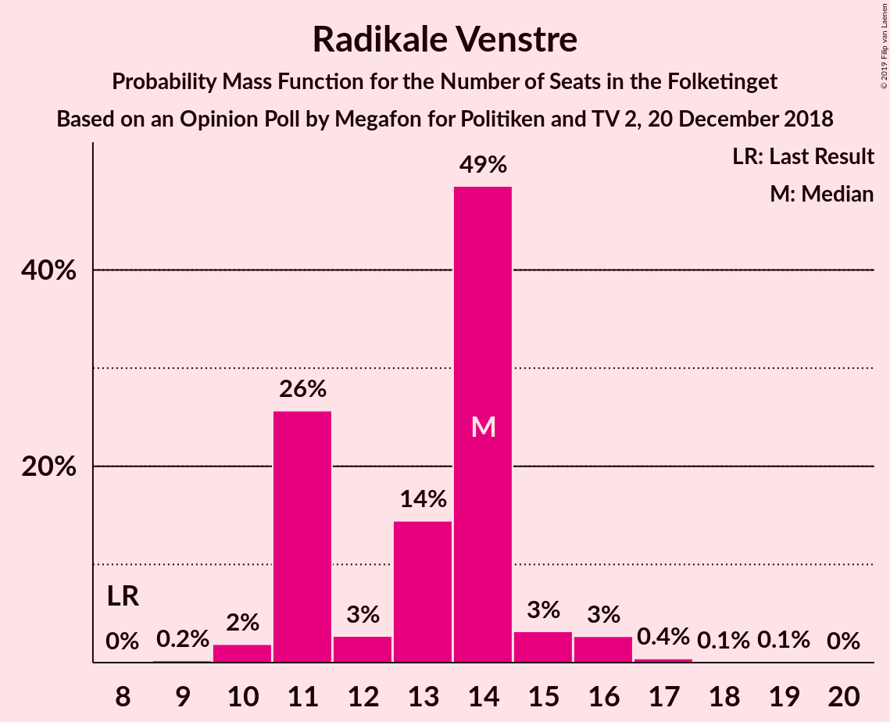
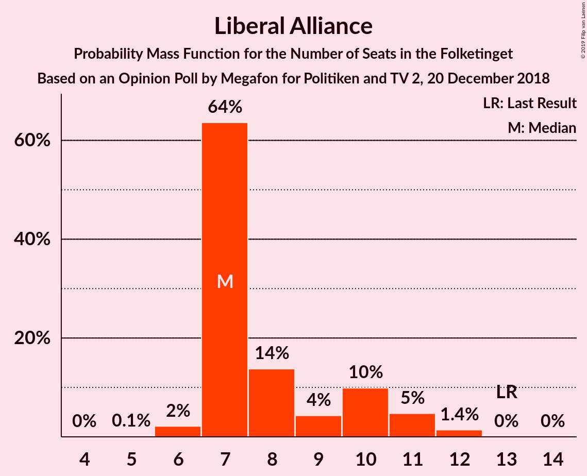
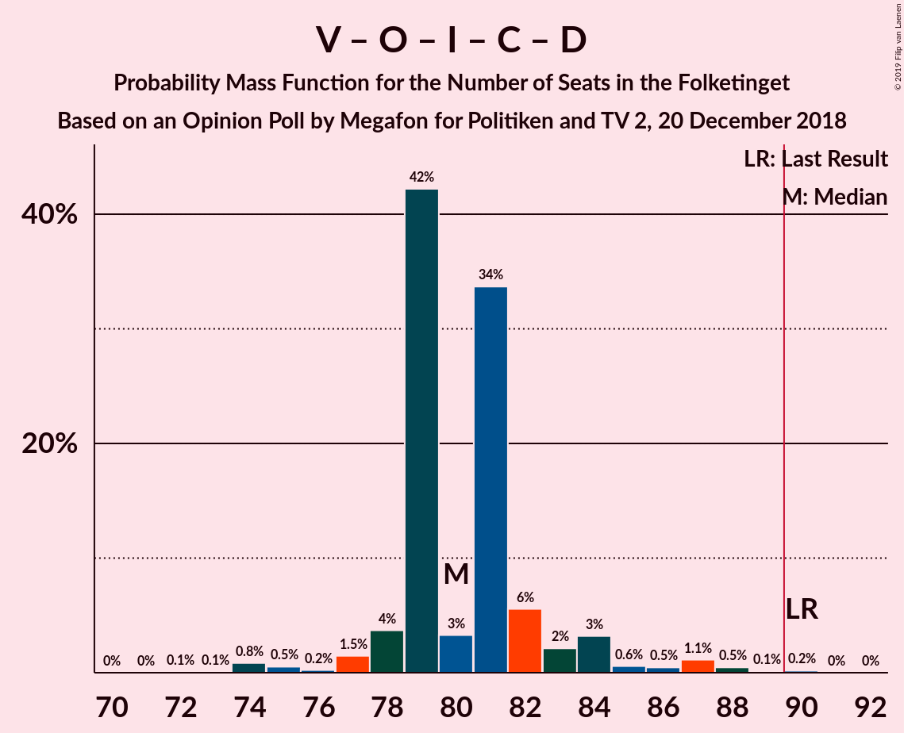
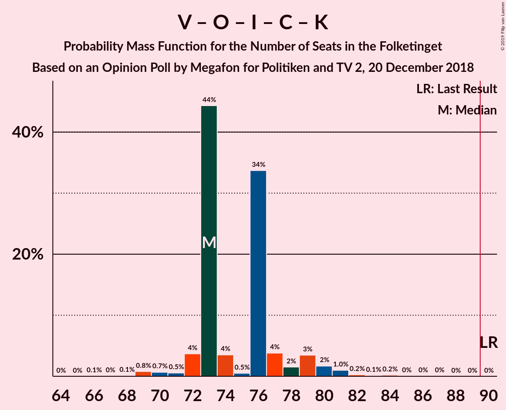
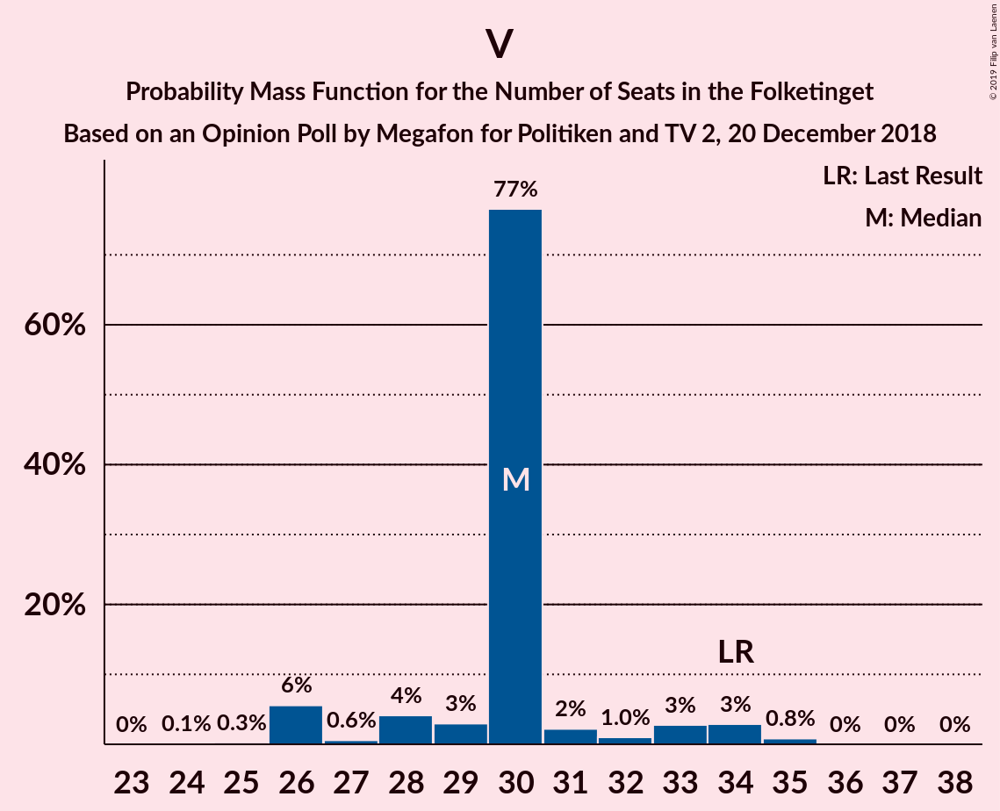

# Opinion Poll by Megafon for Politiken and TV 2, 20 December 2018

<a href="#voting-intentions">Voting Intentions</a> | <a href="#seats">Seats</a> | <a href="#coalitions">Coalitions</a> | <a href="#technical-information">Technical Information</a>

## Voting Intentions

### Confidence Intervals

| Party | Last Result | Poll Result | 80% Confidence Interval | 90% Confidence Interval | 95% Confidence Interval | 99% Confidence Interval |
|:-----:|:-----------:|:-----------:|:-----------------------:|:-----------------------:|:-----------------------:|:-----------------------:|
| Socialdemokraterne | 26.3% | 25.1% | 23.4–26.9% |22.9–27.4% |22.5–27.9% |21.7–28.8% |
| Venstre | 19.5% | 17.0% | 15.5–18.6% |15.2–19.1% |14.8–19.5% |14.1–20.3% |
| Dansk Folkeparti | 21.1% | 16.2% | 14.8–17.8% |14.4–18.2% |14.0–18.6% |13.4–19.4% |
| Enhedslisten–De Rød-Grønne | 7.8% | 9.9% | 8.8–11.2% |8.5–11.6% |8.2–11.9% |7.7–12.6% |
| Radikale Venstre | 4.6% | 7.4% | 6.4–8.6% |6.2–8.9% |5.9–9.2% |5.5–9.8% |
| Socialistisk Folkeparti | 4.2% | 6.4% | 5.5–7.5% |5.3–7.8% |5.0–8.1% |4.6–8.7% |
| Liberal Alliance | 7.5% | 4.9% | 4.1–5.9% |3.9–6.2% |3.7–6.4% |3.4–6.9% |
| Det Konservative Folkeparti | 3.4% | 4.5% | 3.8–5.5% |3.6–5.7% |3.4–6.0% |3.0–6.5% |
| Alternativet | 4.8% | 4.1% | 3.4–5.0% |3.2–5.3% |3.0–5.5% |2.7–6.0% |
| Nye Borgerlige | 0.0% | 3.1% | 2.5–3.9% |2.3–4.2% |2.2–4.4% |1.9–4.8% |
| Kristendemokraterne | 0.8% | 0.9% | 0.6–1.4% |0.5–1.6% |0.5–1.7% |0.4–2.0% |

*Note:* The poll result column reflects the actual value used in the calculations. Published results may vary slightly, and in addition be rounded to fewer digits.

## Seats

### Confidence Intervals

| Party | Last Result | Median | 80% Confidence Interval | 90% Confidence Interval | 95% Confidence Interval | 99% Confidence Interval |
|:-----:|:-----------:|:------:|:-----------------------:|:-----------------------:|:-----------------------:|:-----------------------:|
| <a href="#socialdemokraterne">Socialdemokraterne</a> | 47 | 45 | 41–46 |41–46 |40–48 |39–50 |
| <a href="#venstre">Venstre</a> | 34 | 29 | 28–33 |28–34 |27–34 |25–35 |
| <a href="#dansk-folkeparti">Dansk Folkeparti</a> | 37 | 29 | 26–30 |25–31 |25–32 |24–34 |
| <a href="#enhedslisten–de-rød-grønne">Enhedslisten–De Rød-Grønne</a> | 14 | 17 | 16–19 |16–20 |15–21 |14–22 |
| <a href="#radikale-venstre">Radikale Venstre</a> | 8 | 14 | 11–14 |11–15 |10–15 |10–16 |
| <a href="#socialistisk-folkeparti">Socialistisk Folkeparti</a> | 7 | 12 | 10–13 |9–14 |9–15 |8–15 |
| <a href="#liberal-alliance">Liberal Alliance</a> | 13 | 7 | 7–10 |7–11 |7–12 |6–12 |
| <a href="#det-konservative-folkeparti">Det Konservative Folkeparti</a> | 6 | 9 | 8–10 |7–10 |6–10 |6–11 |
| <a href="#alternativet">Alternativet</a> | 9 | 8 | 7–8 |6–9 |6–10 |5–10 |
| <a href="#nye-borgerlige">Nye Borgerlige</a> | 0 | 6 | 4–6 |4–7 |4–7 |4–8 |
| <a href="#kristendemokraterne">Kristendemokraterne</a> | 0 | 0 | 0 |0 |0 |0 |

### Socialdemokraterne

*For a full overview of the results for this party, see the [Socialdemokraterne](party-socialdemokraterne.html) page.*

| Number of Seats | Probability | Accumulated | Special Marks |
|:---------------:|:-----------:|:-----------:|:-------------:|
| 37 | 0.1% | 100% |  |
| 38 | 0.3% | 99.9% |  |
| 39 | 2% | 99.6% |  |
| 40 | 2% | 98% |  |
| 41 | 7% | 96% |  |
| 42 | 4% | 89% |  |
| 43 | 4% | 85% |  |
| 44 | 30% | 81% |  |
| 45 | 13% | 51% | Median |
| 46 | 34% | 38% |  |
| 47 | 0.9% | 4% | Last Result |
| 48 | 1.2% | 3% |  |
| 49 | 0.8% | 2% |  |
| 50 | 1.1% | 1.2% |  |
| 51 | 0.1% | 0.1% |  |
| 52 | 0% | 0% |  |

### Venstre

*For a full overview of the results for this party, see the [Venstre](party-venstre.html) page.*

| Number of Seats | Probability | Accumulated | Special Marks |
|:---------------:|:-----------:|:-----------:|:-------------:|
| 24 | 0.1% | 100% |  |
| 25 | 0.4% | 99.9% |  |
| 26 | 1.4% | 99.5% |  |
| 27 | 1.1% | 98% |  |
| 28 | 41% | 97% |  |
| 29 | 7% | 56% | Median |
| 30 | 16% | 49% |  |
| 31 | 5% | 33% |  |
| 32 | 15% | 28% |  |
| 33 | 5% | 13% |  |
| 34 | 7% | 8% | Last Result |
| 35 | 0.8% | 1.1% |  |
| 36 | 0.2% | 0.3% |  |
| 37 | 0.1% | 0.1% |  |
| 38 | 0% | 0% |  |

### Dansk Folkeparti

*For a full overview of the results for this party, see the [Dansk Folkeparti](party-danskfolkeparti.html) page.*

| Number of Seats | Probability | Accumulated | Special Marks |
|:---------------:|:-----------:|:-----------:|:-------------:|
| 23 | 0.1% | 100% |  |
| 24 | 0.7% | 99.8% |  |
| 25 | 9% | 99.1% |  |
| 26 | 12% | 90% |  |
| 27 | 11% | 78% |  |
| 28 | 6% | 67% |  |
| 29 | 36% | 61% | Median |
| 30 | 19% | 25% |  |
| 31 | 3% | 6% |  |
| 32 | 0.9% | 3% |  |
| 33 | 1.1% | 2% |  |
| 34 | 1.0% | 1.3% |  |
| 35 | 0.2% | 0.3% |  |
| 36 | 0% | 0% |  |
| 37 | 0% | 0% | Last Result |

### Enhedslisten–De Rød-Grønne

*For a full overview of the results for this party, see the [Enhedslisten–De Rød-Grønne](party-enhedslisten–derød-grønne.html) page.*

| Number of Seats | Probability | Accumulated | Special Marks |
|:---------------:|:-----------:|:-----------:|:-------------:|
| 13 | 0.2% | 100% |  |
| 14 | 1.1% | 99.7% | Last Result |
| 15 | 4% | 98.7% |  |
| 16 | 37% | 95% |  |
| 17 | 16% | 58% | Median |
| 18 | 9% | 43% |  |
| 19 | 27% | 33% |  |
| 20 | 3% | 6% |  |
| 21 | 1.2% | 3% |  |
| 22 | 2% | 2% |  |
| 23 | 0.1% | 0.1% |  |
| 24 | 0% | 0% |  |

### Radikale Venstre

*For a full overview of the results for this party, see the [Radikale Venstre](party-radikalevenstre.html) page.*

| Number of Seats | Probability | Accumulated | Special Marks |
|:---------------:|:-----------:|:-----------:|:-------------:|
| 8 | 0% | 100% | Last Result |
| 9 | 0.3% | 100% |  |
| 10 | 3% | 99.7% |  |
| 11 | 19% | 97% |  |
| 12 | 6% | 78% |  |
| 13 | 12% | 72% |  |
| 14 | 52% | 60% | Median |
| 15 | 7% | 9% |  |
| 16 | 1.2% | 2% |  |
| 17 | 0.3% | 0.5% |  |
| 18 | 0.2% | 0.2% |  |
| 19 | 0% | 0% |  |

### Socialistisk Folkeparti

*For a full overview of the results for this party, see the [Socialistisk Folkeparti](party-socialistiskfolkeparti.html) page.*

| Number of Seats | Probability | Accumulated | Special Marks |
|:---------------:|:-----------:|:-----------:|:-------------:|
| 7 | 0% | 100% | Last Result |
| 8 | 0.7% | 100% |  |
| 9 | 6% | 99.3% |  |
| 10 | 6% | 93% |  |
| 11 | 22% | 87% |  |
| 12 | 48% | 64% | Median |
| 13 | 11% | 17% |  |
| 14 | 3% | 6% |  |
| 15 | 3% | 3% |  |
| 16 | 0.1% | 0.2% |  |
| 17 | 0% | 0% |  |

### Liberal Alliance

*For a full overview of the results for this party, see the [Liberal Alliance](party-liberalalliance.html) page.*

| Number of Seats | Probability | Accumulated | Special Marks |
|:---------------:|:-----------:|:-----------:|:-------------:|
| 5 | 0.1% | 100% |  |
| 6 | 2% | 99.9% |  |
| 7 | 49% | 98% | Median |
| 8 | 17% | 48% |  |
| 9 | 17% | 31% |  |
| 10 | 6% | 14% |  |
| 11 | 6% | 8% |  |
| 12 | 2% | 3% |  |
| 13 | 0.1% | 0.1% | Last Result |
| 14 | 0% | 0% |  |

### Det Konservative Folkeparti

*For a full overview of the results for this party, see the [Det Konservative Folkeparti](party-detkonservativefolkeparti.html) page.*

| Number of Seats | Probability | Accumulated | Special Marks |
|:---------------:|:-----------:|:-----------:|:-------------:|
| 5 | 0.2% | 100% |  |
| 6 | 3% | 99.7% | Last Result |
| 7 | 5% | 96% |  |
| 8 | 20% | 91% |  |
| 9 | 57% | 71% | Median |
| 10 | 11% | 14% |  |
| 11 | 2% | 2% |  |
| 12 | 0.3% | 0.4% |  |
| 13 | 0.1% | 0.1% |  |
| 14 | 0% | 0% |  |

### Alternativet

*For a full overview of the results for this party, see the [Alternativet](party-alternativet.html) page.*

| Number of Seats | Probability | Accumulated | Special Marks |
|:---------------:|:-----------:|:-----------:|:-------------:|
| 4 | 0.1% | 100% |  |
| 5 | 1.5% | 99.9% |  |
| 6 | 6% | 98% |  |
| 7 | 22% | 92% |  |
| 8 | 61% | 71% | Median |
| 9 | 6% | 10% | Last Result |
| 10 | 3% | 3% |  |
| 11 | 0.3% | 0.3% |  |
| 12 | 0% | 0% |  |

### Nye Borgerlige

*For a full overview of the results for this party, see the [Nye Borgerlige](party-nyeborgerlige.html) page.*

| Number of Seats | Probability | Accumulated | Special Marks |
|:---------------:|:-----------:|:-----------:|:-------------:|
| 0 | 0.1% | 100% | Last Result |
| 1 | 0% | 99.9% |  |
| 2 | 0% | 99.9% |  |
| 3 | 0% | 99.9% |  |
| 4 | 10% | 99.9% |  |
| 5 | 32% | 90% |  |
| 6 | 48% | 58% | Median |
| 7 | 8% | 9% |  |
| 8 | 2% | 2% |  |
| 9 | 0% | 0.1% |  |
| 10 | 0% | 0% |  |

### Kristendemokraterne

*For a full overview of the results for this party, see the [Kristendemokraterne](party-kristendemokraterne.html) page.*

| Number of Seats | Probability | Accumulated | Special Marks |
|:---------------:|:-----------:|:-----------:|:-------------:|
| 0 | 99.6% | 100% | Last Result, Median |
| 1 | 0% | 0.4% |  |
| 2 | 0% | 0.4% |  |
| 3 | 0% | 0.4% |  |
| 4 | 0.4% | 0.4% |  |
| 5 | 0% | 0% |  |

## Coalitions

### Confidence Intervals

| Coalition | Last Result | Median | Majority? | 80% Confidence Interval | 90% Confidence Interval | 95% Confidence Interval | 99% Confidence Interval |
|:---------:|:-----------:|:------:|:---------:|:-----------------------:|:-----------------------:|:-----------------------:|:-----------------------:|
| Socialdemokraterne – Enhedslisten–De Rød-Grønne – Radikale Venstre – Socialistisk Folkeparti – Alternativet | 85 | 95 | 95% | 92–96 | 90–98 | 88–98 | 87–101 |
| Socialdemokraterne – Enhedslisten–De Rød-Grønne – Radikale Venstre – Socialistisk Folkeparti | 76 | 87 | 7% | 84–88 | 82–90 | 81–90 | 80–93 |
| Venstre – Dansk Folkeparti – Liberal Alliance – Det Konservative Folkeparti – Nye Borgerlige – Kristendemokraterne | 90 | 80 | 0.2% | 79–83 | 77–85 | 77–87 | 74–88 |
| Venstre – Dansk Folkeparti – Liberal Alliance – Det Konservative Folkeparti – Nye Borgerlige | 90 | 80 | 0.2% | 79–83 | 77–85 | 77–87 | 74–88 |
| Venstre – Dansk Folkeparti – Liberal Alliance – Det Konservative Folkeparti – Kristendemokraterne | 90 | 75 | 0% | 73–78 | 72–80 | 72–81 | 69–83 |
| Venstre – Dansk Folkeparti – Liberal Alliance – Det Konservative Folkeparti | 90 | 74 | 0% | 73–78 | 72–80 | 72–81 | 69–83 |
| Socialdemokraterne – Radikale Venstre – Socialistisk Folkeparti | 62 | 69 | 0% | 66–72 | 65–72 | 64–74 | 62–75 |
| Socialdemokraterne – Radikale Venstre | 55 | 58 | 0% | 55–60 | 54–60 | 53–61 | 51–64 |
| Venstre – Liberal Alliance – Det Konservative Folkeparti | 53 | 46 | 0% | 44–50 | 44–51 | 43–52 | 41–55 |
| Venstre – Det Konservative Folkeparti | 40 | 38 | 0% | 37–42 | 36–43 | 35–43 | 33–46 |
| Venstre | 34 | 29 | 0% | 28–33 | 28–34 | 27–34 | 25–35 |

### Socialdemokraterne – Enhedslisten–De Rød-Grønne – Radikale Venstre – Socialistisk Folkeparti – Alternativet

| Number of Seats | Probability | Accumulated | Special Marks |
|:---------------:|:-----------:|:-----------:|:-------------:|
| 85 | 0.2% | 100% | Last Result |
| 86 | 0.1% | 99.8% |  |
| 87 | 2% | 99.7% |  |
| 88 | 1.4% | 98% |  |
| 89 | 0.7% | 96% |  |
| 90 | 2% | 95% | Majority |
| 91 | 3% | 94% |  |
| 92 | 5% | 91% |  |
| 93 | 11% | 87% |  |
| 94 | 25% | 75% |  |
| 95 | 8% | 51% |  |
| 96 | 35% | 43% | Median |
| 97 | 2% | 8% |  |
| 98 | 4% | 6% |  |
| 99 | 0.5% | 2% |  |
| 100 | 0.5% | 1.4% |  |
| 101 | 0.7% | 0.9% |  |
| 102 | 0.1% | 0.2% |  |
| 103 | 0.1% | 0.1% |  |
| 104 | 0% | 0% |  |

### Socialdemokraterne – Enhedslisten–De Rød-Grønne – Radikale Venstre – Socialistisk Folkeparti

| Number of Seats | Probability | Accumulated | Special Marks |
|:---------------:|:-----------:|:-----------:|:-------------:|
| 76 | 0% | 100% | Last Result |
| 77 | 0.1% | 100% |  |
| 78 | 0.1% | 99.9% |  |
| 79 | 0.3% | 99.8% |  |
| 80 | 0.7% | 99.6% |  |
| 81 | 3% | 98.8% |  |
| 82 | 0.9% | 95% |  |
| 83 | 3% | 95% |  |
| 84 | 4% | 92% |  |
| 85 | 8% | 88% |  |
| 86 | 23% | 80% |  |
| 87 | 9% | 57% |  |
| 88 | 39% | 48% | Median |
| 89 | 2% | 9% |  |
| 90 | 5% | 7% | Majority |
| 91 | 1.0% | 2% |  |
| 92 | 0.6% | 1.2% |  |
| 93 | 0.3% | 0.5% |  |
| 94 | 0.1% | 0.2% |  |
| 95 | 0.1% | 0.1% |  |
| 96 | 0.1% | 0.1% |  |
| 97 | 0% | 0% |  |

### Venstre – Dansk Folkeparti – Liberal Alliance – Det Konservative Folkeparti – Nye Borgerlige – Kristendemokraterne

| Number of Seats | Probability | Accumulated | Special Marks |
|:---------------:|:-----------:|:-----------:|:-------------:|
| 72 | 0.1% | 100% |  |
| 73 | 0.1% | 99.9% |  |
| 74 | 0.7% | 99.8% |  |
| 75 | 0.5% | 99.1% |  |
| 76 | 0.5% | 98.6% |  |
| 77 | 4% | 98% |  |
| 78 | 2% | 94% |  |
| 79 | 35% | 92% |  |
| 80 | 8% | 57% | Median |
| 81 | 25% | 49% |  |
| 82 | 11% | 25% |  |
| 83 | 5% | 13% |  |
| 84 | 3% | 9% |  |
| 85 | 2% | 6% |  |
| 86 | 0.7% | 5% |  |
| 87 | 1.4% | 4% |  |
| 88 | 2% | 2% |  |
| 89 | 0.1% | 0.3% |  |
| 90 | 0.2% | 0.2% | Last Result, Majority |
| 91 | 0% | 0% |  |

### Venstre – Dansk Folkeparti – Liberal Alliance – Det Konservative Folkeparti – Nye Borgerlige

| Number of Seats | Probability | Accumulated | Special Marks |
|:---------------:|:-----------:|:-----------:|:-------------:|
| 72 | 0.1% | 100% |  |
| 73 | 0.1% | 99.9% |  |
| 74 | 0.7% | 99.8% |  |
| 75 | 0.5% | 99.1% |  |
| 76 | 0.6% | 98.6% |  |
| 77 | 4% | 98% |  |
| 78 | 2% | 94% |  |
| 79 | 35% | 92% |  |
| 80 | 8% | 57% | Median |
| 81 | 25% | 49% |  |
| 82 | 11% | 24% |  |
| 83 | 5% | 13% |  |
| 84 | 3% | 9% |  |
| 85 | 2% | 6% |  |
| 86 | 0.6% | 4% |  |
| 87 | 1.3% | 4% |  |
| 88 | 2% | 2% |  |
| 89 | 0.1% | 0.3% |  |
| 90 | 0.2% | 0.2% | Last Result, Majority |
| 91 | 0% | 0% |  |

### Venstre – Dansk Folkeparti – Liberal Alliance – Det Konservative Folkeparti – Kristendemokraterne

| Number of Seats | Probability | Accumulated | Special Marks |
|:---------------:|:-----------:|:-----------:|:-------------:|
| 66 | 0.1% | 100% |  |
| 67 | 0% | 99.9% |  |
| 68 | 0.2% | 99.9% |  |
| 69 | 0.4% | 99.7% |  |
| 70 | 0.8% | 99.3% |  |
| 71 | 0.7% | 98.5% |  |
| 72 | 5% | 98% |  |
| 73 | 36% | 93% |  |
| 74 | 7% | 57% | Median |
| 75 | 5% | 50% |  |
| 76 | 21% | 45% |  |
| 77 | 13% | 24% |  |
| 78 | 3% | 10% |  |
| 79 | 2% | 7% |  |
| 80 | 2% | 5% |  |
| 81 | 2% | 4% |  |
| 82 | 0.8% | 2% |  |
| 83 | 0.9% | 1.2% |  |
| 84 | 0.2% | 0.2% |  |
| 85 | 0% | 0% |  |
| 86 | 0% | 0% |  |
| 87 | 0% | 0% |  |
| 88 | 0% | 0% |  |
| 89 | 0% | 0% |  |
| 90 | 0% | 0% | Last Result, Majority |

### Venstre – Dansk Folkeparti – Liberal Alliance – Det Konservative Folkeparti

| Number of Seats | Probability | Accumulated | Special Marks |
|:---------------:|:-----------:|:-----------:|:-------------:|
| 66 | 0.1% | 100% |  |
| 67 | 0% | 99.9% |  |
| 68 | 0.2% | 99.9% |  |
| 69 | 0.4% | 99.7% |  |
| 70 | 0.8% | 99.3% |  |
| 71 | 0.7% | 98% |  |
| 72 | 5% | 98% |  |
| 73 | 36% | 93% |  |
| 74 | 7% | 57% | Median |
| 75 | 5% | 50% |  |
| 76 | 21% | 45% |  |
| 77 | 14% | 24% |  |
| 78 | 3% | 10% |  |
| 79 | 2% | 7% |  |
| 80 | 2% | 5% |  |
| 81 | 2% | 4% |  |
| 82 | 0.8% | 2% |  |
| 83 | 0.9% | 1.2% |  |
| 84 | 0.2% | 0.2% |  |
| 85 | 0% | 0% |  |
| 86 | 0% | 0% |  |
| 87 | 0% | 0% |  |
| 88 | 0% | 0% |  |
| 89 | 0% | 0% |  |
| 90 | 0% | 0% | Last Result, Majority |

### Socialdemokraterne – Radikale Venstre – Socialistisk Folkeparti

| Number of Seats | Probability | Accumulated | Special Marks |
|:---------------:|:-----------:|:-----------:|:-------------:|
| 60 | 0.1% | 100% |  |
| 61 | 0.2% | 99.9% |  |
| 62 | 0.4% | 99.7% | Last Result |
| 63 | 0.6% | 99.3% |  |
| 64 | 3% | 98.7% |  |
| 65 | 3% | 95% |  |
| 66 | 4% | 93% |  |
| 67 | 18% | 88% |  |
| 68 | 7% | 70% |  |
| 69 | 21% | 64% |  |
| 70 | 2% | 42% |  |
| 71 | 5% | 40% | Median |
| 72 | 31% | 35% |  |
| 73 | 0.8% | 4% |  |
| 74 | 3% | 3% |  |
| 75 | 0.4% | 0.9% |  |
| 76 | 0.3% | 0.4% |  |
| 77 | 0.1% | 0.1% |  |
| 78 | 0% | 0% |  |

### Socialdemokraterne – Radikale Venstre

| Number of Seats | Probability | Accumulated | Special Marks |
|:---------------:|:-----------:|:-----------:|:-------------:|
| 50 | 0.3% | 100% |  |
| 51 | 0.7% | 99.6% |  |
| 52 | 0.9% | 98.9% |  |
| 53 | 2% | 98% |  |
| 54 | 5% | 96% |  |
| 55 | 15% | 91% | Last Result |
| 56 | 11% | 76% |  |
| 57 | 4% | 65% |  |
| 58 | 22% | 61% |  |
| 59 | 4% | 39% | Median |
| 60 | 31% | 34% |  |
| 61 | 0.5% | 3% |  |
| 62 | 1.4% | 2% |  |
| 63 | 0.5% | 1.0% |  |
| 64 | 0.5% | 0.5% |  |
| 65 | 0.1% | 0.1% |  |
| 66 | 0% | 0% |  |

### Venstre – Liberal Alliance – Det Konservative Folkeparti

| Number of Seats | Probability | Accumulated | Special Marks |
|:---------------:|:-----------:|:-----------:|:-------------:|
| 39 | 0.1% | 100% |  |
| 40 | 0.2% | 99.9% |  |
| 41 | 0.3% | 99.8% |  |
| 42 | 0.7% | 99.5% |  |
| 43 | 2% | 98.7% |  |
| 44 | 29% | 97% |  |
| 45 | 3% | 68% | Median |
| 46 | 19% | 64% |  |
| 47 | 12% | 45% |  |
| 48 | 9% | 34% |  |
| 49 | 10% | 25% |  |
| 50 | 7% | 15% |  |
| 51 | 5% | 7% |  |
| 52 | 1.1% | 3% |  |
| 53 | 1.0% | 2% | Last Result |
| 54 | 0.1% | 0.6% |  |
| 55 | 0.6% | 0.6% |  |
| 56 | 0% | 0% |  |

### Venstre – Det Konservative Folkeparti

| Number of Seats | Probability | Accumulated | Special Marks |
|:---------------:|:-----------:|:-----------:|:-------------:|
| 31 | 0.1% | 100% |  |
| 32 | 0.1% | 99.9% |  |
| 33 | 0.6% | 99.8% |  |
| 34 | 1.2% | 99.2% |  |
| 35 | 2% | 98% |  |
| 36 | 3% | 97% |  |
| 37 | 42% | 93% |  |
| 38 | 7% | 51% | Median |
| 39 | 7% | 44% |  |
| 40 | 20% | 37% | Last Result |
| 41 | 6% | 17% |  |
| 42 | 4% | 11% |  |
| 43 | 6% | 7% |  |
| 44 | 0.4% | 1.0% |  |
| 45 | 0.1% | 0.7% |  |
| 46 | 0.5% | 0.5% |  |
| 47 | 0% | 0% |  |

### Venstre

| Number of Seats | Probability | Accumulated | Special Marks |
|:---------------:|:-----------:|:-----------:|:-------------:|
| 24 | 0.1% | 100% |  |
| 25 | 0.4% | 99.9% |  |
| 26 | 1.4% | 99.5% |  |
| 27 | 1.1% | 98% |  |
| 28 | 41% | 97% |  |
| 29 | 7% | 56% | Median |
| 30 | 16% | 49% |  |
| 31 | 5% | 33% |  |
| 32 | 15% | 28% |  |
| 33 | 5% | 13% |  |
| 34 | 7% | 8% | Last Result |
| 35 | 0.8% | 1.1% |  |
| 36 | 0.2% | 0.3% |  |
| 37 | 0.1% | 0.1% |  |
| 38 | 0% | 0% |  |

## Technical Information

### Opinion Poll

+ **Polling firm:** Megafon
+ **Commissioner(s):** Politiken and TV 2
+ **Fieldwork period:** 20 December 2018

### Calculations

+ **Sample size:** 1000
+ **Simulations done:** 1,048,575
+ **Error estimate:** 2.10%

