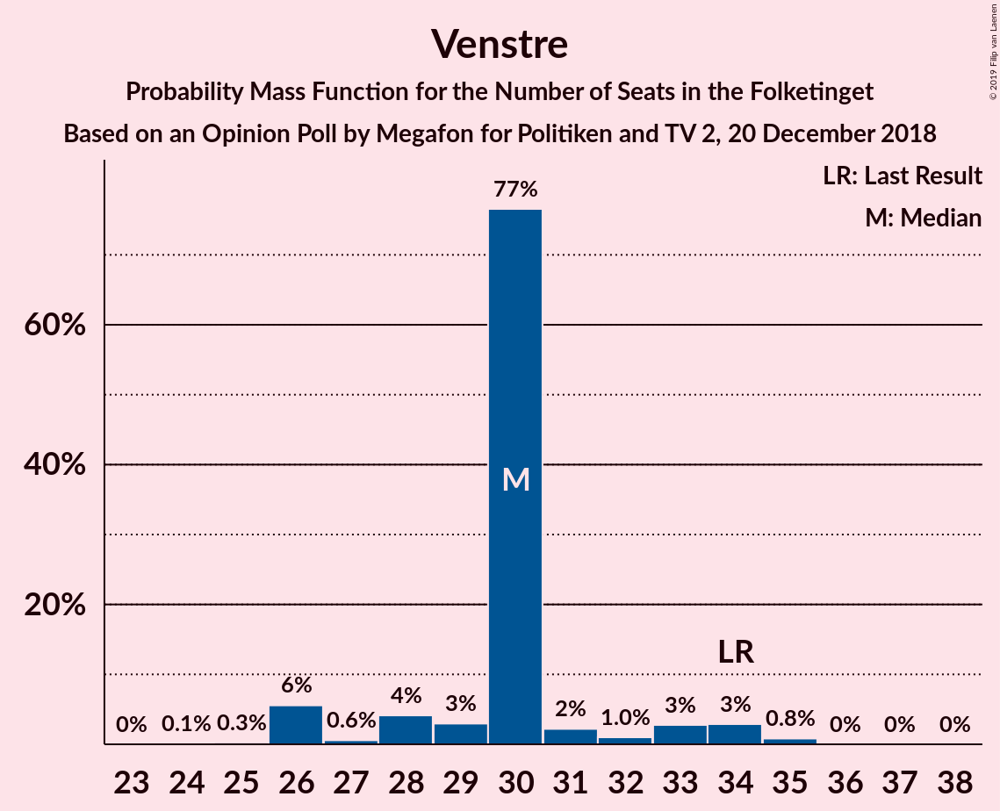
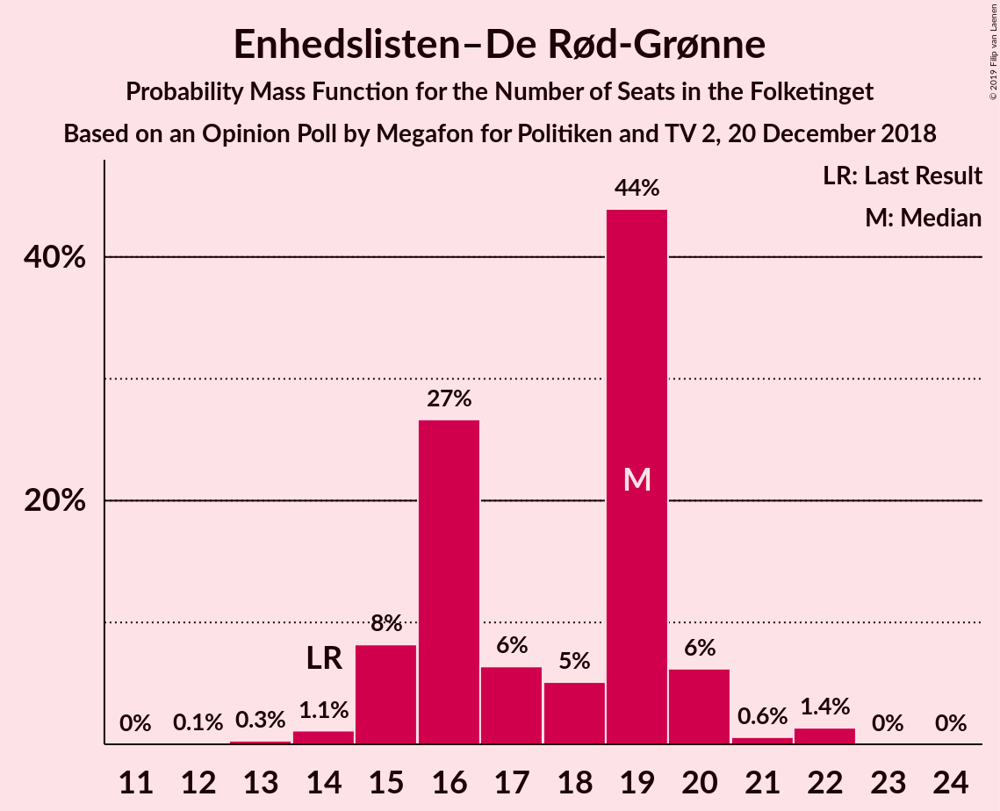
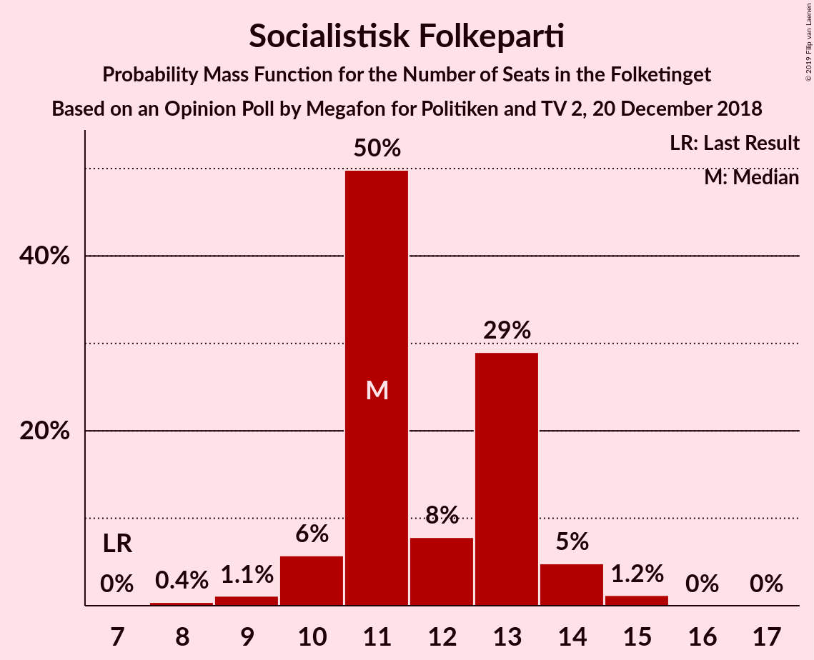
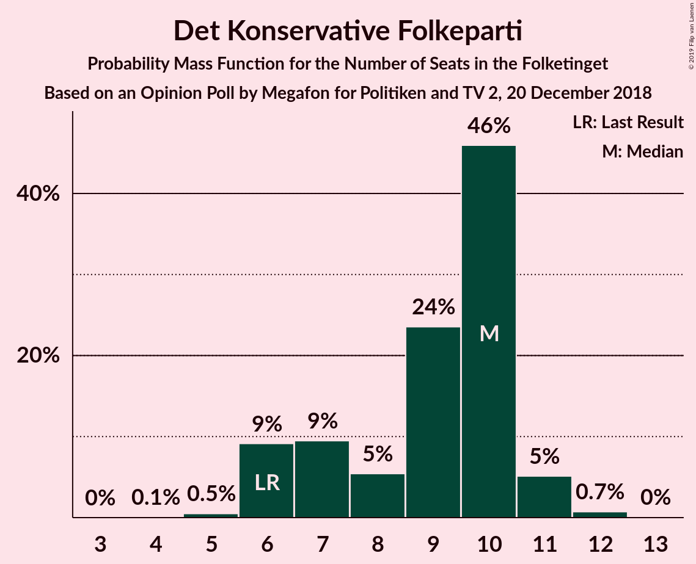
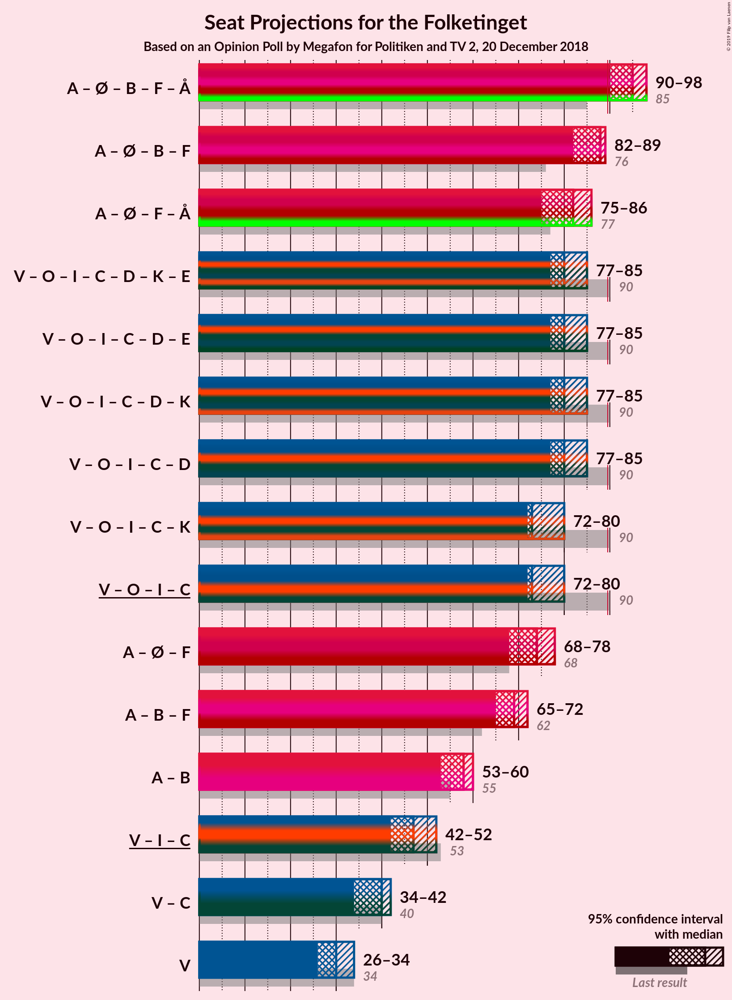
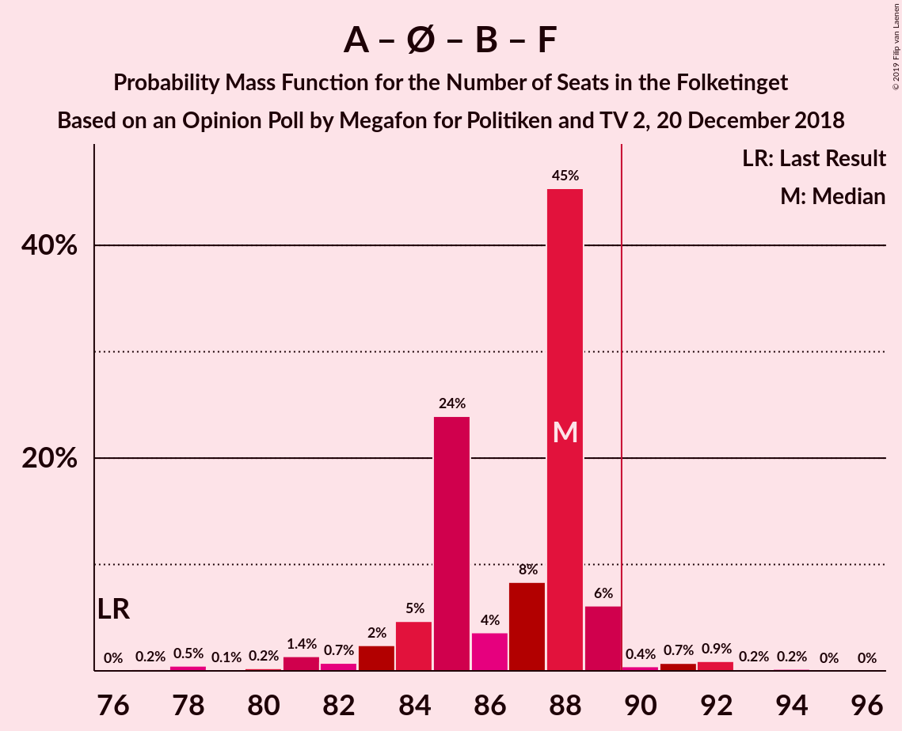
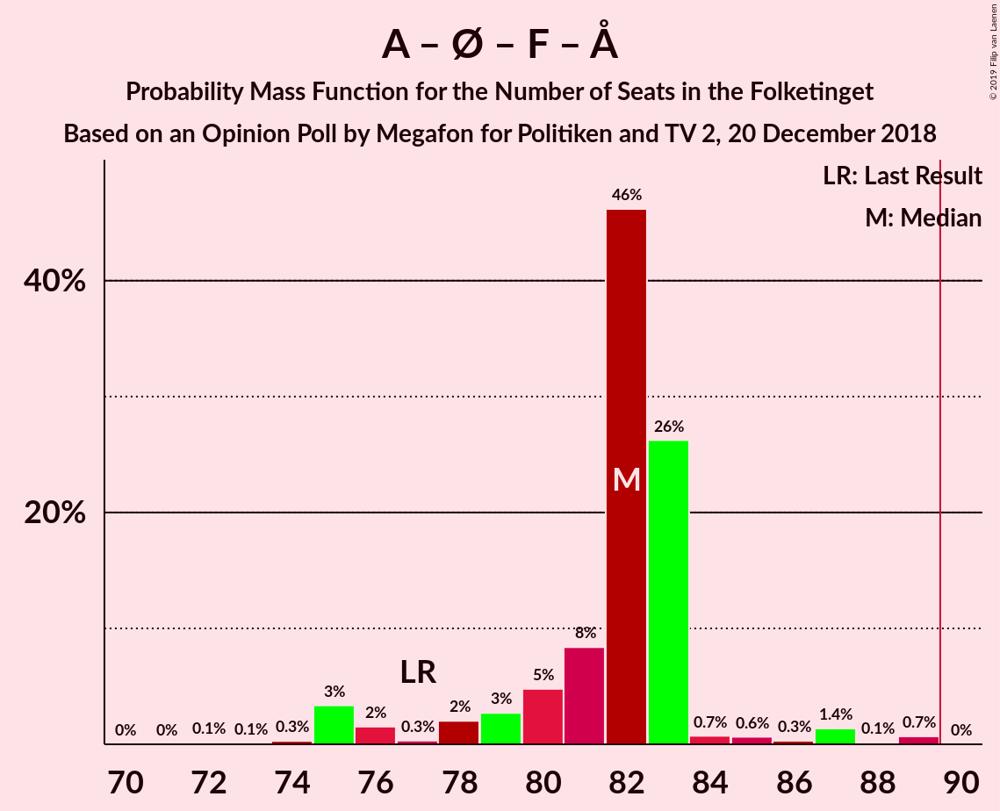
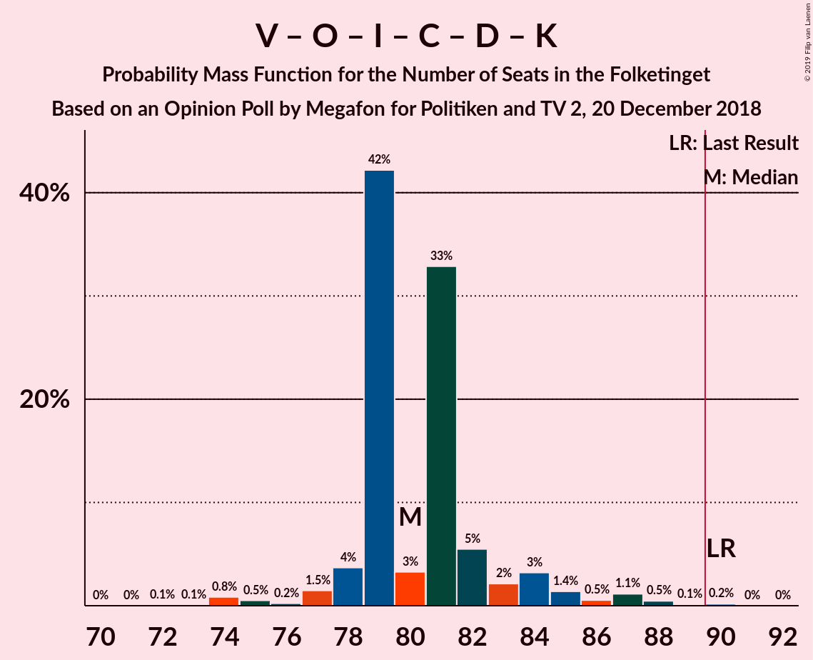
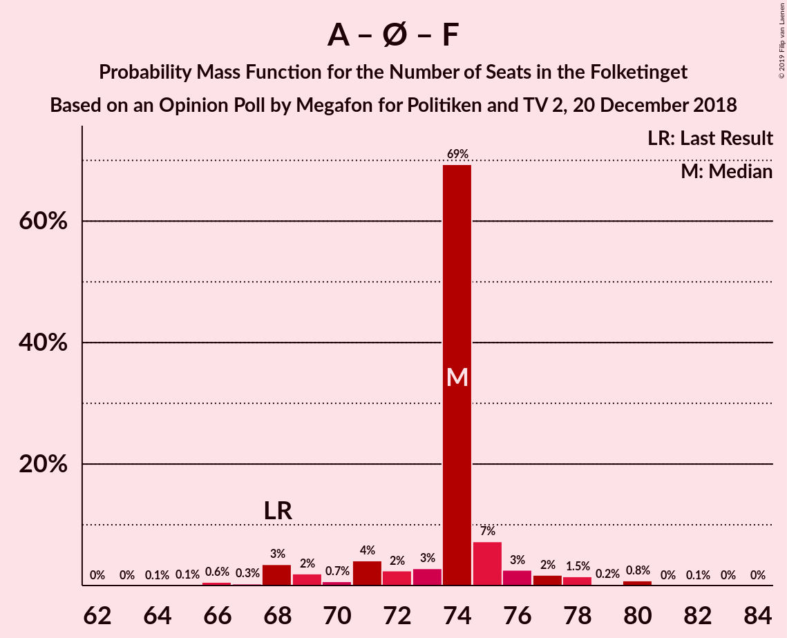

# Opinion Poll by Megafon for Politiken and TV 2, 20 December 2018

<a href="#voting-intentions">Voting Intentions</a> | <a href="#seats">Seats</a> | <a href="#coalitions">Coalitions</a> | <a href="#technical-information">Technical Information</a>

## Voting Intentions

### Confidence Intervals

| Party | Last Result | Poll Result | 80% Confidence Interval | 90% Confidence Interval | 95% Confidence Interval | 99% Confidence Interval |
|:-----:|:-----------:|:-----------:|:-----------------------:|:-----------------------:|:-----------------------:|:-----------------------:|
| Socialdemokraterne | 26.3% | 25.1% | 23.4–26.9% |22.9–27.4% |22.5–27.9% |21.7–28.8% |
| Venstre | 19.5% | 17.0% | 15.5–18.6% |15.2–19.1% |14.8–19.5% |14.1–20.3% |
| Dansk Folkeparti | 21.1% | 16.2% | 14.8–17.8% |14.4–18.2% |14.0–18.6% |13.4–19.4% |
| Enhedslisten–De Rød-Grønne | 7.8% | 9.9% | 8.8–11.2% |8.5–11.6% |8.2–11.9% |7.7–12.6% |
| Radikale Venstre | 4.6% | 7.4% | 6.4–8.6% |6.2–8.9% |5.9–9.2% |5.5–9.8% |
| Socialistisk Folkeparti | 4.2% | 6.4% | 5.5–7.5% |5.3–7.8% |5.0–8.1% |4.6–8.7% |
| Liberal Alliance | 7.5% | 4.9% | 4.1–5.9% |3.9–6.2% |3.7–6.4% |3.4–6.9% |
| Det Konservative Folkeparti | 3.4% | 4.5% | 3.8–5.5% |3.6–5.7% |3.4–6.0% |3.0–6.5% |
| Alternativet | 4.8% | 4.1% | 3.4–5.0% |3.2–5.3% |3.0–5.5% |2.7–6.0% |
| Nye Borgerlige | 0.0% | 3.1% | 2.5–3.9% |2.3–4.2% |2.2–4.4% |1.9–4.8% |
| Kristendemokraterne | 0.8% | 0.9% | 0.6–1.4% |0.5–1.6% |0.5–1.7% |0.4–2.0% |

*Note:* The poll result column reflects the actual value used in the calculations. Published results may vary slightly, and in addition be rounded to fewer digits.

## Seats

### Confidence Intervals

| Party | Last Result | Median | 80% Confidence Interval | 90% Confidence Interval | 95% Confidence Interval | 99% Confidence Interval |
|:-----:|:-----------:|:------:|:-----------------------:|:-----------------------:|:-----------------------:|:-----------------------:|
| <a href="#socialdemokraterne">Socialdemokraterne</a> | 47 | 42 | 42–45 |42–51 |42–51 |42–51 |
| <a href="#venstre">Venstre</a> | 34 | 29 | 29–32 |28–32 |28–32 |26–36 |
| <a href="#dansk-folkeparti">Dansk Folkeparti</a> | 37 | 31 | 28–31 |24–31 |24–31 |24–31 |
| <a href="#enhedslisten–de-rød-grønne">Enhedslisten–De Rød-Grønne</a> | 14 | 19 | 19 |18–19 |18–19 |11–19 |
| <a href="#radikale-venstre">Radikale Venstre</a> | 8 | 15 | 14–15 |10–15 |10–15 |10–18 |
| <a href="#socialistisk-folkeparti">Socialistisk Folkeparti</a> | 7 | 9 | 9–11 |9–12 |9–12 |9–12 |
| <a href="#liberal-alliance">Liberal Alliance</a> | 13 | 10 | 9–10 |9–11 |9–11 |8–11 |
| <a href="#det-konservative-folkeparti">Det Konservative Folkeparti</a> | 6 | 9 | 7–9 |7–9 |7–9 |7–9 |
| <a href="#alternativet">Alternativet</a> | 9 | 5 | 5–6 |5–9 |5–9 |5–9 |
| <a href="#nye-borgerlige">Nye Borgerlige</a> | 0 | 6 | 4–6 |4–6 |4–6 |4–6 |
| <a href="#kristendemokraterne">Kristendemokraterne</a> | 0 | 0 | 0 |0 |0 |0 |

### Socialdemokraterne

*For a full overview of the results for this party, see the [Socialdemokraterne](party-socialdemokraterne.html) page.*

| Number of Seats | Probability | Accumulated | Special Marks |
|:---------------:|:-----------:|:-----------:|:-------------:|
| 37 | 0% | 100% |  |
| 38 | 0.1% | 99.9% |  |
| 39 | 0% | 99.8% |  |
| 40 | 0% | 99.8% |  |
| 41 | 0% | 99.8% |  |
| 42 | 58% | 99.8% | Median |
| 43 | 0.9% | 41% |  |
| 44 | 0% | 41% |  |
| 45 | 34% | 40% |  |
| 46 | 0% | 7% |  |
| 47 | 0.1% | 7% | Last Result |
| 48 | 0% | 7% |  |
| 49 | 0.4% | 7% |  |
| 50 | 0.2% | 6% |  |
| 51 | 6% | 6% |  |
| 52 | 0% | 0% |  |

### Venstre

*For a full overview of the results for this party, see the [Venstre](party-venstre.html) page.*

| Number of Seats | Probability | Accumulated | Special Marks |
|:---------------:|:-----------:|:-----------:|:-------------:|
| 22 | 0.1% | 100% |  |
| 23 | 0% | 99.9% |  |
| 24 | 0.3% | 99.9% |  |
| 25 | 0% | 99.6% |  |
| 26 | 0% | 99.5% |  |
| 27 | 0% | 99.5% |  |
| 28 | 6% | 99.5% |  |
| 29 | 59% | 94% | Median |
| 30 | 0.1% | 35% |  |
| 31 | 0% | 35% |  |
| 32 | 34% | 35% |  |
| 33 | 0% | 1.0% |  |
| 34 | 0% | 1.0% | Last Result |
| 35 | 0% | 1.0% |  |
| 36 | 1.0% | 1.0% |  |
| 37 | 0% | 0% |  |

### Dansk Folkeparti

*For a full overview of the results for this party, see the [Dansk Folkeparti](party-danskfolkeparti.html) page.*

| Number of Seats | Probability | Accumulated | Special Marks |
|:---------------:|:-----------:|:-----------:|:-------------:|
| 24 | 6% | 100% |  |
| 25 | 0.3% | 94% |  |
| 26 | 0.4% | 94% |  |
| 27 | 0.9% | 93% |  |
| 28 | 34% | 92% |  |
| 29 | 0.1% | 59% |  |
| 30 | 0% | 59% |  |
| 31 | 59% | 59% | Median |
| 32 | 0% | 0.1% |  |
| 33 | 0% | 0.1% |  |
| 34 | 0% | 0% |  |
| 35 | 0% | 0% |  |
| 36 | 0% | 0% |  |
| 37 | 0% | 0% | Last Result |

### Enhedslisten–De Rød-Grønne

*For a full overview of the results for this party, see the [Enhedslisten–De Rød-Grønne](party-enhedslisten–derød-grønne.html) page.*

| Number of Seats | Probability | Accumulated | Special Marks |
|:---------------:|:-----------:|:-----------:|:-------------:|
| 11 | 0.9% | 100% |  |
| 12 | 0% | 99.1% |  |
| 13 | 0% | 99.1% |  |
| 14 | 0% | 99.1% | Last Result |
| 15 | 0.1% | 99.1% |  |
| 16 | 0% | 99.0% |  |
| 17 | 0% | 99.0% |  |
| 18 | 6% | 99.0% |  |
| 19 | 93% | 93% | Median |
| 20 | 0% | 0.4% |  |
| 21 | 0.2% | 0.4% |  |
| 22 | 0% | 0.2% |  |
| 23 | 0% | 0.2% |  |
| 24 | 0.1% | 0.1% |  |
| 25 | 0% | 0% |  |

### Radikale Venstre

*For a full overview of the results for this party, see the [Radikale Venstre](party-radikalevenstre.html) page.*

| Number of Seats | Probability | Accumulated | Special Marks |
|:---------------:|:-----------:|:-----------:|:-------------:|
| 7 | 0.2% | 100% |  |
| 8 | 0% | 99.8% | Last Result |
| 9 | 0% | 99.8% |  |
| 10 | 6% | 99.8% |  |
| 11 | 0% | 94% |  |
| 12 | 0.1% | 94% |  |
| 13 | 0.3% | 94% |  |
| 14 | 34% | 93% |  |
| 15 | 59% | 60% | Median |
| 16 | 0.1% | 1.1% |  |
| 17 | 0% | 0.9% |  |
| 18 | 0.9% | 0.9% |  |
| 19 | 0% | 0% |  |

### Socialistisk Folkeparti

*For a full overview of the results for this party, see the [Socialistisk Folkeparti](party-socialistiskfolkeparti.html) page.*

| Number of Seats | Probability | Accumulated | Special Marks |
|:---------------:|:-----------:|:-----------:|:-------------:|
| 7 | 0% | 100% | Last Result |
| 8 | 0% | 100% |  |
| 9 | 59% | 100% | Median |
| 10 | 0% | 41% |  |
| 11 | 35% | 41% |  |
| 12 | 6% | 6% |  |
| 13 | 0.2% | 0.2% |  |
| 14 | 0% | 0% |  |

### Liberal Alliance

*For a full overview of the results for this party, see the [Liberal Alliance](party-liberalalliance.html) page.*

| Number of Seats | Probability | Accumulated | Special Marks |
|:---------------:|:-----------:|:-----------:|:-------------:|
| 6 | 0.1% | 100% |  |
| 7 | 0.2% | 99.9% |  |
| 8 | 0.3% | 99.7% |  |
| 9 | 34% | 99.4% |  |
| 10 | 59% | 65% | Median |
| 11 | 6% | 6% |  |
| 12 | 0% | 0.3% |  |
| 13 | 0% | 0.3% | Last Result |
| 14 | 0% | 0.3% |  |
| 15 | 0.3% | 0.3% |  |
| 16 | 0% | 0% |  |

### Det Konservative Folkeparti

*For a full overview of the results for this party, see the [Det Konservative Folkeparti](party-detkonservativefolkeparti.html) page.*

| Number of Seats | Probability | Accumulated | Special Marks |
|:---------------:|:-----------:|:-----------:|:-------------:|
| 6 | 0.1% | 100% | Last Result |
| 7 | 41% | 99.8% |  |
| 8 | 0.5% | 59% |  |
| 9 | 59% | 59% | Median |
| 10 | 0% | 0% |  |

### Alternativet

*For a full overview of the results for this party, see the [Alternativet](party-alternativet.html) page.*

| Number of Seats | Probability | Accumulated | Special Marks |
|:---------------:|:-----------:|:-----------:|:-------------:|
| 5 | 59% | 100% | Median |
| 6 | 34% | 41% |  |
| 7 | 1.3% | 8% |  |
| 8 | 0.1% | 6% |  |
| 9 | 6% | 6% | Last Result |
| 10 | 0.3% | 0.3% |  |
| 11 | 0% | 0% |  |

### Nye Borgerlige

*For a full overview of the results for this party, see the [Nye Borgerlige](party-nyeborgerlige.html) page.*

| Number of Seats | Probability | Accumulated | Special Marks |
|:---------------:|:-----------:|:-----------:|:-------------:|
| 0 | 0.1% | 100% | Last Result |
| 1 | 0% | 99.9% |  |
| 2 | 0% | 99.9% |  |
| 3 | 0% | 99.9% |  |
| 4 | 34% | 99.9% |  |
| 5 | 7% | 66% |  |
| 6 | 59% | 59% | Median |
| 7 | 0% | 0.2% |  |
| 8 | 0% | 0.2% |  |
| 9 | 0.1% | 0.2% |  |
| 10 | 0% | 0% |  |

### Kristendemokraterne

*For a full overview of the results for this party, see the [Kristendemokraterne](party-kristendemokraterne.html) page.*

| Number of Seats | Probability | Accumulated | Special Marks |
|:---------------:|:-----------:|:-----------:|:-------------:|
| 0 | 100% | 100% | Last Result, Median |

## Coalitions

### Confidence Intervals

| Coalition | Last Result | Median | Majority? | 80% Confidence Interval | 90% Confidence Interval | 95% Confidence Interval | 99% Confidence Interval |
|:---------:|:-----------:|:------:|:---------:|:-----------------------:|:-----------------------:|:-----------------------:|:-----------------------:|
| Socialdemokraterne – Enhedslisten–De Rød-Grønne – Radikale Venstre – Socialistisk Folkeparti – Alternativet | 85 | 90 | 99.9% | 90–95 | 90–100 | 90–100 | 90–100 |
| Socialdemokraterne – Enhedslisten–De Rød-Grønne – Radikale Venstre – Socialistisk Folkeparti | 76 | 85 | 6% | 85–89 | 85–91 | 85–91 | 83–91 |
| Socialdemokraterne – Enhedslisten–De Rød-Grønne – Socialistisk Folkeparti – Alternativet | 77 | 75 | 6% | 75–81 | 75–90 | 75–90 | 72–90 |
| Venstre – Dansk Folkeparti – Liberal Alliance – Det Konservative Folkeparti – Nye Borgerlige – Kristendemokraterne | 90 | 85 | 0% | 80–85 | 75–85 | 75–85 | 75–85 |
| Venstre – Dansk Folkeparti – Liberal Alliance – Det Konservative Folkeparti – Nye Borgerlige | 90 | 85 | 0% | 80–85 | 75–85 | 75–85 | 75–85 |
| Socialdemokraterne – Enhedslisten–De Rød-Grønne – Socialistisk Folkeparti | 68 | 70 | 0% | 70–75 | 70–81 | 70–81 | 65–81 |
| Venstre – Dansk Folkeparti – Liberal Alliance – Det Konservative Folkeparti – Kristendemokraterne | 90 | 79 | 0% | 76–79 | 70–79 | 70–79 | 70–80 |
| Venstre – Dansk Folkeparti – Liberal Alliance – Det Konservative Folkeparti | 90 | 79 | 0% | 76–79 | 70–79 | 70–79 | 70–80 |
| Socialdemokraterne – Radikale Venstre – Socialistisk Folkeparti | 62 | 66 | 0% | 66–70 | 66–73 | 66–73 | 66–73 |
| Socialdemokraterne – Radikale Venstre | 55 | 57 | 0% | 57–59 | 57–61 | 57–61 | 57–61 |
| Venstre – Liberal Alliance – Det Konservative Folkeparti | 53 | 48 | 0% | 48 | 46–48 | 46–48 | 45–53 |
| Venstre – Det Konservative Folkeparti | 40 | 38 | 0% | 38–39 | 35–39 | 35–39 | 34–43 |
| Venstre | 34 | 29 | 0% | 29–32 | 28–32 | 28–32 | 26–36 |

### Socialdemokraterne – Enhedslisten–De Rød-Grønne – Radikale Venstre – Socialistisk Folkeparti – Alternativet

| Number of Seats | Probability | Accumulated | Special Marks |
|:---------------:|:-----------:|:-----------:|:-------------:|
| 85 | 0% | 100% | Last Result |
| 86 | 0% | 100% |  |
| 87 | 0% | 100% |  |
| 88 | 0% | 100% |  |
| 89 | 0.1% | 100% |  |
| 90 | 59% | 99.9% | Median, Majority |
| 91 | 0% | 41% |  |
| 92 | 0.2% | 41% |  |
| 93 | 0% | 40% |  |
| 94 | 0% | 40% |  |
| 95 | 34% | 40% |  |
| 96 | 0% | 7% |  |
| 97 | 0.3% | 7% |  |
| 98 | 0.2% | 6% |  |
| 99 | 0% | 6% |  |
| 100 | 6% | 6% |  |
| 101 | 0% | 0.2% |  |
| 102 | 0% | 0.1% |  |
| 103 | 0% | 0.1% |  |
| 104 | 0% | 0.1% |  |
| 105 | 0% | 0.1% |  |
| 106 | 0% | 0.1% |  |
| 107 | 0% | 0.1% |  |
| 108 | 0.1% | 0.1% |  |
| 109 | 0% | 0% |  |

### Socialdemokraterne – Enhedslisten–De Rød-Grønne – Radikale Venstre – Socialistisk Folkeparti

| Number of Seats | Probability | Accumulated | Special Marks |
|:---------------:|:-----------:|:-----------:|:-------------:|
| 76 | 0% | 100% | Last Result |
| 77 | 0% | 100% |  |
| 78 | 0% | 100% |  |
| 79 | 0% | 100% |  |
| 80 | 0% | 100% |  |
| 81 | 0% | 100% |  |
| 82 | 0% | 100% |  |
| 83 | 1.0% | 100% |  |
| 84 | 0% | 99.0% |  |
| 85 | 58% | 99.0% | Median |
| 86 | 0% | 41% |  |
| 87 | 0.1% | 41% |  |
| 88 | 0.2% | 40% |  |
| 89 | 34% | 40% |  |
| 90 | 0.4% | 6% | Majority |
| 91 | 6% | 6% |  |
| 92 | 0% | 0.1% |  |
| 93 | 0% | 0.1% |  |
| 94 | 0% | 0.1% |  |
| 95 | 0% | 0.1% |  |
| 96 | 0% | 0.1% |  |
| 97 | 0% | 0.1% |  |
| 98 | 0% | 0.1% |  |
| 99 | 0% | 0.1% |  |
| 100 | 0.1% | 0.1% |  |
| 101 | 0% | 0% |  |

### Socialdemokraterne – Enhedslisten–De Rød-Grønne – Socialistisk Folkeparti – Alternativet

| Number of Seats | Probability | Accumulated | Special Marks |
|:---------------:|:-----------:|:-----------:|:-------------:|
| 72 | 0.9% | 100% |  |
| 73 | 0% | 99.1% |  |
| 74 | 0% | 99.1% |  |
| 75 | 58% | 99.1% | Median |
| 76 | 0% | 41% |  |
| 77 | 0.2% | 41% | Last Result |
| 78 | 0% | 41% |  |
| 79 | 0% | 41% |  |
| 80 | 0% | 41% |  |
| 81 | 34% | 41% |  |
| 82 | 0% | 7% |  |
| 83 | 0% | 7% |  |
| 84 | 0.3% | 7% |  |
| 85 | 0% | 6% |  |
| 86 | 0% | 6% |  |
| 87 | 0% | 6% |  |
| 88 | 0% | 6% |  |
| 89 | 0% | 6% |  |
| 90 | 6% | 6% | Majority |
| 91 | 0.2% | 0.3% |  |
| 92 | 0.1% | 0.1% |  |
| 93 | 0% | 0% |  |

### Venstre – Dansk Folkeparti – Liberal Alliance – Det Konservative Folkeparti – Nye Borgerlige – Kristendemokraterne

| Number of Seats | Probability | Accumulated | Special Marks |
|:---------------:|:-----------:|:-----------:|:-------------:|
| 67 | 0.1% | 100% |  |
| 68 | 0% | 99.9% |  |
| 69 | 0% | 99.9% |  |
| 70 | 0% | 99.9% |  |
| 71 | 0% | 99.9% |  |
| 72 | 0% | 99.9% |  |
| 73 | 0% | 99.9% |  |
| 74 | 0% | 99.9% |  |
| 75 | 6% | 99.8% |  |
| 76 | 0% | 94% |  |
| 77 | 0.2% | 94% |  |
| 78 | 0.3% | 94% |  |
| 79 | 0% | 93% |  |
| 80 | 34% | 93% |  |
| 81 | 0% | 60% |  |
| 82 | 0% | 60% |  |
| 83 | 0.2% | 60% |  |
| 84 | 0% | 59% |  |
| 85 | 59% | 59% | Median |
| 86 | 0.1% | 0.1% |  |
| 87 | 0% | 0% |  |
| 88 | 0% | 0% |  |
| 89 | 0% | 0% |  |
| 90 | 0% | 0% | Last Result, Majority |

### Venstre – Dansk Folkeparti – Liberal Alliance – Det Konservative Folkeparti – Nye Borgerlige

| Number of Seats | Probability | Accumulated | Special Marks |
|:---------------:|:-----------:|:-----------:|:-------------:|
| 67 | 0.1% | 100% |  |
| 68 | 0% | 99.9% |  |
| 69 | 0% | 99.9% |  |
| 70 | 0% | 99.9% |  |
| 71 | 0% | 99.9% |  |
| 72 | 0% | 99.9% |  |
| 73 | 0% | 99.9% |  |
| 74 | 0% | 99.9% |  |
| 75 | 6% | 99.8% |  |
| 76 | 0% | 94% |  |
| 77 | 0.2% | 94% |  |
| 78 | 0.3% | 94% |  |
| 79 | 0% | 93% |  |
| 80 | 34% | 93% |  |
| 81 | 0% | 59% |  |
| 82 | 0% | 59% |  |
| 83 | 0.1% | 59% |  |
| 84 | 0% | 59% |  |
| 85 | 59% | 59% | Median |
| 86 | 0.1% | 0.1% |  |
| 87 | 0% | 0% |  |
| 88 | 0% | 0% |  |
| 89 | 0% | 0% |  |
| 90 | 0% | 0% | Last Result, Majority |

### Socialdemokraterne – Enhedslisten–De Rød-Grønne – Socialistisk Folkeparti

| Number of Seats | Probability | Accumulated | Special Marks |
|:---------------:|:-----------:|:-----------:|:-------------:|
| 65 | 0.9% | 100% |  |
| 66 | 0% | 99.1% |  |
| 67 | 0% | 99.1% |  |
| 68 | 0% | 99.1% | Last Result |
| 69 | 0% | 99.1% |  |
| 70 | 58% | 99.1% | Median |
| 71 | 0.1% | 41% |  |
| 72 | 0.1% | 41% |  |
| 73 | 0% | 41% |  |
| 74 | 0% | 40% |  |
| 75 | 34% | 40% |  |
| 76 | 0% | 7% |  |
| 77 | 0.3% | 7% |  |
| 78 | 0% | 6% |  |
| 79 | 0% | 6% |  |
| 80 | 0% | 6% |  |
| 81 | 6% | 6% |  |
| 82 | 0% | 0.1% |  |
| 83 | 0% | 0.1% |  |
| 84 | 0.1% | 0.1% |  |
| 85 | 0% | 0% |  |

### Venstre – Dansk Folkeparti – Liberal Alliance – Det Konservative Folkeparti – Kristendemokraterne

| Number of Seats | Probability | Accumulated | Special Marks |
|:---------------:|:-----------:|:-----------:|:-------------:|
| 62 | 0.1% | 100% |  |
| 63 | 0% | 99.9% |  |
| 64 | 0% | 99.9% |  |
| 65 | 0% | 99.9% |  |
| 66 | 0% | 99.9% |  |
| 67 | 0% | 99.9% |  |
| 68 | 0% | 99.9% |  |
| 69 | 0% | 99.9% |  |
| 70 | 6% | 99.9% |  |
| 71 | 0.2% | 94% |  |
| 72 | 0.3% | 94% |  |
| 73 | 0% | 93% |  |
| 74 | 0.2% | 93% |  |
| 75 | 0% | 93% |  |
| 76 | 34% | 93% |  |
| 77 | 0% | 59% |  |
| 78 | 0% | 59% |  |
| 79 | 58% | 59% | Median |
| 80 | 1.0% | 1.0% |  |
| 81 | 0% | 0% |  |
| 82 | 0% | 0% |  |
| 83 | 0% | 0% |  |
| 84 | 0% | 0% |  |
| 85 | 0% | 0% |  |
| 86 | 0% | 0% |  |
| 87 | 0% | 0% |  |
| 88 | 0% | 0% |  |
| 89 | 0% | 0% |  |
| 90 | 0% | 0% | Last Result, Majority |

### Venstre – Dansk Folkeparti – Liberal Alliance – Det Konservative Folkeparti

| Number of Seats | Probability | Accumulated | Special Marks |
|:---------------:|:-----------:|:-----------:|:-------------:|
| 62 | 0.1% | 100% |  |
| 63 | 0% | 99.9% |  |
| 64 | 0% | 99.9% |  |
| 65 | 0% | 99.9% |  |
| 66 | 0% | 99.9% |  |
| 67 | 0% | 99.9% |  |
| 68 | 0% | 99.9% |  |
| 69 | 0% | 99.9% |  |
| 70 | 6% | 99.9% |  |
| 71 | 0.2% | 94% |  |
| 72 | 0.3% | 94% |  |
| 73 | 0% | 93% |  |
| 74 | 0.2% | 93% |  |
| 75 | 0% | 93% |  |
| 76 | 34% | 93% |  |
| 77 | 0% | 59% |  |
| 78 | 0% | 59% |  |
| 79 | 58% | 59% | Median |
| 80 | 1.0% | 1.0% |  |
| 81 | 0% | 0% |  |
| 82 | 0% | 0% |  |
| 83 | 0% | 0% |  |
| 84 | 0% | 0% |  |
| 85 | 0% | 0% |  |
| 86 | 0% | 0% |  |
| 87 | 0% | 0% |  |
| 88 | 0% | 0% |  |
| 89 | 0% | 0% |  |
| 90 | 0% | 0% | Last Result, Majority |

### Socialdemokraterne – Radikale Venstre – Socialistisk Folkeparti

| Number of Seats | Probability | Accumulated | Special Marks |
|:---------------:|:-----------:|:-----------:|:-------------:|
| 62 | 0% | 100% | Last Result |
| 63 | 0% | 100% |  |
| 64 | 0% | 100% |  |
| 65 | 0% | 100% |  |
| 66 | 59% | 99.9% | Median |
| 67 | 0% | 41% |  |
| 68 | 0.1% | 41% |  |
| 69 | 0.2% | 41% |  |
| 70 | 34% | 41% |  |
| 71 | 0.3% | 7% |  |
| 72 | 0.9% | 7% |  |
| 73 | 6% | 6% |  |
| 74 | 0% | 0.1% |  |
| 75 | 0% | 0.1% |  |
| 76 | 0.1% | 0.1% |  |
| 77 | 0% | 0% |  |

### Socialdemokraterne – Radikale Venstre

| Number of Seats | Probability | Accumulated | Special Marks |
|:---------------:|:-----------:|:-----------:|:-------------:|
| 53 | 0.1% | 100% |  |
| 54 | 0% | 99.8% |  |
| 55 | 0.1% | 99.8% | Last Result |
| 56 | 0% | 99.7% |  |
| 57 | 59% | 99.7% | Median |
| 58 | 0% | 41% |  |
| 59 | 34% | 41% |  |
| 60 | 0% | 7% |  |
| 61 | 7% | 7% |  |
| 62 | 0.3% | 0.4% |  |
| 63 | 0% | 0.1% |  |
| 64 | 0% | 0.1% |  |
| 65 | 0.1% | 0.1% |  |
| 66 | 0% | 0% |  |

### Venstre – Liberal Alliance – Det Konservative Folkeparti

| Number of Seats | Probability | Accumulated | Special Marks |
|:---------------:|:-----------:|:-----------:|:-------------:|
| 36 | 0.1% | 100% |  |
| 37 | 0% | 99.9% |  |
| 38 | 0% | 99.9% |  |
| 39 | 0% | 99.9% |  |
| 40 | 0% | 99.9% |  |
| 41 | 0% | 99.9% |  |
| 42 | 0% | 99.9% |  |
| 43 | 0.1% | 99.8% |  |
| 44 | 0% | 99.7% |  |
| 45 | 0.2% | 99.7% |  |
| 46 | 6% | 99.5% |  |
| 47 | 0.3% | 94% |  |
| 48 | 92% | 93% | Median |
| 49 | 0% | 1.0% |  |
| 50 | 0% | 1.0% |  |
| 51 | 0.1% | 1.0% |  |
| 52 | 0% | 0.9% |  |
| 53 | 0.9% | 0.9% | Last Result |
| 54 | 0% | 0% |  |

### Venstre – Det Konservative Folkeparti

| Number of Seats | Probability | Accumulated | Special Marks |
|:---------------:|:-----------:|:-----------:|:-------------:|
| 29 | 0.1% | 100% |  |
| 30 | 0% | 99.9% |  |
| 31 | 0% | 99.9% |  |
| 32 | 0.3% | 99.9% |  |
| 33 | 0% | 99.5% |  |
| 34 | 0% | 99.5% |  |
| 35 | 6% | 99.5% |  |
| 36 | 0.1% | 94% |  |
| 37 | 0.2% | 93% |  |
| 38 | 58% | 93% | Median |
| 39 | 34% | 35% |  |
| 40 | 0% | 1.0% | Last Result |
| 41 | 0% | 1.0% |  |
| 42 | 0% | 1.0% |  |
| 43 | 0.9% | 1.0% |  |
| 44 | 0% | 0.1% |  |
| 45 | 0.1% | 0.1% |  |
| 46 | 0% | 0% |  |

### Venstre

| Number of Seats | Probability | Accumulated | Special Marks |
|:---------------:|:-----------:|:-----------:|:-------------:|
| 22 | 0.1% | 100% |  |
| 23 | 0% | 99.9% |  |
| 24 | 0.3% | 99.9% |  |
| 25 | 0% | 99.6% |  |
| 26 | 0% | 99.5% |  |
| 27 | 0% | 99.5% |  |
| 28 | 6% | 99.5% |  |
| 29 | 59% | 94% | Median |
| 30 | 0.1% | 35% |  |
| 31 | 0% | 35% |  |
| 32 | 34% | 35% |  |
| 33 | 0% | 1.0% |  |
| 34 | 0% | 1.0% | Last Result |
| 35 | 0% | 1.0% |  |
| 36 | 1.0% | 1.0% |  |
| 37 | 0% | 0% |  |

## Technical Information

### Opinion Poll

+ **Polling firm:** Megafon
+ **Commissioner(s):** Politiken and TV 2
+ **Fieldwork period:** 20 December 2018

### Calculations

+ **Sample size:** 1000
+ **Simulations done:** 1,024
+ **Error estimate:** 4.83%

