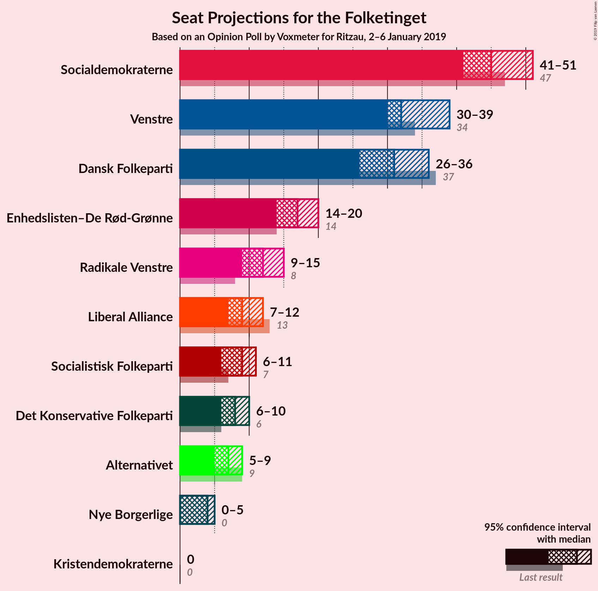
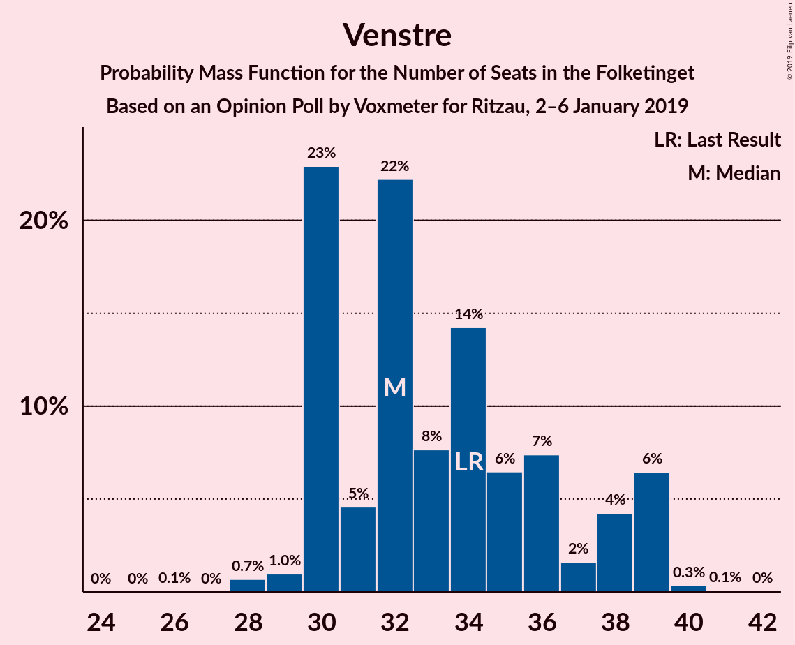
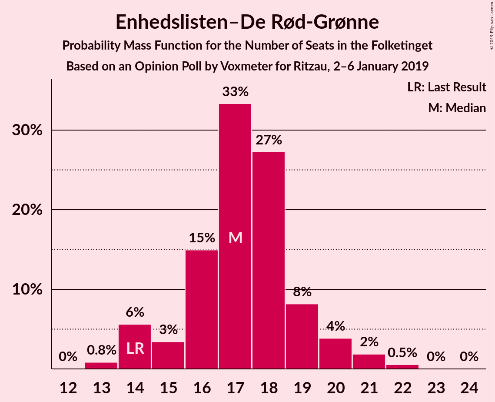
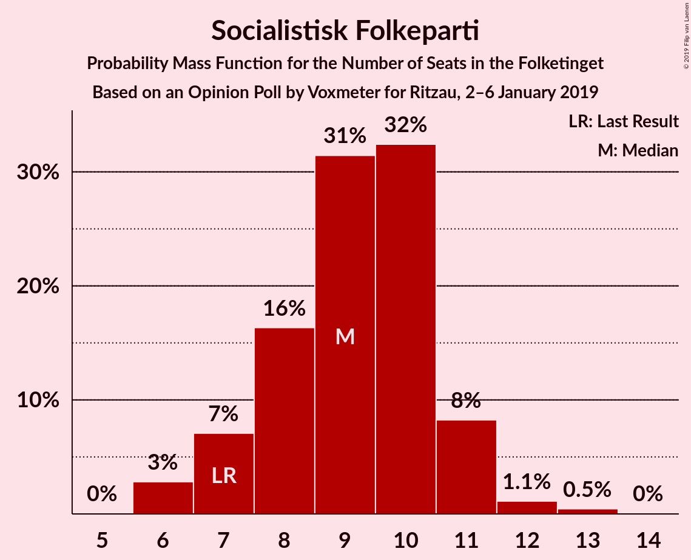
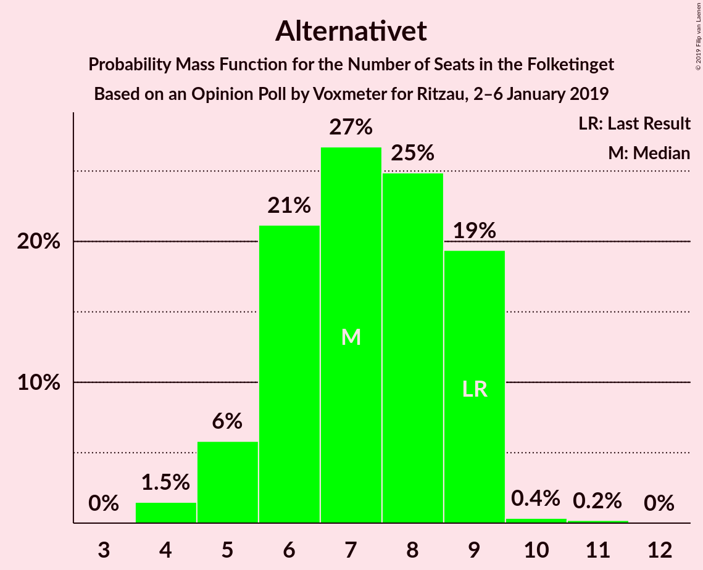

# Opinion Poll by Voxmeter for Ritzau, 2–6 January 2019

<a href="#voting-intentions">Voting Intentions</a> | <a href="#seats">Seats</a> | <a href="#coalitions">Coalitions</a> | <a href="#technical-information">Technical Information</a>

## Voting Intentions

### Confidence Intervals

| Party | Last Result | Poll Result | 80% Confidence Interval | 90% Confidence Interval | 95% Confidence Interval | 99% Confidence Interval |
|:-----:|:-----------:|:-----------:|:-----------------------:|:-----------------------:|:-----------------------:|:-----------------------:|
| Socialdemokraterne | 26.3% | 25.8% | 24.1–27.6% |23.6–28.1% |23.2–28.5% |22.4–29.4% |
| Venstre | 19.5% | 19.1% | 17.6–20.7% |17.2–21.2% |16.8–21.6% |16.1–22.4% |
| Dansk Folkeparti | 21.1% | 17.7% | 16.2–19.3% |15.8–19.7% |15.5–20.1% |14.8–20.9% |
| Enhedslisten–De Rød-Grønne | 7.8% | 9.6% | 8.6–10.9% |8.2–11.3% |8.0–11.6% |7.5–12.2% |
| Radikale Venstre | 4.6% | 6.6% | 5.7–7.7% |5.4–8.0% |5.2–8.3% |4.8–8.8% |
| Liberal Alliance | 7.5% | 5.2% | 4.4–6.1% |4.1–6.4% |4.0–6.7% |3.6–7.2% |
| Socialistisk Folkeparti | 4.2% | 5.0% | 4.2–5.9% |4.0–6.2% |3.8–6.5% |3.5–7.0% |
| Det Konservative Folkeparti | 3.4% | 4.3% | 3.6–5.2% |3.4–5.5% |3.2–5.7% |2.9–6.2% |
| Alternativet | 4.8% | 3.7% | 3.1–4.6% |2.9–4.8% |2.7–5.1% |2.5–5.5% |
| Nye Borgerlige | 0.0% | 2.1% | 1.6–2.8% |1.5–3.0% |1.4–3.2% |1.2–3.5% |
| Kristendemokraterne | 0.8% | 0.8% | 0.5–1.2% |0.4–1.4% |0.4–1.5% |0.3–1.8% |

*Note:* The poll result column reflects the actual value used in the calculations. Published results may vary slightly, and in addition be rounded to fewer digits.

## Seats

### Confidence Intervals

| Party | Last Result | Median | 80% Confidence Interval | 90% Confidence Interval | 95% Confidence Interval | 99% Confidence Interval |
|:-----:|:-----------:|:------:|:-----------------------:|:-----------------------:|:-----------------------:|:-----------------------:|
| <a href="#socialdemokraterne">Socialdemokraterne</a> | 47 | 46 | 46–48 |46–48 |46–48 |41–50 |
| <a href="#venstre">Venstre</a> | 34 | 31 | 31 |31 |31–32 |30–37 |
| <a href="#dansk-folkeparti">Dansk Folkeparti</a> | 37 | 30 | 30–33 |30–33 |30–33 |29–37 |
| <a href="#enhedslisten–de-rød-grønne">Enhedslisten–De Rød-Grønne</a> | 14 | 18 | 18–22 |18–22 |18–22 |15–22 |
| <a href="#radikale-venstre">Radikale Venstre</a> | 8 | 10 | 10–11 |10–11 |10–11 |10–13 |
| <a href="#liberal-alliance">Liberal Alliance</a> | 13 | 9 | 9 |9 |9 |7–12 |
| <a href="#socialistisk-folkeparti">Socialistisk Folkeparti</a> | 7 | 9 | 9 |9 |9 |7–10 |
| <a href="#det-konservative-folkeparti">Det Konservative Folkeparti</a> | 6 | 9 | 5–9 |5–9 |5–9 |5–9 |
| <a href="#alternativet">Alternativet</a> | 9 | 9 | 7–9 |7–9 |7–9 |5–9 |
| <a href="#nye-borgerlige">Nye Borgerlige</a> | 0 | 4 | 0–4 |0–4 |0–4 |0–6 |
| <a href="#kristendemokraterne">Kristendemokraterne</a> | 0 | 0 | 0 |0 |0 |0 |

### Socialdemokraterne

*For a full overview of the results for this party, see the [Socialdemokraterne](party-socialdemokraterne.html) page.*

| Number of Seats | Probability | Accumulated | Special Marks |
|:---------------:|:-----------:|:-----------:|:-------------:|
| 40 | 0.4% | 100% |  |
| 41 | 0.9% | 99.6% |  |
| 42 | 0.1% | 98.8% |  |
| 43 | 0.1% | 98.7% |  |
| 44 | 0.2% | 98.6% |  |
| 45 | 0.2% | 98% |  |
| 46 | 76% | 98% | Median |
| 47 | 0.2% | 22% | Last Result |
| 48 | 21% | 22% |  |
| 49 | 0.2% | 1.0% |  |
| 50 | 0.8% | 0.8% |  |
| 51 | 0% | 0% |  |

### Venstre

*For a full overview of the results for this party, see the [Venstre](party-venstre.html) page.*

| Number of Seats | Probability | Accumulated | Special Marks |
|:---------------:|:-----------:|:-----------:|:-------------:|
| 29 | 0.5% | 100% |  |
| 30 | 0.1% | 99.5% |  |
| 31 | 97% | 99.4% | Median |
| 32 | 0.8% | 3% |  |
| 33 | 0.3% | 2% |  |
| 34 | 0.2% | 2% | Last Result |
| 35 | 0.5% | 1.3% |  |
| 36 | 0% | 0.8% |  |
| 37 | 0.7% | 0.8% |  |
| 38 | 0.1% | 0.1% |  |
| 39 | 0% | 0% |  |

### Dansk Folkeparti

*For a full overview of the results for this party, see the [Dansk Folkeparti](party-danskfolkeparti.html) page.*

| Number of Seats | Probability | Accumulated | Special Marks |
|:---------------:|:-----------:|:-----------:|:-------------:|
| 26 | 0.3% | 100% |  |
| 27 | 0.1% | 99.7% |  |
| 28 | 0% | 99.6% |  |
| 29 | 0.5% | 99.6% |  |
| 30 | 76% | 99.1% | Median |
| 31 | 0.1% | 23% |  |
| 32 | 0.2% | 23% |  |
| 33 | 21% | 23% |  |
| 34 | 0.8% | 2% |  |
| 35 | 0.1% | 0.8% |  |
| 36 | 0% | 0.7% |  |
| 37 | 0.7% | 0.7% | Last Result |
| 38 | 0% | 0% |  |

### Enhedslisten–De Rød-Grønne

*For a full overview of the results for this party, see the [Enhedslisten–De Rød-Grønne](party-enhedslisten–derød-grønne.html) page.*

| Number of Seats | Probability | Accumulated | Special Marks |
|:---------------:|:-----------:|:-----------:|:-------------:|
| 14 | 0.3% | 100% | Last Result |
| 15 | 0.3% | 99.7% |  |
| 16 | 0% | 99.4% |  |
| 17 | 0.1% | 99.3% |  |
| 18 | 77% | 99.3% | Median |
| 19 | 1.3% | 23% |  |
| 20 | 0.2% | 21% |  |
| 21 | 0.2% | 21% |  |
| 22 | 21% | 21% |  |
| 23 | 0.1% | 0.1% |  |
| 24 | 0% | 0% |  |

### Radikale Venstre

*For a full overview of the results for this party, see the [Radikale Venstre](party-radikalevenstre.html) page.*

| Number of Seats | Probability | Accumulated | Special Marks |
|:---------------:|:-----------:|:-----------:|:-------------:|
| 8 | 0% | 100% | Last Result |
| 9 | 0.3% | 99.9% |  |
| 10 | 77% | 99.6% | Median |
| 11 | 21% | 23% |  |
| 12 | 0.6% | 2% |  |
| 13 | 1.1% | 1.3% |  |
| 14 | 0% | 0.2% |  |
| 15 | 0.2% | 0.2% |  |
| 16 | 0% | 0% |  |

### Liberal Alliance

*For a full overview of the results for this party, see the [Liberal Alliance](party-liberalalliance.html) page.*

| Number of Seats | Probability | Accumulated | Special Marks |
|:---------------:|:-----------:|:-----------:|:-------------:|
| 6 | 0.3% | 100% |  |
| 7 | 0.4% | 99.7% |  |
| 8 | 0.8% | 99.3% |  |
| 9 | 97% | 98% | Median |
| 10 | 0.3% | 0.9% |  |
| 11 | 0% | 0.6% |  |
| 12 | 0.4% | 0.6% |  |
| 13 | 0.1% | 0.2% | Last Result |
| 14 | 0.1% | 0.1% |  |
| 15 | 0% | 0% |  |

### Socialistisk Folkeparti

*For a full overview of the results for this party, see the [Socialistisk Folkeparti](party-socialistiskfolkeparti.html) page.*

| Number of Seats | Probability | Accumulated | Special Marks |
|:---------------:|:-----------:|:-----------:|:-------------:|
| 6 | 0.1% | 100% |  |
| 7 | 0.8% | 99.9% | Last Result |
| 8 | 1.2% | 99.2% |  |
| 9 | 97% | 98% | Median |
| 10 | 0.7% | 1.1% |  |
| 11 | 0.3% | 0.4% |  |
| 12 | 0.1% | 0.1% |  |
| 13 | 0% | 0% |  |

### Det Konservative Folkeparti

*For a full overview of the results for this party, see the [Det Konservative Folkeparti](party-detkonservativefolkeparti.html) page.*

| Number of Seats | Probability | Accumulated | Special Marks |
|:---------------:|:-----------:|:-----------:|:-------------:|
| 5 | 21% | 100% |  |
| 6 | 2% | 79% | Last Result |
| 7 | 0.6% | 77% |  |
| 8 | 0.3% | 77% |  |
| 9 | 76% | 76% | Median |
| 10 | 0.3% | 0.4% |  |
| 11 | 0.1% | 0.1% |  |
| 12 | 0% | 0% |  |

### Alternativet

*For a full overview of the results for this party, see the [Alternativet](party-alternativet.html) page.*

| Number of Seats | Probability | Accumulated | Special Marks |
|:---------------:|:-----------:|:-----------:|:-------------:|
| 4 | 0.3% | 100% |  |
| 5 | 1.1% | 99.7% |  |
| 6 | 0.9% | 98.7% |  |
| 7 | 22% | 98% |  |
| 8 | 0.1% | 76% |  |
| 9 | 76% | 76% | Last Result, Median |
| 10 | 0% | 0% |  |

### Nye Borgerlige

*For a full overview of the results for this party, see the [Nye Borgerlige](party-nyeborgerlige.html) page.*

| Number of Seats | Probability | Accumulated | Special Marks |
|:---------------:|:-----------:|:-----------:|:-------------:|
| 0 | 22% | 100% | Last Result |
| 1 | 0% | 78% |  |
| 2 | 0% | 78% |  |
| 3 | 0% | 78% |  |
| 4 | 77% | 78% | Median |
| 5 | 0.3% | 1.3% |  |
| 6 | 0.8% | 1.1% |  |
| 7 | 0.2% | 0.3% |  |
| 8 | 0.1% | 0.1% |  |
| 9 | 0% | 0% |  |

### Kristendemokraterne

*For a full overview of the results for this party, see the [Kristendemokraterne](party-kristendemokraterne.html) page.*

| Number of Seats | Probability | Accumulated | Special Marks |
|:---------------:|:-----------:|:-----------:|:-------------:|
| 0 | 100% | 100% | Last Result, Median |

## Coalitions

### Confidence Intervals

| Coalition | Last Result | Median | Majority? | 80% Confidence Interval | 90% Confidence Interval | 95% Confidence Interval | 99% Confidence Interval |
|:---------:|:-----------:|:------:|:---------:|:-----------------------:|:-----------------------:|:-----------------------:|:-----------------------:|
| Socialdemokraterne – Enhedslisten–De Rød-Grønne – Radikale Venstre – Socialistisk Folkeparti – Alternativet | 85 | 92 | 98% | 92–97 | 92–97 | 92–97 | 82–97 |
| Socialdemokraterne – Enhedslisten–De Rød-Grønne – Radikale Venstre – Socialistisk Folkeparti | 76 | 83 | 22% | 83–90 | 83–90 | 83–90 | 76–90 |
| Socialdemokraterne – Enhedslisten–De Rød-Grønne – Socialistisk Folkeparti – Alternativet | 77 | 82 | 0% | 82–86 | 82–86 | 82–86 | 72–86 |
| Venstre – Dansk Folkeparti – Liberal Alliance – Det Konservative Folkeparti – Nye Borgerlige – Kristendemokraterne | 90 | 83 | 0.8% | 78–83 | 78–83 | 78–83 | 78–93 |
| Venstre – Dansk Folkeparti – Liberal Alliance – Det Konservative Folkeparti – Nye Borgerlige | 90 | 83 | 0.8% | 78–83 | 78–83 | 78–83 | 78–93 |
| Venstre – Dansk Folkeparti – Liberal Alliance – Det Konservative Folkeparti – Kristendemokraterne | 90 | 79 | 0% | 78–79 | 78–79 | 78–79 | 77–89 |
| Venstre – Dansk Folkeparti – Liberal Alliance – Det Konservative Folkeparti | 90 | 79 | 0% | 78–79 | 78–79 | 78–79 | 77–89 |
| Socialdemokraterne – Enhedslisten–De Rød-Grønne – Socialistisk Folkeparti | 68 | 73 | 0% | 73–79 | 73–79 | 73–79 | 66–79 |
| Socialdemokraterne – Radikale Venstre – Socialistisk Folkeparti | 62 | 65 | 0% | 65–68 | 65–68 | 65–68 | 58–71 |
| Socialdemokraterne – Radikale Venstre | 55 | 56 | 0% | 56–59 | 56–59 | 56–59 | 51–63 |
| Venstre – Liberal Alliance – Det Konservative Folkeparti | 53 | 49 | 0% | 45–49 | 45–49 | 45–49 | 45–52 |
| Venstre – Det Konservative Folkeparti | 40 | 40 | 0% | 36–40 | 36–40 | 36–40 | 36–43 |
| Venstre | 34 | 31 | 0% | 31 | 31 | 31–32 | 30–37 |

### Socialdemokraterne – Enhedslisten–De Rød-Grønne – Radikale Venstre – Socialistisk Folkeparti – Alternativet

| Number of Seats | Probability | Accumulated | Special Marks |
|:---------------:|:-----------:|:-----------:|:-------------:|
| 82 | 0.6% | 100% |  |
| 83 | 0% | 99.3% |  |
| 84 | 0% | 99.3% |  |
| 85 | 0.2% | 99.3% | Last Result |
| 86 | 0.1% | 99.2% |  |
| 87 | 0.3% | 99.1% |  |
| 88 | 0.4% | 98.8% |  |
| 89 | 0.2% | 98% |  |
| 90 | 0.1% | 98% | Majority |
| 91 | 0.1% | 98% |  |
| 92 | 76% | 98% | Median |
| 93 | 0.1% | 22% |  |
| 94 | 0.1% | 22% |  |
| 95 | 0.6% | 22% |  |
| 96 | 0% | 21% |  |
| 97 | 21% | 21% |  |
| 98 | 0% | 0.1% |  |
| 99 | 0% | 0.1% |  |
| 100 | 0.1% | 0.1% |  |
| 101 | 0% | 0% |  |

### Socialdemokraterne – Enhedslisten–De Rød-Grønne – Radikale Venstre – Socialistisk Folkeparti

| Number of Seats | Probability | Accumulated | Special Marks |
|:---------------:|:-----------:|:-----------:|:-------------:|
| 76 | 0.6% | 100% | Last Result |
| 77 | 0% | 99.4% |  |
| 78 | 0.1% | 99.3% |  |
| 79 | 0.1% | 99.3% |  |
| 80 | 0.2% | 99.2% |  |
| 81 | 0.4% | 99.0% |  |
| 82 | 0.1% | 98.7% |  |
| 83 | 76% | 98.5% | Median |
| 84 | 0.1% | 23% |  |
| 85 | 0.4% | 22% |  |
| 86 | 0.2% | 22% |  |
| 87 | 0% | 22% |  |
| 88 | 0.1% | 22% |  |
| 89 | 0.1% | 22% |  |
| 90 | 22% | 22% | Majority |
| 91 | 0% | 0.1% |  |
| 92 | 0% | 0.1% |  |
| 93 | 0% | 0.1% |  |
| 94 | 0.1% | 0.1% |  |
| 95 | 0% | 0% |  |

### Socialdemokraterne – Enhedslisten–De Rød-Grønne – Socialistisk Folkeparti – Alternativet

| Number of Seats | Probability | Accumulated | Special Marks |
|:---------------:|:-----------:|:-----------:|:-------------:|
| 72 | 0.8% | 100% |  |
| 73 | 0.1% | 99.2% |  |
| 74 | 0.2% | 99.1% |  |
| 75 | 0% | 98.8% |  |
| 76 | 0.4% | 98.8% |  |
| 77 | 0.2% | 98% | Last Result |
| 78 | 0% | 98% |  |
| 79 | 0.3% | 98% |  |
| 80 | 0.1% | 98% |  |
| 81 | 0.2% | 98% |  |
| 82 | 76% | 98% | Median |
| 83 | 0.2% | 21% |  |
| 84 | 0% | 21% |  |
| 85 | 0.1% | 21% |  |
| 86 | 21% | 21% |  |
| 87 | 0.1% | 0.1% |  |
| 88 | 0% | 0% |  |

### Venstre – Dansk Folkeparti – Liberal Alliance – Det Konservative Folkeparti – Nye Borgerlige – Kristendemokraterne

| Number of Seats | Probability | Accumulated | Special Marks |
|:---------------:|:-----------:|:-----------:|:-------------:|
| 75 | 0.1% | 100% |  |
| 76 | 0% | 99.9% |  |
| 77 | 0% | 99.9% |  |
| 78 | 21% | 99.9% |  |
| 79 | 0% | 79% |  |
| 80 | 0.6% | 79% |  |
| 81 | 0.1% | 78% |  |
| 82 | 0.1% | 78% |  |
| 83 | 76% | 78% | Median |
| 84 | 0.1% | 2% |  |
| 85 | 0.1% | 2% |  |
| 86 | 0.2% | 2% |  |
| 87 | 0.4% | 2% |  |
| 88 | 0.3% | 1.2% |  |
| 89 | 0.1% | 0.9% |  |
| 90 | 0.2% | 0.8% | Last Result, Majority |
| 91 | 0% | 0.7% |  |
| 92 | 0% | 0.7% |  |
| 93 | 0.6% | 0.7% |  |
| 94 | 0% | 0% |  |

### Venstre – Dansk Folkeparti – Liberal Alliance – Det Konservative Folkeparti – Nye Borgerlige

| Number of Seats | Probability | Accumulated | Special Marks |
|:---------------:|:-----------:|:-----------:|:-------------:|
| 75 | 0.1% | 100% |  |
| 76 | 0% | 99.9% |  |
| 77 | 0% | 99.9% |  |
| 78 | 21% | 99.9% |  |
| 79 | 0% | 79% |  |
| 80 | 0.6% | 79% |  |
| 81 | 0.1% | 78% |  |
| 82 | 0.1% | 78% |  |
| 83 | 76% | 78% | Median |
| 84 | 0.1% | 2% |  |
| 85 | 0.1% | 2% |  |
| 86 | 0.2% | 2% |  |
| 87 | 0.4% | 2% |  |
| 88 | 0.3% | 1.2% |  |
| 89 | 0.1% | 0.9% |  |
| 90 | 0.2% | 0.8% | Last Result, Majority |
| 91 | 0% | 0.7% |  |
| 92 | 0% | 0.7% |  |
| 93 | 0.6% | 0.7% |  |
| 94 | 0% | 0% |  |

### Venstre – Dansk Folkeparti – Liberal Alliance – Det Konservative Folkeparti – Kristendemokraterne

| Number of Seats | Probability | Accumulated | Special Marks |
|:---------------:|:-----------:|:-----------:|:-------------:|
| 75 | 0.2% | 100% |  |
| 76 | 0% | 99.7% |  |
| 77 | 0.5% | 99.7% |  |
| 78 | 21% | 99.3% |  |
| 79 | 76% | 78% | Median |
| 80 | 0.6% | 2% |  |
| 81 | 0.4% | 2% |  |
| 82 | 0.3% | 1.5% |  |
| 83 | 0.3% | 1.2% |  |
| 84 | 0.1% | 0.9% |  |
| 85 | 0.1% | 0.9% |  |
| 86 | 0% | 0.8% |  |
| 87 | 0% | 0.8% |  |
| 88 | 0.1% | 0.8% |  |
| 89 | 0.6% | 0.7% |  |
| 90 | 0% | 0% | Last Result, Majority |

### Venstre – Dansk Folkeparti – Liberal Alliance – Det Konservative Folkeparti

| Number of Seats | Probability | Accumulated | Special Marks |
|:---------------:|:-----------:|:-----------:|:-------------:|
| 75 | 0.3% | 100% |  |
| 76 | 0% | 99.7% |  |
| 77 | 0.5% | 99.7% |  |
| 78 | 21% | 99.3% |  |
| 79 | 76% | 78% | Median |
| 80 | 0.6% | 2% |  |
| 81 | 0.4% | 2% |  |
| 82 | 0.3% | 1.5% |  |
| 83 | 0.3% | 1.2% |  |
| 84 | 0.1% | 0.9% |  |
| 85 | 0.1% | 0.9% |  |
| 86 | 0% | 0.8% |  |
| 87 | 0% | 0.8% |  |
| 88 | 0.1% | 0.8% |  |
| 89 | 0.6% | 0.7% |  |
| 90 | 0% | 0% | Last Result, Majority |

### Socialdemokraterne – Enhedslisten–De Rød-Grønne – Socialistisk Folkeparti

| Number of Seats | Probability | Accumulated | Special Marks |
|:---------------:|:-----------:|:-----------:|:-------------:|
| 65 | 0.1% | 100% |  |
| 66 | 0.7% | 99.9% |  |
| 67 | 0% | 99.2% |  |
| 68 | 0.2% | 99.2% | Last Result |
| 69 | 0.5% | 99.0% |  |
| 70 | 0% | 98% |  |
| 71 | 0% | 98% |  |
| 72 | 0.4% | 98% |  |
| 73 | 76% | 98% | Median |
| 74 | 0.2% | 22% |  |
| 75 | 0.1% | 22% |  |
| 76 | 0.2% | 22% |  |
| 77 | 0.6% | 22% |  |
| 78 | 0% | 21% |  |
| 79 | 21% | 21% |  |
| 80 | 0.1% | 0.2% |  |
| 81 | 0.1% | 0.1% |  |
| 82 | 0% | 0% |  |

### Socialdemokraterne – Radikale Venstre – Socialistisk Folkeparti

| Number of Seats | Probability | Accumulated | Special Marks |
|:---------------:|:-----------:|:-----------:|:-------------:|
| 58 | 0.6% | 100% |  |
| 59 | 0% | 99.3% |  |
| 60 | 0% | 99.3% |  |
| 61 | 0.1% | 99.3% |  |
| 62 | 0.3% | 99.2% | Last Result |
| 63 | 0.1% | 98.9% |  |
| 64 | 0.1% | 98.8% |  |
| 65 | 76% | 98.8% | Median |
| 66 | 0.2% | 23% |  |
| 67 | 0.2% | 22% |  |
| 68 | 21% | 22% |  |
| 69 | 0.2% | 1.1% |  |
| 70 | 0.2% | 0.9% |  |
| 71 | 0.7% | 0.7% |  |
| 72 | 0% | 0% |  |

### Socialdemokraterne – Radikale Venstre

| Number of Seats | Probability | Accumulated | Special Marks |
|:---------------:|:-----------:|:-----------:|:-------------:|
| 51 | 0.6% | 100% |  |
| 52 | 0.4% | 99.3% |  |
| 53 | 0% | 98.9% |  |
| 54 | 0.2% | 98.9% |  |
| 55 | 0% | 98.7% | Last Result |
| 56 | 76% | 98.6% | Median |
| 57 | 0% | 23% |  |
| 58 | 0.2% | 23% |  |
| 59 | 21% | 22% |  |
| 60 | 0.1% | 0.9% |  |
| 61 | 0.1% | 0.9% |  |
| 62 | 0.1% | 0.7% |  |
| 63 | 0.6% | 0.6% |  |
| 64 | 0% | 0% |  |

### Venstre – Liberal Alliance – Det Konservative Folkeparti

| Number of Seats | Probability | Accumulated | Special Marks |
|:---------------:|:-----------:|:-----------:|:-------------:|
| 45 | 21% | 100% |  |
| 46 | 0.9% | 79% |  |
| 47 | 0% | 78% |  |
| 48 | 0.6% | 78% |  |
| 49 | 76% | 78% | Median |
| 50 | 0.2% | 1.4% |  |
| 51 | 0.2% | 1.2% |  |
| 52 | 0.6% | 1.0% |  |
| 53 | 0.1% | 0.4% | Last Result |
| 54 | 0.1% | 0.2% |  |
| 55 | 0% | 0.1% |  |
| 56 | 0% | 0.1% |  |
| 57 | 0% | 0.1% |  |
| 58 | 0.1% | 0.1% |  |
| 59 | 0% | 0% |  |

### Venstre – Det Konservative Folkeparti

| Number of Seats | Probability | Accumulated | Special Marks |
|:---------------:|:-----------:|:-----------:|:-------------:|
| 36 | 21% | 100% |  |
| 37 | 0.1% | 79% |  |
| 38 | 0.6% | 79% |  |
| 39 | 0.2% | 78% |  |
| 40 | 76% | 78% | Last Result, Median |
| 41 | 0.3% | 2% |  |
| 42 | 0.2% | 1.4% |  |
| 43 | 0.9% | 1.2% |  |
| 44 | 0.2% | 0.3% |  |
| 45 | 0% | 0.1% |  |
| 46 | 0% | 0.1% |  |
| 47 | 0% | 0% |  |

### Venstre

| Number of Seats | Probability | Accumulated | Special Marks |
|:---------------:|:-----------:|:-----------:|:-------------:|
| 29 | 0.5% | 100% |  |
| 30 | 0.1% | 99.5% |  |
| 31 | 97% | 99.4% | Median |
| 32 | 0.8% | 3% |  |
| 33 | 0.3% | 2% |  |
| 34 | 0.2% | 2% | Last Result |
| 35 | 0.5% | 1.3% |  |
| 36 | 0% | 0.8% |  |
| 37 | 0.7% | 0.8% |  |
| 38 | 0.1% | 0.1% |  |
| 39 | 0% | 0% |  |

## Technical Information

### Opinion Poll

+ **Polling firm:** Voxmeter
+ **Commissioner(s):** Ritzau
+ **Fieldwork period:** 2–6 January 2019

### Calculations

+ **Sample size:** 1048
+ **Simulations done:** 16,384
+ **Error estimate:** 2.19%

