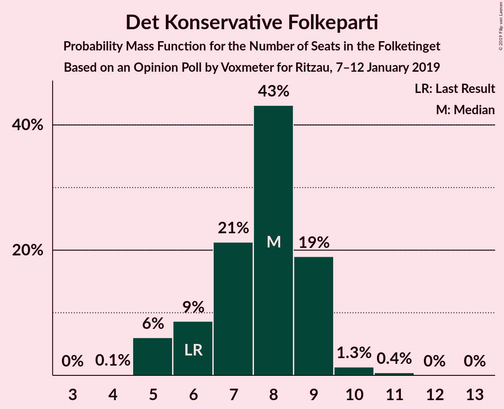
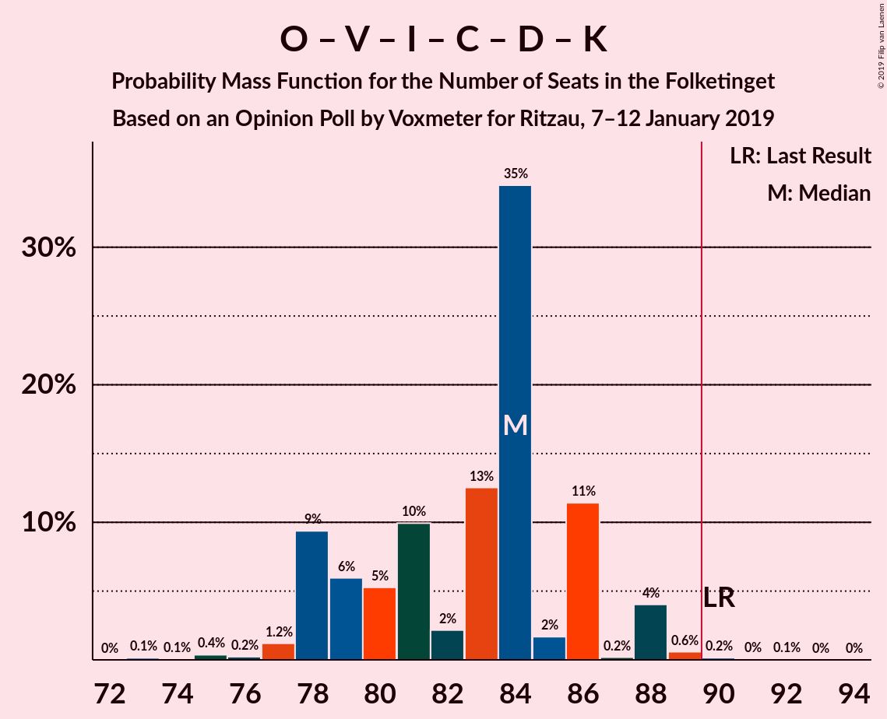
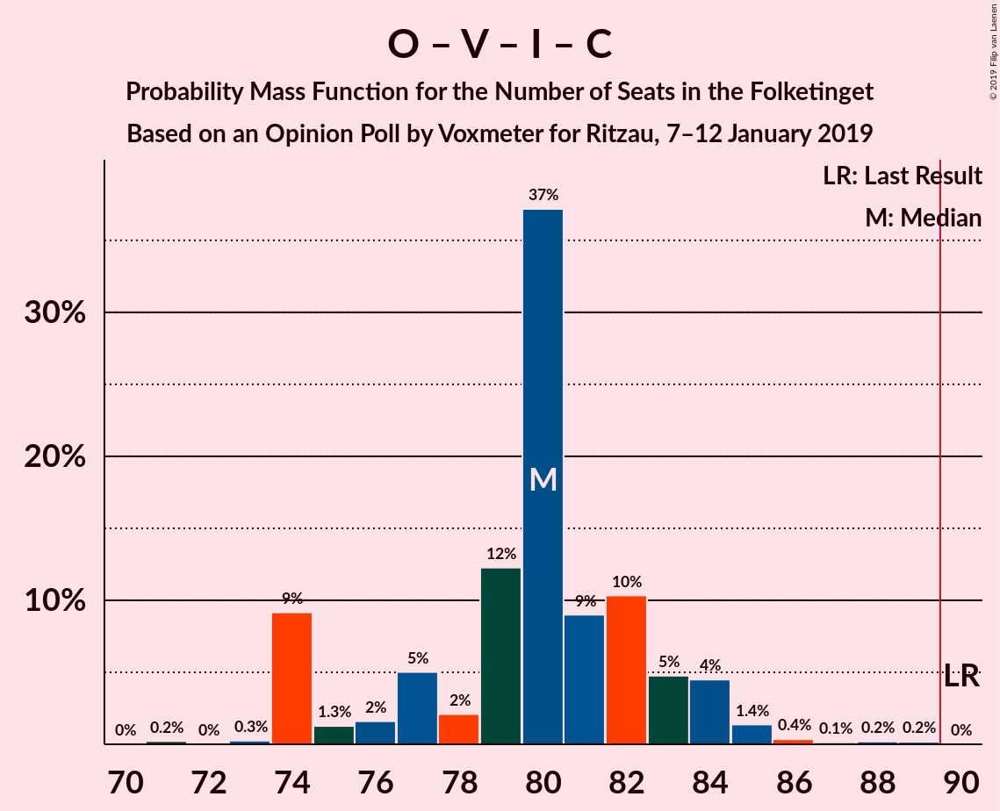
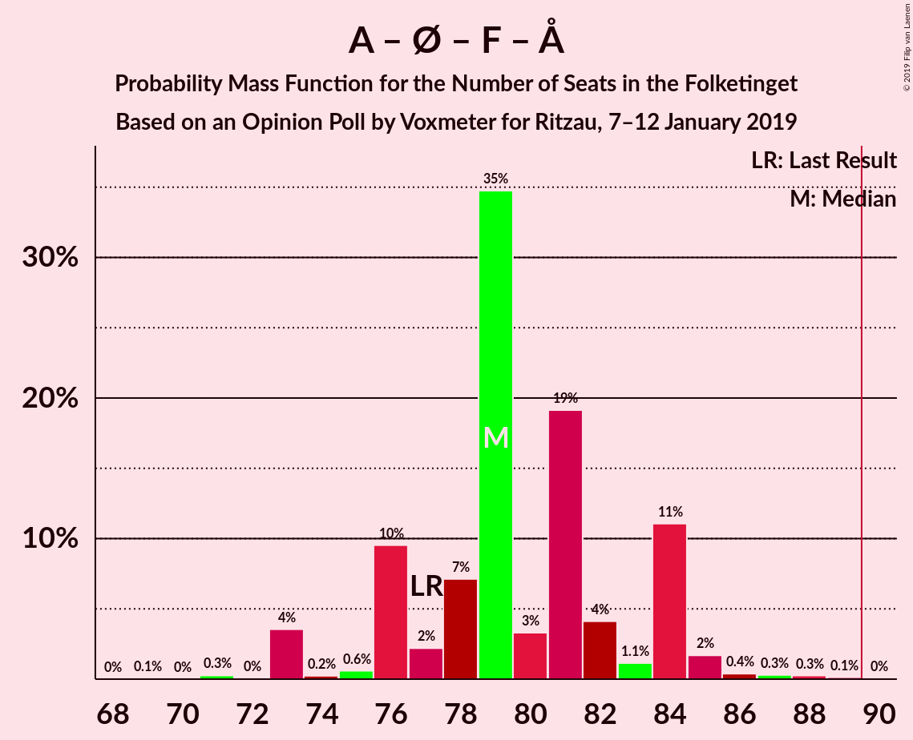
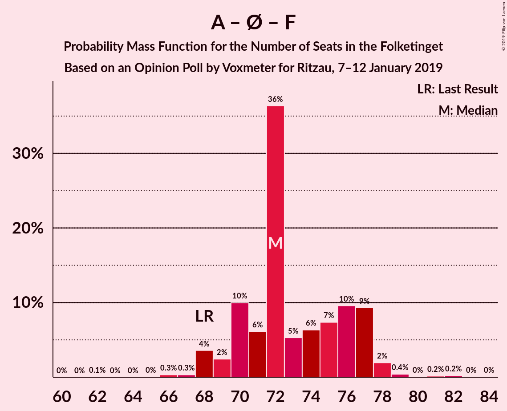
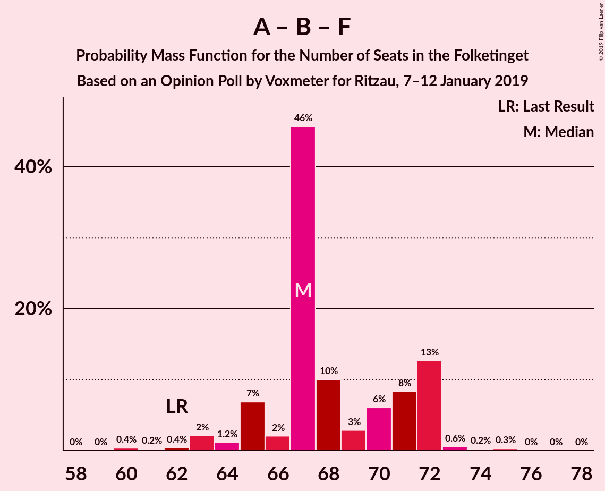
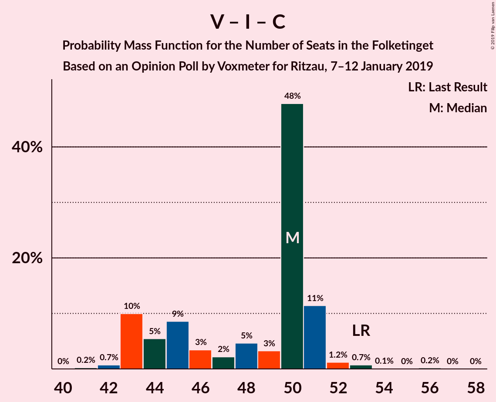

# Opinion Poll by Voxmeter for Ritzau, 7–12 January 2019

<a href="#voting-intentions">Voting Intentions</a> | <a href="#seats">Seats</a> | <a href="#coalitions">Coalitions</a> | <a href="#technical-information">Technical Information</a>

## Voting Intentions

### Confidence Intervals

| Party | Last Result | Poll Result | 80% Confidence Interval | 90% Confidence Interval | 95% Confidence Interval | 99% Confidence Interval |
|:-----:|:-----------:|:-----------:|:-----------------------:|:-----------------------:|:-----------------------:|:-----------------------:|
| Socialdemokraterne | 26.3% | 26.4% | 24.7–28.2% |24.2–28.7% |23.8–29.2% |23.0–30.1% |
| Dansk Folkeparti | 21.1% | 18.2% | 16.7–19.8% |16.3–20.3% |16.0–20.7% |15.3–21.5% |
| Venstre | 19.5% | 17.9% | 16.4–19.5% |16.0–20.0% |15.7–20.4% |15.0–21.2% |
| Enhedslisten–De Rød-Grønne | 7.8% | 9.9% | 8.8–11.2% |8.5–11.6% |8.2–11.9% |7.7–12.6% |
| Radikale Venstre | 4.6% | 6.9% | 6.0–8.0% |5.7–8.4% |5.5–8.6% |5.1–9.2% |
| Socialistisk Folkeparti | 4.2% | 4.8% | 4.0–5.7% |3.8–6.0% |3.6–6.3% |3.3–6.8% |
| Liberal Alliance | 7.5% | 4.7% | 3.9–5.6% |3.7–5.9% |3.5–6.2% |3.2–6.6% |
| Det Konservative Folkeparti | 3.4% | 4.1% | 3.4–5.0% |3.2–5.3% |3.0–5.5% |2.7–6.0% |
| Alternativet | 4.8% | 3.8% | 3.1–4.7% |2.9–4.9% |2.8–5.2% |2.5–5.6% |
| Nye Borgerlige | 0.0% | 1.9% | 1.5–2.6% |1.4–2.8% |1.3–3.0% |1.1–3.4% |
| Kristendemokraterne | 0.8% | 1.1% | 0.8–1.6% |0.7–1.8% |0.6–1.9% |0.5–2.2% |

*Note:* The poll result column reflects the actual value used in the calculations. Published results may vary slightly, and in addition be rounded to fewer digits.

## Seats

### Confidence Intervals

| Party | Last Result | Median | 80% Confidence Interval | 90% Confidence Interval | 95% Confidence Interval | 99% Confidence Interval |
|:-----:|:-----------:|:------:|:-----------------------:|:-----------------------:|:-----------------------:|:-----------------------:|
| <a href="#socialdemokraterne">Socialdemokraterne</a> | 47 | 46 | 44–50 |44–50 |41–51 |41–53 |
| <a href="#dansk-folkeparti">Dansk Folkeparti</a> | 37 | 33 | 30–35 |30–35 |29–37 |27–39 |
| <a href="#venstre">Venstre</a> | 34 | 32 | 27–34 |27–35 |27–36 |26–39 |
| <a href="#enhedslisten–de-rød-grønne">Enhedslisten–De Rød-Grønne</a> | 14 | 18 | 16–20 |14–22 |14–22 |13–22 |
| <a href="#radikale-venstre">Radikale Venstre</a> | 8 | 12 | 10–14 |10–15 |10–16 |9–16 |
| <a href="#socialistisk-folkeparti">Socialistisk Folkeparti</a> | 7 | 9 | 7–10 |6–11 |6–11 |6–12 |
| <a href="#liberal-alliance">Liberal Alliance</a> | 13 | 9 | 7–11 |7–11 |6–11 |6–11 |
| <a href="#det-konservative-folkeparti">Det Konservative Folkeparti</a> | 6 | 7 | 5–9 |5–9 |5–10 |5–11 |
| <a href="#alternativet">Alternativet</a> | 9 | 7 | 6–9 |6–10 |5–10 |4–10 |
| <a href="#nye-borgerlige">Nye Borgerlige</a> | 0 | 4 | 0–5 |0–6 |0–6 |0–6 |
| <a href="#kristendemokraterne">Kristendemokraterne</a> | 0 | 0 | 0 |0 |0 |0–4 |

### Socialdemokraterne

*For a full overview of the results for this party, see the [Socialdemokraterne](party-socialdemokraterne.html) page.*

| Number of Seats | Probability | Accumulated | Special Marks |
|:---------------:|:-----------:|:-----------:|:-------------:|
| 39 | 0% | 100% |  |
| 40 | 0.1% | 99.9% |  |
| 41 | 2% | 99.8% |  |
| 42 | 0.4% | 97% |  |
| 43 | 1.1% | 97% |  |
| 44 | 11% | 96% |  |
| 45 | 22% | 85% |  |
| 46 | 29% | 63% | Median |
| 47 | 16% | 34% | Last Result |
| 48 | 2% | 18% |  |
| 49 | 5% | 16% |  |
| 50 | 7% | 11% |  |
| 51 | 3% | 4% |  |
| 52 | 0.3% | 0.8% |  |
| 53 | 0.3% | 0.5% |  |
| 54 | 0.1% | 0.2% |  |
| 55 | 0.1% | 0.1% |  |
| 56 | 0% | 0% |  |

### Dansk Folkeparti

*For a full overview of the results for this party, see the [Dansk Folkeparti](party-danskfolkeparti.html) page.*

| Number of Seats | Probability | Accumulated | Special Marks |
|:---------------:|:-----------:|:-----------:|:-------------:|
| 26 | 0.4% | 100% |  |
| 27 | 0.4% | 99.6% |  |
| 28 | 0.3% | 99.2% |  |
| 29 | 4% | 98.9% |  |
| 30 | 9% | 95% |  |
| 31 | 26% | 87% |  |
| 32 | 6% | 61% |  |
| 33 | 27% | 55% | Median |
| 34 | 10% | 28% |  |
| 35 | 14% | 18% |  |
| 36 | 0.9% | 4% |  |
| 37 | 2% | 3% | Last Result |
| 38 | 0.1% | 0.7% |  |
| 39 | 0.1% | 0.6% |  |
| 40 | 0.4% | 0.4% |  |
| 41 | 0% | 0% |  |

### Venstre

*For a full overview of the results for this party, see the [Venstre](party-venstre.html) page.*

| Number of Seats | Probability | Accumulated | Special Marks |
|:---------------:|:-----------:|:-----------:|:-------------:|
| 26 | 0.7% | 100% |  |
| 27 | 14% | 99.2% |  |
| 28 | 2% | 85% |  |
| 29 | 0.4% | 83% |  |
| 30 | 8% | 83% |  |
| 31 | 11% | 74% |  |
| 32 | 44% | 64% | Median |
| 33 | 8% | 20% |  |
| 34 | 2% | 11% | Last Result |
| 35 | 7% | 10% |  |
| 36 | 1.0% | 3% |  |
| 37 | 0.1% | 2% |  |
| 38 | 0% | 2% |  |
| 39 | 2% | 2% |  |
| 40 | 0% | 0% |  |

### Enhedslisten–De Rød-Grønne

*For a full overview of the results for this party, see the [Enhedslisten–De Rød-Grønne](party-enhedslisten–derød-grønne.html) page.*

| Number of Seats | Probability | Accumulated | Special Marks |
|:---------------:|:-----------:|:-----------:|:-------------:|
| 13 | 1.3% | 100% |  |
| 14 | 4% | 98.6% | Last Result |
| 15 | 2% | 95% |  |
| 16 | 6% | 93% |  |
| 17 | 12% | 87% |  |
| 18 | 28% | 75% | Median |
| 19 | 29% | 47% |  |
| 20 | 12% | 18% |  |
| 21 | 0.6% | 6% |  |
| 22 | 5% | 6% |  |
| 23 | 0% | 0.2% |  |
| 24 | 0.2% | 0.2% |  |
| 25 | 0% | 0% |  |

### Radikale Venstre

*For a full overview of the results for this party, see the [Radikale Venstre](party-radikalevenstre.html) page.*

| Number of Seats | Probability | Accumulated | Special Marks |
|:---------------:|:-----------:|:-----------:|:-------------:|
| 8 | 0.1% | 100% | Last Result |
| 9 | 0.5% | 99.9% |  |
| 10 | 26% | 99.4% |  |
| 11 | 5% | 73% |  |
| 12 | 40% | 69% | Median |
| 13 | 16% | 29% |  |
| 14 | 7% | 13% |  |
| 15 | 4% | 7% |  |
| 16 | 3% | 3% |  |
| 17 | 0.2% | 0.3% |  |
| 18 | 0% | 0% |  |

### Socialistisk Folkeparti

*For a full overview of the results for this party, see the [Socialistisk Folkeparti](party-socialistiskfolkeparti.html) page.*

| Number of Seats | Probability | Accumulated | Special Marks |
|:---------------:|:-----------:|:-----------:|:-------------:|
| 5 | 0.1% | 100% |  |
| 6 | 8% | 99.9% |  |
| 7 | 16% | 92% | Last Result |
| 8 | 10% | 76% |  |
| 9 | 37% | 66% | Median |
| 10 | 22% | 29% |  |
| 11 | 6% | 7% |  |
| 12 | 0.6% | 0.7% |  |
| 13 | 0% | 0.1% |  |
| 14 | 0% | 0% |  |

### Liberal Alliance

*For a full overview of the results for this party, see the [Liberal Alliance](party-liberalalliance.html) page.*

| Number of Seats | Probability | Accumulated | Special Marks |
|:---------------:|:-----------:|:-----------:|:-------------:|
| 5 | 0.4% | 100% |  |
| 6 | 2% | 99.6% |  |
| 7 | 12% | 97% |  |
| 8 | 20% | 85% |  |
| 9 | 16% | 65% | Median |
| 10 | 30% | 49% |  |
| 11 | 19% | 19% |  |
| 12 | 0.2% | 0.3% |  |
| 13 | 0.1% | 0.1% | Last Result |
| 14 | 0% | 0% |  |

### Det Konservative Folkeparti

*For a full overview of the results for this party, see the [Det Konservative Folkeparti](party-detkonservativefolkeparti.html) page.*

| Number of Seats | Probability | Accumulated | Special Marks |
|:---------------:|:-----------:|:-----------:|:-------------:|
| 4 | 0.1% | 100% |  |
| 5 | 20% | 99.9% |  |
| 6 | 16% | 80% | Last Result |
| 7 | 16% | 64% | Median |
| 8 | 37% | 48% |  |
| 9 | 6% | 11% |  |
| 10 | 4% | 5% |  |
| 11 | 0.6% | 0.9% |  |
| 12 | 0.1% | 0.4% |  |
| 13 | 0.3% | 0.3% |  |
| 14 | 0% | 0% |  |

### Alternativet

*For a full overview of the results for this party, see the [Alternativet](party-alternativet.html) page.*

| Number of Seats | Probability | Accumulated | Special Marks |
|:---------------:|:-----------:|:-----------:|:-------------:|
| 0 | 0.1% | 100% |  |
| 1 | 0% | 99.9% |  |
| 2 | 0% | 99.9% |  |
| 3 | 0% | 99.9% |  |
| 4 | 0.4% | 99.9% |  |
| 5 | 2% | 99.4% |  |
| 6 | 16% | 97% |  |
| 7 | 40% | 81% | Median |
| 8 | 25% | 42% |  |
| 9 | 10% | 17% | Last Result |
| 10 | 6% | 7% |  |
| 11 | 0.1% | 0.1% |  |
| 12 | 0% | 0% |  |

### Nye Borgerlige

*For a full overview of the results for this party, see the [Nye Borgerlige](party-nyeborgerlige.html) page.*

| Number of Seats | Probability | Accumulated | Special Marks |
|:---------------:|:-----------:|:-----------:|:-------------:|
| 0 | 47% | 100% | Last Result |
| 1 | 0% | 53% |  |
| 2 | 0% | 53% |  |
| 3 | 0% | 53% |  |
| 4 | 36% | 53% | Median |
| 5 | 10% | 17% |  |
| 6 | 6% | 6% |  |
| 7 | 0% | 0% |  |

### Kristendemokraterne

*For a full overview of the results for this party, see the [Kristendemokraterne](party-kristendemokraterne.html) page.*

| Number of Seats | Probability | Accumulated | Special Marks |
|:---------------:|:-----------:|:-----------:|:-------------:|
| 0 | 99.3% | 100% | Last Result, Median |
| 1 | 0% | 0.7% |  |
| 2 | 0% | 0.7% |  |
| 3 | 0% | 0.7% |  |
| 4 | 0.7% | 0.7% |  |
| 5 | 0% | 0% |  |

## Coalitions

### Confidence Intervals

| Coalition | Last Result | Median | Majority? | 80% Confidence Interval | 90% Confidence Interval | 95% Confidence Interval | 99% Confidence Interval |
|:---------:|:-----------:|:------:|:---------:|:-----------------------:|:-----------------------:|:-----------------------:|:-----------------------:|
| Socialdemokraterne – Enhedslisten–De Rød-Grønne – Radikale Venstre – Socialistisk Folkeparti – Alternativet | 85 | 92 | 88% | 89–97 | 88–98 | 87–98 | 85–100 |
| Socialdemokraterne – Enhedslisten–De Rød-Grønne – Radikale Venstre – Socialistisk Folkeparti | 76 | 85 | 5% | 82–89 | 81–90 | 80–91 | 78–91 |
| Dansk Folkeparti – Venstre – Liberal Alliance – Det Konservative Folkeparti – Nye Borgerlige – Kristendemokraterne | 90 | 83 | 0.6% | 78–86 | 77–87 | 77–88 | 75–90 |
| Dansk Folkeparti – Venstre – Liberal Alliance – Det Konservative Folkeparti – Nye Borgerlige | 90 | 83 | 0.6% | 78–86 | 77–86 | 77–88 | 75–90 |
| Dansk Folkeparti – Venstre – Liberal Alliance – Det Konservative Folkeparti – Kristendemokraterne | 90 | 79 | 0% | 77–83 | 77–86 | 76–88 | 73–89 |
| Dansk Folkeparti – Venstre – Liberal Alliance – Det Konservative Folkeparti | 90 | 79 | 0% | 77–83 | 77–85 | 76–88 | 73–89 |
| Socialdemokraterne – Enhedslisten–De Rød-Grønne – Socialistisk Folkeparti – Alternativet | 77 | 80 | 0.2% | 78–84 | 76–85 | 74–86 | 73–87 |
| Socialdemokraterne – Enhedslisten–De Rød-Grønne – Socialistisk Folkeparti | 68 | 74 | 0% | 69–76 | 69–77 | 67–77 | 67–80 |
| Socialdemokraterne – Radikale Venstre – Socialistisk Folkeparti | 62 | 67 | 0% | 65–71 | 63–72 | 63–73 | 61–74 |
| Socialdemokraterne – Radikale Venstre | 55 | 58 | 0% | 55–63 | 54–64 | 54–65 | 53–65 |
| Venstre – Liberal Alliance – Det Konservative Folkeparti | 53 | 48 | 0% | 43–50 | 43–52 | 43–53 | 42–56 |
| Venstre – Det Konservative Folkeparti | 40 | 38 | 0% | 35–41 | 34–43 | 34–44 | 32–48 |
| Venstre | 34 | 32 | 0% | 27–34 | 27–35 | 27–36 | 26–39 |

### Socialdemokraterne – Enhedslisten–De Rød-Grønne – Radikale Venstre – Socialistisk Folkeparti – Alternativet

| Number of Seats | Probability | Accumulated | Special Marks |
|:---------------:|:-----------:|:-----------:|:-------------:|
| 83 | 0% | 100% |  |
| 84 | 0% | 99.9% |  |
| 85 | 0.6% | 99.9% | Last Result |
| 86 | 2% | 99.4% |  |
| 87 | 2% | 98% |  |
| 88 | 0.8% | 95% |  |
| 89 | 7% | 95% |  |
| 90 | 5% | 88% | Majority |
| 91 | 1.3% | 83% |  |
| 92 | 48% | 81% | Median |
| 93 | 11% | 33% |  |
| 94 | 3% | 22% |  |
| 95 | 2% | 19% |  |
| 96 | 2% | 16% |  |
| 97 | 7% | 14% |  |
| 98 | 7% | 7% |  |
| 99 | 0.1% | 0.6% |  |
| 100 | 0.2% | 0.5% |  |
| 101 | 0.2% | 0.4% |  |
| 102 | 0.1% | 0.2% |  |
| 103 | 0% | 0% |  |

### Socialdemokraterne – Enhedslisten–De Rød-Grønne – Radikale Venstre – Socialistisk Folkeparti

| Number of Seats | Probability | Accumulated | Special Marks |
|:---------------:|:-----------:|:-----------:|:-------------:|
| 76 | 0% | 100% | Last Result |
| 77 | 0.1% | 99.9% |  |
| 78 | 0.5% | 99.8% |  |
| 79 | 0.2% | 99.3% |  |
| 80 | 3% | 99.1% |  |
| 81 | 3% | 96% |  |
| 82 | 11% | 92% |  |
| 83 | 2% | 81% |  |
| 84 | 22% | 80% |  |
| 85 | 21% | 58% | Median |
| 86 | 14% | 36% |  |
| 87 | 3% | 23% |  |
| 88 | 4% | 20% |  |
| 89 | 11% | 16% |  |
| 90 | 2% | 5% | Majority |
| 91 | 3% | 3% |  |
| 92 | 0.2% | 0.5% |  |
| 93 | 0.1% | 0.3% |  |
| 94 | 0.1% | 0.2% |  |
| 95 | 0% | 0% |  |

### Dansk Folkeparti – Venstre – Liberal Alliance – Det Konservative Folkeparti – Nye Borgerlige – Kristendemokraterne

| Number of Seats | Probability | Accumulated | Special Marks |
|:---------------:|:-----------:|:-----------:|:-------------:|
| 73 | 0.1% | 100% |  |
| 74 | 0.2% | 99.8% |  |
| 75 | 0.2% | 99.6% |  |
| 76 | 0.1% | 99.5% |  |
| 77 | 7% | 99.4% |  |
| 78 | 7% | 93% |  |
| 79 | 2% | 86% |  |
| 80 | 2% | 84% |  |
| 81 | 3% | 81% |  |
| 82 | 11% | 78% |  |
| 83 | 48% | 67% |  |
| 84 | 1.3% | 19% |  |
| 85 | 5% | 17% | Median |
| 86 | 7% | 12% |  |
| 87 | 0.8% | 5% |  |
| 88 | 2% | 5% |  |
| 89 | 2% | 2% |  |
| 90 | 0.6% | 0.6% | Last Result, Majority |
| 91 | 0% | 0.1% |  |
| 92 | 0% | 0.1% |  |
| 93 | 0% | 0% |  |

### Dansk Folkeparti – Venstre – Liberal Alliance – Det Konservative Folkeparti – Nye Borgerlige

| Number of Seats | Probability | Accumulated | Special Marks |
|:---------------:|:-----------:|:-----------:|:-------------:|
| 73 | 0.1% | 100% |  |
| 74 | 0.2% | 99.8% |  |
| 75 | 0.2% | 99.6% |  |
| 76 | 0.1% | 99.5% |  |
| 77 | 7% | 99.4% |  |
| 78 | 7% | 92% |  |
| 79 | 2% | 86% |  |
| 80 | 2% | 83% |  |
| 81 | 3% | 81% |  |
| 82 | 11% | 78% |  |
| 83 | 49% | 67% |  |
| 84 | 1.2% | 18% |  |
| 85 | 5% | 17% | Median |
| 86 | 7% | 12% |  |
| 87 | 0.4% | 5% |  |
| 88 | 2% | 5% |  |
| 89 | 2% | 2% |  |
| 90 | 0.5% | 0.6% | Last Result, Majority |
| 91 | 0% | 0.1% |  |
| 92 | 0% | 0% |  |

### Dansk Folkeparti – Venstre – Liberal Alliance – Det Konservative Folkeparti – Kristendemokraterne

| Number of Seats | Probability | Accumulated | Special Marks |
|:---------------:|:-----------:|:-----------:|:-------------:|
| 69 | 0.1% | 100% |  |
| 70 | 0% | 99.9% |  |
| 71 | 0.1% | 99.9% |  |
| 72 | 0.1% | 99.8% |  |
| 73 | 0.2% | 99.7% |  |
| 74 | 0.3% | 99.5% |  |
| 75 | 1.2% | 99.1% |  |
| 76 | 1.0% | 98% |  |
| 77 | 13% | 97% |  |
| 78 | 15% | 83% |  |
| 79 | 25% | 68% |  |
| 80 | 3% | 43% |  |
| 81 | 10% | 40% | Median |
| 82 | 3% | 30% |  |
| 83 | 19% | 27% |  |
| 84 | 1.4% | 7% |  |
| 85 | 0.6% | 6% |  |
| 86 | 1.2% | 5% |  |
| 87 | 0.7% | 4% |  |
| 88 | 2% | 3% |  |
| 89 | 2% | 2% |  |
| 90 | 0% | 0% | Last Result, Majority |

### Dansk Folkeparti – Venstre – Liberal Alliance – Det Konservative Folkeparti

| Number of Seats | Probability | Accumulated | Special Marks |
|:---------------:|:-----------:|:-----------:|:-------------:|
| 69 | 0.1% | 100% |  |
| 70 | 0% | 99.9% |  |
| 71 | 0.1% | 99.9% |  |
| 72 | 0.2% | 99.8% |  |
| 73 | 0.2% | 99.6% |  |
| 74 | 0.4% | 99.5% |  |
| 75 | 1.3% | 99.1% |  |
| 76 | 1.1% | 98% |  |
| 77 | 13% | 97% |  |
| 78 | 15% | 83% |  |
| 79 | 25% | 68% |  |
| 80 | 3% | 43% |  |
| 81 | 10% | 40% | Median |
| 82 | 3% | 30% |  |
| 83 | 20% | 27% |  |
| 84 | 1.3% | 7% |  |
| 85 | 0.6% | 5% |  |
| 86 | 1.2% | 5% |  |
| 87 | 0.3% | 4% |  |
| 88 | 2% | 3% |  |
| 89 | 2% | 2% |  |
| 90 | 0% | 0% | Last Result, Majority |

### Socialdemokraterne – Enhedslisten–De Rød-Grønne – Socialistisk Folkeparti – Alternativet

| Number of Seats | Probability | Accumulated | Special Marks |
|:---------------:|:-----------:|:-----------:|:-------------:|
| 72 | 0.1% | 100% |  |
| 73 | 2% | 99.9% |  |
| 74 | 1.3% | 98% |  |
| 75 | 2% | 97% |  |
| 76 | 2% | 95% |  |
| 77 | 0.5% | 93% | Last Result |
| 78 | 6% | 93% |  |
| 79 | 14% | 87% |  |
| 80 | 25% | 73% | Median |
| 81 | 10% | 48% |  |
| 82 | 24% | 38% |  |
| 83 | 1.4% | 13% |  |
| 84 | 6% | 12% |  |
| 85 | 2% | 6% |  |
| 86 | 3% | 4% |  |
| 87 | 0.2% | 0.6% |  |
| 88 | 0.1% | 0.4% |  |
| 89 | 0.1% | 0.3% |  |
| 90 | 0.1% | 0.2% | Majority |
| 91 | 0.1% | 0.1% |  |
| 92 | 0% | 0% |  |

### Socialdemokraterne – Enhedslisten–De Rød-Grønne – Socialistisk Folkeparti

| Number of Seats | Probability | Accumulated | Special Marks |
|:---------------:|:-----------:|:-----------:|:-------------:|
| 65 | 0.1% | 100% |  |
| 66 | 0.2% | 99.9% |  |
| 67 | 2% | 99.7% |  |
| 68 | 0.6% | 97% | Last Result |
| 69 | 11% | 97% |  |
| 70 | 0.4% | 86% |  |
| 71 | 3% | 86% |  |
| 72 | 8% | 83% |  |
| 73 | 24% | 75% | Median |
| 74 | 34% | 51% |  |
| 75 | 2% | 17% |  |
| 76 | 9% | 15% |  |
| 77 | 4% | 6% |  |
| 78 | 0.3% | 2% |  |
| 79 | 0.8% | 1.4% |  |
| 80 | 0.1% | 0.5% |  |
| 81 | 0.2% | 0.4% |  |
| 82 | 0.1% | 0.2% |  |
| 83 | 0.1% | 0.1% |  |
| 84 | 0% | 0% |  |

### Socialdemokraterne – Radikale Venstre – Socialistisk Folkeparti

| Number of Seats | Probability | Accumulated | Special Marks |
|:---------------:|:-----------:|:-----------:|:-------------:|
| 60 | 0.2% | 100% |  |
| 61 | 0.8% | 99.7% |  |
| 62 | 0.2% | 98.9% | Last Result |
| 63 | 7% | 98.8% |  |
| 64 | 0.3% | 92% |  |
| 65 | 27% | 92% |  |
| 66 | 7% | 65% |  |
| 67 | 28% | 58% | Median |
| 68 | 12% | 29% |  |
| 69 | 4% | 17% |  |
| 70 | 2% | 13% |  |
| 71 | 6% | 11% |  |
| 72 | 2% | 5% |  |
| 73 | 2% | 3% |  |
| 74 | 0.3% | 0.7% |  |
| 75 | 0.3% | 0.4% |  |
| 76 | 0.1% | 0.1% |  |
| 77 | 0% | 0% |  |

### Socialdemokraterne – Radikale Venstre

| Number of Seats | Probability | Accumulated | Special Marks |
|:---------------:|:-----------:|:-----------:|:-------------:|
| 51 | 0.1% | 100% |  |
| 52 | 0.3% | 99.9% |  |
| 53 | 0.3% | 99.6% |  |
| 54 | 7% | 99.3% |  |
| 55 | 20% | 92% | Last Result |
| 56 | 0.9% | 72% |  |
| 57 | 7% | 71% |  |
| 58 | 27% | 64% | Median |
| 59 | 12% | 37% |  |
| 60 | 8% | 26% |  |
| 61 | 4% | 17% |  |
| 62 | 4% | 14% |  |
| 63 | 3% | 10% |  |
| 64 | 3% | 7% |  |
| 65 | 4% | 4% |  |
| 66 | 0.4% | 0.4% |  |
| 67 | 0% | 0.1% |  |
| 68 | 0% | 0.1% |  |
| 69 | 0.1% | 0.1% |  |
| 70 | 0% | 0% |  |

### Venstre – Liberal Alliance – Det Konservative Folkeparti

| Number of Seats | Probability | Accumulated | Special Marks |
|:---------------:|:-----------:|:-----------:|:-------------:|
| 39 | 0.1% | 100% |  |
| 40 | 0.1% | 99.9% |  |
| 41 | 0.2% | 99.8% |  |
| 42 | 1.5% | 99.6% |  |
| 43 | 14% | 98% |  |
| 44 | 2% | 84% |  |
| 45 | 2% | 82% |  |
| 46 | 7% | 79% |  |
| 47 | 4% | 72% |  |
| 48 | 37% | 68% | Median |
| 49 | 3% | 31% |  |
| 50 | 20% | 28% |  |
| 51 | 2% | 7% |  |
| 52 | 2% | 5% |  |
| 53 | 0.6% | 3% | Last Result |
| 54 | 0.1% | 2% |  |
| 55 | 0.1% | 2% |  |
| 56 | 2% | 2% |  |
| 57 | 0% | 0% |  |

### Venstre – Det Konservative Folkeparti

| Number of Seats | Probability | Accumulated | Special Marks |
|:---------------:|:-----------:|:-----------:|:-------------:|
| 32 | 1.0% | 100% |  |
| 33 | 0.3% | 99.0% |  |
| 34 | 8% | 98.6% |  |
| 35 | 6% | 90% |  |
| 36 | 2% | 85% |  |
| 37 | 22% | 82% |  |
| 38 | 12% | 60% |  |
| 39 | 9% | 48% | Median |
| 40 | 23% | 39% | Last Result |
| 41 | 7% | 17% |  |
| 42 | 4% | 9% |  |
| 43 | 1.4% | 6% |  |
| 44 | 2% | 4% |  |
| 45 | 0.1% | 2% |  |
| 46 | 0.2% | 2% |  |
| 47 | 0% | 2% |  |
| 48 | 2% | 2% |  |
| 49 | 0% | 0% |  |

### Venstre

| Number of Seats | Probability | Accumulated | Special Marks |
|:---------------:|:-----------:|:-----------:|:-------------:|
| 26 | 0.7% | 100% |  |
| 27 | 14% | 99.2% |  |
| 28 | 2% | 85% |  |
| 29 | 0.4% | 83% |  |
| 30 | 8% | 83% |  |
| 31 | 11% | 74% |  |
| 32 | 44% | 64% | Median |
| 33 | 8% | 20% |  |
| 34 | 2% | 11% | Last Result |
| 35 | 7% | 10% |  |
| 36 | 1.0% | 3% |  |
| 37 | 0.1% | 2% |  |
| 38 | 0% | 2% |  |
| 39 | 2% | 2% |  |
| 40 | 0% | 0% |  |

## Technical Information

### Opinion Poll

+ **Polling firm:** Voxmeter
+ **Commissioner(s):** Ritzau
+ **Fieldwork period:** 7–12 January 2019

### Calculations

+ **Sample size:** 1027
+ **Simulations done:** 262,144
+ **Error estimate:** 1.37%

