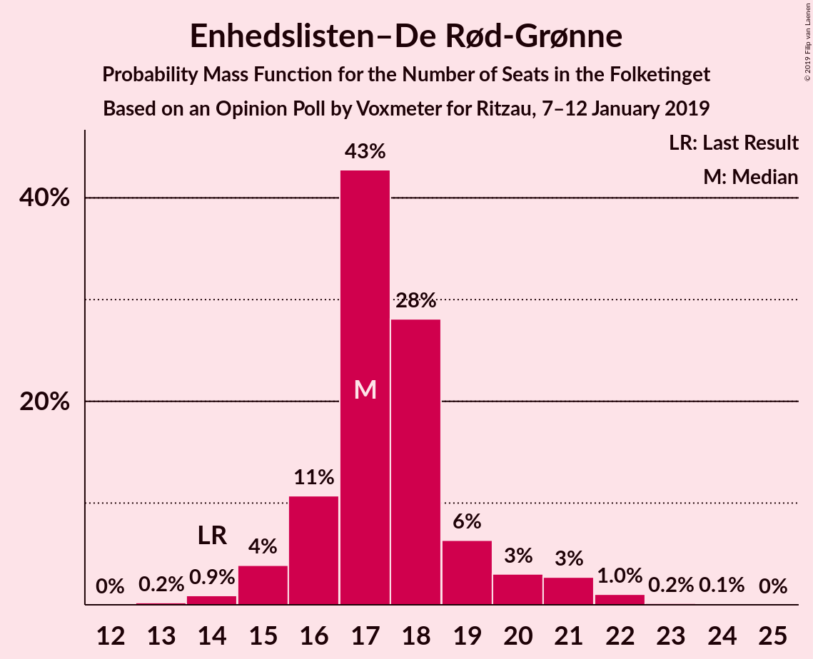
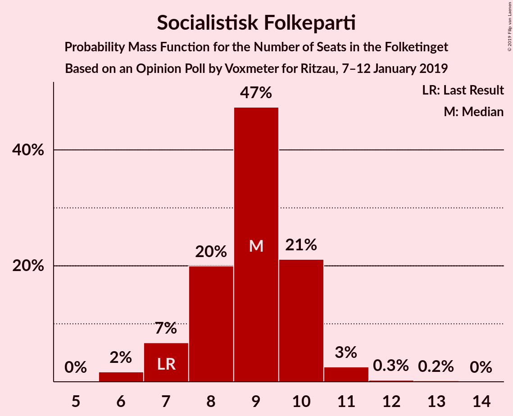
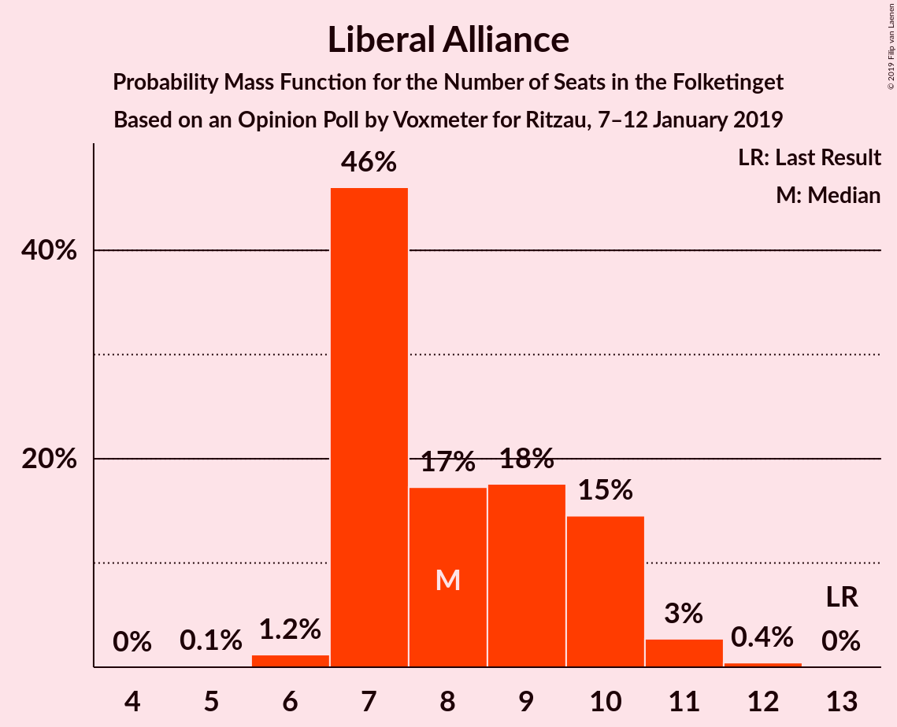
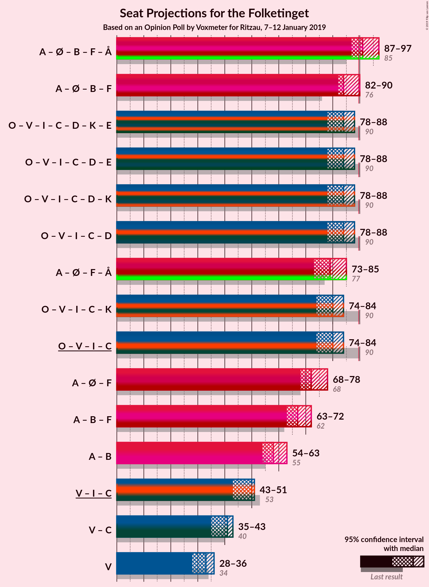

# Opinion Poll by Voxmeter for Ritzau, 7–12 January 2019

<a href="#voting-intentions">Voting Intentions</a> | <a href="#seats">Seats</a> | <a href="#coalitions">Coalitions</a> | <a href="#technical-information">Technical Information</a>

## Voting Intentions

### Confidence Intervals

| Party | Last Result | Poll Result | 80% Confidence Interval | 90% Confidence Interval | 95% Confidence Interval | 99% Confidence Interval |
|:-----:|:-----------:|:-----------:|:-----------------------:|:-----------------------:|:-----------------------:|:-----------------------:|
| Socialdemokraterne | 26.3% | 26.4% | 24.7–28.2% |24.2–28.7% |23.8–29.2% |23.0–30.1% |
| Dansk Folkeparti | 21.1% | 18.2% | 16.7–19.8% |16.3–20.3% |16.0–20.7% |15.3–21.5% |
| Venstre | 19.5% | 17.9% | 16.4–19.5% |16.0–20.0% |15.7–20.4% |15.0–21.2% |
| Enhedslisten–De Rød-Grønne | 7.8% | 9.9% | 8.8–11.2% |8.5–11.6% |8.2–11.9% |7.7–12.6% |
| Radikale Venstre | 4.6% | 6.9% | 6.0–8.0% |5.7–8.4% |5.5–8.6% |5.1–9.2% |
| Socialistisk Folkeparti | 4.2% | 4.8% | 4.0–5.7% |3.8–6.0% |3.6–6.3% |3.3–6.8% |
| Liberal Alliance | 7.5% | 4.7% | 3.9–5.6% |3.7–5.9% |3.5–6.2% |3.2–6.6% |
| Det Konservative Folkeparti | 3.4% | 4.1% | 3.4–5.0% |3.2–5.3% |3.0–5.5% |2.7–6.0% |
| Alternativet | 4.8% | 3.8% | 3.1–4.7% |2.9–4.9% |2.8–5.2% |2.5–5.6% |
| Nye Borgerlige | 0.0% | 1.9% | 1.5–2.6% |1.4–2.8% |1.3–3.0% |1.1–3.4% |
| Kristendemokraterne | 0.8% | 1.1% | 0.8–1.6% |0.7–1.8% |0.6–1.9% |0.5–2.2% |

*Note:* The poll result column reflects the actual value used in the calculations. Published results may vary slightly, and in addition be rounded to fewer digits.

## Seats

### Confidence Intervals

| Party | Last Result | Median | 80% Confidence Interval | 90% Confidence Interval | 95% Confidence Interval | 99% Confidence Interval |
|:-----:|:-----------:|:------:|:-----------------------:|:-----------------------:|:-----------------------:|:-----------------------:|
| <a href="#socialdemokraterne">Socialdemokraterne</a> | 47 | 46 | 45–47 |45–49 |44–50 |41–51 |
| <a href="#dansk-folkeparti">Dansk Folkeparti</a> | 37 | 33 | 30–35 |30–35 |30–35 |27–40 |
| <a href="#venstre">Venstre</a> | 34 | 32 | 27–33 |27–35 |27–35 |27–36 |
| <a href="#enhedslisten–de-rød-grønne">Enhedslisten–De Rød-Grønne</a> | 14 | 18 | 18–20 |17–22 |15–22 |13–22 |
| <a href="#radikale-venstre">Radikale Venstre</a> | 8 | 12 | 10–13 |10–14 |10–15 |10–16 |
| <a href="#socialistisk-folkeparti">Socialistisk Folkeparti</a> | 7 | 9 | 7–10 |7–10 |6–10 |6–11 |
| <a href="#liberal-alliance">Liberal Alliance</a> | 13 | 10 | 7–11 |7–11 |7–11 |6–11 |
| <a href="#det-konservative-folkeparti">Det Konservative Folkeparti</a> | 6 | 7 | 5–8 |5–9 |5–9 |5–11 |
| <a href="#alternativet">Alternativet</a> | 9 | 7 | 7–8 |6–8 |6–10 |4–10 |
| <a href="#nye-borgerlige">Nye Borgerlige</a> | 0 | 4 | 0–4 |0–5 |0–5 |0–5 |
| <a href="#kristendemokraterne">Kristendemokraterne</a> | 0 | 0 | 0 |0 |0 |0 |

### Socialdemokraterne

*For a full overview of the results for this party, see the [Socialdemokraterne](party-socialdemokraterne.html) page.*

| Number of Seats | Probability | Accumulated | Special Marks |
|:---------------:|:-----------:|:-----------:|:-------------:|
| 40 | 0% | 100% |  |
| 41 | 1.2% | 99.9% |  |
| 42 | 0.4% | 98.7% |  |
| 43 | 0.4% | 98% |  |
| 44 | 0.5% | 98% |  |
| 45 | 32% | 97% |  |
| 46 | 31% | 65% | Median |
| 47 | 25% | 34% | Last Result |
| 48 | 1.4% | 9% |  |
| 49 | 5% | 8% |  |
| 50 | 2% | 3% |  |
| 51 | 0.2% | 0.6% |  |
| 52 | 0% | 0.4% |  |
| 53 | 0.2% | 0.4% |  |
| 54 | 0.1% | 0.2% |  |
| 55 | 0% | 0.1% |  |
| 56 | 0% | 0% |  |

### Dansk Folkeparti

*For a full overview of the results for this party, see the [Dansk Folkeparti](party-danskfolkeparti.html) page.*

| Number of Seats | Probability | Accumulated | Special Marks |
|:---------------:|:-----------:|:-----------:|:-------------:|
| 26 | 0.3% | 100% |  |
| 27 | 0.3% | 99.7% |  |
| 28 | 0.2% | 99.4% |  |
| 29 | 0.7% | 99.2% |  |
| 30 | 10% | 98.6% |  |
| 31 | 31% | 89% |  |
| 32 | 4% | 58% |  |
| 33 | 35% | 54% | Median |
| 34 | 4% | 19% |  |
| 35 | 14% | 15% |  |
| 36 | 0.4% | 1.3% |  |
| 37 | 0.1% | 1.0% | Last Result |
| 38 | 0.1% | 0.9% |  |
| 39 | 0.1% | 0.8% |  |
| 40 | 0.7% | 0.7% |  |
| 41 | 0% | 0% |  |

### Venstre

*For a full overview of the results for this party, see the [Venstre](party-venstre.html) page.*

| Number of Seats | Probability | Accumulated | Special Marks |
|:---------------:|:-----------:|:-----------:|:-------------:|
| 26 | 0.2% | 100% |  |
| 27 | 15% | 99.8% |  |
| 28 | 2% | 85% |  |
| 29 | 0.3% | 83% |  |
| 30 | 1.0% | 82% |  |
| 31 | 6% | 81% |  |
| 32 | 63% | 76% | Median |
| 33 | 3% | 13% |  |
| 34 | 1.0% | 10% | Last Result |
| 35 | 8% | 9% |  |
| 36 | 0.3% | 0.5% |  |
| 37 | 0.1% | 0.2% |  |
| 38 | 0.1% | 0.1% |  |
| 39 | 0% | 0.1% |  |
| 40 | 0% | 0% |  |

### Enhedslisten–De Rød-Grønne

*For a full overview of the results for this party, see the [Enhedslisten–De Rød-Grønne](party-enhedslisten–derød-grønne.html) page.*

| Number of Seats | Probability | Accumulated | Special Marks |
|:---------------:|:-----------:|:-----------:|:-------------:|
| 13 | 2% | 100% |  |
| 14 | 0.2% | 98% | Last Result |
| 15 | 0.5% | 98% |  |
| 16 | 1.4% | 97% |  |
| 17 | 5% | 96% |  |
| 18 | 44% | 91% | Median |
| 19 | 34% | 47% |  |
| 20 | 3% | 13% |  |
| 21 | 0.4% | 9% |  |
| 22 | 9% | 9% |  |
| 23 | 0% | 0.3% |  |
| 24 | 0.2% | 0.3% |  |
| 25 | 0% | 0% |  |

### Radikale Venstre

*For a full overview of the results for this party, see the [Radikale Venstre](party-radikalevenstre.html) page.*

| Number of Seats | Probability | Accumulated | Special Marks |
|:---------------:|:-----------:|:-----------:|:-------------:|
| 8 | 0.1% | 100% | Last Result |
| 9 | 0.2% | 99.9% |  |
| 10 | 32% | 99.7% |  |
| 11 | 3% | 68% |  |
| 12 | 46% | 65% | Median |
| 13 | 11% | 19% |  |
| 14 | 3% | 7% |  |
| 15 | 2% | 4% |  |
| 16 | 2% | 2% |  |
| 17 | 0% | 0.1% |  |
| 18 | 0% | 0% |  |

### Socialistisk Folkeparti

*For a full overview of the results for this party, see the [Socialistisk Folkeparti](party-socialistiskfolkeparti.html) page.*

| Number of Seats | Probability | Accumulated | Special Marks |
|:---------------:|:-----------:|:-----------:|:-------------:|
| 5 | 0.1% | 100% |  |
| 6 | 3% | 99.9% |  |
| 7 | 11% | 97% | Last Result |
| 8 | 4% | 86% |  |
| 9 | 45% | 82% | Median |
| 10 | 34% | 36% |  |
| 11 | 2% | 2% |  |
| 12 | 0.2% | 0.3% |  |
| 13 | 0% | 0% |  |

### Liberal Alliance

*For a full overview of the results for this party, see the [Liberal Alliance](party-liberalalliance.html) page.*

| Number of Seats | Probability | Accumulated | Special Marks |
|:---------------:|:-----------:|:-----------:|:-------------:|
| 5 | 0.3% | 100% |  |
| 6 | 1.2% | 99.7% |  |
| 7 | 16% | 98.6% |  |
| 8 | 3% | 82% |  |
| 9 | 15% | 79% |  |
| 10 | 34% | 64% | Median |
| 11 | 30% | 31% |  |
| 12 | 0.1% | 0.2% |  |
| 13 | 0.1% | 0.1% | Last Result |
| 14 | 0% | 0% |  |

### Det Konservative Folkeparti

*For a full overview of the results for this party, see the [Det Konservative Folkeparti](party-detkonservativefolkeparti.html) page.*

| Number of Seats | Probability | Accumulated | Special Marks |
|:---------------:|:-----------:|:-----------:|:-------------:|
| 4 | 0.1% | 100% |  |
| 5 | 32% | 99.9% |  |
| 6 | 11% | 68% | Last Result |
| 7 | 15% | 57% | Median |
| 8 | 37% | 42% |  |
| 9 | 4% | 5% |  |
| 10 | 0.2% | 1.1% |  |
| 11 | 0.4% | 0.9% |  |
| 12 | 0% | 0.4% |  |
| 13 | 0.4% | 0.4% |  |
| 14 | 0% | 0% |  |

### Alternativet

*For a full overview of the results for this party, see the [Alternativet](party-alternativet.html) page.*

| Number of Seats | Probability | Accumulated | Special Marks |
|:---------------:|:-----------:|:-----------:|:-------------:|
| 0 | 0.2% | 100% |  |
| 1 | 0% | 99.8% |  |
| 2 | 0% | 99.8% |  |
| 3 | 0% | 99.8% |  |
| 4 | 0.3% | 99.8% |  |
| 5 | 1.5% | 99.5% |  |
| 6 | 5% | 98% |  |
| 7 | 49% | 93% | Median |
| 8 | 41% | 44% |  |
| 9 | 0.3% | 3% | Last Result |
| 10 | 3% | 3% |  |
| 11 | 0.1% | 0.1% |  |
| 12 | 0% | 0% |  |

### Nye Borgerlige

*For a full overview of the results for this party, see the [Nye Borgerlige](party-nyeborgerlige.html) page.*

| Number of Seats | Probability | Accumulated | Special Marks |
|:---------------:|:-----------:|:-----------:|:-------------:|
| 0 | 48% | 100% | Last Result |
| 1 | 0% | 52% |  |
| 2 | 0% | 52% |  |
| 3 | 0% | 52% |  |
| 4 | 45% | 52% | Median |
| 5 | 7% | 7% |  |
| 6 | 0.3% | 0.3% |  |
| 7 | 0% | 0% |  |

### Kristendemokraterne

*For a full overview of the results for this party, see the [Kristendemokraterne](party-kristendemokraterne.html) page.*

| Number of Seats | Probability | Accumulated | Special Marks |
|:---------------:|:-----------:|:-----------:|:-------------:|
| 0 | 99.6% | 100% | Last Result, Median |
| 1 | 0% | 0.4% |  |
| 2 | 0% | 0.4% |  |
| 3 | 0% | 0.4% |  |
| 4 | 0.4% | 0.4% |  |
| 5 | 0% | 0% |  |

## Coalitions

### Confidence Intervals

| Coalition | Last Result | Median | Majority? | 80% Confidence Interval | 90% Confidence Interval | 95% Confidence Interval | 99% Confidence Interval |
|:---------:|:-----------:|:------:|:---------:|:-----------------------:|:-----------------------:|:-----------------------:|:-----------------------:|
| Socialdemokraterne – Enhedslisten–De Rød-Grønne – Radikale Venstre – Socialistisk Folkeparti – Alternativet | 85 | 92 | 98% | 92–97 | 90–97 | 90–98 | 88–100 |
| Socialdemokraterne – Enhedslisten–De Rød-Grønne – Radikale Venstre – Socialistisk Folkeparti | 76 | 85 | 5% | 84–89 | 84–89 | 83–91 | 81–91 |
| Dansk Folkeparti – Venstre – Liberal Alliance – Det Konservative Folkeparti – Nye Borgerlige – Kristendemokraterne | 90 | 83 | 0.1% | 78–83 | 78–85 | 77–85 | 75–87 |
| Dansk Folkeparti – Venstre – Liberal Alliance – Det Konservative Folkeparti – Nye Borgerlige | 90 | 83 | 0.1% | 78–83 | 78–85 | 77–85 | 75–87 |
| Socialdemokraterne – Enhedslisten–De Rød-Grønne – Socialistisk Folkeparti – Alternativet | 77 | 81 | 0.3% | 80–83 | 79–84 | 78–84 | 75–87 |
| Dansk Folkeparti – Venstre – Liberal Alliance – Det Konservative Folkeparti – Kristendemokraterne | 90 | 79 | 0% | 78–83 | 77–83 | 76–83 | 74–86 |
| Dansk Folkeparti – Venstre – Liberal Alliance – Det Konservative Folkeparti | 90 | 79 | 0% | 78–83 | 77–83 | 76–83 | 73–86 |
| Socialdemokraterne – Enhedslisten–De Rød-Grønne – Socialistisk Folkeparti | 68 | 74 | 0% | 73–76 | 71–76 | 71–76 | 68–79 |
| Socialdemokraterne – Radikale Venstre – Socialistisk Folkeparti | 62 | 67 | 0% | 65–68 | 65–71 | 65–71 | 63–73 |
| Socialdemokraterne – Radikale Venstre | 55 | 58 | 0% | 55–60 | 55–63 | 55–64 | 55–65 |
| Venstre – Liberal Alliance – Det Konservative Folkeparti | 53 | 48 | 0% | 43–50 | 43–50 | 43–50 | 42–53 |
| Venstre – Det Konservative Folkeparti | 40 | 37 | 0% | 34–41 | 34–41 | 34–42 | 32–44 |
| Venstre | 34 | 32 | 0% | 27–33 | 27–35 | 27–35 | 27–36 |

### Socialdemokraterne – Enhedslisten–De Rød-Grønne – Radikale Venstre – Socialistisk Folkeparti – Alternativet

| Number of Seats | Probability | Accumulated | Special Marks |
|:---------------:|:-----------:|:-----------:|:-------------:|
| 83 | 0% | 100% |  |
| 84 | 0% | 99.9% |  |
| 85 | 0% | 99.9% | Last Result |
| 86 | 0.1% | 99.9% |  |
| 87 | 0.2% | 99.8% |  |
| 88 | 0.3% | 99.6% |  |
| 89 | 2% | 99.3% |  |
| 90 | 3% | 98% | Majority |
| 91 | 0.4% | 94% |  |
| 92 | 62% | 94% | Median |
| 93 | 15% | 32% |  |
| 94 | 4% | 18% |  |
| 95 | 1.2% | 14% |  |
| 96 | 0.5% | 12% |  |
| 97 | 8% | 12% |  |
| 98 | 3% | 4% |  |
| 99 | 0% | 0.5% |  |
| 100 | 0.2% | 0.5% |  |
| 101 | 0.1% | 0.3% |  |
| 102 | 0.1% | 0.2% |  |
| 103 | 0% | 0% |  |

### Socialdemokraterne – Enhedslisten–De Rød-Grønne – Radikale Venstre – Socialistisk Folkeparti

| Number of Seats | Probability | Accumulated | Special Marks |
|:---------------:|:-----------:|:-----------:|:-------------:|
| 76 | 0% | 100% | Last Result |
| 77 | 0% | 99.9% |  |
| 78 | 0% | 99.9% |  |
| 79 | 0.1% | 99.9% |  |
| 80 | 0.1% | 99.7% |  |
| 81 | 0.2% | 99.6% |  |
| 82 | 1.1% | 99.4% |  |
| 83 | 0.8% | 98% |  |
| 84 | 37% | 97% |  |
| 85 | 32% | 61% | Median |
| 86 | 13% | 29% |  |
| 87 | 0.4% | 16% |  |
| 88 | 2% | 15% |  |
| 89 | 8% | 13% |  |
| 90 | 1.4% | 5% | Majority |
| 91 | 3% | 4% |  |
| 92 | 0% | 0.3% |  |
| 93 | 0.1% | 0.3% |  |
| 94 | 0.2% | 0.2% |  |
| 95 | 0% | 0% |  |

### Dansk Folkeparti – Venstre – Liberal Alliance – Det Konservative Folkeparti – Nye Borgerlige – Kristendemokraterne

| Number of Seats | Probability | Accumulated | Special Marks |
|:---------------:|:-----------:|:-----------:|:-------------:|
| 73 | 0.1% | 100% |  |
| 74 | 0.1% | 99.8% |  |
| 75 | 0.2% | 99.7% |  |
| 76 | 0% | 99.5% |  |
| 77 | 3% | 99.5% |  |
| 78 | 8% | 96% |  |
| 79 | 0.5% | 88% |  |
| 80 | 1.2% | 88% |  |
| 81 | 4% | 86% |  |
| 82 | 15% | 82% |  |
| 83 | 62% | 68% |  |
| 84 | 0.4% | 6% |  |
| 85 | 3% | 6% |  |
| 86 | 2% | 2% | Median |
| 87 | 0.3% | 0.7% |  |
| 88 | 0.2% | 0.4% |  |
| 89 | 0.1% | 0.2% |  |
| 90 | 0% | 0.1% | Last Result, Majority |
| 91 | 0% | 0.1% |  |
| 92 | 0% | 0.1% |  |
| 93 | 0% | 0% |  |

### Dansk Folkeparti – Venstre – Liberal Alliance – Det Konservative Folkeparti – Nye Borgerlige

| Number of Seats | Probability | Accumulated | Special Marks |
|:---------------:|:-----------:|:-----------:|:-------------:|
| 73 | 0.1% | 100% |  |
| 74 | 0.1% | 99.8% |  |
| 75 | 0.2% | 99.7% |  |
| 76 | 0% | 99.5% |  |
| 77 | 3% | 99.5% |  |
| 78 | 8% | 96% |  |
| 79 | 0.5% | 88% |  |
| 80 | 1.3% | 88% |  |
| 81 | 4% | 86% |  |
| 82 | 15% | 82% |  |
| 83 | 62% | 67% |  |
| 84 | 0.3% | 6% |  |
| 85 | 3% | 5% |  |
| 86 | 1.5% | 2% | Median |
| 87 | 0.2% | 0.6% |  |
| 88 | 0.2% | 0.4% |  |
| 89 | 0.1% | 0.2% |  |
| 90 | 0% | 0.1% | Last Result, Majority |
| 91 | 0% | 0% |  |

### Socialdemokraterne – Enhedslisten–De Rød-Grønne – Socialistisk Folkeparti – Alternativet

| Number of Seats | Probability | Accumulated | Special Marks |
|:---------------:|:-----------:|:-----------:|:-------------:|
| 72 | 0% | 100% |  |
| 73 | 0% | 99.9% |  |
| 74 | 0.2% | 99.9% |  |
| 75 | 0.5% | 99.7% |  |
| 76 | 0.2% | 99.2% |  |
| 77 | 0.5% | 99.0% | Last Result |
| 78 | 3% | 98.5% |  |
| 79 | 2% | 95% |  |
| 80 | 32% | 93% | Median |
| 81 | 16% | 61% |  |
| 82 | 33% | 45% |  |
| 83 | 2% | 12% |  |
| 84 | 9% | 10% |  |
| 85 | 0% | 0.7% |  |
| 86 | 0.1% | 0.6% |  |
| 87 | 0.1% | 0.5% |  |
| 88 | 0.1% | 0.4% |  |
| 89 | 0% | 0.3% |  |
| 90 | 0.2% | 0.3% | Majority |
| 91 | 0.1% | 0.1% |  |
| 92 | 0% | 0% |  |

### Dansk Folkeparti – Venstre – Liberal Alliance – Det Konservative Folkeparti – Kristendemokraterne

| Number of Seats | Probability | Accumulated | Special Marks |
|:---------------:|:-----------:|:-----------:|:-------------:|
| 69 | 0.1% | 100% |  |
| 70 | 0% | 99.9% |  |
| 71 | 0.2% | 99.9% |  |
| 72 | 0% | 99.7% |  |
| 73 | 0.2% | 99.7% |  |
| 74 | 0.2% | 99.5% |  |
| 75 | 1.1% | 99.3% |  |
| 76 | 2% | 98% |  |
| 77 | 5% | 97% |  |
| 78 | 21% | 92% |  |
| 79 | 31% | 71% |  |
| 80 | 3% | 40% |  |
| 81 | 2% | 37% |  |
| 82 | 1.0% | 35% | Median |
| 83 | 32% | 34% |  |
| 84 | 0.3% | 2% |  |
| 85 | 0.7% | 2% |  |
| 86 | 0.9% | 1.1% |  |
| 87 | 0.1% | 0.2% |  |
| 88 | 0% | 0.1% |  |
| 89 | 0% | 0% |  |
| 90 | 0% | 0% | Last Result, Majority |

### Dansk Folkeparti – Venstre – Liberal Alliance – Det Konservative Folkeparti

| Number of Seats | Probability | Accumulated | Special Marks |
|:---------------:|:-----------:|:-----------:|:-------------:|
| 69 | 0.1% | 100% |  |
| 70 | 0% | 99.9% |  |
| 71 | 0.2% | 99.9% |  |
| 72 | 0% | 99.7% |  |
| 73 | 0.2% | 99.7% |  |
| 74 | 0.2% | 99.5% |  |
| 75 | 1.1% | 99.3% |  |
| 76 | 2% | 98% |  |
| 77 | 5% | 97% |  |
| 78 | 21% | 92% |  |
| 79 | 31% | 71% |  |
| 80 | 3% | 40% |  |
| 81 | 2% | 37% |  |
| 82 | 1.0% | 35% | Median |
| 83 | 32% | 34% |  |
| 84 | 0.2% | 2% |  |
| 85 | 0.7% | 2% |  |
| 86 | 0.9% | 1.0% |  |
| 87 | 0% | 0.1% |  |
| 88 | 0% | 0.1% |  |
| 89 | 0% | 0% |  |
| 90 | 0% | 0% | Last Result, Majority |

### Socialdemokraterne – Enhedslisten–De Rød-Grønne – Socialistisk Folkeparti

| Number of Seats | Probability | Accumulated | Special Marks |
|:---------------:|:-----------:|:-----------:|:-------------:|
| 65 | 0% | 100% |  |
| 66 | 0.2% | 99.9% |  |
| 67 | 0.1% | 99.8% |  |
| 68 | 0.2% | 99.7% | Last Result |
| 69 | 0.2% | 99.5% |  |
| 70 | 0.2% | 99.3% |  |
| 71 | 4% | 99.1% |  |
| 72 | 4% | 95% |  |
| 73 | 31% | 91% | Median |
| 74 | 47% | 61% |  |
| 75 | 2% | 13% |  |
| 76 | 10% | 12% |  |
| 77 | 0.2% | 1.5% |  |
| 78 | 0% | 1.2% |  |
| 79 | 0.9% | 1.2% |  |
| 80 | 0% | 0.3% |  |
| 81 | 0% | 0.3% |  |
| 82 | 0.1% | 0.3% |  |
| 83 | 0.1% | 0.1% |  |
| 84 | 0% | 0% |  |

### Socialdemokraterne – Radikale Venstre – Socialistisk Folkeparti

| Number of Seats | Probability | Accumulated | Special Marks |
|:---------------:|:-----------:|:-----------:|:-------------:|
| 60 | 0% | 100% |  |
| 61 | 0.1% | 99.9% |  |
| 62 | 0.3% | 99.9% | Last Result |
| 63 | 0.6% | 99.6% |  |
| 64 | 0.4% | 99.0% |  |
| 65 | 32% | 98.7% |  |
| 66 | 2% | 66% |  |
| 67 | 41% | 64% | Median |
| 68 | 14% | 24% |  |
| 69 | 0.8% | 9% |  |
| 70 | 0.4% | 9% |  |
| 71 | 7% | 8% |  |
| 72 | 0.2% | 1.2% |  |
| 73 | 0.5% | 0.9% |  |
| 74 | 0.3% | 0.4% |  |
| 75 | 0% | 0.1% |  |
| 76 | 0.1% | 0.1% |  |
| 77 | 0% | 0% |  |

### Socialdemokraterne – Radikale Venstre

| Number of Seats | Probability | Accumulated | Special Marks |
|:---------------:|:-----------:|:-----------:|:-------------:|
| 52 | 0% | 100% |  |
| 53 | 0.1% | 99.9% |  |
| 54 | 0.3% | 99.8% |  |
| 55 | 33% | 99.5% | Last Result |
| 56 | 1.4% | 67% |  |
| 57 | 0.3% | 65% |  |
| 58 | 30% | 65% | Median |
| 59 | 15% | 35% |  |
| 60 | 11% | 20% |  |
| 61 | 3% | 9% |  |
| 62 | 0.7% | 6% |  |
| 63 | 3% | 6% |  |
| 64 | 0.4% | 3% |  |
| 65 | 2% | 2% |  |
| 66 | 0.3% | 0.3% |  |
| 67 | 0% | 0.1% |  |
| 68 | 0% | 0% |  |

### Venstre – Liberal Alliance – Det Konservative Folkeparti

| Number of Seats | Probability | Accumulated | Special Marks |
|:---------------:|:-----------:|:-----------:|:-------------:|
| 39 | 0.1% | 100% |  |
| 40 | 0% | 99.9% |  |
| 41 | 0.1% | 99.9% |  |
| 42 | 2% | 99.8% |  |
| 43 | 14% | 98% |  |
| 44 | 3% | 84% |  |
| 45 | 0.7% | 81% |  |
| 46 | 3% | 80% |  |
| 47 | 2% | 77% |  |
| 48 | 38% | 75% |  |
| 49 | 2% | 36% | Median |
| 50 | 32% | 34% |  |
| 51 | 0.7% | 2% |  |
| 52 | 0.6% | 1.5% |  |
| 53 | 0.8% | 0.9% | Last Result |
| 54 | 0% | 0.1% |  |
| 55 | 0% | 0.1% |  |
| 56 | 0% | 0.1% |  |
| 57 | 0% | 0% |  |

### Venstre – Det Konservative Folkeparti

| Number of Seats | Probability | Accumulated | Special Marks |
|:---------------:|:-----------:|:-----------:|:-------------:|
| 32 | 2% | 100% |  |
| 33 | 0.1% | 98% |  |
| 34 | 13% | 98% |  |
| 35 | 0.2% | 85% |  |
| 36 | 1.3% | 85% |  |
| 37 | 34% | 83% |  |
| 38 | 0.4% | 49% |  |
| 39 | 3% | 49% | Median |
| 40 | 33% | 46% | Last Result |
| 41 | 8% | 13% |  |
| 42 | 3% | 5% |  |
| 43 | 0.4% | 2% |  |
| 44 | 1.0% | 1.4% |  |
| 45 | 0.2% | 0.4% |  |
| 46 | 0.1% | 0.2% |  |
| 47 | 0% | 0% |  |

### Venstre

| Number of Seats | Probability | Accumulated | Special Marks |
|:---------------:|:-----------:|:-----------:|:-------------:|
| 26 | 0.2% | 100% |  |
| 27 | 15% | 99.8% |  |
| 28 | 2% | 85% |  |
| 29 | 0.3% | 83% |  |
| 30 | 1.0% | 82% |  |
| 31 | 6% | 81% |  |
| 32 | 63% | 76% | Median |
| 33 | 3% | 13% |  |
| 34 | 1.0% | 10% | Last Result |
| 35 | 8% | 9% |  |
| 36 | 0.3% | 0.5% |  |
| 37 | 0.1% | 0.2% |  |
| 38 | 0.1% | 0.1% |  |
| 39 | 0% | 0.1% |  |
| 40 | 0% | 0% |  |

## Technical Information

### Opinion Poll

+ **Polling firm:** Voxmeter
+ **Commissioner(s):** Ritzau
+ **Fieldwork period:** 7–12 January 2019

### Calculations

+ **Sample size:** 1027
+ **Simulations done:** 131,072
+ **Error estimate:** 1.51%

