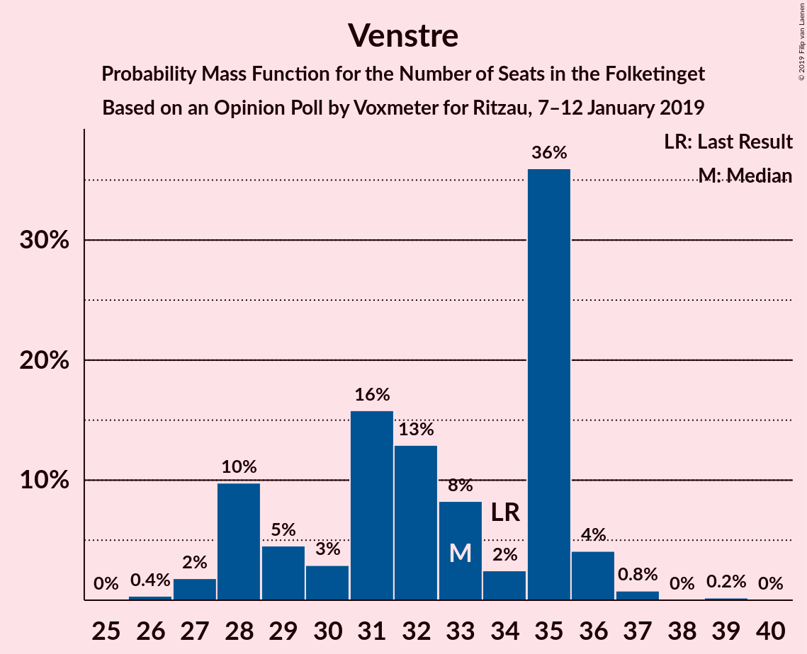
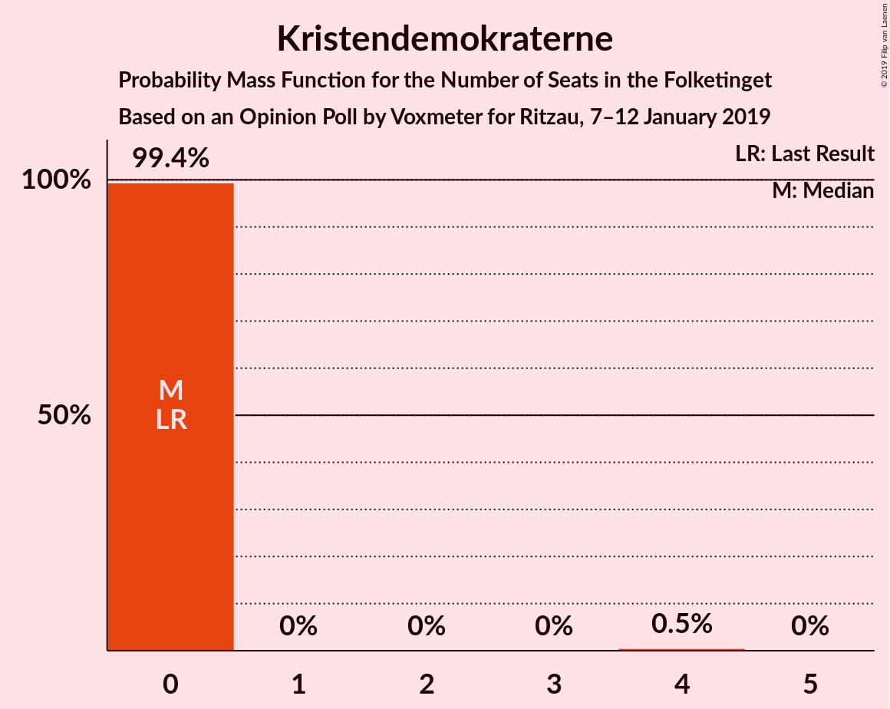
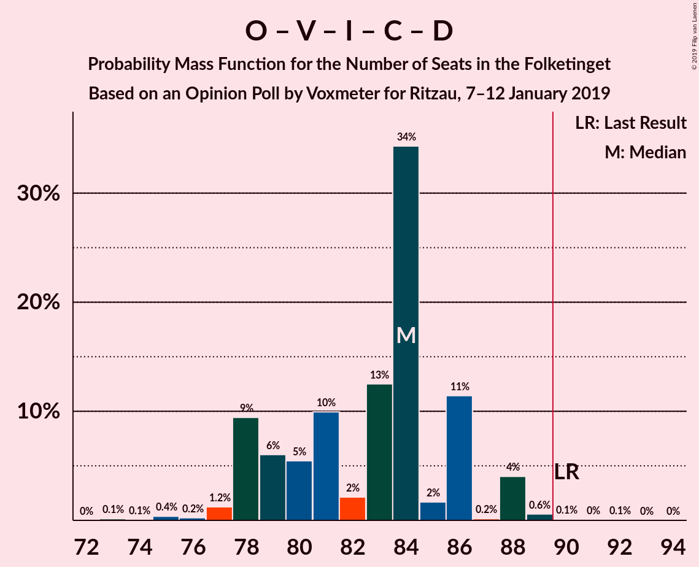

# Opinion Poll by Voxmeter for Ritzau, 7–12 January 2019

<a href="#voting-intentions">Voting Intentions</a> | <a href="#seats">Seats</a> | <a href="#coalitions">Coalitions</a> | <a href="#technical-information">Technical Information</a>

## Voting Intentions

### Confidence Intervals

| Party | Last Result | Poll Result | 80% Confidence Interval | 90% Confidence Interval | 95% Confidence Interval | 99% Confidence Interval |
|:-----:|:-----------:|:-----------:|:-----------------------:|:-----------------------:|:-----------------------:|:-----------------------:|
| Socialdemokraterne | 26.3% | 26.4% | 24.7–28.2% |24.2–28.7% |23.8–29.2% |23.0–30.1% |
| Dansk Folkeparti | 21.1% | 18.2% | 16.7–19.8% |16.3–20.3% |16.0–20.7% |15.3–21.5% |
| Venstre | 19.5% | 17.9% | 16.4–19.5% |16.0–20.0% |15.7–20.4% |15.0–21.2% |
| Enhedslisten–De Rød-Grønne | 7.8% | 9.9% | 8.8–11.2% |8.5–11.6% |8.2–11.9% |7.7–12.6% |
| Radikale Venstre | 4.6% | 6.9% | 6.0–8.0% |5.7–8.4% |5.5–8.6% |5.1–9.2% |
| Socialistisk Folkeparti | 4.2% | 4.8% | 4.0–5.7% |3.8–6.0% |3.6–6.3% |3.3–6.8% |
| Liberal Alliance | 7.5% | 4.7% | 3.9–5.6% |3.7–5.9% |3.5–6.2% |3.2–6.6% |
| Det Konservative Folkeparti | 3.4% | 4.1% | 3.4–5.0% |3.2–5.3% |3.0–5.5% |2.7–6.0% |
| Alternativet | 4.8% | 3.8% | 3.1–4.7% |2.9–4.9% |2.8–5.2% |2.5–5.6% |
| Nye Borgerlige | 0.0% | 1.9% | 1.5–2.6% |1.4–2.8% |1.3–3.0% |1.1–3.4% |
| Kristendemokraterne | 0.8% | 1.1% | 0.8–1.6% |0.7–1.8% |0.6–1.9% |0.5–2.2% |

*Note:* The poll result column reflects the actual value used in the calculations. Published results may vary slightly, and in addition be rounded to fewer digits.

## Seats

### Confidence Intervals

| Party | Last Result | Median | 80% Confidence Interval | 90% Confidence Interval | 95% Confidence Interval | 99% Confidence Interval |
|:-----:|:-----------:|:------:|:-----------------------:|:-----------------------:|:-----------------------:|:-----------------------:|
| <a href="#socialdemokraterne">Socialdemokraterne</a> | 47 | 49 | 45–49 |40–49 |40–49 |40–49 |
| <a href="#dansk-folkeparti">Dansk Folkeparti</a> | 37 | 31 | 31–33 |31–33 |31–33 |31–35 |
| <a href="#venstre">Venstre</a> | 34 | 27 | 27–38 |27–38 |27–38 |27–38 |
| <a href="#enhedslisten–de-rød-grønne">Enhedslisten–De Rød-Grønne</a> | 14 | 19 | 15–19 |12–19 |12–19 |12–19 |
| <a href="#radikale-venstre">Radikale Venstre</a> | 8 | 15 | 13–16 |13–16 |13–16 |10–16 |
| <a href="#socialistisk-folkeparti">Socialistisk Folkeparti</a> | 7 | 6 | 6–11 |6–11 |6–11 |5–11 |
| <a href="#liberal-alliance">Liberal Alliance</a> | 13 | 12 | 9–12 |9–12 |9–12 |8–12 |
| <a href="#det-konservative-folkeparti">Det Konservative Folkeparti</a> | 6 | 10 | 7–10 |7–10 |7–10 |7–10 |
| <a href="#alternativet">Alternativet</a> | 9 | 6 | 6 |4–9 |4–9 |4–9 |
| <a href="#nye-borgerlige">Nye Borgerlige</a> | 0 | 0 | 0–4 |0–7 |0–7 |0–7 |
| <a href="#kristendemokraterne">Kristendemokraterne</a> | 0 | 0 | 0 |0 |0 |0–4 |

### Socialdemokraterne

*For a full overview of the results for this party, see the [Socialdemokraterne](party-socialdemokraterne.html) page.*

| Number of Seats | Probability | Accumulated | Special Marks |
|:---------------:|:-----------:|:-----------:|:-------------:|
| 40 | 5% | 100% |  |
| 41 | 0.1% | 95% |  |
| 42 | 1.2% | 95% |  |
| 43 | 0.7% | 93% |  |
| 44 | 0% | 93% |  |
| 45 | 16% | 93% |  |
| 46 | 0% | 77% |  |
| 47 | 0.9% | 77% | Last Result |
| 48 | 0% | 76% |  |
| 49 | 76% | 76% | Median |
| 50 | 0% | 0.3% |  |
| 51 | 0.1% | 0.3% |  |
| 52 | 0% | 0.3% |  |
| 53 | 0% | 0.3% |  |
| 54 | 0.2% | 0.2% |  |
| 55 | 0% | 0% |  |

### Dansk Folkeparti

*For a full overview of the results for this party, see the [Dansk Folkeparti](party-danskfolkeparti.html) page.*

| Number of Seats | Probability | Accumulated | Special Marks |
|:---------------:|:-----------:|:-----------:|:-------------:|
| 29 | 0.3% | 100% |  |
| 30 | 0% | 99.7% |  |
| 31 | 76% | 99.7% | Median |
| 32 | 7% | 24% |  |
| 33 | 16% | 17% |  |
| 34 | 0.1% | 1.3% |  |
| 35 | 1.2% | 1.2% |  |
| 36 | 0% | 0% |  |
| 37 | 0% | 0% | Last Result |

### Venstre

*For a full overview of the results for this party, see the [Venstre](party-venstre.html) page.*

| Number of Seats | Probability | Accumulated | Special Marks |
|:---------------:|:-----------:|:-----------:|:-------------:|
| 27 | 76% | 100% | Median |
| 28 | 0% | 24% |  |
| 29 | 0% | 24% |  |
| 30 | 6% | 24% |  |
| 31 | 6% | 18% |  |
| 32 | 0.3% | 12% |  |
| 33 | 0.1% | 12% |  |
| 34 | 0% | 12% | Last Result |
| 35 | 0% | 12% |  |
| 36 | 0% | 12% |  |
| 37 | 0% | 12% |  |
| 38 | 12% | 12% |  |
| 39 | 0% | 0% |  |

### Enhedslisten–De Rød-Grønne

*For a full overview of the results for this party, see the [Enhedslisten–De Rød-Grønne](party-enhedslisten–derød-grønne.html) page.*

| Number of Seats | Probability | Accumulated | Special Marks |
|:---------------:|:-----------:|:-----------:|:-------------:|
| 12 | 7% | 100% |  |
| 13 | 0.2% | 93% |  |
| 14 | 0% | 93% | Last Result |
| 15 | 11% | 93% |  |
| 16 | 5% | 82% |  |
| 17 | 0% | 77% |  |
| 18 | 0% | 77% |  |
| 19 | 77% | 77% | Median |
| 20 | 0.1% | 0.1% |  |
| 21 | 0% | 0.1% |  |
| 22 | 0% | 0% |  |

### Radikale Venstre

*For a full overview of the results for this party, see the [Radikale Venstre](party-radikalevenstre.html) page.*

| Number of Seats | Probability | Accumulated | Special Marks |
|:---------------:|:-----------:|:-----------:|:-------------:|
| 8 | 0% | 100% | Last Result |
| 9 | 0% | 100% |  |
| 10 | 0.7% | 100% |  |
| 11 | 0.2% | 99.2% |  |
| 12 | 0% | 99.0% |  |
| 13 | 11% | 99.0% |  |
| 14 | 1.0% | 88% |  |
| 15 | 76% | 87% | Median |
| 16 | 11% | 11% |  |
| 17 | 0% | 0% |  |

### Socialistisk Folkeparti

*For a full overview of the results for this party, see the [Socialistisk Folkeparti](party-socialistiskfolkeparti.html) page.*

| Number of Seats | Probability | Accumulated | Special Marks |
|:---------------:|:-----------:|:-----------:|:-------------:|
| 4 | 0.1% | 100% |  |
| 5 | 1.2% | 99.9% |  |
| 6 | 76% | 98.7% | Median |
| 7 | 0.1% | 23% | Last Result |
| 8 | 5% | 23% |  |
| 9 | 0.8% | 17% |  |
| 10 | 0.9% | 16% |  |
| 11 | 16% | 16% |  |
| 12 | 0% | 0% |  |

### Liberal Alliance

*For a full overview of the results for this party, see the [Liberal Alliance](party-liberalalliance.html) page.*

| Number of Seats | Probability | Accumulated | Special Marks |
|:---------------:|:-----------:|:-----------:|:-------------:|
| 8 | 2% | 100% |  |
| 9 | 21% | 98% |  |
| 10 | 1.1% | 77% |  |
| 11 | 0.1% | 76% |  |
| 12 | 76% | 76% | Median |
| 13 | 0% | 0% | Last Result |

### Det Konservative Folkeparti

*For a full overview of the results for this party, see the [Det Konservative Folkeparti](party-detkonservativefolkeparti.html) page.*

| Number of Seats | Probability | Accumulated | Special Marks |
|:---------------:|:-----------:|:-----------:|:-------------:|
| 6 | 0% | 100% | Last Result |
| 7 | 17% | 99.9% |  |
| 8 | 1.2% | 83% |  |
| 9 | 6% | 82% |  |
| 10 | 76% | 76% | Median |
| 11 | 0.1% | 0.1% |  |
| 12 | 0% | 0% |  |

### Alternativet

*For a full overview of the results for this party, see the [Alternativet](party-alternativet.html) page.*

| Number of Seats | Probability | Accumulated | Special Marks |
|:---------------:|:-----------:|:-----------:|:-------------:|
| 0 | 0.1% | 100% |  |
| 1 | 0% | 99.9% |  |
| 2 | 0% | 99.9% |  |
| 3 | 0% | 99.9% |  |
| 4 | 10% | 99.9% |  |
| 5 | 0% | 90% |  |
| 6 | 82% | 90% | Median |
| 7 | 2% | 8% |  |
| 8 | 0% | 6% |  |
| 9 | 6% | 6% | Last Result |
| 10 | 0% | 0% |  |

### Nye Borgerlige

*For a full overview of the results for this party, see the [Nye Borgerlige](party-nyeborgerlige.html) page.*

| Number of Seats | Probability | Accumulated | Special Marks |
|:---------------:|:-----------:|:-----------:|:-------------:|
| 0 | 88% | 100% | Last Result, Median |
| 1 | 0% | 12% |  |
| 2 | 0% | 12% |  |
| 3 | 0% | 12% |  |
| 4 | 6% | 12% |  |
| 5 | 0.8% | 6% |  |
| 6 | 0% | 5% |  |
| 7 | 5% | 5% |  |
| 8 | 0% | 0% |  |

### Kristendemokraterne

*For a full overview of the results for this party, see the [Kristendemokraterne](party-kristendemokraterne.html) page.*

| Number of Seats | Probability | Accumulated | Special Marks |
|:---------------:|:-----------:|:-----------:|:-------------:|
| 0 | 98% | 100% | Last Result, Median |
| 1 | 0% | 2% |  |
| 2 | 0% | 2% |  |
| 3 | 0% | 2% |  |
| 4 | 2% | 2% |  |
| 5 | 0% | 0% |  |

## Coalitions

### Confidence Intervals

| Coalition | Last Result | Median | Majority? | 80% Confidence Interval | 90% Confidence Interval | 95% Confidence Interval | 99% Confidence Interval |
|:---------:|:-----------:|:------:|:---------:|:-----------------------:|:-----------------------:|:-----------------------:|:-----------------------:|
| Socialdemokraterne – Enhedslisten–De Rød-Grønne – Radikale Venstre – Socialistisk Folkeparti – Alternativet | 85 | 95 | 83% | 88–95 | 86–95 | 86–95 | 81–96 |
| Dansk Folkeparti – Venstre – Liberal Alliance – Det Konservative Folkeparti – Nye Borgerlige – Kristendemokraterne | 90 | 80 | 2% | 80–87 | 80–89 | 80–89 | 79–94 |
| Dansk Folkeparti – Venstre – Liberal Alliance – Det Konservative Folkeparti – Nye Borgerlige | 90 | 80 | 0.7% | 80–87 | 80–89 | 80–89 | 79–94 |
| Socialdemokraterne – Enhedslisten–De Rød-Grønne – Radikale Venstre – Socialistisk Folkeparti | 76 | 89 | 1.0% | 84–89 | 80–89 | 80–89 | 74–90 |
| Dansk Folkeparti – Venstre – Liberal Alliance – Det Konservative Folkeparti – Kristendemokraterne | 90 | 80 | 1.2% | 80–87 | 78–87 | 78–87 | 78–93 |
| Dansk Folkeparti – Venstre – Liberal Alliance – Det Konservative Folkeparti | 90 | 80 | 0% | 80–87 | 78–87 | 78–87 | 78–89 |
| Socialdemokraterne – Enhedslisten–De Rød-Grønne – Socialistisk Folkeparti – Alternativet | 77 | 80 | 0% | 75–80 | 70–80 | 70–80 | 69–82 |
| Socialdemokraterne – Enhedslisten–De Rød-Grønne – Socialistisk Folkeparti | 68 | 74 | 0% | 68–74 | 64–74 | 64–74 | 62–76 |
| Socialdemokraterne – Radikale Venstre – Socialistisk Folkeparti | 62 | 70 | 0% | 69–70 | 64–72 | 64–72 | 60–72 |
| Socialdemokraterne – Radikale Venstre | 55 | 64 | 0% | 58–64 | 56–64 | 56–64 | 53–64 |
| Venstre – Liberal Alliance – Det Konservative Folkeparti | 53 | 49 | 0% | 49–54 | 46–54 | 46–54 | 46–57 |
| Venstre – Det Konservative Folkeparti | 40 | 37 | 0% | 37–45 | 37–45 | 37–45 | 37–47 |
| Venstre | 34 | 27 | 0% | 27–38 | 27–38 | 27–38 | 27–38 |

### Socialdemokraterne – Enhedslisten–De Rød-Grønne – Radikale Venstre – Socialistisk Folkeparti – Alternativet

| Number of Seats | Probability | Accumulated | Special Marks |
|:---------------:|:-----------:|:-----------:|:-------------:|
| 81 | 0.7% | 100% |  |
| 82 | 1.2% | 99.3% |  |
| 83 | 0% | 98% |  |
| 84 | 0% | 98% |  |
| 85 | 0% | 98% | Last Result |
| 86 | 5% | 98% |  |
| 87 | 0% | 93% |  |
| 88 | 10% | 93% |  |
| 89 | 0% | 83% |  |
| 90 | 0.1% | 83% | Majority |
| 91 | 0% | 83% |  |
| 92 | 0% | 83% |  |
| 93 | 6% | 83% |  |
| 94 | 0% | 77% |  |
| 95 | 76% | 77% | Median |
| 96 | 0.9% | 1.0% |  |
| 97 | 0% | 0.1% |  |
| 98 | 0% | 0.1% |  |
| 99 | 0% | 0.1% |  |
| 100 | 0% | 0.1% |  |
| 101 | 0% | 0% |  |

### Dansk Folkeparti – Venstre – Liberal Alliance – Det Konservative Folkeparti – Nye Borgerlige – Kristendemokraterne

| Number of Seats | Probability | Accumulated | Special Marks |
|:---------------:|:-----------:|:-----------:|:-------------:|
| 75 | 0% | 100% |  |
| 76 | 0% | 99.9% |  |
| 77 | 0% | 99.9% |  |
| 78 | 0% | 99.9% |  |
| 79 | 0.9% | 99.9% |  |
| 80 | 76% | 99.0% | Median |
| 81 | 0% | 23% |  |
| 82 | 6% | 23% |  |
| 83 | 0% | 17% |  |
| 84 | 0% | 17% |  |
| 85 | 0.1% | 17% |  |
| 86 | 0% | 17% |  |
| 87 | 10% | 17% |  |
| 88 | 0% | 7% |  |
| 89 | 5% | 7% |  |
| 90 | 0% | 2% | Last Result, Majority |
| 91 | 0% | 2% |  |
| 92 | 0% | 2% |  |
| 93 | 1.2% | 2% |  |
| 94 | 0.7% | 0.7% |  |
| 95 | 0% | 0% |  |

### Dansk Folkeparti – Venstre – Liberal Alliance – Det Konservative Folkeparti – Nye Borgerlige

| Number of Seats | Probability | Accumulated | Special Marks |
|:---------------:|:-----------:|:-----------:|:-------------:|
| 75 | 0% | 100% |  |
| 76 | 0% | 99.9% |  |
| 77 | 0% | 99.9% |  |
| 78 | 0.2% | 99.9% |  |
| 79 | 0.9% | 99.7% |  |
| 80 | 76% | 98.8% | Median |
| 81 | 0.1% | 23% |  |
| 82 | 6% | 23% |  |
| 83 | 0% | 17% |  |
| 84 | 0% | 17% |  |
| 85 | 0% | 17% |  |
| 86 | 0% | 17% |  |
| 87 | 10% | 17% |  |
| 88 | 0% | 7% |  |
| 89 | 7% | 7% |  |
| 90 | 0% | 0.7% | Last Result, Majority |
| 91 | 0% | 0.7% |  |
| 92 | 0% | 0.7% |  |
| 93 | 0% | 0.7% |  |
| 94 | 0.7% | 0.7% |  |
| 95 | 0% | 0% |  |

### Socialdemokraterne – Enhedslisten–De Rød-Grønne – Radikale Venstre – Socialistisk Folkeparti

| Number of Seats | Probability | Accumulated | Special Marks |
|:---------------:|:-----------:|:-----------:|:-------------:|
| 74 | 0.7% | 100% |  |
| 75 | 1.2% | 99.3% |  |
| 76 | 0% | 98% | Last Result |
| 77 | 0.1% | 98% |  |
| 78 | 0% | 98% |  |
| 79 | 0% | 98% |  |
| 80 | 5% | 98% |  |
| 81 | 0% | 93% |  |
| 82 | 0% | 93% |  |
| 83 | 0% | 93% |  |
| 84 | 16% | 93% |  |
| 85 | 0% | 77% |  |
| 86 | 0% | 77% |  |
| 87 | 0% | 77% |  |
| 88 | 0% | 77% |  |
| 89 | 76% | 77% | Median |
| 90 | 0.9% | 1.0% | Majority |
| 91 | 0% | 0.1% |  |
| 92 | 0% | 0.1% |  |
| 93 | 0% | 0% |  |

### Dansk Folkeparti – Venstre – Liberal Alliance – Det Konservative Folkeparti – Kristendemokraterne

| Number of Seats | Probability | Accumulated | Special Marks |
|:---------------:|:-----------:|:-----------:|:-------------:|
| 74 | 0% | 100% |  |
| 75 | 0% | 99.9% |  |
| 76 | 0% | 99.9% |  |
| 77 | 0% | 99.9% |  |
| 78 | 6% | 99.9% |  |
| 79 | 0.9% | 94% |  |
| 80 | 76% | 93% | Median |
| 81 | 0% | 17% |  |
| 82 | 6% | 17% |  |
| 83 | 0% | 12% |  |
| 84 | 0% | 12% |  |
| 85 | 0.1% | 12% |  |
| 86 | 0% | 12% |  |
| 87 | 10% | 12% |  |
| 88 | 0% | 2% |  |
| 89 | 0.8% | 2% |  |
| 90 | 0% | 1.2% | Last Result, Majority |
| 91 | 0% | 1.2% |  |
| 92 | 0% | 1.2% |  |
| 93 | 1.2% | 1.2% |  |
| 94 | 0% | 0% |  |

### Dansk Folkeparti – Venstre – Liberal Alliance – Det Konservative Folkeparti

| Number of Seats | Probability | Accumulated | Special Marks |
|:---------------:|:-----------:|:-----------:|:-------------:|
| 74 | 0% | 100% |  |
| 75 | 0% | 99.9% |  |
| 76 | 0% | 99.9% |  |
| 77 | 0% | 99.9% |  |
| 78 | 6% | 99.9% |  |
| 79 | 0.9% | 94% |  |
| 80 | 76% | 93% | Median |
| 81 | 0.1% | 17% |  |
| 82 | 5% | 17% |  |
| 83 | 0% | 12% |  |
| 84 | 0% | 12% |  |
| 85 | 0% | 12% |  |
| 86 | 0% | 12% |  |
| 87 | 10% | 12% |  |
| 88 | 0% | 2% |  |
| 89 | 2% | 2% |  |
| 90 | 0% | 0% | Last Result, Majority |

### Socialdemokraterne – Enhedslisten–De Rød-Grønne – Socialistisk Folkeparti – Alternativet

| Number of Seats | Probability | Accumulated | Special Marks |
|:---------------:|:-----------:|:-----------:|:-------------:|
| 69 | 1.2% | 100% |  |
| 70 | 5% | 98.8% |  |
| 71 | 0.7% | 93% |  |
| 72 | 0.1% | 93% |  |
| 73 | 0% | 93% |  |
| 74 | 0% | 93% |  |
| 75 | 10% | 93% |  |
| 76 | 0% | 83% |  |
| 77 | 6% | 83% | Last Result |
| 78 | 0% | 77% |  |
| 79 | 0% | 77% |  |
| 80 | 76% | 77% | Median |
| 81 | 0% | 1.2% |  |
| 82 | 1.1% | 1.2% |  |
| 83 | 0% | 0.1% |  |
| 84 | 0% | 0.1% |  |
| 85 | 0% | 0.1% |  |
| 86 | 0% | 0% |  |

### Socialdemokraterne – Enhedslisten–De Rød-Grønne – Socialistisk Folkeparti

| Number of Seats | Probability | Accumulated | Special Marks |
|:---------------:|:-----------:|:-----------:|:-------------:|
| 62 | 1.2% | 100% |  |
| 63 | 0.1% | 98.8% |  |
| 64 | 6% | 98.7% |  |
| 65 | 0% | 93% |  |
| 66 | 0% | 93% |  |
| 67 | 0% | 93% |  |
| 68 | 6% | 93% | Last Result |
| 69 | 0% | 87% |  |
| 70 | 0% | 87% |  |
| 71 | 10% | 87% |  |
| 72 | 0% | 77% |  |
| 73 | 0.2% | 77% |  |
| 74 | 76% | 77% | Median |
| 75 | 0.1% | 1.0% |  |
| 76 | 0.9% | 1.0% |  |
| 77 | 0% | 0.1% |  |
| 78 | 0% | 0.1% |  |
| 79 | 0% | 0.1% |  |
| 80 | 0% | 0% |  |

### Socialdemokraterne – Radikale Venstre – Socialistisk Folkeparti

| Number of Seats | Probability | Accumulated | Special Marks |
|:---------------:|:-----------:|:-----------:|:-------------:|
| 60 | 1.2% | 100% |  |
| 61 | 0% | 98.8% |  |
| 62 | 0.8% | 98.8% | Last Result |
| 63 | 0% | 98% |  |
| 64 | 5% | 98% |  |
| 65 | 0% | 93% |  |
| 66 | 0% | 93% |  |
| 67 | 0% | 93% |  |
| 68 | 0% | 93% |  |
| 69 | 10% | 93% |  |
| 70 | 76% | 83% | Median |
| 71 | 1.1% | 7% |  |
| 72 | 6% | 6% |  |
| 73 | 0% | 0% |  |

### Socialdemokraterne – Radikale Venstre

| Number of Seats | Probability | Accumulated | Special Marks |
|:---------------:|:-----------:|:-----------:|:-------------:|
| 53 | 0.7% | 100% |  |
| 54 | 0% | 99.3% |  |
| 55 | 1.3% | 99.3% | Last Result |
| 56 | 5% | 98% |  |
| 57 | 0% | 93% |  |
| 58 | 10% | 93% |  |
| 59 | 0% | 83% |  |
| 60 | 0% | 83% |  |
| 61 | 7% | 83% |  |
| 62 | 0% | 76% |  |
| 63 | 0% | 76% |  |
| 64 | 76% | 76% | Median |
| 65 | 0.2% | 0.3% |  |
| 66 | 0.1% | 0.1% |  |
| 67 | 0% | 0% |  |

### Venstre – Liberal Alliance – Det Konservative Folkeparti

| Number of Seats | Probability | Accumulated | Special Marks |
|:---------------:|:-----------:|:-----------:|:-------------:|
| 43 | 0% | 100% |  |
| 44 | 0% | 99.9% |  |
| 45 | 0% | 99.9% |  |
| 46 | 7% | 99.9% |  |
| 47 | 0% | 93% |  |
| 48 | 0% | 93% |  |
| 49 | 81% | 93% | Median |
| 50 | 0% | 12% |  |
| 51 | 0% | 12% |  |
| 52 | 0% | 12% |  |
| 53 | 0% | 12% | Last Result |
| 54 | 11% | 12% |  |
| 55 | 0.1% | 0.8% |  |
| 56 | 0% | 0.7% |  |
| 57 | 0.7% | 0.7% |  |
| 58 | 0% | 0% |  |

### Venstre – Det Konservative Folkeparti

| Number of Seats | Probability | Accumulated | Special Marks |
|:---------------:|:-----------:|:-----------:|:-------------:|
| 35 | 0% | 100% |  |
| 36 | 0% | 99.9% |  |
| 37 | 82% | 99.9% | Median |
| 38 | 0.9% | 18% |  |
| 39 | 0.3% | 17% |  |
| 40 | 5% | 17% | Last Result |
| 41 | 0% | 12% |  |
| 42 | 0% | 12% |  |
| 43 | 0% | 12% |  |
| 44 | 0.1% | 12% |  |
| 45 | 10% | 12% |  |
| 46 | 1.2% | 2% |  |
| 47 | 0.7% | 0.7% |  |
| 48 | 0% | 0% |  |

### Venstre

| Number of Seats | Probability | Accumulated | Special Marks |
|:---------------:|:-----------:|:-----------:|:-------------:|
| 27 | 76% | 100% | Median |
| 28 | 0% | 24% |  |
| 29 | 0% | 24% |  |
| 30 | 6% | 24% |  |
| 31 | 6% | 18% |  |
| 32 | 0.3% | 12% |  |
| 33 | 0.1% | 12% |  |
| 34 | 0% | 12% | Last Result |
| 35 | 0% | 12% |  |
| 36 | 0% | 12% |  |
| 37 | 0% | 12% |  |
| 38 | 12% | 12% |  |
| 39 | 0% | 0% |  |

## Technical Information

### Opinion Poll

+ **Polling firm:** Voxmeter
+ **Commissioner(s):** Ritzau
+ **Fieldwork period:** 7–12 January 2019

### Calculations

+ **Sample size:** 1027
+ **Simulations done:** 1,024
+ **Error estimate:** 2.32%

