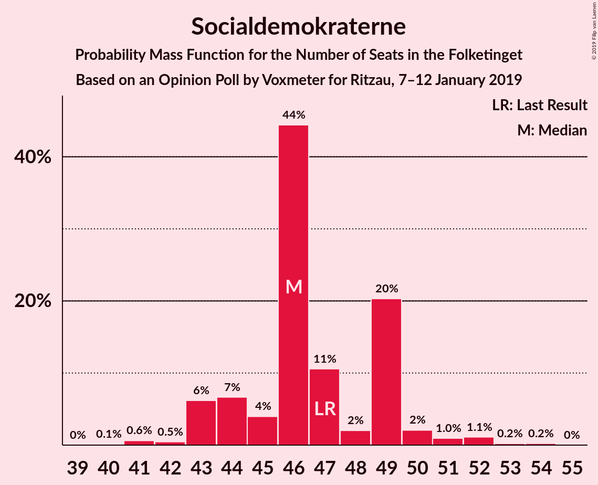
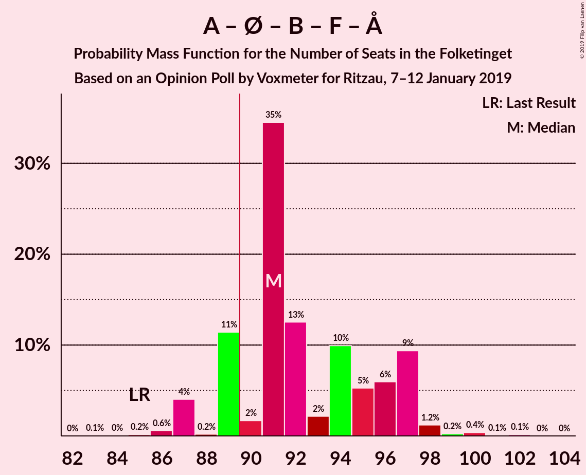

# Opinion Poll by Voxmeter for Ritzau, 7–12 January 2019

<a href="#voting-intentions">Voting Intentions</a> | <a href="#seats">Seats</a> | <a href="#coalitions">Coalitions</a> | <a href="#technical-information">Technical Information</a>

## Voting Intentions

### Confidence Intervals

| Party | Last Result | Poll Result | 80% Confidence Interval | 90% Confidence Interval | 95% Confidence Interval | 99% Confidence Interval |
|:-----:|:-----------:|:-----------:|:-----------------------:|:-----------------------:|:-----------------------:|:-----------------------:|
| Socialdemokraterne | 26.3% | 26.4% | 24.7–28.2% |24.2–28.7% |23.8–29.2% |23.0–30.1% |
| Dansk Folkeparti | 21.1% | 18.2% | 16.7–19.8% |16.3–20.3% |16.0–20.7% |15.3–21.5% |
| Venstre | 19.5% | 17.9% | 16.4–19.5% |16.0–20.0% |15.7–20.4% |15.0–21.2% |
| Enhedslisten–De Rød-Grønne | 7.8% | 9.9% | 8.8–11.2% |8.5–11.6% |8.2–11.9% |7.7–12.6% |
| Radikale Venstre | 4.6% | 6.9% | 6.0–8.0% |5.7–8.4% |5.5–8.6% |5.1–9.2% |
| Socialistisk Folkeparti | 4.2% | 4.8% | 4.0–5.7% |3.8–6.0% |3.6–6.3% |3.3–6.8% |
| Liberal Alliance | 7.5% | 4.7% | 3.9–5.6% |3.7–5.9% |3.5–6.2% |3.2–6.6% |
| Det Konservative Folkeparti | 3.4% | 4.1% | 3.4–5.0% |3.2–5.3% |3.0–5.5% |2.7–6.0% |
| Alternativet | 4.8% | 3.8% | 3.1–4.7% |2.9–4.9% |2.8–5.2% |2.5–5.6% |
| Nye Borgerlige | 0.0% | 1.9% | 1.5–2.6% |1.4–2.8% |1.3–3.0% |1.1–3.4% |
| Kristendemokraterne | 0.8% | 1.1% | 0.8–1.6% |0.7–1.8% |0.6–1.9% |0.5–2.2% |

*Note:* The poll result column reflects the actual value used in the calculations. Published results may vary slightly, and in addition be rounded to fewer digits.

## Seats

### Confidence Intervals

| Party | Last Result | Median | 80% Confidence Interval | 90% Confidence Interval | 95% Confidence Interval | 99% Confidence Interval |
|:-----:|:-----------:|:------:|:-----------------------:|:-----------------------:|:-----------------------:|:-----------------------:|
| <a href="#socialdemokraterne">Socialdemokraterne</a> | 47 | 46 | 44–49 |43–49 |43–51 |41–52 |
| <a href="#dansk-folkeparti">Dansk Folkeparti</a> | 37 | 31 | 30–34 |30–34 |29–35 |28–37 |
| <a href="#venstre">Venstre</a> | 34 | 33 | 28–35 |28–36 |28–36 |27–37 |
| <a href="#enhedslisten–de-rød-grønne">Enhedslisten–De Rød-Grønne</a> | 14 | 17 | 16–19 |15–20 |15–21 |14–22 |
| <a href="#radikale-venstre">Radikale Venstre</a> | 8 | 12 | 11–14 |11–15 |10–15 |10–16 |
| <a href="#socialistisk-folkeparti">Socialistisk Folkeparti</a> | 7 | 9 | 8–10 |7–10 |7–11 |6–11 |
| <a href="#liberal-alliance">Liberal Alliance</a> | 13 | 8 | 7–10 |7–10 |7–11 |6–11 |
| <a href="#det-konservative-folkeparti">Det Konservative Folkeparti</a> | 6 | 8 | 6–9 |5–9 |5–9 |5–10 |
| <a href="#alternativet">Alternativet</a> | 9 | 7 | 5–8 |5–9 |5–9 |5–10 |
| <a href="#nye-borgerlige">Nye Borgerlige</a> | 0 | 4 | 0–4 |0–5 |0–5 |0–6 |
| <a href="#kristendemokraterne">Kristendemokraterne</a> | 0 | 0 | 0 |0 |0 |0–4 |

### Socialdemokraterne

*For a full overview of the results for this party, see the [Socialdemokraterne](party-socialdemokraterne.html) page.*

| Number of Seats | Probability | Accumulated | Special Marks |
|:---------------:|:-----------:|:-----------:|:-------------:|
| 40 | 0.1% | 100% |  |
| 41 | 0.6% | 99.8% |  |
| 42 | 0.5% | 99.2% |  |
| 43 | 6% | 98.8% |  |
| 44 | 7% | 93% |  |
| 45 | 4% | 86% |  |
| 46 | 44% | 82% | Median |
| 47 | 11% | 38% | Last Result |
| 48 | 2% | 27% |  |
| 49 | 20% | 25% |  |
| 50 | 2% | 5% |  |
| 51 | 1.0% | 3% |  |
| 52 | 1.1% | 2% |  |
| 53 | 0.2% | 0.5% |  |
| 54 | 0.2% | 0.2% |  |
| 55 | 0% | 0% |  |

### Dansk Folkeparti

*For a full overview of the results for this party, see the [Dansk Folkeparti](party-danskfolkeparti.html) page.*

| Number of Seats | Probability | Accumulated | Special Marks |
|:---------------:|:-----------:|:-----------:|:-------------:|
| 26 | 0.1% | 100% |  |
| 27 | 0.4% | 99.9% |  |
| 28 | 0.5% | 99.5% |  |
| 29 | 2% | 99.0% |  |
| 30 | 41% | 97% |  |
| 31 | 16% | 56% | Median |
| 32 | 12% | 40% |  |
| 33 | 13% | 27% |  |
| 34 | 11% | 15% |  |
| 35 | 3% | 4% |  |
| 36 | 0.5% | 1.3% |  |
| 37 | 0.3% | 0.8% | Last Result |
| 38 | 0.2% | 0.4% |  |
| 39 | 0.1% | 0.2% |  |
| 40 | 0.1% | 0.1% |  |
| 41 | 0% | 0% |  |

### Venstre

*For a full overview of the results for this party, see the [Venstre](party-venstre.html) page.*

| Number of Seats | Probability | Accumulated | Special Marks |
|:---------------:|:-----------:|:-----------:|:-------------:|
| 26 | 0.4% | 100% |  |
| 27 | 2% | 99.6% |  |
| 28 | 10% | 98% |  |
| 29 | 5% | 88% |  |
| 30 | 3% | 83% |  |
| 31 | 16% | 81% |  |
| 32 | 13% | 65% |  |
| 33 | 8% | 52% | Median |
| 34 | 2% | 44% | Last Result |
| 35 | 36% | 41% |  |
| 36 | 4% | 5% |  |
| 37 | 0.8% | 1.0% |  |
| 38 | 0% | 0.3% |  |
| 39 | 0.2% | 0.2% |  |
| 40 | 0% | 0% |  |

### Enhedslisten–De Rød-Grønne

*For a full overview of the results for this party, see the [Enhedslisten–De Rød-Grønne](party-enhedslisten–derød-grønne.html) page.*

| Number of Seats | Probability | Accumulated | Special Marks |
|:---------------:|:-----------:|:-----------:|:-------------:|
| 13 | 0.2% | 100% |  |
| 14 | 0.9% | 99.8% | Last Result |
| 15 | 4% | 98.9% |  |
| 16 | 11% | 95% |  |
| 17 | 43% | 84% | Median |
| 18 | 28% | 41% |  |
| 19 | 6% | 13% |  |
| 20 | 3% | 7% |  |
| 21 | 3% | 4% |  |
| 22 | 1.0% | 1.3% |  |
| 23 | 0.2% | 0.3% |  |
| 24 | 0.1% | 0.1% |  |
| 25 | 0% | 0% |  |

### Radikale Venstre

*For a full overview of the results for this party, see the [Radikale Venstre](party-radikalevenstre.html) page.*

| Number of Seats | Probability | Accumulated | Special Marks |
|:---------------:|:-----------:|:-----------:|:-------------:|
| 8 | 0% | 100% | Last Result |
| 9 | 0.2% | 100% |  |
| 10 | 4% | 99.8% |  |
| 11 | 8% | 96% |  |
| 12 | 39% | 88% | Median |
| 13 | 30% | 49% |  |
| 14 | 13% | 19% |  |
| 15 | 5% | 6% |  |
| 16 | 0.7% | 0.9% |  |
| 17 | 0.1% | 0.1% |  |
| 18 | 0% | 0% |  |

### Socialistisk Folkeparti

*For a full overview of the results for this party, see the [Socialistisk Folkeparti](party-socialistiskfolkeparti.html) page.*

| Number of Seats | Probability | Accumulated | Special Marks |
|:---------------:|:-----------:|:-----------:|:-------------:|
| 6 | 2% | 100% |  |
| 7 | 7% | 98% | Last Result |
| 8 | 20% | 92% |  |
| 9 | 47% | 72% | Median |
| 10 | 21% | 24% |  |
| 11 | 3% | 3% |  |
| 12 | 0.3% | 0.5% |  |
| 13 | 0.2% | 0.2% |  |
| 14 | 0% | 0% |  |

### Liberal Alliance

*For a full overview of the results for this party, see the [Liberal Alliance](party-liberalalliance.html) page.*

| Number of Seats | Probability | Accumulated | Special Marks |
|:---------------:|:-----------:|:-----------:|:-------------:|
| 5 | 0.1% | 100% |  |
| 6 | 1.2% | 99.9% |  |
| 7 | 46% | 98.7% |  |
| 8 | 17% | 53% | Median |
| 9 | 18% | 35% |  |
| 10 | 15% | 18% |  |
| 11 | 3% | 3% |  |
| 12 | 0.4% | 0.5% |  |
| 13 | 0% | 0% | Last Result |

### Det Konservative Folkeparti

*For a full overview of the results for this party, see the [Det Konservative Folkeparti](party-detkonservativefolkeparti.html) page.*

| Number of Seats | Probability | Accumulated | Special Marks |
|:---------------:|:-----------:|:-----------:|:-------------:|
| 4 | 0.1% | 100% |  |
| 5 | 6% | 99.9% |  |
| 6 | 9% | 94% | Last Result |
| 7 | 21% | 85% |  |
| 8 | 43% | 64% | Median |
| 9 | 19% | 21% |  |
| 10 | 1.3% | 2% |  |
| 11 | 0.4% | 0.5% |  |
| 12 | 0% | 0.1% |  |
| 13 | 0% | 0% |  |

### Alternativet

*For a full overview of the results for this party, see the [Alternativet](party-alternativet.html) page.*

| Number of Seats | Probability | Accumulated | Special Marks |
|:---------------:|:-----------:|:-----------:|:-------------:|
| 4 | 0.3% | 100% |  |
| 5 | 12% | 99.7% |  |
| 6 | 20% | 88% |  |
| 7 | 56% | 68% | Median |
| 8 | 6% | 12% |  |
| 9 | 4% | 5% | Last Result |
| 10 | 1.0% | 1.1% |  |
| 11 | 0.1% | 0.1% |  |
| 12 | 0% | 0% |  |

### Nye Borgerlige

*For a full overview of the results for this party, see the [Nye Borgerlige](party-nyeborgerlige.html) page.*

| Number of Seats | Probability | Accumulated | Special Marks |
|:---------------:|:-----------:|:-----------:|:-------------:|
| 0 | 26% | 100% | Last Result |
| 1 | 0% | 74% |  |
| 2 | 0% | 74% |  |
| 3 | 0% | 74% |  |
| 4 | 68% | 74% | Median |
| 5 | 5% | 6% |  |
| 6 | 0.8% | 0.8% |  |
| 7 | 0% | 0% |  |

### Kristendemokraterne

*For a full overview of the results for this party, see the [Kristendemokraterne](party-kristendemokraterne.html) page.*

| Number of Seats | Probability | Accumulated | Special Marks |
|:---------------:|:-----------:|:-----------:|:-------------:|
| 0 | 99.4% | 100% | Last Result, Median |
| 1 | 0% | 0.6% |  |
| 2 | 0% | 0.6% |  |
| 3 | 0% | 0.6% |  |
| 4 | 0.5% | 0.6% |  |
| 5 | 0% | 0% |  |

## Coalitions

### Confidence Intervals

| Coalition | Last Result | Median | Majority? | 80% Confidence Interval | 90% Confidence Interval | 95% Confidence Interval | 99% Confidence Interval |
|:---------:|:-----------:|:------:|:---------:|:-----------------------:|:-----------------------:|:-----------------------:|:-----------------------:|
| Socialdemokraterne – Enhedslisten–De Rød-Grønne – Radikale Venstre – Socialistisk Folkeparti – Alternativet | 85 | 91 | 83% | 89–97 | 88–97 | 87–97 | 86–100 |
| Socialdemokraterne – Enhedslisten–De Rød-Grønne – Radikale Venstre – Socialistisk Folkeparti | 76 | 84 | 14% | 83–90 | 82–90 | 82–90 | 79–92 |
| Dansk Folkeparti – Venstre – Liberal Alliance – Det Konservative Folkeparti – Nye Borgerlige – Kristendemokraterne | 90 | 84 | 0.3% | 78–86 | 78–87 | 78–88 | 75–89 |
| Dansk Folkeparti – Venstre – Liberal Alliance – Det Konservative Folkeparti – Nye Borgerlige | 90 | 84 | 0.2% | 78–86 | 78–86 | 78–88 | 75–89 |
| Socialdemokraterne – Enhedslisten–De Rød-Grønne – Socialistisk Folkeparti – Alternativet | 77 | 79 | 0% | 76–84 | 76–84 | 73–85 | 73–87 |
| Dansk Folkeparti – Venstre – Liberal Alliance – Det Konservative Folkeparti – Kristendemokraterne | 90 | 80 | 0.1% | 75–83 | 74–84 | 74–84 | 73–87 |
| Dansk Folkeparti – Venstre – Liberal Alliance – Det Konservative Folkeparti | 90 | 80 | 0% | 75–83 | 74–84 | 74–84 | 73–87 |
| Socialdemokraterne – Enhedslisten–De Rød-Grønne – Socialistisk Folkeparti | 68 | 72 | 0% | 70–77 | 69–77 | 68–78 | 67–79 |
| Socialdemokraterne – Radikale Venstre – Socialistisk Folkeparti | 62 | 67 | 0% | 65–72 | 65–72 | 63–72 | 61–74 |
| Socialdemokraterne – Radikale Venstre | 55 | 58 | 0% | 57–62 | 55–63 | 54–63 | 53–65 |
| Venstre – Liberal Alliance – Det Konservative Folkeparti | 53 | 50 | 0% | 43–51 | 43–51 | 43–51 | 42–53 |
| Venstre – Det Konservative Folkeparti | 40 | 41 | 0% | 35–43 | 35–43 | 35–43 | 33–44 |
| Venstre | 34 | 33 | 0% | 28–35 | 28–36 | 28–36 | 27–37 |

### Socialdemokraterne – Enhedslisten–De Rød-Grønne – Radikale Venstre – Socialistisk Folkeparti – Alternativet

| Number of Seats | Probability | Accumulated | Special Marks |
|:---------------:|:-----------:|:-----------:|:-------------:|
| 83 | 0.1% | 100% |  |
| 84 | 0% | 99.9% |  |
| 85 | 0.2% | 99.9% | Last Result |
| 86 | 0.6% | 99.7% |  |
| 87 | 4% | 99.1% |  |
| 88 | 0.2% | 95% |  |
| 89 | 11% | 95% |  |
| 90 | 2% | 83% | Majority |
| 91 | 35% | 82% | Median |
| 92 | 13% | 47% |  |
| 93 | 2% | 35% |  |
| 94 | 10% | 33% |  |
| 95 | 5% | 23% |  |
| 96 | 6% | 17% |  |
| 97 | 9% | 11% |  |
| 98 | 1.2% | 2% |  |
| 99 | 0.2% | 0.8% |  |
| 100 | 0.4% | 0.6% |  |
| 101 | 0.1% | 0.2% |  |
| 102 | 0.1% | 0.2% |  |
| 103 | 0% | 0% |  |

### Socialdemokraterne – Enhedslisten–De Rød-Grønne – Radikale Venstre – Socialistisk Folkeparti

| Number of Seats | Probability | Accumulated | Special Marks |
|:---------------:|:-----------:|:-----------:|:-------------:|
| 76 | 0.1% | 100% | Last Result |
| 77 | 0% | 99.9% |  |
| 78 | 0.1% | 99.9% |  |
| 79 | 0.4% | 99.8% |  |
| 80 | 0.9% | 99.3% |  |
| 81 | 0.7% | 98% |  |
| 82 | 5% | 98% |  |
| 83 | 12% | 93% |  |
| 84 | 37% | 80% | Median |
| 85 | 8% | 44% |  |
| 86 | 3% | 36% |  |
| 87 | 4% | 33% |  |
| 88 | 6% | 29% |  |
| 89 | 8% | 23% |  |
| 90 | 13% | 14% | Majority |
| 91 | 1.0% | 2% |  |
| 92 | 0.2% | 0.6% |  |
| 93 | 0.1% | 0.4% |  |
| 94 | 0.3% | 0.4% |  |
| 95 | 0% | 0% |  |

### Dansk Folkeparti – Venstre – Liberal Alliance – Det Konservative Folkeparti – Nye Borgerlige – Kristendemokraterne

| Number of Seats | Probability | Accumulated | Special Marks |
|:---------------:|:-----------:|:-----------:|:-------------:|
| 73 | 0.1% | 100% |  |
| 74 | 0.1% | 99.8% |  |
| 75 | 0.4% | 99.8% |  |
| 76 | 0.2% | 99.4% |  |
| 77 | 1.2% | 99.2% |  |
| 78 | 9% | 98% |  |
| 79 | 6% | 89% |  |
| 80 | 5% | 83% |  |
| 81 | 10% | 77% |  |
| 82 | 2% | 67% |  |
| 83 | 13% | 65% |  |
| 84 | 35% | 53% | Median |
| 85 | 2% | 18% |  |
| 86 | 11% | 17% |  |
| 87 | 0.2% | 5% |  |
| 88 | 4% | 5% |  |
| 89 | 0.6% | 0.9% |  |
| 90 | 0.2% | 0.3% | Last Result, Majority |
| 91 | 0% | 0.1% |  |
| 92 | 0.1% | 0.1% |  |
| 93 | 0% | 0% |  |

### Dansk Folkeparti – Venstre – Liberal Alliance – Det Konservative Folkeparti – Nye Borgerlige

| Number of Seats | Probability | Accumulated | Special Marks |
|:---------------:|:-----------:|:-----------:|:-------------:|
| 73 | 0.1% | 100% |  |
| 74 | 0.1% | 99.8% |  |
| 75 | 0.4% | 99.8% |  |
| 76 | 0.2% | 99.4% |  |
| 77 | 1.2% | 99.2% |  |
| 78 | 9% | 98% |  |
| 79 | 6% | 88% |  |
| 80 | 5% | 82% |  |
| 81 | 10% | 77% |  |
| 82 | 2% | 67% |  |
| 83 | 13% | 65% |  |
| 84 | 34% | 52% | Median |
| 85 | 2% | 18% |  |
| 86 | 11% | 16% |  |
| 87 | 0.2% | 5% |  |
| 88 | 4% | 5% |  |
| 89 | 0.6% | 0.8% |  |
| 90 | 0.1% | 0.2% | Last Result, Majority |
| 91 | 0% | 0.1% |  |
| 92 | 0.1% | 0.1% |  |
| 93 | 0% | 0% |  |

### Socialdemokraterne – Enhedslisten–De Rød-Grønne – Socialistisk Folkeparti – Alternativet

| Number of Seats | Probability | Accumulated | Special Marks |
|:---------------:|:-----------:|:-----------:|:-------------:|
| 69 | 0.1% | 100% |  |
| 70 | 0% | 99.9% |  |
| 71 | 0.3% | 99.9% |  |
| 72 | 0% | 99.7% |  |
| 73 | 4% | 99.6% |  |
| 74 | 0.2% | 96% |  |
| 75 | 0.6% | 96% |  |
| 76 | 10% | 95% |  |
| 77 | 2% | 86% | Last Result |
| 78 | 7% | 83% |  |
| 79 | 35% | 76% | Median |
| 80 | 3% | 42% |  |
| 81 | 19% | 38% |  |
| 82 | 4% | 19% |  |
| 83 | 1.1% | 15% |  |
| 84 | 11% | 14% |  |
| 85 | 2% | 3% |  |
| 86 | 0.4% | 1.1% |  |
| 87 | 0.3% | 0.7% |  |
| 88 | 0.3% | 0.4% |  |
| 89 | 0.1% | 0.2% |  |
| 90 | 0% | 0% | Majority |

### Dansk Folkeparti – Venstre – Liberal Alliance – Det Konservative Folkeparti – Kristendemokraterne

| Number of Seats | Probability | Accumulated | Special Marks |
|:---------------:|:-----------:|:-----------:|:-------------:|
| 71 | 0.2% | 100% |  |
| 72 | 0% | 99.8% |  |
| 73 | 0.3% | 99.7% |  |
| 74 | 9% | 99.5% |  |
| 75 | 1.3% | 90% |  |
| 76 | 2% | 89% |  |
| 77 | 5% | 87% |  |
| 78 | 2% | 82% |  |
| 79 | 12% | 80% |  |
| 80 | 37% | 68% | Median |
| 81 | 9% | 31% |  |
| 82 | 10% | 22% |  |
| 83 | 5% | 12% |  |
| 84 | 5% | 7% |  |
| 85 | 1.4% | 2% |  |
| 86 | 0.3% | 1.0% |  |
| 87 | 0.2% | 0.6% |  |
| 88 | 0.2% | 0.5% |  |
| 89 | 0.2% | 0.3% |  |
| 90 | 0.1% | 0.1% | Last Result, Majority |
| 91 | 0% | 0% |  |

### Dansk Folkeparti – Venstre – Liberal Alliance – Det Konservative Folkeparti

| Number of Seats | Probability | Accumulated | Special Marks |
|:---------------:|:-----------:|:-----------:|:-------------:|
| 71 | 0.2% | 100% |  |
| 72 | 0% | 99.8% |  |
| 73 | 0.3% | 99.7% |  |
| 74 | 9% | 99.5% |  |
| 75 | 1.3% | 90% |  |
| 76 | 2% | 89% |  |
| 77 | 5% | 87% |  |
| 78 | 2% | 82% |  |
| 79 | 12% | 80% |  |
| 80 | 37% | 68% | Median |
| 81 | 9% | 31% |  |
| 82 | 10% | 22% |  |
| 83 | 5% | 12% |  |
| 84 | 4% | 7% |  |
| 85 | 1.4% | 2% |  |
| 86 | 0.4% | 0.9% |  |
| 87 | 0.1% | 0.5% |  |
| 88 | 0.2% | 0.4% |  |
| 89 | 0.2% | 0.2% |  |
| 90 | 0% | 0% | Last Result, Majority |

### Socialdemokraterne – Enhedslisten–De Rød-Grønne – Socialistisk Folkeparti

| Number of Seats | Probability | Accumulated | Special Marks |
|:---------------:|:-----------:|:-----------:|:-------------:|
| 62 | 0.1% | 100% |  |
| 63 | 0% | 99.9% |  |
| 64 | 0% | 99.9% |  |
| 65 | 0% | 99.9% |  |
| 66 | 0.3% | 99.9% |  |
| 67 | 0.3% | 99.6% |  |
| 68 | 4% | 99.2% | Last Result |
| 69 | 2% | 96% |  |
| 70 | 10% | 93% |  |
| 71 | 6% | 83% |  |
| 72 | 36% | 77% | Median |
| 73 | 5% | 41% |  |
| 74 | 6% | 35% |  |
| 75 | 7% | 29% |  |
| 76 | 10% | 22% |  |
| 77 | 9% | 12% |  |
| 78 | 2% | 3% |  |
| 79 | 0.4% | 0.9% |  |
| 80 | 0% | 0.5% |  |
| 81 | 0.2% | 0.4% |  |
| 82 | 0.2% | 0.3% |  |
| 83 | 0% | 0.1% |  |
| 84 | 0% | 0% |  |

### Socialdemokraterne – Radikale Venstre – Socialistisk Folkeparti

| Number of Seats | Probability | Accumulated | Special Marks |
|:---------------:|:-----------:|:-----------:|:-------------:|
| 60 | 0.4% | 100% |  |
| 61 | 0.2% | 99.6% |  |
| 62 | 0.4% | 99.4% | Last Result |
| 63 | 2% | 99.0% |  |
| 64 | 1.2% | 97% |  |
| 65 | 7% | 96% |  |
| 66 | 2% | 89% |  |
| 67 | 46% | 87% | Median |
| 68 | 10% | 41% |  |
| 69 | 3% | 31% |  |
| 70 | 6% | 28% |  |
| 71 | 8% | 22% |  |
| 72 | 13% | 14% |  |
| 73 | 0.6% | 1.1% |  |
| 74 | 0.2% | 0.6% |  |
| 75 | 0.3% | 0.3% |  |
| 76 | 0% | 0.1% |  |
| 77 | 0% | 0% |  |

### Socialdemokraterne – Radikale Venstre

| Number of Seats | Probability | Accumulated | Special Marks |
|:---------------:|:-----------:|:-----------:|:-------------:|
| 51 | 0.2% | 100% |  |
| 52 | 0.2% | 99.8% |  |
| 53 | 0.4% | 99.6% |  |
| 54 | 2% | 99.2% |  |
| 55 | 3% | 97% | Last Result |
| 56 | 2% | 94% |  |
| 57 | 5% | 92% |  |
| 58 | 44% | 87% | Median |
| 59 | 11% | 44% |  |
| 60 | 3% | 33% |  |
| 61 | 2% | 31% |  |
| 62 | 23% | 29% |  |
| 63 | 4% | 6% |  |
| 64 | 1.0% | 2% |  |
| 65 | 0.7% | 1.0% |  |
| 66 | 0.3% | 0.3% |  |
| 67 | 0% | 0.1% |  |
| 68 | 0% | 0% |  |

### Venstre – Liberal Alliance – Det Konservative Folkeparti

| Number of Seats | Probability | Accumulated | Special Marks |
|:---------------:|:-----------:|:-----------:|:-------------:|
| 41 | 0.2% | 100% |  |
| 42 | 0.7% | 99.7% |  |
| 43 | 10% | 99.0% |  |
| 44 | 5% | 89% |  |
| 45 | 9% | 84% |  |
| 46 | 3% | 75% |  |
| 47 | 2% | 72% |  |
| 48 | 5% | 69% |  |
| 49 | 3% | 65% | Median |
| 50 | 48% | 61% |  |
| 51 | 11% | 14% |  |
| 52 | 1.2% | 2% |  |
| 53 | 0.7% | 1.1% | Last Result |
| 54 | 0.1% | 0.3% |  |
| 55 | 0% | 0.2% |  |
| 56 | 0.2% | 0.2% |  |
| 57 | 0% | 0% |  |

### Venstre – Det Konservative Folkeparti

| Number of Seats | Probability | Accumulated | Special Marks |
|:---------------:|:-----------:|:-----------:|:-------------:|
| 32 | 0.2% | 100% |  |
| 33 | 0.4% | 99.8% |  |
| 34 | 1.2% | 99.4% |  |
| 35 | 10% | 98% |  |
| 36 | 4% | 88% |  |
| 37 | 8% | 84% |  |
| 38 | 6% | 76% |  |
| 39 | 4% | 69% |  |
| 40 | 15% | 66% | Last Result |
| 41 | 3% | 51% | Median |
| 42 | 8% | 49% |  |
| 43 | 40% | 41% |  |
| 44 | 0.5% | 0.9% |  |
| 45 | 0.1% | 0.4% |  |
| 46 | 0.1% | 0.3% |  |
| 47 | 0% | 0.2% |  |
| 48 | 0.2% | 0.2% |  |
| 49 | 0% | 0% |  |

### Venstre

| Number of Seats | Probability | Accumulated | Special Marks |
|:---------------:|:-----------:|:-----------:|:-------------:|
| 26 | 0.4% | 100% |  |
| 27 | 2% | 99.6% |  |
| 28 | 10% | 98% |  |
| 29 | 5% | 88% |  |
| 30 | 3% | 83% |  |
| 31 | 16% | 81% |  |
| 32 | 13% | 65% |  |
| 33 | 8% | 52% | Median |
| 34 | 2% | 44% | Last Result |
| 35 | 36% | 41% |  |
| 36 | 4% | 5% |  |
| 37 | 0.8% | 1.0% |  |
| 38 | 0% | 0.3% |  |
| 39 | 0.2% | 0.2% |  |
| 40 | 0% | 0% |  |

## Technical Information

### Opinion Poll

+ **Polling firm:** Voxmeter
+ **Commissioner(s):** Ritzau
+ **Fieldwork period:** 7–12 January 2019

### Calculations

+ **Sample size:** 1027
+ **Simulations done:** 1,048,576
+ **Error estimate:** 3.64%

