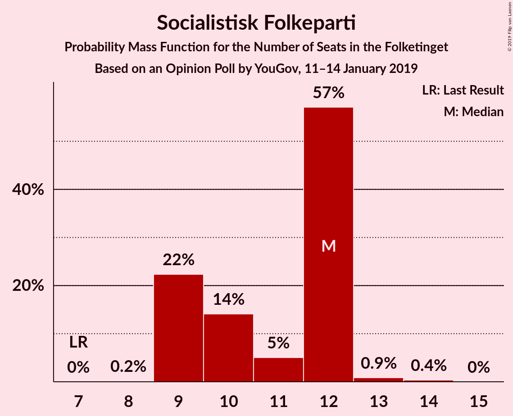
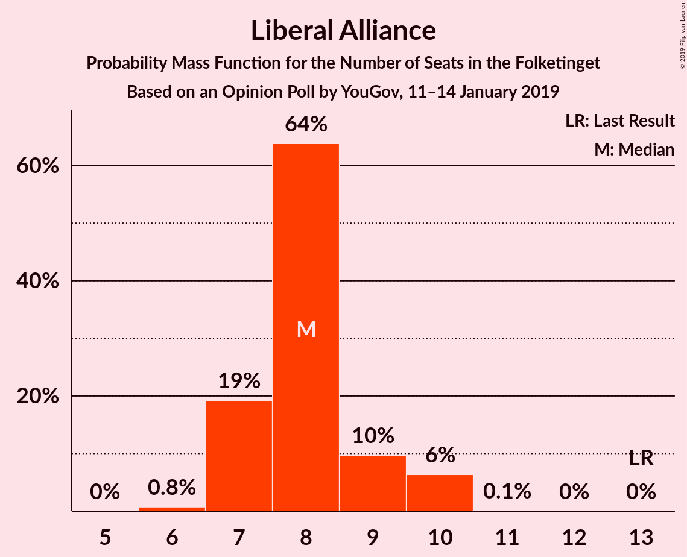
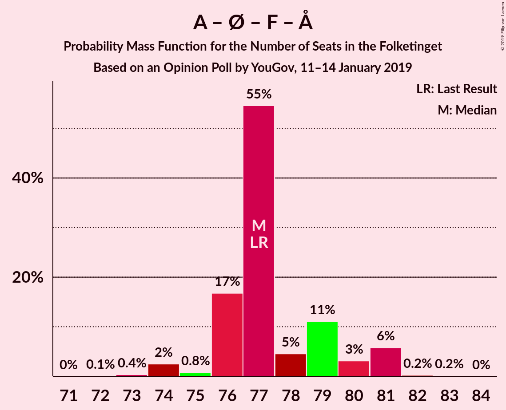
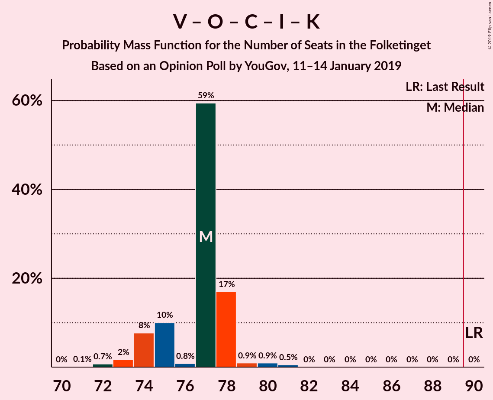

# Opinion Poll by YouGov, 11–14 January 2019

<a href="#voting-intentions">Voting Intentions</a> | <a href="#seats">Seats</a> | <a href="#coalitions">Coalitions</a> | <a href="#technical-information">Technical Information</a>

## Voting Intentions

### Confidence Intervals

| Party | Last Result | Poll Result | 80% Confidence Interval | 90% Confidence Interval | 95% Confidence Interval | 99% Confidence Interval |
|:-----:|:-----------:|:-----------:|:-----------------------:|:-----------------------:|:-----------------------:|:-----------------------:|
| Socialdemokraterne | 26.3% | 23.8% | 22.6–25.1% |22.2–25.4% |21.9–25.8% |21.4–26.4% |
| Venstre | 19.5% | 17.7% | 16.6–18.9% |16.3–19.2% |16.0–19.5% |15.5–20.0% |
| Dansk Folkeparti | 21.1% | 15.9% | 14.9–17.0% |14.6–17.3% |14.3–17.6% |13.9–18.2% |
| Enhedslisten–De Rød-Grønne | 7.8% | 10.2% | 9.4–11.2% |9.1–11.4% |8.9–11.7% |8.6–12.1% |
| Radikale Venstre | 4.6% | 6.2% | 5.5–7.0% |5.4–7.2% |5.2–7.4% |4.9–7.8% |
| Socialistisk Folkeparti | 4.2% | 6.1% | 5.5–6.9% |5.3–7.1% |5.1–7.3% |4.8–7.7% |
| Nye Borgerlige | 0.0% | 5.7% | 5.1–6.4% |4.9–6.6% |4.7–6.8% |4.5–7.2% |
| Det Konservative Folkeparti | 3.4% | 4.8% | 4.2–5.5% |4.1–5.7% |3.9–5.9% |3.7–6.2% |
| Liberal Alliance | 7.5% | 4.6% | 4.0–5.3% |3.9–5.5% |3.7–5.6% |3.5–6.0% |
| Alternativet | 4.8% | 4.0% | 3.5–4.7% |3.3–4.8% |3.2–5.0% |3.0–5.3% |
| Kristendemokraterne | 0.8% | 1.0% | 0.7–1.4% |0.7–1.5% |0.6–1.6% |0.5–1.7% |

*Note:* The poll result column reflects the actual value used in the calculations. Published results may vary slightly, and in addition be rounded to fewer digits.

## Seats

### Confidence Intervals

| Party | Last Result | Median | 80% Confidence Interval | 90% Confidence Interval | 95% Confidence Interval | 99% Confidence Interval |
|:-----:|:-----------:|:------:|:-----------------------:|:-----------------------:|:-----------------------:|:-----------------------:|
| <a href="#socialdemokraterne">Socialdemokraterne</a> | 47 | 41 | 41–43 |41–44 |40–45 |37–45 |
| <a href="#venstre">Venstre</a> | 34 | 31 | 29–35 |29–35 |29–35 |29–35 |
| <a href="#dansk-folkeparti">Dansk Folkeparti</a> | 37 | 30 | 26–30 |25–30 |25–30 |25–31 |
| <a href="#enhedslisten–de-rød-grønne">Enhedslisten–De Rød-Grønne</a> | 14 | 17 | 17–19 |16–19 |16–20 |16–20 |
| <a href="#radikale-venstre">Radikale Venstre</a> | 8 | 11 | 10–12 |10–12 |10–12 |9–13 |
| <a href="#socialistisk-folkeparti">Socialistisk Folkeparti</a> | 7 | 12 | 9–12 |9–12 |9–12 |9–13 |
| <a href="#nye-borgerlige">Nye Borgerlige</a> | 0 | 10 | 9–11 |9–11 |9–12 |8–12 |
| <a href="#det-konservative-folkeparti">Det Konservative Folkeparti</a> | 6 | 8 | 8–10 |8–10 |7–10 |7–10 |
| <a href="#liberal-alliance">Liberal Alliance</a> | 13 | 8 | 7–9 |7–10 |7–10 |6–10 |
| <a href="#alternativet">Alternativet</a> | 9 | 7 | 7–8 |6–8 |6–9 |5–9 |
| <a href="#kristendemokraterne">Kristendemokraterne</a> | 0 | 0 | 0 |0 |0 |0 |

### Socialdemokraterne

*For a full overview of the results for this party, see the [Socialdemokraterne](party-socialdemokraterne.html) page.*

| Number of Seats | Probability | Accumulated | Special Marks |
|:---------------:|:-----------:|:-----------:|:-------------:|
| 37 | 0.8% | 100% |  |
| 38 | 0.1% | 99.2% |  |
| 39 | 0.6% | 99.1% |  |
| 40 | 3% | 98.6% |  |
| 41 | 53% | 96% | Median |
| 42 | 21% | 43% |  |
| 43 | 14% | 22% |  |
| 44 | 4% | 8% |  |
| 45 | 4% | 4% |  |
| 46 | 0.1% | 0.3% |  |
| 47 | 0.1% | 0.2% | Last Result |
| 48 | 0% | 0% |  |

### Venstre

*For a full overview of the results for this party, see the [Venstre](party-venstre.html) page.*

| Number of Seats | Probability | Accumulated | Special Marks |
|:---------------:|:-----------:|:-----------:|:-------------:|
| 27 | 0% | 100% |  |
| 28 | 0.3% | 99.9% |  |
| 29 | 11% | 99.6% |  |
| 30 | 3% | 89% |  |
| 31 | 59% | 86% | Median |
| 32 | 6% | 27% |  |
| 33 | 2% | 20% |  |
| 34 | 1.5% | 19% | Last Result |
| 35 | 17% | 17% |  |
| 36 | 0% | 0.1% |  |
| 37 | 0% | 0.1% |  |
| 38 | 0.1% | 0.1% |  |
| 39 | 0% | 0% |  |

### Dansk Folkeparti

*For a full overview of the results for this party, see the [Dansk Folkeparti](party-danskfolkeparti.html) page.*

| Number of Seats | Probability | Accumulated | Special Marks |
|:---------------:|:-----------:|:-----------:|:-------------:|
| 24 | 0.1% | 100% |  |
| 25 | 5% | 99.9% |  |
| 26 | 6% | 95% |  |
| 27 | 7% | 89% |  |
| 28 | 24% | 82% |  |
| 29 | 6% | 59% |  |
| 30 | 51% | 52% | Median |
| 31 | 1.3% | 2% |  |
| 32 | 0.2% | 0.2% |  |
| 33 | 0% | 0% |  |
| 34 | 0% | 0% |  |
| 35 | 0% | 0% |  |
| 36 | 0% | 0% |  |
| 37 | 0% | 0% | Last Result |

### Enhedslisten–De Rød-Grønne

*For a full overview of the results for this party, see the [Enhedslisten–De Rød-Grønne](party-enhedslisten–derød-grønne.html) page.*

| Number of Seats | Probability | Accumulated | Special Marks |
|:---------------:|:-----------:|:-----------:|:-------------:|
| 14 | 0% | 100% | Last Result |
| 15 | 0.3% | 100% |  |
| 16 | 5% | 99.7% |  |
| 17 | 56% | 94% | Median |
| 18 | 21% | 38% |  |
| 19 | 14% | 17% |  |
| 20 | 3% | 3% |  |
| 21 | 0.2% | 0.4% |  |
| 22 | 0.1% | 0.2% |  |
| 23 | 0% | 0% |  |

### Radikale Venstre

*For a full overview of the results for this party, see the [Radikale Venstre](party-radikalevenstre.html) page.*

| Number of Seats | Probability | Accumulated | Special Marks |
|:---------------:|:-----------:|:-----------:|:-------------:|
| 8 | 0% | 100% | Last Result |
| 9 | 1.4% | 100% |  |
| 10 | 27% | 98.6% |  |
| 11 | 55% | 72% | Median |
| 12 | 15% | 17% |  |
| 13 | 1.5% | 2% |  |
| 14 | 0% | 0.1% |  |
| 15 | 0% | 0% |  |

### Socialistisk Folkeparti

*For a full overview of the results for this party, see the [Socialistisk Folkeparti](party-socialistiskfolkeparti.html) page.*

| Number of Seats | Probability | Accumulated | Special Marks |
|:---------------:|:-----------:|:-----------:|:-------------:|
| 7 | 0% | 100% | Last Result |
| 8 | 0.2% | 100% |  |
| 9 | 22% | 99.8% |  |
| 10 | 14% | 77% |  |
| 11 | 5% | 63% |  |
| 12 | 57% | 58% | Median |
| 13 | 0.9% | 1.2% |  |
| 14 | 0.4% | 0.4% |  |
| 15 | 0% | 0% |  |

### Nye Borgerlige

*For a full overview of the results for this party, see the [Nye Borgerlige](party-nyeborgerlige.html) page.*

| Number of Seats | Probability | Accumulated | Special Marks |
|:---------------:|:-----------:|:-----------:|:-------------:|
| 0 | 0% | 100% | Last Result |
| 1 | 0% | 100% |  |
| 2 | 0% | 100% |  |
| 3 | 0% | 100% |  |
| 4 | 0% | 100% |  |
| 5 | 0% | 100% |  |
| 6 | 0% | 100% |  |
| 7 | 0% | 100% |  |
| 8 | 1.0% | 100% |  |
| 9 | 16% | 98.9% |  |
| 10 | 60% | 83% | Median |
| 11 | 21% | 23% |  |
| 12 | 2% | 3% |  |
| 13 | 0.5% | 0.5% |  |
| 14 | 0% | 0% |  |

### Det Konservative Folkeparti

*For a full overview of the results for this party, see the [Det Konservative Folkeparti](party-detkonservativefolkeparti.html) page.*

| Number of Seats | Probability | Accumulated | Special Marks |
|:---------------:|:-----------:|:-----------:|:-------------:|
| 6 | 0% | 100% | Last Result |
| 7 | 3% | 100% |  |
| 8 | 75% | 97% | Median |
| 9 | 11% | 22% |  |
| 10 | 12% | 12% |  |
| 11 | 0.1% | 0.1% |  |
| 12 | 0% | 0% |  |

### Liberal Alliance

*For a full overview of the results for this party, see the [Liberal Alliance](party-liberalalliance.html) page.*

| Number of Seats | Probability | Accumulated | Special Marks |
|:---------------:|:-----------:|:-----------:|:-------------:|
| 6 | 0.8% | 100% |  |
| 7 | 19% | 99.2% |  |
| 8 | 64% | 80% | Median |
| 9 | 10% | 16% |  |
| 10 | 6% | 6% |  |
| 11 | 0.1% | 0.1% |  |
| 12 | 0% | 0% |  |
| 13 | 0% | 0% | Last Result |

### Alternativet

*For a full overview of the results for this party, see the [Alternativet](party-alternativet.html) page.*

| Number of Seats | Probability | Accumulated | Special Marks |
|:---------------:|:-----------:|:-----------:|:-------------:|
| 5 | 0.6% | 100% |  |
| 6 | 6% | 99.4% |  |
| 7 | 82% | 94% | Median |
| 8 | 8% | 12% |  |
| 9 | 4% | 4% | Last Result |
| 10 | 0.2% | 0.2% |  |
| 11 | 0% | 0% |  |

### Kristendemokraterne

*For a full overview of the results for this party, see the [Kristendemokraterne](party-kristendemokraterne.html) page.*

| Number of Seats | Probability | Accumulated | Special Marks |
|:---------------:|:-----------:|:-----------:|:-------------:|
| 0 | 100% | 100% | Last Result, Median |

## Coalitions

### Confidence Intervals

| Coalition | Last Result | Median | Majority? | 80% Confidence Interval | 90% Confidence Interval | 95% Confidence Interval | 99% Confidence Interval |
|:---------:|:-----------:|:------:|:---------:|:-----------------------:|:-----------------------:|:-----------------------:|:-----------------------:|
| Socialdemokraterne – Enhedslisten–De Rød-Grønne – Radikale Venstre – Socialistisk Folkeparti – Alternativet | 85 | 88 | 19% | 86–91 | 86–91 | 86–91 | 85–92 |
| Venstre – Dansk Folkeparti – Nye Borgerlige – Det Konservative Folkeparti – Liberal Alliance – Kristendemokraterne | 90 | 87 | 0.9% | 84–89 | 84–89 | 84–89 | 83–90 |
| Venstre – Dansk Folkeparti – Nye Borgerlige – Det Konservative Folkeparti – Liberal Alliance | 90 | 87 | 0.9% | 84–89 | 84–89 | 84–89 | 83–90 |
| Socialdemokraterne – Enhedslisten–De Rød-Grønne – Radikale Venstre – Socialistisk Folkeparti | 76 | 81 | 0% | 79–83 | 79–84 | 79–84 | 79–85 |
| Socialdemokraterne – Enhedslisten–De Rød-Grønne – Socialistisk Folkeparti – Alternativet | 77 | 77 | 0% | 76–79 | 76–81 | 74–81 | 74–81 |
| Venstre – Dansk Folkeparti – Det Konservative Folkeparti – Liberal Alliance – Kristendemokraterne | 90 | 77 | 0% | 74–78 | 74–78 | 73–78 | 72–81 |
| Venstre – Dansk Folkeparti – Det Konservative Folkeparti – Liberal Alliance | 90 | 77 | 0% | 74–78 | 74–78 | 73–78 | 72–81 |
| Socialdemokraterne – Enhedslisten–De Rød-Grønne – Socialistisk Folkeparti | 68 | 70 | 0% | 69–72 | 69–73 | 68–74 | 67–74 |
| Socialdemokraterne – Radikale Venstre – Socialistisk Folkeparti | 62 | 64 | 0% | 61–65 | 61–66 | 61–67 | 59–68 |
| Socialdemokraterne – Radikale Venstre | 55 | 52 | 0% | 52–55 | 52–55 | 51–55 | 48–55 |
| Venstre – Det Konservative Folkeparti – Liberal Alliance | 53 | 47 | 0% | 46–50 | 46–50 | 46–51 | 45–52 |
| Venstre – Det Konservative Folkeparti | 40 | 39 | 0% | 38–43 | 37–43 | 37–43 | 36–44 |
| Venstre | 34 | 31 | 0% | 29–35 | 29–35 | 29–35 | 29–35 |

### Socialdemokraterne – Enhedslisten–De Rød-Grønne – Radikale Venstre – Socialistisk Folkeparti – Alternativet

| Number of Seats | Probability | Accumulated | Special Marks |
|:---------------:|:-----------:|:-----------:|:-------------:|
| 83 | 0.1% | 100% |  |
| 84 | 0% | 99.9% |  |
| 85 | 0.8% | 99.9% | Last Result |
| 86 | 18% | 99.1% |  |
| 87 | 0.5% | 81% |  |
| 88 | 54% | 80% | Median |
| 89 | 7% | 26% |  |
| 90 | 4% | 19% | Majority |
| 91 | 13% | 15% |  |
| 92 | 2% | 2% |  |
| 93 | 0.2% | 0.4% |  |
| 94 | 0.2% | 0.2% |  |
| 95 | 0% | 0% |  |

### Venstre – Dansk Folkeparti – Nye Borgerlige – Det Konservative Folkeparti – Liberal Alliance – Kristendemokraterne

| Number of Seats | Probability | Accumulated | Special Marks |
|:---------------:|:-----------:|:-----------:|:-------------:|
| 81 | 0.2% | 100% |  |
| 82 | 0.2% | 99.8% |  |
| 83 | 2% | 99.6% |  |
| 84 | 13% | 98% |  |
| 85 | 4% | 85% |  |
| 86 | 7% | 81% |  |
| 87 | 54% | 74% | Median |
| 88 | 0.5% | 20% |  |
| 89 | 18% | 19% |  |
| 90 | 0.8% | 0.9% | Last Result, Majority |
| 91 | 0% | 0.1% |  |
| 92 | 0.1% | 0.1% |  |
| 93 | 0% | 0% |  |

### Venstre – Dansk Folkeparti – Nye Borgerlige – Det Konservative Folkeparti – Liberal Alliance

| Number of Seats | Probability | Accumulated | Special Marks |
|:---------------:|:-----------:|:-----------:|:-------------:|
| 81 | 0.2% | 100% |  |
| 82 | 0.2% | 99.8% |  |
| 83 | 2% | 99.6% |  |
| 84 | 13% | 98% |  |
| 85 | 4% | 85% |  |
| 86 | 7% | 81% |  |
| 87 | 54% | 74% | Median |
| 88 | 0.5% | 20% |  |
| 89 | 18% | 19% |  |
| 90 | 0.8% | 0.9% | Last Result, Majority |
| 91 | 0% | 0.1% |  |
| 92 | 0.1% | 0.1% |  |
| 93 | 0% | 0% |  |

### Socialdemokraterne – Enhedslisten–De Rød-Grønne – Radikale Venstre – Socialistisk Folkeparti

| Number of Seats | Probability | Accumulated | Special Marks |
|:---------------:|:-----------:|:-----------:|:-------------:|
| 76 | 0.1% | 100% | Last Result |
| 77 | 0.1% | 99.9% |  |
| 78 | 0.1% | 99.8% |  |
| 79 | 19% | 99.8% |  |
| 80 | 1.4% | 81% |  |
| 81 | 55% | 80% | Median |
| 82 | 5% | 25% |  |
| 83 | 13% | 19% |  |
| 84 | 5% | 7% |  |
| 85 | 1.1% | 1.4% |  |
| 86 | 0% | 0.2% |  |
| 87 | 0.2% | 0.2% |  |
| 88 | 0% | 0% |  |

### Socialdemokraterne – Enhedslisten–De Rød-Grønne – Socialistisk Folkeparti – Alternativet

| Number of Seats | Probability | Accumulated | Special Marks |
|:---------------:|:-----------:|:-----------:|:-------------:|
| 72 | 0.1% | 100% |  |
| 73 | 0.4% | 99.9% |  |
| 74 | 2% | 99.6% |  |
| 75 | 0.8% | 97% |  |
| 76 | 17% | 96% |  |
| 77 | 55% | 79% | Last Result, Median |
| 78 | 5% | 25% |  |
| 79 | 11% | 20% |  |
| 80 | 3% | 9% |  |
| 81 | 6% | 6% |  |
| 82 | 0.2% | 0.4% |  |
| 83 | 0.2% | 0.2% |  |
| 84 | 0% | 0% |  |

### Venstre – Dansk Folkeparti – Det Konservative Folkeparti – Liberal Alliance – Kristendemokraterne

| Number of Seats | Probability | Accumulated | Special Marks |
|:---------------:|:-----------:|:-----------:|:-------------:|
| 70 | 0% | 100% |  |
| 71 | 0.1% | 99.9% |  |
| 72 | 0.7% | 99.9% |  |
| 73 | 2% | 99.1% |  |
| 74 | 8% | 97% |  |
| 75 | 10% | 90% |  |
| 76 | 0.8% | 80% |  |
| 77 | 59% | 79% | Median |
| 78 | 17% | 19% |  |
| 79 | 0.9% | 2% |  |
| 80 | 0.9% | 2% |  |
| 81 | 0.5% | 0.6% |  |
| 82 | 0% | 0% |  |
| 83 | 0% | 0% |  |
| 84 | 0% | 0% |  |
| 85 | 0% | 0% |  |
| 86 | 0% | 0% |  |
| 87 | 0% | 0% |  |
| 88 | 0% | 0% |  |
| 89 | 0% | 0% |  |
| 90 | 0% | 0% | Last Result, Majority |

### Venstre – Dansk Folkeparti – Det Konservative Folkeparti – Liberal Alliance

| Number of Seats | Probability | Accumulated | Special Marks |
|:---------------:|:-----------:|:-----------:|:-------------:|
| 70 | 0% | 100% |  |
| 71 | 0.1% | 99.9% |  |
| 72 | 0.7% | 99.9% |  |
| 73 | 2% | 99.1% |  |
| 74 | 8% | 97% |  |
| 75 | 10% | 90% |  |
| 76 | 0.8% | 80% |  |
| 77 | 59% | 79% | Median |
| 78 | 17% | 19% |  |
| 79 | 0.9% | 2% |  |
| 80 | 0.9% | 2% |  |
| 81 | 0.5% | 0.6% |  |
| 82 | 0% | 0% |  |
| 83 | 0% | 0% |  |
| 84 | 0% | 0% |  |
| 85 | 0% | 0% |  |
| 86 | 0% | 0% |  |
| 87 | 0% | 0% |  |
| 88 | 0% | 0% |  |
| 89 | 0% | 0% |  |
| 90 | 0% | 0% | Last Result, Majority |

### Socialdemokraterne – Enhedslisten–De Rød-Grønne – Socialistisk Folkeparti

| Number of Seats | Probability | Accumulated | Special Marks |
|:---------------:|:-----------:|:-----------:|:-------------:|
| 65 | 0.1% | 100% |  |
| 66 | 0.3% | 99.9% |  |
| 67 | 2% | 99.6% |  |
| 68 | 1.3% | 98% | Last Result |
| 69 | 17% | 96% |  |
| 70 | 55% | 80% | Median |
| 71 | 12% | 24% |  |
| 72 | 4% | 12% |  |
| 73 | 4% | 9% |  |
| 74 | 5% | 5% |  |
| 75 | 0.1% | 0.2% |  |
| 76 | 0.2% | 0.2% |  |
| 77 | 0% | 0% |  |

### Socialdemokraterne – Radikale Venstre – Socialistisk Folkeparti

| Number of Seats | Probability | Accumulated | Special Marks |
|:---------------:|:-----------:|:-----------:|:-------------:|
| 59 | 0.8% | 100% |  |
| 60 | 0.1% | 99.1% |  |
| 61 | 17% | 99.0% |  |
| 62 | 4% | 82% | Last Result |
| 63 | 5% | 78% |  |
| 64 | 57% | 73% | Median |
| 65 | 9% | 16% |  |
| 66 | 2% | 7% |  |
| 67 | 4% | 5% |  |
| 68 | 0.4% | 0.6% |  |
| 69 | 0.1% | 0.2% |  |
| 70 | 0% | 0% |  |

### Socialdemokraterne – Radikale Venstre

| Number of Seats | Probability | Accumulated | Special Marks |
|:---------------:|:-----------:|:-----------:|:-------------:|
| 48 | 0.8% | 100% |  |
| 49 | 0.1% | 99.1% |  |
| 50 | 0.1% | 99.1% |  |
| 51 | 3% | 99.0% |  |
| 52 | 73% | 96% | Median |
| 53 | 0.7% | 23% |  |
| 54 | 1.4% | 22% |  |
| 55 | 20% | 20% | Last Result |
| 56 | 0.2% | 0.4% |  |
| 57 | 0% | 0.2% |  |
| 58 | 0.1% | 0.2% |  |
| 59 | 0.1% | 0.2% |  |
| 60 | 0% | 0% |  |

### Venstre – Det Konservative Folkeparti – Liberal Alliance

| Number of Seats | Probability | Accumulated | Special Marks |
|:---------------:|:-----------:|:-----------:|:-------------:|
| 43 | 0.1% | 100% |  |
| 44 | 0.1% | 99.9% |  |
| 45 | 1.0% | 99.8% |  |
| 46 | 11% | 98.8% |  |
| 47 | 51% | 88% | Median |
| 48 | 3% | 37% |  |
| 49 | 6% | 34% |  |
| 50 | 24% | 28% |  |
| 51 | 1.3% | 3% |  |
| 52 | 2% | 2% |  |
| 53 | 0.1% | 0.1% | Last Result |
| 54 | 0% | 0% |  |

### Venstre – Det Konservative Folkeparti

| Number of Seats | Probability | Accumulated | Special Marks |
|:---------------:|:-----------:|:-----------:|:-------------:|
| 36 | 0.6% | 100% |  |
| 37 | 8% | 99.4% |  |
| 38 | 2% | 91% |  |
| 39 | 54% | 89% | Median |
| 40 | 6% | 36% | Last Result |
| 41 | 6% | 29% |  |
| 42 | 5% | 23% |  |
| 43 | 17% | 18% |  |
| 44 | 2% | 2% |  |
| 45 | 0.1% | 0.1% |  |
| 46 | 0% | 0% |  |

### Venstre

| Number of Seats | Probability | Accumulated | Special Marks |
|:---------------:|:-----------:|:-----------:|:-------------:|
| 27 | 0% | 100% |  |
| 28 | 0.3% | 99.9% |  |
| 29 | 11% | 99.6% |  |
| 30 | 3% | 89% |  |
| 31 | 59% | 86% | Median |
| 32 | 6% | 27% |  |
| 33 | 2% | 20% |  |
| 34 | 1.5% | 19% | Last Result |
| 35 | 17% | 17% |  |
| 36 | 0% | 0.1% |  |
| 37 | 0% | 0.1% |  |
| 38 | 0.1% | 0.1% |  |
| 39 | 0% | 0% |  |

## Technical Information

### Opinion Poll

+ **Polling firm:** YouGov
+ **Commissioner(s):** —
+ **Fieldwork period:** 11–14 January 2019

### Calculations

+ **Sample size:** 1917
+ **Simulations done:** 1,048,576
+ **Error estimate:** 2.65%

