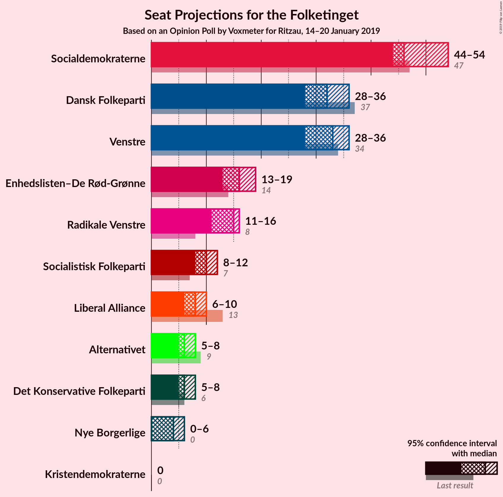
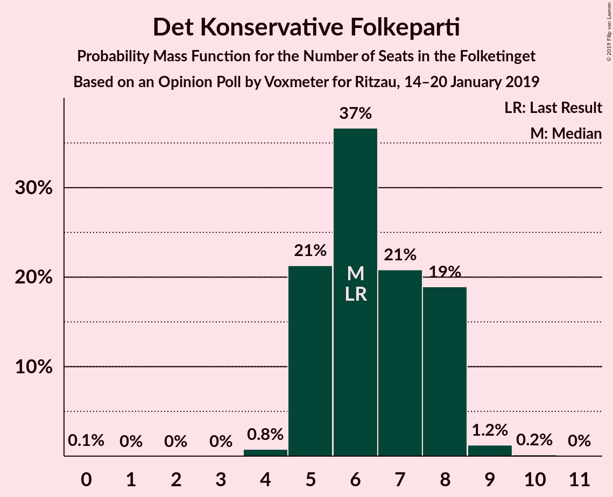
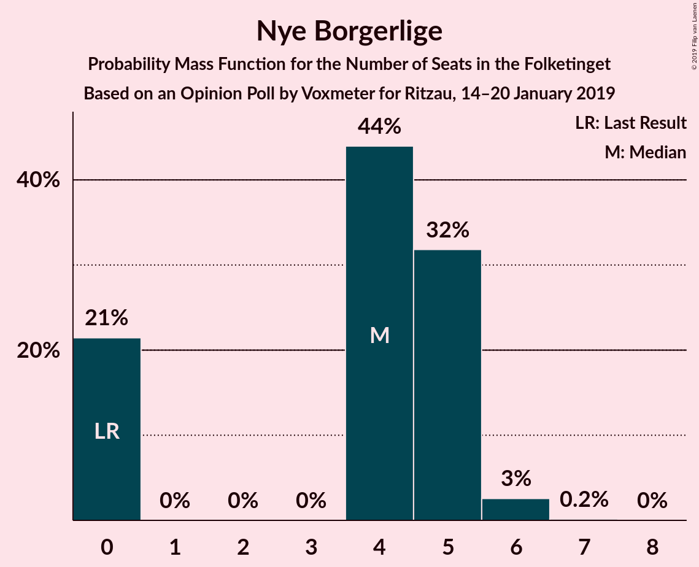
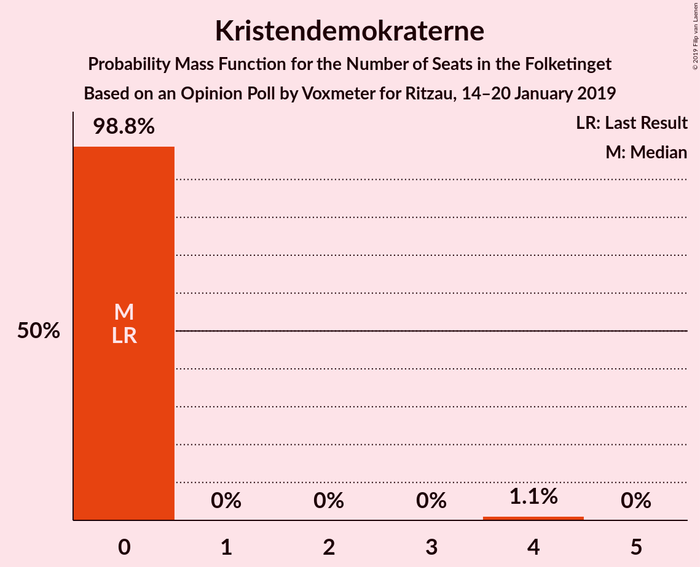
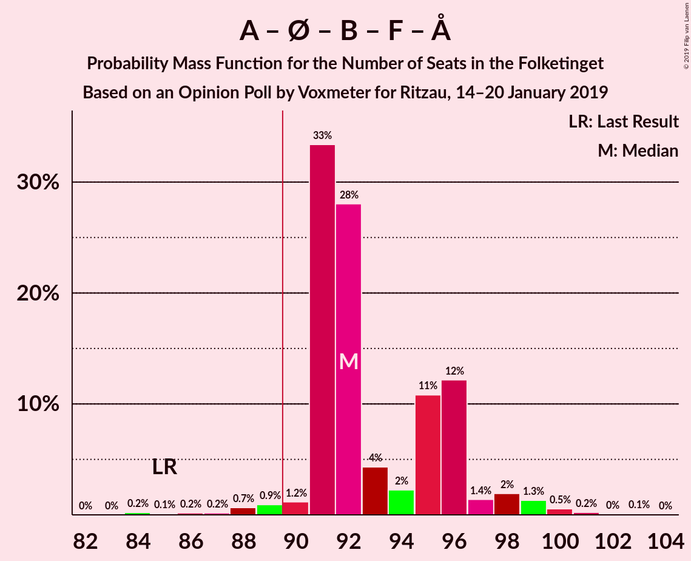
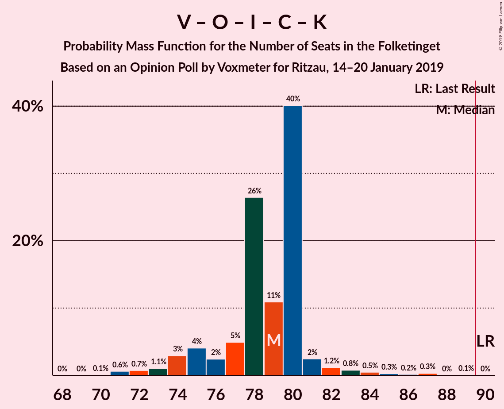
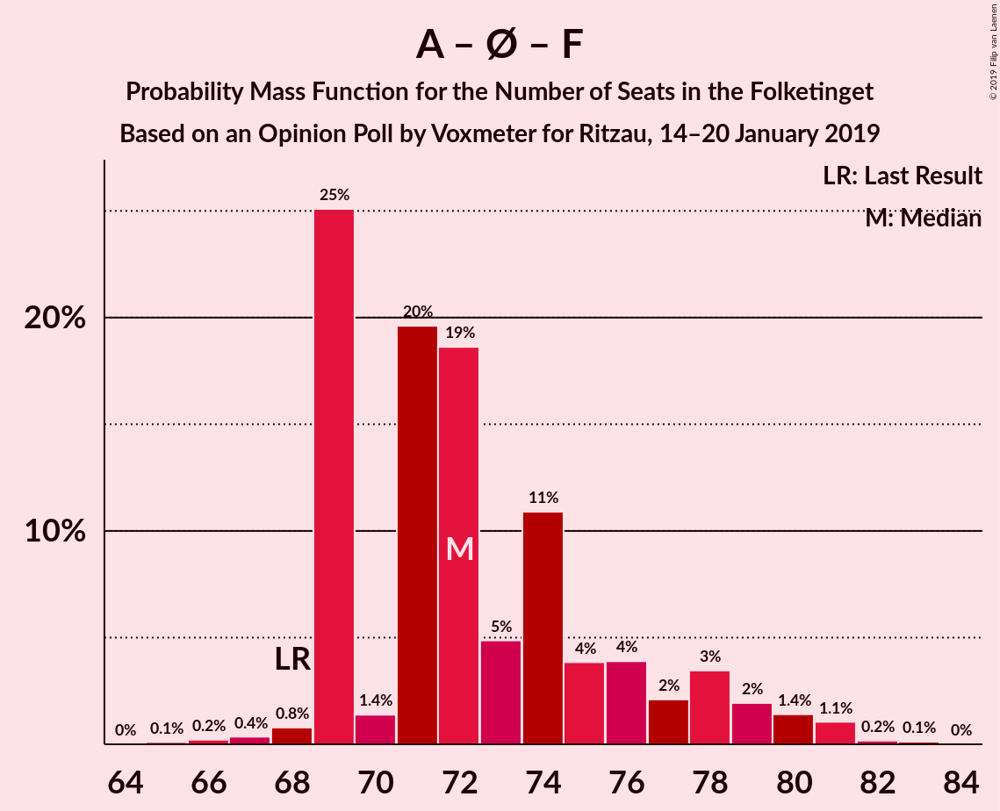

# Opinion Poll by Voxmeter for Ritzau, 14–20 January 2019

<a href="#voting-intentions">Voting Intentions</a> | <a href="#seats">Seats</a> | <a href="#coalitions">Coalitions</a> | <a href="#technical-information">Technical Information</a>

## Voting Intentions

### Confidence Intervals

| Party | Last Result | Poll Result | 80% Confidence Interval | 90% Confidence Interval | 95% Confidence Interval | 99% Confidence Interval |
|:-----:|:-----------:|:-----------:|:-----------------------:|:-----------------------:|:-----------------------:|:-----------------------:|
| Socialdemokraterne | 26.3% | 26.9% | 25.2–28.8% |24.7–29.3% |24.3–29.7% |23.5–30.6% |
| Venstre | 19.5% | 18.3% | 16.8–19.9% |16.4–20.4% |16.1–20.8% |15.4–21.6% |
| Dansk Folkeparti | 21.1% | 17.8% | 16.4–19.4% |16.0–19.9% |15.6–20.3% |14.9–21.1% |
| Enhedslisten–De Rød-Grønne | 7.8% | 8.8% | 7.8–10.1% |7.5–10.4% |7.2–10.7% |6.8–11.3% |
| Radikale Venstre | 4.6% | 7.5% | 6.5–8.6% |6.2–8.9% |6.0–9.2% |5.6–9.8% |
| Socialistisk Folkeparti | 4.2% | 5.6% | 4.8–6.7% |4.6–7.0% |4.4–7.2% |4.0–7.7% |
| Liberal Alliance | 7.5% | 4.3% | 3.6–5.2% |3.4–5.5% |3.2–5.7% |2.9–6.2% |
| Alternativet | 4.8% | 3.6% | 2.9–4.5% |2.8–4.7% |2.6–4.9% |2.3–5.3% |
| Det Konservative Folkeparti | 3.4% | 3.5% | 2.9–4.3% |2.7–4.6% |2.5–4.8% |2.3–5.2% |
| Nye Borgerlige | 0.0% | 2.1% | 1.6–2.8% |1.5–3.0% |1.4–3.2% |1.2–3.6% |
| Kristendemokraterne | 0.8% | 1.2% | 0.8–1.7% |0.7–1.9% |0.7–2.0% |0.5–2.3% |

*Note:* The poll result column reflects the actual value used in the calculations. Published results may vary slightly, and in addition be rounded to fewer digits.

## Seats

### Confidence Intervals

| Party | Last Result | Median | 80% Confidence Interval | 90% Confidence Interval | 95% Confidence Interval | 99% Confidence Interval |
|:-----:|:-----------:|:------:|:-----------------------:|:-----------------------:|:-----------------------:|:-----------------------:|
| <a href="#socialdemokraterne">Socialdemokraterne</a> | 47 | 46 | 45–51 |45–52 |44–54 |42–55 |
| <a href="#venstre">Venstre</a> | 34 | 33 | 30–34 |29–35 |28–36 |27–38 |
| <a href="#dansk-folkeparti">Dansk Folkeparti</a> | 37 | 32 | 30–34 |28–35 |28–36 |26–37 |
| <a href="#enhedslisten–de-rød-grønne">Enhedslisten–De Rød-Grønne</a> | 14 | 16 | 14–18 |14–18 |13–19 |12–19 |
| <a href="#radikale-venstre">Radikale Venstre</a> | 8 | 15 | 13–16 |11–16 |11–16 |10–18 |
| <a href="#socialistisk-folkeparti">Socialistisk Folkeparti</a> | 7 | 10 | 9–11 |8–12 |8–12 |8–14 |
| <a href="#liberal-alliance">Liberal Alliance</a> | 13 | 8 | 6–10 |6–10 |6–10 |5–11 |
| <a href="#alternativet">Alternativet</a> | 9 | 6 | 5–7 |5–8 |5–8 |4–9 |
| <a href="#det-konservative-folkeparti">Det Konservative Folkeparti</a> | 6 | 6 | 5–8 |5–8 |5–8 |4–9 |
| <a href="#nye-borgerlige">Nye Borgerlige</a> | 0 | 4 | 0–5 |0–5 |0–6 |0–6 |
| <a href="#kristendemokraterne">Kristendemokraterne</a> | 0 | 0 | 0 |0 |0 |0–4 |

### Socialdemokraterne

*For a full overview of the results for this party, see the [Socialdemokraterne](party-socialdemokraterne.html) page.*

| Number of Seats | Probability | Accumulated | Special Marks |
|:---------------:|:-----------:|:-----------:|:-------------:|
| 40 | 0% | 100% |  |
| 41 | 0.1% | 99.9% |  |
| 42 | 0.8% | 99.9% |  |
| 43 | 1.2% | 99.0% |  |
| 44 | 0.6% | 98% |  |
| 45 | 42% | 97% |  |
| 46 | 7% | 55% | Median |
| 47 | 21% | 49% | Last Result |
| 48 | 5% | 28% |  |
| 49 | 2% | 23% |  |
| 50 | 11% | 21% |  |
| 51 | 5% | 10% |  |
| 52 | 2% | 5% |  |
| 53 | 0.7% | 3% |  |
| 54 | 2% | 3% |  |
| 55 | 1.0% | 1.0% |  |
| 56 | 0% | 0% |  |

### Venstre

*For a full overview of the results for this party, see the [Venstre](party-venstre.html) page.*

| Number of Seats | Probability | Accumulated | Special Marks |
|:---------------:|:-----------:|:-----------:|:-------------:|
| 26 | 0.1% | 100% |  |
| 27 | 2% | 99.9% |  |
| 28 | 2% | 98% |  |
| 29 | 6% | 97% |  |
| 30 | 3% | 91% |  |
| 31 | 6% | 88% |  |
| 32 | 22% | 82% |  |
| 33 | 29% | 60% | Median |
| 34 | 25% | 32% | Last Result |
| 35 | 3% | 6% |  |
| 36 | 1.5% | 3% |  |
| 37 | 1.2% | 2% |  |
| 38 | 0.2% | 0.6% |  |
| 39 | 0.2% | 0.3% |  |
| 40 | 0% | 0.1% |  |
| 41 | 0% | 0.1% |  |
| 42 | 0% | 0% |  |

### Dansk Folkeparti

*For a full overview of the results for this party, see the [Dansk Folkeparti](party-danskfolkeparti.html) page.*

| Number of Seats | Probability | Accumulated | Special Marks |
|:---------------:|:-----------:|:-----------:|:-------------:|
| 25 | 0.1% | 100% |  |
| 26 | 0.5% | 99.9% |  |
| 27 | 1.1% | 99.4% |  |
| 28 | 4% | 98% |  |
| 29 | 3% | 94% |  |
| 30 | 6% | 91% |  |
| 31 | 23% | 85% |  |
| 32 | 42% | 62% | Median |
| 33 | 8% | 20% |  |
| 34 | 3% | 11% |  |
| 35 | 5% | 8% |  |
| 36 | 2% | 3% |  |
| 37 | 0.4% | 0.7% | Last Result |
| 38 | 0.1% | 0.2% |  |
| 39 | 0.1% | 0.1% |  |
| 40 | 0% | 0% |  |

### Enhedslisten–De Rød-Grønne

*For a full overview of the results for this party, see the [Enhedslisten–De Rød-Grønne](party-enhedslisten–derød-grønne.html) page.*

| Number of Seats | Probability | Accumulated | Special Marks |
|:---------------:|:-----------:|:-----------:|:-------------:|
| 11 | 0.1% | 100% |  |
| 12 | 1.2% | 99.9% |  |
| 13 | 2% | 98.8% |  |
| 14 | 26% | 97% | Last Result |
| 15 | 17% | 71% |  |
| 16 | 37% | 54% | Median |
| 17 | 7% | 17% |  |
| 18 | 7% | 10% |  |
| 19 | 2% | 3% |  |
| 20 | 0.2% | 0.4% |  |
| 21 | 0.1% | 0.2% |  |
| 22 | 0.1% | 0.1% |  |
| 23 | 0% | 0% |  |

### Radikale Venstre

*For a full overview of the results for this party, see the [Radikale Venstre](party-radikalevenstre.html) page.*

| Number of Seats | Probability | Accumulated | Special Marks |
|:---------------:|:-----------:|:-----------:|:-------------:|
| 8 | 0% | 100% | Last Result |
| 9 | 0.2% | 100% |  |
| 10 | 0.4% | 99.8% |  |
| 11 | 5% | 99.4% |  |
| 12 | 4% | 94% |  |
| 13 | 27% | 90% |  |
| 14 | 10% | 63% |  |
| 15 | 24% | 52% | Median |
| 16 | 27% | 29% |  |
| 17 | 1.0% | 2% |  |
| 18 | 0.7% | 0.8% |  |
| 19 | 0% | 0.1% |  |
| 20 | 0% | 0% |  |

### Socialistisk Folkeparti

*For a full overview of the results for this party, see the [Socialistisk Folkeparti](party-socialistiskfolkeparti.html) page.*

| Number of Seats | Probability | Accumulated | Special Marks |
|:---------------:|:-----------:|:-----------:|:-------------:|
| 7 | 0.4% | 100% | Last Result |
| 8 | 10% | 99.6% |  |
| 9 | 26% | 90% |  |
| 10 | 50% | 64% | Median |
| 11 | 7% | 14% |  |
| 12 | 5% | 6% |  |
| 13 | 0.8% | 2% |  |
| 14 | 0.8% | 0.8% |  |
| 15 | 0% | 0% |  |

### Liberal Alliance

*For a full overview of the results for this party, see the [Liberal Alliance](party-liberalalliance.html) page.*

| Number of Seats | Probability | Accumulated | Special Marks |
|:---------------:|:-----------:|:-----------:|:-------------:|
| 5 | 0.5% | 100% |  |
| 6 | 12% | 99.4% |  |
| 7 | 34% | 88% |  |
| 8 | 25% | 54% | Median |
| 9 | 9% | 29% |  |
| 10 | 19% | 20% |  |
| 11 | 0.6% | 0.8% |  |
| 12 | 0.2% | 0.2% |  |
| 13 | 0% | 0% | Last Result |

### Alternativet

*For a full overview of the results for this party, see the [Alternativet](party-alternativet.html) page.*

| Number of Seats | Probability | Accumulated | Special Marks |
|:---------------:|:-----------:|:-----------:|:-------------:|
| 4 | 0.7% | 100% |  |
| 5 | 22% | 99.3% |  |
| 6 | 33% | 77% | Median |
| 7 | 36% | 44% |  |
| 8 | 6% | 9% |  |
| 9 | 2% | 2% | Last Result |
| 10 | 0.3% | 0.3% |  |
| 11 | 0% | 0% |  |

### Det Konservative Folkeparti

*For a full overview of the results for this party, see the [Det Konservative Folkeparti](party-detkonservativefolkeparti.html) page.*

| Number of Seats | Probability | Accumulated | Special Marks |
|:---------------:|:-----------:|:-----------:|:-------------:|
| 0 | 0.1% | 100% |  |
| 1 | 0% | 99.9% |  |
| 2 | 0% | 99.9% |  |
| 3 | 0% | 99.9% |  |
| 4 | 0.8% | 99.9% |  |
| 5 | 21% | 99.1% |  |
| 6 | 37% | 78% | Last Result, Median |
| 7 | 21% | 41% |  |
| 8 | 19% | 20% |  |
| 9 | 1.2% | 1.4% |  |
| 10 | 0.2% | 0.2% |  |
| 11 | 0% | 0% |  |

### Nye Borgerlige

*For a full overview of the results for this party, see the [Nye Borgerlige](party-nyeborgerlige.html) page.*

| Number of Seats | Probability | Accumulated | Special Marks |
|:---------------:|:-----------:|:-----------:|:-------------:|
| 0 | 21% | 100% | Last Result |
| 1 | 0% | 79% |  |
| 2 | 0% | 79% |  |
| 3 | 0% | 79% |  |
| 4 | 44% | 79% | Median |
| 5 | 32% | 35% |  |
| 6 | 3% | 3% |  |
| 7 | 0.2% | 0.2% |  |
| 8 | 0% | 0% |  |

### Kristendemokraterne

*For a full overview of the results for this party, see the [Kristendemokraterne](party-kristendemokraterne.html) page.*

| Number of Seats | Probability | Accumulated | Special Marks |
|:---------------:|:-----------:|:-----------:|:-------------:|
| 0 | 98.8% | 100% | Last Result, Median |
| 1 | 0% | 1.2% |  |
| 2 | 0% | 1.2% |  |
| 3 | 0% | 1.2% |  |
| 4 | 1.1% | 1.2% |  |
| 5 | 0% | 0% |  |

## Coalitions

### Confidence Intervals

| Coalition | Last Result | Median | Majority? | 80% Confidence Interval | 90% Confidence Interval | 95% Confidence Interval | 99% Confidence Interval |
|:---------:|:-----------:|:------:|:---------:|:-----------------------:|:-----------------------:|:-----------------------:|:-----------------------:|
| Socialdemokraterne – Enhedslisten–De Rød-Grønne – Radikale Venstre – Socialistisk Folkeparti – Alternativet | 85 | 92 | 98% | 91–96 | 91–97 | 90–98 | 86–100 |
| Socialdemokraterne – Enhedslisten–De Rød-Grønne – Radikale Venstre – Socialistisk Folkeparti | 76 | 86 | 11% | 85–90 | 85–91 | 83–91 | 80–93 |
| Socialdemokraterne – Enhedslisten–De Rød-Grønne – Socialistisk Folkeparti – Alternativet | 77 | 78 | 0.2% | 76–83 | 76–84 | 76–86 | 73–88 |
| Venstre – Dansk Folkeparti – Liberal Alliance – Det Konservative Folkeparti – Nye Borgerlige – Kristendemokraterne | 90 | 83 | 0.3% | 79–84 | 78–84 | 77–85 | 75–89 |
| Venstre – Dansk Folkeparti – Liberal Alliance – Det Konservative Folkeparti – Nye Borgerlige | 90 | 83 | 0.3% | 79–84 | 78–84 | 77–85 | 75–88 |
| Venstre – Dansk Folkeparti – Liberal Alliance – Det Konservative Folkeparti – Kristendemokraterne | 90 | 79 | 0% | 76–80 | 74–81 | 73–82 | 71–86 |
| Venstre – Dansk Folkeparti – Liberal Alliance – Det Konservative Folkeparti | 90 | 79 | 0% | 75–80 | 74–81 | 73–82 | 71–86 |
| Socialdemokraterne – Enhedslisten–De Rød-Grønne – Socialistisk Folkeparti | 68 | 72 | 0% | 69–77 | 69–78 | 69–80 | 67–81 |
| Socialdemokraterne – Radikale Venstre – Socialistisk Folkeparti | 62 | 71 | 0% | 69–74 | 69–75 | 68–76 | 65–77 |
| Socialdemokraterne – Radikale Venstre | 55 | 61 | 0% | 60–65 | 59–65 | 58–66 | 55–67 |
| Venstre – Liberal Alliance – Det Konservative Folkeparti | 53 | 47 | 0% | 44–49 | 43–49 | 42–51 | 41–53 |
| Venstre – Det Konservative Folkeparti | 40 | 39 | 0% | 36–41 | 35–41 | 34–42 | 33–45 |
| Venstre | 34 | 33 | 0% | 30–34 | 29–35 | 28–36 | 27–38 |

### Socialdemokraterne – Enhedslisten–De Rød-Grønne – Radikale Venstre – Socialistisk Folkeparti – Alternativet

| Number of Seats | Probability | Accumulated | Special Marks |
|:---------------:|:-----------:|:-----------:|:-------------:|
| 84 | 0.2% | 100% |  |
| 85 | 0.1% | 99.8% | Last Result |
| 86 | 0.2% | 99.7% |  |
| 87 | 0.2% | 99.5% |  |
| 88 | 0.7% | 99.3% |  |
| 89 | 0.9% | 98.6% |  |
| 90 | 1.2% | 98% | Majority |
| 91 | 33% | 97% |  |
| 92 | 28% | 63% |  |
| 93 | 4% | 35% | Median |
| 94 | 2% | 31% |  |
| 95 | 11% | 29% |  |
| 96 | 12% | 18% |  |
| 97 | 1.4% | 6% |  |
| 98 | 2% | 4% |  |
| 99 | 1.3% | 2% |  |
| 100 | 0.5% | 0.9% |  |
| 101 | 0.2% | 0.4% |  |
| 102 | 0% | 0.2% |  |
| 103 | 0.1% | 0.1% |  |
| 104 | 0% | 0% |  |

### Socialdemokraterne – Enhedslisten–De Rød-Grønne – Radikale Venstre – Socialistisk Folkeparti

| Number of Seats | Probability | Accumulated | Special Marks |
|:---------------:|:-----------:|:-----------:|:-------------:|
| 76 | 0% | 100% | Last Result |
| 77 | 0% | 100% |  |
| 78 | 0.2% | 100% |  |
| 79 | 0.2% | 99.8% |  |
| 80 | 0.3% | 99.6% |  |
| 81 | 0.6% | 99.2% |  |
| 82 | 0.7% | 98.6% |  |
| 83 | 0.7% | 98% |  |
| 84 | 1.0% | 97% |  |
| 85 | 46% | 96% |  |
| 86 | 18% | 51% |  |
| 87 | 3% | 33% | Median |
| 88 | 6% | 30% |  |
| 89 | 13% | 24% |  |
| 90 | 4% | 11% | Majority |
| 91 | 5% | 7% |  |
| 92 | 1.0% | 2% |  |
| 93 | 1.1% | 1.4% |  |
| 94 | 0.1% | 0.3% |  |
| 95 | 0.1% | 0.2% |  |
| 96 | 0% | 0.1% |  |
| 97 | 0% | 0.1% |  |
| 98 | 0.1% | 0.1% |  |
| 99 | 0% | 0% |  |

### Socialdemokraterne – Enhedslisten–De Rød-Grønne – Socialistisk Folkeparti – Alternativet

| Number of Seats | Probability | Accumulated | Special Marks |
|:---------------:|:-----------:|:-----------:|:-------------:|
| 71 | 0.1% | 100% |  |
| 72 | 0.1% | 99.9% |  |
| 73 | 0.3% | 99.7% |  |
| 74 | 0.6% | 99.5% |  |
| 75 | 0.8% | 98.9% |  |
| 76 | 40% | 98% |  |
| 77 | 2% | 58% | Last Result |
| 78 | 21% | 56% | Median |
| 79 | 4% | 36% |  |
| 80 | 8% | 31% |  |
| 81 | 5% | 24% |  |
| 82 | 6% | 19% |  |
| 83 | 5% | 13% |  |
| 84 | 3% | 8% |  |
| 85 | 2% | 5% |  |
| 86 | 1.0% | 3% |  |
| 87 | 1.1% | 2% |  |
| 88 | 0.3% | 0.5% |  |
| 89 | 0% | 0.2% |  |
| 90 | 0.2% | 0.2% | Majority |
| 91 | 0% | 0% |  |

### Venstre – Dansk Folkeparti – Liberal Alliance – Det Konservative Folkeparti – Nye Borgerlige – Kristendemokraterne

| Number of Seats | Probability | Accumulated | Special Marks |
|:---------------:|:-----------:|:-----------:|:-------------:|
| 72 | 0.1% | 100% |  |
| 73 | 0% | 99.9% |  |
| 74 | 0.2% | 99.8% |  |
| 75 | 0.5% | 99.6% |  |
| 76 | 1.3% | 99.1% |  |
| 77 | 2% | 98% |  |
| 78 | 1.4% | 96% |  |
| 79 | 12% | 94% |  |
| 80 | 11% | 82% |  |
| 81 | 2% | 71% |  |
| 82 | 4% | 69% |  |
| 83 | 28% | 65% | Median |
| 84 | 33% | 37% |  |
| 85 | 1.2% | 3% |  |
| 86 | 0.9% | 2% |  |
| 87 | 0.7% | 1.4% |  |
| 88 | 0.2% | 0.7% |  |
| 89 | 0.2% | 0.5% |  |
| 90 | 0.1% | 0.3% | Last Result, Majority |
| 91 | 0.2% | 0.2% |  |
| 92 | 0% | 0% |  |

### Venstre – Dansk Folkeparti – Liberal Alliance – Det Konservative Folkeparti – Nye Borgerlige

| Number of Seats | Probability | Accumulated | Special Marks |
|:---------------:|:-----------:|:-----------:|:-------------:|
| 72 | 0.1% | 100% |  |
| 73 | 0% | 99.9% |  |
| 74 | 0.2% | 99.8% |  |
| 75 | 0.6% | 99.6% |  |
| 76 | 1.3% | 99.0% |  |
| 77 | 2% | 98% |  |
| 78 | 2% | 96% |  |
| 79 | 12% | 94% |  |
| 80 | 11% | 82% |  |
| 81 | 2% | 71% |  |
| 82 | 4% | 68% |  |
| 83 | 28% | 65% | Median |
| 84 | 33% | 36% |  |
| 85 | 1.1% | 3% |  |
| 86 | 0.9% | 2% |  |
| 87 | 0.5% | 1.1% |  |
| 88 | 0.1% | 0.6% |  |
| 89 | 0.1% | 0.5% |  |
| 90 | 0.1% | 0.3% | Last Result, Majority |
| 91 | 0.2% | 0.2% |  |
| 92 | 0% | 0% |  |

### Venstre – Dansk Folkeparti – Liberal Alliance – Det Konservative Folkeparti – Kristendemokraterne

| Number of Seats | Probability | Accumulated | Special Marks |
|:---------------:|:-----------:|:-----------:|:-------------:|
| 70 | 0.1% | 100% |  |
| 71 | 0.6% | 99.9% |  |
| 72 | 0.7% | 99.3% |  |
| 73 | 1.1% | 98.5% |  |
| 74 | 3% | 97% |  |
| 75 | 4% | 95% |  |
| 76 | 2% | 91% |  |
| 77 | 5% | 88% |  |
| 78 | 26% | 83% |  |
| 79 | 11% | 57% | Median |
| 80 | 40% | 46% |  |
| 81 | 2% | 6% |  |
| 82 | 1.2% | 3% |  |
| 83 | 0.8% | 2% |  |
| 84 | 0.5% | 1.3% |  |
| 85 | 0.3% | 0.8% |  |
| 86 | 0.2% | 0.6% |  |
| 87 | 0.3% | 0.4% |  |
| 88 | 0% | 0.1% |  |
| 89 | 0.1% | 0.1% |  |
| 90 | 0% | 0% | Last Result, Majority |

### Venstre – Dansk Folkeparti – Liberal Alliance – Det Konservative Folkeparti

| Number of Seats | Probability | Accumulated | Special Marks |
|:---------------:|:-----------:|:-----------:|:-------------:|
| 70 | 0.1% | 100% |  |
| 71 | 0.6% | 99.9% |  |
| 72 | 0.8% | 99.3% |  |
| 73 | 1.1% | 98.5% |  |
| 74 | 3% | 97% |  |
| 75 | 4% | 94% |  |
| 76 | 2% | 90% |  |
| 77 | 5% | 87% |  |
| 78 | 26% | 82% |  |
| 79 | 11% | 56% | Median |
| 80 | 40% | 45% |  |
| 81 | 2% | 5% |  |
| 82 | 1.0% | 3% |  |
| 83 | 0.8% | 2% |  |
| 84 | 0.4% | 1.1% |  |
| 85 | 0.2% | 0.7% |  |
| 86 | 0.1% | 0.5% |  |
| 87 | 0.3% | 0.4% |  |
| 88 | 0% | 0.1% |  |
| 89 | 0.1% | 0.1% |  |
| 90 | 0% | 0% | Last Result, Majority |

### Socialdemokraterne – Enhedslisten–De Rød-Grønne – Socialistisk Folkeparti

| Number of Seats | Probability | Accumulated | Special Marks |
|:---------------:|:-----------:|:-----------:|:-------------:|
| 65 | 0.1% | 100% |  |
| 66 | 0.2% | 99.9% |  |
| 67 | 0.4% | 99.7% |  |
| 68 | 0.8% | 99.3% | Last Result |
| 69 | 25% | 98.5% |  |
| 70 | 1.4% | 73% |  |
| 71 | 20% | 72% |  |
| 72 | 19% | 52% | Median |
| 73 | 5% | 34% |  |
| 74 | 11% | 29% |  |
| 75 | 4% | 18% |  |
| 76 | 4% | 14% |  |
| 77 | 2% | 10% |  |
| 78 | 3% | 8% |  |
| 79 | 2% | 5% |  |
| 80 | 1.4% | 3% |  |
| 81 | 1.1% | 1.4% |  |
| 82 | 0.2% | 0.3% |  |
| 83 | 0.1% | 0.1% |  |
| 84 | 0% | 0% |  |

### Socialdemokraterne – Radikale Venstre – Socialistisk Folkeparti

| Number of Seats | Probability | Accumulated | Special Marks |
|:---------------:|:-----------:|:-----------:|:-------------:|
| 62 | 0.1% | 100% | Last Result |
| 63 | 0.2% | 99.9% |  |
| 64 | 0.2% | 99.7% |  |
| 65 | 0.6% | 99.5% |  |
| 66 | 0.5% | 99.0% |  |
| 67 | 0.7% | 98% |  |
| 68 | 1.2% | 98% |  |
| 69 | 21% | 97% |  |
| 70 | 22% | 76% |  |
| 71 | 28% | 54% | Median |
| 72 | 3% | 26% |  |
| 73 | 6% | 23% |  |
| 74 | 11% | 17% |  |
| 75 | 3% | 6% |  |
| 76 | 2% | 3% |  |
| 77 | 0.7% | 1.1% |  |
| 78 | 0.2% | 0.4% |  |
| 79 | 0.1% | 0.2% |  |
| 80 | 0% | 0.1% |  |
| 81 | 0.1% | 0.1% |  |
| 82 | 0% | 0% |  |

### Socialdemokraterne – Radikale Venstre

| Number of Seats | Probability | Accumulated | Special Marks |
|:---------------:|:-----------:|:-----------:|:-------------:|
| 53 | 0.1% | 100% |  |
| 54 | 0.2% | 99.9% |  |
| 55 | 0.5% | 99.7% | Last Result |
| 56 | 0.6% | 99.2% |  |
| 57 | 0.7% | 98.7% |  |
| 58 | 2% | 98% |  |
| 59 | 5% | 96% |  |
| 60 | 35% | 91% |  |
| 61 | 28% | 55% | Median |
| 62 | 6% | 28% |  |
| 63 | 4% | 22% |  |
| 64 | 3% | 17% |  |
| 65 | 11% | 14% |  |
| 66 | 2% | 3% |  |
| 67 | 0.7% | 1.0% |  |
| 68 | 0.1% | 0.3% |  |
| 69 | 0.1% | 0.2% |  |
| 70 | 0.1% | 0.1% |  |
| 71 | 0% | 0% |  |

### Venstre – Liberal Alliance – Det Konservative Folkeparti

| Number of Seats | Probability | Accumulated | Special Marks |
|:---------------:|:-----------:|:-----------:|:-------------:|
| 39 | 0% | 100% |  |
| 40 | 0.3% | 99.9% |  |
| 41 | 0.8% | 99.7% |  |
| 42 | 2% | 98.9% |  |
| 43 | 5% | 97% |  |
| 44 | 6% | 93% |  |
| 45 | 4% | 87% |  |
| 46 | 28% | 82% |  |
| 47 | 10% | 54% | Median |
| 48 | 17% | 44% |  |
| 49 | 23% | 27% |  |
| 50 | 1.5% | 4% |  |
| 51 | 1.5% | 3% |  |
| 52 | 0.6% | 1.2% |  |
| 53 | 0.3% | 0.6% | Last Result |
| 54 | 0.1% | 0.2% |  |
| 55 | 0.1% | 0.1% |  |
| 56 | 0% | 0% |  |

### Venstre – Det Konservative Folkeparti

| Number of Seats | Probability | Accumulated | Special Marks |
|:---------------:|:-----------:|:-----------:|:-------------:|
| 32 | 0.1% | 100% |  |
| 33 | 0.8% | 99.9% |  |
| 34 | 2% | 99.1% |  |
| 35 | 3% | 97% |  |
| 36 | 4% | 94% |  |
| 37 | 4% | 90% |  |
| 38 | 7% | 86% |  |
| 39 | 44% | 80% | Median |
| 40 | 23% | 35% | Last Result |
| 41 | 8% | 12% |  |
| 42 | 2% | 4% |  |
| 43 | 1.1% | 2% |  |
| 44 | 0.3% | 1.0% |  |
| 45 | 0.5% | 0.6% |  |
| 46 | 0% | 0.1% |  |
| 47 | 0% | 0.1% |  |
| 48 | 0% | 0.1% |  |
| 49 | 0% | 0% |  |

### Venstre

| Number of Seats | Probability | Accumulated | Special Marks |
|:---------------:|:-----------:|:-----------:|:-------------:|
| 26 | 0.1% | 100% |  |
| 27 | 2% | 99.9% |  |
| 28 | 2% | 98% |  |
| 29 | 6% | 97% |  |
| 30 | 3% | 91% |  |
| 31 | 6% | 88% |  |
| 32 | 22% | 82% |  |
| 33 | 29% | 60% | Median |
| 34 | 25% | 32% | Last Result |
| 35 | 3% | 6% |  |
| 36 | 1.5% | 3% |  |
| 37 | 1.2% | 2% |  |
| 38 | 0.2% | 0.6% |  |
| 39 | 0.2% | 0.3% |  |
| 40 | 0% | 0.1% |  |
| 41 | 0% | 0.1% |  |
| 42 | 0% | 0% |  |

## Technical Information

### Opinion Poll

+ **Polling firm:** Voxmeter
+ **Commissioner(s):** Ritzau
+ **Fieldwork period:** 14–20 January 2019

### Calculations

+ **Sample size:** 1032
+ **Simulations done:** 1,048,576
+ **Error estimate:** 1.83%

