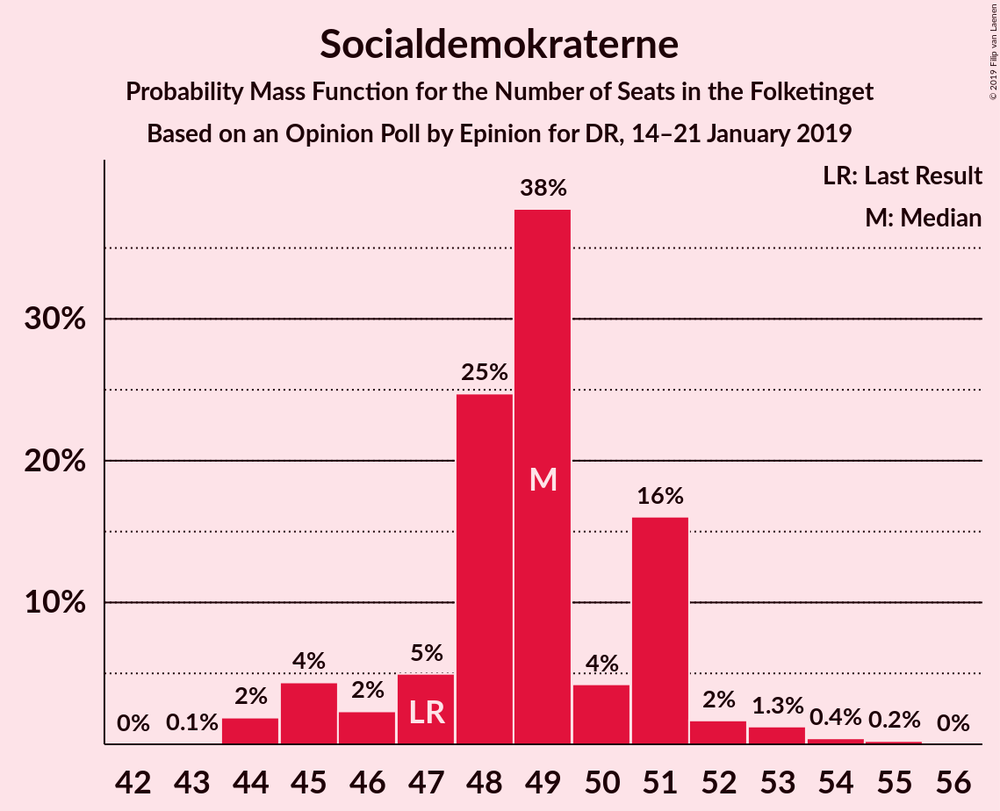
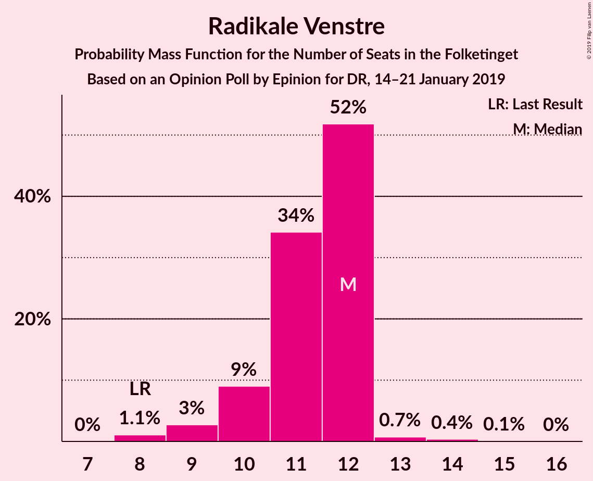
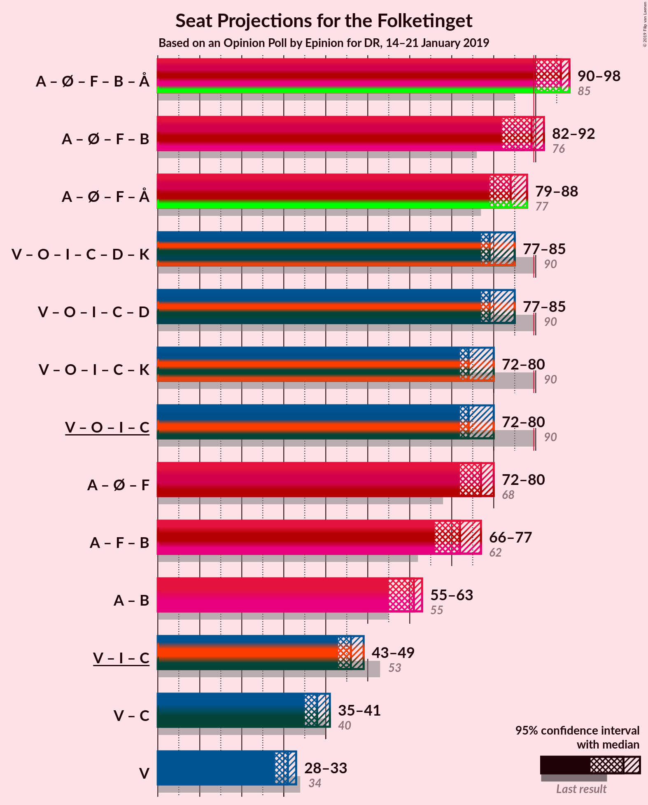
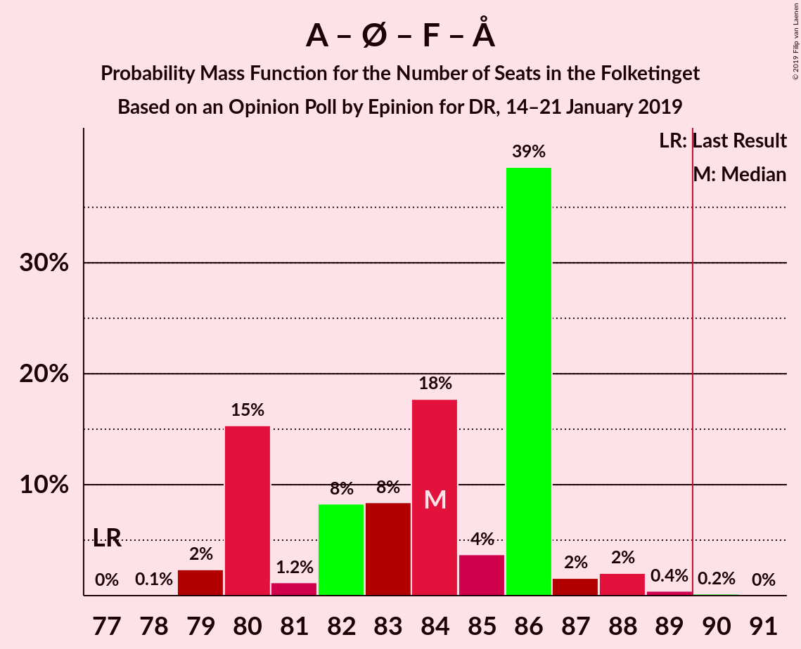
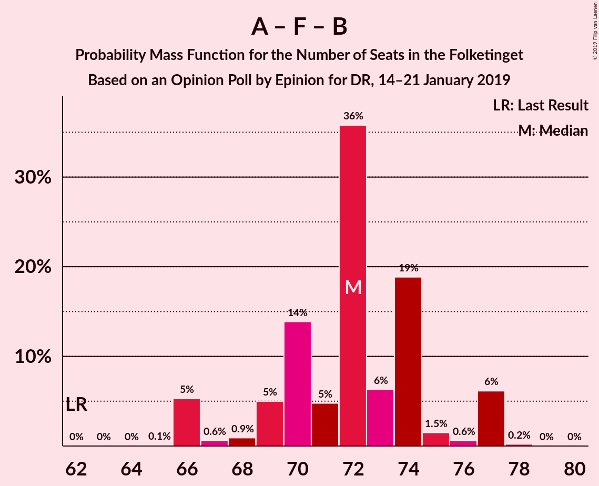

# Opinion Poll by Epinion for DR, 14–21 January 2019

<a href="#voting-intentions">Voting Intentions</a> | <a href="#seats">Seats</a> | <a href="#coalitions">Coalitions</a> | <a href="#technical-information">Technical Information</a>

## Voting Intentions

### Confidence Intervals

| Party | Last Result | Poll Result | 80% Confidence Interval | 90% Confidence Interval | 95% Confidence Interval | 99% Confidence Interval |
|:-----:|:-----------:|:-----------:|:-----------------------:|:-----------------------:|:-----------------------:|:-----------------------:|
| Socialdemokraterne | 26.3% | 27.9% | 26.6–29.3% |26.2–29.7% |25.8–30.1% |25.2–30.8% |
| Venstre | 19.5% | 17.5% | 16.4–18.7% |16.0–19.0% |15.8–19.3% |15.2–19.9% |
| Dansk Folkeparti | 21.1% | 16.6% | 15.5–17.8% |15.2–18.2% |14.9–18.4% |14.4–19.0% |
| Enhedslisten–De Rød-Grønne | 7.8% | 8.9% | 8.1–9.8% |7.8–10.1% |7.6–10.3% |7.3–10.8% |
| Socialistisk Folkeparti | 4.2% | 6.7% | 6.0–7.5% |5.8–7.8% |5.6–8.0% |5.3–8.4% |
| Radikale Venstre | 4.6% | 6.2% | 5.5–7.0% |5.3–7.2% |5.2–7.4% |4.8–7.8% |
| Liberal Alliance | 7.5% | 4.6% | 4.0–5.3% |3.8–5.5% |3.7–5.7% |3.4–6.0% |
| Alternativet | 4.8% | 4.1% | 3.6–4.8% |3.4–5.0% |3.3–5.2% |3.0–5.5% |
| Det Konservative Folkeparti | 3.4% | 4.0% | 3.5–4.7% |3.3–4.9% |3.2–5.0% |2.9–5.4% |
| Nye Borgerlige | 0.0% | 2.8% | 2.4–3.4% |2.2–3.6% |2.1–3.7% |1.9–4.0% |
| Kristendemokraterne | 0.8% | 0.6% | 0.4–0.9% |0.4–1.0% |0.3–1.1% |0.2–1.2% |

*Note:* The poll result column reflects the actual value used in the calculations. Published results may vary slightly, and in addition be rounded to fewer digits.

## Seats

### Confidence Intervals

| Party | Last Result | Median | 80% Confidence Interval | 90% Confidence Interval | 95% Confidence Interval | 99% Confidence Interval |
|:-----:|:-----------:|:------:|:-----------------------:|:-----------------------:|:-----------------------:|:-----------------------:|
| <a href="#socialdemokraterne">Socialdemokraterne</a> | 47 | 49 | 49 |49 |49 |49–50 |
| <a href="#venstre">Venstre</a> | 34 | 30 | 30 |30 |30 |30 |
| <a href="#dansk-folkeparti">Dansk Folkeparti</a> | 37 | 27 | 27 |27 |27 |27–29 |
| <a href="#enhedslisten–de-rød-grønne">Enhedslisten–De Rød-Grønne</a> | 14 | 18 | 18 |18 |18 |12–18 |
| <a href="#socialistisk-folkeparti">Socialistisk Folkeparti</a> | 7 | 12 | 12 |12 |12 |12 |
| <a href="#radikale-venstre">Radikale Venstre</a> | 8 | 11 | 11 |11 |11 |10–11 |
| <a href="#liberal-alliance">Liberal Alliance</a> | 13 | 7 | 7 |7 |7 |7–12 |
| <a href="#alternativet">Alternativet</a> | 9 | 8 | 8 |8 |8 |7–8 |
| <a href="#det-konservative-folkeparti">Det Konservative Folkeparti</a> | 6 | 8 | 8 |8 |8 |8–9 |
| <a href="#nye-borgerlige">Nye Borgerlige</a> | 0 | 5 | 5 |5 |5 |4–5 |
| <a href="#kristendemokraterne">Kristendemokraterne</a> | 0 | 0 | 0 |0 |0 |0 |

### Socialdemokraterne

*For a full overview of the results for this party, see the [Socialdemokraterne](party-socialdemokraterne.html) page.*

| Number of Seats | Probability | Accumulated | Special Marks |
|:---------------:|:-----------:|:-----------:|:-------------:|
| 47 | 0% | 100% | Last Result |
| 48 | 0% | 100% |  |
| 49 | 98% | 100% | Median |
| 50 | 1.5% | 2% |  |
| 51 | 0% | 0.3% |  |
| 52 | 0.3% | 0.3% |  |
| 53 | 0% | 0% |  |

### Venstre

*For a full overview of the results for this party, see the [Venstre](party-venstre.html) page.*

| Number of Seats | Probability | Accumulated | Special Marks |
|:---------------:|:-----------:|:-----------:|:-------------:|
| 26 | 0.3% | 100% |  |
| 27 | 0% | 99.7% |  |
| 28 | 0% | 99.7% |  |
| 29 | 0% | 99.7% |  |
| 30 | 99.7% | 99.7% | Median |
| 31 | 0% | 0% |  |
| 32 | 0% | 0% |  |
| 33 | 0% | 0% |  |
| 34 | 0% | 0% | Last Result |

### Dansk Folkeparti

*For a full overview of the results for this party, see the [Dansk Folkeparti](party-danskfolkeparti.html) page.*

| Number of Seats | Probability | Accumulated | Special Marks |
|:---------------:|:-----------:|:-----------:|:-------------:|
| 27 | 98% | 100% | Median |
| 28 | 0% | 2% |  |
| 29 | 1.5% | 2% |  |
| 30 | 0% | 0.3% |  |
| 31 | 0% | 0.3% |  |
| 32 | 0.3% | 0.3% |  |
| 33 | 0% | 0% |  |
| 34 | 0% | 0% |  |
| 35 | 0% | 0% |  |
| 36 | 0% | 0% |  |
| 37 | 0% | 0% | Last Result |

### Enhedslisten–De Rød-Grønne

*For a full overview of the results for this party, see the [Enhedslisten–De Rød-Grønne](party-enhedslisten–derød-grønne.html) page.*

| Number of Seats | Probability | Accumulated | Special Marks |
|:---------------:|:-----------:|:-----------:|:-------------:|
| 12 | 1.5% | 100% |  |
| 13 | 0% | 98.5% |  |
| 14 | 0% | 98.5% | Last Result |
| 15 | 0% | 98.5% |  |
| 16 | 0.3% | 98.5% |  |
| 17 | 0% | 98% |  |
| 18 | 98% | 98% | Median |
| 19 | 0% | 0% |  |

### Socialistisk Folkeparti

*For a full overview of the results for this party, see the [Socialistisk Folkeparti](party-socialistiskfolkeparti.html) page.*

| Number of Seats | Probability | Accumulated | Special Marks |
|:---------------:|:-----------:|:-----------:|:-------------:|
| 7 | 0% | 100% | Last Result |
| 8 | 0% | 100% |  |
| 9 | 0% | 100% |  |
| 10 | 0.3% | 100% |  |
| 11 | 0% | 99.7% |  |
| 12 | 99.7% | 99.7% | Median |
| 13 | 0% | 0% |  |

### Radikale Venstre

*For a full overview of the results for this party, see the [Radikale Venstre](party-radikalevenstre.html) page.*

| Number of Seats | Probability | Accumulated | Special Marks |
|:---------------:|:-----------:|:-----------:|:-------------:|
| 8 | 0% | 100% | Last Result |
| 9 | 0.3% | 100% |  |
| 10 | 1.5% | 99.7% |  |
| 11 | 98% | 98% | Median |
| 12 | 0% | 0% |  |

### Liberal Alliance

*For a full overview of the results for this party, see the [Liberal Alliance](party-liberalalliance.html) page.*

| Number of Seats | Probability | Accumulated | Special Marks |
|:---------------:|:-----------:|:-----------:|:-------------:|
| 7 | 98% | 100% | Median |
| 8 | 0% | 2% |  |
| 9 | 0% | 2% |  |
| 10 | 0.3% | 2% |  |
| 11 | 0% | 1.5% |  |
| 12 | 1.5% | 1.5% |  |
| 13 | 0% | 0% | Last Result |

### Alternativet

*For a full overview of the results for this party, see the [Alternativet](party-alternativet.html) page.*

| Number of Seats | Probability | Accumulated | Special Marks |
|:---------------:|:-----------:|:-----------:|:-------------:|
| 6 | 0.3% | 100% |  |
| 7 | 1.5% | 99.7% |  |
| 8 | 98% | 98% | Median |
| 9 | 0% | 0% | Last Result |

### Det Konservative Folkeparti

*For a full overview of the results for this party, see the [Det Konservative Folkeparti](party-detkonservativefolkeparti.html) page.*

| Number of Seats | Probability | Accumulated | Special Marks |
|:---------------:|:-----------:|:-----------:|:-------------:|
| 6 | 0% | 100% | Last Result |
| 7 | 0% | 100% |  |
| 8 | 98% | 99.9% | Median |
| 9 | 2% | 2% |  |
| 10 | 0% | 0% |  |

### Nye Borgerlige

*For a full overview of the results for this party, see the [Nye Borgerlige](party-nyeborgerlige.html) page.*

| Number of Seats | Probability | Accumulated | Special Marks |
|:---------------:|:-----------:|:-----------:|:-------------:|
| 0 | 0% | 100% | Last Result |
| 1 | 0% | 100% |  |
| 2 | 0% | 100% |  |
| 3 | 0% | 100% |  |
| 4 | 1.5% | 100% |  |
| 5 | 98% | 98.5% | Median |
| 6 | 0% | 0% |  |

### Kristendemokraterne

*For a full overview of the results for this party, see the [Kristendemokraterne](party-kristendemokraterne.html) page.*

| Number of Seats | Probability | Accumulated | Special Marks |
|:---------------:|:-----------:|:-----------:|:-------------:|
| 0 | 100% | 100% | Last Result, Median |

## Coalitions

### Confidence Intervals

| Coalition | Last Result | Median | Majority? | 80% Confidence Interval | 90% Confidence Interval | 95% Confidence Interval | 99% Confidence Interval |
|:---------:|:-----------:|:------:|:---------:|:-----------------------:|:-----------------------:|:-----------------------:|:-----------------------:|
| Socialdemokraterne – Enhedslisten–De Rød-Grønne – Socialistisk Folkeparti – Radikale Venstre – Alternativet | 85 | 98 | 100% | 98 | 98 | 98 | 91–98 |
| Socialdemokraterne – Enhedslisten–De Rød-Grønne – Socialistisk Folkeparti – Radikale Venstre | 76 | 90 | 98% | 90 | 90 | 90 | 84–90 |
| Socialdemokraterne – Enhedslisten–De Rød-Grønne – Socialistisk Folkeparti – Alternativet | 77 | 87 | 0% | 87 | 87 | 87 | 81–87 |
| Socialdemokraterne – Enhedslisten–De Rød-Grønne – Socialistisk Folkeparti | 68 | 79 | 0% | 79 | 79 | 79 | 74–79 |
| Venstre – Dansk Folkeparti – Liberal Alliance – Det Konservative Folkeparti – Nye Borgerlige – Kristendemokraterne | 90 | 77 | 0% | 77 | 77 | 77 | 77–84 |
| Venstre – Dansk Folkeparti – Liberal Alliance – Det Konservative Folkeparti – Nye Borgerlige | 90 | 77 | 0% | 77 | 77 | 77 | 77–84 |
| Venstre – Dansk Folkeparti – Liberal Alliance – Det Konservative Folkeparti – Kristendemokraterne | 90 | 72 | 0% | 72 | 72 | 72 | 72–80 |
| Venstre – Dansk Folkeparti – Liberal Alliance – Det Konservative Folkeparti | 90 | 72 | 0% | 72 | 72 | 72 | 72–80 |
| Socialdemokraterne – Socialistisk Folkeparti – Radikale Venstre | 62 | 72 | 0% | 72 | 72 | 72 | 72 |
| Socialdemokraterne – Radikale Venstre | 55 | 60 | 0% | 60 | 60 | 60 | 60 |
| Venstre – Liberal Alliance – Det Konservative Folkeparti | 53 | 45 | 0% | 45 | 45 | 45 | 45–51 |
| Venstre – Det Konservative Folkeparti | 40 | 38 | 0% | 38 | 38 | 38 | 38–39 |
| Venstre | 34 | 30 | 0% | 30 | 30 | 30 | 30 |

### Socialdemokraterne – Enhedslisten–De Rød-Grønne – Socialistisk Folkeparti – Radikale Venstre – Alternativet

| Number of Seats | Probability | Accumulated | Special Marks |
|:---------------:|:-----------:|:-----------:|:-------------:|
| 85 | 0% | 100% | Last Result |
| 86 | 0% | 100% |  |
| 87 | 0% | 100% |  |
| 88 | 0% | 100% |  |
| 89 | 0% | 100% |  |
| 90 | 0% | 100% | Majority |
| 91 | 1.5% | 100% |  |
| 92 | 0% | 98.5% |  |
| 93 | 0.3% | 98.5% |  |
| 94 | 0% | 98% |  |
| 95 | 0% | 98% |  |
| 96 | 0% | 98% |  |
| 97 | 0% | 98% |  |
| 98 | 98% | 98% | Median |
| 99 | 0% | 0% |  |

### Socialdemokraterne – Enhedslisten–De Rød-Grønne – Socialistisk Folkeparti – Radikale Venstre

| Number of Seats | Probability | Accumulated | Special Marks |
|:---------------:|:-----------:|:-----------:|:-------------:|
| 76 | 0% | 100% | Last Result |
| 77 | 0% | 100% |  |
| 78 | 0% | 100% |  |
| 79 | 0% | 100% |  |
| 80 | 0% | 100% |  |
| 81 | 0% | 100% |  |
| 82 | 0% | 100% |  |
| 83 | 0% | 100% |  |
| 84 | 1.5% | 100% |  |
| 85 | 0% | 98.5% |  |
| 86 | 0% | 98.5% |  |
| 87 | 0.3% | 98.5% |  |
| 88 | 0% | 98% |  |
| 89 | 0% | 98% |  |
| 90 | 98% | 98% | Median, Majority |
| 91 | 0% | 0% |  |

### Socialdemokraterne – Enhedslisten–De Rød-Grønne – Socialistisk Folkeparti – Alternativet

| Number of Seats | Probability | Accumulated | Special Marks |
|:---------------:|:-----------:|:-----------:|:-------------:|
| 77 | 0% | 100% | Last Result |
| 78 | 0% | 100% |  |
| 79 | 0% | 100% |  |
| 80 | 0% | 100% |  |
| 81 | 1.5% | 100% |  |
| 82 | 0% | 98.5% |  |
| 83 | 0% | 98.5% |  |
| 84 | 0.3% | 98.5% |  |
| 85 | 0% | 98% |  |
| 86 | 0% | 98% |  |
| 87 | 98% | 98% | Median |
| 88 | 0% | 0% |  |

### Socialdemokraterne – Enhedslisten–De Rød-Grønne – Socialistisk Folkeparti

| Number of Seats | Probability | Accumulated | Special Marks |
|:---------------:|:-----------:|:-----------:|:-------------:|
| 68 | 0% | 100% | Last Result |
| 69 | 0% | 100% |  |
| 70 | 0% | 100% |  |
| 71 | 0% | 100% |  |
| 72 | 0% | 100% |  |
| 73 | 0% | 100% |  |
| 74 | 1.5% | 100% |  |
| 75 | 0% | 98.5% |  |
| 76 | 0% | 98.5% |  |
| 77 | 0% | 98.5% |  |
| 78 | 0.3% | 98.5% |  |
| 79 | 98% | 98% | Median |
| 80 | 0% | 0% |  |

### Venstre – Dansk Folkeparti – Liberal Alliance – Det Konservative Folkeparti – Nye Borgerlige – Kristendemokraterne

| Number of Seats | Probability | Accumulated | Special Marks |
|:---------------:|:-----------:|:-----------:|:-------------:|
| 77 | 98% | 100% | Median |
| 78 | 0% | 2% |  |
| 79 | 0% | 2% |  |
| 80 | 0% | 2% |  |
| 81 | 0% | 2% |  |
| 82 | 0.3% | 2% |  |
| 83 | 0% | 1.5% |  |
| 84 | 1.5% | 1.5% |  |
| 85 | 0% | 0% |  |
| 86 | 0% | 0% |  |
| 87 | 0% | 0% |  |
| 88 | 0% | 0% |  |
| 89 | 0% | 0% |  |
| 90 | 0% | 0% | Last Result, Majority |

### Venstre – Dansk Folkeparti – Liberal Alliance – Det Konservative Folkeparti – Nye Borgerlige

| Number of Seats | Probability | Accumulated | Special Marks |
|:---------------:|:-----------:|:-----------:|:-------------:|
| 77 | 98% | 100% | Median |
| 78 | 0% | 2% |  |
| 79 | 0% | 2% |  |
| 80 | 0% | 2% |  |
| 81 | 0% | 2% |  |
| 82 | 0.3% | 2% |  |
| 83 | 0% | 1.5% |  |
| 84 | 1.5% | 1.5% |  |
| 85 | 0% | 0% |  |
| 86 | 0% | 0% |  |
| 87 | 0% | 0% |  |
| 88 | 0% | 0% |  |
| 89 | 0% | 0% |  |
| 90 | 0% | 0% | Last Result, Majority |

### Venstre – Dansk Folkeparti – Liberal Alliance – Det Konservative Folkeparti – Kristendemokraterne

| Number of Seats | Probability | Accumulated | Special Marks |
|:---------------:|:-----------:|:-----------:|:-------------:|
| 72 | 98% | 100% | Median |
| 73 | 0% | 2% |  |
| 74 | 0% | 2% |  |
| 75 | 0% | 2% |  |
| 76 | 0% | 2% |  |
| 77 | 0.3% | 2% |  |
| 78 | 0% | 1.5% |  |
| 79 | 0% | 1.5% |  |
| 80 | 1.5% | 1.5% |  |
| 81 | 0% | 0% |  |
| 82 | 0% | 0% |  |
| 83 | 0% | 0% |  |
| 84 | 0% | 0% |  |
| 85 | 0% | 0% |  |
| 86 | 0% | 0% |  |
| 87 | 0% | 0% |  |
| 88 | 0% | 0% |  |
| 89 | 0% | 0% |  |
| 90 | 0% | 0% | Last Result, Majority |

### Venstre – Dansk Folkeparti – Liberal Alliance – Det Konservative Folkeparti

| Number of Seats | Probability | Accumulated | Special Marks |
|:---------------:|:-----------:|:-----------:|:-------------:|
| 72 | 98% | 100% | Median |
| 73 | 0% | 2% |  |
| 74 | 0% | 2% |  |
| 75 | 0% | 2% |  |
| 76 | 0% | 2% |  |
| 77 | 0.3% | 2% |  |
| 78 | 0% | 1.5% |  |
| 79 | 0% | 1.5% |  |
| 80 | 1.5% | 1.5% |  |
| 81 | 0% | 0% |  |
| 82 | 0% | 0% |  |
| 83 | 0% | 0% |  |
| 84 | 0% | 0% |  |
| 85 | 0% | 0% |  |
| 86 | 0% | 0% |  |
| 87 | 0% | 0% |  |
| 88 | 0% | 0% |  |
| 89 | 0% | 0% |  |
| 90 | 0% | 0% | Last Result, Majority |

### Socialdemokraterne – Socialistisk Folkeparti – Radikale Venstre

| Number of Seats | Probability | Accumulated | Special Marks |
|:---------------:|:-----------:|:-----------:|:-------------:|
| 62 | 0% | 100% | Last Result |
| 63 | 0% | 100% |  |
| 64 | 0% | 100% |  |
| 65 | 0% | 100% |  |
| 66 | 0% | 100% |  |
| 67 | 0% | 100% |  |
| 68 | 0% | 100% |  |
| 69 | 0% | 100% |  |
| 70 | 0% | 100% |  |
| 71 | 0.3% | 100% |  |
| 72 | 99.7% | 99.7% | Median |
| 73 | 0% | 0% |  |

### Socialdemokraterne – Radikale Venstre

| Number of Seats | Probability | Accumulated | Special Marks |
|:---------------:|:-----------:|:-----------:|:-------------:|
| 55 | 0% | 100% | Last Result |
| 56 | 0% | 100% |  |
| 57 | 0% | 100% |  |
| 58 | 0% | 100% |  |
| 59 | 0% | 100% |  |
| 60 | 99.7% | 100% | Median |
| 61 | 0.3% | 0.3% |  |
| 62 | 0% | 0% |  |

### Venstre – Liberal Alliance – Det Konservative Folkeparti

| Number of Seats | Probability | Accumulated | Special Marks |
|:---------------:|:-----------:|:-----------:|:-------------:|
| 45 | 98% | 100% | Median |
| 46 | 0% | 2% |  |
| 47 | 0% | 2% |  |
| 48 | 0% | 1.5% |  |
| 49 | 0% | 1.5% |  |
| 50 | 0% | 1.5% |  |
| 51 | 1.5% | 1.5% |  |
| 52 | 0% | 0% |  |
| 53 | 0% | 0% | Last Result |

### Venstre – Det Konservative Folkeparti

| Number of Seats | Probability | Accumulated | Special Marks |
|:---------------:|:-----------:|:-----------:|:-------------:|
| 35 | 0.3% | 100% |  |
| 36 | 0% | 99.7% |  |
| 37 | 0% | 99.7% |  |
| 38 | 98% | 99.7% | Median |
| 39 | 1.5% | 1.5% |  |
| 40 | 0% | 0% | Last Result |

### Venstre

| Number of Seats | Probability | Accumulated | Special Marks |
|:---------------:|:-----------:|:-----------:|:-------------:|
| 26 | 0.3% | 100% |  |
| 27 | 0% | 99.7% |  |
| 28 | 0% | 99.7% |  |
| 29 | 0% | 99.7% |  |
| 30 | 99.7% | 99.7% | Median |
| 31 | 0% | 0% |  |
| 32 | 0% | 0% |  |
| 33 | 0% | 0% |  |
| 34 | 0% | 0% | Last Result |

## Technical Information

### Opinion Poll

+ **Polling firm:** Epinion
+ **Commissioner(s):** DR
+ **Fieldwork period:** 14–21 January 2019

### Calculations

+ **Sample size:** 1745
+ **Simulations done:** 1,024
+ **Error estimate:** 2.45%

