# Opinion Poll by Voxmeter for Ritzau, 21–27 January 2019

<a href="#voting-intentions">Voting Intentions</a> | <a href="#seats">Seats</a> | <a href="#coalitions">Coalitions</a> | <a href="#technical-information">Technical Information</a>

## Voting Intentions

### Confidence Intervals

| Party | Last Result | Poll Result | 80% Confidence Interval | 90% Confidence Interval | 95% Confidence Interval | 99% Confidence Interval |
|:-----:|:-----------:|:-----------:|:-----------------------:|:-----------------------:|:-----------------------:|:-----------------------:|
| Socialdemokraterne | 26.3% | 28.1% | 26.4–29.9% |25.9–30.5% |25.5–30.9% |24.6–31.8% |
| Venstre | 19.5% | 18.9% | 17.4–20.5% |16.9–21.0% |16.6–21.4% |15.9–22.2% |
| Dansk Folkeparti | 21.1% | 16.8% | 15.4–18.4% |15.0–18.9% |14.7–19.3% |14.0–20.0% |
| Enhedslisten–De Rød-Grønne | 7.8% | 8.5% | 7.5–9.7% |7.2–10.0% |6.9–10.3% |6.5–10.9% |
| Radikale Venstre | 4.6% | 6.9% | 6.0–8.0% |5.7–8.4% |5.5–8.6% |5.1–9.2% |
| Socialistisk Folkeparti | 4.2% | 5.0% | 4.2–6.0% |4.0–6.3% |3.8–6.5% |3.5–7.0% |
| Liberal Alliance | 7.5% | 4.6% | 3.9–5.6% |3.7–5.8% |3.5–6.1% |3.2–6.6% |
| Det Konservative Folkeparti | 3.4% | 4.0% | 3.4–4.9% |3.2–5.2% |3.0–5.4% |2.7–5.9% |
| Alternativet | 4.8% | 3.7% | 3.0–4.5% |2.8–4.8% |2.7–5.0% |2.4–5.4% |
| Nye Borgerlige | 0.0% | 2.2% | 1.7–2.9% |1.6–3.1% |1.5–3.3% |1.3–3.7% |
| Kristendemokraterne | 0.8% | 0.9% | 0.6–1.4% |0.5–1.5% |0.5–1.6% |0.4–1.9% |

*Note:* The poll result column reflects the actual value used in the calculations. Published results may vary slightly, and in addition be rounded to fewer digits.

## Seats

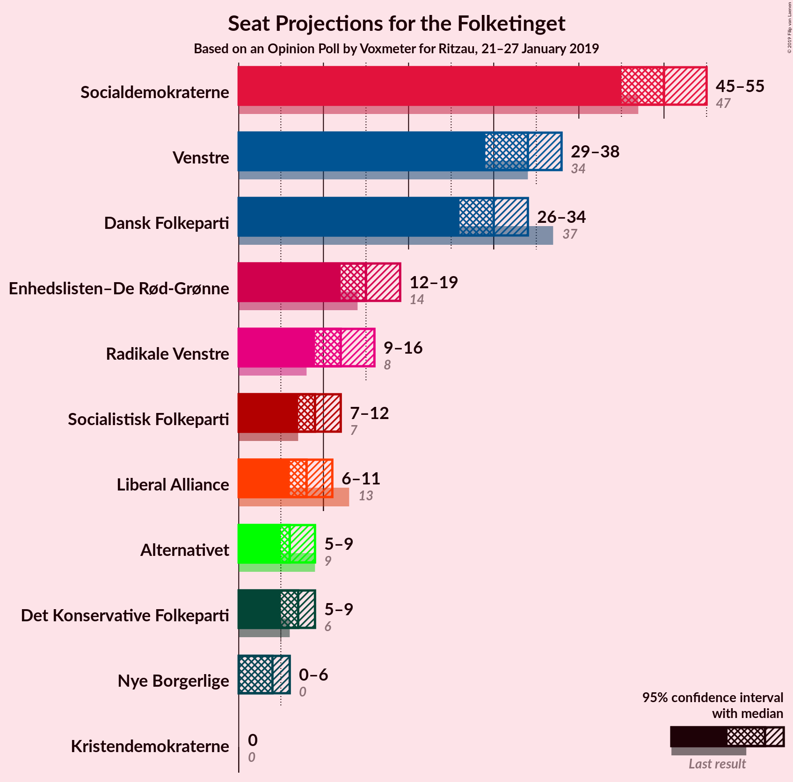

### Confidence Intervals

| Party | Last Result | Median | 80% Confidence Interval | 90% Confidence Interval | 95% Confidence Interval | 99% Confidence Interval |
|:-----:|:-----------:|:------:|:-----------------------:|:-----------------------:|:-----------------------:|:-----------------------:|
| <a href="#socialdemokraterne">Socialdemokraterne</a> | 47 | 45 | 42–52 |42–52 |42–52 |42–52 |
| <a href="#venstre">Venstre</a> | 34 | 32 | 32–42 |32–42 |32–42 |32–42 |
| <a href="#dansk-folkeparti">Dansk Folkeparti</a> | 37 | 33 | 32–34 |32–34 |31–34 |29–34 |
| <a href="#enhedslisten–de-rød-grønne">Enhedslisten–De Rød-Grønne</a> | 14 | 14 | 11–17 |11–17 |11–17 |11–17 |
| <a href="#radikale-venstre">Radikale Venstre</a> | 8 | 13 | 13–19 |13–19 |13–19 |9–19 |
| <a href="#socialistisk-folkeparti">Socialistisk Folkeparti</a> | 7 | 9 | 8–9 |8–9 |8–9 |8–11 |
| <a href="#liberal-alliance">Liberal Alliance</a> | 13 | 6 | 6–8 |6–8 |6–8 |6–10 |
| <a href="#det-konservative-folkeparti">Det Konservative Folkeparti</a> | 6 | 6 | 5–6 |5–6 |5–6 |5–10 |
| <a href="#alternativet">Alternativet</a> | 9 | 7 | 6–7 |6–7 |6–7 |5–7 |
| <a href="#nye-borgerlige">Nye Borgerlige</a> | 0 | 6 | 0–6 |0–6 |0–6 |0–7 |
| <a href="#kristendemokraterne">Kristendemokraterne</a> | 0 | 4 | 0–4 |0–4 |0–4 |0–4 |

### Socialdemokraterne

*For a full overview of the results for this party, see the [Socialdemokraterne](party-socialdemokraterne.html) page.*

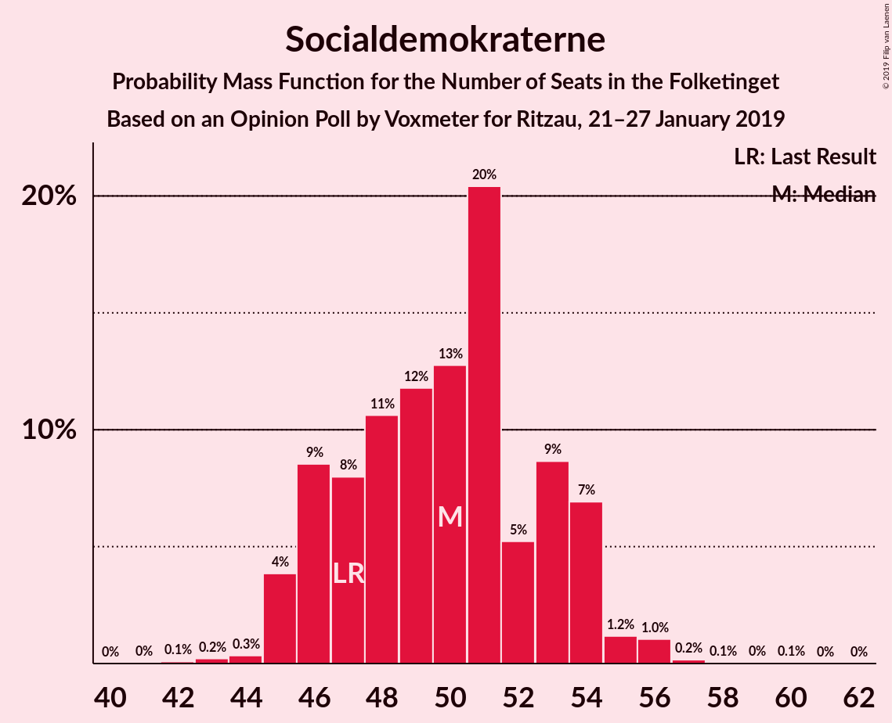

| Number of Seats | Probability | Accumulated | Special Marks |
|:---------------:|:-----------:|:-----------:|:-------------:|
| 41 | 0% | 100% |  |
| 42 | 16% | 99.9% |  |
| 43 | 0.1% | 84% |  |
| 44 | 0.2% | 84% |  |
| 45 | 61% | 84% | Median |
| 46 | 0% | 23% |  |
| 47 | 0.2% | 23% | Last Result |
| 48 | 2% | 22% |  |
| 49 | 0.3% | 21% |  |
| 50 | 0.2% | 21% |  |
| 51 | 0% | 20% |  |
| 52 | 20% | 20% |  |
| 53 | 0% | 0.1% |  |
| 54 | 0% | 0% |  |

### Venstre

*For a full overview of the results for this party, see the [Venstre](party-venstre.html) page.*

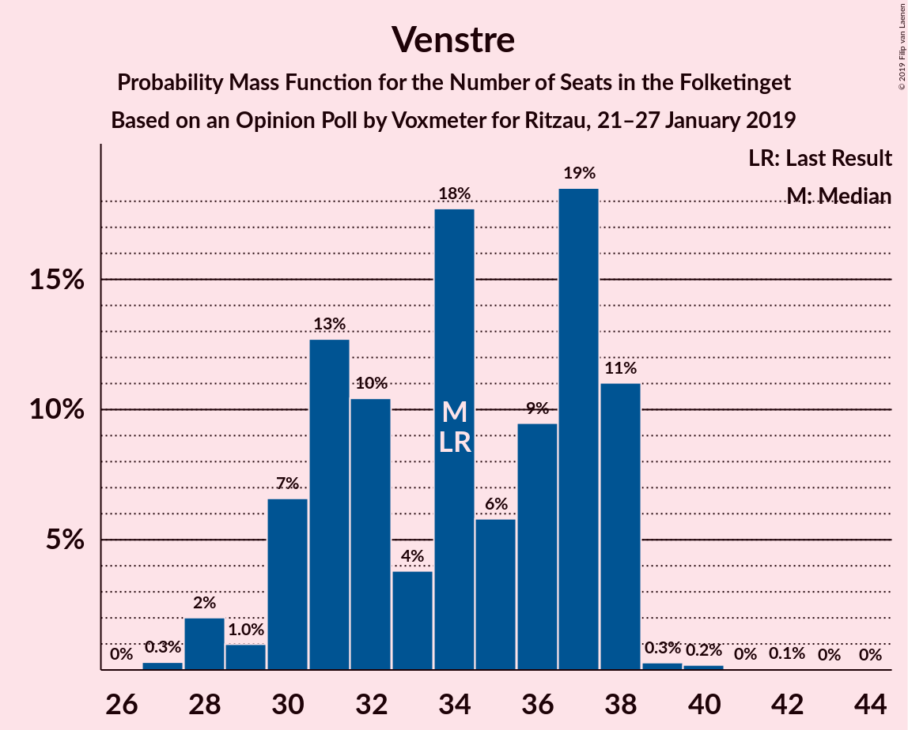

| Number of Seats | Probability | Accumulated | Special Marks |
|:---------------:|:-----------:|:-----------:|:-------------:|
| 26 | 0.2% | 100% |  |
| 27 | 0% | 99.8% |  |
| 28 | 0% | 99.8% |  |
| 29 | 0% | 99.7% |  |
| 30 | 0.2% | 99.7% |  |
| 31 | 0% | 99.6% |  |
| 32 | 61% | 99.6% | Median |
| 33 | 20% | 39% |  |
| 34 | 0.2% | 18% | Last Result |
| 35 | 0% | 18% |  |
| 36 | 2% | 18% |  |
| 37 | 0% | 16% |  |
| 38 | 0% | 16% |  |
| 39 | 0% | 16% |  |
| 40 | 0% | 16% |  |
| 41 | 0% | 16% |  |
| 42 | 16% | 16% |  |
| 43 | 0% | 0.2% |  |
| 44 | 0.2% | 0.2% |  |
| 45 | 0% | 0% |  |

### Dansk Folkeparti

*For a full overview of the results for this party, see the [Dansk Folkeparti](party-danskfolkeparti.html) page.*

| Number of Seats | Probability | Accumulated | Special Marks |
|:---------------:|:-----------:|:-----------:|:-------------:|
| 25 | 0.1% | 100% |  |
| 26 | 0.2% | 99.9% |  |
| 27 | 0% | 99.7% |  |
| 28 | 0% | 99.7% |  |
| 29 | 0.2% | 99.7% |  |
| 30 | 0.2% | 99.4% |  |
| 31 | 2% | 99.2% |  |
| 32 | 20% | 97% |  |
| 33 | 61% | 77% | Median |
| 34 | 16% | 16% |  |
| 35 | 0% | 0% |  |
| 36 | 0% | 0% |  |
| 37 | 0% | 0% | Last Result |

### Enhedslisten–De Rød-Grønne

*For a full overview of the results for this party, see the [Enhedslisten–De Rød-Grønne](party-enhedslisten–derød-grønne.html) page.*

| Number of Seats | Probability | Accumulated | Special Marks |
|:---------------:|:-----------:|:-----------:|:-------------:|
| 11 | 22% | 100% |  |
| 12 | 0% | 78% |  |
| 13 | 0.3% | 78% |  |
| 14 | 61% | 78% | Last Result, Median |
| 15 | 0.2% | 17% |  |
| 16 | 0.2% | 17% |  |
| 17 | 16% | 16% |  |
| 18 | 0% | 0.3% |  |
| 19 | 0% | 0.3% |  |
| 20 | 0% | 0.2% |  |
| 21 | 0% | 0.2% |  |
| 22 | 0% | 0.2% |  |
| 23 | 0.2% | 0.2% |  |
| 24 | 0% | 0% |  |

### Radikale Venstre

*For a full overview of the results for this party, see the [Radikale Venstre](party-radikalevenstre.html) page.*

| Number of Seats | Probability | Accumulated | Special Marks |
|:---------------:|:-----------:|:-----------:|:-------------:|
| 8 | 0% | 100% | Last Result |
| 9 | 2% | 100% |  |
| 10 | 0.1% | 98% |  |
| 11 | 0.3% | 98% |  |
| 12 | 0.2% | 98% |  |
| 13 | 77% | 98% | Median |
| 14 | 0.5% | 21% |  |
| 15 | 0% | 20% |  |
| 16 | 0% | 20% |  |
| 17 | 0% | 20% |  |
| 18 | 0% | 20% |  |
| 19 | 20% | 20% |  |
| 20 | 0% | 0% |  |

### Socialistisk Folkeparti

*For a full overview of the results for this party, see the [Socialistisk Folkeparti](party-socialistiskfolkeparti.html) page.*

| Number of Seats | Probability | Accumulated | Special Marks |
|:---------------:|:-----------:|:-----------:|:-------------:|
| 7 | 0.1% | 100% | Last Result |
| 8 | 38% | 99.9% |  |
| 9 | 61% | 62% | Median |
| 10 | 0.1% | 0.8% |  |
| 11 | 0.4% | 0.7% |  |
| 12 | 0% | 0.3% |  |
| 13 | 0.2% | 0.2% |  |
| 14 | 0% | 0% |  |

### Liberal Alliance

*For a full overview of the results for this party, see the [Liberal Alliance](party-liberalalliance.html) page.*

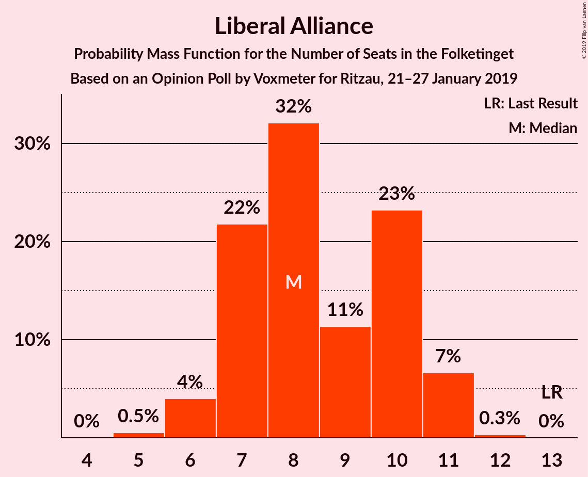

| Number of Seats | Probability | Accumulated | Special Marks |
|:---------------:|:-----------:|:-----------:|:-------------:|
| 6 | 61% | 100% | Median |
| 7 | 16% | 39% |  |
| 8 | 22% | 23% |  |
| 9 | 0% | 0.5% |  |
| 10 | 0.2% | 0.5% |  |
| 11 | 0.2% | 0.3% |  |
| 12 | 0% | 0% |  |
| 13 | 0% | 0% | Last Result |

### Det Konservative Folkeparti

*For a full overview of the results for this party, see the [Det Konservative Folkeparti](party-detkonservativefolkeparti.html) page.*

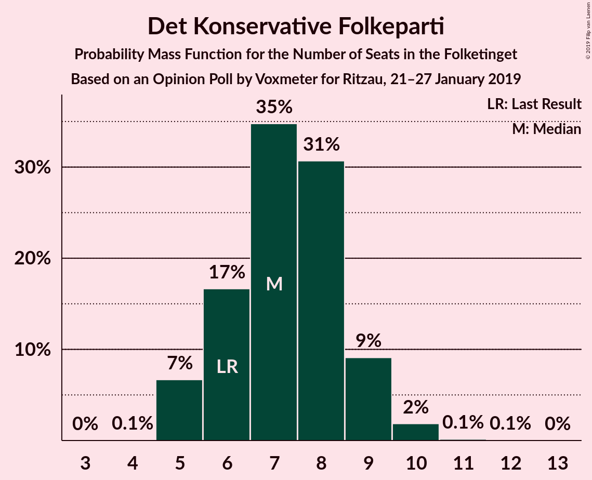

| Number of Seats | Probability | Accumulated | Special Marks |
|:---------------:|:-----------:|:-----------:|:-------------:|
| 4 | 0.2% | 100% |  |
| 5 | 20% | 99.8% |  |
| 6 | 77% | 80% | Last Result, Median |
| 7 | 0.3% | 2% |  |
| 8 | 0.2% | 2% |  |
| 9 | 0.1% | 2% |  |
| 10 | 2% | 2% |  |
| 11 | 0% | 0% |  |

### Alternativet

*For a full overview of the results for this party, see the [Alternativet](party-alternativet.html) page.*

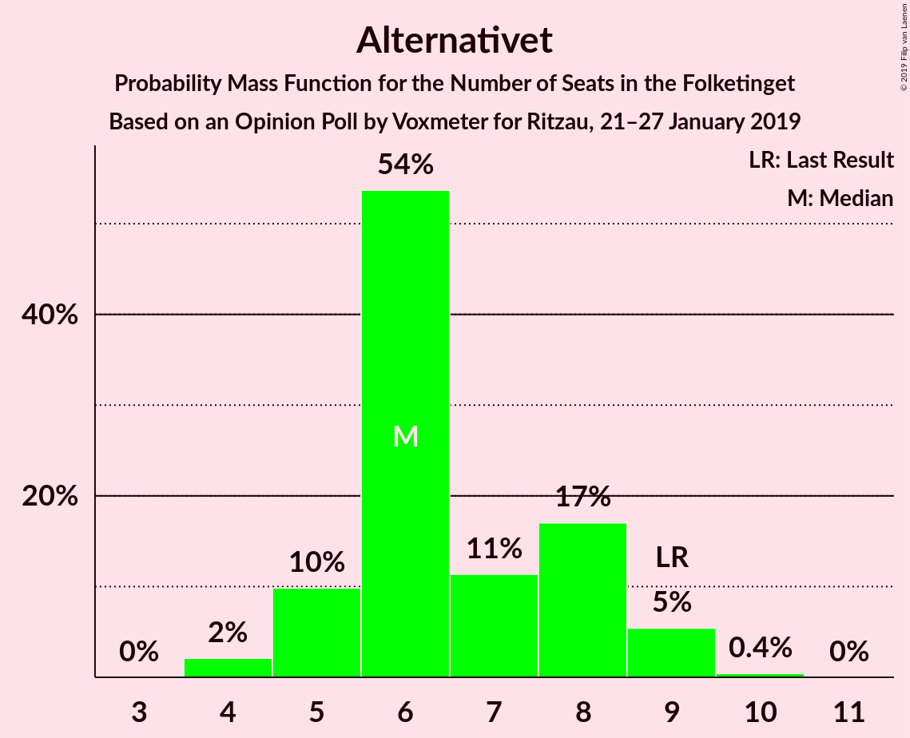

| Number of Seats | Probability | Accumulated | Special Marks |
|:---------------:|:-----------:|:-----------:|:-------------:|
| 4 | 0.1% | 100% |  |
| 5 | 0.5% | 99.9% |  |
| 6 | 16% | 99.5% |  |
| 7 | 83% | 83% | Median |
| 8 | 0.2% | 0.4% |  |
| 9 | 0.1% | 0.2% | Last Result |
| 10 | 0.1% | 0.1% |  |
| 11 | 0% | 0% |  |

### Nye Borgerlige

*For a full overview of the results for this party, see the [Nye Borgerlige](party-nyeborgerlige.html) page.*

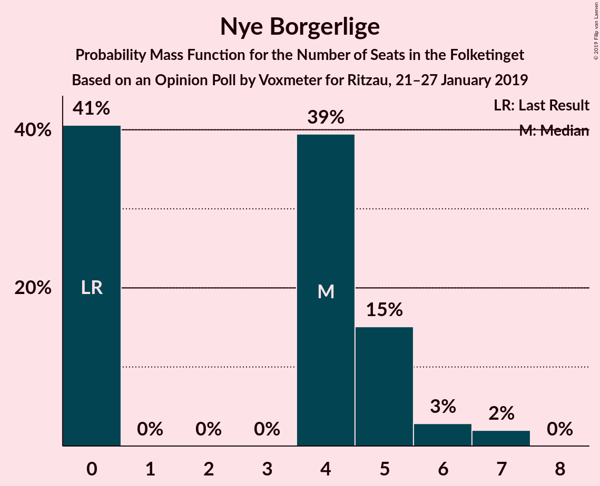

| Number of Seats | Probability | Accumulated | Special Marks |
|:---------------:|:-----------:|:-----------:|:-------------:|
| 0 | 37% | 100% | Last Result |
| 1 | 0% | 63% |  |
| 2 | 0% | 63% |  |
| 3 | 0% | 63% |  |
| 4 | 0.5% | 63% |  |
| 5 | 0.2% | 63% |  |
| 6 | 61% | 63% | Median |
| 7 | 2% | 2% |  |
| 8 | 0% | 0% |  |

### Kristendemokraterne

*For a full overview of the results for this party, see the [Kristendemokraterne](party-kristendemokraterne.html) page.*

| Number of Seats | Probability | Accumulated | Special Marks |
|:---------------:|:-----------:|:-----------:|:-------------:|
| 0 | 39% | 100% | Last Result |
| 1 | 0% | 61% |  |
| 2 | 0% | 61% |  |
| 3 | 0% | 61% |  |
| 4 | 61% | 61% | Median |
| 5 | 0% | 0% |  |

## Coalitions

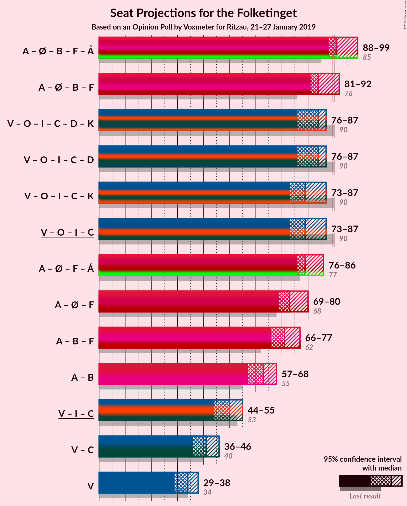

### Confidence Intervals

| Coalition | Last Result | Median | Majority? | 80% Confidence Interval | 90% Confidence Interval | 95% Confidence Interval | 99% Confidence Interval |
|:---------:|:-----------:|:------:|:---------:|:-----------------------:|:-----------------------:|:-----------------------:|:-----------------------:|
| Socialdemokraterne – Enhedslisten–De Rød-Grønne – Radikale Venstre – Socialistisk Folkeparti – Alternativet | 85 | 88 | 21% | 86–97 | 86–97 | 86–97 | 83–97 |
| Socialdemokraterne – Enhedslisten–De Rød-Grønne – Radikale Venstre – Socialistisk Folkeparti | 76 | 81 | 21% | 80–90 | 80–90 | 80–90 | 76–90 |
| Venstre – Dansk Folkeparti – Liberal Alliance – Det Konservative Folkeparti – Nye Borgerlige – Kristendemokraterne | 90 | 87 | 2% | 78–89 | 78–89 | 78–89 | 78–92 |
| Venstre – Dansk Folkeparti – Liberal Alliance – Det Konservative Folkeparti – Kristendemokraterne | 90 | 81 | 0% | 78–89 | 78–89 | 78–89 | 78–89 |
| Venstre – Dansk Folkeparti – Liberal Alliance – Det Konservative Folkeparti – Nye Borgerlige | 90 | 83 | 2% | 78–89 | 78–89 | 78–89 | 78–92 |
| Venstre – Dansk Folkeparti – Liberal Alliance – Det Konservative Folkeparti | 90 | 77 | 0% | 77–89 | 77–89 | 77–89 | 77–89 |
| Socialdemokraterne – Radikale Venstre – Socialistisk Folkeparti | 62 | 67 | 0% | 63–79 | 63–79 | 63–79 | 63–79 |
| Socialdemokraterne – Enhedslisten–De Rød-Grønne – Socialistisk Folkeparti – Alternativet | 77 | 75 | 0% | 73–78 | 73–78 | 73–78 | 73–83 |
| Socialdemokraterne – Enhedslisten–De Rød-Grønne – Socialistisk Folkeparti | 68 | 68 | 0% | 67–71 | 67–71 | 67–71 | 67–77 |
| Socialdemokraterne – Radikale Venstre | 55 | 58 | 0% | 55–71 | 55–71 | 55–71 | 55–71 |
| Venstre – Liberal Alliance – Det Konservative Folkeparti | 53 | 44 | 0% | 44–55 | 44–55 | 44–55 | 44–55 |
| Venstre – Det Konservative Folkeparti | 40 | 38 | 0% | 38–48 | 38–48 | 38–48 | 38–48 |
| Venstre | 34 | 32 | 0% | 32–42 | 32–42 | 32–42 | 32–42 |

### Socialdemokraterne – Enhedslisten–De Rød-Grønne – Radikale Venstre – Socialistisk Folkeparti – Alternativet

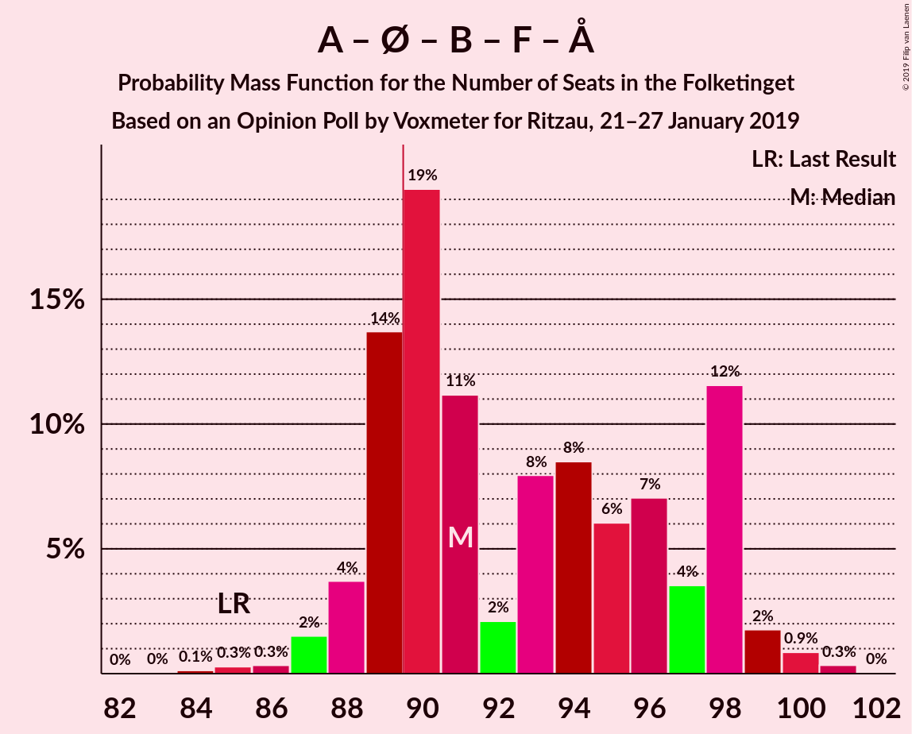

| Number of Seats | Probability | Accumulated | Special Marks |
|:---------------:|:-----------:|:-----------:|:-------------:|
| 83 | 2% | 100% |  |
| 84 | 0.2% | 98% |  |
| 85 | 0% | 98% | Last Result |
| 86 | 16% | 98% |  |
| 87 | 0% | 82% |  |
| 88 | 61% | 82% | Median |
| 89 | 0% | 21% |  |
| 90 | 0% | 21% | Majority |
| 91 | 0% | 21% |  |
| 92 | 0% | 21% |  |
| 93 | 0.1% | 21% |  |
| 94 | 0% | 21% |  |
| 95 | 0.1% | 21% |  |
| 96 | 0.2% | 21% |  |
| 97 | 21% | 21% |  |
| 98 | 0.2% | 0.2% |  |
| 99 | 0% | 0% |  |

### Socialdemokraterne – Enhedslisten–De Rød-Grønne – Radikale Venstre – Socialistisk Folkeparti

| Number of Seats | Probability | Accumulated | Special Marks |
|:---------------:|:-----------:|:-----------:|:-------------:|
| 76 | 2% | 100% | Last Result |
| 77 | 0% | 98% |  |
| 78 | 0% | 98% |  |
| 79 | 0.2% | 98% |  |
| 80 | 16% | 98% |  |
| 81 | 61% | 82% | Median |
| 82 | 0.1% | 21% |  |
| 83 | 0.1% | 21% |  |
| 84 | 0% | 21% |  |
| 85 | 0% | 21% |  |
| 86 | 0.1% | 21% |  |
| 87 | 0% | 21% |  |
| 88 | 0% | 21% |  |
| 89 | 0% | 21% |  |
| 90 | 20% | 21% | Majority |
| 91 | 0.5% | 0.5% |  |
| 92 | 0% | 0% |  |

### Venstre – Dansk Folkeparti – Liberal Alliance – Det Konservative Folkeparti – Nye Borgerlige – Kristendemokraterne

| Number of Seats | Probability | Accumulated | Special Marks |
|:---------------:|:-----------:|:-----------:|:-------------:|
| 77 | 0.2% | 100% |  |
| 78 | 21% | 99.8% |  |
| 79 | 0.2% | 79% |  |
| 80 | 0.1% | 79% |  |
| 81 | 0% | 79% |  |
| 82 | 0.1% | 79% |  |
| 83 | 0% | 79% |  |
| 84 | 0% | 79% |  |
| 85 | 0% | 79% |  |
| 86 | 0% | 79% |  |
| 87 | 61% | 79% | Median |
| 88 | 0% | 18% |  |
| 89 | 16% | 18% |  |
| 90 | 0% | 2% | Last Result, Majority |
| 91 | 0.2% | 2% |  |
| 92 | 2% | 2% |  |
| 93 | 0% | 0% |  |

### Venstre – Dansk Folkeparti – Liberal Alliance – Det Konservative Folkeparti – Kristendemokraterne

| Number of Seats | Probability | Accumulated | Special Marks |
|:---------------:|:-----------:|:-----------:|:-------------:|
| 72 | 0.2% | 100% |  |
| 73 | 0% | 99.8% |  |
| 74 | 0.3% | 99.8% |  |
| 75 | 0% | 99.6% |  |
| 76 | 0% | 99.6% |  |
| 77 | 0% | 99.6% |  |
| 78 | 20% | 99.5% |  |
| 79 | 0.2% | 79% |  |
| 80 | 0.1% | 79% |  |
| 81 | 61% | 79% | Median |
| 82 | 0.1% | 18% |  |
| 83 | 0% | 18% |  |
| 84 | 0% | 18% |  |
| 85 | 2% | 18% |  |
| 86 | 0% | 16% |  |
| 87 | 0.2% | 16% |  |
| 88 | 0% | 16% |  |
| 89 | 16% | 16% |  |
| 90 | 0% | 0% | Last Result, Majority |

### Venstre – Dansk Folkeparti – Liberal Alliance – Det Konservative Folkeparti – Nye Borgerlige

| Number of Seats | Probability | Accumulated | Special Marks |
|:---------------:|:-----------:|:-----------:|:-------------:|
| 77 | 0.2% | 100% |  |
| 78 | 21% | 99.8% |  |
| 79 | 0.2% | 79% |  |
| 80 | 0.1% | 79% |  |
| 81 | 0% | 79% |  |
| 82 | 0.1% | 79% |  |
| 83 | 61% | 79% | Median |
| 84 | 0% | 18% |  |
| 85 | 0% | 18% |  |
| 86 | 0% | 18% |  |
| 87 | 0.1% | 18% |  |
| 88 | 0% | 18% |  |
| 89 | 16% | 18% |  |
| 90 | 0% | 2% | Last Result, Majority |
| 91 | 0.2% | 2% |  |
| 92 | 2% | 2% |  |
| 93 | 0% | 0% |  |

### Venstre – Dansk Folkeparti – Liberal Alliance – Det Konservative Folkeparti

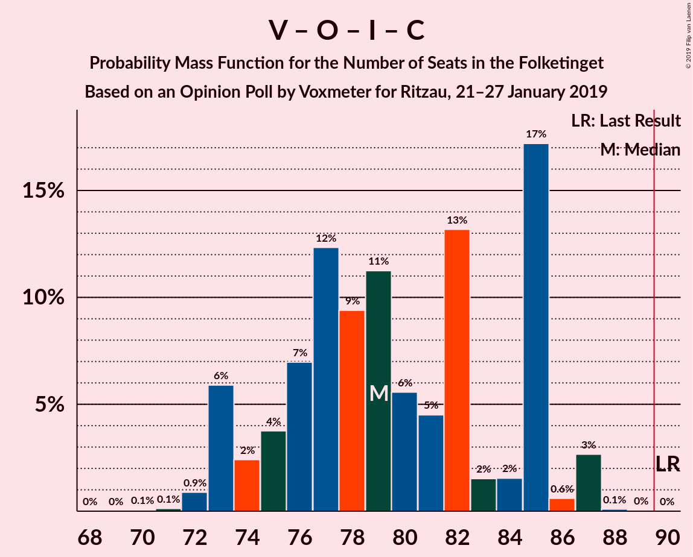

| Number of Seats | Probability | Accumulated | Special Marks |
|:---------------:|:-----------:|:-----------:|:-------------:|
| 72 | 0.2% | 100% |  |
| 73 | 0% | 99.8% |  |
| 74 | 0.3% | 99.8% |  |
| 75 | 0% | 99.5% |  |
| 76 | 0% | 99.5% |  |
| 77 | 61% | 99.5% | Median |
| 78 | 20% | 39% |  |
| 79 | 0.2% | 18% |  |
| 80 | 0.1% | 18% |  |
| 81 | 0% | 18% |  |
| 82 | 0.1% | 18% |  |
| 83 | 0% | 18% |  |
| 84 | 0% | 18% |  |
| 85 | 2% | 18% |  |
| 86 | 0% | 16% |  |
| 87 | 0.3% | 16% |  |
| 88 | 0% | 16% |  |
| 89 | 16% | 16% |  |
| 90 | 0% | 0% | Last Result, Majority |

### Socialdemokraterne – Radikale Venstre – Socialistisk Folkeparti

| Number of Seats | Probability | Accumulated | Special Marks |
|:---------------:|:-----------:|:-----------:|:-------------:|
| 62 | 0% | 100% | Last Result |
| 63 | 16% | 99.9% |  |
| 64 | 0% | 84% |  |
| 65 | 2% | 84% |  |
| 66 | 0.2% | 82% |  |
| 67 | 61% | 82% | Median |
| 68 | 0% | 21% |  |
| 69 | 0.1% | 21% |  |
| 70 | 0% | 21% |  |
| 71 | 0% | 21% |  |
| 72 | 0% | 21% |  |
| 73 | 0% | 21% |  |
| 74 | 0% | 21% |  |
| 75 | 0.2% | 21% |  |
| 76 | 0.2% | 21% |  |
| 77 | 0% | 20% |  |
| 78 | 0% | 20% |  |
| 79 | 20% | 20% |  |
| 80 | 0% | 0% |  |

### Socialdemokraterne – Enhedslisten–De Rød-Grønne – Socialistisk Folkeparti – Alternativet

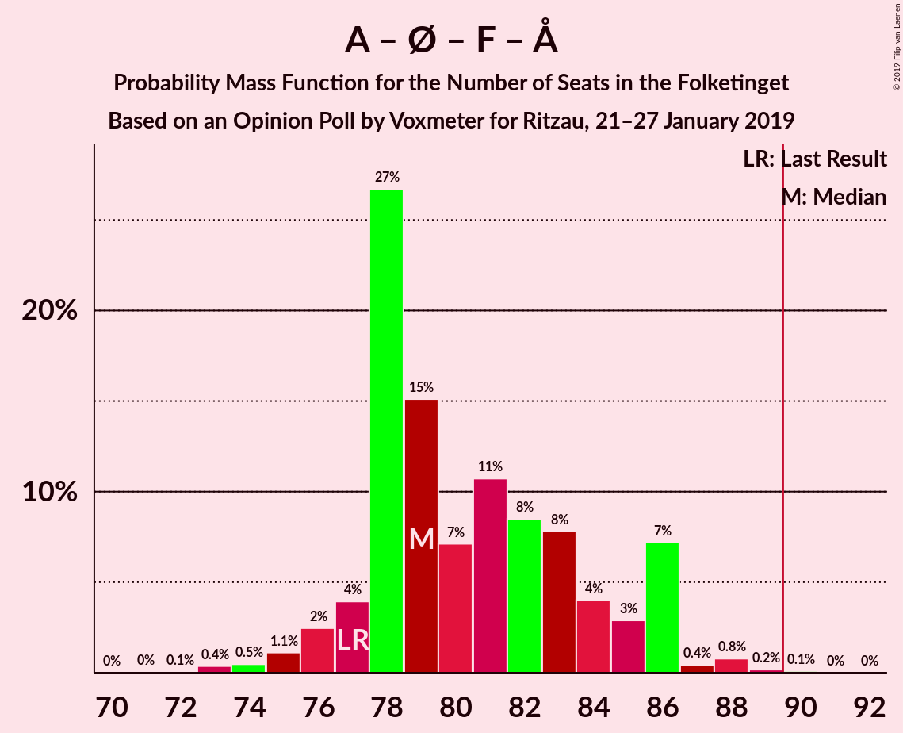

| Number of Seats | Probability | Accumulated | Special Marks |
|:---------------:|:-----------:|:-----------:|:-------------:|
| 73 | 16% | 100% |  |
| 74 | 2% | 84% |  |
| 75 | 61% | 82% | Median |
| 76 | 0% | 21% |  |
| 77 | 0% | 21% | Last Result |
| 78 | 20% | 21% |  |
| 79 | 0% | 0.8% |  |
| 80 | 0.1% | 0.8% |  |
| 81 | 0% | 0.7% |  |
| 82 | 0.2% | 0.7% |  |
| 83 | 0.2% | 0.5% |  |
| 84 | 0% | 0.3% |  |
| 85 | 0.1% | 0.3% |  |
| 86 | 0.2% | 0.2% |  |
| 87 | 0% | 0% |  |

### Socialdemokraterne – Enhedslisten–De Rød-Grønne – Socialistisk Folkeparti

| Number of Seats | Probability | Accumulated | Special Marks |
|:---------------:|:-----------:|:-----------:|:-------------:|
| 66 | 0% | 100% |  |
| 67 | 18% | 99.9% |  |
| 68 | 61% | 82% | Last Result, Median |
| 69 | 0% | 21% |  |
| 70 | 0.1% | 21% |  |
| 71 | 20% | 21% |  |
| 72 | 0% | 0.8% |  |
| 73 | 0% | 0.8% |  |
| 74 | 0% | 0.7% |  |
| 75 | 0% | 0.7% |  |
| 76 | 0.1% | 0.7% |  |
| 77 | 0.5% | 0.7% |  |
| 78 | 0.2% | 0.2% |  |
| 79 | 0% | 0% |  |

### Socialdemokraterne – Radikale Venstre

| Number of Seats | Probability | Accumulated | Special Marks |
|:---------------:|:-----------:|:-----------:|:-------------:|
| 53 | 0.1% | 100% |  |
| 54 | 0% | 99.9% |  |
| 55 | 16% | 99.9% | Last Result |
| 56 | 0% | 84% |  |
| 57 | 2% | 84% |  |
| 58 | 61% | 82% | Median |
| 59 | 0.2% | 21% |  |
| 60 | 0% | 21% |  |
| 61 | 0% | 21% |  |
| 62 | 0.1% | 21% |  |
| 63 | 0.3% | 21% |  |
| 64 | 0.2% | 21% |  |
| 65 | 0% | 20% |  |
| 66 | 0% | 20% |  |
| 67 | 0% | 20% |  |
| 68 | 0% | 20% |  |
| 69 | 0% | 20% |  |
| 70 | 0% | 20% |  |
| 71 | 20% | 20% |  |
| 72 | 0% | 0% |  |

### Venstre – Liberal Alliance – Det Konservative Folkeparti

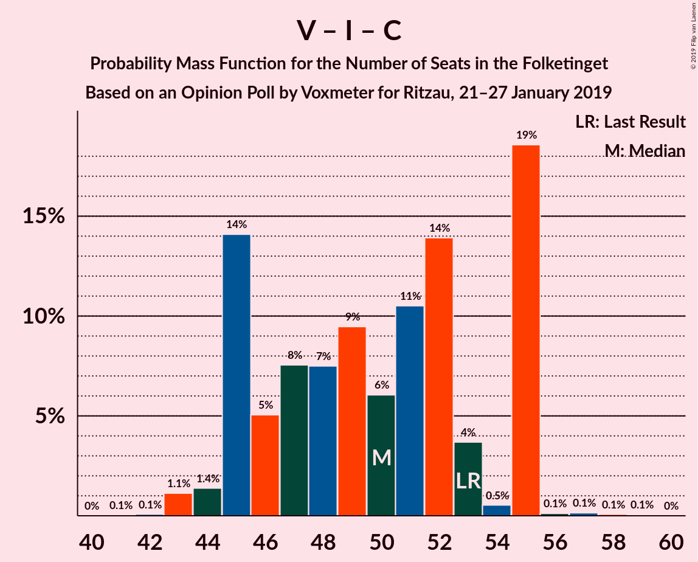

| Number of Seats | Probability | Accumulated | Special Marks |
|:---------------:|:-----------:|:-----------:|:-------------:|
| 42 | 0.2% | 100% |  |
| 43 | 0% | 99.8% |  |
| 44 | 61% | 99.8% | Median |
| 45 | 0.2% | 39% |  |
| 46 | 20% | 39% |  |
| 47 | 0.1% | 18% |  |
| 48 | 0.2% | 18% |  |
| 49 | 0% | 18% |  |
| 50 | 0.1% | 18% |  |
| 51 | 0% | 18% |  |
| 52 | 0% | 18% |  |
| 53 | 0% | 18% | Last Result |
| 54 | 2% | 18% |  |
| 55 | 16% | 16% |  |
| 56 | 0% | 0.3% |  |
| 57 | 0.1% | 0.3% |  |
| 58 | 0% | 0.2% |  |
| 59 | 0% | 0.2% |  |
| 60 | 0% | 0.2% |  |
| 61 | 0.2% | 0.2% |  |
| 62 | 0% | 0% |  |

### Venstre – Det Konservative Folkeparti

| Number of Seats | Probability | Accumulated | Special Marks |
|:---------------:|:-----------:|:-----------:|:-------------:|
| 34 | 0.4% | 100% |  |
| 35 | 0% | 99.6% |  |
| 36 | 0% | 99.6% |  |
| 37 | 0% | 99.6% |  |
| 38 | 81% | 99.6% | Median |
| 39 | 0% | 18% |  |
| 40 | 0.2% | 18% | Last Result |
| 41 | 0% | 18% |  |
| 42 | 0.1% | 18% |  |
| 43 | 0% | 18% |  |
| 44 | 0% | 18% |  |
| 45 | 0% | 18% |  |
| 46 | 2% | 18% |  |
| 47 | 0% | 16% |  |
| 48 | 16% | 16% |  |
| 49 | 0.1% | 0.3% |  |
| 50 | 0% | 0.2% |  |
| 51 | 0.2% | 0.2% |  |
| 52 | 0% | 0% |  |

### Venstre

| Number of Seats | Probability | Accumulated | Special Marks |
|:---------------:|:-----------:|:-----------:|:-------------:|
| 26 | 0.2% | 100% |  |
| 27 | 0% | 99.8% |  |
| 28 | 0% | 99.8% |  |
| 29 | 0% | 99.7% |  |
| 30 | 0.2% | 99.7% |  |
| 31 | 0% | 99.6% |  |
| 32 | 61% | 99.6% | Median |
| 33 | 20% | 39% |  |
| 34 | 0.2% | 18% | Last Result |
| 35 | 0% | 18% |  |
| 36 | 2% | 18% |  |
| 37 | 0% | 16% |  |
| 38 | 0% | 16% |  |
| 39 | 0% | 16% |  |
| 40 | 0% | 16% |  |
| 41 | 0% | 16% |  |
| 42 | 16% | 16% |  |
| 43 | 0% | 0.2% |  |
| 44 | 0.2% | 0.2% |  |
| 45 | 0% | 0% |  |

## Technical Information

### Opinion Poll

+ **Polling firm:** Voxmeter
+ **Commissioner(s):** Ritzau
+ **Fieldwork period:** 21–27 January 2019

### Calculations

+ **Sample size:** 1039
+ **Simulations done:** 1,024
+ **Error estimate:** 3.54%

