# Opinion Poll by Megafon for Politiken and TV 2, 28–31 January 2019

<a href="#voting-intentions">Voting Intentions</a> | <a href="#seats">Seats</a> | <a href="#coalitions">Coalitions</a> | <a href="#technical-information">Technical Information</a>

## Voting Intentions

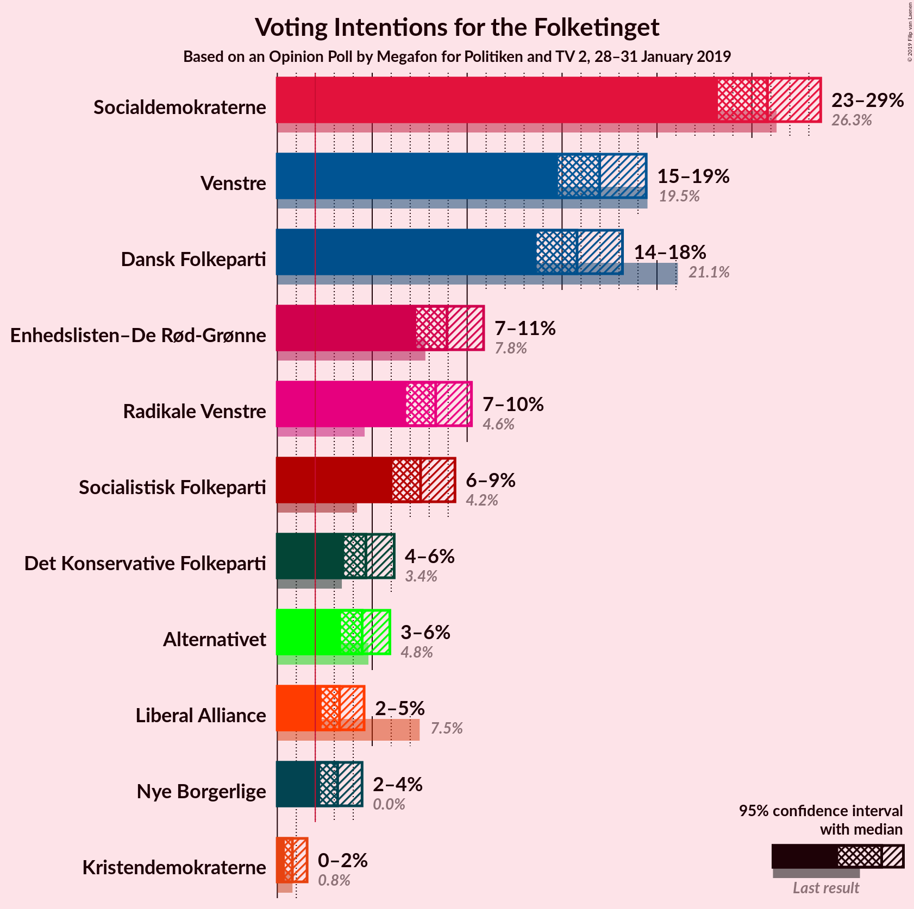

### Confidence Intervals

| Party | Last Result | Poll Result | 80% Confidence Interval | 90% Confidence Interval | 95% Confidence Interval | 99% Confidence Interval |
|:-----:|:-----------:|:-----------:|:-----------------------:|:-----------------------:|:-----------------------:|:-----------------------:|
| Socialdemokraterne | 26.3% | 25.8% | 24.1–27.6% |23.6–28.2% |23.2–28.6% |22.4–29.5% |
| Venstre | 19.5% | 17.0% | 15.5–18.6% |15.1–19.0% |14.8–19.4% |14.1–20.2% |
| Dansk Folkeparti | 21.1% | 15.8% | 14.4–17.3% |14.0–17.8% |13.7–18.2% |13.0–18.9% |
| Enhedslisten–De Rød-Grønne | 7.8% | 8.9% | 7.9–10.2% |7.6–10.5% |7.3–10.9% |6.8–11.5% |
| Radikale Venstre | 4.6% | 8.3% | 7.3–9.6% |7.0–9.9% |6.8–10.2% |6.3–10.8% |
| Socialistisk Folkeparti | 4.2% | 7.5% | 6.6–8.7% |6.3–9.1% |6.1–9.4% |5.6–10.0% |
| Det Konservative Folkeparti | 3.4% | 4.7% | 3.9–5.6% |3.7–5.9% |3.5–6.2% |3.2–6.7% |
| Alternativet | 4.8% | 4.5% | 3.7–5.4% |3.5–5.7% |3.4–5.9% |3.0–6.4% |
| Liberal Alliance | 7.5% | 3.3% | 2.7–4.1% |2.5–4.4% |2.3–4.6% |2.1–5.0% |
| Nye Borgerlige | 0.0% | 3.2% | 2.6–4.0% |2.4–4.3% |2.3–4.5% |2.0–4.9% |
| Kristendemokraterne | 0.8% | 0.8% | 0.5–1.3% |0.5–1.4% |0.4–1.6% |0.3–1.8% |

*Note:* The poll result column reflects the actual value used in the calculations. Published results may vary slightly, and in addition be rounded to fewer digits.

## Seats

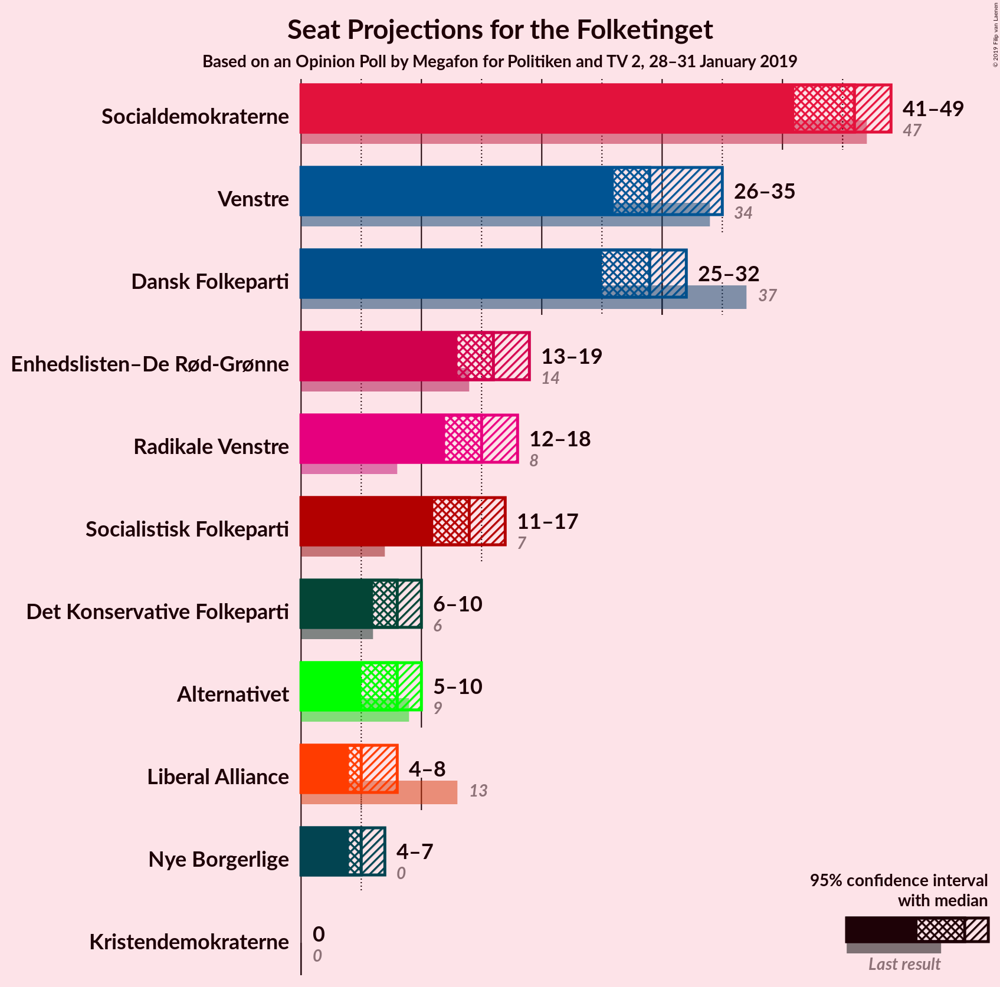

### Confidence Intervals

| Party | Last Result | Median | 80% Confidence Interval | 90% Confidence Interval | 95% Confidence Interval | 99% Confidence Interval |
|:-----:|:-----------:|:------:|:-----------------------:|:-----------------------:|:-----------------------:|:-----------------------:|
| <a href="#socialdemokraterne">Socialdemokraterne</a> | 47 | 44 | 40–49 |40–51 |40–51 |39–51 |
| <a href="#venstre">Venstre</a> | 34 | 31 | 29–33 |27–33 |27–33 |26–35 |
| <a href="#dansk-folkeparti">Dansk Folkeparti</a> | 37 | 30 | 24–31 |24–32 |22–34 |22–34 |
| <a href="#enhedslisten–de-rød-grønne">Enhedslisten–De Rød-Grønne</a> | 14 | 16 | 13–18 |13–19 |13–19 |12–21 |
| <a href="#radikale-venstre">Radikale Venstre</a> | 8 | 13 | 12–17 |11–17 |11–18 |11–20 |
| <a href="#socialistisk-folkeparti">Socialistisk Folkeparti</a> | 7 | 14 | 11–16 |11–16 |10–16 |10–17 |
| <a href="#det-konservative-folkeparti">Det Konservative Folkeparti</a> | 6 | 9 | 7–9 |5–10 |5–10 |5–11 |
| <a href="#alternativet">Alternativet</a> | 9 | 8 | 7–9 |7–9 |7–10 |5–11 |
| <a href="#liberal-alliance">Liberal Alliance</a> | 13 | 6 | 5–8 |4–8 |4–8 |0–9 |
| <a href="#nye-borgerlige">Nye Borgerlige</a> | 0 | 5 | 4–7 |4–8 |4–8 |4–8 |
| <a href="#kristendemokraterne">Kristendemokraterne</a> | 0 | 0 | 0 |0 |0–4 |0–4 |

### Socialdemokraterne

*For a full overview of the results for this party, see the [Socialdemokraterne](party-socialdemokraterne.html) page.*

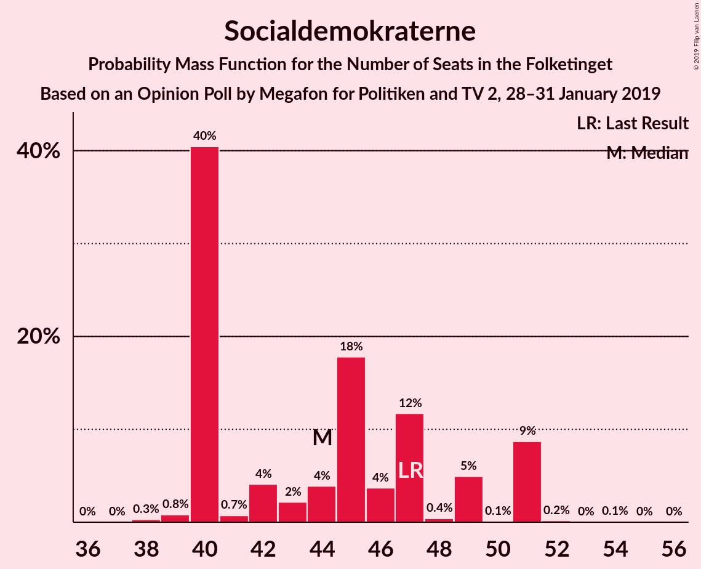

| Number of Seats | Probability | Accumulated | Special Marks |
|:---------------:|:-----------:|:-----------:|:-------------:|
| 38 | 0.3% | 100% |  |
| 39 | 0.8% | 99.7% |  |
| 40 | 40% | 98.9% |  |
| 41 | 0.7% | 58% |  |
| 42 | 4% | 58% |  |
| 43 | 2% | 54% |  |
| 44 | 4% | 51% | Median |
| 45 | 18% | 48% |  |
| 46 | 4% | 30% |  |
| 47 | 12% | 26% | Last Result |
| 48 | 0.4% | 14% |  |
| 49 | 5% | 14% |  |
| 50 | 0.1% | 9% |  |
| 51 | 9% | 9% |  |
| 52 | 0.2% | 0.3% |  |
| 53 | 0% | 0.1% |  |
| 54 | 0.1% | 0.1% |  |
| 55 | 0% | 0% |  |

### Venstre

*For a full overview of the results for this party, see the [Venstre](party-venstre.html) page.*

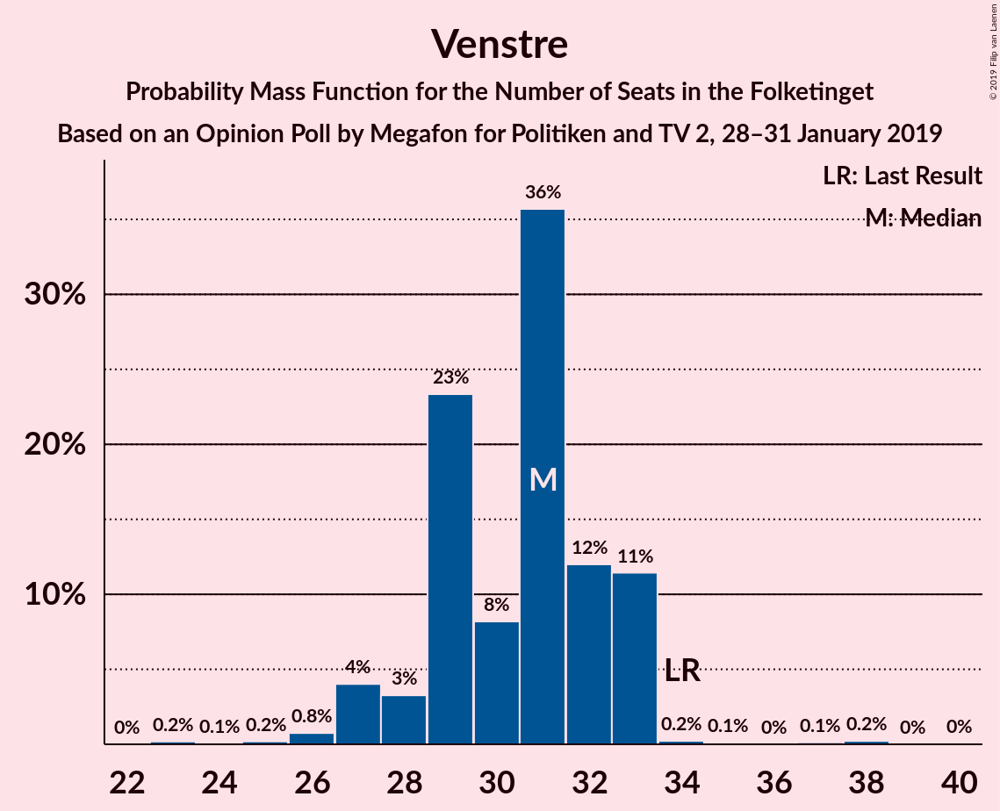

| Number of Seats | Probability | Accumulated | Special Marks |
|:---------------:|:-----------:|:-----------:|:-------------:|
| 23 | 0.2% | 100% |  |
| 24 | 0.1% | 99.8% |  |
| 25 | 0.2% | 99.7% |  |
| 26 | 0.8% | 99.5% |  |
| 27 | 4% | 98.8% |  |
| 28 | 3% | 95% |  |
| 29 | 23% | 91% |  |
| 30 | 8% | 68% |  |
| 31 | 36% | 60% | Median |
| 32 | 12% | 24% |  |
| 33 | 11% | 12% |  |
| 34 | 0.2% | 0.8% | Last Result |
| 35 | 0.1% | 0.5% |  |
| 36 | 0% | 0.4% |  |
| 37 | 0.1% | 0.4% |  |
| 38 | 0.2% | 0.3% |  |
| 39 | 0% | 0.1% |  |
| 40 | 0% | 0% |  |

### Dansk Folkeparti

*For a full overview of the results for this party, see the [Dansk Folkeparti](party-danskfolkeparti.html) page.*

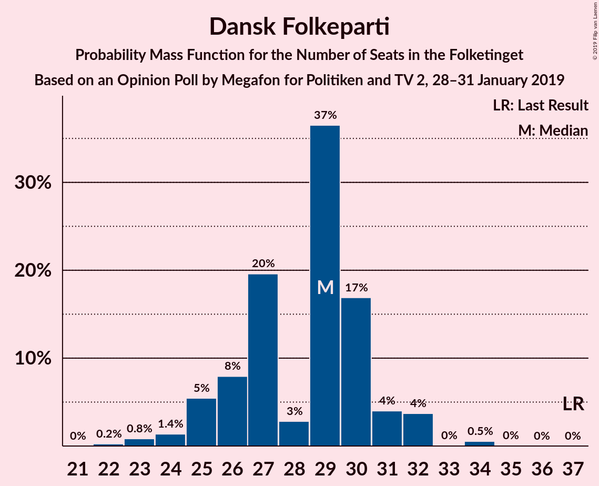

| Number of Seats | Probability | Accumulated | Special Marks |
|:---------------:|:-----------:|:-----------:|:-------------:|
| 22 | 5% | 100% |  |
| 23 | 0.2% | 95% |  |
| 24 | 10% | 95% |  |
| 25 | 0.6% | 85% |  |
| 26 | 5% | 85% |  |
| 27 | 9% | 79% |  |
| 28 | 2% | 70% |  |
| 29 | 10% | 68% |  |
| 30 | 10% | 59% | Median |
| 31 | 40% | 48% |  |
| 32 | 5% | 8% |  |
| 33 | 0.1% | 3% |  |
| 34 | 3% | 3% |  |
| 35 | 0% | 0.1% |  |
| 36 | 0% | 0% |  |
| 37 | 0% | 0% | Last Result |

### Enhedslisten–De Rød-Grønne

*For a full overview of the results for this party, see the [Enhedslisten–De Rød-Grønne](party-enhedslisten–derød-grønne.html) page.*

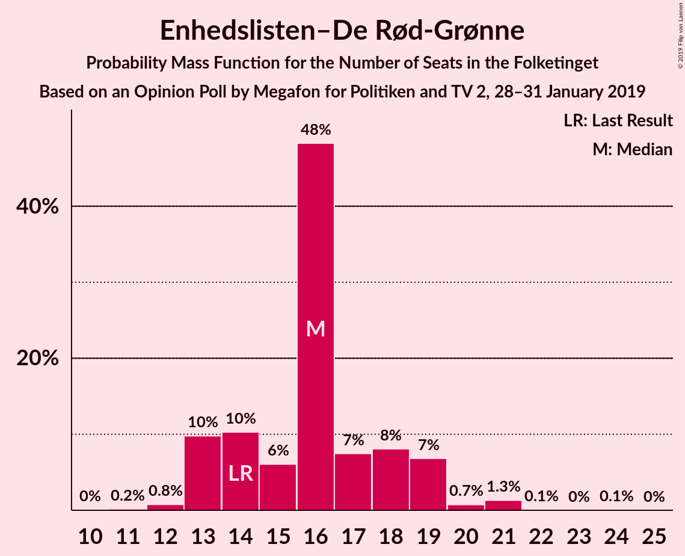

| Number of Seats | Probability | Accumulated | Special Marks |
|:---------------:|:-----------:|:-----------:|:-------------:|
| 11 | 0.2% | 100% |  |
| 12 | 0.8% | 99.8% |  |
| 13 | 10% | 99.0% |  |
| 14 | 10% | 89% | Last Result |
| 15 | 6% | 79% |  |
| 16 | 48% | 73% | Median |
| 17 | 7% | 25% |  |
| 18 | 8% | 17% |  |
| 19 | 7% | 9% |  |
| 20 | 0.7% | 2% |  |
| 21 | 1.3% | 2% |  |
| 22 | 0.1% | 0.2% |  |
| 23 | 0% | 0.1% |  |
| 24 | 0.1% | 0.1% |  |
| 25 | 0% | 0% |  |

### Radikale Venstre

*For a full overview of the results for this party, see the [Radikale Venstre](party-radikalevenstre.html) page.*

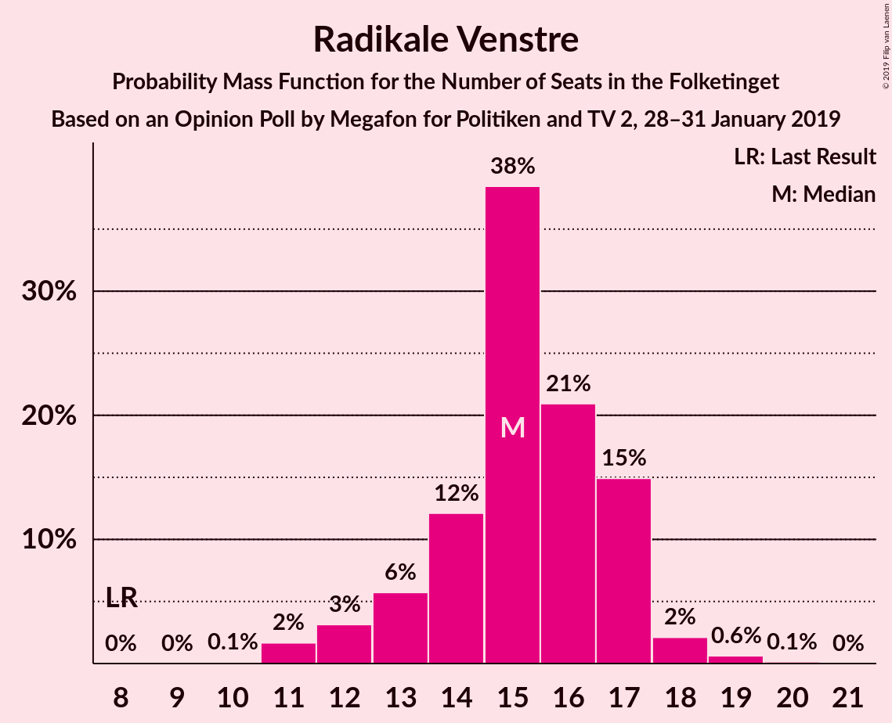

| Number of Seats | Probability | Accumulated | Special Marks |
|:---------------:|:-----------:|:-----------:|:-------------:|
| 8 | 0% | 100% | Last Result |
| 9 | 0.1% | 100% |  |
| 10 | 0.4% | 99.9% |  |
| 11 | 6% | 99.5% |  |
| 12 | 7% | 94% |  |
| 13 | 42% | 87% | Median |
| 14 | 12% | 45% |  |
| 15 | 15% | 33% |  |
| 16 | 8% | 18% |  |
| 17 | 6% | 10% |  |
| 18 | 3% | 4% |  |
| 19 | 0.3% | 1.0% |  |
| 20 | 0.7% | 0.7% |  |
| 21 | 0% | 0% |  |

### Socialistisk Folkeparti

*For a full overview of the results for this party, see the [Socialistisk Folkeparti](party-socialistiskfolkeparti.html) page.*

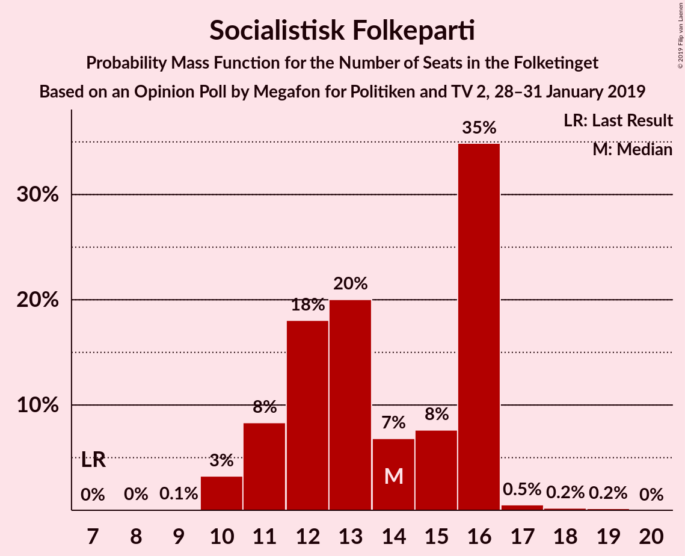

| Number of Seats | Probability | Accumulated | Special Marks |
|:---------------:|:-----------:|:-----------:|:-------------:|
| 7 | 0% | 100% | Last Result |
| 8 | 0% | 100% |  |
| 9 | 0.1% | 100% |  |
| 10 | 3% | 99.9% |  |
| 11 | 8% | 97% |  |
| 12 | 18% | 88% |  |
| 13 | 20% | 70% |  |
| 14 | 7% | 50% | Median |
| 15 | 8% | 43% |  |
| 16 | 35% | 36% |  |
| 17 | 0.5% | 0.9% |  |
| 18 | 0.2% | 0.4% |  |
| 19 | 0.2% | 0.2% |  |
| 20 | 0% | 0% |  |

### Det Konservative Folkeparti

*For a full overview of the results for this party, see the [Det Konservative Folkeparti](party-detkonservativefolkeparti.html) page.*

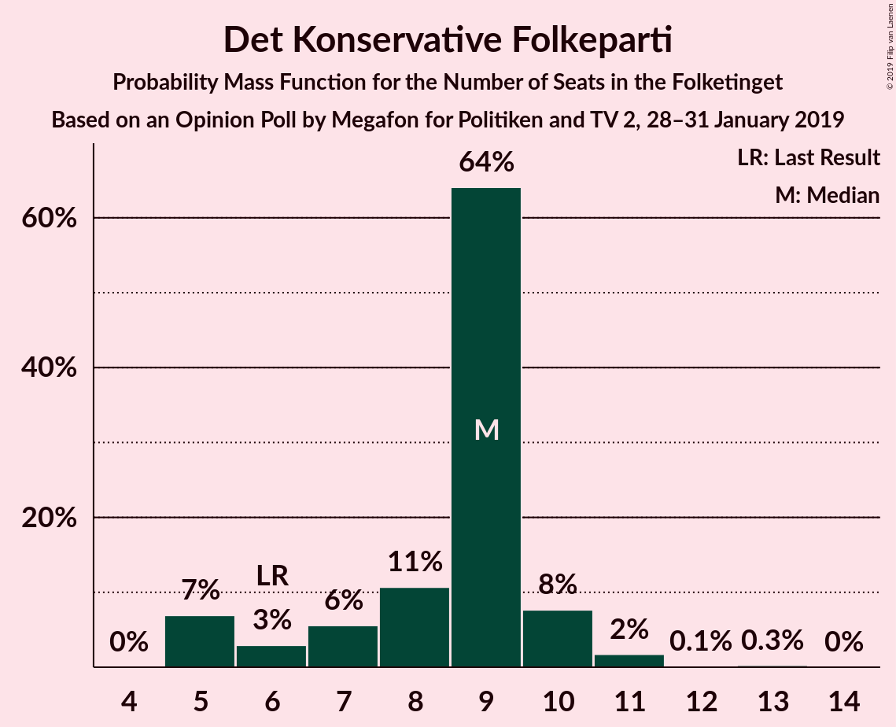

| Number of Seats | Probability | Accumulated | Special Marks |
|:---------------:|:-----------:|:-----------:|:-------------:|
| 5 | 7% | 100% |  |
| 6 | 3% | 93% | Last Result |
| 7 | 6% | 90% |  |
| 8 | 11% | 85% |  |
| 9 | 64% | 74% | Median |
| 10 | 8% | 10% |  |
| 11 | 2% | 2% |  |
| 12 | 0.1% | 0.4% |  |
| 13 | 0.3% | 0.3% |  |
| 14 | 0% | 0% |  |

### Alternativet

*For a full overview of the results for this party, see the [Alternativet](party-alternativet.html) page.*

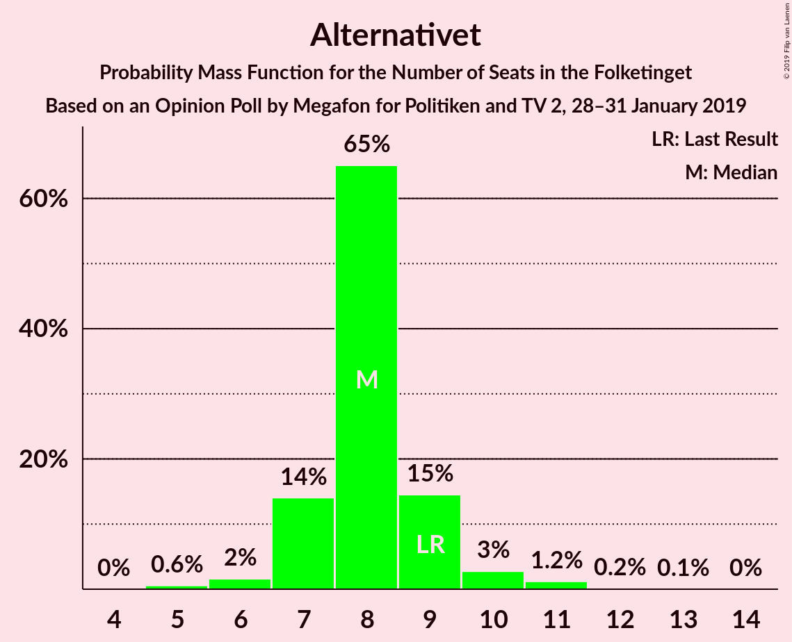

| Number of Seats | Probability | Accumulated | Special Marks |
|:---------------:|:-----------:|:-----------:|:-------------:|
| 5 | 0.6% | 100% |  |
| 6 | 2% | 99.4% |  |
| 7 | 14% | 98% |  |
| 8 | 65% | 84% | Median |
| 9 | 15% | 19% | Last Result |
| 10 | 3% | 4% |  |
| 11 | 1.2% | 1.4% |  |
| 12 | 0.2% | 0.2% |  |
| 13 | 0.1% | 0.1% |  |
| 14 | 0% | 0% |  |

### Liberal Alliance

*For a full overview of the results for this party, see the [Liberal Alliance](party-liberalalliance.html) page.*

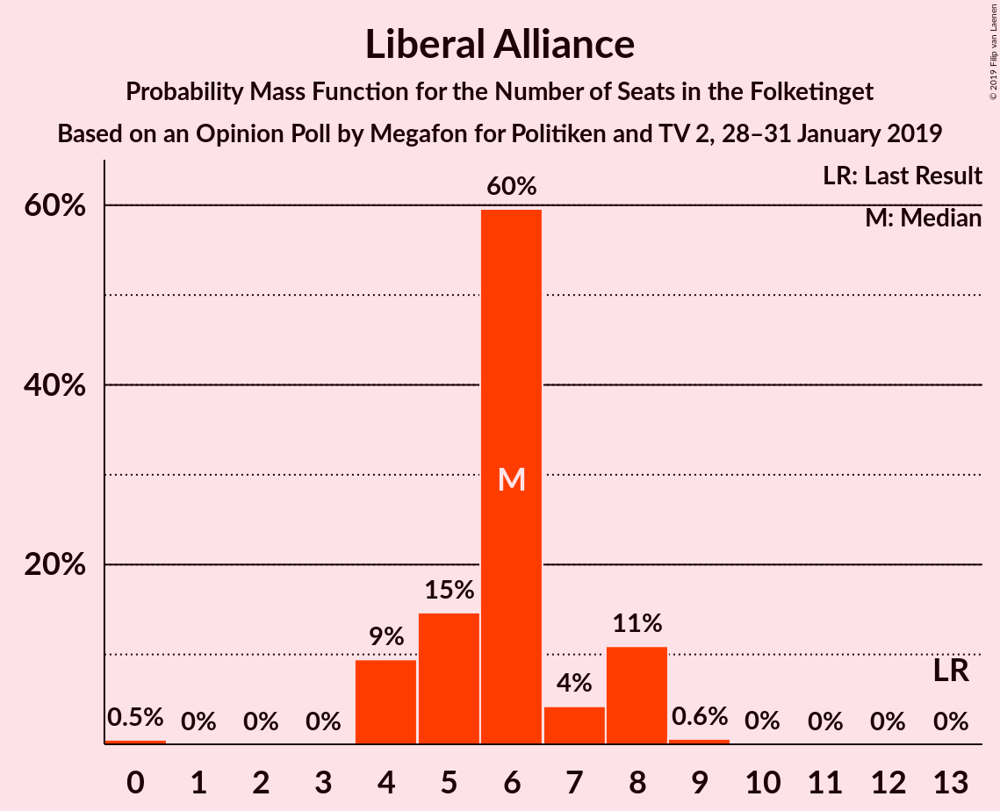

| Number of Seats | Probability | Accumulated | Special Marks |
|:---------------:|:-----------:|:-----------:|:-------------:|
| 0 | 0.5% | 100% |  |
| 1 | 0% | 99.5% |  |
| 2 | 0% | 99.5% |  |
| 3 | 0% | 99.5% |  |
| 4 | 9% | 99.5% |  |
| 5 | 15% | 90% |  |
| 6 | 60% | 75% | Median |
| 7 | 4% | 16% |  |
| 8 | 11% | 12% |  |
| 9 | 0.6% | 0.7% |  |
| 10 | 0% | 0.1% |  |
| 11 | 0% | 0% |  |
| 12 | 0% | 0% |  |
| 13 | 0% | 0% | Last Result |

### Nye Borgerlige

*For a full overview of the results for this party, see the [Nye Borgerlige](party-nyeborgerlige.html) page.*

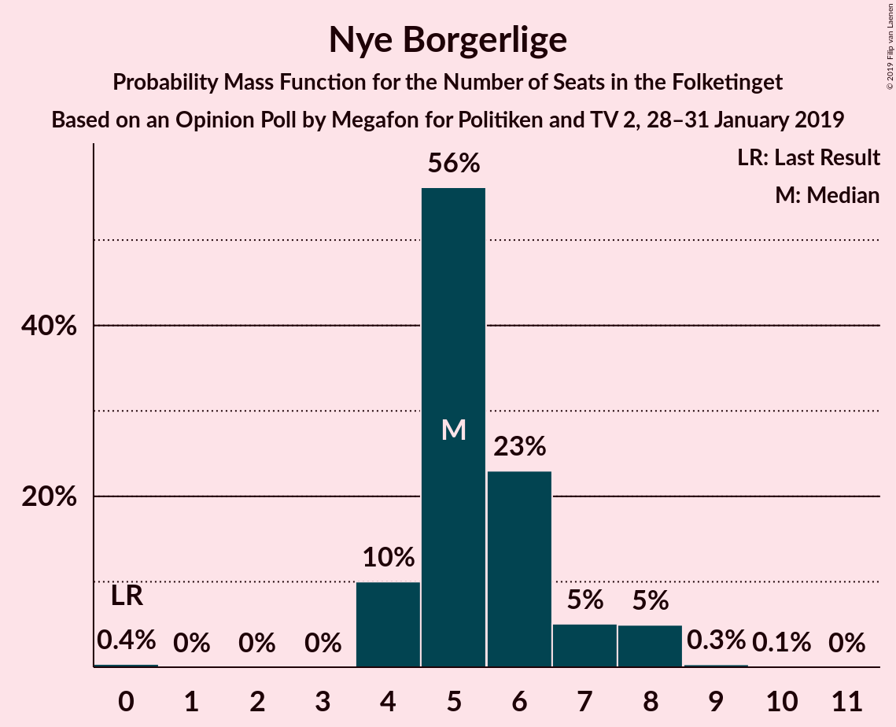

| Number of Seats | Probability | Accumulated | Special Marks |
|:---------------:|:-----------:|:-----------:|:-------------:|
| 0 | 0.4% | 100% | Last Result |
| 1 | 0% | 99.6% |  |
| 2 | 0% | 99.6% |  |
| 3 | 0% | 99.6% |  |
| 4 | 10% | 99.6% |  |
| 5 | 56% | 90% | Median |
| 6 | 23% | 33% |  |
| 7 | 5% | 10% |  |
| 8 | 5% | 5% |  |
| 9 | 0.3% | 0.4% |  |
| 10 | 0.1% | 0.1% |  |
| 11 | 0% | 0% |  |

### Kristendemokraterne

*For a full overview of the results for this party, see the [Kristendemokraterne](party-kristendemokraterne.html) page.*

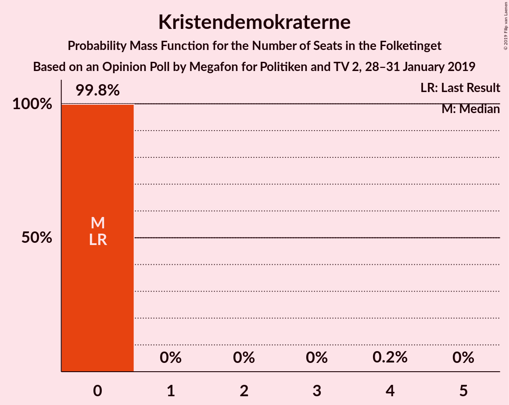

| Number of Seats | Probability | Accumulated | Special Marks |
|:---------------:|:-----------:|:-----------:|:-------------:|
| 0 | 96% | 100% | Last Result, Median |
| 1 | 0% | 4% |  |
| 2 | 0% | 4% |  |
| 3 | 0% | 4% |  |
| 4 | 4% | 4% |  |
| 5 | 0% | 0% |  |

## Coalitions

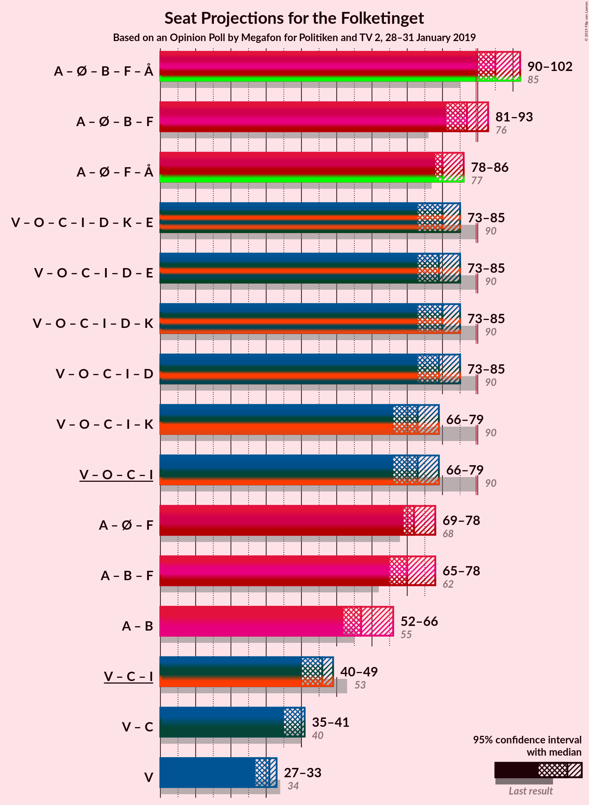

### Confidence Intervals

| Coalition | Last Result | Median | Majority? | 80% Confidence Interval | 90% Confidence Interval | 95% Confidence Interval | 99% Confidence Interval |
|:---------:|:-----------:|:------:|:---------:|:-----------------------:|:-----------------------:|:-----------------------:|:-----------------------:|
| Socialdemokraterne – Enhedslisten–De Rød-Grønne – Radikale Venstre – Socialistisk Folkeparti – Alternativet | 85 | 95 | 99.5% | 93–99 | 91–100 | 90–102 | 90–103 |
| Socialdemokraterne – Enhedslisten–De Rød-Grønne – Radikale Venstre – Socialistisk Folkeparti | 76 | 87 | 36% | 85–92 | 83–92 | 81–93 | 81–95 |
| Socialdemokraterne – Enhedslisten–De Rød-Grønne – Socialistisk Folkeparti – Alternativet | 77 | 80 | 0.2% | 79–85 | 79–85 | 78–86 | 76–89 |
| Venstre – Dansk Folkeparti – Det Konservative Folkeparti – Liberal Alliance – Nye Borgerlige – Kristendemokraterne | 90 | 80 | 0% | 76–82 | 75–84 | 73–85 | 72–85 |
| Venstre – Dansk Folkeparti – Det Konservative Folkeparti – Liberal Alliance – Nye Borgerlige | 90 | 79 | 0% | 76–82 | 75–84 | 73–85 | 72–85 |
| Venstre – Dansk Folkeparti – Det Konservative Folkeparti – Liberal Alliance – Kristendemokraterne | 90 | 73 | 0% | 70–77 | 69–79 | 66–79 | 66–79 |
| Venstre – Dansk Folkeparti – Det Konservative Folkeparti – Liberal Alliance | 90 | 73 | 0% | 70–77 | 69–79 | 66–79 | 66–79 |
| Socialdemokraterne – Enhedslisten–De Rød-Grønne – Socialistisk Folkeparti | 68 | 72 | 0% | 71–77 | 70–77 | 69–78 | 68–81 |
| Socialdemokraterne – Radikale Venstre – Socialistisk Folkeparti | 62 | 70 | 0% | 69–77 | 66–78 | 65–78 | 65–79 |
| Socialdemokraterne – Radikale Venstre | 55 | 57 | 0% | 53–65 | 53–66 | 52–66 | 52–66 |
| Venstre – Det Konservative Folkeparti – Liberal Alliance | 53 | 46 | 0% | 42–47 | 40–49 | 40–49 | 39–50 |
| Venstre – Det Konservative Folkeparti | 40 | 40 | 0% | 36–41 | 36–41 | 35–41 | 34–43 |
| Venstre | 34 | 31 | 0% | 29–33 | 27–33 | 27–33 | 26–35 |

### Socialdemokraterne – Enhedslisten–De Rød-Grønne – Radikale Venstre – Socialistisk Folkeparti – Alternativet

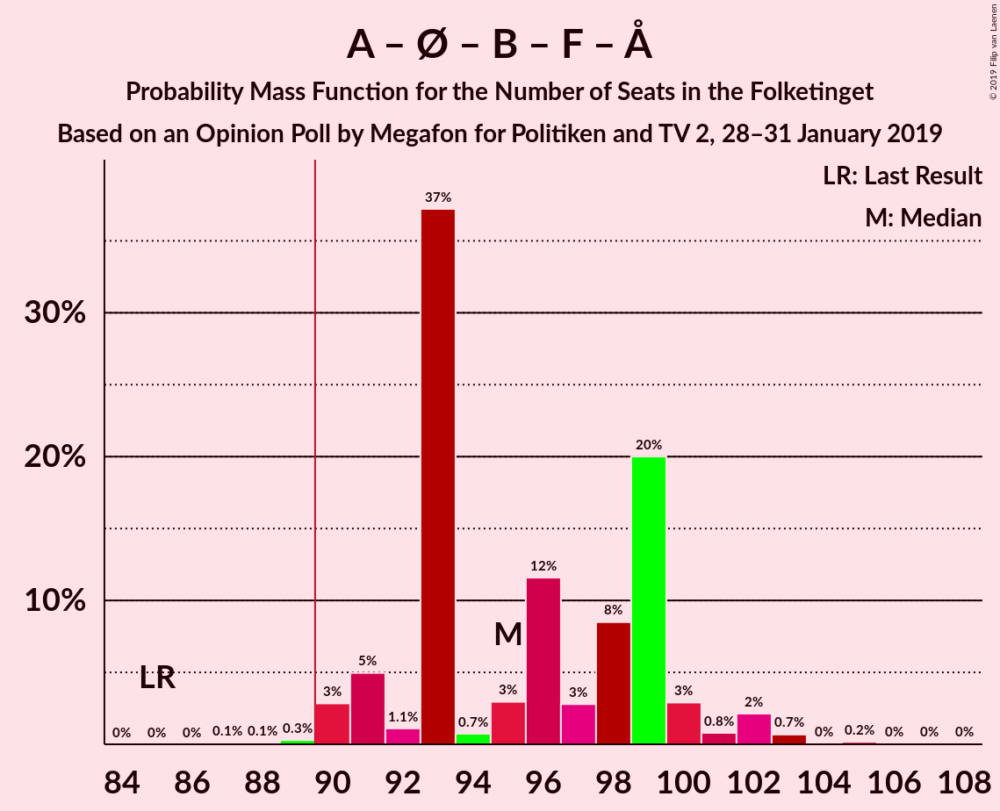

| Number of Seats | Probability | Accumulated | Special Marks |
|:---------------:|:-----------:|:-----------:|:-------------:|
| 85 | 0% | 100% | Last Result |
| 86 | 0% | 100% |  |
| 87 | 0.1% | 100% |  |
| 88 | 0.1% | 99.9% |  |
| 89 | 0.3% | 99.8% |  |
| 90 | 3% | 99.5% | Majority |
| 91 | 5% | 97% |  |
| 92 | 1.1% | 92% |  |
| 93 | 37% | 91% |  |
| 94 | 0.7% | 53% |  |
| 95 | 3% | 53% | Median |
| 96 | 12% | 50% |  |
| 97 | 3% | 38% |  |
| 98 | 8% | 35% |  |
| 99 | 20% | 27% |  |
| 100 | 3% | 7% |  |
| 101 | 0.8% | 4% |  |
| 102 | 2% | 3% |  |
| 103 | 0.7% | 1.0% |  |
| 104 | 0% | 0.3% |  |
| 105 | 0.2% | 0.2% |  |
| 106 | 0% | 0.1% |  |
| 107 | 0% | 0.1% |  |
| 108 | 0% | 0% |  |

### Socialdemokraterne – Enhedslisten–De Rød-Grønne – Radikale Venstre – Socialistisk Folkeparti

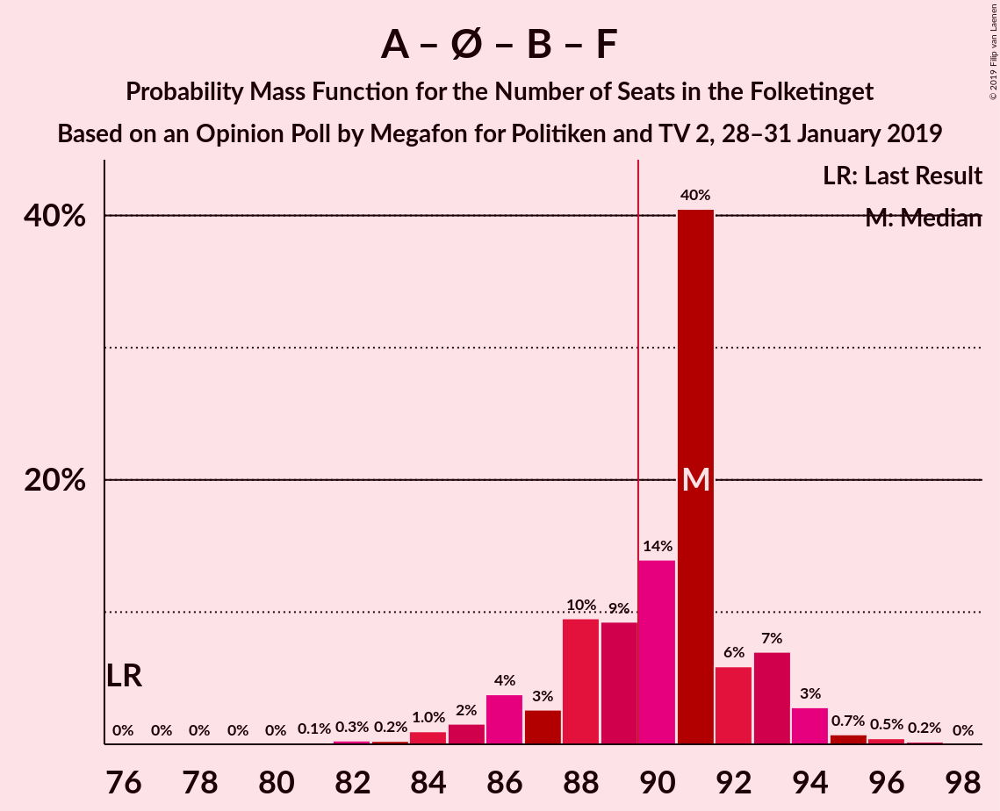

| Number of Seats | Probability | Accumulated | Special Marks |
|:---------------:|:-----------:|:-----------:|:-------------:|
| 76 | 0% | 100% | Last Result |
| 77 | 0% | 100% |  |
| 78 | 0% | 100% |  |
| 79 | 0% | 100% |  |
| 80 | 0% | 100% |  |
| 81 | 3% | 99.9% |  |
| 82 | 0.3% | 97% |  |
| 83 | 5% | 97% |  |
| 84 | 0.9% | 92% |  |
| 85 | 36% | 91% |  |
| 86 | 5% | 55% |  |
| 87 | 3% | 50% | Median |
| 88 | 10% | 48% |  |
| 89 | 2% | 38% |  |
| 90 | 11% | 36% | Majority |
| 91 | 13% | 24% |  |
| 92 | 8% | 12% |  |
| 93 | 3% | 3% |  |
| 94 | 0.1% | 0.8% |  |
| 95 | 0.4% | 0.7% |  |
| 96 | 0.1% | 0.3% |  |
| 97 | 0.1% | 0.2% |  |
| 98 | 0% | 0.1% |  |
| 99 | 0.1% | 0.1% |  |
| 100 | 0% | 0% |  |

### Socialdemokraterne – Enhedslisten–De Rød-Grønne – Socialistisk Folkeparti – Alternativet

| Number of Seats | Probability | Accumulated | Special Marks |
|:---------------:|:-----------:|:-----------:|:-------------:|
| 72 | 0.1% | 100% |  |
| 73 | 0% | 99.9% |  |
| 74 | 0.1% | 99.9% |  |
| 75 | 0.1% | 99.8% |  |
| 76 | 0.7% | 99.7% |  |
| 77 | 1.0% | 99.0% | Last Result |
| 78 | 1.4% | 98% |  |
| 79 | 12% | 97% |  |
| 80 | 38% | 84% |  |
| 81 | 0.7% | 47% |  |
| 82 | 7% | 46% | Median |
| 83 | 8% | 38% |  |
| 84 | 20% | 30% |  |
| 85 | 8% | 11% |  |
| 86 | 0.4% | 3% |  |
| 87 | 1.1% | 2% |  |
| 88 | 0.2% | 1.2% |  |
| 89 | 0.8% | 1.0% |  |
| 90 | 0% | 0.2% | Majority |
| 91 | 0.1% | 0.1% |  |
| 92 | 0% | 0.1% |  |
| 93 | 0% | 0% |  |

### Venstre – Dansk Folkeparti – Det Konservative Folkeparti – Liberal Alliance – Nye Borgerlige – Kristendemokraterne

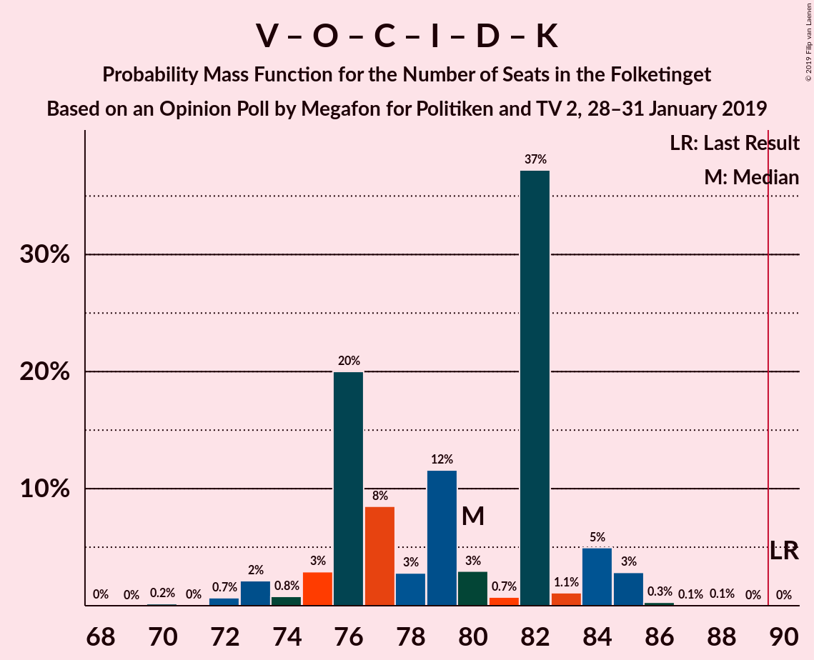

| Number of Seats | Probability | Accumulated | Special Marks |
|:---------------:|:-----------:|:-----------:|:-------------:|
| 68 | 0% | 100% |  |
| 69 | 0% | 99.9% |  |
| 70 | 0.2% | 99.9% |  |
| 71 | 0% | 99.8% |  |
| 72 | 0.7% | 99.7% |  |
| 73 | 2% | 99.0% |  |
| 74 | 0.8% | 97% |  |
| 75 | 3% | 96% |  |
| 76 | 20% | 93% |  |
| 77 | 8% | 73% |  |
| 78 | 3% | 65% |  |
| 79 | 12% | 62% |  |
| 80 | 3% | 50% |  |
| 81 | 0.7% | 47% | Median |
| 82 | 37% | 47% |  |
| 83 | 1.1% | 9% |  |
| 84 | 5% | 8% |  |
| 85 | 3% | 3% |  |
| 86 | 0.3% | 0.5% |  |
| 87 | 0.1% | 0.2% |  |
| 88 | 0.1% | 0.1% |  |
| 89 | 0% | 0% |  |
| 90 | 0% | 0% | Last Result, Majority |

### Venstre – Dansk Folkeparti – Det Konservative Folkeparti – Liberal Alliance – Nye Borgerlige

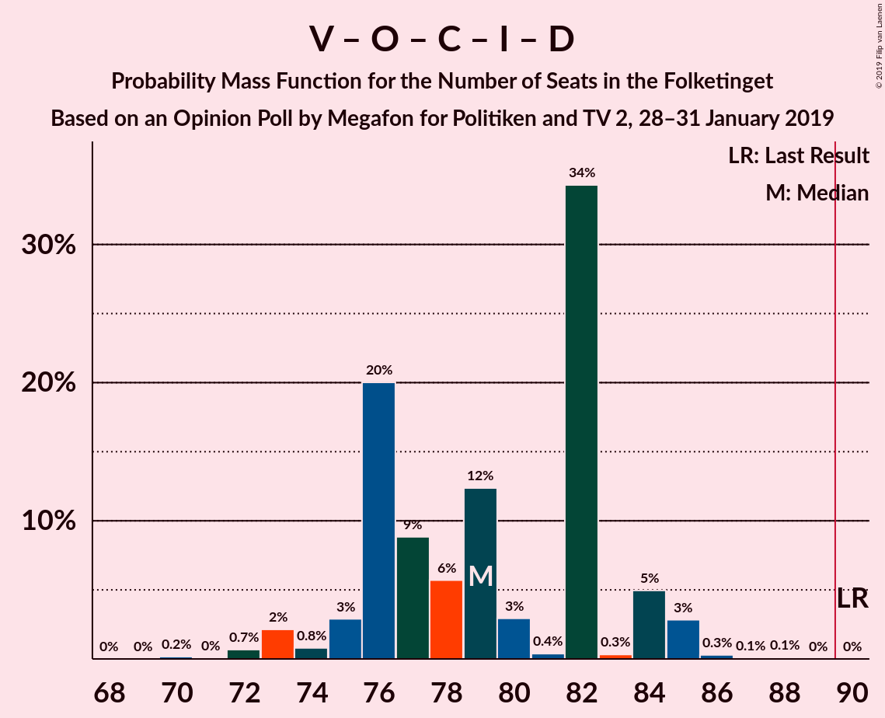

| Number of Seats | Probability | Accumulated | Special Marks |
|:---------------:|:-----------:|:-----------:|:-------------:|
| 68 | 0% | 100% |  |
| 69 | 0% | 99.9% |  |
| 70 | 0.2% | 99.9% |  |
| 71 | 0% | 99.8% |  |
| 72 | 0.7% | 99.7% |  |
| 73 | 2% | 99.0% |  |
| 74 | 0.8% | 97% |  |
| 75 | 3% | 96% |  |
| 76 | 20% | 93% |  |
| 77 | 9% | 73% |  |
| 78 | 6% | 64% |  |
| 79 | 12% | 59% |  |
| 80 | 3% | 46% |  |
| 81 | 0.4% | 43% | Median |
| 82 | 34% | 43% |  |
| 83 | 0.3% | 9% |  |
| 84 | 5% | 8% |  |
| 85 | 3% | 3% |  |
| 86 | 0.3% | 0.5% |  |
| 87 | 0.1% | 0.2% |  |
| 88 | 0.1% | 0.1% |  |
| 89 | 0% | 0% |  |
| 90 | 0% | 0% | Last Result, Majority |

### Venstre – Dansk Folkeparti – Det Konservative Folkeparti – Liberal Alliance – Kristendemokraterne

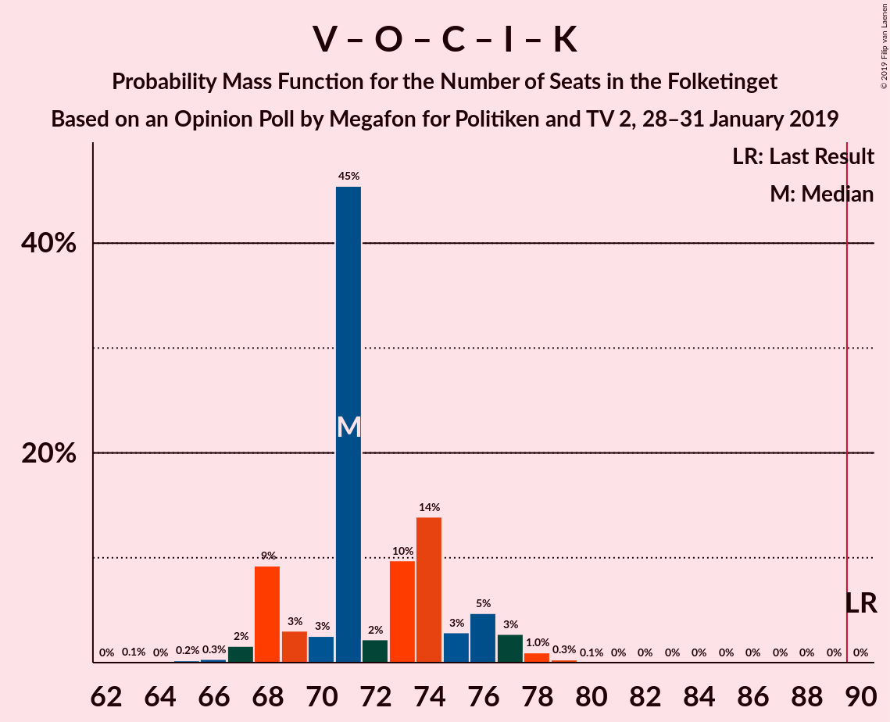

| Number of Seats | Probability | Accumulated | Special Marks |
|:---------------:|:-----------:|:-----------:|:-------------:|
| 64 | 0% | 100% |  |
| 65 | 0.4% | 99.9% |  |
| 66 | 2% | 99.5% |  |
| 67 | 0.5% | 97% |  |
| 68 | 0.3% | 97% |  |
| 69 | 3% | 97% |  |
| 70 | 8% | 94% |  |
| 71 | 17% | 86% |  |
| 72 | 3% | 69% |  |
| 73 | 16% | 66% |  |
| 74 | 0.9% | 50% |  |
| 75 | 0.7% | 49% |  |
| 76 | 5% | 48% | Median |
| 77 | 35% | 44% |  |
| 78 | 0.3% | 8% |  |
| 79 | 8% | 8% |  |
| 80 | 0.2% | 0.5% |  |
| 81 | 0.1% | 0.2% |  |
| 82 | 0.1% | 0.1% |  |
| 83 | 0% | 0% |  |
| 84 | 0% | 0% |  |
| 85 | 0% | 0% |  |
| 86 | 0% | 0% |  |
| 87 | 0% | 0% |  |
| 88 | 0% | 0% |  |
| 89 | 0% | 0% |  |
| 90 | 0% | 0% | Last Result, Majority |

### Venstre – Dansk Folkeparti – Det Konservative Folkeparti – Liberal Alliance

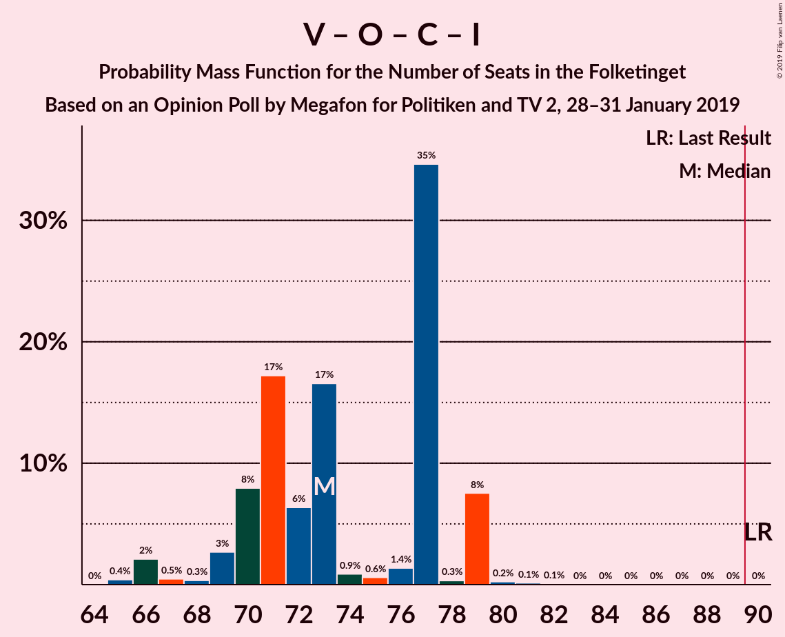

| Number of Seats | Probability | Accumulated | Special Marks |
|:---------------:|:-----------:|:-----------:|:-------------:|
| 64 | 0% | 100% |  |
| 65 | 0.4% | 99.9% |  |
| 66 | 2% | 99.5% |  |
| 67 | 0.5% | 97% |  |
| 68 | 0.3% | 97% |  |
| 69 | 3% | 97% |  |
| 70 | 8% | 94% |  |
| 71 | 17% | 86% |  |
| 72 | 6% | 69% |  |
| 73 | 17% | 62% |  |
| 74 | 0.9% | 46% |  |
| 75 | 0.6% | 45% |  |
| 76 | 1.4% | 44% | Median |
| 77 | 35% | 43% |  |
| 78 | 0.3% | 8% |  |
| 79 | 8% | 8% |  |
| 80 | 0.2% | 0.5% |  |
| 81 | 0.1% | 0.2% |  |
| 82 | 0.1% | 0.1% |  |
| 83 | 0% | 0% |  |
| 84 | 0% | 0% |  |
| 85 | 0% | 0% |  |
| 86 | 0% | 0% |  |
| 87 | 0% | 0% |  |
| 88 | 0% | 0% |  |
| 89 | 0% | 0% |  |
| 90 | 0% | 0% | Last Result, Majority |

### Socialdemokraterne – Enhedslisten–De Rød-Grønne – Socialistisk Folkeparti

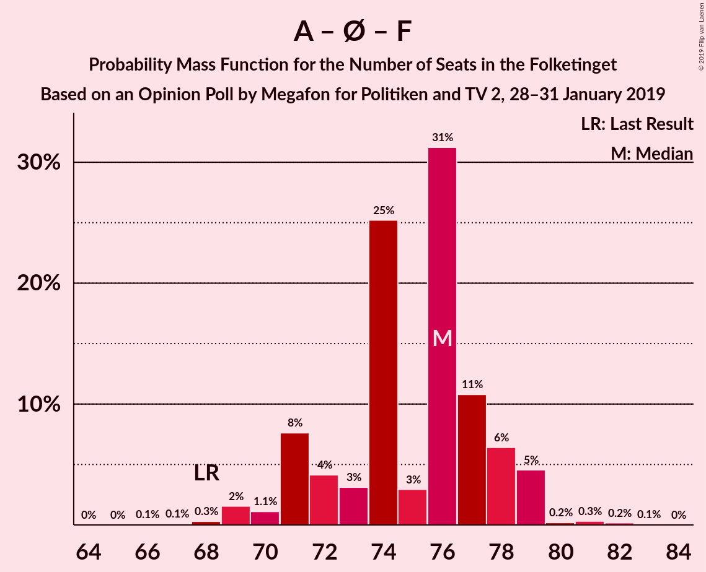

| Number of Seats | Probability | Accumulated | Special Marks |
|:---------------:|:-----------:|:-----------:|:-------------:|
| 66 | 0.2% | 100% |  |
| 67 | 0.1% | 99.8% |  |
| 68 | 2% | 99.8% | Last Result |
| 69 | 0.8% | 98% |  |
| 70 | 6% | 97% |  |
| 71 | 7% | 92% |  |
| 72 | 36% | 85% |  |
| 73 | 4% | 49% |  |
| 74 | 12% | 45% | Median |
| 75 | 5% | 33% |  |
| 76 | 10% | 28% |  |
| 77 | 15% | 18% |  |
| 78 | 2% | 3% |  |
| 79 | 0.7% | 1.3% |  |
| 80 | 0.1% | 0.6% |  |
| 81 | 0.4% | 0.5% |  |
| 82 | 0.1% | 0.2% |  |
| 83 | 0% | 0% |  |

### Socialdemokraterne – Radikale Venstre – Socialistisk Folkeparti

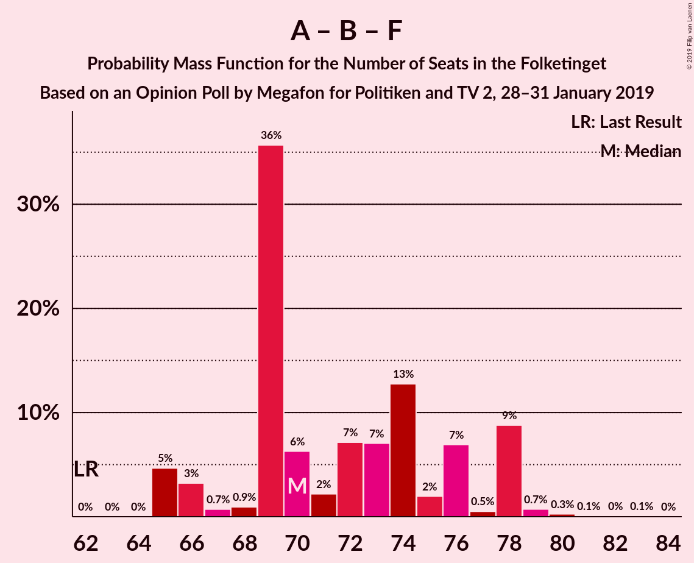

| Number of Seats | Probability | Accumulated | Special Marks |
|:---------------:|:-----------:|:-----------:|:-------------:|
| 62 | 0% | 100% | Last Result |
| 63 | 0% | 100% |  |
| 64 | 0% | 100% |  |
| 65 | 5% | 100% |  |
| 66 | 3% | 95% |  |
| 67 | 0.7% | 92% |  |
| 68 | 0.9% | 91% |  |
| 69 | 36% | 90% |  |
| 70 | 6% | 55% |  |
| 71 | 2% | 48% | Median |
| 72 | 7% | 46% |  |
| 73 | 7% | 39% |  |
| 74 | 13% | 32% |  |
| 75 | 2% | 19% |  |
| 76 | 7% | 17% |  |
| 77 | 0.5% | 10% |  |
| 78 | 9% | 10% |  |
| 79 | 0.7% | 1.1% |  |
| 80 | 0.3% | 0.4% |  |
| 81 | 0.1% | 0.2% |  |
| 82 | 0% | 0.1% |  |
| 83 | 0.1% | 0.1% |  |
| 84 | 0% | 0% |  |

### Socialdemokraterne – Radikale Venstre

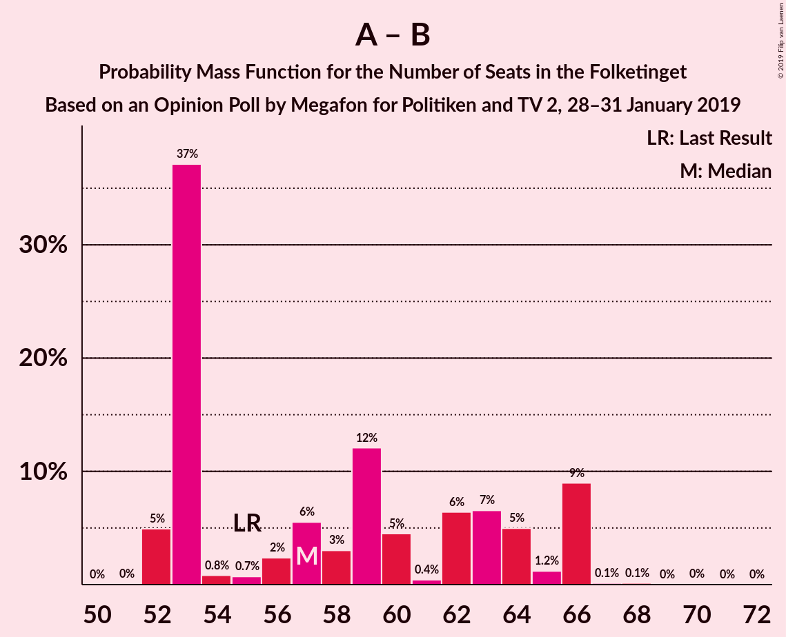

| Number of Seats | Probability | Accumulated | Special Marks |
|:---------------:|:-----------:|:-----------:|:-------------:|
| 52 | 5% | 100% |  |
| 53 | 37% | 95% |  |
| 54 | 0.8% | 58% |  |
| 55 | 0.7% | 57% | Last Result |
| 56 | 2% | 56% |  |
| 57 | 6% | 54% | Median |
| 58 | 3% | 48% |  |
| 59 | 12% | 45% |  |
| 60 | 5% | 33% |  |
| 61 | 0.4% | 29% |  |
| 62 | 6% | 28% |  |
| 63 | 7% | 22% |  |
| 64 | 5% | 15% |  |
| 65 | 1.2% | 11% |  |
| 66 | 9% | 9% |  |
| 67 | 0.1% | 0.3% |  |
| 68 | 0.1% | 0.2% |  |
| 69 | 0% | 0.1% |  |
| 70 | 0% | 0.1% |  |
| 71 | 0% | 0% |  |

### Venstre – Det Konservative Folkeparti – Liberal Alliance

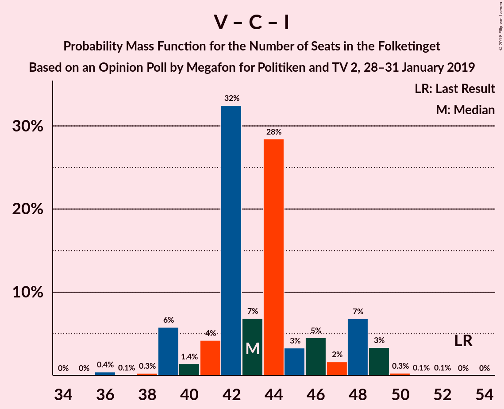

| Number of Seats | Probability | Accumulated | Special Marks |
|:---------------:|:-----------:|:-----------:|:-------------:|
| 36 | 0% | 100% |  |
| 37 | 0.2% | 99.9% |  |
| 38 | 0% | 99.8% |  |
| 39 | 0.3% | 99.7% |  |
| 40 | 5% | 99.4% |  |
| 41 | 3% | 94% |  |
| 42 | 1.4% | 91% |  |
| 43 | 20% | 89% |  |
| 44 | 7% | 69% |  |
| 45 | 7% | 63% |  |
| 46 | 35% | 56% | Median |
| 47 | 15% | 22% |  |
| 48 | 0.6% | 7% |  |
| 49 | 6% | 6% |  |
| 50 | 0.1% | 0.5% |  |
| 51 | 0.3% | 0.4% |  |
| 52 | 0.1% | 0.1% |  |
| 53 | 0% | 0.1% | Last Result |
| 54 | 0% | 0% |  |

### Venstre – Det Konservative Folkeparti

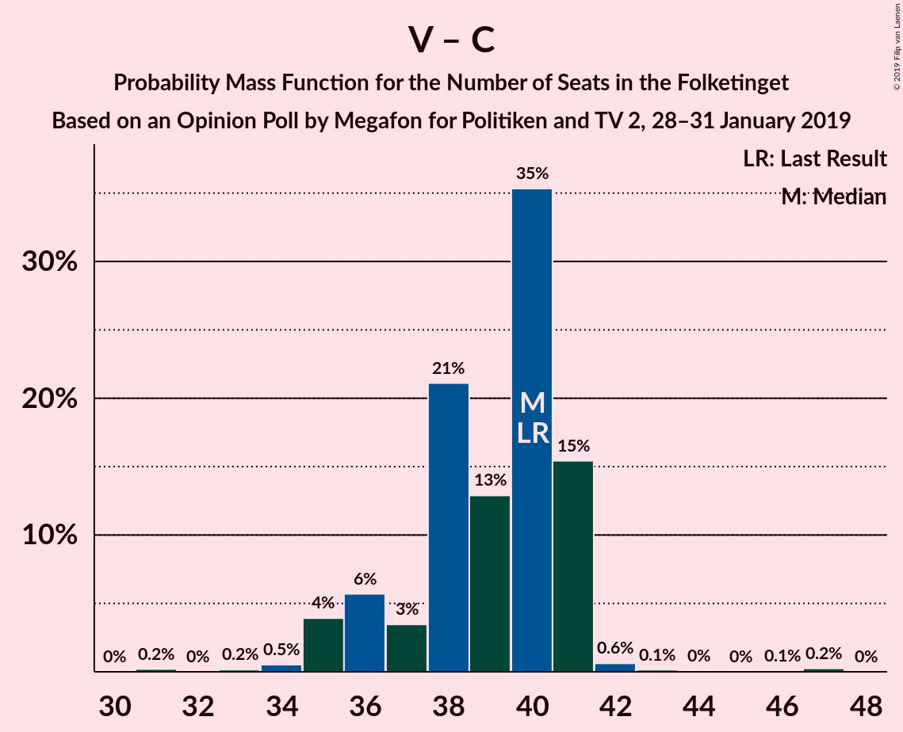

| Number of Seats | Probability | Accumulated | Special Marks |
|:---------------:|:-----------:|:-----------:|:-------------:|
| 31 | 0.2% | 100% |  |
| 32 | 0% | 99.8% |  |
| 33 | 0.2% | 99.7% |  |
| 34 | 0.5% | 99.6% |  |
| 35 | 4% | 99.1% |  |
| 36 | 6% | 95% |  |
| 37 | 3% | 89% |  |
| 38 | 21% | 86% |  |
| 39 | 13% | 65% |  |
| 40 | 35% | 52% | Last Result, Median |
| 41 | 15% | 17% |  |
| 42 | 0.6% | 1.2% |  |
| 43 | 0.1% | 0.6% |  |
| 44 | 0% | 0.4% |  |
| 45 | 0% | 0.4% |  |
| 46 | 0.1% | 0.4% |  |
| 47 | 0.2% | 0.3% |  |
| 48 | 0% | 0% |  |

### Venstre

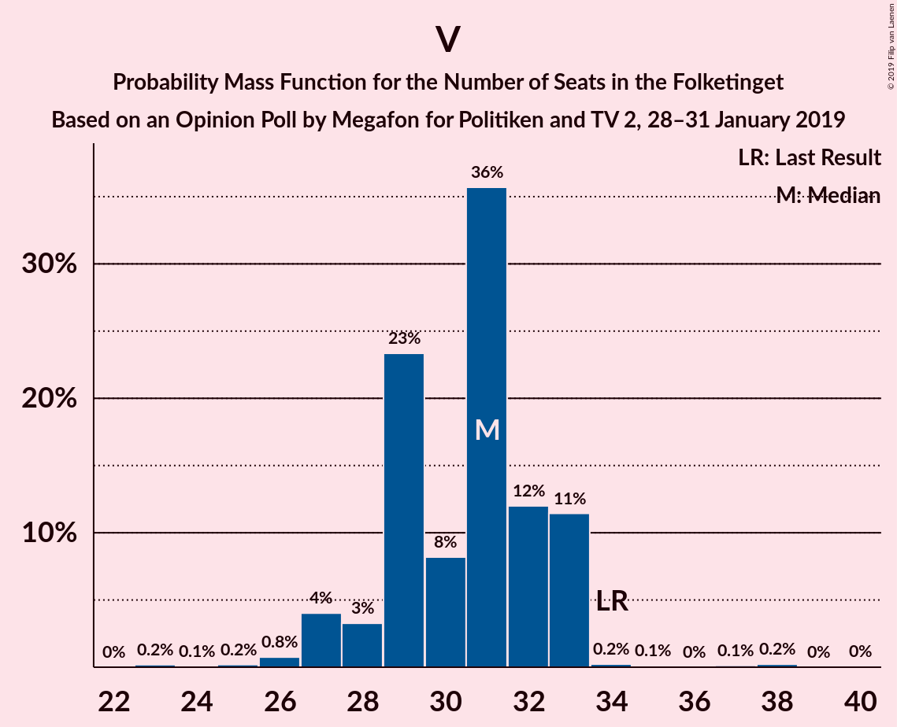

| Number of Seats | Probability | Accumulated | Special Marks |
|:---------------:|:-----------:|:-----------:|:-------------:|
| 23 | 0.2% | 100% |  |
| 24 | 0.1% | 99.8% |  |
| 25 | 0.2% | 99.7% |  |
| 26 | 0.8% | 99.5% |  |
| 27 | 4% | 98.8% |  |
| 28 | 3% | 95% |  |
| 29 | 23% | 91% |  |
| 30 | 8% | 68% |  |
| 31 | 36% | 60% | Median |
| 32 | 12% | 24% |  |
| 33 | 11% | 12% |  |
| 34 | 0.2% | 0.8% | Last Result |
| 35 | 0.1% | 0.5% |  |
| 36 | 0% | 0.4% |  |
| 37 | 0.1% | 0.4% |  |
| 38 | 0.2% | 0.3% |  |
| 39 | 0% | 0.1% |  |
| 40 | 0% | 0% |  |

## Technical Information

### Opinion Poll

+ **Polling firm:** Megafon
+ **Commissioner(s):** Politiken and TV 2
+ **Fieldwork period:** 28–31 January 2019

### Calculations

+ **Sample size:** 1007
+ **Simulations done:** 131,072
+ **Error estimate:** 5.79%

