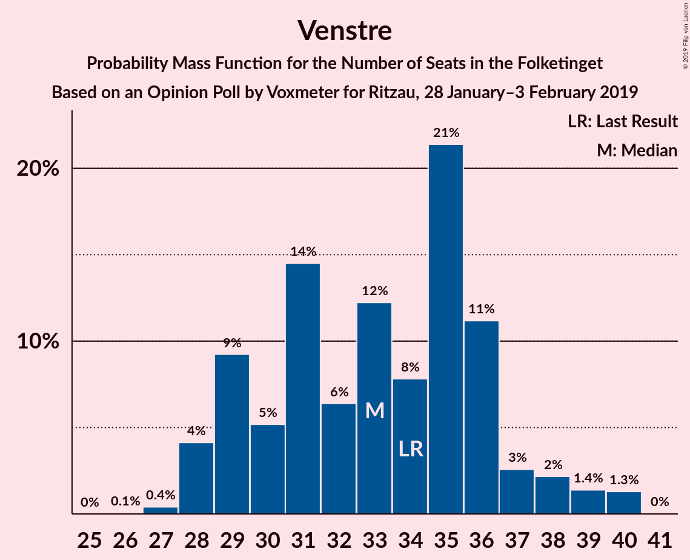
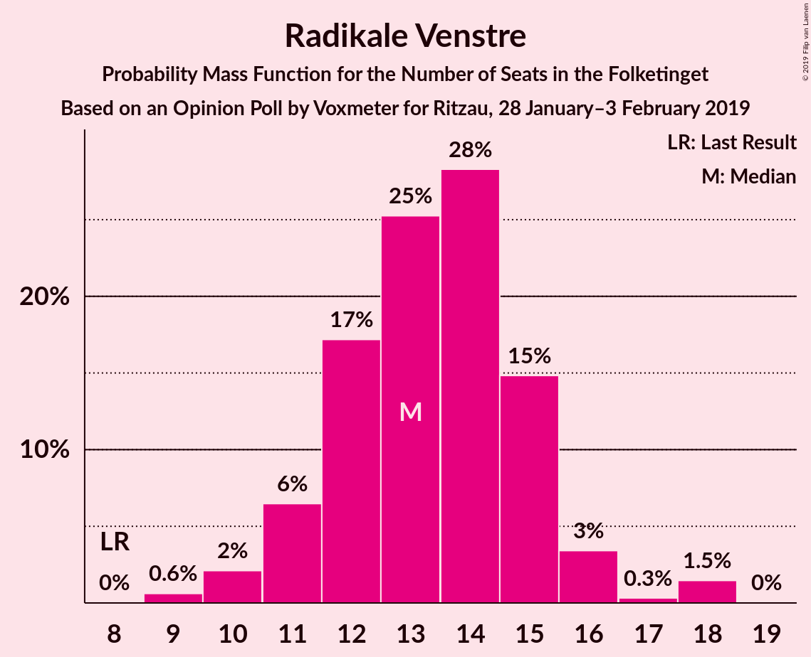
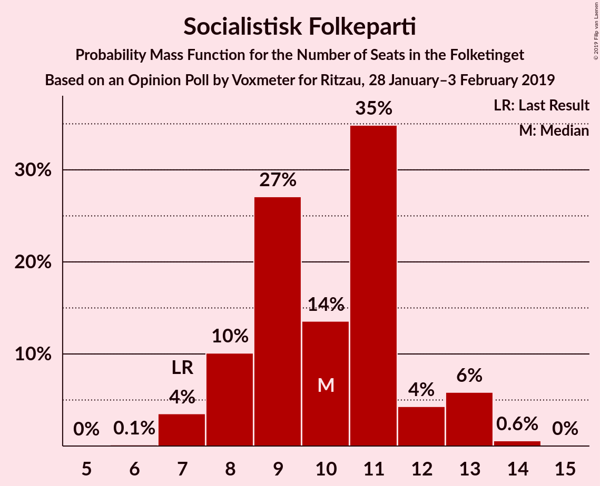
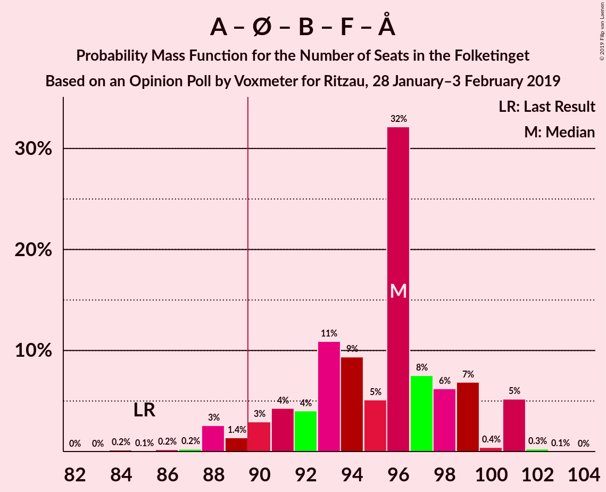
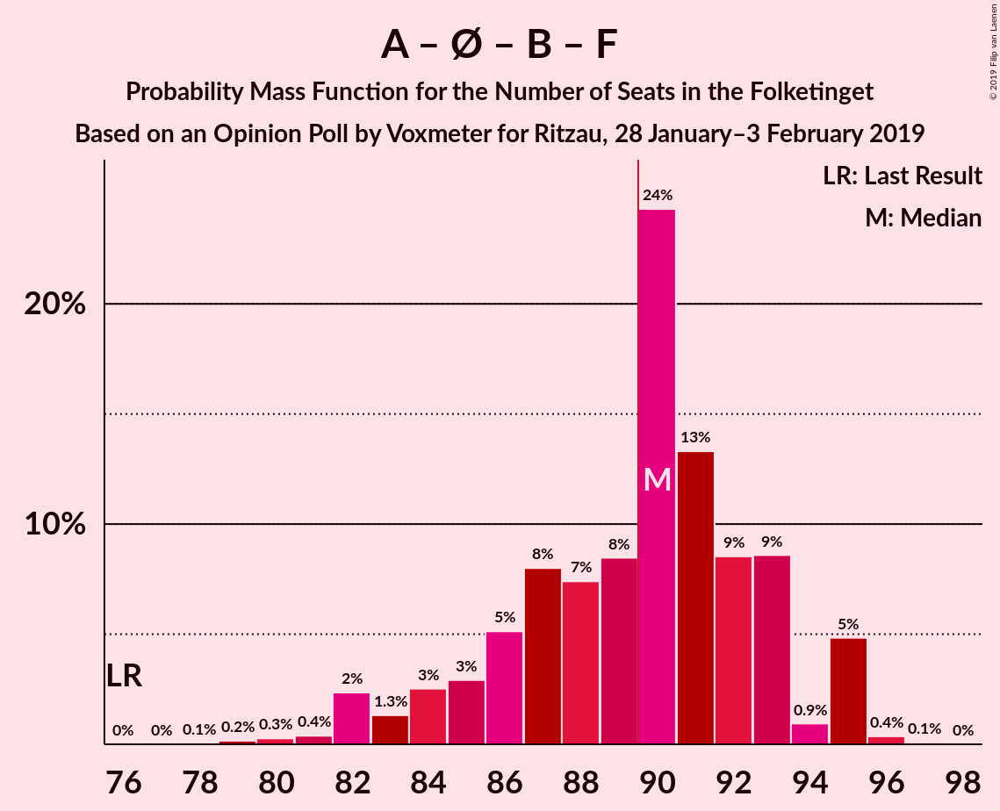
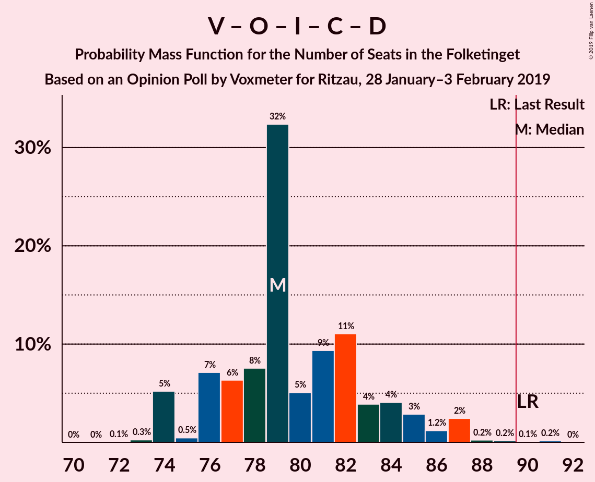
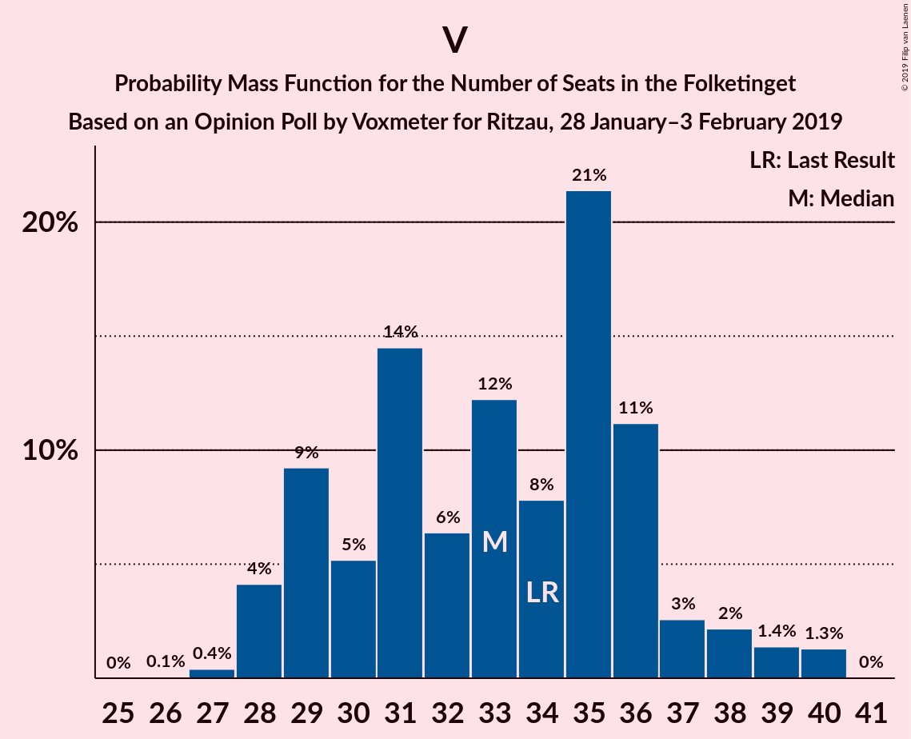

# Opinion Poll by Voxmeter for Ritzau, 28 January–3 February 2019

<a href="#voting-intentions">Voting Intentions</a> | <a href="#seats">Seats</a> | <a href="#coalitions">Coalitions</a> | <a href="#technical-information">Technical Information</a>

## Voting Intentions

### Confidence Intervals

| Party | Last Result | Poll Result | 80% Confidence Interval | 90% Confidence Interval | 95% Confidence Interval | 99% Confidence Interval |
|:-----:|:-----------:|:-----------:|:-----------------------:|:-----------------------:|:-----------------------:|:-----------------------:|
| Socialdemokraterne | 26.3% | 27.5% | 25.7–29.3% |25.3–29.8% |24.8–30.3% |24.0–31.1% |
| Venstre | 19.5% | 18.4% | 16.9–20.0% |16.5–20.4% |16.1–20.9% |15.5–21.6% |
| Dansk Folkeparti | 21.1% | 16.2% | 14.8–17.7% |14.4–18.2% |14.1–18.5% |13.4–19.3% |
| Enhedslisten–De Rød-Grønne | 7.8% | 9.0% | 7.9–10.2% |7.7–10.6% |7.4–10.9% |6.9–11.5% |
| Radikale Venstre | 4.6% | 7.2% | 6.2–8.3% |6.0–8.6% |5.8–8.9% |5.3–9.5% |
| Socialistisk Folkeparti | 4.2% | 5.5% | 4.6–6.5% |4.4–6.8% |4.2–7.0% |3.9–7.5% |
| Liberal Alliance | 7.5% | 5.3% | 4.5–6.3% |4.3–6.5% |4.1–6.8% |3.7–7.3% |
| Det Konservative Folkeparti | 3.4% | 4.2% | 3.5–5.1% |3.3–5.4% |3.2–5.6% |2.8–6.1% |
| Alternativet | 4.8% | 3.2% | 2.6–4.0% |2.4–4.2% |2.3–4.4% |2.0–4.8% |
| Nye Borgerlige | 0.0% | 2.0% | 1.6–2.7% |1.4–2.9% |1.3–3.1% |1.1–3.4% |
| Kristendemokraterne | 0.8% | 1.1% | 0.7–1.6% |0.7–1.7% |0.6–1.9% |0.5–2.2% |

*Note:* The poll result column reflects the actual value used in the calculations. Published results may vary slightly, and in addition be rounded to fewer digits.

## Seats

### Confidence Intervals

| Party | Last Result | Median | 80% Confidence Interval | 90% Confidence Interval | 95% Confidence Interval | 99% Confidence Interval |
|:-----:|:-----------:|:------:|:-----------------------:|:-----------------------:|:-----------------------:|:-----------------------:|
| <a href="#socialdemokraterne">Socialdemokraterne</a> | 47 | 49 | 49 |49 |49 |46–52 |
| <a href="#venstre">Venstre</a> | 34 | 33 | 33 |33 |33 |26–34 |
| <a href="#dansk-folkeparti">Dansk Folkeparti</a> | 37 | 24 | 24 |24 |24 |24–29 |
| <a href="#enhedslisten–de-rød-grønne">Enhedslisten–De Rød-Grønne</a> | 14 | 17 | 17 |17 |17 |14–19 |
| <a href="#radikale-venstre">Radikale Venstre</a> | 8 | 15 | 15 |15 |15 |8–17 |
| <a href="#socialistisk-folkeparti">Socialistisk Folkeparti</a> | 7 | 9 | 9 |9 |9 |9–12 |
| <a href="#liberal-alliance">Liberal Alliance</a> | 13 | 11 | 11 |11 |11 |10–12 |
| <a href="#det-konservative-folkeparti">Det Konservative Folkeparti</a> | 6 | 9 | 9 |9 |9 |8–9 |
| <a href="#alternativet">Alternativet</a> | 9 | 4 | 4 |4 |4 |4–5 |
| <a href="#nye-borgerlige">Nye Borgerlige</a> | 0 | 4 | 4 |4 |4 |3–5 |
| <a href="#kristendemokraterne">Kristendemokraterne</a> | 0 | 0 | 0 |0 |0 |0 |

### Socialdemokraterne

*For a full overview of the results for this party, see the [Socialdemokraterne](party-socialdemokraterne.html) page.*

| Number of Seats | Probability | Accumulated | Special Marks |
|:---------------:|:-----------:|:-----------:|:-------------:|
| 45 | 0.1% | 100% |  |
| 46 | 0.6% | 99.9% |  |
| 47 | 0% | 99.3% | Last Result |
| 48 | 0.1% | 99.3% |  |
| 49 | 98% | 99.2% | Median |
| 50 | 0% | 0.8% |  |
| 51 | 0% | 0.8% |  |
| 52 | 0.8% | 0.8% |  |
| 53 | 0% | 0% |  |

### Venstre

*For a full overview of the results for this party, see the [Venstre](party-venstre.html) page.*

| Number of Seats | Probability | Accumulated | Special Marks |
|:---------------:|:-----------:|:-----------:|:-------------:|
| 26 | 0.7% | 100% |  |
| 27 | 0% | 99.3% |  |
| 28 | 0% | 99.3% |  |
| 29 | 0% | 99.3% |  |
| 30 | 0% | 99.2% |  |
| 31 | 0.1% | 99.2% |  |
| 32 | 0% | 99.1% |  |
| 33 | 98% | 99.1% | Median |
| 34 | 0.8% | 0.8% | Last Result |
| 35 | 0% | 0% |  |

### Dansk Folkeparti

*For a full overview of the results for this party, see the [Dansk Folkeparti](party-danskfolkeparti.html) page.*

| Number of Seats | Probability | Accumulated | Special Marks |
|:---------------:|:-----------:|:-----------:|:-------------:|
| 24 | 98% | 100% | Median |
| 25 | 0% | 2% |  |
| 26 | 0% | 2% |  |
| 27 | 0.8% | 2% |  |
| 28 | 0% | 0.9% |  |
| 29 | 0.6% | 0.9% |  |
| 30 | 0.1% | 0.3% |  |
| 31 | 0% | 0.1% |  |
| 32 | 0% | 0.1% |  |
| 33 | 0% | 0.1% |  |
| 34 | 0% | 0.1% |  |
| 35 | 0.1% | 0.1% |  |
| 36 | 0% | 0% |  |
| 37 | 0% | 0% | Last Result |

### Enhedslisten–De Rød-Grønne

*For a full overview of the results for this party, see the [Enhedslisten–De Rød-Grønne](party-enhedslisten–derød-grønne.html) page.*

| Number of Seats | Probability | Accumulated | Special Marks |
|:---------------:|:-----------:|:-----------:|:-------------:|
| 12 | 0.1% | 100% |  |
| 13 | 0% | 99.9% |  |
| 14 | 0.8% | 99.9% | Last Result |
| 15 | 0.1% | 99.1% |  |
| 16 | 0% | 99.0% |  |
| 17 | 98% | 99.0% | Median |
| 18 | 0% | 0.7% |  |
| 19 | 0.6% | 0.7% |  |
| 20 | 0% | 0% |  |

### Radikale Venstre

*For a full overview of the results for this party, see the [Radikale Venstre](party-radikalevenstre.html) page.*

| Number of Seats | Probability | Accumulated | Special Marks |
|:---------------:|:-----------:|:-----------:|:-------------:|
| 8 | 0.8% | 100% | Last Result |
| 9 | 0% | 99.2% |  |
| 10 | 0% | 99.2% |  |
| 11 | 0.1% | 99.2% |  |
| 12 | 0% | 99.1% |  |
| 13 | 0% | 99.1% |  |
| 14 | 0% | 99.1% |  |
| 15 | 98% | 99.1% | Median |
| 16 | 0% | 0.7% |  |
| 17 | 0.7% | 0.7% |  |
| 18 | 0% | 0% |  |

### Socialistisk Folkeparti

*For a full overview of the results for this party, see the [Socialistisk Folkeparti](party-socialistiskfolkeparti.html) page.*

| Number of Seats | Probability | Accumulated | Special Marks |
|:---------------:|:-----------:|:-----------:|:-------------:|
| 7 | 0.1% | 100% | Last Result |
| 8 | 0% | 99.9% |  |
| 9 | 98% | 99.9% | Median |
| 10 | 0% | 1.5% |  |
| 11 | 0.6% | 1.5% |  |
| 12 | 0.8% | 0.9% |  |
| 13 | 0% | 0% |  |

### Liberal Alliance

*For a full overview of the results for this party, see the [Liberal Alliance](party-liberalalliance.html) page.*

| Number of Seats | Probability | Accumulated | Special Marks |
|:---------------:|:-----------:|:-----------:|:-------------:|
| 9 | 0.1% | 100% |  |
| 10 | 0.7% | 99.9% |  |
| 11 | 98% | 99.3% | Median |
| 12 | 0.8% | 0.8% |  |
| 13 | 0% | 0% | Last Result |

### Det Konservative Folkeparti

*For a full overview of the results for this party, see the [Det Konservative Folkeparti](party-detkonservativefolkeparti.html) page.*

| Number of Seats | Probability | Accumulated | Special Marks |
|:---------------:|:-----------:|:-----------:|:-------------:|
| 6 | 0% | 100% | Last Result |
| 7 | 0% | 99.9% |  |
| 8 | 1.4% | 99.9% |  |
| 9 | 98.5% | 98.5% | Median |
| 10 | 0% | 0% |  |

### Alternativet

*For a full overview of the results for this party, see the [Alternativet](party-alternativet.html) page.*

| Number of Seats | Probability | Accumulated | Special Marks |
|:---------------:|:-----------:|:-----------:|:-------------:|
| 4 | 99.0% | 100% | Median |
| 5 | 0.8% | 1.0% |  |
| 6 | 0.2% | 0.3% |  |
| 7 | 0.1% | 0.1% |  |
| 8 | 0% | 0% |  |
| 9 | 0% | 0% | Last Result |

### Nye Borgerlige

*For a full overview of the results for this party, see the [Nye Borgerlige](party-nyeborgerlige.html) page.*

| Number of Seats | Probability | Accumulated | Special Marks |
|:---------------:|:-----------:|:-----------:|:-------------:|
| 0 | 0.1% | 100% | Last Result |
| 1 | 0% | 99.9% |  |
| 2 | 0% | 99.9% |  |
| 3 | 0.8% | 99.9% |  |
| 4 | 98% | 99.1% | Median |
| 5 | 0.7% | 0.7% |  |
| 6 | 0% | 0% |  |

### Kristendemokraterne

*For a full overview of the results for this party, see the [Kristendemokraterne](party-kristendemokraterne.html) page.*

| Number of Seats | Probability | Accumulated | Special Marks |
|:---------------:|:-----------:|:-----------:|:-------------:|
| 0 | 99.9% | 100% | Last Result, Median |
| 1 | 0% | 0.1% |  |
| 2 | 0% | 0.1% |  |
| 3 | 0% | 0.1% |  |
| 4 | 0% | 0.1% |  |
| 5 | 0.1% | 0.1% |  |
| 6 | 0% | 0% |  |

## Coalitions

### Confidence Intervals

| Coalition | Last Result | Median | Majority? | 80% Confidence Interval | 90% Confidence Interval | 95% Confidence Interval | 99% Confidence Interval |
|:---------:|:-----------:|:------:|:---------:|:-----------------------:|:-----------------------:|:-----------------------:|:-----------------------:|
| Socialdemokraterne – Enhedslisten–De Rød-Grønne – Radikale Venstre – Socialistisk Folkeparti – Alternativet | 85 | 94 | 99.9% | 94 | 94 | 94 | 91–97 |
| Socialdemokraterne – Enhedslisten–De Rød-Grønne – Radikale Venstre – Socialistisk Folkeparti | 76 | 90 | 99.0% | 90 | 90 | 90 | 86–93 |
| Venstre – Dansk Folkeparti – Liberal Alliance – Det Konservative Folkeparti – Nye Borgerlige – Kristendemokraterne | 90 | 81 | 0.1% | 81 | 81 | 81 | 78–84 |
| Venstre – Dansk Folkeparti – Liberal Alliance – Det Konservative Folkeparti – Nye Borgerlige | 90 | 81 | 0% | 81 | 81 | 81 | 78–84 |
| Socialdemokraterne – Enhedslisten–De Rød-Grønne – Socialistisk Folkeparti – Alternativet | 77 | 79 | 0% | 79 | 79 | 79 | 79–83 |
| Venstre – Dansk Folkeparti – Liberal Alliance – Det Konservative Folkeparti – Kristendemokraterne | 90 | 77 | 0% | 77 | 77 | 77 | 73–81 |
| Venstre – Dansk Folkeparti – Liberal Alliance – Det Konservative Folkeparti | 90 | 77 | 0% | 77 | 77 | 77 | 73–81 |
| Socialdemokraterne – Enhedslisten–De Rød-Grønne – Socialistisk Folkeparti | 68 | 75 | 0% | 75 | 75 | 75 | 75–78 |
| Socialdemokraterne – Radikale Venstre – Socialistisk Folkeparti | 62 | 73 | 0% | 73 | 73 | 73 | 72–74 |
| Socialdemokraterne – Radikale Venstre | 55 | 64 | 0% | 64 | 64 | 64 | 60–64 |
| Venstre – Liberal Alliance – Det Konservative Folkeparti | 53 | 53 | 0% | 53 | 53 | 53 | 44–54 |
| Venstre – Det Konservative Folkeparti | 40 | 42 | 0% | 42 | 42 | 42 | 34–42 |
| Venstre | 34 | 33 | 0% | 33 | 33 | 33 | 26–34 |

### Socialdemokraterne – Enhedslisten–De Rød-Grønne – Radikale Venstre – Socialistisk Folkeparti – Alternativet

| Number of Seats | Probability | Accumulated | Special Marks |
|:---------------:|:-----------:|:-----------:|:-------------:|
| 85 | 0.1% | 100% | Last Result |
| 86 | 0% | 99.9% |  |
| 87 | 0% | 99.9% |  |
| 88 | 0% | 99.9% |  |
| 89 | 0% | 99.9% |  |
| 90 | 0% | 99.9% | Majority |
| 91 | 0.8% | 99.9% |  |
| 92 | 0% | 99.1% |  |
| 93 | 0% | 99.1% |  |
| 94 | 98% | 99.1% | Median |
| 95 | 0% | 0.7% |  |
| 96 | 0.1% | 0.7% |  |
| 97 | 0.6% | 0.6% |  |
| 98 | 0% | 0% |  |

### Socialdemokraterne – Enhedslisten–De Rød-Grønne – Radikale Venstre – Socialistisk Folkeparti

| Number of Seats | Probability | Accumulated | Special Marks |
|:---------------:|:-----------:|:-----------:|:-------------:|
| 76 | 0% | 100% | Last Result |
| 77 | 0% | 100% |  |
| 78 | 0% | 100% |  |
| 79 | 0.1% | 100% |  |
| 80 | 0% | 99.9% |  |
| 81 | 0% | 99.9% |  |
| 82 | 0% | 99.9% |  |
| 83 | 0% | 99.9% |  |
| 84 | 0% | 99.9% |  |
| 85 | 0% | 99.9% |  |
| 86 | 0.8% | 99.9% |  |
| 87 | 0% | 99.1% |  |
| 88 | 0% | 99.1% |  |
| 89 | 0.1% | 99.1% |  |
| 90 | 98% | 99.0% | Median, Majority |
| 91 | 0% | 0.7% |  |
| 92 | 0% | 0.6% |  |
| 93 | 0.6% | 0.6% |  |
| 94 | 0% | 0% |  |

### Venstre – Dansk Folkeparti – Liberal Alliance – Det Konservative Folkeparti – Nye Borgerlige – Kristendemokraterne

| Number of Seats | Probability | Accumulated | Special Marks |
|:---------------:|:-----------:|:-----------:|:-------------:|
| 78 | 0.6% | 100% |  |
| 79 | 0.1% | 99.3% |  |
| 80 | 0% | 99.3% |  |
| 81 | 98% | 99.3% | Median |
| 82 | 0% | 0.9% |  |
| 83 | 0% | 0.9% |  |
| 84 | 0.8% | 0.9% |  |
| 85 | 0% | 0.1% |  |
| 86 | 0% | 0.1% |  |
| 87 | 0% | 0.1% |  |
| 88 | 0% | 0.1% |  |
| 89 | 0% | 0.1% |  |
| 90 | 0.1% | 0.1% | Last Result, Majority |
| 91 | 0% | 0% |  |

### Venstre – Dansk Folkeparti – Liberal Alliance – Det Konservative Folkeparti – Nye Borgerlige

| Number of Seats | Probability | Accumulated | Special Marks |
|:---------------:|:-----------:|:-----------:|:-------------:|
| 78 | 0.6% | 100% |  |
| 79 | 0.1% | 99.3% |  |
| 80 | 0% | 99.3% |  |
| 81 | 98% | 99.3% | Median |
| 82 | 0% | 0.9% |  |
| 83 | 0% | 0.9% |  |
| 84 | 0.8% | 0.9% |  |
| 85 | 0.1% | 0.1% |  |
| 86 | 0% | 0% |  |
| 87 | 0% | 0% |  |
| 88 | 0% | 0% |  |
| 89 | 0% | 0% |  |
| 90 | 0% | 0% | Last Result, Majority |

### Socialdemokraterne – Enhedslisten–De Rød-Grønne – Socialistisk Folkeparti – Alternativet

| Number of Seats | Probability | Accumulated | Special Marks |
|:---------------:|:-----------:|:-----------:|:-------------:|
| 74 | 0.1% | 100% |  |
| 75 | 0% | 99.9% |  |
| 76 | 0% | 99.9% |  |
| 77 | 0% | 99.9% | Last Result |
| 78 | 0% | 99.9% |  |
| 79 | 98% | 99.9% | Median |
| 80 | 0.6% | 1.5% |  |
| 81 | 0% | 0.8% |  |
| 82 | 0% | 0.8% |  |
| 83 | 0.8% | 0.8% |  |
| 84 | 0% | 0% |  |

### Venstre – Dansk Folkeparti – Liberal Alliance – Det Konservative Folkeparti – Kristendemokraterne

| Number of Seats | Probability | Accumulated | Special Marks |
|:---------------:|:-----------:|:-----------:|:-------------:|
| 73 | 0.6% | 100% |  |
| 74 | 0% | 99.4% |  |
| 75 | 0% | 99.4% |  |
| 76 | 0% | 99.4% |  |
| 77 | 98% | 99.4% | Median |
| 78 | 0% | 1.0% |  |
| 79 | 0.1% | 1.0% |  |
| 80 | 0% | 0.9% |  |
| 81 | 0.8% | 0.9% |  |
| 82 | 0% | 0.1% |  |
| 83 | 0% | 0.1% |  |
| 84 | 0% | 0.1% |  |
| 85 | 0% | 0.1% |  |
| 86 | 0.1% | 0.1% |  |
| 87 | 0% | 0% |  |
| 88 | 0% | 0% |  |
| 89 | 0% | 0% |  |
| 90 | 0% | 0% | Last Result, Majority |

### Venstre – Dansk Folkeparti – Liberal Alliance – Det Konservative Folkeparti

| Number of Seats | Probability | Accumulated | Special Marks |
|:---------------:|:-----------:|:-----------:|:-------------:|
| 73 | 0.6% | 100% |  |
| 74 | 0% | 99.4% |  |
| 75 | 0% | 99.4% |  |
| 76 | 0% | 99.4% |  |
| 77 | 98% | 99.4% | Median |
| 78 | 0% | 1.0% |  |
| 79 | 0.1% | 1.0% |  |
| 80 | 0% | 0.9% |  |
| 81 | 0.9% | 0.9% |  |
| 82 | 0% | 0% |  |
| 83 | 0% | 0% |  |
| 84 | 0% | 0% |  |
| 85 | 0% | 0% |  |
| 86 | 0% | 0% |  |
| 87 | 0% | 0% |  |
| 88 | 0% | 0% |  |
| 89 | 0% | 0% |  |
| 90 | 0% | 0% | Last Result, Majority |

### Socialdemokraterne – Enhedslisten–De Rød-Grønne – Socialistisk Folkeparti

| Number of Seats | Probability | Accumulated | Special Marks |
|:---------------:|:-----------:|:-----------:|:-------------:|
| 68 | 0.1% | 100% | Last Result |
| 69 | 0% | 99.9% |  |
| 70 | 0% | 99.9% |  |
| 71 | 0% | 99.9% |  |
| 72 | 0.1% | 99.9% |  |
| 73 | 0% | 99.8% |  |
| 74 | 0% | 99.8% |  |
| 75 | 98% | 99.8% | Median |
| 76 | 0.6% | 1.4% |  |
| 77 | 0.1% | 0.8% |  |
| 78 | 0.8% | 0.8% |  |
| 79 | 0% | 0% |  |

### Socialdemokraterne – Radikale Venstre – Socialistisk Folkeparti

| Number of Seats | Probability | Accumulated | Special Marks |
|:---------------:|:-----------:|:-----------:|:-------------:|
| 62 | 0% | 100% | Last Result |
| 63 | 0% | 100% |  |
| 64 | 0% | 100% |  |
| 65 | 0% | 100% |  |
| 66 | 0% | 100% |  |
| 67 | 0.1% | 100% |  |
| 68 | 0% | 99.9% |  |
| 69 | 0% | 99.9% |  |
| 70 | 0% | 99.9% |  |
| 71 | 0% | 99.9% |  |
| 72 | 0.8% | 99.8% |  |
| 73 | 98% | 99.0% | Median |
| 74 | 0.7% | 0.7% |  |
| 75 | 0% | 0% |  |

### Socialdemokraterne – Radikale Venstre

| Number of Seats | Probability | Accumulated | Special Marks |
|:---------------:|:-----------:|:-----------:|:-------------:|
| 55 | 0% | 100% | Last Result |
| 56 | 0% | 100% |  |
| 57 | 0% | 100% |  |
| 58 | 0% | 100% |  |
| 59 | 0% | 100% |  |
| 60 | 0.9% | 100% |  |
| 61 | 0% | 99.1% |  |
| 62 | 0.1% | 99.1% |  |
| 63 | 0.6% | 99.0% |  |
| 64 | 98% | 98% | Median |
| 65 | 0% | 0% |  |

### Venstre – Liberal Alliance – Det Konservative Folkeparti

| Number of Seats | Probability | Accumulated | Special Marks |
|:---------------:|:-----------:|:-----------:|:-------------:|
| 44 | 0.7% | 100% |  |
| 45 | 0% | 99.3% |  |
| 46 | 0% | 99.3% |  |
| 47 | 0% | 99.2% |  |
| 48 | 0% | 99.2% |  |
| 49 | 0% | 99.2% |  |
| 50 | 0% | 99.2% |  |
| 51 | 0.1% | 99.2% |  |
| 52 | 0% | 99.1% |  |
| 53 | 98% | 99.1% | Last Result, Median |
| 54 | 0.8% | 0.8% |  |
| 55 | 0% | 0% |  |

### Venstre – Det Konservative Folkeparti

| Number of Seats | Probability | Accumulated | Special Marks |
|:---------------:|:-----------:|:-----------:|:-------------:|
| 34 | 0.7% | 100% |  |
| 35 | 0.1% | 99.3% |  |
| 36 | 0% | 99.2% |  |
| 37 | 0% | 99.2% |  |
| 38 | 0% | 99.2% |  |
| 39 | 0% | 99.2% |  |
| 40 | 0.1% | 99.2% | Last Result |
| 41 | 0% | 99.1% |  |
| 42 | 99.1% | 99.1% | Median |
| 43 | 0% | 0% |  |

### Venstre

| Number of Seats | Probability | Accumulated | Special Marks |
|:---------------:|:-----------:|:-----------:|:-------------:|
| 26 | 0.7% | 100% |  |
| 27 | 0% | 99.3% |  |
| 28 | 0% | 99.3% |  |
| 29 | 0% | 99.3% |  |
| 30 | 0% | 99.2% |  |
| 31 | 0.1% | 99.2% |  |
| 32 | 0% | 99.1% |  |
| 33 | 98% | 99.1% | Median |
| 34 | 0.8% | 0.8% | Last Result |
| 35 | 0% | 0% |  |

## Technical Information

### Opinion Poll

+ **Polling firm:** Voxmeter
+ **Commissioner(s):** Ritzau
+ **Fieldwork period:** 28 January–3 February 2019

### Calculations

+ **Sample size:** 1045
+ **Simulations done:** 1,024
+ **Error estimate:** 3.89%

