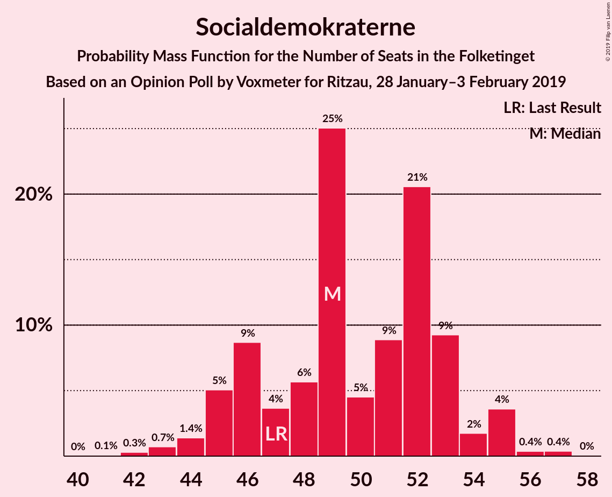
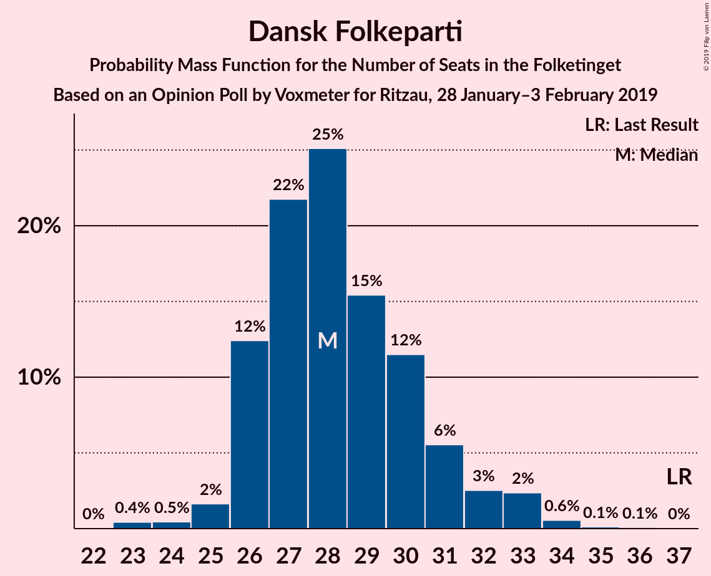
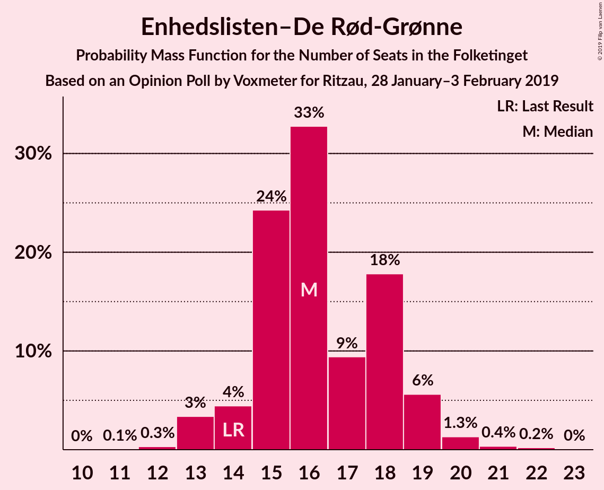
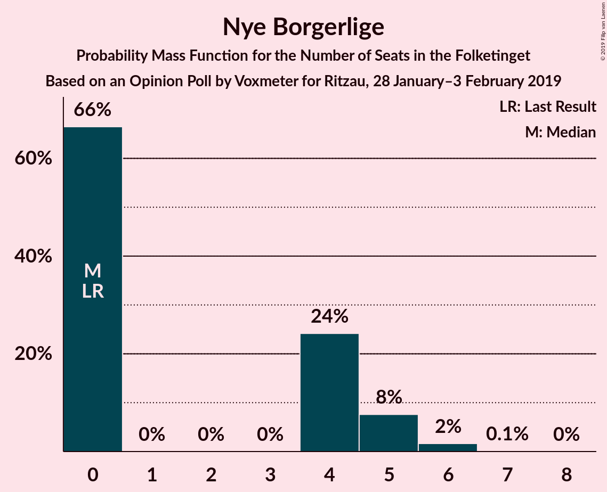
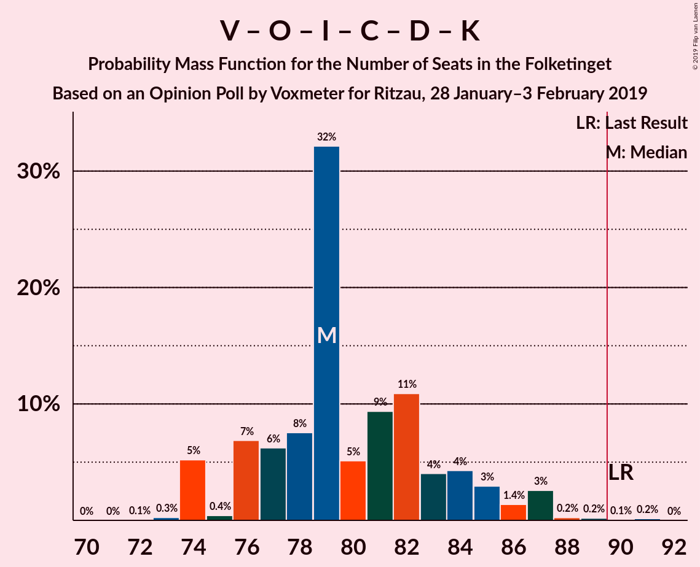
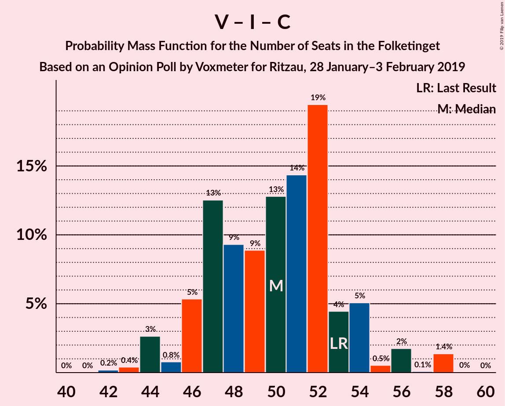

# Opinion Poll by Voxmeter for Ritzau, 28 January–3 February 2019

<a href="#voting-intentions">Voting Intentions</a> | <a href="#seats">Seats</a> | <a href="#coalitions">Coalitions</a> | <a href="#technical-information">Technical Information</a>

## Voting Intentions

### Confidence Intervals

| Party | Last Result | Poll Result | 80% Confidence Interval | 90% Confidence Interval | 95% Confidence Interval | 99% Confidence Interval |
|:-----:|:-----------:|:-----------:|:-----------------------:|:-----------------------:|:-----------------------:|:-----------------------:|
| Socialdemokraterne | 26.3% | 27.5% | 25.7–29.3% |25.3–29.8% |24.8–30.3% |24.0–31.1% |
| Venstre | 19.5% | 18.4% | 16.9–20.0% |16.5–20.4% |16.1–20.9% |15.5–21.6% |
| Dansk Folkeparti | 21.1% | 16.2% | 14.8–17.7% |14.4–18.2% |14.1–18.5% |13.4–19.3% |
| Enhedslisten–De Rød-Grønne | 7.8% | 9.0% | 7.9–10.2% |7.7–10.6% |7.4–10.9% |6.9–11.5% |
| Radikale Venstre | 4.6% | 7.2% | 6.2–8.3% |6.0–8.6% |5.8–8.9% |5.3–9.5% |
| Socialistisk Folkeparti | 4.2% | 5.5% | 4.6–6.5% |4.4–6.8% |4.2–7.0% |3.9–7.5% |
| Liberal Alliance | 7.5% | 5.3% | 4.5–6.3% |4.3–6.5% |4.1–6.8% |3.7–7.3% |
| Det Konservative Folkeparti | 3.4% | 4.2% | 3.5–5.1% |3.3–5.4% |3.2–5.6% |2.8–6.1% |
| Alternativet | 4.8% | 3.2% | 2.6–4.0% |2.4–4.2% |2.3–4.4% |2.0–4.8% |
| Nye Borgerlige | 0.0% | 2.0% | 1.6–2.7% |1.4–2.9% |1.3–3.1% |1.1–3.4% |
| Kristendemokraterne | 0.8% | 1.1% | 0.7–1.6% |0.7–1.7% |0.6–1.9% |0.5–2.2% |

*Note:* The poll result column reflects the actual value used in the calculations. Published results may vary slightly, and in addition be rounded to fewer digits.

## Seats

### Confidence Intervals

| Party | Last Result | Median | 80% Confidence Interval | 90% Confidence Interval | 95% Confidence Interval | 99% Confidence Interval |
|:-----:|:-----------:|:------:|:-----------------------:|:-----------------------:|:-----------------------:|:-----------------------:|
| <a href="#socialdemokraterne">Socialdemokraterne</a> | 47 | 52 | 49–52 |45–52 |45–52 |43–57 |
| <a href="#venstre">Venstre</a> | 34 | 35 | 28–36 |28–38 |28–38 |28–38 |
| <a href="#dansk-folkeparti">Dansk Folkeparti</a> | 37 | 28 | 26–30 |26–30 |26–32 |25–33 |
| <a href="#enhedslisten–de-rød-grønne">Enhedslisten–De Rød-Grønne</a> | 14 | 15 | 15–18 |15–19 |15–19 |14–20 |
| <a href="#radikale-venstre">Radikale Venstre</a> | 8 | 13 | 12–15 |12–15 |11–15 |10–16 |
| <a href="#socialistisk-folkeparti">Socialistisk Folkeparti</a> | 7 | 11 | 9–13 |9–13 |9–13 |7–13 |
| <a href="#liberal-alliance">Liberal Alliance</a> | 13 | 9 | 8–10 |8–10 |8–10 |7–12 |
| <a href="#det-konservative-folkeparti">Det Konservative Folkeparti</a> | 6 | 8 | 6–8 |6–9 |6–9 |6–10 |
| <a href="#alternativet">Alternativet</a> | 9 | 5 | 5–7 |5–7 |4–7 |4–7 |
| <a href="#nye-borgerlige">Nye Borgerlige</a> | 0 | 0 | 0–4 |0–4 |0–5 |0–6 |
| <a href="#kristendemokraterne">Kristendemokraterne</a> | 0 | 0 | 0 |0 |0 |0 |

### Socialdemokraterne

*For a full overview of the results for this party, see the [Socialdemokraterne](party-socialdemokraterne.html) page.*

| Number of Seats | Probability | Accumulated | Special Marks |
|:---------------:|:-----------:|:-----------:|:-------------:|
| 41 | 0.1% | 100% |  |
| 42 | 0% | 99.9% |  |
| 43 | 0.7% | 99.8% |  |
| 44 | 0.7% | 99.2% |  |
| 45 | 5% | 98% |  |
| 46 | 1.2% | 93% |  |
| 47 | 1.0% | 92% | Last Result |
| 48 | 0.4% | 91% |  |
| 49 | 9% | 91% |  |
| 50 | 4% | 82% |  |
| 51 | 7% | 78% |  |
| 52 | 70% | 71% | Median |
| 53 | 0.4% | 1.3% |  |
| 54 | 0.1% | 0.9% |  |
| 55 | 0.1% | 0.9% |  |
| 56 | 0% | 0.8% |  |
| 57 | 0.8% | 0.8% |  |
| 58 | 0% | 0% |  |

### Venstre

*For a full overview of the results for this party, see the [Venstre](party-venstre.html) page.*

| Number of Seats | Probability | Accumulated | Special Marks |
|:---------------:|:-----------:|:-----------:|:-------------:|
| 26 | 0.1% | 100% |  |
| 27 | 0.1% | 99.9% |  |
| 28 | 13% | 99.8% |  |
| 29 | 0.8% | 87% |  |
| 30 | 1.2% | 86% |  |
| 31 | 23% | 85% |  |
| 32 | 2% | 61% |  |
| 33 | 5% | 59% |  |
| 34 | 3% | 55% | Last Result |
| 35 | 7% | 52% | Median |
| 36 | 38% | 45% |  |
| 37 | 2% | 7% |  |
| 38 | 5% | 5% |  |
| 39 | 0% | 0.1% |  |
| 40 | 0% | 0.1% |  |
| 41 | 0% | 0% |  |

### Dansk Folkeparti

*For a full overview of the results for this party, see the [Dansk Folkeparti](party-danskfolkeparti.html) page.*

| Number of Seats | Probability | Accumulated | Special Marks |
|:---------------:|:-----------:|:-----------:|:-------------:|
| 24 | 0.2% | 100% |  |
| 25 | 2% | 99.8% |  |
| 26 | 20% | 98% |  |
| 27 | 2% | 77% |  |
| 28 | 55% | 75% | Median |
| 29 | 8% | 20% |  |
| 30 | 8% | 12% |  |
| 31 | 0.3% | 4% |  |
| 32 | 3% | 4% |  |
| 33 | 0.2% | 0.7% |  |
| 34 | 0.3% | 0.5% |  |
| 35 | 0.1% | 0.2% |  |
| 36 | 0% | 0% |  |
| 37 | 0% | 0% | Last Result |

### Enhedslisten–De Rød-Grønne

*For a full overview of the results for this party, see the [Enhedslisten–De Rød-Grønne](party-enhedslisten–derød-grønne.html) page.*

| Number of Seats | Probability | Accumulated | Special Marks |
|:---------------:|:-----------:|:-----------:|:-------------:|
| 12 | 0% | 100% |  |
| 13 | 0.3% | 99.9% |  |
| 14 | 2% | 99.7% | Last Result |
| 15 | 65% | 98% | Median |
| 16 | 11% | 33% |  |
| 17 | 1.1% | 23% |  |
| 18 | 15% | 21% |  |
| 19 | 5% | 6% |  |
| 20 | 1.4% | 2% |  |
| 21 | 0% | 0.1% |  |
| 22 | 0% | 0.1% |  |
| 23 | 0% | 0% |  |

### Radikale Venstre

*For a full overview of the results for this party, see the [Radikale Venstre](party-radikalevenstre.html) page.*

| Number of Seats | Probability | Accumulated | Special Marks |
|:---------------:|:-----------:|:-----------:|:-------------:|
| 8 | 0% | 100% | Last Result |
| 9 | 0% | 100% |  |
| 10 | 2% | 100% |  |
| 11 | 1.5% | 98% |  |
| 12 | 11% | 97% |  |
| 13 | 51% | 86% | Median |
| 14 | 8% | 35% |  |
| 15 | 26% | 27% |  |
| 16 | 0.3% | 0.5% |  |
| 17 | 0.1% | 0.2% |  |
| 18 | 0.2% | 0.2% |  |
| 19 | 0% | 0% |  |

### Socialistisk Folkeparti

*For a full overview of the results for this party, see the [Socialistisk Folkeparti](party-socialistiskfolkeparti.html) page.*

| Number of Seats | Probability | Accumulated | Special Marks |
|:---------------:|:-----------:|:-----------:|:-------------:|
| 6 | 0.1% | 100% |  |
| 7 | 1.4% | 99.9% | Last Result |
| 8 | 0.3% | 98.5% |  |
| 9 | 31% | 98% |  |
| 10 | 3% | 67% |  |
| 11 | 41% | 64% | Median |
| 12 | 4% | 24% |  |
| 13 | 20% | 20% |  |
| 14 | 0% | 0.1% |  |
| 15 | 0% | 0% |  |

### Liberal Alliance

*For a full overview of the results for this party, see the [Liberal Alliance](party-liberalalliance.html) page.*

| Number of Seats | Probability | Accumulated | Special Marks |
|:---------------:|:-----------:|:-----------:|:-------------:|
| 7 | 2% | 100% |  |
| 8 | 19% | 98% |  |
| 9 | 62% | 79% | Median |
| 10 | 15% | 17% |  |
| 11 | 0.8% | 2% |  |
| 12 | 0.8% | 1.3% |  |
| 13 | 0.4% | 0.5% | Last Result |
| 14 | 0% | 0.1% |  |
| 15 | 0.1% | 0.1% |  |
| 16 | 0% | 0% |  |

### Det Konservative Folkeparti

*For a full overview of the results for this party, see the [Det Konservative Folkeparti](party-detkonservativefolkeparti.html) page.*

| Number of Seats | Probability | Accumulated | Special Marks |
|:---------------:|:-----------:|:-----------:|:-------------:|
| 5 | 0.3% | 100% |  |
| 6 | 38% | 99.7% | Last Result |
| 7 | 6% | 62% |  |
| 8 | 49% | 55% | Median |
| 9 | 5% | 7% |  |
| 10 | 1.1% | 1.5% |  |
| 11 | 0.1% | 0.3% |  |
| 12 | 0.2% | 0.2% |  |
| 13 | 0% | 0% |  |

### Alternativet

*For a full overview of the results for this party, see the [Alternativet](party-alternativet.html) page.*

| Number of Seats | Probability | Accumulated | Special Marks |
|:---------------:|:-----------:|:-----------:|:-------------:|
| 0 | 0.1% | 100% |  |
| 1 | 0% | 99.9% |  |
| 2 | 0% | 99.9% |  |
| 3 | 0% | 99.9% |  |
| 4 | 2% | 99.9% |  |
| 5 | 56% | 97% | Median |
| 6 | 23% | 41% |  |
| 7 | 17% | 18% |  |
| 8 | 0.3% | 0.5% |  |
| 9 | 0% | 0.1% | Last Result |
| 10 | 0.1% | 0.1% |  |
| 11 | 0% | 0% |  |

### Nye Borgerlige

*For a full overview of the results for this party, see the [Nye Borgerlige](party-nyeborgerlige.html) page.*

| Number of Seats | Probability | Accumulated | Special Marks |
|:---------------:|:-----------:|:-----------:|:-------------:|
| 0 | 80% | 100% | Last Result, Median |
| 1 | 0% | 20% |  |
| 2 | 0% | 20% |  |
| 3 | 0% | 20% |  |
| 4 | 16% | 20% |  |
| 5 | 2% | 4% |  |
| 6 | 2% | 2% |  |
| 7 | 0% | 0% |  |

### Kristendemokraterne

*For a full overview of the results for this party, see the [Kristendemokraterne](party-kristendemokraterne.html) page.*

| Number of Seats | Probability | Accumulated | Special Marks |
|:---------------:|:-----------:|:-----------:|:-------------:|
| 0 | 99.5% | 100% | Last Result, Median |
| 1 | 0% | 0.5% |  |
| 2 | 0% | 0.5% |  |
| 3 | 0% | 0.5% |  |
| 4 | 0.5% | 0.5% |  |
| 5 | 0% | 0% |  |

## Coalitions

### Confidence Intervals

| Coalition | Last Result | Median | Majority? | 80% Confidence Interval | 90% Confidence Interval | 95% Confidence Interval | 99% Confidence Interval |
|:---------:|:-----------:|:------:|:---------:|:-----------------------:|:-----------------------:|:-----------------------:|:-----------------------:|
| Socialdemokraterne – Enhedslisten–De Rød-Grønne – Radikale Venstre – Socialistisk Folkeparti – Alternativet | 85 | 96 | 98.9% | 94–101 | 91–101 | 91–101 | 89–101 |
| Socialdemokraterne – Enhedslisten–De Rød-Grønne – Radikale Venstre – Socialistisk Folkeparti | 76 | 91 | 82% | 88–95 | 84–95 | 84–95 | 83–95 |
| Socialdemokraterne – Enhedslisten–De Rød-Grønne – Socialistisk Folkeparti – Alternativet | 77 | 83 | 0% | 80–86 | 77–86 | 77–86 | 75–87 |
| Venstre – Dansk Folkeparti – Liberal Alliance – Det Konservative Folkeparti – Nye Borgerlige – Kristendemokraterne | 90 | 79 | 0.1% | 74–81 | 74–84 | 74–84 | 74–86 |
| Venstre – Dansk Folkeparti – Liberal Alliance – Det Konservative Folkeparti – Kristendemokraterne | 90 | 79 | 0% | 74–80 | 74–84 | 74–84 | 72–84 |
| Venstre – Dansk Folkeparti – Liberal Alliance – Det Konservative Folkeparti – Nye Borgerlige | 90 | 79 | 0.1% | 74–81 | 74–84 | 74–84 | 74–86 |
| Venstre – Dansk Folkeparti – Liberal Alliance – Det Konservative Folkeparti | 90 | 79 | 0% | 74–80 | 74–84 | 74–84 | 72–84 |
| Socialdemokraterne – Enhedslisten–De Rød-Grønne – Socialistisk Folkeparti | 68 | 78 | 0% | 73–80 | 70–80 | 70–80 | 70–81 |
| Socialdemokraterne – Radikale Venstre – Socialistisk Folkeparti | 62 | 76 | 0% | 70–80 | 68–80 | 68–80 | 66–80 |
| Socialdemokraterne – Radikale Venstre | 55 | 65 | 0% | 61–67 | 59–67 | 59–67 | 57–68 |
| Venstre – Liberal Alliance – Det Konservative Folkeparti | 53 | 51 | 0% | 46–51 | 46–54 | 46–54 | 44–55 |
| Venstre – Det Konservative Folkeparti | 40 | 42 | 0% | 36–43 | 36–46 | 36–46 | 34–46 |
| Venstre | 34 | 35 | 0% | 28–36 | 28–38 | 28–38 | 28–38 |

### Socialdemokraterne – Enhedslisten–De Rød-Grønne – Radikale Venstre – Socialistisk Folkeparti – Alternativet

| Number of Seats | Probability | Accumulated | Special Marks |
|:---------------:|:-----------:|:-----------:|:-------------:|
| 84 | 0% | 100% |  |
| 85 | 0% | 99.9% | Last Result |
| 86 | 0% | 99.9% |  |
| 87 | 0% | 99.9% |  |
| 88 | 0.3% | 99.8% |  |
| 89 | 0.7% | 99.6% |  |
| 90 | 0.3% | 98.9% | Majority |
| 91 | 6% | 98.5% |  |
| 92 | 1.5% | 93% |  |
| 93 | 1.1% | 91% |  |
| 94 | 2% | 90% |  |
| 95 | 10% | 88% |  |
| 96 | 41% | 78% | Median |
| 97 | 17% | 37% |  |
| 98 | 0.8% | 21% |  |
| 99 | 0.3% | 20% |  |
| 100 | 0.1% | 20% |  |
| 101 | 20% | 20% |  |
| 102 | 0.1% | 0.1% |  |
| 103 | 0% | 0% |  |

### Socialdemokraterne – Enhedslisten–De Rød-Grønne – Radikale Venstre – Socialistisk Folkeparti

| Number of Seats | Probability | Accumulated | Special Marks |
|:---------------:|:-----------:|:-----------:|:-------------:|
| 76 | 0% | 100% | Last Result |
| 77 | 0% | 100% |  |
| 78 | 0% | 100% |  |
| 79 | 0% | 100% |  |
| 80 | 0% | 99.9% |  |
| 81 | 0.1% | 99.9% |  |
| 82 | 0.3% | 99.8% |  |
| 83 | 0.1% | 99.5% |  |
| 84 | 6% | 99.4% |  |
| 85 | 0.3% | 93% |  |
| 86 | 2% | 93% |  |
| 87 | 0.9% | 91% |  |
| 88 | 7% | 90% |  |
| 89 | 2% | 84% |  |
| 90 | 7% | 82% | Majority |
| 91 | 41% | 74% | Median |
| 92 | 14% | 34% |  |
| 93 | 0.2% | 20% |  |
| 94 | 0.2% | 20% |  |
| 95 | 19% | 20% |  |
| 96 | 0% | 0.1% |  |
| 97 | 0.1% | 0.1% |  |
| 98 | 0% | 0% |  |

### Socialdemokraterne – Enhedslisten–De Rød-Grønne – Socialistisk Folkeparti – Alternativet

| Number of Seats | Probability | Accumulated | Special Marks |
|:---------------:|:-----------:|:-----------:|:-------------:|
| 72 | 0.1% | 100% |  |
| 73 | 0% | 99.9% |  |
| 74 | 0.1% | 99.9% |  |
| 75 | 0.3% | 99.8% |  |
| 76 | 0.1% | 99.4% |  |
| 77 | 6% | 99.3% | Last Result |
| 78 | 1.2% | 93% |  |
| 79 | 1.3% | 92% |  |
| 80 | 7% | 91% |  |
| 81 | 0.2% | 84% |  |
| 82 | 0.1% | 83% |  |
| 83 | 41% | 83% | Median |
| 84 | 18% | 42% |  |
| 85 | 4% | 24% |  |
| 86 | 20% | 21% |  |
| 87 | 0.8% | 0.9% |  |
| 88 | 0% | 0.1% |  |
| 89 | 0.1% | 0.1% |  |
| 90 | 0% | 0% | Majority |

### Venstre – Dansk Folkeparti – Liberal Alliance – Det Konservative Folkeparti – Nye Borgerlige – Kristendemokraterne

| Number of Seats | Probability | Accumulated | Special Marks |
|:---------------:|:-----------:|:-----------:|:-------------:|
| 73 | 0.1% | 100% |  |
| 74 | 20% | 99.9% |  |
| 75 | 0.1% | 80% |  |
| 76 | 0.3% | 80% |  |
| 77 | 0.8% | 80% |  |
| 78 | 17% | 79% |  |
| 79 | 41% | 63% |  |
| 80 | 10% | 22% | Median |
| 81 | 2% | 12% |  |
| 82 | 1.1% | 10% |  |
| 83 | 1.5% | 9% |  |
| 84 | 6% | 7% |  |
| 85 | 0.3% | 1.5% |  |
| 86 | 0.7% | 1.1% |  |
| 87 | 0.3% | 0.4% |  |
| 88 | 0% | 0.2% |  |
| 89 | 0% | 0.1% |  |
| 90 | 0% | 0.1% | Last Result, Majority |
| 91 | 0% | 0.1% |  |
| 92 | 0% | 0% |  |

### Venstre – Dansk Folkeparti – Liberal Alliance – Det Konservative Folkeparti – Kristendemokraterne

| Number of Seats | Probability | Accumulated | Special Marks |
|:---------------:|:-----------:|:-----------:|:-------------:|
| 70 | 0.1% | 100% |  |
| 71 | 0% | 99.9% |  |
| 72 | 0.7% | 99.9% |  |
| 73 | 0.1% | 99.1% |  |
| 74 | 34% | 99.1% |  |
| 75 | 0.3% | 65% |  |
| 76 | 0.4% | 65% |  |
| 77 | 0.5% | 64% |  |
| 78 | 5% | 64% |  |
| 79 | 42% | 59% |  |
| 80 | 8% | 17% | Median |
| 81 | 2% | 8% |  |
| 82 | 0.1% | 6% |  |
| 83 | 0.5% | 6% |  |
| 84 | 5% | 5% |  |
| 85 | 0.1% | 0.2% |  |
| 86 | 0% | 0.1% |  |
| 87 | 0% | 0.1% |  |
| 88 | 0% | 0.1% |  |
| 89 | 0% | 0% |  |
| 90 | 0% | 0% | Last Result, Majority |

### Venstre – Dansk Folkeparti – Liberal Alliance – Det Konservative Folkeparti – Nye Borgerlige

| Number of Seats | Probability | Accumulated | Special Marks |
|:---------------:|:-----------:|:-----------:|:-------------:|
| 73 | 0.1% | 100% |  |
| 74 | 20% | 99.9% |  |
| 75 | 0.2% | 80% |  |
| 76 | 0.3% | 80% |  |
| 77 | 1.1% | 80% |  |
| 78 | 17% | 79% |  |
| 79 | 41% | 62% |  |
| 80 | 10% | 21% | Median |
| 81 | 2% | 11% |  |
| 82 | 1.1% | 10% |  |
| 83 | 1.5% | 9% |  |
| 84 | 6% | 7% |  |
| 85 | 0.3% | 1.4% |  |
| 86 | 0.7% | 1.1% |  |
| 87 | 0.3% | 0.4% |  |
| 88 | 0% | 0.1% |  |
| 89 | 0% | 0.1% |  |
| 90 | 0% | 0.1% | Last Result, Majority |
| 91 | 0% | 0% |  |

### Venstre – Dansk Folkeparti – Liberal Alliance – Det Konservative Folkeparti

| Number of Seats | Probability | Accumulated | Special Marks |
|:---------------:|:-----------:|:-----------:|:-------------:|
| 70 | 0.1% | 100% |  |
| 71 | 0% | 99.9% |  |
| 72 | 0.7% | 99.9% |  |
| 73 | 0.4% | 99.1% |  |
| 74 | 34% | 98.7% |  |
| 75 | 0.4% | 65% |  |
| 76 | 0.4% | 64% |  |
| 77 | 0.2% | 64% |  |
| 78 | 5% | 64% |  |
| 79 | 42% | 59% |  |
| 80 | 8% | 17% | Median |
| 81 | 2% | 8% |  |
| 82 | 0.1% | 6% |  |
| 83 | 0.5% | 6% |  |
| 84 | 5% | 5% |  |
| 85 | 0.1% | 0.2% |  |
| 86 | 0% | 0.1% |  |
| 87 | 0% | 0.1% |  |
| 88 | 0% | 0% |  |
| 89 | 0% | 0% |  |
| 90 | 0% | 0% | Last Result, Majority |

### Socialdemokraterne – Enhedslisten–De Rød-Grønne – Socialistisk Folkeparti

| Number of Seats | Probability | Accumulated | Special Marks |
|:---------------:|:-----------:|:-----------:|:-------------:|
| 66 | 0.1% | 100% |  |
| 67 | 0% | 99.9% |  |
| 68 | 0% | 99.9% | Last Result |
| 69 | 0.4% | 99.9% |  |
| 70 | 6% | 99.5% |  |
| 71 | 0.2% | 94% |  |
| 72 | 2% | 94% |  |
| 73 | 7% | 92% |  |
| 74 | 0.3% | 84% |  |
| 75 | 0.7% | 84% |  |
| 76 | 0.4% | 83% |  |
| 77 | 2% | 83% |  |
| 78 | 43% | 81% | Median |
| 79 | 16% | 38% |  |
| 80 | 21% | 22% |  |
| 81 | 0.7% | 0.9% |  |
| 82 | 0.1% | 0.2% |  |
| 83 | 0% | 0.1% |  |
| 84 | 0% | 0% |  |

### Socialdemokraterne – Radikale Venstre – Socialistisk Folkeparti

| Number of Seats | Probability | Accumulated | Special Marks |
|:---------------:|:-----------:|:-----------:|:-------------:|
| 62 | 0% | 100% | Last Result |
| 63 | 0% | 100% |  |
| 64 | 0% | 100% |  |
| 65 | 0.1% | 99.9% |  |
| 66 | 0.4% | 99.8% |  |
| 67 | 1.1% | 99.4% |  |
| 68 | 6% | 98% |  |
| 69 | 0.3% | 93% |  |
| 70 | 3% | 92% |  |
| 71 | 4% | 90% |  |
| 72 | 2% | 86% |  |
| 73 | 8% | 83% |  |
| 74 | 13% | 75% |  |
| 75 | 4% | 62% |  |
| 76 | 38% | 58% | Median |
| 77 | 0.8% | 20% |  |
| 78 | 0.2% | 20% |  |
| 79 | 0% | 20% |  |
| 80 | 19% | 19% |  |
| 81 | 0.1% | 0.1% |  |
| 82 | 0% | 0% |  |

### Socialdemokraterne – Radikale Venstre

| Number of Seats | Probability | Accumulated | Special Marks |
|:---------------:|:-----------:|:-----------:|:-------------:|
| 54 | 0% | 100% |  |
| 55 | 0.1% | 99.9% | Last Result |
| 56 | 0.2% | 99.8% |  |
| 57 | 0.5% | 99.6% |  |
| 58 | 0.9% | 99.1% |  |
| 59 | 6% | 98% |  |
| 60 | 1.2% | 92% |  |
| 61 | 3% | 91% |  |
| 62 | 4% | 88% |  |
| 63 | 5% | 84% |  |
| 64 | 7% | 79% |  |
| 65 | 51% | 72% | Median |
| 66 | 0.1% | 21% |  |
| 67 | 19% | 20% |  |
| 68 | 0.8% | 1.0% |  |
| 69 | 0.1% | 0.2% |  |
| 70 | 0.1% | 0.1% |  |
| 71 | 0% | 0% |  |

### Venstre – Liberal Alliance – Det Konservative Folkeparti

| Number of Seats | Probability | Accumulated | Special Marks |
|:---------------:|:-----------:|:-----------:|:-------------:|
| 41 | 0% | 100% |  |
| 42 | 0% | 99.9% |  |
| 43 | 0.2% | 99.9% |  |
| 44 | 1.0% | 99.7% |  |
| 45 | 0.1% | 98.7% |  |
| 46 | 13% | 98.6% |  |
| 47 | 3% | 86% |  |
| 48 | 21% | 82% |  |
| 49 | 2% | 62% |  |
| 50 | 6% | 60% |  |
| 51 | 45% | 53% |  |
| 52 | 0.6% | 8% | Median |
| 53 | 0.2% | 8% | Last Result |
| 54 | 7% | 8% |  |
| 55 | 0.7% | 0.8% |  |
| 56 | 0% | 0.1% |  |
| 57 | 0% | 0.1% |  |
| 58 | 0.1% | 0.1% |  |
| 59 | 0% | 0% |  |

### Venstre – Det Konservative Folkeparti

| Number of Seats | Probability | Accumulated | Special Marks |
|:---------------:|:-----------:|:-----------:|:-------------:|
| 33 | 0.1% | 100% |  |
| 34 | 0.4% | 99.9% |  |
| 35 | 0% | 99.5% |  |
| 36 | 14% | 99.4% |  |
| 37 | 0.2% | 86% |  |
| 38 | 3% | 86% |  |
| 39 | 20% | 82% |  |
| 40 | 3% | 62% | Last Result |
| 41 | 0.2% | 59% |  |
| 42 | 44% | 59% |  |
| 43 | 7% | 15% | Median |
| 44 | 0.2% | 7% |  |
| 45 | 2% | 7% |  |
| 46 | 5% | 5% |  |
| 47 | 0.1% | 0.1% |  |
| 48 | 0% | 0% |  |

### Venstre

| Number of Seats | Probability | Accumulated | Special Marks |
|:---------------:|:-----------:|:-----------:|:-------------:|
| 26 | 0.1% | 100% |  |
| 27 | 0.1% | 99.9% |  |
| 28 | 13% | 99.8% |  |
| 29 | 0.8% | 87% |  |
| 30 | 1.2% | 86% |  |
| 31 | 23% | 85% |  |
| 32 | 2% | 61% |  |
| 33 | 5% | 59% |  |
| 34 | 3% | 55% | Last Result |
| 35 | 7% | 52% | Median |
| 36 | 38% | 45% |  |
| 37 | 2% | 7% |  |
| 38 | 5% | 5% |  |
| 39 | 0% | 0.1% |  |
| 40 | 0% | 0.1% |  |
| 41 | 0% | 0% |  |

## Technical Information

### Opinion Poll

+ **Polling firm:** Voxmeter
+ **Commissioner(s):** Ritzau
+ **Fieldwork period:** 28 January–3 February 2019

### Calculations

+ **Sample size:** 1045
+ **Simulations done:** 131,072
+ **Error estimate:** 3.38%

