# Opinion Poll by Voxmeter for Ritzau, 4–9 February 2019

<a href="#voting-intentions">Voting Intentions</a> | <a href="#seats">Seats</a> | <a href="#coalitions">Coalitions</a> | <a href="#technical-information">Technical Information</a>

## Voting Intentions

### Confidence Intervals

| Party | Last Result | Poll Result | 80% Confidence Interval | 90% Confidence Interval | 95% Confidence Interval | 99% Confidence Interval |
|:-----:|:-----------:|:-----------:|:-----------------------:|:-----------------------:|:-----------------------:|:-----------------------:|
| Socialdemokraterne | 26.3% | 28.3% | 26.5–30.1% |26.0–30.7% |25.6–31.1% |24.8–32.0% |
| Venstre | 19.5% | 17.9% | 16.5–19.5% |16.0–20.0% |15.7–20.4% |15.0–21.2% |
| Dansk Folkeparti | 21.1% | 15.8% | 14.4–17.3% |14.0–17.8% |13.7–18.2% |13.1–18.9% |
| Enhedslisten–De Rød-Grønne | 7.8% | 8.6% | 7.6–9.8% |7.3–10.2% |7.1–10.5% |6.6–11.1% |
| Radikale Venstre | 4.6% | 6.8% | 5.9–7.9% |5.6–8.2% |5.4–8.5% |5.0–9.1% |
| Liberal Alliance | 7.5% | 6.0% | 5.2–7.1% |4.9–7.4% |4.7–7.6% |4.3–8.2% |
| Socialistisk Folkeparti | 4.2% | 5.8% | 5.0–6.9% |4.7–7.2% |4.5–7.4% |4.2–8.0% |
| Det Konservative Folkeparti | 3.4% | 3.8% | 3.1–4.7% |2.9–4.9% |2.8–5.1% |2.5–5.6% |
| Alternativet | 4.8% | 3.7% | 3.0–4.6% |2.9–4.8% |2.7–5.0% |2.4–5.5% |
| Nye Borgerlige | 0.0% | 1.9% | 1.5–2.6% |1.4–2.8% |1.2–3.0% |1.1–3.3% |
| Kristendemokraterne | 0.8% | 1.0% | 0.7–1.5% |0.6–1.6% |0.5–1.8% |0.4–2.1% |

*Note:* The poll result column reflects the actual value used in the calculations. Published results may vary slightly, and in addition be rounded to fewer digits.

## Seats

### Confidence Intervals

| Party | Last Result | Median | 80% Confidence Interval | 90% Confidence Interval | 95% Confidence Interval | 99% Confidence Interval |
|:-----:|:-----------:|:------:|:-----------------------:|:-----------------------:|:-----------------------:|:-----------------------:|
| <a href="#socialdemokraterne">Socialdemokraterne</a> | 47 | 50 | 50 |47–50 |47–50 |47–50 |
| <a href="#venstre">Venstre</a> | 34 | 33 | 33–34 |33–34 |33–34 |33–34 |
| <a href="#dansk-folkeparti">Dansk Folkeparti</a> | 37 | 29 | 28–29 |25–29 |25–29 |25–29 |
| <a href="#enhedslisten–de-rød-grønne">Enhedslisten–De Rød-Grønne</a> | 14 | 17 | 17–18 |16–18 |16–18 |16–18 |
| <a href="#radikale-venstre">Radikale Venstre</a> | 8 | 13 | 13 |13–18 |13–18 |13–18 |
| <a href="#liberal-alliance">Liberal Alliance</a> | 13 | 12 | 8–12 |8–12 |8–12 |8–12 |
| <a href="#socialistisk-folkeparti">Socialistisk Folkeparti</a> | 7 | 9 | 9–10 |8–10 |8–10 |8–10 |
| <a href="#det-konservative-folkeparti">Det Konservative Folkeparti</a> | 6 | 6 | 4–6 |4–6 |4–6 |4–6 |
| <a href="#alternativet">Alternativet</a> | 9 | 6 | 6 |6–8 |6–8 |6–8 |
| <a href="#nye-borgerlige">Nye Borgerlige</a> | 0 | 0 | 0–4 |0–5 |0–5 |0–5 |
| <a href="#kristendemokraterne">Kristendemokraterne</a> | 0 | 0 | 0 |0 |0 |0 |

### Socialdemokraterne

*For a full overview of the results for this party, see the [Socialdemokraterne](party-socialdemokraterne.html) page.*

| Number of Seats | Probability | Accumulated | Special Marks |
|:---------------:|:-----------:|:-----------:|:-------------:|
| 45 | 0.4% | 100% |  |
| 46 | 0% | 99.6% |  |
| 47 | 7% | 99.6% | Last Result |
| 48 | 0% | 93% |  |
| 49 | 0% | 93% |  |
| 50 | 93% | 93% | Median |
| 51 | 0% | 0% |  |

### Venstre

*For a full overview of the results for this party, see the [Venstre](party-venstre.html) page.*

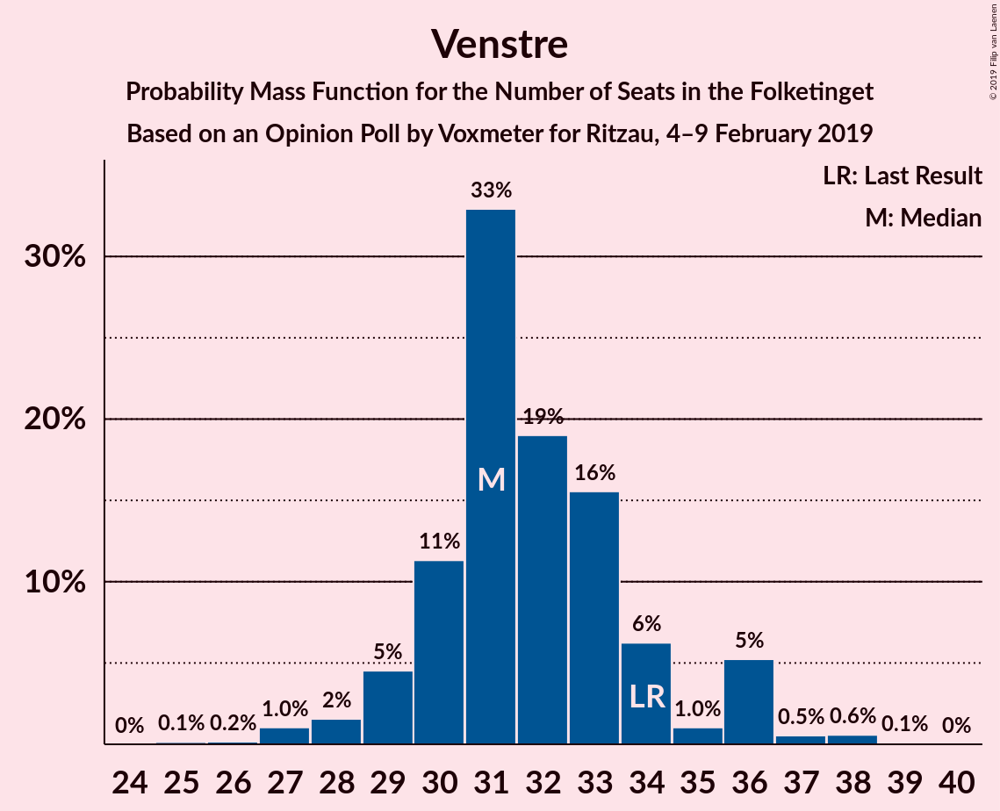

| Number of Seats | Probability | Accumulated | Special Marks |
|:---------------:|:-----------:|:-----------:|:-------------:|
| 33 | 79% | 100% | Median |
| 34 | 21% | 21% | Last Result |
| 35 | 0% | 0% |  |

### Dansk Folkeparti

*For a full overview of the results for this party, see the [Dansk Folkeparti](party-danskfolkeparti.html) page.*

| Number of Seats | Probability | Accumulated | Special Marks |
|:---------------:|:-----------:|:-----------:|:-------------:|
| 24 | 0.4% | 100% |  |
| 25 | 7% | 99.6% |  |
| 26 | 0% | 93% |  |
| 27 | 0% | 93% |  |
| 28 | 21% | 93% |  |
| 29 | 72% | 72% | Median |
| 30 | 0% | 0% |  |
| 31 | 0% | 0% |  |
| 32 | 0% | 0% |  |
| 33 | 0% | 0% |  |
| 34 | 0% | 0% |  |
| 35 | 0% | 0% |  |
| 36 | 0% | 0% |  |
| 37 | 0% | 0% | Last Result |

### Enhedslisten–De Rød-Grønne

*For a full overview of the results for this party, see the [Enhedslisten–De Rød-Grønne](party-enhedslisten–derød-grønne.html) page.*

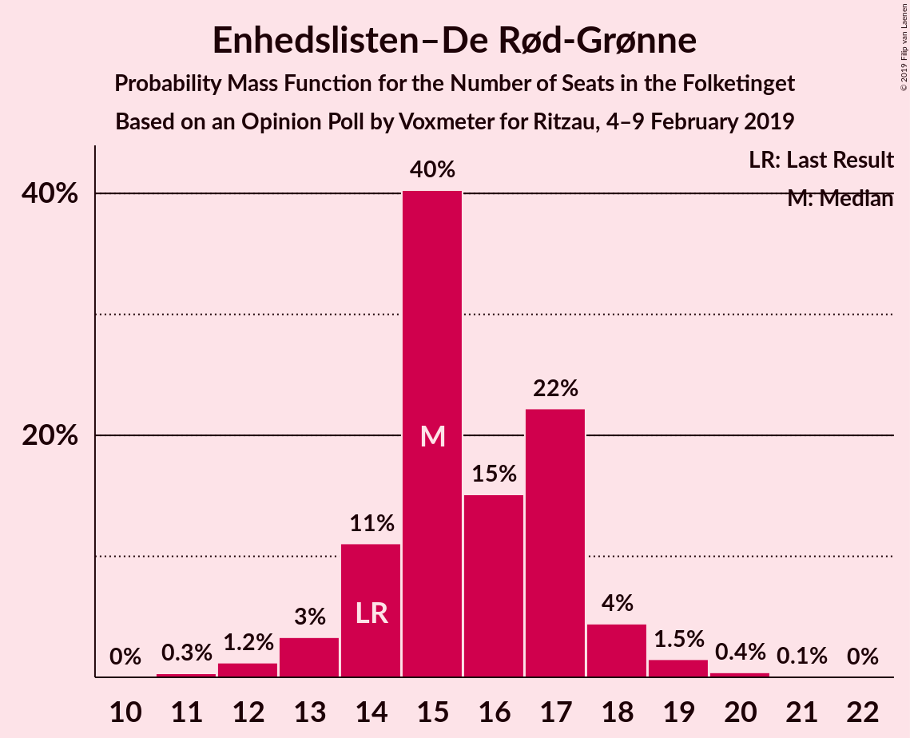

| Number of Seats | Probability | Accumulated | Special Marks |
|:---------------:|:-----------:|:-----------:|:-------------:|
| 14 | 0% | 100% | Last Result |
| 15 | 0% | 100% |  |
| 16 | 7% | 100% |  |
| 17 | 73% | 93% | Median |
| 18 | 21% | 21% |  |
| 19 | 0% | 0% |  |

### Radikale Venstre

*For a full overview of the results for this party, see the [Radikale Venstre](party-radikalevenstre.html) page.*

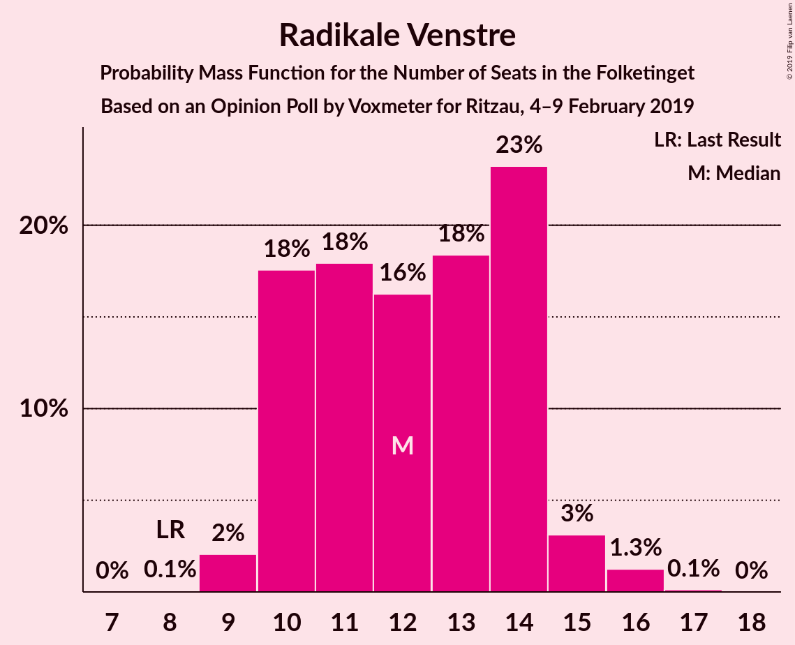

| Number of Seats | Probability | Accumulated | Special Marks |
|:---------------:|:-----------:|:-----------:|:-------------:|
| 8 | 0% | 100% | Last Result |
| 9 | 0% | 100% |  |
| 10 | 0.4% | 100% |  |
| 11 | 0% | 99.6% |  |
| 12 | 0% | 99.6% |  |
| 13 | 93% | 99.6% | Median |
| 14 | 0% | 7% |  |
| 15 | 0% | 7% |  |
| 16 | 0% | 7% |  |
| 17 | 0% | 7% |  |
| 18 | 7% | 7% |  |
| 19 | 0% | 0% |  |

### Liberal Alliance

*For a full overview of the results for this party, see the [Liberal Alliance](party-liberalalliance.html) page.*

| Number of Seats | Probability | Accumulated | Special Marks |
|:---------------:|:-----------:|:-----------:|:-------------:|
| 8 | 21% | 100% |  |
| 9 | 7% | 79% |  |
| 10 | 0% | 73% |  |
| 11 | 0% | 73% |  |
| 12 | 72% | 73% | Median |
| 13 | 0% | 0.4% | Last Result |
| 14 | 0% | 0.4% |  |
| 15 | 0.4% | 0.4% |  |
| 16 | 0% | 0% |  |

### Socialistisk Folkeparti

*For a full overview of the results for this party, see the [Socialistisk Folkeparti](party-socialistiskfolkeparti.html) page.*

| Number of Seats | Probability | Accumulated | Special Marks |
|:---------------:|:-----------:|:-----------:|:-------------:|
| 7 | 0% | 100% | Last Result |
| 8 | 7% | 100% |  |
| 9 | 72% | 93% | Median |
| 10 | 21% | 21% |  |
| 11 | 0% | 0% |  |

### Det Konservative Folkeparti

*For a full overview of the results for this party, see the [Det Konservative Folkeparti](party-detkonservativefolkeparti.html) page.*

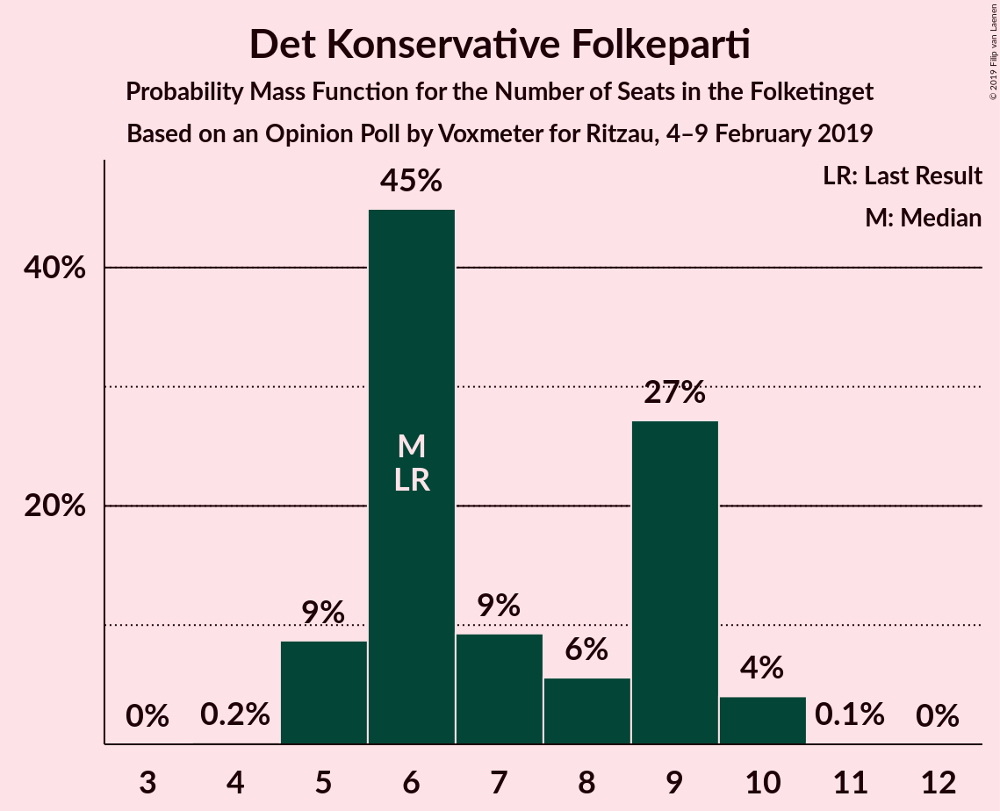

| Number of Seats | Probability | Accumulated | Special Marks |
|:---------------:|:-----------:|:-----------:|:-------------:|
| 4 | 21% | 100% |  |
| 5 | 0% | 79% |  |
| 6 | 79% | 79% | Last Result, Median |
| 7 | 0% | 0.4% |  |
| 8 | 0% | 0.4% |  |
| 9 | 0% | 0.4% |  |
| 10 | 0.4% | 0.4% |  |
| 11 | 0% | 0% |  |

### Alternativet

*For a full overview of the results for this party, see the [Alternativet](party-alternativet.html) page.*

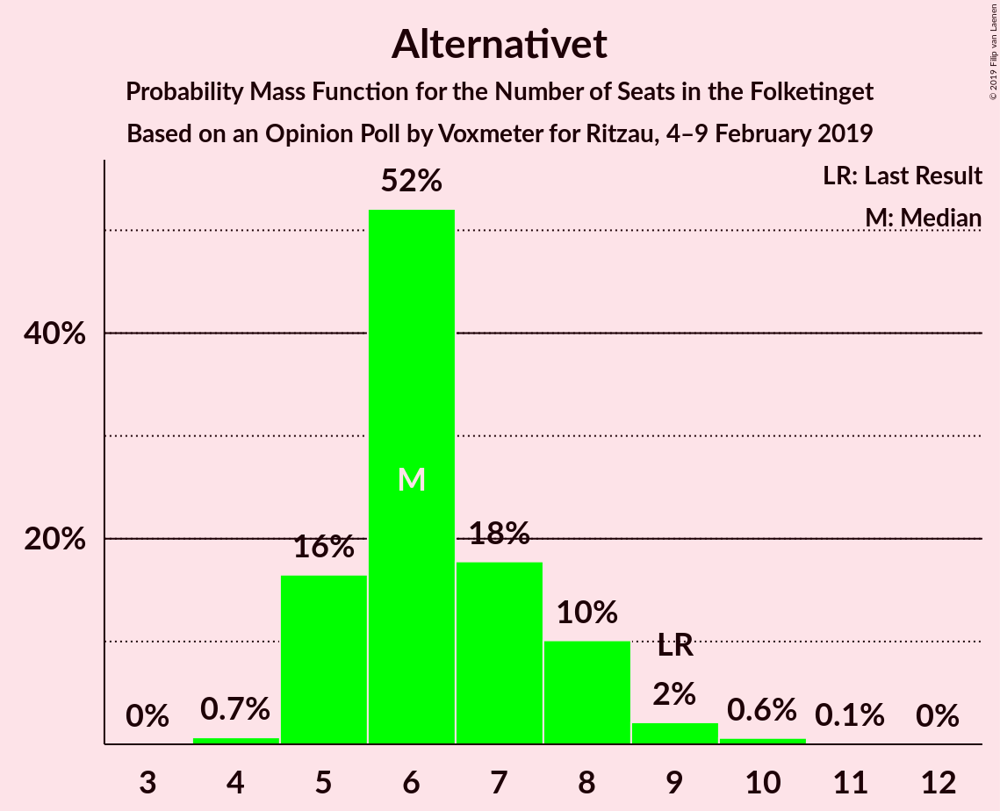

| Number of Seats | Probability | Accumulated | Special Marks |
|:---------------:|:-----------:|:-----------:|:-------------:|
| 6 | 93% | 100% | Median |
| 7 | 0% | 7% |  |
| 8 | 7% | 7% |  |
| 9 | 0% | 0% | Last Result |

### Nye Borgerlige

*For a full overview of the results for this party, see the [Nye Borgerlige](party-nyeborgerlige.html) page.*

| Number of Seats | Probability | Accumulated | Special Marks |
|:---------------:|:-----------:|:-----------:|:-------------:|
| 0 | 72% | 100% | Last Result, Median |
| 1 | 0% | 28% |  |
| 2 | 0% | 28% |  |
| 3 | 0% | 28% |  |
| 4 | 21% | 28% |  |
| 5 | 7% | 7% |  |
| 6 | 0% | 0% |  |

### Kristendemokraterne

*For a full overview of the results for this party, see the [Kristendemokraterne](party-kristendemokraterne.html) page.*

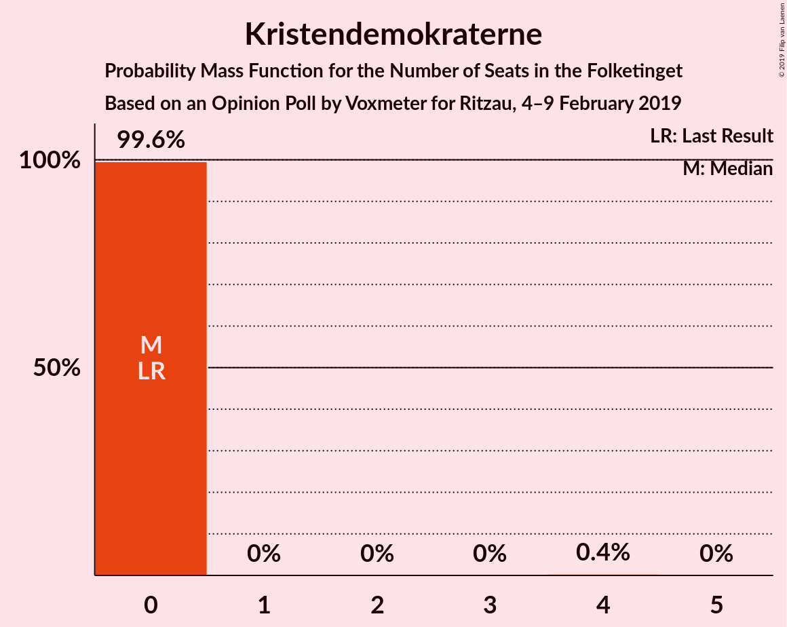

| Number of Seats | Probability | Accumulated | Special Marks |
|:---------------:|:-----------:|:-----------:|:-------------:|
| 0 | 100% | 100% | Last Result, Median |

## Coalitions

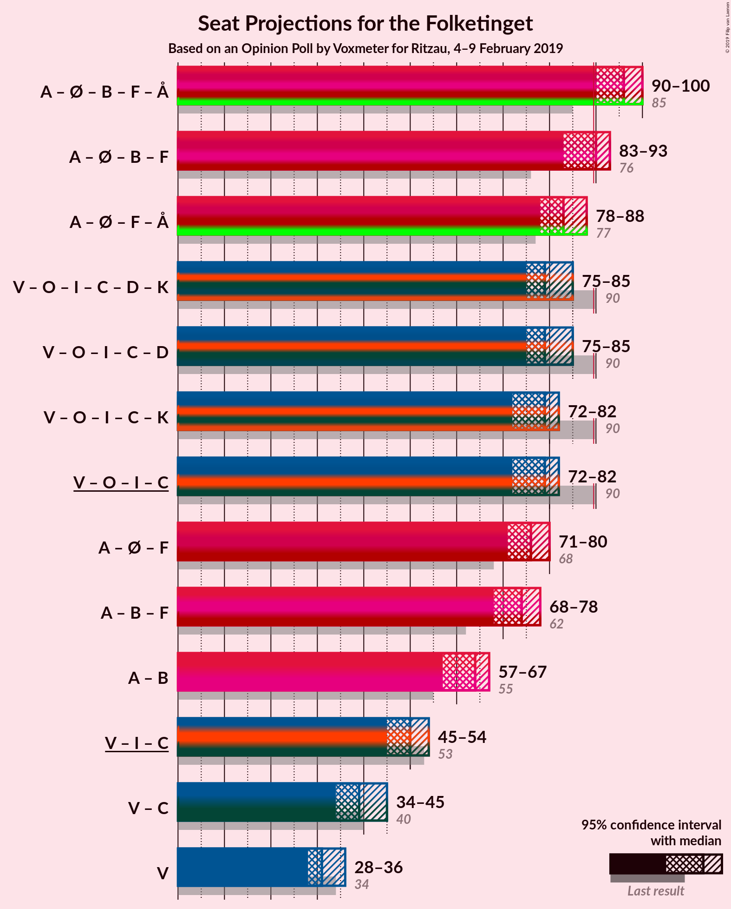

### Confidence Intervals

| Coalition | Last Result | Median | Majority? | 80% Confidence Interval | 90% Confidence Interval | 95% Confidence Interval | 99% Confidence Interval |
|:---------:|:-----------:|:------:|:---------:|:-----------------------:|:-----------------------:|:-----------------------:|:-----------------------:|
| Socialdemokraterne – Enhedslisten–De Rød-Grønne – Radikale Venstre – Socialistisk Folkeparti – Alternativet | 85 | 95 | 99.6% | 95–97 | 95–97 | 95–97 | 95–97 |
| Socialdemokraterne – Enhedslisten–De Rød-Grønne – Radikale Venstre – Socialistisk Folkeparti | 76 | 89 | 21% | 89–91 | 89–91 | 89–91 | 89–91 |
| Socialdemokraterne – Enhedslisten–De Rød-Grønne – Socialistisk Folkeparti – Alternativet | 77 | 82 | 0% | 82–84 | 79–84 | 79–84 | 79–84 |
| Venstre – Dansk Folkeparti – Liberal Alliance – Det Konservative Folkeparti – Nye Borgerlige – Kristendemokraterne | 90 | 80 | 0% | 78–80 | 78–80 | 78–80 | 78–80 |
| Venstre – Dansk Folkeparti – Liberal Alliance – Det Konservative Folkeparti – Nye Borgerlige | 90 | 80 | 0% | 78–80 | 78–80 | 78–80 | 78–80 |
| Venstre – Dansk Folkeparti – Liberal Alliance – Det Konservative Folkeparti – Kristendemokraterne | 90 | 80 | 0% | 74–80 | 73–80 | 73–80 | 73–80 |
| Venstre – Dansk Folkeparti – Liberal Alliance – Det Konservative Folkeparti | 90 | 80 | 0% | 74–80 | 73–80 | 73–80 | 73–80 |
| Socialdemokraterne – Enhedslisten–De Rød-Grønne – Socialistisk Folkeparti | 68 | 76 | 0% | 76–78 | 71–78 | 71–78 | 71–78 |
| Socialdemokraterne – Radikale Venstre – Socialistisk Folkeparti | 62 | 72 | 0% | 72–73 | 72–73 | 72–73 | 72–73 |
| Socialdemokraterne – Radikale Venstre | 55 | 63 | 0% | 63 | 63–65 | 63–65 | 63–65 |
| Venstre – Liberal Alliance – Det Konservative Folkeparti | 53 | 51 | 0% | 46–51 | 46–51 | 46–51 | 46–51 |
| Venstre – Det Konservative Folkeparti | 40 | 39 | 0% | 38–39 | 38–39 | 38–39 | 38–39 |
| Venstre | 34 | 33 | 0% | 33–34 | 33–34 | 33–34 | 33–34 |

### Socialdemokraterne – Enhedslisten–De Rød-Grønne – Radikale Venstre – Socialistisk Folkeparti – Alternativet

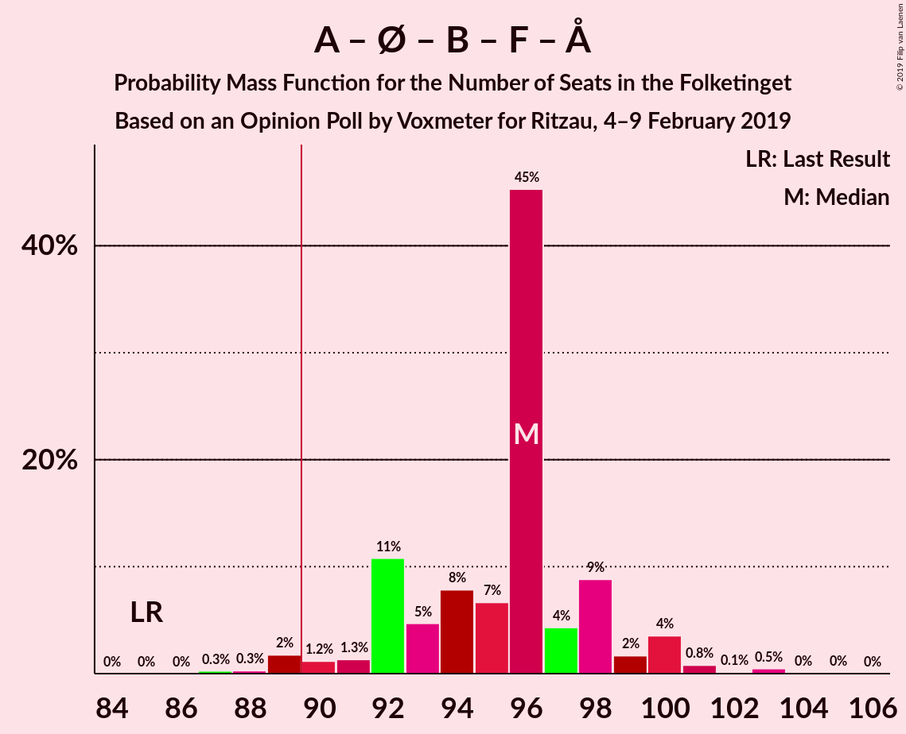

| Number of Seats | Probability | Accumulated | Special Marks |
|:---------------:|:-----------:|:-----------:|:-------------:|
| 85 | 0% | 100% | Last Result |
| 86 | 0% | 100% |  |
| 87 | 0% | 100% |  |
| 88 | 0.4% | 100% |  |
| 89 | 0% | 99.6% |  |
| 90 | 0% | 99.6% | Majority |
| 91 | 0% | 99.6% |  |
| 92 | 0% | 99.6% |  |
| 93 | 0% | 99.6% |  |
| 94 | 0% | 99.6% |  |
| 95 | 72% | 99.6% | Median |
| 96 | 0% | 27% |  |
| 97 | 27% | 27% |  |
| 98 | 0% | 0% |  |

### Socialdemokraterne – Enhedslisten–De Rød-Grønne – Radikale Venstre – Socialistisk Folkeparti

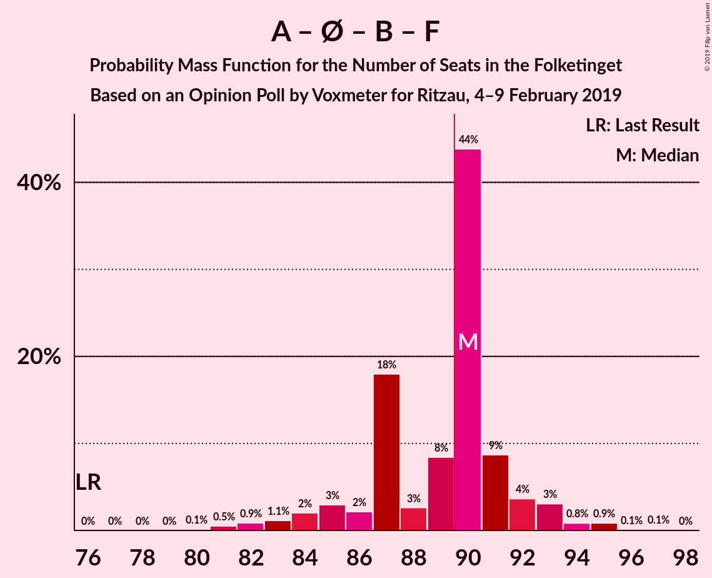

| Number of Seats | Probability | Accumulated | Special Marks |
|:---------------:|:-----------:|:-----------:|:-------------:|
| 76 | 0% | 100% | Last Result |
| 77 | 0% | 100% |  |
| 78 | 0% | 100% |  |
| 79 | 0% | 100% |  |
| 80 | 0% | 100% |  |
| 81 | 0% | 100% |  |
| 82 | 0.4% | 100% |  |
| 83 | 0% | 99.6% |  |
| 84 | 0% | 99.6% |  |
| 85 | 0% | 99.6% |  |
| 86 | 0% | 99.6% |  |
| 87 | 0% | 99.6% |  |
| 88 | 0% | 99.6% |  |
| 89 | 79% | 99.6% | Median |
| 90 | 0% | 21% | Majority |
| 91 | 21% | 21% |  |
| 92 | 0% | 0% |  |

### Socialdemokraterne – Enhedslisten–De Rød-Grønne – Socialistisk Folkeparti – Alternativet

| Number of Seats | Probability | Accumulated | Special Marks |
|:---------------:|:-----------:|:-----------:|:-------------:|
| 77 | 0% | 100% | Last Result |
| 78 | 0.4% | 100% |  |
| 79 | 7% | 99.6% |  |
| 80 | 0% | 93% |  |
| 81 | 0% | 93% |  |
| 82 | 72% | 93% | Median |
| 83 | 0% | 21% |  |
| 84 | 21% | 21% |  |
| 85 | 0% | 0% |  |

### Venstre – Dansk Folkeparti – Liberal Alliance – Det Konservative Folkeparti – Nye Borgerlige – Kristendemokraterne

| Number of Seats | Probability | Accumulated | Special Marks |
|:---------------:|:-----------:|:-----------:|:-------------:|
| 78 | 27% | 100% |  |
| 79 | 0% | 73% |  |
| 80 | 72% | 73% | Median |
| 81 | 0% | 0.4% |  |
| 82 | 0% | 0.4% |  |
| 83 | 0% | 0.4% |  |
| 84 | 0% | 0.4% |  |
| 85 | 0% | 0.4% |  |
| 86 | 0% | 0.4% |  |
| 87 | 0.4% | 0.4% |  |
| 88 | 0% | 0% |  |
| 89 | 0% | 0% |  |
| 90 | 0% | 0% | Last Result, Majority |

### Venstre – Dansk Folkeparti – Liberal Alliance – Det Konservative Folkeparti – Nye Borgerlige

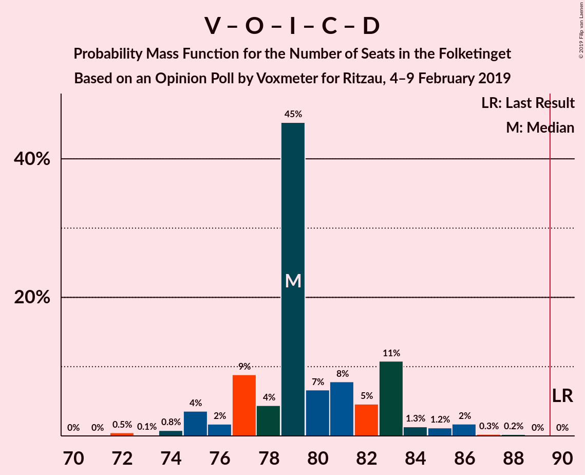

| Number of Seats | Probability | Accumulated | Special Marks |
|:---------------:|:-----------:|:-----------:|:-------------:|
| 78 | 27% | 100% |  |
| 79 | 0% | 73% |  |
| 80 | 72% | 73% | Median |
| 81 | 0% | 0.4% |  |
| 82 | 0% | 0.4% |  |
| 83 | 0% | 0.4% |  |
| 84 | 0% | 0.4% |  |
| 85 | 0% | 0.4% |  |
| 86 | 0% | 0.4% |  |
| 87 | 0.4% | 0.4% |  |
| 88 | 0% | 0% |  |
| 89 | 0% | 0% |  |
| 90 | 0% | 0% | Last Result, Majority |

### Venstre – Dansk Folkeparti – Liberal Alliance – Det Konservative Folkeparti – Kristendemokraterne

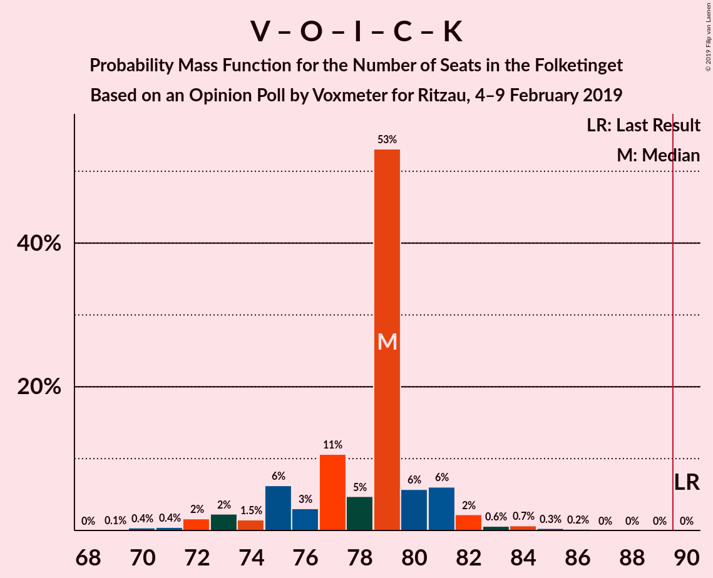

| Number of Seats | Probability | Accumulated | Special Marks |
|:---------------:|:-----------:|:-----------:|:-------------:|
| 73 | 7% | 100% |  |
| 74 | 21% | 93% |  |
| 75 | 0% | 73% |  |
| 76 | 0% | 73% |  |
| 77 | 0% | 73% |  |
| 78 | 0% | 73% |  |
| 79 | 0% | 73% |  |
| 80 | 72% | 73% | Median |
| 81 | 0% | 0.4% |  |
| 82 | 0.4% | 0.4% |  |
| 83 | 0% | 0% |  |
| 84 | 0% | 0% |  |
| 85 | 0% | 0% |  |
| 86 | 0% | 0% |  |
| 87 | 0% | 0% |  |
| 88 | 0% | 0% |  |
| 89 | 0% | 0% |  |
| 90 | 0% | 0% | Last Result, Majority |

### Venstre – Dansk Folkeparti – Liberal Alliance – Det Konservative Folkeparti

| Number of Seats | Probability | Accumulated | Special Marks |
|:---------------:|:-----------:|:-----------:|:-------------:|
| 73 | 7% | 100% |  |
| 74 | 21% | 93% |  |
| 75 | 0% | 73% |  |
| 76 | 0% | 73% |  |
| 77 | 0% | 73% |  |
| 78 | 0% | 73% |  |
| 79 | 0% | 73% |  |
| 80 | 72% | 73% | Median |
| 81 | 0% | 0.4% |  |
| 82 | 0.4% | 0.4% |  |
| 83 | 0% | 0% |  |
| 84 | 0% | 0% |  |
| 85 | 0% | 0% |  |
| 86 | 0% | 0% |  |
| 87 | 0% | 0% |  |
| 88 | 0% | 0% |  |
| 89 | 0% | 0% |  |
| 90 | 0% | 0% | Last Result, Majority |

### Socialdemokraterne – Enhedslisten–De Rød-Grønne – Socialistisk Folkeparti

| Number of Seats | Probability | Accumulated | Special Marks |
|:---------------:|:-----------:|:-----------:|:-------------:|
| 68 | 0% | 100% | Last Result |
| 69 | 0% | 100% |  |
| 70 | 0% | 100% |  |
| 71 | 7% | 100% |  |
| 72 | 0.4% | 93% |  |
| 73 | 0% | 93% |  |
| 74 | 0% | 93% |  |
| 75 | 0% | 93% |  |
| 76 | 72% | 93% | Median |
| 77 | 0% | 21% |  |
| 78 | 21% | 21% |  |
| 79 | 0% | 0% |  |

### Socialdemokraterne – Radikale Venstre – Socialistisk Folkeparti

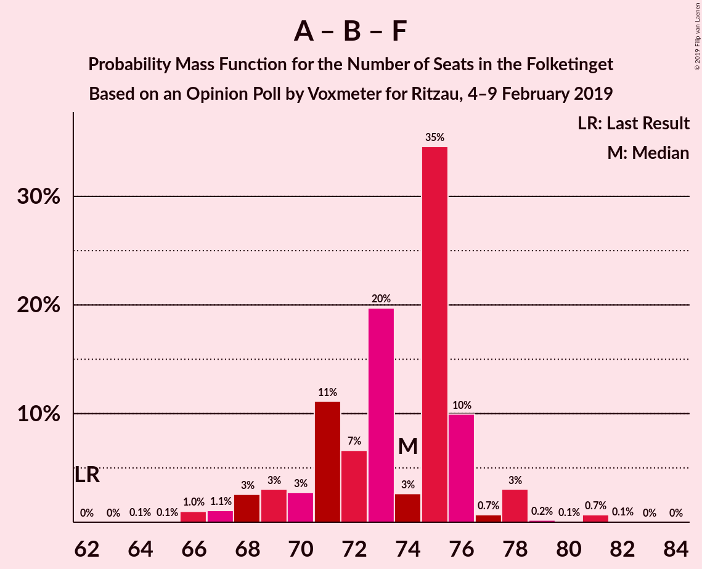

| Number of Seats | Probability | Accumulated | Special Marks |
|:---------------:|:-----------:|:-----------:|:-------------:|
| 62 | 0% | 100% | Last Result |
| 63 | 0% | 100% |  |
| 64 | 0% | 100% |  |
| 65 | 0.4% | 100% |  |
| 66 | 0% | 99.6% |  |
| 67 | 0% | 99.6% |  |
| 68 | 0% | 99.6% |  |
| 69 | 0% | 99.6% |  |
| 70 | 0% | 99.6% |  |
| 71 | 0% | 99.6% |  |
| 72 | 72% | 99.6% | Median |
| 73 | 27% | 27% |  |
| 74 | 0% | 0% |  |

### Socialdemokraterne – Radikale Venstre

| Number of Seats | Probability | Accumulated | Special Marks |
|:---------------:|:-----------:|:-----------:|:-------------:|
| 55 | 0.4% | 100% | Last Result |
| 56 | 0% | 99.6% |  |
| 57 | 0% | 99.6% |  |
| 58 | 0% | 99.6% |  |
| 59 | 0% | 99.6% |  |
| 60 | 0% | 99.6% |  |
| 61 | 0% | 99.6% |  |
| 62 | 0% | 99.6% |  |
| 63 | 93% | 99.6% | Median |
| 64 | 0% | 7% |  |
| 65 | 7% | 7% |  |
| 66 | 0% | 0% |  |

### Venstre – Liberal Alliance – Det Konservative Folkeparti

| Number of Seats | Probability | Accumulated | Special Marks |
|:---------------:|:-----------:|:-----------:|:-------------:|
| 46 | 21% | 100% |  |
| 47 | 0% | 79% |  |
| 48 | 7% | 79% |  |
| 49 | 0% | 73% |  |
| 50 | 0% | 73% |  |
| 51 | 72% | 73% | Median |
| 52 | 0% | 0.4% |  |
| 53 | 0% | 0.4% | Last Result |
| 54 | 0% | 0.4% |  |
| 55 | 0% | 0.4% |  |
| 56 | 0% | 0.4% |  |
| 57 | 0% | 0.4% |  |
| 58 | 0.4% | 0.4% |  |
| 59 | 0% | 0% |  |

### Venstre – Det Konservative Folkeparti

| Number of Seats | Probability | Accumulated | Special Marks |
|:---------------:|:-----------:|:-----------:|:-------------:|
| 38 | 21% | 100% |  |
| 39 | 79% | 79% | Median |
| 40 | 0% | 0.4% | Last Result |
| 41 | 0% | 0.4% |  |
| 42 | 0% | 0.4% |  |
| 43 | 0.4% | 0.4% |  |
| 44 | 0% | 0% |  |

### Venstre

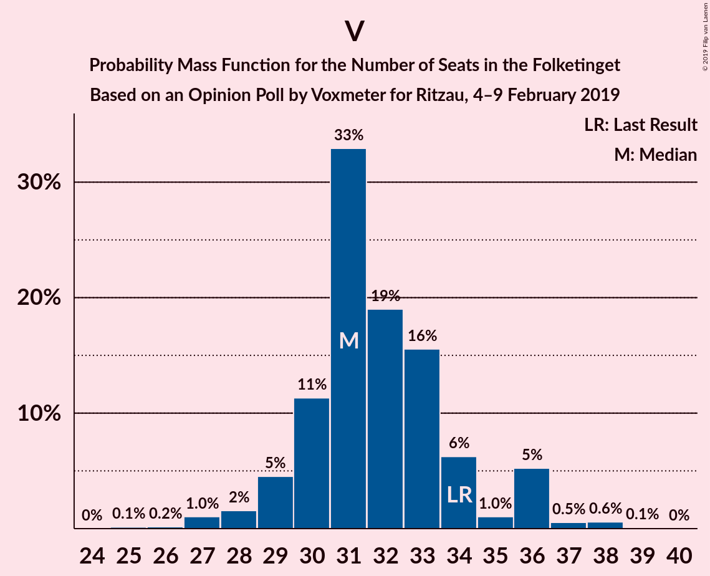

| Number of Seats | Probability | Accumulated | Special Marks |
|:---------------:|:-----------:|:-----------:|:-------------:|
| 33 | 79% | 100% | Median |
| 34 | 21% | 21% | Last Result |
| 35 | 0% | 0% |  |

## Technical Information

### Opinion Poll

+ **Polling firm:** Voxmeter
+ **Commissioner(s):** Ritzau
+ **Fieldwork period:** 4–9 February 2019

### Calculations

+ **Sample size:** 1032
+ **Simulations done:** 1,024
+ **Error estimate:** 2.70%

