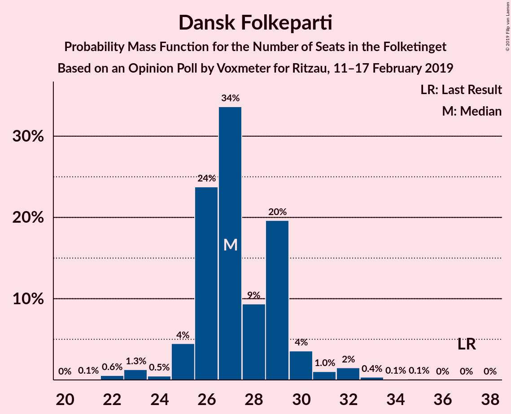
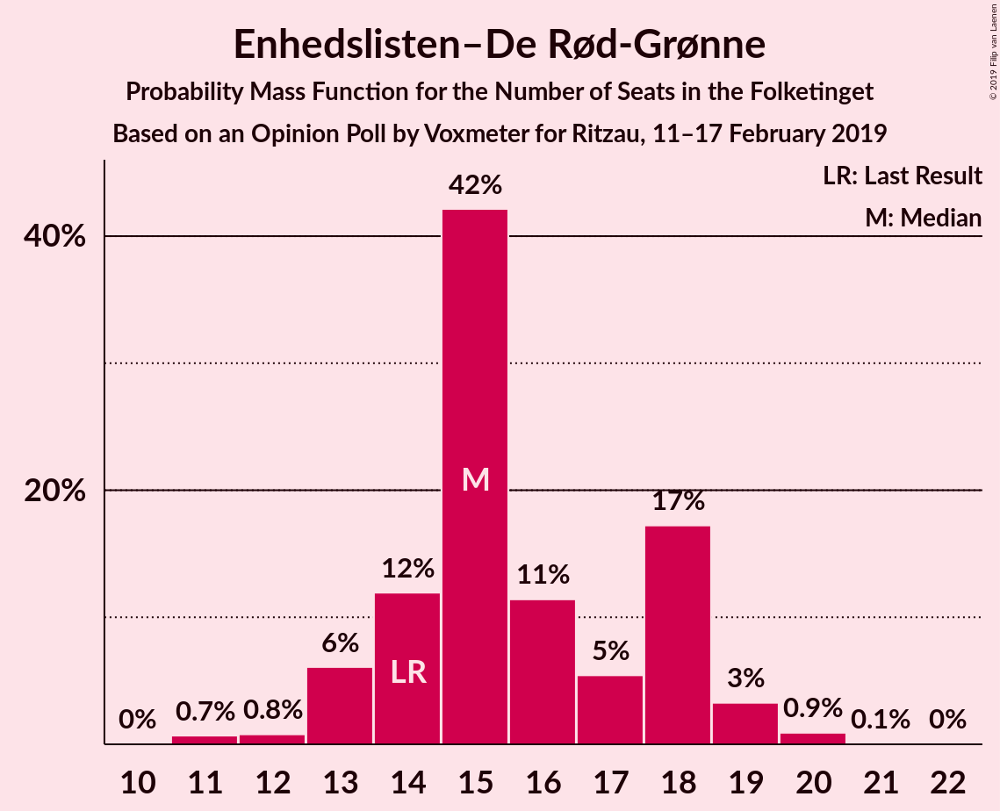
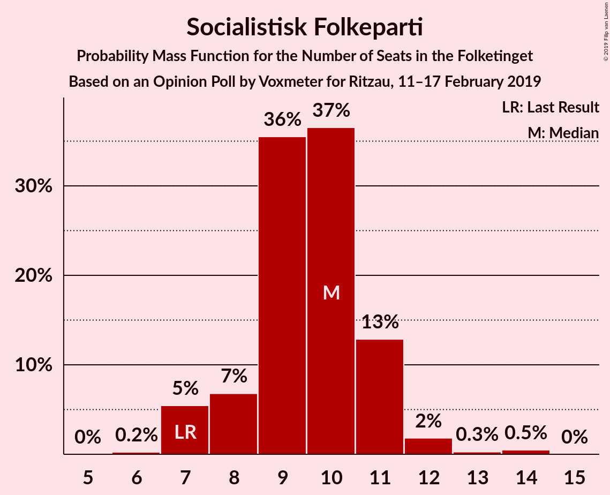
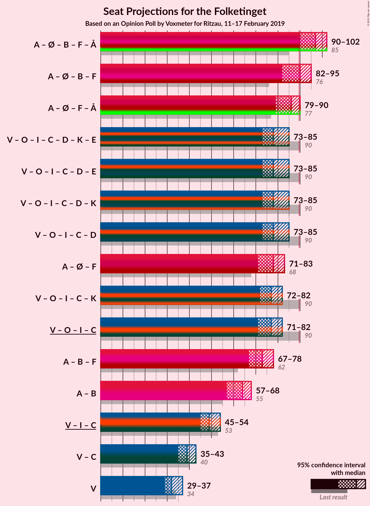
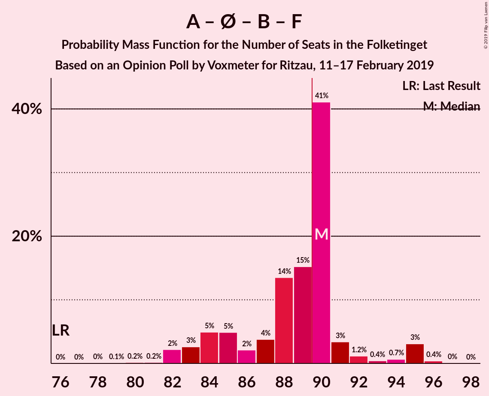

# Opinion Poll by Voxmeter for Ritzau, 11–17 February 2019

<a href="#voting-intentions">Voting Intentions</a> | <a href="#seats">Seats</a> | <a href="#coalitions">Coalitions</a> | <a href="#technical-information">Technical Information</a>

## Voting Intentions

### Confidence Intervals

| Party | Last Result | Poll Result | 80% Confidence Interval | 90% Confidence Interval | 95% Confidence Interval | 99% Confidence Interval |
|:-----:|:-----------:|:-----------:|:-----------------------:|:-----------------------:|:-----------------------:|:-----------------------:|
| Socialdemokraterne | 26.3% | 29.0% | 27.2–30.8% |26.7–31.4% |26.3–31.8% |25.4–32.7% |
| Venstre | 19.5% | 18.1% | 16.6–19.7% |16.2–20.2% |15.9–20.6% |15.2–21.4% |
| Dansk Folkeparti | 21.1% | 15.4% | 14.0–16.9% |13.6–17.3% |13.3–17.7% |12.7–18.5% |
| Enhedslisten–De Rød-Grønne | 7.8% | 8.6% | 7.6–9.8% |7.3–10.2% |7.0–10.5% |6.6–11.1% |
| Radikale Venstre | 4.6% | 6.3% | 5.4–7.3% |5.1–7.7% |4.9–7.9% |4.5–8.5% |
| Liberal Alliance | 7.5% | 5.7% | 4.8–6.7% |4.6–7.0% |4.4–7.3% |4.0–7.8% |
| Socialistisk Folkeparti | 4.2% | 5.2% | 4.4–6.2% |4.2–6.5% |4.0–6.7% |3.6–7.2% |
| Alternativet | 4.8% | 4.1% | 3.4–5.0% |3.2–5.3% |3.0–5.5% |2.7–6.0% |
| Det Konservative Folkeparti | 3.4% | 3.6% | 3.0–4.5% |2.8–4.7% |2.6–5.0% |2.3–5.4% |
| Nye Borgerlige | 0.0% | 1.9% | 1.4–2.5% |1.3–2.7% |1.2–2.9% |1.0–3.2% |
| Kristendemokraterne | 0.8% | 1.1% | 0.8–1.6% |0.7–1.8% |0.6–1.9% |0.5–2.2% |

*Note:* The poll result column reflects the actual value used in the calculations. Published results may vary slightly, and in addition be rounded to fewer digits.

## Seats

### Confidence Intervals

| Party | Last Result | Median | 80% Confidence Interval | 90% Confidence Interval | 95% Confidence Interval | 99% Confidence Interval |
|:-----:|:-----------:|:------:|:-----------------------:|:-----------------------:|:-----------------------:|:-----------------------:|
| <a href="#socialdemokraterne">Socialdemokraterne</a> | 47 | 53 | 49–55 |48–56 |46–56 |46–57 |
| <a href="#venstre">Venstre</a> | 34 | 32 | 30–35 |29–36 |29–37 |27–39 |
| <a href="#dansk-folkeparti">Dansk Folkeparti</a> | 37 | 27 | 26–29 |25–30 |25–31 |22–33 |
| <a href="#enhedslisten–de-rød-grønne">Enhedslisten–De Rød-Grønne</a> | 14 | 15 | 14–18 |13–18 |13–19 |11–20 |
| <a href="#radikale-venstre">Radikale Venstre</a> | 8 | 10 | 10–13 |10–14 |9–14 |8–15 |
| <a href="#liberal-alliance">Liberal Alliance</a> | 13 | 10 | 8–12 |8–12 |8–13 |7–14 |
| <a href="#socialistisk-folkeparti">Socialistisk Folkeparti</a> | 7 | 10 | 8–11 |7–11 |7–12 |7–13 |
| <a href="#alternativet">Alternativet</a> | 9 | 7 | 6–9 |6–10 |6–10 |5–11 |
| <a href="#det-konservative-folkeparti">Det Konservative Folkeparti</a> | 6 | 6 | 6–8 |5–9 |5–9 |4–10 |
| <a href="#nye-borgerlige">Nye Borgerlige</a> | 0 | 0 | 0–4 |0–5 |0–5 |0–6 |
| <a href="#kristendemokraterne">Kristendemokraterne</a> | 0 | 0 | 0 |0 |0–4 |0–4 |

### Socialdemokraterne

*For a full overview of the results for this party, see the [Socialdemokraterne](party-socialdemokraterne.html) page.*

| Number of Seats | Probability | Accumulated | Special Marks |
|:---------------:|:-----------:|:-----------:|:-------------:|
| 44 | 0.1% | 100% |  |
| 45 | 0.3% | 99.9% |  |
| 46 | 3% | 99.6% |  |
| 47 | 2% | 97% | Last Result |
| 48 | 4% | 95% |  |
| 49 | 5% | 91% |  |
| 50 | 3% | 86% |  |
| 51 | 15% | 83% |  |
| 52 | 5% | 68% |  |
| 53 | 26% | 63% | Median |
| 54 | 7% | 37% |  |
| 55 | 24% | 30% |  |
| 56 | 6% | 6% |  |
| 57 | 0.2% | 0.5% |  |
| 58 | 0.1% | 0.4% |  |
| 59 | 0.1% | 0.2% |  |
| 60 | 0.1% | 0.2% |  |
| 61 | 0.1% | 0.1% |  |
| 62 | 0% | 0% |  |

### Venstre

*For a full overview of the results for this party, see the [Venstre](party-venstre.html) page.*

| Number of Seats | Probability | Accumulated | Special Marks |
|:---------------:|:-----------:|:-----------:|:-------------:|
| 26 | 0.3% | 100% |  |
| 27 | 0.3% | 99.7% |  |
| 28 | 1.2% | 99.4% |  |
| 29 | 7% | 98% |  |
| 30 | 5% | 91% |  |
| 31 | 12% | 86% |  |
| 32 | 31% | 74% | Median |
| 33 | 6% | 44% |  |
| 34 | 5% | 38% | Last Result |
| 35 | 27% | 33% |  |
| 36 | 2% | 6% |  |
| 37 | 3% | 4% |  |
| 38 | 0.3% | 1.2% |  |
| 39 | 0.7% | 0.9% |  |
| 40 | 0.1% | 0.1% |  |
| 41 | 0% | 0% |  |

### Dansk Folkeparti

*For a full overview of the results for this party, see the [Dansk Folkeparti](party-danskfolkeparti.html) page.*

| Number of Seats | Probability | Accumulated | Special Marks |
|:---------------:|:-----------:|:-----------:|:-------------:|
| 21 | 0.1% | 100% |  |
| 22 | 0.6% | 99.9% |  |
| 23 | 1.3% | 99.3% |  |
| 24 | 0.5% | 98% |  |
| 25 | 4% | 98% |  |
| 26 | 24% | 93% |  |
| 27 | 34% | 69% | Median |
| 28 | 9% | 36% |  |
| 29 | 20% | 26% |  |
| 30 | 4% | 7% |  |
| 31 | 1.0% | 3% |  |
| 32 | 2% | 2% |  |
| 33 | 0.4% | 0.6% |  |
| 34 | 0.1% | 0.3% |  |
| 35 | 0.1% | 0.1% |  |
| 36 | 0% | 0% |  |
| 37 | 0% | 0% | Last Result |

### Enhedslisten–De Rød-Grønne

*For a full overview of the results for this party, see the [Enhedslisten–De Rød-Grønne](party-enhedslisten–derød-grønne.html) page.*

| Number of Seats | Probability | Accumulated | Special Marks |
|:---------------:|:-----------:|:-----------:|:-------------:|
| 11 | 0.7% | 100% |  |
| 12 | 0.8% | 99.3% |  |
| 13 | 6% | 98% |  |
| 14 | 12% | 92% | Last Result |
| 15 | 42% | 80% | Median |
| 16 | 11% | 38% |  |
| 17 | 5% | 27% |  |
| 18 | 17% | 21% |  |
| 19 | 3% | 4% |  |
| 20 | 0.9% | 1.0% |  |
| 21 | 0.1% | 0.1% |  |
| 22 | 0% | 0% |  |

### Radikale Venstre

*For a full overview of the results for this party, see the [Radikale Venstre](party-radikalevenstre.html) page.*

| Number of Seats | Probability | Accumulated | Special Marks |
|:---------------:|:-----------:|:-----------:|:-------------:|
| 7 | 0.1% | 100% |  |
| 8 | 0.5% | 99.9% | Last Result |
| 9 | 3% | 99.4% |  |
| 10 | 48% | 96% | Median |
| 11 | 17% | 48% |  |
| 12 | 11% | 31% |  |
| 13 | 13% | 19% |  |
| 14 | 5% | 6% |  |
| 15 | 0.5% | 0.7% |  |
| 16 | 0.1% | 0.1% |  |
| 17 | 0% | 0% |  |

### Liberal Alliance

*For a full overview of the results for this party, see the [Liberal Alliance](party-liberalalliance.html) page.*

| Number of Seats | Probability | Accumulated | Special Marks |
|:---------------:|:-----------:|:-----------:|:-------------:|
| 7 | 0.5% | 100% |  |
| 8 | 15% | 99.4% |  |
| 9 | 21% | 84% |  |
| 10 | 35% | 63% | Median |
| 11 | 14% | 28% |  |
| 12 | 10% | 14% |  |
| 13 | 2% | 3% | Last Result |
| 14 | 1.3% | 1.4% |  |
| 15 | 0.1% | 0.1% |  |
| 16 | 0% | 0% |  |

### Socialistisk Folkeparti

*For a full overview of the results for this party, see the [Socialistisk Folkeparti](party-socialistiskfolkeparti.html) page.*

| Number of Seats | Probability | Accumulated | Special Marks |
|:---------------:|:-----------:|:-----------:|:-------------:|
| 6 | 0.2% | 100% |  |
| 7 | 5% | 99.7% | Last Result |
| 8 | 7% | 94% |  |
| 9 | 36% | 87% |  |
| 10 | 37% | 52% | Median |
| 11 | 13% | 15% |  |
| 12 | 2% | 3% |  |
| 13 | 0.3% | 0.8% |  |
| 14 | 0.5% | 0.5% |  |
| 15 | 0% | 0% |  |

### Alternativet

*For a full overview of the results for this party, see the [Alternativet](party-alternativet.html) page.*

| Number of Seats | Probability | Accumulated | Special Marks |
|:---------------:|:-----------:|:-----------:|:-------------:|
| 4 | 0.1% | 100% |  |
| 5 | 2% | 99.9% |  |
| 6 | 14% | 98% |  |
| 7 | 37% | 84% | Median |
| 8 | 33% | 47% |  |
| 9 | 9% | 14% | Last Result |
| 10 | 4% | 5% |  |
| 11 | 0.9% | 1.0% |  |
| 12 | 0% | 0.1% |  |
| 13 | 0% | 0% |  |

### Det Konservative Folkeparti

*For a full overview of the results for this party, see the [Det Konservative Folkeparti](party-detkonservativefolkeparti.html) page.*

| Number of Seats | Probability | Accumulated | Special Marks |
|:---------------:|:-----------:|:-----------:|:-------------:|
| 4 | 0.8% | 100% |  |
| 5 | 8% | 99.1% |  |
| 6 | 57% | 91% | Last Result, Median |
| 7 | 18% | 34% |  |
| 8 | 11% | 16% |  |
| 9 | 3% | 5% |  |
| 10 | 2% | 2% |  |
| 11 | 0% | 0.1% |  |
| 12 | 0% | 0% |  |

### Nye Borgerlige

*For a full overview of the results for this party, see the [Nye Borgerlige](party-nyeborgerlige.html) page.*

| Number of Seats | Probability | Accumulated | Special Marks |
|:---------------:|:-----------:|:-----------:|:-------------:|
| 0 | 50% | 100% | Last Result, Median |
| 1 | 0% | 50% |  |
| 2 | 0% | 50% |  |
| 3 | 0.8% | 50% |  |
| 4 | 41% | 49% |  |
| 5 | 7% | 8% |  |
| 6 | 1.0% | 1.1% |  |
| 7 | 0% | 0% |  |

### Kristendemokraterne

*For a full overview of the results for this party, see the [Kristendemokraterne](party-kristendemokraterne.html) page.*

| Number of Seats | Probability | Accumulated | Special Marks |
|:---------------:|:-----------:|:-----------:|:-------------:|
| 0 | 96% | 100% | Last Result, Median |
| 1 | 0% | 4% |  |
| 2 | 0% | 4% |  |
| 3 | 0.1% | 4% |  |
| 4 | 3% | 4% |  |
| 5 | 0.1% | 0.1% |  |
| 6 | 0% | 0% |  |

## Coalitions

### Confidence Intervals

| Coalition | Last Result | Median | Majority? | 80% Confidence Interval | 90% Confidence Interval | 95% Confidence Interval | 99% Confidence Interval |
|:---------:|:-----------:|:------:|:---------:|:-----------------------:|:-----------------------:|:-----------------------:|:-----------------------:|
| Socialdemokraterne – Enhedslisten–De Rød-Grønne – Radikale Venstre – Socialistisk Folkeparti – Alternativet | 85 | 97 | 98.7% | 93–98 | 91–100 | 90–102 | 88–103 |
| Socialdemokraterne – Enhedslisten–De Rød-Grønne – Radikale Venstre – Socialistisk Folkeparti | 76 | 90 | 50% | 84–90 | 83–92 | 82–95 | 82–95 |
| Socialdemokraterne – Enhedslisten–De Rød-Grønne – Socialistisk Folkeparti – Alternativet | 77 | 86 | 4% | 81–88 | 80–89 | 79–90 | 77–92 |
| Venstre – Dansk Folkeparti – Liberal Alliance – Det Konservative Folkeparti – Nye Borgerlige – Kristendemokraterne | 90 | 78 | 0% | 77–82 | 74–84 | 73–85 | 72–87 |
| Venstre – Dansk Folkeparti – Liberal Alliance – Det Konservative Folkeparti – Nye Borgerlige | 90 | 78 | 0% | 76–82 | 74–84 | 73–85 | 72–87 |
| Socialdemokraterne – Enhedslisten–De Rød-Grønne – Socialistisk Folkeparti | 68 | 78 | 0% | 74–80 | 73–81 | 71–83 | 70–84 |
| Venstre – Dansk Folkeparti – Liberal Alliance – Det Konservative Folkeparti – Kristendemokraterne | 90 | 77 | 0% | 73–80 | 73–81 | 72–82 | 70–84 |
| Venstre – Dansk Folkeparti – Liberal Alliance – Det Konservative Folkeparti | 90 | 77 | 0% | 73–80 | 72–81 | 71–82 | 70–84 |
| Socialdemokraterne – Radikale Venstre – Socialistisk Folkeparti | 62 | 73 | 0% | 70–75 | 68–77 | 67–78 | 65–79 |
| Socialdemokraterne – Radikale Venstre | 55 | 64 | 0% | 61–66 | 59–67 | 57–68 | 57–68 |
| Venstre – Liberal Alliance – Det Konservative Folkeparti | 53 | 49 | 0% | 46–52 | 45–54 | 45–54 | 44–57 |
| Venstre – Det Konservative Folkeparti | 40 | 39 | 0% | 36–41 | 35–43 | 35–43 | 33–47 |
| Venstre | 34 | 32 | 0% | 30–35 | 29–36 | 29–37 | 27–39 |

### Socialdemokraterne – Enhedslisten–De Rød-Grønne – Radikale Venstre – Socialistisk Folkeparti – Alternativet

| Number of Seats | Probability | Accumulated | Special Marks |
|:---------------:|:-----------:|:-----------:|:-------------:|
| 85 | 0% | 100% | Last Result |
| 86 | 0.1% | 100% |  |
| 87 | 0.1% | 99.9% |  |
| 88 | 0.8% | 99.8% |  |
| 89 | 0.3% | 99.0% |  |
| 90 | 3% | 98.7% | Majority |
| 91 | 3% | 96% |  |
| 92 | 3% | 93% |  |
| 93 | 3% | 90% |  |
| 94 | 7% | 87% |  |
| 95 | 10% | 80% | Median |
| 96 | 15% | 70% |  |
| 97 | 26% | 55% |  |
| 98 | 21% | 29% |  |
| 99 | 2% | 8% |  |
| 100 | 2% | 6% |  |
| 101 | 0.8% | 4% |  |
| 102 | 3% | 4% |  |
| 103 | 0.2% | 0.6% |  |
| 104 | 0.3% | 0.3% |  |
| 105 | 0% | 0% |  |

### Socialdemokraterne – Enhedslisten–De Rød-Grønne – Radikale Venstre – Socialistisk Folkeparti

| Number of Seats | Probability | Accumulated | Special Marks |
|:---------------:|:-----------:|:-----------:|:-------------:|
| 76 | 0% | 100% | Last Result |
| 77 | 0% | 100% |  |
| 78 | 0% | 100% |  |
| 79 | 0.1% | 99.9% |  |
| 80 | 0.2% | 99.9% |  |
| 81 | 0.2% | 99.7% |  |
| 82 | 2% | 99.5% |  |
| 83 | 3% | 97% |  |
| 84 | 5% | 95% |  |
| 85 | 5% | 90% |  |
| 86 | 2% | 85% |  |
| 87 | 4% | 83% |  |
| 88 | 14% | 79% | Median |
| 89 | 15% | 66% |  |
| 90 | 41% | 50% | Majority |
| 91 | 3% | 9% |  |
| 92 | 1.2% | 6% |  |
| 93 | 0.4% | 5% |  |
| 94 | 0.7% | 4% |  |
| 95 | 3% | 4% |  |
| 96 | 0.4% | 0.5% |  |
| 97 | 0% | 0.1% |  |
| 98 | 0% | 0% |  |

### Socialdemokraterne – Enhedslisten–De Rød-Grønne – Socialistisk Folkeparti – Alternativet

| Number of Seats | Probability | Accumulated | Special Marks |
|:---------------:|:-----------:|:-----------:|:-------------:|
| 74 | 0.1% | 100% |  |
| 75 | 0.1% | 99.9% |  |
| 76 | 0.1% | 99.9% |  |
| 77 | 0.8% | 99.8% | Last Result |
| 78 | 0.8% | 99.0% |  |
| 79 | 2% | 98% |  |
| 80 | 3% | 96% |  |
| 81 | 7% | 94% |  |
| 82 | 4% | 87% |  |
| 83 | 15% | 83% |  |
| 84 | 5% | 68% |  |
| 85 | 9% | 63% | Median |
| 86 | 5% | 54% |  |
| 87 | 28% | 49% |  |
| 88 | 16% | 21% |  |
| 89 | 1.4% | 5% |  |
| 90 | 2% | 4% | Majority |
| 91 | 0.8% | 1.3% |  |
| 92 | 0.3% | 0.5% |  |
| 93 | 0.2% | 0.2% |  |
| 94 | 0% | 0% |  |

### Venstre – Dansk Folkeparti – Liberal Alliance – Det Konservative Folkeparti – Nye Borgerlige – Kristendemokraterne

| Number of Seats | Probability | Accumulated | Special Marks |
|:---------------:|:-----------:|:-----------:|:-------------:|
| 70 | 0.1% | 100% |  |
| 71 | 0.3% | 99.9% |  |
| 72 | 0.3% | 99.6% |  |
| 73 | 3% | 99.3% |  |
| 74 | 2% | 96% |  |
| 75 | 2% | 95% | Median |
| 76 | 3% | 93% |  |
| 77 | 21% | 90% |  |
| 78 | 25% | 69% |  |
| 79 | 15% | 44% |  |
| 80 | 10% | 29% |  |
| 81 | 7% | 19% |  |
| 82 | 3% | 12% |  |
| 83 | 3% | 9% |  |
| 84 | 2% | 7% |  |
| 85 | 3% | 4% |  |
| 86 | 0.2% | 1.2% |  |
| 87 | 0.8% | 0.9% |  |
| 88 | 0.1% | 0.1% |  |
| 89 | 0% | 0.1% |  |
| 90 | 0% | 0% | Last Result, Majority |

### Venstre – Dansk Folkeparti – Liberal Alliance – Det Konservative Folkeparti – Nye Borgerlige

| Number of Seats | Probability | Accumulated | Special Marks |
|:---------------:|:-----------:|:-----------:|:-------------:|
| 70 | 0.1% | 100% |  |
| 71 | 0.3% | 99.9% |  |
| 72 | 0.3% | 99.6% |  |
| 73 | 3% | 99.3% |  |
| 74 | 2% | 96% |  |
| 75 | 4% | 94% | Median |
| 76 | 3% | 90% |  |
| 77 | 21% | 87% |  |
| 78 | 26% | 67% |  |
| 79 | 13% | 41% |  |
| 80 | 10% | 28% |  |
| 81 | 7% | 19% |  |
| 82 | 3% | 12% |  |
| 83 | 3% | 9% |  |
| 84 | 2% | 6% |  |
| 85 | 3% | 4% |  |
| 86 | 0.2% | 1.1% |  |
| 87 | 0.7% | 0.9% |  |
| 88 | 0.1% | 0.1% |  |
| 89 | 0% | 0.1% |  |
| 90 | 0% | 0% | Last Result, Majority |

### Socialdemokraterne – Enhedslisten–De Rød-Grønne – Socialistisk Folkeparti

| Number of Seats | Probability | Accumulated | Special Marks |
|:---------------:|:-----------:|:-----------:|:-------------:|
| 67 | 0.1% | 100% |  |
| 68 | 0.1% | 99.9% | Last Result |
| 69 | 0.1% | 99.8% |  |
| 70 | 0.7% | 99.7% |  |
| 71 | 2% | 99.0% |  |
| 72 | 2% | 97% |  |
| 73 | 4% | 95% |  |
| 74 | 5% | 92% |  |
| 75 | 15% | 87% |  |
| 76 | 4% | 72% |  |
| 77 | 10% | 68% |  |
| 78 | 12% | 58% | Median |
| 79 | 2% | 46% |  |
| 80 | 38% | 44% |  |
| 81 | 2% | 6% |  |
| 82 | 0.5% | 4% |  |
| 83 | 3% | 4% |  |
| 84 | 0.7% | 0.9% |  |
| 85 | 0.2% | 0.3% |  |
| 86 | 0% | 0% |  |

### Venstre – Dansk Folkeparti – Liberal Alliance – Det Konservative Folkeparti – Kristendemokraterne

| Number of Seats | Probability | Accumulated | Special Marks |
|:---------------:|:-----------:|:-----------:|:-------------:|
| 68 | 0.1% | 100% |  |
| 69 | 0.1% | 99.9% |  |
| 70 | 0.5% | 99.8% |  |
| 71 | 0.8% | 99.3% |  |
| 72 | 1.3% | 98.5% |  |
| 73 | 18% | 97% |  |
| 74 | 4% | 79% |  |
| 75 | 13% | 75% | Median |
| 76 | 5% | 62% |  |
| 77 | 11% | 57% |  |
| 78 | 28% | 46% |  |
| 79 | 4% | 18% |  |
| 80 | 8% | 15% |  |
| 81 | 4% | 7% |  |
| 82 | 1.0% | 3% |  |
| 83 | 0.9% | 2% |  |
| 84 | 1.1% | 1.3% |  |
| 85 | 0.1% | 0.2% |  |
| 86 | 0.1% | 0.1% |  |
| 87 | 0% | 0% |  |
| 88 | 0% | 0% |  |
| 89 | 0% | 0% |  |
| 90 | 0% | 0% | Last Result, Majority |

### Venstre – Dansk Folkeparti – Liberal Alliance – Det Konservative Folkeparti

| Number of Seats | Probability | Accumulated | Special Marks |
|:---------------:|:-----------:|:-----------:|:-------------:|
| 68 | 0.1% | 100% |  |
| 69 | 0.1% | 99.9% |  |
| 70 | 0.5% | 99.8% |  |
| 71 | 3% | 99.3% |  |
| 72 | 1.4% | 96% |  |
| 73 | 18% | 95% |  |
| 74 | 4% | 77% |  |
| 75 | 11% | 73% | Median |
| 76 | 5% | 62% |  |
| 77 | 11% | 57% |  |
| 78 | 28% | 45% |  |
| 79 | 3% | 17% |  |
| 80 | 7% | 14% |  |
| 81 | 4% | 7% |  |
| 82 | 0.8% | 3% |  |
| 83 | 0.8% | 2% |  |
| 84 | 1.1% | 1.2% |  |
| 85 | 0.1% | 0.2% |  |
| 86 | 0.1% | 0.1% |  |
| 87 | 0% | 0% |  |
| 88 | 0% | 0% |  |
| 89 | 0% | 0% |  |
| 90 | 0% | 0% | Last Result, Majority |

### Socialdemokraterne – Radikale Venstre – Socialistisk Folkeparti

| Number of Seats | Probability | Accumulated | Special Marks |
|:---------------:|:-----------:|:-----------:|:-------------:|
| 62 | 0% | 100% | Last Result |
| 63 | 0% | 100% |  |
| 64 | 0.1% | 100% |  |
| 65 | 0.5% | 99.9% |  |
| 66 | 0.4% | 99.4% |  |
| 67 | 2% | 99.0% |  |
| 68 | 3% | 97% |  |
| 69 | 4% | 94% |  |
| 70 | 6% | 90% |  |
| 71 | 5% | 85% |  |
| 72 | 19% | 79% |  |
| 73 | 14% | 61% | Median |
| 74 | 9% | 47% |  |
| 75 | 30% | 38% |  |
| 76 | 2% | 8% |  |
| 77 | 2% | 6% |  |
| 78 | 0.8% | 3% |  |
| 79 | 2% | 2% |  |
| 80 | 0.1% | 0.3% |  |
| 81 | 0.2% | 0.2% |  |
| 82 | 0.1% | 0.1% |  |
| 83 | 0% | 0% |  |

### Socialdemokraterne – Radikale Venstre

| Number of Seats | Probability | Accumulated | Special Marks |
|:---------------:|:-----------:|:-----------:|:-------------:|
| 55 | 0% | 100% | Last Result |
| 56 | 0.2% | 99.9% |  |
| 57 | 3% | 99.7% |  |
| 58 | 2% | 97% |  |
| 59 | 3% | 95% |  |
| 60 | 2% | 92% |  |
| 61 | 8% | 91% |  |
| 62 | 6% | 82% |  |
| 63 | 20% | 76% | Median |
| 64 | 15% | 56% |  |
| 65 | 30% | 41% |  |
| 66 | 4% | 12% |  |
| 67 | 4% | 8% |  |
| 68 | 4% | 4% |  |
| 69 | 0.1% | 0.5% |  |
| 70 | 0.1% | 0.3% |  |
| 71 | 0.1% | 0.2% |  |
| 72 | 0% | 0.1% |  |
| 73 | 0% | 0.1% |  |
| 74 | 0% | 0% |  |

### Venstre – Liberal Alliance – Det Konservative Folkeparti

| Number of Seats | Probability | Accumulated | Special Marks |
|:---------------:|:-----------:|:-----------:|:-------------:|
| 41 | 0.1% | 100% |  |
| 42 | 0.1% | 99.9% |  |
| 43 | 0.3% | 99.8% |  |
| 44 | 0.7% | 99.5% |  |
| 45 | 4% | 98.9% |  |
| 46 | 10% | 95% |  |
| 47 | 20% | 85% |  |
| 48 | 10% | 65% | Median |
| 49 | 8% | 55% |  |
| 50 | 5% | 47% |  |
| 51 | 31% | 42% |  |
| 52 | 4% | 11% |  |
| 53 | 2% | 8% | Last Result |
| 54 | 4% | 6% |  |
| 55 | 0.6% | 1.4% |  |
| 56 | 0.1% | 0.8% |  |
| 57 | 0.6% | 0.7% |  |
| 58 | 0% | 0% |  |

### Venstre – Det Konservative Folkeparti

| Number of Seats | Probability | Accumulated | Special Marks |
|:---------------:|:-----------:|:-----------:|:-------------:|
| 32 | 0.1% | 100% |  |
| 33 | 0.5% | 99.9% |  |
| 34 | 1.3% | 99.4% |  |
| 35 | 3% | 98% |  |
| 36 | 6% | 95% |  |
| 37 | 5% | 88% |  |
| 38 | 30% | 83% | Median |
| 39 | 6% | 53% |  |
| 40 | 9% | 47% | Last Result |
| 41 | 28% | 38% |  |
| 42 | 4% | 10% |  |
| 43 | 4% | 6% |  |
| 44 | 1.3% | 2% |  |
| 45 | 0.4% | 1.1% |  |
| 46 | 0.2% | 0.7% |  |
| 47 | 0.5% | 0.5% |  |
| 48 | 0% | 0% |  |

### Venstre

| Number of Seats | Probability | Accumulated | Special Marks |
|:---------------:|:-----------:|:-----------:|:-------------:|
| 26 | 0.3% | 100% |  |
| 27 | 0.3% | 99.7% |  |
| 28 | 1.2% | 99.4% |  |
| 29 | 7% | 98% |  |
| 30 | 5% | 91% |  |
| 31 | 12% | 86% |  |
| 32 | 31% | 74% | Median |
| 33 | 6% | 44% |  |
| 34 | 5% | 38% | Last Result |
| 35 | 27% | 33% |  |
| 36 | 2% | 6% |  |
| 37 | 3% | 4% |  |
| 38 | 0.3% | 1.2% |  |
| 39 | 0.7% | 0.9% |  |
| 40 | 0.1% | 0.1% |  |
| 41 | 0% | 0% |  |

## Technical Information

### Opinion Poll

+ **Polling firm:** Voxmeter
+ **Commissioner(s):** Ritzau
+ **Fieldwork period:** 11–17 February 2019

### Calculations

+ **Sample size:** 1022
+ **Simulations done:** 1,048,576
+ **Error estimate:** 1.65%

