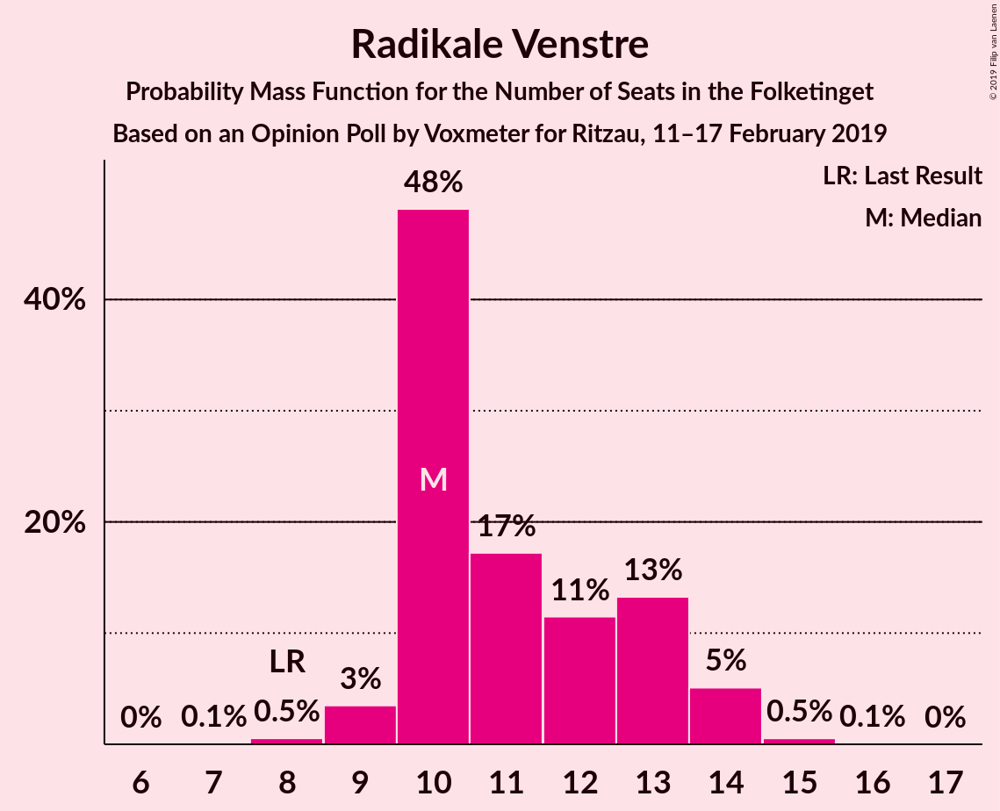
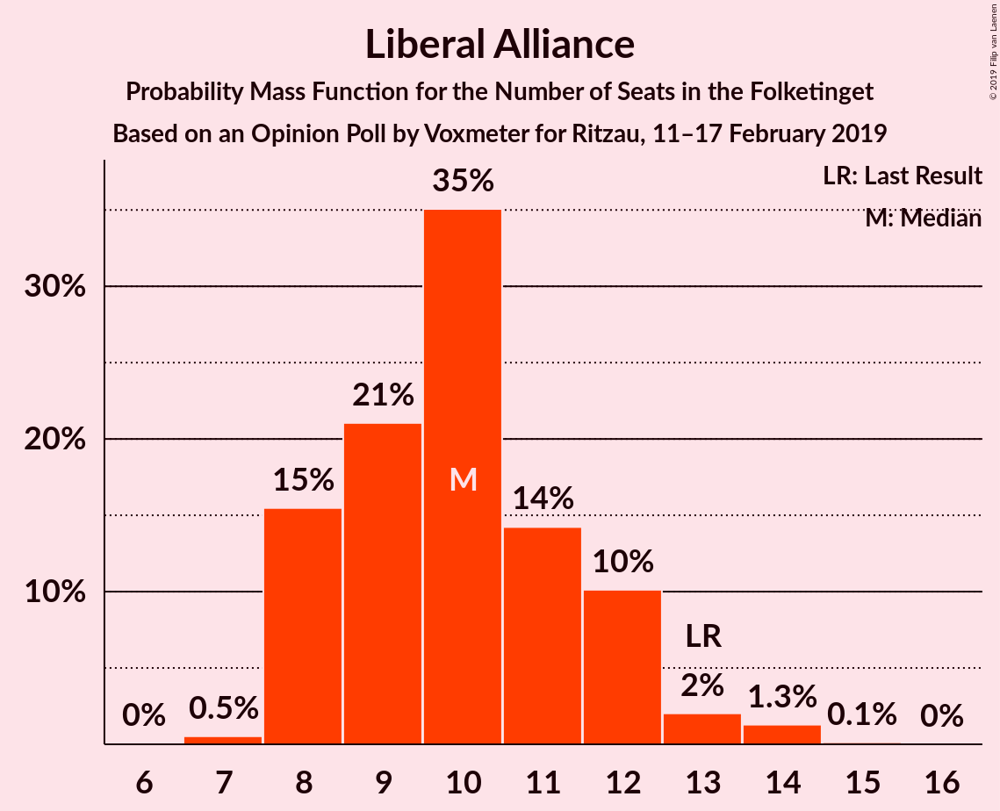
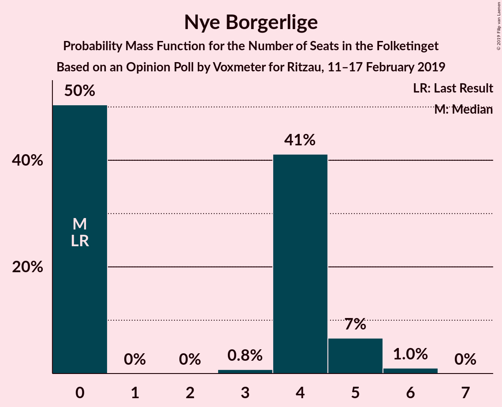
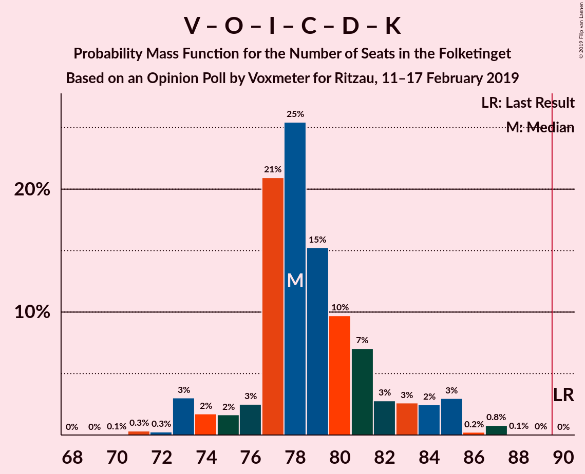
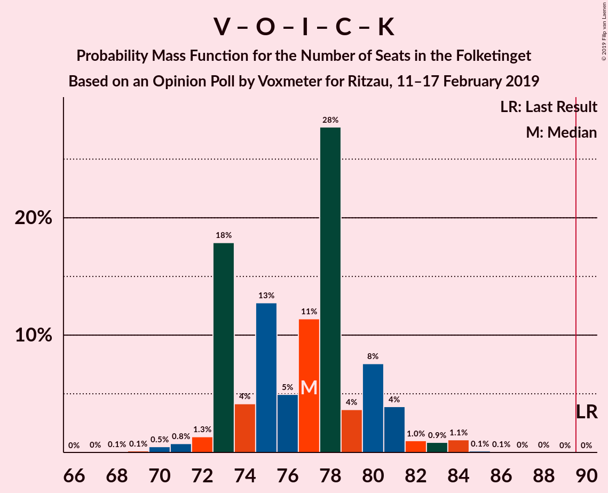
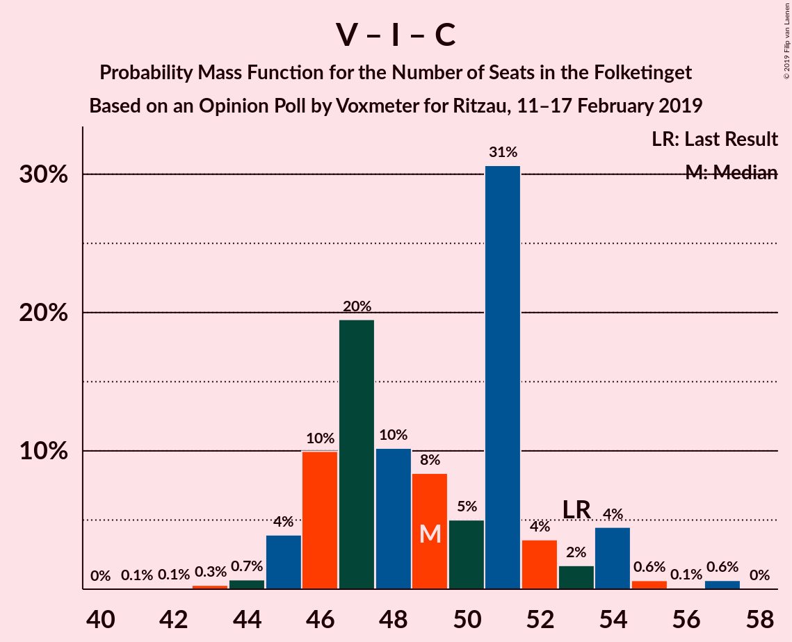
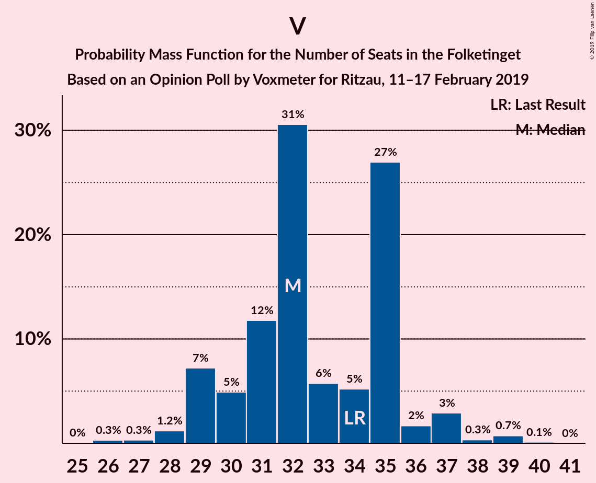

# Opinion Poll by Voxmeter for Ritzau, 11–17 February 2019

<a href="#voting-intentions">Voting Intentions</a> | <a href="#seats">Seats</a> | <a href="#coalitions">Coalitions</a> | <a href="#technical-information">Technical Information</a>

## Voting Intentions

### Confidence Intervals

| Party | Last Result | Poll Result | 80% Confidence Interval | 90% Confidence Interval | 95% Confidence Interval | 99% Confidence Interval |
|:-----:|:-----------:|:-----------:|:-----------------------:|:-----------------------:|:-----------------------:|:-----------------------:|
| Socialdemokraterne | 26.3% | 29.0% | 27.2–30.8% |26.7–31.4% |26.3–31.8% |25.4–32.7% |
| Venstre | 19.5% | 18.1% | 16.6–19.7% |16.2–20.2% |15.9–20.6% |15.2–21.4% |
| Dansk Folkeparti | 21.1% | 15.4% | 14.0–16.9% |13.6–17.3% |13.3–17.7% |12.7–18.5% |
| Enhedslisten–De Rød-Grønne | 7.8% | 8.6% | 7.6–9.8% |7.3–10.2% |7.0–10.5% |6.6–11.1% |
| Radikale Venstre | 4.6% | 6.3% | 5.4–7.3% |5.1–7.7% |4.9–7.9% |4.5–8.5% |
| Liberal Alliance | 7.5% | 5.7% | 4.8–6.7% |4.6–7.0% |4.4–7.3% |4.0–7.8% |
| Socialistisk Folkeparti | 4.2% | 5.2% | 4.4–6.2% |4.2–6.5% |4.0–6.7% |3.6–7.2% |
| Alternativet | 4.8% | 4.1% | 3.4–5.0% |3.2–5.3% |3.0–5.5% |2.7–6.0% |
| Det Konservative Folkeparti | 3.4% | 3.6% | 3.0–4.5% |2.8–4.7% |2.6–5.0% |2.3–5.4% |
| Nye Borgerlige | 0.0% | 1.9% | 1.4–2.5% |1.3–2.7% |1.2–2.9% |1.0–3.2% |
| Kristendemokraterne | 0.8% | 1.1% | 0.8–1.6% |0.7–1.8% |0.6–1.9% |0.5–2.2% |

*Note:* The poll result column reflects the actual value used in the calculations. Published results may vary slightly, and in addition be rounded to fewer digits.

## Seats

### Confidence Intervals

| Party | Last Result | Median | 80% Confidence Interval | 90% Confidence Interval | 95% Confidence Interval | 99% Confidence Interval |
|:-----:|:-----------:|:------:|:-----------------------:|:-----------------------:|:-----------------------:|:-----------------------:|
| <a href="#socialdemokraterne">Socialdemokraterne</a> | 47 | 49 | 48–55 |48–55 |47–56 |47–57 |
| <a href="#venstre">Venstre</a> | 34 | 30 | 30–34 |27–36 |26–38 |26–38 |
| <a href="#dansk-folkeparti">Dansk Folkeparti</a> | 37 | 28 | 23–30 |23–32 |22–32 |22–33 |
| <a href="#enhedslisten–de-rød-grønne">Enhedslisten–De Rød-Grønne</a> | 14 | 15 | 14–18 |14–19 |13–20 |12–20 |
| <a href="#radikale-venstre">Radikale Venstre</a> | 8 | 13 | 10–14 |9–14 |9–14 |8–14 |
| <a href="#liberal-alliance">Liberal Alliance</a> | 13 | 11 | 9–12 |9–13 |8–14 |7–14 |
| <a href="#socialistisk-folkeparti">Socialistisk Folkeparti</a> | 7 | 10 | 8–11 |7–12 |7–12 |7–14 |
| <a href="#alternativet">Alternativet</a> | 9 | 7 | 6–9 |6–9 |6–10 |5–11 |
| <a href="#det-konservative-folkeparti">Det Konservative Folkeparti</a> | 6 | 6 | 5–8 |5–8 |5–8 |4–10 |
| <a href="#nye-borgerlige">Nye Borgerlige</a> | 0 | 4 | 0–5 |0–5 |0–5 |0–6 |
| <a href="#kristendemokraterne">Kristendemokraterne</a> | 0 | 0 | 0 |0–4 |0–4 |0–4 |

### Socialdemokraterne

*For a full overview of the results for this party, see the [Socialdemokraterne](party-socialdemokraterne.html) page.*

| Number of Seats | Probability | Accumulated | Special Marks |
|:---------------:|:-----------:|:-----------:|:-------------:|
| 44 | 0% | 100% |  |
| 45 | 0.1% | 99.9% |  |
| 46 | 0.1% | 99.9% |  |
| 47 | 3% | 99.8% | Last Result |
| 48 | 13% | 97% |  |
| 49 | 42% | 84% | Median |
| 50 | 2% | 42% |  |
| 51 | 4% | 40% |  |
| 52 | 1.0% | 36% |  |
| 53 | 19% | 35% |  |
| 54 | 4% | 16% |  |
| 55 | 7% | 11% |  |
| 56 | 3% | 4% |  |
| 57 | 0% | 0.5% |  |
| 58 | 0.3% | 0.5% |  |
| 59 | 0.1% | 0.2% |  |
| 60 | 0.1% | 0.1% |  |
| 61 | 0% | 0% |  |

### Venstre

*For a full overview of the results for this party, see the [Venstre](party-venstre.html) page.*

| Number of Seats | Probability | Accumulated | Special Marks |
|:---------------:|:-----------:|:-----------:|:-------------:|
| 25 | 0.3% | 100% |  |
| 26 | 4% | 99.7% |  |
| 27 | 3% | 96% |  |
| 28 | 0.3% | 93% |  |
| 29 | 2% | 93% |  |
| 30 | 42% | 91% | Median |
| 31 | 9% | 49% |  |
| 32 | 14% | 40% |  |
| 33 | 13% | 26% |  |
| 34 | 5% | 13% | Last Result |
| 35 | 2% | 8% |  |
| 36 | 0.9% | 6% |  |
| 37 | 1.1% | 5% |  |
| 38 | 4% | 4% |  |
| 39 | 0.2% | 0.2% |  |
| 40 | 0% | 0% |  |

### Dansk Folkeparti

*For a full overview of the results for this party, see the [Dansk Folkeparti](party-danskfolkeparti.html) page.*

| Number of Seats | Probability | Accumulated | Special Marks |
|:---------------:|:-----------:|:-----------:|:-------------:|
| 21 | 0.1% | 100% |  |
| 22 | 3% | 99.9% |  |
| 23 | 13% | 97% |  |
| 24 | 0.6% | 84% |  |
| 25 | 3% | 83% |  |
| 26 | 2% | 81% |  |
| 27 | 7% | 79% |  |
| 28 | 56% | 72% | Median |
| 29 | 5% | 16% |  |
| 30 | 2% | 11% |  |
| 31 | 4% | 10% |  |
| 32 | 5% | 6% |  |
| 33 | 0.5% | 0.6% |  |
| 34 | 0% | 0.1% |  |
| 35 | 0% | 0% |  |
| 36 | 0% | 0% |  |
| 37 | 0% | 0% | Last Result |

### Enhedslisten–De Rød-Grønne

*For a full overview of the results for this party, see the [Enhedslisten–De Rød-Grønne](party-enhedslisten–derød-grønne.html) page.*

| Number of Seats | Probability | Accumulated | Special Marks |
|:---------------:|:-----------:|:-----------:|:-------------:|
| 10 | 0.2% | 100% |  |
| 11 | 0.1% | 99.8% |  |
| 12 | 2% | 99.7% |  |
| 13 | 3% | 98% |  |
| 14 | 6% | 95% | Last Result |
| 15 | 53% | 89% | Median |
| 16 | 9% | 36% |  |
| 17 | 16% | 27% |  |
| 18 | 5% | 11% |  |
| 19 | 3% | 6% |  |
| 20 | 3% | 4% |  |
| 21 | 0% | 0.1% |  |
| 22 | 0.1% | 0.1% |  |
| 23 | 0% | 0% |  |

### Radikale Venstre

*For a full overview of the results for this party, see the [Radikale Venstre](party-radikalevenstre.html) page.*

| Number of Seats | Probability | Accumulated | Special Marks |
|:---------------:|:-----------:|:-----------:|:-------------:|
| 7 | 0.1% | 100% |  |
| 8 | 1.2% | 99.9% | Last Result |
| 9 | 7% | 98.7% |  |
| 10 | 9% | 92% |  |
| 11 | 5% | 83% |  |
| 12 | 20% | 78% |  |
| 13 | 19% | 58% | Median |
| 14 | 39% | 39% |  |
| 15 | 0% | 0.2% |  |
| 16 | 0.1% | 0.2% |  |
| 17 | 0.1% | 0.1% |  |
| 18 | 0% | 0% |  |

### Liberal Alliance

*For a full overview of the results for this party, see the [Liberal Alliance](party-liberalalliance.html) page.*

| Number of Seats | Probability | Accumulated | Special Marks |
|:---------------:|:-----------:|:-----------:|:-------------:|
| 6 | 0.1% | 100% |  |
| 7 | 0.7% | 99.9% |  |
| 8 | 3% | 99.2% |  |
| 9 | 21% | 96% |  |
| 10 | 11% | 75% |  |
| 11 | 20% | 64% | Median |
| 12 | 39% | 44% |  |
| 13 | 0.9% | 5% | Last Result |
| 14 | 4% | 4% |  |
| 15 | 0.1% | 0.1% |  |
| 16 | 0% | 0% |  |

### Socialistisk Folkeparti

*For a full overview of the results for this party, see the [Socialistisk Folkeparti](party-socialistiskfolkeparti.html) page.*

| Number of Seats | Probability | Accumulated | Special Marks |
|:---------------:|:-----------:|:-----------:|:-------------:|
| 6 | 0.4% | 100% |  |
| 7 | 7% | 99.6% | Last Result |
| 8 | 5% | 93% |  |
| 9 | 23% | 87% |  |
| 10 | 15% | 64% | Median |
| 11 | 42% | 48% |  |
| 12 | 4% | 6% |  |
| 13 | 0.3% | 2% |  |
| 14 | 2% | 2% |  |
| 15 | 0% | 0% |  |

### Alternativet

*For a full overview of the results for this party, see the [Alternativet](party-alternativet.html) page.*

| Number of Seats | Probability | Accumulated | Special Marks |
|:---------------:|:-----------:|:-----------:|:-------------:|
| 4 | 0.1% | 100% |  |
| 5 | 1.1% | 99.9% |  |
| 6 | 39% | 98.8% |  |
| 7 | 22% | 60% | Median |
| 8 | 24% | 38% |  |
| 9 | 10% | 14% | Last Result |
| 10 | 4% | 5% |  |
| 11 | 1.0% | 1.1% |  |
| 12 | 0% | 0.1% |  |
| 13 | 0% | 0% |  |

### Det Konservative Folkeparti

*For a full overview of the results for this party, see the [Det Konservative Folkeparti](party-detkonservativefolkeparti.html) page.*

| Number of Seats | Probability | Accumulated | Special Marks |
|:---------------:|:-----------:|:-----------:|:-------------:|
| 4 | 1.3% | 100% |  |
| 5 | 9% | 98.7% |  |
| 6 | 60% | 90% | Last Result, Median |
| 7 | 19% | 29% |  |
| 8 | 8% | 10% |  |
| 9 | 0.9% | 2% |  |
| 10 | 0.9% | 0.9% |  |
| 11 | 0% | 0% |  |

### Nye Borgerlige

*For a full overview of the results for this party, see the [Nye Borgerlige](party-nyeborgerlige.html) page.*

| Number of Seats | Probability | Accumulated | Special Marks |
|:---------------:|:-----------:|:-----------:|:-------------:|
| 0 | 38% | 100% | Last Result |
| 1 | 0% | 62% |  |
| 2 | 0% | 62% |  |
| 3 | 0% | 62% |  |
| 4 | 40% | 62% | Median |
| 5 | 22% | 22% |  |
| 6 | 0.5% | 0.6% |  |
| 7 | 0.1% | 0.1% |  |
| 8 | 0% | 0% |  |

### Kristendemokraterne

*For a full overview of the results for this party, see the [Kristendemokraterne](party-kristendemokraterne.html) page.*

| Number of Seats | Probability | Accumulated | Special Marks |
|:---------------:|:-----------:|:-----------:|:-------------:|
| 0 | 93% | 100% | Last Result, Median |
| 1 | 0% | 7% |  |
| 2 | 0% | 7% |  |
| 3 | 0% | 7% |  |
| 4 | 7% | 7% |  |
| 5 | 0.1% | 0.1% |  |
| 6 | 0% | 0% |  |

## Coalitions

### Confidence Intervals

| Coalition | Last Result | Median | Majority? | 80% Confidence Interval | 90% Confidence Interval | 95% Confidence Interval | 99% Confidence Interval |
|:---------:|:-----------:|:------:|:---------:|:-----------------------:|:-----------------------:|:-----------------------:|:-----------------------:|
| Socialdemokraterne – Enhedslisten–De Rød-Grønne – Radikale Venstre – Socialistisk Folkeparti – Alternativet | 85 | 95 | 98.8% | 92–99 | 90–102 | 90–104 | 88–104 |
| Socialdemokraterne – Enhedslisten–De Rød-Grønne – Radikale Venstre – Socialistisk Folkeparti | 76 | 89 | 38% | 84–91 | 83–95 | 83–95 | 81–96 |
| Socialdemokraterne – Enhedslisten–De Rød-Grønne – Socialistisk Folkeparti – Alternativet | 77 | 82 | 8% | 81–88 | 81–90 | 79–93 | 78–93 |
| Venstre – Dansk Folkeparti – Liberal Alliance – Det Konservative Folkeparti – Nye Borgerlige – Kristendemokraterne | 90 | 80 | 0% | 76–82 | 73–85 | 71–85 | 71–87 |
| Venstre – Dansk Folkeparti – Liberal Alliance – Det Konservative Folkeparti – Nye Borgerlige | 90 | 80 | 0% | 73–82 | 73–85 | 71–85 | 71–86 |
| Venstre – Dansk Folkeparti – Liberal Alliance – Det Konservative Folkeparti – Kristendemokraterne | 90 | 76 | 0% | 72–80 | 71–81 | 71–84 | 70–84 |
| Venstre – Dansk Folkeparti – Liberal Alliance – Det Konservative Folkeparti | 90 | 76 | 0% | 72–80 | 71–80 | 71–84 | 70–84 |
| Socialdemokraterne – Enhedslisten–De Rød-Grønne – Socialistisk Folkeparti | 68 | 75 | 0% | 74–81 | 72–83 | 71–84 | 71–85 |
| Socialdemokraterne – Radikale Venstre – Socialistisk Folkeparti | 62 | 74 | 0% | 69–76 | 67–77 | 67–77 | 66–78 |
| Socialdemokraterne – Radikale Venstre | 55 | 63 | 0% | 60–66 | 57–67 | 57–68 | 56–69 |
| Venstre – Liberal Alliance – Det Konservative Folkeparti | 53 | 48 | 0% | 45–52 | 45–54 | 44–54 | 43–56 |
| Venstre – Det Konservative Folkeparti | 40 | 36 | 0% | 36–41 | 34–43 | 34–45 | 32–46 |
| Venstre | 34 | 30 | 0% | 30–34 | 27–36 | 26–38 | 26–38 |

### Socialdemokraterne – Enhedslisten–De Rød-Grønne – Radikale Venstre – Socialistisk Folkeparti – Alternativet

| Number of Seats | Probability | Accumulated | Special Marks |
|:---------------:|:-----------:|:-----------:|:-------------:|
| 85 | 0% | 100% | Last Result |
| 86 | 0.2% | 100% |  |
| 87 | 0% | 99.8% |  |
| 88 | 0.5% | 99.8% |  |
| 89 | 0.6% | 99.3% |  |
| 90 | 5% | 98.8% | Majority |
| 91 | 4% | 94% |  |
| 92 | 0.5% | 90% |  |
| 93 | 3% | 90% |  |
| 94 | 8% | 87% | Median |
| 95 | 37% | 79% |  |
| 96 | 4% | 43% |  |
| 97 | 3% | 39% |  |
| 98 | 22% | 36% |  |
| 99 | 5% | 14% |  |
| 100 | 0.4% | 9% |  |
| 101 | 1.2% | 8% |  |
| 102 | 4% | 7% |  |
| 103 | 0.4% | 3% |  |
| 104 | 2% | 3% |  |
| 105 | 0.1% | 0.1% |  |
| 106 | 0% | 0.1% |  |
| 107 | 0% | 0% |  |

### Socialdemokraterne – Enhedslisten–De Rød-Grønne – Radikale Venstre – Socialistisk Folkeparti

| Number of Seats | Probability | Accumulated | Special Marks |
|:---------------:|:-----------:|:-----------:|:-------------:|
| 76 | 0% | 100% | Last Result |
| 77 | 0% | 100% |  |
| 78 | 0.2% | 100% |  |
| 79 | 0% | 99.8% |  |
| 80 | 0% | 99.8% |  |
| 81 | 0.3% | 99.7% |  |
| 82 | 0.3% | 99.4% |  |
| 83 | 7% | 99.1% |  |
| 84 | 2% | 92% |  |
| 85 | 4% | 90% |  |
| 86 | 8% | 86% |  |
| 87 | 2% | 78% | Median |
| 88 | 2% | 76% |  |
| 89 | 36% | 74% |  |
| 90 | 20% | 38% | Majority |
| 91 | 8% | 18% |  |
| 92 | 1.5% | 10% |  |
| 93 | 1.3% | 8% |  |
| 94 | 0.5% | 7% |  |
| 95 | 4% | 6% |  |
| 96 | 2% | 2% |  |
| 97 | 0% | 0% |  |

### Socialdemokraterne – Enhedslisten–De Rød-Grønne – Socialistisk Folkeparti – Alternativet

| Number of Seats | Probability | Accumulated | Special Marks |
|:---------------:|:-----------:|:-----------:|:-------------:|
| 75 | 0% | 100% |  |
| 76 | 0.2% | 99.9% |  |
| 77 | 0.1% | 99.8% | Last Result |
| 78 | 0.8% | 99.7% |  |
| 79 | 3% | 98.9% |  |
| 80 | 1.0% | 96% |  |
| 81 | 43% | 95% | Median |
| 82 | 9% | 52% |  |
| 83 | 0.5% | 43% |  |
| 84 | 4% | 42% |  |
| 85 | 14% | 38% |  |
| 86 | 6% | 25% |  |
| 87 | 4% | 19% |  |
| 88 | 7% | 15% |  |
| 89 | 0.6% | 8% |  |
| 90 | 3% | 8% | Majority |
| 91 | 2% | 4% |  |
| 92 | 0.3% | 3% |  |
| 93 | 3% | 3% |  |
| 94 | 0% | 0.1% |  |
| 95 | 0.1% | 0.1% |  |
| 96 | 0% | 0% |  |

### Venstre – Dansk Folkeparti – Liberal Alliance – Det Konservative Folkeparti – Nye Borgerlige – Kristendemokraterne

| Number of Seats | Probability | Accumulated | Special Marks |
|:---------------:|:-----------:|:-----------:|:-------------:|
| 69 | 0% | 100% |  |
| 70 | 0.1% | 99.9% |  |
| 71 | 2% | 99.9% |  |
| 72 | 0.4% | 97% |  |
| 73 | 4% | 97% |  |
| 74 | 1.3% | 93% |  |
| 75 | 1.2% | 92% |  |
| 76 | 5% | 90% |  |
| 77 | 25% | 85% |  |
| 78 | 3% | 60% |  |
| 79 | 3% | 57% | Median |
| 80 | 37% | 54% |  |
| 81 | 4% | 16% |  |
| 82 | 3% | 12% |  |
| 83 | 0.2% | 10% |  |
| 84 | 4% | 9% |  |
| 85 | 5% | 6% |  |
| 86 | 0.5% | 1.1% |  |
| 87 | 0.5% | 0.7% |  |
| 88 | 0% | 0.2% |  |
| 89 | 0.2% | 0.2% |  |
| 90 | 0% | 0% | Last Result, Majority |

### Venstre – Dansk Folkeparti – Liberal Alliance – Det Konservative Folkeparti – Nye Borgerlige

| Number of Seats | Probability | Accumulated | Special Marks |
|:---------------:|:-----------:|:-----------:|:-------------:|
| 69 | 0% | 100% |  |
| 70 | 0.1% | 99.9% |  |
| 71 | 2% | 99.9% |  |
| 72 | 0.4% | 97% |  |
| 73 | 9% | 97% |  |
| 74 | 1.5% | 88% |  |
| 75 | 1.1% | 86% |  |
| 76 | 6% | 85% |  |
| 77 | 20% | 80% |  |
| 78 | 4% | 60% |  |
| 79 | 3% | 56% | Median |
| 80 | 37% | 53% |  |
| 81 | 4% | 16% |  |
| 82 | 2% | 11% |  |
| 83 | 0.4% | 9% |  |
| 84 | 4% | 9% |  |
| 85 | 5% | 5% |  |
| 86 | 0.2% | 0.6% |  |
| 87 | 0.3% | 0.5% |  |
| 88 | 0% | 0.2% |  |
| 89 | 0.2% | 0.2% |  |
| 90 | 0% | 0% | Last Result, Majority |

### Venstre – Dansk Folkeparti – Liberal Alliance – Det Konservative Folkeparti – Kristendemokraterne

| Number of Seats | Probability | Accumulated | Special Marks |
|:---------------:|:-----------:|:-----------:|:-------------:|
| 67 | 0.1% | 100% |  |
| 68 | 0.2% | 99.9% |  |
| 69 | 0.1% | 99.6% |  |
| 70 | 0.2% | 99.5% |  |
| 71 | 5% | 99.3% |  |
| 72 | 10% | 94% |  |
| 73 | 5% | 85% |  |
| 74 | 3% | 80% |  |
| 75 | 2% | 77% | Median |
| 76 | 41% | 76% |  |
| 77 | 17% | 35% |  |
| 78 | 3% | 18% |  |
| 79 | 3% | 15% |  |
| 80 | 7% | 12% |  |
| 81 | 0.7% | 6% |  |
| 82 | 1.4% | 5% |  |
| 83 | 0.5% | 4% |  |
| 84 | 3% | 3% |  |
| 85 | 0.1% | 0.2% |  |
| 86 | 0.1% | 0.1% |  |
| 87 | 0% | 0% |  |
| 88 | 0% | 0% |  |
| 89 | 0% | 0% |  |
| 90 | 0% | 0% | Last Result, Majority |

### Venstre – Dansk Folkeparti – Liberal Alliance – Det Konservative Folkeparti

| Number of Seats | Probability | Accumulated | Special Marks |
|:---------------:|:-----------:|:-----------:|:-------------:|
| 67 | 0.1% | 100% |  |
| 68 | 0.3% | 99.9% |  |
| 69 | 0.1% | 99.6% |  |
| 70 | 0.4% | 99.5% |  |
| 71 | 5% | 99.1% |  |
| 72 | 10% | 94% |  |
| 73 | 10% | 84% |  |
| 74 | 3% | 74% |  |
| 75 | 2% | 72% | Median |
| 76 | 41% | 70% |  |
| 77 | 12% | 30% |  |
| 78 | 4% | 18% |  |
| 79 | 3% | 14% |  |
| 80 | 7% | 11% |  |
| 81 | 0.3% | 4% |  |
| 82 | 0.8% | 4% |  |
| 83 | 0.3% | 3% |  |
| 84 | 3% | 3% |  |
| 85 | 0.1% | 0.2% |  |
| 86 | 0.1% | 0.1% |  |
| 87 | 0% | 0% |  |
| 88 | 0% | 0% |  |
| 89 | 0% | 0% |  |
| 90 | 0% | 0% | Last Result, Majority |

### Socialdemokraterne – Enhedslisten–De Rød-Grønne – Socialistisk Folkeparti

| Number of Seats | Probability | Accumulated | Special Marks |
|:---------------:|:-----------:|:-----------:|:-------------:|
| 68 | 0.1% | 100% | Last Result |
| 69 | 0.1% | 99.9% |  |
| 70 | 0.1% | 99.7% |  |
| 71 | 3% | 99.6% |  |
| 72 | 3% | 97% |  |
| 73 | 1.0% | 93% |  |
| 74 | 11% | 92% | Median |
| 75 | 38% | 81% |  |
| 76 | 6% | 44% |  |
| 77 | 12% | 37% |  |
| 78 | 9% | 25% |  |
| 79 | 2% | 16% |  |
| 80 | 1.2% | 15% |  |
| 81 | 6% | 14% |  |
| 82 | 0.5% | 8% |  |
| 83 | 5% | 7% |  |
| 84 | 0.2% | 3% |  |
| 85 | 2% | 2% |  |
| 86 | 0% | 0% |  |

### Socialdemokraterne – Radikale Venstre – Socialistisk Folkeparti

| Number of Seats | Probability | Accumulated | Special Marks |
|:---------------:|:-----------:|:-----------:|:-------------:|
| 62 | 0% | 100% | Last Result |
| 63 | 0% | 100% |  |
| 64 | 0% | 100% |  |
| 65 | 0.1% | 100% |  |
| 66 | 0.5% | 99.8% |  |
| 67 | 5% | 99.3% |  |
| 68 | 4% | 94% |  |
| 69 | 5% | 90% |  |
| 70 | 2% | 85% |  |
| 71 | 6% | 84% |  |
| 72 | 3% | 77% | Median |
| 73 | 4% | 75% |  |
| 74 | 47% | 71% |  |
| 75 | 13% | 24% |  |
| 76 | 5% | 10% |  |
| 77 | 5% | 5% |  |
| 78 | 0.3% | 0.6% |  |
| 79 | 0.2% | 0.4% |  |
| 80 | 0.1% | 0.1% |  |
| 81 | 0% | 0.1% |  |
| 82 | 0% | 0.1% |  |
| 83 | 0% | 0% |  |

### Socialdemokraterne – Radikale Venstre

| Number of Seats | Probability | Accumulated | Special Marks |
|:---------------:|:-----------:|:-----------:|:-------------:|
| 55 | 0.1% | 100% | Last Result |
| 56 | 0.6% | 99.9% |  |
| 57 | 6% | 99.3% |  |
| 58 | 0.3% | 94% |  |
| 59 | 0.8% | 93% |  |
| 60 | 5% | 92% |  |
| 61 | 5% | 87% |  |
| 62 | 8% | 82% | Median |
| 63 | 42% | 74% |  |
| 64 | 4% | 32% |  |
| 65 | 7% | 28% |  |
| 66 | 12% | 21% |  |
| 67 | 6% | 9% |  |
| 68 | 2% | 3% |  |
| 69 | 0.2% | 0.5% |  |
| 70 | 0.2% | 0.3% |  |
| 71 | 0% | 0.1% |  |
| 72 | 0.1% | 0.1% |  |
| 73 | 0% | 0% |  |

### Venstre – Liberal Alliance – Det Konservative Folkeparti

| Number of Seats | Probability | Accumulated | Special Marks |
|:---------------:|:-----------:|:-----------:|:-------------:|
| 41 | 0.2% | 100% |  |
| 42 | 0.1% | 99.7% |  |
| 43 | 0.2% | 99.6% |  |
| 44 | 3% | 99.4% |  |
| 45 | 9% | 97% |  |
| 46 | 2% | 87% |  |
| 47 | 3% | 85% | Median |
| 48 | 50% | 82% |  |
| 49 | 14% | 32% |  |
| 50 | 3% | 18% |  |
| 51 | 4% | 15% |  |
| 52 | 2% | 11% |  |
| 53 | 4% | 10% | Last Result |
| 54 | 4% | 5% |  |
| 55 | 0.8% | 2% |  |
| 56 | 0.6% | 0.8% |  |
| 57 | 0.1% | 0.2% |  |
| 58 | 0.1% | 0.1% |  |
| 59 | 0% | 0% |  |

### Venstre – Det Konservative Folkeparti

| Number of Seats | Probability | Accumulated | Special Marks |
|:---------------:|:-----------:|:-----------:|:-------------:|
| 31 | 0.1% | 100% |  |
| 32 | 0.4% | 99.9% |  |
| 33 | 0.1% | 99.5% |  |
| 34 | 6% | 99.4% |  |
| 35 | 2% | 93% |  |
| 36 | 43% | 91% | Median |
| 37 | 1.3% | 48% |  |
| 38 | 21% | 47% |  |
| 39 | 11% | 26% |  |
| 40 | 3% | 14% | Last Result |
| 41 | 1.4% | 11% |  |
| 42 | 3% | 9% |  |
| 43 | 2% | 7% |  |
| 44 | 0.5% | 4% |  |
| 45 | 3% | 4% |  |
| 46 | 0.7% | 0.7% |  |
| 47 | 0% | 0% |  |

### Venstre

| Number of Seats | Probability | Accumulated | Special Marks |
|:---------------:|:-----------:|:-----------:|:-------------:|
| 25 | 0.3% | 100% |  |
| 26 | 4% | 99.7% |  |
| 27 | 3% | 96% |  |
| 28 | 0.3% | 93% |  |
| 29 | 2% | 93% |  |
| 30 | 42% | 91% | Median |
| 31 | 9% | 49% |  |
| 32 | 14% | 40% |  |
| 33 | 13% | 26% |  |
| 34 | 5% | 13% | Last Result |
| 35 | 2% | 8% |  |
| 36 | 0.9% | 6% |  |
| 37 | 1.1% | 5% |  |
| 38 | 4% | 4% |  |
| 39 | 0.2% | 0.2% |  |
| 40 | 0% | 0% |  |

## Technical Information

### Opinion Poll

+ **Polling firm:** Voxmeter
+ **Commissioner(s):** Ritzau
+ **Fieldwork period:** 11–17 February 2019

### Calculations

+ **Sample size:** 1022
+ **Simulations done:** 131,072
+ **Error estimate:** 2.99%

