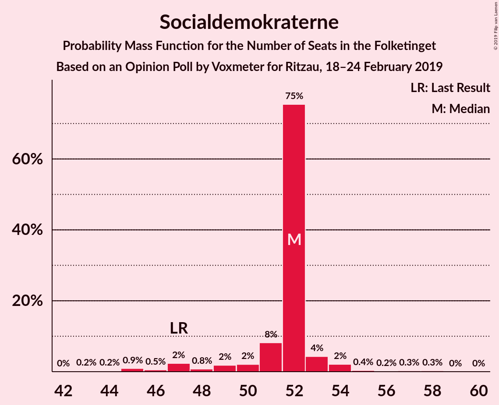
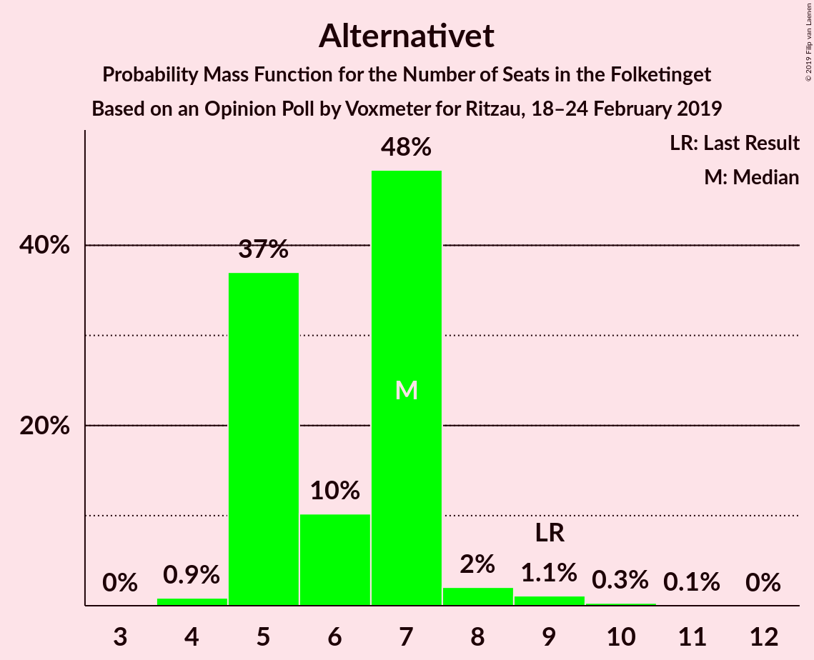
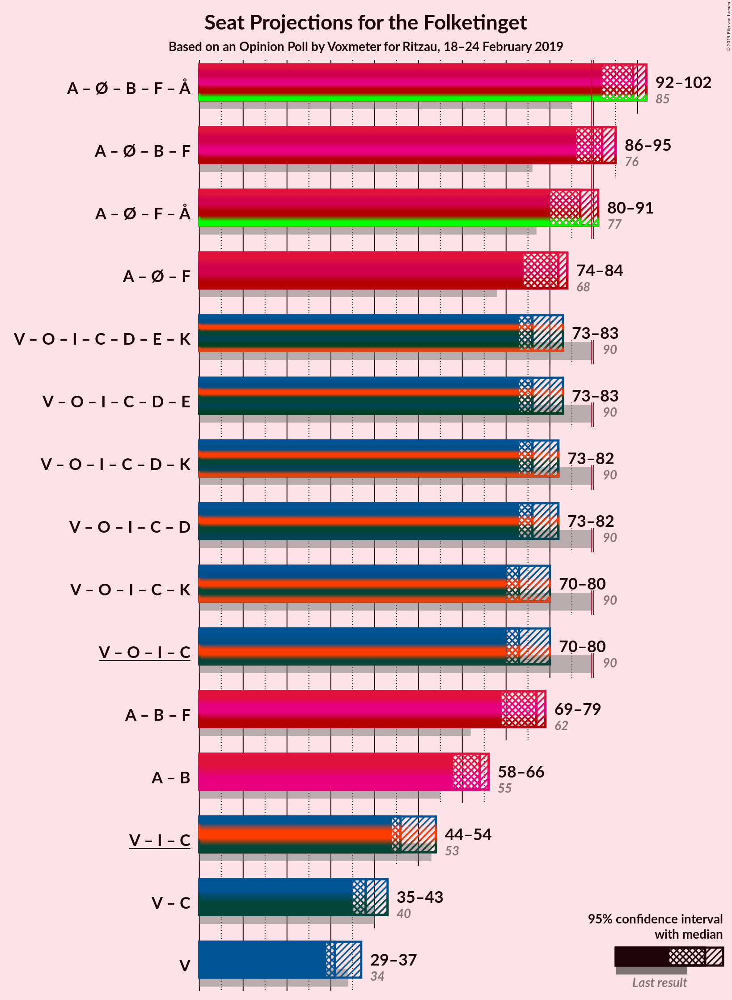
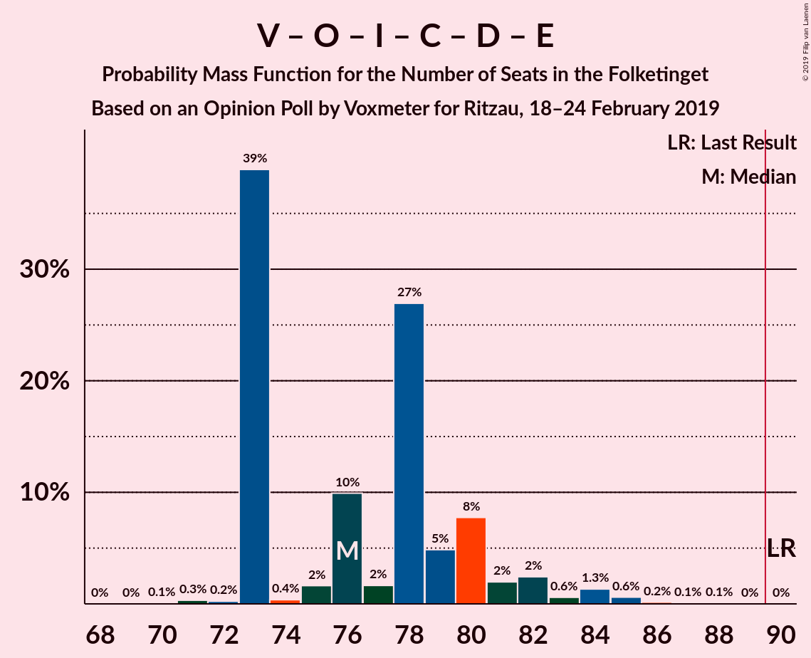
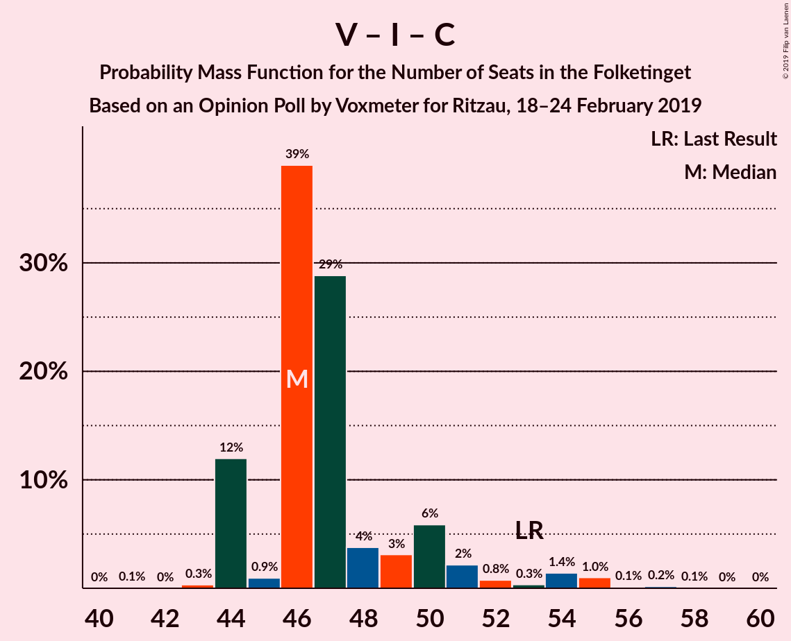

# Opinion Poll by Voxmeter for Ritzau, 18–24 February 2019

<a href="#voting-intentions">Voting Intentions</a> | <a href="#seats">Seats</a> | <a href="#coalitions">Coalitions</a> | <a href="#technical-information">Technical Information</a>

## Voting Intentions

### Confidence Intervals

| Party | Last Result | Poll Result | 80% Confidence Interval | 90% Confidence Interval | 95% Confidence Interval | 99% Confidence Interval |
|:-----:|:-----------:|:-----------:|:-----------------------:|:-----------------------:|:-----------------------:|:-----------------------:|
| Socialdemokraterne | 26.3% | 28.1% | 26.4–29.9% |25.9–30.5% |25.4–30.9% |24.6–31.8% |
| Venstre | 19.5% | 18.6% | 17.1–20.2% |16.7–20.7% |16.3–21.1% |15.7–21.9% |
| Dansk Folkeparti | 21.1% | 14.8% | 13.5–16.3% |13.1–16.8% |12.8–17.1% |12.2–17.9% |
| Enhedslisten–De Rød-Grønne | 7.8% | 9.1% | 8.0–10.4% |7.7–10.7% |7.5–11.0% |7.0–11.7% |
| Radikale Venstre | 4.6% | 6.7% | 5.8–7.8% |5.5–8.1% |5.3–8.4% |4.9–8.9% |
| Socialistisk Folkeparti | 4.2% | 5.9% | 5.1–7.0% |4.8–7.3% |4.6–7.5% |4.3–8.1% |
| Liberal Alliance | 7.5% | 5.0% | 4.3–6.0% |4.0–6.3% |3.9–6.6% |3.5–7.1% |
| Alternativet | 4.8% | 3.7% | 3.0–4.6% |2.9–4.8% |2.7–5.0% |2.4–5.5% |
| Det Konservative Folkeparti | 3.4% | 3.6% | 2.9–4.5% |2.8–4.7% |2.6–4.9% |2.3–5.3% |
| Nye Borgerlige | 0.0% | 2.0% | 1.6–2.7% |1.4–2.9% |1.3–3.1% |1.1–3.5% |
| Klaus Riskær Pedersen | 0.0% | 1.4% | 1.0–2.0% |0.9–2.1% |0.8–2.3% |0.7–2.6% |
| Kristendemokraterne | 0.8% | 0.7% | 0.4–1.1% |0.4–1.3% |0.3–1.4% |0.2–1.7% |

*Note:* The poll result column reflects the actual value used in the calculations. Published results may vary slightly, and in addition be rounded to fewer digits.

## Seats

### Confidence Intervals

| Party | Last Result | Median | 80% Confidence Interval | 90% Confidence Interval | 95% Confidence Interval | 99% Confidence Interval |
|:-----:|:-----------:|:------:|:-----------------------:|:-----------------------:|:-----------------------:|:-----------------------:|
| <a href="#socialdemokraterne">Socialdemokraterne</a> | 47 | 52 | 51–52 |48–53 |47–54 |45–57 |
| <a href="#venstre">Venstre</a> | 34 | 31 | 30–34 |30–36 |29–37 |27–39 |
| <a href="#dansk-folkeparti">Dansk Folkeparti</a> | 37 | 27 | 25–28 |24–29 |23–29 |22–31 |
| <a href="#enhedslisten–de-rød-grønne">Enhedslisten–De Rød-Grønne</a> | 14 | 16 | 15–19 |14–19 |14–21 |13–21 |
| <a href="#radikale-venstre">Radikale Venstre</a> | 8 | 13 | 10–13 |10–13 |9–14 |9–18 |
| <a href="#socialistisk-folkeparti">Socialistisk Folkeparti</a> | 7 | 13 | 11–14 |9–14 |9–14 |8–14 |
| <a href="#liberal-alliance">Liberal Alliance</a> | 13 | 9 | 8–10 |8–10 |8–11 |7–13 |
| <a href="#alternativet">Alternativet</a> | 9 | 7 | 5–7 |5–7 |5–8 |4–9 |
| <a href="#det-konservative-folkeparti">Det Konservative Folkeparti</a> | 6 | 6 | 5–7 |5–8 |5–9 |5–9 |
| <a href="#nye-borgerlige">Nye Borgerlige</a> | 0 | 4 | 0–5 |0–5 |0–6 |0–6 |
| <a href="#klaus-riskær-pedersen">Klaus Riskær Pedersen</a> | 0 | 0 | 0 |0 |0–4 |0–5 |
| <a href="#kristendemokraterne">Kristendemokraterne</a> | 0 | 0 | 0 |0 |0 |0 |

### Socialdemokraterne

*For a full overview of the results for this party, see the [Socialdemokraterne](party-socialdemokraterne.html) page.*

| Number of Seats | Probability | Accumulated | Special Marks |
|:---------------:|:-----------:|:-----------:|:-------------:|
| 43 | 0.2% | 100% |  |
| 44 | 0.2% | 99.8% |  |
| 45 | 0.9% | 99.5% |  |
| 46 | 0.5% | 98.6% |  |
| 47 | 2% | 98% | Last Result |
| 48 | 0.8% | 96% |  |
| 49 | 2% | 95% |  |
| 50 | 2% | 93% |  |
| 51 | 8% | 91% |  |
| 52 | 75% | 83% | Median |
| 53 | 4% | 7% |  |
| 54 | 2% | 3% |  |
| 55 | 0.4% | 1.1% |  |
| 56 | 0.2% | 0.7% |  |
| 57 | 0.3% | 0.6% |  |
| 58 | 0.3% | 0.3% |  |
| 59 | 0% | 0% |  |

### Venstre

*For a full overview of the results for this party, see the [Venstre](party-venstre.html) page.*

| Number of Seats | Probability | Accumulated | Special Marks |
|:---------------:|:-----------:|:-----------:|:-------------:|
| 27 | 2% | 100% |  |
| 28 | 0.2% | 98% |  |
| 29 | 3% | 98% |  |
| 30 | 44% | 95% |  |
| 31 | 1.2% | 51% | Median |
| 32 | 10% | 50% |  |
| 33 | 7% | 40% |  |
| 34 | 27% | 33% | Last Result |
| 35 | 1.1% | 6% |  |
| 36 | 2% | 5% |  |
| 37 | 2% | 3% |  |
| 38 | 0.4% | 1.4% |  |
| 39 | 0.9% | 1.0% |  |
| 40 | 0.1% | 0.2% |  |
| 41 | 0% | 0% |  |

### Dansk Folkeparti

*For a full overview of the results for this party, see the [Dansk Folkeparti](party-danskfolkeparti.html) page.*

| Number of Seats | Probability | Accumulated | Special Marks |
|:---------------:|:-----------:|:-----------:|:-------------:|
| 21 | 0.2% | 100% |  |
| 22 | 1.3% | 99.8% |  |
| 23 | 1.2% | 98.6% |  |
| 24 | 3% | 97% |  |
| 25 | 5% | 94% |  |
| 26 | 5% | 89% |  |
| 27 | 68% | 84% | Median |
| 28 | 9% | 16% |  |
| 29 | 5% | 7% |  |
| 30 | 1.4% | 2% |  |
| 31 | 0.2% | 0.6% |  |
| 32 | 0.2% | 0.3% |  |
| 33 | 0.1% | 0.2% |  |
| 34 | 0% | 0% |  |
| 35 | 0% | 0% |  |
| 36 | 0% | 0% |  |
| 37 | 0% | 0% | Last Result |

### Enhedslisten–De Rød-Grønne

*For a full overview of the results for this party, see the [Enhedslisten–De Rød-Grønne](party-enhedslisten–derød-grønne.html) page.*

| Number of Seats | Probability | Accumulated | Special Marks |
|:---------------:|:-----------:|:-----------:|:-------------:|
| 12 | 0.1% | 100% |  |
| 13 | 2% | 99.9% |  |
| 14 | 5% | 98% | Last Result |
| 15 | 10% | 92% |  |
| 16 | 45% | 82% | Median |
| 17 | 7% | 37% |  |
| 18 | 3% | 30% |  |
| 19 | 24% | 27% |  |
| 20 | 0.6% | 3% |  |
| 21 | 2% | 3% |  |
| 22 | 0.1% | 0.1% |  |
| 23 | 0% | 0% |  |

### Radikale Venstre

*For a full overview of the results for this party, see the [Radikale Venstre](party-radikalevenstre.html) page.*

| Number of Seats | Probability | Accumulated | Special Marks |
|:---------------:|:-----------:|:-----------:|:-------------:|
| 8 | 0.3% | 100% | Last Result |
| 9 | 3% | 99.7% |  |
| 10 | 28% | 96% |  |
| 11 | 10% | 69% |  |
| 12 | 6% | 59% |  |
| 13 | 48% | 53% | Median |
| 14 | 3% | 5% |  |
| 15 | 0.9% | 2% |  |
| 16 | 0.2% | 0.8% |  |
| 17 | 0.1% | 0.6% |  |
| 18 | 0.6% | 0.6% |  |
| 19 | 0% | 0% |  |

### Socialistisk Folkeparti

*For a full overview of the results for this party, see the [Socialistisk Folkeparti](party-socialistiskfolkeparti.html) page.*

| Number of Seats | Probability | Accumulated | Special Marks |
|:---------------:|:-----------:|:-----------:|:-------------:|
| 7 | 0.3% | 100% | Last Result |
| 8 | 2% | 99.6% |  |
| 9 | 3% | 98% |  |
| 10 | 2% | 95% |  |
| 11 | 34% | 92% |  |
| 12 | 8% | 58% |  |
| 13 | 13% | 50% | Median |
| 14 | 37% | 37% |  |
| 15 | 0.3% | 0.3% |  |
| 16 | 0% | 0% |  |

### Liberal Alliance

*For a full overview of the results for this party, see the [Liberal Alliance](party-liberalalliance.html) page.*

| Number of Seats | Probability | Accumulated | Special Marks |
|:---------------:|:-----------:|:-----------:|:-------------:|
| 6 | 0.2% | 100% |  |
| 7 | 1.5% | 99.8% |  |
| 8 | 47% | 98% |  |
| 9 | 6% | 52% | Median |
| 10 | 43% | 46% |  |
| 11 | 1.5% | 3% |  |
| 12 | 0.9% | 2% |  |
| 13 | 0.7% | 0.8% | Last Result |
| 14 | 0% | 0.1% |  |
| 15 | 0.1% | 0.1% |  |
| 16 | 0% | 0% |  |

### Alternativet

*For a full overview of the results for this party, see the [Alternativet](party-alternativet.html) page.*

| Number of Seats | Probability | Accumulated | Special Marks |
|:---------------:|:-----------:|:-----------:|:-------------:|
| 4 | 0.9% | 100% |  |
| 5 | 37% | 99.1% |  |
| 6 | 10% | 62% |  |
| 7 | 48% | 52% | Median |
| 8 | 2% | 4% |  |
| 9 | 1.1% | 1.5% | Last Result |
| 10 | 0.3% | 0.4% |  |
| 11 | 0.1% | 0.1% |  |
| 12 | 0% | 0% |  |

### Det Konservative Folkeparti

*For a full overview of the results for this party, see the [Det Konservative Folkeparti](party-detkonservativefolkeparti.html) page.*

| Number of Seats | Probability | Accumulated | Special Marks |
|:---------------:|:-----------:|:-----------:|:-------------:|
| 4 | 0.4% | 100% |  |
| 5 | 29% | 99.5% |  |
| 6 | 50% | 71% | Last Result, Median |
| 7 | 15% | 21% |  |
| 8 | 3% | 6% |  |
| 9 | 3% | 3% |  |
| 10 | 0.2% | 0.4% |  |
| 11 | 0.2% | 0.2% |  |
| 12 | 0% | 0% |  |

### Nye Borgerlige

*For a full overview of the results for this party, see the [Nye Borgerlige](party-nyeborgerlige.html) page.*

| Number of Seats | Probability | Accumulated | Special Marks |
|:---------------:|:-----------:|:-----------:|:-------------:|
| 0 | 46% | 100% | Last Result |
| 1 | 0% | 54% |  |
| 2 | 0% | 54% |  |
| 3 | 0% | 54% |  |
| 4 | 34% | 54% | Median |
| 5 | 17% | 20% |  |
| 6 | 3% | 3% |  |
| 7 | 0.1% | 0.1% |  |
| 8 | 0% | 0% |  |

### Klaus Riskær Pedersen

*For a full overview of the results for this party, see the [Klaus Riskær Pedersen](party-klausriskærpedersen.html) page.*

| Number of Seats | Probability | Accumulated | Special Marks |
|:---------------:|:-----------:|:-----------:|:-------------:|
| 0 | 97% | 100% | Last Result, Median |
| 1 | 0% | 3% |  |
| 2 | 0% | 3% |  |
| 3 | 0% | 3% |  |
| 4 | 2% | 3% |  |
| 5 | 1.3% | 1.4% |  |
| 6 | 0% | 0% |  |

### Kristendemokraterne

*For a full overview of the results for this party, see the [Kristendemokraterne](party-kristendemokraterne.html) page.*

| Number of Seats | Probability | Accumulated | Special Marks |
|:---------------:|:-----------:|:-----------:|:-------------:|
| 0 | 100% | 100% | Last Result, Median |

## Coalitions

### Confidence Intervals

| Coalition | Last Result | Median | Majority? | 80% Confidence Interval | 90% Confidence Interval | 95% Confidence Interval | 99% Confidence Interval |
|:---------:|:-----------:|:------:|:---------:|:-----------------------:|:-----------------------:|:-----------------------:|:-----------------------:|
| Socialdemokraterne – Enhedslisten–De Rød-Grønne – Radikale Venstre – Socialistisk Folkeparti – Alternativet | 85 | 99 | 99.7% | 95–102 | 93–102 | 92–102 | 90–103 |
| Socialdemokraterne – Enhedslisten–De Rød-Grønne – Radikale Venstre – Socialistisk Folkeparti | 76 | 92 | 85% | 89–95 | 87–95 | 86–95 | 83–96 |
| Socialdemokraterne – Enhedslisten–De Rød-Grønne – Socialistisk Folkeparti – Alternativet | 77 | 87 | 4% | 83–89 | 82–89 | 80–91 | 78–93 |
| Socialdemokraterne – Enhedslisten–De Rød-Grønne – Socialistisk Folkeparti | 68 | 82 | 0% | 77–82 | 75–82 | 74–84 | 71–86 |
| Venstre – Dansk Folkeparti – Liberal Alliance – Det Konservative Folkeparti – Nye Borgerlige – Klaus Riskær Pedersen – Kristendemokraterne | 90 | 76 | 0% | 73–80 | 73–82 | 73–83 | 72–85 |
| Venstre – Dansk Folkeparti – Liberal Alliance – Det Konservative Folkeparti – Nye Borgerlige – Klaus Riskær Pedersen | 90 | 76 | 0% | 73–80 | 73–82 | 73–83 | 72–85 |
| Venstre – Dansk Folkeparti – Liberal Alliance – Det Konservative Folkeparti – Nye Borgerlige – Kristendemokraterne | 90 | 76 | 0% | 73–80 | 73–81 | 73–82 | 72–85 |
| Venstre – Dansk Folkeparti – Liberal Alliance – Det Konservative Folkeparti – Nye Borgerlige | 90 | 76 | 0% | 73–80 | 73–81 | 73–82 | 72–85 |
| Venstre – Dansk Folkeparti – Liberal Alliance – Det Konservative Folkeparti – Kristendemokraterne | 90 | 73 | 0% | 71–77 | 71–78 | 70–80 | 69–82 |
| Venstre – Dansk Folkeparti – Liberal Alliance – Det Konservative Folkeparti | 90 | 73 | 0% | 71–77 | 71–78 | 70–80 | 69–82 |
| Socialdemokraterne – Radikale Venstre – Socialistisk Folkeparti | 62 | 77 | 0% | 73–79 | 71–79 | 69–79 | 66–80 |
| Socialdemokraterne – Radikale Venstre | 55 | 64 | 0% | 62–65 | 59–65 | 58–66 | 56–69 |
| Venstre – Liberal Alliance – Det Konservative Folkeparti | 53 | 46 | 0% | 44–50 | 44–51 | 44–54 | 44–55 |
| Venstre – Det Konservative Folkeparti | 40 | 38 | 0% | 36–41 | 36–42 | 35–43 | 34–46 |
| Venstre | 34 | 31 | 0% | 30–34 | 30–36 | 29–37 | 27–39 |

### Socialdemokraterne – Enhedslisten–De Rød-Grønne – Radikale Venstre – Socialistisk Folkeparti – Alternativet

| Number of Seats | Probability | Accumulated | Special Marks |
|:---------------:|:-----------:|:-----------:|:-------------:|
| 85 | 0% | 100% | Last Result |
| 86 | 0% | 100% |  |
| 87 | 0.1% | 100% |  |
| 88 | 0.1% | 99.9% |  |
| 89 | 0.2% | 99.8% |  |
| 90 | 0.6% | 99.7% | Majority |
| 91 | 1.3% | 99.1% |  |
| 92 | 0.6% | 98% |  |
| 93 | 2% | 97% |  |
| 94 | 2% | 95% |  |
| 95 | 8% | 93% |  |
| 96 | 5% | 85% |  |
| 97 | 27% | 80% |  |
| 98 | 2% | 53% |  |
| 99 | 10% | 52% |  |
| 100 | 2% | 42% |  |
| 101 | 0.4% | 40% | Median |
| 102 | 39% | 40% |  |
| 103 | 0.2% | 0.7% |  |
| 104 | 0.3% | 0.4% |  |
| 105 | 0.1% | 0.1% |  |
| 106 | 0% | 0% |  |

### Socialdemokraterne – Enhedslisten–De Rød-Grønne – Radikale Venstre – Socialistisk Folkeparti

| Number of Seats | Probability | Accumulated | Special Marks |
|:---------------:|:-----------:|:-----------:|:-------------:|
| 76 | 0% | 100% | Last Result |
| 77 | 0% | 100% |  |
| 78 | 0% | 100% |  |
| 79 | 0% | 100% |  |
| 80 | 0% | 100% |  |
| 81 | 0.1% | 100% |  |
| 82 | 0.1% | 99.8% |  |
| 83 | 0.6% | 99.7% |  |
| 84 | 1.0% | 99.1% |  |
| 85 | 0.6% | 98% |  |
| 86 | 3% | 98% |  |
| 87 | 1.3% | 95% |  |
| 88 | 3% | 94% |  |
| 89 | 6% | 91% |  |
| 90 | 5% | 85% | Majority |
| 91 | 5% | 80% |  |
| 92 | 26% | 75% |  |
| 93 | 0.3% | 49% |  |
| 94 | 9% | 49% | Median |
| 95 | 39% | 40% |  |
| 96 | 0.6% | 1.1% |  |
| 97 | 0.2% | 0.5% |  |
| 98 | 0.2% | 0.3% |  |
| 99 | 0% | 0.1% |  |
| 100 | 0.1% | 0.1% |  |
| 101 | 0% | 0% |  |

### Socialdemokraterne – Enhedslisten–De Rød-Grønne – Socialistisk Folkeparti – Alternativet

| Number of Seats | Probability | Accumulated | Special Marks |
|:---------------:|:-----------:|:-----------:|:-------------:|
| 75 | 0.1% | 100% |  |
| 76 | 0.1% | 99.9% |  |
| 77 | 0.1% | 99.8% | Last Result |
| 78 | 0.4% | 99.6% |  |
| 79 | 1.5% | 99.2% |  |
| 80 | 1.4% | 98% |  |
| 81 | 0.5% | 96% |  |
| 82 | 2% | 96% |  |
| 83 | 7% | 94% |  |
| 84 | 7% | 87% |  |
| 85 | 3% | 80% |  |
| 86 | 12% | 78% |  |
| 87 | 24% | 66% |  |
| 88 | 0.2% | 42% | Median |
| 89 | 37% | 42% |  |
| 90 | 2% | 4% | Majority |
| 91 | 0.7% | 3% |  |
| 92 | 0.1% | 2% |  |
| 93 | 2% | 2% |  |
| 94 | 0% | 0% |  |

### Socialdemokraterne – Enhedslisten–De Rød-Grønne – Socialistisk Folkeparti

| Number of Seats | Probability | Accumulated | Special Marks |
|:---------------:|:-----------:|:-----------:|:-------------:|
| 68 | 0.1% | 100% | Last Result |
| 69 | 0.1% | 99.9% |  |
| 70 | 0.2% | 99.9% |  |
| 71 | 0.6% | 99.6% |  |
| 72 | 0.9% | 99.1% |  |
| 73 | 0.6% | 98% |  |
| 74 | 1.4% | 98% |  |
| 75 | 1.2% | 96% |  |
| 76 | 4% | 95% |  |
| 77 | 2% | 91% |  |
| 78 | 10% | 89% |  |
| 79 | 4% | 79% |  |
| 80 | 1.4% | 75% |  |
| 81 | 9% | 74% | Median |
| 82 | 60% | 65% |  |
| 83 | 2% | 5% |  |
| 84 | 0.1% | 3% |  |
| 85 | 0.6% | 2% |  |
| 86 | 2% | 2% |  |
| 87 | 0.1% | 0.1% |  |
| 88 | 0% | 0% |  |

### Venstre – Dansk Folkeparti – Liberal Alliance – Det Konservative Folkeparti – Nye Borgerlige – Klaus Riskær Pedersen – Kristendemokraterne

| Number of Seats | Probability | Accumulated | Special Marks |
|:---------------:|:-----------:|:-----------:|:-------------:|
| 70 | 0.1% | 100% |  |
| 71 | 0.3% | 99.9% |  |
| 72 | 0.2% | 99.6% |  |
| 73 | 39% | 99.3% |  |
| 74 | 0.4% | 60% |  |
| 75 | 2% | 60% |  |
| 76 | 10% | 58% |  |
| 77 | 2% | 48% | Median |
| 78 | 27% | 47% |  |
| 79 | 5% | 20% |  |
| 80 | 8% | 15% |  |
| 81 | 2% | 7% |  |
| 82 | 2% | 5% |  |
| 83 | 0.6% | 3% |  |
| 84 | 1.3% | 2% |  |
| 85 | 0.6% | 0.9% |  |
| 86 | 0.2% | 0.3% |  |
| 87 | 0.1% | 0.2% |  |
| 88 | 0.1% | 0.1% |  |
| 89 | 0% | 0% |  |
| 90 | 0% | 0% | Last Result, Majority |

### Venstre – Dansk Folkeparti – Liberal Alliance – Det Konservative Folkeparti – Nye Borgerlige – Klaus Riskær Pedersen

| Number of Seats | Probability | Accumulated | Special Marks |
|:---------------:|:-----------:|:-----------:|:-------------:|
| 70 | 0.1% | 100% |  |
| 71 | 0.3% | 99.9% |  |
| 72 | 0.2% | 99.6% |  |
| 73 | 39% | 99.3% |  |
| 74 | 0.4% | 60% |  |
| 75 | 2% | 60% |  |
| 76 | 10% | 58% |  |
| 77 | 2% | 48% | Median |
| 78 | 27% | 47% |  |
| 79 | 5% | 20% |  |
| 80 | 8% | 15% |  |
| 81 | 2% | 7% |  |
| 82 | 2% | 5% |  |
| 83 | 0.6% | 3% |  |
| 84 | 1.3% | 2% |  |
| 85 | 0.6% | 0.9% |  |
| 86 | 0.2% | 0.3% |  |
| 87 | 0.1% | 0.2% |  |
| 88 | 0.1% | 0.1% |  |
| 89 | 0% | 0% |  |
| 90 | 0% | 0% | Last Result, Majority |

### Venstre – Dansk Folkeparti – Liberal Alliance – Det Konservative Folkeparti – Nye Borgerlige – Kristendemokraterne

| Number of Seats | Probability | Accumulated | Special Marks |
|:---------------:|:-----------:|:-----------:|:-------------:|
| 70 | 0.1% | 100% |  |
| 71 | 0.3% | 99.9% |  |
| 72 | 0.3% | 99.5% |  |
| 73 | 39% | 99.2% |  |
| 74 | 0.4% | 60% |  |
| 75 | 2% | 59% |  |
| 76 | 11% | 58% |  |
| 77 | 2% | 47% | Median |
| 78 | 27% | 45% |  |
| 79 | 5% | 19% |  |
| 80 | 8% | 14% |  |
| 81 | 1.2% | 5% |  |
| 82 | 2% | 4% |  |
| 83 | 0.6% | 2% |  |
| 84 | 0.7% | 1.4% |  |
| 85 | 0.6% | 0.7% |  |
| 86 | 0% | 0.1% |  |
| 87 | 0% | 0.1% |  |
| 88 | 0.1% | 0.1% |  |
| 89 | 0% | 0% |  |
| 90 | 0% | 0% | Last Result, Majority |

### Venstre – Dansk Folkeparti – Liberal Alliance – Det Konservative Folkeparti – Nye Borgerlige

| Number of Seats | Probability | Accumulated | Special Marks |
|:---------------:|:-----------:|:-----------:|:-------------:|
| 70 | 0.1% | 100% |  |
| 71 | 0.3% | 99.9% |  |
| 72 | 0.3% | 99.5% |  |
| 73 | 39% | 99.2% |  |
| 74 | 0.4% | 60% |  |
| 75 | 2% | 59% |  |
| 76 | 11% | 58% |  |
| 77 | 2% | 47% | Median |
| 78 | 27% | 45% |  |
| 79 | 5% | 19% |  |
| 80 | 8% | 14% |  |
| 81 | 1.2% | 5% |  |
| 82 | 2% | 4% |  |
| 83 | 0.6% | 2% |  |
| 84 | 0.7% | 1.4% |  |
| 85 | 0.6% | 0.7% |  |
| 86 | 0% | 0.1% |  |
| 87 | 0% | 0.1% |  |
| 88 | 0.1% | 0.1% |  |
| 89 | 0% | 0% |  |
| 90 | 0% | 0% | Last Result, Majority |

### Venstre – Dansk Folkeparti – Liberal Alliance – Det Konservative Folkeparti – Kristendemokraterne

| Number of Seats | Probability | Accumulated | Special Marks |
|:---------------:|:-----------:|:-----------:|:-------------:|
| 67 | 0.2% | 100% |  |
| 68 | 0.1% | 99.8% |  |
| 69 | 2% | 99.7% |  |
| 70 | 3% | 98% |  |
| 71 | 9% | 95% |  |
| 72 | 0.8% | 86% |  |
| 73 | 39% | 86% | Median |
| 74 | 24% | 46% |  |
| 75 | 9% | 22% |  |
| 76 | 3% | 13% |  |
| 77 | 3% | 10% |  |
| 78 | 3% | 8% |  |
| 79 | 2% | 5% |  |
| 80 | 1.2% | 3% |  |
| 81 | 0.9% | 2% |  |
| 82 | 0.6% | 0.8% |  |
| 83 | 0% | 0.2% |  |
| 84 | 0.1% | 0.2% |  |
| 85 | 0.1% | 0.1% |  |
| 86 | 0% | 0% |  |
| 87 | 0% | 0% |  |
| 88 | 0% | 0% |  |
| 89 | 0% | 0% |  |
| 90 | 0% | 0% | Last Result, Majority |

### Venstre – Dansk Folkeparti – Liberal Alliance – Det Konservative Folkeparti

| Number of Seats | Probability | Accumulated | Special Marks |
|:---------------:|:-----------:|:-----------:|:-------------:|
| 67 | 0.2% | 100% |  |
| 68 | 0.1% | 99.8% |  |
| 69 | 2% | 99.7% |  |
| 70 | 3% | 98% |  |
| 71 | 9% | 95% |  |
| 72 | 0.8% | 86% |  |
| 73 | 39% | 86% | Median |
| 74 | 24% | 46% |  |
| 75 | 9% | 22% |  |
| 76 | 3% | 13% |  |
| 77 | 3% | 10% |  |
| 78 | 3% | 8% |  |
| 79 | 2% | 5% |  |
| 80 | 1.2% | 3% |  |
| 81 | 0.9% | 2% |  |
| 82 | 0.6% | 0.8% |  |
| 83 | 0% | 0.2% |  |
| 84 | 0.1% | 0.2% |  |
| 85 | 0.1% | 0.1% |  |
| 86 | 0% | 0% |  |
| 87 | 0% | 0% |  |
| 88 | 0% | 0% |  |
| 89 | 0% | 0% |  |
| 90 | 0% | 0% | Last Result, Majority |

### Socialdemokraterne – Radikale Venstre – Socialistisk Folkeparti

| Number of Seats | Probability | Accumulated | Special Marks |
|:---------------:|:-----------:|:-----------:|:-------------:|
| 62 | 0% | 100% | Last Result |
| 63 | 0% | 100% |  |
| 64 | 0% | 100% |  |
| 65 | 0.1% | 100% |  |
| 66 | 0.7% | 99.9% |  |
| 67 | 0.5% | 99.2% |  |
| 68 | 1.1% | 98.6% |  |
| 69 | 1.0% | 98% |  |
| 70 | 1.2% | 97% |  |
| 71 | 0.7% | 95% |  |
| 72 | 2% | 95% |  |
| 73 | 27% | 93% |  |
| 74 | 10% | 66% |  |
| 75 | 5% | 56% |  |
| 76 | 0.7% | 51% |  |
| 77 | 4% | 50% |  |
| 78 | 10% | 46% | Median |
| 79 | 35% | 36% |  |
| 80 | 0.7% | 1.1% |  |
| 81 | 0% | 0.3% |  |
| 82 | 0.2% | 0.3% |  |
| 83 | 0% | 0% |  |

### Socialdemokraterne – Radikale Venstre

| Number of Seats | Probability | Accumulated | Special Marks |
|:---------------:|:-----------:|:-----------:|:-------------:|
| 54 | 0.1% | 100% |  |
| 55 | 0.2% | 99.9% | Last Result |
| 56 | 0.2% | 99.6% |  |
| 57 | 1.4% | 99.4% |  |
| 58 | 1.1% | 98% |  |
| 59 | 2% | 97% |  |
| 60 | 0.9% | 95% |  |
| 61 | 2% | 94% |  |
| 62 | 28% | 93% |  |
| 63 | 9% | 65% |  |
| 64 | 8% | 56% |  |
| 65 | 45% | 48% | Median |
| 66 | 0.7% | 3% |  |
| 67 | 1.0% | 2% |  |
| 68 | 0.7% | 1.2% |  |
| 69 | 0.1% | 0.5% |  |
| 70 | 0.3% | 0.5% |  |
| 71 | 0% | 0.2% |  |
| 72 | 0.1% | 0.1% |  |
| 73 | 0% | 0% |  |

### Venstre – Liberal Alliance – Det Konservative Folkeparti

| Number of Seats | Probability | Accumulated | Special Marks |
|:---------------:|:-----------:|:-----------:|:-------------:|
| 41 | 0.1% | 100% |  |
| 42 | 0% | 99.9% |  |
| 43 | 0.3% | 99.9% |  |
| 44 | 12% | 99.6% |  |
| 45 | 0.9% | 88% |  |
| 46 | 39% | 87% | Median |
| 47 | 29% | 48% |  |
| 48 | 4% | 19% |  |
| 49 | 3% | 15% |  |
| 50 | 6% | 12% |  |
| 51 | 2% | 6% |  |
| 52 | 0.8% | 4% |  |
| 53 | 0.3% | 3% | Last Result |
| 54 | 1.4% | 3% |  |
| 55 | 1.0% | 1.3% |  |
| 56 | 0.1% | 0.4% |  |
| 57 | 0.2% | 0.2% |  |
| 58 | 0.1% | 0.1% |  |
| 59 | 0% | 0% |  |

### Venstre – Det Konservative Folkeparti

| Number of Seats | Probability | Accumulated | Special Marks |
|:---------------:|:-----------:|:-----------:|:-------------:|
| 33 | 0.1% | 100% |  |
| 34 | 2% | 99.9% |  |
| 35 | 1.0% | 98% |  |
| 36 | 45% | 97% |  |
| 37 | 2% | 52% | Median |
| 38 | 6% | 51% |  |
| 39 | 31% | 45% |  |
| 40 | 3% | 14% | Last Result |
| 41 | 3% | 11% |  |
| 42 | 4% | 7% |  |
| 43 | 1.3% | 3% |  |
| 44 | 0.4% | 2% |  |
| 45 | 0.7% | 2% |  |
| 46 | 0.4% | 0.9% |  |
| 47 | 0.3% | 0.5% |  |
| 48 | 0.1% | 0.2% |  |
| 49 | 0.1% | 0.1% |  |
| 50 | 0% | 0% |  |

### Venstre

| Number of Seats | Probability | Accumulated | Special Marks |
|:---------------:|:-----------:|:-----------:|:-------------:|
| 27 | 2% | 100% |  |
| 28 | 0.2% | 98% |  |
| 29 | 3% | 98% |  |
| 30 | 44% | 95% |  |
| 31 | 1.2% | 51% | Median |
| 32 | 10% | 50% |  |
| 33 | 7% | 40% |  |
| 34 | 27% | 33% | Last Result |
| 35 | 1.1% | 6% |  |
| 36 | 2% | 5% |  |
| 37 | 2% | 3% |  |
| 38 | 0.4% | 1.4% |  |
| 39 | 0.9% | 1.0% |  |
| 40 | 0.1% | 0.2% |  |
| 41 | 0% | 0% |  |

## Technical Information

### Opinion Poll

+ **Polling firm:** Voxmeter
+ **Commissioner(s):** Ritzau
+ **Fieldwork period:** 18–24 February 2019

### Calculations

+ **Sample size:** 1032
+ **Simulations done:** 1,048,576
+ **Error estimate:** 2.73%

