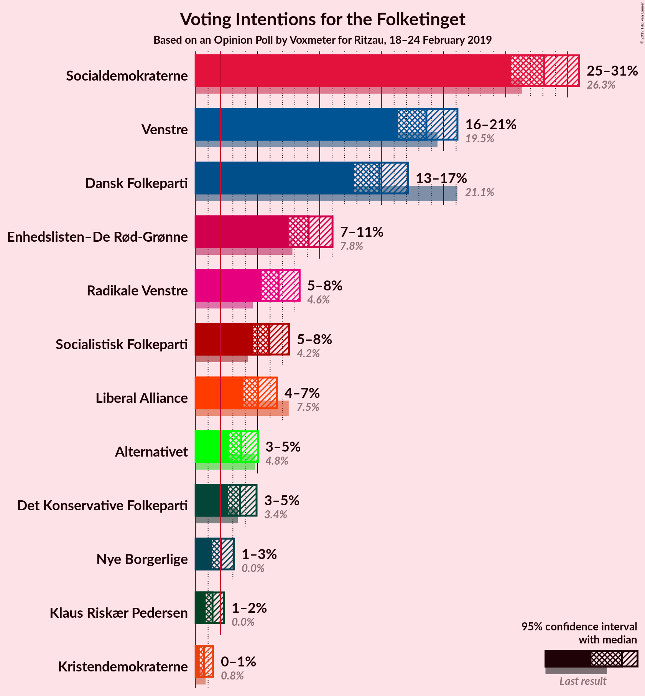
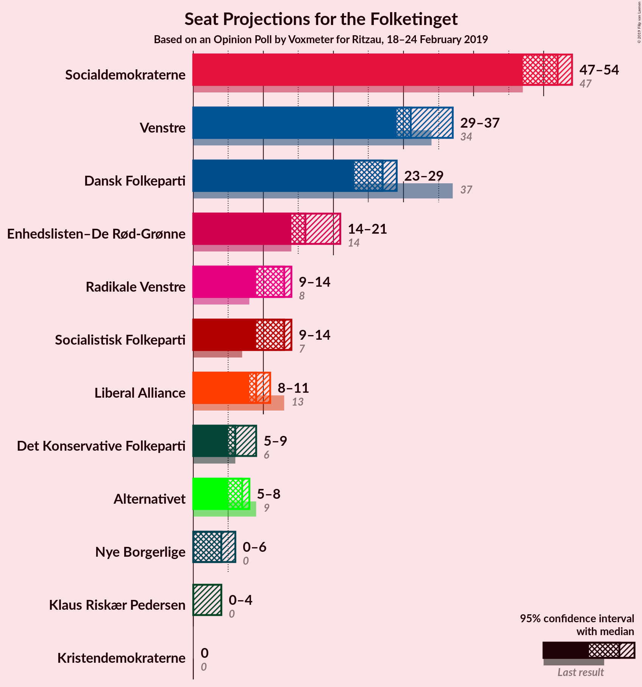
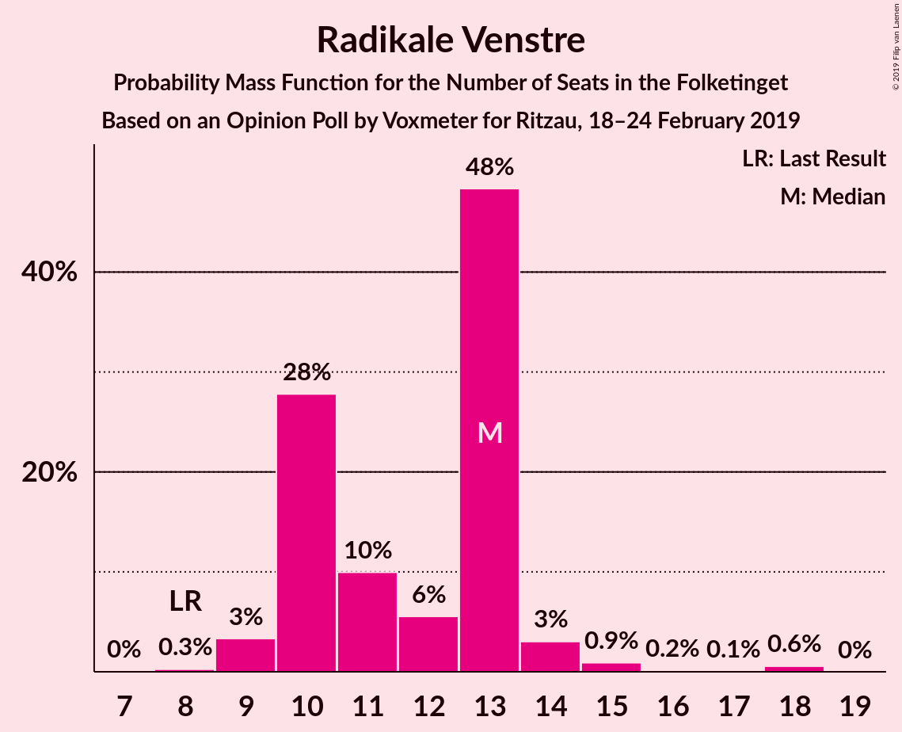
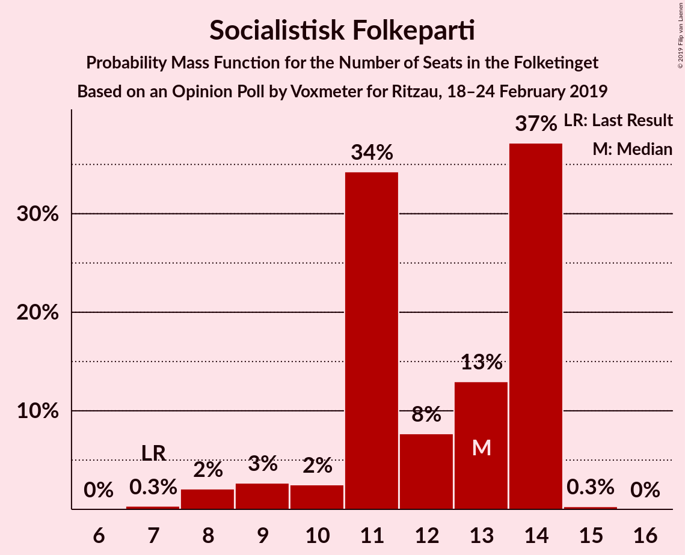
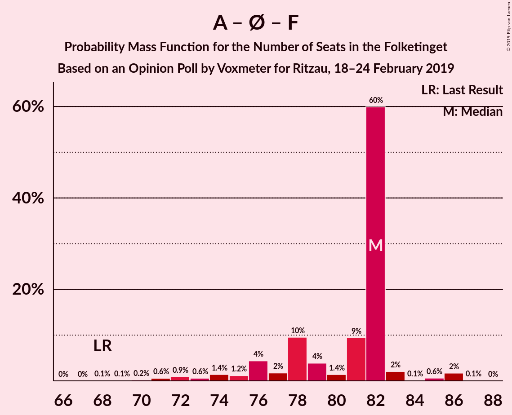

# Opinion Poll by Voxmeter for Ritzau, 18–24 February 2019

<a href="#voting-intentions">Voting Intentions</a> | <a href="#seats">Seats</a> | <a href="#coalitions">Coalitions</a> | <a href="#technical-information">Technical Information</a>

## Voting Intentions

### Confidence Intervals

| Party | Last Result | Poll Result | 80% Confidence Interval | 90% Confidence Interval | 95% Confidence Interval | 99% Confidence Interval |
|:-----:|:-----------:|:-----------:|:-----------------------:|:-----------------------:|:-----------------------:|:-----------------------:|
| Socialdemokraterne | 26.3% | 28.1% | 26.4–29.9% |25.9–30.5% |25.4–30.9% |24.6–31.8% |
| Venstre | 19.5% | 18.6% | 17.1–20.2% |16.7–20.7% |16.3–21.1% |15.7–21.9% |
| Dansk Folkeparti | 21.1% | 14.8% | 13.5–16.3% |13.1–16.8% |12.8–17.1% |12.2–17.9% |
| Enhedslisten–De Rød-Grønne | 7.8% | 9.1% | 8.0–10.4% |7.7–10.7% |7.5–11.0% |7.0–11.7% |
| Radikale Venstre | 4.6% | 6.7% | 5.8–7.8% |5.5–8.1% |5.3–8.4% |4.9–8.9% |
| Socialistisk Folkeparti | 4.2% | 5.9% | 5.1–7.0% |4.8–7.3% |4.6–7.5% |4.3–8.1% |
| Liberal Alliance | 7.5% | 5.0% | 4.3–6.0% |4.0–6.3% |3.9–6.6% |3.5–7.1% |
| Alternativet | 4.8% | 3.7% | 3.0–4.6% |2.9–4.8% |2.7–5.0% |2.4–5.5% |
| Det Konservative Folkeparti | 3.4% | 3.6% | 2.9–4.5% |2.8–4.7% |2.6–4.9% |2.3–5.3% |
| Nye Borgerlige | 0.0% | 2.0% | 1.6–2.7% |1.4–2.9% |1.3–3.1% |1.1–3.5% |
| Klaus Riskær Pedersen | 0.0% | 1.4% | 1.0–2.0% |0.9–2.1% |0.8–2.3% |0.7–2.6% |
| Kristendemokraterne | 0.8% | 0.7% | 0.4–1.1% |0.4–1.3% |0.3–1.4% |0.2–1.7% |

*Note:* The poll result column reflects the actual value used in the calculations. Published results may vary slightly, and in addition be rounded to fewer digits.

## Seats

### Confidence Intervals

| Party | Last Result | Median | 80% Confidence Interval | 90% Confidence Interval | 95% Confidence Interval | 99% Confidence Interval |
|:-----:|:-----------:|:------:|:-----------------------:|:-----------------------:|:-----------------------:|:-----------------------:|
| <a href="#socialdemokraterne">Socialdemokraterne</a> | 47 | 51 | 47–54 |45–57 |45–58 |43–58 |
| <a href="#venstre">Venstre</a> | 34 | 32 | 29–39 |29–39 |28–39 |28–41 |
| <a href="#dansk-folkeparti">Dansk Folkeparti</a> | 37 | 28 | 24–30 |23–30 |22–30 |21–35 |
| <a href="#enhedslisten–de-rød-grønne">Enhedslisten–De Rød-Grønne</a> | 14 | 16 | 15–18 |14–19 |13–21 |12–22 |
| <a href="#radikale-venstre">Radikale Venstre</a> | 8 | 12 | 10–14 |10–14 |10–16 |9–17 |
| <a href="#socialistisk-folkeparti">Socialistisk Folkeparti</a> | 7 | 11 | 9–12 |9–13 |9–15 |6–16 |
| <a href="#liberal-alliance">Liberal Alliance</a> | 13 | 9 | 7–12 |7–12 |7–12 |6–13 |
| <a href="#alternativet">Alternativet</a> | 9 | 7 | 5–9 |5–9 |5–9 |4–11 |
| <a href="#det-konservative-folkeparti">Det Konservative Folkeparti</a> | 6 | 6 | 5–7 |5–8 |5–8 |5–9 |
| <a href="#nye-borgerlige">Nye Borgerlige</a> | 0 | 4 | 0–6 |0–6 |0–6 |0–7 |
| <a href="#klaus-riskær-pedersen">Klaus Riskær Pedersen</a> | 0 | 0 | 0–4 |0–4 |0–5 |0–5 |
| <a href="#kristendemokraterne">Kristendemokraterne</a> | 0 | 0 | 0 |0 |0 |0 |

### Socialdemokraterne

*For a full overview of the results for this party, see the [Socialdemokraterne](party-socialdemokraterne.html) page.*

| Number of Seats | Probability | Accumulated | Special Marks |
|:---------------:|:-----------:|:-----------:|:-------------:|
| 41 | 0.1% | 100% |  |
| 42 | 0% | 99.9% |  |
| 43 | 1.0% | 99.9% |  |
| 44 | 1.0% | 98.9% |  |
| 45 | 6% | 98% |  |
| 46 | 1.0% | 92% |  |
| 47 | 19% | 91% | Last Result |
| 48 | 5% | 72% |  |
| 49 | 5% | 66% |  |
| 50 | 3% | 62% |  |
| 51 | 36% | 59% | Median |
| 52 | 3% | 23% |  |
| 53 | 1.2% | 20% |  |
| 54 | 10% | 18% |  |
| 55 | 1.5% | 8% |  |
| 56 | 0% | 6% |  |
| 57 | 2% | 6% |  |
| 58 | 4% | 5% |  |
| 59 | 0.1% | 0.1% |  |
| 60 | 0% | 0% |  |

### Venstre

*For a full overview of the results for this party, see the [Venstre](party-venstre.html) page.*

| Number of Seats | Probability | Accumulated | Special Marks |
|:---------------:|:-----------:|:-----------:|:-------------:|
| 27 | 0.2% | 100% |  |
| 28 | 3% | 99.8% |  |
| 29 | 21% | 97% |  |
| 30 | 10% | 75% |  |
| 31 | 3% | 65% |  |
| 32 | 15% | 62% | Median |
| 33 | 8% | 48% |  |
| 34 | 3% | 40% | Last Result |
| 35 | 4% | 37% |  |
| 36 | 3% | 32% |  |
| 37 | 13% | 29% |  |
| 38 | 0.5% | 16% |  |
| 39 | 15% | 16% |  |
| 40 | 0.1% | 0.7% |  |
| 41 | 0.6% | 0.6% |  |
| 42 | 0% | 0% |  |

### Dansk Folkeparti

*For a full overview of the results for this party, see the [Dansk Folkeparti](party-danskfolkeparti.html) page.*

| Number of Seats | Probability | Accumulated | Special Marks |
|:---------------:|:-----------:|:-----------:|:-------------:|
| 21 | 0.8% | 100% |  |
| 22 | 2% | 99.1% |  |
| 23 | 5% | 97% |  |
| 24 | 8% | 92% |  |
| 25 | 14% | 84% |  |
| 26 | 5% | 70% |  |
| 27 | 7% | 65% |  |
| 28 | 24% | 58% | Median |
| 29 | 6% | 34% |  |
| 30 | 26% | 28% |  |
| 31 | 0.8% | 2% |  |
| 32 | 0.4% | 1.2% |  |
| 33 | 0.1% | 0.8% |  |
| 34 | 0% | 0.7% |  |
| 35 | 0.5% | 0.7% |  |
| 36 | 0.2% | 0.2% |  |
| 37 | 0% | 0% | Last Result |

### Enhedslisten–De Rød-Grønne

*For a full overview of the results for this party, see the [Enhedslisten–De Rød-Grønne](party-enhedslisten–derød-grønne.html) page.*

| Number of Seats | Probability | Accumulated | Special Marks |
|:---------------:|:-----------:|:-----------:|:-------------:|
| 11 | 0.1% | 100% |  |
| 12 | 0.8% | 99.9% |  |
| 13 | 3% | 99.1% |  |
| 14 | 3% | 96% | Last Result |
| 15 | 18% | 93% |  |
| 16 | 29% | 75% | Median |
| 17 | 4% | 46% |  |
| 18 | 33% | 42% |  |
| 19 | 5% | 8% |  |
| 20 | 0.6% | 4% |  |
| 21 | 3% | 3% |  |
| 22 | 0.5% | 0.6% |  |
| 23 | 0.1% | 0.1% |  |
| 24 | 0% | 0% |  |

### Radikale Venstre

*For a full overview of the results for this party, see the [Radikale Venstre](party-radikalevenstre.html) page.*

| Number of Seats | Probability | Accumulated | Special Marks |
|:---------------:|:-----------:|:-----------:|:-------------:|
| 8 | 0.3% | 100% | Last Result |
| 9 | 0.8% | 99.6% |  |
| 10 | 24% | 98.9% |  |
| 11 | 24% | 75% |  |
| 12 | 28% | 51% | Median |
| 13 | 8% | 23% |  |
| 14 | 12% | 15% |  |
| 15 | 1.1% | 4% |  |
| 16 | 0.8% | 3% |  |
| 17 | 2% | 2% |  |
| 18 | 0% | 0% |  |

### Socialistisk Folkeparti

*For a full overview of the results for this party, see the [Socialistisk Folkeparti](party-socialistiskfolkeparti.html) page.*

| Number of Seats | Probability | Accumulated | Special Marks |
|:---------------:|:-----------:|:-----------:|:-------------:|
| 6 | 0.5% | 100% |  |
| 7 | 0.2% | 99.5% | Last Result |
| 8 | 1.4% | 99.3% |  |
| 9 | 23% | 98% |  |
| 10 | 22% | 75% |  |
| 11 | 42% | 53% | Median |
| 12 | 4% | 11% |  |
| 13 | 3% | 7% |  |
| 14 | 0.2% | 3% |  |
| 15 | 3% | 3% |  |
| 16 | 0.5% | 0.6% |  |
| 17 | 0% | 0% |  |

### Liberal Alliance

*For a full overview of the results for this party, see the [Liberal Alliance](party-liberalalliance.html) page.*

| Number of Seats | Probability | Accumulated | Special Marks |
|:---------------:|:-----------:|:-----------:|:-------------:|
| 5 | 0.3% | 100% |  |
| 6 | 0.7% | 99.7% |  |
| 7 | 15% | 98.9% |  |
| 8 | 23% | 84% |  |
| 9 | 27% | 60% | Median |
| 10 | 11% | 33% |  |
| 11 | 3% | 22% |  |
| 12 | 19% | 19% |  |
| 13 | 0.4% | 0.5% | Last Result |
| 14 | 0.1% | 0.1% |  |
| 15 | 0% | 0% |  |

### Alternativet

*For a full overview of the results for this party, see the [Alternativet](party-alternativet.html) page.*

| Number of Seats | Probability | Accumulated | Special Marks |
|:---------------:|:-----------:|:-----------:|:-------------:|
| 0 | 0.1% | 100% |  |
| 1 | 0% | 99.9% |  |
| 2 | 0% | 99.9% |  |
| 3 | 0% | 99.9% |  |
| 4 | 1.2% | 99.9% |  |
| 5 | 26% | 98.7% |  |
| 6 | 14% | 73% |  |
| 7 | 29% | 59% | Median |
| 8 | 6% | 29% |  |
| 9 | 22% | 23% | Last Result |
| 10 | 0.2% | 0.8% |  |
| 11 | 0.6% | 0.6% |  |
| 12 | 0% | 0% |  |

### Det Konservative Folkeparti

*For a full overview of the results for this party, see the [Det Konservative Folkeparti](party-detkonservativefolkeparti.html) page.*

| Number of Seats | Probability | Accumulated | Special Marks |
|:---------------:|:-----------:|:-----------:|:-------------:|
| 0 | 0.2% | 100% |  |
| 1 | 0% | 99.8% |  |
| 2 | 0% | 99.8% |  |
| 3 | 0% | 99.8% |  |
| 4 | 0.3% | 99.8% |  |
| 5 | 13% | 99.5% |  |
| 6 | 50% | 86% | Last Result, Median |
| 7 | 27% | 36% |  |
| 8 | 8% | 9% |  |
| 9 | 0.7% | 1.2% |  |
| 10 | 0.4% | 0.4% |  |
| 11 | 0.1% | 0.1% |  |
| 12 | 0% | 0% |  |

### Nye Borgerlige

*For a full overview of the results for this party, see the [Nye Borgerlige](party-nyeborgerlige.html) page.*

| Number of Seats | Probability | Accumulated | Special Marks |
|:---------------:|:-----------:|:-----------:|:-------------:|
| 0 | 45% | 100% | Last Result |
| 1 | 0% | 55% |  |
| 2 | 0% | 55% |  |
| 3 | 0% | 55% |  |
| 4 | 30% | 55% | Median |
| 5 | 12% | 25% |  |
| 6 | 12% | 13% |  |
| 7 | 1.3% | 1.3% |  |
| 8 | 0% | 0% |  |

### Klaus Riskær Pedersen

*For a full overview of the results for this party, see the [Klaus Riskær Pedersen](party-klausriskærpedersen.html) page.*

| Number of Seats | Probability | Accumulated | Special Marks |
|:---------------:|:-----------:|:-----------:|:-------------:|
| 0 | 89% | 100% | Last Result, Median |
| 1 | 0% | 11% |  |
| 2 | 0% | 11% |  |
| 3 | 0% | 11% |  |
| 4 | 8% | 11% |  |
| 5 | 3% | 3% |  |
| 6 | 0% | 0% |  |

### Kristendemokraterne

*For a full overview of the results for this party, see the [Kristendemokraterne](party-kristendemokraterne.html) page.*

| Number of Seats | Probability | Accumulated | Special Marks |
|:---------------:|:-----------:|:-----------:|:-------------:|
| 0 | 100% | 100% | Last Result, Median |

## Coalitions

### Confidence Intervals

| Coalition | Last Result | Median | Majority? | 80% Confidence Interval | 90% Confidence Interval | 95% Confidence Interval | 99% Confidence Interval |
|:---------:|:-----------:|:------:|:---------:|:-----------------------:|:-----------------------:|:-----------------------:|:-----------------------:|
| Socialdemokraterne – Enhedslisten–De Rød-Grønne – Radikale Venstre – Socialistisk Folkeparti – Alternativet | 85 | 96 | 98.8% | 93–100 | 93–103 | 92–103 | 89–104 |
| Socialdemokraterne – Enhedslisten–De Rød-Grønne – Radikale Venstre – Socialistisk Folkeparti | 76 | 90 | 61% | 84–92 | 84–96 | 84–97 | 80–97 |
| Socialdemokraterne – Enhedslisten–De Rød-Grønne – Socialistisk Folkeparti – Alternativet | 77 | 84 | 2% | 82–87 | 79–89 | 79–89 | 77–91 |
| Venstre – Dansk Folkeparti – Liberal Alliance – Det Konservative Folkeparti – Nye Borgerlige – Klaus Riskær Pedersen – Kristendemokraterne | 90 | 79 | 0% | 75–82 | 72–82 | 72–83 | 71–86 |
| Venstre – Dansk Folkeparti – Liberal Alliance – Det Konservative Folkeparti – Nye Borgerlige – Klaus Riskær Pedersen | 90 | 79 | 0% | 75–82 | 72–82 | 72–83 | 71–86 |
| Venstre – Dansk Folkeparti – Liberal Alliance – Det Konservative Folkeparti – Nye Borgerlige – Kristendemokraterne | 90 | 79 | 0% | 75–82 | 72–82 | 72–83 | 71–86 |
| Venstre – Dansk Folkeparti – Liberal Alliance – Det Konservative Folkeparti – Nye Borgerlige | 90 | 79 | 0% | 75–82 | 72–82 | 72–83 | 71–86 |
| Socialdemokraterne – Enhedslisten–De Rød-Grønne – Socialistisk Folkeparti | 68 | 78 | 0% | 74–80 | 73–83 | 71–83 | 70–85 |
| Venstre – Dansk Folkeparti – Liberal Alliance – Det Konservative Folkeparti – Kristendemokraterne | 90 | 75 | 0% | 71–82 | 69–82 | 67–82 | 67–86 |
| Venstre – Dansk Folkeparti – Liberal Alliance – Det Konservative Folkeparti | 90 | 75 | 0% | 71–82 | 69–82 | 67–82 | 67–86 |
| Socialdemokraterne – Radikale Venstre – Socialistisk Folkeparti | 62 | 74 | 0% | 66–76 | 66–81 | 66–82 | 64–82 |
| Socialdemokraterne – Radikale Venstre | 55 | 62 | 0% | 57–66 | 57–71 | 57–72 | 54–72 |
| Venstre – Liberal Alliance – Det Konservative Folkeparti | 53 | 48 | 0% | 44–55 | 44–55 | 43–55 | 43–56 |
| Venstre – Det Konservative Folkeparti | 40 | 39 | 0% | 35–46 | 35–46 | 35–46 | 33–48 |
| Venstre | 34 | 32 | 0% | 29–39 | 29–39 | 28–39 | 28–41 |

### Socialdemokraterne – Enhedslisten–De Rød-Grønne – Radikale Venstre – Socialistisk Folkeparti – Alternativet

| Number of Seats | Probability | Accumulated | Special Marks |
|:---------------:|:-----------:|:-----------:|:-------------:|
| 85 | 0% | 100% | Last Result |
| 86 | 0% | 100% |  |
| 87 | 0.3% | 100% |  |
| 88 | 0% | 99.7% |  |
| 89 | 0.8% | 99.7% |  |
| 90 | 0.3% | 98.8% | Majority |
| 91 | 0.4% | 98.6% |  |
| 92 | 1.4% | 98% |  |
| 93 | 22% | 97% |  |
| 94 | 3% | 75% |  |
| 95 | 16% | 72% |  |
| 96 | 17% | 55% |  |
| 97 | 22% | 38% | Median |
| 98 | 2% | 16% |  |
| 99 | 1.0% | 13% |  |
| 100 | 5% | 12% |  |
| 101 | 0.7% | 7% |  |
| 102 | 0.2% | 7% |  |
| 103 | 6% | 7% |  |
| 104 | 0.6% | 0.7% |  |
| 105 | 0% | 0.1% |  |
| 106 | 0% | 0.1% |  |
| 107 | 0% | 0% |  |

### Socialdemokraterne – Enhedslisten–De Rød-Grønne – Radikale Venstre – Socialistisk Folkeparti

| Number of Seats | Probability | Accumulated | Special Marks |
|:---------------:|:-----------:|:-----------:|:-------------:|
| 76 | 0% | 100% | Last Result |
| 77 | 0% | 100% |  |
| 78 | 0% | 100% |  |
| 79 | 0% | 100% |  |
| 80 | 0.6% | 100% |  |
| 81 | 0% | 99.4% |  |
| 82 | 0.5% | 99.4% |  |
| 83 | 0.3% | 98.9% |  |
| 84 | 16% | 98.6% |  |
| 85 | 3% | 83% |  |
| 86 | 3% | 80% |  |
| 87 | 5% | 77% |  |
| 88 | 5% | 72% |  |
| 89 | 6% | 67% |  |
| 90 | 37% | 61% | Median, Majority |
| 91 | 12% | 24% |  |
| 92 | 2% | 12% |  |
| 93 | 2% | 10% |  |
| 94 | 0.1% | 8% |  |
| 95 | 1.0% | 8% |  |
| 96 | 2% | 7% |  |
| 97 | 4% | 5% |  |
| 98 | 0% | 0.1% |  |
| 99 | 0% | 0.1% |  |
| 100 | 0% | 0% |  |

### Socialdemokraterne – Enhedslisten–De Rød-Grønne – Socialistisk Folkeparti – Alternativet

| Number of Seats | Probability | Accumulated | Special Marks |
|:---------------:|:-----------:|:-----------:|:-------------:|
| 74 | 0.1% | 100% |  |
| 75 | 0% | 99.9% |  |
| 76 | 0.1% | 99.9% |  |
| 77 | 1.0% | 99.8% | Last Result |
| 78 | 0.6% | 98.8% |  |
| 79 | 4% | 98% |  |
| 80 | 1.4% | 95% |  |
| 81 | 1.2% | 93% |  |
| 82 | 7% | 92% |  |
| 83 | 19% | 85% |  |
| 84 | 18% | 66% |  |
| 85 | 31% | 49% | Median |
| 86 | 5% | 17% |  |
| 87 | 5% | 12% |  |
| 88 | 0.3% | 7% |  |
| 89 | 4% | 7% |  |
| 90 | 2% | 2% | Majority |
| 91 | 0.4% | 0.7% |  |
| 92 | 0.1% | 0.3% |  |
| 93 | 0.1% | 0.2% |  |
| 94 | 0% | 0.1% |  |
| 95 | 0.1% | 0.1% |  |
| 96 | 0% | 0% |  |

### Venstre – Dansk Folkeparti – Liberal Alliance – Det Konservative Folkeparti – Nye Borgerlige – Klaus Riskær Pedersen – Kristendemokraterne

| Number of Seats | Probability | Accumulated | Special Marks |
|:---------------:|:-----------:|:-----------:|:-------------:|
| 69 | 0% | 100% |  |
| 70 | 0% | 99.9% |  |
| 71 | 0.6% | 99.9% |  |
| 72 | 6% | 99.3% |  |
| 73 | 0.2% | 93% |  |
| 74 | 0.7% | 93% |  |
| 75 | 5% | 93% |  |
| 76 | 1.0% | 88% |  |
| 77 | 2% | 87% |  |
| 78 | 22% | 84% |  |
| 79 | 17% | 62% | Median |
| 80 | 16% | 45% |  |
| 81 | 3% | 28% |  |
| 82 | 22% | 25% |  |
| 83 | 1.4% | 3% |  |
| 84 | 0.4% | 2% |  |
| 85 | 0.3% | 1.4% |  |
| 86 | 0.8% | 1.2% |  |
| 87 | 0% | 0.3% |  |
| 88 | 0.3% | 0.3% |  |
| 89 | 0% | 0% |  |
| 90 | 0% | 0% | Last Result, Majority |

### Venstre – Dansk Folkeparti – Liberal Alliance – Det Konservative Folkeparti – Nye Borgerlige – Klaus Riskær Pedersen

| Number of Seats | Probability | Accumulated | Special Marks |
|:---------------:|:-----------:|:-----------:|:-------------:|
| 69 | 0% | 100% |  |
| 70 | 0% | 99.9% |  |
| 71 | 0.6% | 99.9% |  |
| 72 | 6% | 99.3% |  |
| 73 | 0.2% | 93% |  |
| 74 | 0.7% | 93% |  |
| 75 | 5% | 92% |  |
| 76 | 1.0% | 88% |  |
| 77 | 2% | 87% |  |
| 78 | 22% | 84% |  |
| 79 | 17% | 62% | Median |
| 80 | 16% | 45% |  |
| 81 | 3% | 28% |  |
| 82 | 22% | 25% |  |
| 83 | 1.4% | 3% |  |
| 84 | 0.4% | 2% |  |
| 85 | 0.3% | 1.4% |  |
| 86 | 0.8% | 1.2% |  |
| 87 | 0% | 0.3% |  |
| 88 | 0.3% | 0.3% |  |
| 89 | 0% | 0% |  |
| 90 | 0% | 0% | Last Result, Majority |

### Venstre – Dansk Folkeparti – Liberal Alliance – Det Konservative Folkeparti – Nye Borgerlige – Kristendemokraterne

| Number of Seats | Probability | Accumulated | Special Marks |
|:---------------:|:-----------:|:-----------:|:-------------:|
| 68 | 0.1% | 100% |  |
| 69 | 0% | 99.9% |  |
| 70 | 0% | 99.9% |  |
| 71 | 0.6% | 99.9% |  |
| 72 | 6% | 99.3% |  |
| 73 | 0.6% | 93% |  |
| 74 | 0.8% | 93% |  |
| 75 | 9% | 92% |  |
| 76 | 4% | 83% |  |
| 77 | 2% | 79% |  |
| 78 | 25% | 77% |  |
| 79 | 14% | 52% | Median |
| 80 | 16% | 39% |  |
| 81 | 0.6% | 23% |  |
| 82 | 19% | 22% |  |
| 83 | 1.4% | 3% |  |
| 84 | 0.4% | 2% |  |
| 85 | 0.3% | 1.4% |  |
| 86 | 0.8% | 1.1% |  |
| 87 | 0% | 0.3% |  |
| 88 | 0.2% | 0.3% |  |
| 89 | 0% | 0% |  |
| 90 | 0% | 0% | Last Result, Majority |

### Venstre – Dansk Folkeparti – Liberal Alliance – Det Konservative Folkeparti – Nye Borgerlige

| Number of Seats | Probability | Accumulated | Special Marks |
|:---------------:|:-----------:|:-----------:|:-------------:|
| 68 | 0.1% | 100% |  |
| 69 | 0% | 99.9% |  |
| 70 | 0% | 99.9% |  |
| 71 | 0.6% | 99.9% |  |
| 72 | 6% | 99.3% |  |
| 73 | 0.6% | 93% |  |
| 74 | 0.8% | 93% |  |
| 75 | 9% | 92% |  |
| 76 | 4% | 83% |  |
| 77 | 2% | 79% |  |
| 78 | 25% | 77% |  |
| 79 | 14% | 52% | Median |
| 80 | 16% | 39% |  |
| 81 | 0.6% | 23% |  |
| 82 | 19% | 22% |  |
| 83 | 1.4% | 3% |  |
| 84 | 0.4% | 2% |  |
| 85 | 0.3% | 1.4% |  |
| 86 | 0.8% | 1.1% |  |
| 87 | 0% | 0.3% |  |
| 88 | 0.2% | 0.3% |  |
| 89 | 0% | 0% |  |
| 90 | 0% | 0% | Last Result, Majority |

### Socialdemokraterne – Enhedslisten–De Rød-Grønne – Socialistisk Folkeparti

| Number of Seats | Probability | Accumulated | Special Marks |
|:---------------:|:-----------:|:-----------:|:-------------:|
| 67 | 0.1% | 100% |  |
| 68 | 0.1% | 99.9% | Last Result |
| 69 | 0.3% | 99.8% |  |
| 70 | 0.6% | 99.6% |  |
| 71 | 3% | 99.0% |  |
| 72 | 0.4% | 96% |  |
| 73 | 3% | 95% |  |
| 74 | 19% | 93% |  |
| 75 | 2% | 74% |  |
| 76 | 3% | 72% |  |
| 77 | 4% | 69% |  |
| 78 | 29% | 65% | Median |
| 79 | 19% | 36% |  |
| 80 | 8% | 17% |  |
| 81 | 0.9% | 8% |  |
| 82 | 2% | 7% |  |
| 83 | 4% | 6% |  |
| 84 | 0.4% | 1.5% |  |
| 85 | 0.9% | 1.1% |  |
| 86 | 0% | 0.2% |  |
| 87 | 0.1% | 0.2% |  |
| 88 | 0% | 0% |  |

### Venstre – Dansk Folkeparti – Liberal Alliance – Det Konservative Folkeparti – Kristendemokraterne

| Number of Seats | Probability | Accumulated | Special Marks |
|:---------------:|:-----------:|:-----------:|:-------------:|
| 66 | 0.2% | 100% |  |
| 67 | 4% | 99.8% |  |
| 68 | 0.3% | 95% |  |
| 69 | 0.1% | 95% |  |
| 70 | 4% | 95% |  |
| 71 | 3% | 91% |  |
| 72 | 2% | 88% |  |
| 73 | 9% | 86% |  |
| 74 | 25% | 76% |  |
| 75 | 8% | 51% | Median |
| 76 | 6% | 43% |  |
| 77 | 2% | 38% |  |
| 78 | 0.7% | 36% |  |
| 79 | 3% | 35% |  |
| 80 | 15% | 32% |  |
| 81 | 0.2% | 17% |  |
| 82 | 15% | 17% |  |
| 83 | 0.4% | 2% |  |
| 84 | 0.2% | 1.3% |  |
| 85 | 0.2% | 1.1% |  |
| 86 | 0.7% | 1.0% |  |
| 87 | 0% | 0.2% |  |
| 88 | 0.2% | 0.2% |  |
| 89 | 0% | 0% |  |
| 90 | 0% | 0% | Last Result, Majority |

### Venstre – Dansk Folkeparti – Liberal Alliance – Det Konservative Folkeparti

| Number of Seats | Probability | Accumulated | Special Marks |
|:---------------:|:-----------:|:-----------:|:-------------:|
| 66 | 0.2% | 100% |  |
| 67 | 4% | 99.8% |  |
| 68 | 0.3% | 95% |  |
| 69 | 0.1% | 95% |  |
| 70 | 4% | 95% |  |
| 71 | 3% | 91% |  |
| 72 | 2% | 88% |  |
| 73 | 9% | 86% |  |
| 74 | 25% | 76% |  |
| 75 | 8% | 51% | Median |
| 76 | 6% | 43% |  |
| 77 | 2% | 38% |  |
| 78 | 0.7% | 36% |  |
| 79 | 3% | 35% |  |
| 80 | 15% | 32% |  |
| 81 | 0.2% | 17% |  |
| 82 | 15% | 17% |  |
| 83 | 0.4% | 2% |  |
| 84 | 0.2% | 1.3% |  |
| 85 | 0.2% | 1.1% |  |
| 86 | 0.7% | 1.0% |  |
| 87 | 0% | 0.2% |  |
| 88 | 0.2% | 0.2% |  |
| 89 | 0% | 0% |  |
| 90 | 0% | 0% | Last Result, Majority |

### Socialdemokraterne – Radikale Venstre – Socialistisk Folkeparti

| Number of Seats | Probability | Accumulated | Special Marks |
|:---------------:|:-----------:|:-----------:|:-------------:|
| 62 | 0% | 100% | Last Result |
| 63 | 0.1% | 100% |  |
| 64 | 1.0% | 99.9% |  |
| 65 | 0.4% | 99.0% |  |
| 66 | 15% | 98.5% |  |
| 67 | 0.1% | 83% |  |
| 68 | 0.9% | 83% |  |
| 69 | 6% | 82% |  |
| 70 | 8% | 76% |  |
| 71 | 2% | 68% |  |
| 72 | 13% | 66% |  |
| 73 | 2% | 52% |  |
| 74 | 28% | 51% | Median |
| 75 | 3% | 22% |  |
| 76 | 11% | 19% |  |
| 77 | 0.4% | 8% |  |
| 78 | 0.2% | 8% |  |
| 79 | 0.1% | 8% |  |
| 80 | 2% | 8% |  |
| 81 | 1.0% | 5% |  |
| 82 | 4% | 4% |  |
| 83 | 0% | 0% |  |

### Socialdemokraterne – Radikale Venstre

| Number of Seats | Probability | Accumulated | Special Marks |
|:---------------:|:-----------:|:-----------:|:-------------:|
| 53 | 0.4% | 100% |  |
| 54 | 0.3% | 99.6% |  |
| 55 | 0.8% | 99.4% | Last Result |
| 56 | 0.2% | 98.6% |  |
| 57 | 15% | 98% |  |
| 58 | 7% | 83% |  |
| 59 | 9% | 77% |  |
| 60 | 1.4% | 67% |  |
| 61 | 4% | 66% |  |
| 62 | 16% | 62% |  |
| 63 | 22% | 46% | Median |
| 64 | 0.9% | 24% |  |
| 65 | 9% | 23% |  |
| 66 | 4% | 14% |  |
| 67 | 3% | 10% |  |
| 68 | 2% | 7% |  |
| 69 | 0% | 5% |  |
| 70 | 0.1% | 5% |  |
| 71 | 1.0% | 5% |  |
| 72 | 4% | 4% |  |
| 73 | 0% | 0% |  |

### Venstre – Liberal Alliance – Det Konservative Folkeparti

| Number of Seats | Probability | Accumulated | Special Marks |
|:---------------:|:-----------:|:-----------:|:-------------:|
| 42 | 0.2% | 100% |  |
| 43 | 4% | 99.8% |  |
| 44 | 27% | 96% |  |
| 45 | 12% | 69% |  |
| 46 | 2% | 57% |  |
| 47 | 2% | 55% | Median |
| 48 | 4% | 52% |  |
| 49 | 4% | 48% |  |
| 50 | 7% | 45% |  |
| 51 | 3% | 38% |  |
| 52 | 3% | 34% |  |
| 53 | 1.5% | 31% | Last Result |
| 54 | 16% | 30% |  |
| 55 | 13% | 14% |  |
| 56 | 1.0% | 1.1% |  |
| 57 | 0.1% | 0.1% |  |
| 58 | 0% | 0% |  |

### Venstre – Det Konservative Folkeparti

| Number of Seats | Probability | Accumulated | Special Marks |
|:---------------:|:-----------:|:-----------:|:-------------:|
| 32 | 0.1% | 100% |  |
| 33 | 0.8% | 99.9% |  |
| 34 | 0.6% | 99.1% |  |
| 35 | 29% | 98% |  |
| 36 | 2% | 70% |  |
| 37 | 2% | 67% |  |
| 38 | 14% | 65% | Median |
| 39 | 7% | 50% |  |
| 40 | 4% | 44% | Last Result |
| 41 | 4% | 40% |  |
| 42 | 5% | 36% |  |
| 43 | 14% | 31% |  |
| 44 | 0.8% | 17% |  |
| 45 | 0.4% | 16% |  |
| 46 | 15% | 16% |  |
| 47 | 0.2% | 0.8% |  |
| 48 | 0.6% | 0.7% |  |
| 49 | 0% | 0% |  |

### Venstre

| Number of Seats | Probability | Accumulated | Special Marks |
|:---------------:|:-----------:|:-----------:|:-------------:|
| 27 | 0.2% | 100% |  |
| 28 | 3% | 99.8% |  |
| 29 | 21% | 97% |  |
| 30 | 10% | 75% |  |
| 31 | 3% | 65% |  |
| 32 | 15% | 62% | Median |
| 33 | 8% | 48% |  |
| 34 | 3% | 40% | Last Result |
| 35 | 4% | 37% |  |
| 36 | 3% | 32% |  |
| 37 | 13% | 29% |  |
| 38 | 0.5% | 16% |  |
| 39 | 15% | 16% |  |
| 40 | 0.1% | 0.7% |  |
| 41 | 0.6% | 0.6% |  |
| 42 | 0% | 0% |  |

## Technical Information

### Opinion Poll

+ **Polling firm:** Voxmeter
+ **Commissioner(s):** Ritzau
+ **Fieldwork period:** 18–24 February 2019

### Calculations

+ **Sample size:** 1032
+ **Simulations done:** 131,072
+ **Error estimate:** 5.11%

