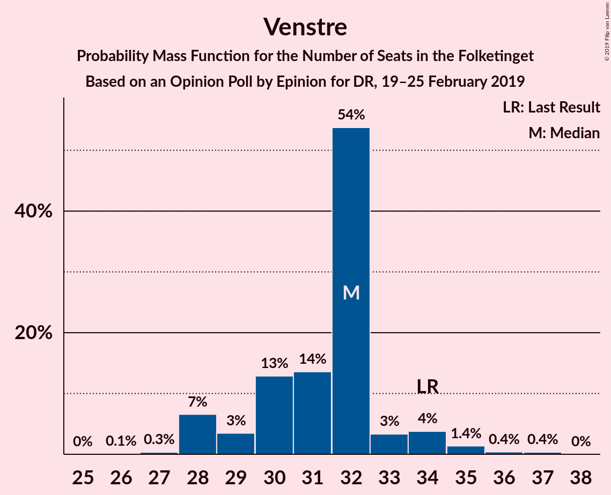
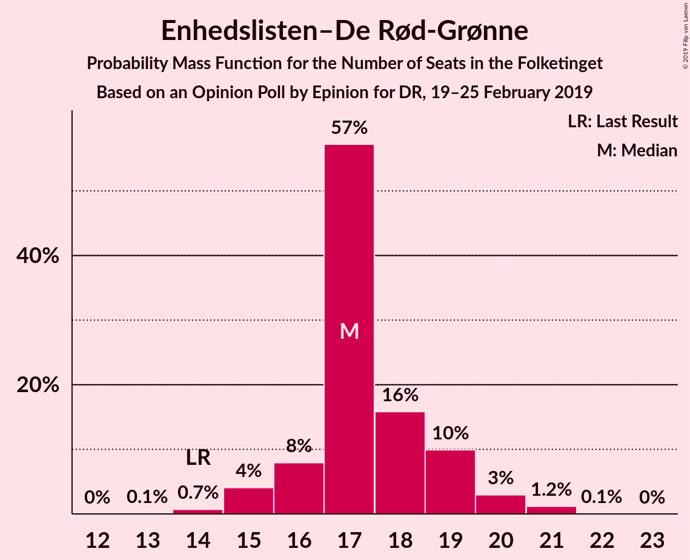
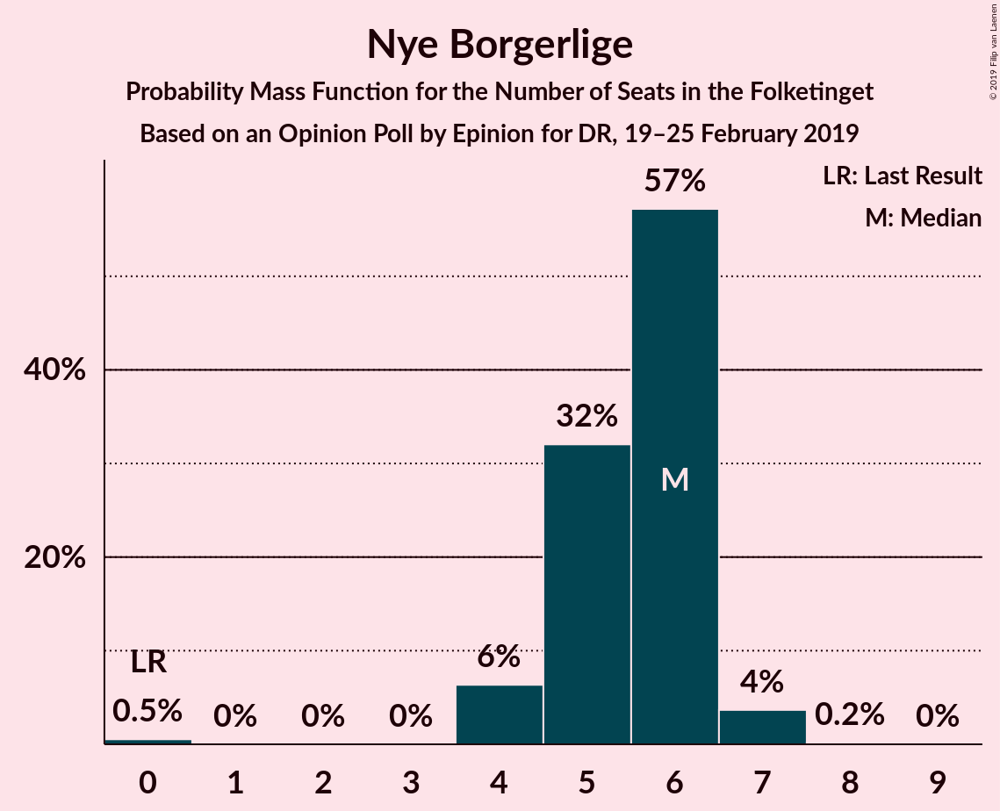
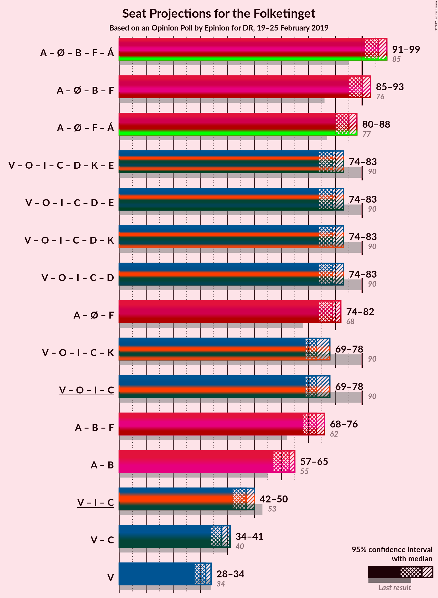
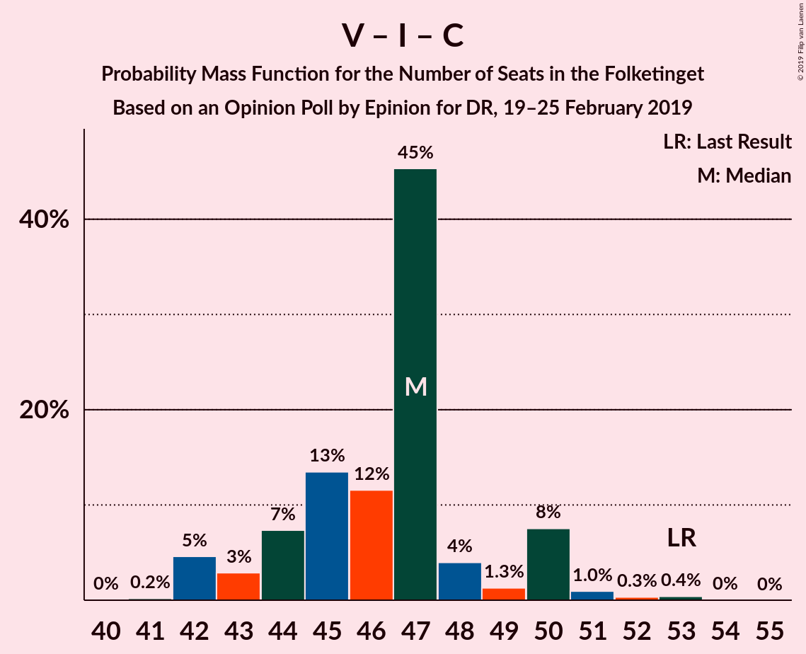

# Opinion Poll by Epinion for DR, 19–25 February 2019

<a href="#voting-intentions">Voting Intentions</a> | <a href="#seats">Seats</a> | <a href="#coalitions">Coalitions</a> | <a href="#technical-information">Technical Information</a>

## Voting Intentions

### Confidence Intervals

| Party | Last Result | Poll Result | 80% Confidence Interval | 90% Confidence Interval | 95% Confidence Interval | 99% Confidence Interval |
|:-----:|:-----------:|:-----------:|:-----------------------:|:-----------------------:|:-----------------------:|:-----------------------:|
| Socialdemokraterne | 26.3% | 28.2% | 26.7–29.7% |26.4–30.1% |26.0–30.5% |25.3–31.2% |
| Venstre | 19.5% | 17.8% | 16.6–19.1% |16.3–19.5% |16.0–19.8% |15.4–20.5% |
| Dansk Folkeparti | 21.1% | 15.2% | 14.1–16.4% |13.8–16.8% |13.5–17.1% |13.0–17.7% |
| Enhedslisten–De Rød-Grønne | 7.8% | 9.7% | 8.8–10.8% |8.6–11.1% |8.3–11.3% |7.9–11.8% |
| Radikale Venstre | 4.6% | 6.1% | 5.3–6.9% |5.2–7.2% |5.0–7.4% |4.6–7.8% |
| Socialistisk Folkeparti | 4.2% | 5.9% | 5.2–6.7% |5.0–7.0% |4.8–7.2% |4.5–7.6% |
| Liberal Alliance | 7.5% | 4.5% | 3.9–5.3% |3.7–5.5% |3.6–5.7% |3.3–6.1% |
| Det Konservative Folkeparti | 3.4% | 3.8% | 3.2–4.5% |3.1–4.7% |2.9–4.9% |2.7–5.2% |
| Alternativet | 4.8% | 3.5% | 3.0–4.2% |2.8–4.4% |2.7–4.6% |2.5–4.9% |
| Nye Borgerlige | 0.0% | 2.8% | 2.3–3.4% |2.2–3.6% |2.1–3.8% |1.9–4.1% |
| Kristendemokraterne | 0.8% | 0.7% | 0.5–1.1% |0.4–1.2% |0.4–1.3% |0.3–1.5% |

*Note:* The poll result column reflects the actual value used in the calculations. Published results may vary slightly, and in addition be rounded to fewer digits.

## Seats

### Confidence Intervals

| Party | Last Result | Median | 80% Confidence Interval | 90% Confidence Interval | 95% Confidence Interval | 99% Confidence Interval |
|:-----:|:-----------:|:------:|:-----------------------:|:-----------------------:|:-----------------------:|:-----------------------:|
| <a href="#socialdemokraterne">Socialdemokraterne</a> | 47 | 51 | 48–52 |47–52 |46–53 |45–55 |
| <a href="#venstre">Venstre</a> | 34 | 32 | 29–32 |28–34 |28–34 |28–36 |
| <a href="#dansk-folkeparti">Dansk Folkeparti</a> | 37 | 26 | 25–29 |25–30 |24–31 |23–32 |
| <a href="#enhedslisten–de-rød-grønne">Enhedslisten–De Rød-Grønne</a> | 14 | 17 | 16–19 |16–19 |15–20 |14–21 |
| <a href="#radikale-venstre">Radikale Venstre</a> | 8 | 11 | 10–12 |10–12 |9–13 |8–14 |
| <a href="#socialistisk-folkeparti">Socialistisk Folkeparti</a> | 7 | 10 | 9–12 |9–12 |9–13 |8–13 |
| <a href="#liberal-alliance">Liberal Alliance</a> | 13 | 9 | 7–9 |7–10 |6–10 |6–11 |
| <a href="#det-konservative-folkeparti">Det Konservative Folkeparti</a> | 6 | 6 | 6–8 |6–8 |5–8 |5–9 |
| <a href="#alternativet">Alternativet</a> | 9 | 6 | 6–8 |5–8 |5–8 |5–9 |
| <a href="#nye-borgerlige">Nye Borgerlige</a> | 0 | 6 | 5–6 |4–6 |4–7 |0–7 |
| <a href="#kristendemokraterne">Kristendemokraterne</a> | 0 | 0 | 0 |0 |0 |0 |

### Socialdemokraterne

*For a full overview of the results for this party, see the [Socialdemokraterne](party-socialdemokraterne.html) page.*

| Number of Seats | Probability | Accumulated | Special Marks |
|:---------------:|:-----------:|:-----------:|:-------------:|
| 43 | 0.1% | 100% |  |
| 44 | 0.2% | 99.9% |  |
| 45 | 0.8% | 99.7% |  |
| 46 | 2% | 98.9% |  |
| 47 | 5% | 96% | Last Result |
| 48 | 3% | 92% |  |
| 49 | 21% | 89% |  |
| 50 | 10% | 68% |  |
| 51 | 11% | 59% | Median |
| 52 | 43% | 48% |  |
| 53 | 3% | 5% |  |
| 54 | 1.5% | 2% |  |
| 55 | 0.8% | 1.0% |  |
| 56 | 0.1% | 0.2% |  |
| 57 | 0% | 0.1% |  |
| 58 | 0% | 0% |  |

### Venstre

*For a full overview of the results for this party, see the [Venstre](party-venstre.html) page.*

| Number of Seats | Probability | Accumulated | Special Marks |
|:---------------:|:-----------:|:-----------:|:-------------:|
| 26 | 0.1% | 100% |  |
| 27 | 0.3% | 99.9% |  |
| 28 | 7% | 99.5% |  |
| 29 | 3% | 93% |  |
| 30 | 13% | 89% |  |
| 31 | 14% | 77% |  |
| 32 | 54% | 63% | Median |
| 33 | 3% | 9% |  |
| 34 | 4% | 6% | Last Result |
| 35 | 1.4% | 2% |  |
| 36 | 0.4% | 0.8% |  |
| 37 | 0.4% | 0.4% |  |
| 38 | 0% | 0% |  |

### Dansk Folkeparti

*For a full overview of the results for this party, see the [Dansk Folkeparti](party-danskfolkeparti.html) page.*

| Number of Seats | Probability | Accumulated | Special Marks |
|:---------------:|:-----------:|:-----------:|:-------------:|
| 22 | 0.1% | 100% |  |
| 23 | 0.4% | 99.9% |  |
| 24 | 2% | 99.5% |  |
| 25 | 9% | 97% |  |
| 26 | 50% | 88% | Median |
| 27 | 11% | 39% |  |
| 28 | 11% | 28% |  |
| 29 | 8% | 17% |  |
| 30 | 5% | 8% |  |
| 31 | 2% | 3% |  |
| 32 | 0.5% | 0.6% |  |
| 33 | 0% | 0% |  |
| 34 | 0% | 0% |  |
| 35 | 0% | 0% |  |
| 36 | 0% | 0% |  |
| 37 | 0% | 0% | Last Result |

### Enhedslisten–De Rød-Grønne

*For a full overview of the results for this party, see the [Enhedslisten–De Rød-Grønne](party-enhedslisten–derød-grønne.html) page.*

| Number of Seats | Probability | Accumulated | Special Marks |
|:---------------:|:-----------:|:-----------:|:-------------:|
| 13 | 0.1% | 100% |  |
| 14 | 0.7% | 99.9% | Last Result |
| 15 | 4% | 99.2% |  |
| 16 | 8% | 95% |  |
| 17 | 57% | 87% | Median |
| 18 | 16% | 30% |  |
| 19 | 10% | 14% |  |
| 20 | 3% | 4% |  |
| 21 | 1.2% | 1.3% |  |
| 22 | 0.1% | 0.1% |  |
| 23 | 0% | 0% |  |

### Radikale Venstre

*For a full overview of the results for this party, see the [Radikale Venstre](party-radikalevenstre.html) page.*

| Number of Seats | Probability | Accumulated | Special Marks |
|:---------------:|:-----------:|:-----------:|:-------------:|
| 8 | 0.8% | 100% | Last Result |
| 9 | 3% | 99.2% |  |
| 10 | 21% | 96% |  |
| 11 | 53% | 75% | Median |
| 12 | 18% | 22% |  |
| 13 | 3% | 4% |  |
| 14 | 0.7% | 0.8% |  |
| 15 | 0.1% | 0.1% |  |
| 16 | 0% | 0% |  |

### Socialistisk Folkeparti

*For a full overview of the results for this party, see the [Socialistisk Folkeparti](party-socialistiskfolkeparti.html) page.*

| Number of Seats | Probability | Accumulated | Special Marks |
|:---------------:|:-----------:|:-----------:|:-------------:|
| 7 | 0.1% | 100% | Last Result |
| 8 | 0.9% | 99.9% |  |
| 9 | 12% | 99.0% |  |
| 10 | 63% | 88% | Median |
| 11 | 10% | 24% |  |
| 12 | 11% | 14% |  |
| 13 | 3% | 3% |  |
| 14 | 0.3% | 0.3% |  |
| 15 | 0% | 0% |  |

### Liberal Alliance

*For a full overview of the results for this party, see the [Liberal Alliance](party-liberalalliance.html) page.*

| Number of Seats | Probability | Accumulated | Special Marks |
|:---------------:|:-----------:|:-----------:|:-------------:|
| 5 | 0.1% | 100% |  |
| 6 | 3% | 99.9% |  |
| 7 | 18% | 97% |  |
| 8 | 19% | 78% |  |
| 9 | 50% | 60% | Median |
| 10 | 9% | 10% |  |
| 11 | 0.9% | 1.0% |  |
| 12 | 0.1% | 0.1% |  |
| 13 | 0% | 0% | Last Result |

### Det Konservative Folkeparti

*For a full overview of the results for this party, see the [Det Konservative Folkeparti](party-detkonservativefolkeparti.html) page.*

| Number of Seats | Probability | Accumulated | Special Marks |
|:---------------:|:-----------:|:-----------:|:-------------:|
| 4 | 0.1% | 100% |  |
| 5 | 4% | 99.9% |  |
| 6 | 53% | 96% | Last Result, Median |
| 7 | 29% | 43% |  |
| 8 | 13% | 14% |  |
| 9 | 1.3% | 1.5% |  |
| 10 | 0.1% | 0.2% |  |
| 11 | 0% | 0% |  |

### Alternativet

*For a full overview of the results for this party, see the [Alternativet](party-alternativet.html) page.*

| Number of Seats | Probability | Accumulated | Special Marks |
|:---------------:|:-----------:|:-----------:|:-------------:|
| 4 | 0.3% | 100% |  |
| 5 | 7% | 99.7% |  |
| 6 | 60% | 92% | Median |
| 7 | 20% | 32% |  |
| 8 | 11% | 12% |  |
| 9 | 0.9% | 1.0% | Last Result |
| 10 | 0% | 0% |  |

### Nye Borgerlige

*For a full overview of the results for this party, see the [Nye Borgerlige](party-nyeborgerlige.html) page.*

| Number of Seats | Probability | Accumulated | Special Marks |
|:---------------:|:-----------:|:-----------:|:-------------:|
| 0 | 0.5% | 100% | Last Result |
| 1 | 0% | 99.5% |  |
| 2 | 0% | 99.5% |  |
| 3 | 0% | 99.5% |  |
| 4 | 6% | 99.5% |  |
| 5 | 32% | 93% |  |
| 6 | 57% | 61% | Median |
| 7 | 4% | 4% |  |
| 8 | 0.2% | 0.2% |  |
| 9 | 0% | 0% |  |

### Kristendemokraterne

*For a full overview of the results for this party, see the [Kristendemokraterne](party-kristendemokraterne.html) page.*

| Number of Seats | Probability | Accumulated | Special Marks |
|:---------------:|:-----------:|:-----------:|:-------------:|
| 0 | 100% | 100% | Last Result, Median |

## Coalitions

### Confidence Intervals

| Coalition | Last Result | Median | Majority? | 80% Confidence Interval | 90% Confidence Interval | 95% Confidence Interval | 99% Confidence Interval |
|:---------:|:-----------:|:------:|:---------:|:-----------------------:|:-----------------------:|:-----------------------:|:-----------------------:|
| Socialdemokraterne – Enhedslisten–De Rød-Grønne – Radikale Venstre – Socialistisk Folkeparti – Alternativet | 85 | 96 | 99.2% | 92–99 | 92–99 | 91–99 | 89–101 |
| Socialdemokraterne – Enhedslisten–De Rød-Grønne – Radikale Venstre – Socialistisk Folkeparti | 76 | 90 | 62% | 86–91 | 86–92 | 85–93 | 82–95 |
| Socialdemokraterne – Enhedslisten–De Rød-Grønne – Socialistisk Folkeparti – Alternativet | 77 | 85 | 1.4% | 82–87 | 81–88 | 80–88 | 78–90 |
| Venstre – Dansk Folkeparti – Liberal Alliance – Det Konservative Folkeparti – Nye Borgerlige – Kristendemokraterne | 90 | 79 | 0% | 76–82 | 75–83 | 74–83 | 73–84 |
| Venstre – Dansk Folkeparti – Liberal Alliance – Det Konservative Folkeparti – Nye Borgerlige | 90 | 79 | 0% | 76–82 | 75–83 | 74–83 | 73–84 |
| Socialdemokraterne – Enhedslisten–De Rød-Grønne – Socialistisk Folkeparti | 68 | 79 | 0% | 76–80 | 75–81 | 74–82 | 72–84 |
| Venstre – Dansk Folkeparti – Liberal Alliance – Det Konservative Folkeparti – Kristendemokraterne | 90 | 73 | 0% | 71–76 | 70–78 | 69–78 | 68–79 |
| Venstre – Dansk Folkeparti – Liberal Alliance – Det Konservative Folkeparti | 90 | 73 | 0% | 71–76 | 70–78 | 69–78 | 68–79 |
| Socialdemokraterne – Radikale Venstre – Socialistisk Folkeparti | 62 | 73 | 0% | 69–73 | 68–74 | 68–76 | 66–77 |
| Socialdemokraterne – Radikale Venstre | 55 | 63 | 0% | 59–63 | 58–64 | 57–65 | 55–66 |
| Venstre – Liberal Alliance – Det Konservative Folkeparti | 53 | 47 | 0% | 44–49 | 43–50 | 42–50 | 42–52 |
| Venstre – Det Konservative Folkeparti | 40 | 38 | 0% | 36–40 | 35–41 | 34–41 | 34–44 |
| Venstre | 34 | 32 | 0% | 29–32 | 28–34 | 28–34 | 28–36 |

### Socialdemokraterne – Enhedslisten–De Rød-Grønne – Radikale Venstre – Socialistisk Folkeparti – Alternativet

| Number of Seats | Probability | Accumulated | Special Marks |
|:---------------:|:-----------:|:-----------:|:-------------:|
| 85 | 0% | 100% | Last Result |
| 86 | 0% | 100% |  |
| 87 | 0.1% | 100% |  |
| 88 | 0.2% | 99.9% |  |
| 89 | 0.6% | 99.7% |  |
| 90 | 0.4% | 99.2% | Majority |
| 91 | 1.3% | 98.7% |  |
| 92 | 9% | 97% |  |
| 93 | 4% | 89% |  |
| 94 | 12% | 85% |  |
| 95 | 10% | 73% | Median |
| 96 | 42% | 63% |  |
| 97 | 6% | 21% |  |
| 98 | 4% | 14% |  |
| 99 | 8% | 11% |  |
| 100 | 0.8% | 2% |  |
| 101 | 1.0% | 1.4% |  |
| 102 | 0.4% | 0.4% |  |
| 103 | 0% | 0.1% |  |
| 104 | 0% | 0% |  |

### Socialdemokraterne – Enhedslisten–De Rød-Grønne – Radikale Venstre – Socialistisk Folkeparti

| Number of Seats | Probability | Accumulated | Special Marks |
|:---------------:|:-----------:|:-----------:|:-------------:|
| 76 | 0% | 100% | Last Result |
| 77 | 0% | 100% |  |
| 78 | 0% | 100% |  |
| 79 | 0% | 100% |  |
| 80 | 0% | 100% |  |
| 81 | 0.1% | 100% |  |
| 82 | 0.5% | 99.9% |  |
| 83 | 0.4% | 99.4% |  |
| 84 | 0.8% | 99.1% |  |
| 85 | 2% | 98% |  |
| 86 | 10% | 97% |  |
| 87 | 9% | 87% |  |
| 88 | 11% | 77% |  |
| 89 | 4% | 67% | Median |
| 90 | 45% | 62% | Majority |
| 91 | 11% | 17% |  |
| 92 | 2% | 6% |  |
| 93 | 2% | 3% |  |
| 94 | 0.5% | 2% |  |
| 95 | 1.1% | 1.3% |  |
| 96 | 0.2% | 0.2% |  |
| 97 | 0% | 0% |  |

### Socialdemokraterne – Enhedslisten–De Rød-Grønne – Socialistisk Folkeparti – Alternativet

| Number of Seats | Probability | Accumulated | Special Marks |
|:---------------:|:-----------:|:-----------:|:-------------:|
| 77 | 0.2% | 100% | Last Result |
| 78 | 0.3% | 99.8% |  |
| 79 | 0.9% | 99.4% |  |
| 80 | 1.1% | 98.5% |  |
| 81 | 3% | 97% |  |
| 82 | 11% | 95% |  |
| 83 | 10% | 84% |  |
| 84 | 8% | 74% | Median |
| 85 | 46% | 65% |  |
| 86 | 5% | 20% |  |
| 87 | 10% | 15% |  |
| 88 | 3% | 5% |  |
| 89 | 1.0% | 2% |  |
| 90 | 1.1% | 1.4% | Majority |
| 91 | 0.2% | 0.3% |  |
| 92 | 0.1% | 0.1% |  |
| 93 | 0% | 0% |  |

### Venstre – Dansk Folkeparti – Liberal Alliance – Det Konservative Folkeparti – Nye Borgerlige – Kristendemokraterne

| Number of Seats | Probability | Accumulated | Special Marks |
|:---------------:|:-----------:|:-----------:|:-------------:|
| 71 | 0.1% | 100% |  |
| 72 | 0.1% | 99.9% |  |
| 73 | 1.4% | 99.8% |  |
| 74 | 3% | 98% |  |
| 75 | 1.5% | 96% |  |
| 76 | 13% | 94% |  |
| 77 | 6% | 81% |  |
| 78 | 8% | 75% |  |
| 79 | 42% | 67% | Median |
| 80 | 6% | 26% |  |
| 81 | 9% | 19% |  |
| 82 | 2% | 10% |  |
| 83 | 7% | 8% |  |
| 84 | 0.7% | 1.1% |  |
| 85 | 0.3% | 0.4% |  |
| 86 | 0.1% | 0.1% |  |
| 87 | 0% | 0% |  |
| 88 | 0% | 0% |  |
| 89 | 0% | 0% |  |
| 90 | 0% | 0% | Last Result, Majority |

### Venstre – Dansk Folkeparti – Liberal Alliance – Det Konservative Folkeparti – Nye Borgerlige

| Number of Seats | Probability | Accumulated | Special Marks |
|:---------------:|:-----------:|:-----------:|:-------------:|
| 71 | 0.1% | 100% |  |
| 72 | 0.1% | 99.9% |  |
| 73 | 1.4% | 99.8% |  |
| 74 | 3% | 98% |  |
| 75 | 1.5% | 96% |  |
| 76 | 13% | 94% |  |
| 77 | 6% | 81% |  |
| 78 | 8% | 75% |  |
| 79 | 42% | 67% | Median |
| 80 | 6% | 26% |  |
| 81 | 9% | 19% |  |
| 82 | 2% | 10% |  |
| 83 | 7% | 8% |  |
| 84 | 0.7% | 1.1% |  |
| 85 | 0.3% | 0.4% |  |
| 86 | 0.1% | 0.1% |  |
| 87 | 0% | 0% |  |
| 88 | 0% | 0% |  |
| 89 | 0% | 0% |  |
| 90 | 0% | 0% | Last Result, Majority |

### Socialdemokraterne – Enhedslisten–De Rød-Grønne – Socialistisk Folkeparti

| Number of Seats | Probability | Accumulated | Special Marks |
|:---------------:|:-----------:|:-----------:|:-------------:|
| 68 | 0% | 100% | Last Result |
| 69 | 0% | 100% |  |
| 70 | 0% | 100% |  |
| 71 | 0.2% | 100% |  |
| 72 | 0.6% | 99.8% |  |
| 73 | 0.9% | 99.1% |  |
| 74 | 2% | 98% |  |
| 75 | 3% | 96% |  |
| 76 | 16% | 93% |  |
| 77 | 8% | 77% |  |
| 78 | 8% | 69% | Median |
| 79 | 51% | 62% |  |
| 80 | 4% | 11% |  |
| 81 | 3% | 6% |  |
| 82 | 1.4% | 3% |  |
| 83 | 0.9% | 2% |  |
| 84 | 1.0% | 1.1% |  |
| 85 | 0% | 0.1% |  |
| 86 | 0.1% | 0.1% |  |
| 87 | 0% | 0% |  |

### Venstre – Dansk Folkeparti – Liberal Alliance – Det Konservative Folkeparti – Kristendemokraterne

| Number of Seats | Probability | Accumulated | Special Marks |
|:---------------:|:-----------:|:-----------:|:-------------:|
| 67 | 0.1% | 100% |  |
| 68 | 2% | 99.8% |  |
| 69 | 2% | 98% |  |
| 70 | 2% | 96% |  |
| 71 | 16% | 94% |  |
| 72 | 5% | 78% |  |
| 73 | 45% | 73% | Median |
| 74 | 7% | 28% |  |
| 75 | 9% | 21% |  |
| 76 | 3% | 13% |  |
| 77 | 2% | 9% |  |
| 78 | 7% | 8% |  |
| 79 | 0.6% | 0.9% |  |
| 80 | 0.1% | 0.3% |  |
| 81 | 0.2% | 0.2% |  |
| 82 | 0% | 0% |  |
| 83 | 0% | 0% |  |
| 84 | 0% | 0% |  |
| 85 | 0% | 0% |  |
| 86 | 0% | 0% |  |
| 87 | 0% | 0% |  |
| 88 | 0% | 0% |  |
| 89 | 0% | 0% |  |
| 90 | 0% | 0% | Last Result, Majority |

### Venstre – Dansk Folkeparti – Liberal Alliance – Det Konservative Folkeparti

| Number of Seats | Probability | Accumulated | Special Marks |
|:---------------:|:-----------:|:-----------:|:-------------:|
| 67 | 0.1% | 100% |  |
| 68 | 2% | 99.8% |  |
| 69 | 2% | 98% |  |
| 70 | 2% | 96% |  |
| 71 | 16% | 94% |  |
| 72 | 5% | 78% |  |
| 73 | 45% | 73% | Median |
| 74 | 7% | 28% |  |
| 75 | 9% | 21% |  |
| 76 | 3% | 13% |  |
| 77 | 2% | 9% |  |
| 78 | 7% | 8% |  |
| 79 | 0.6% | 0.9% |  |
| 80 | 0.1% | 0.3% |  |
| 81 | 0.2% | 0.2% |  |
| 82 | 0% | 0% |  |
| 83 | 0% | 0% |  |
| 84 | 0% | 0% |  |
| 85 | 0% | 0% |  |
| 86 | 0% | 0% |  |
| 87 | 0% | 0% |  |
| 88 | 0% | 0% |  |
| 89 | 0% | 0% |  |
| 90 | 0% | 0% | Last Result, Majority |

### Socialdemokraterne – Radikale Venstre – Socialistisk Folkeparti

| Number of Seats | Probability | Accumulated | Special Marks |
|:---------------:|:-----------:|:-----------:|:-------------:|
| 62 | 0% | 100% | Last Result |
| 63 | 0% | 100% |  |
| 64 | 0.1% | 100% |  |
| 65 | 0.3% | 99.9% |  |
| 66 | 0.4% | 99.6% |  |
| 67 | 0.6% | 99.2% |  |
| 68 | 6% | 98.6% |  |
| 69 | 14% | 92% |  |
| 70 | 5% | 78% |  |
| 71 | 6% | 73% |  |
| 72 | 8% | 67% | Median |
| 73 | 50% | 59% |  |
| 74 | 4% | 9% |  |
| 75 | 2% | 5% |  |
| 76 | 1.1% | 3% |  |
| 77 | 2% | 2% |  |
| 78 | 0.1% | 0.2% |  |
| 79 | 0.1% | 0.1% |  |
| 80 | 0% | 0% |  |

### Socialdemokraterne – Radikale Venstre

| Number of Seats | Probability | Accumulated | Special Marks |
|:---------------:|:-----------:|:-----------:|:-------------:|
| 54 | 0.1% | 100% |  |
| 55 | 0.8% | 99.8% | Last Result |
| 56 | 0.4% | 99.0% |  |
| 57 | 2% | 98.6% |  |
| 58 | 2% | 96% |  |
| 59 | 17% | 94% |  |
| 60 | 11% | 78% |  |
| 61 | 8% | 67% |  |
| 62 | 5% | 59% | Median |
| 63 | 47% | 53% |  |
| 64 | 2% | 6% |  |
| 65 | 2% | 4% |  |
| 66 | 1.1% | 1.4% |  |
| 67 | 0.2% | 0.3% |  |
| 68 | 0.1% | 0.1% |  |
| 69 | 0% | 0% |  |

### Venstre – Liberal Alliance – Det Konservative Folkeparti

| Number of Seats | Probability | Accumulated | Special Marks |
|:---------------:|:-----------:|:-----------:|:-------------:|
| 41 | 0.2% | 100% |  |
| 42 | 5% | 99.8% |  |
| 43 | 3% | 95% |  |
| 44 | 7% | 92% |  |
| 45 | 13% | 85% |  |
| 46 | 12% | 71% |  |
| 47 | 45% | 60% | Median |
| 48 | 4% | 15% |  |
| 49 | 1.3% | 11% |  |
| 50 | 8% | 9% |  |
| 51 | 1.0% | 2% |  |
| 52 | 0.3% | 0.8% |  |
| 53 | 0.4% | 0.5% | Last Result |
| 54 | 0% | 0.1% |  |
| 55 | 0% | 0% |  |

### Venstre – Det Konservative Folkeparti

| Number of Seats | Probability | Accumulated | Special Marks |
|:---------------:|:-----------:|:-----------:|:-------------:|
| 32 | 0.1% | 100% |  |
| 33 | 0.2% | 99.9% |  |
| 34 | 3% | 99.7% |  |
| 35 | 5% | 96% |  |
| 36 | 3% | 91% |  |
| 37 | 15% | 88% |  |
| 38 | 50% | 73% | Median |
| 39 | 9% | 23% |  |
| 40 | 9% | 14% | Last Result |
| 41 | 3% | 5% |  |
| 42 | 1.1% | 2% |  |
| 43 | 0.8% | 1.4% |  |
| 44 | 0.5% | 0.6% |  |
| 45 | 0.1% | 0.1% |  |
| 46 | 0% | 0% |  |

### Venstre

| Number of Seats | Probability | Accumulated | Special Marks |
|:---------------:|:-----------:|:-----------:|:-------------:|
| 26 | 0.1% | 100% |  |
| 27 | 0.3% | 99.9% |  |
| 28 | 7% | 99.5% |  |
| 29 | 3% | 93% |  |
| 30 | 13% | 89% |  |
| 31 | 14% | 77% |  |
| 32 | 54% | 63% | Median |
| 33 | 3% | 9% |  |
| 34 | 4% | 6% | Last Result |
| 35 | 1.4% | 2% |  |
| 36 | 0.4% | 0.8% |  |
| 37 | 0.4% | 0.4% |  |
| 38 | 0% | 0% |  |

## Technical Information

### Opinion Poll

+ **Polling firm:** Epinion
+ **Commissioner(s):** DR
+ **Fieldwork period:** 19–25 February 2019

### Calculations

+ **Sample size:** 1532
+ **Simulations done:** 1,048,576
+ **Error estimate:** 1.02%

