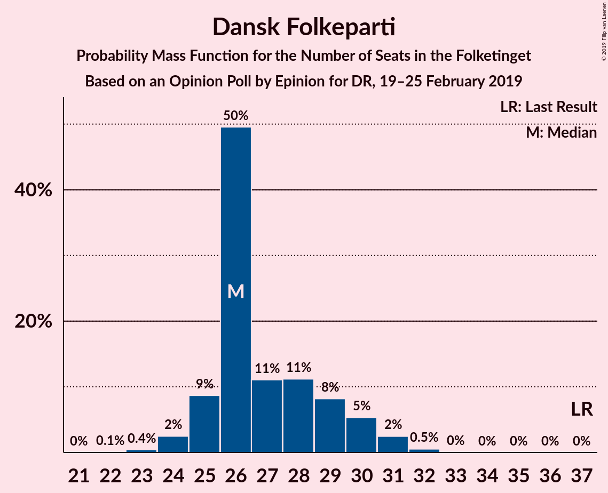
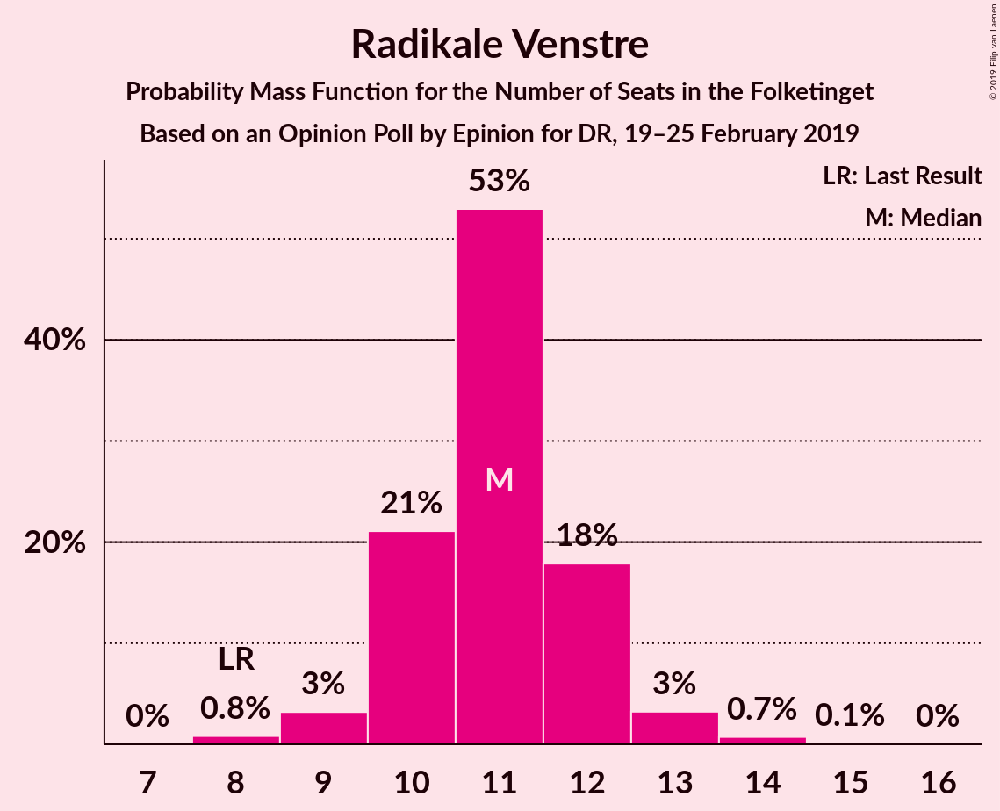
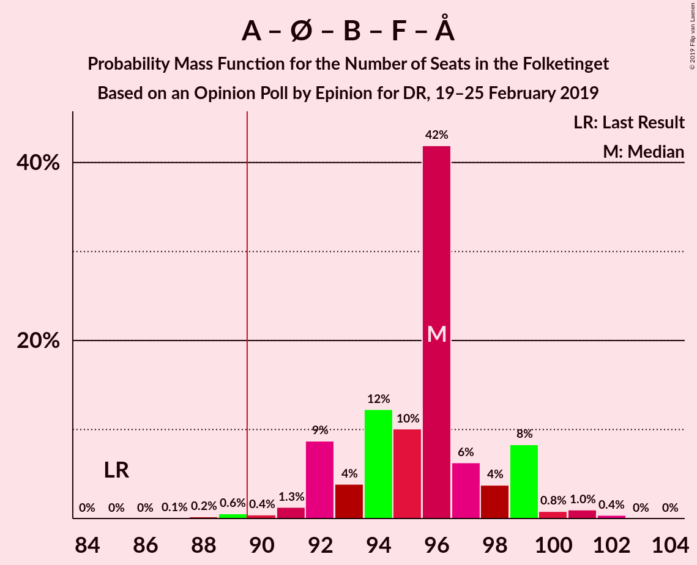
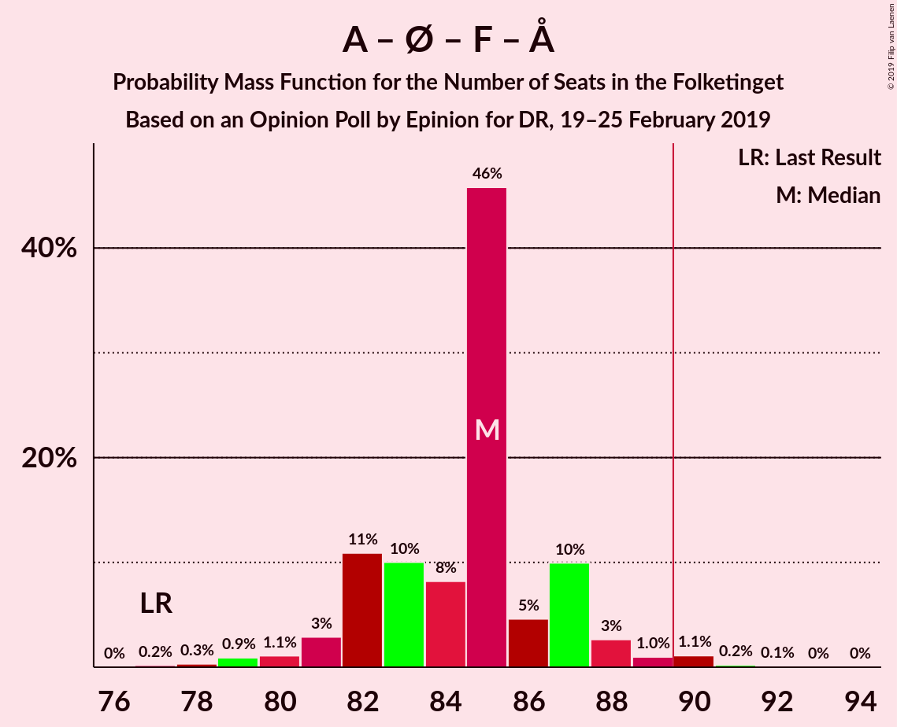
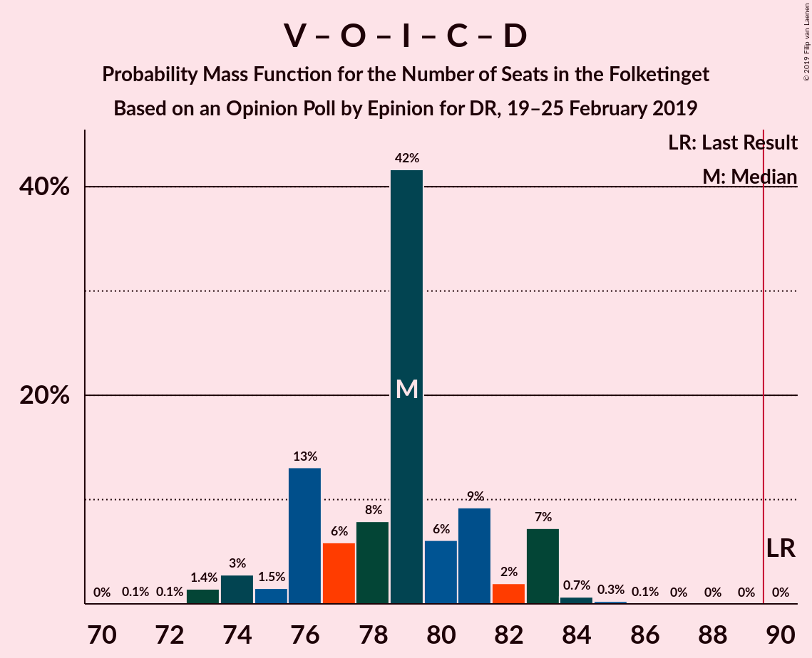

# Opinion Poll by Epinion for DR, 19–25 February 2019

<a href="#voting-intentions">Voting Intentions</a> | <a href="#seats">Seats</a> | <a href="#coalitions">Coalitions</a> | <a href="#technical-information">Technical Information</a>

## Voting Intentions

### Confidence Intervals

| Party | Last Result | Poll Result | 80% Confidence Interval | 90% Confidence Interval | 95% Confidence Interval | 99% Confidence Interval |
|:-----:|:-----------:|:-----------:|:-----------------------:|:-----------------------:|:-----------------------:|:-----------------------:|
| Socialdemokraterne | 26.3% | 28.2% | 26.7–29.7% |26.4–30.1% |26.0–30.5% |25.3–31.2% |
| Venstre | 19.5% | 17.8% | 16.6–19.1% |16.3–19.5% |16.0–19.8% |15.4–20.5% |
| Dansk Folkeparti | 21.1% | 15.2% | 14.1–16.4% |13.8–16.8% |13.5–17.1% |13.0–17.7% |
| Enhedslisten–De Rød-Grønne | 7.8% | 9.7% | 8.8–10.8% |8.6–11.1% |8.3–11.3% |7.9–11.8% |
| Radikale Venstre | 4.6% | 6.1% | 5.3–6.9% |5.2–7.2% |5.0–7.4% |4.6–7.8% |
| Socialistisk Folkeparti | 4.2% | 5.9% | 5.2–6.7% |5.0–7.0% |4.8–7.2% |4.5–7.6% |
| Liberal Alliance | 7.5% | 4.5% | 3.9–5.3% |3.7–5.5% |3.6–5.7% |3.3–6.1% |
| Det Konservative Folkeparti | 3.4% | 3.8% | 3.2–4.5% |3.1–4.7% |2.9–4.9% |2.7–5.2% |
| Alternativet | 4.8% | 3.5% | 3.0–4.2% |2.8–4.4% |2.7–4.6% |2.5–4.9% |
| Nye Borgerlige | 0.0% | 2.8% | 2.3–3.4% |2.2–3.6% |2.1–3.8% |1.9–4.1% |
| Kristendemokraterne | 0.8% | 0.7% | 0.5–1.1% |0.4–1.2% |0.4–1.3% |0.3–1.5% |

*Note:* The poll result column reflects the actual value used in the calculations. Published results may vary slightly, and in addition be rounded to fewer digits.

## Seats

### Confidence Intervals

| Party | Last Result | Median | 80% Confidence Interval | 90% Confidence Interval | 95% Confidence Interval | 99% Confidence Interval |
|:-----:|:-----------:|:------:|:-----------------------:|:-----------------------:|:-----------------------:|:-----------------------:|
| <a href="#socialdemokraterne">Socialdemokraterne</a> | 47 | 49 | 48–52 |46–52 |46–53 |45–55 |
| <a href="#venstre">Venstre</a> | 34 | 30 | 28–33 |28–33 |28–34 |28–36 |
| <a href="#dansk-folkeparti">Dansk Folkeparti</a> | 37 | 28 | 25–31 |25–31 |24–32 |23–32 |
| <a href="#enhedslisten–de-rød-grønne">Enhedslisten–De Rød-Grønne</a> | 14 | 17 | 16–19 |16–20 |15–20 |14–21 |
| <a href="#radikale-venstre">Radikale Venstre</a> | 8 | 11 | 10–12 |9–13 |9–13 |9–14 |
| <a href="#socialistisk-folkeparti">Socialistisk Folkeparti</a> | 7 | 10 | 9–13 |9–13 |9–13 |8–13 |
| <a href="#liberal-alliance">Liberal Alliance</a> | 13 | 9 | 7–9 |6–11 |6–11 |6–11 |
| <a href="#det-konservative-folkeparti">Det Konservative Folkeparti</a> | 6 | 6 | 6–8 |5–8 |5–9 |5–9 |
| <a href="#alternativet">Alternativet</a> | 9 | 7 | 6–7 |5–8 |5–8 |4–9 |
| <a href="#nye-borgerlige">Nye Borgerlige</a> | 0 | 5 | 5–6 |4–6 |4–7 |0–8 |
| <a href="#kristendemokraterne">Kristendemokraterne</a> | 0 | 0 | 0 |0 |0 |0 |

### Socialdemokraterne

*For a full overview of the results for this party, see the [Socialdemokraterne](party-socialdemokraterne.html) page.*

| Number of Seats | Probability | Accumulated | Special Marks |
|:---------------:|:-----------:|:-----------:|:-------------:|
| 43 | 0.2% | 100% |  |
| 44 | 0.3% | 99.8% |  |
| 45 | 1.4% | 99.5% |  |
| 46 | 4% | 98% |  |
| 47 | 3% | 94% | Last Result |
| 48 | 7% | 91% |  |
| 49 | 34% | 84% | Median |
| 50 | 25% | 49% |  |
| 51 | 3% | 24% |  |
| 52 | 16% | 21% |  |
| 53 | 3% | 5% |  |
| 54 | 1.0% | 2% |  |
| 55 | 0.8% | 1.2% |  |
| 56 | 0.2% | 0.5% |  |
| 57 | 0% | 0.3% |  |
| 58 | 0.2% | 0.2% |  |
| 59 | 0% | 0% |  |

### Venstre

*For a full overview of the results for this party, see the [Venstre](party-venstre.html) page.*

| Number of Seats | Probability | Accumulated | Special Marks |
|:---------------:|:-----------:|:-----------:|:-------------:|
| 26 | 0.1% | 100% |  |
| 27 | 0.3% | 99.9% |  |
| 28 | 20% | 99.6% |  |
| 29 | 9% | 80% |  |
| 30 | 32% | 70% | Median |
| 31 | 8% | 38% |  |
| 32 | 15% | 31% |  |
| 33 | 11% | 16% |  |
| 34 | 3% | 5% | Last Result |
| 35 | 1.2% | 2% |  |
| 36 | 0.8% | 1.0% |  |
| 37 | 0.1% | 0.2% |  |
| 38 | 0% | 0.2% |  |
| 39 | 0.1% | 0.1% |  |
| 40 | 0% | 0% |  |

### Dansk Folkeparti

*For a full overview of the results for this party, see the [Dansk Folkeparti](party-danskfolkeparti.html) page.*

| Number of Seats | Probability | Accumulated | Special Marks |
|:---------------:|:-----------:|:-----------:|:-------------:|
| 22 | 0.1% | 100% |  |
| 23 | 1.1% | 99.9% |  |
| 24 | 1.3% | 98.8% |  |
| 25 | 28% | 97% |  |
| 26 | 3% | 70% |  |
| 27 | 10% | 67% |  |
| 28 | 8% | 57% | Median |
| 29 | 26% | 49% |  |
| 30 | 2% | 23% |  |
| 31 | 18% | 21% |  |
| 32 | 3% | 3% |  |
| 33 | 0% | 0% |  |
| 34 | 0% | 0% |  |
| 35 | 0% | 0% |  |
| 36 | 0% | 0% |  |
| 37 | 0% | 0% | Last Result |

### Enhedslisten–De Rød-Grønne

*For a full overview of the results for this party, see the [Enhedslisten–De Rød-Grønne](party-enhedslisten–derød-grønne.html) page.*

| Number of Seats | Probability | Accumulated | Special Marks |
|:---------------:|:-----------:|:-----------:|:-------------:|
| 13 | 0.1% | 100% |  |
| 14 | 1.0% | 99.9% | Last Result |
| 15 | 2% | 98.9% |  |
| 16 | 19% | 97% |  |
| 17 | 34% | 78% | Median |
| 18 | 31% | 43% |  |
| 19 | 4% | 12% |  |
| 20 | 8% | 8% |  |
| 21 | 0.3% | 0.6% |  |
| 22 | 0.3% | 0.3% |  |
| 23 | 0% | 0% |  |

### Radikale Venstre

*For a full overview of the results for this party, see the [Radikale Venstre](party-radikalevenstre.html) page.*

| Number of Seats | Probability | Accumulated | Special Marks |
|:---------------:|:-----------:|:-----------:|:-------------:|
| 7 | 0.1% | 100% |  |
| 8 | 0.2% | 99.9% | Last Result |
| 9 | 8% | 99.7% |  |
| 10 | 12% | 91% |  |
| 11 | 53% | 79% | Median |
| 12 | 18% | 26% |  |
| 13 | 6% | 8% |  |
| 14 | 0.7% | 1.1% |  |
| 15 | 0.3% | 0.4% |  |
| 16 | 0.1% | 0.1% |  |
| 17 | 0% | 0% |  |

### Socialistisk Folkeparti

*For a full overview of the results for this party, see the [Socialistisk Folkeparti](party-socialistiskfolkeparti.html) page.*

| Number of Seats | Probability | Accumulated | Special Marks |
|:---------------:|:-----------:|:-----------:|:-------------:|
| 7 | 0.5% | 100% | Last Result |
| 8 | 1.4% | 99.5% |  |
| 9 | 31% | 98% |  |
| 10 | 24% | 67% | Median |
| 11 | 8% | 43% |  |
| 12 | 24% | 34% |  |
| 13 | 11% | 11% |  |
| 14 | 0.2% | 0.2% |  |
| 15 | 0% | 0.1% |  |
| 16 | 0% | 0% |  |

### Liberal Alliance

*For a full overview of the results for this party, see the [Liberal Alliance](party-liberalalliance.html) page.*

| Number of Seats | Probability | Accumulated | Special Marks |
|:---------------:|:-----------:|:-----------:|:-------------:|
| 5 | 0.1% | 100% |  |
| 6 | 6% | 99.9% |  |
| 7 | 8% | 94% |  |
| 8 | 34% | 87% |  |
| 9 | 44% | 52% | Median |
| 10 | 2% | 8% |  |
| 11 | 5% | 5% |  |
| 12 | 0.5% | 0.5% |  |
| 13 | 0% | 0% | Last Result |

### Det Konservative Folkeparti

*For a full overview of the results for this party, see the [Det Konservative Folkeparti](party-detkonservativefolkeparti.html) page.*

| Number of Seats | Probability | Accumulated | Special Marks |
|:---------------:|:-----------:|:-----------:|:-------------:|
| 4 | 0.1% | 100% |  |
| 5 | 8% | 99.9% |  |
| 6 | 43% | 92% | Last Result, Median |
| 7 | 35% | 49% |  |
| 8 | 10% | 14% |  |
| 9 | 3% | 3% |  |
| 10 | 0.1% | 0.1% |  |
| 11 | 0% | 0% |  |

### Alternativet

*For a full overview of the results for this party, see the [Alternativet](party-alternativet.html) page.*

| Number of Seats | Probability | Accumulated | Special Marks |
|:---------------:|:-----------:|:-----------:|:-------------:|
| 4 | 0.9% | 100% |  |
| 5 | 6% | 99.1% |  |
| 6 | 24% | 93% |  |
| 7 | 62% | 70% | Median |
| 8 | 6% | 7% |  |
| 9 | 1.1% | 1.1% | Last Result |
| 10 | 0% | 0% |  |

### Nye Borgerlige

*For a full overview of the results for this party, see the [Nye Borgerlige](party-nyeborgerlige.html) page.*

| Number of Seats | Probability | Accumulated | Special Marks |
|:---------------:|:-----------:|:-----------:|:-------------:|
| 0 | 1.0% | 100% | Last Result |
| 1 | 0% | 99.0% |  |
| 2 | 0% | 99.0% |  |
| 3 | 0% | 99.0% |  |
| 4 | 6% | 99.0% |  |
| 5 | 45% | 93% | Median |
| 6 | 44% | 48% |  |
| 7 | 3% | 4% |  |
| 8 | 0.8% | 0.8% |  |
| 9 | 0% | 0% |  |

### Kristendemokraterne

*For a full overview of the results for this party, see the [Kristendemokraterne](party-kristendemokraterne.html) page.*

| Number of Seats | Probability | Accumulated | Special Marks |
|:---------------:|:-----------:|:-----------:|:-------------:|
| 0 | 100% | 100% | Last Result, Median |

## Coalitions

### Confidence Intervals

| Coalition | Last Result | Median | Majority? | 80% Confidence Interval | 90% Confidence Interval | 95% Confidence Interval | 99% Confidence Interval |
|:---------:|:-----------:|:------:|:---------:|:-----------------------:|:-----------------------:|:-----------------------:|:-----------------------:|
| Socialdemokraterne – Enhedslisten–De Rød-Grønne – Radikale Venstre – Socialistisk Folkeparti – Alternativet | 85 | 95 | 99.0% | 93–97 | 92–98 | 90–100 | 89–102 |
| Socialdemokraterne – Enhedslisten–De Rød-Grønne – Radikale Venstre – Socialistisk Folkeparti | 76 | 89 | 45% | 87–91 | 86–92 | 84–92 | 82–95 |
| Socialdemokraterne – Enhedslisten–De Rød-Grønne – Socialistisk Folkeparti – Alternativet | 77 | 84 | 2% | 82–87 | 80–88 | 79–88 | 78–91 |
| Venstre – Dansk Folkeparti – Liberal Alliance – Det Konservative Folkeparti – Nye Borgerlige – Kristendemokraterne | 90 | 78 | 0% | 76–81 | 75–82 | 74–83 | 73–85 |
| Venstre – Dansk Folkeparti – Liberal Alliance – Det Konservative Folkeparti – Nye Borgerlige | 90 | 78 | 0% | 76–81 | 75–82 | 74–83 | 73–85 |
| Socialdemokraterne – Enhedslisten–De Rød-Grønne – Socialistisk Folkeparti | 68 | 78 | 0% | 76–80 | 75–82 | 73–82 | 72–84 |
| Venstre – Dansk Folkeparti – Liberal Alliance – Det Konservative Folkeparti – Kristendemokraterne | 90 | 73 | 0% | 71–76 | 70–76 | 69–77 | 68–81 |
| Venstre – Dansk Folkeparti – Liberal Alliance – Det Konservative Folkeparti | 90 | 73 | 0% | 71–76 | 70–76 | 69–77 | 68–81 |
| Socialdemokraterne – Radikale Venstre – Socialistisk Folkeparti | 62 | 72 | 0% | 69–74 | 68–74 | 68–75 | 65–78 |
| Socialdemokraterne – Radikale Venstre | 55 | 61 | 0% | 58–64 | 57–64 | 57–65 | 55–67 |
| Venstre – Liberal Alliance – Det Konservative Folkeparti | 53 | 46 | 0% | 42–47 | 42–48 | 42–51 | 42–52 |
| Venstre – Det Konservative Folkeparti | 40 | 37 | 0% | 34–40 | 34–41 | 34–41 | 34–44 |
| Venstre | 34 | 30 | 0% | 28–33 | 28–33 | 28–34 | 28–36 |

### Socialdemokraterne – Enhedslisten–De Rød-Grønne – Radikale Venstre – Socialistisk Folkeparti – Alternativet

| Number of Seats | Probability | Accumulated | Special Marks |
|:---------------:|:-----------:|:-----------:|:-------------:|
| 85 | 0% | 100% | Last Result |
| 86 | 0% | 100% |  |
| 87 | 0% | 100% |  |
| 88 | 0.1% | 100% |  |
| 89 | 0.9% | 99.9% |  |
| 90 | 2% | 99.0% | Majority |
| 91 | 1.0% | 97% |  |
| 92 | 3% | 96% |  |
| 93 | 5% | 94% |  |
| 94 | 31% | 89% | Median |
| 95 | 10% | 58% |  |
| 96 | 9% | 47% |  |
| 97 | 29% | 38% |  |
| 98 | 6% | 9% |  |
| 99 | 0.9% | 3% |  |
| 100 | 1.1% | 3% |  |
| 101 | 0.7% | 1.4% |  |
| 102 | 0.6% | 0.8% |  |
| 103 | 0.1% | 0.1% |  |
| 104 | 0.1% | 0.1% |  |
| 105 | 0% | 0% |  |

### Socialdemokraterne – Enhedslisten–De Rød-Grønne – Radikale Venstre – Socialistisk Folkeparti

| Number of Seats | Probability | Accumulated | Special Marks |
|:---------------:|:-----------:|:-----------:|:-------------:|
| 76 | 0% | 100% | Last Result |
| 77 | 0% | 100% |  |
| 78 | 0% | 100% |  |
| 79 | 0% | 100% |  |
| 80 | 0% | 100% |  |
| 81 | 0% | 100% |  |
| 82 | 0.5% | 100% |  |
| 83 | 0.3% | 99.4% |  |
| 84 | 2% | 99.1% |  |
| 85 | 2% | 97% |  |
| 86 | 5% | 95% |  |
| 87 | 27% | 91% | Median |
| 88 | 12% | 64% |  |
| 89 | 7% | 52% |  |
| 90 | 33% | 45% | Majority |
| 91 | 3% | 12% |  |
| 92 | 6% | 8% |  |
| 93 | 0.9% | 2% |  |
| 94 | 0.5% | 2% |  |
| 95 | 0.9% | 1.0% |  |
| 96 | 0.1% | 0.2% |  |
| 97 | 0% | 0.1% |  |
| 98 | 0.1% | 0.1% |  |
| 99 | 0% | 0% |  |

### Socialdemokraterne – Enhedslisten–De Rød-Grønne – Socialistisk Folkeparti – Alternativet

| Number of Seats | Probability | Accumulated | Special Marks |
|:---------------:|:-----------:|:-----------:|:-------------:|
| 76 | 0.1% | 100% |  |
| 77 | 0.1% | 99.9% | Last Result |
| 78 | 0.9% | 99.9% |  |
| 79 | 2% | 99.0% |  |
| 80 | 2% | 97% |  |
| 81 | 1.3% | 95% |  |
| 82 | 6% | 94% |  |
| 83 | 31% | 87% | Median |
| 84 | 9% | 56% |  |
| 85 | 17% | 48% |  |
| 86 | 19% | 31% |  |
| 87 | 3% | 12% |  |
| 88 | 6% | 8% |  |
| 89 | 0.7% | 2% |  |
| 90 | 0.6% | 2% | Majority |
| 91 | 0.8% | 1.2% |  |
| 92 | 0.2% | 0.4% |  |
| 93 | 0.2% | 0.2% |  |
| 94 | 0% | 0% |  |

### Venstre – Dansk Folkeparti – Liberal Alliance – Det Konservative Folkeparti – Nye Borgerlige – Kristendemokraterne

| Number of Seats | Probability | Accumulated | Special Marks |
|:---------------:|:-----------:|:-----------:|:-------------:|
| 71 | 0.2% | 100% |  |
| 72 | 0.1% | 99.8% |  |
| 73 | 1.1% | 99.7% |  |
| 74 | 3% | 98.6% |  |
| 75 | 5% | 96% |  |
| 76 | 9% | 91% |  |
| 77 | 8% | 82% |  |
| 78 | 29% | 74% | Median |
| 79 | 6% | 45% |  |
| 80 | 3% | 39% |  |
| 81 | 29% | 36% |  |
| 82 | 4% | 7% |  |
| 83 | 2% | 4% |  |
| 84 | 0.3% | 2% |  |
| 85 | 1.1% | 1.5% |  |
| 86 | 0.4% | 0.4% |  |
| 87 | 0% | 0% |  |
| 88 | 0% | 0% |  |
| 89 | 0% | 0% |  |
| 90 | 0% | 0% | Last Result, Majority |

### Venstre – Dansk Folkeparti – Liberal Alliance – Det Konservative Folkeparti – Nye Borgerlige

| Number of Seats | Probability | Accumulated | Special Marks |
|:---------------:|:-----------:|:-----------:|:-------------:|
| 71 | 0.2% | 100% |  |
| 72 | 0.1% | 99.8% |  |
| 73 | 1.1% | 99.7% |  |
| 74 | 3% | 98.6% |  |
| 75 | 5% | 96% |  |
| 76 | 9% | 91% |  |
| 77 | 8% | 82% |  |
| 78 | 29% | 74% | Median |
| 79 | 6% | 45% |  |
| 80 | 3% | 39% |  |
| 81 | 29% | 36% |  |
| 82 | 4% | 7% |  |
| 83 | 2% | 4% |  |
| 84 | 0.3% | 2% |  |
| 85 | 1.1% | 1.5% |  |
| 86 | 0.4% | 0.4% |  |
| 87 | 0% | 0% |  |
| 88 | 0% | 0% |  |
| 89 | 0% | 0% |  |
| 90 | 0% | 0% | Last Result, Majority |

### Socialdemokraterne – Enhedslisten–De Rød-Grønne – Socialistisk Folkeparti

| Number of Seats | Probability | Accumulated | Special Marks |
|:---------------:|:-----------:|:-----------:|:-------------:|
| 68 | 0% | 100% | Last Result |
| 69 | 0% | 100% |  |
| 70 | 0% | 100% |  |
| 71 | 0.2% | 99.9% |  |
| 72 | 2% | 99.8% |  |
| 73 | 1.1% | 98% |  |
| 74 | 2% | 97% |  |
| 75 | 4% | 95% |  |
| 76 | 32% | 91% | Median |
| 77 | 6% | 59% |  |
| 78 | 17% | 53% |  |
| 79 | 23% | 36% |  |
| 80 | 3% | 13% |  |
| 81 | 3% | 10% |  |
| 82 | 5% | 7% |  |
| 83 | 1.3% | 2% |  |
| 84 | 0.4% | 0.9% |  |
| 85 | 0% | 0.5% |  |
| 86 | 0.4% | 0.4% |  |
| 87 | 0% | 0% |  |

### Venstre – Dansk Folkeparti – Liberal Alliance – Det Konservative Folkeparti – Kristendemokraterne

| Number of Seats | Probability | Accumulated | Special Marks |
|:---------------:|:-----------:|:-----------:|:-------------:|
| 66 | 0% | 100% |  |
| 67 | 0.3% | 99.9% |  |
| 68 | 0.3% | 99.7% |  |
| 69 | 3% | 99.4% |  |
| 70 | 3% | 97% |  |
| 71 | 12% | 94% |  |
| 72 | 17% | 82% |  |
| 73 | 25% | 65% | Median |
| 74 | 3% | 40% |  |
| 75 | 26% | 37% |  |
| 76 | 7% | 11% |  |
| 77 | 2% | 4% |  |
| 78 | 0.7% | 2% |  |
| 79 | 1.0% | 2% |  |
| 80 | 0.1% | 0.6% |  |
| 81 | 0.5% | 0.6% |  |
| 82 | 0% | 0% |  |
| 83 | 0% | 0% |  |
| 84 | 0% | 0% |  |
| 85 | 0% | 0% |  |
| 86 | 0% | 0% |  |
| 87 | 0% | 0% |  |
| 88 | 0% | 0% |  |
| 89 | 0% | 0% |  |
| 90 | 0% | 0% | Last Result, Majority |

### Venstre – Dansk Folkeparti – Liberal Alliance – Det Konservative Folkeparti

| Number of Seats | Probability | Accumulated | Special Marks |
|:---------------:|:-----------:|:-----------:|:-------------:|
| 66 | 0% | 100% |  |
| 67 | 0.3% | 99.9% |  |
| 68 | 0.3% | 99.7% |  |
| 69 | 3% | 99.4% |  |
| 70 | 3% | 97% |  |
| 71 | 12% | 94% |  |
| 72 | 17% | 82% |  |
| 73 | 25% | 65% | Median |
| 74 | 3% | 40% |  |
| 75 | 26% | 37% |  |
| 76 | 7% | 11% |  |
| 77 | 2% | 4% |  |
| 78 | 0.7% | 2% |  |
| 79 | 1.0% | 2% |  |
| 80 | 0.1% | 0.6% |  |
| 81 | 0.5% | 0.6% |  |
| 82 | 0% | 0% |  |
| 83 | 0% | 0% |  |
| 84 | 0% | 0% |  |
| 85 | 0% | 0% |  |
| 86 | 0% | 0% |  |
| 87 | 0% | 0% |  |
| 88 | 0% | 0% |  |
| 89 | 0% | 0% |  |
| 90 | 0% | 0% | Last Result, Majority |

### Socialdemokraterne – Radikale Venstre – Socialistisk Folkeparti

| Number of Seats | Probability | Accumulated | Special Marks |
|:---------------:|:-----------:|:-----------:|:-------------:|
| 62 | 0% | 100% | Last Result |
| 63 | 0% | 100% |  |
| 64 | 0% | 100% |  |
| 65 | 0.4% | 99.9% |  |
| 66 | 1.0% | 99.5% |  |
| 67 | 0.8% | 98.5% |  |
| 68 | 4% | 98% |  |
| 69 | 32% | 94% |  |
| 70 | 2% | 61% | Median |
| 71 | 1.4% | 59% |  |
| 72 | 19% | 58% |  |
| 73 | 24% | 39% |  |
| 74 | 12% | 15% |  |
| 75 | 1.1% | 3% |  |
| 76 | 0.6% | 2% |  |
| 77 | 0.4% | 1.0% |  |
| 78 | 0.4% | 0.6% |  |
| 79 | 0.2% | 0.3% |  |
| 80 | 0% | 0% |  |

### Socialdemokraterne – Radikale Venstre

| Number of Seats | Probability | Accumulated | Special Marks |
|:---------------:|:-----------:|:-----------:|:-------------:|
| 55 | 1.0% | 100% | Last Result |
| 56 | 0.3% | 99.0% |  |
| 57 | 5% | 98.7% |  |
| 58 | 5% | 94% |  |
| 59 | 6% | 89% |  |
| 60 | 32% | 83% | Median |
| 61 | 22% | 51% |  |
| 62 | 12% | 28% |  |
| 63 | 5% | 16% |  |
| 64 | 9% | 12% |  |
| 65 | 2% | 3% |  |
| 66 | 0.2% | 1.0% |  |
| 67 | 0.5% | 0.8% |  |
| 68 | 0.2% | 0.3% |  |
| 69 | 0% | 0.1% |  |
| 70 | 0.1% | 0.1% |  |
| 71 | 0% | 0% |  |

### Venstre – Liberal Alliance – Det Konservative Folkeparti

| Number of Seats | Probability | Accumulated | Special Marks |
|:---------------:|:-----------:|:-----------:|:-------------:|
| 40 | 0.1% | 100% |  |
| 41 | 0.2% | 99.9% |  |
| 42 | 18% | 99.7% |  |
| 43 | 3% | 81% |  |
| 44 | 8% | 79% |  |
| 45 | 3% | 70% | Median |
| 46 | 40% | 67% |  |
| 47 | 18% | 27% |  |
| 48 | 4% | 9% |  |
| 49 | 2% | 5% |  |
| 50 | 0.5% | 3% |  |
| 51 | 2% | 3% |  |
| 52 | 0.6% | 1.0% |  |
| 53 | 0.2% | 0.4% | Last Result |
| 54 | 0% | 0.2% |  |
| 55 | 0.1% | 0.1% |  |
| 56 | 0% | 0% |  |

### Venstre – Det Konservative Folkeparti

| Number of Seats | Probability | Accumulated | Special Marks |
|:---------------:|:-----------:|:-----------:|:-------------:|
| 32 | 0% | 100% |  |
| 33 | 0.1% | 99.9% |  |
| 34 | 18% | 99.8% |  |
| 35 | 7% | 81% |  |
| 36 | 8% | 74% | Median |
| 37 | 36% | 67% |  |
| 38 | 12% | 31% |  |
| 39 | 5% | 19% |  |
| 40 | 5% | 14% | Last Result |
| 41 | 6% | 9% |  |
| 42 | 0.9% | 2% |  |
| 43 | 0.9% | 2% |  |
| 44 | 0.5% | 0.7% |  |
| 45 | 0.1% | 0.2% |  |
| 46 | 0% | 0.1% |  |
| 47 | 0.1% | 0.1% |  |
| 48 | 0% | 0% |  |

### Venstre

| Number of Seats | Probability | Accumulated | Special Marks |
|:---------------:|:-----------:|:-----------:|:-------------:|
| 26 | 0.1% | 100% |  |
| 27 | 0.3% | 99.9% |  |
| 28 | 20% | 99.6% |  |
| 29 | 9% | 80% |  |
| 30 | 32% | 70% | Median |
| 31 | 8% | 38% |  |
| 32 | 15% | 31% |  |
| 33 | 11% | 16% |  |
| 34 | 3% | 5% | Last Result |
| 35 | 1.2% | 2% |  |
| 36 | 0.8% | 1.0% |  |
| 37 | 0.1% | 0.2% |  |
| 38 | 0% | 0.2% |  |
| 39 | 0.1% | 0.1% |  |
| 40 | 0% | 0% |  |

## Technical Information

### Opinion Poll

+ **Polling firm:** Epinion
+ **Commissioner(s):** DR
+ **Fieldwork period:** 19–25 February 2019

### Calculations

+ **Sample size:** 1532
+ **Simulations done:** 262,144
+ **Error estimate:** 1.54%

