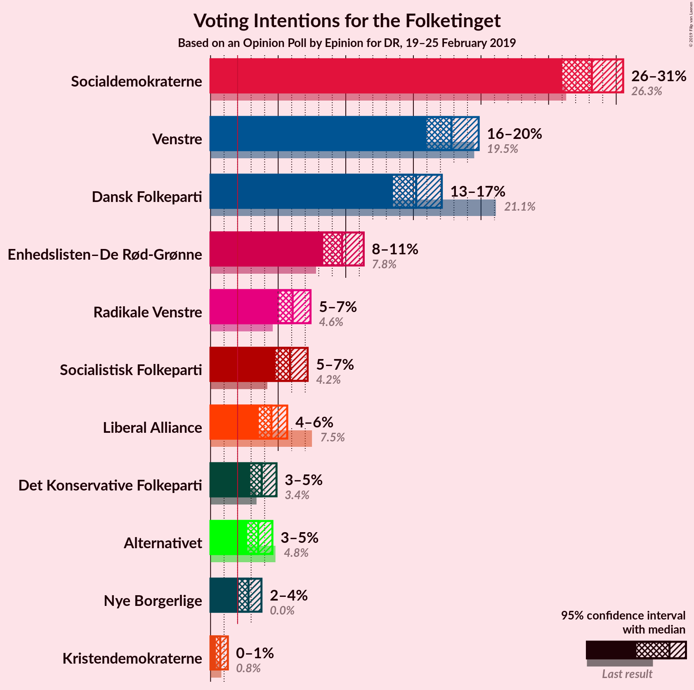
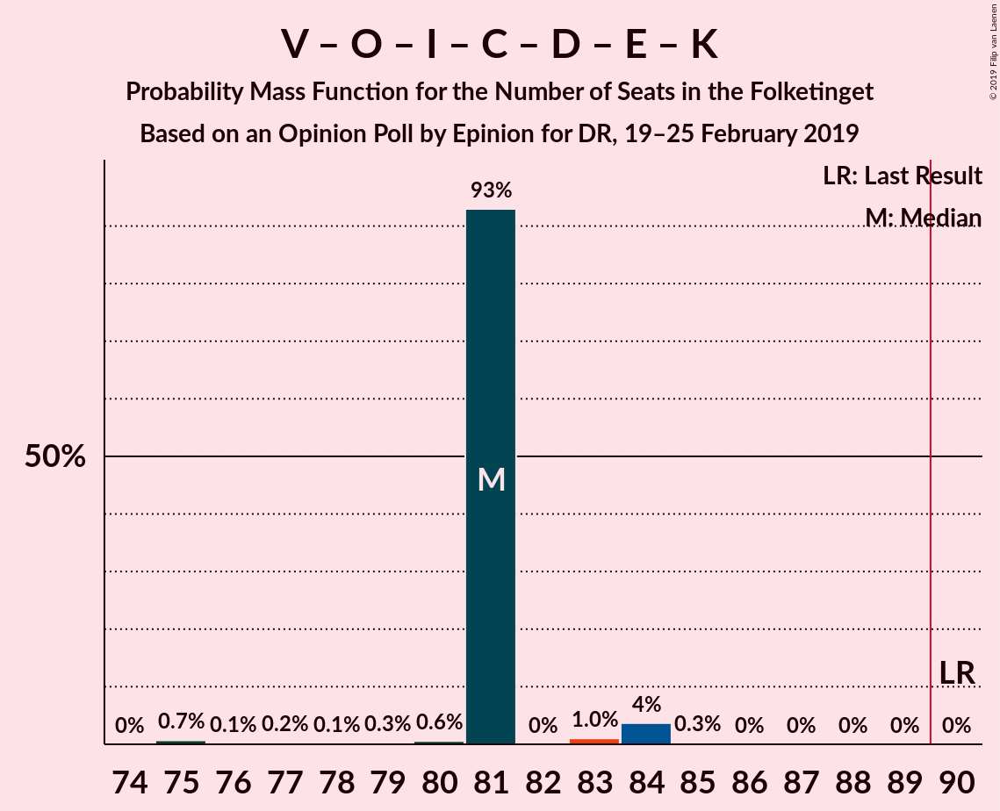
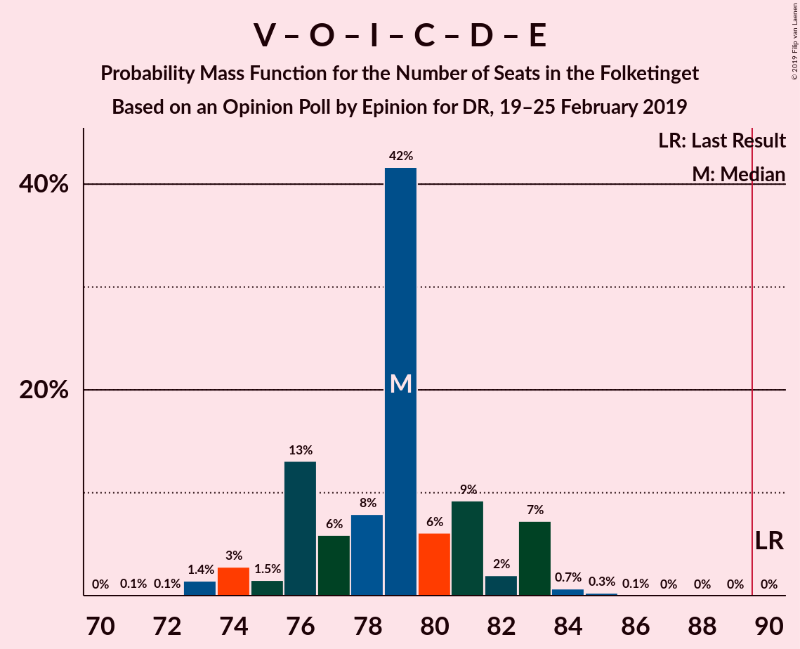

# Opinion Poll by Epinion for DR, 19–25 February 2019

<a href="#voting-intentions">Voting Intentions</a> | <a href="#seats">Seats</a> | <a href="#coalitions">Coalitions</a> | <a href="#technical-information">Technical Information</a>

## Voting Intentions

### Confidence Intervals

| Party | Last Result | Poll Result | 80% Confidence Interval | 90% Confidence Interval | 95% Confidence Interval | 99% Confidence Interval |
|:-----:|:-----------:|:-----------:|:-----------------------:|:-----------------------:|:-----------------------:|:-----------------------:|
| Socialdemokraterne | 26.3% | 28.2% | 26.7–29.7% |26.4–30.1% |26.0–30.5% |25.3–31.2% |
| Venstre | 19.5% | 17.8% | 16.6–19.1% |16.3–19.5% |16.0–19.8% |15.4–20.5% |
| Dansk Folkeparti | 21.1% | 15.2% | 14.1–16.4% |13.8–16.8% |13.5–17.1% |13.0–17.7% |
| Enhedslisten–De Rød-Grønne | 7.8% | 9.7% | 8.8–10.8% |8.6–11.1% |8.3–11.3% |7.9–11.8% |
| Radikale Venstre | 4.6% | 6.1% | 5.3–6.9% |5.2–7.2% |5.0–7.4% |4.6–7.8% |
| Socialistisk Folkeparti | 4.2% | 5.9% | 5.2–6.7% |5.0–7.0% |4.8–7.2% |4.5–7.6% |
| Liberal Alliance | 7.5% | 4.5% | 3.9–5.3% |3.7–5.5% |3.6–5.7% |3.3–6.1% |
| Det Konservative Folkeparti | 3.4% | 3.8% | 3.2–4.5% |3.1–4.7% |2.9–4.9% |2.7–5.2% |
| Alternativet | 4.8% | 3.5% | 3.0–4.2% |2.8–4.4% |2.7–4.6% |2.5–4.9% |
| Nye Borgerlige | 0.0% | 2.8% | 2.3–3.4% |2.2–3.6% |2.1–3.8% |1.9–4.1% |
| Klaus Riskær Pedersen | 0.0% | 1.8% | 1.4–2.3% |1.4–2.5% |1.3–2.6% |1.1–2.9% |
| Kristendemokraterne | 0.8% | 0.7% | 0.5–1.1% |0.4–1.2% |0.4–1.3% |0.3–1.5% |

*Note:* The poll result column reflects the actual value used in the calculations. Published results may vary slightly, and in addition be rounded to fewer digits.

## Seats

### Confidence Intervals

| Party | Last Result | Median | 80% Confidence Interval | 90% Confidence Interval | 95% Confidence Interval | 99% Confidence Interval |
|:-----:|:-----------:|:------:|:-----------------------:|:-----------------------:|:-----------------------:|:-----------------------:|
| <a href="#socialdemokraterne">Socialdemokraterne</a> | 47 | 47 | 47 |47 |47–48 |46–51 |
| <a href="#venstre">Venstre</a> | 34 | 32 | 32 |32 |30–33 |27–34 |
| <a href="#dansk-folkeparti">Dansk Folkeparti</a> | 37 | 25 | 25 |25–29 |25–31 |24–31 |
| <a href="#enhedslisten–de-rød-grønne">Enhedslisten–De Rød-Grønne</a> | 14 | 18 | 18 |18 |18 |16–20 |
| <a href="#radikale-venstre">Radikale Venstre</a> | 8 | 10 | 10 |10–11 |10–11 |10–12 |
| <a href="#socialistisk-folkeparti">Socialistisk Folkeparti</a> | 7 | 12 | 12 |10–12 |9–12 |9–12 |
| <a href="#liberal-alliance">Liberal Alliance</a> | 13 | 9 | 9 |8–9 |8–9 |8–10 |
| <a href="#det-konservative-folkeparti">Det Konservative Folkeparti</a> | 6 | 7 | 7 |7 |6–7 |6–8 |
| <a href="#alternativet">Alternativet</a> | 9 | 7 | 7 |6–7 |6–7 |4–7 |
| <a href="#nye-borgerlige">Nye Borgerlige</a> | 0 | 4 | 4 |4–5 |4–5 |4–6 |
| <a href="#klaus-riskær-pedersen">Klaus Riskær Pedersen</a> | 0 | 4 | 4 |0–4 |0–4 |0–4 |
| <a href="#kristendemokraterne">Kristendemokraterne</a> | 0 | 0 | 0 |0 |0 |0 |

### Socialdemokraterne

*For a full overview of the results for this party, see the [Socialdemokraterne](party-socialdemokraterne.html) page.*

| Number of Seats | Probability | Accumulated | Special Marks |
|:---------------:|:-----------:|:-----------:|:-------------:|
| 46 | 1.1% | 100% |  |
| 47 | 96% | 98.9% | Last Result, Median |
| 48 | 1.1% | 3% |  |
| 49 | 0.1% | 2% |  |
| 50 | 0.2% | 2% |  |
| 51 | 1.3% | 2% |  |
| 52 | 0% | 0.4% |  |
| 53 | 0.1% | 0.3% |  |
| 54 | 0.2% | 0.3% |  |
| 55 | 0.1% | 0.1% |  |
| 56 | 0% | 0% |  |

### Venstre

*For a full overview of the results for this party, see the [Venstre](party-venstre.html) page.*

| Number of Seats | Probability | Accumulated | Special Marks |
|:---------------:|:-----------:|:-----------:|:-------------:|
| 26 | 0.1% | 100% |  |
| 27 | 0.7% | 99.9% |  |
| 28 | 0.7% | 99.2% |  |
| 29 | 0.1% | 98.5% |  |
| 30 | 1.1% | 98% |  |
| 31 | 0.6% | 97% |  |
| 32 | 92% | 97% | Median |
| 33 | 4% | 4% |  |
| 34 | 0.6% | 0.7% | Last Result |
| 35 | 0.1% | 0.1% |  |
| 36 | 0% | 0% |  |

### Dansk Folkeparti

*For a full overview of the results for this party, see the [Dansk Folkeparti](party-danskfolkeparti.html) page.*

| Number of Seats | Probability | Accumulated | Special Marks |
|:---------------:|:-----------:|:-----------:|:-------------:|
| 24 | 0.6% | 100% |  |
| 25 | 92% | 99.4% | Median |
| 26 | 1.4% | 7% |  |
| 27 | 0.4% | 6% |  |
| 28 | 0.2% | 5% |  |
| 29 | 0% | 5% |  |
| 30 | 1.3% | 5% |  |
| 31 | 4% | 4% |  |
| 32 | 0.1% | 0.1% |  |
| 33 | 0% | 0% |  |
| 34 | 0% | 0% |  |
| 35 | 0% | 0% |  |
| 36 | 0% | 0% |  |
| 37 | 0% | 0% | Last Result |

### Enhedslisten–De Rød-Grønne

*For a full overview of the results for this party, see the [Enhedslisten–De Rød-Grønne](party-enhedslisten–derød-grønne.html) page.*

| Number of Seats | Probability | Accumulated | Special Marks |
|:---------------:|:-----------:|:-----------:|:-------------:|
| 14 | 0% | 100% | Last Result |
| 15 | 0.1% | 100% |  |
| 16 | 0.4% | 99.9% |  |
| 17 | 0.4% | 99.5% |  |
| 18 | 97% | 99.0% | Median |
| 19 | 1.2% | 2% |  |
| 20 | 1.1% | 1.2% |  |
| 21 | 0.1% | 0.1% |  |
| 22 | 0% | 0% |  |

### Radikale Venstre

*For a full overview of the results for this party, see the [Radikale Venstre](party-radikalevenstre.html) page.*

| Number of Seats | Probability | Accumulated | Special Marks |
|:---------------:|:-----------:|:-----------:|:-------------:|
| 8 | 0% | 100% | Last Result |
| 9 | 0% | 100% |  |
| 10 | 93% | 100% | Median |
| 11 | 6% | 7% |  |
| 12 | 0.9% | 1.0% |  |
| 13 | 0.1% | 0.1% |  |
| 14 | 0% | 0% |  |

### Socialistisk Folkeparti

*For a full overview of the results for this party, see the [Socialistisk Folkeparti](party-socialistiskfolkeparti.html) page.*

| Number of Seats | Probability | Accumulated | Special Marks |
|:---------------:|:-----------:|:-----------:|:-------------:|
| 7 | 0% | 100% | Last Result |
| 8 | 0.1% | 100% |  |
| 9 | 5% | 99.9% |  |
| 10 | 0.4% | 95% |  |
| 11 | 2% | 95% |  |
| 12 | 93% | 93% | Median |
| 13 | 0% | 0.2% |  |
| 14 | 0% | 0.2% |  |
| 15 | 0.1% | 0.1% |  |
| 16 | 0% | 0% |  |

### Liberal Alliance

*For a full overview of the results for this party, see the [Liberal Alliance](party-liberalalliance.html) page.*

| Number of Seats | Probability | Accumulated | Special Marks |
|:---------------:|:-----------:|:-----------:|:-------------:|
| 6 | 0.1% | 100% |  |
| 7 | 0.3% | 99.9% |  |
| 8 | 5% | 99.6% |  |
| 9 | 92% | 95% | Median |
| 10 | 2% | 2% |  |
| 11 | 0.2% | 0.2% |  |
| 12 | 0% | 0% |  |
| 13 | 0% | 0% | Last Result |

### Det Konservative Folkeparti

*For a full overview of the results for this party, see the [Det Konservative Folkeparti](party-detkonservativefolkeparti.html) page.*

| Number of Seats | Probability | Accumulated | Special Marks |
|:---------------:|:-----------:|:-----------:|:-------------:|
| 5 | 0.5% | 100% |  |
| 6 | 2% | 99.5% | Last Result |
| 7 | 96% | 97% | Median |
| 8 | 0.9% | 0.9% |  |
| 9 | 0% | 0% |  |

### Alternativet

*For a full overview of the results for this party, see the [Alternativet](party-alternativet.html) page.*

| Number of Seats | Probability | Accumulated | Special Marks |
|:---------------:|:-----------:|:-----------:|:-------------:|
| 4 | 0.6% | 100% |  |
| 5 | 1.4% | 99.4% |  |
| 6 | 5% | 98% |  |
| 7 | 93% | 93% | Median |
| 8 | 0% | 0% |  |
| 9 | 0% | 0% | Last Result |

### Nye Borgerlige

*For a full overview of the results for this party, see the [Nye Borgerlige](party-nyeborgerlige.html) page.*

| Number of Seats | Probability | Accumulated | Special Marks |
|:---------------:|:-----------:|:-----------:|:-------------:|
| 0 | 0.1% | 100% | Last Result |
| 1 | 0% | 99.9% |  |
| 2 | 0% | 99.9% |  |
| 3 | 0% | 99.9% |  |
| 4 | 92% | 99.9% | Median |
| 5 | 7% | 8% |  |
| 6 | 0.9% | 1.0% |  |
| 7 | 0% | 0% |  |

### Klaus Riskær Pedersen

*For a full overview of the results for this party, see the [Klaus Riskær Pedersen](party-klausriskærpedersen.html) page.*

| Number of Seats | Probability | Accumulated | Special Marks |
|:---------------:|:-----------:|:-----------:|:-------------:|
| 0 | 6% | 100% | Last Result |
| 1 | 0% | 94% |  |
| 2 | 0% | 94% |  |
| 3 | 0% | 94% |  |
| 4 | 94% | 94% | Median |
| 5 | 0.1% | 0.1% |  |
| 6 | 0% | 0% |  |

### Kristendemokraterne

*For a full overview of the results for this party, see the [Kristendemokraterne](party-kristendemokraterne.html) page.*

| Number of Seats | Probability | Accumulated | Special Marks |
|:---------------:|:-----------:|:-----------:|:-------------:|
| 0 | 100% | 100% | Last Result, Median |

## Coalitions

### Confidence Intervals

| Coalition | Last Result | Median | Majority? | 80% Confidence Interval | 90% Confidence Interval | 95% Confidence Interval | 99% Confidence Interval |
|:---------:|:-----------:|:------:|:---------:|:-----------------------:|:-----------------------:|:-----------------------:|:-----------------------:|
| Socialdemokraterne – Enhedslisten–De Rød-Grønne – Radikale Venstre – Socialistisk Folkeparti – Alternativet | 85 | 94 | 100% | 94 | 92–94 | 91–94 | 91–100 |
| Socialdemokraterne – Enhedslisten–De Rød-Grønne – Radikale Venstre – Socialistisk Folkeparti | 76 | 87 | 2% | 87 | 86–87 | 85–89 | 85–93 |
| Venstre – Dansk Folkeparti – Liberal Alliance – Det Konservative Folkeparti – Nye Borgerlige – Klaus Riskær Pedersen – Kristendemokraterne | 90 | 81 | 0% | 81 | 81–83 | 81–84 | 75–84 |
| Venstre – Dansk Folkeparti – Liberal Alliance – Det Konservative Folkeparti – Nye Borgerlige – Klaus Riskær Pedersen | 90 | 81 | 0% | 81 | 81–83 | 81–84 | 75–84 |
| Socialdemokraterne – Enhedslisten–De Rød-Grønne – Socialistisk Folkeparti – Alternativet | 77 | 84 | 0% | 84 | 81–84 | 80–84 | 80–88 |
| Venstre – Dansk Folkeparti – Liberal Alliance – Det Konservative Folkeparti – Nye Borgerlige – Kristendemokraterne | 90 | 77 | 0% | 77 | 77–79 | 77–84 | 75–84 |
| Venstre – Dansk Folkeparti – Liberal Alliance – Det Konservative Folkeparti – Nye Borgerlige | 90 | 77 | 0% | 77 | 77–79 | 77–84 | 75–84 |
| Venstre – Dansk Folkeparti – Liberal Alliance – Det Konservative Folkeparti – Kristendemokraterne | 90 | 73 | 0% | 73 | 73–74 | 73–79 | 69–79 |
| Venstre – Dansk Folkeparti – Liberal Alliance – Det Konservative Folkeparti | 90 | 73 | 0% | 73 | 73–74 | 73–79 | 69–79 |
| Socialdemokraterne – Enhedslisten–De Rød-Grønne – Socialistisk Folkeparti | 68 | 77 | 0% | 77 | 76–77 | 74–78 | 74–81 |
| Socialdemokraterne – Radikale Venstre – Socialistisk Folkeparti | 62 | 69 | 0% | 69 | 69 | 67–70 | 66–74 |
| Socialdemokraterne – Radikale Venstre | 55 | 57 | 0% | 57 | 57–58 | 57–59 | 57–63 |
| Venstre – Liberal Alliance – Det Konservative Folkeparti | 53 | 48 | 0% | 48 | 48 | 46–48 | 43–51 |
| Venstre – Det Konservative Folkeparti | 40 | 39 | 0% | 39 | 39 | 36–40 | 33–41 |
| Venstre | 34 | 32 | 0% | 32 | 32 | 30–33 | 27–34 |

### Socialdemokraterne – Enhedslisten–De Rød-Grønne – Radikale Venstre – Socialistisk Folkeparti – Alternativet

| Number of Seats | Probability | Accumulated | Special Marks |
|:---------------:|:-----------:|:-----------:|:-------------:|
| 85 | 0% | 100% | Last Result |
| 86 | 0% | 100% |  |
| 87 | 0% | 100% |  |
| 88 | 0% | 100% |  |
| 89 | 0% | 100% |  |
| 90 | 0.3% | 100% | Majority |
| 91 | 4% | 99.7% |  |
| 92 | 1.0% | 96% |  |
| 93 | 0% | 95% |  |
| 94 | 93% | 95% | Median |
| 95 | 0.6% | 2% |  |
| 96 | 0.3% | 1.4% |  |
| 97 | 0.1% | 1.1% |  |
| 98 | 0.2% | 1.0% |  |
| 99 | 0.1% | 0.8% |  |
| 100 | 0.7% | 0.7% |  |
| 101 | 0% | 0% |  |

### Socialdemokraterne – Enhedslisten–De Rød-Grønne – Radikale Venstre – Socialistisk Folkeparti

| Number of Seats | Probability | Accumulated | Special Marks |
|:---------------:|:-----------:|:-----------:|:-------------:|
| 76 | 0% | 100% | Last Result |
| 77 | 0% | 100% |  |
| 78 | 0% | 100% |  |
| 79 | 0% | 100% |  |
| 80 | 0% | 100% |  |
| 81 | 0% | 100% |  |
| 82 | 0% | 100% |  |
| 83 | 0% | 100% |  |
| 84 | 0% | 100% |  |
| 85 | 4% | 100% |  |
| 86 | 1.1% | 96% |  |
| 87 | 92% | 95% | Median |
| 88 | 0% | 3% |  |
| 89 | 0.8% | 3% |  |
| 90 | 0.2% | 2% | Majority |
| 91 | 0.7% | 2% |  |
| 92 | 0.1% | 1.0% |  |
| 93 | 0.9% | 0.9% |  |
| 94 | 0% | 0% |  |

### Venstre – Dansk Folkeparti – Liberal Alliance – Det Konservative Folkeparti – Nye Borgerlige – Klaus Riskær Pedersen – Kristendemokraterne

| Number of Seats | Probability | Accumulated | Special Marks |
|:---------------:|:-----------:|:-----------:|:-------------:|
| 75 | 0.7% | 100% |  |
| 76 | 0.1% | 99.3% |  |
| 77 | 0.2% | 99.2% |  |
| 78 | 0.1% | 99.0% |  |
| 79 | 0.3% | 98.9% |  |
| 80 | 0.6% | 98.6% |  |
| 81 | 93% | 98% | Median |
| 82 | 0% | 5% |  |
| 83 | 1.0% | 5% |  |
| 84 | 4% | 4% |  |
| 85 | 0.3% | 0.3% |  |
| 86 | 0% | 0% |  |
| 87 | 0% | 0% |  |
| 88 | 0% | 0% |  |
| 89 | 0% | 0% |  |
| 90 | 0% | 0% | Last Result, Majority |

### Venstre – Dansk Folkeparti – Liberal Alliance – Det Konservative Folkeparti – Nye Borgerlige – Klaus Riskær Pedersen

| Number of Seats | Probability | Accumulated | Special Marks |
|:---------------:|:-----------:|:-----------:|:-------------:|
| 75 | 0.7% | 100% |  |
| 76 | 0.1% | 99.3% |  |
| 77 | 0.2% | 99.2% |  |
| 78 | 0.1% | 99.0% |  |
| 79 | 0.3% | 98.9% |  |
| 80 | 0.6% | 98.6% |  |
| 81 | 93% | 98% | Median |
| 82 | 0% | 5% |  |
| 83 | 1.0% | 5% |  |
| 84 | 4% | 4% |  |
| 85 | 0.3% | 0.3% |  |
| 86 | 0% | 0% |  |
| 87 | 0% | 0% |  |
| 88 | 0% | 0% |  |
| 89 | 0% | 0% |  |
| 90 | 0% | 0% | Last Result, Majority |

### Socialdemokraterne – Enhedslisten–De Rød-Grønne – Socialistisk Folkeparti – Alternativet

| Number of Seats | Probability | Accumulated | Special Marks |
|:---------------:|:-----------:|:-----------:|:-------------:|
| 77 | 0% | 100% | Last Result |
| 78 | 0% | 100% |  |
| 79 | 0% | 100% |  |
| 80 | 4% | 100% |  |
| 81 | 1.0% | 96% |  |
| 82 | 0% | 95% |  |
| 83 | 0.7% | 95% |  |
| 84 | 92% | 94% | Median |
| 85 | 0.7% | 2% |  |
| 86 | 0.4% | 1.2% |  |
| 87 | 0% | 0.8% |  |
| 88 | 0.8% | 0.8% |  |
| 89 | 0% | 0% |  |

### Venstre – Dansk Folkeparti – Liberal Alliance – Det Konservative Folkeparti – Nye Borgerlige – Kristendemokraterne

| Number of Seats | Probability | Accumulated | Special Marks |
|:---------------:|:-----------:|:-----------:|:-------------:|
| 74 | 0.1% | 100% |  |
| 75 | 0.7% | 99.9% |  |
| 76 | 0.1% | 99.2% |  |
| 77 | 93% | 99.1% | Median |
| 78 | 0.1% | 6% |  |
| 79 | 1.3% | 6% |  |
| 80 | 0.6% | 5% |  |
| 81 | 0.3% | 4% |  |
| 82 | 0% | 4% |  |
| 83 | 0% | 4% |  |
| 84 | 4% | 4% |  |
| 85 | 0% | 0% |  |
| 86 | 0% | 0% |  |
| 87 | 0% | 0% |  |
| 88 | 0% | 0% |  |
| 89 | 0% | 0% |  |
| 90 | 0% | 0% | Last Result, Majority |

### Venstre – Dansk Folkeparti – Liberal Alliance – Det Konservative Folkeparti – Nye Borgerlige

| Number of Seats | Probability | Accumulated | Special Marks |
|:---------------:|:-----------:|:-----------:|:-------------:|
| 74 | 0.1% | 100% |  |
| 75 | 0.7% | 99.9% |  |
| 76 | 0.1% | 99.2% |  |
| 77 | 93% | 99.1% | Median |
| 78 | 0.1% | 6% |  |
| 79 | 1.3% | 6% |  |
| 80 | 0.6% | 5% |  |
| 81 | 0.3% | 4% |  |
| 82 | 0% | 4% |  |
| 83 | 0% | 4% |  |
| 84 | 4% | 4% |  |
| 85 | 0% | 0% |  |
| 86 | 0% | 0% |  |
| 87 | 0% | 0% |  |
| 88 | 0% | 0% |  |
| 89 | 0% | 0% |  |
| 90 | 0% | 0% | Last Result, Majority |

### Venstre – Dansk Folkeparti – Liberal Alliance – Det Konservative Folkeparti – Kristendemokraterne

| Number of Seats | Probability | Accumulated | Special Marks |
|:---------------:|:-----------:|:-----------:|:-------------:|
| 69 | 0.8% | 100% |  |
| 70 | 0% | 99.2% |  |
| 71 | 0.2% | 99.2% |  |
| 72 | 0.7% | 99.0% |  |
| 73 | 92% | 98% | Median |
| 74 | 1.3% | 6% |  |
| 75 | 0.6% | 5% |  |
| 76 | 0.4% | 4% |  |
| 77 | 0% | 4% |  |
| 78 | 0% | 4% |  |
| 79 | 4% | 4% |  |
| 80 | 0% | 0% |  |
| 81 | 0% | 0% |  |
| 82 | 0% | 0% |  |
| 83 | 0% | 0% |  |
| 84 | 0% | 0% |  |
| 85 | 0% | 0% |  |
| 86 | 0% | 0% |  |
| 87 | 0% | 0% |  |
| 88 | 0% | 0% |  |
| 89 | 0% | 0% |  |
| 90 | 0% | 0% | Last Result, Majority |

### Venstre – Dansk Folkeparti – Liberal Alliance – Det Konservative Folkeparti

| Number of Seats | Probability | Accumulated | Special Marks |
|:---------------:|:-----------:|:-----------:|:-------------:|
| 69 | 0.8% | 100% |  |
| 70 | 0% | 99.2% |  |
| 71 | 0.2% | 99.2% |  |
| 72 | 0.7% | 99.0% |  |
| 73 | 92% | 98% | Median |
| 74 | 1.3% | 6% |  |
| 75 | 0.6% | 5% |  |
| 76 | 0.4% | 4% |  |
| 77 | 0% | 4% |  |
| 78 | 0% | 4% |  |
| 79 | 4% | 4% |  |
| 80 | 0% | 0% |  |
| 81 | 0% | 0% |  |
| 82 | 0% | 0% |  |
| 83 | 0% | 0% |  |
| 84 | 0% | 0% |  |
| 85 | 0% | 0% |  |
| 86 | 0% | 0% |  |
| 87 | 0% | 0% |  |
| 88 | 0% | 0% |  |
| 89 | 0% | 0% |  |
| 90 | 0% | 0% | Last Result, Majority |

### Socialdemokraterne – Enhedslisten–De Rød-Grønne – Socialistisk Folkeparti

| Number of Seats | Probability | Accumulated | Special Marks |
|:---------------:|:-----------:|:-----------:|:-------------:|
| 68 | 0% | 100% | Last Result |
| 69 | 0% | 100% |  |
| 70 | 0% | 100% |  |
| 71 | 0% | 100% |  |
| 72 | 0% | 100% |  |
| 73 | 0% | 100% |  |
| 74 | 4% | 100% |  |
| 75 | 1.4% | 96% |  |
| 76 | 0% | 95% |  |
| 77 | 92% | 95% | Median |
| 78 | 0.9% | 3% |  |
| 79 | 0.1% | 2% |  |
| 80 | 0.2% | 2% |  |
| 81 | 1.4% | 2% |  |
| 82 | 0.1% | 0.1% |  |
| 83 | 0% | 0% |  |

### Socialdemokraterne – Radikale Venstre – Socialistisk Folkeparti

| Number of Seats | Probability | Accumulated | Special Marks |
|:---------------:|:-----------:|:-----------:|:-------------:|
| 62 | 0% | 100% | Last Result |
| 63 | 0% | 100% |  |
| 64 | 0% | 100% |  |
| 65 | 0% | 100% |  |
| 66 | 1.0% | 100% |  |
| 67 | 4% | 99.0% |  |
| 68 | 0% | 95% |  |
| 69 | 93% | 95% | Median |
| 70 | 0.2% | 3% |  |
| 71 | 0.7% | 2% |  |
| 72 | 0.7% | 2% |  |
| 73 | 0% | 1.1% |  |
| 74 | 0.7% | 1.0% |  |
| 75 | 0% | 0.3% |  |
| 76 | 0.2% | 0.3% |  |
| 77 | 0.1% | 0.1% |  |
| 78 | 0% | 0% |  |

### Socialdemokraterne – Radikale Venstre

| Number of Seats | Probability | Accumulated | Special Marks |
|:---------------:|:-----------:|:-----------:|:-------------:|
| 55 | 0% | 100% | Last Result |
| 56 | 0% | 100% |  |
| 57 | 93% | 100% | Median |
| 58 | 4% | 7% |  |
| 59 | 0.8% | 3% |  |
| 60 | 0.3% | 2% |  |
| 61 | 0.6% | 2% |  |
| 62 | 0% | 1.1% |  |
| 63 | 0.7% | 1.0% |  |
| 64 | 0.1% | 0.4% |  |
| 65 | 0% | 0.3% |  |
| 66 | 0.2% | 0.3% |  |
| 67 | 0% | 0% |  |

### Venstre – Liberal Alliance – Det Konservative Folkeparti

| Number of Seats | Probability | Accumulated | Special Marks |
|:---------------:|:-----------:|:-----------:|:-------------:|
| 43 | 0.8% | 100% |  |
| 44 | 1.2% | 99.2% |  |
| 45 | 0.1% | 98% |  |
| 46 | 1.1% | 98% |  |
| 47 | 0.3% | 97% |  |
| 48 | 96% | 97% | Median |
| 49 | 0.1% | 0.7% |  |
| 50 | 0% | 0.6% |  |
| 51 | 0.5% | 0.6% |  |
| 52 | 0% | 0% |  |
| 53 | 0% | 0% | Last Result |

### Venstre – Det Konservative Folkeparti

| Number of Seats | Probability | Accumulated | Special Marks |
|:---------------:|:-----------:|:-----------:|:-------------:|
| 33 | 0.7% | 100% |  |
| 34 | 0.1% | 99.3% |  |
| 35 | 0% | 99.2% |  |
| 36 | 2% | 99.2% |  |
| 37 | 0.3% | 97% |  |
| 38 | 0.1% | 97% |  |
| 39 | 92% | 97% | Median |
| 40 | 4% | 4% | Last Result |
| 41 | 0.6% | 0.6% |  |
| 42 | 0% | 0% |  |

### Venstre

| Number of Seats | Probability | Accumulated | Special Marks |
|:---------------:|:-----------:|:-----------:|:-------------:|
| 26 | 0.1% | 100% |  |
| 27 | 0.7% | 99.9% |  |
| 28 | 0.7% | 99.2% |  |
| 29 | 0.1% | 98.5% |  |
| 30 | 1.1% | 98% |  |
| 31 | 0.6% | 97% |  |
| 32 | 92% | 97% | Median |
| 33 | 4% | 4% |  |
| 34 | 0.6% | 0.7% | Last Result |
| 35 | 0.1% | 0.1% |  |
| 36 | 0% | 0% |  |

## Technical Information

### Opinion Poll

+ **Polling firm:** Epinion
+ **Commissioner(s):** DR
+ **Fieldwork period:** 19–25 February 2019

### Calculations

+ **Sample size:** 1532
+ **Simulations done:** 131,072
+ **Error estimate:** 2.42%

