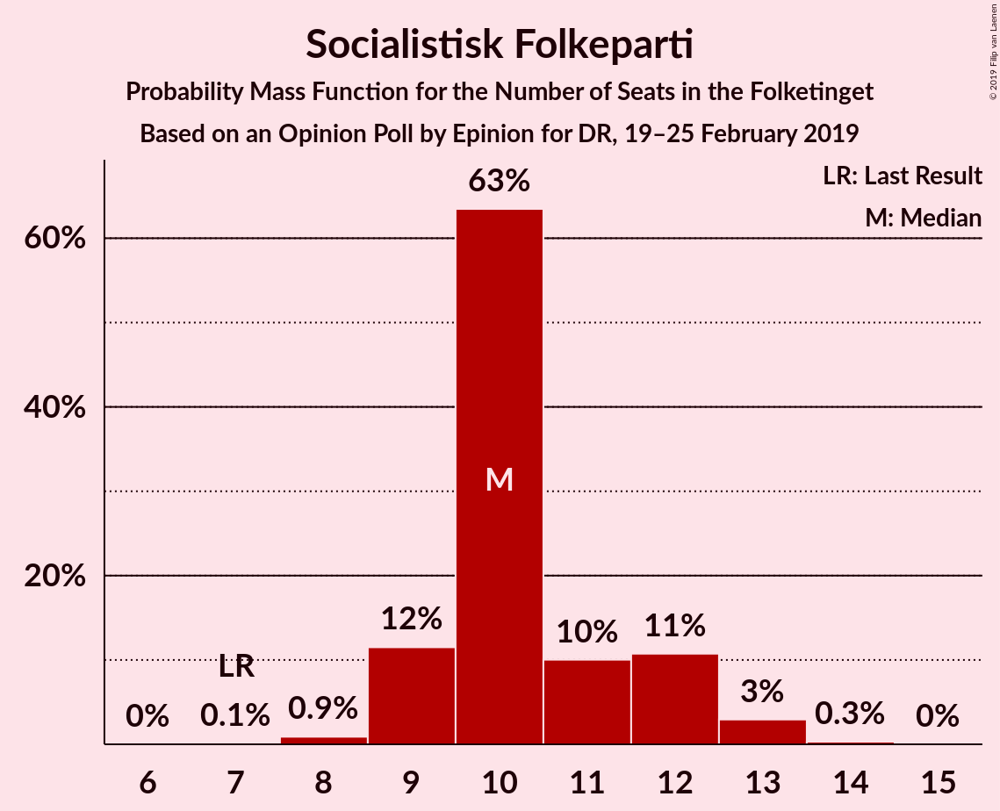
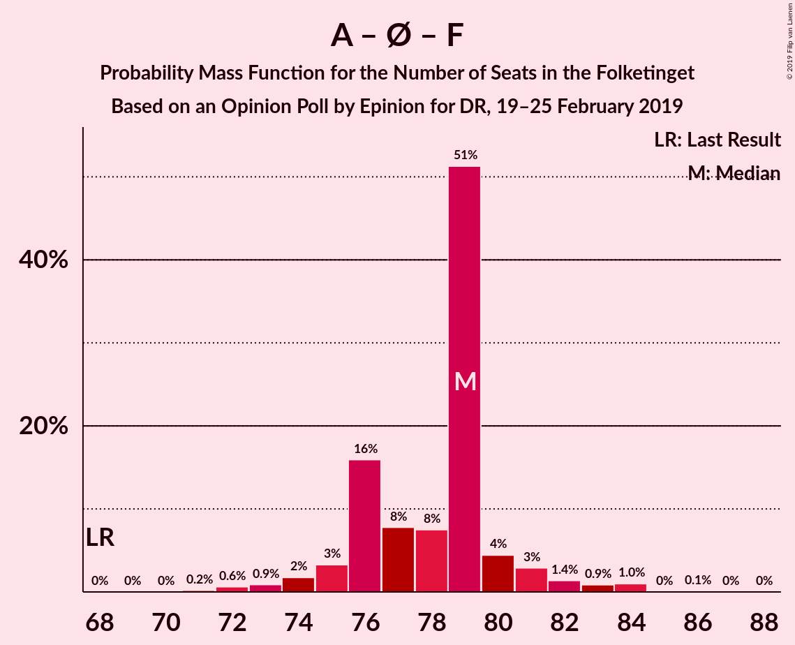
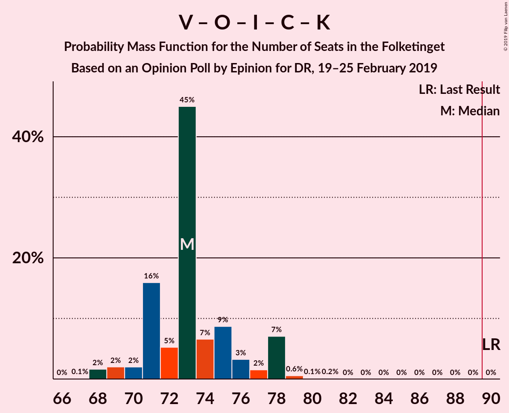
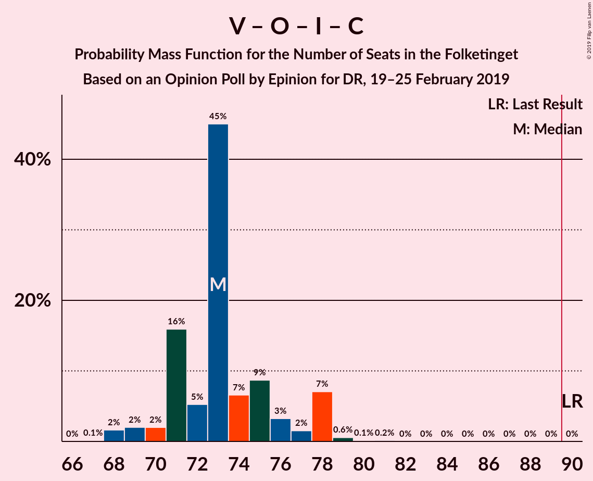

# Opinion Poll by Epinion for DR, 19–25 February 2019

<a href="#voting-intentions">Voting Intentions</a> | <a href="#seats">Seats</a> | <a href="#coalitions">Coalitions</a> | <a href="#technical-information">Technical Information</a>

## Voting Intentions

### Confidence Intervals

| Party | Last Result | Poll Result | 80% Confidence Interval | 90% Confidence Interval | 95% Confidence Interval | 99% Confidence Interval |
|:-----:|:-----------:|:-----------:|:-----------------------:|:-----------------------:|:-----------------------:|:-----------------------:|
| Socialdemokraterne | 26.3% | 28.2% | 26.7–29.7% |26.4–30.1% |26.0–30.5% |25.3–31.2% |
| Venstre | 19.5% | 17.8% | 16.6–19.1% |16.3–19.5% |16.0–19.8% |15.4–20.5% |
| Dansk Folkeparti | 21.1% | 15.2% | 14.1–16.4% |13.8–16.8% |13.5–17.1% |13.0–17.7% |
| Enhedslisten–De Rød-Grønne | 7.8% | 9.7% | 8.8–10.8% |8.6–11.1% |8.3–11.3% |7.9–11.8% |
| Radikale Venstre | 4.6% | 6.1% | 5.3–6.9% |5.2–7.2% |5.0–7.4% |4.6–7.8% |
| Socialistisk Folkeparti | 4.2% | 5.9% | 5.2–6.7% |5.0–7.0% |4.8–7.2% |4.5–7.6% |
| Liberal Alliance | 7.5% | 4.5% | 3.9–5.3% |3.7–5.5% |3.6–5.7% |3.3–6.1% |
| Det Konservative Folkeparti | 3.4% | 3.8% | 3.2–4.5% |3.1–4.7% |2.9–4.9% |2.7–5.2% |
| Alternativet | 4.8% | 3.5% | 3.0–4.2% |2.8–4.4% |2.7–4.6% |2.5–4.9% |
| Nye Borgerlige | 0.0% | 2.8% | 2.3–3.4% |2.2–3.6% |2.1–3.8% |1.9–4.1% |
| Kristendemokraterne | 0.8% | 0.7% | 0.5–1.1% |0.4–1.2% |0.4–1.3% |0.3–1.5% |

*Note:* The poll result column reflects the actual value used in the calculations. Published results may vary slightly, and in addition be rounded to fewer digits.

## Seats

### Confidence Intervals

| Party | Last Result | Median | 80% Confidence Interval | 90% Confidence Interval | 95% Confidence Interval | 99% Confidence Interval |
|:-----:|:-----------:|:------:|:-----------------------:|:-----------------------:|:-----------------------:|:-----------------------:|
| <a href="#socialdemokraterne">Socialdemokraterne</a> | 47 | 53 | 53 |51–53 |48–53 |48–53 |
| <a href="#venstre">Venstre</a> | 34 | 32 | 32–33 |32–35 |31–35 |31–35 |
| <a href="#dansk-folkeparti">Dansk Folkeparti</a> | 37 | 26 | 24–26 |24–26 |22–26 |22–26 |
| <a href="#enhedslisten–de-rød-grønne">Enhedslisten–De Rød-Grønne</a> | 14 | 18 | 17–18 |16–18 |16–18 |16–18 |
| <a href="#radikale-venstre">Radikale Venstre</a> | 8 | 12 | 12 |11–12 |10–12 |10–12 |
| <a href="#socialistisk-folkeparti">Socialistisk Folkeparti</a> | 7 | 7 | 7–8 |7–12 |7–16 |7–16 |
| <a href="#liberal-alliance">Liberal Alliance</a> | 13 | 8 | 8–9 |8–9 |7–9 |7–9 |
| <a href="#det-konservative-folkeparti">Det Konservative Folkeparti</a> | 6 | 7 | 7–8 |7–8 |6–9 |6–9 |
| <a href="#alternativet">Alternativet</a> | 9 | 7 | 6–7 |6–7 |6–7 |6–7 |
| <a href="#nye-borgerlige">Nye Borgerlige</a> | 0 | 5 | 5 |4–5 |4–7 |4–7 |
| <a href="#kristendemokraterne">Kristendemokraterne</a> | 0 | 0 | 0 |0 |0 |0 |

### Socialdemokraterne

*For a full overview of the results for this party, see the [Socialdemokraterne](party-socialdemokraterne.html) page.*

| Number of Seats | Probability | Accumulated | Special Marks |
|:---------------:|:-----------:|:-----------:|:-------------:|
| 47 | 0% | 100% | Last Result |
| 48 | 5% | 100% |  |
| 49 | 0% | 95% |  |
| 50 | 0% | 95% |  |
| 51 | 3% | 95% |  |
| 52 | 0% | 93% |  |
| 53 | 93% | 93% | Median |
| 54 | 0% | 0% |  |

### Venstre

*For a full overview of the results for this party, see the [Venstre](party-venstre.html) page.*

| Number of Seats | Probability | Accumulated | Special Marks |
|:---------------:|:-----------:|:-----------:|:-------------:|
| 31 | 3% | 100% |  |
| 32 | 84% | 97% | Median |
| 33 | 5% | 14% |  |
| 34 | 0% | 9% | Last Result |
| 35 | 9% | 9% |  |
| 36 | 0% | 0% |  |

### Dansk Folkeparti

*For a full overview of the results for this party, see the [Dansk Folkeparti](party-danskfolkeparti.html) page.*

| Number of Seats | Probability | Accumulated | Special Marks |
|:---------------:|:-----------:|:-----------:|:-------------:|
| 22 | 5% | 100% |  |
| 23 | 0% | 95% |  |
| 24 | 9% | 95% |  |
| 25 | 3% | 86% |  |
| 26 | 84% | 84% | Median |
| 27 | 0% | 0.1% |  |
| 28 | 0.1% | 0.1% |  |
| 29 | 0% | 0% |  |
| 30 | 0% | 0% |  |
| 31 | 0% | 0% |  |
| 32 | 0% | 0% |  |
| 33 | 0% | 0% |  |
| 34 | 0% | 0% |  |
| 35 | 0% | 0% |  |
| 36 | 0% | 0% |  |
| 37 | 0% | 0% | Last Result |

### Enhedslisten–De Rød-Grønne

*For a full overview of the results for this party, see the [Enhedslisten–De Rød-Grønne](party-enhedslisten–derød-grønne.html) page.*

| Number of Seats | Probability | Accumulated | Special Marks |
|:---------------:|:-----------:|:-----------:|:-------------:|
| 14 | 0% | 100% | Last Result |
| 15 | 0% | 100% |  |
| 16 | 9% | 100% |  |
| 17 | 3% | 91% |  |
| 18 | 88% | 88% | Median |
| 19 | 0% | 0% |  |

### Radikale Venstre

*For a full overview of the results for this party, see the [Radikale Venstre](party-radikalevenstre.html) page.*

| Number of Seats | Probability | Accumulated | Special Marks |
|:---------------:|:-----------:|:-----------:|:-------------:|
| 8 | 0% | 100% | Last Result |
| 9 | 0% | 100% |  |
| 10 | 5% | 100% |  |
| 11 | 3% | 95% |  |
| 12 | 93% | 93% | Median |
| 13 | 0% | 0% |  |

### Socialistisk Folkeparti

*For a full overview of the results for this party, see the [Socialistisk Folkeparti](party-socialistiskfolkeparti.html) page.*

| Number of Seats | Probability | Accumulated | Special Marks |
|:---------------:|:-----------:|:-----------:|:-------------:|
| 7 | 84% | 100% | Last Result, Median |
| 8 | 9% | 16% |  |
| 9 | 0% | 7% |  |
| 10 | 0% | 7% |  |
| 11 | 0% | 7% |  |
| 12 | 5% | 7% |  |
| 13 | 0% | 3% |  |
| 14 | 0% | 3% |  |
| 15 | 0% | 3% |  |
| 16 | 3% | 3% |  |
| 17 | 0% | 0% |  |

### Liberal Alliance

*For a full overview of the results for this party, see the [Liberal Alliance](party-liberalalliance.html) page.*

| Number of Seats | Probability | Accumulated | Special Marks |
|:---------------:|:-----------:|:-----------:|:-------------:|
| 7 | 3% | 100% |  |
| 8 | 84% | 97% | Median |
| 9 | 14% | 14% |  |
| 10 | 0% | 0% |  |
| 11 | 0% | 0% |  |
| 12 | 0% | 0% |  |
| 13 | 0% | 0% | Last Result |

### Det Konservative Folkeparti

*For a full overview of the results for this party, see the [Det Konservative Folkeparti](party-detkonservativefolkeparti.html) page.*

| Number of Seats | Probability | Accumulated | Special Marks |
|:---------------:|:-----------:|:-----------:|:-------------:|
| 6 | 3% | 100% | Last Result |
| 7 | 84% | 97% | Median |
| 8 | 9% | 14% |  |
| 9 | 5% | 5% |  |
| 10 | 0% | 0% |  |

### Alternativet

*For a full overview of the results for this party, see the [Alternativet](party-alternativet.html) page.*

| Number of Seats | Probability | Accumulated | Special Marks |
|:---------------:|:-----------:|:-----------:|:-------------:|
| 6 | 12% | 100% |  |
| 7 | 88% | 88% | Median |
| 8 | 0% | 0% |  |
| 9 | 0% | 0% | Last Result |

### Nye Borgerlige

*For a full overview of the results for this party, see the [Nye Borgerlige](party-nyeborgerlige.html) page.*

| Number of Seats | Probability | Accumulated | Special Marks |
|:---------------:|:-----------:|:-----------:|:-------------:|
| 0 | 0% | 100% | Last Result |
| 1 | 0% | 100% |  |
| 2 | 0% | 100% |  |
| 3 | 0% | 100% |  |
| 4 | 9% | 100% |  |
| 5 | 86% | 91% | Median |
| 6 | 0% | 5% |  |
| 7 | 5% | 5% |  |
| 8 | 0% | 0% |  |

### Kristendemokraterne

*For a full overview of the results for this party, see the [Kristendemokraterne](party-kristendemokraterne.html) page.*

| Number of Seats | Probability | Accumulated | Special Marks |
|:---------------:|:-----------:|:-----------:|:-------------:|
| 0 | 100% | 100% | Last Result, Median |

## Coalitions

### Confidence Intervals

| Coalition | Last Result | Median | Majority? | 80% Confidence Interval | 90% Confidence Interval | 95% Confidence Interval | 99% Confidence Interval |
|:---------:|:-----------:|:------:|:---------:|:-----------------------:|:-----------------------:|:-----------------------:|:-----------------------:|
| Socialdemokraterne – Enhedslisten–De Rød-Grønne – Radikale Venstre – Socialistisk Folkeparti – Alternativet | 85 | 97 | 100% | 95–97 | 95–97 | 95–101 | 95–101 |
| Socialdemokraterne – Enhedslisten–De Rød-Grønne – Radikale Venstre – Socialistisk Folkeparti | 76 | 90 | 86% | 89–90 | 89–90 | 88–95 | 88–95 |
| Socialdemokraterne – Enhedslisten–De Rød-Grønne – Socialistisk Folkeparti – Alternativet | 77 | 85 | 3% | 85 | 83–85 | 83–90 | 83–90 |
| Socialdemokraterne – Enhedslisten–De Rød-Grønne – Socialistisk Folkeparti | 68 | 78 | 0% | 78 | 77–78 | 77–84 | 77–84 |
| Venstre – Dansk Folkeparti – Liberal Alliance – Det Konservative Folkeparti – Nye Borgerlige – Kristendemokraterne | 90 | 78 | 0% | 78–80 | 78–80 | 74–80 | 74–80 |
| Venstre – Dansk Folkeparti – Liberal Alliance – Det Konservative Folkeparti – Nye Borgerlige | 90 | 78 | 0% | 78–80 | 78–80 | 74–80 | 74–80 |
| Socialdemokraterne – Radikale Venstre – Socialistisk Folkeparti | 62 | 72 | 0% | 72–73 | 72–73 | 70–78 | 70–78 |
| Venstre – Dansk Folkeparti – Liberal Alliance – Det Konservative Folkeparti – Kristendemokraterne | 90 | 73 | 0% | 73 | 73–76 | 69–76 | 69–76 |
| Venstre – Dansk Folkeparti – Liberal Alliance – Det Konservative Folkeparti | 90 | 73 | 0% | 73 | 73–76 | 69–76 | 69–76 |
| Socialdemokraterne – Radikale Venstre | 55 | 65 | 0% | 65 | 62–65 | 58–65 | 58–65 |
| Venstre – Liberal Alliance – Det Konservative Folkeparti | 53 | 47 | 0% | 47–51 | 47–52 | 44–52 | 44–52 |
| Venstre – Det Konservative Folkeparti | 40 | 39 | 0% | 39–42 | 39–43 | 37–43 | 37–43 |
| Venstre | 34 | 32 | 0% | 32–33 | 32–35 | 31–35 | 31–35 |

### Socialdemokraterne – Enhedslisten–De Rød-Grønne – Radikale Venstre – Socialistisk Folkeparti – Alternativet

| Number of Seats | Probability | Accumulated | Special Marks |
|:---------------:|:-----------:|:-----------:|:-------------:|
| 85 | 0% | 100% | Last Result |
| 86 | 0% | 100% |  |
| 87 | 0% | 100% |  |
| 88 | 0% | 100% |  |
| 89 | 0% | 100% |  |
| 90 | 0% | 100% | Majority |
| 91 | 0% | 100% |  |
| 92 | 0% | 99.9% |  |
| 93 | 0% | 99.9% |  |
| 94 | 0% | 99.9% |  |
| 95 | 14% | 99.9% |  |
| 96 | 0% | 86% |  |
| 97 | 84% | 86% | Median |
| 98 | 0% | 3% |  |
| 99 | 0% | 3% |  |
| 100 | 0% | 3% |  |
| 101 | 3% | 3% |  |
| 102 | 0% | 0% |  |

### Socialdemokraterne – Enhedslisten–De Rød-Grønne – Radikale Venstre – Socialistisk Folkeparti

| Number of Seats | Probability | Accumulated | Special Marks |
|:---------------:|:-----------:|:-----------:|:-------------:|
| 76 | 0% | 100% | Last Result |
| 77 | 0% | 100% |  |
| 78 | 0% | 100% |  |
| 79 | 0% | 100% |  |
| 80 | 0% | 100% |  |
| 81 | 0% | 100% |  |
| 82 | 0% | 100% |  |
| 83 | 0% | 100% |  |
| 84 | 0% | 100% |  |
| 85 | 0% | 100% |  |
| 86 | 0% | 99.9% |  |
| 87 | 0% | 99.9% |  |
| 88 | 5% | 99.9% |  |
| 89 | 9% | 95% |  |
| 90 | 84% | 86% | Median, Majority |
| 91 | 0% | 3% |  |
| 92 | 0% | 3% |  |
| 93 | 0% | 3% |  |
| 94 | 0% | 3% |  |
| 95 | 3% | 3% |  |
| 96 | 0% | 0% |  |

### Socialdemokraterne – Enhedslisten–De Rød-Grønne – Socialistisk Folkeparti – Alternativet

| Number of Seats | Probability | Accumulated | Special Marks |
|:---------------:|:-----------:|:-----------:|:-------------:|
| 77 | 0% | 100% | Last Result |
| 78 | 0% | 100% |  |
| 79 | 0% | 100% |  |
| 80 | 0% | 100% |  |
| 81 | 0% | 100% |  |
| 82 | 0% | 99.9% |  |
| 83 | 9% | 99.9% |  |
| 84 | 0% | 91% |  |
| 85 | 88% | 91% | Median |
| 86 | 0% | 3% |  |
| 87 | 0% | 3% |  |
| 88 | 0% | 3% |  |
| 89 | 0% | 3% |  |
| 90 | 3% | 3% | Majority |
| 91 | 0% | 0% |  |

### Socialdemokraterne – Enhedslisten–De Rød-Grønne – Socialistisk Folkeparti

| Number of Seats | Probability | Accumulated | Special Marks |
|:---------------:|:-----------:|:-----------:|:-------------:|
| 68 | 0% | 100% | Last Result |
| 69 | 0% | 100% |  |
| 70 | 0% | 100% |  |
| 71 | 0% | 100% |  |
| 72 | 0% | 100% |  |
| 73 | 0.1% | 100% |  |
| 74 | 0% | 99.9% |  |
| 75 | 0% | 99.9% |  |
| 76 | 0% | 99.9% |  |
| 77 | 9% | 99.9% |  |
| 78 | 88% | 91% | Median |
| 79 | 0% | 3% |  |
| 80 | 0% | 3% |  |
| 81 | 0% | 3% |  |
| 82 | 0% | 3% |  |
| 83 | 0% | 3% |  |
| 84 | 3% | 3% |  |
| 85 | 0% | 0% |  |

### Venstre – Dansk Folkeparti – Liberal Alliance – Det Konservative Folkeparti – Nye Borgerlige – Kristendemokraterne

| Number of Seats | Probability | Accumulated | Special Marks |
|:---------------:|:-----------:|:-----------:|:-------------:|
| 74 | 3% | 100% |  |
| 75 | 0% | 97% |  |
| 76 | 0% | 97% |  |
| 77 | 0% | 97% |  |
| 78 | 84% | 97% | Median |
| 79 | 0% | 14% |  |
| 80 | 14% | 14% |  |
| 81 | 0% | 0% |  |
| 82 | 0% | 0% |  |
| 83 | 0% | 0% |  |
| 84 | 0% | 0% |  |
| 85 | 0% | 0% |  |
| 86 | 0% | 0% |  |
| 87 | 0% | 0% |  |
| 88 | 0% | 0% |  |
| 89 | 0% | 0% |  |
| 90 | 0% | 0% | Last Result, Majority |

### Venstre – Dansk Folkeparti – Liberal Alliance – Det Konservative Folkeparti – Nye Borgerlige

| Number of Seats | Probability | Accumulated | Special Marks |
|:---------------:|:-----------:|:-----------:|:-------------:|
| 74 | 3% | 100% |  |
| 75 | 0% | 97% |  |
| 76 | 0% | 97% |  |
| 77 | 0% | 97% |  |
| 78 | 84% | 97% | Median |
| 79 | 0% | 14% |  |
| 80 | 14% | 14% |  |
| 81 | 0% | 0% |  |
| 82 | 0% | 0% |  |
| 83 | 0% | 0% |  |
| 84 | 0% | 0% |  |
| 85 | 0% | 0% |  |
| 86 | 0% | 0% |  |
| 87 | 0% | 0% |  |
| 88 | 0% | 0% |  |
| 89 | 0% | 0% |  |
| 90 | 0% | 0% | Last Result, Majority |

### Socialdemokraterne – Radikale Venstre – Socialistisk Folkeparti

| Number of Seats | Probability | Accumulated | Special Marks |
|:---------------:|:-----------:|:-----------:|:-------------:|
| 62 | 0% | 100% | Last Result |
| 63 | 0% | 100% |  |
| 64 | 0% | 100% |  |
| 65 | 0% | 100% |  |
| 66 | 0% | 100% |  |
| 67 | 0% | 100% |  |
| 68 | 0% | 100% |  |
| 69 | 0% | 100% |  |
| 70 | 5% | 100% |  |
| 71 | 0% | 95% |  |
| 72 | 84% | 95% | Median |
| 73 | 9% | 12% |  |
| 74 | 0% | 3% |  |
| 75 | 0% | 3% |  |
| 76 | 0% | 3% |  |
| 77 | 0% | 3% |  |
| 78 | 3% | 3% |  |
| 79 | 0% | 0% |  |

### Venstre – Dansk Folkeparti – Liberal Alliance – Det Konservative Folkeparti – Kristendemokraterne

| Number of Seats | Probability | Accumulated | Special Marks |
|:---------------:|:-----------:|:-----------:|:-------------:|
| 69 | 3% | 100% |  |
| 70 | 0% | 97% |  |
| 71 | 0% | 97% |  |
| 72 | 0% | 97% |  |
| 73 | 88% | 97% | Median |
| 74 | 0% | 9% |  |
| 75 | 0% | 9% |  |
| 76 | 9% | 9% |  |
| 77 | 0% | 0% |  |
| 78 | 0% | 0% |  |
| 79 | 0% | 0% |  |
| 80 | 0% | 0% |  |
| 81 | 0% | 0% |  |
| 82 | 0% | 0% |  |
| 83 | 0% | 0% |  |
| 84 | 0% | 0% |  |
| 85 | 0% | 0% |  |
| 86 | 0% | 0% |  |
| 87 | 0% | 0% |  |
| 88 | 0% | 0% |  |
| 89 | 0% | 0% |  |
| 90 | 0% | 0% | Last Result, Majority |

### Venstre – Dansk Folkeparti – Liberal Alliance – Det Konservative Folkeparti

| Number of Seats | Probability | Accumulated | Special Marks |
|:---------------:|:-----------:|:-----------:|:-------------:|
| 69 | 3% | 100% |  |
| 70 | 0% | 97% |  |
| 71 | 0% | 97% |  |
| 72 | 0% | 97% |  |
| 73 | 88% | 97% | Median |
| 74 | 0% | 9% |  |
| 75 | 0% | 9% |  |
| 76 | 9% | 9% |  |
| 77 | 0% | 0% |  |
| 78 | 0% | 0% |  |
| 79 | 0% | 0% |  |
| 80 | 0% | 0% |  |
| 81 | 0% | 0% |  |
| 82 | 0% | 0% |  |
| 83 | 0% | 0% |  |
| 84 | 0% | 0% |  |
| 85 | 0% | 0% |  |
| 86 | 0% | 0% |  |
| 87 | 0% | 0% |  |
| 88 | 0% | 0% |  |
| 89 | 0% | 0% |  |
| 90 | 0% | 0% | Last Result, Majority |

### Socialdemokraterne – Radikale Venstre

| Number of Seats | Probability | Accumulated | Special Marks |
|:---------------:|:-----------:|:-----------:|:-------------:|
| 55 | 0% | 100% | Last Result |
| 56 | 0% | 100% |  |
| 57 | 0% | 100% |  |
| 58 | 5% | 100% |  |
| 59 | 0% | 95% |  |
| 60 | 0% | 95% |  |
| 61 | 0% | 95% |  |
| 62 | 3% | 95% |  |
| 63 | 0% | 93% |  |
| 64 | 0% | 93% |  |
| 65 | 93% | 93% | Median |
| 66 | 0% | 0% |  |

### Venstre – Liberal Alliance – Det Konservative Folkeparti

| Number of Seats | Probability | Accumulated | Special Marks |
|:---------------:|:-----------:|:-----------:|:-------------:|
| 44 | 3% | 100% |  |
| 45 | 0% | 97% |  |
| 46 | 0% | 97% |  |
| 47 | 84% | 97% | Median |
| 48 | 0% | 14% |  |
| 49 | 0% | 14% |  |
| 50 | 0% | 14% |  |
| 51 | 5% | 14% |  |
| 52 | 9% | 9% |  |
| 53 | 0% | 0% | Last Result |

### Venstre – Det Konservative Folkeparti

| Number of Seats | Probability | Accumulated | Special Marks |
|:---------------:|:-----------:|:-----------:|:-------------:|
| 37 | 3% | 100% |  |
| 38 | 0% | 97% |  |
| 39 | 84% | 97% | Median |
| 40 | 0% | 14% | Last Result |
| 41 | 0% | 14% |  |
| 42 | 5% | 14% |  |
| 43 | 9% | 9% |  |
| 44 | 0% | 0% |  |

### Venstre

| Number of Seats | Probability | Accumulated | Special Marks |
|:---------------:|:-----------:|:-----------:|:-------------:|
| 31 | 3% | 100% |  |
| 32 | 84% | 97% | Median |
| 33 | 5% | 14% |  |
| 34 | 0% | 9% | Last Result |
| 35 | 9% | 9% |  |
| 36 | 0% | 0% |  |

## Technical Information

### Opinion Poll

+ **Polling firm:** Epinion
+ **Commissioner(s):** DR
+ **Fieldwork period:** 19–25 February 2019

### Calculations

+ **Sample size:** 1532
+ **Simulations done:** 1,024
+ **Error estimate:** 1.52%

