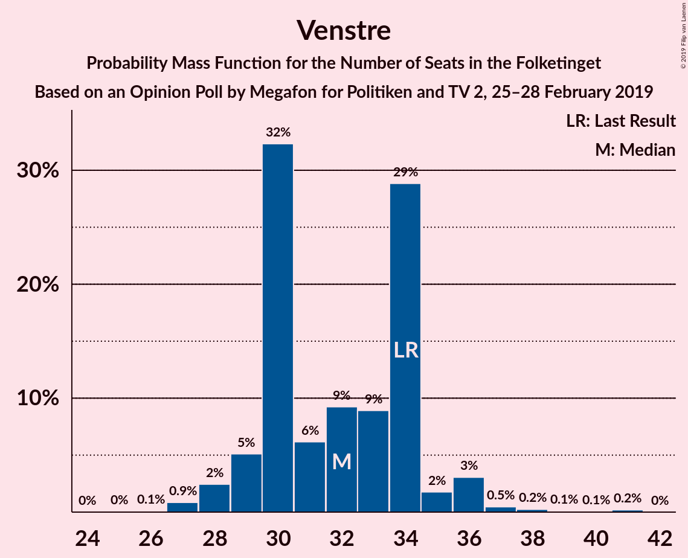
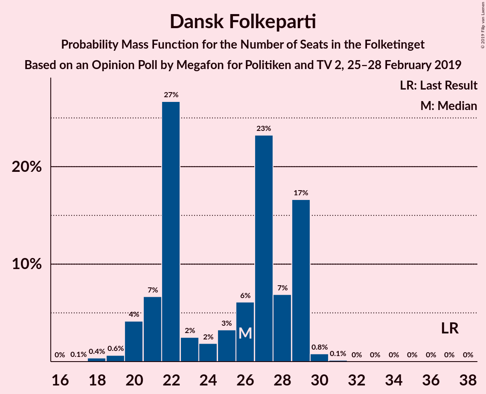
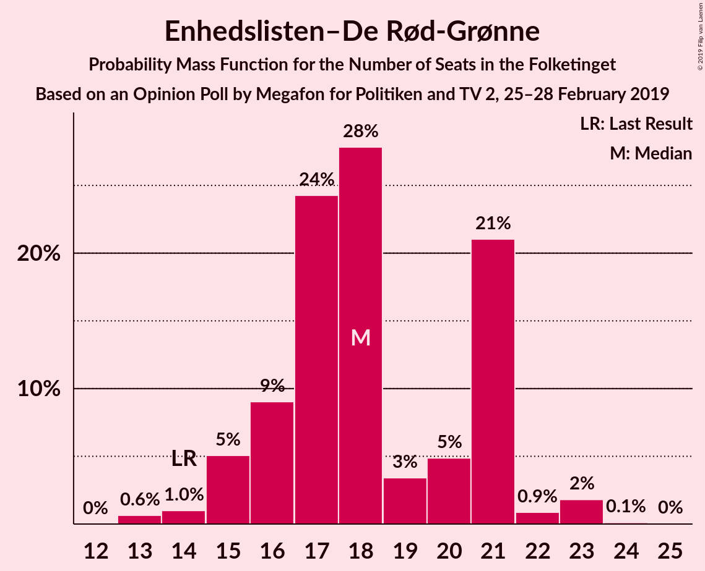
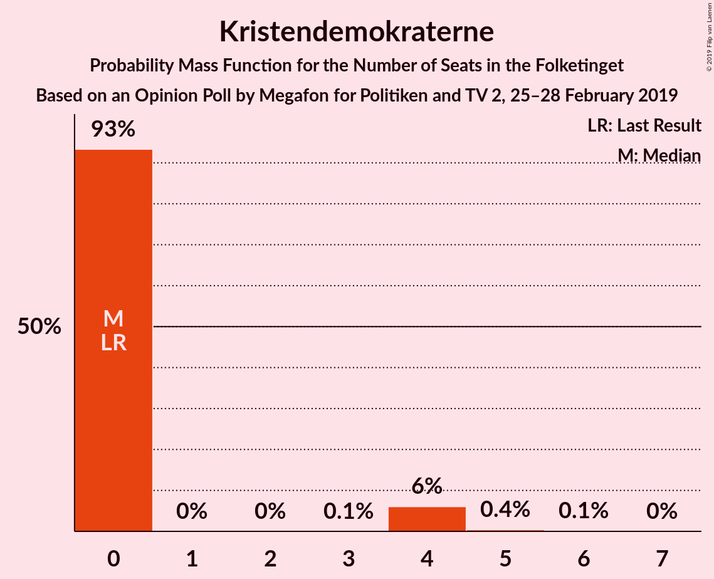
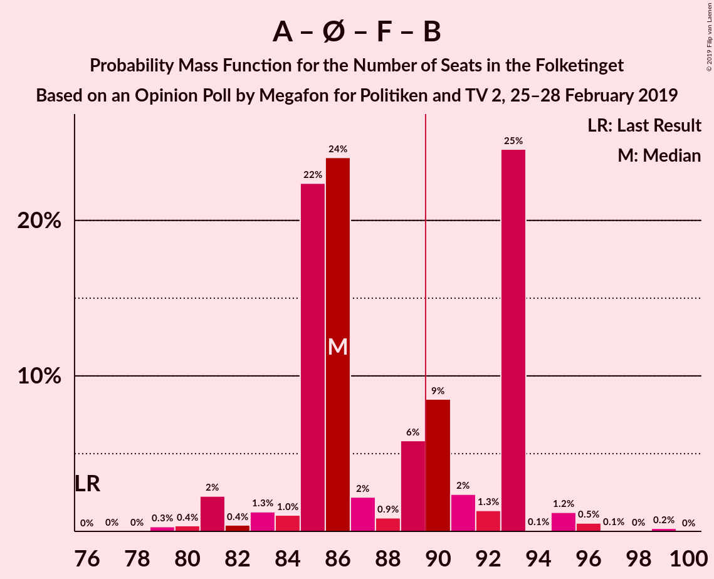
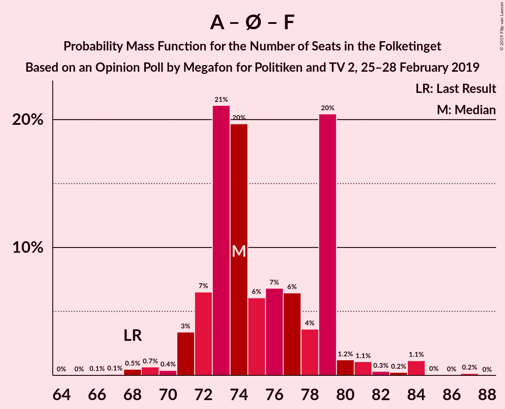
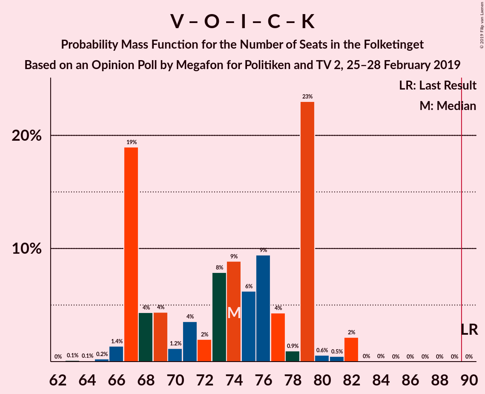
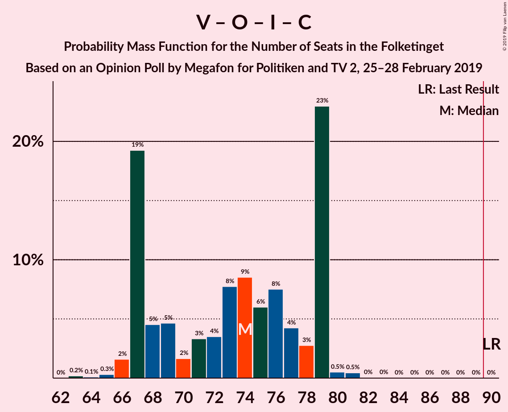

# Opinion Poll by Megafon for Politiken and TV 2, 25–28 February 2019

<a href="#voting-intentions">Voting Intentions</a> | <a href="#seats">Seats</a> | <a href="#coalitions">Coalitions</a> | <a href="#technical-information">Technical Information</a>

## Voting Intentions

### Confidence Intervals

| Party | Last Result | Poll Result | 80% Confidence Interval | 90% Confidence Interval | 95% Confidence Interval | 99% Confidence Interval |
|:-----:|:-----------:|:-----------:|:-----------------------:|:-----------------------:|:-----------------------:|:-----------------------:|
| Socialdemokraterne | 26.3% | 24.4% | 22.7–26.2% |22.2–26.7% |21.8–27.1% |21.0–28.0% |
| Venstre | 19.5% | 18.0% | 16.6–19.7% |16.1–20.1% |15.8–20.5% |15.1–21.3% |
| Dansk Folkeparti | 21.1% | 13.4% | 12.1–14.8% |11.7–15.3% |11.4–15.6% |10.8–16.4% |
| Enhedslisten–De Rød-Grønne | 7.8% | 10.1% | 9.0–11.4% |8.7–11.8% |8.4–12.1% |7.9–12.8% |
| Socialistisk Folkeparti | 4.2% | 8.0% | 7.0–9.2% |6.7–9.6% |6.5–9.9% |6.1–10.5% |
| Radikale Venstre | 4.6% | 7.0% | 6.1–8.2% |5.8–8.5% |5.6–8.8% |5.2–9.4% |
| Liberal Alliance | 7.5% | 5.4% | 4.5–6.4% |4.3–6.7% |4.1–6.9% |3.8–7.5% |
| Alternativet | 4.8% | 3.8% | 3.1–4.7% |2.9–4.9% |2.8–5.1% |2.5–5.6% |
| Det Konservative Folkeparti | 3.4% | 3.8% | 3.1–4.7% |2.9–4.9% |2.8–5.1% |2.5–5.6% |
| Nye Borgerlige | 0.0% | 3.4% | 2.7–4.2% |2.6–4.5% |2.4–4.7% |2.1–5.1% |
| Kristendemokraterne | 0.8% | 1.4% | 1.0–2.0% |0.9–2.2% |0.8–2.3% |0.7–2.7% |
| Klaus Riskær Pedersen | 0.0% | 1.3% | 0.9–1.9% |0.8–2.0% |0.7–2.2% |0.6–2.5% |

*Note:* The poll result column reflects the actual value used in the calculations. Published results may vary slightly, and in addition be rounded to fewer digits.

## Seats

### Confidence Intervals

| Party | Last Result | Median | 80% Confidence Interval | 90% Confidence Interval | 95% Confidence Interval | 99% Confidence Interval |
|:-----:|:-----------:|:------:|:-----------------------:|:-----------------------:|:-----------------------:|:-----------------------:|
| <a href="#socialdemokraterne">Socialdemokraterne</a> | 47 | 46 | 41–46 |41–46 |39–47 |37–49 |
| <a href="#venstre">Venstre</a> | 34 | 34 | 30–34 |30–34 |30–36 |28–38 |
| <a href="#dansk-folkeparti">Dansk Folkeparti</a> | 37 | 27 | 26–27 |24–28 |22–28 |20–28 |
| <a href="#enhedslisten–de-rød-grønne">Enhedslisten–De Rød-Grønne</a> | 14 | 17 | 17–20 |17–20 |16–20 |14–22 |
| <a href="#socialistisk-folkeparti">Socialistisk Folkeparti</a> | 7 | 11 | 11–13 |11–14 |11–15 |11–20 |
| <a href="#radikale-venstre">Radikale Venstre</a> | 8 | 11 | 11–15 |11–16 |11–16 |8–16 |
| <a href="#liberal-alliance">Liberal Alliance</a> | 13 | 11 | 9–11 |8–11 |8–11 |7–12 |
| <a href="#alternativet">Alternativet</a> | 9 | 5 | 5–8 |5–8 |5–8 |5–9 |
| <a href="#det-konservative-folkeparti">Det Konservative Folkeparti</a> | 6 | 7 | 7 |7–8 |6–9 |4–10 |
| <a href="#nye-borgerlige">Nye Borgerlige</a> | 0 | 6 | 5–6 |4–6 |4–8 |4–9 |
| <a href="#kristendemokraterne">Kristendemokraterne</a> | 0 | 0 | 0 |0 |0 |0–4 |
| <a href="#klaus-riskær-pedersen">Klaus Riskær Pedersen</a> | 0 | 0 | 0 |0 |0 |0–4 |

### Socialdemokraterne

*For a full overview of the results for this party, see the [Socialdemokraterne](party-socialdemokraterne.html) page.*

| Number of Seats | Probability | Accumulated | Special Marks |
|:---------------:|:-----------:|:-----------:|:-------------:|
| 37 | 2% | 100% |  |
| 38 | 0.2% | 98% |  |
| 39 | 0.6% | 98% |  |
| 40 | 0.6% | 97% |  |
| 41 | 10% | 97% |  |
| 42 | 0.5% | 87% |  |
| 43 | 2% | 86% |  |
| 44 | 0.4% | 85% |  |
| 45 | 2% | 84% |  |
| 46 | 80% | 82% | Median |
| 47 | 1.5% | 3% | Last Result |
| 48 | 0% | 1.1% |  |
| 49 | 1.0% | 1.1% |  |
| 50 | 0% | 0% |  |

### Venstre

*For a full overview of the results for this party, see the [Venstre](party-venstre.html) page.*

| Number of Seats | Probability | Accumulated | Special Marks |
|:---------------:|:-----------:|:-----------:|:-------------:|
| 27 | 0.1% | 100% |  |
| 28 | 0.8% | 99.8% |  |
| 29 | 1.2% | 99.1% |  |
| 30 | 10% | 98% |  |
| 31 | 1.2% | 88% |  |
| 32 | 0.5% | 87% |  |
| 33 | 2% | 87% |  |
| 34 | 81% | 85% | Last Result, Median |
| 35 | 0.6% | 4% |  |
| 36 | 1.4% | 3% |  |
| 37 | 1.1% | 2% |  |
| 38 | 0.4% | 0.7% |  |
| 39 | 0.3% | 0.3% |  |
| 40 | 0% | 0% |  |

### Dansk Folkeparti

*For a full overview of the results for this party, see the [Dansk Folkeparti](party-danskfolkeparti.html) page.*

| Number of Seats | Probability | Accumulated | Special Marks |
|:---------------:|:-----------:|:-----------:|:-------------:|
| 18 | 0% | 100% |  |
| 19 | 0.1% | 99.9% |  |
| 20 | 1.1% | 99.9% |  |
| 21 | 0.1% | 98.8% |  |
| 22 | 1.3% | 98.7% |  |
| 23 | 2% | 97% |  |
| 24 | 3% | 96% |  |
| 25 | 2% | 93% |  |
| 26 | 1.1% | 91% |  |
| 27 | 80% | 90% | Median |
| 28 | 9% | 10% |  |
| 29 | 0.2% | 0.2% |  |
| 30 | 0% | 0% |  |
| 31 | 0% | 0% |  |
| 32 | 0% | 0% |  |
| 33 | 0% | 0% |  |
| 34 | 0% | 0% |  |
| 35 | 0% | 0% |  |
| 36 | 0% | 0% |  |
| 37 | 0% | 0% | Last Result |

### Enhedslisten–De Rød-Grønne

*For a full overview of the results for this party, see the [Enhedslisten–De Rød-Grønne](party-enhedslisten–derød-grønne.html) page.*

| Number of Seats | Probability | Accumulated | Special Marks |
|:---------------:|:-----------:|:-----------:|:-------------:|
| 13 | 0.4% | 100% |  |
| 14 | 0.7% | 99.6% | Last Result |
| 15 | 1.3% | 98.9% |  |
| 16 | 0.6% | 98% |  |
| 17 | 80% | 97% | Median |
| 18 | 4% | 17% |  |
| 19 | 0.5% | 13% |  |
| 20 | 11% | 13% |  |
| 21 | 0.8% | 2% |  |
| 22 | 0.8% | 1.1% |  |
| 23 | 0.2% | 0.3% |  |
| 24 | 0% | 0.1% |  |
| 25 | 0% | 0.1% |  |
| 26 | 0% | 0.1% |  |
| 27 | 0.1% | 0.1% |  |
| 28 | 0% | 0% |  |

### Socialistisk Folkeparti

*For a full overview of the results for this party, see the [Socialistisk Folkeparti](party-socialistiskfolkeparti.html) page.*

| Number of Seats | Probability | Accumulated | Special Marks |
|:---------------:|:-----------:|:-----------:|:-------------:|
| 7 | 0% | 100% | Last Result |
| 8 | 0% | 100% |  |
| 9 | 0.3% | 100% |  |
| 10 | 0.1% | 99.7% |  |
| 11 | 80% | 99.6% | Median |
| 12 | 9% | 19% |  |
| 13 | 0.7% | 10% |  |
| 14 | 6% | 10% |  |
| 15 | 1.2% | 4% |  |
| 16 | 1.2% | 2% |  |
| 17 | 0.2% | 1.2% |  |
| 18 | 0.3% | 1.0% |  |
| 19 | 0.1% | 0.8% |  |
| 20 | 0.7% | 0.7% |  |
| 21 | 0% | 0% |  |

### Radikale Venstre

*For a full overview of the results for this party, see the [Radikale Venstre](party-radikalevenstre.html) page.*

| Number of Seats | Probability | Accumulated | Special Marks |
|:---------------:|:-----------:|:-----------:|:-------------:|
| 8 | 0.5% | 100% | Last Result |
| 9 | 0.1% | 99.5% |  |
| 10 | 2% | 99.3% |  |
| 11 | 81% | 98% | Median |
| 12 | 3% | 16% |  |
| 13 | 0.7% | 13% |  |
| 14 | 2% | 13% |  |
| 15 | 2% | 11% |  |
| 16 | 9% | 9% |  |
| 17 | 0% | 0% |  |

### Liberal Alliance

*For a full overview of the results for this party, see the [Liberal Alliance](party-liberalalliance.html) page.*

| Number of Seats | Probability | Accumulated | Special Marks |
|:---------------:|:-----------:|:-----------:|:-------------:|
| 7 | 0.6% | 100% |  |
| 8 | 5% | 99.4% |  |
| 9 | 12% | 94% |  |
| 10 | 1.1% | 83% |  |
| 11 | 81% | 82% | Median |
| 12 | 0.8% | 1.0% |  |
| 13 | 0.1% | 0.2% | Last Result |
| 14 | 0.1% | 0.1% |  |
| 15 | 0% | 0% |  |

### Alternativet

*For a full overview of the results for this party, see the [Alternativet](party-alternativet.html) page.*

| Number of Seats | Probability | Accumulated | Special Marks |
|:---------------:|:-----------:|:-----------:|:-------------:|
| 4 | 0.2% | 100% |  |
| 5 | 82% | 99.8% | Median |
| 6 | 3% | 18% |  |
| 7 | 1.3% | 15% |  |
| 8 | 11% | 13% |  |
| 9 | 2% | 2% | Last Result |
| 10 | 0% | 0% |  |

### Det Konservative Folkeparti

*For a full overview of the results for this party, see the [Det Konservative Folkeparti](party-detkonservativefolkeparti.html) page.*

| Number of Seats | Probability | Accumulated | Special Marks |
|:---------------:|:-----------:|:-----------:|:-------------:|
| 4 | 1.2% | 100% |  |
| 5 | 0.4% | 98.8% |  |
| 6 | 2% | 98% | Last Result |
| 7 | 91% | 97% | Median |
| 8 | 2% | 5% |  |
| 9 | 2% | 3% |  |
| 10 | 1.4% | 1.5% |  |
| 11 | 0% | 0% |  |

### Nye Borgerlige

*For a full overview of the results for this party, see the [Nye Borgerlige](party-nyeborgerlige.html) page.*

| Number of Seats | Probability | Accumulated | Special Marks |
|:---------------:|:-----------:|:-----------:|:-------------:|
| 0 | 0.2% | 100% | Last Result |
| 1 | 0% | 99.8% |  |
| 2 | 0% | 99.8% |  |
| 3 | 0% | 99.8% |  |
| 4 | 9% | 99.8% |  |
| 5 | 4% | 90% |  |
| 6 | 82% | 87% | Median |
| 7 | 1.4% | 4% |  |
| 8 | 0.6% | 3% |  |
| 9 | 2% | 2% |  |
| 10 | 0% | 0% |  |

### Kristendemokraterne

*For a full overview of the results for this party, see the [Kristendemokraterne](party-kristendemokraterne.html) page.*

| Number of Seats | Probability | Accumulated | Special Marks |
|:---------------:|:-----------:|:-----------:|:-------------:|
| 0 | 99.2% | 100% | Last Result, Median |
| 1 | 0% | 0.8% |  |
| 2 | 0% | 0.8% |  |
| 3 | 0% | 0.8% |  |
| 4 | 0.6% | 0.8% |  |
| 5 | 0.2% | 0.2% |  |
| 6 | 0% | 0% |  |

### Klaus Riskær Pedersen

*For a full overview of the results for this party, see the [Klaus Riskær Pedersen](party-klausriskærpedersen.html) page.*

| Number of Seats | Probability | Accumulated | Special Marks |
|:---------------:|:-----------:|:-----------:|:-------------:|
| 0 | 99.0% | 100% | Last Result, Median |
| 1 | 0% | 1.0% |  |
| 2 | 0% | 1.0% |  |
| 3 | 0% | 1.0% |  |
| 4 | 0.7% | 1.0% |  |
| 5 | 0.1% | 0.2% |  |
| 6 | 0.2% | 0.2% |  |
| 7 | 0% | 0% |  |

## Coalitions

### Confidence Intervals

| Coalition | Last Result | Median | Majority? | 80% Confidence Interval | 90% Confidence Interval | 95% Confidence Interval | 99% Confidence Interval |
|:---------:|:-----------:|:------:|:---------:|:-----------------------:|:-----------------------:|:-----------------------:|:-----------------------:|
| Socialdemokraterne – Enhedslisten–De Rød-Grønne – Socialistisk Folkeparti – Radikale Venstre – Alternativet | 85 | 90 | 98% | 90–97 | 90–97 | 90–102 | 87–104 |
| Socialdemokraterne – Enhedslisten–De Rød-Grønne – Socialistisk Folkeparti – Radikale Venstre | 76 | 85 | 5% | 85–89 | 84–89 | 83–93 | 79–99 |
| Socialdemokraterne – Enhedslisten–De Rød-Grønne – Socialistisk Folkeparti – Alternativet | 77 | 79 | 0.7% | 79–81 | 79–83 | 79–87 | 74–92 |
| Venstre – Dansk Folkeparti – Liberal Alliance – Det Konservative Folkeparti – Nye Borgerlige – Kristendemokraterne – Klaus Riskær Pedersen | 90 | 85 | 0% | 78–85 | 78–85 | 73–85 | 71–88 |
| Venstre – Dansk Folkeparti – Liberal Alliance – Det Konservative Folkeparti – Nye Borgerlige – Klaus Riskær Pedersen | 90 | 85 | 0% | 78–85 | 78–85 | 73–85 | 71–88 |
| Venstre – Dansk Folkeparti – Liberal Alliance – Det Konservative Folkeparti – Nye Borgerlige – Kristendemokraterne | 90 | 85 | 0% | 78–85 | 78–85 | 73–85 | 71–88 |
| Venstre – Dansk Folkeparti – Liberal Alliance – Det Konservative Folkeparti – Nye Borgerlige | 90 | 85 | 0% | 78–85 | 78–85 | 73–85 | 71–88 |
| Socialdemokraterne – Enhedslisten–De Rød-Grønne – Socialistisk Folkeparti | 68 | 74 | 0% | 73–74 | 73–76 | 71–80 | 69–87 |
| Venstre – Dansk Folkeparti – Liberal Alliance – Det Konservative Folkeparti – Kristendemokraterne | 90 | 79 | 0% | 74–79 | 74–79 | 68–79 | 65–81 |
| Venstre – Dansk Folkeparti – Liberal Alliance – Det Konservative Folkeparti | 90 | 79 | 0% | 74–79 | 72–79 | 68–79 | 65–81 |
| Socialdemokraterne – Socialistisk Folkeparti – Radikale Venstre | 62 | 68 | 0% | 68–69 | 68–70 | 63–75 | 63–78 |
| Socialdemokraterne – Radikale Venstre | 55 | 57 | 0% | 57 | 55–57 | 50–60 | 48–64 |
| Venstre – Liberal Alliance – Det Konservative Folkeparti | 53 | 52 | 0% | 46–52 | 46–52 | 44–53 | 43–55 |
| Venstre – Det Konservative Folkeparti | 40 | 41 | 0% | 37–41 | 37–42 | 35–44 | 35–45 |
| Venstre | 34 | 34 | 0% | 30–34 | 30–34 | 30–36 | 28–38 |

### Socialdemokraterne – Enhedslisten–De Rød-Grønne – Socialistisk Folkeparti – Radikale Venstre – Alternativet

| Number of Seats | Probability | Accumulated | Special Marks |
|:---------------:|:-----------:|:-----------:|:-------------:|
| 85 | 0% | 100% | Last Result |
| 86 | 0.4% | 100% |  |
| 87 | 0.5% | 99.6% |  |
| 88 | 0% | 99.1% |  |
| 89 | 0.8% | 99.1% |  |
| 90 | 80% | 98% | Median, Majority |
| 91 | 3% | 18% |  |
| 92 | 0.3% | 15% |  |
| 93 | 1.0% | 15% |  |
| 94 | 0.4% | 14% |  |
| 95 | 0.1% | 14% |  |
| 96 | 1.3% | 14% |  |
| 97 | 9% | 12% |  |
| 98 | 0.1% | 3% |  |
| 99 | 0% | 3% |  |
| 100 | 0.1% | 3% |  |
| 101 | 0.4% | 3% |  |
| 102 | 2% | 3% |  |
| 103 | 0% | 0.7% |  |
| 104 | 0.7% | 0.7% |  |
| 105 | 0% | 0% |  |

### Socialdemokraterne – Enhedslisten–De Rød-Grønne – Socialistisk Folkeparti – Radikale Venstre

| Number of Seats | Probability | Accumulated | Special Marks |
|:---------------:|:-----------:|:-----------:|:-------------:|
| 76 | 0% | 100% | Last Result |
| 77 | 0% | 100% |  |
| 78 | 0% | 100% |  |
| 79 | 0.8% | 100% |  |
| 80 | 0.1% | 99.2% |  |
| 81 | 0% | 99.1% |  |
| 82 | 1.1% | 99.1% |  |
| 83 | 2% | 98% |  |
| 84 | 1.2% | 96% |  |
| 85 | 80% | 95% | Median |
| 86 | 0% | 15% |  |
| 87 | 0.7% | 15% |  |
| 88 | 0.7% | 14% |  |
| 89 | 9% | 14% |  |
| 90 | 1.4% | 5% | Majority |
| 91 | 0.1% | 3% |  |
| 92 | 0.1% | 3% |  |
| 93 | 1.3% | 3% |  |
| 94 | 0.1% | 2% |  |
| 95 | 0% | 2% |  |
| 96 | 1.1% | 2% |  |
| 97 | 0% | 0.7% |  |
| 98 | 0% | 0.7% |  |
| 99 | 0.7% | 0.7% |  |
| 100 | 0% | 0% |  |

### Socialdemokraterne – Enhedslisten–De Rød-Grønne – Socialistisk Folkeparti – Alternativet

| Number of Seats | Probability | Accumulated | Special Marks |
|:---------------:|:-----------:|:-----------:|:-------------:|
| 74 | 0.7% | 100% |  |
| 75 | 0.4% | 99.3% |  |
| 76 | 0.4% | 98.9% |  |
| 77 | 0.2% | 98.5% | Last Result |
| 78 | 0.1% | 98% |  |
| 79 | 82% | 98% | Median |
| 80 | 0.8% | 16% |  |
| 81 | 10% | 16% |  |
| 82 | 0.2% | 5% |  |
| 83 | 0.4% | 5% |  |
| 84 | 0.1% | 5% |  |
| 85 | 0.9% | 5% |  |
| 86 | 0.4% | 4% |  |
| 87 | 1.1% | 3% |  |
| 88 | 1.2% | 2% |  |
| 89 | 0.2% | 0.9% |  |
| 90 | 0% | 0.7% | Majority |
| 91 | 0% | 0.7% |  |
| 92 | 0.7% | 0.7% |  |
| 93 | 0% | 0% |  |

### Venstre – Dansk Folkeparti – Liberal Alliance – Det Konservative Folkeparti – Nye Borgerlige – Kristendemokraterne – Klaus Riskær Pedersen

| Number of Seats | Probability | Accumulated | Special Marks |
|:---------------:|:-----------:|:-----------:|:-------------:|
| 71 | 0.7% | 100% |  |
| 72 | 0% | 99.3% |  |
| 73 | 2% | 99.3% |  |
| 74 | 0.4% | 97% |  |
| 75 | 0.1% | 97% |  |
| 76 | 0% | 97% |  |
| 77 | 0.1% | 97% |  |
| 78 | 9% | 97% |  |
| 79 | 1.3% | 88% |  |
| 80 | 0.1% | 86% |  |
| 81 | 0.4% | 86% |  |
| 82 | 1.0% | 86% |  |
| 83 | 0.3% | 85% |  |
| 84 | 3% | 85% |  |
| 85 | 80% | 82% | Median |
| 86 | 0.8% | 2% |  |
| 87 | 0% | 0.9% |  |
| 88 | 0.5% | 0.9% |  |
| 89 | 0.4% | 0.4% |  |
| 90 | 0% | 0% | Last Result, Majority |

### Venstre – Dansk Folkeparti – Liberal Alliance – Det Konservative Folkeparti – Nye Borgerlige – Klaus Riskær Pedersen

| Number of Seats | Probability | Accumulated | Special Marks |
|:---------------:|:-----------:|:-----------:|:-------------:|
| 71 | 0.7% | 100% |  |
| 72 | 0% | 99.3% |  |
| 73 | 2% | 99.3% |  |
| 74 | 0.5% | 97% |  |
| 75 | 0.2% | 97% |  |
| 76 | 0% | 97% |  |
| 77 | 0.3% | 96% |  |
| 78 | 9% | 96% |  |
| 79 | 1.3% | 87% |  |
| 80 | 0.1% | 86% |  |
| 81 | 0.4% | 86% |  |
| 82 | 0.9% | 85% |  |
| 83 | 0.1% | 85% |  |
| 84 | 3% | 85% |  |
| 85 | 80% | 82% | Median |
| 86 | 0.7% | 2% |  |
| 87 | 0% | 0.9% |  |
| 88 | 0.5% | 0.9% |  |
| 89 | 0.4% | 0.4% |  |
| 90 | 0% | 0% | Last Result, Majority |

### Venstre – Dansk Folkeparti – Liberal Alliance – Det Konservative Folkeparti – Nye Borgerlige – Kristendemokraterne

| Number of Seats | Probability | Accumulated | Special Marks |
|:---------------:|:-----------:|:-----------:|:-------------:|
| 71 | 0.7% | 100% |  |
| 72 | 0% | 99.3% |  |
| 73 | 2% | 99.3% |  |
| 74 | 0.4% | 97% |  |
| 75 | 0.3% | 97% |  |
| 76 | 0% | 96% |  |
| 77 | 0.3% | 96% |  |
| 78 | 9% | 96% |  |
| 79 | 1.0% | 87% |  |
| 80 | 0.1% | 86% |  |
| 81 | 0.8% | 86% |  |
| 82 | 1.0% | 85% |  |
| 83 | 0.1% | 84% |  |
| 84 | 3% | 84% |  |
| 85 | 80% | 82% | Median |
| 86 | 0.7% | 2% |  |
| 87 | 0% | 0.9% |  |
| 88 | 0.5% | 0.9% |  |
| 89 | 0.4% | 0.4% |  |
| 90 | 0% | 0% | Last Result, Majority |

### Venstre – Dansk Folkeparti – Liberal Alliance – Det Konservative Folkeparti – Nye Borgerlige

| Number of Seats | Probability | Accumulated | Special Marks |
|:---------------:|:-----------:|:-----------:|:-------------:|
| 71 | 0.7% | 100% |  |
| 72 | 0% | 99.3% |  |
| 73 | 2% | 99.3% |  |
| 74 | 0.5% | 97% |  |
| 75 | 0.5% | 97% |  |
| 76 | 0% | 96% |  |
| 77 | 0.3% | 96% |  |
| 78 | 9% | 96% |  |
| 79 | 0.9% | 87% |  |
| 80 | 0.1% | 86% |  |
| 81 | 0.7% | 86% |  |
| 82 | 0.9% | 85% |  |
| 83 | 0% | 84% |  |
| 84 | 3% | 84% |  |
| 85 | 80% | 81% | Median |
| 86 | 0.7% | 1.5% |  |
| 87 | 0% | 0.8% |  |
| 88 | 0.5% | 0.8% |  |
| 89 | 0.4% | 0.4% |  |
| 90 | 0% | 0% | Last Result, Majority |

### Socialdemokraterne – Enhedslisten–De Rød-Grønne – Socialistisk Folkeparti

| Number of Seats | Probability | Accumulated | Special Marks |
|:---------------:|:-----------:|:-----------:|:-------------:|
| 67 | 0% | 100% |  |
| 68 | 0.4% | 99.9% | Last Result |
| 69 | 1.0% | 99.6% |  |
| 70 | 0.1% | 98.6% |  |
| 71 | 2% | 98% |  |
| 72 | 1.4% | 97% |  |
| 73 | 9% | 95% |  |
| 74 | 80% | 86% | Median |
| 75 | 0.1% | 6% |  |
| 76 | 0.5% | 6% |  |
| 77 | 0.1% | 5% |  |
| 78 | 0.4% | 5% |  |
| 79 | 2% | 4% |  |
| 80 | 0.4% | 3% |  |
| 81 | 1.4% | 2% |  |
| 82 | 0% | 0.7% |  |
| 83 | 0% | 0.7% |  |
| 84 | 0% | 0.7% |  |
| 85 | 0% | 0.7% |  |
| 86 | 0% | 0.7% |  |
| 87 | 0.7% | 0.7% |  |
| 88 | 0% | 0% |  |

### Venstre – Dansk Folkeparti – Liberal Alliance – Det Konservative Folkeparti – Kristendemokraterne

| Number of Seats | Probability | Accumulated | Special Marks |
|:---------------:|:-----------:|:-----------:|:-------------:|
| 65 | 0.7% | 100% |  |
| 66 | 0.1% | 99.3% |  |
| 67 | 0.1% | 99.2% |  |
| 68 | 2% | 99.2% |  |
| 69 | 0.1% | 97% |  |
| 70 | 1.1% | 97% |  |
| 71 | 0.1% | 96% |  |
| 72 | 0.5% | 96% |  |
| 73 | 0.1% | 95% |  |
| 74 | 10% | 95% |  |
| 75 | 2% | 86% |  |
| 76 | 0.4% | 84% |  |
| 77 | 0.2% | 83% |  |
| 78 | 1.5% | 83% |  |
| 79 | 80% | 82% | Median |
| 80 | 1.1% | 2% |  |
| 81 | 0.8% | 0.9% |  |
| 82 | 0.1% | 0.1% |  |
| 83 | 0% | 0.1% |  |
| 84 | 0% | 0% |  |
| 85 | 0% | 0% |  |
| 86 | 0% | 0% |  |
| 87 | 0% | 0% |  |
| 88 | 0% | 0% |  |
| 89 | 0% | 0% |  |
| 90 | 0% | 0% | Last Result, Majority |

### Venstre – Dansk Folkeparti – Liberal Alliance – Det Konservative Folkeparti

| Number of Seats | Probability | Accumulated | Special Marks |
|:---------------:|:-----------:|:-----------:|:-------------:|
| 65 | 0.7% | 100% |  |
| 66 | 0.1% | 99.3% |  |
| 67 | 0.1% | 99.2% |  |
| 68 | 2% | 99.1% |  |
| 69 | 0.2% | 97% |  |
| 70 | 1.3% | 97% |  |
| 71 | 0.3% | 95% |  |
| 72 | 0.4% | 95% |  |
| 73 | 0.1% | 95% |  |
| 74 | 9% | 95% |  |
| 75 | 2% | 85% |  |
| 76 | 0.3% | 84% |  |
| 77 | 0.2% | 83% |  |
| 78 | 2% | 83% |  |
| 79 | 80% | 82% | Median |
| 80 | 1.1% | 2% |  |
| 81 | 0.8% | 0.8% |  |
| 82 | 0% | 0% |  |
| 83 | 0% | 0% |  |
| 84 | 0% | 0% |  |
| 85 | 0% | 0% |  |
| 86 | 0% | 0% |  |
| 87 | 0% | 0% |  |
| 88 | 0% | 0% |  |
| 89 | 0% | 0% |  |
| 90 | 0% | 0% | Last Result, Majority |

### Socialdemokraterne – Socialistisk Folkeparti – Radikale Venstre

| Number of Seats | Probability | Accumulated | Special Marks |
|:---------------:|:-----------:|:-----------:|:-------------:|
| 61 | 0.4% | 100% |  |
| 62 | 0% | 99.6% | Last Result |
| 63 | 2% | 99.6% |  |
| 64 | 0.2% | 97% |  |
| 65 | 0.5% | 97% |  |
| 66 | 0.2% | 97% |  |
| 67 | 1.3% | 97% |  |
| 68 | 80% | 95% | Median |
| 69 | 9% | 15% |  |
| 70 | 0.9% | 6% |  |
| 71 | 0.1% | 5% |  |
| 72 | 1.2% | 5% |  |
| 73 | 0.1% | 4% |  |
| 74 | 0.7% | 3% |  |
| 75 | 1.1% | 3% |  |
| 76 | 0% | 2% |  |
| 77 | 0.7% | 2% |  |
| 78 | 1.0% | 1.0% |  |
| 79 | 0% | 0% |  |

### Socialdemokraterne – Radikale Venstre

| Number of Seats | Probability | Accumulated | Special Marks |
|:---------------:|:-----------:|:-----------:|:-------------:|
| 47 | 0% | 100% |  |
| 48 | 0.8% | 99.9% |  |
| 49 | 1.4% | 99.2% |  |
| 50 | 0.5% | 98% |  |
| 51 | 0.3% | 97% |  |
| 52 | 0.1% | 97% |  |
| 53 | 2% | 97% |  |
| 54 | 0.3% | 95% |  |
| 55 | 0.7% | 95% | Last Result |
| 56 | 2% | 94% |  |
| 57 | 89% | 92% | Median |
| 58 | 0.2% | 3% |  |
| 59 | 0.2% | 3% |  |
| 60 | 0.4% | 3% |  |
| 61 | 1.1% | 2% |  |
| 62 | 0% | 1.0% |  |
| 63 | 0% | 1.0% |  |
| 64 | 1.0% | 1.0% |  |
| 65 | 0% | 0% |  |

### Venstre – Liberal Alliance – Det Konservative Folkeparti

| Number of Seats | Probability | Accumulated | Special Marks |
|:---------------:|:-----------:|:-----------:|:-------------:|
| 42 | 0.1% | 100% |  |
| 43 | 2% | 99.9% |  |
| 44 | 1.1% | 98% |  |
| 45 | 0.3% | 97% |  |
| 46 | 9% | 97% |  |
| 47 | 0.3% | 88% |  |
| 48 | 0.6% | 87% |  |
| 49 | 0.1% | 87% |  |
| 50 | 1.1% | 87% |  |
| 51 | 1.0% | 86% |  |
| 52 | 81% | 85% | Median |
| 53 | 0.7% | 3% | Last Result |
| 54 | 1.5% | 2% |  |
| 55 | 1.0% | 1.0% |  |
| 56 | 0% | 0% |  |

### Venstre – Det Konservative Folkeparti

| Number of Seats | Probability | Accumulated | Special Marks |
|:---------------:|:-----------:|:-----------:|:-------------:|
| 33 | 0.1% | 100% |  |
| 34 | 0.1% | 99.9% |  |
| 35 | 3% | 99.7% |  |
| 36 | 0.1% | 97% |  |
| 37 | 9% | 97% |  |
| 38 | 0.5% | 88% |  |
| 39 | 0.8% | 87% |  |
| 40 | 0.3% | 86% | Last Result |
| 41 | 80% | 86% | Median |
| 42 | 2% | 6% |  |
| 43 | 0.7% | 5% |  |
| 44 | 2% | 4% |  |
| 45 | 1.5% | 2% |  |
| 46 | 0.3% | 0.4% |  |
| 47 | 0% | 0% |  |

### Venstre

| Number of Seats | Probability | Accumulated | Special Marks |
|:---------------:|:-----------:|:-----------:|:-------------:|
| 27 | 0.1% | 100% |  |
| 28 | 0.8% | 99.8% |  |
| 29 | 1.2% | 99.1% |  |
| 30 | 10% | 98% |  |
| 31 | 1.2% | 88% |  |
| 32 | 0.5% | 87% |  |
| 33 | 2% | 87% |  |
| 34 | 81% | 85% | Last Result, Median |
| 35 | 0.6% | 4% |  |
| 36 | 1.4% | 3% |  |
| 37 | 1.1% | 2% |  |
| 38 | 0.4% | 0.7% |  |
| 39 | 0.3% | 0.3% |  |
| 40 | 0% | 0% |  |

## Technical Information

### Opinion Poll

+ **Polling firm:** Megafon
+ **Commissioner(s):** Politiken and TV 2
+ **Fieldwork period:** 25–28 February 2019

### Calculations

+ **Sample size:** 1009
+ **Simulations done:** 131,072
+ **Error estimate:** 2.09%

