# Opinion Poll by Megafon for Politiken and TV 2, 25–28 February 2019

<a href="#voting-intentions">Voting Intentions</a> | <a href="#seats">Seats</a> | <a href="#coalitions">Coalitions</a> | <a href="#technical-information">Technical Information</a>

## Voting Intentions

### Confidence Intervals

| Party | Last Result | Poll Result | 80% Confidence Interval | 90% Confidence Interval | 95% Confidence Interval | 99% Confidence Interval |
|:-----:|:-----------:|:-----------:|:-----------------------:|:-----------------------:|:-----------------------:|:-----------------------:|
| Socialdemokraterne | 26.3% | 24.4% | 22.7–26.2% |22.2–26.7% |21.8–27.1% |21.0–28.0% |
| Venstre | 19.5% | 18.0% | 16.6–19.7% |16.1–20.1% |15.8–20.5% |15.1–21.3% |
| Dansk Folkeparti | 21.1% | 13.4% | 12.1–14.8% |11.7–15.3% |11.4–15.6% |10.8–16.4% |
| Enhedslisten–De Rød-Grønne | 7.8% | 10.1% | 9.0–11.4% |8.7–11.8% |8.4–12.1% |7.9–12.8% |
| Socialistisk Folkeparti | 4.2% | 8.0% | 7.0–9.2% |6.7–9.6% |6.5–9.9% |6.1–10.5% |
| Radikale Venstre | 4.6% | 7.0% | 6.1–8.2% |5.8–8.5% |5.6–8.8% |5.2–9.4% |
| Liberal Alliance | 7.5% | 5.4% | 4.5–6.4% |4.3–6.7% |4.1–6.9% |3.8–7.5% |
| Alternativet | 4.8% | 3.8% | 3.1–4.7% |2.9–4.9% |2.8–5.1% |2.5–5.6% |
| Det Konservative Folkeparti | 3.4% | 3.8% | 3.1–4.7% |2.9–4.9% |2.8–5.1% |2.5–5.6% |
| Nye Borgerlige | 0.0% | 3.4% | 2.7–4.2% |2.6–4.5% |2.4–4.7% |2.1–5.1% |
| Kristendemokraterne | 0.8% | 1.4% | 1.0–2.0% |0.9–2.2% |0.8–2.3% |0.7–2.7% |
| Klaus Riskær Pedersen | 0.0% | 1.3% | 0.9–1.9% |0.8–2.0% |0.7–2.2% |0.6–2.5% |

*Note:* The poll result column reflects the actual value used in the calculations. Published results may vary slightly, and in addition be rounded to fewer digits.

## Seats

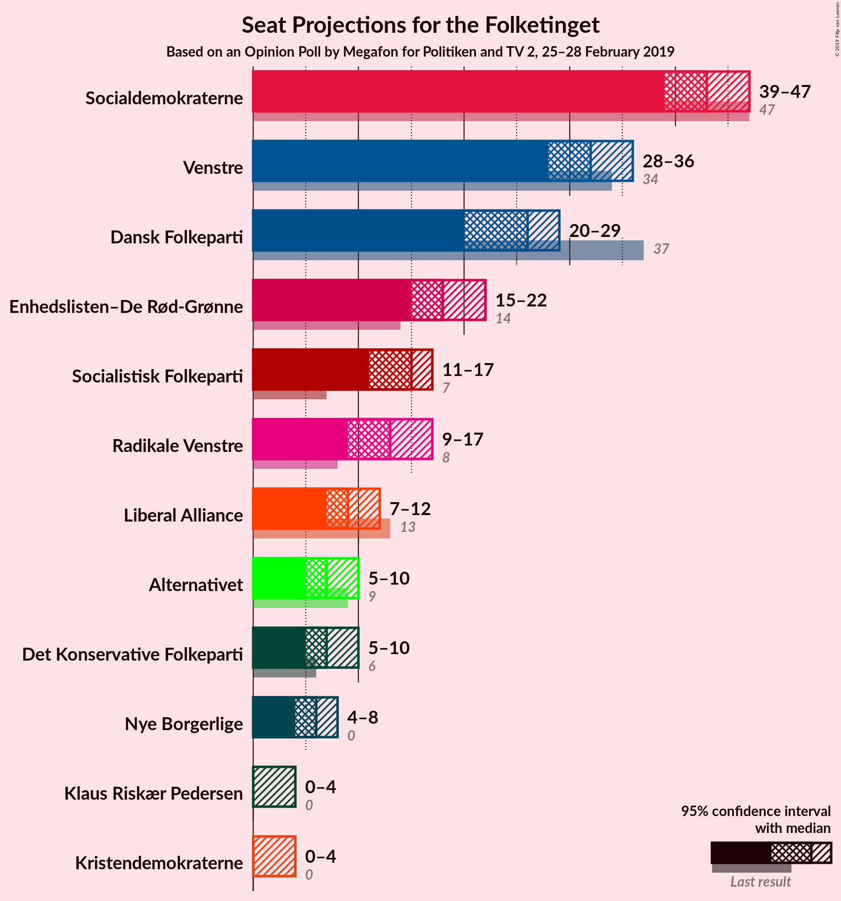

### Confidence Intervals

| Party | Last Result | Median | 80% Confidence Interval | 90% Confidence Interval | 95% Confidence Interval | 99% Confidence Interval |
|:-----:|:-----------:|:------:|:-----------------------:|:-----------------------:|:-----------------------:|:-----------------------:|
| <a href="#socialdemokraterne">Socialdemokraterne</a> | 47 | 43 | 41–46 |40–46 |39–47 |37–51 |
| <a href="#venstre">Venstre</a> | 34 | 32 | 30–34 |29–35 |28–36 |27–38 |
| <a href="#dansk-folkeparti">Dansk Folkeparti</a> | 37 | 26 | 21–29 |20–29 |20–29 |19–30 |
| <a href="#enhedslisten–de-rød-grønne">Enhedslisten–De Rød-Grønne</a> | 14 | 18 | 16–21 |15–21 |15–22 |13–23 |
| <a href="#socialistisk-folkeparti">Socialistisk Folkeparti</a> | 7 | 15 | 11–16 |11–17 |11–17 |11–18 |
| <a href="#radikale-venstre">Radikale Venstre</a> | 8 | 13 | 11–16 |10–16 |9–17 |9–17 |
| <a href="#liberal-alliance">Liberal Alliance</a> | 13 | 9 | 9–11 |8–12 |7–12 |7–14 |
| <a href="#alternativet">Alternativet</a> | 9 | 7 | 5–8 |5–10 |5–10 |4–10 |
| <a href="#det-konservative-folkeparti">Det Konservative Folkeparti</a> | 6 | 7 | 5–8 |5–10 |5–10 |4–10 |
| <a href="#nye-borgerlige">Nye Borgerlige</a> | 0 | 6 | 5–8 |5–8 |4–8 |4–9 |
| <a href="#kristendemokraterne">Kristendemokraterne</a> | 0 | 0 | 0 |0–4 |0–4 |0–5 |
| <a href="#klaus-riskær-pedersen">Klaus Riskær Pedersen</a> | 0 | 0 | 0 |0–4 |0–4 |0–4 |

### Socialdemokraterne

*For a full overview of the results for this party, see the [Socialdemokraterne](party-socialdemokraterne.html) page.*

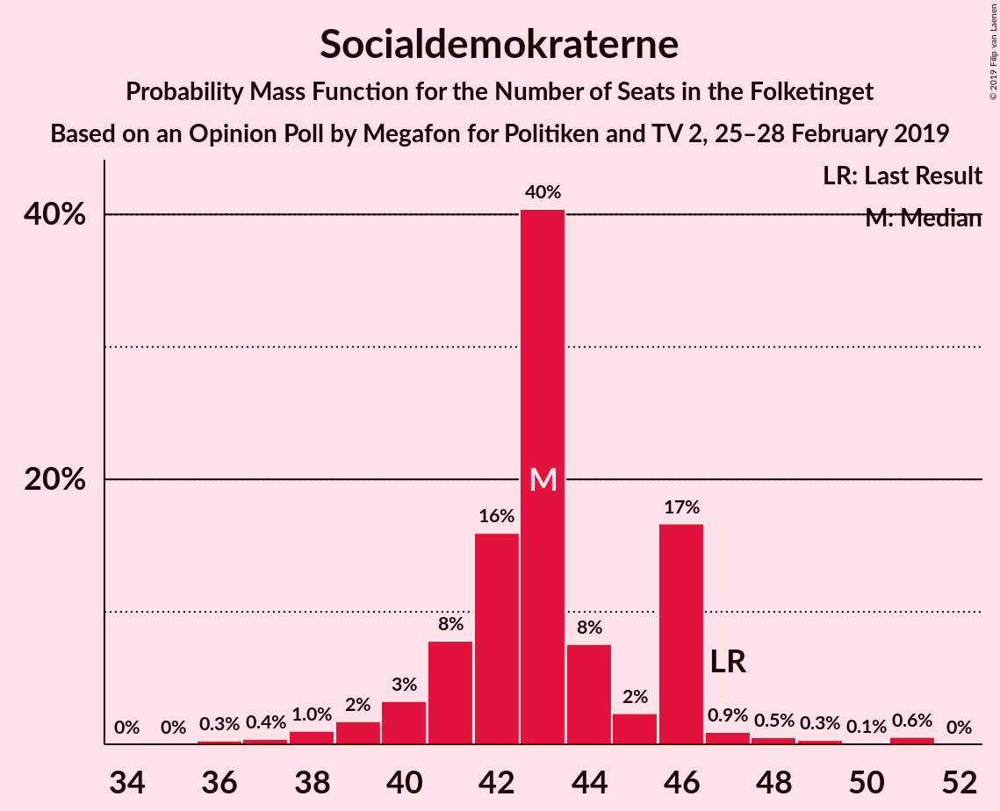

| Number of Seats | Probability | Accumulated | Special Marks |
|:---------------:|:-----------:|:-----------:|:-------------:|
| 36 | 0.3% | 100% |  |
| 37 | 0.4% | 99.7% |  |
| 38 | 1.0% | 99.3% |  |
| 39 | 2% | 98% |  |
| 40 | 3% | 97% |  |
| 41 | 8% | 93% |  |
| 42 | 16% | 85% |  |
| 43 | 40% | 70% | Median |
| 44 | 8% | 29% |  |
| 45 | 2% | 22% |  |
| 46 | 17% | 19% |  |
| 47 | 0.9% | 3% | Last Result |
| 48 | 0.5% | 2% |  |
| 49 | 0.3% | 1.0% |  |
| 50 | 0.1% | 0.7% |  |
| 51 | 0.6% | 0.6% |  |
| 52 | 0% | 0% |  |

### Venstre

*For a full overview of the results for this party, see the [Venstre](party-venstre.html) page.*

| Number of Seats | Probability | Accumulated | Special Marks |
|:---------------:|:-----------:|:-----------:|:-------------:|
| 25 | 0% | 100% |  |
| 26 | 0.1% | 99.9% |  |
| 27 | 0.9% | 99.8% |  |
| 28 | 2% | 99.0% |  |
| 29 | 5% | 97% |  |
| 30 | 32% | 91% |  |
| 31 | 6% | 59% |  |
| 32 | 9% | 53% | Median |
| 33 | 9% | 44% |  |
| 34 | 29% | 35% | Last Result |
| 35 | 2% | 6% |  |
| 36 | 3% | 4% |  |
| 37 | 0.5% | 1.1% |  |
| 38 | 0.2% | 0.6% |  |
| 39 | 0.1% | 0.4% |  |
| 40 | 0.1% | 0.3% |  |
| 41 | 0.2% | 0.2% |  |
| 42 | 0% | 0% |  |

### Dansk Folkeparti

*For a full overview of the results for this party, see the [Dansk Folkeparti](party-danskfolkeparti.html) page.*

| Number of Seats | Probability | Accumulated | Special Marks |
|:---------------:|:-----------:|:-----------:|:-------------:|
| 17 | 0.1% | 100% |  |
| 18 | 0.4% | 99.9% |  |
| 19 | 0.6% | 99.6% |  |
| 20 | 4% | 98.9% |  |
| 21 | 7% | 95% |  |
| 22 | 27% | 88% |  |
| 23 | 2% | 61% |  |
| 24 | 2% | 59% |  |
| 25 | 3% | 57% |  |
| 26 | 6% | 54% | Median |
| 27 | 23% | 48% |  |
| 28 | 7% | 24% |  |
| 29 | 17% | 18% |  |
| 30 | 0.8% | 0.9% |  |
| 31 | 0.1% | 0.1% |  |
| 32 | 0% | 0% |  |
| 33 | 0% | 0% |  |
| 34 | 0% | 0% |  |
| 35 | 0% | 0% |  |
| 36 | 0% | 0% |  |
| 37 | 0% | 0% | Last Result |

### Enhedslisten–De Rød-Grønne

*For a full overview of the results for this party, see the [Enhedslisten–De Rød-Grønne](party-enhedslisten–derød-grønne.html) page.*

| Number of Seats | Probability | Accumulated | Special Marks |
|:---------------:|:-----------:|:-----------:|:-------------:|
| 13 | 0.6% | 100% |  |
| 14 | 1.0% | 99.3% | Last Result |
| 15 | 5% | 98% |  |
| 16 | 9% | 93% |  |
| 17 | 24% | 84% |  |
| 18 | 28% | 60% | Median |
| 19 | 3% | 32% |  |
| 20 | 5% | 29% |  |
| 21 | 21% | 24% |  |
| 22 | 0.9% | 3% |  |
| 23 | 2% | 2% |  |
| 24 | 0.1% | 0.1% |  |
| 25 | 0% | 0% |  |

### Socialistisk Folkeparti

*For a full overview of the results for this party, see the [Socialistisk Folkeparti](party-socialistiskfolkeparti.html) page.*

| Number of Seats | Probability | Accumulated | Special Marks |
|:---------------:|:-----------:|:-----------:|:-------------:|
| 7 | 0% | 100% | Last Result |
| 8 | 0% | 100% |  |
| 9 | 0.1% | 100% |  |
| 10 | 0.3% | 99.9% |  |
| 11 | 15% | 99.6% |  |
| 12 | 15% | 85% |  |
| 13 | 14% | 70% |  |
| 14 | 4% | 56% |  |
| 15 | 32% | 52% | Median |
| 16 | 13% | 21% |  |
| 17 | 6% | 8% |  |
| 18 | 1.1% | 1.5% |  |
| 19 | 0.1% | 0.3% |  |
| 20 | 0.2% | 0.2% |  |
| 21 | 0% | 0% |  |

### Radikale Venstre

*For a full overview of the results for this party, see the [Radikale Venstre](party-radikalevenstre.html) page.*

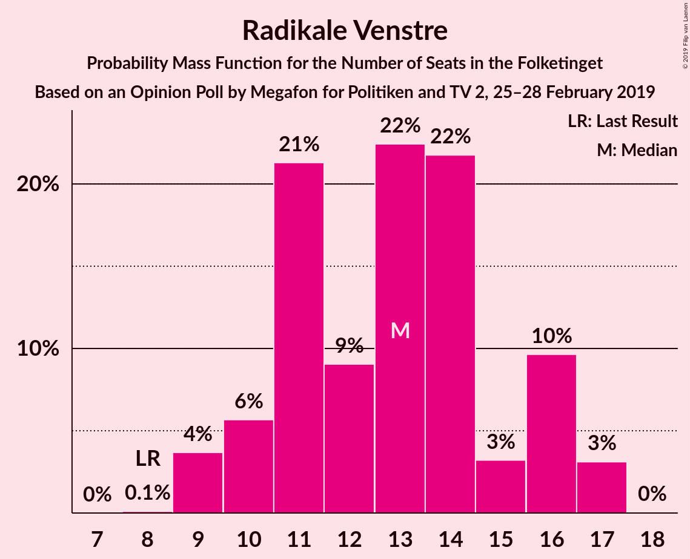

| Number of Seats | Probability | Accumulated | Special Marks |
|:---------------:|:-----------:|:-----------:|:-------------:|
| 8 | 0.1% | 100% | Last Result |
| 9 | 4% | 99.9% |  |
| 10 | 6% | 96% |  |
| 11 | 21% | 91% |  |
| 12 | 9% | 69% |  |
| 13 | 22% | 60% | Median |
| 14 | 22% | 38% |  |
| 15 | 3% | 16% |  |
| 16 | 10% | 13% |  |
| 17 | 3% | 3% |  |
| 18 | 0% | 0% |  |

### Liberal Alliance

*For a full overview of the results for this party, see the [Liberal Alliance](party-liberalalliance.html) page.*

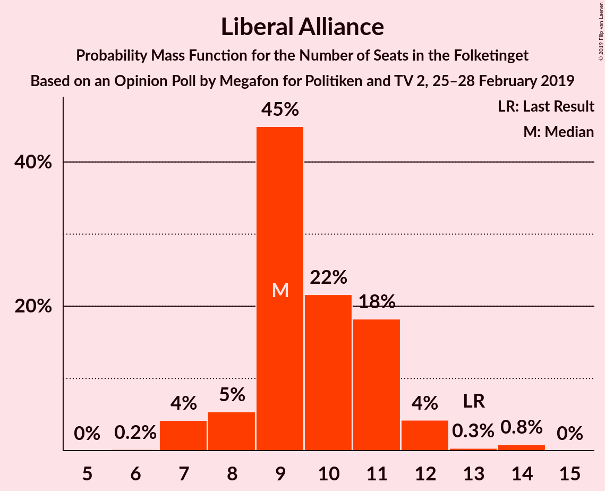

| Number of Seats | Probability | Accumulated | Special Marks |
|:---------------:|:-----------:|:-----------:|:-------------:|
| 6 | 0.2% | 100% |  |
| 7 | 4% | 99.8% |  |
| 8 | 5% | 96% |  |
| 9 | 45% | 90% | Median |
| 10 | 22% | 45% |  |
| 11 | 18% | 24% |  |
| 12 | 4% | 5% |  |
| 13 | 0.3% | 1.2% | Last Result |
| 14 | 0.8% | 0.9% |  |
| 15 | 0% | 0% |  |

### Alternativet

*For a full overview of the results for this party, see the [Alternativet](party-alternativet.html) page.*

| Number of Seats | Probability | Accumulated | Special Marks |
|:---------------:|:-----------:|:-----------:|:-------------:|
| 4 | 0.8% | 100% |  |
| 5 | 27% | 99.2% |  |
| 6 | 17% | 73% |  |
| 7 | 37% | 56% | Median |
| 8 | 9% | 18% |  |
| 9 | 3% | 9% | Last Result |
| 10 | 6% | 6% |  |
| 11 | 0.1% | 0.1% |  |
| 12 | 0% | 0% |  |

### Det Konservative Folkeparti

*For a full overview of the results for this party, see the [Det Konservative Folkeparti](party-detkonservativefolkeparti.html) page.*

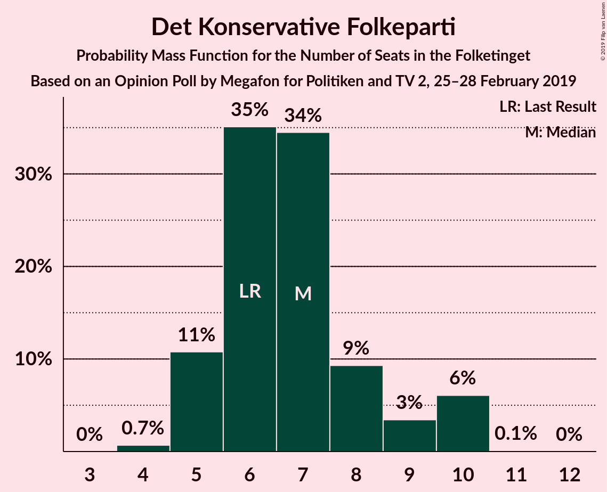

| Number of Seats | Probability | Accumulated | Special Marks |
|:---------------:|:-----------:|:-----------:|:-------------:|
| 4 | 0.7% | 100% |  |
| 5 | 11% | 99.3% |  |
| 6 | 35% | 89% | Last Result |
| 7 | 34% | 53% | Median |
| 8 | 9% | 19% |  |
| 9 | 3% | 10% |  |
| 10 | 6% | 6% |  |
| 11 | 0.1% | 0.1% |  |
| 12 | 0% | 0% |  |

### Nye Borgerlige

*For a full overview of the results for this party, see the [Nye Borgerlige](party-nyeborgerlige.html) page.*

| Number of Seats | Probability | Accumulated | Special Marks |
|:---------------:|:-----------:|:-----------:|:-------------:|
| 0 | 0.5% | 100% | Last Result |
| 1 | 0% | 99.5% |  |
| 2 | 0% | 99.5% |  |
| 3 | 0% | 99.5% |  |
| 4 | 3% | 99.5% |  |
| 5 | 23% | 97% |  |
| 6 | 39% | 74% | Median |
| 7 | 8% | 35% |  |
| 8 | 25% | 26% |  |
| 9 | 1.1% | 1.3% |  |
| 10 | 0.1% | 0.1% |  |
| 11 | 0% | 0% |  |

### Kristendemokraterne

*For a full overview of the results for this party, see the [Kristendemokraterne](party-kristendemokraterne.html) page.*

| Number of Seats | Probability | Accumulated | Special Marks |
|:---------------:|:-----------:|:-----------:|:-------------:|
| 0 | 93% | 100% | Last Result, Median |
| 1 | 0% | 7% |  |
| 2 | 0% | 7% |  |
| 3 | 0.1% | 7% |  |
| 4 | 6% | 7% |  |
| 5 | 0.4% | 0.5% |  |
| 6 | 0.1% | 0.1% |  |
| 7 | 0% | 0% |  |

### Klaus Riskær Pedersen

*For a full overview of the results for this party, see the [Klaus Riskær Pedersen](party-klausriskærpedersen.html) page.*

| Number of Seats | Probability | Accumulated | Special Marks |
|:---------------:|:-----------:|:-----------:|:-------------:|
| 0 | 93% | 100% | Last Result, Median |
| 1 | 0% | 7% |  |
| 2 | 0% | 7% |  |
| 3 | 0% | 7% |  |
| 4 | 7% | 7% |  |
| 5 | 0.1% | 0.2% |  |
| 6 | 0% | 0% |  |

## Coalitions

### Confidence Intervals

| Coalition | Last Result | Median | Majority? | 80% Confidence Interval | 90% Confidence Interval | 95% Confidence Interval | 99% Confidence Interval |
|:---------:|:-----------:|:------:|:---------:|:-----------------------:|:-----------------------:|:-----------------------:|:-----------------------:|
| Socialdemokraterne – Enhedslisten–De Rød-Grønne – Socialistisk Folkeparti – Radikale Venstre – Alternativet | 85 | 95 | 97% | 90–100 | 90–100 | 88–102 | 88–103 |
| Socialdemokraterne – Enhedslisten–De Rød-Grønne – Socialistisk Folkeparti – Radikale Venstre | 76 | 86 | 39% | 85–93 | 84–93 | 81–93 | 80–96 |
| Socialdemokraterne – Enhedslisten–De Rød-Grønne – Socialistisk Folkeparti – Alternativet | 77 | 82 | 2% | 78–86 | 78–86 | 78–88 | 75–92 |
| Venstre – Dansk Folkeparti – Liberal Alliance – Det Konservative Folkeparti – Nye Borgerlige – Kristendemokraterne – Klaus Riskær Pedersen | 90 | 80 | 0% | 75–85 | 75–85 | 73–87 | 72–87 |
| Venstre – Dansk Folkeparti – Liberal Alliance – Det Konservative Folkeparti – Nye Borgerlige – Kristendemokraterne | 90 | 80 | 0% | 75–85 | 74–85 | 73–87 | 72–87 |
| Venstre – Dansk Folkeparti – Liberal Alliance – Det Konservative Folkeparti – Nye Borgerlige – Klaus Riskær Pedersen | 90 | 80 | 0% | 75–85 | 74–85 | 73–85 | 72–87 |
| Venstre – Dansk Folkeparti – Liberal Alliance – Det Konservative Folkeparti – Nye Borgerlige | 90 | 80 | 0% | 75–85 | 74–85 | 73–85 | 71–87 |
| Socialdemokraterne – Enhedslisten–De Rød-Grønne – Socialistisk Folkeparti | 68 | 74 | 0% | 72–79 | 71–79 | 71–81 | 68–84 |
| Venstre – Dansk Folkeparti – Liberal Alliance – Det Konservative Folkeparti – Kristendemokraterne | 90 | 74 | 0% | 67–79 | 67–79 | 67–81 | 66–82 |
| Venstre – Dansk Folkeparti – Liberal Alliance – Det Konservative Folkeparti | 90 | 74 | 0% | 67–79 | 67–79 | 67–79 | 65–81 |
| Socialdemokraterne – Socialistisk Folkeparti – Radikale Venstre | 62 | 70 | 0% | 67–73 | 66–75 | 64–76 | 63–78 |
| Socialdemokraterne – Radikale Venstre | 55 | 57 | 0% | 53–59 | 52–59 | 52–61 | 49–63 |
| Venstre – Liberal Alliance – Det Konservative Folkeparti | 53 | 48 | 0% | 45–52 | 44–52 | 44–54 | 42–55 |
| Venstre – Det Konservative Folkeparti | 40 | 38 | 0% | 36–42 | 35–43 | 34–43 | 33–45 |
| Venstre | 34 | 32 | 0% | 30–34 | 29–35 | 28–36 | 27–38 |

### Socialdemokraterne – Enhedslisten–De Rød-Grønne – Socialistisk Folkeparti – Radikale Venstre – Alternativet

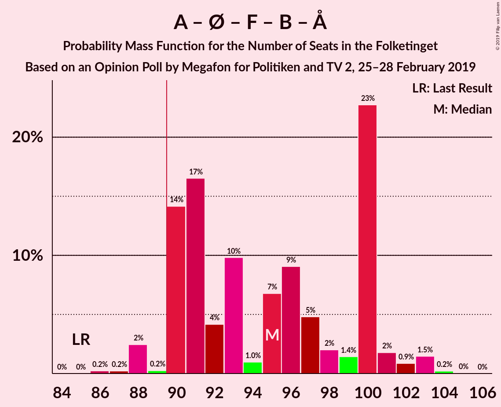

| Number of Seats | Probability | Accumulated | Special Marks |
|:---------------:|:-----------:|:-----------:|:-------------:|
| 85 | 0% | 100% | Last Result |
| 86 | 0.2% | 100% |  |
| 87 | 0.2% | 99.7% |  |
| 88 | 2% | 99.5% |  |
| 89 | 0.2% | 97% |  |
| 90 | 14% | 97% | Majority |
| 91 | 17% | 83% |  |
| 92 | 4% | 66% |  |
| 93 | 10% | 62% |  |
| 94 | 1.0% | 52% |  |
| 95 | 7% | 51% |  |
| 96 | 9% | 44% | Median |
| 97 | 5% | 35% |  |
| 98 | 2% | 31% |  |
| 99 | 1.4% | 29% |  |
| 100 | 23% | 27% |  |
| 101 | 2% | 4% |  |
| 102 | 0.9% | 3% |  |
| 103 | 1.5% | 2% |  |
| 104 | 0.2% | 0.3% |  |
| 105 | 0% | 0.1% |  |
| 106 | 0% | 0% |  |

### Socialdemokraterne – Enhedslisten–De Rød-Grønne – Socialistisk Folkeparti – Radikale Venstre

| Number of Seats | Probability | Accumulated | Special Marks |
|:---------------:|:-----------:|:-----------:|:-------------:|
| 76 | 0% | 100% | Last Result |
| 77 | 0% | 100% |  |
| 78 | 0% | 100% |  |
| 79 | 0.3% | 99.9% |  |
| 80 | 0.4% | 99.6% |  |
| 81 | 2% | 99.3% |  |
| 82 | 0.4% | 97% |  |
| 83 | 1.3% | 97% |  |
| 84 | 1.0% | 95% |  |
| 85 | 22% | 94% |  |
| 86 | 24% | 72% |  |
| 87 | 2% | 48% |  |
| 88 | 0.9% | 46% |  |
| 89 | 6% | 45% | Median |
| 90 | 9% | 39% | Majority |
| 91 | 2% | 30% |  |
| 92 | 1.3% | 28% |  |
| 93 | 25% | 27% |  |
| 94 | 0.1% | 2% |  |
| 95 | 1.2% | 2% |  |
| 96 | 0.5% | 0.8% |  |
| 97 | 0.1% | 0.3% |  |
| 98 | 0% | 0.2% |  |
| 99 | 0.2% | 0.2% |  |
| 100 | 0% | 0% |  |

### Socialdemokraterne – Enhedslisten–De Rød-Grønne – Socialistisk Folkeparti – Alternativet

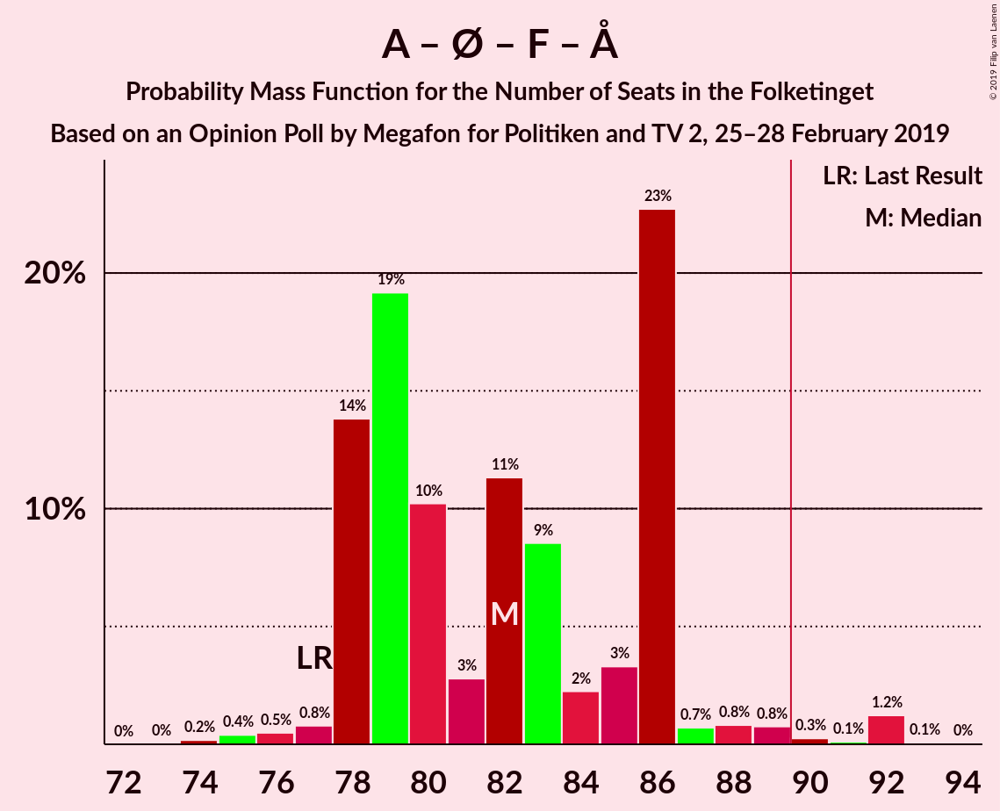

| Number of Seats | Probability | Accumulated | Special Marks |
|:---------------:|:-----------:|:-----------:|:-------------:|
| 74 | 0.2% | 100% |  |
| 75 | 0.4% | 99.8% |  |
| 76 | 0.5% | 99.4% |  |
| 77 | 0.8% | 98.9% | Last Result |
| 78 | 14% | 98% |  |
| 79 | 19% | 84% |  |
| 80 | 10% | 65% |  |
| 81 | 3% | 55% |  |
| 82 | 11% | 52% |  |
| 83 | 9% | 41% | Median |
| 84 | 2% | 32% |  |
| 85 | 3% | 30% |  |
| 86 | 23% | 27% |  |
| 87 | 0.7% | 4% |  |
| 88 | 0.8% | 3% |  |
| 89 | 0.8% | 2% |  |
| 90 | 0.3% | 2% | Majority |
| 91 | 0.1% | 1.4% |  |
| 92 | 1.2% | 1.3% |  |
| 93 | 0.1% | 0.1% |  |
| 94 | 0% | 0% |  |

### Venstre – Dansk Folkeparti – Liberal Alliance – Det Konservative Folkeparti – Nye Borgerlige – Kristendemokraterne – Klaus Riskær Pedersen

| Number of Seats | Probability | Accumulated | Special Marks |
|:---------------:|:-----------:|:-----------:|:-------------:|
| 70 | 0% | 100% |  |
| 71 | 0.2% | 99.9% |  |
| 72 | 1.5% | 99.7% |  |
| 73 | 0.9% | 98% |  |
| 74 | 2% | 97% |  |
| 75 | 23% | 96% |  |
| 76 | 1.4% | 73% |  |
| 77 | 2% | 71% |  |
| 78 | 5% | 69% |  |
| 79 | 9% | 65% |  |
| 80 | 7% | 56% | Median |
| 81 | 1.0% | 49% |  |
| 82 | 10% | 48% |  |
| 83 | 4% | 38% |  |
| 84 | 17% | 34% |  |
| 85 | 14% | 17% |  |
| 86 | 0.2% | 3% |  |
| 87 | 2% | 3% |  |
| 88 | 0.2% | 0.5% |  |
| 89 | 0.2% | 0.3% |  |
| 90 | 0% | 0% | Last Result, Majority |

### Venstre – Dansk Folkeparti – Liberal Alliance – Det Konservative Folkeparti – Nye Borgerlige – Kristendemokraterne

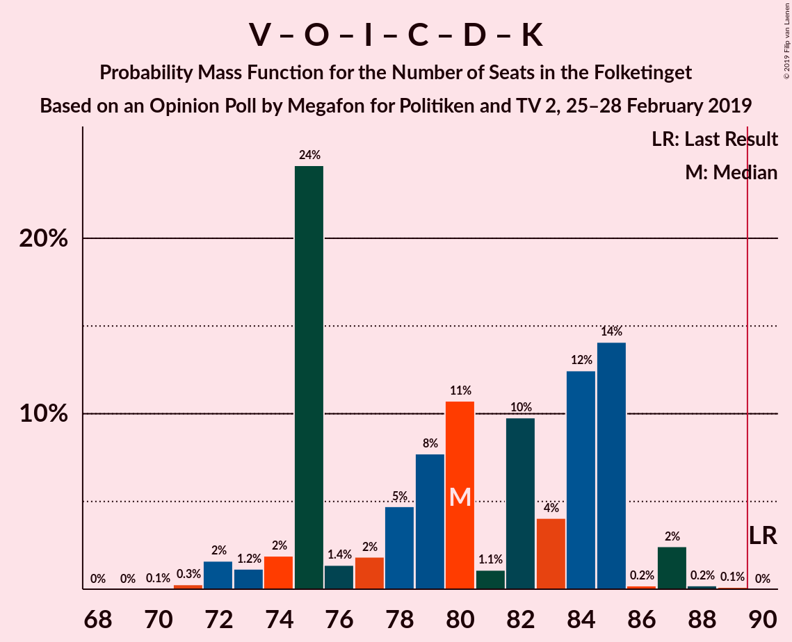

| Number of Seats | Probability | Accumulated | Special Marks |
|:---------------:|:-----------:|:-----------:|:-------------:|
| 70 | 0.1% | 100% |  |
| 71 | 0.3% | 99.9% |  |
| 72 | 2% | 99.6% |  |
| 73 | 1.2% | 98% |  |
| 74 | 2% | 97% |  |
| 75 | 24% | 95% |  |
| 76 | 1.4% | 71% |  |
| 77 | 2% | 69% |  |
| 78 | 5% | 68% |  |
| 79 | 8% | 63% |  |
| 80 | 11% | 55% | Median |
| 81 | 1.1% | 44% |  |
| 82 | 10% | 43% |  |
| 83 | 4% | 34% |  |
| 84 | 12% | 30% |  |
| 85 | 14% | 17% |  |
| 86 | 0.2% | 3% |  |
| 87 | 2% | 3% |  |
| 88 | 0.2% | 0.3% |  |
| 89 | 0.1% | 0.1% |  |
| 90 | 0% | 0% | Last Result, Majority |

### Venstre – Dansk Folkeparti – Liberal Alliance – Det Konservative Folkeparti – Nye Borgerlige – Klaus Riskær Pedersen

| Number of Seats | Probability | Accumulated | Special Marks |
|:---------------:|:-----------:|:-----------:|:-------------:|
| 69 | 0% | 100% |  |
| 70 | 0.1% | 99.9% |  |
| 71 | 0.2% | 99.9% |  |
| 72 | 2% | 99.7% |  |
| 73 | 1.2% | 98% |  |
| 74 | 2% | 97% |  |
| 75 | 23% | 95% |  |
| 76 | 2% | 72% |  |
| 77 | 2% | 70% |  |
| 78 | 6% | 68% |  |
| 79 | 9% | 63% |  |
| 80 | 7% | 53% | Median |
| 81 | 0.8% | 46% |  |
| 82 | 9% | 45% |  |
| 83 | 6% | 36% |  |
| 84 | 16% | 31% |  |
| 85 | 14% | 15% |  |
| 86 | 0.2% | 0.9% |  |
| 87 | 0.4% | 0.7% |  |
| 88 | 0.2% | 0.3% |  |
| 89 | 0.1% | 0.1% |  |
| 90 | 0% | 0% | Last Result, Majority |

### Venstre – Dansk Folkeparti – Liberal Alliance – Det Konservative Folkeparti – Nye Borgerlige

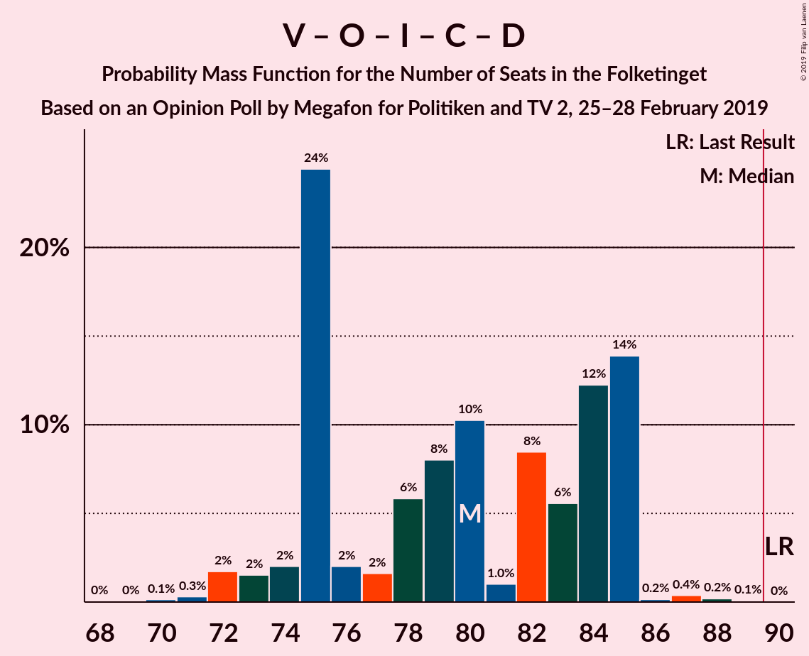

| Number of Seats | Probability | Accumulated | Special Marks |
|:---------------:|:-----------:|:-----------:|:-------------:|
| 69 | 0% | 100% |  |
| 70 | 0.1% | 99.9% |  |
| 71 | 0.3% | 99.8% |  |
| 72 | 2% | 99.5% |  |
| 73 | 2% | 98% |  |
| 74 | 2% | 96% |  |
| 75 | 24% | 94% |  |
| 76 | 2% | 70% |  |
| 77 | 2% | 68% |  |
| 78 | 6% | 66% |  |
| 79 | 8% | 60% |  |
| 80 | 10% | 52% | Median |
| 81 | 1.0% | 42% |  |
| 82 | 8% | 41% |  |
| 83 | 6% | 33% |  |
| 84 | 12% | 27% |  |
| 85 | 14% | 15% |  |
| 86 | 0.2% | 0.8% |  |
| 87 | 0.4% | 0.7% |  |
| 88 | 0.2% | 0.3% |  |
| 89 | 0.1% | 0.1% |  |
| 90 | 0% | 0% | Last Result, Majority |

### Socialdemokraterne – Enhedslisten–De Rød-Grønne – Socialistisk Folkeparti

| Number of Seats | Probability | Accumulated | Special Marks |
|:---------------:|:-----------:|:-----------:|:-------------:|
| 66 | 0.1% | 100% |  |
| 67 | 0.1% | 99.9% |  |
| 68 | 0.5% | 99.8% | Last Result |
| 69 | 0.7% | 99.4% |  |
| 70 | 0.4% | 98.7% |  |
| 71 | 3% | 98% |  |
| 72 | 7% | 95% |  |
| 73 | 21% | 88% |  |
| 74 | 20% | 67% |  |
| 75 | 6% | 48% |  |
| 76 | 7% | 42% | Median |
| 77 | 6% | 35% |  |
| 78 | 4% | 28% |  |
| 79 | 20% | 25% |  |
| 80 | 1.2% | 4% |  |
| 81 | 1.1% | 3% |  |
| 82 | 0.3% | 2% |  |
| 83 | 0.2% | 2% |  |
| 84 | 1.1% | 1.4% |  |
| 85 | 0% | 0.2% |  |
| 86 | 0% | 0.2% |  |
| 87 | 0.2% | 0.2% |  |
| 88 | 0% | 0% |  |

### Venstre – Dansk Folkeparti – Liberal Alliance – Det Konservative Folkeparti – Kristendemokraterne

| Number of Seats | Probability | Accumulated | Special Marks |
|:---------------:|:-----------:|:-----------:|:-------------:|
| 63 | 0.1% | 100% |  |
| 64 | 0.1% | 99.9% |  |
| 65 | 0.2% | 99.8% |  |
| 66 | 1.4% | 99.6% |  |
| 67 | 19% | 98% |  |
| 68 | 4% | 79% |  |
| 69 | 4% | 75% |  |
| 70 | 1.2% | 71% |  |
| 71 | 4% | 69% |  |
| 72 | 2% | 66% |  |
| 73 | 8% | 64% |  |
| 74 | 9% | 56% | Median |
| 75 | 6% | 47% |  |
| 76 | 9% | 41% |  |
| 77 | 4% | 31% |  |
| 78 | 0.9% | 27% |  |
| 79 | 23% | 26% |  |
| 80 | 0.6% | 3% |  |
| 81 | 0.5% | 3% |  |
| 82 | 2% | 2% |  |
| 83 | 0% | 0.1% |  |
| 84 | 0% | 0% |  |
| 85 | 0% | 0% |  |
| 86 | 0% | 0% |  |
| 87 | 0% | 0% |  |
| 88 | 0% | 0% |  |
| 89 | 0% | 0% |  |
| 90 | 0% | 0% | Last Result, Majority |

### Venstre – Dansk Folkeparti – Liberal Alliance – Det Konservative Folkeparti

| Number of Seats | Probability | Accumulated | Special Marks |
|:---------------:|:-----------:|:-----------:|:-------------:|
| 63 | 0.2% | 100% |  |
| 64 | 0.1% | 99.8% |  |
| 65 | 0.3% | 99.7% |  |
| 66 | 2% | 99.4% |  |
| 67 | 19% | 98% |  |
| 68 | 5% | 79% |  |
| 69 | 5% | 74% |  |
| 70 | 2% | 69% |  |
| 71 | 3% | 68% |  |
| 72 | 4% | 64% |  |
| 73 | 8% | 61% |  |
| 74 | 9% | 53% | Median |
| 75 | 6% | 45% |  |
| 76 | 8% | 39% |  |
| 77 | 4% | 31% |  |
| 78 | 3% | 27% |  |
| 79 | 23% | 24% |  |
| 80 | 0.5% | 1.1% |  |
| 81 | 0.5% | 0.6% |  |
| 82 | 0% | 0.1% |  |
| 83 | 0% | 0.1% |  |
| 84 | 0% | 0% |  |
| 85 | 0% | 0% |  |
| 86 | 0% | 0% |  |
| 87 | 0% | 0% |  |
| 88 | 0% | 0% |  |
| 89 | 0% | 0% |  |
| 90 | 0% | 0% | Last Result, Majority |

### Socialdemokraterne – Socialistisk Folkeparti – Radikale Venstre

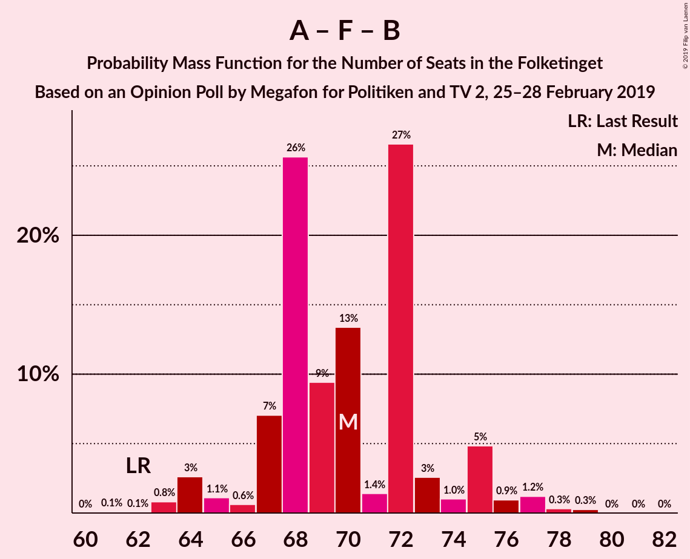

| Number of Seats | Probability | Accumulated | Special Marks |
|:---------------:|:-----------:|:-----------:|:-------------:|
| 61 | 0.1% | 100% |  |
| 62 | 0.1% | 99.9% | Last Result |
| 63 | 0.8% | 99.8% |  |
| 64 | 3% | 99.0% |  |
| 65 | 1.1% | 96% |  |
| 66 | 0.6% | 95% |  |
| 67 | 7% | 95% |  |
| 68 | 26% | 88% |  |
| 69 | 9% | 62% |  |
| 70 | 13% | 53% |  |
| 71 | 1.4% | 39% | Median |
| 72 | 27% | 38% |  |
| 73 | 3% | 11% |  |
| 74 | 1.0% | 9% |  |
| 75 | 5% | 8% |  |
| 76 | 0.9% | 3% |  |
| 77 | 1.2% | 2% |  |
| 78 | 0.3% | 0.6% |  |
| 79 | 0.3% | 0.3% |  |
| 80 | 0% | 0.1% |  |
| 81 | 0% | 0% |  |

### Socialdemokraterne – Radikale Venstre

| Number of Seats | Probability | Accumulated | Special Marks |
|:---------------:|:-----------:|:-----------:|:-------------:|
| 47 | 0.1% | 100% |  |
| 48 | 0.4% | 99.9% |  |
| 49 | 0.4% | 99.6% |  |
| 50 | 0.5% | 99.2% |  |
| 51 | 0.8% | 98.6% |  |
| 52 | 4% | 98% |  |
| 53 | 11% | 94% |  |
| 54 | 11% | 83% |  |
| 55 | 7% | 73% | Last Result |
| 56 | 13% | 66% | Median |
| 57 | 36% | 53% |  |
| 58 | 2% | 16% |  |
| 59 | 10% | 14% |  |
| 60 | 2% | 5% |  |
| 61 | 1.1% | 3% |  |
| 62 | 0.7% | 1.5% |  |
| 63 | 0.5% | 0.8% |  |
| 64 | 0.2% | 0.3% |  |
| 65 | 0% | 0.1% |  |
| 66 | 0% | 0.1% |  |
| 67 | 0% | 0% |  |

### Venstre – Liberal Alliance – Det Konservative Folkeparti

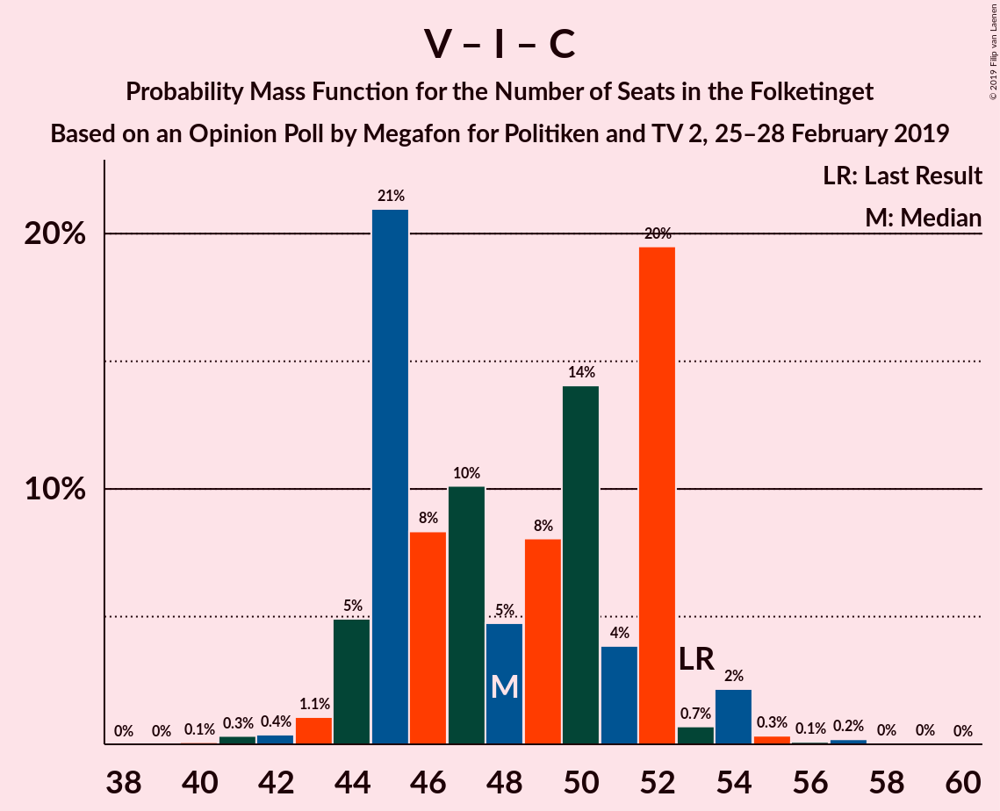

| Number of Seats | Probability | Accumulated | Special Marks |
|:---------------:|:-----------:|:-----------:|:-------------:|
| 40 | 0.1% | 100% |  |
| 41 | 0.3% | 99.9% |  |
| 42 | 0.4% | 99.6% |  |
| 43 | 1.1% | 99.2% |  |
| 44 | 5% | 98% |  |
| 45 | 21% | 93% |  |
| 46 | 8% | 72% |  |
| 47 | 10% | 64% |  |
| 48 | 5% | 54% | Median |
| 49 | 8% | 49% |  |
| 50 | 14% | 41% |  |
| 51 | 4% | 27% |  |
| 52 | 20% | 23% |  |
| 53 | 0.7% | 4% | Last Result |
| 54 | 2% | 3% |  |
| 55 | 0.3% | 0.7% |  |
| 56 | 0.1% | 0.4% |  |
| 57 | 0.2% | 0.3% |  |
| 58 | 0% | 0.1% |  |
| 59 | 0% | 0% |  |

### Venstre – Det Konservative Folkeparti

| Number of Seats | Probability | Accumulated | Special Marks |
|:---------------:|:-----------:|:-----------:|:-------------:|
| 31 | 0.1% | 100% |  |
| 32 | 0.1% | 99.9% |  |
| 33 | 2% | 99.9% |  |
| 34 | 2% | 98% |  |
| 35 | 3% | 96% |  |
| 36 | 25% | 93% |  |
| 37 | 16% | 68% |  |
| 38 | 2% | 52% |  |
| 39 | 2% | 50% | Median |
| 40 | 10% | 48% | Last Result |
| 41 | 26% | 38% |  |
| 42 | 3% | 11% |  |
| 43 | 6% | 8% |  |
| 44 | 0.6% | 1.5% |  |
| 45 | 0.5% | 0.9% |  |
| 46 | 0.2% | 0.5% |  |
| 47 | 0% | 0.2% |  |
| 48 | 0.2% | 0.2% |  |
| 49 | 0% | 0% |  |

### Venstre

| Number of Seats | Probability | Accumulated | Special Marks |
|:---------------:|:-----------:|:-----------:|:-------------:|
| 25 | 0% | 100% |  |
| 26 | 0.1% | 99.9% |  |
| 27 | 0.9% | 99.8% |  |
| 28 | 2% | 99.0% |  |
| 29 | 5% | 97% |  |
| 30 | 32% | 91% |  |
| 31 | 6% | 59% |  |
| 32 | 9% | 53% | Median |
| 33 | 9% | 44% |  |
| 34 | 29% | 35% | Last Result |
| 35 | 2% | 6% |  |
| 36 | 3% | 4% |  |
| 37 | 0.5% | 1.1% |  |
| 38 | 0.2% | 0.6% |  |
| 39 | 0.1% | 0.4% |  |
| 40 | 0.1% | 0.3% |  |
| 41 | 0.2% | 0.2% |  |
| 42 | 0% | 0% |  |

## Technical Information

### Opinion Poll

+ **Polling firm:** Megafon
+ **Commissioner(s):** Politiken and TV 2
+ **Fieldwork period:** 25–28 February 2019

### Calculations

+ **Sample size:** 1009
+ **Simulations done:** 1,048,576
+ **Error estimate:** 2.10%

