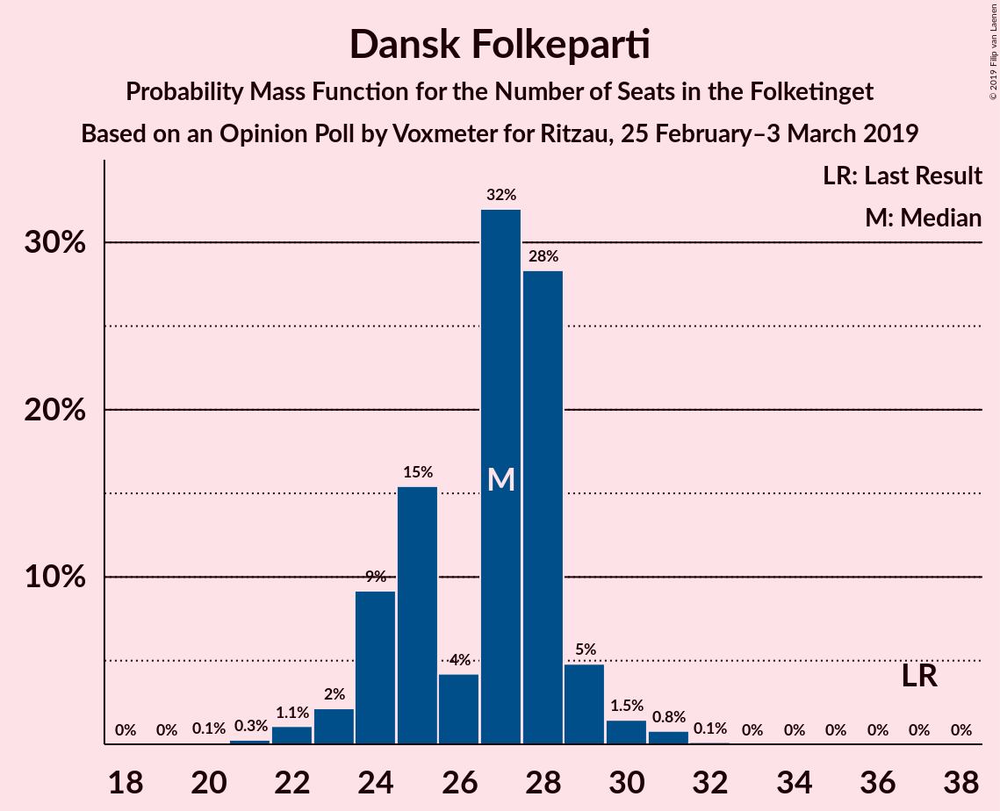
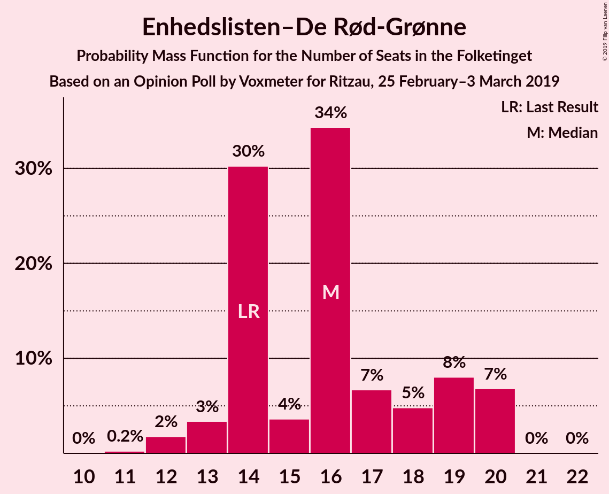
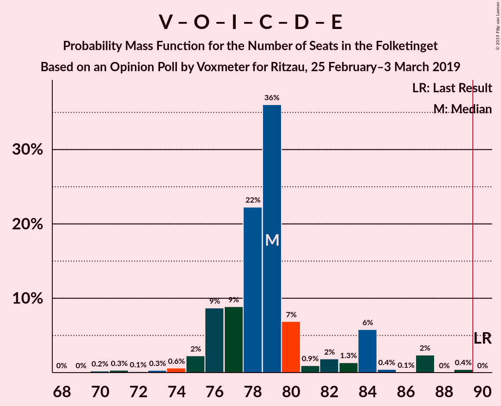
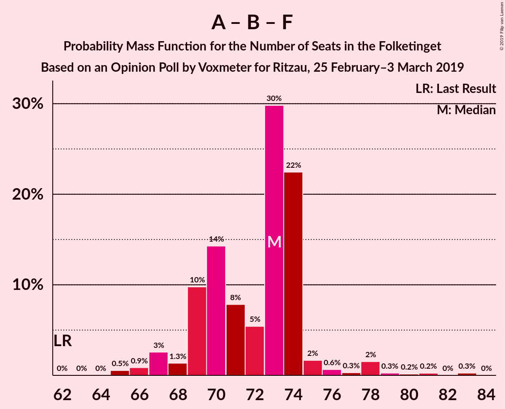

# Opinion Poll by Voxmeter for Ritzau, 25 February–3 March 2019

<a href="#voting-intentions">Voting Intentions</a> | <a href="#seats">Seats</a> | <a href="#coalitions">Coalitions</a> | <a href="#technical-information">Technical Information</a>

## Voting Intentions

### Confidence Intervals

| Party | Last Result | Poll Result | 80% Confidence Interval | 90% Confidence Interval | 95% Confidence Interval | 99% Confidence Interval |
|:-----:|:-----------:|:-----------:|:-----------------------:|:-----------------------:|:-----------------------:|:-----------------------:|
| Socialdemokraterne | 26.3% | 28.0% | 26.3–29.8% |25.8–30.4% |25.3–30.8% |24.5–31.7% |
| Venstre | 19.5% | 18.1% | 16.7–19.7% |16.2–20.2% |15.9–20.6% |15.2–21.4% |
| Dansk Folkeparti | 21.1% | 14.6% | 13.2–16.1% |12.9–16.5% |12.6–16.9% |11.9–17.6% |
| Enhedslisten–De Rød-Grønne | 7.8% | 8.6% | 7.6–9.8% |7.3–10.2% |7.1–10.5% |6.6–11.1% |
| Radikale Venstre | 4.6% | 6.7% | 5.8–7.8% |5.6–8.1% |5.3–8.4% |4.9–9.0% |
| Socialistisk Folkeparti | 4.2% | 5.9% | 5.1–7.0% |4.9–7.3% |4.7–7.6% |4.3–8.1% |
| Liberal Alliance | 7.5% | 5.7% | 4.8–6.7% |4.6–7.0% |4.4–7.2% |4.0–7.8% |
| Alternativet | 4.8% | 4.3% | 3.6–5.2% |3.4–5.5% |3.2–5.7% |2.9–6.2% |
| Det Konservative Folkeparti | 3.4% | 4.1% | 3.4–5.0% |3.2–5.3% |3.1–5.5% |2.8–6.0% |
| Nye Borgerlige | 0.0% | 2.1% | 1.6–2.8% |1.5–3.0% |1.4–3.2% |1.2–3.6% |
| Kristendemokraterne | 0.8% | 0.9% | 0.6–1.4% |0.5–1.5% |0.5–1.6% |0.4–1.9% |
| Klaus Riskær Pedersen | 0.0% | 0.6% | 0.4–1.0% |0.3–1.1% |0.3–1.2% |0.2–1.5% |

*Note:* The poll result column reflects the actual value used in the calculations. Published results may vary slightly, and in addition be rounded to fewer digits.

## Seats

### Confidence Intervals

| Party | Last Result | Median | 80% Confidence Interval | 90% Confidence Interval | 95% Confidence Interval | 99% Confidence Interval |
|:-----:|:-----------:|:------:|:-----------------------:|:-----------------------:|:-----------------------:|:-----------------------:|
| <a href="#socialdemokraterne">Socialdemokraterne</a> | 47 | 48 | 48–50 |46–52 |46–55 |46–56 |
| <a href="#venstre">Venstre</a> | 34 | 30 | 30–33 |30–34 |28–37 |28–39 |
| <a href="#dansk-folkeparti">Dansk Folkeparti</a> | 37 | 25 | 24–26 |24–29 |22–29 |22–31 |
| <a href="#enhedslisten–de-rød-grønne">Enhedslisten–De Rød-Grønne</a> | 14 | 19 | 16–20 |15–20 |13–20 |11–20 |
| <a href="#radikale-venstre">Radikale Venstre</a> | 8 | 12 | 11–12 |10–12 |9–12 |9–14 |
| <a href="#socialistisk-folkeparti">Socialistisk Folkeparti</a> | 7 | 10 | 9–11 |9–12 |9–12 |8–14 |
| <a href="#liberal-alliance">Liberal Alliance</a> | 13 | 10 | 9–11 |9–12 |9–13 |8–13 |
| <a href="#alternativet">Alternativet</a> | 9 | 8 | 8–10 |6–10 |6–10 |6–10 |
| <a href="#det-konservative-folkeparti">Det Konservative Folkeparti</a> | 6 | 7 | 7–9 |7–10 |6–10 |5–12 |
| <a href="#nye-borgerlige">Nye Borgerlige</a> | 0 | 4 | 3–5 |0–5 |0–5 |0–7 |
| <a href="#kristendemokraterne">Kristendemokraterne</a> | 0 | 0 | 0 |0 |0 |0 |
| <a href="#klaus-riskær-pedersen">Klaus Riskær Pedersen</a> | 0 | 0 | 0 |0 |0 |0 |

### Socialdemokraterne

*For a full overview of the results for this party, see the [Socialdemokraterne](party-socialdemokraterne.html) page.*

| Number of Seats | Probability | Accumulated | Special Marks |
|:---------------:|:-----------:|:-----------:|:-------------:|
| 43 | 0.1% | 100% |  |
| 44 | 0.1% | 99.9% |  |
| 45 | 0% | 99.8% |  |
| 46 | 6% | 99.7% |  |
| 47 | 2% | 93% | Last Result |
| 48 | 42% | 91% | Median |
| 49 | 39% | 49% |  |
| 50 | 1.4% | 10% |  |
| 51 | 2% | 9% |  |
| 52 | 3% | 7% |  |
| 53 | 0.6% | 4% |  |
| 54 | 0.6% | 3% |  |
| 55 | 2% | 3% |  |
| 56 | 1.0% | 1.2% |  |
| 57 | 0.2% | 0.2% |  |
| 58 | 0% | 0% |  |

### Venstre

*For a full overview of the results for this party, see the [Venstre](party-venstre.html) page.*

| Number of Seats | Probability | Accumulated | Special Marks |
|:---------------:|:-----------:|:-----------:|:-------------:|
| 27 | 0% | 100% |  |
| 28 | 3% | 99.9% |  |
| 29 | 0.8% | 97% |  |
| 30 | 81% | 96% | Median |
| 31 | 3% | 16% |  |
| 32 | 0.5% | 12% |  |
| 33 | 6% | 12% |  |
| 34 | 2% | 6% | Last Result |
| 35 | 0.7% | 4% |  |
| 36 | 0.1% | 4% |  |
| 37 | 1.4% | 3% |  |
| 38 | 1.2% | 2% |  |
| 39 | 0.9% | 0.9% |  |
| 40 | 0% | 0% |  |

### Dansk Folkeparti

*For a full overview of the results for this party, see the [Dansk Folkeparti](party-danskfolkeparti.html) page.*

| Number of Seats | Probability | Accumulated | Special Marks |
|:---------------:|:-----------:|:-----------:|:-------------:|
| 20 | 0% | 100% |  |
| 21 | 0.2% | 99.9% |  |
| 22 | 3% | 99.7% |  |
| 23 | 0.7% | 97% |  |
| 24 | 41% | 96% |  |
| 25 | 42% | 55% | Median |
| 26 | 2% | 12% |  |
| 27 | 2% | 10% |  |
| 28 | 0.6% | 8% |  |
| 29 | 5% | 7% |  |
| 30 | 0.5% | 2% |  |
| 31 | 1.2% | 1.3% |  |
| 32 | 0.1% | 0.1% |  |
| 33 | 0% | 0% |  |
| 34 | 0% | 0% |  |
| 35 | 0% | 0% |  |
| 36 | 0% | 0% |  |
| 37 | 0% | 0% | Last Result |

### Enhedslisten–De Rød-Grønne

*For a full overview of the results for this party, see the [Enhedslisten–De Rød-Grønne](party-enhedslisten–derød-grønne.html) page.*

| Number of Seats | Probability | Accumulated | Special Marks |
|:---------------:|:-----------:|:-----------:|:-------------:|
| 11 | 0.6% | 100% |  |
| 12 | 0.1% | 99.4% |  |
| 13 | 3% | 99.3% |  |
| 14 | 1.0% | 97% | Last Result |
| 15 | 4% | 96% |  |
| 16 | 6% | 91% |  |
| 17 | 1.4% | 86% |  |
| 18 | 1.1% | 84% |  |
| 19 | 42% | 83% | Median |
| 20 | 41% | 41% |  |
| 21 | 0.1% | 0.1% |  |
| 22 | 0.1% | 0.1% |  |
| 23 | 0% | 0% |  |

### Radikale Venstre

*For a full overview of the results for this party, see the [Radikale Venstre](party-radikalevenstre.html) page.*

| Number of Seats | Probability | Accumulated | Special Marks |
|:---------------:|:-----------:|:-----------:|:-------------:|
| 8 | 0.4% | 100% | Last Result |
| 9 | 3% | 99.6% |  |
| 10 | 5% | 96% |  |
| 11 | 7% | 91% |  |
| 12 | 82% | 85% | Median |
| 13 | 1.3% | 2% |  |
| 14 | 0.5% | 0.9% |  |
| 15 | 0.3% | 0.4% |  |
| 16 | 0.1% | 0.1% |  |
| 17 | 0% | 0% |  |

### Socialistisk Folkeparti

*For a full overview of the results for this party, see the [Socialistisk Folkeparti](party-socialistiskfolkeparti.html) page.*

| Number of Seats | Probability | Accumulated | Special Marks |
|:---------------:|:-----------:|:-----------:|:-------------:|
| 7 | 0.1% | 100% | Last Result |
| 8 | 2% | 99.9% |  |
| 9 | 41% | 98% |  |
| 10 | 42% | 57% | Median |
| 11 | 5% | 15% |  |
| 12 | 8% | 10% |  |
| 13 | 0.4% | 2% |  |
| 14 | 1.3% | 1.3% |  |
| 15 | 0% | 0% |  |

### Liberal Alliance

*For a full overview of the results for this party, see the [Liberal Alliance](party-liberalalliance.html) page.*

| Number of Seats | Probability | Accumulated | Special Marks |
|:---------------:|:-----------:|:-----------:|:-------------:|
| 7 | 0.3% | 100% |  |
| 8 | 1.0% | 99.7% |  |
| 9 | 44% | 98.8% |  |
| 10 | 44% | 54% | Median |
| 11 | 5% | 11% |  |
| 12 | 2% | 5% |  |
| 13 | 3% | 4% | Last Result |
| 14 | 0.2% | 0.3% |  |
| 15 | 0% | 0% |  |

### Alternativet

*For a full overview of the results for this party, see the [Alternativet](party-alternativet.html) page.*

| Number of Seats | Probability | Accumulated | Special Marks |
|:---------------:|:-----------:|:-----------:|:-------------:|
| 5 | 0.2% | 100% |  |
| 6 | 8% | 99.8% |  |
| 7 | 1.3% | 92% |  |
| 8 | 45% | 91% | Median |
| 9 | 5% | 45% | Last Result |
| 10 | 40% | 41% |  |
| 11 | 0.1% | 0.3% |  |
| 12 | 0.2% | 0.2% |  |
| 13 | 0% | 0% |  |

### Det Konservative Folkeparti

*For a full overview of the results for this party, see the [Det Konservative Folkeparti](party-detkonservativefolkeparti.html) page.*

| Number of Seats | Probability | Accumulated | Special Marks |
|:---------------:|:-----------:|:-----------:|:-------------:|
| 5 | 2% | 100% |  |
| 6 | 2% | 98% | Last Result |
| 7 | 47% | 96% | Median |
| 8 | 4% | 49% |  |
| 9 | 39% | 45% |  |
| 10 | 5% | 6% |  |
| 11 | 0.1% | 0.7% |  |
| 12 | 0.6% | 0.6% |  |
| 13 | 0% | 0% |  |

### Nye Borgerlige

*For a full overview of the results for this party, see the [Nye Borgerlige](party-nyeborgerlige.html) page.*

| Number of Seats | Probability | Accumulated | Special Marks |
|:---------------:|:-----------:|:-----------:|:-------------:|
| 0 | 6% | 100% | Last Result |
| 1 | 0% | 94% |  |
| 2 | 0% | 94% |  |
| 3 | 4% | 94% |  |
| 4 | 45% | 89% | Median |
| 5 | 43% | 44% |  |
| 6 | 0.4% | 1.0% |  |
| 7 | 0.6% | 0.6% |  |
| 8 | 0% | 0% |  |

### Kristendemokraterne

*For a full overview of the results for this party, see the [Kristendemokraterne](party-kristendemokraterne.html) page.*

| Number of Seats | Probability | Accumulated | Special Marks |
|:---------------:|:-----------:|:-----------:|:-------------:|
| 0 | 100% | 100% | Last Result, Median |

### Klaus Riskær Pedersen

*For a full overview of the results for this party, see the [Klaus Riskær Pedersen](party-klausriskærpedersen.html) page.*

| Number of Seats | Probability | Accumulated | Special Marks |
|:---------------:|:-----------:|:-----------:|:-------------:|
| 0 | 100% | 100% | Last Result, Median |

## Coalitions

### Confidence Intervals

| Coalition | Last Result | Median | Majority? | 80% Confidence Interval | 90% Confidence Interval | 95% Confidence Interval | 99% Confidence Interval |
|:---------:|:-----------:|:------:|:---------:|:-----------------------:|:-----------------------:|:-----------------------:|:-----------------------:|
| Socialdemokraterne – Enhedslisten–De Rød-Grønne – Radikale Venstre – Socialistisk Folkeparti – Alternativet | 85 | 98 | 99.9% | 95–99 | 91–99 | 91–99 | 91–102 |
| Socialdemokraterne – Enhedslisten–De Rød-Grønne – Radikale Venstre – Socialistisk Folkeparti | 76 | 89 | 44% | 88–90 | 85–90 | 85–90 | 83–94 |
| Socialdemokraterne – Enhedslisten–De Rød-Grønne – Socialistisk Folkeparti – Alternativet | 77 | 86 | 0.3% | 83–87 | 80–88 | 80–88 | 80–89 |
| Venstre – Dansk Folkeparti – Liberal Alliance – Det Konservative Folkeparti – Nye Borgerlige – Kristendemokraterne – Klaus Riskær Pedersen | 90 | 77 | 0% | 76–80 | 76–84 | 76–84 | 73–84 |
| Venstre – Dansk Folkeparti – Liberal Alliance – Det Konservative Folkeparti – Nye Borgerlige – Klaus Riskær Pedersen | 90 | 77 | 0% | 76–80 | 76–84 | 76–84 | 73–84 |
| Venstre – Dansk Folkeparti – Liberal Alliance – Det Konservative Folkeparti – Nye Borgerlige – Kristendemokraterne | 90 | 77 | 0% | 76–80 | 76–84 | 76–84 | 73–84 |
| Venstre – Dansk Folkeparti – Liberal Alliance – Det Konservative Folkeparti – Nye Borgerlige | 90 | 77 | 0% | 76–80 | 76–84 | 76–84 | 73–84 |
| Venstre – Dansk Folkeparti – Liberal Alliance – Det Konservative Folkeparti – Kristendemokraterne | 90 | 72 | 0% | 72–77 | 72–81 | 72–81 | 72–84 |
| Venstre – Dansk Folkeparti – Liberal Alliance – Det Konservative Folkeparti | 90 | 72 | 0% | 72–77 | 72–81 | 72–81 | 72–84 |
| Socialdemokraterne – Enhedslisten–De Rød-Grønne – Socialistisk Folkeparti | 68 | 77 | 0% | 76–78 | 74–79 | 74–80 | 73–81 |
| Socialdemokraterne – Radikale Venstre – Socialistisk Folkeparti | 62 | 70 | 0% | 70–71 | 69–74 | 68–75 | 66–78 |
| Socialdemokraterne – Radikale Venstre | 55 | 60 | 0% | 60–61 | 57–63 | 57–66 | 55–68 |
| Venstre – Liberal Alliance – Det Konservative Folkeparti | 53 | 48 | 0% | 47–52 | 47–53 | 47–54 | 46–58 |
| Venstre – Det Konservative Folkeparti | 40 | 39 | 0% | 37–42 | 37–43 | 36–45 | 35–47 |
| Venstre | 34 | 30 | 0% | 30–33 | 30–34 | 28–37 | 28–39 |

### Socialdemokraterne – Enhedslisten–De Rød-Grønne – Radikale Venstre – Socialistisk Folkeparti – Alternativet

| Number of Seats | Probability | Accumulated | Special Marks |
|:---------------:|:-----------:|:-----------:|:-------------:|
| 85 | 0% | 100% | Last Result |
| 86 | 0% | 100% |  |
| 87 | 0% | 100% |  |
| 88 | 0.1% | 100% |  |
| 89 | 0% | 99.9% |  |
| 90 | 0% | 99.9% | Majority |
| 91 | 6% | 99.8% |  |
| 92 | 0.7% | 93% |  |
| 93 | 0.6% | 93% |  |
| 94 | 2% | 92% |  |
| 95 | 1.2% | 90% |  |
| 96 | 1.4% | 89% |  |
| 97 | 0.6% | 88% | Median |
| 98 | 47% | 87% |  |
| 99 | 38% | 40% |  |
| 100 | 0.7% | 1.4% |  |
| 101 | 0.1% | 0.7% |  |
| 102 | 0.3% | 0.6% |  |
| 103 | 0.1% | 0.4% |  |
| 104 | 0.3% | 0.3% |  |
| 105 | 0% | 0% |  |

### Socialdemokraterne – Enhedslisten–De Rød-Grønne – Radikale Venstre – Socialistisk Folkeparti

| Number of Seats | Probability | Accumulated | Special Marks |
|:---------------:|:-----------:|:-----------:|:-------------:|
| 76 | 0% | 100% | Last Result |
| 77 | 0% | 100% |  |
| 78 | 0% | 100% |  |
| 79 | 0% | 100% |  |
| 80 | 0% | 100% |  |
| 81 | 0% | 100% |  |
| 82 | 0.2% | 99.9% |  |
| 83 | 0.5% | 99.7% |  |
| 84 | 0.8% | 99.3% |  |
| 85 | 7% | 98% |  |
| 86 | 1.0% | 92% |  |
| 87 | 0.5% | 91% |  |
| 88 | 4% | 90% |  |
| 89 | 42% | 86% | Median |
| 90 | 42% | 44% | Majority |
| 91 | 1.1% | 2% |  |
| 92 | 0.1% | 0.8% |  |
| 93 | 0.2% | 0.7% |  |
| 94 | 0.3% | 0.6% |  |
| 95 | 0.1% | 0.3% |  |
| 96 | 0.1% | 0.3% |  |
| 97 | 0.2% | 0.2% |  |
| 98 | 0% | 0% |  |

### Socialdemokraterne – Enhedslisten–De Rød-Grønne – Socialistisk Folkeparti – Alternativet

| Number of Seats | Probability | Accumulated | Special Marks |
|:---------------:|:-----------:|:-----------:|:-------------:|
| 76 | 0% | 100% |  |
| 77 | 0.1% | 99.9% | Last Result |
| 78 | 0.1% | 99.8% |  |
| 79 | 0.1% | 99.8% |  |
| 80 | 5% | 99.7% |  |
| 81 | 0.9% | 95% |  |
| 82 | 3% | 94% |  |
| 83 | 0.8% | 91% |  |
| 84 | 1.0% | 90% |  |
| 85 | 2% | 89% | Median |
| 86 | 43% | 87% |  |
| 87 | 38% | 45% |  |
| 88 | 4% | 6% |  |
| 89 | 2% | 2% |  |
| 90 | 0% | 0.3% | Majority |
| 91 | 0% | 0.2% |  |
| 92 | 0% | 0.2% |  |
| 93 | 0.2% | 0.2% |  |
| 94 | 0% | 0% |  |

### Venstre – Dansk Folkeparti – Liberal Alliance – Det Konservative Folkeparti – Nye Borgerlige – Kristendemokraterne – Klaus Riskær Pedersen

| Number of Seats | Probability | Accumulated | Special Marks |
|:---------------:|:-----------:|:-----------:|:-------------:|
| 71 | 0.3% | 100% |  |
| 72 | 0.1% | 99.7% |  |
| 73 | 0.3% | 99.6% |  |
| 74 | 0.1% | 99.4% |  |
| 75 | 0.7% | 99.3% |  |
| 76 | 38% | 98.6% | Median |
| 77 | 47% | 60% |  |
| 78 | 0.6% | 13% |  |
| 79 | 1.4% | 12% |  |
| 80 | 1.2% | 11% |  |
| 81 | 2% | 10% |  |
| 82 | 0.6% | 8% |  |
| 83 | 0.7% | 7% |  |
| 84 | 6% | 7% |  |
| 85 | 0% | 0.2% |  |
| 86 | 0% | 0.1% |  |
| 87 | 0.1% | 0.1% |  |
| 88 | 0% | 0% |  |
| 89 | 0% | 0% |  |
| 90 | 0% | 0% | Last Result, Majority |

### Venstre – Dansk Folkeparti – Liberal Alliance – Det Konservative Folkeparti – Nye Borgerlige – Klaus Riskær Pedersen

| Number of Seats | Probability | Accumulated | Special Marks |
|:---------------:|:-----------:|:-----------:|:-------------:|
| 71 | 0.3% | 100% |  |
| 72 | 0.1% | 99.7% |  |
| 73 | 0.3% | 99.6% |  |
| 74 | 0.1% | 99.4% |  |
| 75 | 0.7% | 99.3% |  |
| 76 | 38% | 98.6% | Median |
| 77 | 47% | 60% |  |
| 78 | 0.6% | 13% |  |
| 79 | 1.4% | 12% |  |
| 80 | 1.2% | 11% |  |
| 81 | 2% | 10% |  |
| 82 | 0.6% | 8% |  |
| 83 | 0.7% | 7% |  |
| 84 | 6% | 7% |  |
| 85 | 0% | 0.2% |  |
| 86 | 0% | 0.1% |  |
| 87 | 0.1% | 0.1% |  |
| 88 | 0% | 0% |  |
| 89 | 0% | 0% |  |
| 90 | 0% | 0% | Last Result, Majority |

### Venstre – Dansk Folkeparti – Liberal Alliance – Det Konservative Folkeparti – Nye Borgerlige – Kristendemokraterne

| Number of Seats | Probability | Accumulated | Special Marks |
|:---------------:|:-----------:|:-----------:|:-------------:|
| 71 | 0.3% | 100% |  |
| 72 | 0.1% | 99.7% |  |
| 73 | 0.3% | 99.6% |  |
| 74 | 0.1% | 99.4% |  |
| 75 | 0.7% | 99.3% |  |
| 76 | 38% | 98.6% | Median |
| 77 | 47% | 60% |  |
| 78 | 0.6% | 13% |  |
| 79 | 1.4% | 12% |  |
| 80 | 1.2% | 11% |  |
| 81 | 2% | 10% |  |
| 82 | 0.6% | 8% |  |
| 83 | 0.7% | 7% |  |
| 84 | 6% | 7% |  |
| 85 | 0% | 0.2% |  |
| 86 | 0% | 0.1% |  |
| 87 | 0.1% | 0.1% |  |
| 88 | 0% | 0% |  |
| 89 | 0% | 0% |  |
| 90 | 0% | 0% | Last Result, Majority |

### Venstre – Dansk Folkeparti – Liberal Alliance – Det Konservative Folkeparti – Nye Borgerlige

| Number of Seats | Probability | Accumulated | Special Marks |
|:---------------:|:-----------:|:-----------:|:-------------:|
| 71 | 0.3% | 100% |  |
| 72 | 0.1% | 99.7% |  |
| 73 | 0.3% | 99.6% |  |
| 74 | 0.1% | 99.4% |  |
| 75 | 0.7% | 99.3% |  |
| 76 | 38% | 98.6% | Median |
| 77 | 47% | 60% |  |
| 78 | 0.6% | 13% |  |
| 79 | 1.4% | 12% |  |
| 80 | 1.2% | 11% |  |
| 81 | 2% | 10% |  |
| 82 | 0.6% | 8% |  |
| 83 | 0.7% | 7% |  |
| 84 | 6% | 7% |  |
| 85 | 0% | 0.2% |  |
| 86 | 0% | 0.1% |  |
| 87 | 0.1% | 0.1% |  |
| 88 | 0% | 0% |  |
| 89 | 0% | 0% |  |
| 90 | 0% | 0% | Last Result, Majority |

### Venstre – Dansk Folkeparti – Liberal Alliance – Det Konservative Folkeparti – Kristendemokraterne

| Number of Seats | Probability | Accumulated | Special Marks |
|:---------------:|:-----------:|:-----------:|:-------------:|
| 67 | 0.2% | 100% |  |
| 68 | 0% | 99.8% |  |
| 69 | 0% | 99.8% |  |
| 70 | 0% | 99.8% |  |
| 71 | 0.1% | 99.8% |  |
| 72 | 79% | 99.6% | Median |
| 73 | 5% | 21% |  |
| 74 | 1.2% | 15% |  |
| 75 | 2% | 14% |  |
| 76 | 0.5% | 12% |  |
| 77 | 3% | 12% |  |
| 78 | 0.3% | 9% |  |
| 79 | 1.5% | 8% |  |
| 80 | 0.1% | 7% |  |
| 81 | 5% | 7% |  |
| 82 | 0.1% | 2% |  |
| 83 | 0.6% | 2% |  |
| 84 | 2% | 2% |  |
| 85 | 0% | 0% |  |
| 86 | 0% | 0% |  |
| 87 | 0% | 0% |  |
| 88 | 0% | 0% |  |
| 89 | 0% | 0% |  |
| 90 | 0% | 0% | Last Result, Majority |

### Venstre – Dansk Folkeparti – Liberal Alliance – Det Konservative Folkeparti

| Number of Seats | Probability | Accumulated | Special Marks |
|:---------------:|:-----------:|:-----------:|:-------------:|
| 67 | 0.2% | 100% |  |
| 68 | 0% | 99.8% |  |
| 69 | 0% | 99.8% |  |
| 70 | 0% | 99.8% |  |
| 71 | 0.2% | 99.8% |  |
| 72 | 79% | 99.6% | Median |
| 73 | 5% | 20% |  |
| 74 | 1.2% | 15% |  |
| 75 | 2% | 14% |  |
| 76 | 0.5% | 12% |  |
| 77 | 3% | 12% |  |
| 78 | 0.3% | 9% |  |
| 79 | 1.5% | 8% |  |
| 80 | 0.1% | 7% |  |
| 81 | 5% | 7% |  |
| 82 | 0.1% | 2% |  |
| 83 | 0.6% | 2% |  |
| 84 | 2% | 2% |  |
| 85 | 0% | 0% |  |
| 86 | 0% | 0% |  |
| 87 | 0% | 0% |  |
| 88 | 0% | 0% |  |
| 89 | 0% | 0% |  |
| 90 | 0% | 0% | Last Result, Majority |

### Socialdemokraterne – Enhedslisten–De Rød-Grønne – Socialistisk Folkeparti

| Number of Seats | Probability | Accumulated | Special Marks |
|:---------------:|:-----------:|:-----------:|:-------------:|
| 68 | 0% | 100% | Last Result |
| 69 | 0.1% | 100% |  |
| 70 | 0.1% | 99.9% |  |
| 71 | 0.2% | 99.7% |  |
| 72 | 0% | 99.5% |  |
| 73 | 1.2% | 99.5% |  |
| 74 | 6% | 98% |  |
| 75 | 1.4% | 92% |  |
| 76 | 3% | 91% |  |
| 77 | 39% | 88% | Median |
| 78 | 42% | 49% |  |
| 79 | 4% | 7% |  |
| 80 | 0.7% | 3% |  |
| 81 | 2% | 2% |  |
| 82 | 0% | 0.3% |  |
| 83 | 0% | 0.2% |  |
| 84 | 0% | 0.2% |  |
| 85 | 0% | 0.2% |  |
| 86 | 0.2% | 0.2% |  |
| 87 | 0% | 0% |  |

### Socialdemokraterne – Radikale Venstre – Socialistisk Folkeparti

| Number of Seats | Probability | Accumulated | Special Marks |
|:---------------:|:-----------:|:-----------:|:-------------:|
| 62 | 0% | 100% | Last Result |
| 63 | 0% | 100% |  |
| 64 | 0% | 100% |  |
| 65 | 0% | 100% |  |
| 66 | 2% | 99.9% |  |
| 67 | 0.7% | 98% |  |
| 68 | 0.2% | 98% |  |
| 69 | 6% | 97% |  |
| 70 | 79% | 91% | Median |
| 71 | 3% | 12% |  |
| 72 | 1.4% | 9% |  |
| 73 | 2% | 8% |  |
| 74 | 3% | 7% |  |
| 75 | 2% | 3% |  |
| 76 | 0.2% | 2% |  |
| 77 | 0.1% | 1.3% |  |
| 78 | 0.7% | 1.2% |  |
| 79 | 0% | 0.5% |  |
| 80 | 0.2% | 0.5% |  |
| 81 | 0.2% | 0.3% |  |
| 82 | 0% | 0% |  |

### Socialdemokraterne – Radikale Venstre

| Number of Seats | Probability | Accumulated | Special Marks |
|:---------------:|:-----------:|:-----------:|:-------------:|
| 54 | 0% | 100% |  |
| 55 | 1.2% | 99.9% | Last Result |
| 56 | 0.6% | 98.8% |  |
| 57 | 4% | 98% |  |
| 58 | 2% | 94% |  |
| 59 | 1.2% | 92% |  |
| 60 | 44% | 91% | Median |
| 61 | 38% | 47% |  |
| 62 | 3% | 8% |  |
| 63 | 1.3% | 5% |  |
| 64 | 0.6% | 4% |  |
| 65 | 0.2% | 3% |  |
| 66 | 0.8% | 3% |  |
| 67 | 1.4% | 2% |  |
| 68 | 0.8% | 0.9% |  |
| 69 | 0% | 0.1% |  |
| 70 | 0% | 0% |  |

### Venstre – Liberal Alliance – Det Konservative Folkeparti

| Number of Seats | Probability | Accumulated | Special Marks |
|:---------------:|:-----------:|:-----------:|:-------------:|
| 43 | 0% | 100% |  |
| 44 | 0.2% | 99.9% |  |
| 45 | 0.1% | 99.8% |  |
| 46 | 2% | 99.7% |  |
| 47 | 42% | 98% | Median |
| 48 | 39% | 55% |  |
| 49 | 2% | 16% |  |
| 50 | 0.8% | 14% |  |
| 51 | 3% | 14% |  |
| 52 | 5% | 10% |  |
| 53 | 2% | 5% | Last Result |
| 54 | 1.0% | 3% |  |
| 55 | 0.5% | 2% |  |
| 56 | 0.1% | 2% |  |
| 57 | 0.1% | 2% |  |
| 58 | 2% | 2% |  |
| 59 | 0% | 0% |  |

### Venstre – Det Konservative Folkeparti

| Number of Seats | Probability | Accumulated | Special Marks |
|:---------------:|:-----------:|:-----------:|:-------------:|
| 33 | 0.2% | 100% |  |
| 34 | 0.2% | 99.8% |  |
| 35 | 2% | 99.6% |  |
| 36 | 0.5% | 98% |  |
| 37 | 42% | 97% | Median |
| 38 | 5% | 55% |  |
| 39 | 39% | 50% |  |
| 40 | 0.3% | 11% | Last Result |
| 41 | 0.7% | 11% |  |
| 42 | 2% | 10% |  |
| 43 | 5% | 8% |  |
| 44 | 0.7% | 3% |  |
| 45 | 0.5% | 3% |  |
| 46 | 2% | 2% |  |
| 47 | 0.1% | 0.5% |  |
| 48 | 0.4% | 0.5% |  |
| 49 | 0% | 0% |  |

### Venstre

| Number of Seats | Probability | Accumulated | Special Marks |
|:---------------:|:-----------:|:-----------:|:-------------:|
| 27 | 0% | 100% |  |
| 28 | 3% | 99.9% |  |
| 29 | 0.8% | 97% |  |
| 30 | 81% | 96% | Median |
| 31 | 3% | 16% |  |
| 32 | 0.5% | 12% |  |
| 33 | 6% | 12% |  |
| 34 | 2% | 6% | Last Result |
| 35 | 0.7% | 4% |  |
| 36 | 0.1% | 4% |  |
| 37 | 1.4% | 3% |  |
| 38 | 1.2% | 2% |  |
| 39 | 0.9% | 0.9% |  |
| 40 | 0% | 0% |  |

## Technical Information

### Opinion Poll

+ **Polling firm:** Voxmeter
+ **Commissioner(s):** Ritzau
+ **Fieldwork period:** 25 February–3 March 2019

### Calculations

+ **Sample size:** 1043
+ **Simulations done:** 131,072
+ **Error estimate:** 3.12%

