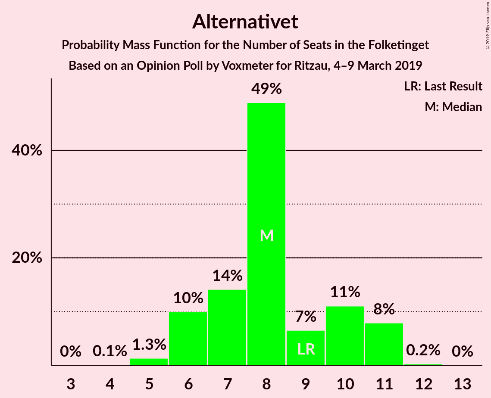
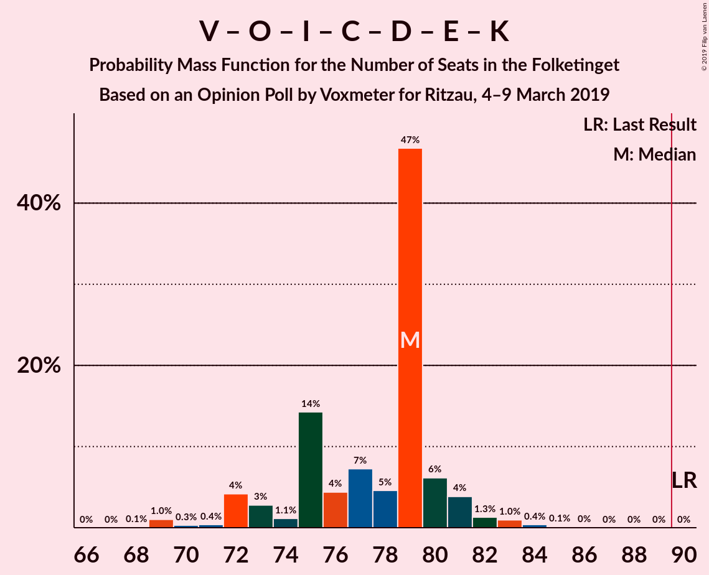
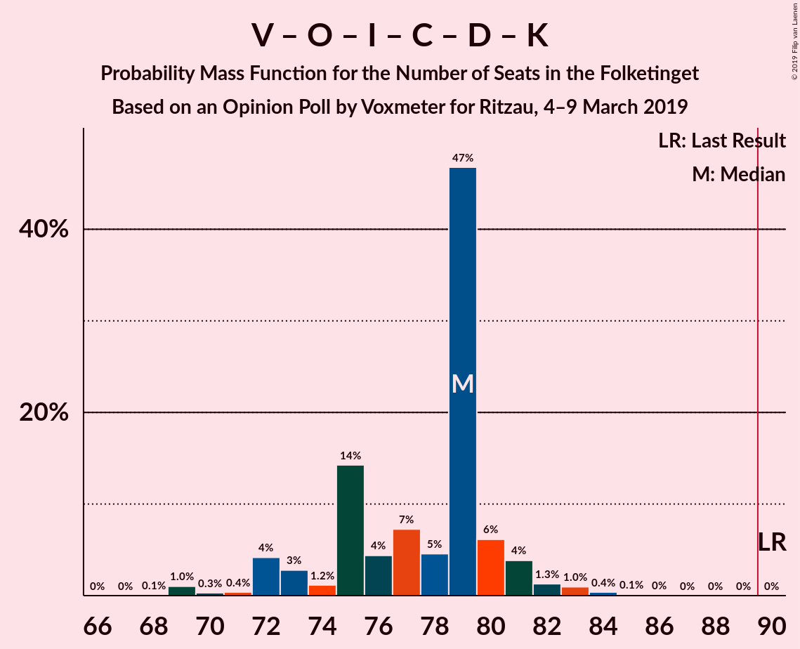

# Opinion Poll by Voxmeter for Ritzau, 4–9 March 2019

<a href="#voting-intentions">Voting Intentions</a> | <a href="#seats">Seats</a> | <a href="#coalitions">Coalitions</a> | <a href="#technical-information">Technical Information</a>

## Voting Intentions

### Confidence Intervals

| Party | Last Result | Poll Result | 80% Confidence Interval | 90% Confidence Interval | 95% Confidence Interval | 99% Confidence Interval |
|:-----:|:-----------:|:-----------:|:-----------------------:|:-----------------------:|:-----------------------:|:-----------------------:|
| Socialdemokraterne | 26.3% | 28.6% | 26.9–30.5% |26.4–31.0% |26.0–31.5% |25.1–32.4% |
| Venstre | 19.5% | 18.6% | 17.1–20.2% |16.7–20.7% |16.4–21.1% |15.7–21.9% |
| Dansk Folkeparti | 21.1% | 14.2% | 12.9–15.7% |12.5–16.1% |12.2–16.4% |11.6–17.2% |
| Enhedslisten–De Rød-Grønne | 7.8% | 9.0% | 7.9–10.2% |7.6–10.6% |7.4–10.9% |6.9–11.5% |
| Radikale Venstre | 4.6% | 7.2% | 6.3–8.4% |6.0–8.7% |5.8–9.0% |5.4–9.6% |
| Socialistisk Folkeparti | 4.2% | 5.7% | 4.9–6.7% |4.6–7.0% |4.4–7.3% |4.1–7.8% |
| Liberal Alliance | 7.5% | 5.3% | 4.5–6.3% |4.3–6.6% |4.1–6.8% |3.7–7.4% |
| Alternativet | 4.8% | 4.3% | 3.6–5.3% |3.4–5.5% |3.3–5.8% |2.9–6.2% |
| Det Konservative Folkeparti | 3.4% | 3.8% | 3.1–4.6% |2.9–4.9% |2.8–5.1% |2.5–5.6% |
| Nye Borgerlige | 0.0% | 1.7% | 1.3–2.4% |1.2–2.6% |1.1–2.7% |0.9–3.1% |
| Klaus Riskær Pedersen | 0.0% | 0.5% | 0.3–0.9% |0.2–1.0% |0.2–1.1% |0.1–1.4% |
| Kristendemokraterne | 0.8% | 0.4% | 0.2–0.8% |0.2–0.9% |0.2–1.0% |0.1–1.2% |

*Note:* The poll result column reflects the actual value used in the calculations. Published results may vary slightly, and in addition be rounded to fewer digits.

## Seats

### Confidence Intervals

| Party | Last Result | Median | 80% Confidence Interval | 90% Confidence Interval | 95% Confidence Interval | 99% Confidence Interval |
|:-----:|:-----------:|:------:|:-----------------------:|:-----------------------:|:-----------------------:|:-----------------------:|
| <a href="#socialdemokraterne">Socialdemokraterne</a> | 47 | 51 | 46–54 |46–56 |44–56 |44–56 |
| <a href="#venstre">Venstre</a> | 34 | 34 | 29–35 |29–38 |29–38 |28–38 |
| <a href="#dansk-folkeparti">Dansk Folkeparti</a> | 37 | 25 | 23–29 |23–29 |23–29 |21–29 |
| <a href="#enhedslisten–de-rød-grønne">Enhedslisten–De Rød-Grønne</a> | 14 | 17 | 15–17 |14–17 |14–17 |12–20 |
| <a href="#radikale-venstre">Radikale Venstre</a> | 8 | 14 | 11–15 |11–16 |10–16 |10–16 |
| <a href="#socialistisk-folkeparti">Socialistisk Folkeparti</a> | 7 | 10 | 8–13 |8–13 |8–13 |7–14 |
| <a href="#liberal-alliance">Liberal Alliance</a> | 13 | 10 | 9–12 |8–13 |8–13 |8–13 |
| <a href="#alternativet">Alternativet</a> | 9 | 7 | 6–10 |6–11 |6–11 |5–11 |
| <a href="#det-konservative-folkeparti">Det Konservative Folkeparti</a> | 6 | 8 | 4–9 |4–10 |4–10 |4–10 |
| <a href="#nye-borgerlige">Nye Borgerlige</a> | 0 | 0 | 0–4 |0–4 |0–6 |0–6 |
| <a href="#klaus-riskær-pedersen">Klaus Riskær Pedersen</a> | 0 | 0 | 0 |0 |0 |0 |
| <a href="#kristendemokraterne">Kristendemokraterne</a> | 0 | 0 | 0 |0 |0 |0 |

### Socialdemokraterne

*For a full overview of the results for this party, see the [Socialdemokraterne](party-socialdemokraterne.html) page.*

| Number of Seats | Probability | Accumulated | Special Marks |
|:---------------:|:-----------:|:-----------:|:-------------:|
| 44 | 4% | 100% |  |
| 45 | 0.7% | 96% |  |
| 46 | 23% | 96% |  |
| 47 | 4% | 72% | Last Result |
| 48 | 4% | 68% |  |
| 49 | 0.4% | 64% |  |
| 50 | 5% | 64% |  |
| 51 | 30% | 59% | Median |
| 52 | 3% | 29% |  |
| 53 | 3% | 25% |  |
| 54 | 14% | 23% |  |
| 55 | 0.4% | 9% |  |
| 56 | 8% | 9% |  |
| 57 | 0.2% | 0.3% |  |
| 58 | 0% | 0.1% |  |
| 59 | 0.1% | 0.1% |  |
| 60 | 0% | 0% |  |

### Venstre

*For a full overview of the results for this party, see the [Venstre](party-venstre.html) page.*

| Number of Seats | Probability | Accumulated | Special Marks |
|:---------------:|:-----------:|:-----------:|:-------------:|
| 26 | 0.1% | 100% |  |
| 27 | 0% | 99.9% |  |
| 28 | 0.5% | 99.9% |  |
| 29 | 10% | 99.4% |  |
| 30 | 17% | 90% |  |
| 31 | 5% | 73% |  |
| 32 | 13% | 68% |  |
| 33 | 1.2% | 54% |  |
| 34 | 42% | 53% | Last Result, Median |
| 35 | 2% | 11% |  |
| 36 | 0.5% | 10% |  |
| 37 | 0.7% | 9% |  |
| 38 | 8% | 8% |  |
| 39 | 0.1% | 0.5% |  |
| 40 | 0% | 0.4% |  |
| 41 | 0.2% | 0.4% |  |
| 42 | 0.2% | 0.2% |  |
| 43 | 0% | 0% |  |

### Dansk Folkeparti

*For a full overview of the results for this party, see the [Dansk Folkeparti](party-danskfolkeparti.html) page.*

| Number of Seats | Probability | Accumulated | Special Marks |
|:---------------:|:-----------:|:-----------:|:-------------:|
| 19 | 0.1% | 100% |  |
| 20 | 0.2% | 99.9% |  |
| 21 | 0.2% | 99.7% |  |
| 22 | 0.9% | 99.4% |  |
| 23 | 15% | 98.5% |  |
| 24 | 6% | 84% |  |
| 25 | 31% | 77% | Median |
| 26 | 16% | 46% |  |
| 27 | 13% | 31% |  |
| 28 | 2% | 17% |  |
| 29 | 15% | 15% |  |
| 30 | 0.1% | 0.2% |  |
| 31 | 0.1% | 0.1% |  |
| 32 | 0% | 0% |  |
| 33 | 0% | 0% |  |
| 34 | 0% | 0% |  |
| 35 | 0% | 0% |  |
| 36 | 0% | 0% |  |
| 37 | 0% | 0% | Last Result |

### Enhedslisten–De Rød-Grønne

*For a full overview of the results for this party, see the [Enhedslisten–De Rød-Grønne](party-enhedslisten–derød-grønne.html) page.*

| Number of Seats | Probability | Accumulated | Special Marks |
|:---------------:|:-----------:|:-----------:|:-------------:|
| 11 | 0.1% | 100% |  |
| 12 | 0.9% | 99.9% |  |
| 13 | 0.3% | 99.0% |  |
| 14 | 4% | 98.6% | Last Result |
| 15 | 29% | 95% |  |
| 16 | 15% | 66% |  |
| 17 | 49% | 51% | Median |
| 18 | 1.3% | 2% |  |
| 19 | 0.5% | 1.1% |  |
| 20 | 0.5% | 0.6% |  |
| 21 | 0% | 0.1% |  |
| 22 | 0% | 0.1% |  |
| 23 | 0% | 0% |  |

### Radikale Venstre

*For a full overview of the results for this party, see the [Radikale Venstre](party-radikalevenstre.html) page.*

| Number of Seats | Probability | Accumulated | Special Marks |
|:---------------:|:-----------:|:-----------:|:-------------:|
| 8 | 0% | 100% | Last Result |
| 9 | 0.1% | 100% |  |
| 10 | 3% | 99.9% |  |
| 11 | 8% | 97% |  |
| 12 | 14% | 89% |  |
| 13 | 22% | 75% |  |
| 14 | 21% | 53% | Median |
| 15 | 22% | 32% |  |
| 16 | 9% | 9% |  |
| 17 | 0.1% | 0.2% |  |
| 18 | 0.1% | 0.1% |  |
| 19 | 0% | 0% |  |

### Socialistisk Folkeparti

*For a full overview of the results for this party, see the [Socialistisk Folkeparti](party-socialistiskfolkeparti.html) page.*

| Number of Seats | Probability | Accumulated | Special Marks |
|:---------------:|:-----------:|:-----------:|:-------------:|
| 7 | 0.5% | 100% | Last Result |
| 8 | 14% | 99.4% |  |
| 9 | 12% | 85% |  |
| 10 | 40% | 73% | Median |
| 11 | 5% | 34% |  |
| 12 | 10% | 29% |  |
| 13 | 18% | 19% |  |
| 14 | 2% | 2% |  |
| 15 | 0% | 0% |  |

### Liberal Alliance

*For a full overview of the results for this party, see the [Liberal Alliance](party-liberalalliance.html) page.*

| Number of Seats | Probability | Accumulated | Special Marks |
|:---------------:|:-----------:|:-----------:|:-------------:|
| 6 | 0% | 100% |  |
| 7 | 0.2% | 99.9% |  |
| 8 | 7% | 99.8% |  |
| 9 | 31% | 93% |  |
| 10 | 42% | 62% | Median |
| 11 | 8% | 20% |  |
| 12 | 6% | 12% |  |
| 13 | 6% | 6% | Last Result |
| 14 | 0% | 0% |  |

### Alternativet

*For a full overview of the results for this party, see the [Alternativet](party-alternativet.html) page.*

| Number of Seats | Probability | Accumulated | Special Marks |
|:---------------:|:-----------:|:-----------:|:-------------:|
| 5 | 2% | 100% |  |
| 6 | 24% | 98% |  |
| 7 | 39% | 74% | Median |
| 8 | 13% | 35% |  |
| 9 | 4% | 22% | Last Result |
| 10 | 8% | 18% |  |
| 11 | 9% | 10% |  |
| 12 | 0.1% | 0.1% |  |
| 13 | 0% | 0% |  |

### Det Konservative Folkeparti

*For a full overview of the results for this party, see the [Det Konservative Folkeparti](party-detkonservativefolkeparti.html) page.*

| Number of Seats | Probability | Accumulated | Special Marks |
|:---------------:|:-----------:|:-----------:|:-------------:|
| 4 | 11% | 100% |  |
| 5 | 6% | 89% |  |
| 6 | 14% | 83% | Last Result |
| 7 | 14% | 69% |  |
| 8 | 29% | 55% | Median |
| 9 | 21% | 27% |  |
| 10 | 5% | 6% |  |
| 11 | 0.5% | 0.5% |  |
| 12 | 0% | 0% |  |

### Nye Borgerlige

*For a full overview of the results for this party, see the [Nye Borgerlige](party-nyeborgerlige.html) page.*

| Number of Seats | Probability | Accumulated | Special Marks |
|:---------------:|:-----------:|:-----------:|:-------------:|
| 0 | 64% | 100% | Last Result, Median |
| 1 | 0% | 36% |  |
| 2 | 0% | 36% |  |
| 3 | 0% | 36% |  |
| 4 | 31% | 36% |  |
| 5 | 0.7% | 5% |  |
| 6 | 4% | 4% |  |
| 7 | 0% | 0% |  |

### Klaus Riskær Pedersen

*For a full overview of the results for this party, see the [Klaus Riskær Pedersen](party-klausriskærpedersen.html) page.*

| Number of Seats | Probability | Accumulated | Special Marks |
|:---------------:|:-----------:|:-----------:|:-------------:|
| 0 | 100% | 100% | Last Result, Median |

### Kristendemokraterne

*For a full overview of the results for this party, see the [Kristendemokraterne](party-kristendemokraterne.html) page.*

| Number of Seats | Probability | Accumulated | Special Marks |
|:---------------:|:-----------:|:-----------:|:-------------:|
| 0 | 100% | 100% | Last Result, Median |

## Coalitions

### Confidence Intervals

| Coalition | Last Result | Median | Majority? | 80% Confidence Interval | 90% Confidence Interval | 95% Confidence Interval | 99% Confidence Interval |
|:---------:|:-----------:|:------:|:---------:|:-----------------------:|:-----------------------:|:-----------------------:|:-----------------------:|
| Socialdemokraterne – Enhedslisten–De Rød-Grønne – Radikale Venstre – Socialistisk Folkeparti – Alternativet | 85 | 98 | 99.8% | 94–100 | 94–102 | 94–102 | 91–106 |
| Socialdemokraterne – Enhedslisten–De Rød-Grønne – Radikale Venstre – Socialistisk Folkeparti | 76 | 90 | 65% | 87–94 | 85–95 | 84–95 | 84–97 |
| Socialdemokraterne – Enhedslisten–De Rød-Grønne – Socialistisk Folkeparti – Alternativet | 77 | 85 | 2% | 80–88 | 80–88 | 80–89 | 78–92 |
| Venstre – Dansk Folkeparti – Liberal Alliance – Det Konservative Folkeparti – Nye Borgerlige – Klaus Riskær Pedersen – Kristendemokraterne | 90 | 77 | 0% | 75–81 | 73–81 | 73–81 | 69–84 |
| Venstre – Dansk Folkeparti – Liberal Alliance – Det Konservative Folkeparti – Nye Borgerlige – Klaus Riskær Pedersen | 90 | 77 | 0% | 75–81 | 73–81 | 73–81 | 69–84 |
| Venstre – Dansk Folkeparti – Liberal Alliance – Det Konservative Folkeparti – Nye Borgerlige – Kristendemokraterne | 90 | 77 | 0% | 75–81 | 73–81 | 73–81 | 69–84 |
| Venstre – Dansk Folkeparti – Liberal Alliance – Det Konservative Folkeparti – Nye Borgerlige | 90 | 77 | 0% | 75–81 | 73–81 | 73–81 | 69–84 |
| Venstre – Dansk Folkeparti – Liberal Alliance – Det Konservative Folkeparti – Kristendemokraterne | 90 | 75 | 0% | 71–81 | 71–81 | 71–81 | 69–81 |
| Venstre – Dansk Folkeparti – Liberal Alliance – Det Konservative Folkeparti | 90 | 75 | 0% | 71–81 | 71–81 | 71–81 | 69–81 |
| Socialdemokraterne – Enhedslisten–De Rød-Grønne – Socialistisk Folkeparti | 68 | 77 | 0% | 73–80 | 72–81 | 71–81 | 71–83 |
| Socialdemokraterne – Radikale Venstre – Socialistisk Folkeparti | 62 | 74 | 0% | 70–78 | 69–80 | 68–80 | 68–82 |
| Socialdemokraterne – Radikale Venstre | 55 | 63 | 0% | 60–69 | 58–70 | 58–70 | 57–70 |
| Venstre – Liberal Alliance – Det Konservative Folkeparti | 53 | 52 | 0% | 45–52 | 45–54 | 45–56 | 45–56 |
| Venstre – Det Konservative Folkeparti | 40 | 42 | 0% | 36–43 | 36–44 | 35–45 | 35–45 |
| Venstre | 34 | 34 | 0% | 29–35 | 29–38 | 29–38 | 28–38 |

### Socialdemokraterne – Enhedslisten–De Rød-Grønne – Radikale Venstre – Socialistisk Folkeparti – Alternativet

| Number of Seats | Probability | Accumulated | Special Marks |
|:---------------:|:-----------:|:-----------:|:-------------:|
| 85 | 0% | 100% | Last Result |
| 86 | 0% | 100% |  |
| 87 | 0% | 100% |  |
| 88 | 0% | 100% |  |
| 89 | 0.1% | 100% |  |
| 90 | 0.3% | 99.8% | Majority |
| 91 | 0% | 99.5% |  |
| 92 | 0.1% | 99.5% |  |
| 93 | 0% | 99.4% |  |
| 94 | 18% | 99.4% |  |
| 95 | 5% | 81% |  |
| 96 | 8% | 76% |  |
| 97 | 3% | 68% |  |
| 98 | 32% | 66% |  |
| 99 | 0.4% | 34% | Median |
| 100 | 25% | 33% |  |
| 101 | 0.1% | 8% |  |
| 102 | 5% | 8% |  |
| 103 | 0.3% | 2% |  |
| 104 | 0.4% | 2% |  |
| 105 | 0.1% | 2% |  |
| 106 | 1.4% | 2% |  |
| 107 | 0.1% | 0.1% |  |
| 108 | 0% | 0.1% |  |
| 109 | 0.1% | 0.1% |  |
| 110 | 0% | 0% |  |

### Socialdemokraterne – Enhedslisten–De Rød-Grønne – Radikale Venstre – Socialistisk Folkeparti

| Number of Seats | Probability | Accumulated | Special Marks |
|:---------------:|:-----------:|:-----------:|:-------------:|
| 76 | 0% | 100% | Last Result |
| 77 | 0% | 100% |  |
| 78 | 0% | 100% |  |
| 79 | 0% | 100% |  |
| 80 | 0% | 100% |  |
| 81 | 0% | 100% |  |
| 82 | 0.3% | 99.9% |  |
| 83 | 0% | 99.6% |  |
| 84 | 4% | 99.6% |  |
| 85 | 4% | 95% |  |
| 86 | 0.3% | 92% |  |
| 87 | 13% | 91% |  |
| 88 | 4% | 79% |  |
| 89 | 10% | 74% |  |
| 90 | 15% | 65% | Majority |
| 91 | 24% | 50% |  |
| 92 | 4% | 25% | Median |
| 93 | 0.1% | 21% |  |
| 94 | 14% | 21% |  |
| 95 | 5% | 7% |  |
| 96 | 0% | 2% |  |
| 97 | 2% | 2% |  |
| 98 | 0.1% | 0.1% |  |
| 99 | 0% | 0% |  |

### Socialdemokraterne – Enhedslisten–De Rød-Grønne – Socialistisk Folkeparti – Alternativet

| Number of Seats | Probability | Accumulated | Special Marks |
|:---------------:|:-----------:|:-----------:|:-------------:|
| 77 | 0.2% | 100% | Last Result |
| 78 | 0.3% | 99.8% |  |
| 79 | 0% | 99.5% |  |
| 80 | 11% | 99.4% |  |
| 81 | 12% | 89% |  |
| 82 | 9% | 77% |  |
| 83 | 9% | 68% |  |
| 84 | 0.3% | 59% |  |
| 85 | 36% | 59% | Median |
| 86 | 0.6% | 22% |  |
| 87 | 0.7% | 21% |  |
| 88 | 18% | 21% |  |
| 89 | 0.9% | 3% |  |
| 90 | 0.2% | 2% | Majority |
| 91 | 0% | 2% |  |
| 92 | 1.4% | 2% |  |
| 93 | 0% | 0.4% |  |
| 94 | 0.3% | 0.4% |  |
| 95 | 0% | 0% |  |

### Venstre – Dansk Folkeparti – Liberal Alliance – Det Konservative Folkeparti – Nye Borgerlige – Klaus Riskær Pedersen – Kristendemokraterne

| Number of Seats | Probability | Accumulated | Special Marks |
|:---------------:|:-----------:|:-----------:|:-------------:|
| 66 | 0.1% | 100% |  |
| 67 | 0% | 99.9% |  |
| 68 | 0.1% | 99.9% |  |
| 69 | 1.4% | 99.9% |  |
| 70 | 0.1% | 98% |  |
| 71 | 0.4% | 98% |  |
| 72 | 0.3% | 98% |  |
| 73 | 5% | 98% |  |
| 74 | 0.1% | 92% |  |
| 75 | 25% | 92% |  |
| 76 | 0.4% | 67% |  |
| 77 | 32% | 66% | Median |
| 78 | 3% | 34% |  |
| 79 | 8% | 32% |  |
| 80 | 5% | 24% |  |
| 81 | 18% | 19% |  |
| 82 | 0% | 0.6% |  |
| 83 | 0.1% | 0.6% |  |
| 84 | 0% | 0.5% |  |
| 85 | 0.3% | 0.5% |  |
| 86 | 0.1% | 0.2% |  |
| 87 | 0% | 0% |  |
| 88 | 0% | 0% |  |
| 89 | 0% | 0% |  |
| 90 | 0% | 0% | Last Result, Majority |

### Venstre – Dansk Folkeparti – Liberal Alliance – Det Konservative Folkeparti – Nye Borgerlige – Klaus Riskær Pedersen

| Number of Seats | Probability | Accumulated | Special Marks |
|:---------------:|:-----------:|:-----------:|:-------------:|
| 66 | 0.1% | 100% |  |
| 67 | 0% | 99.9% |  |
| 68 | 0.1% | 99.9% |  |
| 69 | 1.4% | 99.9% |  |
| 70 | 0.1% | 98% |  |
| 71 | 0.4% | 98% |  |
| 72 | 0.3% | 98% |  |
| 73 | 5% | 98% |  |
| 74 | 0.1% | 92% |  |
| 75 | 25% | 92% |  |
| 76 | 0.4% | 67% |  |
| 77 | 32% | 66% | Median |
| 78 | 3% | 34% |  |
| 79 | 8% | 32% |  |
| 80 | 5% | 24% |  |
| 81 | 18% | 19% |  |
| 82 | 0% | 0.6% |  |
| 83 | 0.1% | 0.6% |  |
| 84 | 0% | 0.5% |  |
| 85 | 0.3% | 0.5% |  |
| 86 | 0.1% | 0.2% |  |
| 87 | 0% | 0% |  |
| 88 | 0% | 0% |  |
| 89 | 0% | 0% |  |
| 90 | 0% | 0% | Last Result, Majority |

### Venstre – Dansk Folkeparti – Liberal Alliance – Det Konservative Folkeparti – Nye Borgerlige – Kristendemokraterne

| Number of Seats | Probability | Accumulated | Special Marks |
|:---------------:|:-----------:|:-----------:|:-------------:|
| 66 | 0.1% | 100% |  |
| 67 | 0% | 99.9% |  |
| 68 | 0.1% | 99.9% |  |
| 69 | 1.4% | 99.9% |  |
| 70 | 0.1% | 98% |  |
| 71 | 0.4% | 98% |  |
| 72 | 0.3% | 98% |  |
| 73 | 5% | 98% |  |
| 74 | 0.1% | 92% |  |
| 75 | 25% | 92% |  |
| 76 | 0.4% | 67% |  |
| 77 | 32% | 66% | Median |
| 78 | 3% | 34% |  |
| 79 | 8% | 32% |  |
| 80 | 5% | 24% |  |
| 81 | 18% | 19% |  |
| 82 | 0% | 0.6% |  |
| 83 | 0.1% | 0.6% |  |
| 84 | 0% | 0.5% |  |
| 85 | 0.3% | 0.5% |  |
| 86 | 0.1% | 0.2% |  |
| 87 | 0% | 0% |  |
| 88 | 0% | 0% |  |
| 89 | 0% | 0% |  |
| 90 | 0% | 0% | Last Result, Majority |

### Venstre – Dansk Folkeparti – Liberal Alliance – Det Konservative Folkeparti – Nye Borgerlige

| Number of Seats | Probability | Accumulated | Special Marks |
|:---------------:|:-----------:|:-----------:|:-------------:|
| 66 | 0.1% | 100% |  |
| 67 | 0% | 99.9% |  |
| 68 | 0.1% | 99.9% |  |
| 69 | 1.4% | 99.9% |  |
| 70 | 0.1% | 98% |  |
| 71 | 0.4% | 98% |  |
| 72 | 0.3% | 98% |  |
| 73 | 5% | 98% |  |
| 74 | 0.1% | 92% |  |
| 75 | 25% | 92% |  |
| 76 | 0.4% | 67% |  |
| 77 | 32% | 66% | Median |
| 78 | 3% | 34% |  |
| 79 | 8% | 32% |  |
| 80 | 5% | 24% |  |
| 81 | 18% | 19% |  |
| 82 | 0% | 0.6% |  |
| 83 | 0.1% | 0.6% |  |
| 84 | 0% | 0.5% |  |
| 85 | 0.3% | 0.5% |  |
| 86 | 0.1% | 0.2% |  |
| 87 | 0% | 0% |  |
| 88 | 0% | 0% |  |
| 89 | 0% | 0% |  |
| 90 | 0% | 0% | Last Result, Majority |

### Venstre – Dansk Folkeparti – Liberal Alliance – Det Konservative Folkeparti – Kristendemokraterne

| Number of Seats | Probability | Accumulated | Special Marks |
|:---------------:|:-----------:|:-----------:|:-------------:|
| 66 | 0.1% | 100% |  |
| 67 | 0.2% | 99.9% |  |
| 68 | 0.1% | 99.8% |  |
| 69 | 1.5% | 99.7% |  |
| 70 | 0.4% | 98% |  |
| 71 | 10% | 98% |  |
| 72 | 0.6% | 88% |  |
| 73 | 14% | 88% |  |
| 74 | 0.7% | 73% |  |
| 75 | 27% | 73% |  |
| 76 | 0.5% | 45% |  |
| 77 | 27% | 45% | Median |
| 78 | 2% | 18% |  |
| 79 | 0.2% | 16% |  |
| 80 | 4% | 15% |  |
| 81 | 11% | 11% |  |
| 82 | 0.1% | 0.4% |  |
| 83 | 0.1% | 0.3% |  |
| 84 | 0% | 0.3% |  |
| 85 | 0.2% | 0.3% |  |
| 86 | 0% | 0% |  |
| 87 | 0% | 0% |  |
| 88 | 0% | 0% |  |
| 89 | 0% | 0% |  |
| 90 | 0% | 0% | Last Result, Majority |

### Venstre – Dansk Folkeparti – Liberal Alliance – Det Konservative Folkeparti

| Number of Seats | Probability | Accumulated | Special Marks |
|:---------------:|:-----------:|:-----------:|:-------------:|
| 66 | 0.1% | 100% |  |
| 67 | 0.2% | 99.9% |  |
| 68 | 0.1% | 99.8% |  |
| 69 | 1.5% | 99.7% |  |
| 70 | 0.4% | 98% |  |
| 71 | 10% | 98% |  |
| 72 | 0.6% | 88% |  |
| 73 | 14% | 88% |  |
| 74 | 0.7% | 73% |  |
| 75 | 27% | 73% |  |
| 76 | 0.5% | 45% |  |
| 77 | 27% | 45% | Median |
| 78 | 2% | 18% |  |
| 79 | 0.2% | 16% |  |
| 80 | 4% | 15% |  |
| 81 | 11% | 11% |  |
| 82 | 0.1% | 0.4% |  |
| 83 | 0.1% | 0.3% |  |
| 84 | 0% | 0.3% |  |
| 85 | 0.2% | 0.3% |  |
| 86 | 0% | 0% |  |
| 87 | 0% | 0% |  |
| 88 | 0% | 0% |  |
| 89 | 0% | 0% |  |
| 90 | 0% | 0% | Last Result, Majority |

### Socialdemokraterne – Enhedslisten–De Rød-Grønne – Socialistisk Folkeparti

| Number of Seats | Probability | Accumulated | Special Marks |
|:---------------:|:-----------:|:-----------:|:-------------:|
| 68 | 0% | 100% | Last Result |
| 69 | 0.1% | 100% |  |
| 70 | 0.3% | 99.9% |  |
| 71 | 4% | 99.6% |  |
| 72 | 1.3% | 96% |  |
| 73 | 15% | 94% |  |
| 74 | 9% | 79% |  |
| 75 | 6% | 70% |  |
| 76 | 2% | 64% |  |
| 77 | 13% | 62% |  |
| 78 | 21% | 49% | Median |
| 79 | 14% | 27% |  |
| 80 | 4% | 13% |  |
| 81 | 7% | 9% |  |
| 82 | 0.1% | 2% |  |
| 83 | 2% | 2% |  |
| 84 | 0.1% | 0.4% |  |
| 85 | 0.3% | 0.3% |  |
| 86 | 0% | 0% |  |

### Socialdemokraterne – Radikale Venstre – Socialistisk Folkeparti

| Number of Seats | Probability | Accumulated | Special Marks |
|:---------------:|:-----------:|:-----------:|:-------------:|
| 62 | 0% | 100% | Last Result |
| 63 | 0% | 100% |  |
| 64 | 0% | 100% |  |
| 65 | 0% | 100% |  |
| 66 | 0.1% | 100% |  |
| 67 | 0.3% | 99.9% |  |
| 68 | 4% | 99.6% |  |
| 69 | 5% | 95% |  |
| 70 | 1.1% | 91% |  |
| 71 | 4% | 90% |  |
| 72 | 20% | 86% |  |
| 73 | 0.5% | 65% |  |
| 74 | 27% | 65% |  |
| 75 | 10% | 38% | Median |
| 76 | 3% | 28% |  |
| 77 | 14% | 25% |  |
| 78 | 4% | 11% |  |
| 79 | 0.4% | 7% |  |
| 80 | 5% | 7% |  |
| 81 | 0.1% | 2% |  |
| 82 | 1.4% | 2% |  |
| 83 | 0.2% | 0.2% |  |
| 84 | 0% | 0% |  |

### Socialdemokraterne – Radikale Venstre

| Number of Seats | Probability | Accumulated | Special Marks |
|:---------------:|:-----------:|:-----------:|:-------------:|
| 55 | 0% | 100% | Last Result |
| 56 | 0.4% | 100% |  |
| 57 | 0.4% | 99.6% |  |
| 58 | 8% | 99.2% |  |
| 59 | 0.7% | 91% |  |
| 60 | 7% | 91% |  |
| 61 | 11% | 83% |  |
| 62 | 14% | 73% |  |
| 63 | 10% | 58% |  |
| 64 | 21% | 48% |  |
| 65 | 4% | 28% | Median |
| 66 | 0.3% | 24% |  |
| 67 | 1.1% | 24% |  |
| 68 | 2% | 23% |  |
| 69 | 14% | 20% |  |
| 70 | 6% | 6% |  |
| 71 | 0.2% | 0.3% |  |
| 72 | 0% | 0.1% |  |
| 73 | 0% | 0% |  |

### Venstre – Liberal Alliance – Det Konservative Folkeparti

| Number of Seats | Probability | Accumulated | Special Marks |
|:---------------:|:-----------:|:-----------:|:-------------:|
| 43 | 0.1% | 100% |  |
| 44 | 0% | 99.9% |  |
| 45 | 11% | 99.8% |  |
| 46 | 15% | 89% |  |
| 47 | 0.6% | 74% |  |
| 48 | 7% | 73% |  |
| 49 | 4% | 67% |  |
| 50 | 7% | 63% |  |
| 51 | 4% | 56% |  |
| 52 | 42% | 51% | Median |
| 53 | 0.4% | 9% | Last Result |
| 54 | 4% | 9% |  |
| 55 | 0.3% | 5% |  |
| 56 | 4% | 5% |  |
| 57 | 0.2% | 0.2% |  |
| 58 | 0% | 0% |  |

### Venstre – Det Konservative Folkeparti

| Number of Seats | Probability | Accumulated | Special Marks |
|:---------------:|:-----------:|:-----------:|:-------------:|
| 34 | 0.1% | 100% |  |
| 35 | 5% | 99.9% |  |
| 36 | 25% | 95% |  |
| 37 | 6% | 70% |  |
| 38 | 0.4% | 64% |  |
| 39 | 7% | 64% |  |
| 40 | 1.3% | 57% | Last Result |
| 41 | 1.4% | 56% |  |
| 42 | 24% | 55% | Median |
| 43 | 21% | 31% |  |
| 44 | 5% | 10% |  |
| 45 | 4% | 5% |  |
| 46 | 0% | 0.4% |  |
| 47 | 0.2% | 0.4% |  |
| 48 | 0.2% | 0.3% |  |
| 49 | 0% | 0% |  |

### Venstre

| Number of Seats | Probability | Accumulated | Special Marks |
|:---------------:|:-----------:|:-----------:|:-------------:|
| 26 | 0.1% | 100% |  |
| 27 | 0% | 99.9% |  |
| 28 | 0.5% | 99.9% |  |
| 29 | 10% | 99.4% |  |
| 30 | 17% | 90% |  |
| 31 | 5% | 73% |  |
| 32 | 13% | 68% |  |
| 33 | 1.2% | 54% |  |
| 34 | 42% | 53% | Last Result, Median |
| 35 | 2% | 11% |  |
| 36 | 0.5% | 10% |  |
| 37 | 0.7% | 9% |  |
| 38 | 8% | 8% |  |
| 39 | 0.1% | 0.5% |  |
| 40 | 0% | 0.4% |  |
| 41 | 0.2% | 0.4% |  |
| 42 | 0.2% | 0.2% |  |
| 43 | 0% | 0% |  |

## Technical Information

### Opinion Poll

+ **Polling firm:** Voxmeter
+ **Commissioner(s):** Ritzau
+ **Fieldwork period:** 4–9 March 2019

### Calculations

+ **Sample size:** 1037
+ **Simulations done:** 131,072
+ **Error estimate:** 1.34%

