# Opinion Poll by Kantar Gallup for Berlingske, 8–14 March 2019

<a href="#voting-intentions">Voting Intentions</a> | <a href="#seats">Seats</a> | <a href="#coalitions">Coalitions</a> | <a href="#technical-information">Technical Information</a>

## Voting Intentions

### Confidence Intervals

| Party | Last Result | Poll Result | 80% Confidence Interval | 90% Confidence Interval | 95% Confidence Interval | 99% Confidence Interval |
|:-----:|:-----------:|:-----------:|:-----------------------:|:-----------------------:|:-----------------------:|:-----------------------:|
| Socialdemokraterne | 26.3% | 26.0% | 24.6–27.5% |24.2–27.9% |23.9–28.2% |23.3–29.0% |
| Venstre | 19.5% | 19.7% | 18.5–21.0% |18.1–21.4% |17.8–21.8% |17.3–22.4% |
| Dansk Folkeparti | 21.1% | 13.7% | 12.6–14.8% |12.3–15.2% |12.1–15.5% |11.6–16.0% |
| Enhedslisten–De Rød-Grønne | 7.8% | 7.9% | 7.1–8.8% |6.8–9.1% |6.6–9.3% |6.3–9.8% |
| Radikale Venstre | 4.6% | 6.9% | 6.1–7.8% |5.9–8.0% |5.7–8.2% |5.4–8.7% |
| Socialistisk Folkeparti | 4.2% | 6.7% | 5.9–7.6% |5.7–7.8% |5.5–8.0% |5.2–8.5% |
| Liberal Alliance | 7.5% | 5.4% | 4.8–6.2% |4.6–6.4% |4.4–6.6% |4.1–7.1% |
| Det Konservative Folkeparti | 3.4% | 5.2% | 4.6–6.0% |4.4–6.2% |4.2–6.4% |3.9–6.8% |
| Alternativet | 4.8% | 3.7% | 3.2–4.4% |3.0–4.6% |2.9–4.8% |2.7–5.1% |
| Nye Borgerlige | 0.0% | 2.6% | 2.1–3.2% |2.0–3.3% |1.9–3.5% |1.7–3.8% |
| Klaus Riskær Pedersen | 0.0% | 1.3% | 1.0–1.8% |0.9–1.9% |0.9–2.0% |0.7–2.3% |
| Kristendemokraterne | 0.8% | 0.9% | 0.6–1.3% |0.6–1.4% |0.5–1.5% |0.4–1.7% |

*Note:* The poll result column reflects the actual value used in the calculations. Published results may vary slightly, and in addition be rounded to fewer digits.

## Seats

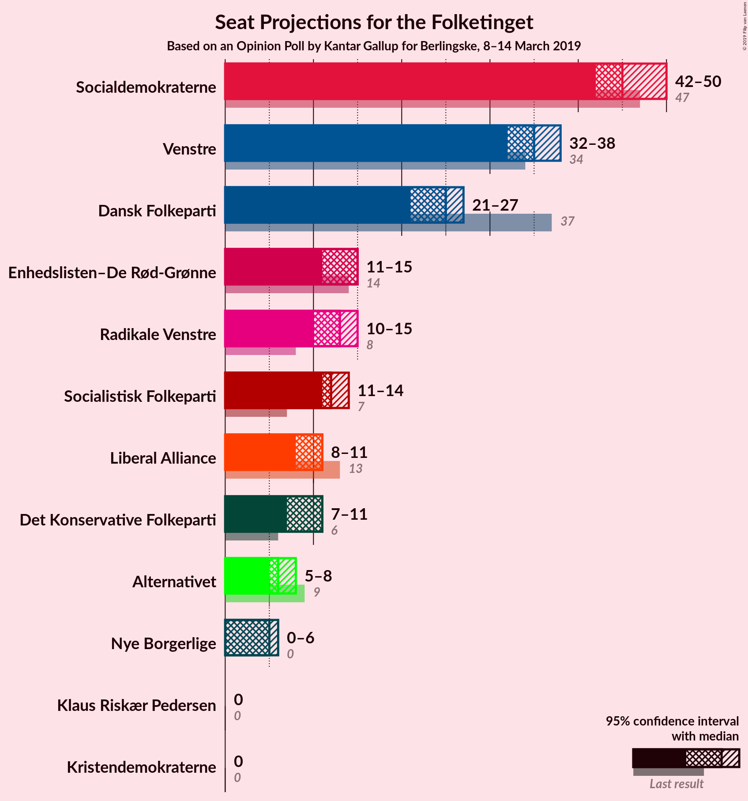

### Confidence Intervals

| Party | Last Result | Median | 80% Confidence Interval | 90% Confidence Interval | 95% Confidence Interval | 99% Confidence Interval |
|:-----:|:-----------:|:------:|:-----------------------:|:-----------------------:|:-----------------------:|:-----------------------:|
| <a href="#socialdemokraterne">Socialdemokraterne</a> | 47 | 45 | 45–48 |45–48 |45–48 |43–49 |
| <a href="#venstre">Venstre</a> | 34 | 35 | 33–35 |32–36 |32–36 |32–38 |
| <a href="#dansk-folkeparti">Dansk Folkeparti</a> | 37 | 27 | 26–27 |21–27 |21–27 |21–27 |
| <a href="#enhedslisten–de-rød-grønne">Enhedslisten–De Rød-Grønne</a> | 14 | 15 | 12–15 |12–15 |12–15 |12–16 |
| <a href="#radikale-venstre">Radikale Venstre</a> | 8 | 14 | 12–14 |12–15 |12–15 |10–15 |
| <a href="#socialistisk-folkeparti">Socialistisk Folkeparti</a> | 7 | 11 | 11–13 |11–14 |11–16 |11–16 |
| <a href="#liberal-alliance">Liberal Alliance</a> | 13 | 11 | 11 |9–11 |9–11 |8–11 |
| <a href="#det-konservative-folkeparti">Det Konservative Folkeparti</a> | 6 | 11 | 10–11 |9–11 |9–11 |8–11 |
| <a href="#alternativet">Alternativet</a> | 9 | 6 | 6–7 |5–7 |5–7 |5–9 |
| <a href="#nye-borgerlige">Nye Borgerlige</a> | 0 | 0 | 0–5 |0–6 |0–6 |0–7 |
| <a href="#klaus-riskær-pedersen">Klaus Riskær Pedersen</a> | 0 | 0 | 0 |0 |0 |0 |
| <a href="#kristendemokraterne">Kristendemokraterne</a> | 0 | 0 | 0 |0 |0 |0 |

### Socialdemokraterne

*For a full overview of the results for this party, see the [Socialdemokraterne](party-socialdemokraterne.html) page.*

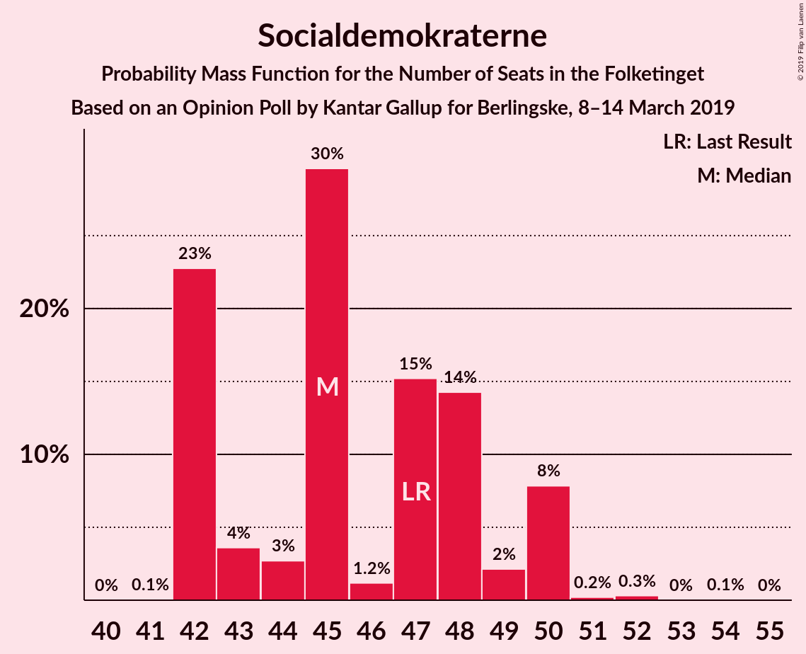

| Number of Seats | Probability | Accumulated | Special Marks |
|:---------------:|:-----------:|:-----------:|:-------------:|
| 42 | 0.1% | 100% |  |
| 43 | 0.9% | 99.9% |  |
| 44 | 0% | 99.0% |  |
| 45 | 76% | 99.0% | Median |
| 46 | 0.1% | 23% |  |
| 47 | 6% | 23% | Last Result |
| 48 | 17% | 17% |  |
| 49 | 0.3% | 0.8% |  |
| 50 | 0% | 0.5% |  |
| 51 | 0.1% | 0.4% |  |
| 52 | 0.3% | 0.3% |  |
| 53 | 0% | 0% |  |

### Venstre

*For a full overview of the results for this party, see the [Venstre](party-venstre.html) page.*

| Number of Seats | Probability | Accumulated | Special Marks |
|:---------------:|:-----------:|:-----------:|:-------------:|
| 31 | 0.1% | 100% |  |
| 32 | 5% | 99.9% |  |
| 33 | 17% | 95% |  |
| 34 | 0.2% | 77% | Last Result |
| 35 | 70% | 77% | Median |
| 36 | 6% | 7% |  |
| 37 | 0.8% | 2% |  |
| 38 | 0.7% | 0.8% |  |
| 39 | 0.1% | 0.2% |  |
| 40 | 0.1% | 0.1% |  |
| 41 | 0% | 0% |  |

### Dansk Folkeparti

*For a full overview of the results for this party, see the [Dansk Folkeparti](party-danskfolkeparti.html) page.*

| Number of Seats | Probability | Accumulated | Special Marks |
|:---------------:|:-----------:|:-----------:|:-------------:|
| 19 | 0.2% | 100% |  |
| 20 | 0% | 99.8% |  |
| 21 | 6% | 99.8% |  |
| 22 | 0.1% | 94% |  |
| 23 | 0.1% | 94% |  |
| 24 | 0.4% | 94% |  |
| 25 | 0.6% | 94% |  |
| 26 | 22% | 93% |  |
| 27 | 71% | 71% | Median |
| 28 | 0% | 0.1% |  |
| 29 | 0% | 0% |  |
| 30 | 0% | 0% |  |
| 31 | 0% | 0% |  |
| 32 | 0% | 0% |  |
| 33 | 0% | 0% |  |
| 34 | 0% | 0% |  |
| 35 | 0% | 0% |  |
| 36 | 0% | 0% |  |
| 37 | 0% | 0% | Last Result |

### Enhedslisten–De Rød-Grønne

*For a full overview of the results for this party, see the [Enhedslisten–De Rød-Grønne](party-enhedslisten–derød-grønne.html) page.*

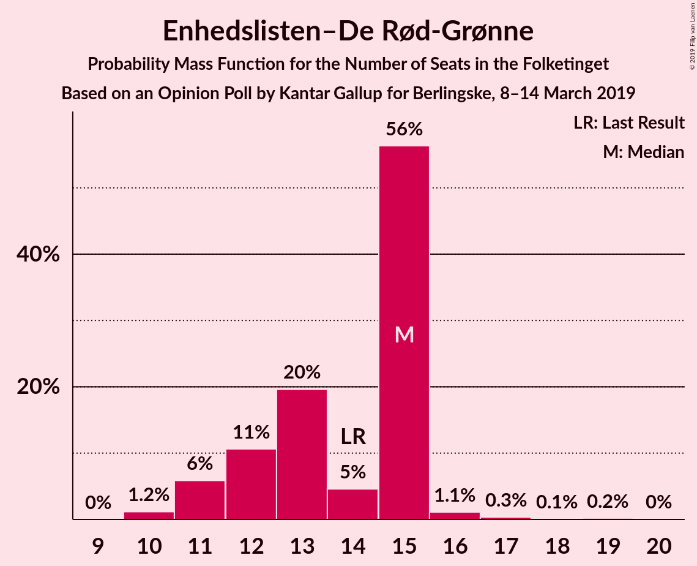

| Number of Seats | Probability | Accumulated | Special Marks |
|:---------------:|:-----------:|:-----------:|:-------------:|
| 11 | 0.1% | 100% |  |
| 12 | 22% | 99.9% |  |
| 13 | 0.8% | 78% |  |
| 14 | 6% | 78% | Last Result |
| 15 | 71% | 71% | Median |
| 16 | 0% | 0.5% |  |
| 17 | 0.1% | 0.5% |  |
| 18 | 0% | 0.4% |  |
| 19 | 0.4% | 0.4% |  |
| 20 | 0% | 0% |  |

### Radikale Venstre

*For a full overview of the results for this party, see the [Radikale Venstre](party-radikalevenstre.html) page.*

| Number of Seats | Probability | Accumulated | Special Marks |
|:---------------:|:-----------:|:-----------:|:-------------:|
| 8 | 0% | 100% | Last Result |
| 9 | 0% | 100% |  |
| 10 | 0.9% | 100% |  |
| 11 | 1.4% | 99.1% |  |
| 12 | 17% | 98% |  |
| 13 | 6% | 81% |  |
| 14 | 70% | 75% | Median |
| 15 | 5% | 5% |  |
| 16 | 0% | 0% |  |

### Socialistisk Folkeparti

*For a full overview of the results for this party, see the [Socialistisk Folkeparti](party-socialistiskfolkeparti.html) page.*

| Number of Seats | Probability | Accumulated | Special Marks |
|:---------------:|:-----------:|:-----------:|:-------------:|
| 7 | 0% | 100% | Last Result |
| 8 | 0% | 100% |  |
| 9 | 0% | 100% |  |
| 10 | 0.1% | 100% |  |
| 11 | 88% | 99.9% | Median |
| 12 | 1.2% | 12% |  |
| 13 | 6% | 11% |  |
| 14 | 0.1% | 5% |  |
| 15 | 0.4% | 5% |  |
| 16 | 5% | 5% |  |
| 17 | 0% | 0% |  |

### Liberal Alliance

*For a full overview of the results for this party, see the [Liberal Alliance](party-liberalalliance.html) page.*

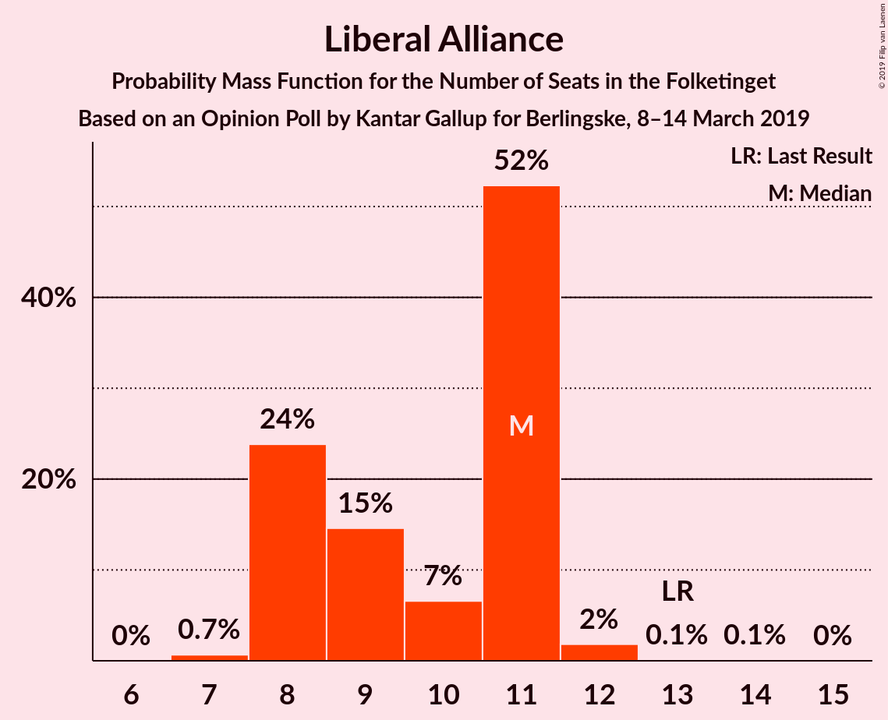

| Number of Seats | Probability | Accumulated | Special Marks |
|:---------------:|:-----------:|:-----------:|:-------------:|
| 7 | 0.1% | 100% |  |
| 8 | 2% | 99.9% |  |
| 9 | 6% | 98% |  |
| 10 | 0.5% | 92% |  |
| 11 | 91% | 91% | Median |
| 12 | 0% | 0.1% |  |
| 13 | 0.1% | 0.1% | Last Result |
| 14 | 0% | 0% |  |

### Det Konservative Folkeparti

*For a full overview of the results for this party, see the [Det Konservative Folkeparti](party-detkonservativefolkeparti.html) page.*

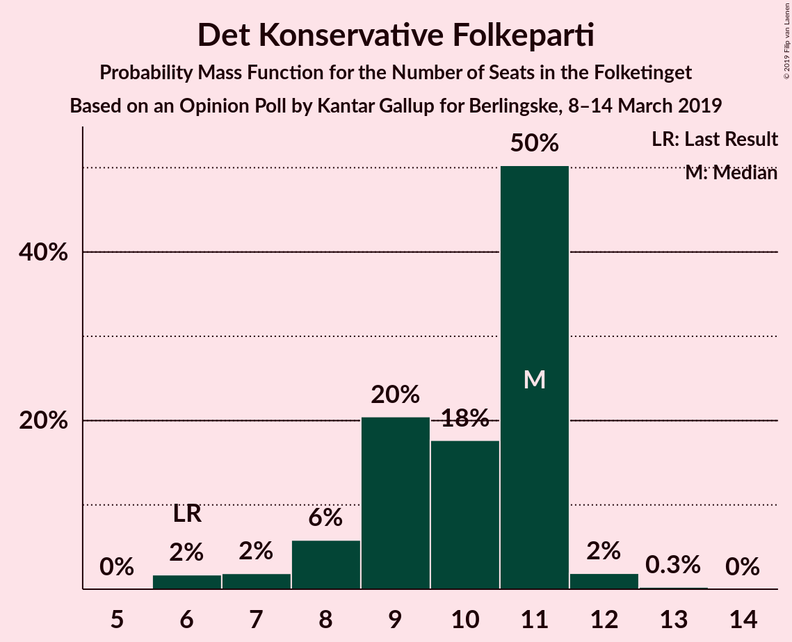

| Number of Seats | Probability | Accumulated | Special Marks |
|:---------------:|:-----------:|:-----------:|:-------------:|
| 6 | 0% | 100% | Last Result |
| 7 | 0% | 100% |  |
| 8 | 0.5% | 99.9% |  |
| 9 | 5% | 99.4% |  |
| 10 | 23% | 94% |  |
| 11 | 71% | 71% | Median |
| 12 | 0.1% | 0.1% |  |
| 13 | 0% | 0% |  |

### Alternativet

*For a full overview of the results for this party, see the [Alternativet](party-alternativet.html) page.*

| Number of Seats | Probability | Accumulated | Special Marks |
|:---------------:|:-----------:|:-----------:|:-------------:|
| 4 | 0.1% | 100% |  |
| 5 | 6% | 99.9% |  |
| 6 | 75% | 94% | Median |
| 7 | 17% | 19% |  |
| 8 | 0.4% | 1.3% |  |
| 9 | 0.9% | 0.9% | Last Result |
| 10 | 0% | 0% |  |

### Nye Borgerlige

*For a full overview of the results for this party, see the [Nye Borgerlige](party-nyeborgerlige.html) page.*

| Number of Seats | Probability | Accumulated | Special Marks |
|:---------------:|:-----------:|:-----------:|:-------------:|
| 0 | 70% | 100% | Last Result, Median |
| 1 | 0% | 30% |  |
| 2 | 0% | 30% |  |
| 3 | 0% | 30% |  |
| 4 | 5% | 30% |  |
| 5 | 17% | 25% |  |
| 6 | 6% | 7% |  |
| 7 | 0.7% | 0.7% |  |
| 8 | 0% | 0% |  |

### Klaus Riskær Pedersen

*For a full overview of the results for this party, see the [Klaus Riskær Pedersen](party-klausriskærpedersen.html) page.*

| Number of Seats | Probability | Accumulated | Special Marks |
|:---------------:|:-----------:|:-----------:|:-------------:|
| 0 | 99.9% | 100% | Last Result, Median |
| 1 | 0% | 0.1% |  |
| 2 | 0% | 0.1% |  |
| 3 | 0% | 0.1% |  |
| 4 | 0.1% | 0.1% |  |
| 5 | 0% | 0% |  |

### Kristendemokraterne

*For a full overview of the results for this party, see the [Kristendemokraterne](party-kristendemokraterne.html) page.*

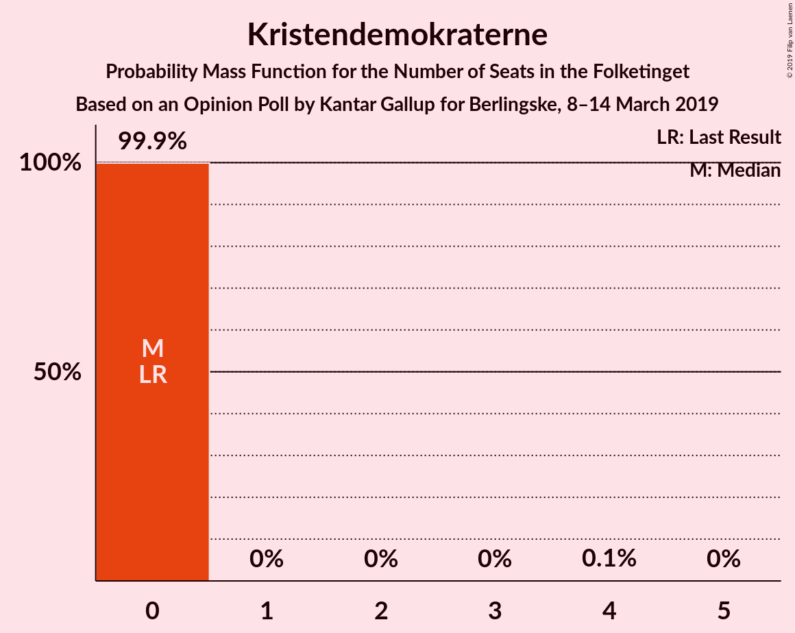

| Number of Seats | Probability | Accumulated | Special Marks |
|:---------------:|:-----------:|:-----------:|:-------------:|
| 0 | 100% | 100% | Last Result, Median |

## Coalitions

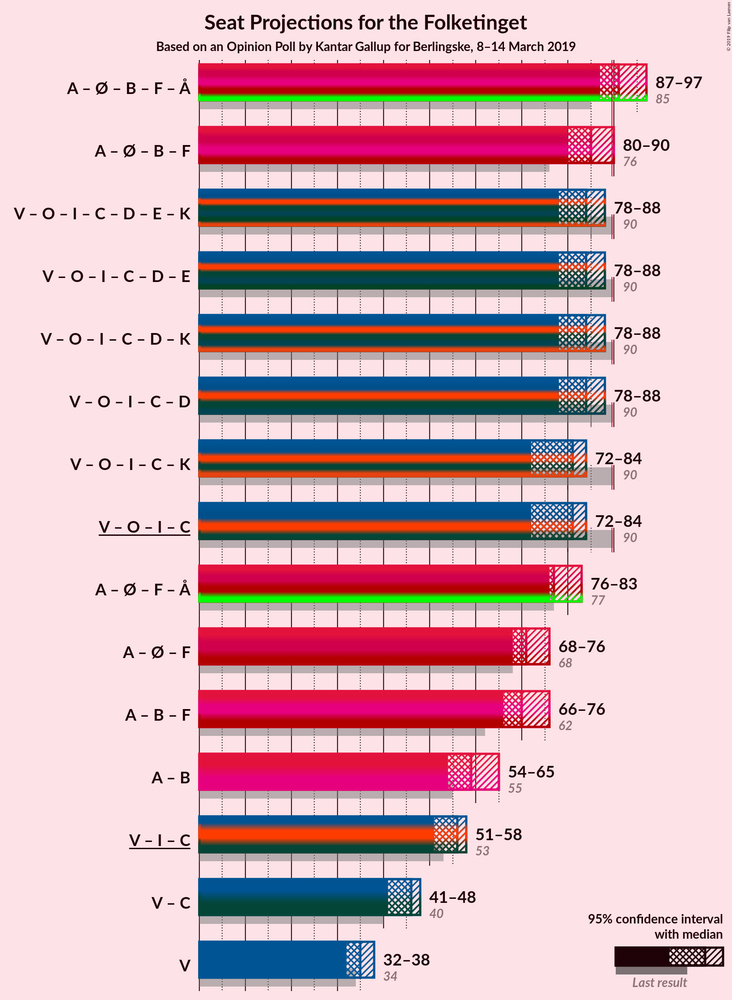

### Confidence Intervals

| Coalition | Last Result | Median | Majority? | 80% Confidence Interval | 90% Confidence Interval | 95% Confidence Interval | 99% Confidence Interval |
|:---------:|:-----------:|:------:|:---------:|:-----------------------:|:-----------------------:|:-----------------------:|:-----------------------:|
| Socialdemokraterne – Enhedslisten–De Rød-Grønne – Radikale Venstre – Socialistisk Folkeparti – Alternativet | 85 | 91 | 98.6% | 90–91 | 90–96 | 90–96 | 86–97 |
| Socialdemokraterne – Enhedslisten–De Rød-Grønne – Radikale Venstre – Socialistisk Folkeparti | 76 | 85 | 5% | 83–85 | 83–90 | 83–90 | 81–90 |
| Venstre – Dansk Folkeparti – Liberal Alliance – Det Konservative Folkeparti – Nye Borgerlige – Klaus Riskær Pedersen – Kristendemokraterne | 90 | 84 | 0% | 84–85 | 79–85 | 79–85 | 78–89 |
| Venstre – Dansk Folkeparti – Liberal Alliance – Det Konservative Folkeparti – Nye Borgerlige – Klaus Riskær Pedersen | 90 | 84 | 0% | 84–85 | 79–85 | 79–85 | 78–89 |
| Venstre – Dansk Folkeparti – Liberal Alliance – Det Konservative Folkeparti – Nye Borgerlige – Kristendemokraterne | 90 | 84 | 0% | 84–85 | 79–85 | 79–85 | 78–89 |
| Venstre – Dansk Folkeparti – Liberal Alliance – Det Konservative Folkeparti – Nye Borgerlige | 90 | 84 | 0% | 84–85 | 79–85 | 79–85 | 78–89 |
| Venstre – Dansk Folkeparti – Liberal Alliance – Det Konservative Folkeparti – Kristendemokraterne | 90 | 84 | 0% | 79–84 | 75–84 | 75–84 | 75–84 |
| Venstre – Dansk Folkeparti – Liberal Alliance – Det Konservative Folkeparti | 90 | 84 | 0% | 79–84 | 75–84 | 75–84 | 75–84 |
| Socialdemokraterne – Enhedslisten–De Rød-Grønne – Socialistisk Folkeparti – Alternativet | 77 | 77 | 0% | 77–78 | 77–81 | 77–81 | 75–86 |
| Socialdemokraterne – Radikale Venstre – Socialistisk Folkeparti | 62 | 70 | 0% | 70–71 | 70–74 | 70–78 | 68–78 |
| Socialdemokraterne – Enhedslisten–De Rød-Grønne – Socialistisk Folkeparti | 68 | 71 | 0% | 71–72 | 71–75 | 71–75 | 69–79 |
| Socialdemokraterne – Radikale Venstre | 55 | 59 | 0% | 59–60 | 58–62 | 58–62 | 56–62 |
| Venstre – Liberal Alliance – Det Konservative Folkeparti | 53 | 57 | 0% | 54–57 | 53–57 | 53–57 | 51–57 |
| Venstre – Det Konservative Folkeparti | 40 | 46 | 0% | 43–46 | 42–46 | 42–46 | 42–48 |
| Venstre | 34 | 35 | 0% | 33–35 | 32–36 | 32–36 | 32–38 |

### Socialdemokraterne – Enhedslisten–De Rød-Grønne – Radikale Venstre – Socialistisk Folkeparti – Alternativet

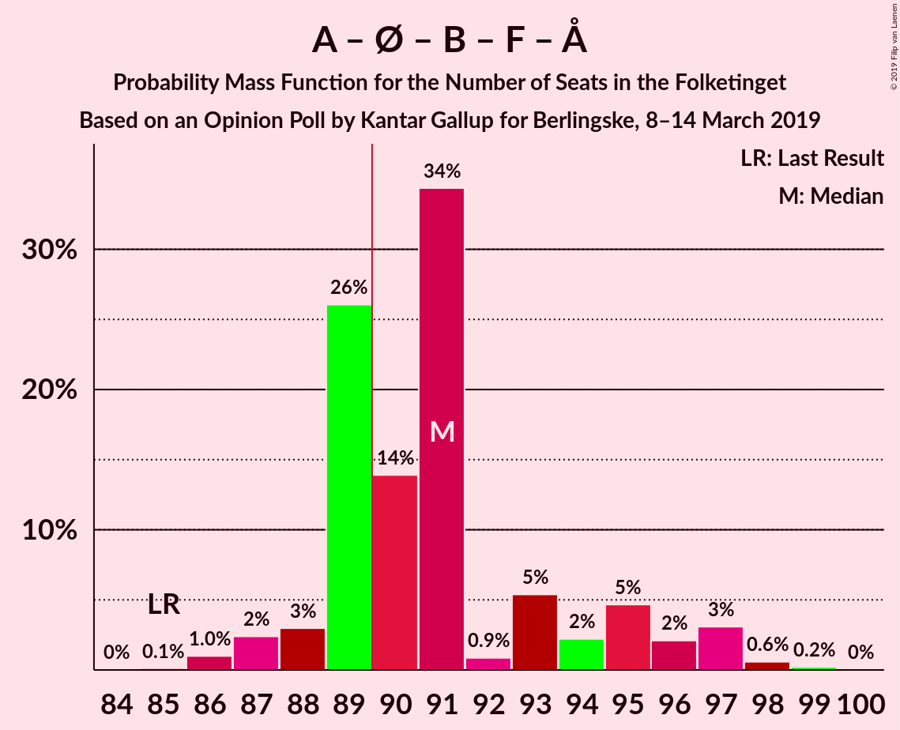

| Number of Seats | Probability | Accumulated | Special Marks |
|:---------------:|:-----------:|:-----------:|:-------------:|
| 85 | 0% | 100% | Last Result |
| 86 | 0.6% | 100% |  |
| 87 | 0.7% | 99.3% |  |
| 88 | 0% | 98.7% |  |
| 89 | 0% | 98.6% |  |
| 90 | 21% | 98.6% | Majority |
| 91 | 71% | 77% | Median |
| 92 | 0% | 7% |  |
| 93 | 0.7% | 7% |  |
| 94 | 0.2% | 6% |  |
| 95 | 0.5% | 6% |  |
| 96 | 5% | 5% |  |
| 97 | 0.2% | 0.6% |  |
| 98 | 0% | 0.4% |  |
| 99 | 0.3% | 0.3% |  |
| 100 | 0% | 0% |  |

### Socialdemokraterne – Enhedslisten–De Rød-Grønne – Radikale Venstre – Socialistisk Folkeparti

| Number of Seats | Probability | Accumulated | Special Marks |
|:---------------:|:-----------:|:-----------:|:-------------:|
| 76 | 0% | 100% | Last Result |
| 77 | 0% | 100% |  |
| 78 | 0% | 100% |  |
| 79 | 0.1% | 100% |  |
| 80 | 0% | 99.9% |  |
| 81 | 0.6% | 99.9% |  |
| 82 | 1.4% | 99.3% |  |
| 83 | 16% | 98% |  |
| 84 | 0.1% | 82% |  |
| 85 | 75% | 81% | Median |
| 86 | 1.0% | 7% |  |
| 87 | 0.4% | 6% |  |
| 88 | 0.1% | 5% |  |
| 89 | 0% | 5% |  |
| 90 | 5% | 5% | Majority |
| 91 | 0% | 0.4% |  |
| 92 | 0% | 0.3% |  |
| 93 | 0.3% | 0.3% |  |
| 94 | 0% | 0% |  |

### Venstre – Dansk Folkeparti – Liberal Alliance – Det Konservative Folkeparti – Nye Borgerlige – Klaus Riskær Pedersen – Kristendemokraterne

| Number of Seats | Probability | Accumulated | Special Marks |
|:---------------:|:-----------:|:-----------:|:-------------:|
| 76 | 0.3% | 100% |  |
| 77 | 0% | 99.7% |  |
| 78 | 0.2% | 99.6% |  |
| 79 | 5% | 99.4% |  |
| 80 | 0.5% | 95% |  |
| 81 | 0.2% | 94% |  |
| 82 | 0.7% | 94% |  |
| 83 | 0% | 93% |  |
| 84 | 71% | 93% | Median |
| 85 | 21% | 23% |  |
| 86 | 0% | 1.4% |  |
| 87 | 0% | 1.4% |  |
| 88 | 0.7% | 1.3% |  |
| 89 | 0.6% | 0.7% |  |
| 90 | 0% | 0% | Last Result, Majority |

### Venstre – Dansk Folkeparti – Liberal Alliance – Det Konservative Folkeparti – Nye Borgerlige – Klaus Riskær Pedersen

| Number of Seats | Probability | Accumulated | Special Marks |
|:---------------:|:-----------:|:-----------:|:-------------:|
| 76 | 0.3% | 100% |  |
| 77 | 0% | 99.7% |  |
| 78 | 0.2% | 99.6% |  |
| 79 | 5% | 99.4% |  |
| 80 | 0.5% | 95% |  |
| 81 | 0.2% | 94% |  |
| 82 | 0.7% | 94% |  |
| 83 | 0% | 93% |  |
| 84 | 71% | 93% | Median |
| 85 | 21% | 23% |  |
| 86 | 0% | 1.4% |  |
| 87 | 0% | 1.4% |  |
| 88 | 0.7% | 1.3% |  |
| 89 | 0.6% | 0.7% |  |
| 90 | 0% | 0% | Last Result, Majority |

### Venstre – Dansk Folkeparti – Liberal Alliance – Det Konservative Folkeparti – Nye Borgerlige – Kristendemokraterne

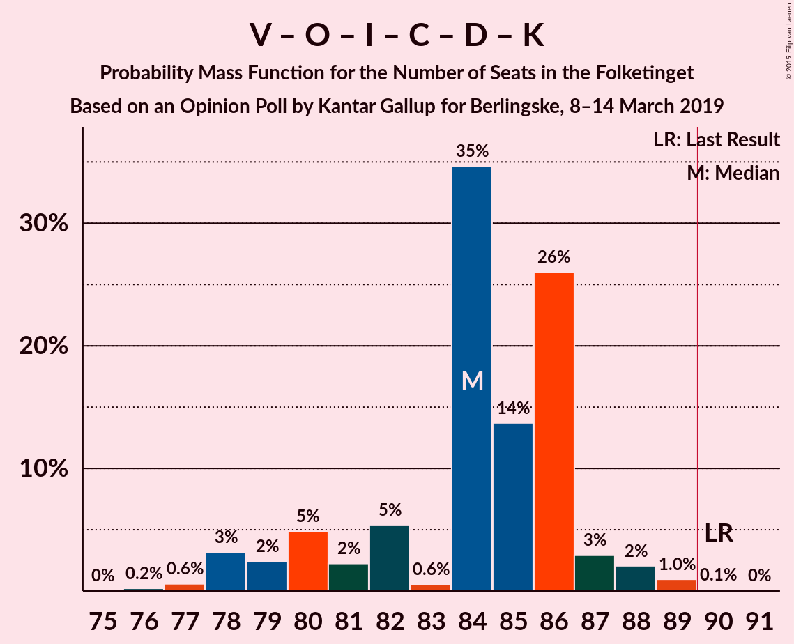

| Number of Seats | Probability | Accumulated | Special Marks |
|:---------------:|:-----------:|:-----------:|:-------------:|
| 76 | 0.3% | 100% |  |
| 77 | 0% | 99.7% |  |
| 78 | 0.2% | 99.6% |  |
| 79 | 5% | 99.4% |  |
| 80 | 0.5% | 95% |  |
| 81 | 0.3% | 94% |  |
| 82 | 0.7% | 94% |  |
| 83 | 0% | 93% |  |
| 84 | 71% | 93% | Median |
| 85 | 21% | 23% |  |
| 86 | 0% | 1.3% |  |
| 87 | 0% | 1.3% |  |
| 88 | 0.7% | 1.3% |  |
| 89 | 0.6% | 0.6% |  |
| 90 | 0% | 0% | Last Result, Majority |

### Venstre – Dansk Folkeparti – Liberal Alliance – Det Konservative Folkeparti – Nye Borgerlige

| Number of Seats | Probability | Accumulated | Special Marks |
|:---------------:|:-----------:|:-----------:|:-------------:|
| 76 | 0.3% | 100% |  |
| 77 | 0% | 99.7% |  |
| 78 | 0.2% | 99.6% |  |
| 79 | 5% | 99.4% |  |
| 80 | 0.5% | 95% |  |
| 81 | 0.3% | 94% |  |
| 82 | 0.7% | 94% |  |
| 83 | 0% | 93% |  |
| 84 | 71% | 93% | Median |
| 85 | 21% | 23% |  |
| 86 | 0% | 1.3% |  |
| 87 | 0% | 1.3% |  |
| 88 | 0.7% | 1.3% |  |
| 89 | 0.6% | 0.6% |  |
| 90 | 0% | 0% | Last Result, Majority |

### Venstre – Dansk Folkeparti – Liberal Alliance – Det Konservative Folkeparti – Kristendemokraterne

| Number of Seats | Probability | Accumulated | Special Marks |
|:---------------:|:-----------:|:-----------:|:-------------:|
| 74 | 0.2% | 100% |  |
| 75 | 5% | 99.7% |  |
| 76 | 0.4% | 95% |  |
| 77 | 0.8% | 95% |  |
| 78 | 1.0% | 94% |  |
| 79 | 5% | 93% |  |
| 80 | 16% | 88% |  |
| 81 | 0.8% | 71% |  |
| 82 | 0% | 70% |  |
| 83 | 0.6% | 70% |  |
| 84 | 70% | 70% | Median |
| 85 | 0% | 0% |  |
| 86 | 0% | 0% |  |
| 87 | 0% | 0% |  |
| 88 | 0% | 0% |  |
| 89 | 0% | 0% |  |
| 90 | 0% | 0% | Last Result, Majority |

### Venstre – Dansk Folkeparti – Liberal Alliance – Det Konservative Folkeparti

| Number of Seats | Probability | Accumulated | Special Marks |
|:---------------:|:-----------:|:-----------:|:-------------:|
| 74 | 0.2% | 100% |  |
| 75 | 5% | 99.7% |  |
| 76 | 0.4% | 95% |  |
| 77 | 0.8% | 95% |  |
| 78 | 1.0% | 94% |  |
| 79 | 5% | 93% |  |
| 80 | 16% | 88% |  |
| 81 | 0.8% | 71% |  |
| 82 | 0% | 70% |  |
| 83 | 0.6% | 70% |  |
| 84 | 70% | 70% | Median |
| 85 | 0% | 0% |  |
| 86 | 0% | 0% |  |
| 87 | 0% | 0% |  |
| 88 | 0% | 0% |  |
| 89 | 0% | 0% |  |
| 90 | 0% | 0% | Last Result, Majority |

### Socialdemokraterne – Enhedslisten–De Rød-Grønne – Socialistisk Folkeparti – Alternativet

| Number of Seats | Probability | Accumulated | Special Marks |
|:---------------:|:-----------:|:-----------:|:-------------:|
| 75 | 0.7% | 100% |  |
| 76 | 0.1% | 99.3% |  |
| 77 | 75% | 99.2% | Last Result, Median |
| 78 | 18% | 24% |  |
| 79 | 0% | 6% |  |
| 80 | 0.4% | 6% |  |
| 81 | 5% | 6% |  |
| 82 | 0.2% | 1.1% |  |
| 83 | 0.1% | 1.0% |  |
| 84 | 0% | 0.8% |  |
| 85 | 0.2% | 0.8% |  |
| 86 | 0.3% | 0.6% |  |
| 87 | 0% | 0.3% |  |
| 88 | 0.3% | 0.3% |  |
| 89 | 0% | 0% |  |

### Socialdemokraterne – Radikale Venstre – Socialistisk Folkeparti

| Number of Seats | Probability | Accumulated | Special Marks |
|:---------------:|:-----------:|:-----------:|:-------------:|
| 62 | 0% | 100% | Last Result |
| 63 | 0% | 100% |  |
| 64 | 0% | 100% |  |
| 65 | 0.1% | 100% |  |
| 66 | 0% | 99.9% |  |
| 67 | 0.2% | 99.9% |  |
| 68 | 1.3% | 99.7% |  |
| 69 | 0.6% | 98% |  |
| 70 | 70% | 98% | Median |
| 71 | 22% | 28% |  |
| 72 | 0.2% | 6% |  |
| 73 | 0.7% | 6% |  |
| 74 | 0.1% | 5% |  |
| 75 | 0% | 5% |  |
| 76 | 0.1% | 5% |  |
| 77 | 0% | 5% |  |
| 78 | 5% | 5% |  |
| 79 | 0% | 0% |  |

### Socialdemokraterne – Enhedslisten–De Rød-Grønne – Socialistisk Folkeparti

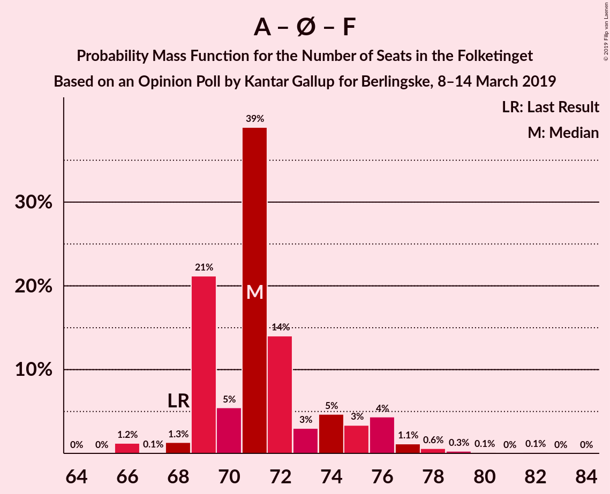

| Number of Seats | Probability | Accumulated | Special Marks |
|:---------------:|:-----------:|:-----------:|:-------------:|
| 68 | 0.1% | 100% | Last Result |
| 69 | 0.7% | 99.9% |  |
| 70 | 0.7% | 99.2% |  |
| 71 | 87% | 98.6% | Median |
| 72 | 6% | 12% |  |
| 73 | 0% | 6% |  |
| 74 | 0.3% | 6% |  |
| 75 | 5% | 6% |  |
| 76 | 0.4% | 1.0% |  |
| 77 | 0% | 0.6% |  |
| 78 | 0% | 0.6% |  |
| 79 | 0.2% | 0.6% |  |
| 80 | 0% | 0.4% |  |
| 81 | 0% | 0.3% |  |
| 82 | 0.3% | 0.3% |  |
| 83 | 0% | 0% |  |

### Socialdemokraterne – Radikale Venstre

| Number of Seats | Probability | Accumulated | Special Marks |
|:---------------:|:-----------:|:-----------:|:-------------:|
| 53 | 0.1% | 100% |  |
| 54 | 0.1% | 99.9% |  |
| 55 | 0.2% | 99.8% | Last Result |
| 56 | 0.6% | 99.7% |  |
| 57 | 0.7% | 99.0% |  |
| 58 | 6% | 98% |  |
| 59 | 70% | 92% | Median |
| 60 | 18% | 23% |  |
| 61 | 0% | 5% |  |
| 62 | 5% | 5% |  |
| 63 | 0.4% | 0.4% |  |
| 64 | 0% | 0% |  |

### Venstre – Liberal Alliance – Det Konservative Folkeparti

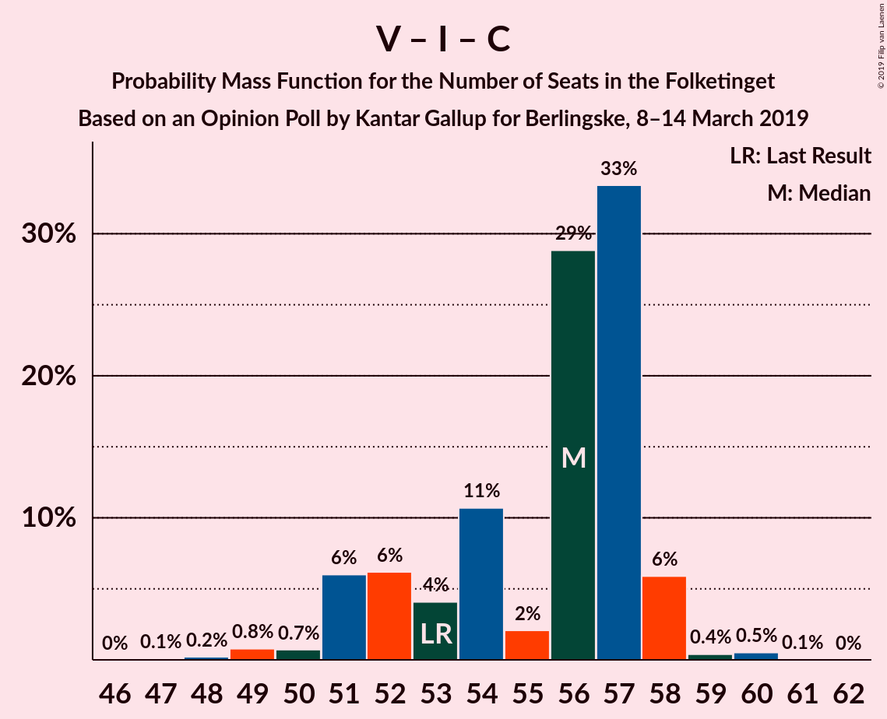

| Number of Seats | Probability | Accumulated | Special Marks |
|:---------------:|:-----------:|:-----------:|:-------------:|
| 49 | 0.2% | 100% |  |
| 50 | 0.1% | 99.8% |  |
| 51 | 0.8% | 99.7% |  |
| 52 | 0.1% | 98.8% |  |
| 53 | 5% | 98.8% | Last Result |
| 54 | 21% | 94% |  |
| 55 | 0.5% | 73% |  |
| 56 | 1.3% | 72% |  |
| 57 | 71% | 71% | Median |
| 58 | 0% | 0.1% |  |
| 59 | 0% | 0% |  |

### Venstre – Det Konservative Folkeparti

| Number of Seats | Probability | Accumulated | Special Marks |
|:---------------:|:-----------:|:-----------:|:-------------:|
| 40 | 0.1% | 100% | Last Result |
| 41 | 0.2% | 99.9% |  |
| 42 | 5% | 99.6% |  |
| 43 | 17% | 95% |  |
| 44 | 0.3% | 77% |  |
| 45 | 5% | 77% |  |
| 46 | 70% | 72% | Median |
| 47 | 1.0% | 2% |  |
| 48 | 1.2% | 1.3% |  |
| 49 | 0% | 0.1% |  |
| 50 | 0.1% | 0.1% |  |
| 51 | 0% | 0% |  |

### Venstre

| Number of Seats | Probability | Accumulated | Special Marks |
|:---------------:|:-----------:|:-----------:|:-------------:|
| 31 | 0.1% | 100% |  |
| 32 | 5% | 99.9% |  |
| 33 | 17% | 95% |  |
| 34 | 0.2% | 77% | Last Result |
| 35 | 70% | 77% | Median |
| 36 | 6% | 7% |  |
| 37 | 0.8% | 2% |  |
| 38 | 0.7% | 0.8% |  |
| 39 | 0.1% | 0.2% |  |
| 40 | 0.1% | 0.1% |  |
| 41 | 0% | 0% |  |

## Technical Information

### Opinion Poll

+ **Polling firm:** Kantar Gallup
+ **Commissioner(s):** Berlingske
+ **Fieldwork period:** 8–14 March 2019

### Calculations

+ **Sample size:** 1587
+ **Simulations done:** 131,072
+ **Error estimate:** 1.46%

