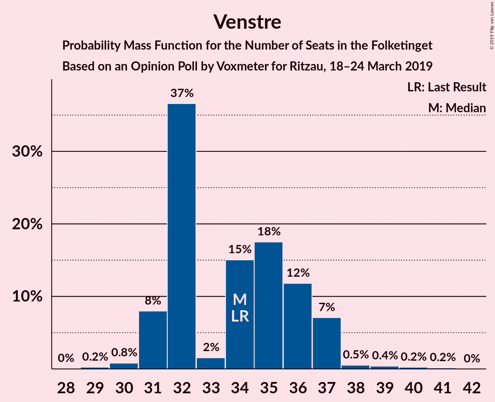
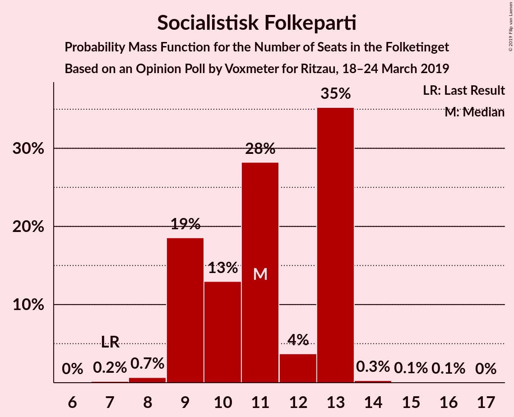
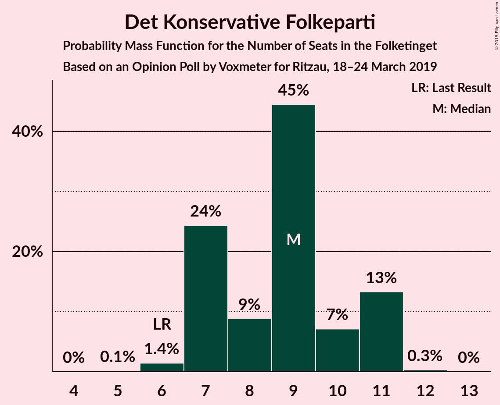
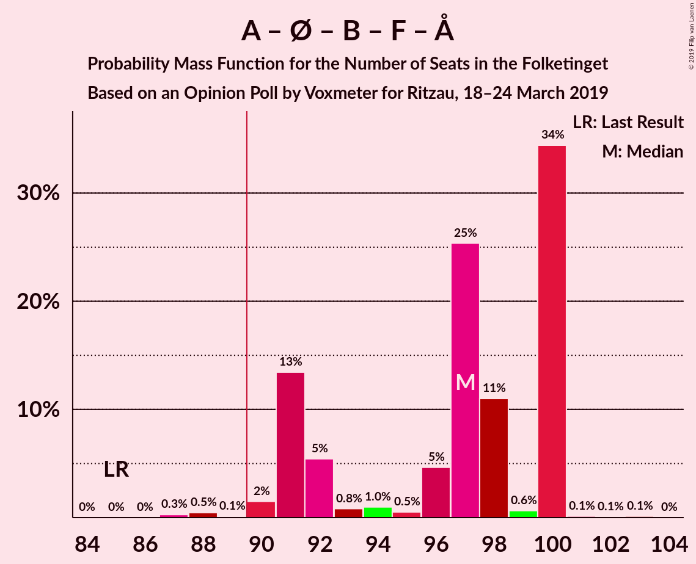
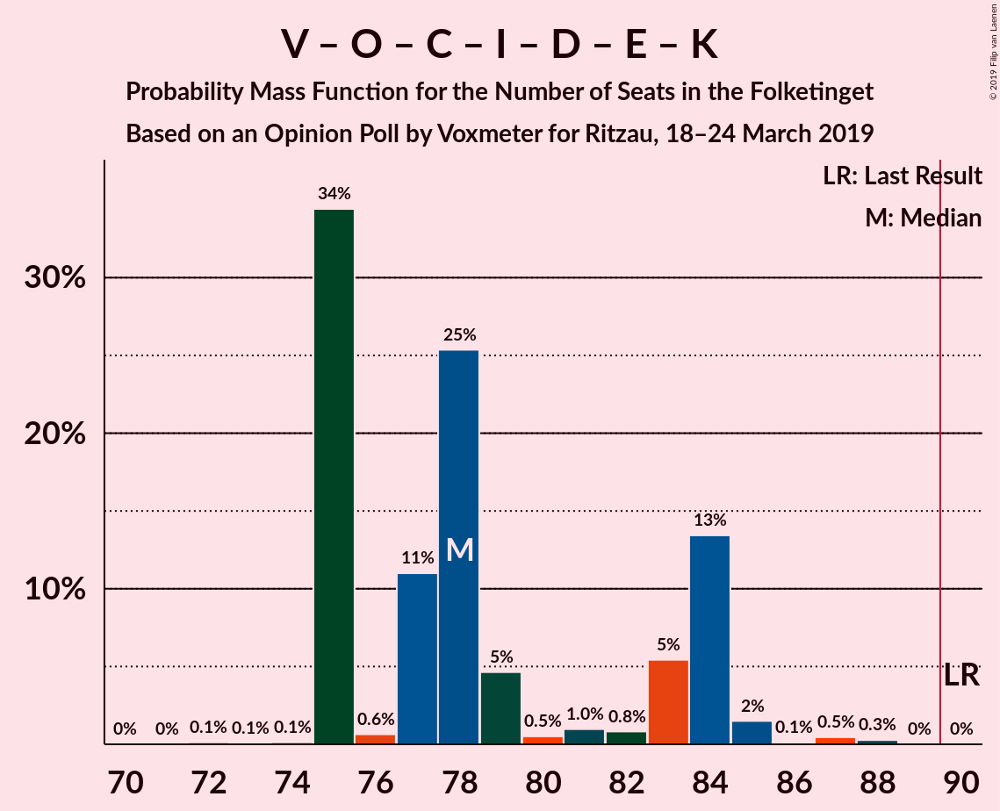

# Opinion Poll by Voxmeter for Ritzau, 18–24 March 2019

<a href="#voting-intentions">Voting Intentions</a> | <a href="#seats">Seats</a> | <a href="#coalitions">Coalitions</a> | <a href="#technical-information">Technical Information</a>

## Voting Intentions

### Confidence Intervals

| Party | Last Result | Poll Result | 80% Confidence Interval | 90% Confidence Interval | 95% Confidence Interval | 99% Confidence Interval |
|:-----:|:-----------:|:-----------:|:-----------------------:|:-----------------------:|:-----------------------:|:-----------------------:|
| Socialdemokraterne | 26.3% | 28.1% | 26.3–29.9% |25.8–30.4% |25.4–30.9% |24.6–31.8% |
| Venstre | 19.5% | 19.3% | 17.8–20.9% |17.3–21.4% |17.0–21.8% |16.3–22.6% |
| Dansk Folkeparti | 21.1% | 15.1% | 13.8–16.6% |13.4–17.1% |13.1–17.5% |12.5–18.2% |
| Enhedslisten–De Rød-Grønne | 7.8% | 8.8% | 7.8–10.0% |7.5–10.4% |7.2–10.7% |6.8–11.3% |
| Radikale Venstre | 4.6% | 6.7% | 5.8–7.8% |5.5–8.1% |5.3–8.4% |4.9–8.9% |
| Socialistisk Folkeparti | 4.2% | 5.9% | 5.1–7.0% |4.9–7.3% |4.6–7.5% |4.3–8.1% |
| Det Konservative Folkeparti | 3.4% | 4.5% | 3.8–5.4% |3.6–5.7% |3.4–5.9% |3.1–6.4% |
| Liberal Alliance | 7.5% | 4.3% | 3.6–5.2% |3.4–5.5% |3.2–5.7% |2.9–6.2% |
| Alternativet | 4.8% | 3.4% | 2.7–4.2% |2.6–4.4% |2.4–4.6% |2.1–5.1% |
| Nye Borgerlige | 0.0% | 1.9% | 1.5–2.6% |1.3–2.8% |1.2–2.9% |1.1–3.3% |
| Klaus Riskær Pedersen | 0.0% | 0.9% | 0.6–1.4% |0.5–1.5% |0.5–1.6% |0.4–1.9% |
| Kristendemokraterne | 0.8% | 0.7% | 0.4–1.1% |0.4–1.3% |0.3–1.4% |0.2–1.6% |

*Note:* The poll result column reflects the actual value used in the calculations. Published results may vary slightly, and in addition be rounded to fewer digits.

## Seats

### Confidence Intervals

| Party | Last Result | Median | 80% Confidence Interval | 90% Confidence Interval | 95% Confidence Interval | 99% Confidence Interval |
|:-----:|:-----------:|:------:|:-----------------------:|:-----------------------:|:-----------------------:|:-----------------------:|
| <a href="#socialdemokraterne">Socialdemokraterne</a> | 47 | 50 | 46–52 |46–52 |46–54 |44–59 |
| <a href="#venstre">Venstre</a> | 34 | 34 | 32–36 |31–37 |31–37 |30–39 |
| <a href="#dansk-folkeparti">Dansk Folkeparti</a> | 37 | 26 | 25–30 |24–30 |24–30 |24–32 |
| <a href="#enhedslisten–de-rød-grønne">Enhedslisten–De Rød-Grønne</a> | 14 | 17 | 15–18 |14–18 |14–18 |13–20 |
| <a href="#radikale-venstre">Radikale Venstre</a> | 8 | 12 | 11–15 |11–15 |10–15 |9–15 |
| <a href="#socialistisk-folkeparti">Socialistisk Folkeparti</a> | 7 | 11 | 9–13 |9–13 |9–13 |8–13 |
| <a href="#det-konservative-folkeparti">Det Konservative Folkeparti</a> | 6 | 9 | 7–11 |7–11 |7–11 |6–11 |
| <a href="#liberal-alliance">Liberal Alliance</a> | 13 | 8 | 6–9 |6–9 |6–9 |6–10 |
| <a href="#alternativet">Alternativet</a> | 9 | 7 | 6–7 |5–7 |4–9 |4–9 |
| <a href="#nye-borgerlige">Nye Borgerlige</a> | 0 | 0 | 0–4 |0–5 |0–5 |0–5 |
| <a href="#klaus-riskær-pedersen">Klaus Riskær Pedersen</a> | 0 | 0 | 0 |0 |0 |0 |
| <a href="#kristendemokraterne">Kristendemokraterne</a> | 0 | 0 | 0 |0 |0 |0 |

### Socialdemokraterne

*For a full overview of the results for this party, see the [Socialdemokraterne](party-socialdemokraterne.html) page.*

| Number of Seats | Probability | Accumulated | Special Marks |
|:---------------:|:-----------:|:-----------:|:-------------:|
| 44 | 0.5% | 100% |  |
| 45 | 0.9% | 99.5% |  |
| 46 | 14% | 98.6% |  |
| 47 | 3% | 85% | Last Result |
| 48 | 2% | 81% |  |
| 49 | 5% | 79% |  |
| 50 | 56% | 74% | Median |
| 51 | 2% | 18% |  |
| 52 | 12% | 15% |  |
| 53 | 0.6% | 4% |  |
| 54 | 1.0% | 3% |  |
| 55 | 0.8% | 2% |  |
| 56 | 0.4% | 1.5% |  |
| 57 | 0.2% | 1.1% |  |
| 58 | 0% | 1.0% |  |
| 59 | 0.9% | 0.9% |  |
| 60 | 0% | 0% |  |

### Venstre

*For a full overview of the results for this party, see the [Venstre](party-venstre.html) page.*

| Number of Seats | Probability | Accumulated | Special Marks |
|:---------------:|:-----------:|:-----------:|:-------------:|
| 28 | 0% | 100% |  |
| 29 | 0.2% | 99.9% |  |
| 30 | 0.8% | 99.7% |  |
| 31 | 8% | 98.9% |  |
| 32 | 37% | 91% |  |
| 33 | 2% | 54% |  |
| 34 | 15% | 53% | Last Result, Median |
| 35 | 18% | 38% |  |
| 36 | 12% | 20% |  |
| 37 | 7% | 8% |  |
| 38 | 0.5% | 1.3% |  |
| 39 | 0.4% | 0.8% |  |
| 40 | 0.2% | 0.4% |  |
| 41 | 0.2% | 0.2% |  |
| 42 | 0% | 0% |  |

### Dansk Folkeparti

*For a full overview of the results for this party, see the [Dansk Folkeparti](party-danskfolkeparti.html) page.*

| Number of Seats | Probability | Accumulated | Special Marks |
|:---------------:|:-----------:|:-----------:|:-------------:|
| 22 | 0.1% | 100% |  |
| 23 | 0.3% | 99.8% |  |
| 24 | 9% | 99.5% |  |
| 25 | 6% | 91% |  |
| 26 | 52% | 85% | Median |
| 27 | 9% | 33% |  |
| 28 | 1.4% | 24% |  |
| 29 | 4% | 23% |  |
| 30 | 17% | 19% |  |
| 31 | 0.8% | 1.5% |  |
| 32 | 0.4% | 0.7% |  |
| 33 | 0.1% | 0.2% |  |
| 34 | 0% | 0.1% |  |
| 35 | 0.1% | 0.1% |  |
| 36 | 0% | 0% |  |
| 37 | 0% | 0% | Last Result |

### Enhedslisten–De Rød-Grønne

*For a full overview of the results for this party, see the [Enhedslisten–De Rød-Grønne](party-enhedslisten–derød-grønne.html) page.*

| Number of Seats | Probability | Accumulated | Special Marks |
|:---------------:|:-----------:|:-----------:|:-------------:|
| 11 | 0.1% | 100% |  |
| 12 | 0.3% | 99.9% |  |
| 13 | 1.3% | 99.6% |  |
| 14 | 6% | 98% | Last Result |
| 15 | 12% | 92% |  |
| 16 | 18% | 80% |  |
| 17 | 17% | 62% | Median |
| 18 | 45% | 46% |  |
| 19 | 0.3% | 1.2% |  |
| 20 | 0.8% | 0.9% |  |
| 21 | 0.1% | 0.1% |  |
| 22 | 0% | 0% |  |

### Radikale Venstre

*For a full overview of the results for this party, see the [Radikale Venstre](party-radikalevenstre.html) page.*

| Number of Seats | Probability | Accumulated | Special Marks |
|:---------------:|:-----------:|:-----------:|:-------------:|
| 8 | 0.1% | 100% | Last Result |
| 9 | 0.5% | 99.9% |  |
| 10 | 4% | 99.5% |  |
| 11 | 9% | 96% |  |
| 12 | 53% | 86% | Median |
| 13 | 4% | 33% |  |
| 14 | 19% | 29% |  |
| 15 | 10% | 10% |  |
| 16 | 0.1% | 0.2% |  |
| 17 | 0% | 0.1% |  |
| 18 | 0% | 0% |  |

### Socialistisk Folkeparti

*For a full overview of the results for this party, see the [Socialistisk Folkeparti](party-socialistiskfolkeparti.html) page.*

| Number of Seats | Probability | Accumulated | Special Marks |
|:---------------:|:-----------:|:-----------:|:-------------:|
| 7 | 0.2% | 100% | Last Result |
| 8 | 0.7% | 99.8% |  |
| 9 | 19% | 99.1% |  |
| 10 | 13% | 81% |  |
| 11 | 28% | 68% | Median |
| 12 | 4% | 39% |  |
| 13 | 35% | 36% |  |
| 14 | 0.3% | 0.5% |  |
| 15 | 0.1% | 0.2% |  |
| 16 | 0.1% | 0.1% |  |
| 17 | 0% | 0% |  |

### Det Konservative Folkeparti

*For a full overview of the results for this party, see the [Det Konservative Folkeparti](party-detkonservativefolkeparti.html) page.*

| Number of Seats | Probability | Accumulated | Special Marks |
|:---------------:|:-----------:|:-----------:|:-------------:|
| 5 | 0.1% | 100% |  |
| 6 | 1.4% | 99.9% | Last Result |
| 7 | 24% | 98% |  |
| 8 | 9% | 74% |  |
| 9 | 45% | 65% | Median |
| 10 | 7% | 21% |  |
| 11 | 13% | 14% |  |
| 12 | 0.3% | 0.3% |  |
| 13 | 0% | 0% |  |

### Liberal Alliance

*For a full overview of the results for this party, see the [Liberal Alliance](party-liberalalliance.html) page.*

| Number of Seats | Probability | Accumulated | Special Marks |
|:---------------:|:-----------:|:-----------:|:-------------:|
| 5 | 0.2% | 100% |  |
| 6 | 25% | 99.8% |  |
| 7 | 8% | 75% |  |
| 8 | 45% | 67% | Median |
| 9 | 20% | 21% |  |
| 10 | 0.9% | 1.2% |  |
| 11 | 0.2% | 0.3% |  |
| 12 | 0.2% | 0.2% |  |
| 13 | 0% | 0% | Last Result |

### Alternativet

*For a full overview of the results for this party, see the [Alternativet](party-alternativet.html) page.*

| Number of Seats | Probability | Accumulated | Special Marks |
|:---------------:|:-----------:|:-----------:|:-------------:|
| 4 | 3% | 100% |  |
| 5 | 7% | 97% |  |
| 6 | 28% | 90% |  |
| 7 | 58% | 62% | Median |
| 8 | 2% | 5% |  |
| 9 | 3% | 3% | Last Result |
| 10 | 0.1% | 0.1% |  |
| 11 | 0% | 0% |  |

### Nye Borgerlige

*For a full overview of the results for this party, see the [Nye Borgerlige](party-nyeborgerlige.html) page.*

| Number of Seats | Probability | Accumulated | Special Marks |
|:---------------:|:-----------:|:-----------:|:-------------:|
| 0 | 66% | 100% | Last Result, Median |
| 1 | 0% | 34% |  |
| 2 | 0% | 34% |  |
| 3 | 2% | 34% |  |
| 4 | 25% | 32% |  |
| 5 | 6% | 7% |  |
| 6 | 0.3% | 0.4% |  |
| 7 | 0% | 0% |  |

### Klaus Riskær Pedersen

*For a full overview of the results for this party, see the [Klaus Riskær Pedersen](party-klausriskærpedersen.html) page.*

| Number of Seats | Probability | Accumulated | Special Marks |
|:---------------:|:-----------:|:-----------:|:-------------:|
| 0 | 100% | 100% | Last Result, Median |

### Kristendemokraterne

*For a full overview of the results for this party, see the [Kristendemokraterne](party-kristendemokraterne.html) page.*

| Number of Seats | Probability | Accumulated | Special Marks |
|:---------------:|:-----------:|:-----------:|:-------------:|
| 0 | 100% | 100% | Last Result, Median |

## Coalitions

### Confidence Intervals

| Coalition | Last Result | Median | Majority? | 80% Confidence Interval | 90% Confidence Interval | 95% Confidence Interval | 99% Confidence Interval |
|:---------:|:-----------:|:------:|:---------:|:-----------------------:|:-----------------------:|:-----------------------:|:-----------------------:|
| Socialdemokraterne – Enhedslisten–De Rød-Grønne – Radikale Venstre – Socialistisk Folkeparti – Alternativet | 85 | 97 | 99.1% | 91–100 | 91–100 | 91–100 | 88–100 |
| Socialdemokraterne – Enhedslisten–De Rød-Grønne – Radikale Venstre – Socialistisk Folkeparti | 76 | 91 | 74% | 85–93 | 85–93 | 85–93 | 82–94 |
| Socialdemokraterne – Enhedslisten–De Rød-Grønne – Socialistisk Folkeparti – Alternativet | 77 | 83 | 0.5% | 79–88 | 79–88 | 79–88 | 76–90 |
| Venstre – Dansk Folkeparti – Det Konservative Folkeparti – Liberal Alliance – Nye Borgerlige – Klaus Riskær Pedersen – Kristendemokraterne | 90 | 78 | 0% | 75–84 | 75–84 | 75–84 | 75–87 |
| Venstre – Dansk Folkeparti – Det Konservative Folkeparti – Liberal Alliance – Nye Borgerlige – Klaus Riskær Pedersen | 90 | 78 | 0% | 75–84 | 75–84 | 75–84 | 75–87 |
| Venstre – Dansk Folkeparti – Det Konservative Folkeparti – Liberal Alliance – Nye Borgerlige – Kristendemokraterne | 90 | 78 | 0% | 75–84 | 75–84 | 75–84 | 75–87 |
| Venstre – Dansk Folkeparti – Det Konservative Folkeparti – Liberal Alliance – Nye Borgerlige | 90 | 78 | 0% | 75–84 | 75–84 | 75–84 | 75–87 |
| Venstre – Dansk Folkeparti – Det Konservative Folkeparti – Liberal Alliance – Kristendemokraterne | 90 | 77 | 0% | 74–80 | 73–80 | 72–82 | 71–84 |
| Venstre – Dansk Folkeparti – Det Konservative Folkeparti – Liberal Alliance | 90 | 77 | 0% | 74–80 | 73–80 | 72–82 | 71–84 |
| Socialdemokraterne – Enhedslisten–De Rød-Grønne – Socialistisk Folkeparti | 68 | 78 | 0% | 73–81 | 73–81 | 73–81 | 70–83 |
| Socialdemokraterne – Radikale Venstre – Socialistisk Folkeparti | 62 | 75 | 0% | 69–77 | 68–77 | 68–78 | 67–80 |
| Socialdemokraterne – Radikale Venstre | 55 | 62 | 0% | 58–67 | 58–67 | 57–67 | 56–70 |
| Venstre – Det Konservative Folkeparti – Liberal Alliance | 53 | 49 | 0% | 47–54 | 47–54 | 46–54 | 44–55 |
| Venstre – Det Konservative Folkeparti | 40 | 42 | 0% | 41–45 | 39–45 | 38–45 | 38–48 |
| Venstre | 34 | 34 | 0% | 32–36 | 31–37 | 31–37 | 30–39 |

### Socialdemokraterne – Enhedslisten–De Rød-Grønne – Radikale Venstre – Socialistisk Folkeparti – Alternativet

| Number of Seats | Probability | Accumulated | Special Marks |
|:---------------:|:-----------:|:-----------:|:-------------:|
| 85 | 0% | 100% | Last Result |
| 86 | 0% | 100% |  |
| 87 | 0.3% | 100% |  |
| 88 | 0.5% | 99.7% |  |
| 89 | 0.1% | 99.3% |  |
| 90 | 2% | 99.1% | Majority |
| 91 | 13% | 98% |  |
| 92 | 5% | 84% |  |
| 93 | 0.8% | 79% |  |
| 94 | 1.0% | 78% |  |
| 95 | 0.5% | 77% |  |
| 96 | 5% | 76% |  |
| 97 | 25% | 72% | Median |
| 98 | 11% | 46% |  |
| 99 | 0.6% | 35% |  |
| 100 | 34% | 35% |  |
| 101 | 0.1% | 0.4% |  |
| 102 | 0.1% | 0.3% |  |
| 103 | 0.1% | 0.2% |  |
| 104 | 0% | 0% |  |

### Socialdemokraterne – Enhedslisten–De Rød-Grønne – Radikale Venstre – Socialistisk Folkeparti

| Number of Seats | Probability | Accumulated | Special Marks |
|:---------------:|:-----------:|:-----------:|:-------------:|
| 76 | 0% | 100% | Last Result |
| 77 | 0% | 100% |  |
| 78 | 0% | 100% |  |
| 79 | 0% | 100% |  |
| 80 | 0% | 100% |  |
| 81 | 0.2% | 100% |  |
| 82 | 1.0% | 99.8% |  |
| 83 | 0.2% | 98.8% |  |
| 84 | 0.2% | 98.6% |  |
| 85 | 16% | 98% |  |
| 86 | 3% | 83% |  |
| 87 | 2% | 80% |  |
| 88 | 4% | 78% |  |
| 89 | 0.6% | 74% |  |
| 90 | 22% | 74% | Median, Majority |
| 91 | 5% | 52% |  |
| 92 | 10% | 46% |  |
| 93 | 35% | 37% |  |
| 94 | 1.3% | 2% |  |
| 95 | 0.2% | 0.4% |  |
| 96 | 0.1% | 0.2% |  |
| 97 | 0% | 0.1% |  |
| 98 | 0.1% | 0.1% |  |
| 99 | 0% | 0% |  |

### Socialdemokraterne – Enhedslisten–De Rød-Grønne – Socialistisk Folkeparti – Alternativet

| Number of Seats | Probability | Accumulated | Special Marks |
|:---------------:|:-----------:|:-----------:|:-------------:|
| 74 | 0.3% | 100% |  |
| 75 | 0.1% | 99.7% |  |
| 76 | 0.4% | 99.6% |  |
| 77 | 0.2% | 99.2% | Last Result |
| 78 | 1.3% | 99.0% |  |
| 79 | 13% | 98% |  |
| 80 | 3% | 84% |  |
| 81 | 0.8% | 81% |  |
| 82 | 6% | 81% |  |
| 83 | 25% | 75% |  |
| 84 | 4% | 49% |  |
| 85 | 3% | 45% | Median |
| 86 | 6% | 42% |  |
| 87 | 0.9% | 36% |  |
| 88 | 33% | 35% |  |
| 89 | 1.0% | 1.5% |  |
| 90 | 0.4% | 0.5% | Majority |
| 91 | 0.1% | 0.1% |  |
| 92 | 0% | 0% |  |

### Venstre – Dansk Folkeparti – Det Konservative Folkeparti – Liberal Alliance – Nye Borgerlige – Klaus Riskær Pedersen – Kristendemokraterne

| Number of Seats | Probability | Accumulated | Special Marks |
|:---------------:|:-----------:|:-----------:|:-------------:|
| 72 | 0.1% | 100% |  |
| 73 | 0.1% | 99.8% |  |
| 74 | 0.1% | 99.7% |  |
| 75 | 34% | 99.6% |  |
| 76 | 0.6% | 65% |  |
| 77 | 11% | 65% | Median |
| 78 | 25% | 54% |  |
| 79 | 5% | 28% |  |
| 80 | 0.5% | 24% |  |
| 81 | 1.0% | 23% |  |
| 82 | 0.8% | 22% |  |
| 83 | 5% | 21% |  |
| 84 | 13% | 16% |  |
| 85 | 2% | 2% |  |
| 86 | 0.1% | 0.9% |  |
| 87 | 0.5% | 0.7% |  |
| 88 | 0.3% | 0.3% |  |
| 89 | 0% | 0% |  |
| 90 | 0% | 0% | Last Result, Majority |

### Venstre – Dansk Folkeparti – Det Konservative Folkeparti – Liberal Alliance – Nye Borgerlige – Klaus Riskær Pedersen

| Number of Seats | Probability | Accumulated | Special Marks |
|:---------------:|:-----------:|:-----------:|:-------------:|
| 72 | 0.1% | 100% |  |
| 73 | 0.1% | 99.8% |  |
| 74 | 0.1% | 99.7% |  |
| 75 | 34% | 99.6% |  |
| 76 | 0.6% | 65% |  |
| 77 | 11% | 65% | Median |
| 78 | 25% | 54% |  |
| 79 | 5% | 28% |  |
| 80 | 0.5% | 24% |  |
| 81 | 1.0% | 23% |  |
| 82 | 0.8% | 22% |  |
| 83 | 5% | 21% |  |
| 84 | 13% | 16% |  |
| 85 | 2% | 2% |  |
| 86 | 0.1% | 0.9% |  |
| 87 | 0.5% | 0.7% |  |
| 88 | 0.3% | 0.3% |  |
| 89 | 0% | 0% |  |
| 90 | 0% | 0% | Last Result, Majority |

### Venstre – Dansk Folkeparti – Det Konservative Folkeparti – Liberal Alliance – Nye Borgerlige – Kristendemokraterne

| Number of Seats | Probability | Accumulated | Special Marks |
|:---------------:|:-----------:|:-----------:|:-------------:|
| 72 | 0.1% | 100% |  |
| 73 | 0.1% | 99.8% |  |
| 74 | 0.1% | 99.7% |  |
| 75 | 34% | 99.6% |  |
| 76 | 0.6% | 65% |  |
| 77 | 11% | 65% | Median |
| 78 | 25% | 54% |  |
| 79 | 5% | 28% |  |
| 80 | 0.5% | 24% |  |
| 81 | 1.0% | 23% |  |
| 82 | 0.8% | 22% |  |
| 83 | 5% | 21% |  |
| 84 | 13% | 16% |  |
| 85 | 1.5% | 2% |  |
| 86 | 0.1% | 0.8% |  |
| 87 | 0.5% | 0.7% |  |
| 88 | 0.3% | 0.3% |  |
| 89 | 0% | 0% |  |
| 90 | 0% | 0% | Last Result, Majority |

### Venstre – Dansk Folkeparti – Det Konservative Folkeparti – Liberal Alliance – Nye Borgerlige

| Number of Seats | Probability | Accumulated | Special Marks |
|:---------------:|:-----------:|:-----------:|:-------------:|
| 72 | 0.1% | 100% |  |
| 73 | 0.1% | 99.8% |  |
| 74 | 0.1% | 99.7% |  |
| 75 | 34% | 99.6% |  |
| 76 | 0.6% | 65% |  |
| 77 | 11% | 65% | Median |
| 78 | 25% | 54% |  |
| 79 | 5% | 28% |  |
| 80 | 0.5% | 24% |  |
| 81 | 1.0% | 23% |  |
| 82 | 0.8% | 22% |  |
| 83 | 5% | 21% |  |
| 84 | 13% | 16% |  |
| 85 | 1.5% | 2% |  |
| 86 | 0.1% | 0.8% |  |
| 87 | 0.5% | 0.7% |  |
| 88 | 0.3% | 0.3% |  |
| 89 | 0% | 0% |  |
| 90 | 0% | 0% | Last Result, Majority |

### Venstre – Dansk Folkeparti – Det Konservative Folkeparti – Liberal Alliance – Kristendemokraterne

| Number of Seats | Probability | Accumulated | Special Marks |
|:---------------:|:-----------:|:-----------:|:-------------:|
| 71 | 0.5% | 100% |  |
| 72 | 2% | 99.5% |  |
| 73 | 3% | 97% |  |
| 74 | 6% | 95% |  |
| 75 | 34% | 88% |  |
| 76 | 3% | 54% |  |
| 77 | 9% | 51% | Median |
| 78 | 18% | 42% |  |
| 79 | 5% | 23% |  |
| 80 | 14% | 18% |  |
| 81 | 0.8% | 4% |  |
| 82 | 0.8% | 3% |  |
| 83 | 1.5% | 2% |  |
| 84 | 0.5% | 0.7% |  |
| 85 | 0.1% | 0.2% |  |
| 86 | 0% | 0.1% |  |
| 87 | 0.1% | 0.1% |  |
| 88 | 0% | 0% |  |
| 89 | 0% | 0% |  |
| 90 | 0% | 0% | Last Result, Majority |

### Venstre – Dansk Folkeparti – Det Konservative Folkeparti – Liberal Alliance

| Number of Seats | Probability | Accumulated | Special Marks |
|:---------------:|:-----------:|:-----------:|:-------------:|
| 71 | 0.5% | 100% |  |
| 72 | 2% | 99.5% |  |
| 73 | 3% | 97% |  |
| 74 | 6% | 95% |  |
| 75 | 34% | 88% |  |
| 76 | 3% | 54% |  |
| 77 | 9% | 51% | Median |
| 78 | 18% | 42% |  |
| 79 | 5% | 23% |  |
| 80 | 14% | 18% |  |
| 81 | 0.8% | 4% |  |
| 82 | 0.8% | 3% |  |
| 83 | 1.5% | 2% |  |
| 84 | 0.5% | 0.7% |  |
| 85 | 0.1% | 0.2% |  |
| 86 | 0% | 0.1% |  |
| 87 | 0.1% | 0.1% |  |
| 88 | 0% | 0% |  |
| 89 | 0% | 0% |  |
| 90 | 0% | 0% | Last Result, Majority |

### Socialdemokraterne – Enhedslisten–De Rød-Grønne – Socialistisk Folkeparti

| Number of Seats | Probability | Accumulated | Special Marks |
|:---------------:|:-----------:|:-----------:|:-------------:|
| 68 | 0.3% | 100% | Last Result |
| 69 | 0.1% | 99.7% |  |
| 70 | 0.1% | 99.5% |  |
| 71 | 0.9% | 99.4% |  |
| 72 | 0.4% | 98.5% |  |
| 73 | 15% | 98% |  |
| 74 | 3% | 83% |  |
| 75 | 2% | 80% |  |
| 76 | 18% | 78% |  |
| 77 | 10% | 60% |  |
| 78 | 5% | 50% | Median |
| 79 | 8% | 45% |  |
| 80 | 2% | 37% |  |
| 81 | 33% | 35% |  |
| 82 | 0.5% | 2% |  |
| 83 | 1.1% | 1.5% |  |
| 84 | 0.3% | 0.3% |  |
| 85 | 0% | 0.1% |  |
| 86 | 0.1% | 0.1% |  |
| 87 | 0% | 0% |  |

### Socialdemokraterne – Radikale Venstre – Socialistisk Folkeparti

| Number of Seats | Probability | Accumulated | Special Marks |
|:---------------:|:-----------:|:-----------:|:-------------:|
| 62 | 0% | 100% | Last Result |
| 63 | 0% | 100% |  |
| 64 | 0% | 100% |  |
| 65 | 0.4% | 100% |  |
| 66 | 0.1% | 99.6% |  |
| 67 | 2% | 99.6% |  |
| 68 | 3% | 98% |  |
| 69 | 13% | 95% |  |
| 70 | 0.8% | 82% |  |
| 71 | 3% | 81% |  |
| 72 | 7% | 78% |  |
| 73 | 17% | 71% | Median |
| 74 | 4% | 54% |  |
| 75 | 36% | 50% |  |
| 76 | 2% | 14% |  |
| 77 | 8% | 12% |  |
| 78 | 3% | 4% |  |
| 79 | 0.1% | 1.3% |  |
| 80 | 1.0% | 1.2% |  |
| 81 | 0.1% | 0.2% |  |
| 82 | 0% | 0.1% |  |
| 83 | 0% | 0.1% |  |
| 84 | 0% | 0% |  |

### Socialdemokraterne – Radikale Venstre

| Number of Seats | Probability | Accumulated | Special Marks |
|:---------------:|:-----------:|:-----------:|:-------------:|
| 55 | 0.4% | 100% | Last Result |
| 56 | 0.5% | 99.6% |  |
| 57 | 3% | 99.1% |  |
| 58 | 14% | 96% |  |
| 59 | 1.1% | 82% |  |
| 60 | 0.9% | 81% |  |
| 61 | 7% | 80% |  |
| 62 | 38% | 73% | Median |
| 63 | 4% | 35% |  |
| 64 | 15% | 31% |  |
| 65 | 3% | 16% |  |
| 66 | 3% | 13% |  |
| 67 | 9% | 10% |  |
| 68 | 0.1% | 1.2% |  |
| 69 | 0% | 1.1% |  |
| 70 | 0.9% | 1.0% |  |
| 71 | 0% | 0.1% |  |
| 72 | 0% | 0% |  |

### Venstre – Det Konservative Folkeparti – Liberal Alliance

| Number of Seats | Probability | Accumulated | Special Marks |
|:---------------:|:-----------:|:-----------:|:-------------:|
| 44 | 0.6% | 100% |  |
| 45 | 2% | 99.4% |  |
| 46 | 2% | 98% |  |
| 47 | 7% | 96% |  |
| 48 | 15% | 88% |  |
| 49 | 35% | 73% |  |
| 50 | 4% | 38% |  |
| 51 | 4% | 35% | Median |
| 52 | 4% | 31% |  |
| 53 | 12% | 27% | Last Result |
| 54 | 14% | 15% |  |
| 55 | 0.5% | 0.8% |  |
| 56 | 0.1% | 0.3% |  |
| 57 | 0% | 0.1% |  |
| 58 | 0% | 0.1% |  |
| 59 | 0.1% | 0.1% |  |
| 60 | 0% | 0% |  |

### Venstre – Det Konservative Folkeparti

| Number of Seats | Probability | Accumulated | Special Marks |
|:---------------:|:-----------:|:-----------:|:-------------:|
| 37 | 0% | 100% |  |
| 38 | 4% | 99.9% |  |
| 39 | 3% | 96% |  |
| 40 | 1.0% | 93% | Last Result |
| 41 | 39% | 92% |  |
| 42 | 16% | 53% |  |
| 43 | 2% | 37% | Median |
| 44 | 7% | 35% |  |
| 45 | 26% | 28% |  |
| 46 | 0.5% | 2% |  |
| 47 | 0.8% | 1.3% |  |
| 48 | 0.2% | 0.5% |  |
| 49 | 0.2% | 0.3% |  |
| 50 | 0% | 0.1% |  |
| 51 | 0.1% | 0.1% |  |
| 52 | 0% | 0% |  |

### Venstre

| Number of Seats | Probability | Accumulated | Special Marks |
|:---------------:|:-----------:|:-----------:|:-------------:|
| 28 | 0% | 100% |  |
| 29 | 0.2% | 99.9% |  |
| 30 | 0.8% | 99.7% |  |
| 31 | 8% | 98.9% |  |
| 32 | 37% | 91% |  |
| 33 | 2% | 54% |  |
| 34 | 15% | 53% | Last Result, Median |
| 35 | 18% | 38% |  |
| 36 | 12% | 20% |  |
| 37 | 7% | 8% |  |
| 38 | 0.5% | 1.3% |  |
| 39 | 0.4% | 0.8% |  |
| 40 | 0.2% | 0.4% |  |
| 41 | 0.2% | 0.2% |  |
| 42 | 0% | 0% |  |

## Technical Information

### Opinion Poll

+ **Polling firm:** Voxmeter
+ **Commissioner(s):** Ritzau
+ **Fieldwork period:** 18–24 March 2019

### Calculations

+ **Sample size:** 1044
+ **Simulations done:** 1,048,576
+ **Error estimate:** 1.81%

