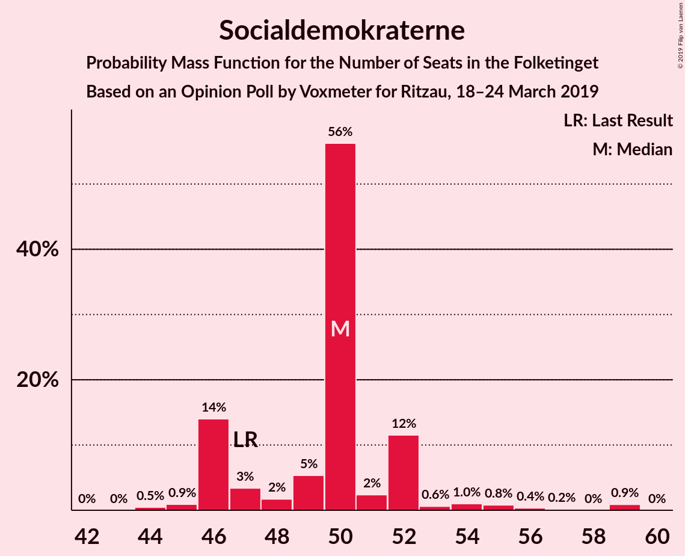
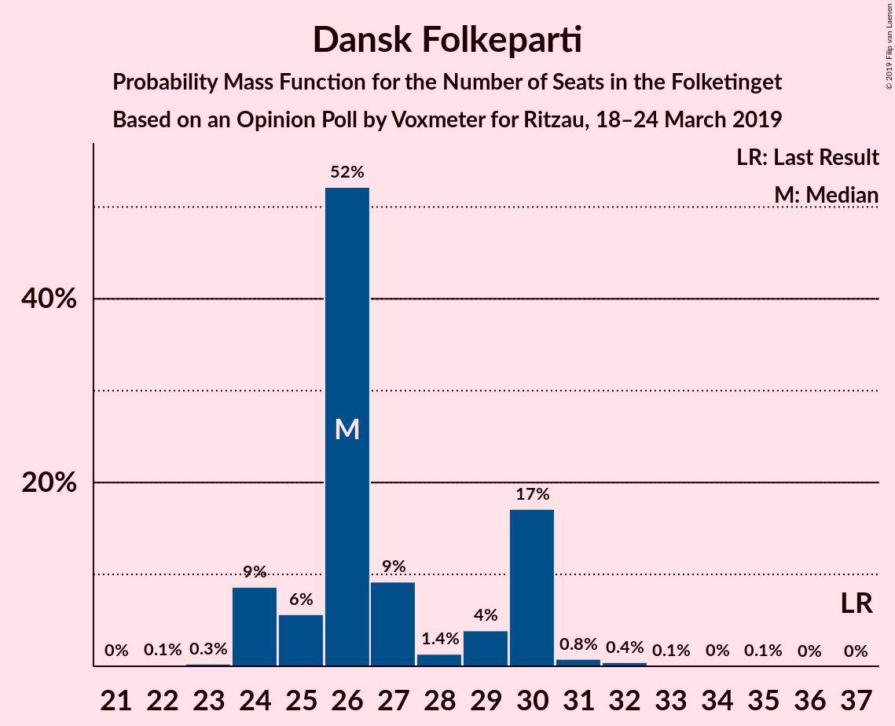
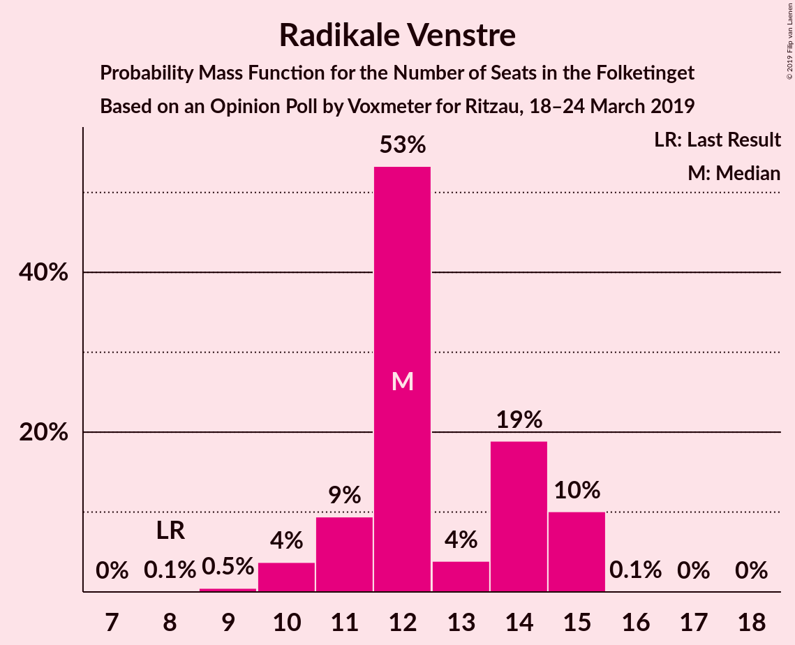
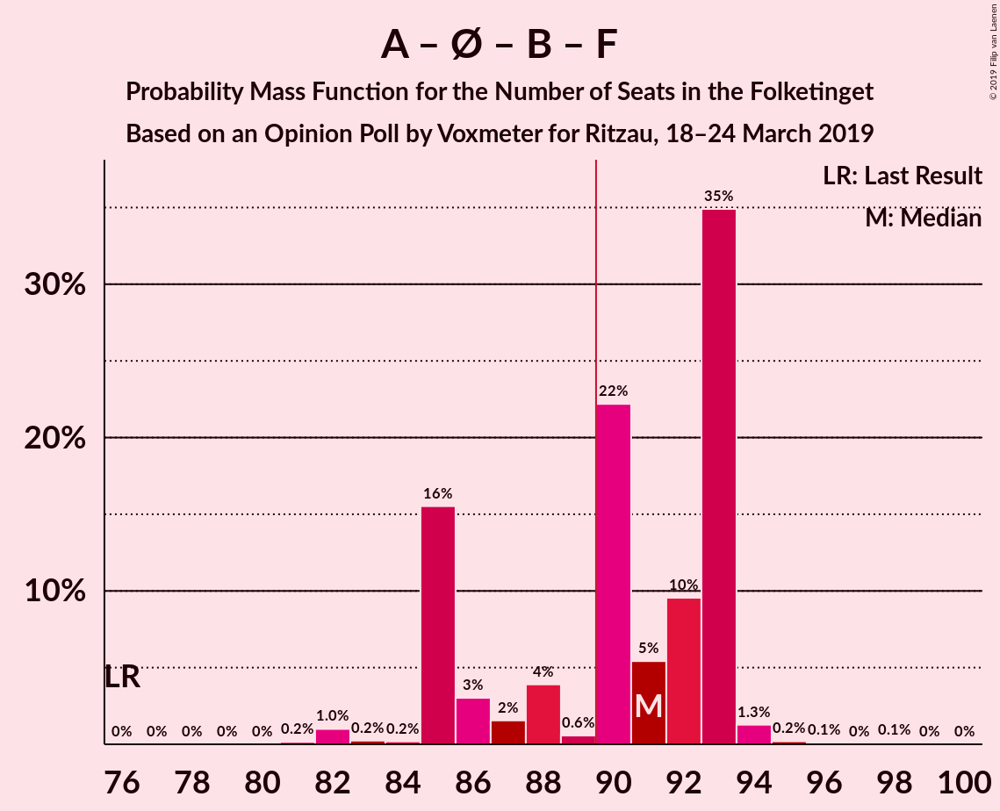
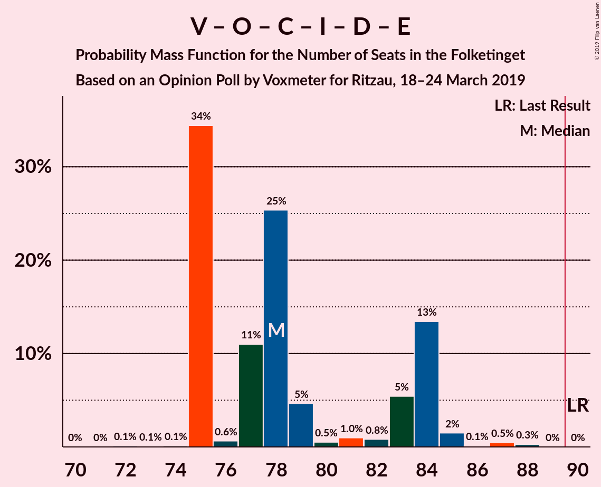
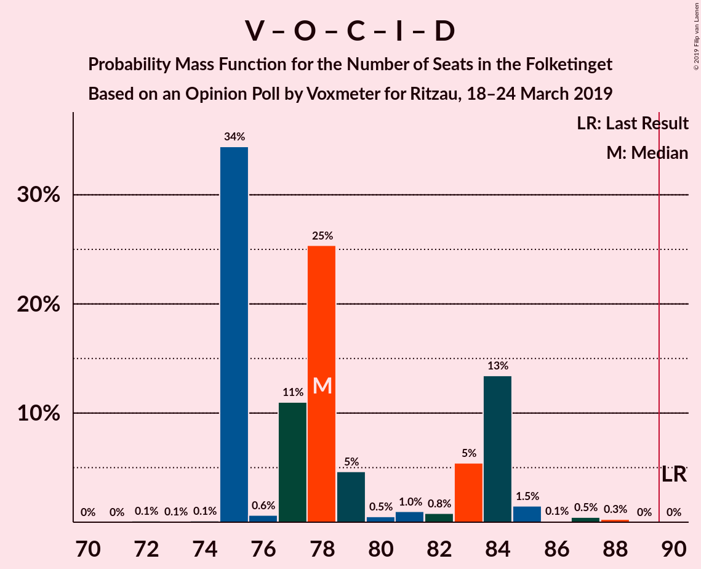
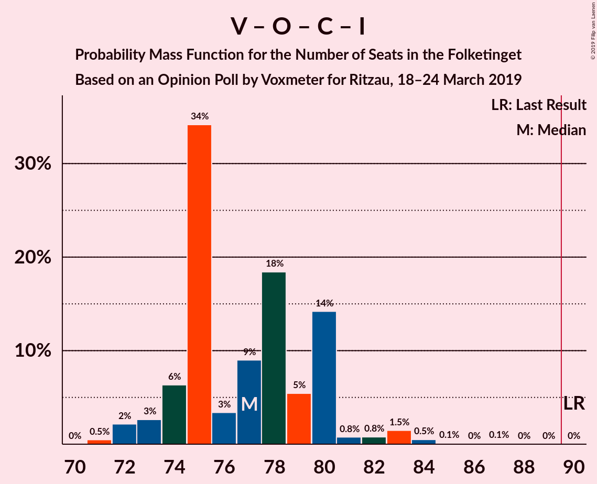
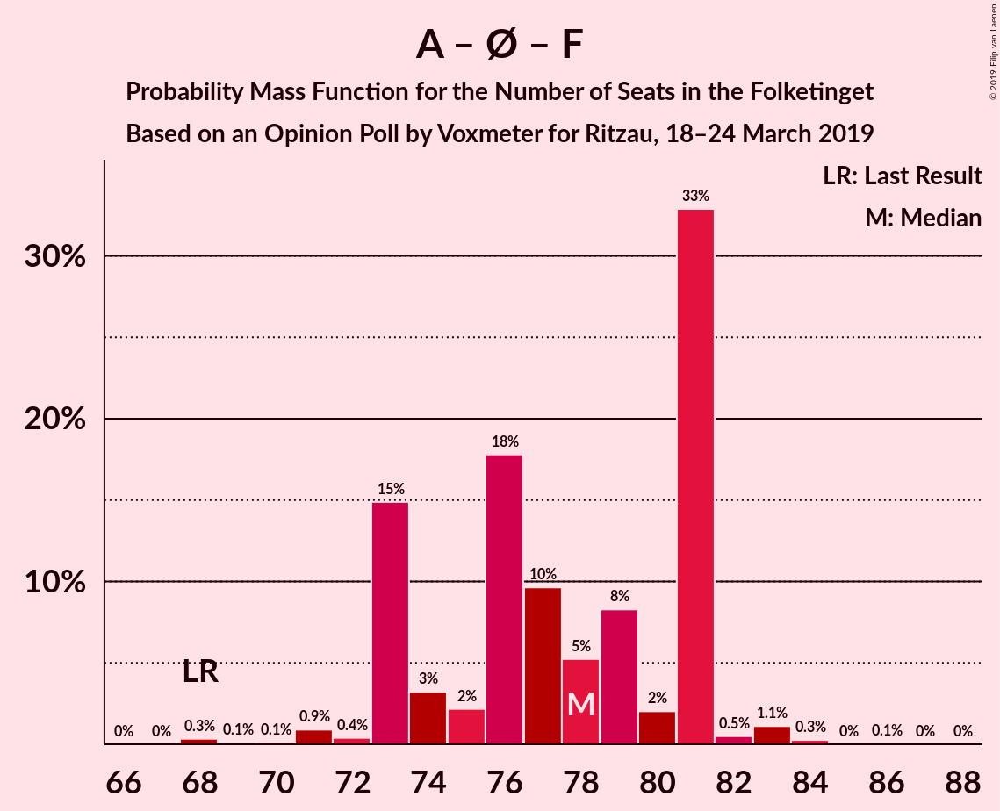
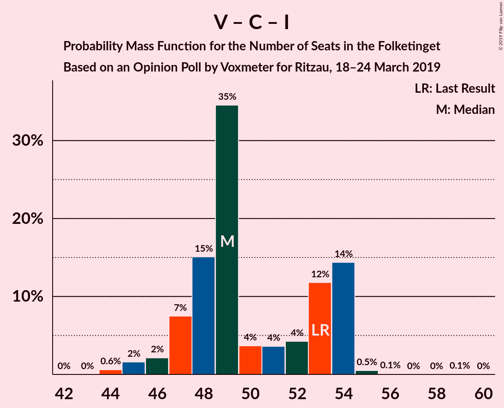

# Opinion Poll by Voxmeter for Ritzau, 18–24 March 2019

<a href="#voting-intentions">Voting Intentions</a> | <a href="#seats">Seats</a> | <a href="#coalitions">Coalitions</a> | <a href="#technical-information">Technical Information</a>

## Voting Intentions

### Confidence Intervals

| Party | Last Result | Poll Result | 80% Confidence Interval | 90% Confidence Interval | 95% Confidence Interval | 99% Confidence Interval |
|:-----:|:-----------:|:-----------:|:-----------------------:|:-----------------------:|:-----------------------:|:-----------------------:|
| Socialdemokraterne | 26.3% | 28.1% | 26.3–29.9% |25.8–30.4% |25.4–30.9% |24.6–31.8% |
| Venstre | 19.5% | 19.3% | 17.8–20.9% |17.3–21.4% |17.0–21.8% |16.3–22.6% |
| Dansk Folkeparti | 21.1% | 15.1% | 13.8–16.6% |13.4–17.1% |13.1–17.5% |12.5–18.2% |
| Enhedslisten–De Rød-Grønne | 7.8% | 8.8% | 7.8–10.0% |7.5–10.4% |7.2–10.7% |6.8–11.3% |
| Radikale Venstre | 4.6% | 6.7% | 5.8–7.8% |5.5–8.1% |5.3–8.4% |4.9–8.9% |
| Socialistisk Folkeparti | 4.2% | 5.9% | 5.1–7.0% |4.9–7.3% |4.6–7.5% |4.3–8.1% |
| Det Konservative Folkeparti | 3.4% | 4.5% | 3.8–5.4% |3.6–5.7% |3.4–5.9% |3.1–6.4% |
| Liberal Alliance | 7.5% | 4.3% | 3.6–5.2% |3.4–5.5% |3.2–5.7% |2.9–6.2% |
| Alternativet | 4.8% | 3.4% | 2.7–4.2% |2.6–4.4% |2.4–4.6% |2.1–5.1% |
| Nye Borgerlige | 0.0% | 1.9% | 1.5–2.6% |1.3–2.8% |1.2–2.9% |1.1–3.3% |
| Klaus Riskær Pedersen | 0.0% | 0.9% | 0.6–1.4% |0.5–1.5% |0.5–1.6% |0.4–1.9% |
| Kristendemokraterne | 0.8% | 0.7% | 0.4–1.1% |0.4–1.3% |0.3–1.4% |0.2–1.6% |

*Note:* The poll result column reflects the actual value used in the calculations. Published results may vary slightly, and in addition be rounded to fewer digits.

## Seats

### Confidence Intervals

| Party | Last Result | Median | 80% Confidence Interval | 90% Confidence Interval | 95% Confidence Interval | 99% Confidence Interval |
|:-----:|:-----------:|:------:|:-----------------------:|:-----------------------:|:-----------------------:|:-----------------------:|
| <a href="#socialdemokraterne">Socialdemokraterne</a> | 47 | 43 | 43–52 |43–52 |42–52 |42–55 |
| <a href="#venstre">Venstre</a> | 34 | 40 | 31–40 |31–40 |31–40 |30–40 |
| <a href="#dansk-folkeparti">Dansk Folkeparti</a> | 37 | 25 | 25–29 |25–32 |20–34 |20–34 |
| <a href="#enhedslisten–de-rød-grønne">Enhedslisten–De Rød-Grønne</a> | 14 | 17 | 14–21 |14–21 |14–21 |13–21 |
| <a href="#radikale-venstre">Radikale Venstre</a> | 8 | 11 | 11–15 |11–15 |9–16 |9–17 |
| <a href="#socialistisk-folkeparti">Socialistisk Folkeparti</a> | 7 | 12 | 6–13 |6–13 |6–13 |6–16 |
| <a href="#det-konservative-folkeparti">Det Konservative Folkeparti</a> | 6 | 10 | 7–11 |7–11 |7–11 |6–11 |
| <a href="#liberal-alliance">Liberal Alliance</a> | 13 | 9 | 5–9 |5–11 |5–11 |5–11 |
| <a href="#alternativet">Alternativet</a> | 9 | 4 | 4–5 |4–5 |4–6 |4–7 |
| <a href="#nye-borgerlige">Nye Borgerlige</a> | 0 | 0 | 0–6 |0–6 |0–6 |0–6 |
| <a href="#klaus-riskær-pedersen">Klaus Riskær Pedersen</a> | 0 | 0 | 0 |0 |0 |0 |
| <a href="#kristendemokraterne">Kristendemokraterne</a> | 0 | 0 | 0–4 |0–4 |0–4 |0–4 |

### Socialdemokraterne

*For a full overview of the results for this party, see the [Socialdemokraterne](party-socialdemokraterne.html) page.*

| Number of Seats | Probability | Accumulated | Special Marks |
|:---------------:|:-----------:|:-----------:|:-------------:|
| 42 | 4% | 100% |  |
| 43 | 50% | 96% | Median |
| 44 | 0.9% | 46% |  |
| 45 | 0.1% | 45% |  |
| 46 | 0% | 45% |  |
| 47 | 5% | 45% | Last Result |
| 48 | 0.5% | 40% |  |
| 49 | 8% | 40% |  |
| 50 | 14% | 32% |  |
| 51 | 0.3% | 18% |  |
| 52 | 17% | 18% |  |
| 53 | 0.2% | 0.8% |  |
| 54 | 0% | 0.5% |  |
| 55 | 0.2% | 0.5% |  |
| 56 | 0% | 0.3% |  |
| 57 | 0% | 0.3% |  |
| 58 | 0% | 0.3% |  |
| 59 | 0% | 0.3% |  |
| 60 | 0% | 0.3% |  |
| 61 | 0% | 0.3% |  |
| 62 | 0% | 0.3% |  |
| 63 | 0% | 0.3% |  |
| 64 | 0.3% | 0.3% |  |
| 65 | 0% | 0% |  |

### Venstre

*For a full overview of the results for this party, see the [Venstre](party-venstre.html) page.*

| Number of Seats | Probability | Accumulated | Special Marks |
|:---------------:|:-----------:|:-----------:|:-------------:|
| 28 | 0.2% | 100% |  |
| 29 | 0.2% | 99.8% |  |
| 30 | 2% | 99.6% |  |
| 31 | 17% | 98% |  |
| 32 | 0% | 81% |  |
| 33 | 14% | 81% |  |
| 34 | 12% | 67% | Last Result |
| 35 | 0.2% | 55% |  |
| 36 | 0% | 55% |  |
| 37 | 0.9% | 55% |  |
| 38 | 4% | 54% |  |
| 39 | 0% | 50% |  |
| 40 | 50% | 50% | Median |
| 41 | 0.1% | 0.1% |  |
| 42 | 0% | 0% |  |

### Dansk Folkeparti

*For a full overview of the results for this party, see the [Dansk Folkeparti](party-danskfolkeparti.html) page.*

| Number of Seats | Probability | Accumulated | Special Marks |
|:---------------:|:-----------:|:-----------:|:-------------:|
| 19 | 0.2% | 100% |  |
| 20 | 2% | 99.8% |  |
| 21 | 0.1% | 97% |  |
| 22 | 0.6% | 97% |  |
| 23 | 0% | 97% |  |
| 24 | 1.0% | 97% |  |
| 25 | 50% | 96% | Median |
| 26 | 25% | 46% |  |
| 27 | 0.2% | 21% |  |
| 28 | 0.9% | 21% |  |
| 29 | 14% | 20% |  |
| 30 | 0% | 6% |  |
| 31 | 0.2% | 6% |  |
| 32 | 2% | 6% |  |
| 33 | 0.2% | 4% |  |
| 34 | 4% | 4% |  |
| 35 | 0% | 0% |  |
| 36 | 0% | 0% |  |
| 37 | 0% | 0% | Last Result |

### Enhedslisten–De Rød-Grønne

*For a full overview of the results for this party, see the [Enhedslisten–De Rød-Grønne](party-enhedslisten–derød-grønne.html) page.*

| Number of Seats | Probability | Accumulated | Special Marks |
|:---------------:|:-----------:|:-----------:|:-------------:|
| 10 | 0.2% | 100% |  |
| 11 | 0.2% | 99.8% |  |
| 12 | 0.1% | 99.7% |  |
| 13 | 2% | 99.5% |  |
| 14 | 14% | 98% | Last Result |
| 15 | 0.3% | 83% |  |
| 16 | 8% | 83% |  |
| 17 | 51% | 75% | Median |
| 18 | 5% | 24% |  |
| 19 | 0.5% | 19% |  |
| 20 | 2% | 19% |  |
| 21 | 17% | 17% |  |
| 22 | 0% | 0% |  |

### Radikale Venstre

*For a full overview of the results for this party, see the [Radikale Venstre](party-radikalevenstre.html) page.*

| Number of Seats | Probability | Accumulated | Special Marks |
|:---------------:|:-----------:|:-----------:|:-------------:|
| 8 | 0.3% | 100% | Last Result |
| 9 | 2% | 99.7% |  |
| 10 | 2% | 97% |  |
| 11 | 54% | 96% | Median |
| 12 | 17% | 42% |  |
| 13 | 9% | 25% |  |
| 14 | 0.2% | 17% |  |
| 15 | 14% | 17% |  |
| 16 | 0.3% | 3% |  |
| 17 | 2% | 2% |  |
| 18 | 0.3% | 0.3% |  |
| 19 | 0% | 0% |  |

### Socialistisk Folkeparti

*For a full overview of the results for this party, see the [Socialistisk Folkeparti](party-socialistiskfolkeparti.html) page.*

| Number of Seats | Probability | Accumulated | Special Marks |
|:---------------:|:-----------:|:-----------:|:-------------:|
| 6 | 17% | 100% |  |
| 7 | 4% | 83% | Last Result |
| 8 | 1.2% | 79% |  |
| 9 | 2% | 78% |  |
| 10 | 0.7% | 76% |  |
| 11 | 8% | 75% |  |
| 12 | 50% | 67% | Median |
| 13 | 16% | 17% |  |
| 14 | 0% | 0.9% |  |
| 15 | 0% | 0.9% |  |
| 16 | 0.9% | 0.9% |  |
| 17 | 0% | 0% |  |

### Det Konservative Folkeparti

*For a full overview of the results for this party, see the [Det Konservative Folkeparti](party-detkonservativefolkeparti.html) page.*

| Number of Seats | Probability | Accumulated | Special Marks |
|:---------------:|:-----------:|:-----------:|:-------------:|
| 4 | 0.3% | 100% |  |
| 5 | 0.1% | 99.7% |  |
| 6 | 0.4% | 99.6% | Last Result |
| 7 | 17% | 99.1% |  |
| 8 | 1.4% | 82% |  |
| 9 | 13% | 81% |  |
| 10 | 52% | 68% | Median |
| 11 | 16% | 16% |  |
| 12 | 0.1% | 0.1% |  |
| 13 | 0% | 0% |  |

### Liberal Alliance

*For a full overview of the results for this party, see the [Liberal Alliance](party-liberalalliance.html) page.*

| Number of Seats | Probability | Accumulated | Special Marks |
|:---------------:|:-----------:|:-----------:|:-------------:|
| 5 | 14% | 100% |  |
| 6 | 0.1% | 86% |  |
| 7 | 10% | 86% |  |
| 8 | 0.7% | 76% |  |
| 9 | 68% | 75% | Median |
| 10 | 0.3% | 7% |  |
| 11 | 7% | 7% |  |
| 12 | 0% | 0.1% |  |
| 13 | 0% | 0.1% | Last Result |
| 14 | 0.1% | 0.1% |  |
| 15 | 0% | 0% |  |

### Alternativet

*For a full overview of the results for this party, see the [Alternativet](party-alternativet.html) page.*

| Number of Seats | Probability | Accumulated | Special Marks |
|:---------------:|:-----------:|:-----------:|:-------------:|
| 0 | 0.2% | 100% |  |
| 1 | 0% | 99.8% |  |
| 2 | 0% | 99.8% |  |
| 3 | 0% | 99.8% |  |
| 4 | 50% | 99.8% | Median |
| 5 | 46% | 50% |  |
| 6 | 2% | 4% |  |
| 7 | 2% | 2% |  |
| 8 | 0.1% | 0.2% |  |
| 9 | 0.1% | 0.1% | Last Result |
| 10 | 0% | 0% |  |

### Nye Borgerlige

*For a full overview of the results for this party, see the [Nye Borgerlige](party-nyeborgerlige.html) page.*

| Number of Seats | Probability | Accumulated | Special Marks |
|:---------------:|:-----------:|:-----------:|:-------------:|
| 0 | 78% | 100% | Last Result, Median |
| 1 | 0% | 22% |  |
| 2 | 0% | 22% |  |
| 3 | 0% | 22% |  |
| 4 | 3% | 22% |  |
| 5 | 0.1% | 19% |  |
| 6 | 19% | 19% |  |
| 7 | 0% | 0% |  |

### Klaus Riskær Pedersen

*For a full overview of the results for this party, see the [Klaus Riskær Pedersen](party-klausriskærpedersen.html) page.*

| Number of Seats | Probability | Accumulated | Special Marks |
|:---------------:|:-----------:|:-----------:|:-------------:|
| 0 | 99.7% | 100% | Last Result, Median |
| 1 | 0% | 0.3% |  |
| 2 | 0% | 0.3% |  |
| 3 | 0% | 0.3% |  |
| 4 | 0.3% | 0.3% |  |
| 5 | 0% | 0% |  |

### Kristendemokraterne

*For a full overview of the results for this party, see the [Kristendemokraterne](party-kristendemokraterne.html) page.*

| Number of Seats | Probability | Accumulated | Special Marks |
|:---------------:|:-----------:|:-----------:|:-------------:|
| 0 | 50% | 100% | Last Result, Median |
| 1 | 0% | 50% |  |
| 2 | 0% | 50% |  |
| 3 | 0% | 50% |  |
| 4 | 50% | 50% |  |
| 5 | 0% | 0% |  |

## Coalitions

### Confidence Intervals

| Coalition | Last Result | Median | Majority? | 80% Confidence Interval | 90% Confidence Interval | 95% Confidence Interval | 99% Confidence Interval |
|:---------:|:-----------:|:------:|:---------:|:-----------------------:|:-----------------------:|:-----------------------:|:-----------------------:|
| Socialdemokraterne – Enhedslisten–De Rød-Grønne – Radikale Venstre – Socialistisk Folkeparti – Alternativet | 85 | 87 | 45% | 87–97 | 87–97 | 83–97 | 83–99 |
| Socialdemokraterne – Enhedslisten–De Rød-Grønne – Radikale Venstre – Socialistisk Folkeparti | 76 | 83 | 33% | 83–92 | 83–92 | 78–92 | 78–94 |
| Venstre – Dansk Folkeparti – Det Konservative Folkeparti – Liberal Alliance – Nye Borgerlige – Klaus Riskær Pedersen – Kristendemokraterne | 90 | 88 | 4% | 78–88 | 76–88 | 76–92 | 76–92 |
| Venstre – Dansk Folkeparti – Det Konservative Folkeparti – Liberal Alliance – Nye Borgerlige – Klaus Riskær Pedersen | 90 | 84 | 4% | 78–84 | 76–86 | 76–92 | 74–92 |
| Venstre – Dansk Folkeparti – Det Konservative Folkeparti – Liberal Alliance – Nye Borgerlige – Kristendemokraterne | 90 | 88 | 4% | 78–88 | 76–88 | 76–92 | 75–92 |
| Venstre – Dansk Folkeparti – Det Konservative Folkeparti – Liberal Alliance – Nye Borgerlige | 90 | 84 | 4% | 78–84 | 76–86 | 76–92 | 74–92 |
| Venstre – Dansk Folkeparti – Det Konservative Folkeparti – Liberal Alliance – Kristendemokraterne | 90 | 88 | 4% | 73–88 | 73–88 | 73–92 | 71–92 |
| Venstre – Dansk Folkeparti – Det Konservative Folkeparti – Liberal Alliance | 90 | 84 | 4% | 73–84 | 73–84 | 73–92 | 71–92 |
| Socialdemokraterne – Enhedslisten–De Rød-Grønne – Socialistisk Folkeparti – Alternativet | 77 | 76 | 0.3% | 76–84 | 75–84 | 72–84 | 72–85 |
| Socialdemokraterne – Enhedslisten–De Rød-Grønne – Socialistisk Folkeparti | 68 | 72 | 0.3% | 72–79 | 68–79 | 67–79 | 67–80 |
| Socialdemokraterne – Radikale Venstre – Socialistisk Folkeparti | 62 | 66 | 0% | 66–78 | 66–78 | 60–78 | 60–80 |
| Socialdemokraterne – Radikale Venstre | 55 | 54 | 0% | 54–65 | 54–65 | 53–65 | 53–72 |
| Venstre – Det Konservative Folkeparti – Liberal Alliance | 53 | 58 | 0% | 47–59 | 47–59 | 47–59 | 46–59 |
| Venstre – Det Konservative Folkeparti | 40 | 47 | 0% | 38–50 | 38–50 | 38–50 | 38–50 |
| Venstre | 34 | 40 | 0% | 31–40 | 31–40 | 31–40 | 30–40 |

### Socialdemokraterne – Enhedslisten–De Rød-Grønne – Radikale Venstre – Socialistisk Folkeparti – Alternativet

| Number of Seats | Probability | Accumulated | Special Marks |
|:---------------:|:-----------:|:-----------:|:-------------:|
| 83 | 4% | 100% |  |
| 84 | 0% | 96% |  |
| 85 | 0% | 96% | Last Result |
| 86 | 0% | 96% |  |
| 87 | 50% | 96% | Median |
| 88 | 0% | 46% |  |
| 89 | 2% | 46% |  |
| 90 | 0.2% | 45% | Majority |
| 91 | 0% | 44% |  |
| 92 | 2% | 44% |  |
| 93 | 0% | 43% |  |
| 94 | 10% | 43% |  |
| 95 | 0.9% | 33% |  |
| 96 | 17% | 32% |  |
| 97 | 14% | 15% |  |
| 98 | 0.2% | 0.9% |  |
| 99 | 0.4% | 0.7% |  |
| 100 | 0% | 0.3% |  |
| 101 | 0% | 0.3% |  |
| 102 | 0% | 0.3% |  |
| 103 | 0% | 0.3% |  |
| 104 | 0% | 0.3% |  |
| 105 | 0% | 0.3% |  |
| 106 | 0% | 0.3% |  |
| 107 | 0.3% | 0.3% |  |
| 108 | 0% | 0% |  |

### Socialdemokraterne – Enhedslisten–De Rød-Grønne – Radikale Venstre – Socialistisk Folkeparti

| Number of Seats | Probability | Accumulated | Special Marks |
|:---------------:|:-----------:|:-----------:|:-------------:|
| 76 | 0% | 100% | Last Result |
| 77 | 0% | 100% |  |
| 78 | 4% | 100% |  |
| 79 | 0% | 96% |  |
| 80 | 0.2% | 96% |  |
| 81 | 0% | 96% |  |
| 82 | 0% | 96% |  |
| 83 | 51% | 96% | Median |
| 84 | 0% | 45% |  |
| 85 | 2% | 45% |  |
| 86 | 0% | 43% |  |
| 87 | 0% | 43% |  |
| 88 | 0.1% | 43% |  |
| 89 | 10% | 43% |  |
| 90 | 1.2% | 33% | Majority |
| 91 | 17% | 32% |  |
| 92 | 14% | 15% |  |
| 93 | 0% | 0.6% |  |
| 94 | 0.2% | 0.5% |  |
| 95 | 0% | 0.3% |  |
| 96 | 0% | 0.3% |  |
| 97 | 0% | 0.3% |  |
| 98 | 0% | 0.3% |  |
| 99 | 0% | 0.3% |  |
| 100 | 0% | 0.3% |  |
| 101 | 0% | 0.3% |  |
| 102 | 0% | 0.3% |  |
| 103 | 0.3% | 0.3% |  |
| 104 | 0% | 0% |  |

### Venstre – Dansk Folkeparti – Det Konservative Folkeparti – Liberal Alliance – Nye Borgerlige – Klaus Riskær Pedersen – Kristendemokraterne

| Number of Seats | Probability | Accumulated | Special Marks |
|:---------------:|:-----------:|:-----------:|:-------------:|
| 68 | 0.3% | 100% |  |
| 69 | 0% | 99.7% |  |
| 70 | 0% | 99.7% |  |
| 71 | 0% | 99.7% |  |
| 72 | 0% | 99.7% |  |
| 73 | 0% | 99.7% |  |
| 74 | 0% | 99.7% |  |
| 75 | 0% | 99.7% |  |
| 76 | 8% | 99.7% |  |
| 77 | 0.2% | 91% |  |
| 78 | 14% | 91% |  |
| 79 | 18% | 77% |  |
| 80 | 0.9% | 59% |  |
| 81 | 2% | 58% |  |
| 82 | 0% | 56% |  |
| 83 | 0.5% | 56% |  |
| 84 | 0% | 56% | Median |
| 85 | 0.2% | 56% |  |
| 86 | 2% | 55% |  |
| 87 | 0% | 54% |  |
| 88 | 50% | 54% |  |
| 89 | 0% | 4% |  |
| 90 | 0% | 4% | Last Result, Majority |
| 91 | 0% | 4% |  |
| 92 | 4% | 4% |  |
| 93 | 0% | 0% |  |

### Venstre – Dansk Folkeparti – Det Konservative Folkeparti – Liberal Alliance – Nye Borgerlige – Klaus Riskær Pedersen

| Number of Seats | Probability | Accumulated | Special Marks |
|:---------------:|:-----------:|:-----------:|:-------------:|
| 68 | 0.3% | 100% |  |
| 69 | 0% | 99.7% |  |
| 70 | 0% | 99.7% |  |
| 71 | 0% | 99.7% |  |
| 72 | 0% | 99.7% |  |
| 73 | 0% | 99.7% |  |
| 74 | 0.2% | 99.7% |  |
| 75 | 0% | 99.5% |  |
| 76 | 8% | 99.5% |  |
| 77 | 0.2% | 91% |  |
| 78 | 14% | 91% |  |
| 79 | 18% | 77% |  |
| 80 | 0.9% | 59% |  |
| 81 | 2% | 58% |  |
| 82 | 0% | 56% |  |
| 83 | 0.5% | 56% |  |
| 84 | 50% | 56% | Median |
| 85 | 0.2% | 6% |  |
| 86 | 2% | 6% |  |
| 87 | 0% | 4% |  |
| 88 | 0.2% | 4% |  |
| 89 | 0% | 4% |  |
| 90 | 0% | 4% | Last Result, Majority |
| 91 | 0% | 4% |  |
| 92 | 4% | 4% |  |
| 93 | 0% | 0% |  |

### Venstre – Dansk Folkeparti – Det Konservative Folkeparti – Liberal Alliance – Nye Borgerlige – Kristendemokraterne

| Number of Seats | Probability | Accumulated | Special Marks |
|:---------------:|:-----------:|:-----------:|:-------------:|
| 68 | 0.3% | 100% |  |
| 69 | 0% | 99.7% |  |
| 70 | 0% | 99.7% |  |
| 71 | 0% | 99.7% |  |
| 72 | 0% | 99.7% |  |
| 73 | 0% | 99.7% |  |
| 74 | 0% | 99.7% |  |
| 75 | 0.2% | 99.6% |  |
| 76 | 8% | 99.4% |  |
| 77 | 0.2% | 91% |  |
| 78 | 14% | 91% |  |
| 79 | 18% | 77% |  |
| 80 | 0.9% | 59% |  |
| 81 | 2% | 58% |  |
| 82 | 0% | 56% |  |
| 83 | 0.4% | 56% |  |
| 84 | 0% | 56% | Median |
| 85 | 0.2% | 56% |  |
| 86 | 2% | 55% |  |
| 87 | 0% | 54% |  |
| 88 | 50% | 54% |  |
| 89 | 0% | 4% |  |
| 90 | 0% | 4% | Last Result, Majority |
| 91 | 0% | 4% |  |
| 92 | 4% | 4% |  |
| 93 | 0% | 0% |  |

### Venstre – Dansk Folkeparti – Det Konservative Folkeparti – Liberal Alliance – Nye Borgerlige

| Number of Seats | Probability | Accumulated | Special Marks |
|:---------------:|:-----------:|:-----------:|:-------------:|
| 68 | 0.3% | 100% |  |
| 69 | 0% | 99.7% |  |
| 70 | 0% | 99.7% |  |
| 71 | 0% | 99.7% |  |
| 72 | 0% | 99.7% |  |
| 73 | 0% | 99.7% |  |
| 74 | 0.2% | 99.7% |  |
| 75 | 0.2% | 99.5% |  |
| 76 | 8% | 99.2% |  |
| 77 | 0.2% | 91% |  |
| 78 | 14% | 91% |  |
| 79 | 18% | 77% |  |
| 80 | 0.9% | 59% |  |
| 81 | 2% | 58% |  |
| 82 | 0% | 56% |  |
| 83 | 0.4% | 56% |  |
| 84 | 50% | 56% | Median |
| 85 | 0.2% | 6% |  |
| 86 | 2% | 6% |  |
| 87 | 0% | 4% |  |
| 88 | 0.2% | 4% |  |
| 89 | 0% | 4% |  |
| 90 | 0% | 4% | Last Result, Majority |
| 91 | 0% | 4% |  |
| 92 | 4% | 4% |  |
| 93 | 0% | 0% |  |

### Venstre – Dansk Folkeparti – Det Konservative Folkeparti – Liberal Alliance – Kristendemokraterne

| Number of Seats | Probability | Accumulated | Special Marks |
|:---------------:|:-----------:|:-----------:|:-------------:|
| 68 | 0.3% | 100% |  |
| 69 | 0% | 99.7% |  |
| 70 | 0.1% | 99.7% |  |
| 71 | 0.2% | 99.6% |  |
| 72 | 0.3% | 99.3% |  |
| 73 | 17% | 99.1% |  |
| 74 | 0% | 82% |  |
| 75 | 3% | 82% |  |
| 76 | 8% | 79% |  |
| 77 | 0.6% | 71% |  |
| 78 | 14% | 71% |  |
| 79 | 0.1% | 57% |  |
| 80 | 0.9% | 57% |  |
| 81 | 0.2% | 56% |  |
| 82 | 2% | 55% |  |
| 83 | 0% | 54% |  |
| 84 | 0% | 54% | Median |
| 85 | 0% | 54% |  |
| 86 | 0% | 54% |  |
| 87 | 0% | 54% |  |
| 88 | 50% | 54% |  |
| 89 | 0% | 4% |  |
| 90 | 0% | 4% | Last Result, Majority |
| 91 | 0% | 4% |  |
| 92 | 4% | 4% |  |
| 93 | 0% | 0% |  |

### Venstre – Dansk Folkeparti – Det Konservative Folkeparti – Liberal Alliance

| Number of Seats | Probability | Accumulated | Special Marks |
|:---------------:|:-----------:|:-----------:|:-------------:|
| 68 | 0.3% | 100% |  |
| 69 | 0% | 99.7% |  |
| 70 | 0.1% | 99.7% |  |
| 71 | 0.2% | 99.6% |  |
| 72 | 0.3% | 99.3% |  |
| 73 | 17% | 99.1% |  |
| 74 | 0.2% | 82% |  |
| 75 | 3% | 82% |  |
| 76 | 8% | 79% |  |
| 77 | 0.6% | 71% |  |
| 78 | 14% | 71% |  |
| 79 | 0.1% | 57% |  |
| 80 | 0.9% | 57% |  |
| 81 | 0.2% | 56% |  |
| 82 | 2% | 55% |  |
| 83 | 0% | 54% |  |
| 84 | 50% | 54% | Median |
| 85 | 0% | 4% |  |
| 86 | 0% | 4% |  |
| 87 | 0% | 4% |  |
| 88 | 0.1% | 4% |  |
| 89 | 0% | 4% |  |
| 90 | 0% | 4% | Last Result, Majority |
| 91 | 0% | 4% |  |
| 92 | 4% | 4% |  |
| 93 | 0% | 0% |  |

### Socialdemokraterne – Enhedslisten–De Rød-Grønne – Socialistisk Folkeparti – Alternativet

| Number of Seats | Probability | Accumulated | Special Marks |
|:---------------:|:-----------:|:-----------:|:-------------:|
| 72 | 4% | 100% |  |
| 73 | 0.2% | 96% |  |
| 74 | 0.2% | 96% |  |
| 75 | 1.0% | 96% |  |
| 76 | 50% | 95% | Median |
| 77 | 0% | 45% | Last Result |
| 78 | 0.9% | 45% |  |
| 79 | 2% | 44% |  |
| 80 | 0.2% | 43% |  |
| 81 | 8% | 42% |  |
| 82 | 14% | 34% |  |
| 83 | 0.8% | 20% |  |
| 84 | 17% | 19% |  |
| 85 | 2% | 2% |  |
| 86 | 0% | 0.4% |  |
| 87 | 0% | 0.3% |  |
| 88 | 0% | 0.3% |  |
| 89 | 0% | 0.3% |  |
| 90 | 0% | 0.3% | Majority |
| 91 | 0% | 0.3% |  |
| 92 | 0% | 0.3% |  |
| 93 | 0% | 0.3% |  |
| 94 | 0.3% | 0.3% |  |
| 95 | 0% | 0% |  |

### Socialdemokraterne – Enhedslisten–De Rød-Grønne – Socialistisk Folkeparti

| Number of Seats | Probability | Accumulated | Special Marks |
|:---------------:|:-----------:|:-----------:|:-------------:|
| 67 | 4% | 100% |  |
| 68 | 0.9% | 96% | Last Result |
| 69 | 0% | 95% |  |
| 70 | 0% | 95% |  |
| 71 | 0% | 95% |  |
| 72 | 50% | 95% | Median |
| 73 | 3% | 45% |  |
| 74 | 0% | 42% |  |
| 75 | 0% | 42% |  |
| 76 | 9% | 42% |  |
| 77 | 14% | 33% |  |
| 78 | 0% | 19% |  |
| 79 | 17% | 19% |  |
| 80 | 2% | 2% |  |
| 81 | 0% | 0.3% |  |
| 82 | 0% | 0.3% |  |
| 83 | 0% | 0.3% |  |
| 84 | 0% | 0.3% |  |
| 85 | 0% | 0.3% |  |
| 86 | 0% | 0.3% |  |
| 87 | 0% | 0.3% |  |
| 88 | 0% | 0.3% |  |
| 89 | 0% | 0.3% |  |
| 90 | 0.3% | 0.3% | Majority |
| 91 | 0% | 0% |  |

### Socialdemokraterne – Radikale Venstre – Socialistisk Folkeparti

| Number of Seats | Probability | Accumulated | Special Marks |
|:---------------:|:-----------:|:-----------:|:-------------:|
| 60 | 4% | 100% |  |
| 61 | 0% | 96% |  |
| 62 | 0% | 96% | Last Result |
| 63 | 0% | 96% |  |
| 64 | 0.1% | 96% |  |
| 65 | 0% | 96% |  |
| 66 | 51% | 96% | Median |
| 67 | 0.4% | 45% |  |
| 68 | 0% | 44% |  |
| 69 | 2% | 44% |  |
| 70 | 17% | 42% |  |
| 71 | 0% | 25% |  |
| 72 | 1.0% | 25% |  |
| 73 | 9% | 24% |  |
| 74 | 0% | 16% |  |
| 75 | 0.2% | 16% |  |
| 76 | 0% | 15% |  |
| 77 | 0.9% | 15% |  |
| 78 | 14% | 15% |  |
| 79 | 0% | 0.5% |  |
| 80 | 0.2% | 0.5% |  |
| 81 | 0% | 0.3% |  |
| 82 | 0% | 0.3% |  |
| 83 | 0% | 0.3% |  |
| 84 | 0% | 0.3% |  |
| 85 | 0% | 0.3% |  |
| 86 | 0% | 0.3% |  |
| 87 | 0% | 0.3% |  |
| 88 | 0% | 0.3% |  |
| 89 | 0.3% | 0.3% |  |
| 90 | 0% | 0% | Majority |

### Socialdemokraterne – Radikale Venstre

| Number of Seats | Probability | Accumulated | Special Marks |
|:---------------:|:-----------:|:-----------:|:-------------:|
| 53 | 4% | 100% |  |
| 54 | 50% | 96% | Median |
| 55 | 0% | 46% | Last Result |
| 56 | 2% | 46% |  |
| 57 | 2% | 44% |  |
| 58 | 0.2% | 42% |  |
| 59 | 0.1% | 42% |  |
| 60 | 0% | 42% |  |
| 61 | 1.3% | 42% |  |
| 62 | 8% | 41% |  |
| 63 | 0% | 33% |  |
| 64 | 18% | 33% |  |
| 65 | 14% | 15% |  |
| 66 | 0% | 0.9% |  |
| 67 | 0.3% | 0.9% |  |
| 68 | 0% | 0.6% |  |
| 69 | 0% | 0.6% |  |
| 70 | 0.1% | 0.6% |  |
| 71 | 0% | 0.5% |  |
| 72 | 0.2% | 0.5% |  |
| 73 | 0% | 0.3% |  |
| 74 | 0% | 0.3% |  |
| 75 | 0% | 0.3% |  |
| 76 | 0% | 0.3% |  |
| 77 | 0.3% | 0.3% |  |
| 78 | 0% | 0% |  |

### Venstre – Det Konservative Folkeparti – Liberal Alliance

| Number of Seats | Probability | Accumulated | Special Marks |
|:---------------:|:-----------:|:-----------:|:-------------:|
| 44 | 0.2% | 100% |  |
| 45 | 0% | 99.8% |  |
| 46 | 0.3% | 99.8% |  |
| 47 | 17% | 99.5% |  |
| 48 | 0% | 83% |  |
| 49 | 14% | 83% |  |
| 50 | 10% | 68% |  |
| 51 | 0.9% | 59% |  |
| 52 | 1.2% | 58% |  |
| 53 | 0.3% | 56% | Last Result |
| 54 | 0% | 56% |  |
| 55 | 2% | 56% |  |
| 56 | 0% | 54% |  |
| 57 | 0.6% | 54% |  |
| 58 | 4% | 54% |  |
| 59 | 50% | 50% | Median |
| 60 | 0% | 0% |  |

### Venstre – Det Konservative Folkeparti

| Number of Seats | Probability | Accumulated | Special Marks |
|:---------------:|:-----------:|:-----------:|:-------------:|
| 36 | 0.4% | 100% |  |
| 37 | 0% | 99.6% |  |
| 38 | 17% | 99.6% |  |
| 39 | 0.1% | 83% |  |
| 40 | 0% | 82% | Last Result |
| 41 | 2% | 82% |  |
| 42 | 0.2% | 81% |  |
| 43 | 9% | 81% |  |
| 44 | 17% | 72% |  |
| 45 | 0.9% | 55% |  |
| 46 | 0.5% | 54% |  |
| 47 | 4% | 54% |  |
| 48 | 0% | 50% |  |
| 49 | 0.1% | 50% |  |
| 50 | 50% | 50% | Median |
| 51 | 0% | 0% |  |

### Venstre

| Number of Seats | Probability | Accumulated | Special Marks |
|:---------------:|:-----------:|:-----------:|:-------------:|
| 28 | 0.2% | 100% |  |
| 29 | 0.2% | 99.8% |  |
| 30 | 2% | 99.6% |  |
| 31 | 17% | 98% |  |
| 32 | 0% | 81% |  |
| 33 | 14% | 81% |  |
| 34 | 12% | 67% | Last Result |
| 35 | 0.2% | 55% |  |
| 36 | 0% | 55% |  |
| 37 | 0.9% | 55% |  |
| 38 | 4% | 54% |  |
| 39 | 0% | 50% |  |
| 40 | 50% | 50% | Median |
| 41 | 0.1% | 0.1% |  |
| 42 | 0% | 0% |  |

## Technical Information

### Opinion Poll

+ **Polling firm:** Voxmeter
+ **Commissioner(s):** Ritzau
+ **Fieldwork period:** 18–24 March 2019

### Calculations

+ **Sample size:** 1044
+ **Simulations done:** 1,024
+ **Error estimate:** 5.82%

