# Opinion Poll by Norstat for Altinget and Jyllands-Posten, 21–26 March 2019

<a href="#voting-intentions">Voting Intentions</a> | <a href="#seats">Seats</a> | <a href="#coalitions">Coalitions</a> | <a href="#technical-information">Technical Information</a>

## Voting Intentions

### Confidence Intervals

| Party | Last Result | Poll Result | 80% Confidence Interval | 90% Confidence Interval | 95% Confidence Interval | 99% Confidence Interval |
|:-----:|:-----------:|:-----------:|:-----------------------:|:-----------------------:|:-----------------------:|:-----------------------:|
| Socialdemokraterne | 26.3% | 28.7% | 27.1–30.5% |26.6–30.9% |26.2–31.4% |25.5–32.2% |
| Venstre | 19.5% | 16.9% | 15.5–18.3% |15.2–18.7% |14.8–19.1% |14.2–19.8% |
| Dansk Folkeparti | 21.1% | 14.4% | 13.1–15.7% |12.8–16.1% |12.5–16.5% |11.9–17.1% |
| Enhedslisten–De Rød-Grønne | 7.8% | 8.9% | 7.9–10.0% |7.6–10.3% |7.4–10.6% |7.0–11.2% |
| Radikale Venstre | 4.6% | 7.0% | 6.1–8.0% |5.9–8.3% |5.7–8.6% |5.3–9.1% |
| Socialistisk Folkeparti | 4.2% | 6.2% | 5.4–7.2% |5.2–7.5% |5.0–7.7% |4.6–8.2% |
| Det Konservative Folkeparti | 3.4% | 4.4% | 3.7–5.3% |3.5–5.5% |3.4–5.7% |3.1–6.2% |
| Alternativet | 4.8% | 4.3% | 3.6–5.2% |3.5–5.4% |3.3–5.6% |3.0–6.1% |
| Nye Borgerlige | 0.0% | 4.1% | 3.4–4.9% |3.2–5.1% |3.1–5.3% |2.8–5.8% |
| Liberal Alliance | 7.5% | 3.2% | 2.7–4.0% |2.5–4.2% |2.4–4.4% |2.1–4.8% |
| Kristendemokraterne | 0.8% | 0.9% | 0.6–1.4% |0.6–1.5% |0.5–1.6% |0.4–1.9% |
| Klaus Riskær Pedersen | 0.0% | 0.8% | 0.6–1.3% |0.5–1.4% |0.4–1.5% |0.4–1.8% |

*Note:* The poll result column reflects the actual value used in the calculations. Published results may vary slightly, and in addition be rounded to fewer digits.

## Seats

### Confidence Intervals

| Party | Last Result | Median | 80% Confidence Interval | 90% Confidence Interval | 95% Confidence Interval | 99% Confidence Interval |
|:-----:|:-----------:|:------:|:-----------------------:|:-----------------------:|:-----------------------:|:-----------------------:|
| <a href="#socialdemokraterne">Socialdemokraterne</a> | 47 | 51 | 48–52 |48–52 |47–53 |46–56 |
| <a href="#venstre">Venstre</a> | 34 | 30 | 30–32 |29–32 |27–32 |24–36 |
| <a href="#dansk-folkeparti">Dansk Folkeparti</a> | 37 | 26 | 22–27 |22–27 |22–28 |22–30 |
| <a href="#enhedslisten–de-rød-grønne">Enhedslisten–De Rød-Grønne</a> | 14 | 17 | 13–17 |13–17 |13–17 |13–19 |
| <a href="#radikale-venstre">Radikale Venstre</a> | 8 | 13 | 11–13 |11–13 |11–14 |10–16 |
| <a href="#socialistisk-folkeparti">Socialistisk Folkeparti</a> | 7 | 11 | 11–13 |11–13 |10–13 |8–14 |
| <a href="#det-konservative-folkeparti">Det Konservative Folkeparti</a> | 6 | 8 | 8 |7–8 |7–9 |6–10 |
| <a href="#alternativet">Alternativet</a> | 9 | 7 | 6–10 |6–10 |6–10 |5–10 |
| <a href="#nye-borgerlige">Nye Borgerlige</a> | 0 | 7 | 7–8 |7–8 |6–9 |5–11 |
| <a href="#liberal-alliance">Liberal Alliance</a> | 13 | 5 | 5–7 |5–7 |5–7 |4–8 |
| <a href="#kristendemokraterne">Kristendemokraterne</a> | 0 | 0 | 0 |0 |0 |0 |
| <a href="#klaus-riskær-pedersen">Klaus Riskær Pedersen</a> | 0 | 0 | 0 |0 |0 |0 |

### Socialdemokraterne

*For a full overview of the results for this party, see the [Socialdemokraterne](party-socialdemokraterne.html) page.*

| Number of Seats | Probability | Accumulated | Special Marks |
|:---------------:|:-----------:|:-----------:|:-------------:|
| 45 | 0% | 100% |  |
| 46 | 1.1% | 99.9% |  |
| 47 | 2% | 98.9% | Last Result |
| 48 | 22% | 97% |  |
| 49 | 1.1% | 75% |  |
| 50 | 1.3% | 74% |  |
| 51 | 50% | 73% | Median |
| 52 | 21% | 23% |  |
| 53 | 2% | 3% |  |
| 54 | 0.1% | 1.3% |  |
| 55 | 0.1% | 1.2% |  |
| 56 | 0.8% | 1.1% |  |
| 57 | 0.3% | 0.3% |  |
| 58 | 0% | 0% |  |

### Venstre

*For a full overview of the results for this party, see the [Venstre](party-venstre.html) page.*

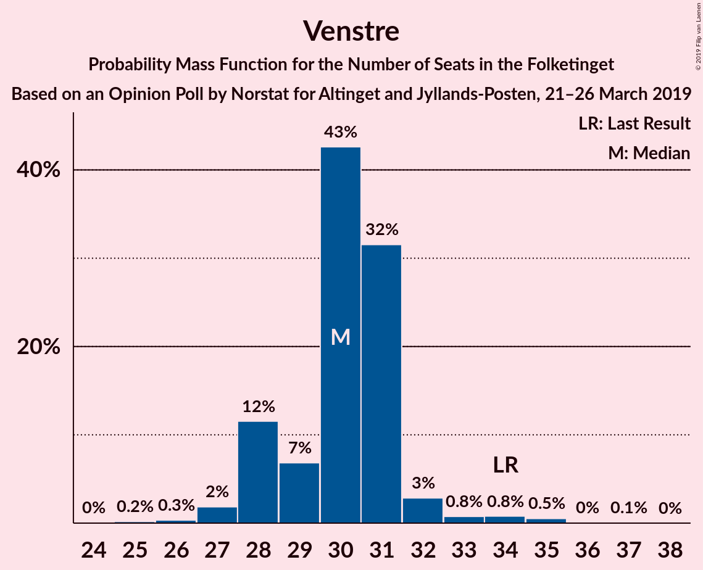

| Number of Seats | Probability | Accumulated | Special Marks |
|:---------------:|:-----------:|:-----------:|:-------------:|
| 24 | 0.6% | 100% |  |
| 25 | 0.1% | 99.4% |  |
| 26 | 0.2% | 99.3% |  |
| 27 | 2% | 99.1% |  |
| 28 | 1.1% | 97% |  |
| 29 | 1.3% | 96% |  |
| 30 | 71% | 94% | Median |
| 31 | 0.2% | 24% |  |
| 32 | 23% | 23% |  |
| 33 | 0.1% | 0.9% |  |
| 34 | 0.2% | 0.8% | Last Result |
| 35 | 0% | 0.6% |  |
| 36 | 0.3% | 0.6% |  |
| 37 | 0.2% | 0.2% |  |
| 38 | 0% | 0% |  |

### Dansk Folkeparti

*For a full overview of the results for this party, see the [Dansk Folkeparti](party-danskfolkeparti.html) page.*

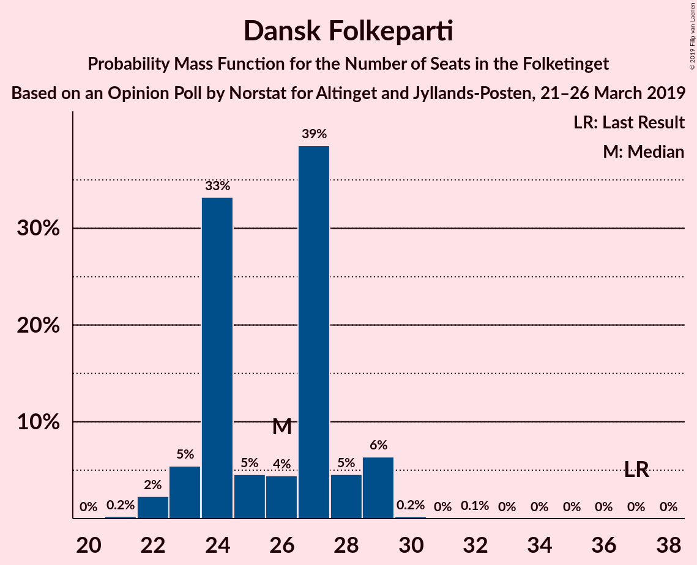

| Number of Seats | Probability | Accumulated | Special Marks |
|:---------------:|:-----------:|:-----------:|:-------------:|
| 21 | 0.1% | 100% |  |
| 22 | 20% | 99.9% |  |
| 23 | 1.0% | 80% |  |
| 24 | 0.6% | 79% |  |
| 25 | 0.9% | 78% |  |
| 26 | 50% | 77% | Median |
| 27 | 24% | 28% |  |
| 28 | 2% | 3% |  |
| 29 | 0.5% | 1.2% |  |
| 30 | 0.7% | 0.7% |  |
| 31 | 0% | 0% |  |
| 32 | 0% | 0% |  |
| 33 | 0% | 0% |  |
| 34 | 0% | 0% |  |
| 35 | 0% | 0% |  |
| 36 | 0% | 0% |  |
| 37 | 0% | 0% | Last Result |

### Enhedslisten–De Rød-Grønne

*For a full overview of the results for this party, see the [Enhedslisten–De Rød-Grønne](party-enhedslisten–derød-grønne.html) page.*

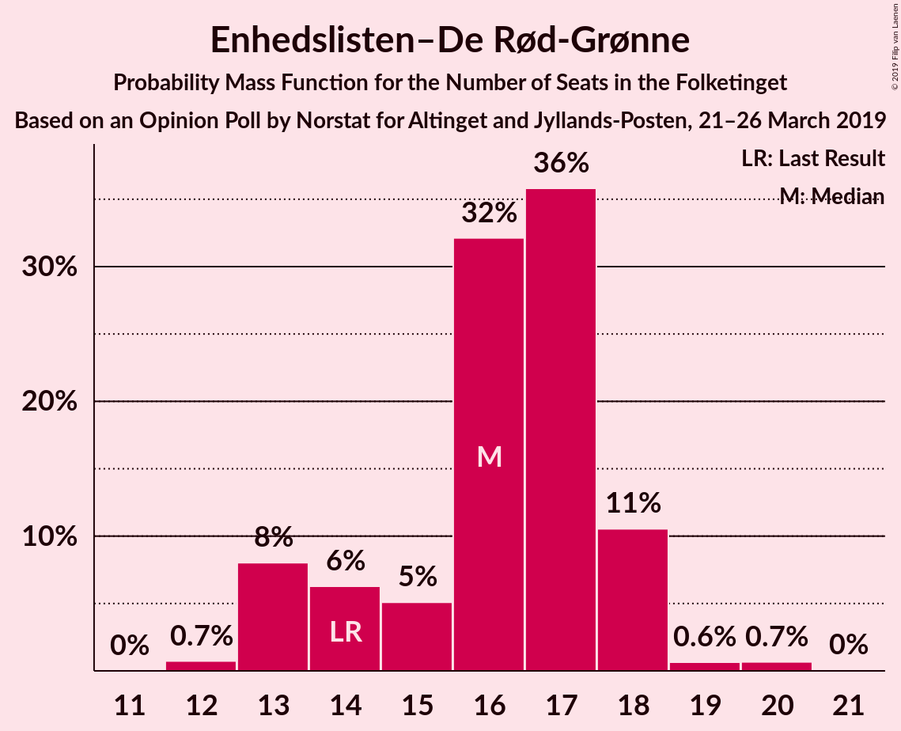

| Number of Seats | Probability | Accumulated | Special Marks |
|:---------------:|:-----------:|:-----------:|:-------------:|
| 12 | 0.4% | 100% |  |
| 13 | 21% | 99.6% |  |
| 14 | 0.7% | 79% | Last Result |
| 15 | 24% | 78% |  |
| 16 | 0.5% | 54% |  |
| 17 | 52% | 54% | Median |
| 18 | 0.1% | 1.4% |  |
| 19 | 0.9% | 1.3% |  |
| 20 | 0% | 0.4% |  |
| 21 | 0.4% | 0.4% |  |
| 22 | 0% | 0% |  |

### Radikale Venstre

*For a full overview of the results for this party, see the [Radikale Venstre](party-radikalevenstre.html) page.*

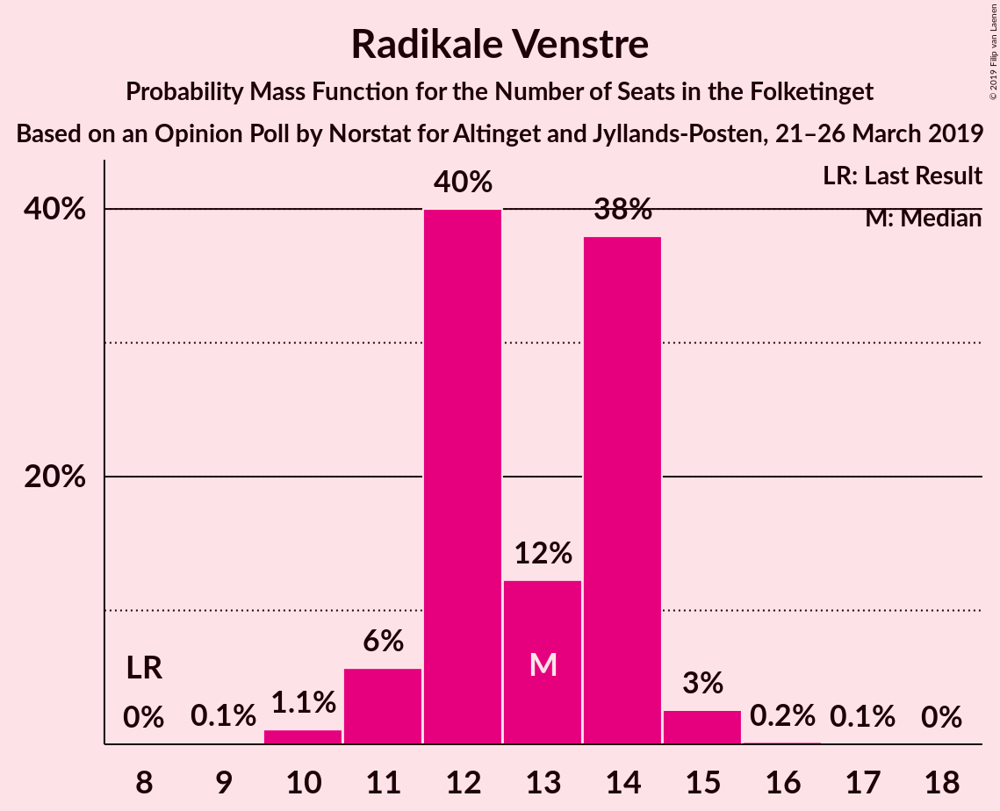

| Number of Seats | Probability | Accumulated | Special Marks |
|:---------------:|:-----------:|:-----------:|:-------------:|
| 8 | 0% | 100% | Last Result |
| 9 | 0.3% | 100% |  |
| 10 | 0.9% | 99.7% |  |
| 11 | 23% | 98.8% |  |
| 12 | 0.5% | 76% |  |
| 13 | 70% | 75% | Median |
| 14 | 3% | 5% |  |
| 15 | 0.8% | 1.4% |  |
| 16 | 0.4% | 0.6% |  |
| 17 | 0.2% | 0.2% |  |
| 18 | 0% | 0% |  |

### Socialistisk Folkeparti

*For a full overview of the results for this party, see the [Socialistisk Folkeparti](party-socialistiskfolkeparti.html) page.*

| Number of Seats | Probability | Accumulated | Special Marks |
|:---------------:|:-----------:|:-----------:|:-------------:|
| 7 | 0.5% | 100% | Last Result |
| 8 | 2% | 99.5% |  |
| 9 | 0.2% | 98% |  |
| 10 | 3% | 98% |  |
| 11 | 52% | 95% | Median |
| 12 | 0.4% | 43% |  |
| 13 | 41% | 43% |  |
| 14 | 2% | 2% |  |
| 15 | 0% | 0.1% |  |
| 16 | 0.1% | 0.1% |  |
| 17 | 0% | 0% |  |

### Det Konservative Folkeparti

*For a full overview of the results for this party, see the [Det Konservative Folkeparti](party-detkonservativefolkeparti.html) page.*

| Number of Seats | Probability | Accumulated | Special Marks |
|:---------------:|:-----------:|:-----------:|:-------------:|
| 5 | 0.1% | 100% |  |
| 6 | 2% | 99.9% | Last Result |
| 7 | 3% | 98% |  |
| 8 | 92% | 94% | Median |
| 9 | 0.9% | 3% |  |
| 10 | 1.5% | 2% |  |
| 11 | 0.2% | 0.2% |  |
| 12 | 0% | 0% |  |

### Alternativet

*For a full overview of the results for this party, see the [Alternativet](party-alternativet.html) page.*

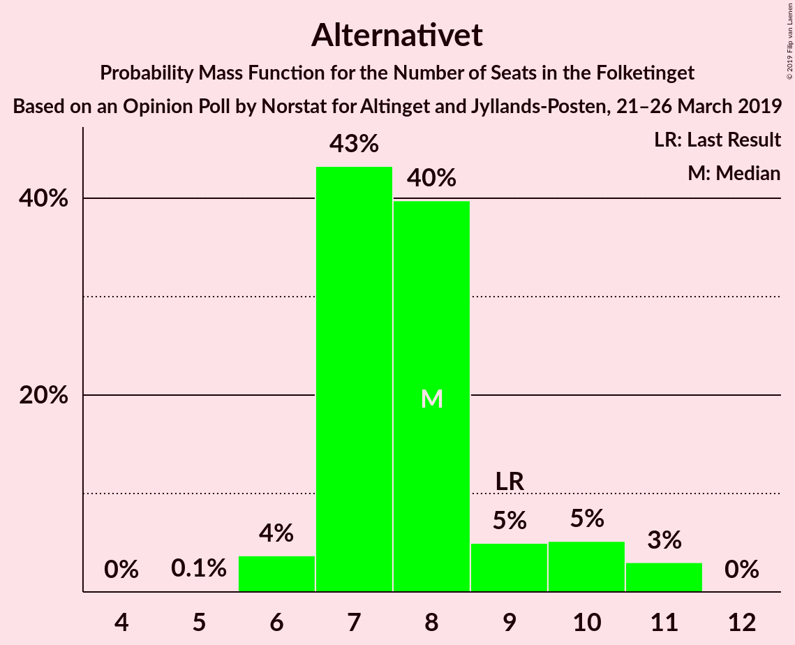

| Number of Seats | Probability | Accumulated | Special Marks |
|:---------------:|:-----------:|:-----------:|:-------------:|
| 5 | 0.7% | 100% |  |
| 6 | 22% | 99.3% |  |
| 7 | 51% | 77% | Median |
| 8 | 4% | 26% |  |
| 9 | 2% | 22% | Last Result |
| 10 | 20% | 20% |  |
| 11 | 0.1% | 0.2% |  |
| 12 | 0% | 0.1% |  |
| 13 | 0.1% | 0.1% |  |
| 14 | 0% | 0% |  |

### Nye Borgerlige

*For a full overview of the results for this party, see the [Nye Borgerlige](party-nyeborgerlige.html) page.*

| Number of Seats | Probability | Accumulated | Special Marks |
|:---------------:|:-----------:|:-----------:|:-------------:|
| 0 | 0% | 100% | Last Result |
| 1 | 0% | 100% |  |
| 2 | 0% | 100% |  |
| 3 | 0% | 100% |  |
| 4 | 0% | 100% |  |
| 5 | 0.5% | 100% |  |
| 6 | 3% | 99.4% |  |
| 7 | 70% | 97% | Median |
| 8 | 22% | 26% |  |
| 9 | 2% | 4% |  |
| 10 | 2% | 2% |  |
| 11 | 0.7% | 0.7% |  |
| 12 | 0% | 0% |  |

### Liberal Alliance

*For a full overview of the results for this party, see the [Liberal Alliance](party-liberalalliance.html) page.*

| Number of Seats | Probability | Accumulated | Special Marks |
|:---------------:|:-----------:|:-----------:|:-------------:|
| 4 | 0.5% | 100% |  |
| 5 | 52% | 99.5% | Median |
| 6 | 3% | 47% |  |
| 7 | 42% | 44% |  |
| 8 | 2% | 2% |  |
| 9 | 0.1% | 0.2% |  |
| 10 | 0.1% | 0.1% |  |
| 11 | 0% | 0% |  |
| 12 | 0% | 0% |  |
| 13 | 0% | 0% | Last Result |

### Kristendemokraterne

*For a full overview of the results for this party, see the [Kristendemokraterne](party-kristendemokraterne.html) page.*

| Number of Seats | Probability | Accumulated | Special Marks |
|:---------------:|:-----------:|:-----------:|:-------------:|
| 0 | 100% | 100% | Last Result, Median |

### Klaus Riskær Pedersen

*For a full overview of the results for this party, see the [Klaus Riskær Pedersen](party-klausriskærpedersen.html) page.*

| Number of Seats | Probability | Accumulated | Special Marks |
|:---------------:|:-----------:|:-----------:|:-------------:|
| 0 | 100% | 100% | Last Result, Median |

## Coalitions

### Confidence Intervals

| Coalition | Last Result | Median | Majority? | 80% Confidence Interval | 90% Confidence Interval | 95% Confidence Interval | 99% Confidence Interval |
|:---------:|:-----------:|:------:|:---------:|:-----------------------:|:-----------------------:|:-----------------------:|:-----------------------:|
| Socialdemokraterne – Enhedslisten–De Rød-Grønne – Radikale Venstre – Socialistisk Folkeparti – Alternativet | 85 | 99 | 100% | 93–101 | 93–101 | 93–101 | 92–105 |
| Socialdemokraterne – Enhedslisten–De Rød-Grønne – Radikale Venstre – Socialistisk Folkeparti | 76 | 92 | 73% | 87–92 | 87–92 | 87–92 | 85–97 |
| Socialdemokraterne – Enhedslisten–De Rød-Grønne – Socialistisk Folkeparti – Alternativet | 77 | 86 | 2% | 82–88 | 82–88 | 82–88 | 81–91 |
| Venstre – Dansk Folkeparti – Det Konservative Folkeparti – Nye Borgerlige – Liberal Alliance – Kristendemokraterne – Klaus Riskær Pedersen | 90 | 76 | 0% | 74–82 | 74–82 | 74–82 | 70–83 |
| Venstre – Dansk Folkeparti – Det Konservative Folkeparti – Nye Borgerlige – Liberal Alliance – Klaus Riskær Pedersen | 90 | 76 | 0% | 74–82 | 74–82 | 74–82 | 70–83 |
| Venstre – Dansk Folkeparti – Det Konservative Folkeparti – Nye Borgerlige – Liberal Alliance – Kristendemokraterne | 90 | 76 | 0% | 74–82 | 74–82 | 74–82 | 70–83 |
| Venstre – Dansk Folkeparti – Det Konservative Folkeparti – Nye Borgerlige – Liberal Alliance | 90 | 76 | 0% | 74–82 | 74–82 | 74–82 | 70–83 |
| Socialdemokraterne – Enhedslisten–De Rød-Grønne – Socialistisk Folkeparti | 68 | 79 | 0% | 76–79 | 76–79 | 75–81 | 72–83 |
| Socialdemokraterne – Radikale Venstre – Socialistisk Folkeparti | 62 | 75 | 0% | 72–78 | 72–78 | 71–78 | 67–80 |
| Venstre – Dansk Folkeparti – Det Konservative Folkeparti – Liberal Alliance – Kristendemokraterne | 90 | 69 | 0% | 67–74 | 67–74 | 67–74 | 64–75 |
| Venstre – Dansk Folkeparti – Det Konservative Folkeparti – Liberal Alliance | 90 | 69 | 0% | 67–74 | 67–74 | 67–74 | 64–75 |
| Socialdemokraterne – Radikale Venstre | 55 | 64 | 0% | 59–65 | 59–65 | 59–66 | 57–67 |
| Venstre – Det Konservative Folkeparti – Liberal Alliance | 53 | 43 | 0% | 43–47 | 43–47 | 40–47 | 39–50 |
| Venstre – Det Konservative Folkeparti | 40 | 38 | 0% | 38–40 | 36–40 | 35–40 | 34–45 |
| Venstre | 34 | 30 | 0% | 30–32 | 29–32 | 27–32 | 24–36 |

### Socialdemokraterne – Enhedslisten–De Rød-Grønne – Radikale Venstre – Socialistisk Folkeparti – Alternativet

| Number of Seats | Probability | Accumulated | Special Marks |
|:---------------:|:-----------:|:-----------:|:-------------:|
| 85 | 0% | 100% | Last Result |
| 86 | 0% | 100% |  |
| 87 | 0% | 100% |  |
| 88 | 0% | 100% |  |
| 89 | 0% | 100% |  |
| 90 | 0.3% | 100% | Majority |
| 91 | 0% | 99.7% |  |
| 92 | 0.3% | 99.7% |  |
| 93 | 22% | 99.4% |  |
| 94 | 0.4% | 78% |  |
| 95 | 2% | 77% |  |
| 96 | 0.2% | 75% |  |
| 97 | 0.8% | 75% |  |
| 98 | 2% | 74% |  |
| 99 | 50% | 72% | Median |
| 100 | 1.1% | 22% |  |
| 101 | 20% | 21% |  |
| 102 | 0.1% | 1.5% |  |
| 103 | 0.1% | 1.4% |  |
| 104 | 0.6% | 1.3% |  |
| 105 | 0.3% | 0.7% |  |
| 106 | 0.4% | 0.4% |  |
| 107 | 0% | 0% |  |

### Socialdemokraterne – Enhedslisten–De Rød-Grønne – Radikale Venstre – Socialistisk Folkeparti

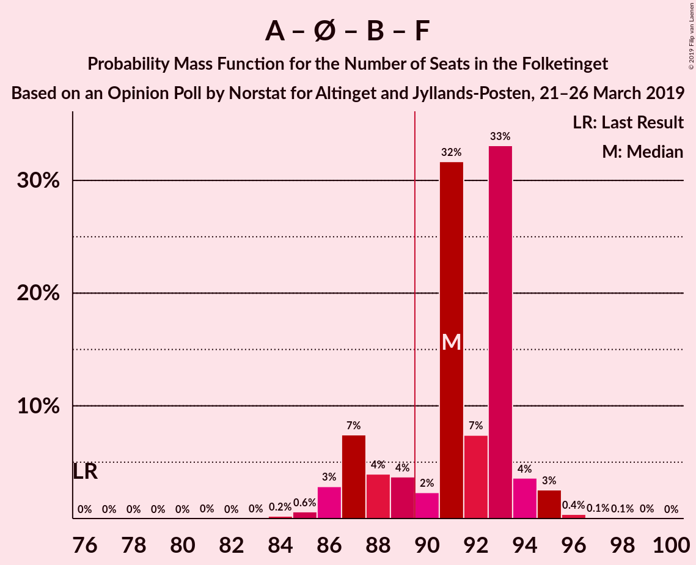

| Number of Seats | Probability | Accumulated | Special Marks |
|:---------------:|:-----------:|:-----------:|:-------------:|
| 76 | 0% | 100% | Last Result |
| 77 | 0% | 100% |  |
| 78 | 0% | 100% |  |
| 79 | 0% | 100% |  |
| 80 | 0% | 100% |  |
| 81 | 0.2% | 100% |  |
| 82 | 0.1% | 99.8% |  |
| 83 | 0% | 99.7% |  |
| 84 | 0% | 99.6% |  |
| 85 | 0.7% | 99.6% |  |
| 86 | 0.1% | 98.9% |  |
| 87 | 22% | 98.7% |  |
| 88 | 2% | 77% |  |
| 89 | 1.2% | 75% |  |
| 90 | 2% | 73% | Majority |
| 91 | 21% | 72% |  |
| 92 | 50% | 51% | Median |
| 93 | 0.2% | 2% |  |
| 94 | 0.1% | 2% |  |
| 95 | 0.1% | 1.4% |  |
| 96 | 0.6% | 1.4% |  |
| 97 | 0.4% | 0.7% |  |
| 98 | 0% | 0.4% |  |
| 99 | 0.4% | 0.4% |  |
| 100 | 0% | 0% |  |

### Socialdemokraterne – Enhedslisten–De Rød-Grønne – Socialistisk Folkeparti – Alternativet

| Number of Seats | Probability | Accumulated | Special Marks |
|:---------------:|:-----------:|:-----------:|:-------------:|
| 77 | 0% | 100% | Last Result |
| 78 | 0% | 100% |  |
| 79 | 0.4% | 100% |  |
| 80 | 0% | 99.5% |  |
| 81 | 1.0% | 99.5% |  |
| 82 | 23% | 98% |  |
| 83 | 1.2% | 76% |  |
| 84 | 2% | 75% |  |
| 85 | 0.8% | 72% |  |
| 86 | 50% | 72% | Median |
| 87 | 0.1% | 22% |  |
| 88 | 20% | 22% |  |
| 89 | 0.5% | 2% |  |
| 90 | 0.7% | 2% | Majority |
| 91 | 0.6% | 1.1% |  |
| 92 | 0.4% | 0.4% |  |
| 93 | 0.1% | 0.1% |  |
| 94 | 0% | 0% |  |

### Venstre – Dansk Folkeparti – Det Konservative Folkeparti – Nye Borgerlige – Liberal Alliance – Kristendemokraterne – Klaus Riskær Pedersen

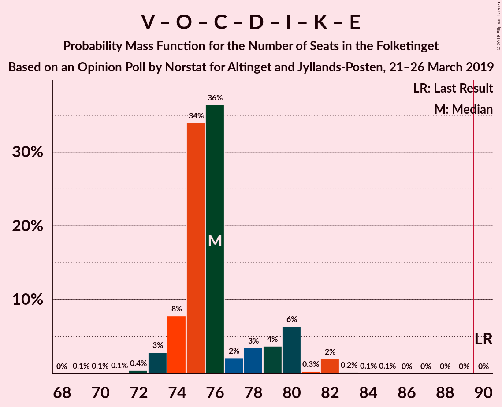

| Number of Seats | Probability | Accumulated | Special Marks |
|:---------------:|:-----------:|:-----------:|:-------------:|
| 69 | 0.4% | 100% |  |
| 70 | 0.3% | 99.6% |  |
| 71 | 0.6% | 99.3% |  |
| 72 | 0.1% | 98.7% |  |
| 73 | 0.1% | 98.6% |  |
| 74 | 20% | 98.5% |  |
| 75 | 1.1% | 79% |  |
| 76 | 50% | 78% | Median |
| 77 | 2% | 28% |  |
| 78 | 0.8% | 26% |  |
| 79 | 0.2% | 25% |  |
| 80 | 2% | 25% |  |
| 81 | 0.4% | 23% |  |
| 82 | 22% | 22% |  |
| 83 | 0.3% | 0.6% |  |
| 84 | 0% | 0.3% |  |
| 85 | 0.3% | 0.3% |  |
| 86 | 0% | 0% |  |
| 87 | 0% | 0% |  |
| 88 | 0% | 0% |  |
| 89 | 0% | 0% |  |
| 90 | 0% | 0% | Last Result, Majority |

### Venstre – Dansk Folkeparti – Det Konservative Folkeparti – Nye Borgerlige – Liberal Alliance – Klaus Riskær Pedersen

| Number of Seats | Probability | Accumulated | Special Marks |
|:---------------:|:-----------:|:-----------:|:-------------:|
| 69 | 0.4% | 100% |  |
| 70 | 0.3% | 99.6% |  |
| 71 | 0.6% | 99.3% |  |
| 72 | 0.1% | 98.7% |  |
| 73 | 0.1% | 98.6% |  |
| 74 | 20% | 98.5% |  |
| 75 | 1.1% | 79% |  |
| 76 | 50% | 78% | Median |
| 77 | 2% | 28% |  |
| 78 | 0.8% | 26% |  |
| 79 | 0.2% | 25% |  |
| 80 | 2% | 25% |  |
| 81 | 0.4% | 23% |  |
| 82 | 22% | 22% |  |
| 83 | 0.3% | 0.6% |  |
| 84 | 0% | 0.3% |  |
| 85 | 0.3% | 0.3% |  |
| 86 | 0% | 0% |  |
| 87 | 0% | 0% |  |
| 88 | 0% | 0% |  |
| 89 | 0% | 0% |  |
| 90 | 0% | 0% | Last Result, Majority |

### Venstre – Dansk Folkeparti – Det Konservative Folkeparti – Nye Borgerlige – Liberal Alliance – Kristendemokraterne

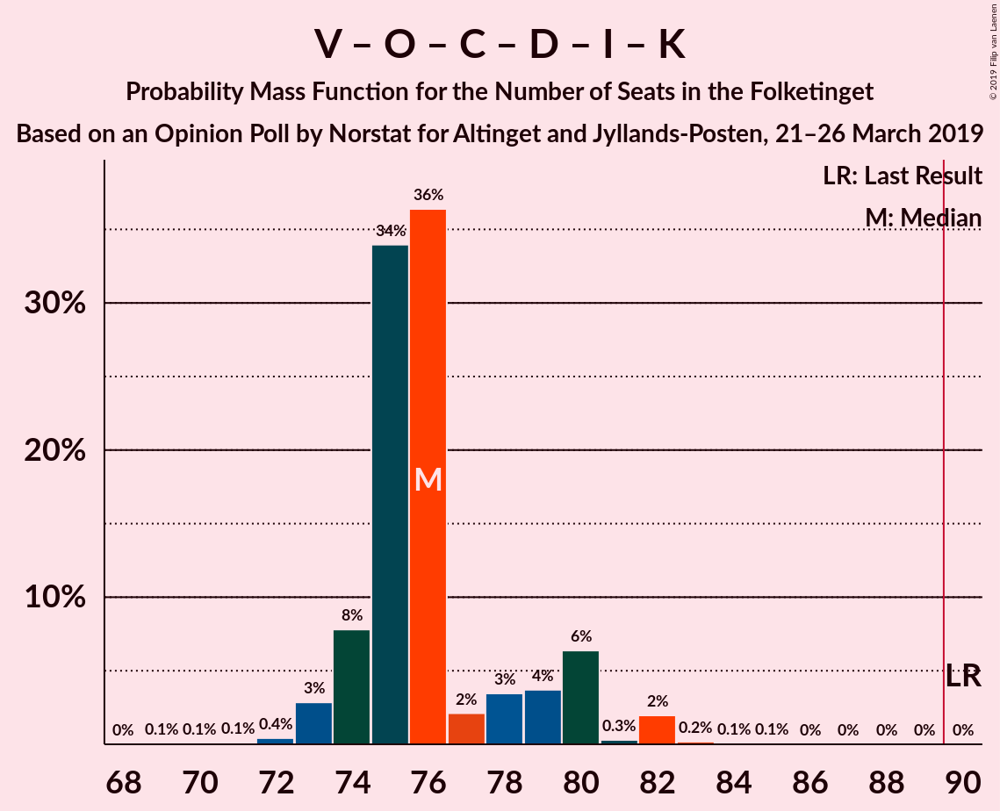

| Number of Seats | Probability | Accumulated | Special Marks |
|:---------------:|:-----------:|:-----------:|:-------------:|
| 69 | 0.4% | 100% |  |
| 70 | 0.3% | 99.6% |  |
| 71 | 0.6% | 99.3% |  |
| 72 | 0.1% | 98.7% |  |
| 73 | 0.1% | 98.6% |  |
| 74 | 20% | 98% |  |
| 75 | 1.1% | 79% |  |
| 76 | 50% | 78% | Median |
| 77 | 2% | 28% |  |
| 78 | 0.8% | 26% |  |
| 79 | 0.2% | 25% |  |
| 80 | 2% | 25% |  |
| 81 | 0.4% | 23% |  |
| 82 | 22% | 22% |  |
| 83 | 0.3% | 0.6% |  |
| 84 | 0% | 0.3% |  |
| 85 | 0.3% | 0.3% |  |
| 86 | 0% | 0% |  |
| 87 | 0% | 0% |  |
| 88 | 0% | 0% |  |
| 89 | 0% | 0% |  |
| 90 | 0% | 0% | Last Result, Majority |

### Venstre – Dansk Folkeparti – Det Konservative Folkeparti – Nye Borgerlige – Liberal Alliance

| Number of Seats | Probability | Accumulated | Special Marks |
|:---------------:|:-----------:|:-----------:|:-------------:|
| 69 | 0.4% | 100% |  |
| 70 | 0.3% | 99.6% |  |
| 71 | 0.6% | 99.3% |  |
| 72 | 0.1% | 98.6% |  |
| 73 | 0.1% | 98.5% |  |
| 74 | 20% | 98% |  |
| 75 | 1.1% | 79% |  |
| 76 | 50% | 78% | Median |
| 77 | 2% | 28% |  |
| 78 | 0.8% | 26% |  |
| 79 | 0.2% | 25% |  |
| 80 | 2% | 25% |  |
| 81 | 0.4% | 23% |  |
| 82 | 22% | 22% |  |
| 83 | 0.3% | 0.6% |  |
| 84 | 0% | 0.3% |  |
| 85 | 0.3% | 0.3% |  |
| 86 | 0% | 0% |  |
| 87 | 0% | 0% |  |
| 88 | 0% | 0% |  |
| 89 | 0% | 0% |  |
| 90 | 0% | 0% | Last Result, Majority |

### Socialdemokraterne – Enhedslisten–De Rød-Grønne – Socialistisk Folkeparti

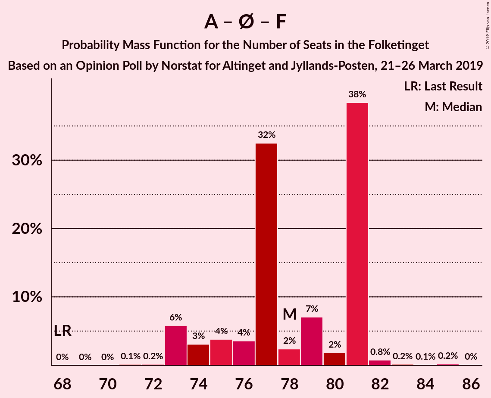

| Number of Seats | Probability | Accumulated | Special Marks |
|:---------------:|:-----------:|:-----------:|:-------------:|
| 68 | 0% | 100% | Last Result |
| 69 | 0% | 100% |  |
| 70 | 0% | 100% |  |
| 71 | 0.4% | 99.9% |  |
| 72 | 0.2% | 99.6% |  |
| 73 | 0.5% | 99.3% |  |
| 74 | 1.2% | 98.9% |  |
| 75 | 2% | 98% |  |
| 76 | 23% | 96% |  |
| 77 | 1.0% | 72% |  |
| 78 | 20% | 71% |  |
| 79 | 49% | 52% | Median |
| 80 | 0.1% | 3% |  |
| 81 | 2% | 3% |  |
| 82 | 0.1% | 1.2% |  |
| 83 | 0.7% | 1.1% |  |
| 84 | 0% | 0.4% |  |
| 85 | 0.3% | 0.4% |  |
| 86 | 0% | 0% |  |

### Socialdemokraterne – Radikale Venstre – Socialistisk Folkeparti

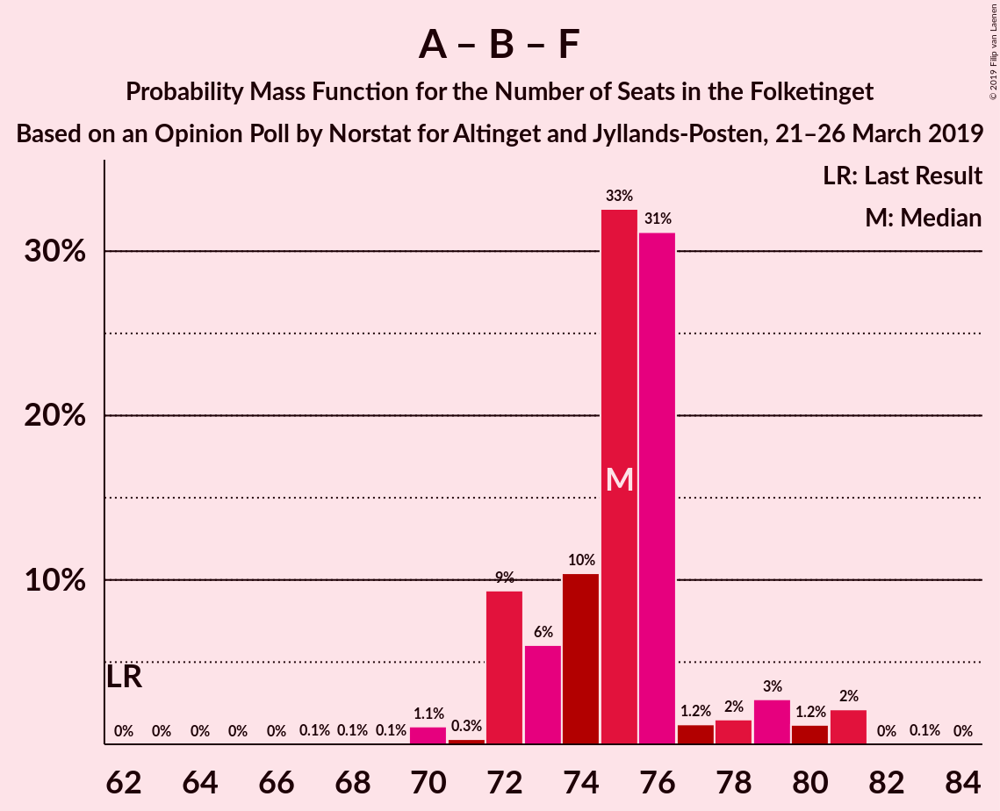

| Number of Seats | Probability | Accumulated | Special Marks |
|:---------------:|:-----------:|:-----------:|:-------------:|
| 62 | 0% | 100% | Last Result |
| 63 | 0% | 100% |  |
| 64 | 0% | 100% |  |
| 65 | 0.2% | 100% |  |
| 66 | 0% | 99.8% |  |
| 67 | 0.4% | 99.8% |  |
| 68 | 0.6% | 99.4% |  |
| 69 | 0.1% | 98.8% |  |
| 70 | 0.1% | 98.7% |  |
| 71 | 2% | 98.6% |  |
| 72 | 22% | 97% |  |
| 73 | 0.2% | 75% |  |
| 74 | 0.8% | 74% |  |
| 75 | 51% | 74% | Median |
| 76 | 1.0% | 22% |  |
| 77 | 0.1% | 21% |  |
| 78 | 20% | 21% |  |
| 79 | 0.6% | 2% |  |
| 80 | 0.5% | 0.9% |  |
| 81 | 0.1% | 0.4% |  |
| 82 | 0% | 0.3% |  |
| 83 | 0.3% | 0.3% |  |
| 84 | 0% | 0% |  |

### Venstre – Dansk Folkeparti – Det Konservative Folkeparti – Liberal Alliance – Kristendemokraterne

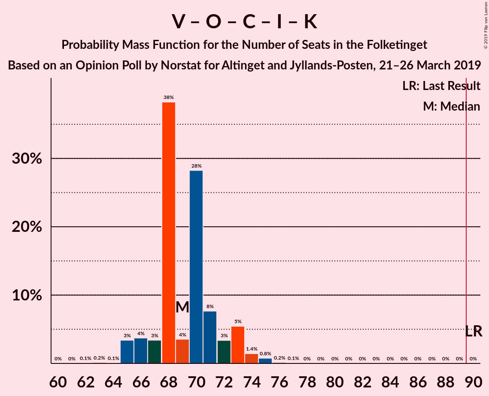

| Number of Seats | Probability | Accumulated | Special Marks |
|:---------------:|:-----------:|:-----------:|:-------------:|
| 62 | 0% | 100% |  |
| 63 | 0% | 99.9% |  |
| 64 | 1.2% | 99.9% |  |
| 65 | 0.1% | 98.7% |  |
| 66 | 0.1% | 98.5% |  |
| 67 | 22% | 98% |  |
| 68 | 0.1% | 77% |  |
| 69 | 50% | 77% | Median |
| 70 | 0.3% | 26% |  |
| 71 | 2% | 26% |  |
| 72 | 0.3% | 24% |  |
| 73 | 0.8% | 23% |  |
| 74 | 22% | 23% |  |
| 75 | 0.9% | 1.0% |  |
| 76 | 0.1% | 0.2% |  |
| 77 | 0% | 0% |  |
| 78 | 0% | 0% |  |
| 79 | 0% | 0% |  |
| 80 | 0% | 0% |  |
| 81 | 0% | 0% |  |
| 82 | 0% | 0% |  |
| 83 | 0% | 0% |  |
| 84 | 0% | 0% |  |
| 85 | 0% | 0% |  |
| 86 | 0% | 0% |  |
| 87 | 0% | 0% |  |
| 88 | 0% | 0% |  |
| 89 | 0% | 0% |  |
| 90 | 0% | 0% | Last Result, Majority |

### Venstre – Dansk Folkeparti – Det Konservative Folkeparti – Liberal Alliance

| Number of Seats | Probability | Accumulated | Special Marks |
|:---------------:|:-----------:|:-----------:|:-------------:|
| 62 | 0% | 100% |  |
| 63 | 0% | 99.9% |  |
| 64 | 1.2% | 99.9% |  |
| 65 | 0.1% | 98.6% |  |
| 66 | 0.1% | 98.5% |  |
| 67 | 22% | 98% |  |
| 68 | 0.1% | 77% |  |
| 69 | 50% | 77% | Median |
| 70 | 0.3% | 26% |  |
| 71 | 2% | 26% |  |
| 72 | 0.3% | 24% |  |
| 73 | 0.8% | 23% |  |
| 74 | 22% | 23% |  |
| 75 | 0.9% | 1.0% |  |
| 76 | 0.1% | 0.2% |  |
| 77 | 0% | 0% |  |
| 78 | 0% | 0% |  |
| 79 | 0% | 0% |  |
| 80 | 0% | 0% |  |
| 81 | 0% | 0% |  |
| 82 | 0% | 0% |  |
| 83 | 0% | 0% |  |
| 84 | 0% | 0% |  |
| 85 | 0% | 0% |  |
| 86 | 0% | 0% |  |
| 87 | 0% | 0% |  |
| 88 | 0% | 0% |  |
| 89 | 0% | 0% |  |
| 90 | 0% | 0% | Last Result, Majority |

### Socialdemokraterne – Radikale Venstre

| Number of Seats | Probability | Accumulated | Special Marks |
|:---------------:|:-----------:|:-----------:|:-------------:|
| 55 | 0.2% | 100% | Last Result |
| 56 | 0.1% | 99.8% |  |
| 57 | 0.9% | 99.7% |  |
| 58 | 0.2% | 98.9% |  |
| 59 | 21% | 98.7% |  |
| 60 | 2% | 78% |  |
| 61 | 2% | 76% |  |
| 62 | 0.1% | 74% |  |
| 63 | 0.1% | 74% |  |
| 64 | 50% | 74% | Median |
| 65 | 21% | 24% |  |
| 66 | 1.1% | 3% |  |
| 67 | 1.3% | 2% |  |
| 68 | 0.1% | 0.5% |  |
| 69 | 0% | 0.4% |  |
| 70 | 0.1% | 0.4% |  |
| 71 | 0% | 0.3% |  |
| 72 | 0% | 0.3% |  |
| 73 | 0.3% | 0.3% |  |
| 74 | 0% | 0% |  |

### Venstre – Det Konservative Folkeparti – Liberal Alliance

| Number of Seats | Probability | Accumulated | Special Marks |
|:---------------:|:-----------:|:-----------:|:-------------:|
| 38 | 0.1% | 100% |  |
| 39 | 1.4% | 99.8% |  |
| 40 | 1.4% | 98% |  |
| 41 | 0.9% | 97% |  |
| 42 | 1.2% | 96% |  |
| 43 | 49% | 95% | Median |
| 44 | 2% | 46% |  |
| 45 | 20% | 44% |  |
| 46 | 1.4% | 24% |  |
| 47 | 21% | 22% |  |
| 48 | 0.1% | 1.1% |  |
| 49 | 0.4% | 0.9% |  |
| 50 | 0.1% | 0.5% |  |
| 51 | 0.1% | 0.4% |  |
| 52 | 0.3% | 0.3% |  |
| 53 | 0% | 0% | Last Result |

### Venstre – Det Konservative Folkeparti

| Number of Seats | Probability | Accumulated | Special Marks |
|:---------------:|:-----------:|:-----------:|:-------------:|
| 32 | 0.1% | 100% |  |
| 33 | 0.2% | 99.9% |  |
| 34 | 2% | 99.7% |  |
| 35 | 2% | 98% |  |
| 36 | 2% | 96% |  |
| 37 | 0.2% | 94% |  |
| 38 | 69% | 93% | Median |
| 39 | 1.2% | 24% |  |
| 40 | 22% | 23% | Last Result |
| 41 | 0.1% | 1.1% |  |
| 42 | 0.2% | 1.0% |  |
| 43 | 0.1% | 0.8% |  |
| 44 | 0.1% | 0.7% |  |
| 45 | 0.3% | 0.6% |  |
| 46 | 0.2% | 0.2% |  |
| 47 | 0% | 0% |  |

### Venstre

| Number of Seats | Probability | Accumulated | Special Marks |
|:---------------:|:-----------:|:-----------:|:-------------:|
| 24 | 0.6% | 100% |  |
| 25 | 0.1% | 99.4% |  |
| 26 | 0.2% | 99.3% |  |
| 27 | 2% | 99.1% |  |
| 28 | 1.1% | 97% |  |
| 29 | 1.3% | 96% |  |
| 30 | 71% | 94% | Median |
| 31 | 0.2% | 24% |  |
| 32 | 23% | 23% |  |
| 33 | 0.1% | 0.9% |  |
| 34 | 0.2% | 0.8% | Last Result |
| 35 | 0% | 0.6% |  |
| 36 | 0.3% | 0.6% |  |
| 37 | 0.2% | 0.2% |  |
| 38 | 0% | 0% |  |

## Technical Information

### Opinion Poll

+ **Polling firm:** Norstat
+ **Commissioner(s):** Altinget and Jyllands-Posten
+ **Fieldwork period:** 21–26 March 2019

### Calculations

+ **Sample size:** 1204
+ **Simulations done:** 131,072
+ **Error estimate:** 1.95%

