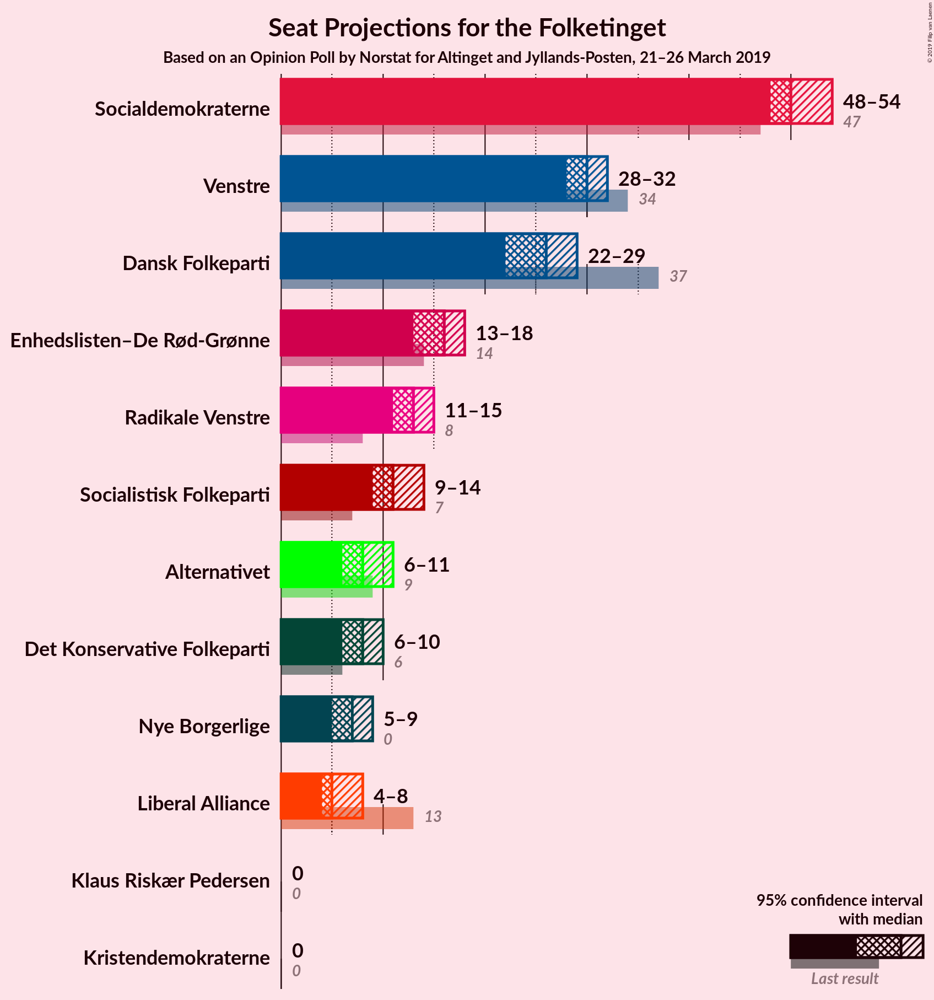
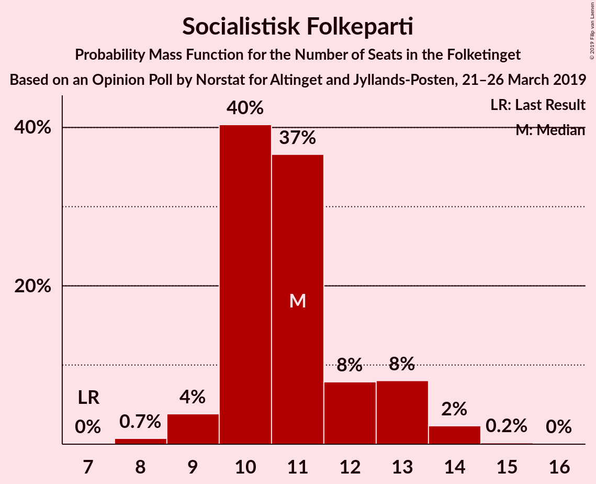
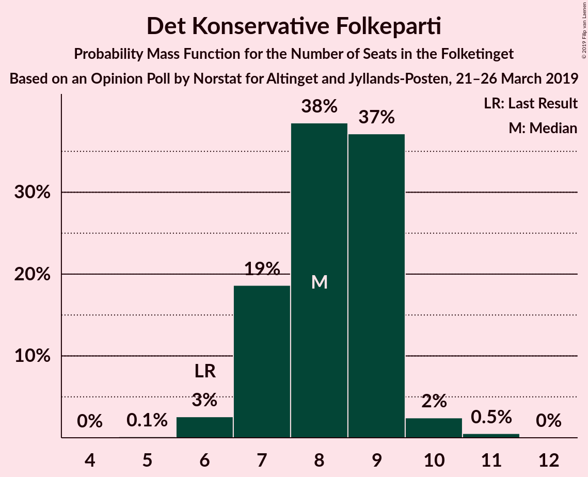
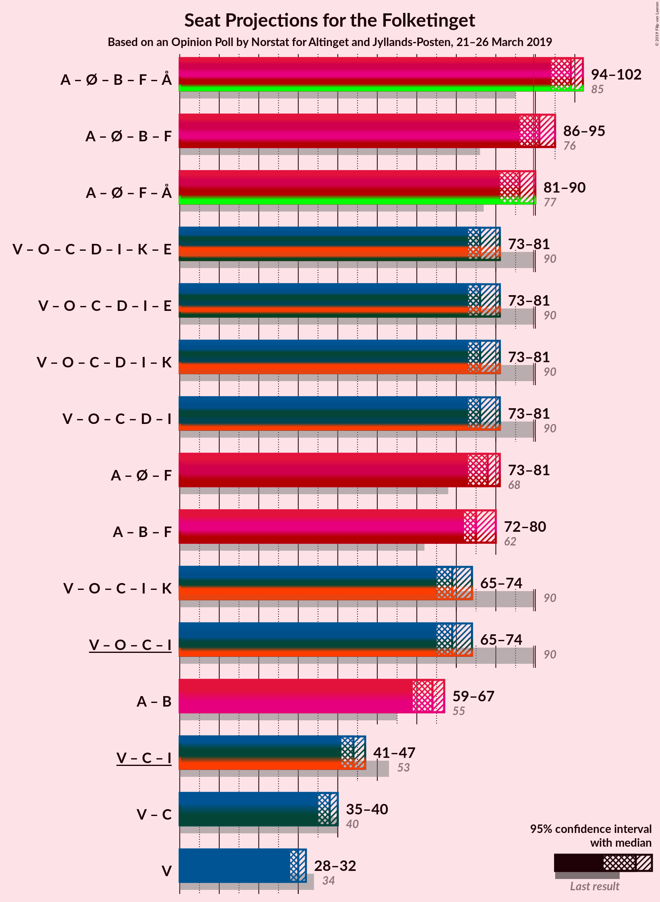
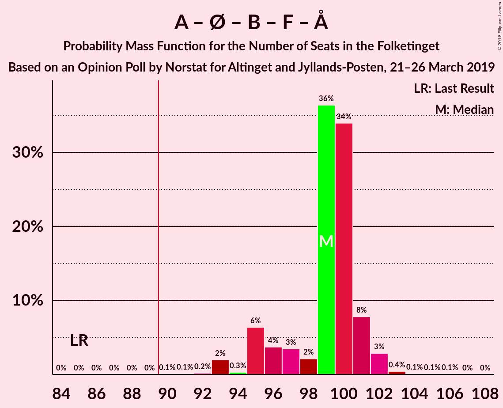
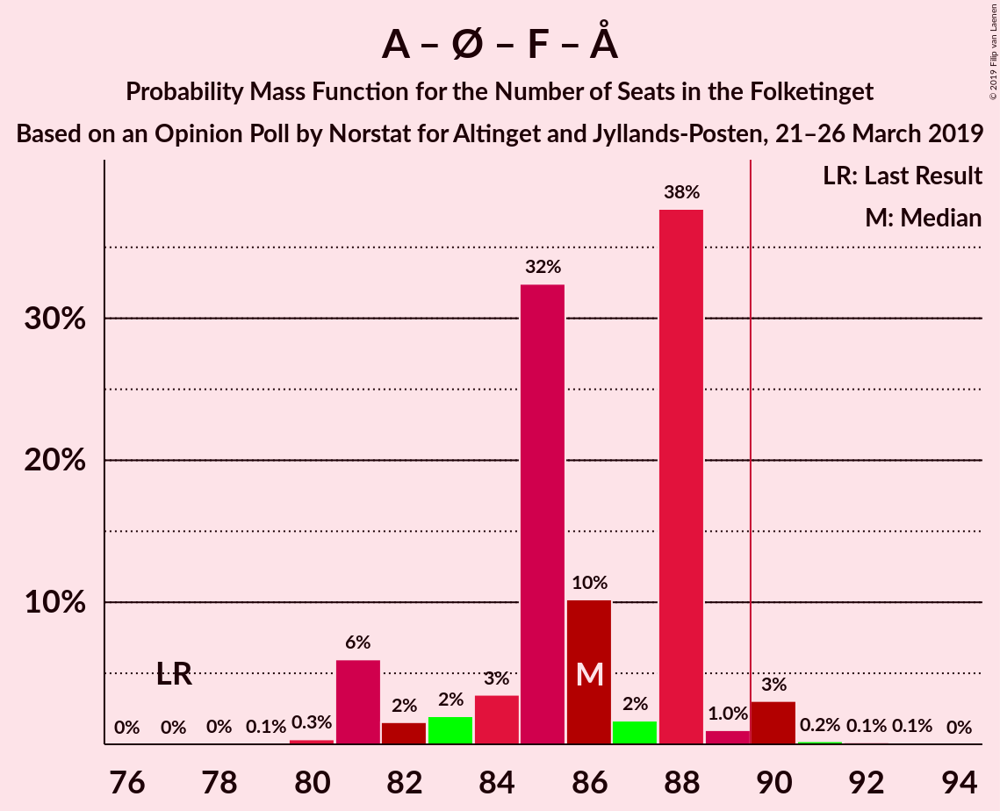
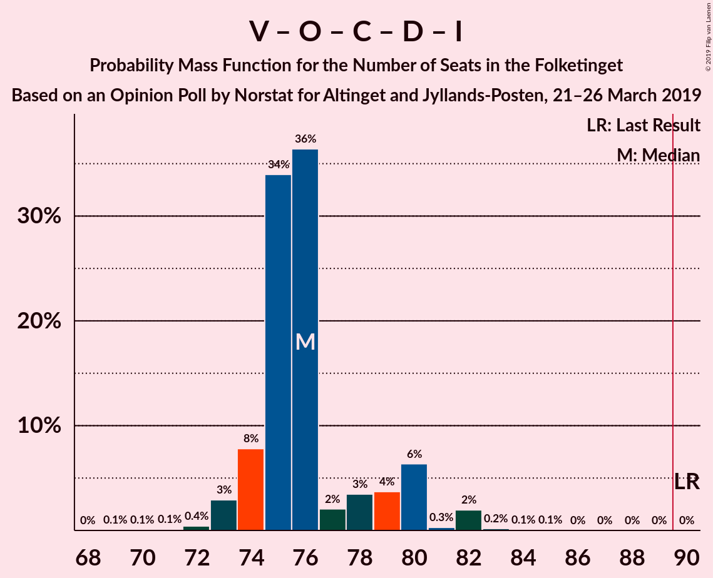
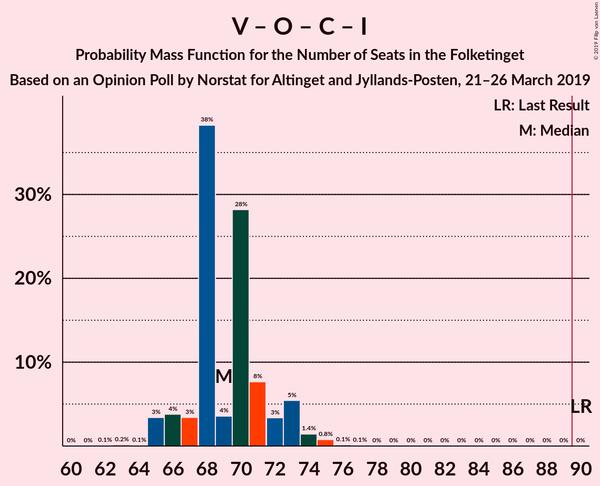
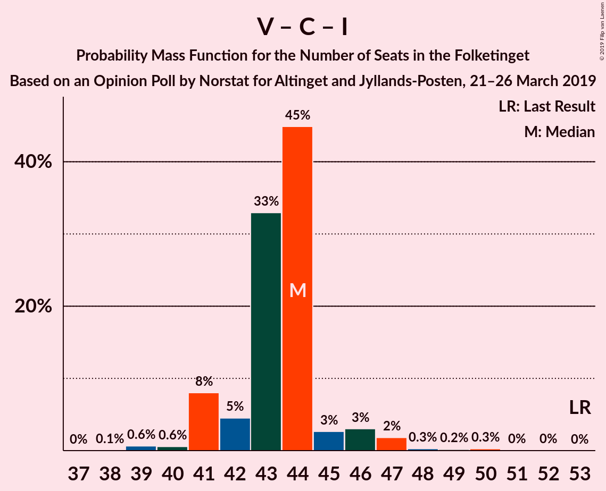

# Opinion Poll by Norstat for Altinget and Jyllands-Posten, 21–26 March 2019

<a href="#voting-intentions">Voting Intentions</a> | <a href="#seats">Seats</a> | <a href="#coalitions">Coalitions</a> | <a href="#technical-information">Technical Information</a>

## Voting Intentions

### Confidence Intervals

| Party | Last Result | Poll Result | 80% Confidence Interval | 90% Confidence Interval | 95% Confidence Interval | 99% Confidence Interval |
|:-----:|:-----------:|:-----------:|:-----------------------:|:-----------------------:|:-----------------------:|:-----------------------:|
| Socialdemokraterne | 26.3% | 28.7% | 27.1–30.5% |26.6–30.9% |26.2–31.4% |25.5–32.2% |
| Venstre | 19.5% | 16.9% | 15.5–18.3% |15.2–18.7% |14.8–19.1% |14.2–19.8% |
| Dansk Folkeparti | 21.1% | 14.4% | 13.1–15.7% |12.8–16.1% |12.5–16.5% |11.9–17.1% |
| Enhedslisten–De Rød-Grønne | 7.8% | 8.9% | 7.9–10.0% |7.6–10.3% |7.4–10.6% |7.0–11.2% |
| Radikale Venstre | 4.6% | 7.0% | 6.1–8.0% |5.9–8.3% |5.7–8.6% |5.3–9.1% |
| Socialistisk Folkeparti | 4.2% | 6.2% | 5.4–7.2% |5.2–7.5% |5.0–7.7% |4.6–8.2% |
| Det Konservative Folkeparti | 3.4% | 4.4% | 3.7–5.3% |3.5–5.5% |3.4–5.7% |3.1–6.2% |
| Alternativet | 4.8% | 4.3% | 3.6–5.2% |3.5–5.4% |3.3–5.6% |3.0–6.1% |
| Nye Borgerlige | 0.0% | 4.1% | 3.4–4.9% |3.2–5.1% |3.1–5.3% |2.8–5.8% |
| Liberal Alliance | 7.5% | 3.2% | 2.7–4.0% |2.5–4.2% |2.4–4.4% |2.1–4.8% |
| Kristendemokraterne | 0.8% | 0.9% | 0.6–1.4% |0.6–1.5% |0.5–1.6% |0.4–1.9% |
| Klaus Riskær Pedersen | 0.0% | 0.8% | 0.6–1.3% |0.5–1.4% |0.4–1.5% |0.4–1.8% |

*Note:* The poll result column reflects the actual value used in the calculations. Published results may vary slightly, and in addition be rounded to fewer digits.

## Seats

### Confidence Intervals

| Party | Last Result | Median | 80% Confidence Interval | 90% Confidence Interval | 95% Confidence Interval | 99% Confidence Interval |
|:-----:|:-----------:|:------:|:-----------------------:|:-----------------------:|:-----------------------:|:-----------------------:|
| <a href="#socialdemokraterne">Socialdemokraterne</a> | 47 | 50 | 49–54 |48–54 |48–54 |47–55 |
| <a href="#venstre">Venstre</a> | 34 | 30 | 28–31 |28–32 |28–32 |26–35 |
| <a href="#dansk-folkeparti">Dansk Folkeparti</a> | 37 | 26 | 24–28 |23–29 |22–29 |22–29 |
| <a href="#enhedslisten–de-rød-grønne">Enhedslisten–De Rød-Grønne</a> | 14 | 16 | 14–18 |13–18 |13–18 |12–20 |
| <a href="#radikale-venstre">Radikale Venstre</a> | 8 | 13 | 12–14 |11–14 |11–15 |10–15 |
| <a href="#socialistisk-folkeparti">Socialistisk Folkeparti</a> | 7 | 11 | 10–13 |10–13 |9–14 |8–14 |
| <a href="#det-konservative-folkeparti">Det Konservative Folkeparti</a> | 6 | 8 | 7–9 |7–9 |6–10 |6–11 |
| <a href="#alternativet">Alternativet</a> | 9 | 8 | 7–9 |7–10 |6–11 |6–11 |
| <a href="#nye-borgerlige">Nye Borgerlige</a> | 0 | 7 | 6–8 |6–8 |5–9 |5–10 |
| <a href="#liberal-alliance">Liberal Alliance</a> | 13 | 5 | 4–7 |4–7 |4–8 |4–9 |
| <a href="#kristendemokraterne">Kristendemokraterne</a> | 0 | 0 | 0 |0 |0 |0 |
| <a href="#klaus-riskær-pedersen">Klaus Riskær Pedersen</a> | 0 | 0 | 0 |0 |0 |0 |

### Socialdemokraterne

*For a full overview of the results for this party, see the [Socialdemokraterne](party-socialdemokraterne.html) page.*

| Number of Seats | Probability | Accumulated | Special Marks |
|:---------------:|:-----------:|:-----------:|:-------------:|
| 45 | 0.1% | 100% |  |
| 46 | 0.3% | 99.9% |  |
| 47 | 0.8% | 99.6% | Last Result |
| 48 | 5% | 98.8% |  |
| 49 | 13% | 94% |  |
| 50 | 31% | 81% | Median |
| 51 | 7% | 50% |  |
| 52 | 5% | 43% |  |
| 53 | 5% | 38% |  |
| 54 | 31% | 33% |  |
| 55 | 2% | 2% |  |
| 56 | 0.3% | 0.4% |  |
| 57 | 0% | 0.1% |  |
| 58 | 0% | 0% |  |

### Venstre

*For a full overview of the results for this party, see the [Venstre](party-venstre.html) page.*

| Number of Seats | Probability | Accumulated | Special Marks |
|:---------------:|:-----------:|:-----------:|:-------------:|
| 24 | 0% | 100% |  |
| 25 | 0.2% | 99.9% |  |
| 26 | 0.3% | 99.8% |  |
| 27 | 2% | 99.4% |  |
| 28 | 12% | 98% |  |
| 29 | 7% | 86% |  |
| 30 | 43% | 79% | Median |
| 31 | 32% | 37% |  |
| 32 | 3% | 5% |  |
| 33 | 0.8% | 2% |  |
| 34 | 0.8% | 1.4% | Last Result |
| 35 | 0.5% | 0.6% |  |
| 36 | 0% | 0.1% |  |
| 37 | 0.1% | 0.1% |  |
| 38 | 0% | 0% |  |

### Dansk Folkeparti

*For a full overview of the results for this party, see the [Dansk Folkeparti](party-danskfolkeparti.html) page.*

| Number of Seats | Probability | Accumulated | Special Marks |
|:---------------:|:-----------:|:-----------:|:-------------:|
| 21 | 0.2% | 100% |  |
| 22 | 2% | 99.8% |  |
| 23 | 5% | 97% |  |
| 24 | 33% | 92% |  |
| 25 | 5% | 59% |  |
| 26 | 4% | 54% | Median |
| 27 | 39% | 50% |  |
| 28 | 5% | 11% |  |
| 29 | 6% | 7% |  |
| 30 | 0.2% | 0.3% |  |
| 31 | 0% | 0.2% |  |
| 32 | 0.1% | 0.1% |  |
| 33 | 0% | 0% |  |
| 34 | 0% | 0% |  |
| 35 | 0% | 0% |  |
| 36 | 0% | 0% |  |
| 37 | 0% | 0% | Last Result |

### Enhedslisten–De Rød-Grønne

*For a full overview of the results for this party, see the [Enhedslisten–De Rød-Grønne](party-enhedslisten–derød-grønne.html) page.*

| Number of Seats | Probability | Accumulated | Special Marks |
|:---------------:|:-----------:|:-----------:|:-------------:|
| 12 | 0.7% | 100% |  |
| 13 | 8% | 99.3% |  |
| 14 | 6% | 91% | Last Result |
| 15 | 5% | 85% |  |
| 16 | 32% | 80% | Median |
| 17 | 36% | 48% |  |
| 18 | 11% | 12% |  |
| 19 | 0.6% | 1.4% |  |
| 20 | 0.7% | 0.7% |  |
| 21 | 0% | 0% |  |

### Radikale Venstre

*For a full overview of the results for this party, see the [Radikale Venstre](party-radikalevenstre.html) page.*

| Number of Seats | Probability | Accumulated | Special Marks |
|:---------------:|:-----------:|:-----------:|:-------------:|
| 8 | 0% | 100% | Last Result |
| 9 | 0.1% | 100% |  |
| 10 | 1.1% | 99.9% |  |
| 11 | 6% | 98.8% |  |
| 12 | 40% | 93% |  |
| 13 | 12% | 53% | Median |
| 14 | 38% | 41% |  |
| 15 | 3% | 3% |  |
| 16 | 0.2% | 0.3% |  |
| 17 | 0.1% | 0.1% |  |
| 18 | 0% | 0% |  |

### Socialistisk Folkeparti

*For a full overview of the results for this party, see the [Socialistisk Folkeparti](party-socialistiskfolkeparti.html) page.*

| Number of Seats | Probability | Accumulated | Special Marks |
|:---------------:|:-----------:|:-----------:|:-------------:|
| 7 | 0% | 100% | Last Result |
| 8 | 0.7% | 100% |  |
| 9 | 4% | 99.2% |  |
| 10 | 40% | 95% |  |
| 11 | 37% | 55% | Median |
| 12 | 8% | 18% |  |
| 13 | 8% | 11% |  |
| 14 | 2% | 3% |  |
| 15 | 0.2% | 0.2% |  |
| 16 | 0% | 0% |  |

### Det Konservative Folkeparti

*For a full overview of the results for this party, see the [Det Konservative Folkeparti](party-detkonservativefolkeparti.html) page.*

| Number of Seats | Probability | Accumulated | Special Marks |
|:---------------:|:-----------:|:-----------:|:-------------:|
| 5 | 0.1% | 100% |  |
| 6 | 3% | 99.9% | Last Result |
| 7 | 19% | 97% |  |
| 8 | 38% | 79% | Median |
| 9 | 37% | 40% |  |
| 10 | 2% | 3% |  |
| 11 | 0.5% | 0.6% |  |
| 12 | 0% | 0% |  |

### Alternativet

*For a full overview of the results for this party, see the [Alternativet](party-alternativet.html) page.*

| Number of Seats | Probability | Accumulated | Special Marks |
|:---------------:|:-----------:|:-----------:|:-------------:|
| 5 | 0.1% | 100% |  |
| 6 | 4% | 99.9% |  |
| 7 | 43% | 96% |  |
| 8 | 40% | 53% | Median |
| 9 | 5% | 13% | Last Result |
| 10 | 5% | 8% |  |
| 11 | 3% | 3% |  |
| 12 | 0% | 0% |  |

### Nye Borgerlige

*For a full overview of the results for this party, see the [Nye Borgerlige](party-nyeborgerlige.html) page.*

| Number of Seats | Probability | Accumulated | Special Marks |
|:---------------:|:-----------:|:-----------:|:-------------:|
| 0 | 0% | 100% | Last Result |
| 1 | 0% | 100% |  |
| 2 | 0% | 100% |  |
| 3 | 0% | 100% |  |
| 4 | 0% | 100% |  |
| 5 | 5% | 100% |  |
| 6 | 30% | 95% |  |
| 7 | 49% | 66% | Median |
| 8 | 11% | 16% |  |
| 9 | 4% | 5% |  |
| 10 | 0.4% | 0.5% |  |
| 11 | 0.1% | 0.2% |  |
| 12 | 0% | 0% |  |

### Liberal Alliance

*For a full overview of the results for this party, see the [Liberal Alliance](party-liberalalliance.html) page.*

| Number of Seats | Probability | Accumulated | Special Marks |
|:---------------:|:-----------:|:-----------:|:-------------:|
| 0 | 0.3% | 100% |  |
| 1 | 0% | 99.7% |  |
| 2 | 0% | 99.7% |  |
| 3 | 0% | 99.7% |  |
| 4 | 33% | 99.7% |  |
| 5 | 33% | 66% | Median |
| 6 | 17% | 33% |  |
| 7 | 13% | 16% |  |
| 8 | 3% | 4% |  |
| 9 | 0.5% | 0.5% |  |
| 10 | 0% | 0% |  |
| 11 | 0% | 0% |  |
| 12 | 0% | 0% |  |
| 13 | 0% | 0% | Last Result |

### Kristendemokraterne

*For a full overview of the results for this party, see the [Kristendemokraterne](party-kristendemokraterne.html) page.*

| Number of Seats | Probability | Accumulated | Special Marks |
|:---------------:|:-----------:|:-----------:|:-------------:|
| 0 | 99.9% | 100% | Last Result, Median |
| 1 | 0% | 0.1% |  |
| 2 | 0% | 0.1% |  |
| 3 | 0% | 0.1% |  |
| 4 | 0.1% | 0.1% |  |
| 5 | 0% | 0% |  |

### Klaus Riskær Pedersen

*For a full overview of the results for this party, see the [Klaus Riskær Pedersen](party-klausriskærpedersen.html) page.*

| Number of Seats | Probability | Accumulated | Special Marks |
|:---------------:|:-----------:|:-----------:|:-------------:|
| 0 | 100% | 100% | Last Result, Median |

## Coalitions

### Confidence Intervals

| Coalition | Last Result | Median | Majority? | 80% Confidence Interval | 90% Confidence Interval | 95% Confidence Interval | 99% Confidence Interval |
|:---------:|:-----------:|:------:|:---------:|:-----------------------:|:-----------------------:|:-----------------------:|:-----------------------:|
| Socialdemokraterne – Enhedslisten–De Rød-Grønne – Radikale Venstre – Socialistisk Folkeparti – Alternativet | 85 | 99 | 100% | 96–101 | 95–101 | 94–102 | 93–103 |
| Socialdemokraterne – Enhedslisten–De Rød-Grønne – Radikale Venstre – Socialistisk Folkeparti | 76 | 91 | 81% | 87–93 | 87–94 | 86–95 | 85–96 |
| Socialdemokraterne – Enhedslisten–De Rød-Grønne – Socialistisk Folkeparti – Alternativet | 77 | 86 | 4% | 84–88 | 81–88 | 81–90 | 81–91 |
| Venstre – Dansk Folkeparti – Det Konservative Folkeparti – Nye Borgerlige – Liberal Alliance – Kristendemokraterne – Klaus Riskær Pedersen | 90 | 76 | 0% | 74–79 | 74–80 | 73–81 | 72–82 |
| Venstre – Dansk Folkeparti – Det Konservative Folkeparti – Nye Borgerlige – Liberal Alliance – Klaus Riskær Pedersen | 90 | 76 | 0% | 74–79 | 74–80 | 73–81 | 72–82 |
| Venstre – Dansk Folkeparti – Det Konservative Folkeparti – Nye Borgerlige – Liberal Alliance – Kristendemokraterne | 90 | 76 | 0% | 74–79 | 74–80 | 73–81 | 72–82 |
| Venstre – Dansk Folkeparti – Det Konservative Folkeparti – Nye Borgerlige – Liberal Alliance | 90 | 76 | 0% | 74–79 | 74–80 | 73–81 | 72–82 |
| Socialdemokraterne – Enhedslisten–De Rød-Grønne – Socialistisk Folkeparti | 68 | 78 | 0% | 75–81 | 73–81 | 73–81 | 73–82 |
| Socialdemokraterne – Radikale Venstre – Socialistisk Folkeparti | 62 | 75 | 0% | 72–76 | 72–79 | 72–80 | 70–81 |
| Venstre – Dansk Folkeparti – Det Konservative Folkeparti – Liberal Alliance – Kristendemokraterne | 90 | 69 | 0% | 67–72 | 66–73 | 65–74 | 65–75 |
| Venstre – Dansk Folkeparti – Det Konservative Folkeparti – Liberal Alliance | 90 | 69 | 0% | 67–72 | 66–73 | 65–74 | 65–75 |
| Socialdemokraterne – Radikale Venstre | 55 | 64 | 0% | 62–66 | 60–66 | 59–67 | 58–68 |
| Venstre – Det Konservative Folkeparti – Liberal Alliance | 53 | 44 | 0% | 42–44 | 41–46 | 41–47 | 39–49 |
| Venstre – Det Konservative Folkeparti | 40 | 38 | 0% | 36–40 | 35–40 | 35–40 | 34–42 |
| Venstre | 34 | 30 | 0% | 28–31 | 28–32 | 28–32 | 26–35 |

### Socialdemokraterne – Enhedslisten–De Rød-Grønne – Radikale Venstre – Socialistisk Folkeparti – Alternativet

| Number of Seats | Probability | Accumulated | Special Marks |
|:---------------:|:-----------:|:-----------:|:-------------:|
| 85 | 0% | 100% | Last Result |
| 86 | 0% | 100% |  |
| 87 | 0% | 100% |  |
| 88 | 0% | 100% |  |
| 89 | 0% | 100% |  |
| 90 | 0.1% | 100% | Majority |
| 91 | 0.1% | 99.9% |  |
| 92 | 0.2% | 99.8% |  |
| 93 | 2% | 99.7% |  |
| 94 | 0.3% | 98% |  |
| 95 | 6% | 97% |  |
| 96 | 4% | 91% |  |
| 97 | 3% | 87% |  |
| 98 | 2% | 84% | Median |
| 99 | 36% | 82% |  |
| 100 | 34% | 45% |  |
| 101 | 8% | 11% |  |
| 102 | 3% | 4% |  |
| 103 | 0.4% | 0.7% |  |
| 104 | 0.1% | 0.3% |  |
| 105 | 0.1% | 0.2% |  |
| 106 | 0.1% | 0.1% |  |
| 107 | 0% | 0% |  |

### Socialdemokraterne – Enhedslisten–De Rød-Grønne – Radikale Venstre – Socialistisk Folkeparti

| Number of Seats | Probability | Accumulated | Special Marks |
|:---------------:|:-----------:|:-----------:|:-------------:|
| 76 | 0% | 100% | Last Result |
| 77 | 0% | 100% |  |
| 78 | 0% | 100% |  |
| 79 | 0% | 100% |  |
| 80 | 0% | 100% |  |
| 81 | 0% | 100% |  |
| 82 | 0% | 100% |  |
| 83 | 0% | 100% |  |
| 84 | 0.2% | 99.9% |  |
| 85 | 0.6% | 99.7% |  |
| 86 | 3% | 99.1% |  |
| 87 | 7% | 96% |  |
| 88 | 4% | 89% |  |
| 89 | 4% | 85% |  |
| 90 | 2% | 81% | Median, Majority |
| 91 | 32% | 79% |  |
| 92 | 7% | 47% |  |
| 93 | 33% | 40% |  |
| 94 | 4% | 7% |  |
| 95 | 3% | 3% |  |
| 96 | 0.4% | 0.6% |  |
| 97 | 0.1% | 0.2% |  |
| 98 | 0.1% | 0.1% |  |
| 99 | 0% | 0% |  |

### Socialdemokraterne – Enhedslisten–De Rød-Grønne – Socialistisk Folkeparti – Alternativet

| Number of Seats | Probability | Accumulated | Special Marks |
|:---------------:|:-----------:|:-----------:|:-------------:|
| 77 | 0% | 100% | Last Result |
| 78 | 0% | 100% |  |
| 79 | 0.1% | 100% |  |
| 80 | 0.3% | 99.9% |  |
| 81 | 6% | 99.6% |  |
| 82 | 2% | 94% |  |
| 83 | 2% | 92% |  |
| 84 | 3% | 90% |  |
| 85 | 32% | 87% | Median |
| 86 | 10% | 54% |  |
| 87 | 2% | 44% |  |
| 88 | 38% | 42% |  |
| 89 | 1.0% | 5% |  |
| 90 | 3% | 4% | Majority |
| 91 | 0.2% | 0.5% |  |
| 92 | 0.1% | 0.3% |  |
| 93 | 0.1% | 0.2% |  |
| 94 | 0% | 0% |  |

### Venstre – Dansk Folkeparti – Det Konservative Folkeparti – Nye Borgerlige – Liberal Alliance – Kristendemokraterne – Klaus Riskær Pedersen

| Number of Seats | Probability | Accumulated | Special Marks |
|:---------------:|:-----------:|:-----------:|:-------------:|
| 69 | 0.1% | 100% |  |
| 70 | 0.1% | 99.9% |  |
| 71 | 0.1% | 99.8% |  |
| 72 | 0.4% | 99.7% |  |
| 73 | 3% | 99.3% |  |
| 74 | 8% | 96% |  |
| 75 | 34% | 89% |  |
| 76 | 36% | 55% | Median |
| 77 | 2% | 18% |  |
| 78 | 3% | 16% |  |
| 79 | 4% | 13% |  |
| 80 | 6% | 9% |  |
| 81 | 0.3% | 3% |  |
| 82 | 2% | 2% |  |
| 83 | 0.2% | 0.3% |  |
| 84 | 0.1% | 0.2% |  |
| 85 | 0.1% | 0.1% |  |
| 86 | 0% | 0% |  |
| 87 | 0% | 0% |  |
| 88 | 0% | 0% |  |
| 89 | 0% | 0% |  |
| 90 | 0% | 0% | Last Result, Majority |

### Venstre – Dansk Folkeparti – Det Konservative Folkeparti – Nye Borgerlige – Liberal Alliance – Klaus Riskær Pedersen

| Number of Seats | Probability | Accumulated | Special Marks |
|:---------------:|:-----------:|:-----------:|:-------------:|
| 69 | 0.1% | 100% |  |
| 70 | 0.1% | 99.9% |  |
| 71 | 0.1% | 99.8% |  |
| 72 | 0.4% | 99.7% |  |
| 73 | 3% | 99.3% |  |
| 74 | 8% | 96% |  |
| 75 | 34% | 89% |  |
| 76 | 36% | 55% | Median |
| 77 | 2% | 18% |  |
| 78 | 3% | 16% |  |
| 79 | 4% | 13% |  |
| 80 | 6% | 9% |  |
| 81 | 0.3% | 3% |  |
| 82 | 2% | 2% |  |
| 83 | 0.2% | 0.3% |  |
| 84 | 0.1% | 0.2% |  |
| 85 | 0.1% | 0.1% |  |
| 86 | 0% | 0% |  |
| 87 | 0% | 0% |  |
| 88 | 0% | 0% |  |
| 89 | 0% | 0% |  |
| 90 | 0% | 0% | Last Result, Majority |

### Venstre – Dansk Folkeparti – Det Konservative Folkeparti – Nye Borgerlige – Liberal Alliance – Kristendemokraterne

| Number of Seats | Probability | Accumulated | Special Marks |
|:---------------:|:-----------:|:-----------:|:-------------:|
| 69 | 0.1% | 100% |  |
| 70 | 0.1% | 99.9% |  |
| 71 | 0.1% | 99.8% |  |
| 72 | 0.4% | 99.7% |  |
| 73 | 3% | 99.3% |  |
| 74 | 8% | 96% |  |
| 75 | 34% | 89% |  |
| 76 | 36% | 55% | Median |
| 77 | 2% | 18% |  |
| 78 | 3% | 16% |  |
| 79 | 4% | 13% |  |
| 80 | 6% | 9% |  |
| 81 | 0.3% | 3% |  |
| 82 | 2% | 2% |  |
| 83 | 0.2% | 0.3% |  |
| 84 | 0.1% | 0.2% |  |
| 85 | 0.1% | 0.1% |  |
| 86 | 0% | 0% |  |
| 87 | 0% | 0% |  |
| 88 | 0% | 0% |  |
| 89 | 0% | 0% |  |
| 90 | 0% | 0% | Last Result, Majority |

### Venstre – Dansk Folkeparti – Det Konservative Folkeparti – Nye Borgerlige – Liberal Alliance

| Number of Seats | Probability | Accumulated | Special Marks |
|:---------------:|:-----------:|:-----------:|:-------------:|
| 69 | 0.1% | 100% |  |
| 70 | 0.1% | 99.9% |  |
| 71 | 0.1% | 99.8% |  |
| 72 | 0.4% | 99.7% |  |
| 73 | 3% | 99.3% |  |
| 74 | 8% | 96% |  |
| 75 | 34% | 89% |  |
| 76 | 36% | 55% | Median |
| 77 | 2% | 18% |  |
| 78 | 3% | 16% |  |
| 79 | 4% | 13% |  |
| 80 | 6% | 9% |  |
| 81 | 0.3% | 3% |  |
| 82 | 2% | 2% |  |
| 83 | 0.2% | 0.3% |  |
| 84 | 0.1% | 0.2% |  |
| 85 | 0.1% | 0.1% |  |
| 86 | 0% | 0% |  |
| 87 | 0% | 0% |  |
| 88 | 0% | 0% |  |
| 89 | 0% | 0% |  |
| 90 | 0% | 0% | Last Result, Majority |

### Socialdemokraterne – Enhedslisten–De Rød-Grønne – Socialistisk Folkeparti

| Number of Seats | Probability | Accumulated | Special Marks |
|:---------------:|:-----------:|:-----------:|:-------------:|
| 68 | 0% | 100% | Last Result |
| 69 | 0% | 100% |  |
| 70 | 0% | 100% |  |
| 71 | 0.1% | 100% |  |
| 72 | 0.2% | 99.8% |  |
| 73 | 6% | 99.7% |  |
| 74 | 3% | 94% |  |
| 75 | 4% | 91% |  |
| 76 | 4% | 87% |  |
| 77 | 32% | 83% | Median |
| 78 | 2% | 51% |  |
| 79 | 7% | 49% |  |
| 80 | 2% | 42% |  |
| 81 | 38% | 40% |  |
| 82 | 0.8% | 1.2% |  |
| 83 | 0.2% | 0.5% |  |
| 84 | 0.1% | 0.3% |  |
| 85 | 0.2% | 0.2% |  |
| 86 | 0% | 0% |  |

### Socialdemokraterne – Radikale Venstre – Socialistisk Folkeparti

| Number of Seats | Probability | Accumulated | Special Marks |
|:---------------:|:-----------:|:-----------:|:-------------:|
| 62 | 0% | 100% | Last Result |
| 63 | 0% | 100% |  |
| 64 | 0% | 100% |  |
| 65 | 0% | 100% |  |
| 66 | 0% | 100% |  |
| 67 | 0.1% | 100% |  |
| 68 | 0.1% | 99.9% |  |
| 69 | 0.1% | 99.8% |  |
| 70 | 1.1% | 99.8% |  |
| 71 | 0.3% | 98.7% |  |
| 72 | 9% | 98% |  |
| 73 | 6% | 89% |  |
| 74 | 10% | 83% | Median |
| 75 | 33% | 73% |  |
| 76 | 31% | 40% |  |
| 77 | 1.2% | 9% |  |
| 78 | 2% | 8% |  |
| 79 | 3% | 6% |  |
| 80 | 1.2% | 3% |  |
| 81 | 2% | 2% |  |
| 82 | 0% | 0.1% |  |
| 83 | 0.1% | 0.1% |  |
| 84 | 0% | 0% |  |

### Venstre – Dansk Folkeparti – Det Konservative Folkeparti – Liberal Alliance – Kristendemokraterne

| Number of Seats | Probability | Accumulated | Special Marks |
|:---------------:|:-----------:|:-----------:|:-------------:|
| 62 | 0.1% | 100% |  |
| 63 | 0.2% | 99.9% |  |
| 64 | 0.1% | 99.7% |  |
| 65 | 3% | 99.6% |  |
| 66 | 4% | 96% |  |
| 67 | 3% | 92% |  |
| 68 | 38% | 89% |  |
| 69 | 4% | 51% | Median |
| 70 | 28% | 47% |  |
| 71 | 8% | 19% |  |
| 72 | 3% | 11% |  |
| 73 | 5% | 8% |  |
| 74 | 1.4% | 3% |  |
| 75 | 0.8% | 1.1% |  |
| 76 | 0.2% | 0.3% |  |
| 77 | 0.1% | 0.2% |  |
| 78 | 0% | 0.1% |  |
| 79 | 0% | 0% |  |
| 80 | 0% | 0% |  |
| 81 | 0% | 0% |  |
| 82 | 0% | 0% |  |
| 83 | 0% | 0% |  |
| 84 | 0% | 0% |  |
| 85 | 0% | 0% |  |
| 86 | 0% | 0% |  |
| 87 | 0% | 0% |  |
| 88 | 0% | 0% |  |
| 89 | 0% | 0% |  |
| 90 | 0% | 0% | Last Result, Majority |

### Venstre – Dansk Folkeparti – Det Konservative Folkeparti – Liberal Alliance

| Number of Seats | Probability | Accumulated | Special Marks |
|:---------------:|:-----------:|:-----------:|:-------------:|
| 62 | 0.1% | 100% |  |
| 63 | 0.2% | 99.9% |  |
| 64 | 0.1% | 99.7% |  |
| 65 | 3% | 99.6% |  |
| 66 | 4% | 96% |  |
| 67 | 3% | 92% |  |
| 68 | 38% | 89% |  |
| 69 | 4% | 51% | Median |
| 70 | 28% | 47% |  |
| 71 | 8% | 19% |  |
| 72 | 3% | 11% |  |
| 73 | 5% | 8% |  |
| 74 | 1.4% | 3% |  |
| 75 | 0.8% | 1.1% |  |
| 76 | 0.1% | 0.3% |  |
| 77 | 0.1% | 0.1% |  |
| 78 | 0% | 0.1% |  |
| 79 | 0% | 0% |  |
| 80 | 0% | 0% |  |
| 81 | 0% | 0% |  |
| 82 | 0% | 0% |  |
| 83 | 0% | 0% |  |
| 84 | 0% | 0% |  |
| 85 | 0% | 0% |  |
| 86 | 0% | 0% |  |
| 87 | 0% | 0% |  |
| 88 | 0% | 0% |  |
| 89 | 0% | 0% |  |
| 90 | 0% | 0% | Last Result, Majority |

### Socialdemokraterne – Radikale Venstre

| Number of Seats | Probability | Accumulated | Special Marks |
|:---------------:|:-----------:|:-----------:|:-------------:|
| 55 | 0% | 100% | Last Result |
| 56 | 0% | 100% |  |
| 57 | 0.1% | 99.9% |  |
| 58 | 0.6% | 99.8% |  |
| 59 | 2% | 99.2% |  |
| 60 | 4% | 97% |  |
| 61 | 1.0% | 94% |  |
| 62 | 6% | 93% |  |
| 63 | 12% | 86% | Median |
| 64 | 34% | 75% |  |
| 65 | 4% | 41% |  |
| 66 | 33% | 37% |  |
| 67 | 3% | 4% |  |
| 68 | 1.5% | 2% |  |
| 69 | 0% | 0.1% |  |
| 70 | 0% | 0.1% |  |
| 71 | 0% | 0.1% |  |
| 72 | 0% | 0% |  |

### Venstre – Det Konservative Folkeparti – Liberal Alliance

| Number of Seats | Probability | Accumulated | Special Marks |
|:---------------:|:-----------:|:-----------:|:-------------:|
| 38 | 0.1% | 100% |  |
| 39 | 0.6% | 99.9% |  |
| 40 | 0.6% | 99.2% |  |
| 41 | 8% | 98.7% |  |
| 42 | 5% | 91% |  |
| 43 | 33% | 86% | Median |
| 44 | 45% | 53% |  |
| 45 | 3% | 8% |  |
| 46 | 3% | 6% |  |
| 47 | 2% | 3% |  |
| 48 | 0.3% | 0.8% |  |
| 49 | 0.2% | 0.5% |  |
| 50 | 0.3% | 0.4% |  |
| 51 | 0% | 0.1% |  |
| 52 | 0% | 0.1% |  |
| 53 | 0% | 0% | Last Result |

### Venstre – Det Konservative Folkeparti

| Number of Seats | Probability | Accumulated | Special Marks |
|:---------------:|:-----------:|:-----------:|:-------------:|
| 32 | 0% | 100% |  |
| 33 | 0.3% | 99.9% |  |
| 34 | 0.8% | 99.7% |  |
| 35 | 7% | 98.8% |  |
| 36 | 4% | 92% |  |
| 37 | 13% | 88% |  |
| 38 | 39% | 75% | Median |
| 39 | 1.4% | 36% |  |
| 40 | 32% | 35% | Last Result |
| 41 | 2% | 2% |  |
| 42 | 0.5% | 0.8% |  |
| 43 | 0.1% | 0.3% |  |
| 44 | 0% | 0.2% |  |
| 45 | 0% | 0.1% |  |
| 46 | 0.1% | 0.1% |  |
| 47 | 0% | 0% |  |

### Venstre

| Number of Seats | Probability | Accumulated | Special Marks |
|:---------------:|:-----------:|:-----------:|:-------------:|
| 24 | 0% | 100% |  |
| 25 | 0.2% | 99.9% |  |
| 26 | 0.3% | 99.8% |  |
| 27 | 2% | 99.4% |  |
| 28 | 12% | 98% |  |
| 29 | 7% | 86% |  |
| 30 | 43% | 79% | Median |
| 31 | 32% | 37% |  |
| 32 | 3% | 5% |  |
| 33 | 0.8% | 2% |  |
| 34 | 0.8% | 1.4% | Last Result |
| 35 | 0.5% | 0.6% |  |
| 36 | 0% | 0.1% |  |
| 37 | 0.1% | 0.1% |  |
| 38 | 0% | 0% |  |

## Technical Information

### Opinion Poll

+ **Polling firm:** Norstat
+ **Commissioner(s):** Altinget and Jyllands-Posten
+ **Fieldwork period:** 21–26 March 2019

### Calculations

+ **Sample size:** 1204
+ **Simulations done:** 1,048,576
+ **Error estimate:** 2.27%

