# Opinion Poll by Megafon for Politiken and TV 2, 25–28 March 2019

<a href="#voting-intentions">Voting Intentions</a> | <a href="#seats">Seats</a> | <a href="#coalitions">Coalitions</a> | <a href="#technical-information">Technical Information</a>

## Voting Intentions

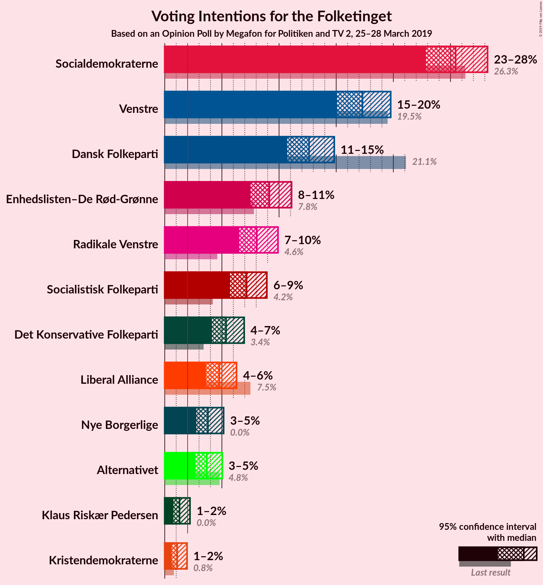

### Confidence Intervals

| Party | Last Result | Poll Result | 80% Confidence Interval | 90% Confidence Interval | 95% Confidence Interval | 99% Confidence Interval |
|:-----:|:-----------:|:-----------:|:-----------------------:|:-----------------------:|:-----------------------:|:-----------------------:|
| Socialdemokraterne | 26.3% | 25.4% | 23.7–27.3% |23.3–27.8% |22.8–28.2% |22.1–29.1% |
| Venstre | 19.5% | 17.3% | 15.8–18.9% |15.4–19.4% |15.1–19.8% |14.4–20.6% |
| Dansk Folkeparti | 21.1% | 12.6% | 11.4–14.1% |11.0–14.5% |10.7–14.8% |10.1–15.5% |
| Enhedslisten–De Rød-Grønne | 7.8% | 9.1% | 8.1–10.4% |7.8–10.8% |7.5–11.1% |7.0–11.7% |
| Radikale Venstre | 4.6% | 8.1% | 7.0–9.3% |6.8–9.6% |6.5–9.9% |6.1–10.5% |
| Socialistisk Folkeparti | 4.2% | 7.2% | 6.2–8.3% |5.9–8.6% |5.7–8.9% |5.3–9.5% |
| Det Konservative Folkeparti | 3.4% | 5.4% | 4.6–6.4% |4.3–6.7% |4.1–7.0% |3.8–7.5% |
| Liberal Alliance | 7.5% | 4.8% | 4.0–5.7% |3.8–6.0% |3.6–6.3% |3.3–6.8% |
| Nye Borgerlige | 0.0% | 3.8% | 3.1–4.7% |2.9–4.9% |2.8–5.2% |2.5–5.6% |
| Alternativet | 4.8% | 3.7% | 3.0–4.6% |2.8–4.8% |2.7–5.0% |2.4–5.5% |
| Klaus Riskær Pedersen | 0.0% | 1.3% | 0.9–1.9% |0.8–2.1% |0.8–2.2% |0.6–2.5% |
| Kristendemokraterne | 0.8% | 1.1% | 0.8–1.6% |0.7–1.8% |0.6–2.0% |0.5–2.3% |

*Note:* The poll result column reflects the actual value used in the calculations. Published results may vary slightly, and in addition be rounded to fewer digits.

## Seats

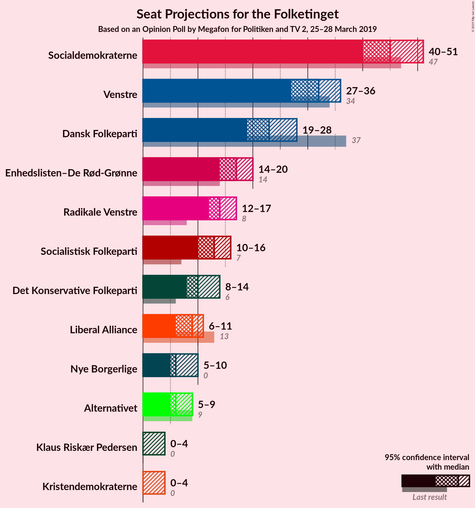

### Confidence Intervals

| Party | Last Result | Median | 80% Confidence Interval | 90% Confidence Interval | 95% Confidence Interval | 99% Confidence Interval |
|:-----:|:-----------:|:------:|:-----------------------:|:-----------------------:|:-----------------------:|:-----------------------:|
| <a href="#socialdemokraterne">Socialdemokraterne</a> | 47 | 45 | 41–48 |40–50 |40–51 |39–51 |
| <a href="#venstre">Venstre</a> | 34 | 32 | 29–34 |28–34 |27–36 |25–36 |
| <a href="#dansk-folkeparti">Dansk Folkeparti</a> | 37 | 23 | 20–28 |20–28 |19–28 |18–28 |
| <a href="#enhedslisten–de-rød-grønne">Enhedslisten–De Rød-Grønne</a> | 14 | 17 | 15–19 |14–19 |14–20 |13–21 |
| <a href="#radikale-venstre">Radikale Venstre</a> | 8 | 14 | 13–16 |12–17 |12–17 |11–18 |
| <a href="#socialistisk-folkeparti">Socialistisk Folkeparti</a> | 7 | 13 | 11–14 |10–15 |10–16 |10–16 |
| <a href="#det-konservative-folkeparti">Det Konservative Folkeparti</a> | 6 | 10 | 8–14 |8–14 |8–14 |6–14 |
| <a href="#liberal-alliance">Liberal Alliance</a> | 13 | 9 | 8–10 |7–10 |6–11 |5–12 |
| <a href="#nye-borgerlige">Nye Borgerlige</a> | 0 | 6 | 5–8 |5–9 |5–10 |4–10 |
| <a href="#alternativet">Alternativet</a> | 9 | 6 | 5–9 |5–9 |5–9 |4–10 |
| <a href="#klaus-riskær-pedersen">Klaus Riskær Pedersen</a> | 0 | 0 | 0 |0 |0–4 |0–5 |
| <a href="#kristendemokraterne">Kristendemokraterne</a> | 0 | 0 | 0 |0 |0–4 |0–4 |

### Socialdemokraterne

*For a full overview of the results for this party, see the [Socialdemokraterne](party-socialdemokraterne.html) page.*

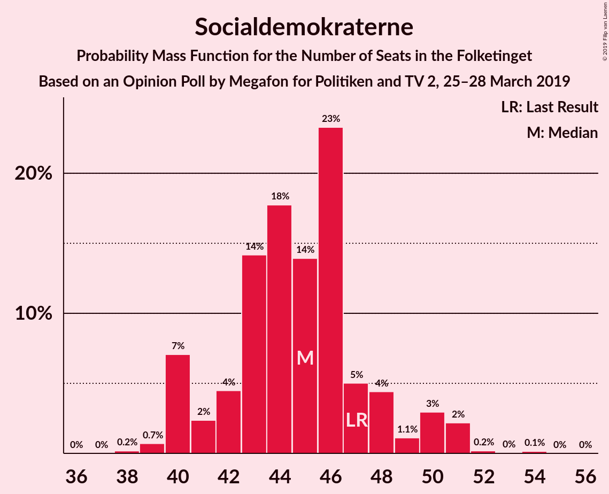

| Number of Seats | Probability | Accumulated | Special Marks |
|:---------------:|:-----------:|:-----------:|:-------------:|
| 38 | 0.2% | 100% |  |
| 39 | 0.7% | 99.8% |  |
| 40 | 7% | 99.1% |  |
| 41 | 2% | 92% |  |
| 42 | 4% | 90% |  |
| 43 | 14% | 85% |  |
| 44 | 18% | 71% |  |
| 45 | 14% | 53% | Median |
| 46 | 23% | 39% |  |
| 47 | 5% | 16% | Last Result |
| 48 | 4% | 11% |  |
| 49 | 1.1% | 7% |  |
| 50 | 3% | 6% |  |
| 51 | 2% | 3% |  |
| 52 | 0.2% | 0.4% |  |
| 53 | 0% | 0.2% |  |
| 54 | 0.1% | 0.2% |  |
| 55 | 0% | 0% |  |

### Venstre

*For a full overview of the results for this party, see the [Venstre](party-venstre.html) page.*

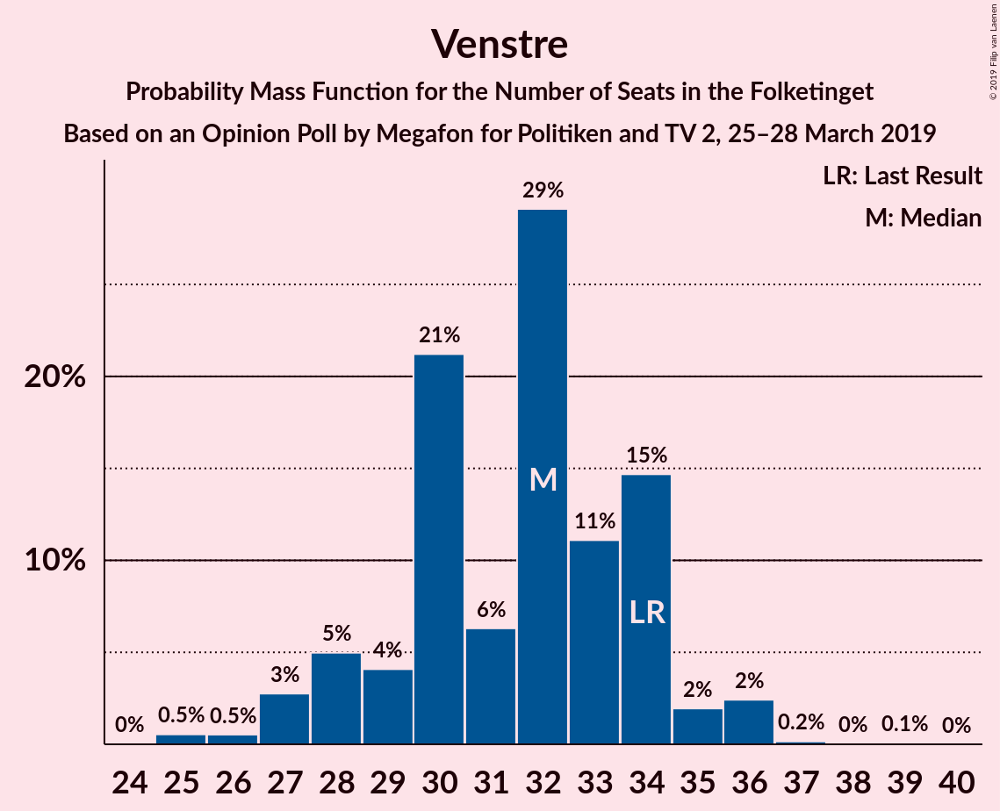

| Number of Seats | Probability | Accumulated | Special Marks |
|:---------------:|:-----------:|:-----------:|:-------------:|
| 24 | 0% | 100% |  |
| 25 | 0.5% | 99.9% |  |
| 26 | 0.5% | 99.4% |  |
| 27 | 3% | 98.9% |  |
| 28 | 5% | 96% |  |
| 29 | 4% | 91% |  |
| 30 | 21% | 87% |  |
| 31 | 6% | 66% |  |
| 32 | 29% | 60% | Median |
| 33 | 11% | 30% |  |
| 34 | 15% | 19% | Last Result |
| 35 | 2% | 5% |  |
| 36 | 2% | 3% |  |
| 37 | 0.2% | 0.3% |  |
| 38 | 0% | 0.1% |  |
| 39 | 0.1% | 0.1% |  |
| 40 | 0% | 0% |  |

### Dansk Folkeparti

*For a full overview of the results for this party, see the [Dansk Folkeparti](party-danskfolkeparti.html) page.*

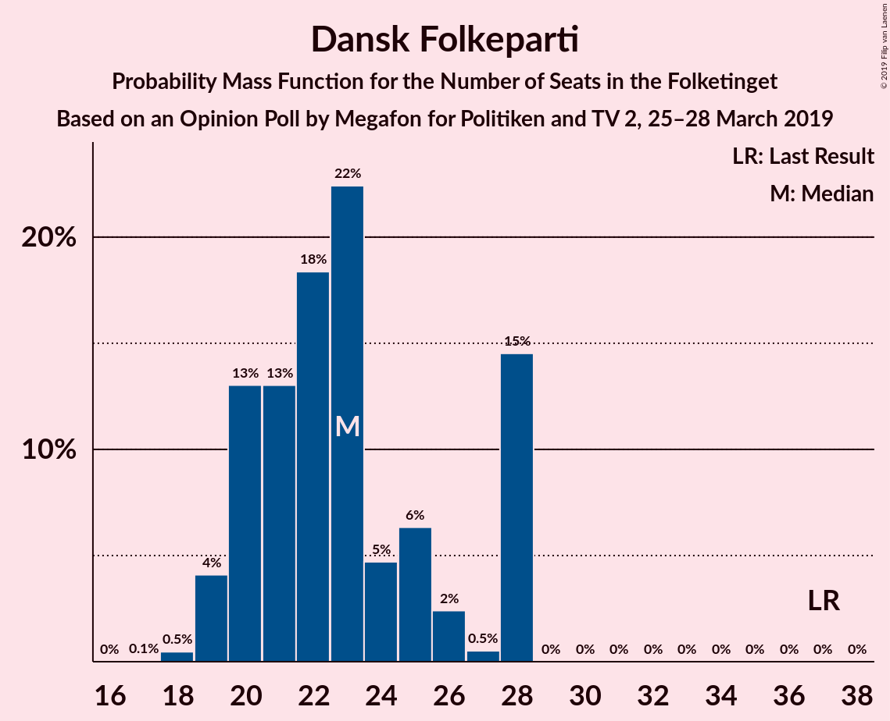

| Number of Seats | Probability | Accumulated | Special Marks |
|:---------------:|:-----------:|:-----------:|:-------------:|
| 17 | 0.1% | 100% |  |
| 18 | 0.5% | 99.9% |  |
| 19 | 4% | 99.5% |  |
| 20 | 13% | 95% |  |
| 21 | 13% | 82% |  |
| 22 | 18% | 69% |  |
| 23 | 22% | 51% | Median |
| 24 | 5% | 29% |  |
| 25 | 6% | 24% |  |
| 26 | 2% | 17% |  |
| 27 | 0.5% | 15% |  |
| 28 | 15% | 15% |  |
| 29 | 0% | 0% |  |
| 30 | 0% | 0% |  |
| 31 | 0% | 0% |  |
| 32 | 0% | 0% |  |
| 33 | 0% | 0% |  |
| 34 | 0% | 0% |  |
| 35 | 0% | 0% |  |
| 36 | 0% | 0% |  |
| 37 | 0% | 0% | Last Result |

### Enhedslisten–De Rød-Grønne

*For a full overview of the results for this party, see the [Enhedslisten–De Rød-Grønne](party-enhedslisten–derød-grønne.html) page.*

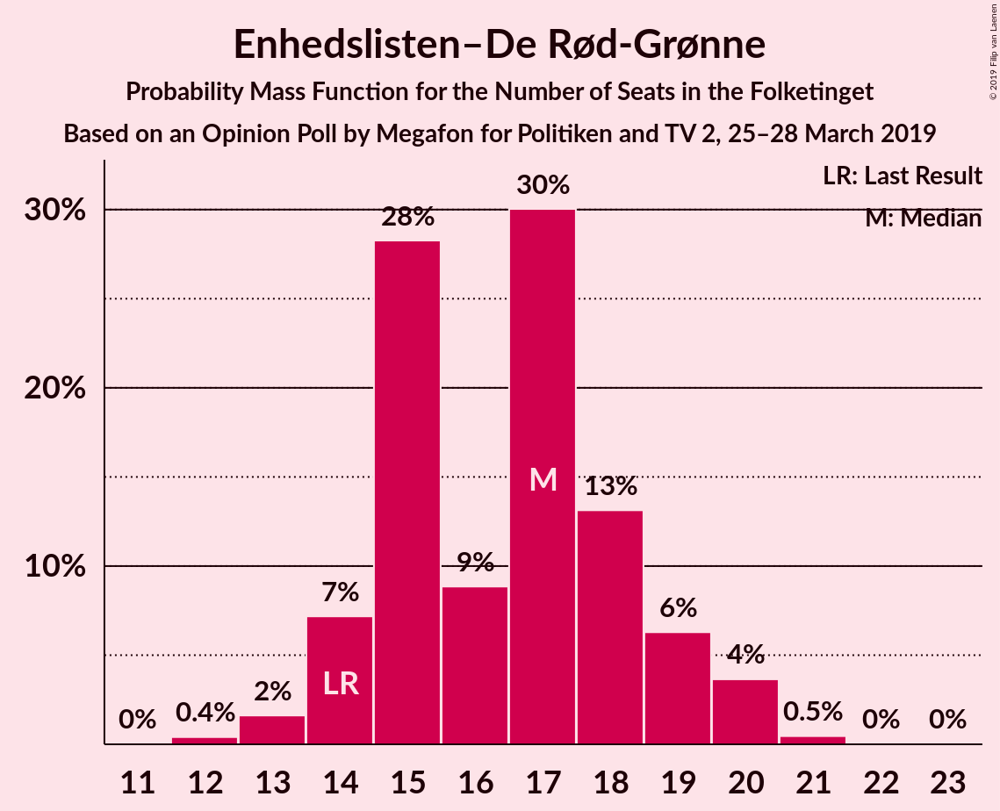

| Number of Seats | Probability | Accumulated | Special Marks |
|:---------------:|:-----------:|:-----------:|:-------------:|
| 12 | 0.4% | 100% |  |
| 13 | 2% | 99.6% |  |
| 14 | 7% | 98% | Last Result |
| 15 | 28% | 91% |  |
| 16 | 9% | 62% |  |
| 17 | 30% | 54% | Median |
| 18 | 13% | 24% |  |
| 19 | 6% | 10% |  |
| 20 | 4% | 4% |  |
| 21 | 0.5% | 0.5% |  |
| 22 | 0% | 0.1% |  |
| 23 | 0% | 0% |  |

### Radikale Venstre

*For a full overview of the results for this party, see the [Radikale Venstre](party-radikalevenstre.html) page.*

| Number of Seats | Probability | Accumulated | Special Marks |
|:---------------:|:-----------:|:-----------:|:-------------:|
| 8 | 0% | 100% | Last Result |
| 9 | 0% | 100% |  |
| 10 | 0.2% | 100% |  |
| 11 | 1.0% | 99.8% |  |
| 12 | 8% | 98.8% |  |
| 13 | 21% | 91% |  |
| 14 | 38% | 69% | Median |
| 15 | 20% | 31% |  |
| 16 | 5% | 11% |  |
| 17 | 5% | 6% |  |
| 18 | 0.7% | 1.1% |  |
| 19 | 0.2% | 0.4% |  |
| 20 | 0.2% | 0.2% |  |
| 21 | 0% | 0% |  |

### Socialistisk Folkeparti

*For a full overview of the results for this party, see the [Socialistisk Folkeparti](party-socialistiskfolkeparti.html) page.*

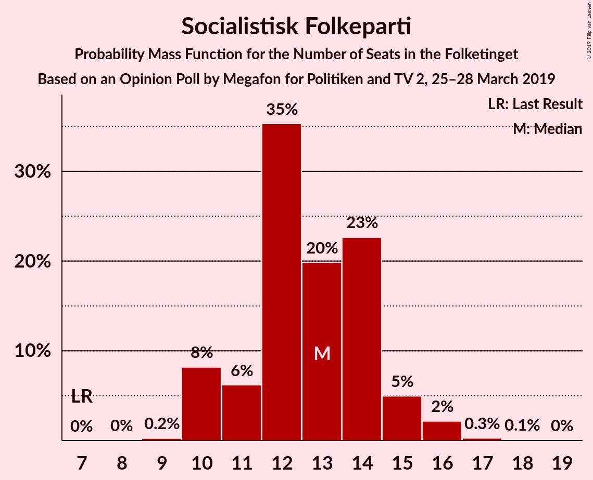

| Number of Seats | Probability | Accumulated | Special Marks |
|:---------------:|:-----------:|:-----------:|:-------------:|
| 7 | 0% | 100% | Last Result |
| 8 | 0% | 100% |  |
| 9 | 0.2% | 100% |  |
| 10 | 8% | 99.7% |  |
| 11 | 6% | 92% |  |
| 12 | 35% | 85% |  |
| 13 | 20% | 50% | Median |
| 14 | 23% | 30% |  |
| 15 | 5% | 8% |  |
| 16 | 2% | 3% |  |
| 17 | 0.3% | 0.4% |  |
| 18 | 0.1% | 0.2% |  |
| 19 | 0% | 0% |  |

### Det Konservative Folkeparti

*For a full overview of the results for this party, see the [Det Konservative Folkeparti](party-detkonservativefolkeparti.html) page.*

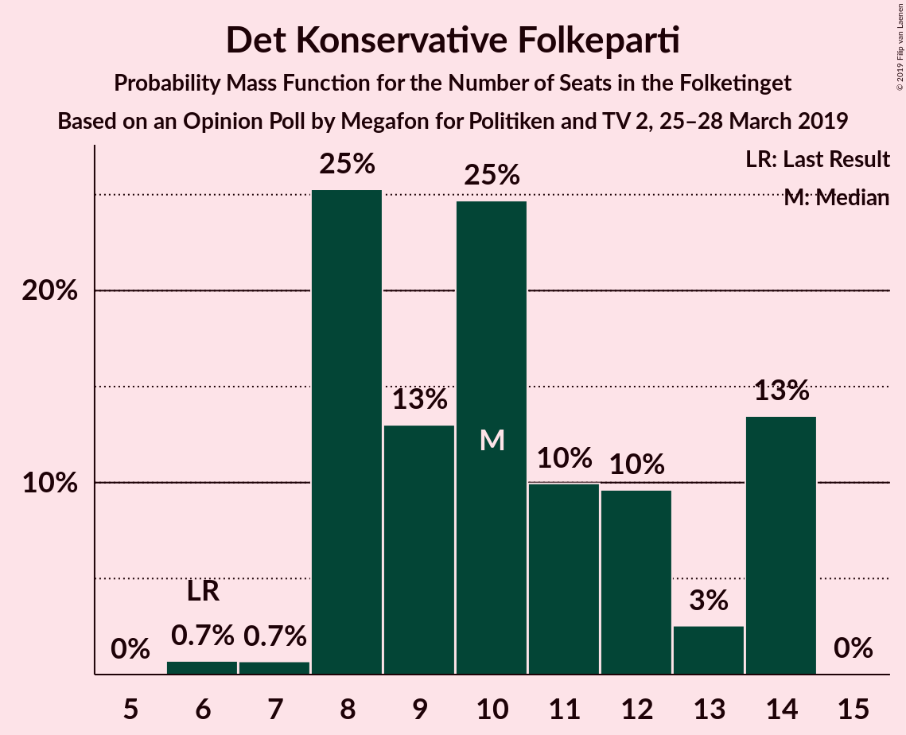

| Number of Seats | Probability | Accumulated | Special Marks |
|:---------------:|:-----------:|:-----------:|:-------------:|
| 6 | 0.7% | 100% | Last Result |
| 7 | 0.7% | 99.3% |  |
| 8 | 25% | 98.6% |  |
| 9 | 13% | 73% |  |
| 10 | 25% | 60% | Median |
| 11 | 10% | 36% |  |
| 12 | 10% | 26% |  |
| 13 | 3% | 16% |  |
| 14 | 13% | 14% |  |
| 15 | 0% | 0% |  |

### Liberal Alliance

*For a full overview of the results for this party, see the [Liberal Alliance](party-liberalalliance.html) page.*

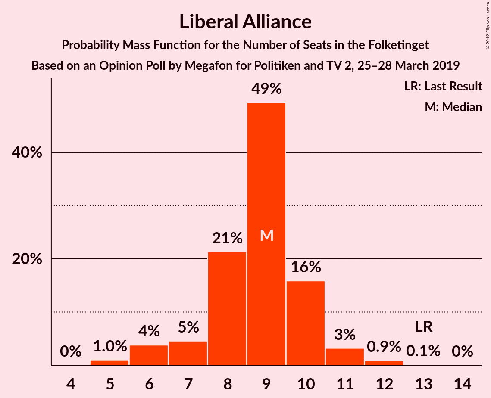

| Number of Seats | Probability | Accumulated | Special Marks |
|:---------------:|:-----------:|:-----------:|:-------------:|
| 5 | 1.0% | 100% |  |
| 6 | 4% | 99.0% |  |
| 7 | 5% | 95% |  |
| 8 | 21% | 91% |  |
| 9 | 49% | 69% | Median |
| 10 | 16% | 20% |  |
| 11 | 3% | 4% |  |
| 12 | 0.9% | 0.9% |  |
| 13 | 0.1% | 0.1% | Last Result |
| 14 | 0% | 0% |  |

### Nye Borgerlige

*For a full overview of the results for this party, see the [Nye Borgerlige](party-nyeborgerlige.html) page.*

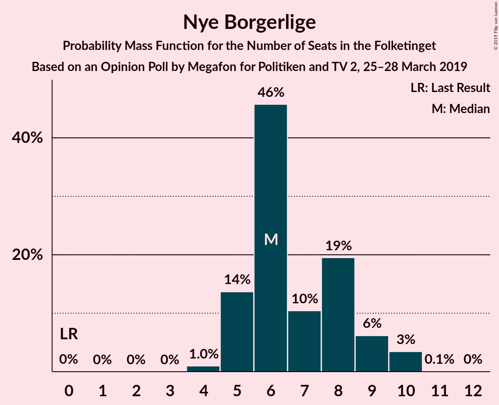

| Number of Seats | Probability | Accumulated | Special Marks |
|:---------------:|:-----------:|:-----------:|:-------------:|
| 0 | 0% | 100% | Last Result |
| 1 | 0% | 100% |  |
| 2 | 0% | 100% |  |
| 3 | 0% | 100% |  |
| 4 | 1.0% | 100% |  |
| 5 | 14% | 99.0% |  |
| 6 | 46% | 85% | Median |
| 7 | 10% | 40% |  |
| 8 | 19% | 29% |  |
| 9 | 6% | 10% |  |
| 10 | 3% | 4% |  |
| 11 | 0.1% | 0.1% |  |
| 12 | 0% | 0% |  |

### Alternativet

*For a full overview of the results for this party, see the [Alternativet](party-alternativet.html) page.*

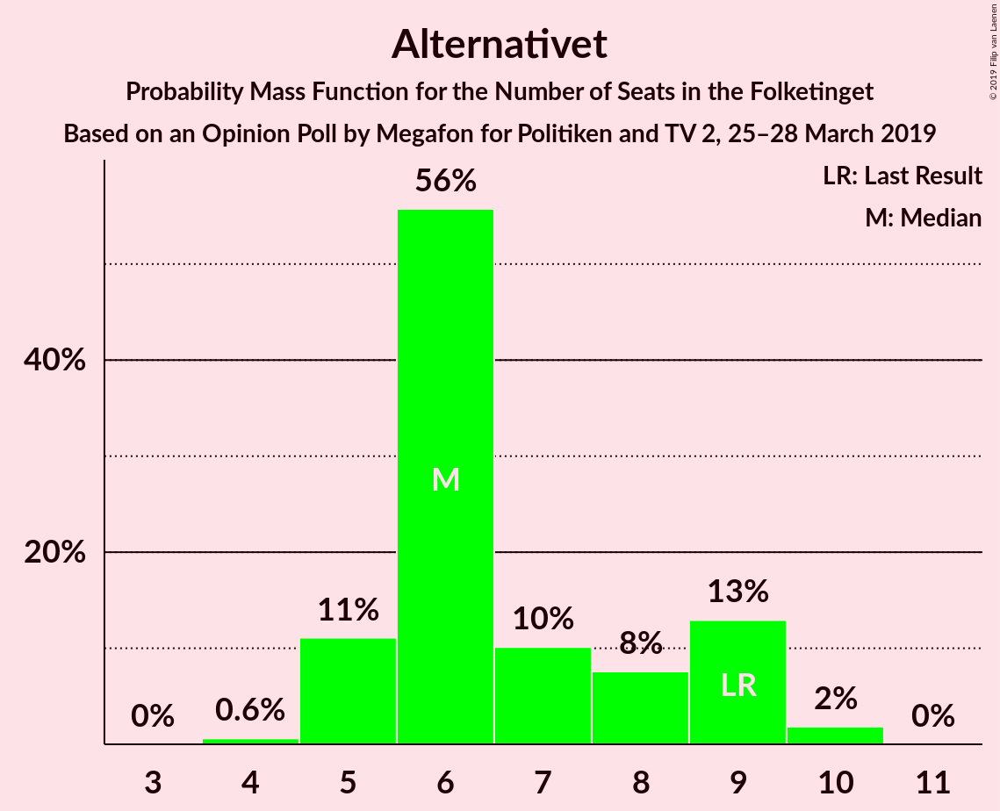

| Number of Seats | Probability | Accumulated | Special Marks |
|:---------------:|:-----------:|:-----------:|:-------------:|
| 4 | 0.6% | 100% |  |
| 5 | 11% | 99.4% |  |
| 6 | 56% | 88% | Median |
| 7 | 10% | 33% |  |
| 8 | 8% | 22% |  |
| 9 | 13% | 15% | Last Result |
| 10 | 2% | 2% |  |
| 11 | 0% | 0% |  |

### Klaus Riskær Pedersen

*For a full overview of the results for this party, see the [Klaus Riskær Pedersen](party-klausriskærpedersen.html) page.*

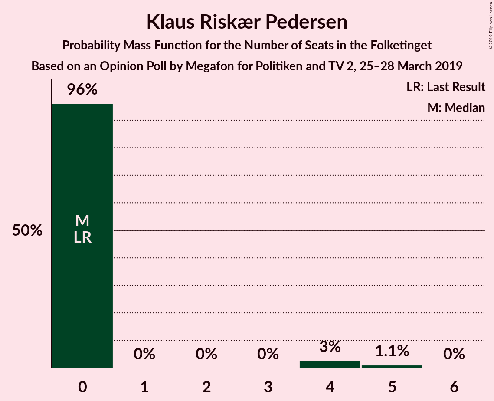

| Number of Seats | Probability | Accumulated | Special Marks |
|:---------------:|:-----------:|:-----------:|:-------------:|
| 0 | 96% | 100% | Last Result, Median |
| 1 | 0% | 4% |  |
| 2 | 0% | 4% |  |
| 3 | 0% | 4% |  |
| 4 | 3% | 4% |  |
| 5 | 1.1% | 1.1% |  |
| 6 | 0% | 0% |  |

### Kristendemokraterne

*For a full overview of the results for this party, see the [Kristendemokraterne](party-kristendemokraterne.html) page.*

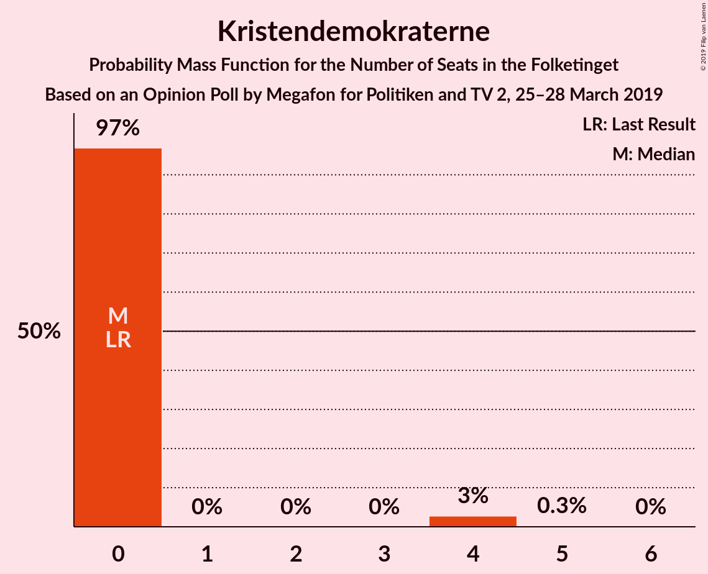

| Number of Seats | Probability | Accumulated | Special Marks |
|:---------------:|:-----------:|:-----------:|:-------------:|
| 0 | 97% | 100% | Last Result, Median |
| 1 | 0% | 3% |  |
| 2 | 0% | 3% |  |
| 3 | 0% | 3% |  |
| 4 | 3% | 3% |  |
| 5 | 0.3% | 0.3% |  |
| 6 | 0% | 0% |  |

## Coalitions

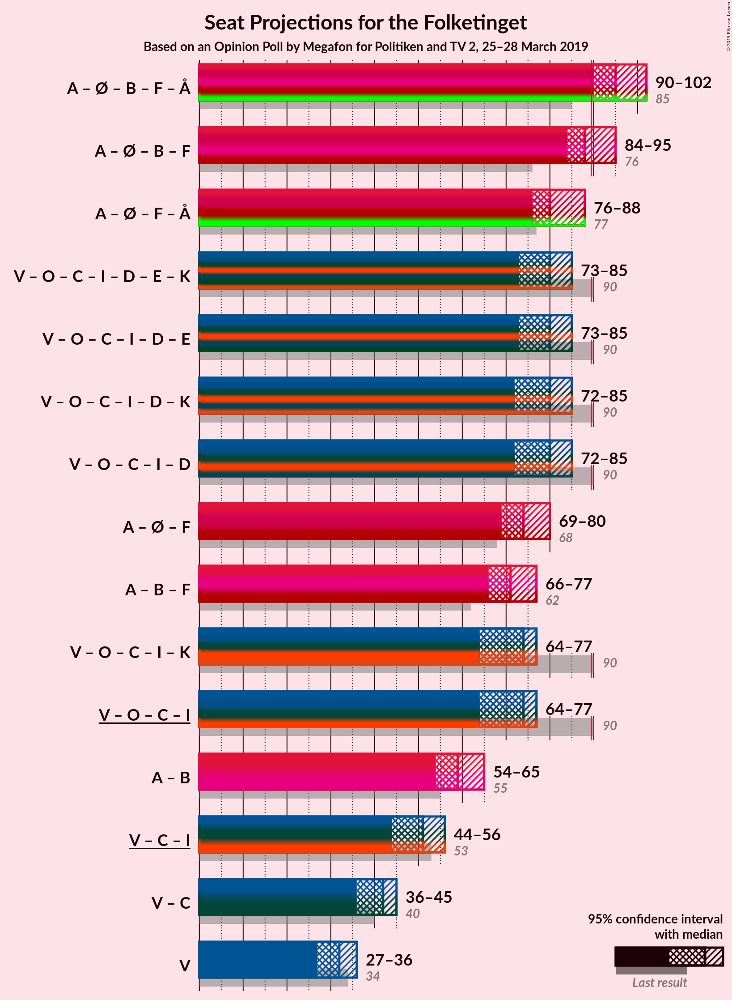

### Confidence Intervals

| Coalition | Last Result | Median | Majority? | 80% Confidence Interval | 90% Confidence Interval | 95% Confidence Interval | 99% Confidence Interval |
|:---------:|:-----------:|:------:|:---------:|:-----------------------:|:-----------------------:|:-----------------------:|:-----------------------:|
| Socialdemokraterne – Enhedslisten–De Rød-Grønne – Radikale Venstre – Socialistisk Folkeparti – Alternativet | 85 | 95 | 99.0% | 91–99 | 90–100 | 90–102 | 89–105 |
| Socialdemokraterne – Enhedslisten–De Rød-Grønne – Radikale Venstre – Socialistisk Folkeparti | 76 | 88 | 18% | 84–92 | 84–93 | 84–95 | 82–97 |
| Socialdemokraterne – Enhedslisten–De Rød-Grønne – Socialistisk Folkeparti – Alternativet | 77 | 80 | 2% | 76–85 | 76–86 | 76–88 | 75–92 |
| Venstre – Dansk Folkeparti – Det Konservative Folkeparti – Liberal Alliance – Nye Borgerlige – Klaus Riskær Pedersen – Kristendemokraterne | 90 | 80 | 0.1% | 76–84 | 75–85 | 73–85 | 70–86 |
| Venstre – Dansk Folkeparti – Det Konservative Folkeparti – Liberal Alliance – Nye Borgerlige – Klaus Riskær Pedersen | 90 | 80 | 0% | 76–84 | 75–85 | 73–85 | 70–86 |
| Venstre – Dansk Folkeparti – Det Konservative Folkeparti – Liberal Alliance – Nye Borgerlige – Kristendemokraterne | 90 | 80 | 0.1% | 76–84 | 74–85 | 72–85 | 70–86 |
| Venstre – Dansk Folkeparti – Det Konservative Folkeparti – Liberal Alliance – Nye Borgerlige | 90 | 80 | 0% | 76–84 | 74–85 | 72–85 | 70–86 |
| Socialdemokraterne – Enhedslisten–De Rød-Grønne – Socialistisk Folkeparti | 68 | 74 | 0% | 70–77 | 70–79 | 69–80 | 68–84 |
| Socialdemokraterne – Radikale Venstre – Socialistisk Folkeparti | 62 | 71 | 0% | 68–75 | 66–77 | 66–77 | 66–81 |
| Venstre – Dansk Folkeparti – Det Konservative Folkeparti – Liberal Alliance – Kristendemokraterne | 90 | 74 | 0% | 70–77 | 68–77 | 64–77 | 64–80 |
| Venstre – Dansk Folkeparti – Det Konservative Folkeparti – Liberal Alliance | 90 | 74 | 0% | 70–77 | 68–77 | 64–77 | 64–80 |
| Socialdemokraterne – Radikale Venstre | 55 | 59 | 0% | 55–62 | 54–63 | 54–65 | 53–67 |
| Venstre – Det Konservative Folkeparti – Liberal Alliance | 53 | 51 | 0% | 47–55 | 45–55 | 44–56 | 43–57 |
| Venstre – Det Konservative Folkeparti | 40 | 42 | 0% | 38–45 | 37–45 | 36–45 | 34–46 |
| Venstre | 34 | 32 | 0% | 29–34 | 28–34 | 27–36 | 25–36 |

### Socialdemokraterne – Enhedslisten–De Rød-Grønne – Radikale Venstre – Socialistisk Folkeparti – Alternativet

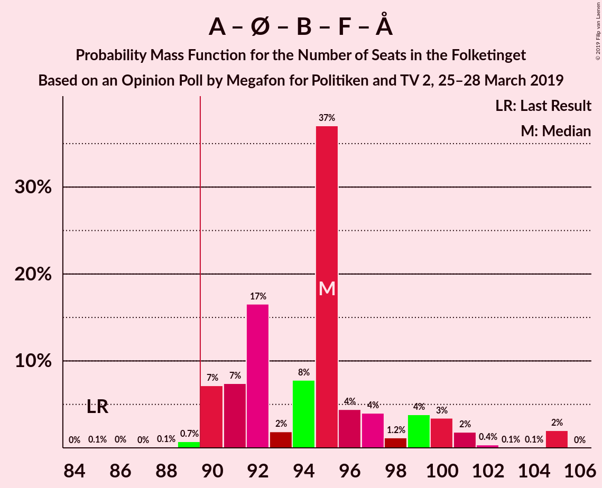

| Number of Seats | Probability | Accumulated | Special Marks |
|:---------------:|:-----------:|:-----------:|:-------------:|
| 85 | 0.1% | 100% | Last Result |
| 86 | 0% | 99.9% |  |
| 87 | 0% | 99.9% |  |
| 88 | 0.1% | 99.9% |  |
| 89 | 0.7% | 99.8% |  |
| 90 | 7% | 99.0% | Majority |
| 91 | 7% | 92% |  |
| 92 | 17% | 84% |  |
| 93 | 2% | 68% |  |
| 94 | 8% | 66% |  |
| 95 | 37% | 58% | Median |
| 96 | 4% | 21% |  |
| 97 | 4% | 17% |  |
| 98 | 1.2% | 13% |  |
| 99 | 4% | 12% |  |
| 100 | 3% | 8% |  |
| 101 | 2% | 4% |  |
| 102 | 0.4% | 3% |  |
| 103 | 0.1% | 2% |  |
| 104 | 0.1% | 2% |  |
| 105 | 2% | 2% |  |
| 106 | 0% | 0% |  |

### Socialdemokraterne – Enhedslisten–De Rød-Grønne – Radikale Venstre – Socialistisk Folkeparti

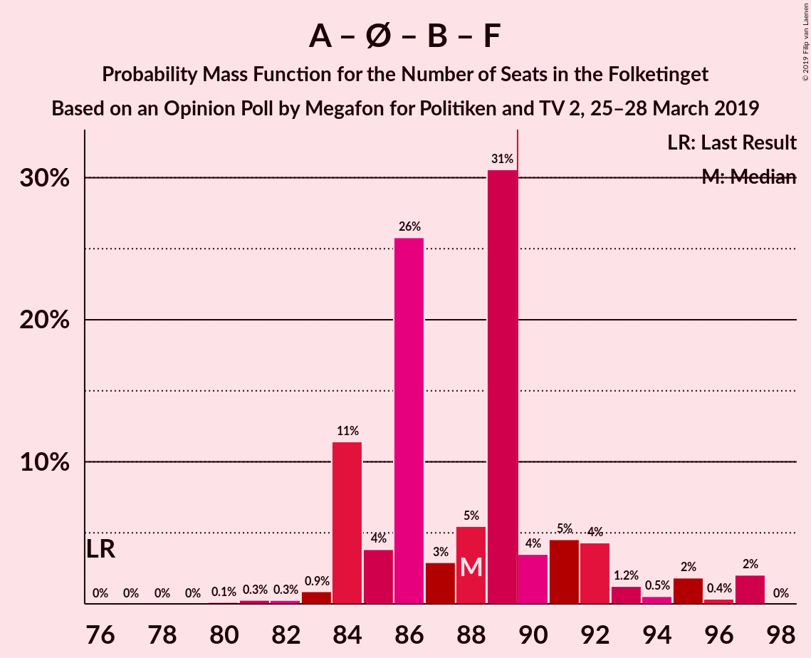

| Number of Seats | Probability | Accumulated | Special Marks |
|:---------------:|:-----------:|:-----------:|:-------------:|
| 76 | 0% | 100% | Last Result |
| 77 | 0% | 100% |  |
| 78 | 0% | 100% |  |
| 79 | 0% | 100% |  |
| 80 | 0.1% | 100% |  |
| 81 | 0.3% | 99.8% |  |
| 82 | 0.3% | 99.6% |  |
| 83 | 0.9% | 99.3% |  |
| 84 | 11% | 98% |  |
| 85 | 4% | 87% |  |
| 86 | 26% | 83% |  |
| 87 | 3% | 57% |  |
| 88 | 5% | 54% |  |
| 89 | 31% | 49% | Median |
| 90 | 4% | 18% | Majority |
| 91 | 5% | 15% |  |
| 92 | 4% | 10% |  |
| 93 | 1.2% | 6% |  |
| 94 | 0.5% | 5% |  |
| 95 | 2% | 4% |  |
| 96 | 0.4% | 2% |  |
| 97 | 2% | 2% |  |
| 98 | 0% | 0% |  |

### Socialdemokraterne – Enhedslisten–De Rød-Grønne – Socialistisk Folkeparti – Alternativet

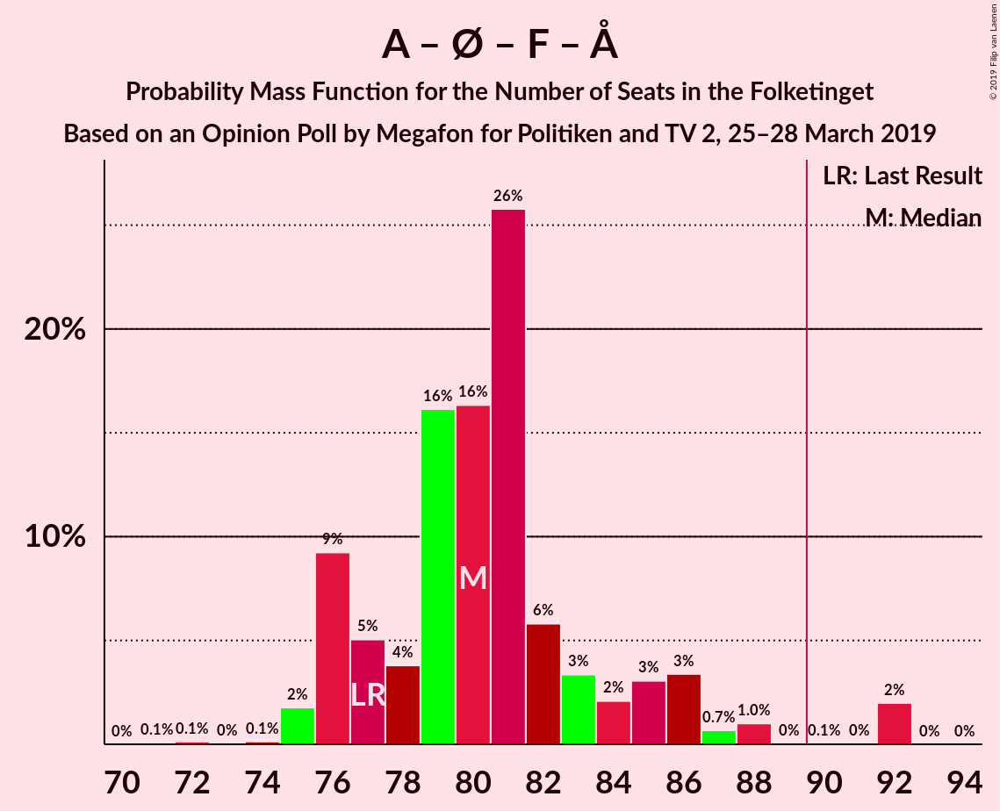

| Number of Seats | Probability | Accumulated | Special Marks |
|:---------------:|:-----------:|:-----------:|:-------------:|
| 71 | 0.1% | 100% |  |
| 72 | 0.1% | 99.9% |  |
| 73 | 0% | 99.8% |  |
| 74 | 0.1% | 99.7% |  |
| 75 | 2% | 99.6% |  |
| 76 | 9% | 98% |  |
| 77 | 5% | 89% | Last Result |
| 78 | 4% | 84% |  |
| 79 | 16% | 80% |  |
| 80 | 16% | 64% |  |
| 81 | 26% | 47% | Median |
| 82 | 6% | 21% |  |
| 83 | 3% | 16% |  |
| 84 | 2% | 12% |  |
| 85 | 3% | 10% |  |
| 86 | 3% | 7% |  |
| 87 | 0.7% | 4% |  |
| 88 | 1.0% | 3% |  |
| 89 | 0% | 2% |  |
| 90 | 0.1% | 2% | Majority |
| 91 | 0% | 2% |  |
| 92 | 2% | 2% |  |
| 93 | 0% | 0% |  |

### Venstre – Dansk Folkeparti – Det Konservative Folkeparti – Liberal Alliance – Nye Borgerlige – Klaus Riskær Pedersen – Kristendemokraterne

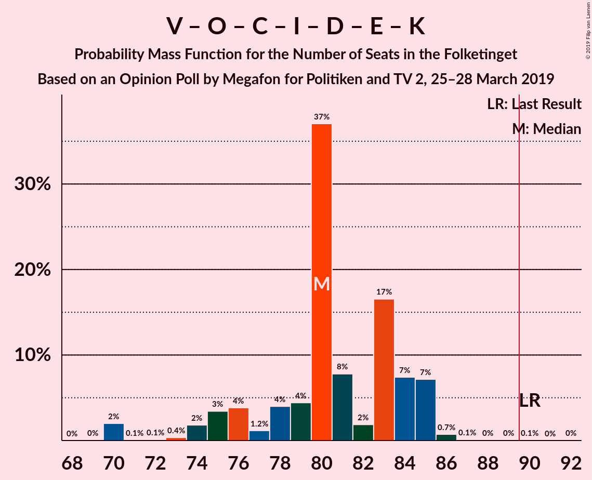

| Number of Seats | Probability | Accumulated | Special Marks |
|:---------------:|:-----------:|:-----------:|:-------------:|
| 70 | 2% | 100% |  |
| 71 | 0.1% | 98% |  |
| 72 | 0.1% | 98% |  |
| 73 | 0.4% | 98% |  |
| 74 | 2% | 97% |  |
| 75 | 3% | 96% |  |
| 76 | 4% | 92% |  |
| 77 | 1.2% | 88% |  |
| 78 | 4% | 87% |  |
| 79 | 4% | 83% |  |
| 80 | 37% | 79% | Median |
| 81 | 8% | 42% |  |
| 82 | 2% | 34% |  |
| 83 | 17% | 32% |  |
| 84 | 7% | 16% |  |
| 85 | 7% | 8% |  |
| 86 | 0.7% | 1.0% |  |
| 87 | 0.1% | 0.2% |  |
| 88 | 0% | 0.1% |  |
| 89 | 0% | 0.1% |  |
| 90 | 0.1% | 0.1% | Last Result, Majority |
| 91 | 0% | 0% |  |

### Venstre – Dansk Folkeparti – Det Konservative Folkeparti – Liberal Alliance – Nye Borgerlige – Klaus Riskær Pedersen

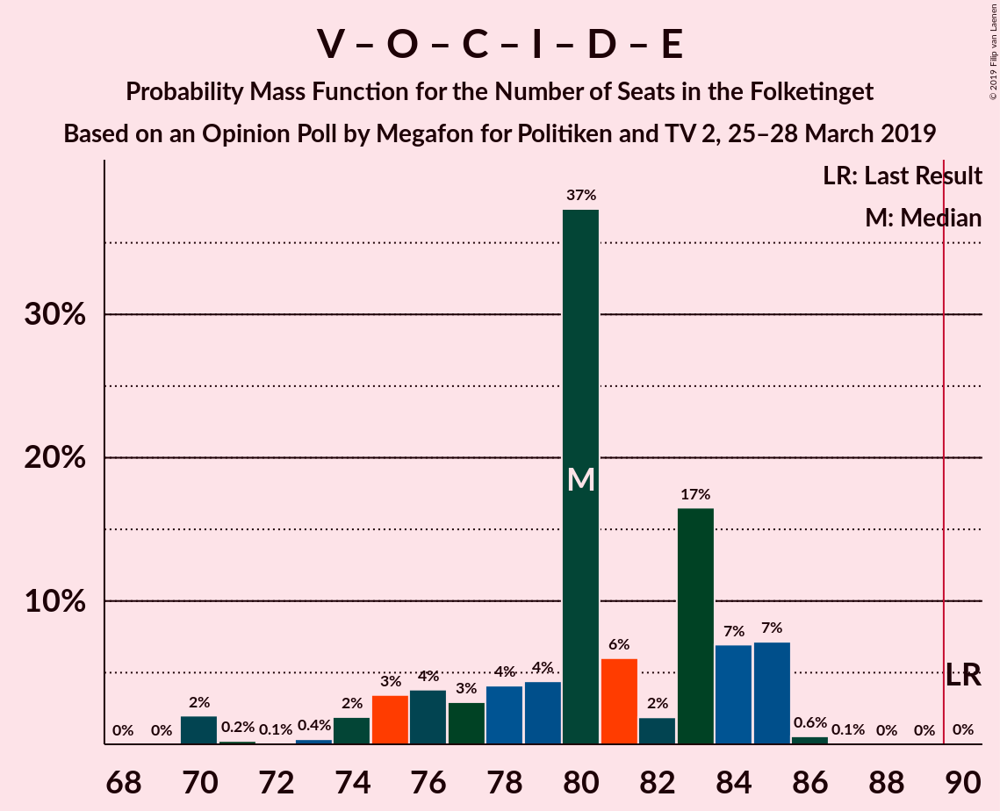

| Number of Seats | Probability | Accumulated | Special Marks |
|:---------------:|:-----------:|:-----------:|:-------------:|
| 70 | 2% | 100% |  |
| 71 | 0.2% | 98% |  |
| 72 | 0.1% | 98% |  |
| 73 | 0.4% | 98% |  |
| 74 | 2% | 97% |  |
| 75 | 3% | 95% |  |
| 76 | 4% | 92% |  |
| 77 | 3% | 88% |  |
| 78 | 4% | 85% |  |
| 79 | 4% | 81% |  |
| 80 | 37% | 77% | Median |
| 81 | 6% | 39% |  |
| 82 | 2% | 33% |  |
| 83 | 17% | 31% |  |
| 84 | 7% | 15% |  |
| 85 | 7% | 8% |  |
| 86 | 0.6% | 0.8% |  |
| 87 | 0.1% | 0.2% |  |
| 88 | 0% | 0.1% |  |
| 89 | 0% | 0.1% |  |
| 90 | 0% | 0% | Last Result, Majority |

### Venstre – Dansk Folkeparti – Det Konservative Folkeparti – Liberal Alliance – Nye Borgerlige – Kristendemokraterne

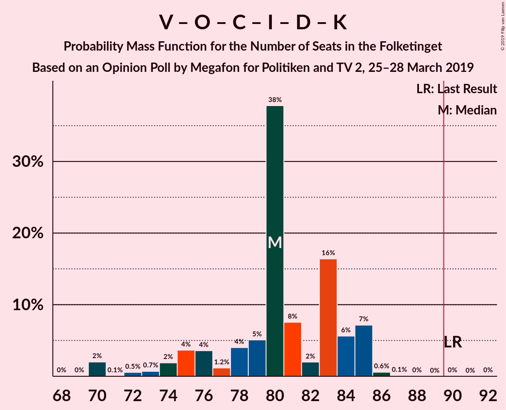

| Number of Seats | Probability | Accumulated | Special Marks |
|:---------------:|:-----------:|:-----------:|:-------------:|
| 70 | 2% | 100% |  |
| 71 | 0.1% | 98% |  |
| 72 | 0.5% | 98% |  |
| 73 | 0.7% | 97% |  |
| 74 | 2% | 97% |  |
| 75 | 4% | 95% |  |
| 76 | 4% | 91% |  |
| 77 | 1.2% | 88% |  |
| 78 | 4% | 86% |  |
| 79 | 5% | 82% |  |
| 80 | 38% | 77% | Median |
| 81 | 8% | 39% |  |
| 82 | 2% | 32% |  |
| 83 | 16% | 30% |  |
| 84 | 6% | 14% |  |
| 85 | 7% | 8% |  |
| 86 | 0.6% | 0.8% |  |
| 87 | 0.1% | 0.2% |  |
| 88 | 0% | 0.1% |  |
| 89 | 0% | 0.1% |  |
| 90 | 0% | 0.1% | Last Result, Majority |
| 91 | 0% | 0% |  |

### Venstre – Dansk Folkeparti – Det Konservative Folkeparti – Liberal Alliance – Nye Borgerlige

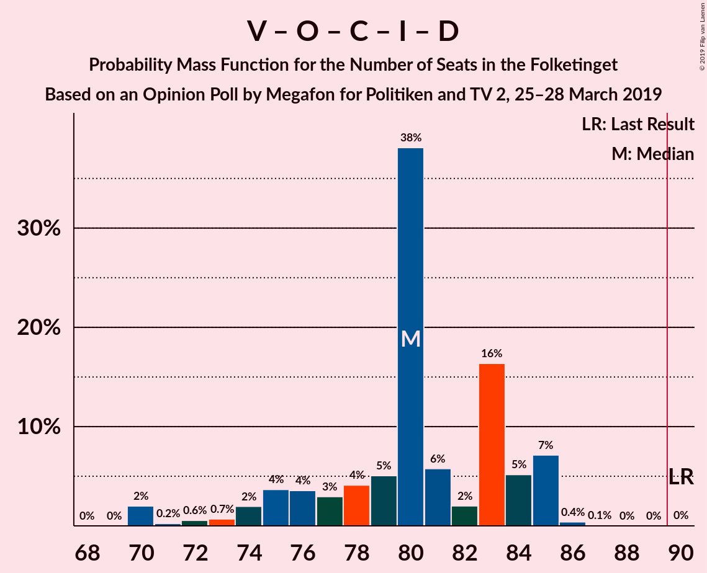

| Number of Seats | Probability | Accumulated | Special Marks |
|:---------------:|:-----------:|:-----------:|:-------------:|
| 69 | 0% | 100% |  |
| 70 | 2% | 99.9% |  |
| 71 | 0.2% | 98% |  |
| 72 | 0.6% | 98% |  |
| 73 | 0.7% | 97% |  |
| 74 | 2% | 96% |  |
| 75 | 4% | 94% |  |
| 76 | 4% | 91% |  |
| 77 | 3% | 87% |  |
| 78 | 4% | 84% |  |
| 79 | 5% | 80% |  |
| 80 | 38% | 75% | Median |
| 81 | 6% | 37% |  |
| 82 | 2% | 31% |  |
| 83 | 16% | 29% |  |
| 84 | 5% | 13% |  |
| 85 | 7% | 8% |  |
| 86 | 0.4% | 0.6% |  |
| 87 | 0.1% | 0.2% |  |
| 88 | 0% | 0.1% |  |
| 89 | 0% | 0% |  |
| 90 | 0% | 0% | Last Result, Majority |

### Socialdemokraterne – Enhedslisten–De Rød-Grønne – Socialistisk Folkeparti

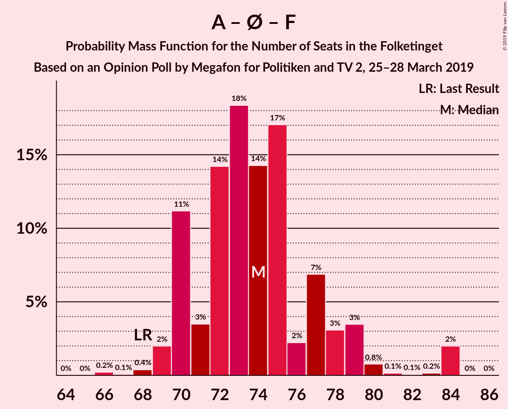

| Number of Seats | Probability | Accumulated | Special Marks |
|:---------------:|:-----------:|:-----------:|:-------------:|
| 66 | 0.2% | 100% |  |
| 67 | 0.1% | 99.8% |  |
| 68 | 0.4% | 99.7% | Last Result |
| 69 | 2% | 99.3% |  |
| 70 | 11% | 97% |  |
| 71 | 3% | 86% |  |
| 72 | 14% | 83% |  |
| 73 | 18% | 68% |  |
| 74 | 14% | 50% |  |
| 75 | 17% | 36% | Median |
| 76 | 2% | 19% |  |
| 77 | 7% | 17% |  |
| 78 | 3% | 10% |  |
| 79 | 3% | 7% |  |
| 80 | 0.8% | 3% |  |
| 81 | 0.1% | 2% |  |
| 82 | 0.1% | 2% |  |
| 83 | 0.2% | 2% |  |
| 84 | 2% | 2% |  |
| 85 | 0% | 0% |  |

### Socialdemokraterne – Radikale Venstre – Socialistisk Folkeparti

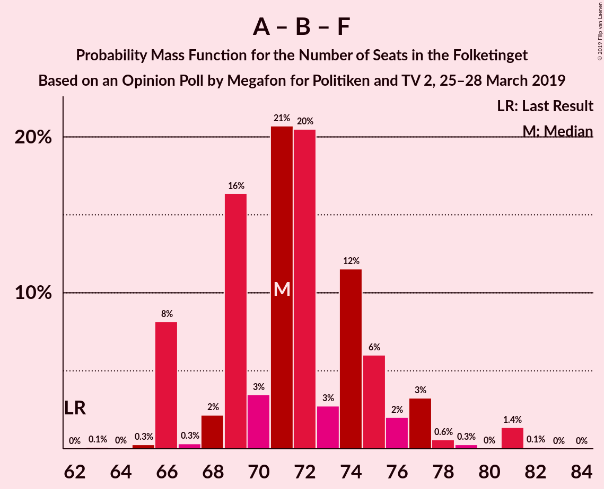

| Number of Seats | Probability | Accumulated | Special Marks |
|:---------------:|:-----------:|:-----------:|:-------------:|
| 62 | 0% | 100% | Last Result |
| 63 | 0.1% | 100% |  |
| 64 | 0% | 99.9% |  |
| 65 | 0.3% | 99.9% |  |
| 66 | 8% | 99.6% |  |
| 67 | 0.3% | 91% |  |
| 68 | 2% | 91% |  |
| 69 | 16% | 89% |  |
| 70 | 3% | 73% |  |
| 71 | 21% | 69% |  |
| 72 | 20% | 48% | Median |
| 73 | 3% | 28% |  |
| 74 | 12% | 25% |  |
| 75 | 6% | 14% |  |
| 76 | 2% | 8% |  |
| 77 | 3% | 6% |  |
| 78 | 0.6% | 2% |  |
| 79 | 0.3% | 2% |  |
| 80 | 0% | 2% |  |
| 81 | 1.4% | 1.5% |  |
| 82 | 0.1% | 0.1% |  |
| 83 | 0% | 0% |  |

### Venstre – Dansk Folkeparti – Det Konservative Folkeparti – Liberal Alliance – Kristendemokraterne

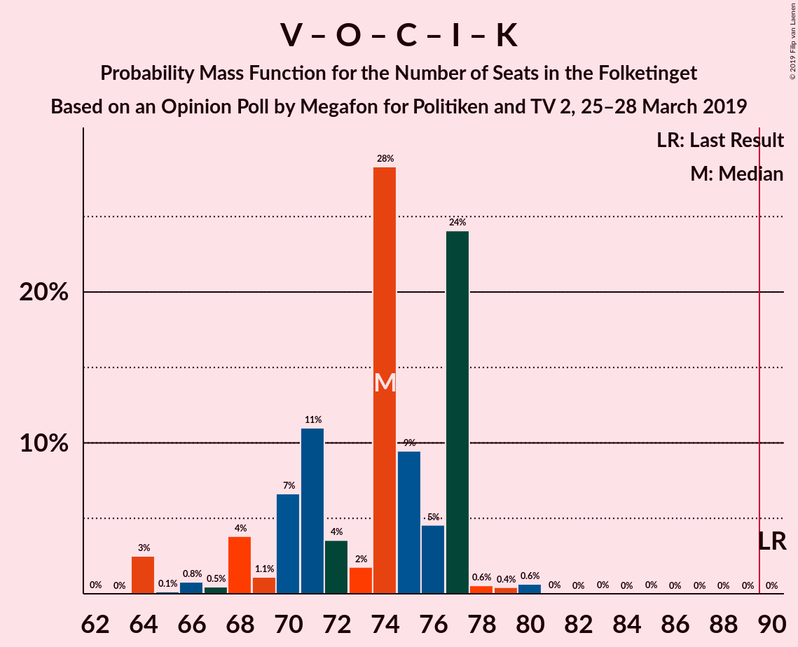

| Number of Seats | Probability | Accumulated | Special Marks |
|:---------------:|:-----------:|:-----------:|:-------------:|
| 63 | 0% | 100% |  |
| 64 | 3% | 99.9% |  |
| 65 | 0.1% | 97% |  |
| 66 | 0.8% | 97% |  |
| 67 | 0.5% | 97% |  |
| 68 | 4% | 96% |  |
| 69 | 1.1% | 92% |  |
| 70 | 7% | 91% |  |
| 71 | 11% | 84% |  |
| 72 | 4% | 73% |  |
| 73 | 2% | 70% |  |
| 74 | 28% | 68% | Median |
| 75 | 9% | 40% |  |
| 76 | 5% | 30% |  |
| 77 | 24% | 26% |  |
| 78 | 0.6% | 2% |  |
| 79 | 0.4% | 1.2% |  |
| 80 | 0.6% | 0.8% |  |
| 81 | 0% | 0.1% |  |
| 82 | 0% | 0.1% |  |
| 83 | 0% | 0.1% |  |
| 84 | 0% | 0% |  |
| 85 | 0% | 0% |  |
| 86 | 0% | 0% |  |
| 87 | 0% | 0% |  |
| 88 | 0% | 0% |  |
| 89 | 0% | 0% |  |
| 90 | 0% | 0% | Last Result, Majority |

### Venstre – Dansk Folkeparti – Det Konservative Folkeparti – Liberal Alliance

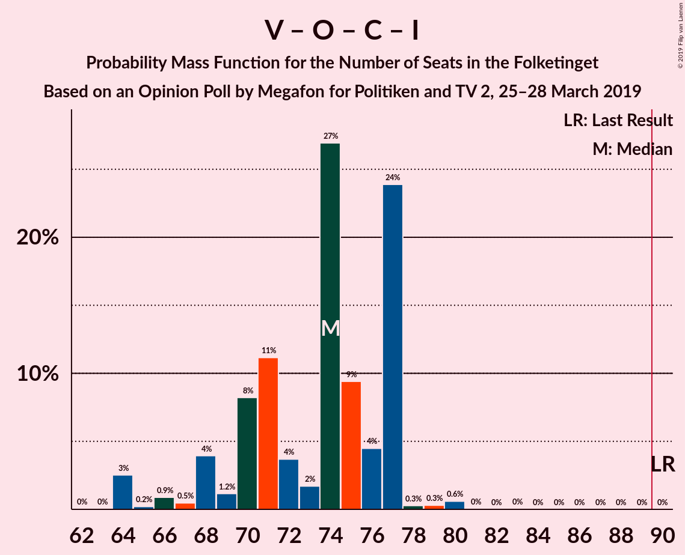

| Number of Seats | Probability | Accumulated | Special Marks |
|:---------------:|:-----------:|:-----------:|:-------------:|
| 63 | 0% | 100% |  |
| 64 | 3% | 99.9% |  |
| 65 | 0.2% | 97% |  |
| 66 | 0.9% | 97% |  |
| 67 | 0.5% | 96% |  |
| 68 | 4% | 96% |  |
| 69 | 1.2% | 92% |  |
| 70 | 8% | 91% |  |
| 71 | 11% | 83% |  |
| 72 | 4% | 71% |  |
| 73 | 2% | 68% |  |
| 74 | 27% | 66% | Median |
| 75 | 9% | 39% |  |
| 76 | 4% | 30% |  |
| 77 | 24% | 25% |  |
| 78 | 0.3% | 1.3% |  |
| 79 | 0.3% | 1.0% |  |
| 80 | 0.6% | 0.7% |  |
| 81 | 0% | 0.1% |  |
| 82 | 0% | 0% |  |
| 83 | 0% | 0% |  |
| 84 | 0% | 0% |  |
| 85 | 0% | 0% |  |
| 86 | 0% | 0% |  |
| 87 | 0% | 0% |  |
| 88 | 0% | 0% |  |
| 89 | 0% | 0% |  |
| 90 | 0% | 0% | Last Result, Majority |

### Socialdemokraterne – Radikale Venstre

| Number of Seats | Probability | Accumulated | Special Marks |
|:---------------:|:-----------:|:-----------:|:-------------:|
| 51 | 0.1% | 100% |  |
| 52 | 0.2% | 99.9% |  |
| 53 | 0.3% | 99.7% |  |
| 54 | 8% | 99.4% |  |
| 55 | 1.4% | 91% | Last Result |
| 56 | 3% | 90% |  |
| 57 | 14% | 87% |  |
| 58 | 20% | 72% |  |
| 59 | 22% | 53% | Median |
| 60 | 5% | 31% |  |
| 61 | 10% | 25% |  |
| 62 | 8% | 15% |  |
| 63 | 4% | 7% |  |
| 64 | 0.9% | 4% |  |
| 65 | 0.7% | 3% |  |
| 66 | 0.6% | 2% |  |
| 67 | 2% | 2% |  |
| 68 | 0% | 0.1% |  |
| 69 | 0% | 0% |  |

### Venstre – Det Konservative Folkeparti – Liberal Alliance

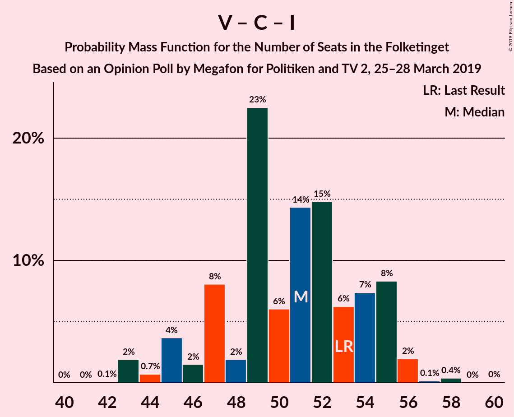

| Number of Seats | Probability | Accumulated | Special Marks |
|:---------------:|:-----------:|:-----------:|:-------------:|
| 42 | 0.1% | 100% |  |
| 43 | 2% | 99.9% |  |
| 44 | 0.7% | 98% |  |
| 45 | 4% | 97% |  |
| 46 | 2% | 94% |  |
| 47 | 8% | 92% |  |
| 48 | 2% | 84% |  |
| 49 | 23% | 82% |  |
| 50 | 6% | 60% |  |
| 51 | 14% | 54% | Median |
| 52 | 15% | 39% |  |
| 53 | 6% | 24% | Last Result |
| 54 | 7% | 18% |  |
| 55 | 8% | 11% |  |
| 56 | 2% | 3% |  |
| 57 | 0.1% | 0.6% |  |
| 58 | 0.4% | 0.4% |  |
| 59 | 0% | 0.1% |  |
| 60 | 0% | 0% |  |

### Venstre – Det Konservative Folkeparti

| Number of Seats | Probability | Accumulated | Special Marks |
|:---------------:|:-----------:|:-----------:|:-------------:|
| 34 | 0.6% | 100% |  |
| 35 | 0.3% | 99.4% |  |
| 36 | 3% | 99.1% |  |
| 37 | 5% | 96% |  |
| 38 | 4% | 91% |  |
| 39 | 4% | 88% |  |
| 40 | 19% | 83% | Last Result |
| 41 | 7% | 64% |  |
| 42 | 15% | 57% | Median |
| 43 | 5% | 42% |  |
| 44 | 17% | 36% |  |
| 45 | 17% | 19% |  |
| 46 | 1.5% | 2% |  |
| 47 | 0.2% | 0.3% |  |
| 48 | 0.1% | 0.2% |  |
| 49 | 0% | 0.1% |  |
| 50 | 0% | 0% |  |

### Venstre

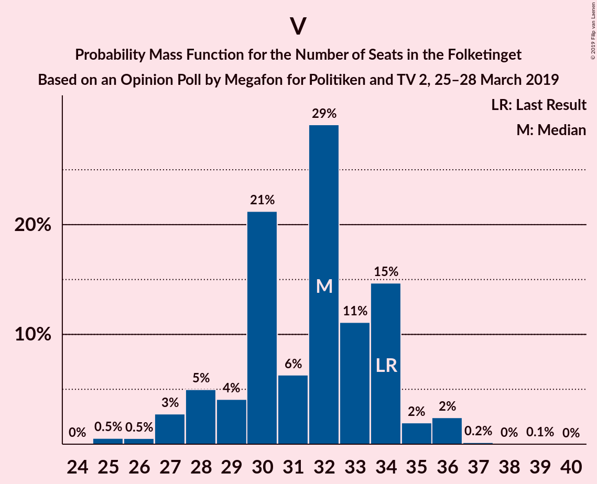

| Number of Seats | Probability | Accumulated | Special Marks |
|:---------------:|:-----------:|:-----------:|:-------------:|
| 24 | 0% | 100% |  |
| 25 | 0.5% | 99.9% |  |
| 26 | 0.5% | 99.4% |  |
| 27 | 3% | 98.9% |  |
| 28 | 5% | 96% |  |
| 29 | 4% | 91% |  |
| 30 | 21% | 87% |  |
| 31 | 6% | 66% |  |
| 32 | 29% | 60% | Median |
| 33 | 11% | 30% |  |
| 34 | 15% | 19% | Last Result |
| 35 | 2% | 5% |  |
| 36 | 2% | 3% |  |
| 37 | 0.2% | 0.3% |  |
| 38 | 0% | 0.1% |  |
| 39 | 0.1% | 0.1% |  |
| 40 | 0% | 0% |  |

## Technical Information

### Opinion Poll

+ **Polling firm:** Megafon
+ **Commissioner(s):** Politiken and TV 2
+ **Fieldwork period:** 25–28 March 2019

### Calculations

+ **Sample size:** 1006
+ **Simulations done:** 1,048,576
+ **Error estimate:** 4.59%

