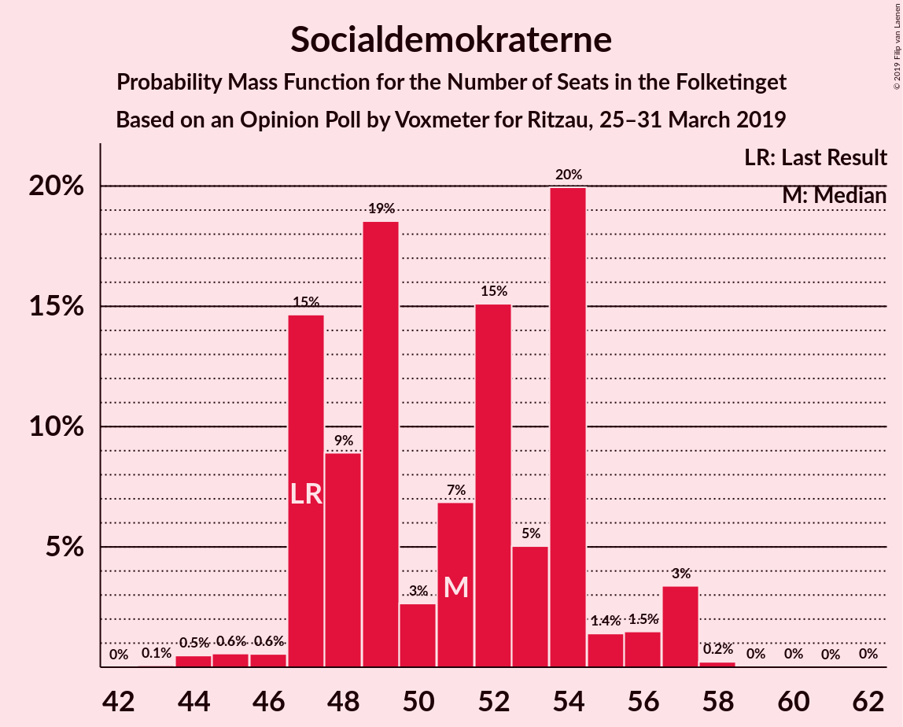
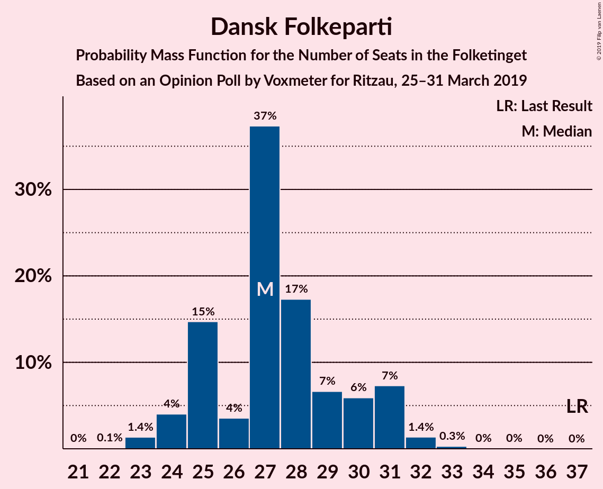
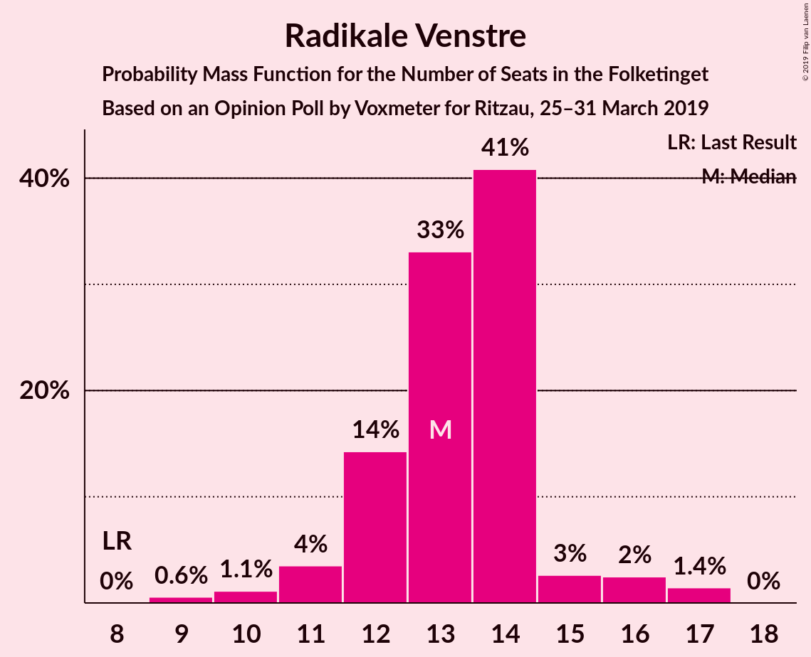
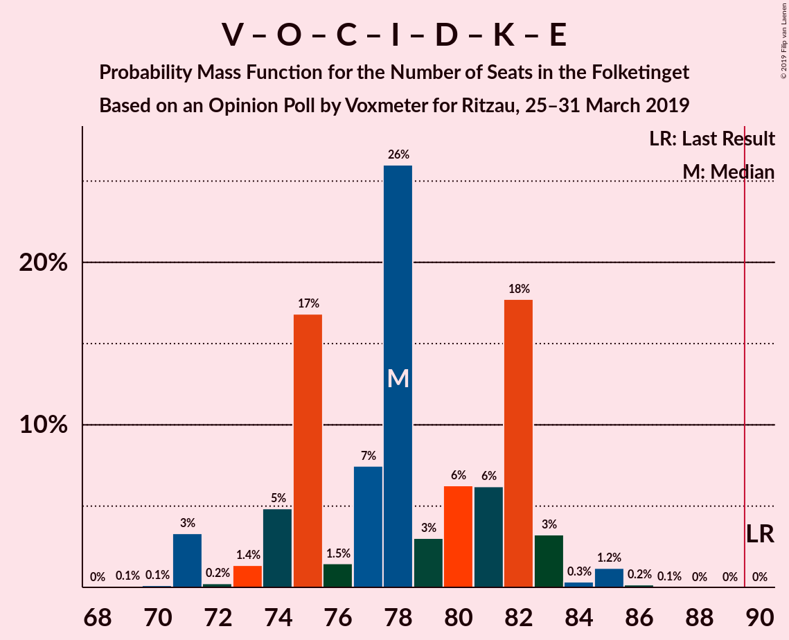
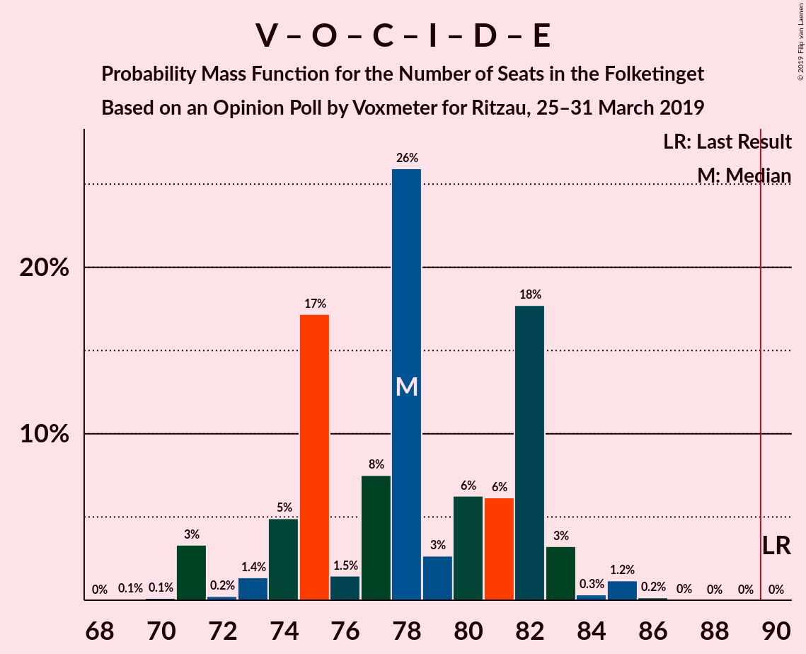
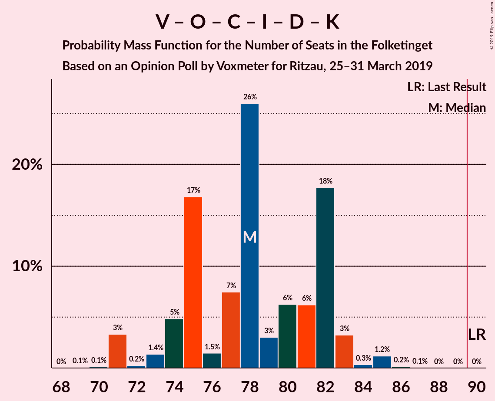
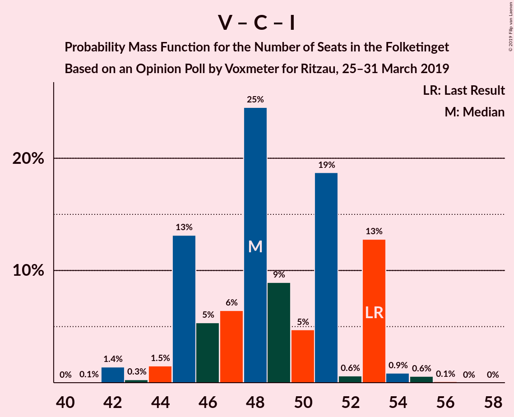

# Opinion Poll by Voxmeter for Ritzau, 25–31 March 2019

<a href="#voting-intentions">Voting Intentions</a> | <a href="#seats">Seats</a> | <a href="#coalitions">Coalitions</a> | <a href="#technical-information">Technical Information</a>

## Voting Intentions

### Confidence Intervals

| Party | Last Result | Poll Result | 80% Confidence Interval | 90% Confidence Interval | 95% Confidence Interval | 99% Confidence Interval |
|:-----:|:-----------:|:-----------:|:-----------------------:|:-----------------------:|:-----------------------:|:-----------------------:|
| Socialdemokraterne | 26.3% | 28.7% | 26.9–30.5% |26.5–31.0% |26.0–31.5% |25.2–32.4% |
| Venstre | 19.5% | 18.7% | 17.2–20.3% |16.8–20.7% |16.4–21.1% |15.7–21.9% |
| Dansk Folkeparti | 21.1% | 15.4% | 14.1–16.9% |13.7–17.4% |13.4–17.7% |12.8–18.5% |
| Enhedslisten–De Rød-Grønne | 7.8% | 8.3% | 7.3–9.5% |7.0–9.9% |6.8–10.2% |6.4–10.8% |
| Radikale Venstre | 4.6% | 7.2% | 6.3–8.3% |6.0–8.6% |5.8–8.9% |5.4–9.5% |
| Socialistisk Folkeparti | 4.2% | 5.7% | 4.9–6.7% |4.6–7.0% |4.4–7.3% |4.1–7.8% |
| Det Konservative Folkeparti | 3.4% | 4.3% | 3.6–5.2% |3.4–5.4% |3.2–5.7% |2.9–6.1% |
| Liberal Alliance | 7.5% | 4.0% | 3.3–4.9% |3.1–5.1% |3.0–5.3% |2.7–5.8% |
| Alternativet | 4.8% | 4.0% | 3.3–4.9% |3.1–5.1% |3.0–5.3% |2.7–5.8% |
| Nye Borgerlige | 0.0% | 1.9% | 1.4–2.6% |1.3–2.7% |1.2–2.9% |1.1–3.3% |
| Kristendemokraterne | 0.8% | 0.9% | 0.7–1.5% |0.6–1.6% |0.5–1.7% |0.4–2.0% |
| Klaus Riskær Pedersen | 0.0% | 0.4% | 0.2–0.8% |0.2–0.9% |0.2–1.0% |0.1–1.2% |

*Note:* The poll result column reflects the actual value used in the calculations. Published results may vary slightly, and in addition be rounded to fewer digits.

## Seats

### Confidence Intervals

| Party | Last Result | Median | 80% Confidence Interval | 90% Confidence Interval | 95% Confidence Interval | 99% Confidence Interval |
|:-----:|:-----------:|:------:|:-----------------------:|:-----------------------:|:-----------------------:|:-----------------------:|
| <a href="#socialdemokraterne">Socialdemokraterne</a> | 47 | 44 | 44–50 |44–50 |44–50 |44–53 |
| <a href="#venstre">Venstre</a> | 34 | 38 | 35–38 |35–38 |35–38 |30–38 |
| <a href="#dansk-folkeparti">Dansk Folkeparti</a> | 37 | 27 | 21–27 |21–27 |21–27 |21–30 |
| <a href="#enhedslisten–de-rød-grønne">Enhedslisten–De Rød-Grønne</a> | 14 | 17 | 15–17 |15–17 |15–17 |13–17 |
| <a href="#radikale-venstre">Radikale Venstre</a> | 8 | 12 | 12–19 |12–19 |12–19 |12–19 |
| <a href="#socialistisk-folkeparti">Socialistisk Folkeparti</a> | 7 | 10 | 10–11 |10–11 |10–11 |10–11 |
| <a href="#det-konservative-folkeparti">Det Konservative Folkeparti</a> | 6 | 5 | 5–8 |5–8 |5–8 |5–10 |
| <a href="#liberal-alliance">Liberal Alliance</a> | 13 | 9 | 9–10 |9–10 |9–10 |8–10 |
| <a href="#alternativet">Alternativet</a> | 9 | 7 | 6–7 |6–7 |6–7 |5–7 |
| <a href="#nye-borgerlige">Nye Borgerlige</a> | 0 | 6 | 0–6 |0–6 |0–6 |0–7 |
| <a href="#kristendemokraterne">Kristendemokraterne</a> | 0 | 0 | 0 |0 |0 |0 |
| <a href="#klaus-riskær-pedersen">Klaus Riskær Pedersen</a> | 0 | 0 | 0 |0 |0 |0 |

### Socialdemokraterne

*For a full overview of the results for this party, see the [Socialdemokraterne](party-socialdemokraterne.html) page.*

| Number of Seats | Probability | Accumulated | Special Marks |
|:---------------:|:-----------:|:-----------:|:-------------:|
| 44 | 77% | 100% | Median |
| 45 | 0% | 23% |  |
| 46 | 0% | 23% |  |
| 47 | 0.1% | 23% | Last Result |
| 48 | 0% | 22% |  |
| 49 | 0% | 22% |  |
| 50 | 21% | 22% |  |
| 51 | 0% | 1.3% |  |
| 52 | 0% | 1.3% |  |
| 53 | 1.3% | 1.3% |  |
| 54 | 0% | 0% |  |

### Venstre

*For a full overview of the results for this party, see the [Venstre](party-venstre.html) page.*

| Number of Seats | Probability | Accumulated | Special Marks |
|:---------------:|:-----------:|:-----------:|:-------------:|
| 25 | 0.5% | 100% |  |
| 26 | 0% | 99.5% |  |
| 27 | 0% | 99.5% |  |
| 28 | 0% | 99.5% |  |
| 29 | 0% | 99.5% |  |
| 30 | 0.9% | 99.5% |  |
| 31 | 0% | 98.7% |  |
| 32 | 0.1% | 98.6% |  |
| 33 | 0% | 98.5% |  |
| 34 | 0.2% | 98.5% | Last Result |
| 35 | 21% | 98% |  |
| 36 | 0% | 77% |  |
| 37 | 0% | 77% |  |
| 38 | 77% | 77% | Median |
| 39 | 0% | 0.3% |  |
| 40 | 0.3% | 0.3% |  |
| 41 | 0% | 0% |  |

### Dansk Folkeparti

*For a full overview of the results for this party, see the [Dansk Folkeparti](party-danskfolkeparti.html) page.*

| Number of Seats | Probability | Accumulated | Special Marks |
|:---------------:|:-----------:|:-----------:|:-------------:|
| 21 | 21% | 100% |  |
| 22 | 0% | 79% |  |
| 23 | 0.8% | 79% |  |
| 24 | 0.1% | 78% |  |
| 25 | 0.1% | 78% |  |
| 26 | 0% | 78% |  |
| 27 | 77% | 78% | Median |
| 28 | 0.1% | 0.8% |  |
| 29 | 0% | 0.8% |  |
| 30 | 0.5% | 0.7% |  |
| 31 | 0% | 0.3% |  |
| 32 | 0.3% | 0.3% |  |
| 33 | 0% | 0% |  |
| 34 | 0% | 0% |  |
| 35 | 0% | 0% |  |
| 36 | 0% | 0% |  |
| 37 | 0% | 0% | Last Result |

### Enhedslisten–De Rød-Grønne

*For a full overview of the results for this party, see the [Enhedslisten–De Rød-Grønne](party-enhedslisten–derød-grønne.html) page.*

| Number of Seats | Probability | Accumulated | Special Marks |
|:---------------:|:-----------:|:-----------:|:-------------:|
| 12 | 0.2% | 100% |  |
| 13 | 0.8% | 99.8% |  |
| 14 | 0% | 99.0% | Last Result |
| 15 | 21% | 99.0% |  |
| 16 | 0.7% | 78% |  |
| 17 | 77% | 77% | Median |
| 18 | 0.1% | 0.1% |  |
| 19 | 0% | 0% |  |

### Radikale Venstre

*For a full overview of the results for this party, see the [Radikale Venstre](party-radikalevenstre.html) page.*

| Number of Seats | Probability | Accumulated | Special Marks |
|:---------------:|:-----------:|:-----------:|:-------------:|
| 8 | 0% | 100% | Last Result |
| 9 | 0.2% | 100% |  |
| 10 | 0.1% | 99.8% |  |
| 11 | 0% | 99.7% |  |
| 12 | 77% | 99.7% | Median |
| 13 | 0% | 22% |  |
| 14 | 0% | 22% |  |
| 15 | 1.3% | 22% |  |
| 16 | 0% | 21% |  |
| 17 | 0% | 21% |  |
| 18 | 0% | 21% |  |
| 19 | 21% | 21% |  |
| 20 | 0% | 0% |  |

### Socialistisk Folkeparti

*For a full overview of the results for this party, see the [Socialistisk Folkeparti](party-socialistiskfolkeparti.html) page.*

| Number of Seats | Probability | Accumulated | Special Marks |
|:---------------:|:-----------:|:-----------:|:-------------:|
| 7 | 0% | 100% | Last Result |
| 8 | 0% | 100% |  |
| 9 | 0.5% | 100% |  |
| 10 | 77% | 99.5% | Median |
| 11 | 22% | 22% |  |
| 12 | 0% | 0.2% |  |
| 13 | 0% | 0.2% |  |
| 14 | 0.1% | 0.2% |  |
| 15 | 0% | 0% |  |

### Det Konservative Folkeparti

*For a full overview of the results for this party, see the [Det Konservative Folkeparti](party-detkonservativefolkeparti.html) page.*

| Number of Seats | Probability | Accumulated | Special Marks |
|:---------------:|:-----------:|:-----------:|:-------------:|
| 5 | 77% | 100% | Median |
| 6 | 0% | 23% | Last Result |
| 7 | 0.1% | 23% |  |
| 8 | 22% | 23% |  |
| 9 | 0.1% | 0.7% |  |
| 10 | 0.6% | 0.6% |  |
| 11 | 0% | 0% |  |

### Liberal Alliance

*For a full overview of the results for this party, see the [Liberal Alliance](party-liberalalliance.html) page.*

| Number of Seats | Probability | Accumulated | Special Marks |
|:---------------:|:-----------:|:-----------:|:-------------:|
| 6 | 0.2% | 100% |  |
| 7 | 0% | 99.8% |  |
| 8 | 1.3% | 99.8% |  |
| 9 | 78% | 98.6% | Median |
| 10 | 21% | 21% |  |
| 11 | 0% | 0% |  |
| 12 | 0% | 0% |  |
| 13 | 0% | 0% | Last Result |

### Alternativet

*For a full overview of the results for this party, see the [Alternativet](party-alternativet.html) page.*

| Number of Seats | Probability | Accumulated | Special Marks |
|:---------------:|:-----------:|:-----------:|:-------------:|
| 4 | 0.3% | 100% |  |
| 5 | 0.5% | 99.7% |  |
| 6 | 21% | 99.3% |  |
| 7 | 78% | 78% | Median |
| 8 | 0% | 0.1% |  |
| 9 | 0% | 0.1% | Last Result |
| 10 | 0.1% | 0.1% |  |
| 11 | 0% | 0% |  |

### Nye Borgerlige

*For a full overview of the results for this party, see the [Nye Borgerlige](party-nyeborgerlige.html) page.*

| Number of Seats | Probability | Accumulated | Special Marks |
|:---------------:|:-----------:|:-----------:|:-------------:|
| 0 | 21% | 100% | Last Result |
| 1 | 0% | 79% |  |
| 2 | 0% | 79% |  |
| 3 | 0% | 79% |  |
| 4 | 0.6% | 79% |  |
| 5 | 0% | 78% |  |
| 6 | 77% | 78% | Median |
| 7 | 0.8% | 0.8% |  |
| 8 | 0% | 0% |  |

### Kristendemokraterne

*For a full overview of the results for this party, see the [Kristendemokraterne](party-kristendemokraterne.html) page.*

| Number of Seats | Probability | Accumulated | Special Marks |
|:---------------:|:-----------:|:-----------:|:-------------:|
| 0 | 99.7% | 100% | Last Result, Median |
| 1 | 0% | 0.3% |  |
| 2 | 0% | 0.3% |  |
| 3 | 0% | 0.3% |  |
| 4 | 0.3% | 0.3% |  |
| 5 | 0% | 0% |  |

### Klaus Riskær Pedersen

*For a full overview of the results for this party, see the [Klaus Riskær Pedersen](party-klausriskærpedersen.html) page.*

| Number of Seats | Probability | Accumulated | Special Marks |
|:---------------:|:-----------:|:-----------:|:-------------:|
| 0 | 100% | 100% | Last Result, Median |

## Coalitions

### Confidence Intervals

| Coalition | Last Result | Median | Majority? | 80% Confidence Interval | 90% Confidence Interval | 95% Confidence Interval | 99% Confidence Interval |
|:---------:|:-----------:|:------:|:---------:|:-----------------------:|:-----------------------:|:-----------------------:|:-----------------------:|
| Socialdemokraterne – Enhedslisten–De Rød-Grønne – Radikale Venstre – Socialistisk Folkeparti – Alternativet | 85 | 90 | 99.7% | 90–101 | 90–101 | 90–101 | 90–101 |
| Socialdemokraterne – Enhedslisten–De Rød-Grønne – Radikale Venstre – Socialistisk Folkeparti | 76 | 83 | 22% | 83–95 | 83–95 | 83–95 | 83–95 |
| Venstre – Dansk Folkeparti – Det Konservative Folkeparti – Liberal Alliance – Nye Borgerlige – Kristendemokraterne – Klaus Riskær Pedersen | 90 | 85 | 0% | 74–85 | 74–85 | 74–85 | 74–85 |
| Venstre – Dansk Folkeparti – Det Konservative Folkeparti – Liberal Alliance – Nye Borgerlige – Klaus Riskær Pedersen | 90 | 85 | 0% | 74–85 | 74–85 | 74–85 | 74–85 |
| Venstre – Dansk Folkeparti – Det Konservative Folkeparti – Liberal Alliance – Nye Borgerlige – Kristendemokraterne | 90 | 85 | 0% | 74–85 | 74–85 | 74–85 | 74–85 |
| Venstre – Dansk Folkeparti – Det Konservative Folkeparti – Liberal Alliance – Nye Borgerlige | 90 | 85 | 0% | 74–85 | 74–85 | 74–85 | 74–85 |
| Socialdemokraterne – Enhedslisten–De Rød-Grønne – Socialistisk Folkeparti – Alternativet | 77 | 78 | 0% | 78–82 | 78–82 | 78–82 | 78–84 |
| Socialdemokraterne – Radikale Venstre – Socialistisk Folkeparti | 62 | 66 | 0% | 66–80 | 66–80 | 66–80 | 66–80 |
| Venstre – Dansk Folkeparti – Det Konservative Folkeparti – Liberal Alliance – Kristendemokraterne | 90 | 79 | 0% | 74–79 | 74–79 | 74–79 | 69–79 |
| Venstre – Dansk Folkeparti – Det Konservative Folkeparti – Liberal Alliance | 90 | 79 | 0% | 74–79 | 74–79 | 74–79 | 69–79 |
| Socialdemokraterne – Enhedslisten–De Rød-Grønne – Socialistisk Folkeparti | 68 | 71 | 0% | 71–76 | 71–76 | 71–76 | 71–78 |
| Socialdemokraterne – Radikale Venstre | 55 | 56 | 0% | 56–69 | 56–69 | 56–69 | 56–69 |
| Venstre – Det Konservative Folkeparti – Liberal Alliance | 53 | 52 | 0% | 52–53 | 52–53 | 52–53 | 46–53 |
| Venstre – Det Konservative Folkeparti | 40 | 43 | 0% | 43 | 43 | 43 | 37–43 |
| Venstre | 34 | 38 | 0% | 35–38 | 35–38 | 35–38 | 30–38 |

### Socialdemokraterne – Enhedslisten–De Rød-Grønne – Radikale Venstre – Socialistisk Folkeparti – Alternativet

| Number of Seats | Probability | Accumulated | Special Marks |
|:---------------:|:-----------:|:-----------:|:-------------:|
| 85 | 0% | 100% | Last Result |
| 86 | 0.3% | 100% |  |
| 87 | 0% | 99.7% |  |
| 88 | 0% | 99.7% |  |
| 89 | 0% | 99.7% |  |
| 90 | 77% | 99.7% | Median, Majority |
| 91 | 0% | 23% |  |
| 92 | 0% | 23% |  |
| 93 | 0.1% | 23% |  |
| 94 | 0% | 22% |  |
| 95 | 0% | 22% |  |
| 96 | 0% | 22% |  |
| 97 | 0.1% | 22% |  |
| 98 | 0.5% | 22% |  |
| 99 | 0.8% | 22% |  |
| 100 | 0% | 21% |  |
| 101 | 21% | 21% |  |
| 102 | 0% | 0% |  |

### Socialdemokraterne – Enhedslisten–De Rød-Grønne – Radikale Venstre – Socialistisk Folkeparti

| Number of Seats | Probability | Accumulated | Special Marks |
|:---------------:|:-----------:|:-----------:|:-------------:|
| 76 | 0% | 100% | Last Result |
| 77 | 0% | 100% |  |
| 78 | 0% | 100% |  |
| 79 | 0% | 100% |  |
| 80 | 0% | 100% |  |
| 81 | 0% | 100% |  |
| 82 | 0.3% | 100% |  |
| 83 | 77% | 99.7% | Median |
| 84 | 0% | 23% |  |
| 85 | 0% | 23% |  |
| 86 | 0% | 23% |  |
| 87 | 0.2% | 23% |  |
| 88 | 0% | 22% |  |
| 89 | 0% | 22% |  |
| 90 | 0% | 22% | Majority |
| 91 | 0% | 22% |  |
| 92 | 0.8% | 22% |  |
| 93 | 0.5% | 22% |  |
| 94 | 0% | 21% |  |
| 95 | 21% | 21% |  |
| 96 | 0% | 0% |  |

### Venstre – Dansk Folkeparti – Det Konservative Folkeparti – Liberal Alliance – Nye Borgerlige – Kristendemokraterne – Klaus Riskær Pedersen

| Number of Seats | Probability | Accumulated | Special Marks |
|:---------------:|:-----------:|:-----------:|:-------------:|
| 74 | 21% | 100% |  |
| 75 | 0% | 79% |  |
| 76 | 0.8% | 79% |  |
| 77 | 0.5% | 78% |  |
| 78 | 0.1% | 78% |  |
| 79 | 0% | 78% |  |
| 80 | 0% | 78% |  |
| 81 | 0% | 78% |  |
| 82 | 0.1% | 78% |  |
| 83 | 0% | 77% |  |
| 84 | 0% | 77% |  |
| 85 | 77% | 77% | Median |
| 86 | 0% | 0.3% |  |
| 87 | 0% | 0.3% |  |
| 88 | 0% | 0.3% |  |
| 89 | 0.3% | 0.3% |  |
| 90 | 0% | 0% | Last Result, Majority |

### Venstre – Dansk Folkeparti – Det Konservative Folkeparti – Liberal Alliance – Nye Borgerlige – Klaus Riskær Pedersen

| Number of Seats | Probability | Accumulated | Special Marks |
|:---------------:|:-----------:|:-----------:|:-------------:|
| 74 | 21% | 100% |  |
| 75 | 0% | 79% |  |
| 76 | 0.8% | 79% |  |
| 77 | 0.5% | 78% |  |
| 78 | 0.1% | 78% |  |
| 79 | 0% | 78% |  |
| 80 | 0% | 78% |  |
| 81 | 0.1% | 77% |  |
| 82 | 0% | 77% |  |
| 83 | 0% | 77% |  |
| 84 | 0% | 77% |  |
| 85 | 77% | 77% | Median |
| 86 | 0% | 0.3% |  |
| 87 | 0% | 0.3% |  |
| 88 | 0% | 0.3% |  |
| 89 | 0.3% | 0.3% |  |
| 90 | 0% | 0% | Last Result, Majority |

### Venstre – Dansk Folkeparti – Det Konservative Folkeparti – Liberal Alliance – Nye Borgerlige – Kristendemokraterne

| Number of Seats | Probability | Accumulated | Special Marks |
|:---------------:|:-----------:|:-----------:|:-------------:|
| 74 | 21% | 100% |  |
| 75 | 0% | 79% |  |
| 76 | 0.8% | 79% |  |
| 77 | 0.5% | 78% |  |
| 78 | 0.1% | 78% |  |
| 79 | 0% | 78% |  |
| 80 | 0% | 78% |  |
| 81 | 0% | 78% |  |
| 82 | 0.1% | 78% |  |
| 83 | 0% | 77% |  |
| 84 | 0% | 77% |  |
| 85 | 77% | 77% | Median |
| 86 | 0% | 0.3% |  |
| 87 | 0% | 0.3% |  |
| 88 | 0% | 0.3% |  |
| 89 | 0.3% | 0.3% |  |
| 90 | 0% | 0% | Last Result, Majority |

### Venstre – Dansk Folkeparti – Det Konservative Folkeparti – Liberal Alliance – Nye Borgerlige

| Number of Seats | Probability | Accumulated | Special Marks |
|:---------------:|:-----------:|:-----------:|:-------------:|
| 74 | 21% | 100% |  |
| 75 | 0% | 79% |  |
| 76 | 0.8% | 79% |  |
| 77 | 0.5% | 78% |  |
| 78 | 0.1% | 78% |  |
| 79 | 0% | 78% |  |
| 80 | 0% | 78% |  |
| 81 | 0.1% | 77% |  |
| 82 | 0% | 77% |  |
| 83 | 0% | 77% |  |
| 84 | 0% | 77% |  |
| 85 | 77% | 77% | Median |
| 86 | 0% | 0.3% |  |
| 87 | 0% | 0.3% |  |
| 88 | 0% | 0.3% |  |
| 89 | 0.3% | 0.3% |  |
| 90 | 0% | 0% | Last Result, Majority |

### Socialdemokraterne – Enhedslisten–De Rød-Grønne – Socialistisk Folkeparti – Alternativet

| Number of Seats | Probability | Accumulated | Special Marks |
|:---------------:|:-----------:|:-----------:|:-------------:|
| 74 | 0.3% | 100% |  |
| 75 | 0% | 99.7% |  |
| 76 | 0% | 99.7% |  |
| 77 | 0% | 99.7% | Last Result |
| 78 | 77% | 99.7% | Median |
| 79 | 0% | 23% |  |
| 80 | 0.1% | 23% |  |
| 81 | 0% | 22% |  |
| 82 | 21% | 22% |  |
| 83 | 0.5% | 1.5% |  |
| 84 | 0.9% | 1.0% |  |
| 85 | 0% | 0.1% |  |
| 86 | 0% | 0.1% |  |
| 87 | 0% | 0.1% |  |
| 88 | 0.1% | 0.1% |  |
| 89 | 0% | 0% |  |

### Socialdemokraterne – Radikale Venstre – Socialistisk Folkeparti

| Number of Seats | Probability | Accumulated | Special Marks |
|:---------------:|:-----------:|:-----------:|:-------------:|
| 62 | 0% | 100% | Last Result |
| 63 | 0% | 100% |  |
| 64 | 0% | 100% |  |
| 65 | 0% | 100% |  |
| 66 | 77% | 100% | Median |
| 67 | 0% | 23% |  |
| 68 | 0% | 23% |  |
| 69 | 0.1% | 23% |  |
| 70 | 0.1% | 23% |  |
| 71 | 0.1% | 22% |  |
| 72 | 0% | 22% |  |
| 73 | 0% | 22% |  |
| 74 | 0% | 22% |  |
| 75 | 0% | 22% |  |
| 76 | 0% | 22% |  |
| 77 | 0.5% | 22% |  |
| 78 | 0% | 22% |  |
| 79 | 0.8% | 22% |  |
| 80 | 21% | 21% |  |
| 81 | 0% | 0% |  |

### Venstre – Dansk Folkeparti – Det Konservative Folkeparti – Liberal Alliance – Kristendemokraterne

| Number of Seats | Probability | Accumulated | Special Marks |
|:---------------:|:-----------:|:-----------:|:-------------:|
| 69 | 0.8% | 100% |  |
| 70 | 0% | 99.2% |  |
| 71 | 0% | 99.2% |  |
| 72 | 0% | 99.2% |  |
| 73 | 0.5% | 99.2% |  |
| 74 | 21% | 98.7% |  |
| 75 | 0% | 78% |  |
| 76 | 0% | 78% |  |
| 77 | 0% | 78% |  |
| 78 | 0% | 78% |  |
| 79 | 77% | 78% | Median |
| 80 | 0% | 0.4% |  |
| 81 | 0% | 0.4% |  |
| 82 | 0.1% | 0.3% |  |
| 83 | 0% | 0.3% |  |
| 84 | 0% | 0.3% |  |
| 85 | 0% | 0.3% |  |
| 86 | 0% | 0.3% |  |
| 87 | 0% | 0.3% |  |
| 88 | 0% | 0.3% |  |
| 89 | 0.3% | 0.3% |  |
| 90 | 0% | 0% | Last Result, Majority |

### Venstre – Dansk Folkeparti – Det Konservative Folkeparti – Liberal Alliance

| Number of Seats | Probability | Accumulated | Special Marks |
|:---------------:|:-----------:|:-----------:|:-------------:|
| 69 | 0.8% | 100% |  |
| 70 | 0.1% | 99.2% |  |
| 71 | 0% | 99.1% |  |
| 72 | 0% | 99.1% |  |
| 73 | 0.5% | 99.1% |  |
| 74 | 21% | 98.6% |  |
| 75 | 0.2% | 78% |  |
| 76 | 0% | 77% |  |
| 77 | 0% | 77% |  |
| 78 | 0.1% | 77% |  |
| 79 | 77% | 77% | Median |
| 80 | 0% | 0.3% |  |
| 81 | 0% | 0.3% |  |
| 82 | 0% | 0.3% |  |
| 83 | 0% | 0.3% |  |
| 84 | 0% | 0.3% |  |
| 85 | 0% | 0.3% |  |
| 86 | 0% | 0.3% |  |
| 87 | 0% | 0.3% |  |
| 88 | 0% | 0.3% |  |
| 89 | 0.3% | 0.3% |  |
| 90 | 0% | 0% | Last Result, Majority |

### Socialdemokraterne – Enhedslisten–De Rød-Grønne – Socialistisk Folkeparti

| Number of Seats | Probability | Accumulated | Special Marks |
|:---------------:|:-----------:|:-----------:|:-------------:|
| 68 | 0% | 100% | Last Result |
| 69 | 0% | 100% |  |
| 70 | 0.3% | 100% |  |
| 71 | 77% | 99.7% | Median |
| 72 | 0% | 23% |  |
| 73 | 0.1% | 23% |  |
| 74 | 0% | 22% |  |
| 75 | 0% | 22% |  |
| 76 | 21% | 22% |  |
| 77 | 0.8% | 1.5% |  |
| 78 | 0.6% | 0.7% |  |
| 79 | 0% | 0% |  |

### Socialdemokraterne – Radikale Venstre

| Number of Seats | Probability | Accumulated | Special Marks |
|:---------------:|:-----------:|:-----------:|:-------------:|
| 55 | 0% | 100% | Last Result |
| 56 | 77% | 100% | Median |
| 57 | 0.1% | 23% |  |
| 58 | 0% | 23% |  |
| 59 | 0.2% | 23% |  |
| 60 | 0% | 22% |  |
| 61 | 0% | 22% |  |
| 62 | 0% | 22% |  |
| 63 | 0% | 22% |  |
| 64 | 0% | 22% |  |
| 65 | 0% | 22% |  |
| 66 | 0% | 22% |  |
| 67 | 0% | 22% |  |
| 68 | 1.3% | 22% |  |
| 69 | 21% | 21% |  |
| 70 | 0% | 0% |  |

### Venstre – Det Konservative Folkeparti – Liberal Alliance

| Number of Seats | Probability | Accumulated | Special Marks |
|:---------------:|:-----------:|:-----------:|:-------------:|
| 43 | 0.5% | 100% |  |
| 44 | 0% | 99.5% |  |
| 45 | 0% | 99.5% |  |
| 46 | 0.9% | 99.5% |  |
| 47 | 0% | 98.6% |  |
| 48 | 0% | 98.6% |  |
| 49 | 0% | 98.6% |  |
| 50 | 0.2% | 98.6% |  |
| 51 | 0% | 98% |  |
| 52 | 77% | 98% | Median |
| 53 | 21% | 21% | Last Result |
| 54 | 0% | 0.3% |  |
| 55 | 0% | 0.3% |  |
| 56 | 0% | 0.3% |  |
| 57 | 0.3% | 0.3% |  |
| 58 | 0% | 0% |  |

### Venstre – Det Konservative Folkeparti

| Number of Seats | Probability | Accumulated | Special Marks |
|:---------------:|:-----------:|:-----------:|:-------------:|
| 35 | 0.5% | 100% |  |
| 36 | 0% | 99.5% |  |
| 37 | 0.1% | 99.5% |  |
| 38 | 0.8% | 99.4% |  |
| 39 | 0% | 98.6% |  |
| 40 | 0% | 98.6% | Last Result |
| 41 | 0.1% | 98.6% |  |
| 42 | 0% | 98.5% |  |
| 43 | 98% | 98.5% | Median |
| 44 | 0.1% | 0.4% |  |
| 45 | 0% | 0.3% |  |
| 46 | 0% | 0.3% |  |
| 47 | 0% | 0.3% |  |
| 48 | 0.3% | 0.3% |  |
| 49 | 0% | 0% |  |

### Venstre

| Number of Seats | Probability | Accumulated | Special Marks |
|:---------------:|:-----------:|:-----------:|:-------------:|
| 25 | 0.5% | 100% |  |
| 26 | 0% | 99.5% |  |
| 27 | 0% | 99.5% |  |
| 28 | 0% | 99.5% |  |
| 29 | 0% | 99.5% |  |
| 30 | 0.9% | 99.5% |  |
| 31 | 0% | 98.7% |  |
| 32 | 0.1% | 98.6% |  |
| 33 | 0% | 98.5% |  |
| 34 | 0.2% | 98.5% | Last Result |
| 35 | 21% | 98% |  |
| 36 | 0% | 77% |  |
| 37 | 0% | 77% |  |
| 38 | 77% | 77% | Median |
| 39 | 0% | 0.3% |  |
| 40 | 0.3% | 0.3% |  |
| 41 | 0% | 0% |  |

## Technical Information

### Opinion Poll

+ **Polling firm:** Voxmeter
+ **Commissioner(s):** Ritzau
+ **Fieldwork period:** 25–31 March 2019

### Calculations

+ **Sample size:** 1056
+ **Simulations done:** 1,024
+ **Error estimate:** 3.48%

