# Opinion Poll by Greens Analyseinstitut for Børsen, 1 April 2019

<a href="#voting-intentions">Voting Intentions</a> | <a href="#seats">Seats</a> | <a href="#coalitions">Coalitions</a> | <a href="#technical-information">Technical Information</a>

## Voting Intentions

### Confidence Intervals

| Party | Last Result | Poll Result | 80% Confidence Interval | 90% Confidence Interval | 95% Confidence Interval | 99% Confidence Interval |
|:-----:|:-----------:|:-----------:|:-----------------------:|:-----------------------:|:-----------------------:|:-----------------------:|
| Socialdemokraterne | 26.3% | 30.4% | 28.7–32.3% |28.2–32.8% |27.7–33.2% |26.9–34.1% |
| Venstre | 19.5% | 15.8% | 14.4–17.3% |14.0–17.7% |13.7–18.1% |13.1–18.8% |
| Dansk Folkeparti | 21.1% | 14.4% | 13.1–15.8% |12.7–16.2% |12.4–16.6% |11.8–17.3% |
| Enhedslisten–De Rød-Grønne | 7.8% | 9.0% | 8.0–10.2% |7.7–10.6% |7.4–10.9% |7.0–11.5% |
| Socialistisk Folkeparti | 4.2% | 7.0% | 6.1–8.1% |5.8–8.4% |5.6–8.6% |5.2–9.2% |
| Radikale Venstre | 4.6% | 5.8% | 5.0–6.9% |4.8–7.2% |4.6–7.4% |4.2–7.9% |
| Det Konservative Folkeparti | 3.4% | 4.6% | 3.9–5.6% |3.7–5.8% |3.5–6.1% |3.2–6.6% |
| Liberal Alliance | 7.5% | 4.0% | 3.3–4.9% |3.1–5.1% |3.0–5.3% |2.7–5.8% |
| Nye Borgerlige | 0.0% | 3.3% | 2.7–4.2% |2.6–4.4% |2.4–4.6% |2.1–5.0% |
| Alternativet | 4.8% | 3.0% | 2.4–3.7% |2.2–4.0% |2.1–4.2% |1.9–4.6% |
| Kristendemokraterne | 0.8% | 1.2% | 0.9–1.8% |0.8–1.9% |0.7–2.1% |0.6–2.4% |
| Klaus Riskær Pedersen | 0.0% | 1.0% | 0.7–1.5% |0.6–1.7% |0.6–1.8% |0.5–2.1% |

*Note:* The poll result column reflects the actual value used in the calculations. Published results may vary slightly, and in addition be rounded to fewer digits.

## Seats

### Confidence Intervals

| Party | Last Result | Median | 80% Confidence Interval | 90% Confidence Interval | 95% Confidence Interval | 99% Confidence Interval |
|:-----:|:-----------:|:------:|:-----------------------:|:-----------------------:|:-----------------------:|:-----------------------:|
| <a href="#socialdemokraterne">Socialdemokraterne</a> | 47 | 54 | 53–57 |52–59 |50–59 |48–60 |
| <a href="#venstre">Venstre</a> | 34 | 26 | 26–32 |25–33 |25–33 |23–34 |
| <a href="#dansk-folkeparti">Dansk Folkeparti</a> | 37 | 27 | 24–28 |23–29 |23–30 |21–31 |
| <a href="#enhedslisten–de-rød-grønne">Enhedslisten–De Rød-Grønne</a> | 14 | 15 | 15–17 |14–18 |14–18 |12–20 |
| <a href="#socialistisk-folkeparti">Socialistisk Folkeparti</a> | 7 | 14 | 11–15 |11–15 |10–15 |10–16 |
| <a href="#radikale-venstre">Radikale Venstre</a> | 8 | 12 | 9–12 |9–13 |9–13 |8–14 |
| <a href="#det-konservative-folkeparti">Det Konservative Folkeparti</a> | 6 | 7 | 7–9 |7–10 |7–10 |6–11 |
| <a href="#liberal-alliance">Liberal Alliance</a> | 13 | 8 | 6–8 |5–9 |5–9 |4–10 |
| <a href="#nye-borgerlige">Nye Borgerlige</a> | 0 | 7 | 5–7 |4–7 |4–8 |4–9 |
| <a href="#alternativet">Alternativet</a> | 9 | 5 | 4–6 |0–7 |0–7 |0–8 |
| <a href="#kristendemokraterne">Kristendemokraterne</a> | 0 | 0 | 0 |0 |0–4 |0–5 |
| <a href="#klaus-riskær-pedersen">Klaus Riskær Pedersen</a> | 0 | 0 | 0 |0 |0 |0 |

### Socialdemokraterne

*For a full overview of the results for this party, see the [Socialdemokraterne](party-socialdemokraterne.html) page.*

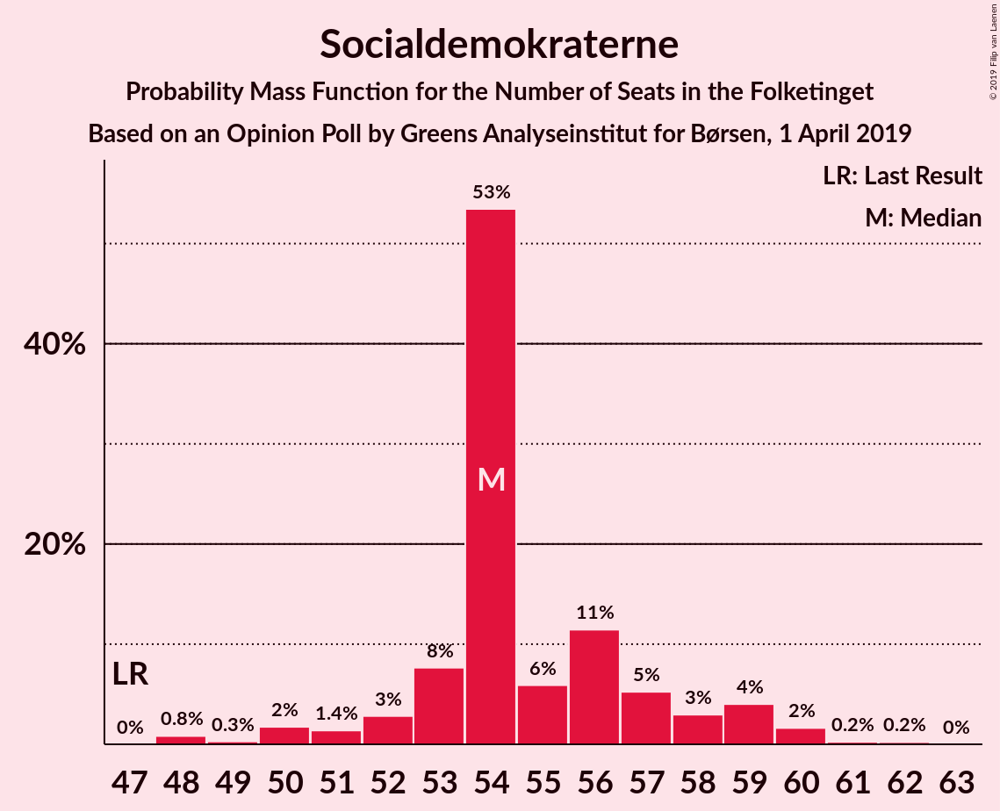

| Number of Seats | Probability | Accumulated | Special Marks |
|:---------------:|:-----------:|:-----------:|:-------------:|
| 47 | 0% | 100% | Last Result |
| 48 | 0.8% | 99.9% |  |
| 49 | 0.3% | 99.1% |  |
| 50 | 2% | 98.8% |  |
| 51 | 1.4% | 97% |  |
| 52 | 3% | 96% |  |
| 53 | 8% | 93% |  |
| 54 | 53% | 85% | Median |
| 55 | 6% | 32% |  |
| 56 | 11% | 26% |  |
| 57 | 5% | 14% |  |
| 58 | 3% | 9% |  |
| 59 | 4% | 6% |  |
| 60 | 2% | 2% |  |
| 61 | 0.2% | 0.5% |  |
| 62 | 0.2% | 0.3% |  |
| 63 | 0% | 0% |  |

### Venstre

*For a full overview of the results for this party, see the [Venstre](party-venstre.html) page.*

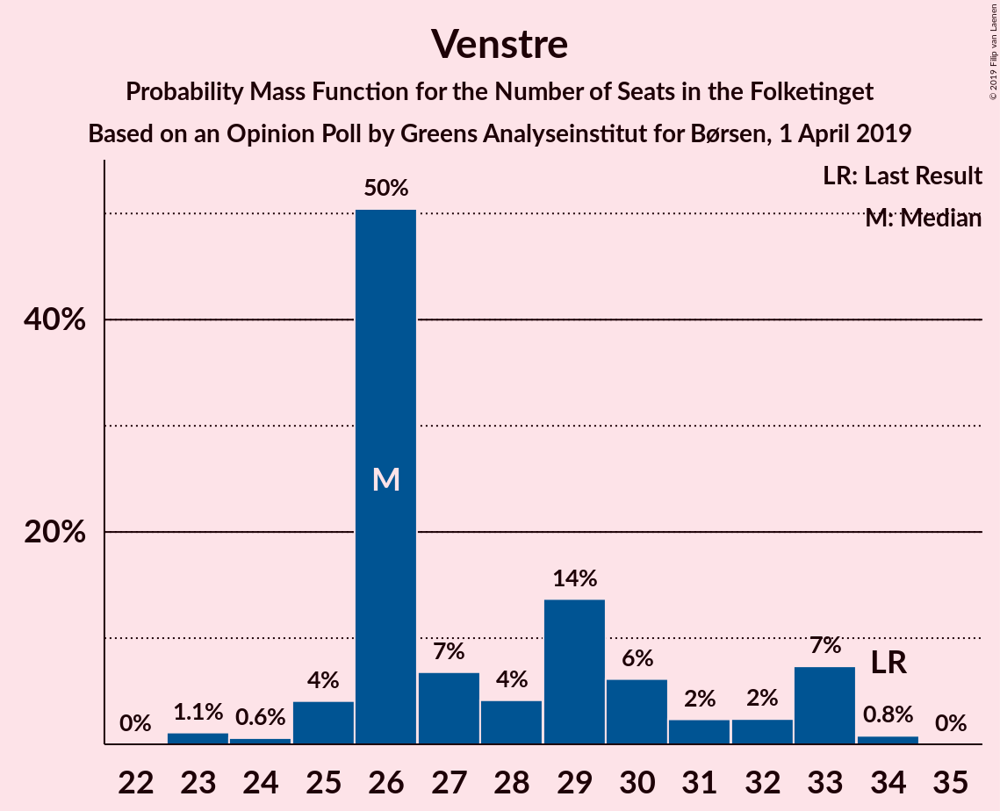

| Number of Seats | Probability | Accumulated | Special Marks |
|:---------------:|:-----------:|:-----------:|:-------------:|
| 22 | 0% | 100% |  |
| 23 | 1.1% | 99.9% |  |
| 24 | 0.6% | 98.8% |  |
| 25 | 4% | 98% |  |
| 26 | 50% | 94% | Median |
| 27 | 7% | 44% |  |
| 28 | 4% | 37% |  |
| 29 | 14% | 33% |  |
| 30 | 6% | 19% |  |
| 31 | 2% | 13% |  |
| 32 | 2% | 11% |  |
| 33 | 7% | 8% |  |
| 34 | 0.8% | 0.8% | Last Result |
| 35 | 0% | 0% |  |

### Dansk Folkeparti

*For a full overview of the results for this party, see the [Dansk Folkeparti](party-danskfolkeparti.html) page.*

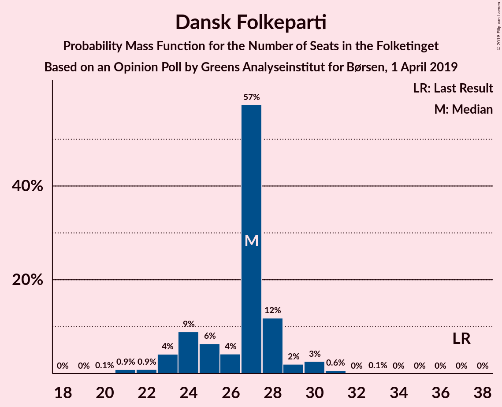

| Number of Seats | Probability | Accumulated | Special Marks |
|:---------------:|:-----------:|:-----------:|:-------------:|
| 20 | 0.1% | 100% |  |
| 21 | 0.9% | 99.9% |  |
| 22 | 0.9% | 99.0% |  |
| 23 | 4% | 98% |  |
| 24 | 9% | 94% |  |
| 25 | 6% | 85% |  |
| 26 | 4% | 79% |  |
| 27 | 57% | 75% | Median |
| 28 | 12% | 17% |  |
| 29 | 2% | 5% |  |
| 30 | 3% | 3% |  |
| 31 | 0.6% | 0.8% |  |
| 32 | 0% | 0.2% |  |
| 33 | 0.1% | 0.1% |  |
| 34 | 0% | 0% |  |
| 35 | 0% | 0% |  |
| 36 | 0% | 0% |  |
| 37 | 0% | 0% | Last Result |

### Enhedslisten–De Rød-Grønne

*For a full overview of the results for this party, see the [Enhedslisten–De Rød-Grønne](party-enhedslisten–derød-grønne.html) page.*

| Number of Seats | Probability | Accumulated | Special Marks |
|:---------------:|:-----------:|:-----------:|:-------------:|
| 12 | 1.4% | 100% |  |
| 13 | 0.5% | 98.5% |  |
| 14 | 8% | 98% | Last Result |
| 15 | 54% | 90% | Median |
| 16 | 16% | 37% |  |
| 17 | 13% | 21% |  |
| 18 | 6% | 8% |  |
| 19 | 1.4% | 2% |  |
| 20 | 0.5% | 0.6% |  |
| 21 | 0% | 0.1% |  |
| 22 | 0% | 0% |  |

### Socialistisk Folkeparti

*For a full overview of the results for this party, see the [Socialistisk Folkeparti](party-socialistiskfolkeparti.html) page.*

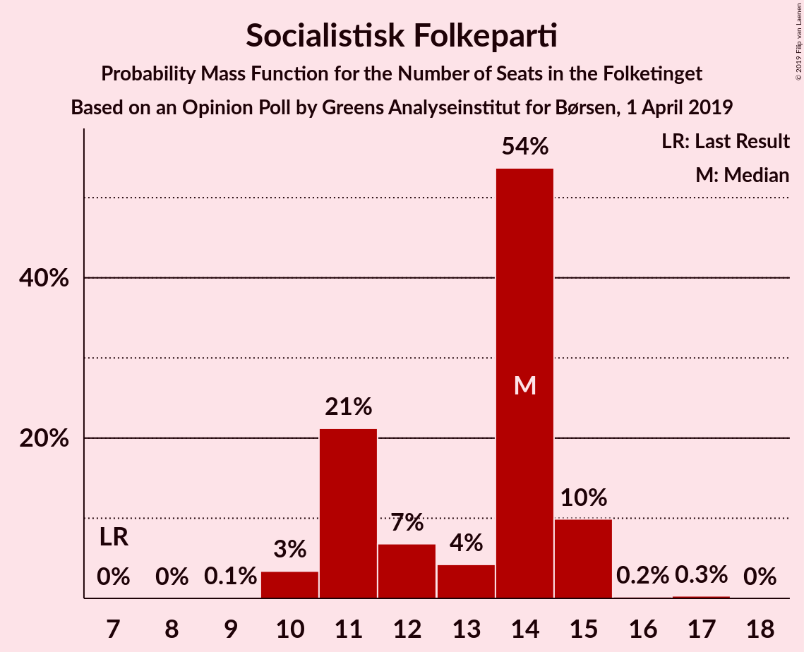

| Number of Seats | Probability | Accumulated | Special Marks |
|:---------------:|:-----------:|:-----------:|:-------------:|
| 7 | 0% | 100% | Last Result |
| 8 | 0% | 100% |  |
| 9 | 0.1% | 100% |  |
| 10 | 3% | 99.8% |  |
| 11 | 21% | 96% |  |
| 12 | 7% | 75% |  |
| 13 | 4% | 68% |  |
| 14 | 54% | 64% | Median |
| 15 | 10% | 10% |  |
| 16 | 0.2% | 0.5% |  |
| 17 | 0.3% | 0.4% |  |
| 18 | 0% | 0% |  |

### Radikale Venstre

*For a full overview of the results for this party, see the [Radikale Venstre](party-radikalevenstre.html) page.*

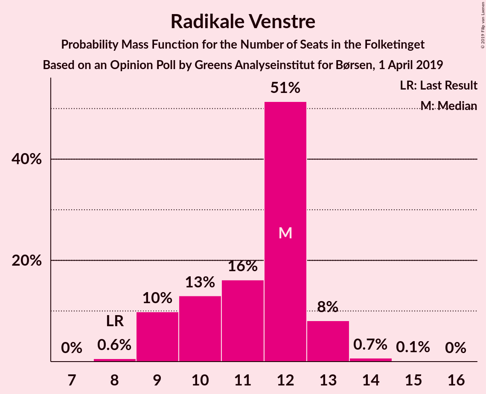

| Number of Seats | Probability | Accumulated | Special Marks |
|:---------------:|:-----------:|:-----------:|:-------------:|
| 8 | 0.6% | 100% | Last Result |
| 9 | 10% | 99.4% |  |
| 10 | 13% | 90% |  |
| 11 | 16% | 77% |  |
| 12 | 51% | 60% | Median |
| 13 | 8% | 9% |  |
| 14 | 0.7% | 0.9% |  |
| 15 | 0.1% | 0.2% |  |
| 16 | 0% | 0% |  |

### Det Konservative Folkeparti

*For a full overview of the results for this party, see the [Det Konservative Folkeparti](party-detkonservativefolkeparti.html) page.*

| Number of Seats | Probability | Accumulated | Special Marks |
|:---------------:|:-----------:|:-----------:|:-------------:|
| 6 | 2% | 100% | Last Result |
| 7 | 50% | 98% | Median |
| 8 | 18% | 48% |  |
| 9 | 21% | 30% |  |
| 10 | 7% | 9% |  |
| 11 | 2% | 2% |  |
| 12 | 0.3% | 0.4% |  |
| 13 | 0.1% | 0.2% |  |
| 14 | 0% | 0% |  |

### Liberal Alliance

*For a full overview of the results for this party, see the [Liberal Alliance](party-liberalalliance.html) page.*

| Number of Seats | Probability | Accumulated | Special Marks |
|:---------------:|:-----------:|:-----------:|:-------------:|
| 4 | 0.6% | 100% |  |
| 5 | 6% | 99.4% |  |
| 6 | 20% | 93% |  |
| 7 | 12% | 73% |  |
| 8 | 53% | 61% | Median |
| 9 | 6% | 8% |  |
| 10 | 2% | 2% |  |
| 11 | 0.2% | 0.2% |  |
| 12 | 0% | 0% |  |
| 13 | 0% | 0% | Last Result |

### Nye Borgerlige

*For a full overview of the results for this party, see the [Nye Borgerlige](party-nyeborgerlige.html) page.*

| Number of Seats | Probability | Accumulated | Special Marks |
|:---------------:|:-----------:|:-----------:|:-------------:|
| 0 | 0.3% | 100% | Last Result |
| 1 | 0% | 99.7% |  |
| 2 | 0% | 99.7% |  |
| 3 | 0% | 99.7% |  |
| 4 | 7% | 99.7% |  |
| 5 | 24% | 93% |  |
| 6 | 17% | 68% |  |
| 7 | 48% | 51% | Median |
| 8 | 2% | 3% |  |
| 9 | 0.6% | 0.6% |  |
| 10 | 0% | 0% |  |

### Alternativet

*For a full overview of the results for this party, see the [Alternativet](party-alternativet.html) page.*

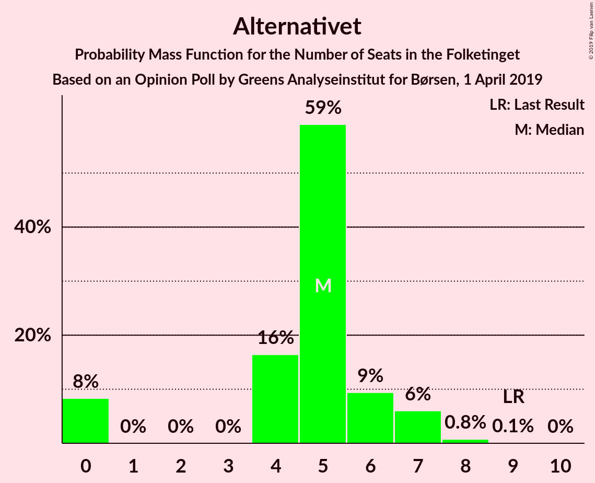

| Number of Seats | Probability | Accumulated | Special Marks |
|:---------------:|:-----------:|:-----------:|:-------------:|
| 0 | 8% | 100% |  |
| 1 | 0% | 92% |  |
| 2 | 0% | 92% |  |
| 3 | 0% | 92% |  |
| 4 | 16% | 92% |  |
| 5 | 59% | 75% | Median |
| 6 | 9% | 16% |  |
| 7 | 6% | 7% |  |
| 8 | 0.8% | 0.8% |  |
| 9 | 0.1% | 0.1% | Last Result |
| 10 | 0% | 0% |  |

### Kristendemokraterne

*For a full overview of the results for this party, see the [Kristendemokraterne](party-kristendemokraterne.html) page.*

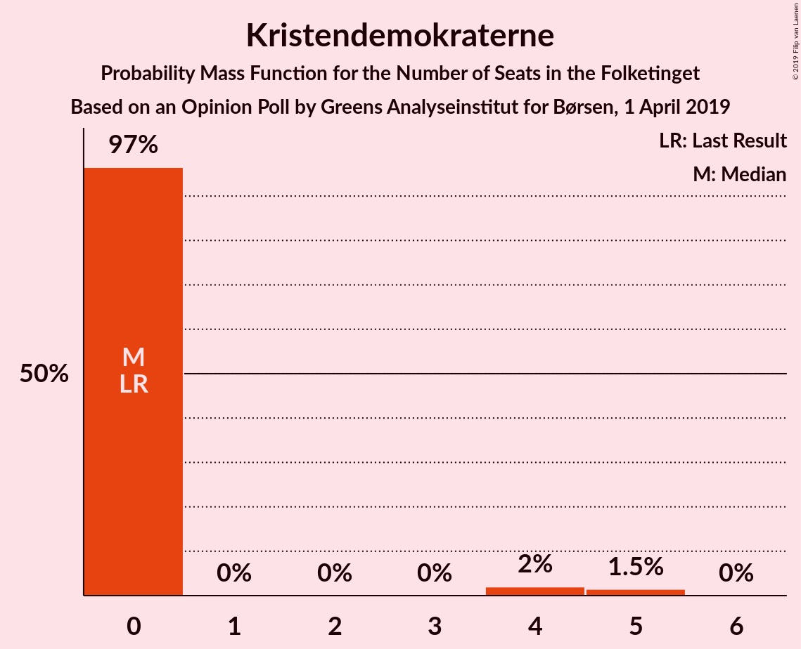

| Number of Seats | Probability | Accumulated | Special Marks |
|:---------------:|:-----------:|:-----------:|:-------------:|
| 0 | 97% | 100% | Last Result, Median |
| 1 | 0% | 3% |  |
| 2 | 0% | 3% |  |
| 3 | 0% | 3% |  |
| 4 | 2% | 3% |  |
| 5 | 1.5% | 1.5% |  |
| 6 | 0% | 0% |  |

### Klaus Riskær Pedersen

*For a full overview of the results for this party, see the [Klaus Riskær Pedersen](party-klausriskærpedersen.html) page.*

| Number of Seats | Probability | Accumulated | Special Marks |
|:---------------:|:-----------:|:-----------:|:-------------:|
| 0 | 99.7% | 100% | Last Result, Median |
| 1 | 0% | 0.3% |  |
| 2 | 0% | 0.3% |  |
| 3 | 0% | 0.3% |  |
| 4 | 0.3% | 0.3% |  |
| 5 | 0% | 0% |  |

## Coalitions

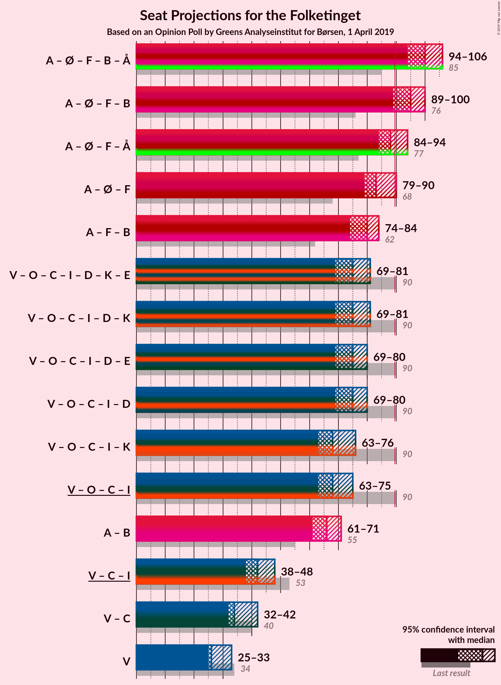

### Confidence Intervals

| Coalition | Last Result | Median | Majority? | 80% Confidence Interval | 90% Confidence Interval | 95% Confidence Interval | 99% Confidence Interval |
|:---------:|:-----------:|:------:|:---------:|:-----------------------:|:-----------------------:|:-----------------------:|:-----------------------:|
| Socialdemokraterne – Enhedslisten–De Rød-Grønne – Socialistisk Folkeparti – Radikale Venstre – Alternativet | 85 | 100 | 100% | 95–103 | 95–104 | 94–106 | 92–106 |
| Socialdemokraterne – Enhedslisten–De Rød-Grønne – Socialistisk Folkeparti – Radikale Venstre | 76 | 95 | 96% | 92–99 | 90–100 | 89–100 | 87–101 |
| Socialdemokraterne – Enhedslisten–De Rød-Grønne – Socialistisk Folkeparti – Alternativet | 77 | 88 | 18% | 84–91 | 84–93 | 84–94 | 81–94 |
| Socialdemokraterne – Enhedslisten–De Rød-Grønne – Socialistisk Folkeparti | 68 | 83 | 4% | 81–86 | 79–87 | 79–90 | 76–90 |
| Socialdemokraterne – Socialistisk Folkeparti – Radikale Venstre | 62 | 80 | 0% | 76–82 | 75–83 | 74–84 | 72–85 |
| Venstre – Dansk Folkeparti – Det Konservative Folkeparti – Liberal Alliance – Nye Borgerlige – Kristendemokraterne – Klaus Riskær Pedersen | 90 | 75 | 0% | 72–80 | 71–80 | 69–81 | 69–83 |
| Venstre – Dansk Folkeparti – Det Konservative Folkeparti – Liberal Alliance – Nye Borgerlige – Kristendemokraterne | 90 | 75 | 0% | 72–80 | 71–80 | 69–81 | 69–83 |
| Venstre – Dansk Folkeparti – Det Konservative Folkeparti – Liberal Alliance – Nye Borgerlige – Klaus Riskær Pedersen | 90 | 75 | 0% | 72–80 | 71–80 | 69–80 | 69–82 |
| Venstre – Dansk Folkeparti – Det Konservative Folkeparti – Liberal Alliance – Nye Borgerlige | 90 | 75 | 0% | 72–80 | 71–80 | 69–80 | 69–82 |
| Venstre – Dansk Folkeparti – Det Konservative Folkeparti – Liberal Alliance – Kristendemokraterne | 90 | 68 | 0% | 66–75 | 65–75 | 63–76 | 63–77 |
| Venstre – Dansk Folkeparti – Det Konservative Folkeparti – Liberal Alliance | 90 | 68 | 0% | 66–75 | 65–75 | 63–75 | 63–77 |
| Socialdemokraterne – Radikale Venstre | 55 | 66 | 0% | 63–69 | 62–70 | 61–71 | 59–73 |
| Venstre – Det Konservative Folkeparti – Liberal Alliance | 53 | 42 | 0% | 41–47 | 39–48 | 38–48 | 38–49 |
| Venstre – Det Konservative Folkeparti | 40 | 34 | 0% | 33–40 | 33–42 | 32–42 | 32–42 |
| Venstre | 34 | 26 | 0% | 26–32 | 25–33 | 25–33 | 23–34 |

### Socialdemokraterne – Enhedslisten–De Rød-Grønne – Socialistisk Folkeparti – Radikale Venstre – Alternativet

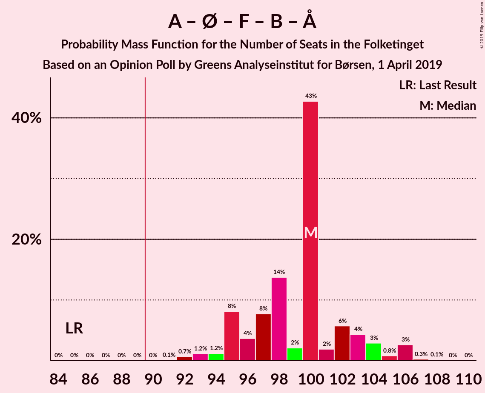

| Number of Seats | Probability | Accumulated | Special Marks |
|:---------------:|:-----------:|:-----------:|:-------------:|
| 85 | 0% | 100% | Last Result |
| 86 | 0% | 100% |  |
| 87 | 0% | 100% |  |
| 88 | 0% | 100% |  |
| 89 | 0% | 100% |  |
| 90 | 0% | 100% | Majority |
| 91 | 0.1% | 99.9% |  |
| 92 | 0.7% | 99.9% |  |
| 93 | 1.2% | 99.2% |  |
| 94 | 1.2% | 98% |  |
| 95 | 8% | 97% |  |
| 96 | 4% | 89% |  |
| 97 | 8% | 85% |  |
| 98 | 14% | 77% |  |
| 99 | 2% | 64% |  |
| 100 | 43% | 61% | Median |
| 101 | 2% | 19% |  |
| 102 | 6% | 17% |  |
| 103 | 4% | 11% |  |
| 104 | 3% | 7% |  |
| 105 | 0.8% | 4% |  |
| 106 | 3% | 3% |  |
| 107 | 0.3% | 0.4% |  |
| 108 | 0.1% | 0.2% |  |
| 109 | 0% | 0% |  |

### Socialdemokraterne – Enhedslisten–De Rød-Grønne – Socialistisk Folkeparti – Radikale Venstre

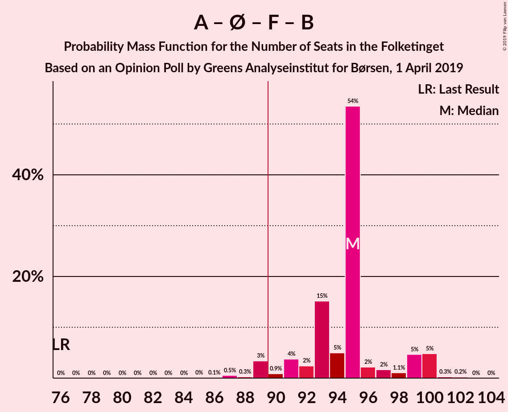

| Number of Seats | Probability | Accumulated | Special Marks |
|:---------------:|:-----------:|:-----------:|:-------------:|
| 76 | 0% | 100% | Last Result |
| 77 | 0% | 100% |  |
| 78 | 0% | 100% |  |
| 79 | 0% | 100% |  |
| 80 | 0% | 100% |  |
| 81 | 0% | 100% |  |
| 82 | 0% | 100% |  |
| 83 | 0% | 100% |  |
| 84 | 0% | 100% |  |
| 85 | 0% | 100% |  |
| 86 | 0.1% | 99.9% |  |
| 87 | 0.5% | 99.8% |  |
| 88 | 0.3% | 99.3% |  |
| 89 | 3% | 99.0% |  |
| 90 | 0.9% | 96% | Majority |
| 91 | 4% | 95% |  |
| 92 | 2% | 91% |  |
| 93 | 15% | 89% |  |
| 94 | 5% | 73% |  |
| 95 | 54% | 68% | Median |
| 96 | 2% | 15% |  |
| 97 | 2% | 13% |  |
| 98 | 1.1% | 11% |  |
| 99 | 5% | 10% |  |
| 100 | 5% | 5% |  |
| 101 | 0.3% | 0.5% |  |
| 102 | 0.2% | 0.3% |  |
| 103 | 0% | 0% |  |

### Socialdemokraterne – Enhedslisten–De Rød-Grønne – Socialistisk Folkeparti – Alternativet

| Number of Seats | Probability | Accumulated | Special Marks |
|:---------------:|:-----------:|:-----------:|:-------------:|
| 77 | 0% | 100% | Last Result |
| 78 | 0% | 100% |  |
| 79 | 0.1% | 99.9% |  |
| 80 | 0.2% | 99.8% |  |
| 81 | 0.8% | 99.6% |  |
| 82 | 0.1% | 98.8% |  |
| 83 | 0.7% | 98.7% |  |
| 84 | 9% | 98% |  |
| 85 | 4% | 89% |  |
| 86 | 5% | 84% |  |
| 87 | 8% | 79% |  |
| 88 | 49% | 71% | Median |
| 89 | 5% | 22% |  |
| 90 | 2% | 18% | Majority |
| 91 | 8% | 16% |  |
| 92 | 0.3% | 8% |  |
| 93 | 4% | 8% |  |
| 94 | 4% | 4% |  |
| 95 | 0.2% | 0.4% |  |
| 96 | 0.2% | 0.3% |  |
| 97 | 0% | 0.1% |  |
| 98 | 0% | 0% |  |

### Socialdemokraterne – Enhedslisten–De Rød-Grønne – Socialistisk Folkeparti

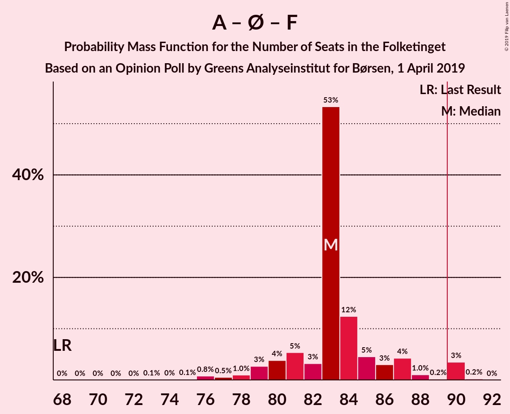

| Number of Seats | Probability | Accumulated | Special Marks |
|:---------------:|:-----------:|:-----------:|:-------------:|
| 68 | 0% | 100% | Last Result |
| 69 | 0% | 100% |  |
| 70 | 0% | 100% |  |
| 71 | 0% | 100% |  |
| 72 | 0% | 100% |  |
| 73 | 0.1% | 100% |  |
| 74 | 0% | 99.9% |  |
| 75 | 0.1% | 99.9% |  |
| 76 | 0.8% | 99.8% |  |
| 77 | 0.5% | 99.0% |  |
| 78 | 1.0% | 98% |  |
| 79 | 3% | 98% |  |
| 80 | 4% | 95% |  |
| 81 | 5% | 91% |  |
| 82 | 3% | 86% |  |
| 83 | 53% | 82% | Median |
| 84 | 12% | 29% |  |
| 85 | 5% | 17% |  |
| 86 | 3% | 12% |  |
| 87 | 4% | 9% |  |
| 88 | 1.0% | 5% |  |
| 89 | 0.2% | 4% |  |
| 90 | 3% | 4% | Majority |
| 91 | 0.2% | 0.3% |  |
| 92 | 0% | 0% |  |

### Socialdemokraterne – Socialistisk Folkeparti – Radikale Venstre

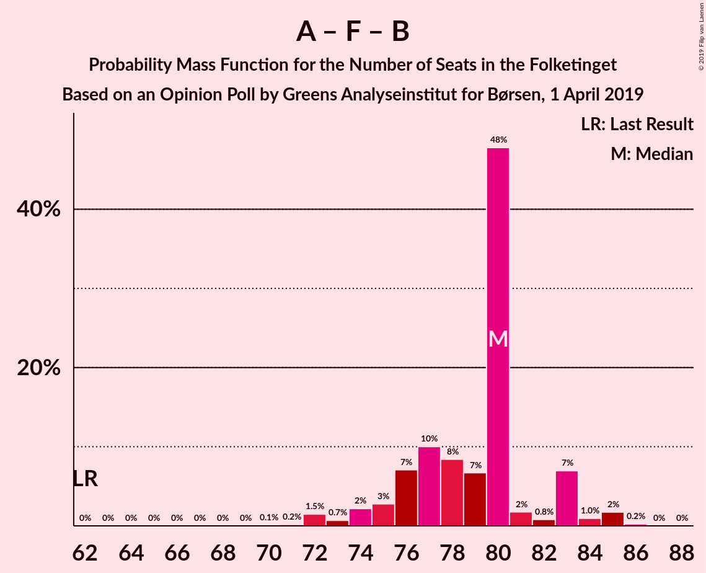

| Number of Seats | Probability | Accumulated | Special Marks |
|:---------------:|:-----------:|:-----------:|:-------------:|
| 62 | 0% | 100% | Last Result |
| 63 | 0% | 100% |  |
| 64 | 0% | 100% |  |
| 65 | 0% | 100% |  |
| 66 | 0% | 100% |  |
| 67 | 0% | 100% |  |
| 68 | 0% | 100% |  |
| 69 | 0% | 100% |  |
| 70 | 0.1% | 99.9% |  |
| 71 | 0.2% | 99.8% |  |
| 72 | 1.5% | 99.7% |  |
| 73 | 0.7% | 98% |  |
| 74 | 2% | 98% |  |
| 75 | 3% | 95% |  |
| 76 | 7% | 93% |  |
| 77 | 10% | 85% |  |
| 78 | 8% | 75% |  |
| 79 | 7% | 67% |  |
| 80 | 48% | 60% | Median |
| 81 | 2% | 13% |  |
| 82 | 0.8% | 11% |  |
| 83 | 7% | 10% |  |
| 84 | 1.0% | 3% |  |
| 85 | 2% | 2% |  |
| 86 | 0.2% | 0.3% |  |
| 87 | 0% | 0.1% |  |
| 88 | 0% | 0% |  |

### Venstre – Dansk Folkeparti – Det Konservative Folkeparti – Liberal Alliance – Nye Borgerlige – Kristendemokraterne – Klaus Riskær Pedersen

| Number of Seats | Probability | Accumulated | Special Marks |
|:---------------:|:-----------:|:-----------:|:-------------:|
| 67 | 0.1% | 100% |  |
| 68 | 0.3% | 99.8% |  |
| 69 | 3% | 99.6% |  |
| 70 | 0.8% | 97% |  |
| 71 | 3% | 96% |  |
| 72 | 4% | 93% |  |
| 73 | 6% | 89% |  |
| 74 | 2% | 83% |  |
| 75 | 43% | 81% | Median |
| 76 | 2% | 39% |  |
| 77 | 14% | 36% |  |
| 78 | 8% | 23% |  |
| 79 | 4% | 15% |  |
| 80 | 8% | 11% |  |
| 81 | 1.2% | 3% |  |
| 82 | 1.2% | 2% |  |
| 83 | 0.7% | 0.8% |  |
| 84 | 0.1% | 0.1% |  |
| 85 | 0% | 0.1% |  |
| 86 | 0% | 0% |  |
| 87 | 0% | 0% |  |
| 88 | 0% | 0% |  |
| 89 | 0% | 0% |  |
| 90 | 0% | 0% | Last Result, Majority |

### Venstre – Dansk Folkeparti – Det Konservative Folkeparti – Liberal Alliance – Nye Borgerlige – Kristendemokraterne

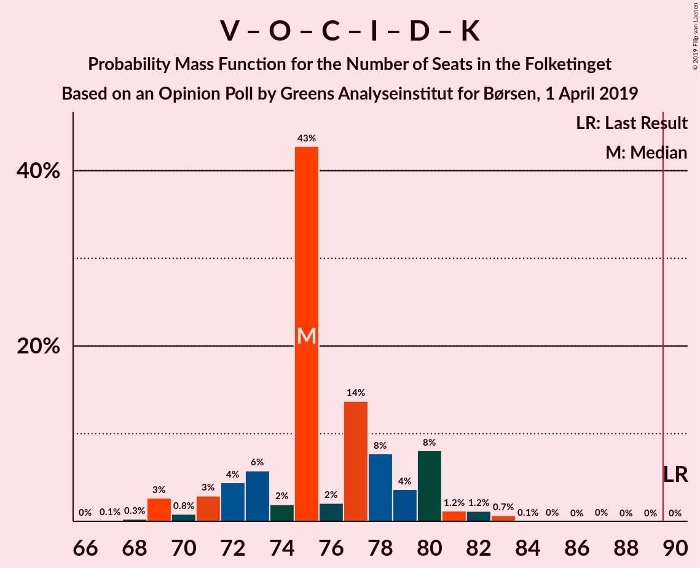

| Number of Seats | Probability | Accumulated | Special Marks |
|:---------------:|:-----------:|:-----------:|:-------------:|
| 67 | 0.1% | 100% |  |
| 68 | 0.3% | 99.8% |  |
| 69 | 3% | 99.6% |  |
| 70 | 0.8% | 97% |  |
| 71 | 3% | 96% |  |
| 72 | 4% | 93% |  |
| 73 | 6% | 89% |  |
| 74 | 2% | 83% |  |
| 75 | 43% | 81% | Median |
| 76 | 2% | 38% |  |
| 77 | 14% | 36% |  |
| 78 | 8% | 23% |  |
| 79 | 4% | 15% |  |
| 80 | 8% | 11% |  |
| 81 | 1.2% | 3% |  |
| 82 | 1.2% | 2% |  |
| 83 | 0.7% | 0.8% |  |
| 84 | 0.1% | 0.1% |  |
| 85 | 0% | 0.1% |  |
| 86 | 0% | 0% |  |
| 87 | 0% | 0% |  |
| 88 | 0% | 0% |  |
| 89 | 0% | 0% |  |
| 90 | 0% | 0% | Last Result, Majority |

### Venstre – Dansk Folkeparti – Det Konservative Folkeparti – Liberal Alliance – Nye Borgerlige – Klaus Riskær Pedersen

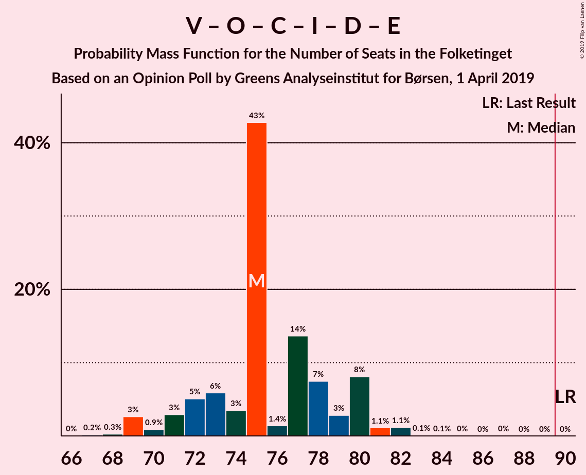

| Number of Seats | Probability | Accumulated | Special Marks |
|:---------------:|:-----------:|:-----------:|:-------------:|
| 67 | 0.2% | 100% |  |
| 68 | 0.3% | 99.8% |  |
| 69 | 3% | 99.6% |  |
| 70 | 0.9% | 97% |  |
| 71 | 3% | 96% |  |
| 72 | 5% | 93% |  |
| 73 | 6% | 88% |  |
| 74 | 3% | 82% |  |
| 75 | 43% | 79% | Median |
| 76 | 1.4% | 36% |  |
| 77 | 14% | 35% |  |
| 78 | 7% | 21% |  |
| 79 | 3% | 13% |  |
| 80 | 8% | 11% |  |
| 81 | 1.1% | 2% |  |
| 82 | 1.1% | 1.4% |  |
| 83 | 0.1% | 0.2% |  |
| 84 | 0.1% | 0.1% |  |
| 85 | 0% | 0.1% |  |
| 86 | 0% | 0% |  |
| 87 | 0% | 0% |  |
| 88 | 0% | 0% |  |
| 89 | 0% | 0% |  |
| 90 | 0% | 0% | Last Result, Majority |

### Venstre – Dansk Folkeparti – Det Konservative Folkeparti – Liberal Alliance – Nye Borgerlige

| Number of Seats | Probability | Accumulated | Special Marks |
|:---------------:|:-----------:|:-----------:|:-------------:|
| 67 | 0.2% | 100% |  |
| 68 | 0.3% | 99.8% |  |
| 69 | 3% | 99.6% |  |
| 70 | 0.9% | 97% |  |
| 71 | 3% | 96% |  |
| 72 | 5% | 93% |  |
| 73 | 6% | 88% |  |
| 74 | 3% | 82% |  |
| 75 | 43% | 79% | Median |
| 76 | 1.4% | 36% |  |
| 77 | 14% | 34% |  |
| 78 | 7% | 21% |  |
| 79 | 3% | 13% |  |
| 80 | 8% | 10% |  |
| 81 | 1.1% | 2% |  |
| 82 | 1.1% | 1.3% |  |
| 83 | 0.1% | 0.2% |  |
| 84 | 0.1% | 0.1% |  |
| 85 | 0% | 0% |  |
| 86 | 0% | 0% |  |
| 87 | 0% | 0% |  |
| 88 | 0% | 0% |  |
| 89 | 0% | 0% |  |
| 90 | 0% | 0% | Last Result, Majority |

### Venstre – Dansk Folkeparti – Det Konservative Folkeparti – Liberal Alliance – Kristendemokraterne

| Number of Seats | Probability | Accumulated | Special Marks |
|:---------------:|:-----------:|:-----------:|:-------------:|
| 62 | 0.1% | 100% |  |
| 63 | 2% | 99.8% |  |
| 64 | 2% | 97% |  |
| 65 | 1.0% | 96% |  |
| 66 | 6% | 95% |  |
| 67 | 1.3% | 89% |  |
| 68 | 44% | 87% | Median |
| 69 | 6% | 44% |  |
| 70 | 5% | 38% |  |
| 71 | 2% | 32% |  |
| 72 | 15% | 31% |  |
| 73 | 3% | 16% |  |
| 74 | 2% | 13% |  |
| 75 | 8% | 11% |  |
| 76 | 0.3% | 3% |  |
| 77 | 2% | 2% |  |
| 78 | 0.1% | 0.1% |  |
| 79 | 0% | 0.1% |  |
| 80 | 0% | 0% |  |
| 81 | 0% | 0% |  |
| 82 | 0% | 0% |  |
| 83 | 0% | 0% |  |
| 84 | 0% | 0% |  |
| 85 | 0% | 0% |  |
| 86 | 0% | 0% |  |
| 87 | 0% | 0% |  |
| 88 | 0% | 0% |  |
| 89 | 0% | 0% |  |
| 90 | 0% | 0% | Last Result, Majority |

### Venstre – Dansk Folkeparti – Det Konservative Folkeparti – Liberal Alliance

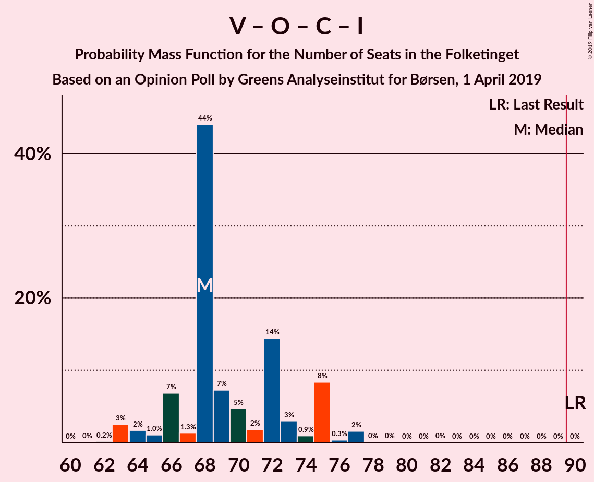

| Number of Seats | Probability | Accumulated | Special Marks |
|:---------------:|:-----------:|:-----------:|:-------------:|
| 62 | 0.2% | 100% |  |
| 63 | 3% | 99.8% |  |
| 64 | 2% | 97% |  |
| 65 | 1.0% | 96% |  |
| 66 | 7% | 95% |  |
| 67 | 1.3% | 88% |  |
| 68 | 44% | 86% | Median |
| 69 | 7% | 42% |  |
| 70 | 5% | 35% |  |
| 71 | 2% | 30% |  |
| 72 | 14% | 29% |  |
| 73 | 3% | 14% |  |
| 74 | 0.9% | 11% |  |
| 75 | 8% | 10% |  |
| 76 | 0.3% | 2% |  |
| 77 | 2% | 2% |  |
| 78 | 0% | 0.1% |  |
| 79 | 0% | 0.1% |  |
| 80 | 0% | 0% |  |
| 81 | 0% | 0% |  |
| 82 | 0% | 0% |  |
| 83 | 0% | 0% |  |
| 84 | 0% | 0% |  |
| 85 | 0% | 0% |  |
| 86 | 0% | 0% |  |
| 87 | 0% | 0% |  |
| 88 | 0% | 0% |  |
| 89 | 0% | 0% |  |
| 90 | 0% | 0% | Last Result, Majority |

### Socialdemokraterne – Radikale Venstre

| Number of Seats | Probability | Accumulated | Special Marks |
|:---------------:|:-----------:|:-----------:|:-------------:|
| 55 | 0% | 100% | Last Result |
| 56 | 0% | 100% |  |
| 57 | 0.1% | 100% |  |
| 58 | 0.1% | 99.9% |  |
| 59 | 0.6% | 99.8% |  |
| 60 | 0.3% | 99.2% |  |
| 61 | 2% | 98.8% |  |
| 62 | 2% | 97% |  |
| 63 | 7% | 95% |  |
| 64 | 8% | 87% |  |
| 65 | 4% | 79% |  |
| 66 | 52% | 75% | Median |
| 67 | 8% | 24% |  |
| 68 | 5% | 15% |  |
| 69 | 4% | 11% |  |
| 70 | 4% | 6% |  |
| 71 | 0.8% | 3% |  |
| 72 | 0.4% | 2% |  |
| 73 | 2% | 2% |  |
| 74 | 0% | 0% |  |

### Venstre – Det Konservative Folkeparti – Liberal Alliance

| Number of Seats | Probability | Accumulated | Special Marks |
|:---------------:|:-----------:|:-----------:|:-------------:|
| 38 | 3% | 100% |  |
| 39 | 3% | 97% |  |
| 40 | 2% | 94% |  |
| 41 | 42% | 93% | Median |
| 42 | 8% | 51% |  |
| 43 | 7% | 43% |  |
| 44 | 10% | 36% |  |
| 45 | 11% | 26% |  |
| 46 | 0.8% | 15% |  |
| 47 | 4% | 14% |  |
| 48 | 9% | 10% |  |
| 49 | 0.8% | 1.0% |  |
| 50 | 0.1% | 0.2% |  |
| 51 | 0.1% | 0.1% |  |
| 52 | 0% | 0% |  |
| 53 | 0% | 0% | Last Result |

### Venstre – Det Konservative Folkeparti

| Number of Seats | Probability | Accumulated | Special Marks |
|:---------------:|:-----------:|:-----------:|:-------------:|
| 30 | 0% | 100% |  |
| 31 | 0.4% | 99.9% |  |
| 32 | 3% | 99.6% |  |
| 33 | 45% | 96% | Median |
| 34 | 5% | 51% |  |
| 35 | 8% | 46% |  |
| 36 | 4% | 38% |  |
| 37 | 7% | 34% |  |
| 38 | 4% | 27% |  |
| 39 | 12% | 24% |  |
| 40 | 3% | 11% | Last Result |
| 41 | 0.6% | 9% |  |
| 42 | 8% | 8% |  |
| 43 | 0.1% | 0.2% |  |
| 44 | 0.1% | 0.1% |  |
| 45 | 0% | 0% |  |

### Venstre

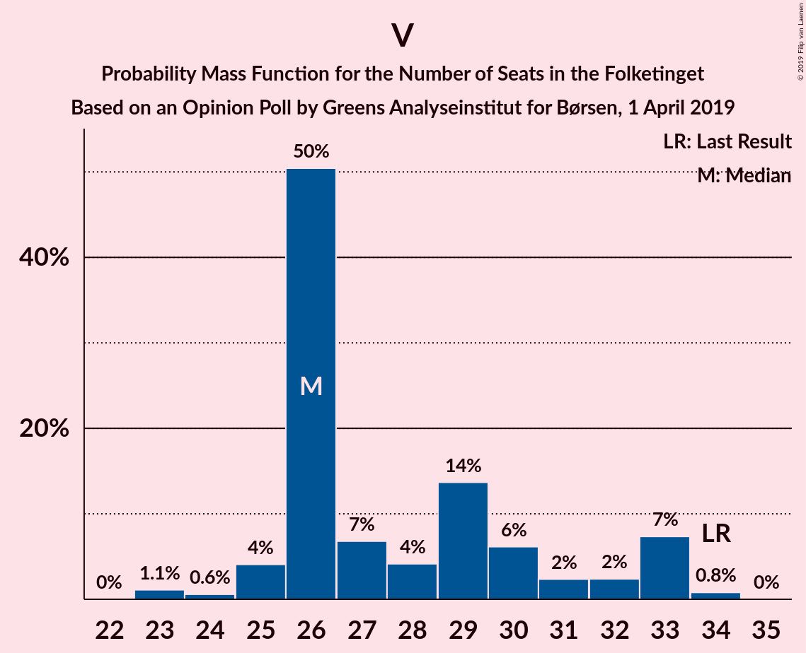

| Number of Seats | Probability | Accumulated | Special Marks |
|:---------------:|:-----------:|:-----------:|:-------------:|
| 22 | 0% | 100% |  |
| 23 | 1.1% | 99.9% |  |
| 24 | 0.6% | 98.8% |  |
| 25 | 4% | 98% |  |
| 26 | 50% | 94% | Median |
| 27 | 7% | 44% |  |
| 28 | 4% | 37% |  |
| 29 | 14% | 33% |  |
| 30 | 6% | 19% |  |
| 31 | 2% | 13% |  |
| 32 | 2% | 11% |  |
| 33 | 7% | 8% |  |
| 34 | 0.8% | 0.8% | Last Result |
| 35 | 0% | 0% |  |

## Technical Information

### Opinion Poll

+ **Polling firm:** Greens Analyseinstitut
+ **Commissioner(s):** Børsen
+ **Fieldwork period:** 1 April 2019

### Calculations

+ **Sample size:** 1078
+ **Simulations done:** 1,048,576
+ **Error estimate:** 3.23%

