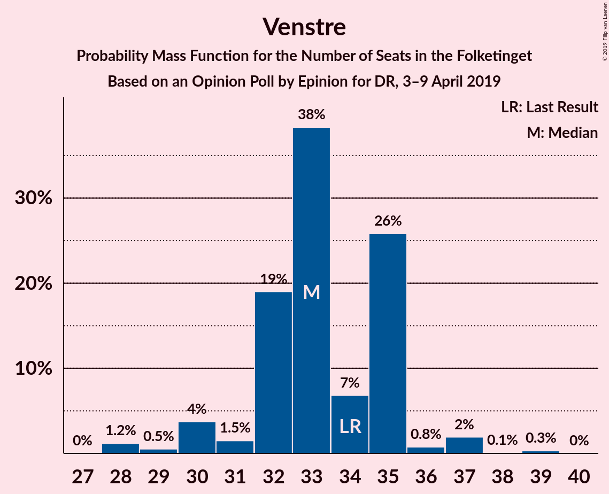
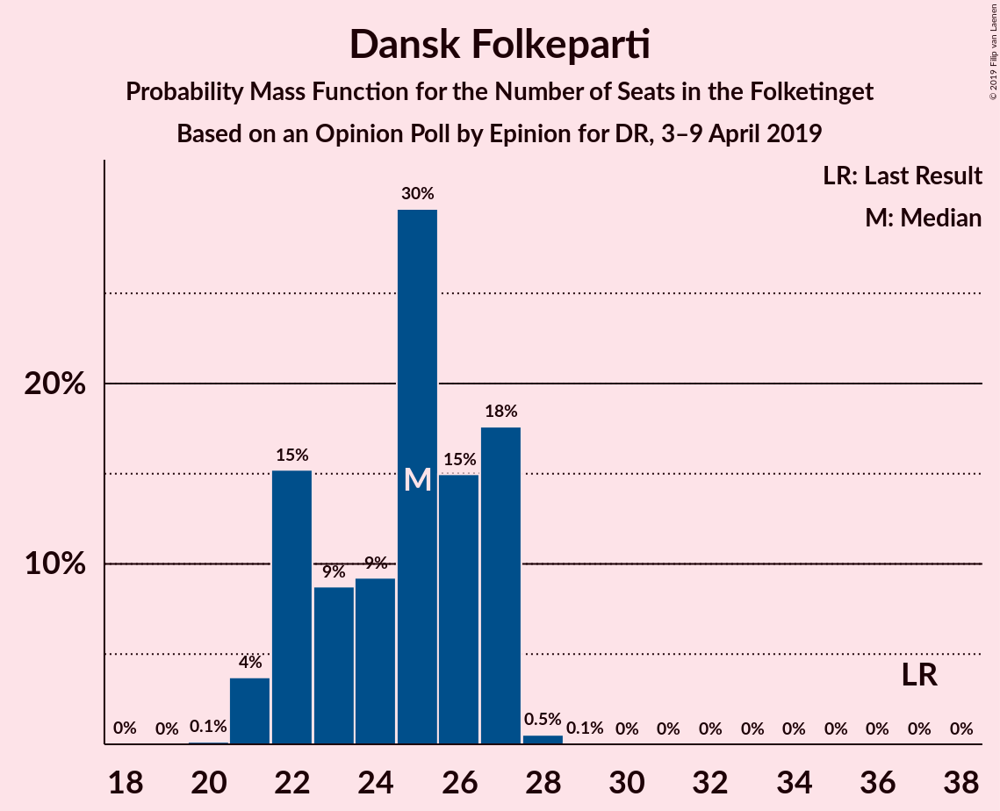
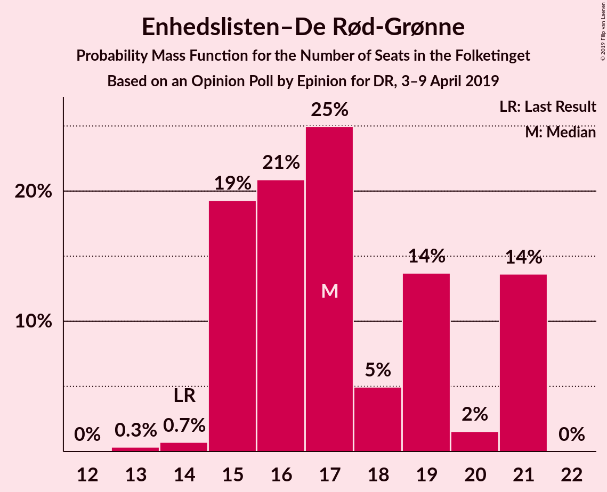
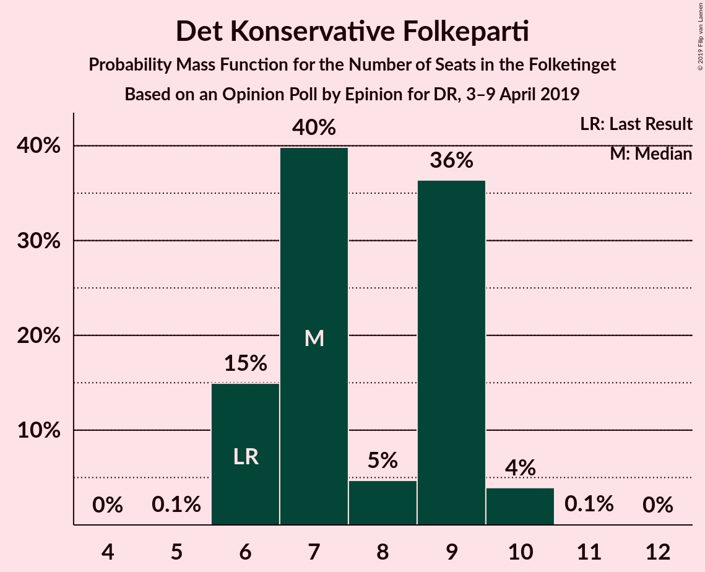
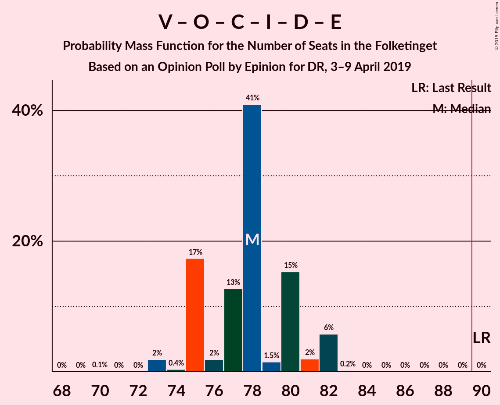

# Opinion Poll by Epinion for DR, 3–9 April 2019

<a href="#voting-intentions">Voting Intentions</a> | <a href="#seats">Seats</a> | <a href="#coalitions">Coalitions</a> | <a href="#technical-information">Technical Information</a>

## Voting Intentions

### Confidence Intervals

| Party | Last Result | Poll Result | 80% Confidence Interval | 90% Confidence Interval | 95% Confidence Interval | 99% Confidence Interval |
|:-----:|:-----------:|:-----------:|:-----------------------:|:-----------------------:|:-----------------------:|:-----------------------:|
| Socialdemokraterne | 26.3% | 29.0% | 27.6–30.5% |27.2–31.0% |26.8–31.4% |26.1–32.1% |
| Venstre | 19.5% | 18.5% | 17.3–19.8% |16.9–20.2% |16.6–20.5% |16.1–21.2% |
| Dansk Folkeparti | 21.1% | 13.4% | 12.4–14.6% |12.1–15.0% |11.8–15.2% |11.3–15.8% |
| Enhedslisten–De Rød-Grønne | 7.8% | 9.6% | 8.7–10.6% |8.4–10.9% |8.2–11.2% |7.8–11.7% |
| Socialistisk Folkeparti | 4.2% | 7.9% | 7.1–8.9% |6.9–9.1% |6.7–9.4% |6.3–9.9% |
| Radikale Venstre | 4.6% | 6.3% | 5.6–7.2% |5.4–7.4% |5.2–7.6% |4.9–8.1% |
| Det Konservative Folkeparti | 3.4% | 4.6% | 4.0–5.4% |3.8–5.6% |3.7–5.8% |3.4–6.2% |
| Liberal Alliance | 7.5% | 4.2% | 3.6–5.0% |3.5–5.2% |3.3–5.3% |3.1–5.7% |
| Nye Borgerlige | 0.0% | 2.7% | 2.3–3.3% |2.1–3.5% |2.0–3.7% |1.8–4.0% |
| Alternativet | 4.8% | 2.4% | 2.0–3.0% |1.8–3.2% |1.7–3.3% |1.6–3.6% |
| Klaus Riskær Pedersen | 0.0% | 0.9% | 0.7–1.3% |0.6–1.4% |0.5–1.5% |0.4–1.7% |
| Kristendemokraterne | 0.8% | 0.4% | 0.2–0.7% |0.2–0.8% |0.2–0.9% |0.1–1.0% |

*Note:* The poll result column reflects the actual value used in the calculations. Published results may vary slightly, and in addition be rounded to fewer digits.

## Seats

### Confidence Intervals

| Party | Last Result | Median | 80% Confidence Interval | 90% Confidence Interval | 95% Confidence Interval | 99% Confidence Interval |
|:-----:|:-----------:|:------:|:-----------------------:|:-----------------------:|:-----------------------:|:-----------------------:|
| <a href="#socialdemokraterne">Socialdemokraterne</a> | 47 | 50 | 47–53 |47–54 |47–54 |45–56 |
| <a href="#venstre">Venstre</a> | 34 | 33 | 32–35 |30–35 |30–36 |28–37 |
| <a href="#dansk-folkeparti">Dansk Folkeparti</a> | 37 | 25 | 22–27 |22–27 |21–27 |21–28 |
| <a href="#enhedslisten–de-rød-grønne">Enhedslisten–De Rød-Grønne</a> | 14 | 17 | 15–21 |15–21 |15–21 |14–21 |
| <a href="#socialistisk-folkeparti">Socialistisk Folkeparti</a> | 7 | 15 | 13–16 |11–16 |11–16 |11–18 |
| <a href="#radikale-venstre">Radikale Venstre</a> | 8 | 10 | 10–13 |10–13 |10–13 |9–14 |
| <a href="#det-konservative-folkeparti">Det Konservative Folkeparti</a> | 6 | 7 | 6–9 |6–9 |6–10 |6–10 |
| <a href="#liberal-alliance">Liberal Alliance</a> | 13 | 7 | 7–8 |6–9 |6–9 |6–9 |
| <a href="#nye-borgerlige">Nye Borgerlige</a> | 0 | 5 | 4–6 |4–6 |4–6 |0–7 |
| <a href="#alternativet">Alternativet</a> | 9 | 5 | 4–6 |4–6 |0–6 |0–6 |
| <a href="#klaus-riskær-pedersen">Klaus Riskær Pedersen</a> | 0 | 0 | 0 |0 |0 |0 |
| <a href="#kristendemokraterne">Kristendemokraterne</a> | 0 | 0 | 0 |0 |0 |0 |

### Socialdemokraterne

*For a full overview of the results for this party, see the [Socialdemokraterne](party-socialdemokraterne.html) page.*

| Number of Seats | Probability | Accumulated | Special Marks |
|:---------------:|:-----------:|:-----------:|:-------------:|
| 44 | 0.1% | 100% |  |
| 45 | 1.0% | 99.9% |  |
| 46 | 0.3% | 98.9% |  |
| 47 | 13% | 98.6% | Last Result |
| 48 | 7% | 85% |  |
| 49 | 26% | 78% |  |
| 50 | 13% | 52% | Median |
| 51 | 20% | 40% |  |
| 52 | 2% | 19% |  |
| 53 | 8% | 17% |  |
| 54 | 7% | 9% |  |
| 55 | 2% | 2% |  |
| 56 | 0.1% | 0.5% |  |
| 57 | 0.3% | 0.4% |  |
| 58 | 0.1% | 0.1% |  |
| 59 | 0% | 0% |  |

### Venstre

*For a full overview of the results for this party, see the [Venstre](party-venstre.html) page.*

| Number of Seats | Probability | Accumulated | Special Marks |
|:---------------:|:-----------:|:-----------:|:-------------:|
| 28 | 1.2% | 100% |  |
| 29 | 0.5% | 98.8% |  |
| 30 | 4% | 98% |  |
| 31 | 1.5% | 95% |  |
| 32 | 19% | 93% |  |
| 33 | 38% | 74% | Median |
| 34 | 7% | 36% | Last Result |
| 35 | 26% | 29% |  |
| 36 | 0.8% | 3% |  |
| 37 | 2% | 2% |  |
| 38 | 0.1% | 0.4% |  |
| 39 | 0.3% | 0.3% |  |
| 40 | 0% | 0% |  |

### Dansk Folkeparti

*For a full overview of the results for this party, see the [Dansk Folkeparti](party-danskfolkeparti.html) page.*

| Number of Seats | Probability | Accumulated | Special Marks |
|:---------------:|:-----------:|:-----------:|:-------------:|
| 19 | 0% | 100% |  |
| 20 | 0.1% | 99.9% |  |
| 21 | 4% | 99.8% |  |
| 22 | 15% | 96% |  |
| 23 | 9% | 81% |  |
| 24 | 9% | 72% |  |
| 25 | 30% | 63% | Median |
| 26 | 15% | 33% |  |
| 27 | 18% | 18% |  |
| 28 | 0.5% | 0.6% |  |
| 29 | 0.1% | 0.1% |  |
| 30 | 0% | 0% |  |
| 31 | 0% | 0% |  |
| 32 | 0% | 0% |  |
| 33 | 0% | 0% |  |
| 34 | 0% | 0% |  |
| 35 | 0% | 0% |  |
| 36 | 0% | 0% |  |
| 37 | 0% | 0% | Last Result |

### Enhedslisten–De Rød-Grønne

*For a full overview of the results for this party, see the [Enhedslisten–De Rød-Grønne](party-enhedslisten–derød-grønne.html) page.*

| Number of Seats | Probability | Accumulated | Special Marks |
|:---------------:|:-----------:|:-----------:|:-------------:|
| 13 | 0.3% | 100% |  |
| 14 | 0.7% | 99.7% | Last Result |
| 15 | 19% | 98.9% |  |
| 16 | 21% | 80% |  |
| 17 | 25% | 59% | Median |
| 18 | 5% | 34% |  |
| 19 | 14% | 29% |  |
| 20 | 2% | 15% |  |
| 21 | 14% | 14% |  |
| 22 | 0% | 0% |  |

### Socialistisk Folkeparti

*For a full overview of the results for this party, see the [Socialistisk Folkeparti](party-socialistiskfolkeparti.html) page.*

| Number of Seats | Probability | Accumulated | Special Marks |
|:---------------:|:-----------:|:-----------:|:-------------:|
| 7 | 0% | 100% | Last Result |
| 8 | 0% | 100% |  |
| 9 | 0% | 100% |  |
| 10 | 0.1% | 100% |  |
| 11 | 6% | 99.9% |  |
| 12 | 3% | 94% |  |
| 13 | 26% | 91% |  |
| 14 | 5% | 65% |  |
| 15 | 21% | 60% | Median |
| 16 | 37% | 38% |  |
| 17 | 0.5% | 1.3% |  |
| 18 | 0.8% | 0.8% |  |
| 19 | 0% | 0% |  |

### Radikale Venstre

*For a full overview of the results for this party, see the [Radikale Venstre](party-radikalevenstre.html) page.*

| Number of Seats | Probability | Accumulated | Special Marks |
|:---------------:|:-----------:|:-----------:|:-------------:|
| 8 | 0.4% | 100% | Last Result |
| 9 | 2% | 99.6% |  |
| 10 | 50% | 98% | Median |
| 11 | 34% | 48% |  |
| 12 | 2% | 13% |  |
| 13 | 10% | 11% |  |
| 14 | 1.3% | 1.4% |  |
| 15 | 0.1% | 0.1% |  |
| 16 | 0% | 0% |  |

### Det Konservative Folkeparti

*For a full overview of the results for this party, see the [Det Konservative Folkeparti](party-detkonservativefolkeparti.html) page.*

| Number of Seats | Probability | Accumulated | Special Marks |
|:---------------:|:-----------:|:-----------:|:-------------:|
| 5 | 0.1% | 100% |  |
| 6 | 15% | 99.9% | Last Result |
| 7 | 40% | 85% | Median |
| 8 | 5% | 45% |  |
| 9 | 36% | 40% |  |
| 10 | 4% | 4% |  |
| 11 | 0.1% | 0.1% |  |
| 12 | 0% | 0% |  |

### Liberal Alliance

*For a full overview of the results for this party, see the [Liberal Alliance](party-liberalalliance.html) page.*

| Number of Seats | Probability | Accumulated | Special Marks |
|:---------------:|:-----------:|:-----------:|:-------------:|
| 5 | 0.4% | 100% |  |
| 6 | 9% | 99.5% |  |
| 7 | 43% | 91% | Median |
| 8 | 42% | 48% |  |
| 9 | 5% | 6% |  |
| 10 | 0.4% | 0.4% |  |
| 11 | 0% | 0% |  |
| 12 | 0% | 0% |  |
| 13 | 0% | 0% | Last Result |

### Nye Borgerlige

*For a full overview of the results for this party, see the [Nye Borgerlige](party-nyeborgerlige.html) page.*

| Number of Seats | Probability | Accumulated | Special Marks |
|:---------------:|:-----------:|:-----------:|:-------------:|
| 0 | 1.3% | 100% | Last Result |
| 1 | 0% | 98.7% |  |
| 2 | 0% | 98.7% |  |
| 3 | 0% | 98.7% |  |
| 4 | 46% | 98.7% |  |
| 5 | 31% | 52% | Median |
| 6 | 21% | 22% |  |
| 7 | 0.9% | 1.0% |  |
| 8 | 0.1% | 0.1% |  |
| 9 | 0% | 0% |  |

### Alternativet

*For a full overview of the results for this party, see the [Alternativet](party-alternativet.html) page.*

| Number of Seats | Probability | Accumulated | Special Marks |
|:---------------:|:-----------:|:-----------:|:-------------:|
| 0 | 3% | 100% |  |
| 1 | 0% | 97% |  |
| 2 | 0% | 97% |  |
| 3 | 0% | 97% |  |
| 4 | 34% | 97% |  |
| 5 | 49% | 63% | Median |
| 6 | 14% | 14% |  |
| 7 | 0.2% | 0.2% |  |
| 8 | 0% | 0% |  |
| 9 | 0% | 0% | Last Result |

### Klaus Riskær Pedersen

*For a full overview of the results for this party, see the [Klaus Riskær Pedersen](party-klausriskærpedersen.html) page.*

| Number of Seats | Probability | Accumulated | Special Marks |
|:---------------:|:-----------:|:-----------:|:-------------:|
| 0 | 100% | 100% | Last Result, Median |

### Kristendemokraterne

*For a full overview of the results for this party, see the [Kristendemokraterne](party-kristendemokraterne.html) page.*

| Number of Seats | Probability | Accumulated | Special Marks |
|:---------------:|:-----------:|:-----------:|:-------------:|
| 0 | 100% | 100% | Last Result, Median |

## Coalitions

### Confidence Intervals

| Coalition | Last Result | Median | Majority? | 80% Confidence Interval | 90% Confidence Interval | 95% Confidence Interval | 99% Confidence Interval |
|:---------:|:-----------:|:------:|:---------:|:-----------------------:|:-----------------------:|:-----------------------:|:-----------------------:|
| Socialdemokraterne – Enhedslisten–De Rød-Grønne – Socialistisk Folkeparti – Radikale Venstre – Alternativet | 85 | 97 | 100% | 95–100 | 93–100 | 93–100 | 93–102 |
| Socialdemokraterne – Enhedslisten–De Rød-Grønne – Socialistisk Folkeparti – Radikale Venstre | 76 | 92 | 81% | 89–96 | 88–96 | 88–97 | 88–100 |
| Socialdemokraterne – Enhedslisten–De Rød-Grønne – Socialistisk Folkeparti – Alternativet | 77 | 86 | 17% | 84–90 | 80–90 | 80–90 | 80–92 |
| Socialdemokraterne – Enhedslisten–De Rød-Grønne – Socialistisk Folkeparti | 68 | 82 | 0.2% | 79–86 | 75–86 | 75–86 | 75–88 |
| Venstre – Dansk Folkeparti – Det Konservative Folkeparti – Liberal Alliance – Nye Borgerlige – Klaus Riskær Pedersen – Kristendemokraterne | 90 | 78 | 0% | 75–80 | 75–82 | 75–82 | 73–82 |
| Venstre – Dansk Folkeparti – Det Konservative Folkeparti – Liberal Alliance – Nye Borgerlige – Klaus Riskær Pedersen | 90 | 78 | 0% | 75–80 | 75–82 | 75–82 | 73–82 |
| Venstre – Dansk Folkeparti – Det Konservative Folkeparti – Liberal Alliance – Nye Borgerlige – Kristendemokraterne | 90 | 78 | 0% | 75–80 | 75–82 | 75–82 | 73–82 |
| Venstre – Dansk Folkeparti – Det Konservative Folkeparti – Liberal Alliance – Nye Borgerlige | 90 | 78 | 0% | 75–80 | 75–82 | 75–82 | 73–82 |
| Socialdemokraterne – Socialistisk Folkeparti – Radikale Venstre | 62 | 75 | 0% | 70–78 | 70–78 | 70–80 | 70–82 |
| Venstre – Dansk Folkeparti – Det Konservative Folkeparti – Liberal Alliance – Kristendemokraterne | 90 | 73 | 0% | 71–76 | 70–77 | 69–77 | 69–77 |
| Venstre – Dansk Folkeparti – Det Konservative Folkeparti – Liberal Alliance | 90 | 73 | 0% | 71–76 | 70–77 | 69–77 | 69–77 |
| Socialdemokraterne – Radikale Venstre | 55 | 61 | 0% | 57–64 | 57–65 | 57–65 | 57–68 |
| Venstre – Det Konservative Folkeparti – Liberal Alliance | 53 | 48 | 0% | 47–51 | 47–52 | 47–52 | 44–54 |
| Venstre – Det Konservative Folkeparti | 40 | 40 | 0% | 39–44 | 39–44 | 39–44 | 36–45 |
| Venstre | 34 | 33 | 0% | 32–35 | 30–35 | 30–36 | 28–37 |

### Socialdemokraterne – Enhedslisten–De Rød-Grønne – Socialistisk Folkeparti – Radikale Venstre – Alternativet

| Number of Seats | Probability | Accumulated | Special Marks |
|:---------------:|:-----------:|:-----------:|:-------------:|
| 85 | 0% | 100% | Last Result |
| 86 | 0% | 100% |  |
| 87 | 0% | 100% |  |
| 88 | 0% | 100% |  |
| 89 | 0% | 100% |  |
| 90 | 0% | 100% | Majority |
| 91 | 0% | 100% |  |
| 92 | 0.2% | 99.9% |  |
| 93 | 6% | 99.7% |  |
| 94 | 2% | 94% |  |
| 95 | 15% | 92% |  |
| 96 | 1.5% | 77% |  |
| 97 | 41% | 75% | Median |
| 98 | 13% | 34% |  |
| 99 | 2% | 22% |  |
| 100 | 17% | 20% |  |
| 101 | 0.4% | 2% |  |
| 102 | 2% | 2% |  |
| 103 | 0% | 0.1% |  |
| 104 | 0% | 0.1% |  |
| 105 | 0.1% | 0.1% |  |
| 106 | 0% | 0% |  |

### Socialdemokraterne – Enhedslisten–De Rød-Grønne – Socialistisk Folkeparti – Radikale Venstre

| Number of Seats | Probability | Accumulated | Special Marks |
|:---------------:|:-----------:|:-----------:|:-------------:|
| 76 | 0% | 100% | Last Result |
| 77 | 0% | 100% |  |
| 78 | 0% | 100% |  |
| 79 | 0% | 100% |  |
| 80 | 0% | 100% |  |
| 81 | 0% | 100% |  |
| 82 | 0% | 100% |  |
| 83 | 0% | 100% |  |
| 84 | 0% | 100% |  |
| 85 | 0% | 100% |  |
| 86 | 0% | 100% |  |
| 87 | 0% | 100% |  |
| 88 | 6% | 100% |  |
| 89 | 13% | 94% |  |
| 90 | 3% | 81% | Majority |
| 91 | 1.2% | 78% |  |
| 92 | 31% | 77% | Median |
| 93 | 17% | 46% |  |
| 94 | 6% | 29% |  |
| 95 | 5% | 23% |  |
| 96 | 14% | 18% |  |
| 97 | 2% | 4% |  |
| 98 | 1.1% | 2% |  |
| 99 | 0% | 1.0% |  |
| 100 | 0.7% | 1.0% |  |
| 101 | 0.1% | 0.3% |  |
| 102 | 0.1% | 0.1% |  |
| 103 | 0% | 0% |  |

### Socialdemokraterne – Enhedslisten–De Rød-Grønne – Socialistisk Folkeparti – Alternativet

| Number of Seats | Probability | Accumulated | Special Marks |
|:---------------:|:-----------:|:-----------:|:-------------:|
| 77 | 0% | 100% | Last Result |
| 78 | 0% | 100% |  |
| 79 | 0% | 100% |  |
| 80 | 5% | 99.9% |  |
| 81 | 1.4% | 95% |  |
| 82 | 0.5% | 93% |  |
| 83 | 1.1% | 93% |  |
| 84 | 2% | 92% |  |
| 85 | 16% | 89% |  |
| 86 | 28% | 74% |  |
| 87 | 18% | 45% | Median |
| 88 | 9% | 27% |  |
| 89 | 1.5% | 19% |  |
| 90 | 16% | 17% | Majority |
| 91 | 0.2% | 1.4% |  |
| 92 | 1.0% | 1.1% |  |
| 93 | 0.1% | 0.1% |  |
| 94 | 0% | 0% |  |

### Socialdemokraterne – Enhedslisten–De Rød-Grønne – Socialistisk Folkeparti

| Number of Seats | Probability | Accumulated | Special Marks |
|:---------------:|:-----------:|:-----------:|:-------------:|
| 68 | 0% | 100% | Last Result |
| 69 | 0% | 100% |  |
| 70 | 0% | 100% |  |
| 71 | 0% | 100% |  |
| 72 | 0% | 100% |  |
| 73 | 0% | 100% |  |
| 74 | 0% | 100% |  |
| 75 | 5% | 100% |  |
| 76 | 0% | 95% |  |
| 77 | 1.4% | 95% |  |
| 78 | 0.5% | 93% |  |
| 79 | 15% | 93% |  |
| 80 | 1.4% | 78% |  |
| 81 | 19% | 76% |  |
| 82 | 22% | 57% | Median |
| 83 | 14% | 35% |  |
| 84 | 2% | 21% |  |
| 85 | 3% | 20% |  |
| 86 | 14% | 16% |  |
| 87 | 1.1% | 2% |  |
| 88 | 0.6% | 0.9% |  |
| 89 | 0.1% | 0.3% |  |
| 90 | 0.1% | 0.2% | Majority |
| 91 | 0% | 0% |  |

### Venstre – Dansk Folkeparti – Det Konservative Folkeparti – Liberal Alliance – Nye Borgerlige – Klaus Riskær Pedersen – Kristendemokraterne

| Number of Seats | Probability | Accumulated | Special Marks |
|:---------------:|:-----------:|:-----------:|:-------------:|
| 70 | 0.1% | 100% |  |
| 71 | 0% | 99.9% |  |
| 72 | 0% | 99.9% |  |
| 73 | 2% | 99.9% |  |
| 74 | 0.4% | 98% |  |
| 75 | 17% | 98% |  |
| 76 | 2% | 80% |  |
| 77 | 13% | 78% | Median |
| 78 | 41% | 66% |  |
| 79 | 1.5% | 25% |  |
| 80 | 15% | 23% |  |
| 81 | 2% | 8% |  |
| 82 | 6% | 6% |  |
| 83 | 0.2% | 0.3% |  |
| 84 | 0% | 0.1% |  |
| 85 | 0% | 0% |  |
| 86 | 0% | 0% |  |
| 87 | 0% | 0% |  |
| 88 | 0% | 0% |  |
| 89 | 0% | 0% |  |
| 90 | 0% | 0% | Last Result, Majority |

### Venstre – Dansk Folkeparti – Det Konservative Folkeparti – Liberal Alliance – Nye Borgerlige – Klaus Riskær Pedersen

| Number of Seats | Probability | Accumulated | Special Marks |
|:---------------:|:-----------:|:-----------:|:-------------:|
| 70 | 0.1% | 100% |  |
| 71 | 0% | 99.9% |  |
| 72 | 0% | 99.9% |  |
| 73 | 2% | 99.9% |  |
| 74 | 0.4% | 98% |  |
| 75 | 17% | 98% |  |
| 76 | 2% | 80% |  |
| 77 | 13% | 78% | Median |
| 78 | 41% | 66% |  |
| 79 | 1.5% | 25% |  |
| 80 | 15% | 23% |  |
| 81 | 2% | 8% |  |
| 82 | 6% | 6% |  |
| 83 | 0.2% | 0.3% |  |
| 84 | 0% | 0.1% |  |
| 85 | 0% | 0% |  |
| 86 | 0% | 0% |  |
| 87 | 0% | 0% |  |
| 88 | 0% | 0% |  |
| 89 | 0% | 0% |  |
| 90 | 0% | 0% | Last Result, Majority |

### Venstre – Dansk Folkeparti – Det Konservative Folkeparti – Liberal Alliance – Nye Borgerlige – Kristendemokraterne

| Number of Seats | Probability | Accumulated | Special Marks |
|:---------------:|:-----------:|:-----------:|:-------------:|
| 70 | 0.1% | 100% |  |
| 71 | 0% | 99.9% |  |
| 72 | 0% | 99.9% |  |
| 73 | 2% | 99.9% |  |
| 74 | 0.4% | 98% |  |
| 75 | 17% | 98% |  |
| 76 | 2% | 80% |  |
| 77 | 13% | 78% | Median |
| 78 | 41% | 66% |  |
| 79 | 2% | 25% |  |
| 80 | 15% | 23% |  |
| 81 | 2% | 8% |  |
| 82 | 6% | 6% |  |
| 83 | 0.2% | 0.3% |  |
| 84 | 0% | 0.1% |  |
| 85 | 0% | 0% |  |
| 86 | 0% | 0% |  |
| 87 | 0% | 0% |  |
| 88 | 0% | 0% |  |
| 89 | 0% | 0% |  |
| 90 | 0% | 0% | Last Result, Majority |

### Venstre – Dansk Folkeparti – Det Konservative Folkeparti – Liberal Alliance – Nye Borgerlige

| Number of Seats | Probability | Accumulated | Special Marks |
|:---------------:|:-----------:|:-----------:|:-------------:|
| 70 | 0.1% | 100% |  |
| 71 | 0% | 99.9% |  |
| 72 | 0% | 99.9% |  |
| 73 | 2% | 99.9% |  |
| 74 | 0.4% | 98% |  |
| 75 | 17% | 98% |  |
| 76 | 2% | 80% |  |
| 77 | 13% | 78% | Median |
| 78 | 41% | 66% |  |
| 79 | 2% | 25% |  |
| 80 | 15% | 23% |  |
| 81 | 2% | 8% |  |
| 82 | 6% | 6% |  |
| 83 | 0.2% | 0.3% |  |
| 84 | 0% | 0.1% |  |
| 85 | 0% | 0% |  |
| 86 | 0% | 0% |  |
| 87 | 0% | 0% |  |
| 88 | 0% | 0% |  |
| 89 | 0% | 0% |  |
| 90 | 0% | 0% | Last Result, Majority |

### Socialdemokraterne – Socialistisk Folkeparti – Radikale Venstre

| Number of Seats | Probability | Accumulated | Special Marks |
|:---------------:|:-----------:|:-----------:|:-------------:|
| 62 | 0% | 100% | Last Result |
| 63 | 0% | 100% |  |
| 64 | 0% | 100% |  |
| 65 | 0% | 100% |  |
| 66 | 0% | 100% |  |
| 67 | 0% | 100% |  |
| 68 | 0% | 100% |  |
| 69 | 0.1% | 100% |  |
| 70 | 13% | 99.9% |  |
| 71 | 0.2% | 87% |  |
| 72 | 6% | 86% |  |
| 73 | 2% | 80% |  |
| 74 | 0.8% | 78% |  |
| 75 | 27% | 77% | Median |
| 76 | 8% | 50% |  |
| 77 | 30% | 42% |  |
| 78 | 7% | 12% |  |
| 79 | 1.0% | 5% |  |
| 80 | 2% | 4% |  |
| 81 | 0.8% | 2% |  |
| 82 | 0.9% | 1.2% |  |
| 83 | 0.1% | 0.3% |  |
| 84 | 0.2% | 0.2% |  |
| 85 | 0% | 0% |  |

### Venstre – Dansk Folkeparti – Det Konservative Folkeparti – Liberal Alliance – Kristendemokraterne

| Number of Seats | Probability | Accumulated | Special Marks |
|:---------------:|:-----------:|:-----------:|:-------------:|
| 67 | 0.1% | 100% |  |
| 68 | 0.1% | 99.9% |  |
| 69 | 4% | 99.8% |  |
| 70 | 2% | 96% |  |
| 71 | 20% | 94% |  |
| 72 | 18% | 74% | Median |
| 73 | 16% | 57% |  |
| 74 | 19% | 41% |  |
| 75 | 2% | 23% |  |
| 76 | 15% | 21% |  |
| 77 | 6% | 6% |  |
| 78 | 0.1% | 0.3% |  |
| 79 | 0.1% | 0.2% |  |
| 80 | 0% | 0% |  |
| 81 | 0% | 0% |  |
| 82 | 0% | 0% |  |
| 83 | 0% | 0% |  |
| 84 | 0% | 0% |  |
| 85 | 0% | 0% |  |
| 86 | 0% | 0% |  |
| 87 | 0% | 0% |  |
| 88 | 0% | 0% |  |
| 89 | 0% | 0% |  |
| 90 | 0% | 0% | Last Result, Majority |

### Venstre – Dansk Folkeparti – Det Konservative Folkeparti – Liberal Alliance

| Number of Seats | Probability | Accumulated | Special Marks |
|:---------------:|:-----------:|:-----------:|:-------------:|
| 67 | 0.1% | 100% |  |
| 68 | 0.1% | 99.9% |  |
| 69 | 4% | 99.8% |  |
| 70 | 2% | 96% |  |
| 71 | 20% | 94% |  |
| 72 | 18% | 74% | Median |
| 73 | 16% | 57% |  |
| 74 | 19% | 41% |  |
| 75 | 2% | 23% |  |
| 76 | 15% | 21% |  |
| 77 | 6% | 6% |  |
| 78 | 0.1% | 0.3% |  |
| 79 | 0.1% | 0.2% |  |
| 80 | 0% | 0% |  |
| 81 | 0% | 0% |  |
| 82 | 0% | 0% |  |
| 83 | 0% | 0% |  |
| 84 | 0% | 0% |  |
| 85 | 0% | 0% |  |
| 86 | 0% | 0% |  |
| 87 | 0% | 0% |  |
| 88 | 0% | 0% |  |
| 89 | 0% | 0% |  |
| 90 | 0% | 0% | Last Result, Majority |

### Socialdemokraterne – Radikale Venstre

| Number of Seats | Probability | Accumulated | Special Marks |
|:---------------:|:-----------:|:-----------:|:-------------:|
| 54 | 0.1% | 100% |  |
| 55 | 0% | 99.9% | Last Result |
| 56 | 0.3% | 99.9% |  |
| 57 | 13% | 99.6% |  |
| 58 | 1.0% | 86% |  |
| 59 | 26% | 85% |  |
| 60 | 1.3% | 59% | Median |
| 61 | 18% | 58% |  |
| 62 | 19% | 40% |  |
| 63 | 10% | 21% |  |
| 64 | 3% | 12% |  |
| 65 | 7% | 9% |  |
| 66 | 0.4% | 2% |  |
| 67 | 0.8% | 1.3% |  |
| 68 | 0.4% | 0.6% |  |
| 69 | 0.1% | 0.2% |  |
| 70 | 0.1% | 0.1% |  |
| 71 | 0% | 0% |  |

### Venstre – Det Konservative Folkeparti – Liberal Alliance

| Number of Seats | Probability | Accumulated | Special Marks |
|:---------------:|:-----------:|:-----------:|:-------------:|
| 43 | 0.2% | 100% |  |
| 44 | 1.3% | 99.8% |  |
| 45 | 0.2% | 98.5% |  |
| 46 | 0.7% | 98% |  |
| 47 | 42% | 98% | Median |
| 48 | 16% | 56% |  |
| 49 | 15% | 40% |  |
| 50 | 2% | 25% |  |
| 51 | 15% | 23% |  |
| 52 | 6% | 8% |  |
| 53 | 1.5% | 2% | Last Result |
| 54 | 0.5% | 0.6% |  |
| 55 | 0% | 0% |  |

### Venstre – Det Konservative Folkeparti

| Number of Seats | Probability | Accumulated | Special Marks |
|:---------------:|:-----------:|:-----------:|:-------------:|
| 35 | 0.2% | 100% |  |
| 36 | 1.0% | 99.8% |  |
| 37 | 0.3% | 98.8% |  |
| 38 | 0.8% | 98.6% |  |
| 39 | 28% | 98% |  |
| 40 | 21% | 69% | Last Result, Median |
| 41 | 3% | 48% |  |
| 42 | 21% | 45% |  |
| 43 | 3% | 24% |  |
| 44 | 20% | 21% |  |
| 45 | 0.5% | 1.0% |  |
| 46 | 0.1% | 0.5% |  |
| 47 | 0.3% | 0.4% |  |
| 48 | 0% | 0% |  |

### Venstre

| Number of Seats | Probability | Accumulated | Special Marks |
|:---------------:|:-----------:|:-----------:|:-------------:|
| 28 | 1.2% | 100% |  |
| 29 | 0.5% | 98.8% |  |
| 30 | 4% | 98% |  |
| 31 | 1.5% | 95% |  |
| 32 | 19% | 93% |  |
| 33 | 38% | 74% | Median |
| 34 | 7% | 36% | Last Result |
| 35 | 26% | 29% |  |
| 36 | 0.8% | 3% |  |
| 37 | 2% | 2% |  |
| 38 | 0.1% | 0.4% |  |
| 39 | 0.3% | 0.3% |  |
| 40 | 0% | 0% |  |

## Technical Information

### Opinion Poll

+ **Polling firm:** Epinion
+ **Commissioner(s):** DR
+ **Fieldwork period:** 3–9 April 2019

### Calculations

+ **Sample size:** 1540
+ **Simulations done:** 1,048,576
+ **Error estimate:** 3.05%

