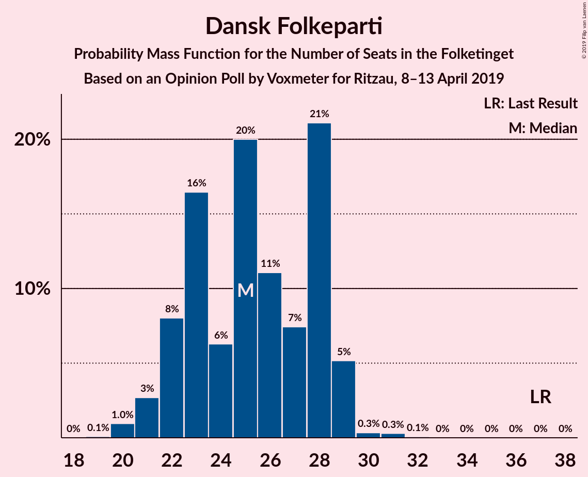
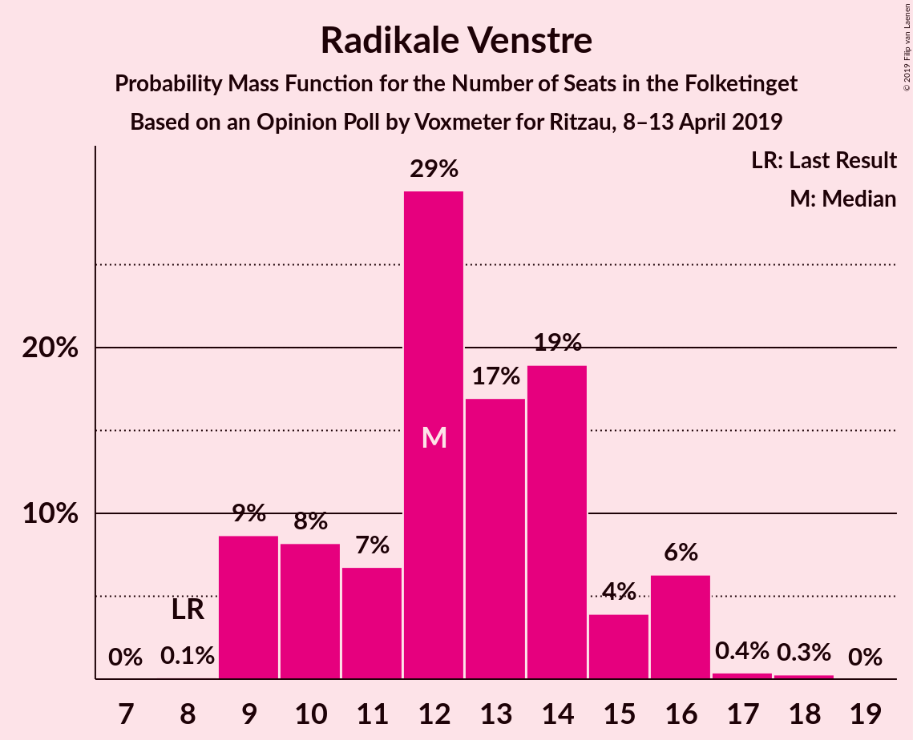
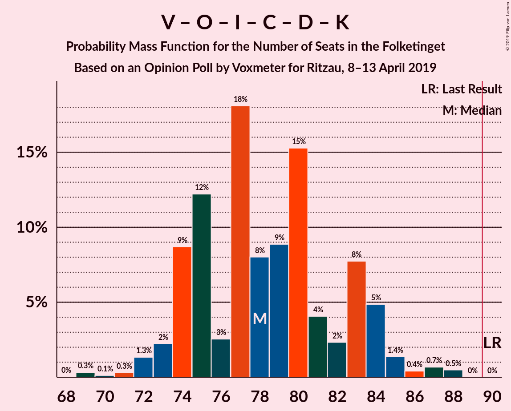
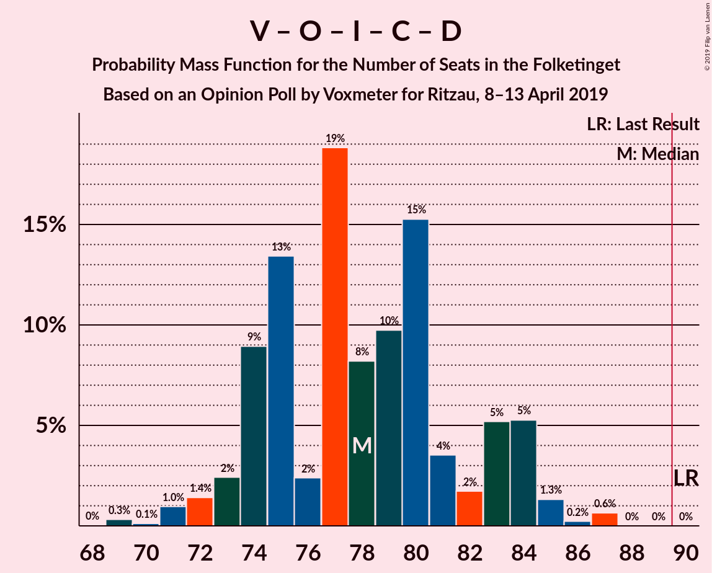
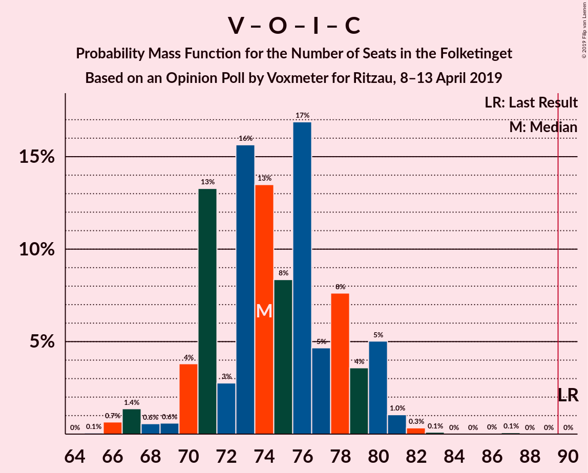
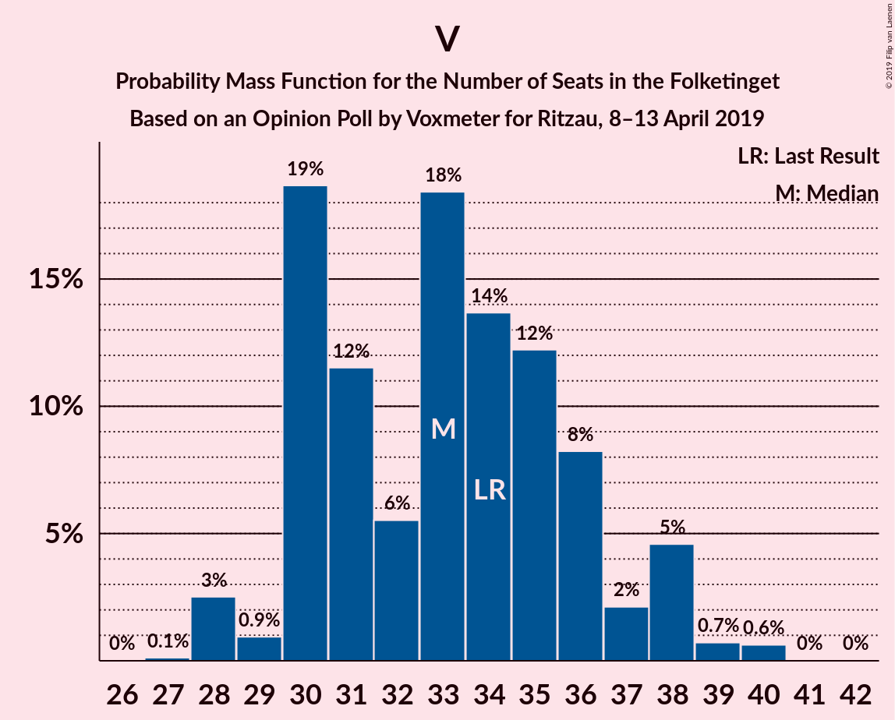

# Opinion Poll by Voxmeter for Ritzau, 8–13 April 2019

<a href="#voting-intentions">Voting Intentions</a> | <a href="#seats">Seats</a> | <a href="#coalitions">Coalitions</a> | <a href="#technical-information">Technical Information</a>

## Voting Intentions

### Confidence Intervals

| Party | Last Result | Poll Result | 80% Confidence Interval | 90% Confidence Interval | 95% Confidence Interval | 99% Confidence Interval |
|:-----:|:-----------:|:-----------:|:-----------------------:|:-----------------------:|:-----------------------:|:-----------------------:|
| Socialdemokraterne | 26.3% | 28.5% | 26.8–30.4% |26.3–30.9% |25.8–31.4% |25.0–32.3% |
| Venstre | 19.5% | 18.8% | 17.3–20.4% |16.8–20.9% |16.5–21.3% |15.8–22.1% |
| Dansk Folkeparti | 21.1% | 14.0% | 12.7–15.5% |12.3–15.9% |12.0–16.2% |11.4–17.0% |
| Enhedslisten–De Rød-Grønne | 7.8% | 9.8% | 8.7–11.1% |8.4–11.4% |8.1–11.8% |7.6–12.4% |
| Radikale Venstre | 4.6% | 6.9% | 6.0–8.1% |5.8–8.4% |5.5–8.7% |5.1–9.2% |
| Socialistisk Folkeparti | 4.2% | 6.2% | 5.3–7.2% |5.0–7.5% |4.8–7.8% |4.5–8.4% |
| Liberal Alliance | 7.5% | 4.8% | 4.0–5.8% |3.8–6.0% |3.6–6.3% |3.3–6.8% |
| Det Konservative Folkeparti | 3.4% | 4.1% | 3.4–5.0% |3.2–5.3% |3.0–5.5% |2.7–6.0% |
| Alternativet | 4.8% | 2.9% | 2.3–3.7% |2.2–4.0% |2.1–4.2% |1.8–4.6% |
| Nye Borgerlige | 0.0% | 2.2% | 1.8–3.0% |1.6–3.2% |1.5–3.4% |1.3–3.7% |
| Kristendemokraterne | 0.8% | 1.3% | 0.9–1.9% |0.8–2.0% |0.7–2.2% |0.6–2.5% |
| Klaus Riskær Pedersen | 0.0% | 0.2% | 0.1–0.5% |0.1–0.6% |0.0–0.7% |0.0–0.9% |

*Note:* The poll result column reflects the actual value used in the calculations. Published results may vary slightly, and in addition be rounded to fewer digits.

## Seats

### Confidence Intervals

| Party | Last Result | Median | 80% Confidence Interval | 90% Confidence Interval | 95% Confidence Interval | 99% Confidence Interval |
|:-----:|:-----------:|:------:|:-----------------------:|:-----------------------:|:-----------------------:|:-----------------------:|
| <a href="#socialdemokraterne">Socialdemokraterne</a> | 47 | 52 | 48–54 |46–54 |45–55 |45–56 |
| <a href="#venstre">Venstre</a> | 34 | 33 | 30–36 |30–38 |28–38 |28–40 |
| <a href="#dansk-folkeparti">Dansk Folkeparti</a> | 37 | 25 | 22–28 |22–29 |21–29 |20–30 |
| <a href="#enhedslisten–de-rød-grønne">Enhedslisten–De Rød-Grønne</a> | 14 | 17 | 16–18 |15–20 |14–21 |14–22 |
| <a href="#radikale-venstre">Radikale Venstre</a> | 8 | 12 | 10–15 |9–16 |9–16 |9–17 |
| <a href="#socialistisk-folkeparti">Socialistisk Folkeparti</a> | 7 | 10 | 9–12 |9–13 |9–14 |8–15 |
| <a href="#liberal-alliance">Liberal Alliance</a> | 13 | 9 | 7–10 |7–11 |7–11 |6–13 |
| <a href="#det-konservative-folkeparti">Det Konservative Folkeparti</a> | 6 | 7 | 6–9 |6–10 |5–10 |5–11 |
| <a href="#alternativet">Alternativet</a> | 9 | 6 | 4–7 |4–7 |0–7 |0–8 |
| <a href="#nye-borgerlige">Nye Borgerlige</a> | 0 | 4 | 0–5 |0–6 |0–7 |0–7 |
| <a href="#kristendemokraterne">Kristendemokraterne</a> | 0 | 0 | 0 |0–4 |0–4 |0–5 |
| <a href="#klaus-riskær-pedersen">Klaus Riskær Pedersen</a> | 0 | 0 | 0 |0 |0 |0 |

### Socialdemokraterne

*For a full overview of the results for this party, see the [Socialdemokraterne](party-socialdemokraterne.html) page.*

| Number of Seats | Probability | Accumulated | Special Marks |
|:---------------:|:-----------:|:-----------:|:-------------:|
| 42 | 0.1% | 100% |  |
| 43 | 0.1% | 99.9% |  |
| 44 | 0.2% | 99.8% |  |
| 45 | 2% | 99.6% |  |
| 46 | 3% | 97% |  |
| 47 | 3% | 94% | Last Result |
| 48 | 10% | 92% |  |
| 49 | 11% | 81% |  |
| 50 | 16% | 71% |  |
| 51 | 3% | 54% |  |
| 52 | 7% | 52% | Median |
| 53 | 1.4% | 44% |  |
| 54 | 40% | 43% |  |
| 55 | 1.2% | 3% |  |
| 56 | 0.9% | 1.3% |  |
| 57 | 0.2% | 0.4% |  |
| 58 | 0.1% | 0.2% |  |
| 59 | 0.1% | 0.1% |  |
| 60 | 0% | 0% |  |

### Venstre

*For a full overview of the results for this party, see the [Venstre](party-venstre.html) page.*

| Number of Seats | Probability | Accumulated | Special Marks |
|:---------------:|:-----------:|:-----------:|:-------------:|
| 27 | 0.1% | 100% |  |
| 28 | 3% | 99.8% |  |
| 29 | 0.9% | 97% |  |
| 30 | 19% | 96% |  |
| 31 | 12% | 78% |  |
| 32 | 6% | 66% |  |
| 33 | 18% | 61% | Median |
| 34 | 14% | 42% | Last Result |
| 35 | 12% | 29% |  |
| 36 | 8% | 16% |  |
| 37 | 2% | 8% |  |
| 38 | 5% | 6% |  |
| 39 | 0.7% | 1.4% |  |
| 40 | 0.6% | 0.7% |  |
| 41 | 0% | 0.1% |  |
| 42 | 0% | 0% |  |

### Dansk Folkeparti

*For a full overview of the results for this party, see the [Dansk Folkeparti](party-danskfolkeparti.html) page.*

| Number of Seats | Probability | Accumulated | Special Marks |
|:---------------:|:-----------:|:-----------:|:-------------:|
| 19 | 0.1% | 100% |  |
| 20 | 1.0% | 99.9% |  |
| 21 | 3% | 98.9% |  |
| 22 | 8% | 96% |  |
| 23 | 16% | 88% |  |
| 24 | 6% | 72% |  |
| 25 | 20% | 65% | Median |
| 26 | 11% | 45% |  |
| 27 | 7% | 34% |  |
| 28 | 21% | 27% |  |
| 29 | 5% | 6% |  |
| 30 | 0.3% | 0.7% |  |
| 31 | 0.3% | 0.4% |  |
| 32 | 0.1% | 0.1% |  |
| 33 | 0% | 0% |  |
| 34 | 0% | 0% |  |
| 35 | 0% | 0% |  |
| 36 | 0% | 0% |  |
| 37 | 0% | 0% | Last Result |

### Enhedslisten–De Rød-Grønne

*For a full overview of the results for this party, see the [Enhedslisten–De Rød-Grønne](party-enhedslisten–derød-grønne.html) page.*

| Number of Seats | Probability | Accumulated | Special Marks |
|:---------------:|:-----------:|:-----------:|:-------------:|
| 13 | 0.2% | 100% |  |
| 14 | 4% | 99.7% | Last Result |
| 15 | 3% | 96% |  |
| 16 | 17% | 92% |  |
| 17 | 37% | 75% | Median |
| 18 | 30% | 39% |  |
| 19 | 3% | 9% |  |
| 20 | 3% | 6% |  |
| 21 | 2% | 3% |  |
| 22 | 0.5% | 0.9% |  |
| 23 | 0.2% | 0.4% |  |
| 24 | 0% | 0.2% |  |
| 25 | 0.2% | 0.2% |  |
| 26 | 0% | 0% |  |

### Radikale Venstre

*For a full overview of the results for this party, see the [Radikale Venstre](party-radikalevenstre.html) page.*

| Number of Seats | Probability | Accumulated | Special Marks |
|:---------------:|:-----------:|:-----------:|:-------------:|
| 8 | 0.1% | 100% | Last Result |
| 9 | 9% | 99.9% |  |
| 10 | 8% | 91% |  |
| 11 | 7% | 83% |  |
| 12 | 29% | 76% | Median |
| 13 | 17% | 47% |  |
| 14 | 19% | 30% |  |
| 15 | 4% | 11% |  |
| 16 | 6% | 7% |  |
| 17 | 0.4% | 0.7% |  |
| 18 | 0.3% | 0.3% |  |
| 19 | 0% | 0% |  |

### Socialistisk Folkeparti

*For a full overview of the results for this party, see the [Socialistisk Folkeparti](party-socialistiskfolkeparti.html) page.*

| Number of Seats | Probability | Accumulated | Special Marks |
|:---------------:|:-----------:|:-----------:|:-------------:|
| 7 | 0.4% | 100% | Last Result |
| 8 | 1.2% | 99.6% |  |
| 9 | 35% | 98% |  |
| 10 | 23% | 64% | Median |
| 11 | 14% | 41% |  |
| 12 | 18% | 27% |  |
| 13 | 5% | 9% |  |
| 14 | 3% | 4% |  |
| 15 | 2% | 2% |  |
| 16 | 0.1% | 0.1% |  |
| 17 | 0% | 0% |  |

### Liberal Alliance

*For a full overview of the results for this party, see the [Liberal Alliance](party-liberalalliance.html) page.*

| Number of Seats | Probability | Accumulated | Special Marks |
|:---------------:|:-----------:|:-----------:|:-------------:|
| 5 | 0.5% | 100% |  |
| 6 | 1.1% | 99.5% |  |
| 7 | 18% | 98% |  |
| 8 | 18% | 81% |  |
| 9 | 41% | 63% | Median |
| 10 | 15% | 22% |  |
| 11 | 5% | 7% |  |
| 12 | 2% | 2% |  |
| 13 | 0.3% | 0.5% | Last Result |
| 14 | 0.2% | 0.2% |  |
| 15 | 0% | 0% |  |

### Det Konservative Folkeparti

*For a full overview of the results for this party, see the [Det Konservative Folkeparti](party-detkonservativefolkeparti.html) page.*

| Number of Seats | Probability | Accumulated | Special Marks |
|:---------------:|:-----------:|:-----------:|:-------------:|
| 4 | 0.4% | 100% |  |
| 5 | 2% | 99.6% |  |
| 6 | 28% | 97% | Last Result |
| 7 | 25% | 69% | Median |
| 8 | 21% | 44% |  |
| 9 | 15% | 22% |  |
| 10 | 7% | 7% |  |
| 11 | 0.5% | 0.6% |  |
| 12 | 0% | 0% |  |

### Alternativet

*For a full overview of the results for this party, see the [Alternativet](party-alternativet.html) page.*

| Number of Seats | Probability | Accumulated | Special Marks |
|:---------------:|:-----------:|:-----------:|:-------------:|
| 0 | 3% | 100% |  |
| 1 | 0% | 97% |  |
| 2 | 0% | 97% |  |
| 3 | 0% | 97% |  |
| 4 | 28% | 97% |  |
| 5 | 17% | 69% |  |
| 6 | 39% | 52% | Median |
| 7 | 11% | 13% |  |
| 8 | 2% | 2% |  |
| 9 | 0.1% | 0.1% | Last Result |
| 10 | 0% | 0% |  |

### Nye Borgerlige

*For a full overview of the results for this party, see the [Nye Borgerlige](party-nyeborgerlige.html) page.*

| Number of Seats | Probability | Accumulated | Special Marks |
|:---------------:|:-----------:|:-----------:|:-------------:|
| 0 | 20% | 100% | Last Result |
| 1 | 0% | 80% |  |
| 2 | 0% | 80% |  |
| 3 | 3% | 80% |  |
| 4 | 57% | 78% | Median |
| 5 | 11% | 20% |  |
| 6 | 5% | 9% |  |
| 7 | 4% | 4% |  |
| 8 | 0% | 0.1% |  |
| 9 | 0% | 0% |  |

### Kristendemokraterne

*For a full overview of the results for this party, see the [Kristendemokraterne](party-kristendemokraterne.html) page.*

| Number of Seats | Probability | Accumulated | Special Marks |
|:---------------:|:-----------:|:-----------:|:-------------:|
| 0 | 92% | 100% | Last Result, Median |
| 1 | 0% | 8% |  |
| 2 | 0% | 8% |  |
| 3 | 0% | 8% |  |
| 4 | 7% | 8% |  |
| 5 | 0.7% | 0.8% |  |
| 6 | 0% | 0% |  |

### Klaus Riskær Pedersen

*For a full overview of the results for this party, see the [Klaus Riskær Pedersen](party-klausriskærpedersen.html) page.*

| Number of Seats | Probability | Accumulated | Special Marks |
|:---------------:|:-----------:|:-----------:|:-------------:|
| 0 | 100% | 100% | Last Result, Median |

## Coalitions

### Confidence Intervals

| Coalition | Last Result | Median | Majority? | 80% Confidence Interval | 90% Confidence Interval | 95% Confidence Interval | 99% Confidence Interval |
|:---------:|:-----------:|:------:|:---------:|:-----------------------:|:-----------------------:|:-----------------------:|:-----------------------:|
| Socialdemokraterne – Enhedslisten–De Rød-Grønne – Radikale Venstre – Socialistisk Folkeparti – Alternativet | 85 | 97 | 98% | 92–101 | 91–101 | 90–102 | 88–104 |
| Socialdemokraterne – Enhedslisten–De Rød-Grønne – Radikale Venstre – Socialistisk Folkeparti | 76 | 92 | 61% | 87–96 | 86–96 | 85–97 | 82–101 |
| Socialdemokraterne – Enhedslisten–De Rød-Grønne – Socialistisk Folkeparti – Alternativet | 77 | 85 | 3% | 80–89 | 78–89 | 77–90 | 76–92 |
| Venstre – Dansk Folkeparti – Liberal Alliance – Det Konservative Folkeparti – Nye Borgerlige – Kristendemokraterne – Klaus Riskær Pedersen | 90 | 78 | 0% | 74–83 | 74–84 | 73–85 | 71–87 |
| Venstre – Dansk Folkeparti – Liberal Alliance – Det Konservative Folkeparti – Nye Borgerlige – Kristendemokraterne | 90 | 78 | 0% | 74–83 | 74–84 | 73–85 | 71–87 |
| Socialdemokraterne – Enhedslisten–De Rød-Grønne – Socialistisk Folkeparti | 68 | 80 | 0% | 75–83 | 73–83 | 73–85 | 71–87 |
| Venstre – Dansk Folkeparti – Liberal Alliance – Det Konservative Folkeparti – Nye Borgerlige – Klaus Riskær Pedersen | 90 | 78 | 0% | 74–83 | 73–84 | 72–84 | 71–87 |
| Venstre – Dansk Folkeparti – Liberal Alliance – Det Konservative Folkeparti – Nye Borgerlige | 90 | 78 | 0% | 74–83 | 73–84 | 72–84 | 71–87 |
| Venstre – Dansk Folkeparti – Liberal Alliance – Det Konservative Folkeparti – Kristendemokraterne | 90 | 74 | 0% | 71–79 | 70–80 | 69–81 | 67–84 |
| Venstre – Dansk Folkeparti – Liberal Alliance – Det Konservative Folkeparti | 90 | 74 | 0% | 71–79 | 70–80 | 68–80 | 66–82 |
| Socialdemokraterne – Radikale Venstre – Socialistisk Folkeparti | 62 | 75 | 0% | 71–78 | 69–80 | 68–80 | 66–81 |
| Socialdemokraterne – Radikale Venstre | 55 | 63 | 0% | 60–68 | 59–68 | 57–70 | 56–70 |
| Venstre – Liberal Alliance – Det Konservative Folkeparti | 53 | 49 | 0% | 45–53 | 45–55 | 44–56 | 44–57 |
| Venstre – Det Konservative Folkeparti | 40 | 41 | 0% | 36–44 | 36–46 | 36–46 | 35–47 |
| Venstre | 34 | 33 | 0% | 30–36 | 30–38 | 28–38 | 28–40 |

### Socialdemokraterne – Enhedslisten–De Rød-Grønne – Radikale Venstre – Socialistisk Folkeparti – Alternativet

| Number of Seats | Probability | Accumulated | Special Marks |
|:---------------:|:-----------:|:-----------:|:-------------:|
| 85 | 0% | 100% | Last Result |
| 86 | 0% | 100% |  |
| 87 | 0.5% | 100% |  |
| 88 | 0.7% | 99.5% |  |
| 89 | 0.4% | 98.8% |  |
| 90 | 1.4% | 98% | Majority |
| 91 | 5% | 97% |  |
| 92 | 8% | 92% |  |
| 93 | 2% | 84% |  |
| 94 | 4% | 82% |  |
| 95 | 15% | 78% |  |
| 96 | 9% | 63% |  |
| 97 | 8% | 54% | Median |
| 98 | 18% | 46% |  |
| 99 | 3% | 28% |  |
| 100 | 12% | 25% |  |
| 101 | 9% | 13% |  |
| 102 | 2% | 4% |  |
| 103 | 1.3% | 2% |  |
| 104 | 0.3% | 0.8% |  |
| 105 | 0.1% | 0.5% |  |
| 106 | 0.3% | 0.3% |  |
| 107 | 0% | 0% |  |

### Socialdemokraterne – Enhedslisten–De Rød-Grønne – Radikale Venstre – Socialistisk Folkeparti

| Number of Seats | Probability | Accumulated | Special Marks |
|:---------------:|:-----------:|:-----------:|:-------------:|
| 76 | 0% | 100% | Last Result |
| 77 | 0% | 100% |  |
| 78 | 0% | 100% |  |
| 79 | 0% | 100% |  |
| 80 | 0% | 100% |  |
| 81 | 0% | 100% |  |
| 82 | 0.5% | 100% |  |
| 83 | 0.5% | 99.4% |  |
| 84 | 0.2% | 99.0% |  |
| 85 | 2% | 98.8% |  |
| 86 | 5% | 97% |  |
| 87 | 4% | 92% |  |
| 88 | 6% | 88% |  |
| 89 | 20% | 82% |  |
| 90 | 4% | 61% | Majority |
| 91 | 3% | 57% | Median |
| 92 | 18% | 55% |  |
| 93 | 11% | 37% |  |
| 94 | 1.5% | 26% |  |
| 95 | 9% | 25% |  |
| 96 | 11% | 15% |  |
| 97 | 2% | 4% |  |
| 98 | 0.5% | 2% |  |
| 99 | 0.6% | 2% |  |
| 100 | 0.1% | 1.3% |  |
| 101 | 1.1% | 1.2% |  |
| 102 | 0.1% | 0.1% |  |
| 103 | 0% | 0% |  |

### Socialdemokraterne – Enhedslisten–De Rød-Grønne – Socialistisk Folkeparti – Alternativet

| Number of Seats | Probability | Accumulated | Special Marks |
|:---------------:|:-----------:|:-----------:|:-------------:|
| 75 | 0.1% | 100% |  |
| 76 | 1.5% | 99.9% |  |
| 77 | 2% | 98% | Last Result |
| 78 | 4% | 97% |  |
| 79 | 0.6% | 92% |  |
| 80 | 2% | 92% |  |
| 81 | 5% | 90% |  |
| 82 | 16% | 85% |  |
| 83 | 12% | 69% |  |
| 84 | 7% | 57% |  |
| 85 | 3% | 51% | Median |
| 86 | 32% | 47% |  |
| 87 | 2% | 15% |  |
| 88 | 0.8% | 12% |  |
| 89 | 9% | 12% |  |
| 90 | 1.4% | 3% | Majority |
| 91 | 0.5% | 1.2% |  |
| 92 | 0.3% | 0.7% |  |
| 93 | 0.2% | 0.3% |  |
| 94 | 0% | 0.1% |  |
| 95 | 0.1% | 0.1% |  |
| 96 | 0% | 0% |  |

### Venstre – Dansk Folkeparti – Liberal Alliance – Det Konservative Folkeparti – Nye Borgerlige – Kristendemokraterne – Klaus Riskær Pedersen

| Number of Seats | Probability | Accumulated | Special Marks |
|:---------------:|:-----------:|:-----------:|:-------------:|
| 69 | 0.3% | 100% |  |
| 70 | 0.1% | 99.7% |  |
| 71 | 0.3% | 99.5% |  |
| 72 | 1.3% | 99.2% |  |
| 73 | 2% | 98% |  |
| 74 | 9% | 96% |  |
| 75 | 12% | 87% |  |
| 76 | 3% | 75% |  |
| 77 | 18% | 72% |  |
| 78 | 8% | 54% | Median |
| 79 | 9% | 46% |  |
| 80 | 15% | 37% |  |
| 81 | 4% | 22% |  |
| 82 | 2% | 18% |  |
| 83 | 8% | 16% |  |
| 84 | 5% | 8% |  |
| 85 | 1.4% | 3% |  |
| 86 | 0.4% | 2% |  |
| 87 | 0.7% | 1.2% |  |
| 88 | 0.5% | 0.5% |  |
| 89 | 0% | 0% |  |
| 90 | 0% | 0% | Last Result, Majority |

### Venstre – Dansk Folkeparti – Liberal Alliance – Det Konservative Folkeparti – Nye Borgerlige – Kristendemokraterne

| Number of Seats | Probability | Accumulated | Special Marks |
|:---------------:|:-----------:|:-----------:|:-------------:|
| 69 | 0.3% | 100% |  |
| 70 | 0.1% | 99.7% |  |
| 71 | 0.3% | 99.5% |  |
| 72 | 1.3% | 99.2% |  |
| 73 | 2% | 98% |  |
| 74 | 9% | 96% |  |
| 75 | 12% | 87% |  |
| 76 | 3% | 75% |  |
| 77 | 18% | 72% |  |
| 78 | 8% | 54% | Median |
| 79 | 9% | 46% |  |
| 80 | 15% | 37% |  |
| 81 | 4% | 22% |  |
| 82 | 2% | 18% |  |
| 83 | 8% | 16% |  |
| 84 | 5% | 8% |  |
| 85 | 1.4% | 3% |  |
| 86 | 0.4% | 2% |  |
| 87 | 0.7% | 1.2% |  |
| 88 | 0.5% | 0.5% |  |
| 89 | 0% | 0% |  |
| 90 | 0% | 0% | Last Result, Majority |

### Socialdemokraterne – Enhedslisten–De Rød-Grønne – Socialistisk Folkeparti

| Number of Seats | Probability | Accumulated | Special Marks |
|:---------------:|:-----------:|:-----------:|:-------------:|
| 68 | 0% | 100% | Last Result |
| 69 | 0% | 100% |  |
| 70 | 0.1% | 100% |  |
| 71 | 1.3% | 99.9% |  |
| 72 | 0.3% | 98.6% |  |
| 73 | 6% | 98% |  |
| 74 | 0.7% | 93% |  |
| 75 | 4% | 92% |  |
| 76 | 11% | 88% |  |
| 77 | 10% | 78% |  |
| 78 | 9% | 67% |  |
| 79 | 6% | 58% | Median |
| 80 | 26% | 52% |  |
| 81 | 3% | 26% |  |
| 82 | 10% | 23% |  |
| 83 | 9% | 13% |  |
| 84 | 0.6% | 4% |  |
| 85 | 0.9% | 3% |  |
| 86 | 0.7% | 2% |  |
| 87 | 1.1% | 2% |  |
| 88 | 0.3% | 0.4% |  |
| 89 | 0% | 0.1% |  |
| 90 | 0% | 0% | Majority |

### Venstre – Dansk Folkeparti – Liberal Alliance – Det Konservative Folkeparti – Nye Borgerlige – Klaus Riskær Pedersen

| Number of Seats | Probability | Accumulated | Special Marks |
|:---------------:|:-----------:|:-----------:|:-------------:|
| 69 | 0.3% | 100% |  |
| 70 | 0.1% | 99.6% |  |
| 71 | 1.0% | 99.5% |  |
| 72 | 1.4% | 98.6% |  |
| 73 | 2% | 97% |  |
| 74 | 9% | 95% |  |
| 75 | 13% | 86% |  |
| 76 | 2% | 72% |  |
| 77 | 19% | 70% |  |
| 78 | 8% | 51% | Median |
| 79 | 10% | 43% |  |
| 80 | 15% | 33% |  |
| 81 | 4% | 18% |  |
| 82 | 2% | 14% |  |
| 83 | 5% | 13% |  |
| 84 | 5% | 7% |  |
| 85 | 1.3% | 2% |  |
| 86 | 0.2% | 0.9% |  |
| 87 | 0.6% | 0.7% |  |
| 88 | 0% | 0% |  |
| 89 | 0% | 0% |  |
| 90 | 0% | 0% | Last Result, Majority |

### Venstre – Dansk Folkeparti – Liberal Alliance – Det Konservative Folkeparti – Nye Borgerlige

| Number of Seats | Probability | Accumulated | Special Marks |
|:---------------:|:-----------:|:-----------:|:-------------:|
| 69 | 0.3% | 100% |  |
| 70 | 0.1% | 99.6% |  |
| 71 | 1.0% | 99.5% |  |
| 72 | 1.4% | 98.6% |  |
| 73 | 2% | 97% |  |
| 74 | 9% | 95% |  |
| 75 | 13% | 86% |  |
| 76 | 2% | 72% |  |
| 77 | 19% | 70% |  |
| 78 | 8% | 51% | Median |
| 79 | 10% | 43% |  |
| 80 | 15% | 33% |  |
| 81 | 4% | 18% |  |
| 82 | 2% | 14% |  |
| 83 | 5% | 13% |  |
| 84 | 5% | 7% |  |
| 85 | 1.3% | 2% |  |
| 86 | 0.2% | 0.9% |  |
| 87 | 0.6% | 0.7% |  |
| 88 | 0% | 0% |  |
| 89 | 0% | 0% |  |
| 90 | 0% | 0% | Last Result, Majority |

### Venstre – Dansk Folkeparti – Liberal Alliance – Det Konservative Folkeparti – Kristendemokraterne

| Number of Seats | Probability | Accumulated | Special Marks |
|:---------------:|:-----------:|:-----------:|:-------------:|
| 65 | 0.1% | 100% |  |
| 66 | 0.2% | 99.9% |  |
| 67 | 1.4% | 99.7% |  |
| 68 | 0.5% | 98% |  |
| 69 | 0.6% | 98% |  |
| 70 | 2% | 97% |  |
| 71 | 13% | 95% |  |
| 72 | 3% | 82% |  |
| 73 | 16% | 79% |  |
| 74 | 15% | 64% | Median |
| 75 | 6% | 49% |  |
| 76 | 17% | 43% |  |
| 77 | 4% | 26% |  |
| 78 | 8% | 22% |  |
| 79 | 6% | 14% |  |
| 80 | 5% | 8% |  |
| 81 | 2% | 3% |  |
| 82 | 0.7% | 1.4% |  |
| 83 | 0.1% | 0.7% |  |
| 84 | 0.5% | 0.6% |  |
| 85 | 0% | 0.1% |  |
| 86 | 0% | 0.1% |  |
| 87 | 0.1% | 0.1% |  |
| 88 | 0% | 0% |  |
| 89 | 0% | 0% |  |
| 90 | 0% | 0% | Last Result, Majority |

### Venstre – Dansk Folkeparti – Liberal Alliance – Det Konservative Folkeparti

| Number of Seats | Probability | Accumulated | Special Marks |
|:---------------:|:-----------:|:-----------:|:-------------:|
| 65 | 0.1% | 100% |  |
| 66 | 0.7% | 99.9% |  |
| 67 | 1.4% | 99.3% |  |
| 68 | 0.6% | 98% |  |
| 69 | 0.6% | 97% |  |
| 70 | 4% | 97% |  |
| 71 | 13% | 93% |  |
| 72 | 3% | 80% |  |
| 73 | 16% | 77% |  |
| 74 | 13% | 61% | Median |
| 75 | 8% | 48% |  |
| 76 | 17% | 39% |  |
| 77 | 5% | 23% |  |
| 78 | 8% | 18% |  |
| 79 | 4% | 10% |  |
| 80 | 5% | 7% |  |
| 81 | 1.0% | 2% |  |
| 82 | 0.3% | 0.6% |  |
| 83 | 0.1% | 0.2% |  |
| 84 | 0% | 0.1% |  |
| 85 | 0% | 0.1% |  |
| 86 | 0% | 0.1% |  |
| 87 | 0.1% | 0.1% |  |
| 88 | 0% | 0% |  |
| 89 | 0% | 0% |  |
| 90 | 0% | 0% | Last Result, Majority |

### Socialdemokraterne – Radikale Venstre – Socialistisk Folkeparti

| Number of Seats | Probability | Accumulated | Special Marks |
|:---------------:|:-----------:|:-----------:|:-------------:|
| 62 | 0% | 100% | Last Result |
| 63 | 0.1% | 100% |  |
| 64 | 0% | 99.9% |  |
| 65 | 0% | 99.9% |  |
| 66 | 0.7% | 99.9% |  |
| 67 | 0.7% | 99.2% |  |
| 68 | 2% | 98.5% |  |
| 69 | 2% | 97% |  |
| 70 | 4% | 95% |  |
| 71 | 6% | 91% |  |
| 72 | 24% | 85% |  |
| 73 | 6% | 61% |  |
| 74 | 4% | 56% | Median |
| 75 | 20% | 52% |  |
| 76 | 6% | 32% |  |
| 77 | 8% | 25% |  |
| 78 | 10% | 17% |  |
| 79 | 2% | 7% |  |
| 80 | 3% | 5% |  |
| 81 | 2% | 2% |  |
| 82 | 0.1% | 0.2% |  |
| 83 | 0% | 0.1% |  |
| 84 | 0% | 0% |  |

### Socialdemokraterne – Radikale Venstre

| Number of Seats | Probability | Accumulated | Special Marks |
|:---------------:|:-----------:|:-----------:|:-------------:|
| 54 | 0.1% | 100% |  |
| 55 | 0.2% | 99.9% | Last Result |
| 56 | 0.7% | 99.7% |  |
| 57 | 2% | 99.1% |  |
| 58 | 1.3% | 97% |  |
| 59 | 3% | 96% |  |
| 60 | 7% | 92% |  |
| 61 | 10% | 86% |  |
| 62 | 10% | 76% |  |
| 63 | 18% | 66% |  |
| 64 | 6% | 48% | Median |
| 65 | 3% | 42% |  |
| 66 | 22% | 39% |  |
| 67 | 2% | 17% |  |
| 68 | 11% | 14% |  |
| 69 | 0.2% | 3% |  |
| 70 | 3% | 3% |  |
| 71 | 0.1% | 0.3% |  |
| 72 | 0.2% | 0.2% |  |
| 73 | 0% | 0% |  |

### Venstre – Liberal Alliance – Det Konservative Folkeparti

| Number of Seats | Probability | Accumulated | Special Marks |
|:---------------:|:-----------:|:-----------:|:-------------:|
| 41 | 0.2% | 100% |  |
| 42 | 0.1% | 99.8% |  |
| 43 | 0.1% | 99.8% |  |
| 44 | 3% | 99.7% |  |
| 45 | 15% | 96% |  |
| 46 | 10% | 81% |  |
| 47 | 2% | 72% |  |
| 48 | 16% | 70% |  |
| 49 | 7% | 54% | Median |
| 50 | 12% | 47% |  |
| 51 | 9% | 35% |  |
| 52 | 11% | 26% |  |
| 53 | 8% | 15% | Last Result |
| 54 | 0.5% | 7% |  |
| 55 | 4% | 7% |  |
| 56 | 2% | 3% |  |
| 57 | 0.5% | 0.7% |  |
| 58 | 0.1% | 0.1% |  |
| 59 | 0% | 0% |  |

### Venstre – Det Konservative Folkeparti

| Number of Seats | Probability | Accumulated | Special Marks |
|:---------------:|:-----------:|:-----------:|:-------------:|
| 34 | 0.2% | 100% |  |
| 35 | 2% | 99.8% |  |
| 36 | 16% | 98% |  |
| 37 | 3% | 82% |  |
| 38 | 4% | 79% |  |
| 39 | 14% | 75% |  |
| 40 | 10% | 62% | Last Result, Median |
| 41 | 21% | 52% |  |
| 42 | 4% | 31% |  |
| 43 | 7% | 27% |  |
| 44 | 12% | 20% |  |
| 45 | 1.4% | 8% |  |
| 46 | 5% | 6% |  |
| 47 | 0.6% | 0.8% |  |
| 48 | 0.1% | 0.2% |  |
| 49 | 0% | 0% |  |

### Venstre

| Number of Seats | Probability | Accumulated | Special Marks |
|:---------------:|:-----------:|:-----------:|:-------------:|
| 27 | 0.1% | 100% |  |
| 28 | 3% | 99.8% |  |
| 29 | 0.9% | 97% |  |
| 30 | 19% | 96% |  |
| 31 | 12% | 78% |  |
| 32 | 6% | 66% |  |
| 33 | 18% | 61% | Median |
| 34 | 14% | 42% | Last Result |
| 35 | 12% | 29% |  |
| 36 | 8% | 16% |  |
| 37 | 2% | 8% |  |
| 38 | 5% | 6% |  |
| 39 | 0.7% | 1.4% |  |
| 40 | 0.6% | 0.7% |  |
| 41 | 0% | 0.1% |  |
| 42 | 0% | 0% |  |

## Technical Information

### Opinion Poll

+ **Polling firm:** Voxmeter
+ **Commissioner(s):** Ritzau
+ **Fieldwork period:** 8–13 April 2019

### Calculations

+ **Sample size:** 1023
+ **Simulations done:** 1,048,576
+ **Error estimate:** 1.84%

