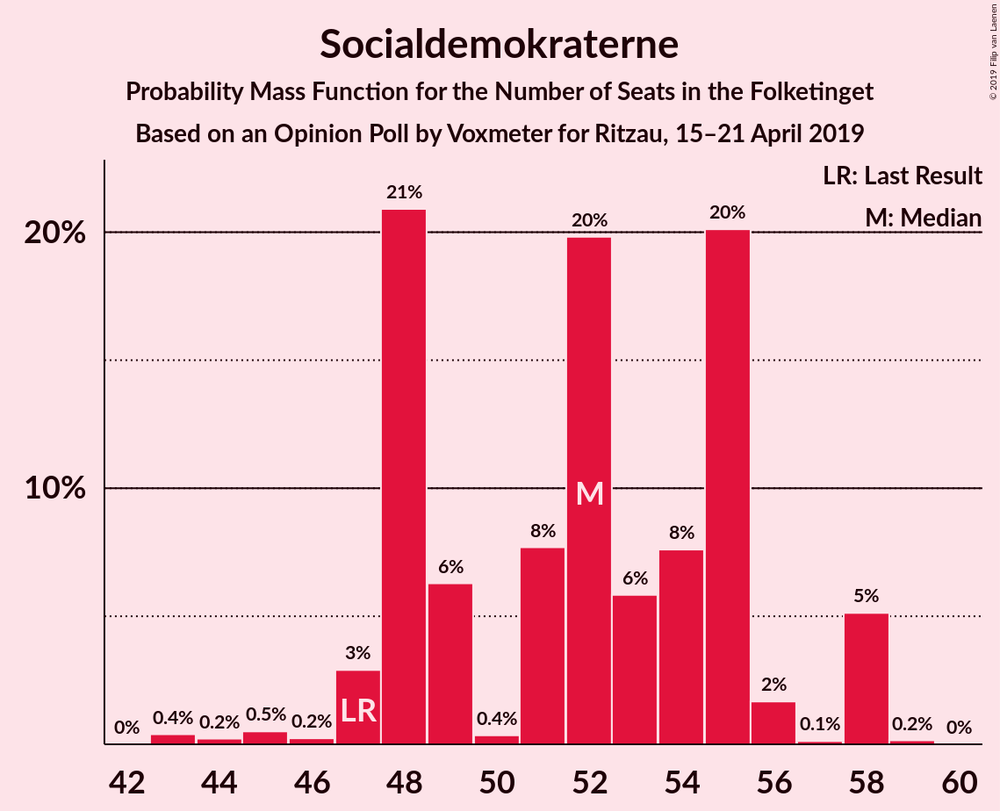
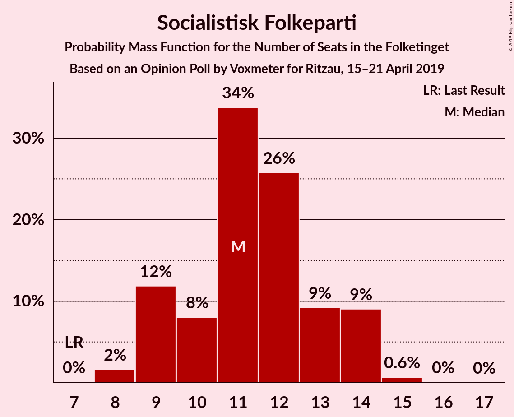
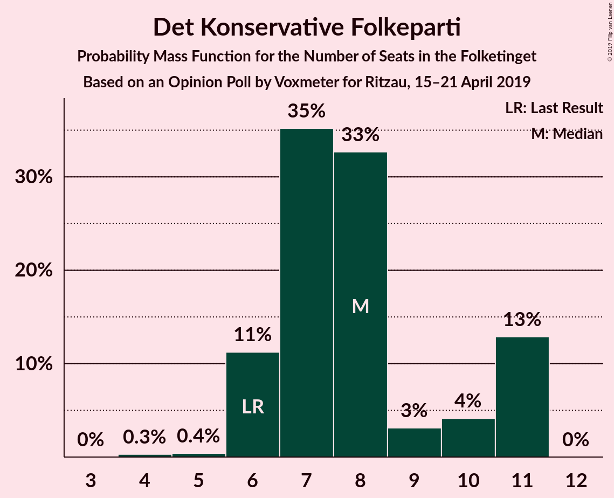
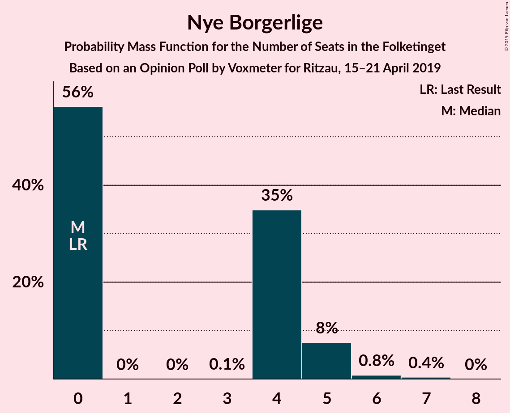
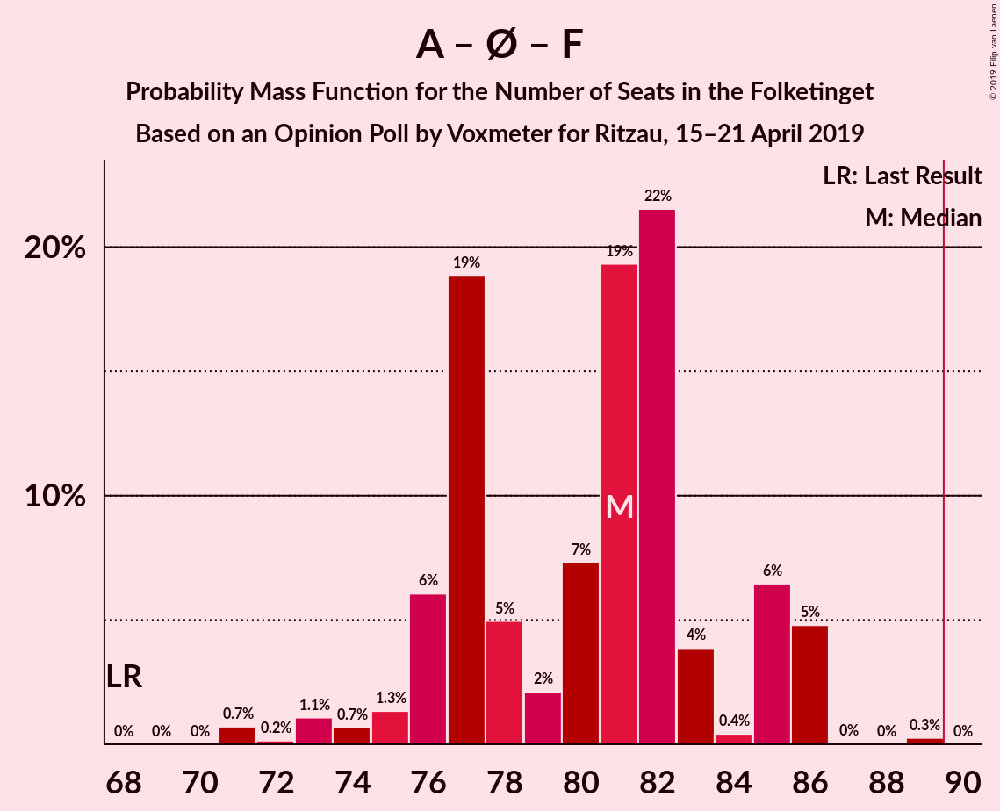
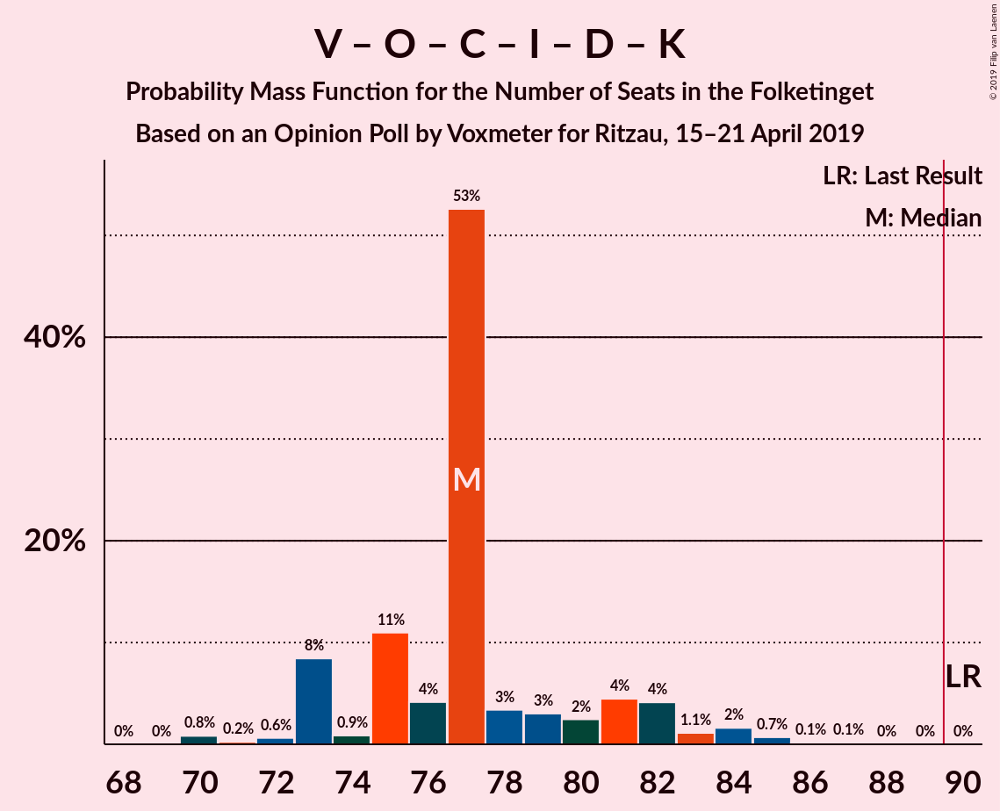

# Opinion Poll by Voxmeter for Ritzau, 15–21 April 2019

<a href="#voting-intentions">Voting Intentions</a> | <a href="#seats">Seats</a> | <a href="#coalitions">Coalitions</a> | <a href="#technical-information">Technical Information</a>

## Voting Intentions

### Confidence Intervals

| Party | Last Result | Poll Result | 80% Confidence Interval | 90% Confidence Interval | 95% Confidence Interval | 99% Confidence Interval |
|:-----:|:-----------:|:-----------:|:-----------------------:|:-----------------------:|:-----------------------:|:-----------------------:|
| Socialdemokraterne | 26.3% | 28.9% | 27.1–30.8% |26.6–31.3% |26.2–31.7% |25.4–32.7% |
| Venstre | 19.5% | 19.0% | 17.5–20.7% |17.1–21.1% |16.7–21.5% |16.0–22.3% |
| Dansk Folkeparti | 21.1% | 15.0% | 13.7–16.6% |13.3–17.0% |13.0–17.4% |12.4–18.1% |
| Enhedslisten–De Rød-Grønne | 7.8% | 9.3% | 8.2–10.6% |7.9–10.9% |7.7–11.2% |7.2–11.9% |
| Radikale Venstre | 4.6% | 6.8% | 5.9–7.9% |5.6–8.2% |5.4–8.5% |5.0–9.1% |
| Socialistisk Folkeparti | 4.2% | 6.2% | 5.3–7.3% |5.1–7.6% |4.9–7.9% |4.5–8.4% |
| Det Konservative Folkeparti | 3.4% | 4.3% | 3.6–5.2% |3.4–5.5% |3.2–5.7% |2.9–6.2% |
| Liberal Alliance | 7.5% | 4.1% | 3.4–5.0% |3.2–5.2% |3.0–5.5% |2.7–5.9% |
| Alternativet | 4.8% | 3.1% | 2.5–3.9% |2.3–4.1% |2.2–4.4% |2.0–4.8% |
| Nye Borgerlige | 0.0% | 2.0% | 1.6–2.7% |1.4–2.9% |1.3–3.1% |1.1–3.5% |
| Kristendemokraterne | 0.8% | 0.9% | 0.6–1.4% |0.5–1.5% |0.5–1.7% |0.4–1.9% |
| Klaus Riskær Pedersen | 0.0% | 0.1% | 0.0–0.4% |0.0–0.5% |0.0–0.5% |0.0–0.7% |

*Note:* The poll result column reflects the actual value used in the calculations. Published results may vary slightly, and in addition be rounded to fewer digits.

## Seats

### Confidence Intervals

| Party | Last Result | Median | 80% Confidence Interval | 90% Confidence Interval | 95% Confidence Interval | 99% Confidence Interval |
|:-----:|:-----------:|:------:|:-----------------------:|:-----------------------:|:-----------------------:|:-----------------------:|
| <a href="#socialdemokraterne">Socialdemokraterne</a> | 47 | 49 | 48–55 |48–55 |48–55 |43–58 |
| <a href="#venstre">Venstre</a> | 34 | 34 | 30–36 |30–36 |30–37 |29–39 |
| <a href="#dansk-folkeparti">Dansk Folkeparti</a> | 37 | 29 | 25–29 |24–29 |23–29 |23–31 |
| <a href="#enhedslisten–de-rød-grønne">Enhedslisten–De Rød-Grønne</a> | 14 | 18 | 15–19 |15–20 |14–20 |12–22 |
| <a href="#radikale-venstre">Radikale Venstre</a> | 8 | 14 | 10–14 |9–14 |9–15 |9–18 |
| <a href="#socialistisk-folkeparti">Socialistisk Folkeparti</a> | 7 | 11 | 9–13 |9–14 |9–14 |8–15 |
| <a href="#det-konservative-folkeparti">Det Konservative Folkeparti</a> | 6 | 7 | 6–9 |6–10 |6–10 |4–11 |
| <a href="#liberal-alliance">Liberal Alliance</a> | 13 | 7 | 7–10 |6–10 |6–10 |5–11 |
| <a href="#alternativet">Alternativet</a> | 9 | 6 | 4–7 |4–7 |4–8 |0–9 |
| <a href="#nye-borgerlige">Nye Borgerlige</a> | 0 | 0 | 0–5 |0–5 |0–5 |0–6 |
| <a href="#kristendemokraterne">Kristendemokraterne</a> | 0 | 0 | 0 |0 |0 |0 |
| <a href="#klaus-riskær-pedersen">Klaus Riskær Pedersen</a> | 0 | 0 | 0 |0 |0 |0 |

### Socialdemokraterne

*For a full overview of the results for this party, see the [Socialdemokraterne](party-socialdemokraterne.html) page.*

| Number of Seats | Probability | Accumulated | Special Marks |
|:---------------:|:-----------:|:-----------:|:-------------:|
| 43 | 0.9% | 100% |  |
| 44 | 0.5% | 99.1% |  |
| 45 | 0.1% | 98.6% |  |
| 46 | 0% | 98.5% |  |
| 47 | 0.4% | 98.5% | Last Result |
| 48 | 43% | 98% |  |
| 49 | 15% | 55% | Median |
| 50 | 0.4% | 41% |  |
| 51 | 4% | 41% |  |
| 52 | 0.8% | 36% |  |
| 53 | 8% | 35% |  |
| 54 | 7% | 27% |  |
| 55 | 19% | 21% |  |
| 56 | 0.4% | 2% |  |
| 57 | 0.1% | 1.4% |  |
| 58 | 1.0% | 1.3% |  |
| 59 | 0.3% | 0.4% |  |
| 60 | 0% | 0% |  |

### Venstre

*For a full overview of the results for this party, see the [Venstre](party-venstre.html) page.*

| Number of Seats | Probability | Accumulated | Special Marks |
|:---------------:|:-----------:|:-----------:|:-------------:|
| 26 | 0% | 100% |  |
| 27 | 0% | 99.9% |  |
| 28 | 0.1% | 99.9% |  |
| 29 | 0.8% | 99.8% |  |
| 30 | 14% | 98.9% |  |
| 31 | 7% | 84% |  |
| 32 | 9% | 78% |  |
| 33 | 6% | 69% |  |
| 34 | 40% | 63% | Last Result, Median |
| 35 | 10% | 22% |  |
| 36 | 9% | 13% |  |
| 37 | 1.0% | 3% |  |
| 38 | 1.2% | 2% |  |
| 39 | 0.5% | 0.9% |  |
| 40 | 0.3% | 0.4% |  |
| 41 | 0.1% | 0.1% |  |
| 42 | 0% | 0% |  |

### Dansk Folkeparti

*For a full overview of the results for this party, see the [Dansk Folkeparti](party-danskfolkeparti.html) page.*

| Number of Seats | Probability | Accumulated | Special Marks |
|:---------------:|:-----------:|:-----------:|:-------------:|
| 21 | 0.3% | 100% |  |
| 22 | 0.1% | 99.7% |  |
| 23 | 4% | 99.6% |  |
| 24 | 2% | 95% |  |
| 25 | 11% | 93% |  |
| 26 | 1.3% | 82% |  |
| 27 | 19% | 81% |  |
| 28 | 8% | 62% |  |
| 29 | 52% | 54% | Median |
| 30 | 1.3% | 2% |  |
| 31 | 0.7% | 0.9% |  |
| 32 | 0% | 0.2% |  |
| 33 | 0.1% | 0.1% |  |
| 34 | 0% | 0% |  |
| 35 | 0% | 0% |  |
| 36 | 0% | 0% |  |
| 37 | 0% | 0% | Last Result |

### Enhedslisten–De Rød-Grønne

*For a full overview of the results for this party, see the [Enhedslisten–De Rød-Grønne](party-enhedslisten–derød-grønne.html) page.*

| Number of Seats | Probability | Accumulated | Special Marks |
|:---------------:|:-----------:|:-----------:|:-------------:|
| 12 | 0.7% | 100% |  |
| 13 | 0.3% | 99.3% |  |
| 14 | 3% | 99.0% | Last Result |
| 15 | 10% | 96% |  |
| 16 | 25% | 86% |  |
| 17 | 6% | 61% |  |
| 18 | 39% | 55% | Median |
| 19 | 8% | 16% |  |
| 20 | 7% | 8% |  |
| 21 | 0.3% | 1.0% |  |
| 22 | 0.7% | 0.7% |  |
| 23 | 0% | 0% |  |

### Radikale Venstre

*For a full overview of the results for this party, see the [Radikale Venstre](party-radikalevenstre.html) page.*

| Number of Seats | Probability | Accumulated | Special Marks |
|:---------------:|:-----------:|:-----------:|:-------------:|
| 8 | 0.1% | 100% | Last Result |
| 9 | 9% | 99.9% |  |
| 10 | 6% | 91% |  |
| 11 | 8% | 85% |  |
| 12 | 9% | 77% |  |
| 13 | 8% | 69% |  |
| 14 | 57% | 61% | Median |
| 15 | 2% | 3% |  |
| 16 | 0.3% | 1.1% |  |
| 17 | 0% | 0.8% |  |
| 18 | 0.8% | 0.8% |  |
| 19 | 0% | 0% |  |

### Socialistisk Folkeparti

*For a full overview of the results for this party, see the [Socialistisk Folkeparti](party-socialistiskfolkeparti.html) page.*

| Number of Seats | Probability | Accumulated | Special Marks |
|:---------------:|:-----------:|:-----------:|:-------------:|
| 7 | 0.1% | 100% | Last Result |
| 8 | 1.0% | 99.9% |  |
| 9 | 24% | 99.0% |  |
| 10 | 9% | 75% |  |
| 11 | 42% | 65% | Median |
| 12 | 7% | 23% |  |
| 13 | 8% | 16% |  |
| 14 | 8% | 9% |  |
| 15 | 0.9% | 1.0% |  |
| 16 | 0.1% | 0.1% |  |
| 17 | 0% | 0% |  |

### Det Konservative Folkeparti

*For a full overview of the results for this party, see the [Det Konservative Folkeparti](party-detkonservativefolkeparti.html) page.*

| Number of Seats | Probability | Accumulated | Special Marks |
|:---------------:|:-----------:|:-----------:|:-------------:|
| 4 | 0.7% | 100% |  |
| 5 | 0.3% | 99.3% |  |
| 6 | 13% | 99.0% | Last Result |
| 7 | 61% | 86% | Median |
| 8 | 15% | 25% |  |
| 9 | 5% | 10% |  |
| 10 | 5% | 5% |  |
| 11 | 0.8% | 0.8% |  |
| 12 | 0% | 0% |  |

### Liberal Alliance

*For a full overview of the results for this party, see the [Liberal Alliance](party-liberalalliance.html) page.*

| Number of Seats | Probability | Accumulated | Special Marks |
|:---------------:|:-----------:|:-----------:|:-------------:|
| 4 | 0.1% | 100% |  |
| 5 | 1.4% | 99.9% |  |
| 6 | 8% | 98.5% |  |
| 7 | 63% | 91% | Median |
| 8 | 8% | 28% |  |
| 9 | 8% | 20% |  |
| 10 | 11% | 12% |  |
| 11 | 1.0% | 1.1% |  |
| 12 | 0.1% | 0.1% |  |
| 13 | 0% | 0% | Last Result |

### Alternativet

*For a full overview of the results for this party, see the [Alternativet](party-alternativet.html) page.*

| Number of Seats | Probability | Accumulated | Special Marks |
|:---------------:|:-----------:|:-----------:|:-------------:|
| 0 | 2% | 100% |  |
| 1 | 0% | 98% |  |
| 2 | 0% | 98% |  |
| 3 | 0% | 98% |  |
| 4 | 21% | 98% |  |
| 5 | 11% | 77% |  |
| 6 | 19% | 66% | Median |
| 7 | 44% | 47% |  |
| 8 | 3% | 3% |  |
| 9 | 0.5% | 0.5% | Last Result |
| 10 | 0% | 0% |  |

### Nye Borgerlige

*For a full overview of the results for this party, see the [Nye Borgerlige](party-nyeborgerlige.html) page.*

| Number of Seats | Probability | Accumulated | Special Marks |
|:---------------:|:-----------:|:-----------:|:-------------:|
| 0 | 59% | 100% | Last Result, Median |
| 1 | 0% | 41% |  |
| 2 | 0% | 41% |  |
| 3 | 0% | 41% |  |
| 4 | 27% | 41% |  |
| 5 | 13% | 14% |  |
| 6 | 0.9% | 1.1% |  |
| 7 | 0.2% | 0.2% |  |
| 8 | 0% | 0% |  |

### Kristendemokraterne

*For a full overview of the results for this party, see the [Kristendemokraterne](party-kristendemokraterne.html) page.*

| Number of Seats | Probability | Accumulated | Special Marks |
|:---------------:|:-----------:|:-----------:|:-------------:|
| 0 | 99.7% | 100% | Last Result, Median |
| 1 | 0% | 0.3% |  |
| 2 | 0% | 0.3% |  |
| 3 | 0% | 0.3% |  |
| 4 | 0.3% | 0.3% |  |
| 5 | 0% | 0% |  |

### Klaus Riskær Pedersen

*For a full overview of the results for this party, see the [Klaus Riskær Pedersen](party-klausriskærpedersen.html) page.*

| Number of Seats | Probability | Accumulated | Special Marks |
|:---------------:|:-----------:|:-----------:|:-------------:|
| 0 | 100% | 100% | Last Result, Median |

## Coalitions

### Confidence Intervals

| Coalition | Last Result | Median | Majority? | 80% Confidence Interval | 90% Confidence Interval | 95% Confidence Interval | 99% Confidence Interval |
|:---------:|:-----------:|:------:|:---------:|:-----------------------:|:-----------------------:|:-----------------------:|:-----------------------:|
| Socialdemokraterne – Enhedslisten–De Rød-Grønne – Radikale Venstre – Socialistisk Folkeparti – Alternativet | 85 | 98 | 99.4% | 93–100 | 93–102 | 92–103 | 89–105 |
| Socialdemokraterne – Enhedslisten–De Rød-Grønne – Radikale Venstre – Socialistisk Folkeparti | 76 | 91 | 79% | 88–95 | 87–96 | 86–98 | 83–99 |
| Socialdemokraterne – Enhedslisten–De Rød-Grønne – Socialistisk Folkeparti – Alternativet | 77 | 84 | 10% | 82–88 | 81–90 | 79–91 | 77–93 |
| Socialdemokraterne – Enhedslisten–De Rød-Grønne – Socialistisk Folkeparti | 68 | 78 | 0% | 76–82 | 76–83 | 73–85 | 71–89 |
| Venstre – Dansk Folkeparti – Det Konservative Folkeparti – Liberal Alliance – Nye Borgerlige – Kristendemokraterne – Klaus Riskær Pedersen | 90 | 77 | 0% | 75–82 | 73–82 | 72–83 | 70–86 |
| Venstre – Dansk Folkeparti – Det Konservative Folkeparti – Liberal Alliance – Nye Borgerlige – Klaus Riskær Pedersen | 90 | 77 | 0% | 75–82 | 73–82 | 72–83 | 70–85 |
| Venstre – Dansk Folkeparti – Det Konservative Folkeparti – Liberal Alliance – Nye Borgerlige – Kristendemokraterne | 90 | 77 | 0% | 75–82 | 73–82 | 72–83 | 70–86 |
| Venstre – Dansk Folkeparti – Det Konservative Folkeparti – Liberal Alliance – Nye Borgerlige | 90 | 77 | 0% | 75–82 | 73–82 | 72–83 | 70–85 |
| Venstre – Dansk Folkeparti – Det Konservative Folkeparti – Liberal Alliance – Kristendemokraterne | 90 | 77 | 0% | 73–78 | 71–80 | 70–81 | 70–82 |
| Venstre – Dansk Folkeparti – Det Konservative Folkeparti – Liberal Alliance | 90 | 77 | 0% | 73–78 | 71–80 | 70–81 | 70–82 |
| Socialdemokraterne – Radikale Venstre – Socialistisk Folkeparti | 62 | 73 | 0% | 70–79 | 69–80 | 69–81 | 68–81 |
| Socialdemokraterne – Radikale Venstre | 55 | 62 | 0% | 59–69 | 58–69 | 58–69 | 56–69 |
| Venstre – Det Konservative Folkeparti – Liberal Alliance | 53 | 48 | 0% | 44–52 | 44–53 | 44–54 | 44–55 |
| Venstre – Det Konservative Folkeparti | 40 | 41 | 0% | 37–43 | 37–44 | 37–46 | 37–47 |
| Venstre | 34 | 34 | 0% | 30–36 | 30–36 | 30–37 | 29–39 |

### Socialdemokraterne – Enhedslisten–De Rød-Grønne – Radikale Venstre – Socialistisk Folkeparti – Alternativet

| Number of Seats | Probability | Accumulated | Special Marks |
|:---------------:|:-----------:|:-----------:|:-------------:|
| 85 | 0% | 100% | Last Result |
| 86 | 0% | 100% |  |
| 87 | 0% | 100% |  |
| 88 | 0.3% | 100% |  |
| 89 | 0.2% | 99.7% |  |
| 90 | 0.3% | 99.4% | Majority |
| 91 | 1.0% | 99.1% |  |
| 92 | 2% | 98% |  |
| 93 | 8% | 96% |  |
| 94 | 7% | 88% |  |
| 95 | 3% | 81% |  |
| 96 | 2% | 78% |  |
| 97 | 4% | 76% |  |
| 98 | 53% | 72% | Median |
| 99 | 6% | 19% |  |
| 100 | 5% | 12% |  |
| 101 | 2% | 7% |  |
| 102 | 3% | 6% |  |
| 103 | 0.7% | 3% |  |
| 104 | 0.4% | 2% |  |
| 105 | 2% | 2% |  |
| 106 | 0% | 0% |  |

### Socialdemokraterne – Enhedslisten–De Rød-Grønne – Radikale Venstre – Socialistisk Folkeparti

| Number of Seats | Probability | Accumulated | Special Marks |
|:---------------:|:-----------:|:-----------:|:-------------:|
| 76 | 0% | 100% | Last Result |
| 77 | 0% | 100% |  |
| 78 | 0% | 100% |  |
| 79 | 0% | 100% |  |
| 80 | 0% | 100% |  |
| 81 | 0.2% | 100% |  |
| 82 | 0.1% | 99.8% |  |
| 83 | 0.3% | 99.7% |  |
| 84 | 0.2% | 99.4% |  |
| 85 | 0.2% | 99.2% |  |
| 86 | 2% | 99.0% |  |
| 87 | 5% | 97% |  |
| 88 | 5% | 92% |  |
| 89 | 8% | 87% |  |
| 90 | 1.3% | 79% | Majority |
| 91 | 38% | 78% |  |
| 92 | 11% | 40% | Median |
| 93 | 3% | 29% |  |
| 94 | 15% | 26% |  |
| 95 | 6% | 12% |  |
| 96 | 4% | 6% |  |
| 97 | 0.1% | 3% |  |
| 98 | 0.2% | 3% |  |
| 99 | 2% | 2% |  |
| 100 | 0% | 0.1% |  |
| 101 | 0% | 0% |  |

### Socialdemokraterne – Enhedslisten–De Rød-Grønne – Socialistisk Folkeparti – Alternativet

| Number of Seats | Probability | Accumulated | Special Marks |
|:---------------:|:-----------:|:-----------:|:-------------:|
| 75 | 0% | 100% |  |
| 76 | 0% | 99.9% |  |
| 77 | 0.9% | 99.9% | Last Result |
| 78 | 0.8% | 99.0% |  |
| 79 | 2% | 98% |  |
| 80 | 0.8% | 96% |  |
| 81 | 3% | 95% |  |
| 82 | 9% | 93% |  |
| 83 | 2% | 84% |  |
| 84 | 57% | 82% | Median |
| 85 | 3% | 24% |  |
| 86 | 2% | 22% |  |
| 87 | 7% | 20% |  |
| 88 | 4% | 14% |  |
| 89 | 0.2% | 10% |  |
| 90 | 7% | 10% | Majority |
| 91 | 2% | 3% |  |
| 92 | 0.7% | 1.3% |  |
| 93 | 0.6% | 0.6% |  |
| 94 | 0% | 0% |  |

### Socialdemokraterne – Enhedslisten–De Rød-Grønne – Socialistisk Folkeparti

| Number of Seats | Probability | Accumulated | Special Marks |
|:---------------:|:-----------:|:-----------:|:-------------:|
| 68 | 0% | 100% | Last Result |
| 69 | 0% | 100% |  |
| 70 | 0% | 100% |  |
| 71 | 0.5% | 100% |  |
| 72 | 0.1% | 99.4% |  |
| 73 | 2% | 99.3% |  |
| 74 | 0.3% | 97% |  |
| 75 | 1.3% | 97% |  |
| 76 | 7% | 95% |  |
| 77 | 38% | 89% |  |
| 78 | 10% | 51% | Median |
| 79 | 5% | 41% |  |
| 80 | 16% | 36% |  |
| 81 | 0.8% | 21% |  |
| 82 | 10% | 20% |  |
| 83 | 5% | 9% |  |
| 84 | 0.9% | 4% |  |
| 85 | 3% | 4% |  |
| 86 | 0.2% | 0.8% |  |
| 87 | 0% | 0.6% |  |
| 88 | 0% | 0.6% |  |
| 89 | 0.6% | 0.6% |  |
| 90 | 0% | 0% | Majority |

### Venstre – Dansk Folkeparti – Det Konservative Folkeparti – Liberal Alliance – Nye Borgerlige – Kristendemokraterne – Klaus Riskær Pedersen

| Number of Seats | Probability | Accumulated | Special Marks |
|:---------------:|:-----------:|:-----------:|:-------------:|
| 70 | 2% | 100% |  |
| 71 | 0.4% | 98% |  |
| 72 | 0.7% | 98% |  |
| 73 | 3% | 97% |  |
| 74 | 2% | 94% |  |
| 75 | 5% | 93% |  |
| 76 | 6% | 88% |  |
| 77 | 53% | 81% | Median |
| 78 | 4% | 28% |  |
| 79 | 2% | 24% |  |
| 80 | 3% | 22% |  |
| 81 | 7% | 19% |  |
| 82 | 8% | 12% |  |
| 83 | 2% | 4% |  |
| 84 | 1.0% | 2% |  |
| 85 | 0.3% | 0.9% |  |
| 86 | 0.2% | 0.6% |  |
| 87 | 0.3% | 0.3% |  |
| 88 | 0% | 0% |  |
| 89 | 0% | 0% |  |
| 90 | 0% | 0% | Last Result, Majority |

### Venstre – Dansk Folkeparti – Det Konservative Folkeparti – Liberal Alliance – Nye Borgerlige – Klaus Riskær Pedersen

| Number of Seats | Probability | Accumulated | Special Marks |
|:---------------:|:-----------:|:-----------:|:-------------:|
| 70 | 2% | 100% |  |
| 71 | 0.4% | 98% |  |
| 72 | 0.7% | 98% |  |
| 73 | 3% | 97% |  |
| 74 | 2% | 94% |  |
| 75 | 5% | 92% |  |
| 76 | 6% | 88% |  |
| 77 | 53% | 81% | Median |
| 78 | 4% | 28% |  |
| 79 | 2% | 24% |  |
| 80 | 3% | 22% |  |
| 81 | 7% | 19% |  |
| 82 | 8% | 12% |  |
| 83 | 2% | 3% |  |
| 84 | 1.0% | 2% |  |
| 85 | 0.3% | 0.8% |  |
| 86 | 0.1% | 0.4% |  |
| 87 | 0.3% | 0.3% |  |
| 88 | 0% | 0% |  |
| 89 | 0% | 0% |  |
| 90 | 0% | 0% | Last Result, Majority |

### Venstre – Dansk Folkeparti – Det Konservative Folkeparti – Liberal Alliance – Nye Borgerlige – Kristendemokraterne

| Number of Seats | Probability | Accumulated | Special Marks |
|:---------------:|:-----------:|:-----------:|:-------------:|
| 70 | 2% | 100% |  |
| 71 | 0.4% | 98% |  |
| 72 | 0.7% | 98% |  |
| 73 | 3% | 97% |  |
| 74 | 2% | 94% |  |
| 75 | 5% | 93% |  |
| 76 | 6% | 88% |  |
| 77 | 53% | 81% | Median |
| 78 | 4% | 28% |  |
| 79 | 2% | 24% |  |
| 80 | 3% | 22% |  |
| 81 | 7% | 19% |  |
| 82 | 8% | 12% |  |
| 83 | 2% | 4% |  |
| 84 | 1.0% | 2% |  |
| 85 | 0.3% | 0.9% |  |
| 86 | 0.2% | 0.6% |  |
| 87 | 0.3% | 0.3% |  |
| 88 | 0% | 0% |  |
| 89 | 0% | 0% |  |
| 90 | 0% | 0% | Last Result, Majority |

### Venstre – Dansk Folkeparti – Det Konservative Folkeparti – Liberal Alliance – Nye Borgerlige

| Number of Seats | Probability | Accumulated | Special Marks |
|:---------------:|:-----------:|:-----------:|:-------------:|
| 70 | 2% | 100% |  |
| 71 | 0.4% | 98% |  |
| 72 | 0.7% | 98% |  |
| 73 | 3% | 97% |  |
| 74 | 2% | 94% |  |
| 75 | 5% | 92% |  |
| 76 | 6% | 88% |  |
| 77 | 53% | 81% | Median |
| 78 | 4% | 28% |  |
| 79 | 2% | 24% |  |
| 80 | 3% | 22% |  |
| 81 | 7% | 19% |  |
| 82 | 8% | 12% |  |
| 83 | 2% | 3% |  |
| 84 | 1.0% | 2% |  |
| 85 | 0.3% | 0.8% |  |
| 86 | 0.1% | 0.4% |  |
| 87 | 0.3% | 0.3% |  |
| 88 | 0% | 0% |  |
| 89 | 0% | 0% |  |
| 90 | 0% | 0% | Last Result, Majority |

### Venstre – Dansk Folkeparti – Det Konservative Folkeparti – Liberal Alliance – Kristendemokraterne

| Number of Seats | Probability | Accumulated | Special Marks |
|:---------------:|:-----------:|:-----------:|:-------------:|
| 67 | 0.1% | 100% |  |
| 68 | 0% | 99.9% |  |
| 69 | 0.1% | 99.9% |  |
| 70 | 3% | 99.8% |  |
| 71 | 3% | 97% |  |
| 72 | 2% | 94% |  |
| 73 | 19% | 93% |  |
| 74 | 2% | 74% |  |
| 75 | 6% | 71% |  |
| 76 | 6% | 65% |  |
| 77 | 48% | 59% | Median |
| 78 | 5% | 12% |  |
| 79 | 2% | 7% |  |
| 80 | 2% | 5% |  |
| 81 | 2% | 3% |  |
| 82 | 0.4% | 0.7% |  |
| 83 | 0.2% | 0.4% |  |
| 84 | 0.1% | 0.2% |  |
| 85 | 0% | 0.1% |  |
| 86 | 0.1% | 0.1% |  |
| 87 | 0% | 0% |  |
| 88 | 0% | 0% |  |
| 89 | 0% | 0% |  |
| 90 | 0% | 0% | Last Result, Majority |

### Venstre – Dansk Folkeparti – Det Konservative Folkeparti – Liberal Alliance

| Number of Seats | Probability | Accumulated | Special Marks |
|:---------------:|:-----------:|:-----------:|:-------------:|
| 67 | 0.1% | 100% |  |
| 68 | 0% | 99.9% |  |
| 69 | 0.1% | 99.9% |  |
| 70 | 3% | 99.8% |  |
| 71 | 3% | 97% |  |
| 72 | 2% | 94% |  |
| 73 | 19% | 93% |  |
| 74 | 2% | 73% |  |
| 75 | 6% | 71% |  |
| 76 | 6% | 65% |  |
| 77 | 48% | 59% | Median |
| 78 | 5% | 11% |  |
| 79 | 2% | 7% |  |
| 80 | 2% | 5% |  |
| 81 | 2% | 3% |  |
| 82 | 0.4% | 0.7% |  |
| 83 | 0.2% | 0.4% |  |
| 84 | 0.1% | 0.2% |  |
| 85 | 0% | 0.1% |  |
| 86 | 0.1% | 0.1% |  |
| 87 | 0% | 0% |  |
| 88 | 0% | 0% |  |
| 89 | 0% | 0% |  |
| 90 | 0% | 0% | Last Result, Majority |

### Socialdemokraterne – Radikale Venstre – Socialistisk Folkeparti

| Number of Seats | Probability | Accumulated | Special Marks |
|:---------------:|:-----------:|:-----------:|:-------------:|
| 62 | 0% | 100% | Last Result |
| 63 | 0% | 100% |  |
| 64 | 0.2% | 100% |  |
| 65 | 0% | 99.8% |  |
| 66 | 0.1% | 99.8% |  |
| 67 | 0.1% | 99.7% |  |
| 68 | 0.3% | 99.6% |  |
| 69 | 4% | 99.3% |  |
| 70 | 6% | 95% |  |
| 71 | 2% | 89% |  |
| 72 | 8% | 88% |  |
| 73 | 44% | 80% |  |
| 74 | 2% | 36% | Median |
| 75 | 4% | 35% |  |
| 76 | 1.2% | 30% |  |
| 77 | 3% | 29% |  |
| 78 | 15% | 26% |  |
| 79 | 3% | 11% |  |
| 80 | 3% | 7% |  |
| 81 | 4% | 4% |  |
| 82 | 0.1% | 0.1% |  |
| 83 | 0% | 0% |  |

### Socialdemokraterne – Radikale Venstre

| Number of Seats | Probability | Accumulated | Special Marks |
|:---------------:|:-----------:|:-----------:|:-------------:|
| 54 | 0.2% | 100% |  |
| 55 | 0% | 99.8% | Last Result |
| 56 | 1.0% | 99.8% |  |
| 57 | 0.2% | 98.7% |  |
| 58 | 4% | 98.5% |  |
| 59 | 7% | 94% |  |
| 60 | 0.9% | 87% |  |
| 61 | 2% | 86% |  |
| 62 | 41% | 84% |  |
| 63 | 6% | 44% | Median |
| 64 | 9% | 37% |  |
| 65 | 2% | 28% |  |
| 66 | 4% | 27% |  |
| 67 | 3% | 22% |  |
| 68 | 4% | 20% |  |
| 69 | 15% | 15% |  |
| 70 | 0.2% | 0.3% |  |
| 71 | 0% | 0.1% |  |
| 72 | 0% | 0.1% |  |
| 73 | 0% | 0% |  |

### Venstre – Det Konservative Folkeparti – Liberal Alliance

| Number of Seats | Probability | Accumulated | Special Marks |
|:---------------:|:-----------:|:-----------:|:-------------:|
| 41 | 0% | 100% |  |
| 42 | 0.1% | 99.9% |  |
| 43 | 0.1% | 99.8% |  |
| 44 | 14% | 99.7% |  |
| 45 | 3% | 86% |  |
| 46 | 6% | 83% |  |
| 47 | 4% | 77% |  |
| 48 | 43% | 73% | Median |
| 49 | 10% | 31% |  |
| 50 | 5% | 21% |  |
| 51 | 2% | 16% |  |
| 52 | 5% | 14% |  |
| 53 | 6% | 8% | Last Result |
| 54 | 2% | 3% |  |
| 55 | 0.3% | 0.5% |  |
| 56 | 0.1% | 0.2% |  |
| 57 | 0.1% | 0.1% |  |
| 58 | 0% | 0% |  |

### Venstre – Det Konservative Folkeparti

| Number of Seats | Probability | Accumulated | Special Marks |
|:---------------:|:-----------:|:-----------:|:-------------:|
| 34 | 0.1% | 100% |  |
| 35 | 0.1% | 99.9% |  |
| 36 | 0.1% | 99.8% |  |
| 37 | 14% | 99.7% |  |
| 38 | 5% | 86% |  |
| 39 | 4% | 80% |  |
| 40 | 14% | 77% | Last Result |
| 41 | 37% | 63% | Median |
| 42 | 11% | 25% |  |
| 43 | 7% | 14% |  |
| 44 | 4% | 7% |  |
| 45 | 0.4% | 3% |  |
| 46 | 1.5% | 3% |  |
| 47 | 1.0% | 1.5% |  |
| 48 | 0.4% | 0.5% |  |
| 49 | 0% | 0.1% |  |
| 50 | 0% | 0% |  |

### Venstre

| Number of Seats | Probability | Accumulated | Special Marks |
|:---------------:|:-----------:|:-----------:|:-------------:|
| 26 | 0% | 100% |  |
| 27 | 0% | 99.9% |  |
| 28 | 0.1% | 99.9% |  |
| 29 | 0.8% | 99.8% |  |
| 30 | 14% | 98.9% |  |
| 31 | 7% | 84% |  |
| 32 | 9% | 78% |  |
| 33 | 6% | 69% |  |
| 34 | 40% | 63% | Last Result, Median |
| 35 | 10% | 22% |  |
| 36 | 9% | 13% |  |
| 37 | 1.0% | 3% |  |
| 38 | 1.2% | 2% |  |
| 39 | 0.5% | 0.9% |  |
| 40 | 0.3% | 0.4% |  |
| 41 | 0.1% | 0.1% |  |
| 42 | 0% | 0% |  |

## Technical Information

### Opinion Poll

+ **Polling firm:** Voxmeter
+ **Commissioner(s):** Ritzau
+ **Fieldwork period:** 15–21 April 2019

### Calculations

+ **Sample size:** 1031
+ **Simulations done:** 524,288
+ **Error estimate:** 3.99%

