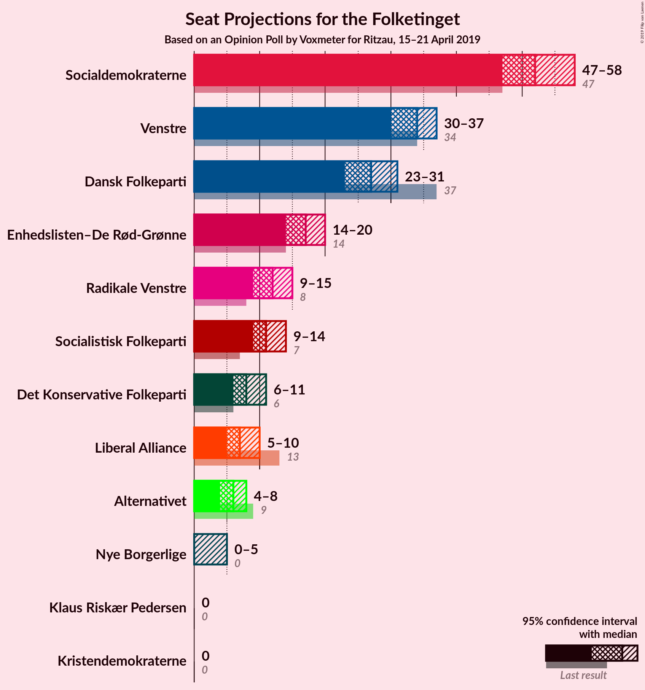
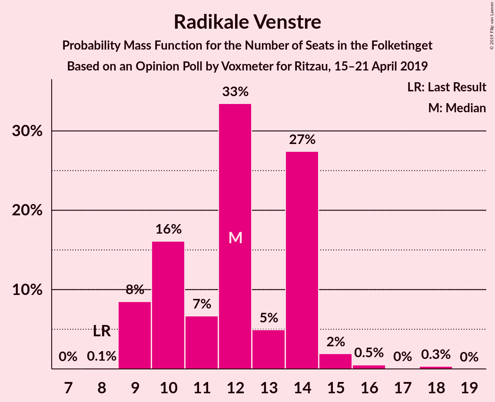
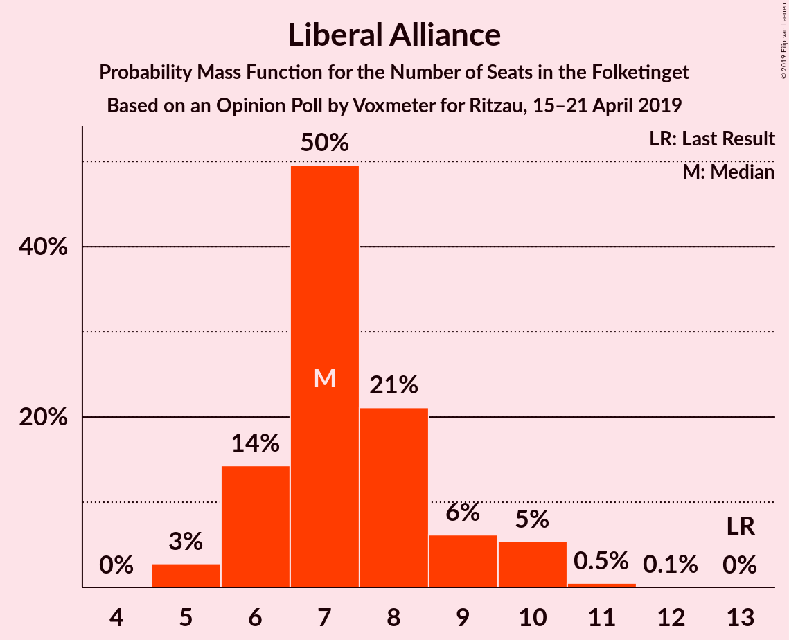
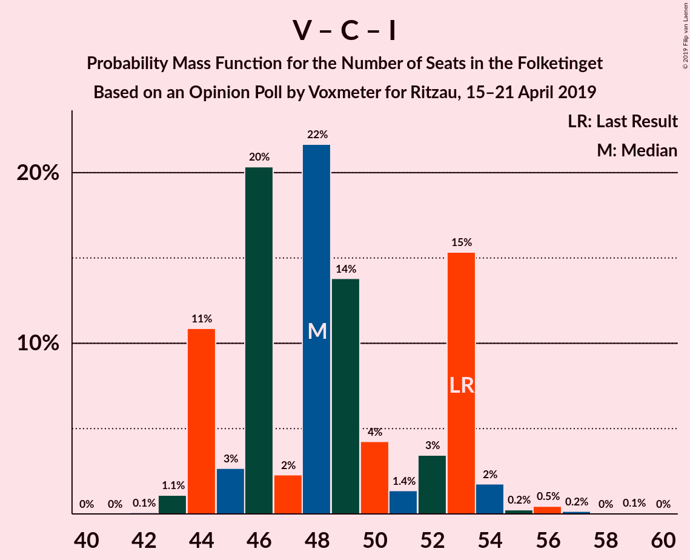

# Opinion Poll by Voxmeter for Ritzau, 15–21 April 2019

<a href="#voting-intentions">Voting Intentions</a> | <a href="#seats">Seats</a> | <a href="#coalitions">Coalitions</a> | <a href="#technical-information">Technical Information</a>

## Voting Intentions

### Confidence Intervals

| Party | Last Result | Poll Result | 80% Confidence Interval | 90% Confidence Interval | 95% Confidence Interval | 99% Confidence Interval |
|:-----:|:-----------:|:-----------:|:-----------------------:|:-----------------------:|:-----------------------:|:-----------------------:|
| Socialdemokraterne | 26.3% | 28.9% | 27.1–30.8% |26.6–31.3% |26.2–31.7% |25.4–32.7% |
| Venstre | 19.5% | 19.0% | 17.5–20.7% |17.1–21.1% |16.7–21.5% |16.0–22.3% |
| Dansk Folkeparti | 21.1% | 15.0% | 13.7–16.6% |13.3–17.0% |13.0–17.4% |12.4–18.1% |
| Enhedslisten–De Rød-Grønne | 7.8% | 9.3% | 8.2–10.6% |7.9–10.9% |7.7–11.2% |7.2–11.9% |
| Radikale Venstre | 4.6% | 6.8% | 5.9–7.9% |5.6–8.2% |5.4–8.5% |5.0–9.1% |
| Socialistisk Folkeparti | 4.2% | 6.2% | 5.3–7.3% |5.1–7.6% |4.9–7.9% |4.5–8.4% |
| Det Konservative Folkeparti | 3.4% | 4.3% | 3.6–5.2% |3.4–5.5% |3.2–5.7% |2.9–6.2% |
| Liberal Alliance | 7.5% | 4.1% | 3.4–5.0% |3.2–5.2% |3.0–5.5% |2.7–5.9% |
| Alternativet | 4.8% | 3.1% | 2.5–3.9% |2.3–4.1% |2.2–4.4% |2.0–4.8% |
| Nye Borgerlige | 0.0% | 2.0% | 1.6–2.7% |1.4–2.9% |1.3–3.1% |1.1–3.5% |
| Kristendemokraterne | 0.8% | 0.9% | 0.6–1.4% |0.5–1.5% |0.5–1.7% |0.4–1.9% |
| Klaus Riskær Pedersen | 0.0% | 0.1% | 0.0–0.4% |0.0–0.5% |0.0–0.5% |0.0–0.7% |

*Note:* The poll result column reflects the actual value used in the calculations. Published results may vary slightly, and in addition be rounded to fewer digits.

## Seats

### Confidence Intervals

| Party | Last Result | Median | 80% Confidence Interval | 90% Confidence Interval | 95% Confidence Interval | 99% Confidence Interval |
|:-----:|:-----------:|:------:|:-----------------------:|:-----------------------:|:-----------------------:|:-----------------------:|
| <a href="#socialdemokraterne">Socialdemokraterne</a> | 47 | 48 | 48–50 |48–50 |48–51 |48–51 |
| <a href="#venstre">Venstre</a> | 34 | 39 | 33–39 |32–39 |28–39 |26–39 |
| <a href="#dansk-folkeparti">Dansk Folkeparti</a> | 37 | 27 | 26–27 |26–27 |26–30 |26–30 |
| <a href="#enhedslisten–de-rød-grønne">Enhedslisten–De Rød-Grønne</a> | 14 | 14 | 14–17 |14–17 |12–17 |12–18 |
| <a href="#radikale-venstre">Radikale Venstre</a> | 8 | 12 | 12–13 |12–13 |12–13 |12–14 |
| <a href="#socialistisk-folkeparti">Socialistisk Folkeparti</a> | 7 | 11 | 11–12 |11–12 |10–12 |10–13 |
| <a href="#det-konservative-folkeparti">Det Konservative Folkeparti</a> | 6 | 8 | 8 |8 |5–8 |5–8 |
| <a href="#liberal-alliance">Liberal Alliance</a> | 13 | 7 | 7 |7 |5–11 |5–11 |
| <a href="#alternativet">Alternativet</a> | 9 | 4 | 4–5 |4–8 |4–10 |4–10 |
| <a href="#nye-borgerlige">Nye Borgerlige</a> | 0 | 5 | 0–5 |0–5 |0–5 |0–5 |
| <a href="#kristendemokraterne">Kristendemokraterne</a> | 0 | 0 | 0 |0 |0 |0–5 |
| <a href="#klaus-riskær-pedersen">Klaus Riskær Pedersen</a> | 0 | 0 | 0 |0 |0 |0 |

### Socialdemokraterne

*For a full overview of the results for this party, see the [Socialdemokraterne](party-socialdemokraterne.html) page.*

| Number of Seats | Probability | Accumulated | Special Marks |
|:---------------:|:-----------:|:-----------:|:-------------:|
| 47 | 0% | 100% | Last Result |
| 48 | 57% | 100% | Median |
| 49 | 0% | 43% |  |
| 50 | 39% | 43% |  |
| 51 | 4% | 4% |  |
| 52 | 0% | 0% |  |

### Venstre

*For a full overview of the results for this party, see the [Venstre](party-venstre.html) page.*

| Number of Seats | Probability | Accumulated | Special Marks |
|:---------------:|:-----------:|:-----------:|:-------------:|
| 26 | 0.9% | 100% |  |
| 27 | 0% | 99.1% |  |
| 28 | 3% | 99.1% |  |
| 29 | 0% | 96% |  |
| 30 | 0% | 96% |  |
| 31 | 0% | 96% |  |
| 32 | 4% | 96% |  |
| 33 | 35% | 92% |  |
| 34 | 0% | 57% | Last Result |
| 35 | 0% | 57% |  |
| 36 | 0% | 57% |  |
| 37 | 0% | 57% |  |
| 38 | 0% | 57% |  |
| 39 | 57% | 57% | Median |
| 40 | 0% | 0% |  |

### Dansk Folkeparti

*For a full overview of the results for this party, see the [Dansk Folkeparti](party-danskfolkeparti.html) page.*

| Number of Seats | Probability | Accumulated | Special Marks |
|:---------------:|:-----------:|:-----------:|:-------------:|
| 26 | 36% | 100% |  |
| 27 | 61% | 64% | Median |
| 28 | 0% | 3% |  |
| 29 | 0% | 3% |  |
| 30 | 3% | 3% |  |
| 31 | 0% | 0% |  |
| 32 | 0% | 0% |  |
| 33 | 0% | 0% |  |
| 34 | 0% | 0% |  |
| 35 | 0% | 0% |  |
| 36 | 0% | 0% |  |
| 37 | 0% | 0% | Last Result |

### Enhedslisten–De Rød-Grønne

*For a full overview of the results for this party, see the [Enhedslisten–De Rød-Grønne](party-enhedslisten–derød-grønne.html) page.*

| Number of Seats | Probability | Accumulated | Special Marks |
|:---------------:|:-----------:|:-----------:|:-------------:|
| 12 | 3% | 100% |  |
| 13 | 0% | 97% |  |
| 14 | 57% | 97% | Last Result, Median |
| 15 | 0% | 40% |  |
| 16 | 0% | 40% |  |
| 17 | 39% | 40% |  |
| 18 | 0.9% | 0.9% |  |
| 19 | 0% | 0% |  |

### Radikale Venstre

*For a full overview of the results for this party, see the [Radikale Venstre](party-radikalevenstre.html) page.*

| Number of Seats | Probability | Accumulated | Special Marks |
|:---------------:|:-----------:|:-----------:|:-------------:|
| 8 | 0% | 100% | Last Result |
| 9 | 0% | 100% |  |
| 10 | 0% | 100% |  |
| 11 | 0% | 100% |  |
| 12 | 60% | 100% | Median |
| 13 | 39% | 40% |  |
| 14 | 1.0% | 1.0% |  |
| 15 | 0% | 0% |  |

### Socialistisk Folkeparti

*For a full overview of the results for this party, see the [Socialistisk Folkeparti](party-socialistiskfolkeparti.html) page.*

| Number of Seats | Probability | Accumulated | Special Marks |
|:---------------:|:-----------:|:-----------:|:-------------:|
| 7 | 0% | 100% | Last Result |
| 8 | 0% | 100% |  |
| 9 | 0% | 100% |  |
| 10 | 4% | 100% |  |
| 11 | 57% | 96% | Median |
| 12 | 38% | 39% |  |
| 13 | 0.9% | 0.9% |  |
| 14 | 0% | 0% |  |

### Det Konservative Folkeparti

*For a full overview of the results for this party, see the [Det Konservative Folkeparti](party-detkonservativefolkeparti.html) page.*

| Number of Seats | Probability | Accumulated | Special Marks |
|:---------------:|:-----------:|:-----------:|:-------------:|
| 5 | 4% | 100% |  |
| 6 | 0% | 96% | Last Result |
| 7 | 0.9% | 96% |  |
| 8 | 95% | 95% | Median |
| 9 | 0% | 0% |  |

### Liberal Alliance

*For a full overview of the results for this party, see the [Liberal Alliance](party-liberalalliance.html) page.*

| Number of Seats | Probability | Accumulated | Special Marks |
|:---------------:|:-----------:|:-----------:|:-------------:|
| 5 | 4% | 100% |  |
| 6 | 0% | 96% |  |
| 7 | 92% | 96% | Median |
| 8 | 1.0% | 4% |  |
| 9 | 0% | 3% |  |
| 10 | 0% | 3% |  |
| 11 | 3% | 3% |  |
| 12 | 0% | 0% |  |
| 13 | 0% | 0% | Last Result |

### Alternativet

*For a full overview of the results for this party, see the [Alternativet](party-alternativet.html) page.*

| Number of Seats | Probability | Accumulated | Special Marks |
|:---------------:|:-----------:|:-----------:|:-------------:|
| 4 | 57% | 100% | Median |
| 5 | 35% | 43% |  |
| 6 | 0% | 8% |  |
| 7 | 0% | 8% |  |
| 8 | 4% | 8% |  |
| 9 | 0% | 4% | Last Result |
| 10 | 4% | 4% |  |
| 11 | 0% | 0% |  |

### Nye Borgerlige

*For a full overview of the results for this party, see the [Nye Borgerlige](party-nyeborgerlige.html) page.*

| Number of Seats | Probability | Accumulated | Special Marks |
|:---------------:|:-----------:|:-----------:|:-------------:|
| 0 | 36% | 100% | Last Result |
| 1 | 0% | 64% |  |
| 2 | 0% | 64% |  |
| 3 | 0% | 64% |  |
| 4 | 3% | 64% |  |
| 5 | 61% | 61% | Median |
| 6 | 0% | 0% |  |

### Kristendemokraterne

*For a full overview of the results for this party, see the [Kristendemokraterne](party-kristendemokraterne.html) page.*

| Number of Seats | Probability | Accumulated | Special Marks |
|:---------------:|:-----------:|:-----------:|:-------------:|
| 0 | 99.1% | 100% | Last Result, Median |
| 1 | 0% | 0.9% |  |
| 2 | 0% | 0.9% |  |
| 3 | 0% | 0.9% |  |
| 4 | 0% | 0.9% |  |
| 5 | 0.9% | 0.9% |  |
| 6 | 0% | 0% |  |

### Klaus Riskær Pedersen

*For a full overview of the results for this party, see the [Klaus Riskær Pedersen](party-klausriskærpedersen.html) page.*

| Number of Seats | Probability | Accumulated | Special Marks |
|:---------------:|:-----------:|:-----------:|:-------------:|
| 0 | 100% | 100% | Last Result, Median |

## Coalitions

### Confidence Intervals

| Coalition | Last Result | Median | Majority? | 80% Confidence Interval | 90% Confidence Interval | 95% Confidence Interval | 99% Confidence Interval |
|:---------:|:-----------:|:------:|:---------:|:-----------------------:|:-----------------------:|:-----------------------:|:-----------------------:|
| Socialdemokraterne – Enhedslisten–De Rød-Grønne – Radikale Venstre – Socialistisk Folkeparti – Alternativet | 85 | 89 | 43% | 89–97 | 89–97 | 89–101 | 89–103 |
| Socialdemokraterne – Enhedslisten–De Rød-Grønne – Radikale Venstre – Socialistisk Folkeparti | 76 | 85 | 40% | 85–92 | 85–92 | 85–92 | 85–95 |
| Socialdemokraterne – Enhedslisten–De Rød-Grønne – Socialistisk Folkeparti – Alternativet | 77 | 77 | 0% | 77–84 | 77–84 | 77–88 | 77–89 |
| Venstre – Dansk Folkeparti – Det Konservative Folkeparti – Liberal Alliance – Nye Borgerlige – Kristendemokraterne – Klaus Riskær Pedersen | 90 | 86 | 0% | 74–86 | 74–86 | 74–86 | 72–86 |
| Venstre – Dansk Folkeparti – Det Konservative Folkeparti – Liberal Alliance – Nye Borgerlige – Klaus Riskær Pedersen | 90 | 86 | 0% | 74–86 | 74–86 | 74–86 | 67–86 |
| Venstre – Dansk Folkeparti – Det Konservative Folkeparti – Liberal Alliance – Nye Borgerlige – Kristendemokraterne | 90 | 86 | 0% | 74–86 | 74–86 | 74–86 | 72–86 |
| Venstre – Dansk Folkeparti – Det Konservative Folkeparti – Liberal Alliance – Nye Borgerlige | 90 | 86 | 0% | 74–86 | 74–86 | 74–86 | 67–86 |
| Venstre – Dansk Folkeparti – Det Konservative Folkeparti – Liberal Alliance – Kristendemokraterne | 90 | 81 | 0% | 74–81 | 74–81 | 69–81 | 69–81 |
| Venstre – Dansk Folkeparti – Det Konservative Folkeparti – Liberal Alliance | 90 | 81 | 0% | 74–81 | 74–81 | 69–81 | 67–81 |
| Socialdemokraterne – Enhedslisten–De Rød-Grønne – Socialistisk Folkeparti | 68 | 73 | 0% | 73–79 | 73–79 | 73–79 | 73–81 |
| Socialdemokraterne – Radikale Venstre – Socialistisk Folkeparti | 62 | 71 | 0% | 71–75 | 71–75 | 71–75 | 71–77 |
| Socialdemokraterne – Radikale Venstre | 55 | 60 | 0% | 60–63 | 60–63 | 60–64 | 60–64 |
| Venstre – Det Konservative Folkeparti – Liberal Alliance | 53 | 54 | 0% | 48–54 | 47–54 | 42–54 | 41–54 |
| Venstre – Det Konservative Folkeparti | 40 | 47 | 0% | 41–47 | 37–47 | 36–47 | 33–47 |
| Venstre | 34 | 39 | 0% | 33–39 | 32–39 | 28–39 | 26–39 |

### Socialdemokraterne – Enhedslisten–De Rød-Grønne – Radikale Venstre – Socialistisk Folkeparti – Alternativet

| Number of Seats | Probability | Accumulated | Special Marks |
|:---------------:|:-----------:|:-----------:|:-------------:|
| 85 | 0% | 100% | Last Result |
| 86 | 0% | 100% |  |
| 87 | 0% | 100% |  |
| 88 | 0% | 100% |  |
| 89 | 57% | 100% | Median |
| 90 | 0% | 43% | Majority |
| 91 | 0% | 43% |  |
| 92 | 0% | 43% |  |
| 93 | 0% | 43% |  |
| 94 | 3% | 43% |  |
| 95 | 0% | 40% |  |
| 96 | 0% | 40% |  |
| 97 | 35% | 40% |  |
| 98 | 0% | 5% |  |
| 99 | 0% | 5% |  |
| 100 | 0% | 5% |  |
| 101 | 4% | 5% |  |
| 102 | 0% | 0.9% |  |
| 103 | 0.9% | 0.9% |  |
| 104 | 0% | 0% |  |

### Socialdemokraterne – Enhedslisten–De Rød-Grønne – Radikale Venstre – Socialistisk Folkeparti

| Number of Seats | Probability | Accumulated | Special Marks |
|:---------------:|:-----------:|:-----------:|:-------------:|
| 76 | 0% | 100% | Last Result |
| 77 | 0% | 100% |  |
| 78 | 0% | 100% |  |
| 79 | 0% | 100% |  |
| 80 | 0% | 100% |  |
| 81 | 0% | 100% |  |
| 82 | 0% | 100% |  |
| 83 | 0% | 100% |  |
| 84 | 0% | 100% |  |
| 85 | 57% | 100% | Median |
| 86 | 3% | 43% |  |
| 87 | 0% | 40% |  |
| 88 | 0% | 40% |  |
| 89 | 0% | 40% |  |
| 90 | 0% | 40% | Majority |
| 91 | 4% | 40% |  |
| 92 | 35% | 36% |  |
| 93 | 0% | 1.0% |  |
| 94 | 0% | 1.0% |  |
| 95 | 0.9% | 1.0% |  |
| 96 | 0% | 0% |  |

### Socialdemokraterne – Enhedslisten–De Rød-Grønne – Socialistisk Folkeparti – Alternativet

| Number of Seats | Probability | Accumulated | Special Marks |
|:---------------:|:-----------:|:-----------:|:-------------:|
| 77 | 57% | 100% | Last Result, Median |
| 78 | 0% | 43% |  |
| 79 | 0% | 43% |  |
| 80 | 0% | 43% |  |
| 81 | 0% | 43% |  |
| 82 | 3% | 43% |  |
| 83 | 0% | 40% |  |
| 84 | 35% | 40% |  |
| 85 | 0% | 5% |  |
| 86 | 0% | 5% |  |
| 87 | 0% | 5% |  |
| 88 | 4% | 5% |  |
| 89 | 0.9% | 0.9% |  |
| 90 | 0% | 0% | Majority |

### Venstre – Dansk Folkeparti – Det Konservative Folkeparti – Liberal Alliance – Nye Borgerlige – Kristendemokraterne – Klaus Riskær Pedersen

| Number of Seats | Probability | Accumulated | Special Marks |
|:---------------:|:-----------:|:-----------:|:-------------:|
| 72 | 0.9% | 100% |  |
| 73 | 0% | 99.1% |  |
| 74 | 39% | 99.1% |  |
| 75 | 0% | 60% |  |
| 76 | 0% | 60% |  |
| 77 | 0% | 60% |  |
| 78 | 0% | 60% |  |
| 79 | 0% | 60% |  |
| 80 | 0% | 60% |  |
| 81 | 3% | 60% |  |
| 82 | 0% | 57% |  |
| 83 | 0% | 57% |  |
| 84 | 0% | 57% |  |
| 85 | 0% | 57% |  |
| 86 | 57% | 57% | Median |
| 87 | 0% | 0% |  |
| 88 | 0% | 0% |  |
| 89 | 0% | 0% |  |
| 90 | 0% | 0% | Last Result, Majority |

### Venstre – Dansk Folkeparti – Det Konservative Folkeparti – Liberal Alliance – Nye Borgerlige – Klaus Riskær Pedersen

| Number of Seats | Probability | Accumulated | Special Marks |
|:---------------:|:-----------:|:-----------:|:-------------:|
| 67 | 0.9% | 100% |  |
| 68 | 0% | 99.1% |  |
| 69 | 0% | 99.1% |  |
| 70 | 0% | 99.1% |  |
| 71 | 0% | 99.1% |  |
| 72 | 0% | 99.1% |  |
| 73 | 0% | 99.1% |  |
| 74 | 39% | 99.1% |  |
| 75 | 0% | 60% |  |
| 76 | 0% | 60% |  |
| 77 | 0% | 60% |  |
| 78 | 0% | 60% |  |
| 79 | 0% | 60% |  |
| 80 | 0% | 60% |  |
| 81 | 3% | 60% |  |
| 82 | 0% | 57% |  |
| 83 | 0% | 57% |  |
| 84 | 0% | 57% |  |
| 85 | 0% | 57% |  |
| 86 | 57% | 57% | Median |
| 87 | 0% | 0% |  |
| 88 | 0% | 0% |  |
| 89 | 0% | 0% |  |
| 90 | 0% | 0% | Last Result, Majority |

### Venstre – Dansk Folkeparti – Det Konservative Folkeparti – Liberal Alliance – Nye Borgerlige – Kristendemokraterne

| Number of Seats | Probability | Accumulated | Special Marks |
|:---------------:|:-----------:|:-----------:|:-------------:|
| 72 | 0.9% | 100% |  |
| 73 | 0% | 99.1% |  |
| 74 | 39% | 99.1% |  |
| 75 | 0% | 60% |  |
| 76 | 0% | 60% |  |
| 77 | 0% | 60% |  |
| 78 | 0% | 60% |  |
| 79 | 0% | 60% |  |
| 80 | 0% | 60% |  |
| 81 | 3% | 60% |  |
| 82 | 0% | 57% |  |
| 83 | 0% | 57% |  |
| 84 | 0% | 57% |  |
| 85 | 0% | 57% |  |
| 86 | 57% | 57% | Median |
| 87 | 0% | 0% |  |
| 88 | 0% | 0% |  |
| 89 | 0% | 0% |  |
| 90 | 0% | 0% | Last Result, Majority |

### Venstre – Dansk Folkeparti – Det Konservative Folkeparti – Liberal Alliance – Nye Borgerlige

| Number of Seats | Probability | Accumulated | Special Marks |
|:---------------:|:-----------:|:-----------:|:-------------:|
| 67 | 0.9% | 100% |  |
| 68 | 0% | 99.1% |  |
| 69 | 0% | 99.1% |  |
| 70 | 0% | 99.1% |  |
| 71 | 0% | 99.1% |  |
| 72 | 0% | 99.1% |  |
| 73 | 0% | 99.1% |  |
| 74 | 39% | 99.1% |  |
| 75 | 0% | 60% |  |
| 76 | 0% | 60% |  |
| 77 | 0% | 60% |  |
| 78 | 0% | 60% |  |
| 79 | 0% | 60% |  |
| 80 | 0% | 60% |  |
| 81 | 3% | 60% |  |
| 82 | 0% | 57% |  |
| 83 | 0% | 57% |  |
| 84 | 0% | 57% |  |
| 85 | 0% | 57% |  |
| 86 | 57% | 57% | Median |
| 87 | 0% | 0% |  |
| 88 | 0% | 0% |  |
| 89 | 0% | 0% |  |
| 90 | 0% | 0% | Last Result, Majority |

### Venstre – Dansk Folkeparti – Det Konservative Folkeparti – Liberal Alliance – Kristendemokraterne

| Number of Seats | Probability | Accumulated | Special Marks |
|:---------------:|:-----------:|:-----------:|:-------------:|
| 69 | 4% | 100% |  |
| 70 | 0% | 96% |  |
| 71 | 0% | 96% |  |
| 72 | 0.9% | 96% |  |
| 73 | 0% | 95% |  |
| 74 | 35% | 95% |  |
| 75 | 0% | 60% |  |
| 76 | 0% | 60% |  |
| 77 | 3% | 60% |  |
| 78 | 0% | 57% |  |
| 79 | 0% | 57% |  |
| 80 | 0% | 57% |  |
| 81 | 57% | 57% | Median |
| 82 | 0% | 0% |  |
| 83 | 0% | 0% |  |
| 84 | 0% | 0% |  |
| 85 | 0% | 0% |  |
| 86 | 0% | 0% |  |
| 87 | 0% | 0% |  |
| 88 | 0% | 0% |  |
| 89 | 0% | 0% |  |
| 90 | 0% | 0% | Last Result, Majority |

### Venstre – Dansk Folkeparti – Det Konservative Folkeparti – Liberal Alliance

| Number of Seats | Probability | Accumulated | Special Marks |
|:---------------:|:-----------:|:-----------:|:-------------:|
| 67 | 0.9% | 100% |  |
| 68 | 0% | 99.1% |  |
| 69 | 4% | 99.1% |  |
| 70 | 0% | 95% |  |
| 71 | 0% | 95% |  |
| 72 | 0% | 95% |  |
| 73 | 0% | 95% |  |
| 74 | 35% | 95% |  |
| 75 | 0% | 60% |  |
| 76 | 0% | 60% |  |
| 77 | 3% | 60% |  |
| 78 | 0% | 57% |  |
| 79 | 0% | 57% |  |
| 80 | 0% | 57% |  |
| 81 | 57% | 57% | Median |
| 82 | 0% | 0% |  |
| 83 | 0% | 0% |  |
| 84 | 0% | 0% |  |
| 85 | 0% | 0% |  |
| 86 | 0% | 0% |  |
| 87 | 0% | 0% |  |
| 88 | 0% | 0% |  |
| 89 | 0% | 0% |  |
| 90 | 0% | 0% | Last Result, Majority |

### Socialdemokraterne – Enhedslisten–De Rød-Grønne – Socialistisk Folkeparti

| Number of Seats | Probability | Accumulated | Special Marks |
|:---------------:|:-----------:|:-----------:|:-------------:|
| 68 | 0% | 100% | Last Result |
| 69 | 0% | 100% |  |
| 70 | 0% | 100% |  |
| 71 | 0% | 100% |  |
| 72 | 0% | 100% |  |
| 73 | 57% | 100% | Median |
| 74 | 3% | 43% |  |
| 75 | 0% | 40% |  |
| 76 | 0% | 40% |  |
| 77 | 0% | 40% |  |
| 78 | 4% | 40% |  |
| 79 | 35% | 36% |  |
| 80 | 0% | 1.0% |  |
| 81 | 0.9% | 1.0% |  |
| 82 | 0% | 0% |  |

### Socialdemokraterne – Radikale Venstre – Socialistisk Folkeparti

| Number of Seats | Probability | Accumulated | Special Marks |
|:---------------:|:-----------:|:-----------:|:-------------:|
| 62 | 0% | 100% | Last Result |
| 63 | 0% | 100% |  |
| 64 | 0% | 100% |  |
| 65 | 0% | 100% |  |
| 66 | 0% | 100% |  |
| 67 | 0% | 100% |  |
| 68 | 0% | 100% |  |
| 69 | 0% | 100% |  |
| 70 | 0% | 100% |  |
| 71 | 57% | 100% | Median |
| 72 | 0% | 43% |  |
| 73 | 0% | 43% |  |
| 74 | 7% | 43% |  |
| 75 | 35% | 36% |  |
| 76 | 0% | 1.0% |  |
| 77 | 0.9% | 1.0% |  |
| 78 | 0% | 0% |  |

### Socialdemokraterne – Radikale Venstre

| Number of Seats | Probability | Accumulated | Special Marks |
|:---------------:|:-----------:|:-----------:|:-------------:|
| 55 | 0% | 100% | Last Result |
| 56 | 0% | 100% |  |
| 57 | 0% | 100% |  |
| 58 | 0% | 100% |  |
| 59 | 0% | 100% |  |
| 60 | 57% | 100% | Median |
| 61 | 0% | 43% |  |
| 62 | 3% | 43% |  |
| 63 | 35% | 40% |  |
| 64 | 5% | 5% |  |
| 65 | 0% | 0.1% |  |
| 66 | 0% | 0% |  |

### Venstre – Det Konservative Folkeparti – Liberal Alliance

| Number of Seats | Probability | Accumulated | Special Marks |
|:---------------:|:-----------:|:-----------:|:-------------:|
| 41 | 0.9% | 100% |  |
| 42 | 4% | 99.1% |  |
| 43 | 0% | 95% |  |
| 44 | 0% | 95% |  |
| 45 | 0% | 95% |  |
| 46 | 0% | 95% |  |
| 47 | 3% | 95% |  |
| 48 | 35% | 92% |  |
| 49 | 0% | 57% |  |
| 50 | 0% | 57% |  |
| 51 | 0% | 57% |  |
| 52 | 0% | 57% |  |
| 53 | 0% | 57% | Last Result |
| 54 | 57% | 57% | Median |
| 55 | 0% | 0% |  |

### Venstre – Det Konservative Folkeparti

| Number of Seats | Probability | Accumulated | Special Marks |
|:---------------:|:-----------:|:-----------:|:-------------:|
| 33 | 0.9% | 100% |  |
| 34 | 0% | 99.1% |  |
| 35 | 0% | 99.1% |  |
| 36 | 3% | 99.1% |  |
| 37 | 4% | 96% |  |
| 38 | 0% | 92% |  |
| 39 | 0% | 92% |  |
| 40 | 0% | 92% | Last Result |
| 41 | 35% | 92% |  |
| 42 | 0% | 57% |  |
| 43 | 0% | 57% |  |
| 44 | 0% | 57% |  |
| 45 | 0% | 57% |  |
| 46 | 0% | 57% |  |
| 47 | 57% | 57% | Median |
| 48 | 0% | 0% |  |

### Venstre

| Number of Seats | Probability | Accumulated | Special Marks |
|:---------------:|:-----------:|:-----------:|:-------------:|
| 26 | 0.9% | 100% |  |
| 27 | 0% | 99.1% |  |
| 28 | 3% | 99.1% |  |
| 29 | 0% | 96% |  |
| 30 | 0% | 96% |  |
| 31 | 0% | 96% |  |
| 32 | 4% | 96% |  |
| 33 | 35% | 92% |  |
| 34 | 0% | 57% | Last Result |
| 35 | 0% | 57% |  |
| 36 | 0% | 57% |  |
| 37 | 0% | 57% |  |
| 38 | 0% | 57% |  |
| 39 | 57% | 57% | Median |
| 40 | 0% | 0% |  |

## Technical Information

### Opinion Poll

+ **Polling firm:** Voxmeter
+ **Commissioner(s):** Ritzau
+ **Fieldwork period:** 15–21 April 2019

### Calculations

+ **Sample size:** 1031
+ **Simulations done:** 1,024
+ **Error estimate:** 5.82%

