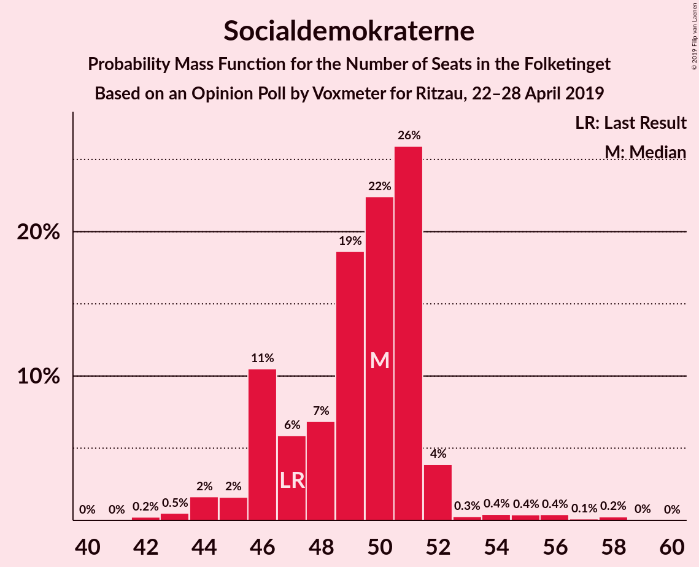
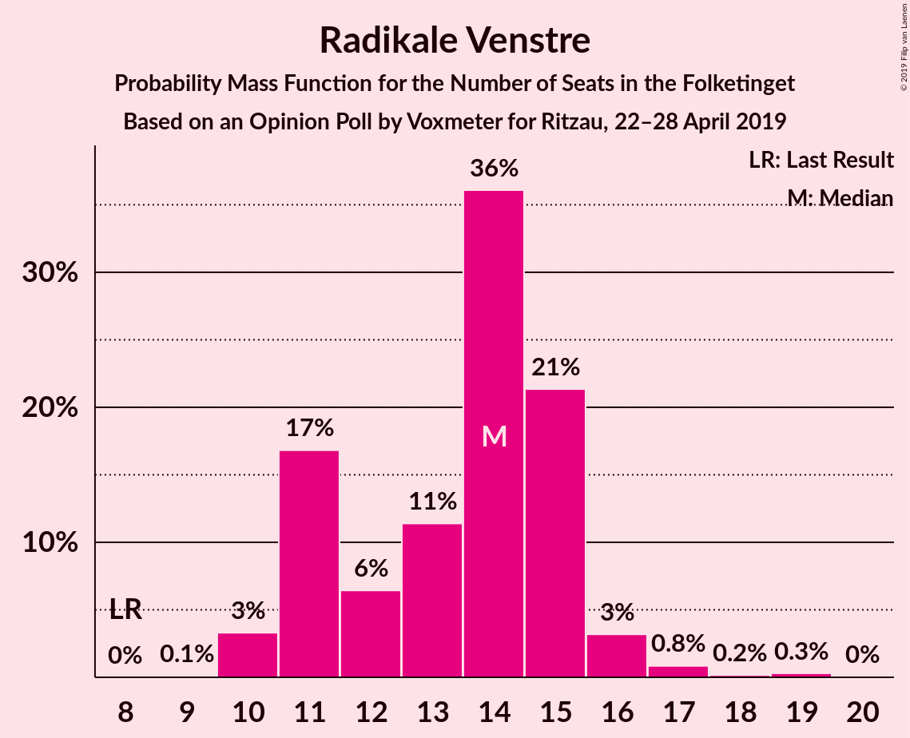
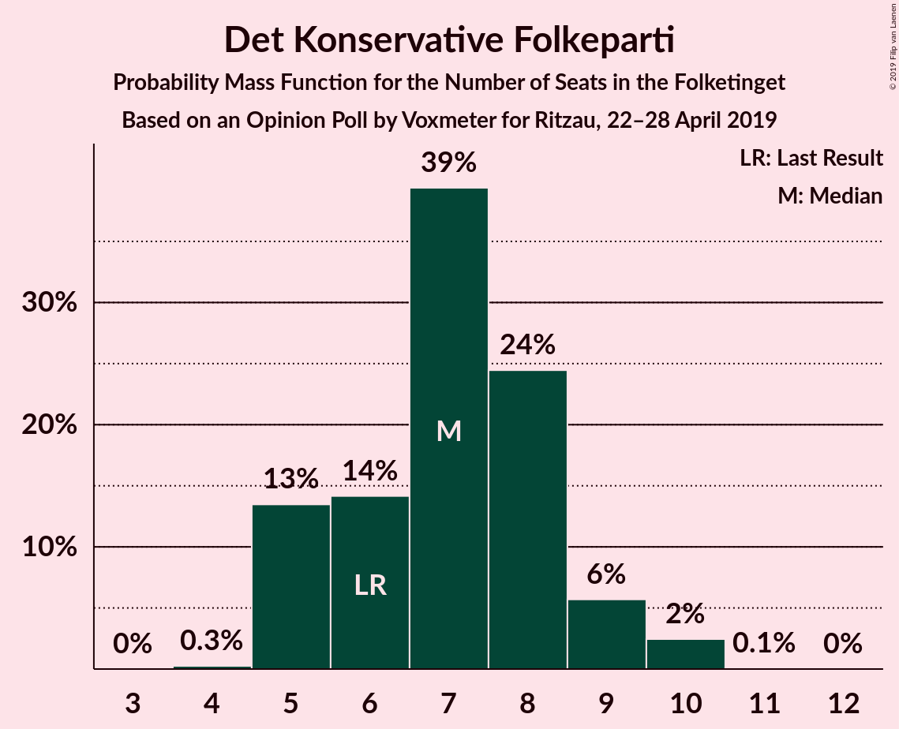
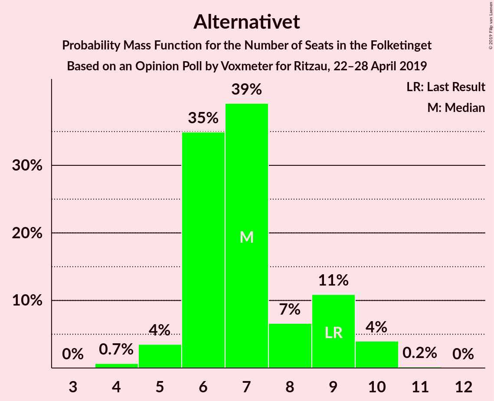
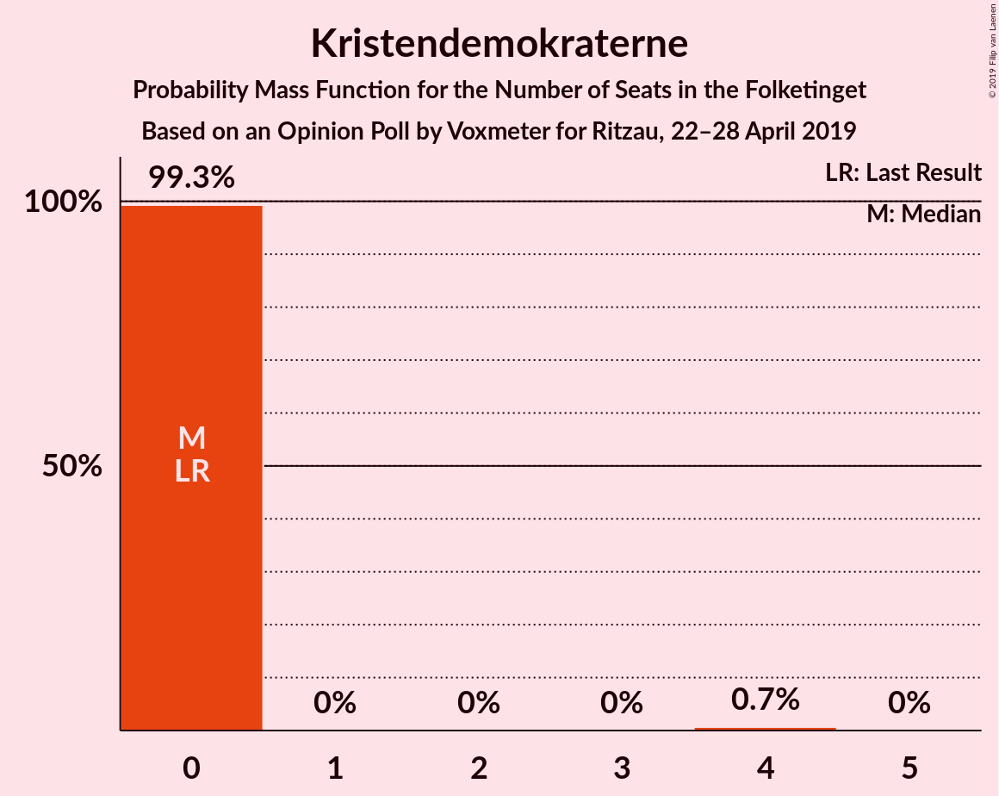
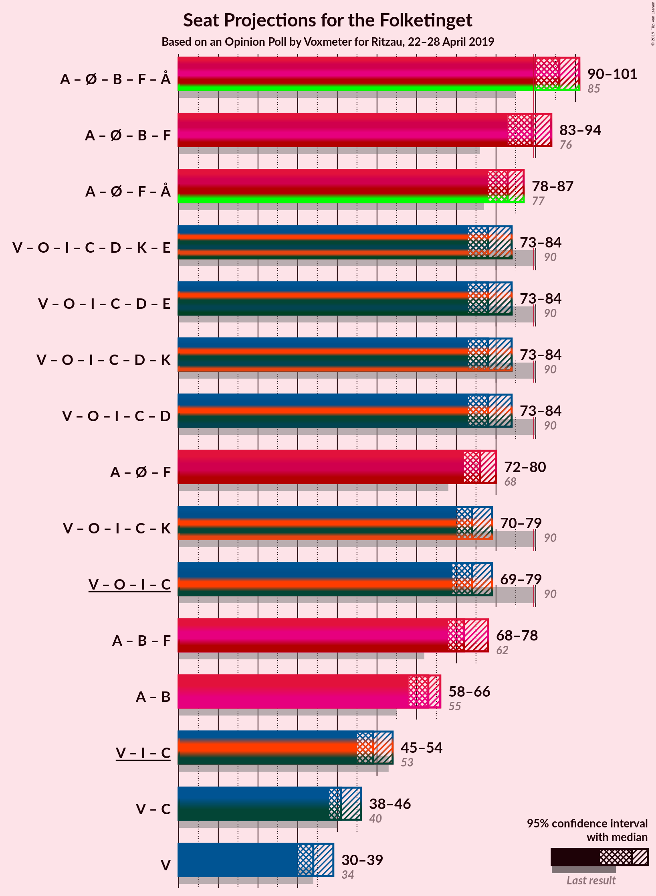
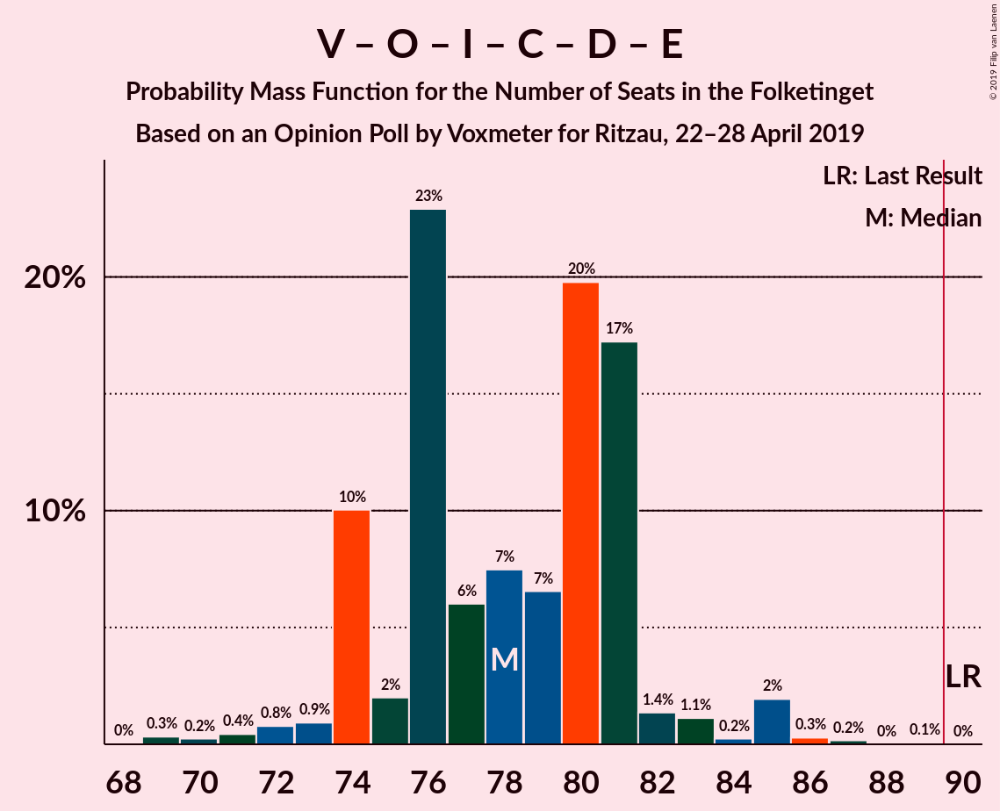
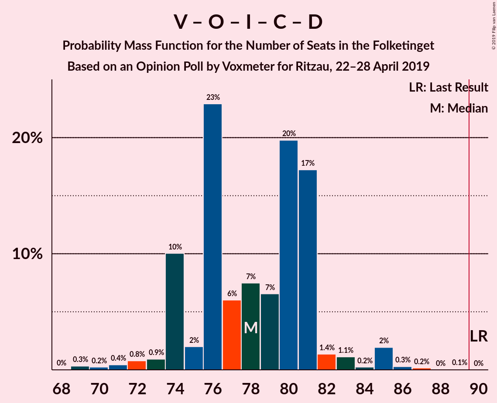
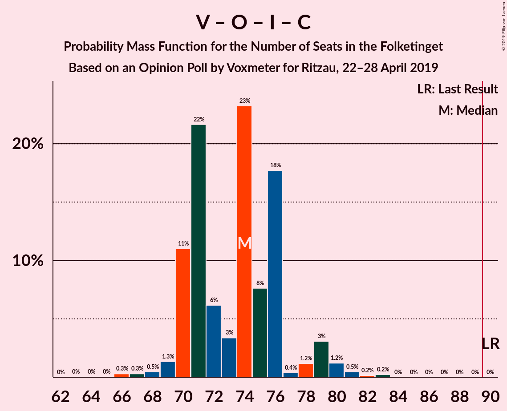
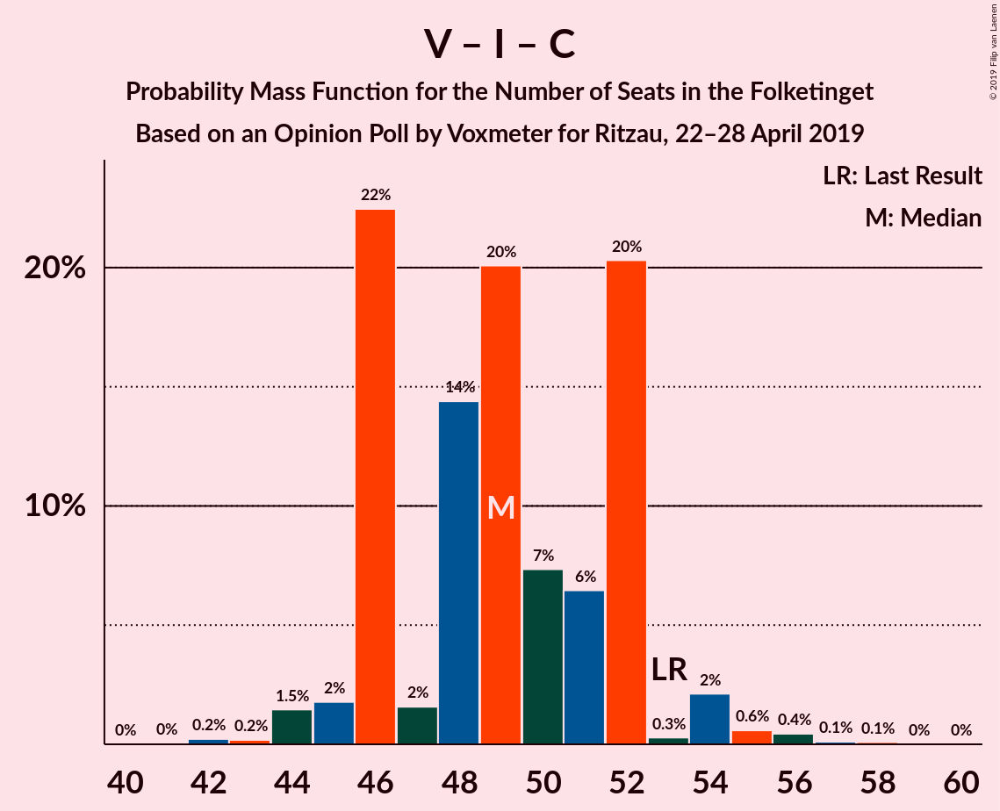

# Opinion Poll by Voxmeter for Ritzau, 22–28 April 2019

<a href="#voting-intentions">Voting Intentions</a> | <a href="#seats">Seats</a> | <a href="#coalitions">Coalitions</a> | <a href="#technical-information">Technical Information</a>

## Voting Intentions

### Confidence Intervals

| Party | Last Result | Poll Result | 80% Confidence Interval | 90% Confidence Interval | 95% Confidence Interval | 99% Confidence Interval |
|:-----:|:-----------:|:-----------:|:-----------------------:|:-----------------------:|:-----------------------:|:-----------------------:|
| Socialdemokraterne | 26.3% | 27.6% | 25.9–29.5% |25.4–30.0% |25.0–30.5% |24.1–31.4% |
| Venstre | 19.5% | 19.3% | 17.8–21.0% |17.3–21.4% |17.0–21.8% |16.3–22.6% |
| Dansk Folkeparti | 21.1% | 13.6% | 12.3–15.1% |11.9–15.5% |11.6–15.9% |11.1–16.6% |
| Enhedslisten–De Rød-Grønne | 7.8% | 9.3% | 8.2–10.6% |7.9–10.9% |7.7–11.2% |7.2–11.9% |
| Radikale Venstre | 4.6% | 7.6% | 6.7–8.8% |6.4–9.1% |6.2–9.4% |5.7–10.0% |
| Socialistisk Folkeparti | 4.2% | 5.6% | 4.8–6.6% |4.5–6.9% |4.3–7.2% |4.0–7.7% |
| Liberal Alliance | 7.5% | 4.2% | 3.5–5.1% |3.3–5.4% |3.1–5.6% |2.8–6.1% |
| Det Konservative Folkeparti | 3.4% | 3.8% | 3.2–4.7% |3.0–5.0% |2.8–5.2% |2.5–5.6% |
| Alternativet | 4.8% | 3.7% | 3.1–4.6% |2.9–4.8% |2.7–5.1% |2.4–5.5% |
| Nye Borgerlige | 0.0% | 2.5% | 2.0–3.3% |1.9–3.5% |1.7–3.7% |1.5–4.1% |
| Kristendemokraterne | 0.8% | 0.9% | 0.6–1.4% |0.5–1.5% |0.5–1.7% |0.4–2.0% |
| Klaus Riskær Pedersen | 0.0% | 0.2% | 0.1–0.5% |0.1–0.6% |0.0–0.7% |0.0–0.9% |

*Note:* The poll result column reflects the actual value used in the calculations. Published results may vary slightly, and in addition be rounded to fewer digits.

## Seats

### Confidence Intervals

| Party | Last Result | Median | 80% Confidence Interval | 90% Confidence Interval | 95% Confidence Interval | 99% Confidence Interval |
|:-----:|:-----------:|:------:|:-----------------------:|:-----------------------:|:-----------------------:|:-----------------------:|
| <a href="#socialdemokraterne">Socialdemokraterne</a> | 47 | 50 | 46–51 |46–52 |45–52 |44–58 |
| <a href="#venstre">Venstre</a> | 34 | 34 | 33–38 |31–38 |30–38 |29–40 |
| <a href="#dansk-folkeparti">Dansk Folkeparti</a> | 37 | 24 | 22–26 |22–26 |22–27 |20–30 |
| <a href="#enhedslisten–de-rød-grønne">Enhedslisten–De Rød-Grønne</a> | 14 | 17 | 15–20 |14–20 |14–20 |13–22 |
| <a href="#radikale-venstre">Radikale Venstre</a> | 8 | 14 | 11–15 |11–16 |10–16 |10–19 |
| <a href="#socialistisk-folkeparti">Socialistisk Folkeparti</a> | 7 | 10 | 9–12 |9–12 |8–13 |7–14 |
| <a href="#liberal-alliance">Liberal Alliance</a> | 13 | 7 | 7–9 |7–9 |6–9 |5–11 |
| <a href="#det-konservative-folkeparti">Det Konservative Folkeparti</a> | 6 | 7 | 5–8 |5–8 |5–9 |5–10 |
| <a href="#alternativet">Alternativet</a> | 9 | 7 | 6–9 |6–10 |5–10 |4–10 |
| <a href="#nye-borgerlige">Nye Borgerlige</a> | 0 | 5 | 4–5 |4–6 |0–7 |0–7 |
| <a href="#kristendemokraterne">Kristendemokraterne</a> | 0 | 0 | 0 |0 |0 |0–4 |
| <a href="#klaus-riskær-pedersen">Klaus Riskær Pedersen</a> | 0 | 0 | 0 |0 |0 |0 |

### Socialdemokraterne

*For a full overview of the results for this party, see the [Socialdemokraterne](party-socialdemokraterne.html) page.*

| Number of Seats | Probability | Accumulated | Special Marks |
|:---------------:|:-----------:|:-----------:|:-------------:|
| 42 | 0.2% | 100% |  |
| 43 | 0.2% | 99.8% |  |
| 44 | 2% | 99.5% |  |
| 45 | 1.0% | 98% |  |
| 46 | 20% | 97% |  |
| 47 | 10% | 77% | Last Result |
| 48 | 5% | 67% |  |
| 49 | 2% | 62% |  |
| 50 | 36% | 60% | Median |
| 51 | 18% | 24% |  |
| 52 | 3% | 6% |  |
| 53 | 0.3% | 2% |  |
| 54 | 0.7% | 2% |  |
| 55 | 0.4% | 1.3% |  |
| 56 | 0.1% | 0.9% |  |
| 57 | 0.2% | 0.7% |  |
| 58 | 0.4% | 0.5% |  |
| 59 | 0.1% | 0.1% |  |
| 60 | 0% | 0% |  |

### Venstre

*For a full overview of the results for this party, see the [Venstre](party-venstre.html) page.*

| Number of Seats | Probability | Accumulated | Special Marks |
|:---------------:|:-----------:|:-----------:|:-------------:|
| 28 | 0.2% | 100% |  |
| 29 | 0.4% | 99.7% |  |
| 30 | 4% | 99.3% |  |
| 31 | 4% | 95% |  |
| 32 | 2% | 92% |  |
| 33 | 19% | 90% |  |
| 34 | 23% | 71% | Last Result, Median |
| 35 | 5% | 48% |  |
| 36 | 8% | 43% |  |
| 37 | 2% | 35% |  |
| 38 | 32% | 32% |  |
| 39 | 0.1% | 0.7% |  |
| 40 | 0.2% | 0.6% |  |
| 41 | 0.3% | 0.4% |  |
| 42 | 0.1% | 0.1% |  |
| 43 | 0% | 0% |  |

### Dansk Folkeparti

*For a full overview of the results for this party, see the [Dansk Folkeparti](party-danskfolkeparti.html) page.*

| Number of Seats | Probability | Accumulated | Special Marks |
|:---------------:|:-----------:|:-----------:|:-------------:|
| 19 | 0.3% | 100% |  |
| 20 | 0.6% | 99.7% |  |
| 21 | 0.9% | 99.1% |  |
| 22 | 20% | 98% |  |
| 23 | 8% | 78% |  |
| 24 | 33% | 70% | Median |
| 25 | 24% | 36% |  |
| 26 | 9% | 13% |  |
| 27 | 1.3% | 3% |  |
| 28 | 1.0% | 2% |  |
| 29 | 0.1% | 0.9% |  |
| 30 | 0.8% | 0.8% |  |
| 31 | 0% | 0% |  |
| 32 | 0% | 0% |  |
| 33 | 0% | 0% |  |
| 34 | 0% | 0% |  |
| 35 | 0% | 0% |  |
| 36 | 0% | 0% |  |
| 37 | 0% | 0% | Last Result |

### Enhedslisten–De Rød-Grønne

*For a full overview of the results for this party, see the [Enhedslisten–De Rød-Grønne](party-enhedslisten–derød-grønne.html) page.*

| Number of Seats | Probability | Accumulated | Special Marks |
|:---------------:|:-----------:|:-----------:|:-------------:|
| 12 | 0% | 100% |  |
| 13 | 2% | 99.9% |  |
| 14 | 4% | 98% | Last Result |
| 15 | 7% | 95% |  |
| 16 | 22% | 87% |  |
| 17 | 37% | 65% | Median |
| 18 | 3% | 29% |  |
| 19 | 2% | 26% |  |
| 20 | 22% | 24% |  |
| 21 | 2% | 2% |  |
| 22 | 0.6% | 0.6% |  |
| 23 | 0% | 0% |  |

### Radikale Venstre

*For a full overview of the results for this party, see the [Radikale Venstre](party-radikalevenstre.html) page.*

| Number of Seats | Probability | Accumulated | Special Marks |
|:---------------:|:-----------:|:-----------:|:-------------:|
| 8 | 0% | 100% | Last Result |
| 9 | 0.1% | 100% |  |
| 10 | 3% | 99.9% |  |
| 11 | 32% | 97% |  |
| 12 | 4% | 65% |  |
| 13 | 6% | 61% |  |
| 14 | 30% | 55% | Median |
| 15 | 19% | 25% |  |
| 16 | 4% | 6% |  |
| 17 | 1.1% | 2% |  |
| 18 | 0.1% | 0.6% |  |
| 19 | 0.5% | 0.5% |  |
| 20 | 0% | 0% |  |

### Socialistisk Folkeparti

*For a full overview of the results for this party, see the [Socialistisk Folkeparti](party-socialistiskfolkeparti.html) page.*

| Number of Seats | Probability | Accumulated | Special Marks |
|:---------------:|:-----------:|:-----------:|:-------------:|
| 7 | 2% | 100% | Last Result |
| 8 | 1.3% | 98% |  |
| 9 | 10% | 97% |  |
| 10 | 62% | 87% | Median |
| 11 | 5% | 25% |  |
| 12 | 17% | 20% |  |
| 13 | 1.2% | 3% |  |
| 14 | 2% | 2% |  |
| 15 | 0% | 0% |  |

### Liberal Alliance

*For a full overview of the results for this party, see the [Liberal Alliance](party-liberalalliance.html) page.*

| Number of Seats | Probability | Accumulated | Special Marks |
|:---------------:|:-----------:|:-----------:|:-------------:|
| 5 | 0.7% | 100% |  |
| 6 | 4% | 99.2% |  |
| 7 | 56% | 95% | Median |
| 8 | 16% | 40% |  |
| 9 | 22% | 24% |  |
| 10 | 1.0% | 2% |  |
| 11 | 1.0% | 1.0% |  |
| 12 | 0% | 0% |  |
| 13 | 0% | 0% | Last Result |

### Det Konservative Folkeparti

*For a full overview of the results for this party, see the [Det Konservative Folkeparti](party-detkonservativefolkeparti.html) page.*

| Number of Seats | Probability | Accumulated | Special Marks |
|:---------------:|:-----------:|:-----------:|:-------------:|
| 4 | 0.3% | 100% |  |
| 5 | 22% | 99.7% |  |
| 6 | 22% | 78% | Last Result |
| 7 | 41% | 56% | Median |
| 8 | 10% | 15% |  |
| 9 | 3% | 5% |  |
| 10 | 2% | 2% |  |
| 11 | 0.1% | 0.1% |  |
| 12 | 0% | 0% |  |

### Alternativet

*For a full overview of the results for this party, see the [Alternativet](party-alternativet.html) page.*

| Number of Seats | Probability | Accumulated | Special Marks |
|:---------------:|:-----------:|:-----------:|:-------------:|
| 4 | 0.5% | 100% |  |
| 5 | 3% | 99.4% |  |
| 6 | 42% | 97% |  |
| 7 | 26% | 55% | Median |
| 8 | 1.3% | 29% |  |
| 9 | 21% | 27% | Last Result |
| 10 | 7% | 7% |  |
| 11 | 0% | 0% |  |

### Nye Borgerlige

*For a full overview of the results for this party, see the [Nye Borgerlige](party-nyeborgerlige.html) page.*

| Number of Seats | Probability | Accumulated | Special Marks |
|:---------------:|:-----------:|:-----------:|:-------------:|
| 0 | 5% | 100% | Last Result |
| 1 | 0% | 95% |  |
| 2 | 0% | 95% |  |
| 3 | 0% | 95% |  |
| 4 | 31% | 95% |  |
| 5 | 57% | 64% | Median |
| 6 | 5% | 7% |  |
| 7 | 2% | 3% |  |
| 8 | 0.1% | 0.1% |  |
| 9 | 0% | 0% |  |

### Kristendemokraterne

*For a full overview of the results for this party, see the [Kristendemokraterne](party-kristendemokraterne.html) page.*

| Number of Seats | Probability | Accumulated | Special Marks |
|:---------------:|:-----------:|:-----------:|:-------------:|
| 0 | 98.9% | 100% | Last Result, Median |
| 1 | 0% | 1.1% |  |
| 2 | 0% | 1.1% |  |
| 3 | 0.1% | 1.1% |  |
| 4 | 1.1% | 1.1% |  |
| 5 | 0% | 0% |  |

### Klaus Riskær Pedersen

*For a full overview of the results for this party, see the [Klaus Riskær Pedersen](party-klausriskærpedersen.html) page.*

| Number of Seats | Probability | Accumulated | Special Marks |
|:---------------:|:-----------:|:-----------:|:-------------:|
| 0 | 100% | 100% | Last Result, Median |

## Coalitions

### Confidence Intervals

| Coalition | Last Result | Median | Majority? | 80% Confidence Interval | 90% Confidence Interval | 95% Confidence Interval | 99% Confidence Interval |
|:---------:|:-----------:|:------:|:---------:|:-----------------------:|:-----------------------:|:-----------------------:|:-----------------------:|
| Socialdemokraterne – Enhedslisten–De Rød-Grønne – Radikale Venstre – Socialistisk Folkeparti – Alternativet | 85 | 96 | 99.5% | 94–101 | 93–101 | 92–101 | 90–104 |
| Socialdemokraterne – Enhedslisten–De Rød-Grønne – Radikale Venstre – Socialistisk Folkeparti | 76 | 89 | 48% | 86–94 | 86–94 | 85–94 | 82–97 |
| Socialdemokraterne – Enhedslisten–De Rød-Grønne – Socialistisk Folkeparti – Alternativet | 77 | 83 | 0.3% | 81–86 | 80–86 | 78–88 | 75–89 |
| Venstre – Dansk Folkeparti – Liberal Alliance – Det Konservative Folkeparti – Nye Borgerlige – Kristendemokraterne – Klaus Riskær Pedersen | 90 | 77 | 0% | 74–81 | 74–81 | 73–82 | 70–84 |
| Venstre – Dansk Folkeparti – Liberal Alliance – Det Konservative Folkeparti – Nye Borgerlige – Klaus Riskær Pedersen | 90 | 77 | 0% | 74–81 | 74–81 | 73–82 | 70–84 |
| Venstre – Dansk Folkeparti – Liberal Alliance – Det Konservative Folkeparti – Nye Borgerlige – Kristendemokraterne | 90 | 77 | 0% | 74–81 | 74–81 | 73–82 | 70–84 |
| Venstre – Dansk Folkeparti – Liberal Alliance – Det Konservative Folkeparti – Nye Borgerlige | 90 | 77 | 0% | 74–81 | 74–81 | 73–82 | 70–84 |
| Socialdemokraterne – Enhedslisten–De Rød-Grønne – Socialistisk Folkeparti | 68 | 77 | 0% | 72–79 | 72–79 | 72–81 | 69–82 |
| Socialdemokraterne – Radikale Venstre – Socialistisk Folkeparti | 62 | 71 | 0% | 70–78 | 70–78 | 68–79 | 66–82 |
| Venstre – Dansk Folkeparti – Liberal Alliance – Det Konservative Folkeparti – Kristendemokraterne | 90 | 73 | 0% | 70–76 | 70–76 | 70–78 | 66–81 |
| Venstre – Dansk Folkeparti – Liberal Alliance – Det Konservative Folkeparti | 90 | 73 | 0% | 70–76 | 70–76 | 70–78 | 66–81 |
| Socialdemokraterne – Radikale Venstre | 55 | 61 | 0% | 60–66 | 60–66 | 58–67 | 56–71 |
| Venstre – Liberal Alliance – Det Konservative Folkeparti | 53 | 49 | 0% | 46–52 | 46–52 | 45–52 | 44–55 |
| Venstre – Det Konservative Folkeparti | 40 | 41 | 0% | 39–45 | 38–45 | 37–45 | 36–47 |
| Venstre | 34 | 34 | 0% | 33–38 | 31–38 | 30–38 | 29–40 |

### Socialdemokraterne – Enhedslisten–De Rød-Grønne – Radikale Venstre – Socialistisk Folkeparti – Alternativet

| Number of Seats | Probability | Accumulated | Special Marks |
|:---------------:|:-----------:|:-----------:|:-------------:|
| 85 | 0% | 100% | Last Result |
| 86 | 0% | 100% |  |
| 87 | 0% | 100% |  |
| 88 | 0.3% | 99.9% |  |
| 89 | 0.1% | 99.6% |  |
| 90 | 0.4% | 99.5% | Majority |
| 91 | 0.4% | 99.1% |  |
| 92 | 2% | 98.7% |  |
| 93 | 3% | 97% |  |
| 94 | 34% | 93% |  |
| 95 | 4% | 59% |  |
| 96 | 7% | 55% |  |
| 97 | 2% | 48% |  |
| 98 | 4% | 46% | Median |
| 99 | 21% | 42% |  |
| 100 | 1.0% | 21% |  |
| 101 | 18% | 20% |  |
| 102 | 0.6% | 1.4% |  |
| 103 | 0.1% | 0.8% |  |
| 104 | 0.5% | 0.8% |  |
| 105 | 0.2% | 0.3% |  |
| 106 | 0% | 0.1% |  |
| 107 | 0% | 0.1% |  |
| 108 | 0% | 0.1% |  |
| 109 | 0.1% | 0.1% |  |
| 110 | 0% | 0% |  |

### Socialdemokraterne – Enhedslisten–De Rød-Grønne – Radikale Venstre – Socialistisk Folkeparti

| Number of Seats | Probability | Accumulated | Special Marks |
|:---------------:|:-----------:|:-----------:|:-------------:|
| 76 | 0% | 100% | Last Result |
| 77 | 0% | 100% |  |
| 78 | 0% | 100% |  |
| 79 | 0% | 100% |  |
| 80 | 0% | 100% |  |
| 81 | 0% | 100% |  |
| 82 | 0.6% | 99.9% |  |
| 83 | 0.1% | 99.3% |  |
| 84 | 0.4% | 99.2% |  |
| 85 | 1.5% | 98.9% |  |
| 86 | 8% | 97% |  |
| 87 | 2% | 89% |  |
| 88 | 35% | 87% |  |
| 89 | 4% | 52% |  |
| 90 | 22% | 48% | Majority |
| 91 | 2% | 27% | Median |
| 92 | 3% | 24% |  |
| 93 | 1.4% | 21% |  |
| 94 | 18% | 20% |  |
| 95 | 0.5% | 2% |  |
| 96 | 0.2% | 1.0% |  |
| 97 | 0.5% | 0.8% |  |
| 98 | 0.2% | 0.3% |  |
| 99 | 0% | 0.1% |  |
| 100 | 0% | 0.1% |  |
| 101 | 0% | 0.1% |  |
| 102 | 0.1% | 0.1% |  |
| 103 | 0% | 0% |  |

### Socialdemokraterne – Enhedslisten–De Rød-Grønne – Socialistisk Folkeparti – Alternativet

| Number of Seats | Probability | Accumulated | Special Marks |
|:---------------:|:-----------:|:-----------:|:-------------:|
| 74 | 0% | 100% |  |
| 75 | 0.4% | 99.9% |  |
| 76 | 0.2% | 99.5% |  |
| 77 | 0.4% | 99.3% | Last Result |
| 78 | 2% | 98.9% |  |
| 79 | 1.4% | 97% |  |
| 80 | 4% | 95% |  |
| 81 | 4% | 92% |  |
| 82 | 9% | 88% |  |
| 83 | 33% | 79% |  |
| 84 | 2% | 46% | Median |
| 85 | 22% | 44% |  |
| 86 | 17% | 22% |  |
| 87 | 2% | 4% |  |
| 88 | 2% | 3% |  |
| 89 | 0.5% | 0.8% |  |
| 90 | 0.2% | 0.3% | Majority |
| 91 | 0% | 0.1% |  |
| 92 | 0% | 0.1% |  |
| 93 | 0% | 0.1% |  |
| 94 | 0.1% | 0.1% |  |
| 95 | 0% | 0% |  |

### Venstre – Dansk Folkeparti – Liberal Alliance – Det Konservative Folkeparti – Nye Borgerlige – Kristendemokraterne – Klaus Riskær Pedersen

| Number of Seats | Probability | Accumulated | Special Marks |
|:---------------:|:-----------:|:-----------:|:-------------:|
| 66 | 0.1% | 100% |  |
| 67 | 0% | 99.9% |  |
| 68 | 0% | 99.9% |  |
| 69 | 0% | 99.9% |  |
| 70 | 0.4% | 99.9% |  |
| 71 | 0.6% | 99.5% |  |
| 72 | 1.1% | 98.8% |  |
| 73 | 0.6% | 98% |  |
| 74 | 19% | 97% |  |
| 75 | 1.1% | 78% |  |
| 76 | 23% | 77% |  |
| 77 | 4% | 53% | Median |
| 78 | 2% | 49% |  |
| 79 | 7% | 47% |  |
| 80 | 2% | 40% |  |
| 81 | 33% | 38% |  |
| 82 | 3% | 5% |  |
| 83 | 1.2% | 2% |  |
| 84 | 0.4% | 0.8% |  |
| 85 | 0.1% | 0.4% |  |
| 86 | 0% | 0.4% |  |
| 87 | 0.3% | 0.3% |  |
| 88 | 0% | 0% |  |
| 89 | 0% | 0% |  |
| 90 | 0% | 0% | Last Result, Majority |

### Venstre – Dansk Folkeparti – Liberal Alliance – Det Konservative Folkeparti – Nye Borgerlige – Klaus Riskær Pedersen

| Number of Seats | Probability | Accumulated | Special Marks |
|:---------------:|:-----------:|:-----------:|:-------------:|
| 66 | 0.1% | 100% |  |
| 67 | 0% | 99.9% |  |
| 68 | 0% | 99.9% |  |
| 69 | 0% | 99.9% |  |
| 70 | 0.4% | 99.9% |  |
| 71 | 0.6% | 99.5% |  |
| 72 | 1.1% | 98.8% |  |
| 73 | 0.6% | 98% |  |
| 74 | 19% | 97% |  |
| 75 | 1.2% | 78% |  |
| 76 | 23% | 77% |  |
| 77 | 4% | 53% | Median |
| 78 | 3% | 49% |  |
| 79 | 7% | 46% |  |
| 80 | 2% | 39% |  |
| 81 | 33% | 37% |  |
| 82 | 2% | 4% |  |
| 83 | 1.2% | 2% |  |
| 84 | 0.4% | 0.8% |  |
| 85 | 0.1% | 0.4% |  |
| 86 | 0% | 0.4% |  |
| 87 | 0.3% | 0.3% |  |
| 88 | 0% | 0% |  |
| 89 | 0% | 0% |  |
| 90 | 0% | 0% | Last Result, Majority |

### Venstre – Dansk Folkeparti – Liberal Alliance – Det Konservative Folkeparti – Nye Borgerlige – Kristendemokraterne

| Number of Seats | Probability | Accumulated | Special Marks |
|:---------------:|:-----------:|:-----------:|:-------------:|
| 66 | 0.1% | 100% |  |
| 67 | 0% | 99.9% |  |
| 68 | 0% | 99.9% |  |
| 69 | 0% | 99.9% |  |
| 70 | 0.4% | 99.9% |  |
| 71 | 0.6% | 99.5% |  |
| 72 | 1.1% | 98.8% |  |
| 73 | 0.6% | 98% |  |
| 74 | 19% | 97% |  |
| 75 | 1.1% | 78% |  |
| 76 | 23% | 77% |  |
| 77 | 4% | 53% | Median |
| 78 | 2% | 49% |  |
| 79 | 7% | 47% |  |
| 80 | 2% | 40% |  |
| 81 | 33% | 38% |  |
| 82 | 3% | 5% |  |
| 83 | 1.2% | 2% |  |
| 84 | 0.4% | 0.8% |  |
| 85 | 0.1% | 0.4% |  |
| 86 | 0% | 0.4% |  |
| 87 | 0.3% | 0.3% |  |
| 88 | 0% | 0% |  |
| 89 | 0% | 0% |  |
| 90 | 0% | 0% | Last Result, Majority |

### Venstre – Dansk Folkeparti – Liberal Alliance – Det Konservative Folkeparti – Nye Borgerlige

| Number of Seats | Probability | Accumulated | Special Marks |
|:---------------:|:-----------:|:-----------:|:-------------:|
| 66 | 0.1% | 100% |  |
| 67 | 0% | 99.9% |  |
| 68 | 0% | 99.9% |  |
| 69 | 0% | 99.9% |  |
| 70 | 0.4% | 99.9% |  |
| 71 | 0.6% | 99.5% |  |
| 72 | 1.1% | 98.8% |  |
| 73 | 0.6% | 98% |  |
| 74 | 19% | 97% |  |
| 75 | 1.2% | 78% |  |
| 76 | 23% | 77% |  |
| 77 | 4% | 53% | Median |
| 78 | 3% | 49% |  |
| 79 | 7% | 46% |  |
| 80 | 2% | 39% |  |
| 81 | 33% | 37% |  |
| 82 | 2% | 4% |  |
| 83 | 1.2% | 2% |  |
| 84 | 0.4% | 0.8% |  |
| 85 | 0.1% | 0.4% |  |
| 86 | 0% | 0.4% |  |
| 87 | 0.3% | 0.3% |  |
| 88 | 0% | 0% |  |
| 89 | 0% | 0% |  |
| 90 | 0% | 0% | Last Result, Majority |

### Socialdemokraterne – Enhedslisten–De Rød-Grønne – Socialistisk Folkeparti

| Number of Seats | Probability | Accumulated | Special Marks |
|:---------------:|:-----------:|:-----------:|:-------------:|
| 68 | 0.1% | 100% | Last Result |
| 69 | 0.5% | 99.9% |  |
| 70 | 0.3% | 99.4% |  |
| 71 | 0.7% | 99.1% |  |
| 72 | 9% | 98% |  |
| 73 | 2% | 89% |  |
| 74 | 5% | 88% |  |
| 75 | 2% | 83% |  |
| 76 | 20% | 81% |  |
| 77 | 34% | 61% | Median |
| 78 | 4% | 27% |  |
| 79 | 20% | 23% |  |
| 80 | 0.9% | 3% |  |
| 81 | 2% | 3% |  |
| 82 | 0.2% | 0.6% |  |
| 83 | 0.1% | 0.3% |  |
| 84 | 0.1% | 0.3% |  |
| 85 | 0.1% | 0.1% |  |
| 86 | 0% | 0.1% |  |
| 87 | 0.1% | 0.1% |  |
| 88 | 0% | 0% |  |

### Socialdemokraterne – Radikale Venstre – Socialistisk Folkeparti

| Number of Seats | Probability | Accumulated | Special Marks |
|:---------------:|:-----------:|:-----------:|:-------------:|
| 62 | 0% | 100% | Last Result |
| 63 | 0% | 100% |  |
| 64 | 0% | 100% |  |
| 65 | 0.3% | 100% |  |
| 66 | 0.3% | 99.7% |  |
| 67 | 0.3% | 99.4% |  |
| 68 | 2% | 99.1% |  |
| 69 | 0.9% | 97% |  |
| 70 | 22% | 96% |  |
| 71 | 39% | 74% |  |
| 72 | 7% | 35% |  |
| 73 | 5% | 28% |  |
| 74 | 0.6% | 23% | Median |
| 75 | 0.7% | 22% |  |
| 76 | 0.5% | 21% |  |
| 77 | 0.5% | 21% |  |
| 78 | 18% | 20% |  |
| 79 | 0.8% | 3% |  |
| 80 | 0.9% | 2% |  |
| 81 | 0.2% | 0.9% |  |
| 82 | 0.5% | 0.6% |  |
| 83 | 0.1% | 0.1% |  |
| 84 | 0% | 0% |  |

### Venstre – Dansk Folkeparti – Liberal Alliance – Det Konservative Folkeparti – Kristendemokraterne

| Number of Seats | Probability | Accumulated | Special Marks |
|:---------------:|:-----------:|:-----------:|:-------------:|
| 65 | 0% | 100% |  |
| 66 | 0.5% | 99.9% |  |
| 67 | 0.3% | 99.5% |  |
| 68 | 0.4% | 99.1% |  |
| 69 | 0.8% | 98.7% |  |
| 70 | 20% | 98% |  |
| 71 | 21% | 78% |  |
| 72 | 4% | 56% | Median |
| 73 | 3% | 52% |  |
| 74 | 0.6% | 49% |  |
| 75 | 9% | 48% |  |
| 76 | 35% | 39% |  |
| 77 | 0.5% | 5% |  |
| 78 | 3% | 4% |  |
| 79 | 0.7% | 1.5% |  |
| 80 | 0.1% | 0.7% |  |
| 81 | 0.2% | 0.6% |  |
| 82 | 0.1% | 0.4% |  |
| 83 | 0.3% | 0.3% |  |
| 84 | 0% | 0% |  |
| 85 | 0% | 0% |  |
| 86 | 0% | 0% |  |
| 87 | 0% | 0% |  |
| 88 | 0% | 0% |  |
| 89 | 0% | 0% |  |
| 90 | 0% | 0% | Last Result, Majority |

### Venstre – Dansk Folkeparti – Liberal Alliance – Det Konservative Folkeparti

| Number of Seats | Probability | Accumulated | Special Marks |
|:---------------:|:-----------:|:-----------:|:-------------:|
| 65 | 0% | 100% |  |
| 66 | 0.5% | 99.9% |  |
| 67 | 0.4% | 99.4% |  |
| 68 | 0.4% | 99.1% |  |
| 69 | 0.8% | 98.7% |  |
| 70 | 20% | 98% |  |
| 71 | 21% | 78% |  |
| 72 | 4% | 56% | Median |
| 73 | 3% | 52% |  |
| 74 | 2% | 49% |  |
| 75 | 9% | 47% |  |
| 76 | 35% | 38% |  |
| 77 | 0.4% | 4% |  |
| 78 | 2% | 3% |  |
| 79 | 0.7% | 1.4% |  |
| 80 | 0.1% | 0.7% |  |
| 81 | 0.2% | 0.6% |  |
| 82 | 0.1% | 0.4% |  |
| 83 | 0.3% | 0.3% |  |
| 84 | 0% | 0% |  |
| 85 | 0% | 0% |  |
| 86 | 0% | 0% |  |
| 87 | 0% | 0% |  |
| 88 | 0% | 0% |  |
| 89 | 0% | 0% |  |
| 90 | 0% | 0% | Last Result, Majority |

### Socialdemokraterne – Radikale Venstre

| Number of Seats | Probability | Accumulated | Special Marks |
|:---------------:|:-----------:|:-----------:|:-------------:|
| 54 | 0% | 100% |  |
| 55 | 0.2% | 99.9% | Last Result |
| 56 | 0.4% | 99.8% |  |
| 57 | 2% | 99.4% |  |
| 58 | 0.5% | 98% |  |
| 59 | 1.3% | 97% |  |
| 60 | 20% | 96% |  |
| 61 | 40% | 76% |  |
| 62 | 7% | 36% |  |
| 63 | 4% | 29% |  |
| 64 | 4% | 25% | Median |
| 65 | 1.3% | 22% |  |
| 66 | 18% | 20% |  |
| 67 | 0.4% | 3% |  |
| 68 | 0.5% | 2% |  |
| 69 | 0.1% | 2% |  |
| 70 | 0.5% | 2% |  |
| 71 | 0.8% | 1.1% |  |
| 72 | 0.1% | 0.3% |  |
| 73 | 0.2% | 0.2% |  |
| 74 | 0% | 0% |  |

### Venstre – Liberal Alliance – Det Konservative Folkeparti

| Number of Seats | Probability | Accumulated | Special Marks |
|:---------------:|:-----------:|:-----------:|:-------------:|
| 41 | 0% | 100% |  |
| 42 | 0.2% | 99.9% |  |
| 43 | 0.2% | 99.7% |  |
| 44 | 1.0% | 99.5% |  |
| 45 | 3% | 98.5% |  |
| 46 | 22% | 95% |  |
| 47 | 0.8% | 73% |  |
| 48 | 22% | 72% | Median |
| 49 | 4% | 51% |  |
| 50 | 3% | 46% |  |
| 51 | 3% | 43% |  |
| 52 | 38% | 40% |  |
| 53 | 0.2% | 2% | Last Result |
| 54 | 0.6% | 2% |  |
| 55 | 0.6% | 1.1% |  |
| 56 | 0.4% | 0.5% |  |
| 57 | 0.1% | 0.1% |  |
| 58 | 0% | 0% |  |

### Venstre – Det Konservative Folkeparti

| Number of Seats | Probability | Accumulated | Special Marks |
|:---------------:|:-----------:|:-----------:|:-------------:|
| 34 | 0.1% | 100% |  |
| 35 | 0.2% | 99.9% |  |
| 36 | 0.4% | 99.7% |  |
| 37 | 3% | 99.2% |  |
| 38 | 4% | 97% |  |
| 39 | 37% | 93% |  |
| 40 | 4% | 56% | Last Result |
| 41 | 3% | 52% | Median |
| 42 | 6% | 49% |  |
| 43 | 3% | 43% |  |
| 44 | 7% | 40% |  |
| 45 | 31% | 32% |  |
| 46 | 0.7% | 1.3% |  |
| 47 | 0.2% | 0.6% |  |
| 48 | 0% | 0.4% |  |
| 49 | 0.4% | 0.4% |  |
| 50 | 0% | 0% |  |

### Venstre

| Number of Seats | Probability | Accumulated | Special Marks |
|:---------------:|:-----------:|:-----------:|:-------------:|
| 28 | 0.2% | 100% |  |
| 29 | 0.4% | 99.7% |  |
| 30 | 4% | 99.3% |  |
| 31 | 4% | 95% |  |
| 32 | 2% | 92% |  |
| 33 | 19% | 90% |  |
| 34 | 23% | 71% | Last Result, Median |
| 35 | 5% | 48% |  |
| 36 | 8% | 43% |  |
| 37 | 2% | 35% |  |
| 38 | 32% | 32% |  |
| 39 | 0.1% | 0.7% |  |
| 40 | 0.2% | 0.6% |  |
| 41 | 0.3% | 0.4% |  |
| 42 | 0.1% | 0.1% |  |
| 43 | 0% | 0% |  |

## Technical Information

### Opinion Poll

+ **Polling firm:** Voxmeter
+ **Commissioner(s):** Ritzau
+ **Fieldwork period:** 22–28 April 2019

### Calculations

+ **Sample size:** 1021
+ **Simulations done:** 524,288
+ **Error estimate:** 3.06%

