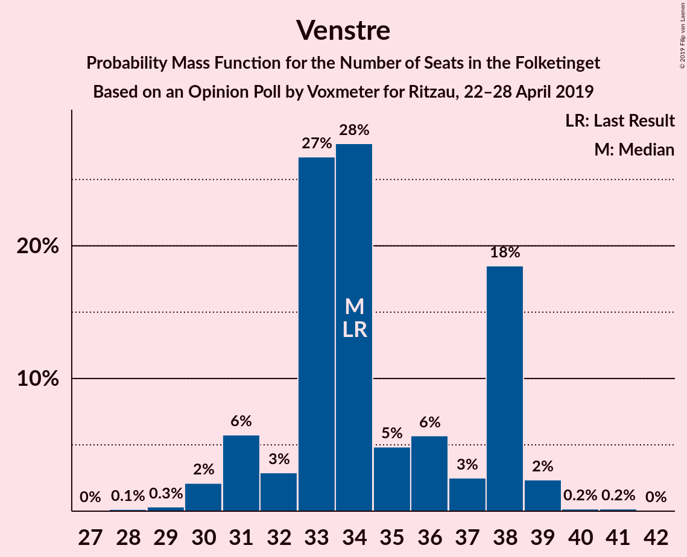
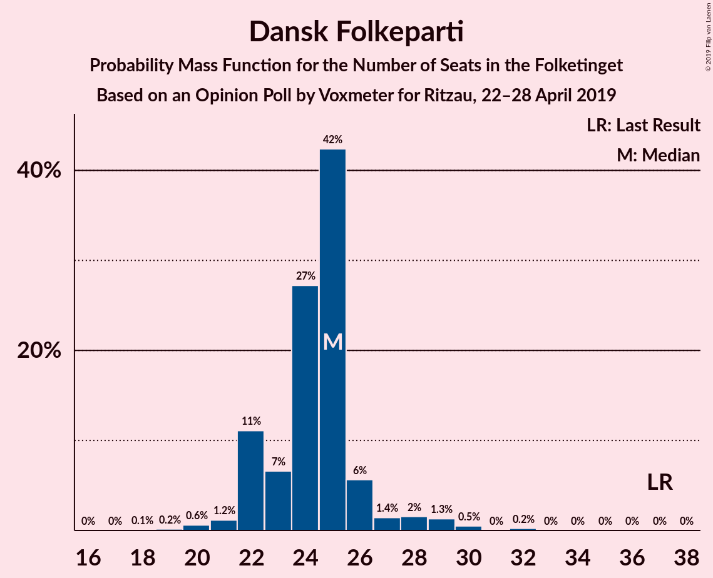
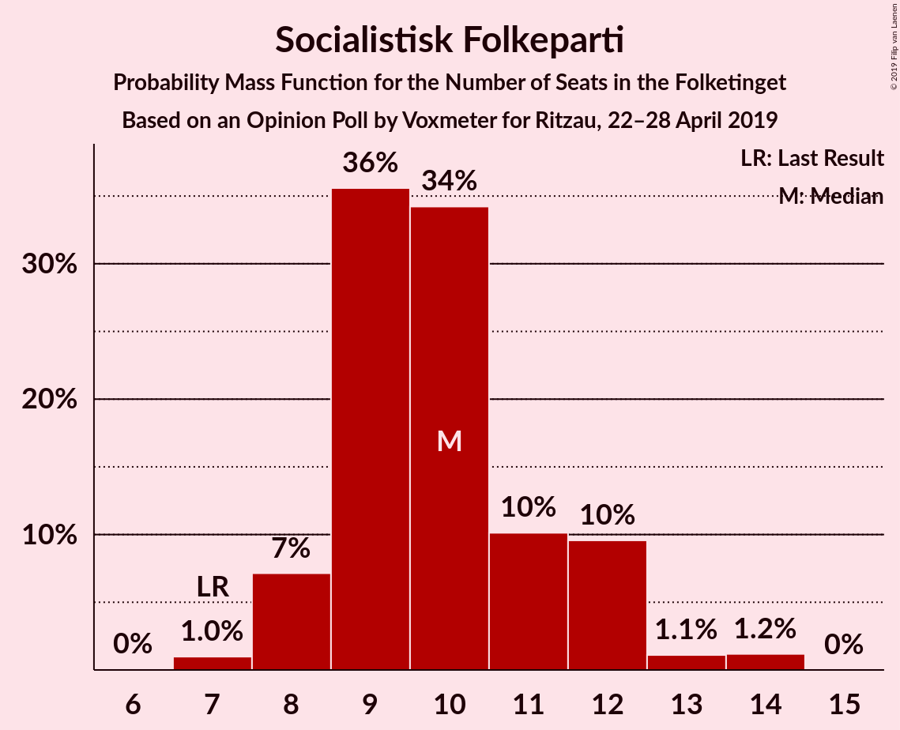
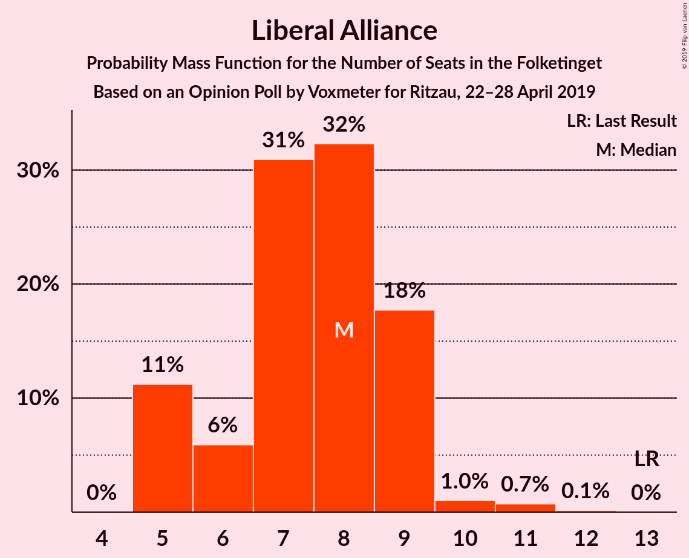
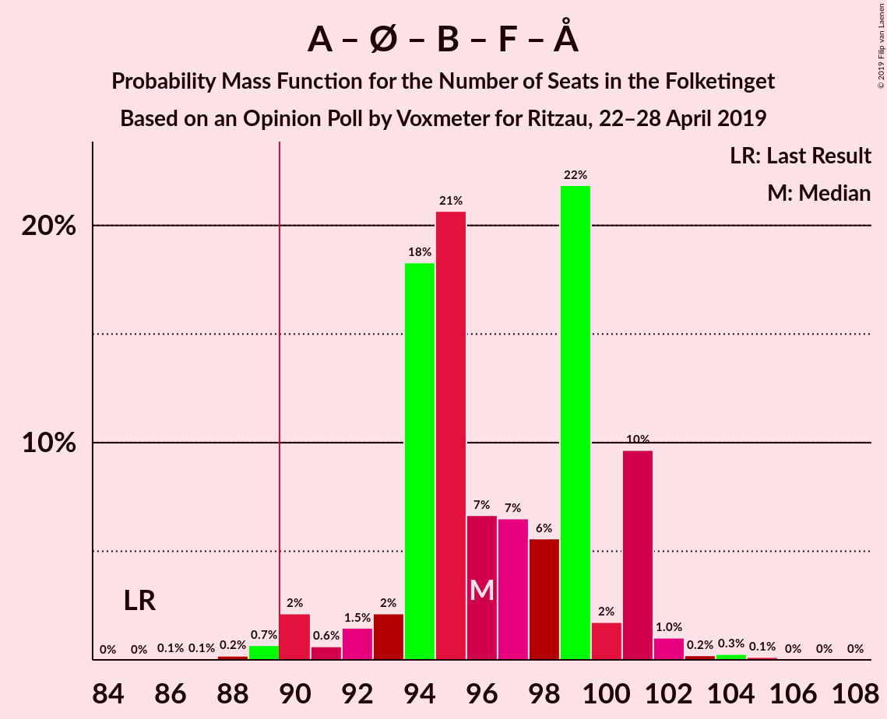
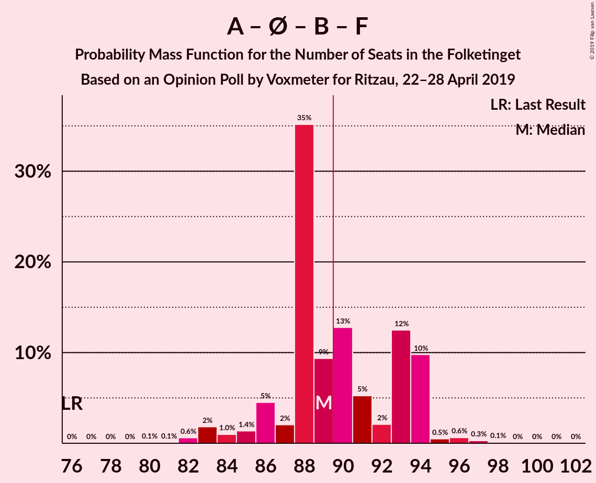
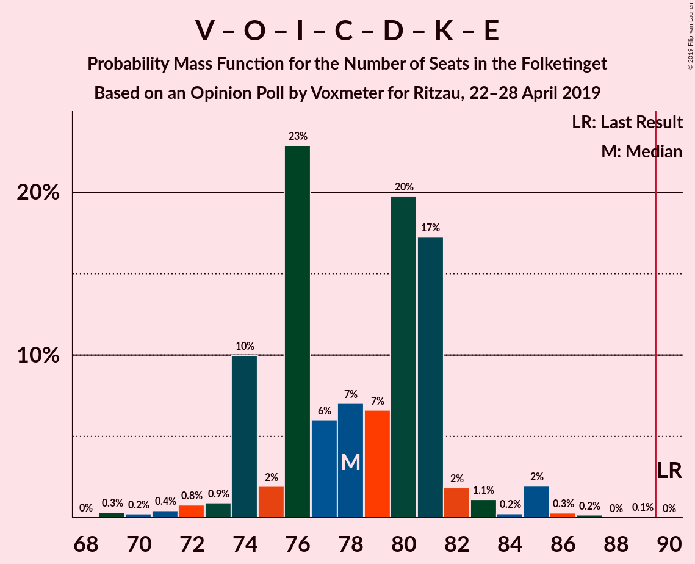
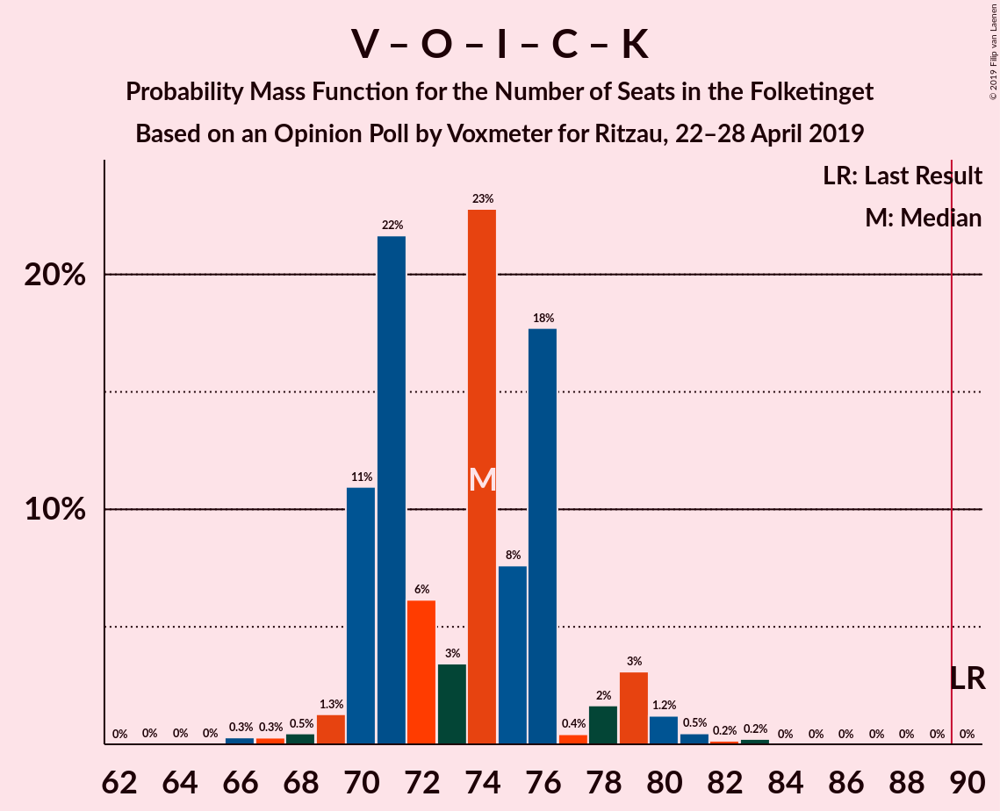
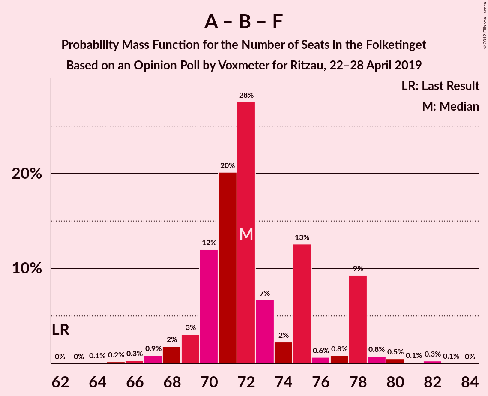

# Opinion Poll by Voxmeter for Ritzau, 22–28 April 2019

<a href="#voting-intentions">Voting Intentions</a> | <a href="#seats">Seats</a> | <a href="#coalitions">Coalitions</a> | <a href="#technical-information">Technical Information</a>

## Voting Intentions

### Confidence Intervals

| Party | Last Result | Poll Result | 80% Confidence Interval | 90% Confidence Interval | 95% Confidence Interval | 99% Confidence Interval |
|:-----:|:-----------:|:-----------:|:-----------------------:|:-----------------------:|:-----------------------:|:-----------------------:|
| Socialdemokraterne | 26.3% | 27.6% | 25.9–29.5% |25.4–30.0% |25.0–30.5% |24.1–31.4% |
| Venstre | 19.5% | 19.3% | 17.8–21.0% |17.3–21.4% |17.0–21.8% |16.3–22.6% |
| Dansk Folkeparti | 21.1% | 13.6% | 12.3–15.1% |11.9–15.5% |11.6–15.9% |11.1–16.6% |
| Enhedslisten–De Rød-Grønne | 7.8% | 9.3% | 8.2–10.6% |7.9–10.9% |7.7–11.2% |7.2–11.9% |
| Radikale Venstre | 4.6% | 7.6% | 6.7–8.8% |6.4–9.1% |6.2–9.4% |5.7–10.0% |
| Socialistisk Folkeparti | 4.2% | 5.6% | 4.8–6.6% |4.5–6.9% |4.3–7.2% |4.0–7.7% |
| Liberal Alliance | 7.5% | 4.2% | 3.5–5.1% |3.3–5.4% |3.1–5.6% |2.8–6.1% |
| Det Konservative Folkeparti | 3.4% | 3.8% | 3.2–4.7% |3.0–5.0% |2.8–5.2% |2.5–5.6% |
| Alternativet | 4.8% | 3.7% | 3.1–4.6% |2.9–4.8% |2.7–5.1% |2.4–5.5% |
| Nye Borgerlige | 0.0% | 2.5% | 2.0–3.3% |1.9–3.5% |1.7–3.7% |1.5–4.1% |
| Kristendemokraterne | 0.8% | 0.9% | 0.6–1.4% |0.5–1.5% |0.5–1.7% |0.4–2.0% |
| Klaus Riskær Pedersen | 0.0% | 0.2% | 0.1–0.5% |0.1–0.6% |0.0–0.7% |0.0–0.9% |

*Note:* The poll result column reflects the actual value used in the calculations. Published results may vary slightly, and in addition be rounded to fewer digits.

## Seats

### Confidence Intervals

| Party | Last Result | Median | 80% Confidence Interval | 90% Confidence Interval | 95% Confidence Interval | 99% Confidence Interval |
|:-----:|:-----------:|:------:|:-----------------------:|:-----------------------:|:-----------------------:|:-----------------------:|
| <a href="#socialdemokraterne">Socialdemokraterne</a> | 47 | 50 | 46–51 |46–52 |45–52 |43–56 |
| <a href="#venstre">Venstre</a> | 34 | 34 | 32–38 |31–38 |30–39 |29–39 |
| <a href="#dansk-folkeparti">Dansk Folkeparti</a> | 37 | 25 | 22–26 |22–27 |22–28 |20–30 |
| <a href="#enhedslisten–de-rød-grønne">Enhedslisten–De Rød-Grønne</a> | 14 | 17 | 15–20 |14–20 |14–20 |13–21 |
| <a href="#radikale-venstre">Radikale Venstre</a> | 8 | 14 | 11–15 |11–15 |10–16 |10–17 |
| <a href="#socialistisk-folkeparti">Socialistisk Folkeparti</a> | 7 | 10 | 9–12 |8–12 |8–12 |7–14 |
| <a href="#liberal-alliance">Liberal Alliance</a> | 13 | 8 | 5–9 |5–9 |5–9 |5–11 |
| <a href="#det-konservative-folkeparti">Det Konservative Folkeparti</a> | 6 | 7 | 5–8 |5–9 |5–10 |5–10 |
| <a href="#alternativet">Alternativet</a> | 9 | 7 | 6–9 |6–9 |5–10 |4–10 |
| <a href="#nye-borgerlige">Nye Borgerlige</a> | 0 | 5 | 4–6 |0–6 |0–7 |0–7 |
| <a href="#kristendemokraterne">Kristendemokraterne</a> | 0 | 0 | 0 |0 |0 |0–4 |
| <a href="#klaus-riskær-pedersen">Klaus Riskær Pedersen</a> | 0 | 0 | 0 |0 |0 |0 |

### Socialdemokraterne

*For a full overview of the results for this party, see the [Socialdemokraterne](party-socialdemokraterne.html) page.*

| Number of Seats | Probability | Accumulated | Special Marks |
|:---------------:|:-----------:|:-----------:|:-------------:|
| 42 | 0.2% | 100% |  |
| 43 | 0.5% | 99.7% |  |
| 44 | 2% | 99.2% |  |
| 45 | 2% | 98% |  |
| 46 | 11% | 96% |  |
| 47 | 6% | 85% | Last Result |
| 48 | 7% | 80% |  |
| 49 | 19% | 73% |  |
| 50 | 22% | 54% | Median |
| 51 | 26% | 32% |  |
| 52 | 4% | 6% |  |
| 53 | 0.3% | 2% |  |
| 54 | 0.4% | 2% |  |
| 55 | 0.4% | 1.2% |  |
| 56 | 0.4% | 0.8% |  |
| 57 | 0.1% | 0.4% |  |
| 58 | 0.2% | 0.3% |  |
| 59 | 0% | 0% |  |

### Venstre

*For a full overview of the results for this party, see the [Venstre](party-venstre.html) page.*

| Number of Seats | Probability | Accumulated | Special Marks |
|:---------------:|:-----------:|:-----------:|:-------------:|
| 28 | 0.1% | 100% |  |
| 29 | 0.3% | 99.8% |  |
| 30 | 2% | 99.5% |  |
| 31 | 6% | 97% |  |
| 32 | 3% | 92% |  |
| 33 | 27% | 89% |  |
| 34 | 28% | 62% | Last Result, Median |
| 35 | 5% | 34% |  |
| 36 | 6% | 29% |  |
| 37 | 3% | 24% |  |
| 38 | 18% | 21% |  |
| 39 | 2% | 3% |  |
| 40 | 0.2% | 0.4% |  |
| 41 | 0.2% | 0.2% |  |
| 42 | 0% | 0% |  |

### Dansk Folkeparti

*For a full overview of the results for this party, see the [Dansk Folkeparti](party-danskfolkeparti.html) page.*

| Number of Seats | Probability | Accumulated | Special Marks |
|:---------------:|:-----------:|:-----------:|:-------------:|
| 18 | 0.1% | 100% |  |
| 19 | 0.2% | 99.9% |  |
| 20 | 0.6% | 99.7% |  |
| 21 | 1.2% | 99.1% |  |
| 22 | 11% | 98% |  |
| 23 | 7% | 87% |  |
| 24 | 27% | 80% |  |
| 25 | 42% | 53% | Median |
| 26 | 6% | 11% |  |
| 27 | 1.4% | 5% |  |
| 28 | 2% | 4% |  |
| 29 | 1.3% | 2% |  |
| 30 | 0.5% | 0.8% |  |
| 31 | 0% | 0.3% |  |
| 32 | 0.2% | 0.2% |  |
| 33 | 0% | 0% |  |
| 34 | 0% | 0% |  |
| 35 | 0% | 0% |  |
| 36 | 0% | 0% |  |
| 37 | 0% | 0% | Last Result |

### Enhedslisten–De Rød-Grønne

*For a full overview of the results for this party, see the [Enhedslisten–De Rød-Grønne](party-enhedslisten–derød-grønne.html) page.*

| Number of Seats | Probability | Accumulated | Special Marks |
|:---------------:|:-----------:|:-----------:|:-------------:|
| 12 | 0.1% | 100% |  |
| 13 | 0.9% | 99.9% |  |
| 14 | 5% | 99.0% | Last Result |
| 15 | 6% | 94% |  |
| 16 | 29% | 88% |  |
| 17 | 25% | 58% | Median |
| 18 | 18% | 34% |  |
| 19 | 3% | 16% |  |
| 20 | 11% | 13% |  |
| 21 | 1.4% | 2% |  |
| 22 | 0.3% | 0.3% |  |
| 23 | 0% | 0% |  |

### Radikale Venstre

*For a full overview of the results for this party, see the [Radikale Venstre](party-radikalevenstre.html) page.*

| Number of Seats | Probability | Accumulated | Special Marks |
|:---------------:|:-----------:|:-----------:|:-------------:|
| 8 | 0% | 100% | Last Result |
| 9 | 0.1% | 100% |  |
| 10 | 3% | 99.9% |  |
| 11 | 17% | 97% |  |
| 12 | 6% | 80% |  |
| 13 | 11% | 73% |  |
| 14 | 36% | 62% | Median |
| 15 | 21% | 26% |  |
| 16 | 3% | 5% |  |
| 17 | 0.8% | 1.3% |  |
| 18 | 0.2% | 0.5% |  |
| 19 | 0.3% | 0.3% |  |
| 20 | 0% | 0% |  |

### Socialistisk Folkeparti

*For a full overview of the results for this party, see the [Socialistisk Folkeparti](party-socialistiskfolkeparti.html) page.*

| Number of Seats | Probability | Accumulated | Special Marks |
|:---------------:|:-----------:|:-----------:|:-------------:|
| 7 | 1.0% | 100% | Last Result |
| 8 | 7% | 99.0% |  |
| 9 | 36% | 92% |  |
| 10 | 34% | 56% | Median |
| 11 | 10% | 22% |  |
| 12 | 10% | 12% |  |
| 13 | 1.1% | 2% |  |
| 14 | 1.2% | 1.2% |  |
| 15 | 0% | 0% |  |

### Liberal Alliance

*For a full overview of the results for this party, see the [Liberal Alliance](party-liberalalliance.html) page.*

| Number of Seats | Probability | Accumulated | Special Marks |
|:---------------:|:-----------:|:-----------:|:-------------:|
| 5 | 11% | 100% |  |
| 6 | 6% | 89% |  |
| 7 | 31% | 83% |  |
| 8 | 32% | 52% | Median |
| 9 | 18% | 20% |  |
| 10 | 1.0% | 2% |  |
| 11 | 0.7% | 0.9% |  |
| 12 | 0.1% | 0.1% |  |
| 13 | 0% | 0% | Last Result |

### Det Konservative Folkeparti

*For a full overview of the results for this party, see the [Det Konservative Folkeparti](party-detkonservativefolkeparti.html) page.*

| Number of Seats | Probability | Accumulated | Special Marks |
|:---------------:|:-----------:|:-----------:|:-------------:|
| 4 | 0.3% | 100% |  |
| 5 | 13% | 99.7% |  |
| 6 | 14% | 86% | Last Result |
| 7 | 39% | 72% | Median |
| 8 | 24% | 33% |  |
| 9 | 6% | 8% |  |
| 10 | 2% | 3% |  |
| 11 | 0.1% | 0.1% |  |
| 12 | 0% | 0% |  |

### Alternativet

*For a full overview of the results for this party, see the [Alternativet](party-alternativet.html) page.*

| Number of Seats | Probability | Accumulated | Special Marks |
|:---------------:|:-----------:|:-----------:|:-------------:|
| 4 | 0.7% | 100% |  |
| 5 | 4% | 99.3% |  |
| 6 | 35% | 96% |  |
| 7 | 39% | 61% | Median |
| 8 | 7% | 22% |  |
| 9 | 11% | 15% | Last Result |
| 10 | 4% | 4% |  |
| 11 | 0.2% | 0.2% |  |
| 12 | 0% | 0% |  |

### Nye Borgerlige

*For a full overview of the results for this party, see the [Nye Borgerlige](party-nyeborgerlige.html) page.*

| Number of Seats | Probability | Accumulated | Special Marks |
|:---------------:|:-----------:|:-----------:|:-------------:|
| 0 | 6% | 100% | Last Result |
| 1 | 0% | 94% |  |
| 2 | 0% | 94% |  |
| 3 | 0% | 94% |  |
| 4 | 24% | 94% |  |
| 5 | 44% | 70% | Median |
| 6 | 22% | 25% |  |
| 7 | 3% | 3% |  |
| 8 | 0.4% | 0.4% |  |
| 9 | 0% | 0% |  |

### Kristendemokraterne

*For a full overview of the results for this party, see the [Kristendemokraterne](party-kristendemokraterne.html) page.*

| Number of Seats | Probability | Accumulated | Special Marks |
|:---------------:|:-----------:|:-----------:|:-------------:|
| 0 | 99.3% | 100% | Last Result, Median |
| 1 | 0% | 0.7% |  |
| 2 | 0% | 0.7% |  |
| 3 | 0% | 0.7% |  |
| 4 | 0.7% | 0.7% |  |
| 5 | 0% | 0% |  |

### Klaus Riskær Pedersen

*For a full overview of the results for this party, see the [Klaus Riskær Pedersen](party-klausriskærpedersen.html) page.*

| Number of Seats | Probability | Accumulated | Special Marks |
|:---------------:|:-----------:|:-----------:|:-------------:|
| 0 | 100% | 100% | Last Result, Median |

## Coalitions

### Confidence Intervals

| Coalition | Last Result | Median | Majority? | 80% Confidence Interval | 90% Confidence Interval | 95% Confidence Interval | 99% Confidence Interval |
|:---------:|:-----------:|:------:|:---------:|:-----------------------:|:-----------------------:|:-----------------------:|:-----------------------:|
| Socialdemokraterne – Enhedslisten–De Rød-Grønne – Radikale Venstre – Socialistisk Folkeparti – Alternativet | 85 | 96 | 99.0% | 94–101 | 92–101 | 90–101 | 89–103 |
| Socialdemokraterne – Enhedslisten–De Rød-Grønne – Radikale Venstre – Socialistisk Folkeparti | 76 | 89 | 44% | 87–94 | 86–94 | 83–94 | 82–96 |
| Socialdemokraterne – Enhedslisten–De Rød-Grønne – Socialistisk Folkeparti – Alternativet | 77 | 83 | 0.4% | 81–86 | 80–86 | 78–87 | 75–89 |
| Venstre – Dansk Folkeparti – Liberal Alliance – Det Konservative Folkeparti – Nye Borgerlige – Kristendemokraterne – Klaus Riskær Pedersen | 90 | 78 | 0% | 74–81 | 74–82 | 73–84 | 70–86 |
| Venstre – Dansk Folkeparti – Liberal Alliance – Det Konservative Folkeparti – Nye Borgerlige – Klaus Riskær Pedersen | 90 | 78 | 0% | 74–81 | 74–82 | 73–84 | 70–86 |
| Venstre – Dansk Folkeparti – Liberal Alliance – Det Konservative Folkeparti – Nye Borgerlige – Kristendemokraterne | 90 | 78 | 0% | 74–81 | 74–82 | 73–84 | 70–86 |
| Venstre – Dansk Folkeparti – Liberal Alliance – Det Konservative Folkeparti – Nye Borgerlige | 90 | 78 | 0% | 74–81 | 74–82 | 73–84 | 70–86 |
| Socialdemokraterne – Enhedslisten–De Rød-Grønne – Socialistisk Folkeparti | 68 | 76 | 0% | 73–79 | 72–79 | 72–80 | 69–82 |
| Venstre – Dansk Folkeparti – Liberal Alliance – Det Konservative Folkeparti – Kristendemokraterne | 90 | 74 | 0% | 70–76 | 70–79 | 70–79 | 67–81 |
| Venstre – Dansk Folkeparti – Liberal Alliance – Det Konservative Folkeparti | 90 | 74 | 0% | 70–76 | 70–79 | 69–79 | 67–81 |
| Socialdemokraterne – Radikale Venstre – Socialistisk Folkeparti | 62 | 72 | 0% | 70–78 | 69–78 | 68–78 | 66–80 |
| Socialdemokraterne – Radikale Venstre | 55 | 63 | 0% | 60–66 | 59–66 | 58–66 | 56–71 |
| Venstre – Liberal Alliance – Det Konservative Folkeparti | 53 | 49 | 0% | 46–52 | 46–52 | 45–54 | 44–56 |
| Venstre – Det Konservative Folkeparti | 40 | 41 | 0% | 39–45 | 38–45 | 38–46 | 36–48 |
| Venstre | 34 | 34 | 0% | 32–38 | 31–38 | 30–39 | 29–39 |

### Socialdemokraterne – Enhedslisten–De Rød-Grønne – Radikale Venstre – Socialistisk Folkeparti – Alternativet

| Number of Seats | Probability | Accumulated | Special Marks |
|:---------------:|:-----------:|:-----------:|:-------------:|
| 85 | 0% | 100% | Last Result |
| 86 | 0.1% | 100% |  |
| 87 | 0.1% | 99.9% |  |
| 88 | 0.2% | 99.9% |  |
| 89 | 0.7% | 99.7% |  |
| 90 | 2% | 99.0% | Majority |
| 91 | 0.6% | 97% |  |
| 92 | 1.5% | 96% |  |
| 93 | 2% | 95% |  |
| 94 | 18% | 93% |  |
| 95 | 21% | 74% |  |
| 96 | 7% | 54% |  |
| 97 | 7% | 47% |  |
| 98 | 6% | 41% | Median |
| 99 | 22% | 35% |  |
| 100 | 2% | 13% |  |
| 101 | 10% | 11% |  |
| 102 | 1.0% | 2% |  |
| 103 | 0.2% | 0.7% |  |
| 104 | 0.3% | 0.5% |  |
| 105 | 0.1% | 0.2% |  |
| 106 | 0% | 0.1% |  |
| 107 | 0% | 0.1% |  |
| 108 | 0% | 0% |  |

### Socialdemokraterne – Enhedslisten–De Rød-Grønne – Radikale Venstre – Socialistisk Folkeparti

| Number of Seats | Probability | Accumulated | Special Marks |
|:---------------:|:-----------:|:-----------:|:-------------:|
| 76 | 0% | 100% | Last Result |
| 77 | 0% | 100% |  |
| 78 | 0% | 100% |  |
| 79 | 0% | 100% |  |
| 80 | 0.1% | 100% |  |
| 81 | 0.1% | 99.9% |  |
| 82 | 0.6% | 99.8% |  |
| 83 | 2% | 99.2% |  |
| 84 | 1.0% | 97% |  |
| 85 | 1.4% | 96% |  |
| 86 | 5% | 95% |  |
| 87 | 2% | 91% |  |
| 88 | 35% | 88% |  |
| 89 | 9% | 53% |  |
| 90 | 13% | 44% | Majority |
| 91 | 5% | 31% | Median |
| 92 | 2% | 26% |  |
| 93 | 12% | 24% |  |
| 94 | 10% | 11% |  |
| 95 | 0.5% | 2% |  |
| 96 | 0.6% | 1.1% |  |
| 97 | 0.3% | 0.5% |  |
| 98 | 0.1% | 0.2% |  |
| 99 | 0% | 0.1% |  |
| 100 | 0% | 0.1% |  |
| 101 | 0% | 0% |  |

### Socialdemokraterne – Enhedslisten–De Rød-Grønne – Socialistisk Folkeparti – Alternativet

| Number of Seats | Probability | Accumulated | Special Marks |
|:---------------:|:-----------:|:-----------:|:-------------:|
| 73 | 0.2% | 100% |  |
| 74 | 0% | 99.8% |  |
| 75 | 0.4% | 99.8% |  |
| 76 | 0.7% | 99.4% |  |
| 77 | 0.4% | 98.7% | Last Result |
| 78 | 2% | 98% |  |
| 79 | 0.9% | 97% |  |
| 80 | 5% | 96% |  |
| 81 | 19% | 91% |  |
| 82 | 8% | 71% |  |
| 83 | 18% | 64% |  |
| 84 | 18% | 46% | Median |
| 85 | 12% | 28% |  |
| 86 | 12% | 17% |  |
| 87 | 2% | 4% |  |
| 88 | 1.4% | 2% |  |
| 89 | 0.3% | 0.7% |  |
| 90 | 0.3% | 0.4% | Majority |
| 91 | 0% | 0.1% |  |
| 92 | 0% | 0.1% |  |
| 93 | 0% | 0% |  |

### Venstre – Dansk Folkeparti – Liberal Alliance – Det Konservative Folkeparti – Nye Borgerlige – Kristendemokraterne – Klaus Riskær Pedersen

| Number of Seats | Probability | Accumulated | Special Marks |
|:---------------:|:-----------:|:-----------:|:-------------:|
| 68 | 0% | 100% |  |
| 69 | 0.3% | 99.9% |  |
| 70 | 0.2% | 99.6% |  |
| 71 | 0.4% | 99.3% |  |
| 72 | 0.8% | 98.9% |  |
| 73 | 0.9% | 98% |  |
| 74 | 10% | 97% |  |
| 75 | 2% | 87% |  |
| 76 | 23% | 85% |  |
| 77 | 6% | 62% |  |
| 78 | 7% | 56% |  |
| 79 | 7% | 49% | Median |
| 80 | 20% | 43% |  |
| 81 | 17% | 23% |  |
| 82 | 2% | 6% |  |
| 83 | 1.1% | 4% |  |
| 84 | 0.2% | 3% |  |
| 85 | 2% | 2% |  |
| 86 | 0.3% | 0.5% |  |
| 87 | 0.2% | 0.2% |  |
| 88 | 0% | 0.1% |  |
| 89 | 0.1% | 0.1% |  |
| 90 | 0% | 0% | Last Result, Majority |

### Venstre – Dansk Folkeparti – Liberal Alliance – Det Konservative Folkeparti – Nye Borgerlige – Klaus Riskær Pedersen

| Number of Seats | Probability | Accumulated | Special Marks |
|:---------------:|:-----------:|:-----------:|:-------------:|
| 68 | 0% | 100% |  |
| 69 | 0.3% | 99.9% |  |
| 70 | 0.2% | 99.6% |  |
| 71 | 0.4% | 99.3% |  |
| 72 | 0.8% | 98.9% |  |
| 73 | 0.9% | 98% |  |
| 74 | 10% | 97% |  |
| 75 | 2% | 87% |  |
| 76 | 23% | 85% |  |
| 77 | 6% | 62% |  |
| 78 | 7% | 56% |  |
| 79 | 7% | 49% | Median |
| 80 | 20% | 42% |  |
| 81 | 17% | 22% |  |
| 82 | 1.4% | 5% |  |
| 83 | 1.1% | 4% |  |
| 84 | 0.2% | 3% |  |
| 85 | 2% | 2% |  |
| 86 | 0.3% | 0.5% |  |
| 87 | 0.2% | 0.2% |  |
| 88 | 0% | 0.1% |  |
| 89 | 0.1% | 0.1% |  |
| 90 | 0% | 0% | Last Result, Majority |

### Venstre – Dansk Folkeparti – Liberal Alliance – Det Konservative Folkeparti – Nye Borgerlige – Kristendemokraterne

| Number of Seats | Probability | Accumulated | Special Marks |
|:---------------:|:-----------:|:-----------:|:-------------:|
| 68 | 0% | 100% |  |
| 69 | 0.3% | 99.9% |  |
| 70 | 0.2% | 99.6% |  |
| 71 | 0.4% | 99.3% |  |
| 72 | 0.8% | 98.9% |  |
| 73 | 0.9% | 98% |  |
| 74 | 10% | 97% |  |
| 75 | 2% | 87% |  |
| 76 | 23% | 85% |  |
| 77 | 6% | 62% |  |
| 78 | 7% | 56% |  |
| 79 | 7% | 49% | Median |
| 80 | 20% | 43% |  |
| 81 | 17% | 23% |  |
| 82 | 2% | 6% |  |
| 83 | 1.1% | 4% |  |
| 84 | 0.2% | 3% |  |
| 85 | 2% | 2% |  |
| 86 | 0.3% | 0.5% |  |
| 87 | 0.2% | 0.2% |  |
| 88 | 0% | 0.1% |  |
| 89 | 0.1% | 0.1% |  |
| 90 | 0% | 0% | Last Result, Majority |

### Venstre – Dansk Folkeparti – Liberal Alliance – Det Konservative Folkeparti – Nye Borgerlige

| Number of Seats | Probability | Accumulated | Special Marks |
|:---------------:|:-----------:|:-----------:|:-------------:|
| 68 | 0% | 100% |  |
| 69 | 0.3% | 99.9% |  |
| 70 | 0.2% | 99.6% |  |
| 71 | 0.4% | 99.3% |  |
| 72 | 0.8% | 98.9% |  |
| 73 | 0.9% | 98% |  |
| 74 | 10% | 97% |  |
| 75 | 2% | 87% |  |
| 76 | 23% | 85% |  |
| 77 | 6% | 62% |  |
| 78 | 7% | 56% |  |
| 79 | 7% | 49% | Median |
| 80 | 20% | 42% |  |
| 81 | 17% | 22% |  |
| 82 | 1.4% | 5% |  |
| 83 | 1.1% | 4% |  |
| 84 | 0.2% | 3% |  |
| 85 | 2% | 2% |  |
| 86 | 0.3% | 0.5% |  |
| 87 | 0.2% | 0.2% |  |
| 88 | 0% | 0.1% |  |
| 89 | 0.1% | 0.1% |  |
| 90 | 0% | 0% | Last Result, Majority |

### Socialdemokraterne – Enhedslisten–De Rød-Grønne – Socialistisk Folkeparti

| Number of Seats | Probability | Accumulated | Special Marks |
|:---------------:|:-----------:|:-----------:|:-------------:|
| 67 | 0.1% | 100% |  |
| 68 | 0.2% | 99.9% | Last Result |
| 69 | 0.3% | 99.7% |  |
| 70 | 1.1% | 99.4% |  |
| 71 | 0.8% | 98% |  |
| 72 | 5% | 98% |  |
| 73 | 3% | 93% |  |
| 74 | 20% | 89% |  |
| 75 | 3% | 69% |  |
| 76 | 16% | 66% |  |
| 77 | 20% | 50% | Median |
| 78 | 13% | 30% |  |
| 79 | 14% | 18% |  |
| 80 | 2% | 4% |  |
| 81 | 1.3% | 2% |  |
| 82 | 0.3% | 0.6% |  |
| 83 | 0.2% | 0.4% |  |
| 84 | 0.1% | 0.2% |  |
| 85 | 0% | 0.1% |  |
| 86 | 0% | 0.1% |  |
| 87 | 0% | 0% |  |

### Venstre – Dansk Folkeparti – Liberal Alliance – Det Konservative Folkeparti – Kristendemokraterne

| Number of Seats | Probability | Accumulated | Special Marks |
|:---------------:|:-----------:|:-----------:|:-------------:|
| 63 | 0% | 100% |  |
| 64 | 0% | 99.9% |  |
| 65 | 0% | 99.9% |  |
| 66 | 0.3% | 99.9% |  |
| 67 | 0.3% | 99.6% |  |
| 68 | 0.5% | 99.3% |  |
| 69 | 1.3% | 98.9% |  |
| 70 | 11% | 98% |  |
| 71 | 22% | 87% |  |
| 72 | 6% | 65% |  |
| 73 | 3% | 59% |  |
| 74 | 23% | 55% | Median |
| 75 | 8% | 33% |  |
| 76 | 18% | 25% |  |
| 77 | 0.4% | 7% |  |
| 78 | 2% | 7% |  |
| 79 | 3% | 5% |  |
| 80 | 1.2% | 2% |  |
| 81 | 0.5% | 0.9% |  |
| 82 | 0.2% | 0.4% |  |
| 83 | 0.2% | 0.2% |  |
| 84 | 0% | 0% |  |
| 85 | 0% | 0% |  |
| 86 | 0% | 0% |  |
| 87 | 0% | 0% |  |
| 88 | 0% | 0% |  |
| 89 | 0% | 0% |  |
| 90 | 0% | 0% | Last Result, Majority |

### Venstre – Dansk Folkeparti – Liberal Alliance – Det Konservative Folkeparti

| Number of Seats | Probability | Accumulated | Special Marks |
|:---------------:|:-----------:|:-----------:|:-------------:|
| 63 | 0% | 100% |  |
| 64 | 0% | 99.9% |  |
| 65 | 0% | 99.9% |  |
| 66 | 0.3% | 99.9% |  |
| 67 | 0.3% | 99.6% |  |
| 68 | 0.5% | 99.3% |  |
| 69 | 1.3% | 98.8% |  |
| 70 | 11% | 97% |  |
| 71 | 22% | 86% |  |
| 72 | 6% | 65% |  |
| 73 | 3% | 59% |  |
| 74 | 23% | 55% | Median |
| 75 | 8% | 32% |  |
| 76 | 18% | 24% |  |
| 77 | 0.4% | 7% |  |
| 78 | 1.2% | 6% |  |
| 79 | 3% | 5% |  |
| 80 | 1.2% | 2% |  |
| 81 | 0.5% | 0.9% |  |
| 82 | 0.2% | 0.4% |  |
| 83 | 0.2% | 0.2% |  |
| 84 | 0% | 0% |  |
| 85 | 0% | 0% |  |
| 86 | 0% | 0% |  |
| 87 | 0% | 0% |  |
| 88 | 0% | 0% |  |
| 89 | 0% | 0% |  |
| 90 | 0% | 0% | Last Result, Majority |

### Socialdemokraterne – Radikale Venstre – Socialistisk Folkeparti

| Number of Seats | Probability | Accumulated | Special Marks |
|:---------------:|:-----------:|:-----------:|:-------------:|
| 62 | 0% | 100% | Last Result |
| 63 | 0% | 100% |  |
| 64 | 0.1% | 100% |  |
| 65 | 0.2% | 99.9% |  |
| 66 | 0.3% | 99.7% |  |
| 67 | 0.9% | 99.4% |  |
| 68 | 2% | 98.6% |  |
| 69 | 3% | 97% |  |
| 70 | 12% | 94% |  |
| 71 | 20% | 82% |  |
| 72 | 28% | 62% |  |
| 73 | 7% | 34% |  |
| 74 | 2% | 27% | Median |
| 75 | 13% | 25% |  |
| 76 | 0.6% | 12% |  |
| 77 | 0.8% | 12% |  |
| 78 | 9% | 11% |  |
| 79 | 0.8% | 2% |  |
| 80 | 0.5% | 1.0% |  |
| 81 | 0.1% | 0.5% |  |
| 82 | 0.3% | 0.4% |  |
| 83 | 0.1% | 0.1% |  |
| 84 | 0% | 0% |  |

### Socialdemokraterne – Radikale Venstre

| Number of Seats | Probability | Accumulated | Special Marks |
|:---------------:|:-----------:|:-----------:|:-------------:|
| 54 | 0% | 100% |  |
| 55 | 0.2% | 99.9% | Last Result |
| 56 | 0.3% | 99.8% |  |
| 57 | 1.0% | 99.5% |  |
| 58 | 3% | 98% |  |
| 59 | 2% | 96% |  |
| 60 | 11% | 94% |  |
| 61 | 21% | 82% |  |
| 62 | 8% | 61% |  |
| 63 | 19% | 53% |  |
| 64 | 9% | 33% | Median |
| 65 | 1.1% | 24% |  |
| 66 | 21% | 23% |  |
| 67 | 0.3% | 2% |  |
| 68 | 0.7% | 2% |  |
| 69 | 0.1% | 1.3% |  |
| 70 | 0.6% | 1.2% |  |
| 71 | 0.4% | 0.6% |  |
| 72 | 0.1% | 0.2% |  |
| 73 | 0.1% | 0.1% |  |
| 74 | 0% | 0% |  |

### Venstre – Liberal Alliance – Det Konservative Folkeparti

| Number of Seats | Probability | Accumulated | Special Marks |
|:---------------:|:-----------:|:-----------:|:-------------:|
| 41 | 0% | 100% |  |
| 42 | 0.2% | 99.9% |  |
| 43 | 0.2% | 99.7% |  |
| 44 | 1.5% | 99.5% |  |
| 45 | 2% | 98% |  |
| 46 | 22% | 96% |  |
| 47 | 2% | 74% |  |
| 48 | 14% | 72% |  |
| 49 | 20% | 58% | Median |
| 50 | 7% | 38% |  |
| 51 | 6% | 30% |  |
| 52 | 20% | 24% |  |
| 53 | 0.3% | 4% | Last Result |
| 54 | 2% | 3% |  |
| 55 | 0.6% | 1.2% |  |
| 56 | 0.4% | 0.7% |  |
| 57 | 0.1% | 0.2% |  |
| 58 | 0.1% | 0.1% |  |
| 59 | 0% | 0% |  |

### Venstre – Det Konservative Folkeparti

| Number of Seats | Probability | Accumulated | Special Marks |
|:---------------:|:-----------:|:-----------:|:-------------:|
| 34 | 0.1% | 100% |  |
| 35 | 0.2% | 99.9% |  |
| 36 | 0.5% | 99.7% |  |
| 37 | 2% | 99.3% |  |
| 38 | 3% | 98% |  |
| 39 | 20% | 95% |  |
| 40 | 6% | 75% | Last Result |
| 41 | 34% | 69% | Median |
| 42 | 5% | 35% |  |
| 43 | 4% | 30% |  |
| 44 | 6% | 27% |  |
| 45 | 18% | 21% |  |
| 46 | 2% | 3% |  |
| 47 | 0.4% | 0.9% |  |
| 48 | 0.3% | 0.5% |  |
| 49 | 0.2% | 0.2% |  |
| 50 | 0% | 0% |  |

### Venstre

| Number of Seats | Probability | Accumulated | Special Marks |
|:---------------:|:-----------:|:-----------:|:-------------:|
| 28 | 0.1% | 100% |  |
| 29 | 0.3% | 99.8% |  |
| 30 | 2% | 99.5% |  |
| 31 | 6% | 97% |  |
| 32 | 3% | 92% |  |
| 33 | 27% | 89% |  |
| 34 | 28% | 62% | Last Result, Median |
| 35 | 5% | 34% |  |
| 36 | 6% | 29% |  |
| 37 | 3% | 24% |  |
| 38 | 18% | 21% |  |
| 39 | 2% | 3% |  |
| 40 | 0.2% | 0.4% |  |
| 41 | 0.2% | 0.2% |  |
| 42 | 0% | 0% |  |

## Technical Information

### Opinion Poll

+ **Polling firm:** Voxmeter
+ **Commissioner(s):** Ritzau
+ **Fieldwork period:** 22–28 April 2019

### Calculations

+ **Sample size:** 1021
+ **Simulations done:** 1,048,576
+ **Error estimate:** 3.06%

