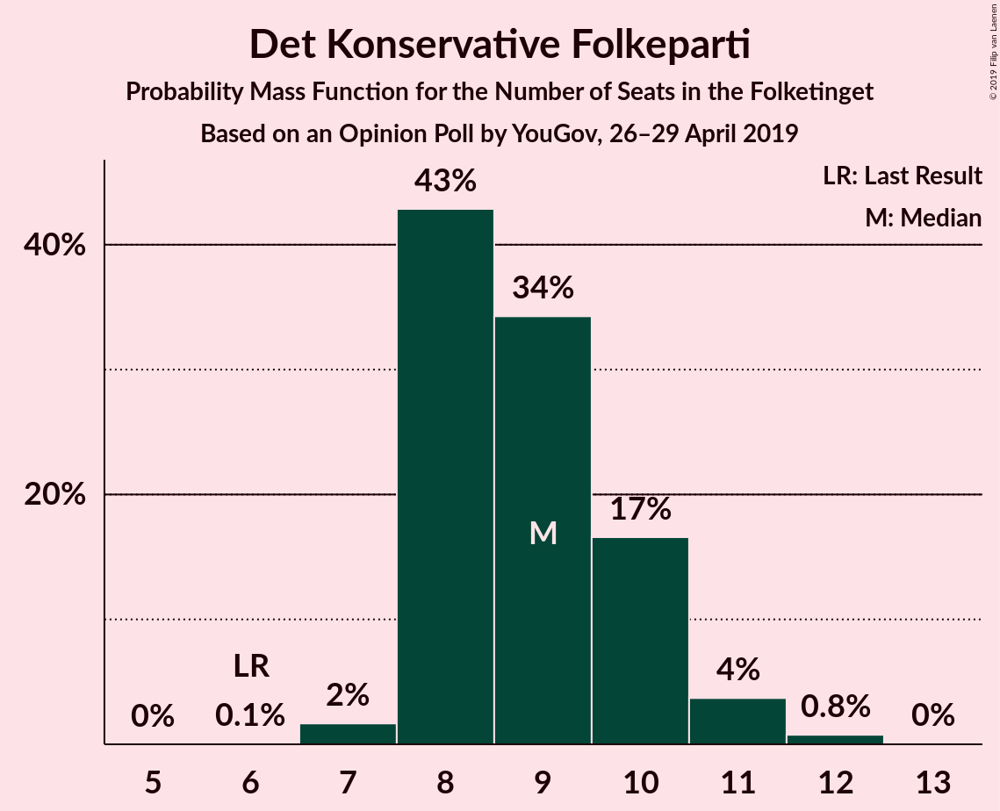
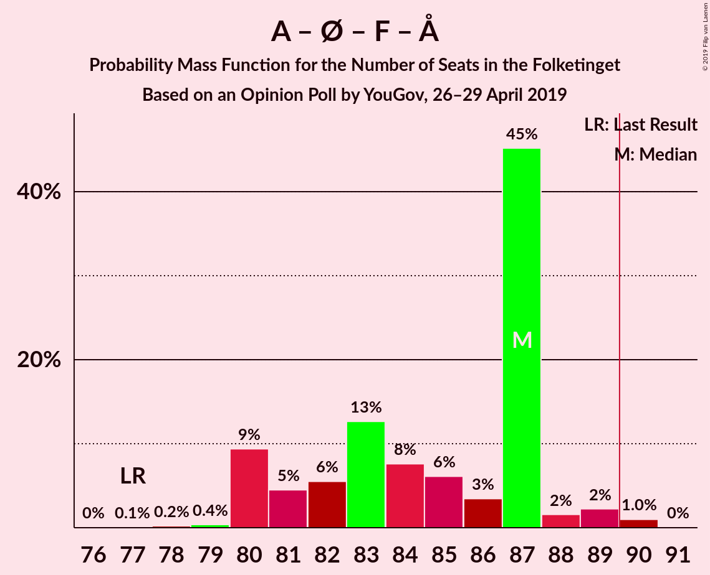
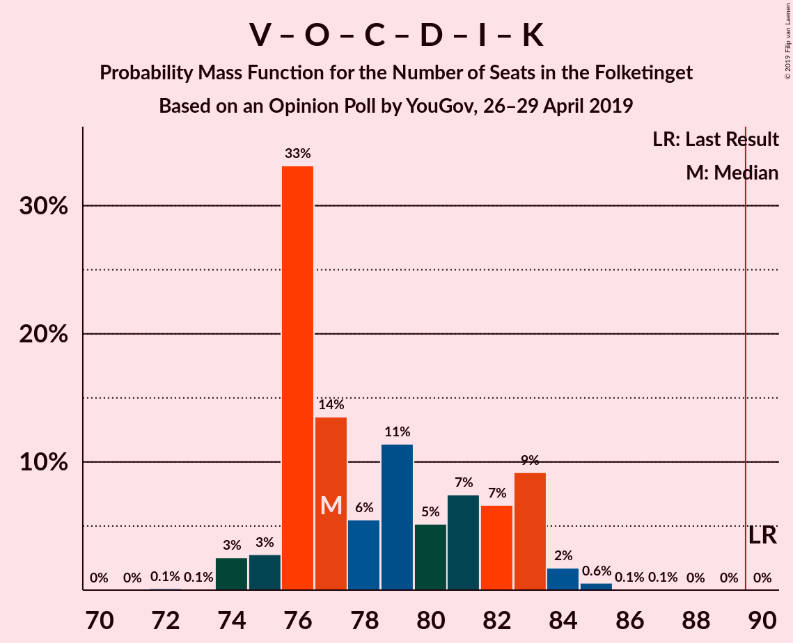
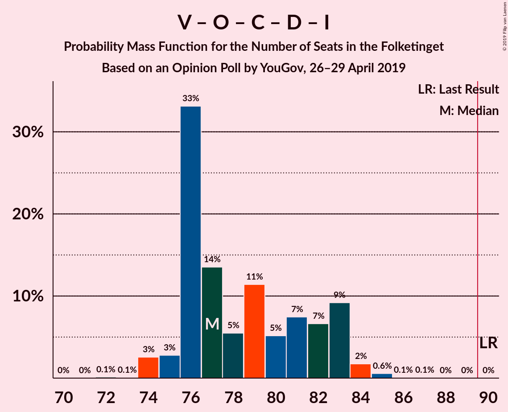
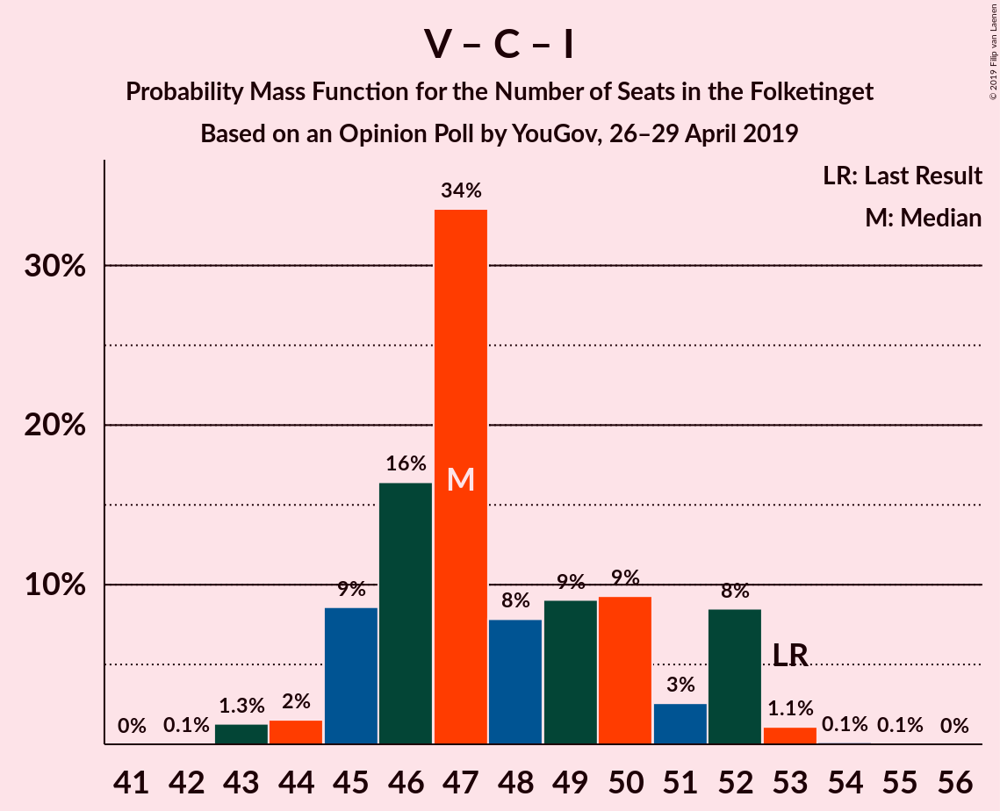

# Opinion Poll by YouGov, 26–29 April 2019

<a href="#voting-intentions">Voting Intentions</a> | <a href="#seats">Seats</a> | <a href="#coalitions">Coalitions</a> | <a href="#technical-information">Technical Information</a>

## Voting Intentions

### Confidence Intervals

| Party | Last Result | Poll Result | 80% Confidence Interval | 90% Confidence Interval | 95% Confidence Interval | 99% Confidence Interval |
|:-----:|:-----------:|:-----------:|:-----------------------:|:-----------------------:|:-----------------------:|:-----------------------:|
| Socialdemokraterne | 26.3% | 25.8% | 24.6–27.1% |24.2–27.5% |23.9–27.8% |23.3–28.5% |
| Venstre | 19.5% | 17.6% | 16.5–18.8% |16.2–19.1% |16.0–19.4% |15.5–20.0% |
| Dansk Folkeparti | 21.1% | 12.2% | 11.3–13.2% |11.0–13.5% |10.8–13.8% |10.4–14.3% |
| Enhedslisten–De Rød-Grønne | 7.8% | 9.4% | 8.6–10.3% |8.4–10.6% |8.2–10.8% |7.8–11.3% |
| Socialistisk Folkeparti | 4.2% | 7.8% | 7.0–8.6% |6.8–8.9% |6.6–9.1% |6.3–9.5% |
| Radikale Venstre | 4.6% | 6.7% | 6.0–7.5% |5.8–7.7% |5.7–7.9% |5.4–8.3% |
| Det Konservative Folkeparti | 3.4% | 5.0% | 4.4–5.7% |4.3–5.9% |4.1–6.1% |3.9–6.5% |
| Nye Borgerlige | 0.0% | 5.0% | 4.4–5.7% |4.3–5.9% |4.1–6.1% |3.9–6.5% |
| Liberal Alliance | 7.5% | 4.2% | 3.6–4.8% |3.5–5.0% |3.4–5.2% |3.1–5.5% |
| Alternativet | 4.8% | 3.8% | 3.3–4.4% |3.2–4.6% |3.0–4.8% |2.8–5.1% |
| Klaus Riskær Pedersen | 0.0% | 1.1% | 0.9–1.5% |0.8–1.6% |0.7–1.7% |0.6–1.9% |
| Kristendemokraterne | 0.8% | 0.9% | 0.7–1.2% |0.6–1.4% |0.6–1.4% |0.5–1.6% |

*Note:* The poll result column reflects the actual value used in the calculations. Published results may vary slightly, and in addition be rounded to fewer digits.

## Seats

### Confidence Intervals

| Party | Last Result | Median | 80% Confidence Interval | 90% Confidence Interval | 95% Confidence Interval | 99% Confidence Interval |
|:-----:|:-----------:|:------:|:-----------------------:|:-----------------------:|:-----------------------:|:-----------------------:|
| <a href="#socialdemokraterne">Socialdemokraterne</a> | 47 | 48 | 44–50 |41–50 |41–50 |41–50 |
| <a href="#venstre">Venstre</a> | 34 | 31 | 30–33 |29–34 |29–34 |28–35 |
| <a href="#dansk-folkeparti">Dansk Folkeparti</a> | 37 | 22 | 20–23 |20–25 |19–25 |18–25 |
| <a href="#enhedslisten–de-rød-grønne">Enhedslisten–De Rød-Grønne</a> | 14 | 16 | 16–18 |16–19 |16–19 |15–20 |
| <a href="#socialistisk-folkeparti">Socialistisk Folkeparti</a> | 7 | 14 | 14 |13–15 |12–17 |12–18 |
| <a href="#radikale-venstre">Radikale Venstre</a> | 8 | 11 | 10–12 |10–12 |9–13 |9–14 |
| <a href="#det-konservative-folkeparti">Det Konservative Folkeparti</a> | 6 | 9 | 8–10 |8–10 |8–10 |8–12 |
| <a href="#nye-borgerlige">Nye Borgerlige</a> | 0 | 9 | 8–9 |8–9 |8–10 |7–11 |
| <a href="#liberal-alliance">Liberal Alliance</a> | 13 | 7 | 6–8 |6–8 |6–8 |6–10 |
| <a href="#alternativet">Alternativet</a> | 9 | 8 | 7–9 |7–9 |6–10 |5–10 |
| <a href="#klaus-riskær-pedersen">Klaus Riskær Pedersen</a> | 0 | 0 | 0 |0 |0 |0 |
| <a href="#kristendemokraterne">Kristendemokraterne</a> | 0 | 0 | 0 |0 |0 |0 |

### Socialdemokraterne

*For a full overview of the results for this party, see the [Socialdemokraterne](party-socialdemokraterne.html) page.*

| Number of Seats | Probability | Accumulated | Special Marks |
|:---------------:|:-----------:|:-----------:|:-------------:|
| 40 | 0.1% | 100% |  |
| 41 | 7% | 99.9% |  |
| 42 | 0.1% | 93% |  |
| 43 | 1.0% | 93% |  |
| 44 | 2% | 92% |  |
| 45 | 2% | 90% |  |
| 46 | 2% | 87% |  |
| 47 | 8% | 85% | Last Result |
| 48 | 31% | 77% | Median |
| 49 | 4% | 46% |  |
| 50 | 42% | 42% |  |
| 51 | 0% | 0% |  |

### Venstre

*For a full overview of the results for this party, see the [Venstre](party-venstre.html) page.*

| Number of Seats | Probability | Accumulated | Special Marks |
|:---------------:|:-----------:|:-----------:|:-------------:|
| 26 | 0.1% | 100% |  |
| 27 | 0.1% | 99.9% |  |
| 28 | 0.4% | 99.8% |  |
| 29 | 7% | 99.4% |  |
| 30 | 41% | 93% |  |
| 31 | 5% | 51% | Median |
| 32 | 33% | 46% |  |
| 33 | 4% | 13% |  |
| 34 | 9% | 9% | Last Result |
| 35 | 0.2% | 0.5% |  |
| 36 | 0% | 0.3% |  |
| 37 | 0.3% | 0.3% |  |
| 38 | 0% | 0% |  |

### Dansk Folkeparti

*For a full overview of the results for this party, see the [Dansk Folkeparti](party-danskfolkeparti.html) page.*

| Number of Seats | Probability | Accumulated | Special Marks |
|:---------------:|:-----------:|:-----------:|:-------------:|
| 18 | 2% | 100% |  |
| 19 | 0.9% | 98% |  |
| 20 | 8% | 97% |  |
| 21 | 33% | 89% |  |
| 22 | 39% | 56% | Median |
| 23 | 7% | 17% |  |
| 24 | 3% | 10% |  |
| 25 | 7% | 7% |  |
| 26 | 0% | 0.1% |  |
| 27 | 0% | 0% |  |
| 28 | 0% | 0% |  |
| 29 | 0% | 0% |  |
| 30 | 0% | 0% |  |
| 31 | 0% | 0% |  |
| 32 | 0% | 0% |  |
| 33 | 0% | 0% |  |
| 34 | 0% | 0% |  |
| 35 | 0% | 0% |  |
| 36 | 0% | 0% |  |
| 37 | 0% | 0% | Last Result |

### Enhedslisten–De Rød-Grønne

*For a full overview of the results for this party, see the [Enhedslisten–De Rød-Grønne](party-enhedslisten–derød-grønne.html) page.*

| Number of Seats | Probability | Accumulated | Special Marks |
|:---------------:|:-----------:|:-----------:|:-------------:|
| 14 | 0.3% | 100% | Last Result |
| 15 | 0.9% | 99.7% |  |
| 16 | 79% | 98.7% | Median |
| 17 | 0.4% | 20% |  |
| 18 | 12% | 19% |  |
| 19 | 6% | 7% |  |
| 20 | 0.1% | 0.5% |  |
| 21 | 0.4% | 0.4% |  |
| 22 | 0% | 0% |  |

### Socialistisk Folkeparti

*For a full overview of the results for this party, see the [Socialistisk Folkeparti](party-socialistiskfolkeparti.html) page.*

| Number of Seats | Probability | Accumulated | Special Marks |
|:---------------:|:-----------:|:-----------:|:-------------:|
| 7 | 0% | 100% | Last Result |
| 8 | 0% | 100% |  |
| 9 | 0% | 100% |  |
| 10 | 0% | 100% |  |
| 11 | 0.1% | 100% |  |
| 12 | 3% | 99.9% |  |
| 13 | 6% | 97% |  |
| 14 | 83% | 90% | Median |
| 15 | 4% | 8% |  |
| 16 | 1.1% | 4% |  |
| 17 | 1.0% | 3% |  |
| 18 | 2% | 2% |  |
| 19 | 0% | 0% |  |

### Radikale Venstre

*For a full overview of the results for this party, see the [Radikale Venstre](party-radikalevenstre.html) page.*

| Number of Seats | Probability | Accumulated | Special Marks |
|:---------------:|:-----------:|:-----------:|:-------------:|
| 8 | 0% | 100% | Last Result |
| 9 | 4% | 100% |  |
| 10 | 8% | 96% |  |
| 11 | 50% | 87% | Median |
| 12 | 33% | 37% |  |
| 13 | 3% | 4% |  |
| 14 | 0.8% | 1.0% |  |
| 15 | 0.2% | 0.2% |  |
| 16 | 0% | 0.1% |  |
| 17 | 0% | 0% |  |

### Det Konservative Folkeparti

*For a full overview of the results for this party, see the [Det Konservative Folkeparti](party-detkonservativefolkeparti.html) page.*

| Number of Seats | Probability | Accumulated | Special Marks |
|:---------------:|:-----------:|:-----------:|:-------------:|
| 6 | 0% | 100% | Last Result |
| 7 | 0.4% | 100% |  |
| 8 | 42% | 99.6% |  |
| 9 | 15% | 58% | Median |
| 10 | 40% | 42% |  |
| 11 | 1.1% | 2% |  |
| 12 | 0.8% | 0.8% |  |
| 13 | 0% | 0% |  |

### Nye Borgerlige

*For a full overview of the results for this party, see the [Nye Borgerlige](party-nyeborgerlige.html) page.*

| Number of Seats | Probability | Accumulated | Special Marks |
|:---------------:|:-----------:|:-----------:|:-------------:|
| 0 | 0% | 100% | Last Result |
| 1 | 0% | 100% |  |
| 2 | 0% | 100% |  |
| 3 | 0% | 100% |  |
| 4 | 0% | 100% |  |
| 5 | 0% | 100% |  |
| 6 | 0.1% | 100% |  |
| 7 | 0.7% | 99.9% |  |
| 8 | 45% | 99.2% |  |
| 9 | 50% | 55% | Median |
| 10 | 2% | 5% |  |
| 11 | 2% | 2% |  |
| 12 | 0.1% | 0.5% |  |
| 13 | 0.4% | 0.4% |  |
| 14 | 0% | 0% |  |

### Liberal Alliance

*For a full overview of the results for this party, see the [Liberal Alliance](party-liberalalliance.html) page.*

| Number of Seats | Probability | Accumulated | Special Marks |
|:---------------:|:-----------:|:-----------:|:-------------:|
| 5 | 0.2% | 100% |  |
| 6 | 32% | 99.8% |  |
| 7 | 55% | 68% | Median |
| 8 | 12% | 13% |  |
| 9 | 1.1% | 2% |  |
| 10 | 0.5% | 0.6% |  |
| 11 | 0% | 0% |  |
| 12 | 0% | 0% |  |
| 13 | 0% | 0% | Last Result |

### Alternativet

*For a full overview of the results for this party, see the [Alternativet](party-alternativet.html) page.*

| Number of Seats | Probability | Accumulated | Special Marks |
|:---------------:|:-----------:|:-----------:|:-------------:|
| 5 | 0.7% | 100% |  |
| 6 | 4% | 99.3% |  |
| 7 | 43% | 95% |  |
| 8 | 17% | 53% | Median |
| 9 | 30% | 35% | Last Result |
| 10 | 5% | 5% |  |
| 11 | 0% | 0% |  |

### Klaus Riskær Pedersen

*For a full overview of the results for this party, see the [Klaus Riskær Pedersen](party-klausriskærpedersen.html) page.*

| Number of Seats | Probability | Accumulated | Special Marks |
|:---------------:|:-----------:|:-----------:|:-------------:|
| 0 | 99.9% | 100% | Last Result, Median |
| 1 | 0% | 0.1% |  |
| 2 | 0% | 0.1% |  |
| 3 | 0% | 0.1% |  |
| 4 | 0.1% | 0.1% |  |
| 5 | 0% | 0% |  |

### Kristendemokraterne

*For a full overview of the results for this party, see the [Kristendemokraterne](party-kristendemokraterne.html) page.*

| Number of Seats | Probability | Accumulated | Special Marks |
|:---------------:|:-----------:|:-----------:|:-------------:|
| 0 | 100% | 100% | Last Result, Median |

## Coalitions

### Confidence Intervals

| Coalition | Last Result | Median | Majority? | 80% Confidence Interval | 90% Confidence Interval | 95% Confidence Interval | 99% Confidence Interval |
|:---------:|:-----------:|:------:|:---------:|:-----------------------:|:-----------------------:|:-----------------------:|:-----------------------:|
| Socialdemokraterne – Enhedslisten–De Rød-Grønne – Socialistisk Folkeparti – Radikale Venstre – Alternativet | 85 | 98 | 99.9% | 94–99 | 91–101 | 91–101 | 91–101 |
| Socialdemokraterne – Enhedslisten–De Rød-Grønne – Socialistisk Folkeparti – Radikale Venstre | 76 | 90 | 77% | 87–91 | 83–93 | 83–93 | 83–94 |
| Socialdemokraterne – Enhedslisten–De Rød-Grønne – Socialistisk Folkeparti – Alternativet | 77 | 87 | 4% | 82–87 | 81–88 | 81–90 | 81–90 |
| Venstre – Dansk Folkeparti – Det Konservative Folkeparti – Nye Borgerlige – Liberal Alliance – Klaus Riskær Pedersen – Kristendemokraterne | 90 | 77 | 0% | 76–81 | 74–84 | 74–84 | 74–84 |
| Venstre – Dansk Folkeparti – Det Konservative Folkeparti – Nye Borgerlige – Liberal Alliance – Klaus Riskær Pedersen | 90 | 77 | 0% | 76–81 | 74–84 | 74–84 | 74–84 |
| Venstre – Dansk Folkeparti – Det Konservative Folkeparti – Nye Borgerlige – Liberal Alliance – Kristendemokraterne | 90 | 77 | 0% | 76–81 | 74–84 | 74–84 | 74–84 |
| Venstre – Dansk Folkeparti – Det Konservative Folkeparti – Nye Borgerlige – Liberal Alliance | 90 | 77 | 0% | 76–81 | 74–84 | 74–84 | 74–84 |
| Socialdemokraterne – Enhedslisten–De Rød-Grønne – Socialistisk Folkeparti | 68 | 78 | 0% | 76–80 | 73–81 | 73–82 | 73–82 |
| Venstre – Dansk Folkeparti – Det Konservative Folkeparti – Liberal Alliance – Kristendemokraterne | 90 | 69 | 0% | 67–71 | 66–75 | 66–75 | 65–75 |
| Venstre – Dansk Folkeparti – Det Konservative Folkeparti – Liberal Alliance | 90 | 69 | 0% | 67–71 | 66–75 | 66–75 | 65–75 |
| Socialdemokraterne – Socialistisk Folkeparti – Radikale Venstre | 62 | 74 | 0% | 69–75 | 65–75 | 65–75 | 65–78 |
| Socialdemokraterne – Radikale Venstre | 55 | 60 | 0% | 55–61 | 51–61 | 51–61 | 51–61 |
| Venstre – Det Konservative Folkeparti – Liberal Alliance | 53 | 47 | 0% | 46–50 | 45–50 | 45–50 | 45–52 |
| Venstre – Det Konservative Folkeparti | 40 | 40 | 0% | 39–42 | 37–43 | 37–43 | 37–45 |
| Venstre | 34 | 31 | 0% | 30–33 | 29–34 | 29–34 | 28–35 |

### Socialdemokraterne – Enhedslisten–De Rød-Grønne – Socialistisk Folkeparti – Radikale Venstre – Alternativet

| Number of Seats | Probability | Accumulated | Special Marks |
|:---------------:|:-----------:|:-----------:|:-------------:|
| 85 | 0% | 100% | Last Result |
| 86 | 0% | 100% |  |
| 87 | 0% | 100% |  |
| 88 | 0% | 100% |  |
| 89 | 0.1% | 100% |  |
| 90 | 0.2% | 99.9% | Majority |
| 91 | 7% | 99.7% |  |
| 92 | 0.1% | 92% |  |
| 93 | 2% | 92% |  |
| 94 | 1.4% | 91% |  |
| 95 | 2% | 89% |  |
| 96 | 3% | 87% |  |
| 97 | 4% | 85% | Median |
| 98 | 45% | 81% |  |
| 99 | 30% | 36% |  |
| 100 | 0% | 6% |  |
| 101 | 6% | 6% |  |
| 102 | 0% | 0.1% |  |
| 103 | 0% | 0% |  |

### Socialdemokraterne – Enhedslisten–De Rød-Grønne – Socialistisk Folkeparti – Radikale Venstre

| Number of Seats | Probability | Accumulated | Special Marks |
|:---------------:|:-----------:|:-----------:|:-------------:|
| 76 | 0% | 100% | Last Result |
| 77 | 0% | 100% |  |
| 78 | 0% | 100% |  |
| 79 | 0% | 100% |  |
| 80 | 0% | 100% |  |
| 81 | 0% | 100% |  |
| 82 | 0% | 100% |  |
| 83 | 7% | 100% |  |
| 84 | 0.2% | 93% |  |
| 85 | 0.1% | 92% |  |
| 86 | 0.1% | 92% |  |
| 87 | 4% | 92% |  |
| 88 | 7% | 88% |  |
| 89 | 4% | 82% | Median |
| 90 | 32% | 77% | Majority |
| 91 | 39% | 46% |  |
| 92 | 1.0% | 7% |  |
| 93 | 4% | 6% |  |
| 94 | 2% | 2% |  |
| 95 | 0% | 0.1% |  |
| 96 | 0% | 0% |  |

### Socialdemokraterne – Enhedslisten–De Rød-Grønne – Socialistisk Folkeparti – Alternativet

| Number of Seats | Probability | Accumulated | Special Marks |
|:---------------:|:-----------:|:-----------:|:-------------:|
| 76 | 0% | 100% |  |
| 77 | 0% | 99.9% | Last Result |
| 78 | 0.2% | 99.9% |  |
| 79 | 0.1% | 99.7% |  |
| 80 | 0.1% | 99.7% |  |
| 81 | 7% | 99.5% |  |
| 82 | 2% | 92% |  |
| 83 | 1.5% | 90% |  |
| 84 | 2% | 88% |  |
| 85 | 2% | 86% |  |
| 86 | 0.9% | 84% | Median |
| 87 | 74% | 83% |  |
| 88 | 5% | 9% |  |
| 89 | 0% | 4% |  |
| 90 | 4% | 4% | Majority |
| 91 | 0% | 0% |  |

### Venstre – Dansk Folkeparti – Det Konservative Folkeparti – Nye Borgerlige – Liberal Alliance – Klaus Riskær Pedersen – Kristendemokraterne

| Number of Seats | Probability | Accumulated | Special Marks |
|:---------------:|:-----------:|:-----------:|:-------------:|
| 73 | 0% | 100% |  |
| 74 | 6% | 99.9% |  |
| 75 | 0% | 94% |  |
| 76 | 30% | 94% |  |
| 77 | 45% | 64% |  |
| 78 | 4% | 19% | Median |
| 79 | 3% | 15% |  |
| 80 | 2% | 13% |  |
| 81 | 1.4% | 11% |  |
| 82 | 2% | 9% |  |
| 83 | 0.1% | 8% |  |
| 84 | 7% | 8% |  |
| 85 | 0.2% | 0.3% |  |
| 86 | 0.1% | 0.1% |  |
| 87 | 0% | 0% |  |
| 88 | 0% | 0% |  |
| 89 | 0% | 0% |  |
| 90 | 0% | 0% | Last Result, Majority |

### Venstre – Dansk Folkeparti – Det Konservative Folkeparti – Nye Borgerlige – Liberal Alliance – Klaus Riskær Pedersen

| Number of Seats | Probability | Accumulated | Special Marks |
|:---------------:|:-----------:|:-----------:|:-------------:|
| 73 | 0% | 100% |  |
| 74 | 6% | 99.9% |  |
| 75 | 0% | 94% |  |
| 76 | 30% | 94% |  |
| 77 | 45% | 64% |  |
| 78 | 4% | 19% | Median |
| 79 | 3% | 15% |  |
| 80 | 2% | 13% |  |
| 81 | 1.4% | 11% |  |
| 82 | 2% | 9% |  |
| 83 | 0.1% | 8% |  |
| 84 | 7% | 8% |  |
| 85 | 0.2% | 0.3% |  |
| 86 | 0.1% | 0.1% |  |
| 87 | 0% | 0% |  |
| 88 | 0% | 0% |  |
| 89 | 0% | 0% |  |
| 90 | 0% | 0% | Last Result, Majority |

### Venstre – Dansk Folkeparti – Det Konservative Folkeparti – Nye Borgerlige – Liberal Alliance – Kristendemokraterne

| Number of Seats | Probability | Accumulated | Special Marks |
|:---------------:|:-----------:|:-----------:|:-------------:|
| 73 | 0% | 100% |  |
| 74 | 6% | 99.9% |  |
| 75 | 0% | 94% |  |
| 76 | 30% | 94% |  |
| 77 | 45% | 64% |  |
| 78 | 4% | 19% | Median |
| 79 | 3% | 15% |  |
| 80 | 2% | 13% |  |
| 81 | 1.3% | 10% |  |
| 82 | 2% | 9% |  |
| 83 | 0.1% | 8% |  |
| 84 | 7% | 8% |  |
| 85 | 0.2% | 0.3% |  |
| 86 | 0.1% | 0.1% |  |
| 87 | 0% | 0% |  |
| 88 | 0% | 0% |  |
| 89 | 0% | 0% |  |
| 90 | 0% | 0% | Last Result, Majority |

### Venstre – Dansk Folkeparti – Det Konservative Folkeparti – Nye Borgerlige – Liberal Alliance

| Number of Seats | Probability | Accumulated | Special Marks |
|:---------------:|:-----------:|:-----------:|:-------------:|
| 73 | 0% | 100% |  |
| 74 | 6% | 99.9% |  |
| 75 | 0% | 94% |  |
| 76 | 30% | 94% |  |
| 77 | 45% | 64% |  |
| 78 | 4% | 19% | Median |
| 79 | 3% | 15% |  |
| 80 | 2% | 13% |  |
| 81 | 1.3% | 10% |  |
| 82 | 2% | 9% |  |
| 83 | 0.1% | 8% |  |
| 84 | 7% | 8% |  |
| 85 | 0.2% | 0.3% |  |
| 86 | 0.1% | 0.1% |  |
| 87 | 0% | 0% |  |
| 88 | 0% | 0% |  |
| 89 | 0% | 0% |  |
| 90 | 0% | 0% | Last Result, Majority |

### Socialdemokraterne – Enhedslisten–De Rød-Grønne – Socialistisk Folkeparti

| Number of Seats | Probability | Accumulated | Special Marks |
|:---------------:|:-----------:|:-----------:|:-------------:|
| 68 | 0% | 100% | Last Result |
| 69 | 0% | 100% |  |
| 70 | 0% | 100% |  |
| 71 | 0% | 99.9% |  |
| 72 | 0.2% | 99.9% |  |
| 73 | 7% | 99.7% |  |
| 74 | 0.2% | 92% |  |
| 75 | 1.5% | 92% |  |
| 76 | 3% | 91% |  |
| 77 | 6% | 87% |  |
| 78 | 31% | 81% | Median |
| 79 | 1.3% | 50% |  |
| 80 | 43% | 49% |  |
| 81 | 2% | 6% |  |
| 82 | 4% | 4% |  |
| 83 | 0% | 0% |  |

### Venstre – Dansk Folkeparti – Det Konservative Folkeparti – Liberal Alliance – Kristendemokraterne

| Number of Seats | Probability | Accumulated | Special Marks |
|:---------------:|:-----------:|:-----------:|:-------------:|
| 65 | 2% | 100% |  |
| 66 | 5% | 98% |  |
| 67 | 30% | 93% |  |
| 68 | 6% | 63% |  |
| 69 | 43% | 56% | Median |
| 70 | 0.7% | 13% |  |
| 71 | 3% | 13% |  |
| 72 | 0.3% | 10% |  |
| 73 | 0.5% | 10% |  |
| 74 | 2% | 9% |  |
| 75 | 7% | 8% |  |
| 76 | 0.2% | 0.2% |  |
| 77 | 0% | 0% |  |
| 78 | 0% | 0% |  |
| 79 | 0% | 0% |  |
| 80 | 0% | 0% |  |
| 81 | 0% | 0% |  |
| 82 | 0% | 0% |  |
| 83 | 0% | 0% |  |
| 84 | 0% | 0% |  |
| 85 | 0% | 0% |  |
| 86 | 0% | 0% |  |
| 87 | 0% | 0% |  |
| 88 | 0% | 0% |  |
| 89 | 0% | 0% |  |
| 90 | 0% | 0% | Last Result, Majority |

### Venstre – Dansk Folkeparti – Det Konservative Folkeparti – Liberal Alliance

| Number of Seats | Probability | Accumulated | Special Marks |
|:---------------:|:-----------:|:-----------:|:-------------:|
| 65 | 2% | 100% |  |
| 66 | 5% | 98% |  |
| 67 | 30% | 93% |  |
| 68 | 6% | 63% |  |
| 69 | 43% | 56% | Median |
| 70 | 0.7% | 13% |  |
| 71 | 3% | 13% |  |
| 72 | 0.3% | 10% |  |
| 73 | 0.5% | 10% |  |
| 74 | 2% | 9% |  |
| 75 | 7% | 8% |  |
| 76 | 0.2% | 0.2% |  |
| 77 | 0% | 0% |  |
| 78 | 0% | 0% |  |
| 79 | 0% | 0% |  |
| 80 | 0% | 0% |  |
| 81 | 0% | 0% |  |
| 82 | 0% | 0% |  |
| 83 | 0% | 0% |  |
| 84 | 0% | 0% |  |
| 85 | 0% | 0% |  |
| 86 | 0% | 0% |  |
| 87 | 0% | 0% |  |
| 88 | 0% | 0% |  |
| 89 | 0% | 0% |  |
| 90 | 0% | 0% | Last Result, Majority |

### Socialdemokraterne – Socialistisk Folkeparti – Radikale Venstre

| Number of Seats | Probability | Accumulated | Special Marks |
|:---------------:|:-----------:|:-----------:|:-------------:|
| 62 | 0% | 100% | Last Result |
| 63 | 0% | 100% |  |
| 64 | 0% | 100% |  |
| 65 | 7% | 100% |  |
| 66 | 0% | 93% |  |
| 67 | 0.2% | 93% |  |
| 68 | 1.3% | 93% |  |
| 69 | 3% | 91% |  |
| 70 | 2% | 89% |  |
| 71 | 1.5% | 87% |  |
| 72 | 6% | 86% |  |
| 73 | 4% | 80% | Median |
| 74 | 35% | 76% |  |
| 75 | 38% | 41% |  |
| 76 | 0.1% | 2% |  |
| 77 | 0% | 2% |  |
| 78 | 2% | 2% |  |
| 79 | 0% | 0% |  |

### Socialdemokraterne – Radikale Venstre

| Number of Seats | Probability | Accumulated | Special Marks |
|:---------------:|:-----------:|:-----------:|:-------------:|
| 51 | 7% | 100% |  |
| 52 | 0% | 93% |  |
| 53 | 0.1% | 93% |  |
| 54 | 0.2% | 93% |  |
| 55 | 3% | 92% | Last Result |
| 56 | 1.1% | 90% |  |
| 57 | 3% | 89% |  |
| 58 | 10% | 86% |  |
| 59 | 1.0% | 76% | Median |
| 60 | 32% | 75% |  |
| 61 | 42% | 43% |  |
| 62 | 0.1% | 0.2% |  |
| 63 | 0.1% | 0.1% |  |
| 64 | 0% | 0.1% |  |
| 65 | 0% | 0% |  |

### Venstre – Det Konservative Folkeparti – Liberal Alliance

| Number of Seats | Probability | Accumulated | Special Marks |
|:---------------:|:-----------:|:-----------:|:-------------:|
| 42 | 0.1% | 100% |  |
| 43 | 0% | 99.9% |  |
| 44 | 0.2% | 99.9% |  |
| 45 | 7% | 99.7% |  |
| 46 | 35% | 93% |  |
| 47 | 41% | 58% | Median |
| 48 | 1.1% | 17% |  |
| 49 | 4% | 16% |  |
| 50 | 9% | 12% |  |
| 51 | 0.9% | 2% |  |
| 52 | 0.9% | 1.2% |  |
| 53 | 0.1% | 0.3% | Last Result |
| 54 | 0.2% | 0.2% |  |
| 55 | 0% | 0% |  |

### Venstre – Det Konservative Folkeparti

| Number of Seats | Probability | Accumulated | Special Marks |
|:---------------:|:-----------:|:-----------:|:-------------:|
| 35 | 0.1% | 100% |  |
| 36 | 0% | 99.9% |  |
| 37 | 6% | 99.9% |  |
| 38 | 1.3% | 93% |  |
| 39 | 6% | 92% |  |
| 40 | 71% | 86% | Last Result, Median |
| 41 | 0.2% | 16% |  |
| 42 | 6% | 15% |  |
| 43 | 8% | 9% |  |
| 44 | 0.1% | 1.2% |  |
| 45 | 0.8% | 1.1% |  |
| 46 | 0.3% | 0.3% |  |
| 47 | 0% | 0% |  |

### Venstre

| Number of Seats | Probability | Accumulated | Special Marks |
|:---------------:|:-----------:|:-----------:|:-------------:|
| 26 | 0.1% | 100% |  |
| 27 | 0.1% | 99.9% |  |
| 28 | 0.4% | 99.8% |  |
| 29 | 7% | 99.4% |  |
| 30 | 41% | 93% |  |
| 31 | 5% | 51% | Median |
| 32 | 33% | 46% |  |
| 33 | 4% | 13% |  |
| 34 | 9% | 9% | Last Result |
| 35 | 0.2% | 0.5% |  |
| 36 | 0% | 0.3% |  |
| 37 | 0.3% | 0.3% |  |
| 38 | 0% | 0% |  |

## Technical Information

### Opinion Poll

+ **Polling firm:** YouGov
+ **Commissioner(s):** —
+ **Fieldwork period:** 26–29 April 2019

### Calculations

+ **Sample size:** 1890
+ **Simulations done:** 131,072
+ **Error estimate:** 2.01%

