# Opinion Poll by YouGov, 1–3 May 2019

<a href="#voting-intentions">Voting Intentions</a> | <a href="#seats">Seats</a> | <a href="#coalitions">Coalitions</a> | <a href="#technical-information">Technical Information</a>

## Voting Intentions

### Confidence Intervals

| Party | Last Result | Poll Result | 80% Confidence Interval | 90% Confidence Interval | 95% Confidence Interval | 99% Confidence Interval |
|:-----:|:-----------:|:-----------:|:-----------------------:|:-----------------------:|:-----------------------:|:-----------------------:|
| Socialdemokraterne | 26.3% | 22.9% | 21.7–24.3% |21.3–24.7% |21.0–25.0% |20.4–25.7% |
| Venstre | 19.5% | 17.1% | 15.9–18.3% |15.6–18.7% |15.3–19.0% |14.8–19.6% |
| Dansk Folkeparti | 21.1% | 11.2% | 10.2–12.2% |10.0–12.5% |9.7–12.8% |9.3–13.3% |
| Enhedslisten–De Rød-Grønne | 7.8% | 9.1% | 8.3–10.1% |8.0–10.4% |7.8–10.6% |7.4–11.1% |
| Socialistisk Folkeparti | 4.2% | 8.6% | 7.7–9.5% |7.5–9.8% |7.3–10.0% |6.9–10.5% |
| Radikale Venstre | 4.6% | 6.6% | 5.9–7.4% |5.7–7.7% |5.5–7.9% |5.2–8.3% |
| Nye Borgerlige | 0.0% | 6.3% | 5.6–7.1% |5.4–7.3% |5.2–7.6% |4.9–8.0% |
| Det Konservative Folkeparti | 3.4% | 5.9% | 5.2–6.7% |5.0–7.0% |4.9–7.2% |4.6–7.6% |
| Stram Kurs | 0.0% | 3.9% | 3.4–4.6% |3.2–4.8% |3.1–5.0% |2.8–5.3% |
| Alternativet | 4.8% | 3.4% | 2.9–4.0% |2.7–4.2% |2.6–4.4% |2.4–4.7% |
| Liberal Alliance | 7.5% | 3.3% | 2.8–4.0% |2.7–4.1% |2.6–4.3% |2.3–4.6% |
| Kristendemokraterne | 0.8% | 0.9% | 0.7–1.3% |0.6–1.4% |0.5–1.5% |0.5–1.7% |
| Klaus Riskær Pedersen | 0.0% | 0.8% | 0.6–1.1% |0.5–1.2% |0.5–1.3% |0.4–1.5% |

*Note:* The poll result column reflects the actual value used in the calculations. Published results may vary slightly, and in addition be rounded to fewer digits.

## Seats

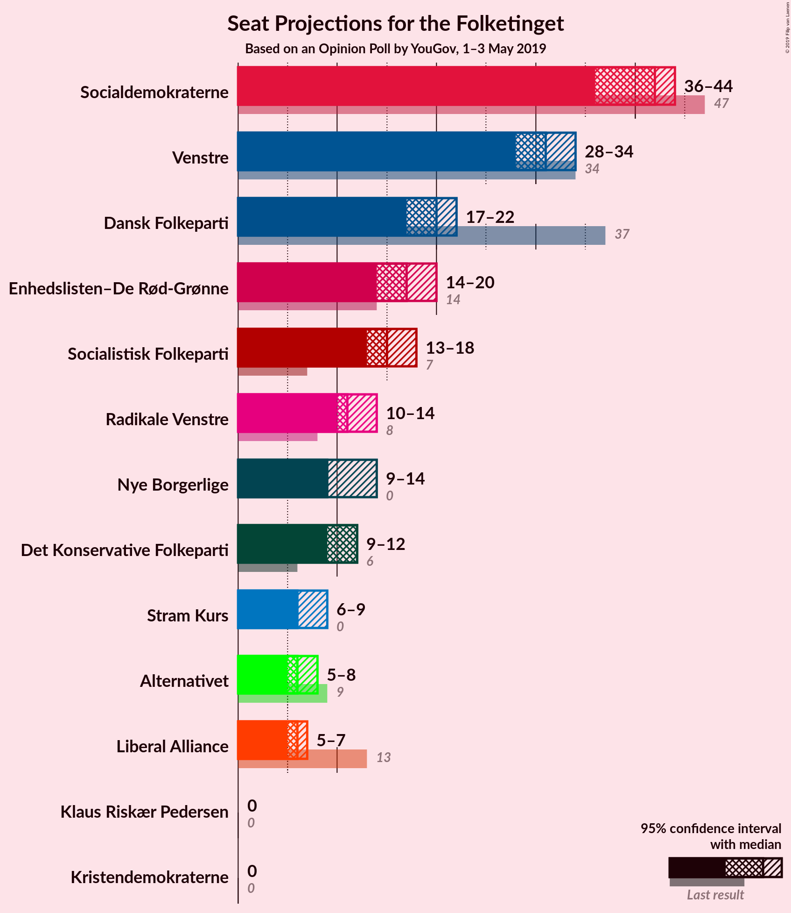

### Confidence Intervals

| Party | Last Result | Median | 80% Confidence Interval | 90% Confidence Interval | 95% Confidence Interval | 99% Confidence Interval |
|:-----:|:-----------:|:------:|:-----------------------:|:-----------------------:|:-----------------------:|:-----------------------:|
| <a href="#socialdemokraterne">Socialdemokraterne</a> | 47 | 42 | 37–43 |36–43 |36–44 |36–45 |
| <a href="#venstre">Venstre</a> | 34 | 31 | 29–33 |28–33 |28–34 |27–34 |
| <a href="#dansk-folkeparti">Dansk Folkeparti</a> | 37 | 20 | 18–22 |17–22 |17–22 |17–23 |
| <a href="#enhedslisten–de-rød-grønne">Enhedslisten–De Rød-Grønne</a> | 14 | 17 | 14–18 |14–19 |14–20 |13–20 |
| <a href="#socialistisk-folkeparti">Socialistisk Folkeparti</a> | 7 | 15 | 14–17 |14–17 |13–18 |12–20 |
| <a href="#radikale-venstre">Radikale Venstre</a> | 8 | 11 | 10–12 |10–13 |10–14 |9–14 |
| <a href="#nye-borgerlige">Nye Borgerlige</a> | 0 | 9 | 9–12 |9–14 |9–14 |9–14 |
| <a href="#det-konservative-folkeparti">Det Konservative Folkeparti</a> | 6 | 12 | 10–12 |9–12 |9–12 |8–13 |
| <a href="#stram-kurs">Stram Kurs</a> | 0 | 6 | 6–9 |6–9 |6–9 |5–10 |
| <a href="#alternativet">Alternativet</a> | 9 | 6 | 6–7 |5–7 |5–8 |4–8 |
| <a href="#liberal-alliance">Liberal Alliance</a> | 13 | 6 | 5–6 |5–7 |5–7 |4–8 |
| <a href="#kristendemokraterne">Kristendemokraterne</a> | 0 | 0 | 0 |0 |0 |0 |
| <a href="#klaus-riskær-pedersen">Klaus Riskær Pedersen</a> | 0 | 0 | 0 |0 |0 |0 |

### Socialdemokraterne

*For a full overview of the results for this party, see the [Socialdemokraterne](party-socialdemokraterne.html) page.*

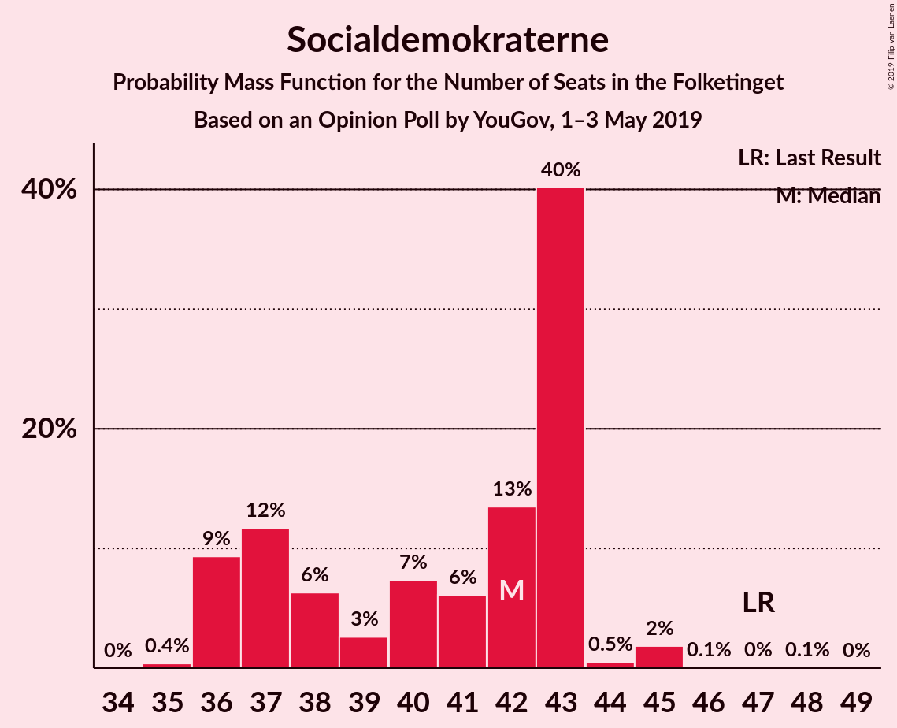

| Number of Seats | Probability | Accumulated | Special Marks |
|:---------------:|:-----------:|:-----------:|:-------------:|
| 35 | 0.4% | 100% |  |
| 36 | 9% | 99.6% |  |
| 37 | 12% | 90% |  |
| 38 | 6% | 79% |  |
| 39 | 3% | 72% |  |
| 40 | 7% | 70% |  |
| 41 | 6% | 62% |  |
| 42 | 13% | 56% | Median |
| 43 | 40% | 43% |  |
| 44 | 0.5% | 3% |  |
| 45 | 2% | 2% |  |
| 46 | 0.1% | 0.2% |  |
| 47 | 0% | 0.1% | Last Result |
| 48 | 0.1% | 0.1% |  |
| 49 | 0% | 0% |  |

### Venstre

*For a full overview of the results for this party, see the [Venstre](party-venstre.html) page.*

| Number of Seats | Probability | Accumulated | Special Marks |
|:---------------:|:-----------:|:-----------:|:-------------:|
| 26 | 0.2% | 100% |  |
| 27 | 2% | 99.8% |  |
| 28 | 6% | 98% |  |
| 29 | 3% | 92% |  |
| 30 | 18% | 90% |  |
| 31 | 52% | 71% | Median |
| 32 | 1.3% | 20% |  |
| 33 | 15% | 19% |  |
| 34 | 3% | 3% | Last Result |
| 35 | 0.2% | 0.3% |  |
| 36 | 0.1% | 0.1% |  |
| 37 | 0% | 0% |  |

### Dansk Folkeparti

*For a full overview of the results for this party, see the [Dansk Folkeparti](party-danskfolkeparti.html) page.*

| Number of Seats | Probability | Accumulated | Special Marks |
|:---------------:|:-----------:|:-----------:|:-------------:|
| 16 | 0.2% | 100% |  |
| 17 | 6% | 99.8% |  |
| 18 | 23% | 94% |  |
| 19 | 7% | 70% |  |
| 20 | 41% | 64% | Median |
| 21 | 12% | 23% |  |
| 22 | 9% | 11% |  |
| 23 | 2% | 2% |  |
| 24 | 0% | 0.1% |  |
| 25 | 0% | 0% |  |
| 26 | 0% | 0% |  |
| 27 | 0% | 0% |  |
| 28 | 0% | 0% |  |
| 29 | 0% | 0% |  |
| 30 | 0% | 0% |  |
| 31 | 0% | 0% |  |
| 32 | 0% | 0% |  |
| 33 | 0% | 0% |  |
| 34 | 0% | 0% |  |
| 35 | 0% | 0% |  |
| 36 | 0% | 0% |  |
| 37 | 0% | 0% | Last Result |

### Enhedslisten–De Rød-Grønne

*For a full overview of the results for this party, see the [Enhedslisten–De Rød-Grønne](party-enhedslisten–derød-grønne.html) page.*

| Number of Seats | Probability | Accumulated | Special Marks |
|:---------------:|:-----------:|:-----------:|:-------------:|
| 11 | 0.1% | 100% |  |
| 12 | 0.2% | 99.9% |  |
| 13 | 0.9% | 99.7% |  |
| 14 | 14% | 98.7% | Last Result |
| 15 | 5% | 84% |  |
| 16 | 7% | 79% |  |
| 17 | 46% | 73% | Median |
| 18 | 20% | 27% |  |
| 19 | 2% | 7% |  |
| 20 | 4% | 5% |  |
| 21 | 0.1% | 0.1% |  |
| 22 | 0% | 0% |  |

### Socialistisk Folkeparti

*For a full overview of the results for this party, see the [Socialistisk Folkeparti](party-socialistiskfolkeparti.html) page.*

| Number of Seats | Probability | Accumulated | Special Marks |
|:---------------:|:-----------:|:-----------:|:-------------:|
| 7 | 0% | 100% | Last Result |
| 8 | 0% | 100% |  |
| 9 | 0% | 100% |  |
| 10 | 0% | 100% |  |
| 11 | 0% | 100% |  |
| 12 | 0.5% | 100% |  |
| 13 | 4% | 99.5% |  |
| 14 | 6% | 95% |  |
| 15 | 49% | 89% | Median |
| 16 | 18% | 40% |  |
| 17 | 17% | 22% |  |
| 18 | 4% | 5% |  |
| 19 | 0.1% | 0.9% |  |
| 20 | 0.8% | 0.8% |  |
| 21 | 0% | 0% |  |

### Radikale Venstre

*For a full overview of the results for this party, see the [Radikale Venstre](party-radikalevenstre.html) page.*

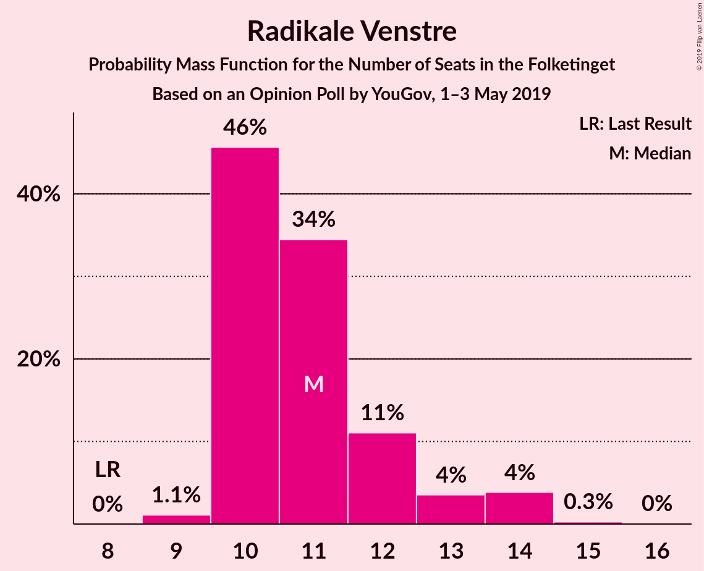

| Number of Seats | Probability | Accumulated | Special Marks |
|:---------------:|:-----------:|:-----------:|:-------------:|
| 8 | 0% | 100% | Last Result |
| 9 | 1.1% | 100% |  |
| 10 | 46% | 98.9% |  |
| 11 | 34% | 53% | Median |
| 12 | 11% | 19% |  |
| 13 | 4% | 8% |  |
| 14 | 4% | 4% |  |
| 15 | 0.3% | 0.3% |  |
| 16 | 0% | 0% |  |

### Nye Borgerlige

*For a full overview of the results for this party, see the [Nye Borgerlige](party-nyeborgerlige.html) page.*

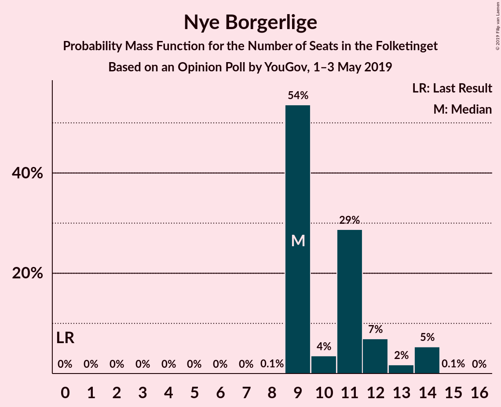

| Number of Seats | Probability | Accumulated | Special Marks |
|:---------------:|:-----------:|:-----------:|:-------------:|
| 0 | 0% | 100% | Last Result |
| 1 | 0% | 100% |  |
| 2 | 0% | 100% |  |
| 3 | 0% | 100% |  |
| 4 | 0% | 100% |  |
| 5 | 0% | 100% |  |
| 6 | 0% | 100% |  |
| 7 | 0% | 100% |  |
| 8 | 0.1% | 100% |  |
| 9 | 54% | 99.9% | Median |
| 10 | 4% | 46% |  |
| 11 | 29% | 43% |  |
| 12 | 7% | 14% |  |
| 13 | 2% | 7% |  |
| 14 | 5% | 5% |  |
| 15 | 0.1% | 0.1% |  |
| 16 | 0% | 0% |  |

### Det Konservative Folkeparti

*For a full overview of the results for this party, see the [Det Konservative Folkeparti](party-detkonservativefolkeparti.html) page.*

| Number of Seats | Probability | Accumulated | Special Marks |
|:---------------:|:-----------:|:-----------:|:-------------:|
| 6 | 0% | 100% | Last Result |
| 7 | 0.1% | 100% |  |
| 8 | 1.3% | 99.9% |  |
| 9 | 5% | 98.7% |  |
| 10 | 11% | 94% |  |
| 11 | 9% | 83% |  |
| 12 | 73% | 74% | Median |
| 13 | 0.3% | 0.5% |  |
| 14 | 0.2% | 0.2% |  |
| 15 | 0% | 0.1% |  |
| 16 | 0.1% | 0.1% |  |
| 17 | 0% | 0% |  |

### Stram Kurs

*For a full overview of the results for this party, see the [Stram Kurs](party-stramkurs.html) page.*

| Number of Seats | Probability | Accumulated | Special Marks |
|:---------------:|:-----------:|:-----------:|:-------------:|
| 0 | 0% | 100% | Last Result |
| 1 | 0% | 100% |  |
| 2 | 0% | 100% |  |
| 3 | 0% | 100% |  |
| 4 | 0% | 100% |  |
| 5 | 1.3% | 100% |  |
| 6 | 61% | 98.7% | Median |
| 7 | 11% | 38% |  |
| 8 | 5% | 27% |  |
| 9 | 21% | 22% |  |
| 10 | 1.1% | 1.1% |  |
| 11 | 0% | 0% |  |

### Alternativet

*For a full overview of the results for this party, see the [Alternativet](party-alternativet.html) page.*

| Number of Seats | Probability | Accumulated | Special Marks |
|:---------------:|:-----------:|:-----------:|:-------------:|
| 4 | 1.4% | 100% |  |
| 5 | 8% | 98.6% |  |
| 6 | 73% | 90% | Median |
| 7 | 13% | 17% |  |
| 8 | 4% | 5% |  |
| 9 | 0.1% | 0.1% | Last Result |
| 10 | 0% | 0% |  |

### Liberal Alliance

*For a full overview of the results for this party, see the [Liberal Alliance](party-liberalalliance.html) page.*

| Number of Seats | Probability | Accumulated | Special Marks |
|:---------------:|:-----------:|:-----------:|:-------------:|
| 4 | 2% | 100% |  |
| 5 | 12% | 98% |  |
| 6 | 78% | 87% | Median |
| 7 | 7% | 9% |  |
| 8 | 2% | 2% |  |
| 9 | 0.2% | 0.2% |  |
| 10 | 0% | 0% |  |
| 11 | 0% | 0% |  |
| 12 | 0% | 0% |  |
| 13 | 0% | 0% | Last Result |

### Kristendemokraterne

*For a full overview of the results for this party, see the [Kristendemokraterne](party-kristendemokraterne.html) page.*

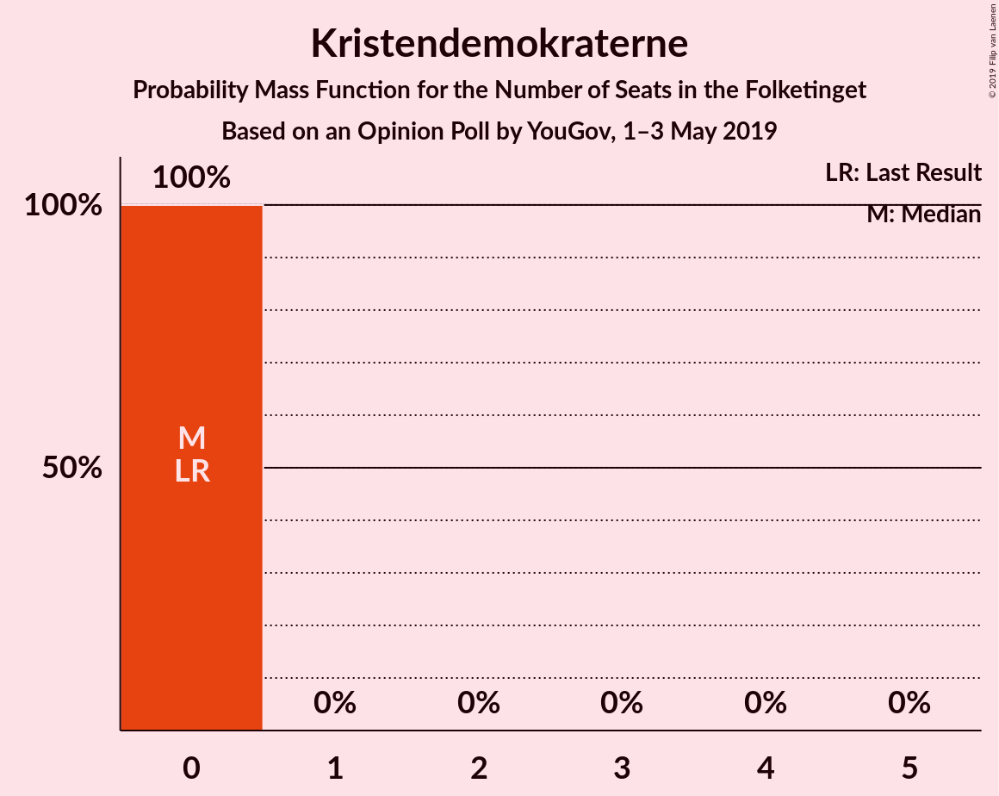

| Number of Seats | Probability | Accumulated | Special Marks |
|:---------------:|:-----------:|:-----------:|:-------------:|
| 0 | 100% | 100% | Last Result, Median |

### Klaus Riskær Pedersen

*For a full overview of the results for this party, see the [Klaus Riskær Pedersen](party-klausriskærpedersen.html) page.*

| Number of Seats | Probability | Accumulated | Special Marks |
|:---------------:|:-----------:|:-----------:|:-------------:|
| 0 | 100% | 100% | Last Result, Median |

## Coalitions

### Confidence Intervals

| Coalition | Last Result | Median | Majority? | 80% Confidence Interval | 90% Confidence Interval | 95% Confidence Interval | 99% Confidence Interval |
|:---------:|:-----------:|:------:|:---------:|:-----------------------:|:-----------------------:|:-----------------------:|:-----------------------:|
| Socialdemokraterne – Enhedslisten–De Rød-Grønne – Socialistisk Folkeparti – Radikale Venstre – Alternativet | 85 | 91 | 66% | 86–91 | 86–93 | 86–93 | 85–96 |
| Venstre – Dansk Folkeparti – Nye Borgerlige – Det Konservative Folkeparti – Stram Kurs – Liberal Alliance – Kristendemokraterne – Klaus Riskær Pedersen | 90 | 84 | 0.8% | 84–89 | 82–89 | 82–89 | 79–90 |
| Socialdemokraterne – Enhedslisten–De Rød-Grønne – Socialistisk Folkeparti – Radikale Venstre | 76 | 85 | 0.9% | 80–86 | 80–87 | 80–87 | 79–91 |
| Socialdemokraterne – Enhedslisten–De Rød-Grønne – Socialistisk Folkeparti – Alternativet | 77 | 79 | 0% | 75–81 | 75–81 | 75–82 | 73–85 |
| Venstre – Dansk Folkeparti – Nye Borgerlige – Det Konservative Folkeparti – Liberal Alliance – Kristendemokraterne – Klaus Riskær Pedersen | 90 | 78 | 0% | 76–80 | 76–81 | 74–81 | 71–83 |
| Venstre – Dansk Folkeparti – Nye Borgerlige – Det Konservative Folkeparti – Liberal Alliance – Klaus Riskær Pedersen | 90 | 78 | 0% | 76–80 | 76–81 | 74–81 | 71–83 |
| Venstre – Dansk Folkeparti – Nye Borgerlige – Det Konservative Folkeparti – Liberal Alliance – Kristendemokraterne | 90 | 78 | 0% | 76–80 | 76–81 | 74–81 | 71–83 |
| Venstre – Dansk Folkeparti – Nye Borgerlige – Det Konservative Folkeparti – Liberal Alliance | 90 | 78 | 0% | 76–80 | 76–81 | 74–81 | 71–83 |
| Socialdemokraterne – Enhedslisten–De Rød-Grønne – Socialistisk Folkeparti | 68 | 74 | 0% | 69–75 | 69–75 | 69–76 | 67–80 |
| Socialdemokraterne – Socialistisk Folkeparti – Radikale Venstre | 62 | 68 | 0% | 62–69 | 62–71 | 62–72 | 62–74 |
| Venstre – Dansk Folkeparti – Det Konservative Folkeparti – Liberal Alliance – Kristendemokraterne | 90 | 69 | 0% | 66–70 | 64–70 | 63–70 | 62–72 |
| Venstre – Dansk Folkeparti – Det Konservative Folkeparti – Liberal Alliance | 90 | 69 | 0% | 66–70 | 64–70 | 63–70 | 62–72 |
| Socialdemokraterne – Radikale Venstre | 55 | 53 | 0% | 47–53 | 47–55 | 47–55 | 46–56 |
| Venstre – Det Konservative Folkeparti – Liberal Alliance | 53 | 49 | 0% | 45–50 | 45–51 | 43–51 | 42–51 |
| Venstre – Det Konservative Folkeparti | 40 | 43 | 0% | 40–45 | 38–45 | 38–45 | 36–45 |
| Venstre | 34 | 31 | 0% | 29–33 | 28–33 | 28–34 | 27–34 |

### Socialdemokraterne – Enhedslisten–De Rød-Grønne – Socialistisk Folkeparti – Radikale Venstre – Alternativet

| Number of Seats | Probability | Accumulated | Special Marks |
|:---------------:|:-----------:|:-----------:|:-------------:|
| 84 | 0.1% | 100% |  |
| 85 | 0.7% | 99.9% | Last Result |
| 86 | 10% | 99.2% |  |
| 87 | 0.7% | 89% |  |
| 88 | 9% | 88% |  |
| 89 | 14% | 79% |  |
| 90 | 12% | 66% | Majority |
| 91 | 44% | 54% | Median |
| 92 | 5% | 10% |  |
| 93 | 3% | 5% |  |
| 94 | 0.4% | 2% |  |
| 95 | 0.6% | 2% |  |
| 96 | 0.9% | 1.0% |  |
| 97 | 0% | 0.1% |  |
| 98 | 0% | 0% |  |

### Venstre – Dansk Folkeparti – Nye Borgerlige – Det Konservative Folkeparti – Stram Kurs – Liberal Alliance – Kristendemokraterne – Klaus Riskær Pedersen

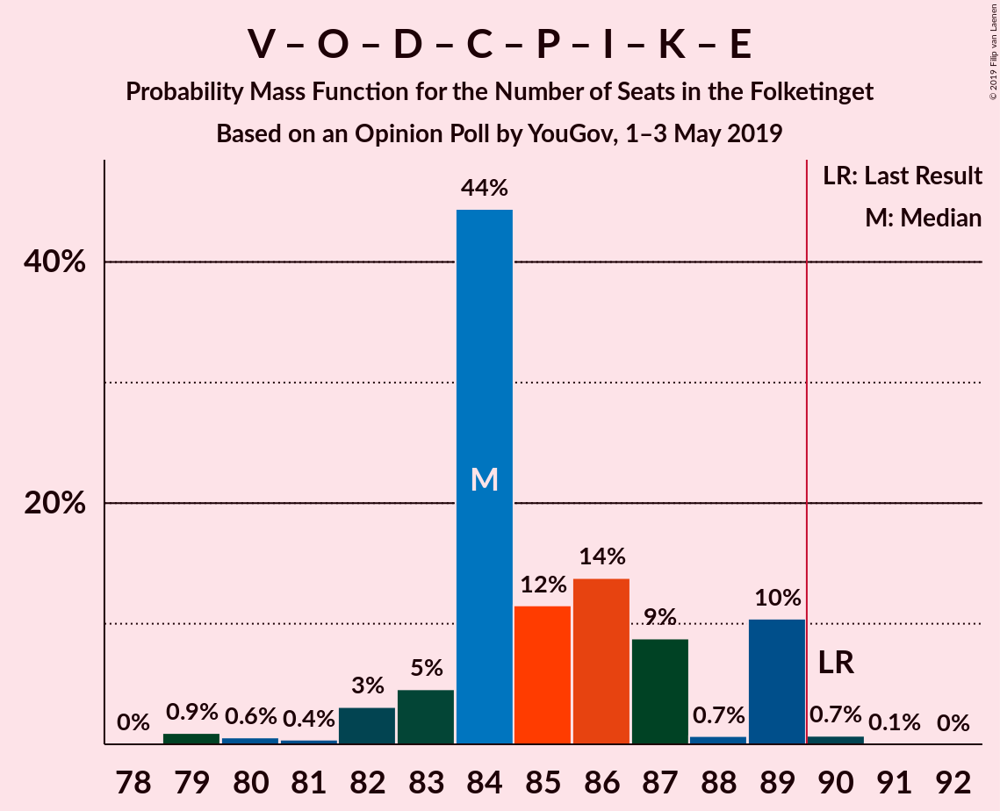

| Number of Seats | Probability | Accumulated | Special Marks |
|:---------------:|:-----------:|:-----------:|:-------------:|
| 78 | 0% | 100% |  |
| 79 | 0.9% | 99.9% |  |
| 80 | 0.6% | 99.0% |  |
| 81 | 0.4% | 98% |  |
| 82 | 3% | 98% |  |
| 83 | 5% | 95% |  |
| 84 | 44% | 90% | Median |
| 85 | 12% | 46% |  |
| 86 | 14% | 34% |  |
| 87 | 9% | 21% |  |
| 88 | 0.7% | 12% |  |
| 89 | 10% | 11% |  |
| 90 | 0.7% | 0.8% | Last Result, Majority |
| 91 | 0.1% | 0.1% |  |
| 92 | 0% | 0% |  |

### Socialdemokraterne – Enhedslisten–De Rød-Grønne – Socialistisk Folkeparti – Radikale Venstre

| Number of Seats | Probability | Accumulated | Special Marks |
|:---------------:|:-----------:|:-----------:|:-------------:|
| 76 | 0% | 100% | Last Result |
| 77 | 0.1% | 100% |  |
| 78 | 0.3% | 99.9% |  |
| 79 | 0.3% | 99.6% |  |
| 80 | 11% | 99.3% |  |
| 81 | 2% | 88% |  |
| 82 | 7% | 87% |  |
| 83 | 26% | 80% |  |
| 84 | 3% | 54% |  |
| 85 | 40% | 51% | Median |
| 86 | 1.2% | 10% |  |
| 87 | 7% | 9% |  |
| 88 | 1.2% | 2% |  |
| 89 | 0.1% | 1.1% |  |
| 90 | 0.1% | 0.9% | Majority |
| 91 | 0.9% | 0.9% |  |
| 92 | 0% | 0% |  |

### Socialdemokraterne – Enhedslisten–De Rød-Grønne – Socialistisk Folkeparti – Alternativet

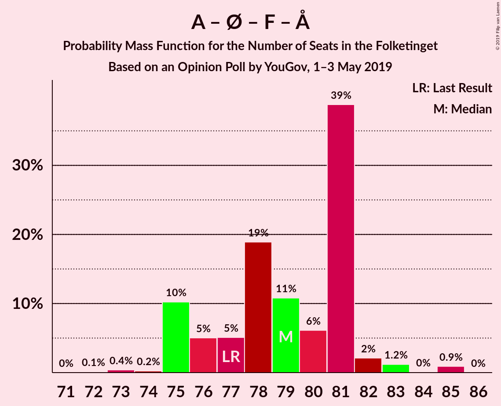

| Number of Seats | Probability | Accumulated | Special Marks |
|:---------------:|:-----------:|:-----------:|:-------------:|
| 72 | 0.1% | 100% |  |
| 73 | 0.4% | 99.9% |  |
| 74 | 0.2% | 99.5% |  |
| 75 | 10% | 99.3% |  |
| 76 | 5% | 89% |  |
| 77 | 5% | 84% | Last Result |
| 78 | 19% | 79% |  |
| 79 | 11% | 60% |  |
| 80 | 6% | 49% | Median |
| 81 | 39% | 43% |  |
| 82 | 2% | 4% |  |
| 83 | 1.2% | 2% |  |
| 84 | 0% | 1.0% |  |
| 85 | 0.9% | 0.9% |  |
| 86 | 0% | 0% |  |

### Venstre – Dansk Folkeparti – Nye Borgerlige – Det Konservative Folkeparti – Liberal Alliance – Kristendemokraterne – Klaus Riskær Pedersen

| Number of Seats | Probability | Accumulated | Special Marks |
|:---------------:|:-----------:|:-----------:|:-------------:|
| 71 | 0.9% | 100% |  |
| 72 | 0.1% | 99.1% |  |
| 73 | 0.6% | 99.0% |  |
| 74 | 1.1% | 98% |  |
| 75 | 2% | 97% |  |
| 76 | 7% | 95% |  |
| 77 | 13% | 88% |  |
| 78 | 45% | 76% | Median |
| 79 | 11% | 31% |  |
| 80 | 11% | 21% |  |
| 81 | 7% | 10% |  |
| 82 | 1.2% | 2% |  |
| 83 | 0.9% | 1.1% |  |
| 84 | 0.2% | 0.2% |  |
| 85 | 0% | 0% |  |
| 86 | 0% | 0% |  |
| 87 | 0% | 0% |  |
| 88 | 0% | 0% |  |
| 89 | 0% | 0% |  |
| 90 | 0% | 0% | Last Result, Majority |

### Venstre – Dansk Folkeparti – Nye Borgerlige – Det Konservative Folkeparti – Liberal Alliance – Klaus Riskær Pedersen

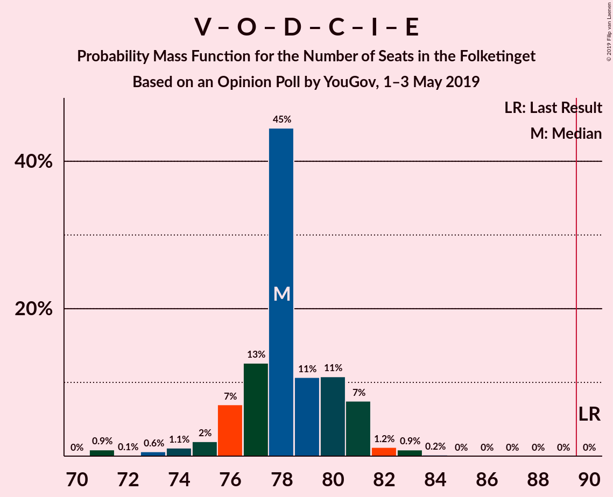

| Number of Seats | Probability | Accumulated | Special Marks |
|:---------------:|:-----------:|:-----------:|:-------------:|
| 71 | 0.9% | 100% |  |
| 72 | 0.1% | 99.1% |  |
| 73 | 0.6% | 99.0% |  |
| 74 | 1.1% | 98% |  |
| 75 | 2% | 97% |  |
| 76 | 7% | 95% |  |
| 77 | 13% | 88% |  |
| 78 | 45% | 76% | Median |
| 79 | 11% | 31% |  |
| 80 | 11% | 21% |  |
| 81 | 7% | 10% |  |
| 82 | 1.2% | 2% |  |
| 83 | 0.9% | 1.1% |  |
| 84 | 0.2% | 0.2% |  |
| 85 | 0% | 0% |  |
| 86 | 0% | 0% |  |
| 87 | 0% | 0% |  |
| 88 | 0% | 0% |  |
| 89 | 0% | 0% |  |
| 90 | 0% | 0% | Last Result, Majority |

### Venstre – Dansk Folkeparti – Nye Borgerlige – Det Konservative Folkeparti – Liberal Alliance – Kristendemokraterne

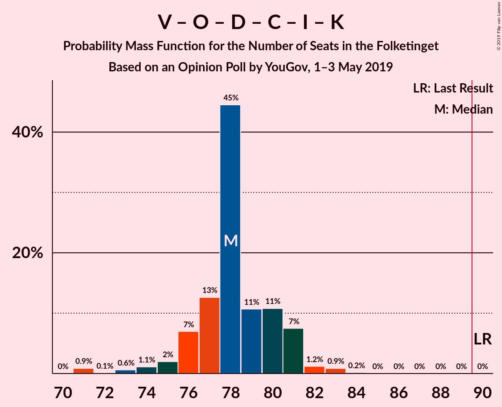

| Number of Seats | Probability | Accumulated | Special Marks |
|:---------------:|:-----------:|:-----------:|:-------------:|
| 71 | 0.9% | 100% |  |
| 72 | 0.1% | 99.1% |  |
| 73 | 0.6% | 99.0% |  |
| 74 | 1.1% | 98% |  |
| 75 | 2% | 97% |  |
| 76 | 7% | 95% |  |
| 77 | 13% | 88% |  |
| 78 | 45% | 76% | Median |
| 79 | 11% | 31% |  |
| 80 | 11% | 21% |  |
| 81 | 7% | 10% |  |
| 82 | 1.2% | 2% |  |
| 83 | 0.9% | 1.1% |  |
| 84 | 0.2% | 0.2% |  |
| 85 | 0% | 0% |  |
| 86 | 0% | 0% |  |
| 87 | 0% | 0% |  |
| 88 | 0% | 0% |  |
| 89 | 0% | 0% |  |
| 90 | 0% | 0% | Last Result, Majority |

### Venstre – Dansk Folkeparti – Nye Borgerlige – Det Konservative Folkeparti – Liberal Alliance

| Number of Seats | Probability | Accumulated | Special Marks |
|:---------------:|:-----------:|:-----------:|:-------------:|
| 71 | 0.9% | 100% |  |
| 72 | 0.1% | 99.1% |  |
| 73 | 0.6% | 99.0% |  |
| 74 | 1.1% | 98% |  |
| 75 | 2% | 97% |  |
| 76 | 7% | 95% |  |
| 77 | 13% | 88% |  |
| 78 | 45% | 76% | Median |
| 79 | 11% | 31% |  |
| 80 | 11% | 21% |  |
| 81 | 7% | 10% |  |
| 82 | 1.2% | 2% |  |
| 83 | 0.9% | 1.1% |  |
| 84 | 0.2% | 0.2% |  |
| 85 | 0% | 0% |  |
| 86 | 0% | 0% |  |
| 87 | 0% | 0% |  |
| 88 | 0% | 0% |  |
| 89 | 0% | 0% |  |
| 90 | 0% | 0% | Last Result, Majority |

### Socialdemokraterne – Enhedslisten–De Rød-Grønne – Socialistisk Folkeparti

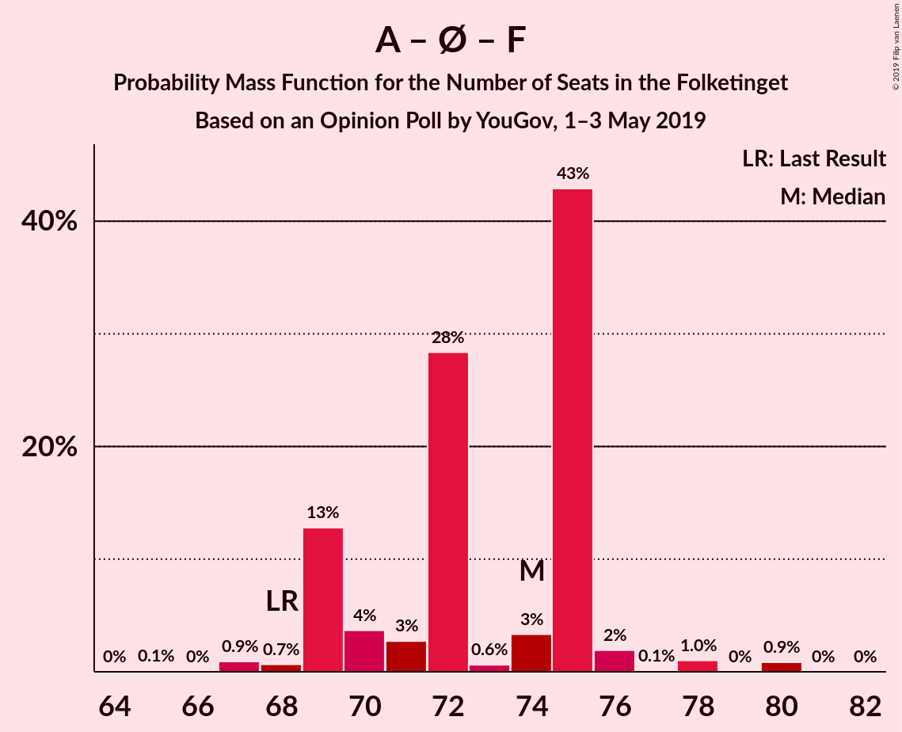

| Number of Seats | Probability | Accumulated | Special Marks |
|:---------------:|:-----------:|:-----------:|:-------------:|
| 65 | 0.1% | 100% |  |
| 66 | 0% | 99.9% |  |
| 67 | 0.9% | 99.9% |  |
| 68 | 0.7% | 99.0% | Last Result |
| 69 | 13% | 98% |  |
| 70 | 4% | 86% |  |
| 71 | 3% | 82% |  |
| 72 | 28% | 79% |  |
| 73 | 0.6% | 51% |  |
| 74 | 3% | 50% | Median |
| 75 | 43% | 47% |  |
| 76 | 2% | 4% |  |
| 77 | 0.1% | 2% |  |
| 78 | 1.0% | 2% |  |
| 79 | 0% | 0.9% |  |
| 80 | 0.9% | 0.9% |  |
| 81 | 0% | 0% |  |

### Socialdemokraterne – Socialistisk Folkeparti – Radikale Venstre

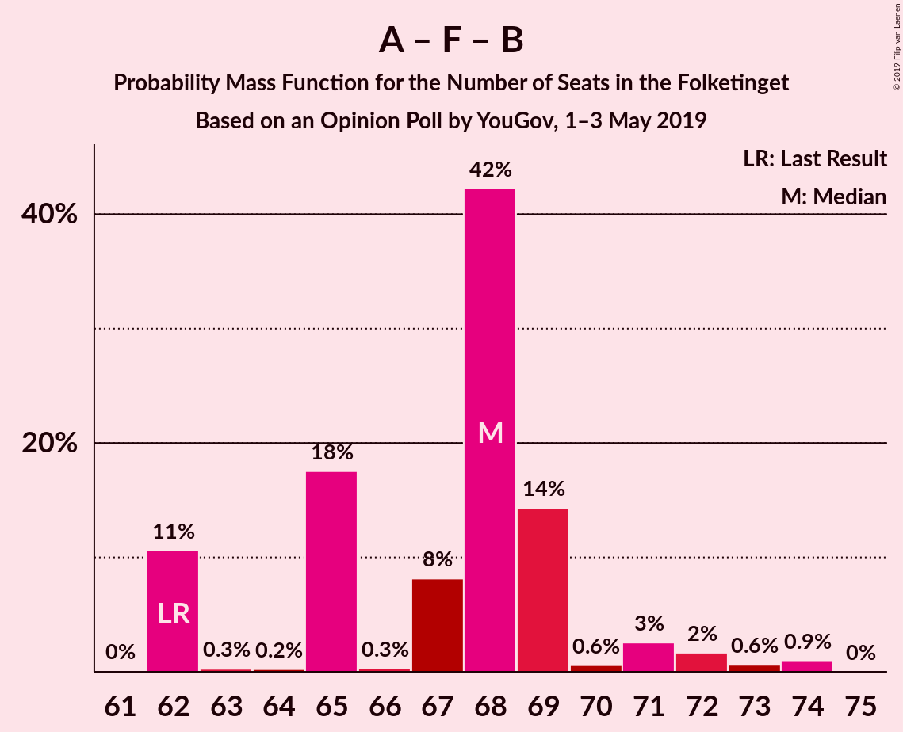

| Number of Seats | Probability | Accumulated | Special Marks |
|:---------------:|:-----------:|:-----------:|:-------------:|
| 61 | 0% | 100% |  |
| 62 | 11% | 99.9% | Last Result |
| 63 | 0.3% | 89% |  |
| 64 | 0.2% | 89% |  |
| 65 | 18% | 89% |  |
| 66 | 0.3% | 71% |  |
| 67 | 8% | 71% |  |
| 68 | 42% | 63% | Median |
| 69 | 14% | 21% |  |
| 70 | 0.6% | 6% |  |
| 71 | 3% | 6% |  |
| 72 | 2% | 3% |  |
| 73 | 0.6% | 2% |  |
| 74 | 0.9% | 0.9% |  |
| 75 | 0% | 0% |  |

### Venstre – Dansk Folkeparti – Det Konservative Folkeparti – Liberal Alliance – Kristendemokraterne

| Number of Seats | Probability | Accumulated | Special Marks |
|:---------------:|:-----------:|:-----------:|:-------------:|
| 59 | 0.1% | 100% |  |
| 60 | 0.1% | 99.9% |  |
| 61 | 0.1% | 99.8% |  |
| 62 | 0.9% | 99.8% |  |
| 63 | 4% | 98.9% |  |
| 64 | 1.0% | 95% |  |
| 65 | 2% | 94% |  |
| 66 | 15% | 92% |  |
| 67 | 11% | 77% |  |
| 68 | 3% | 66% |  |
| 69 | 49% | 63% | Median |
| 70 | 11% | 13% |  |
| 71 | 1.4% | 2% |  |
| 72 | 0.3% | 0.6% |  |
| 73 | 0.2% | 0.3% |  |
| 74 | 0% | 0.1% |  |
| 75 | 0.1% | 0.1% |  |
| 76 | 0% | 0% |  |
| 77 | 0% | 0% |  |
| 78 | 0% | 0% |  |
| 79 | 0% | 0% |  |
| 80 | 0% | 0% |  |
| 81 | 0% | 0% |  |
| 82 | 0% | 0% |  |
| 83 | 0% | 0% |  |
| 84 | 0% | 0% |  |
| 85 | 0% | 0% |  |
| 86 | 0% | 0% |  |
| 87 | 0% | 0% |  |
| 88 | 0% | 0% |  |
| 89 | 0% | 0% |  |
| 90 | 0% | 0% | Last Result, Majority |

### Venstre – Dansk Folkeparti – Det Konservative Folkeparti – Liberal Alliance

| Number of Seats | Probability | Accumulated | Special Marks |
|:---------------:|:-----------:|:-----------:|:-------------:|
| 59 | 0.1% | 100% |  |
| 60 | 0.1% | 99.9% |  |
| 61 | 0.1% | 99.8% |  |
| 62 | 0.9% | 99.8% |  |
| 63 | 4% | 98.9% |  |
| 64 | 1.0% | 95% |  |
| 65 | 2% | 94% |  |
| 66 | 15% | 92% |  |
| 67 | 11% | 77% |  |
| 68 | 3% | 66% |  |
| 69 | 49% | 63% | Median |
| 70 | 11% | 13% |  |
| 71 | 1.4% | 2% |  |
| 72 | 0.3% | 0.6% |  |
| 73 | 0.2% | 0.3% |  |
| 74 | 0% | 0.1% |  |
| 75 | 0.1% | 0.1% |  |
| 76 | 0% | 0% |  |
| 77 | 0% | 0% |  |
| 78 | 0% | 0% |  |
| 79 | 0% | 0% |  |
| 80 | 0% | 0% |  |
| 81 | 0% | 0% |  |
| 82 | 0% | 0% |  |
| 83 | 0% | 0% |  |
| 84 | 0% | 0% |  |
| 85 | 0% | 0% |  |
| 86 | 0% | 0% |  |
| 87 | 0% | 0% |  |
| 88 | 0% | 0% |  |
| 89 | 0% | 0% |  |
| 90 | 0% | 0% | Last Result, Majority |

### Socialdemokraterne – Radikale Venstre

| Number of Seats | Probability | Accumulated | Special Marks |
|:---------------:|:-----------:|:-----------:|:-------------:|
| 45 | 0.2% | 100% |  |
| 46 | 0.6% | 99.8% |  |
| 47 | 9% | 99.2% |  |
| 48 | 10% | 90% |  |
| 49 | 3% | 80% |  |
| 50 | 5% | 77% |  |
| 51 | 9% | 72% |  |
| 52 | 2% | 63% |  |
| 53 | 51% | 61% | Median |
| 54 | 4% | 10% |  |
| 55 | 4% | 6% | Last Result |
| 56 | 2% | 2% |  |
| 57 | 0.1% | 0.3% |  |
| 58 | 0% | 0.2% |  |
| 59 | 0.1% | 0.2% |  |
| 60 | 0.1% | 0.1% |  |
| 61 | 0% | 0% |  |

### Venstre – Det Konservative Folkeparti – Liberal Alliance

| Number of Seats | Probability | Accumulated | Special Marks |
|:---------------:|:-----------:|:-----------:|:-------------:|
| 41 | 0% | 100% |  |
| 42 | 0.6% | 99.9% |  |
| 43 | 2% | 99.3% |  |
| 44 | 0.7% | 97% |  |
| 45 | 9% | 97% |  |
| 46 | 3% | 88% |  |
| 47 | 3% | 85% |  |
| 48 | 16% | 81% |  |
| 49 | 49% | 66% | Median |
| 50 | 7% | 16% |  |
| 51 | 10% | 10% |  |
| 52 | 0.1% | 0.2% |  |
| 53 | 0% | 0.1% | Last Result |
| 54 | 0% | 0.1% |  |
| 55 | 0.1% | 0.1% |  |
| 56 | 0% | 0% |  |

### Venstre – Det Konservative Folkeparti

| Number of Seats | Probability | Accumulated | Special Marks |
|:---------------:|:-----------:|:-----------:|:-------------:|
| 35 | 0% | 100% |  |
| 36 | 0.5% | 99.9% |  |
| 37 | 1.3% | 99.4% |  |
| 38 | 5% | 98% |  |
| 39 | 2% | 93% |  |
| 40 | 5% | 90% | Last Result |
| 41 | 2% | 86% |  |
| 42 | 17% | 84% |  |
| 43 | 51% | 67% | Median |
| 44 | 5% | 16% |  |
| 45 | 10% | 11% |  |
| 46 | 0.2% | 0.3% |  |
| 47 | 0% | 0.1% |  |
| 48 | 0.1% | 0.1% |  |
| 49 | 0% | 0% |  |

### Venstre

| Number of Seats | Probability | Accumulated | Special Marks |
|:---------------:|:-----------:|:-----------:|:-------------:|
| 26 | 0.2% | 100% |  |
| 27 | 2% | 99.8% |  |
| 28 | 6% | 98% |  |
| 29 | 3% | 92% |  |
| 30 | 18% | 90% |  |
| 31 | 52% | 71% | Median |
| 32 | 1.3% | 20% |  |
| 33 | 15% | 19% |  |
| 34 | 3% | 3% | Last Result |
| 35 | 0.2% | 0.3% |  |
| 36 | 0.1% | 0.1% |  |
| 37 | 0% | 0% |  |

## Technical Information

### Opinion Poll

+ **Polling firm:** YouGov
+ **Commissioner(s):** —
+ **Fieldwork period:** 1–3 May 2019

### Calculations

+ **Sample size:** 1656
+ **Simulations done:** 1,048,576
+ **Error estimate:** 2.00%

