# Opinion Poll by Voxmeter for Ritzau, 28 April–5 May 2019

<a href="#voting-intentions">Voting Intentions</a> | <a href="#seats">Seats</a> | <a href="#coalitions">Coalitions</a> | <a href="#technical-information">Technical Information</a>

## Voting Intentions

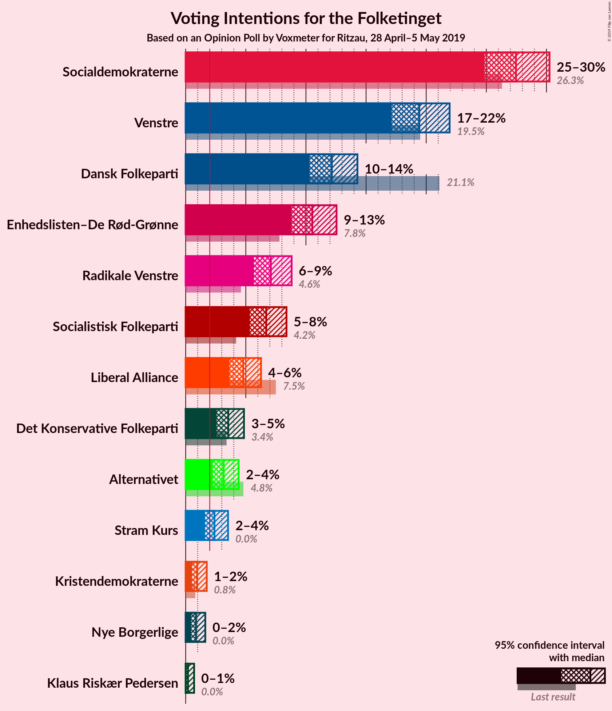

### Confidence Intervals

| Party | Last Result | Poll Result | 80% Confidence Interval | 90% Confidence Interval | 95% Confidence Interval | 99% Confidence Interval |
|:-----:|:-----------:|:-----------:|:-----------------------:|:-----------------------:|:-----------------------:|:-----------------------:|
| Socialdemokraterne | 26.3% | 27.5% | 25.7–29.3% |25.3–29.8% |24.8–30.3% |24.0–31.1% |
| Venstre | 19.5% | 19.4% | 17.9–21.1% |17.5–21.5% |17.1–21.9% |16.4–22.8% |
| Dansk Folkeparti | 21.1% | 12.2% | 10.9–13.5% |10.6–13.9% |10.3–14.3% |9.8–15.0% |
| Enhedslisten–De Rød-Grønne | 7.8% | 10.5% | 9.4–11.8% |9.1–12.2% |8.8–12.5% |8.3–13.2% |
| Radikale Venstre | 4.6% | 7.1% | 6.2–8.2% |5.9–8.5% |5.7–8.8% |5.3–9.4% |
| Socialistisk Folkeparti | 4.2% | 6.7% | 5.8–7.8% |5.5–8.1% |5.3–8.4% |4.9–8.9% |
| Liberal Alliance | 7.5% | 4.8% | 4.0–5.7% |3.8–6.0% |3.6–6.3% |3.3–6.8% |
| Det Konservative Folkeparti | 3.4% | 3.5% | 2.9–4.4% |2.7–4.6% |2.6–4.8% |2.3–5.3% |
| Alternativet | 4.8% | 3.2% | 2.6–4.0% |2.4–4.2% |2.3–4.4% |2.0–4.8% |
| Stram Kurs | 0.0% | 2.4% | 1.9–3.1% |1.7–3.3% |1.6–3.5% |1.4–3.9% |
| Kristendemokraterne | 0.8% | 1.0% | 0.7–1.5% |0.6–1.6% |0.5–1.8% |0.4–2.0% |
| Nye Borgerlige | 0.0% | 0.9% | 0.6–1.4% |0.5–1.5% |0.5–1.6% |0.4–1.9% |
| Klaus Riskær Pedersen | 0.0% | 0.2% | 0.1–0.5% |0.1–0.6% |0.0–0.7% |0.0–0.9% |

*Note:* The poll result column reflects the actual value used in the calculations. Published results may vary slightly, and in addition be rounded to fewer digits.

## Seats

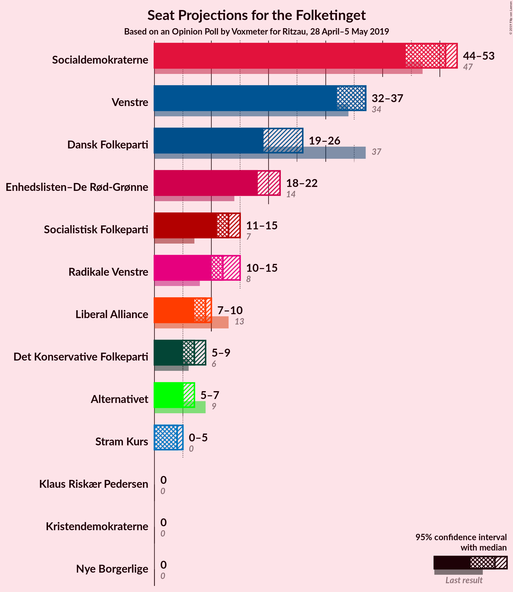

### Confidence Intervals

| Party | Last Result | Median | 80% Confidence Interval | 90% Confidence Interval | 95% Confidence Interval | 99% Confidence Interval |
|:-----:|:-----------:|:------:|:-----------------------:|:-----------------------:|:-----------------------:|:-----------------------:|
| <a href="#socialdemokraterne">Socialdemokraterne</a> | 47 | 51 | 48–51 |47–51 |44–53 |44–56 |
| <a href="#venstre">Venstre</a> | 34 | 37 | 33–37 |33–37 |32–37 |31–39 |
| <a href="#dansk-folkeparti">Dansk Folkeparti</a> | 37 | 19 | 19–23 |19–24 |19–26 |17–27 |
| <a href="#enhedslisten–de-rød-grønne">Enhedslisten–De Rød-Grønne</a> | 14 | 18 | 18–21 |18–21 |18–22 |16–24 |
| <a href="#radikale-venstre">Radikale Venstre</a> | 8 | 12 | 12–13 |11–13 |10–15 |9–16 |
| <a href="#socialistisk-folkeparti">Socialistisk Folkeparti</a> | 7 | 13 | 12–13 |12–14 |11–15 |10–16 |
| <a href="#liberal-alliance">Liberal Alliance</a> | 13 | 9 | 8–9 |7–10 |7–10 |7–12 |
| <a href="#det-konservative-folkeparti">Det Konservative Folkeparti</a> | 6 | 7 | 6–7 |6–9 |5–9 |5–9 |
| <a href="#alternativet">Alternativet</a> | 9 | 5 | 5–7 |5–7 |5–7 |0–7 |
| <a href="#stram-kurs">Stram Kurs</a> | 0 | 4 | 4 |4–5 |0–5 |0–6 |
| <a href="#kristendemokraterne">Kristendemokraterne</a> | 0 | 0 | 0 |0 |0 |0 |
| <a href="#nye-borgerlige">Nye Borgerlige</a> | 0 | 0 | 0 |0 |0 |0 |
| <a href="#klaus-riskær-pedersen">Klaus Riskær Pedersen</a> | 0 | 0 | 0 |0 |0 |0 |

### Socialdemokraterne

*For a full overview of the results for this party, see the [Socialdemokraterne](party-socialdemokraterne.html) page.*

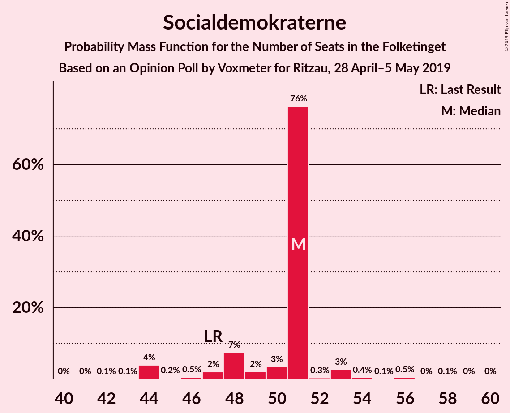

| Number of Seats | Probability | Accumulated | Special Marks |
|:---------------:|:-----------:|:-----------:|:-------------:|
| 42 | 0.1% | 100% |  |
| 43 | 0.1% | 99.9% |  |
| 44 | 4% | 99.9% |  |
| 45 | 0.2% | 96% |  |
| 46 | 0.5% | 96% |  |
| 47 | 2% | 95% | Last Result |
| 48 | 7% | 93% |  |
| 49 | 2% | 86% |  |
| 50 | 3% | 84% |  |
| 51 | 76% | 80% | Median |
| 52 | 0.3% | 4% |  |
| 53 | 3% | 4% |  |
| 54 | 0.4% | 1.1% |  |
| 55 | 0.1% | 0.7% |  |
| 56 | 0.5% | 0.6% |  |
| 57 | 0% | 0.1% |  |
| 58 | 0.1% | 0.1% |  |
| 59 | 0% | 0% |  |

### Venstre

*For a full overview of the results for this party, see the [Venstre](party-venstre.html) page.*

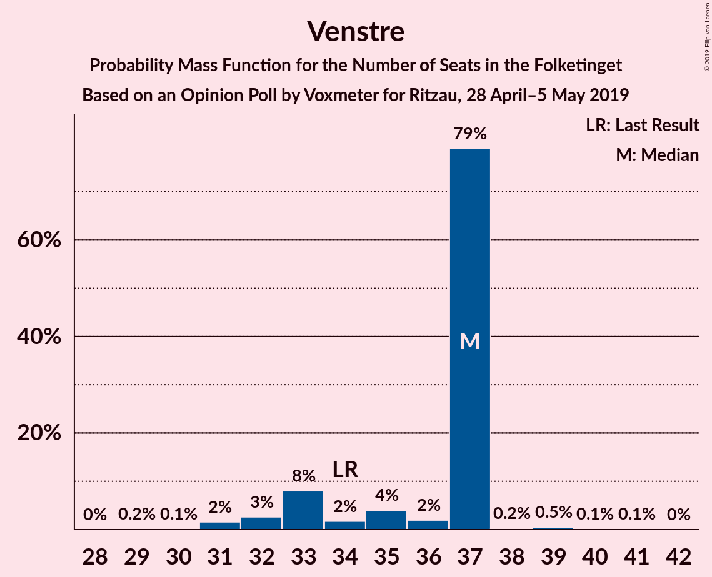

| Number of Seats | Probability | Accumulated | Special Marks |
|:---------------:|:-----------:|:-----------:|:-------------:|
| 29 | 0.2% | 100% |  |
| 30 | 0.1% | 99.8% |  |
| 31 | 2% | 99.7% |  |
| 32 | 3% | 98% |  |
| 33 | 8% | 96% |  |
| 34 | 2% | 88% | Last Result |
| 35 | 4% | 86% |  |
| 36 | 2% | 82% |  |
| 37 | 79% | 80% | Median |
| 38 | 0.2% | 0.9% |  |
| 39 | 0.5% | 0.7% |  |
| 40 | 0.1% | 0.2% |  |
| 41 | 0.1% | 0.1% |  |
| 42 | 0% | 0% |  |

### Dansk Folkeparti

*For a full overview of the results for this party, see the [Dansk Folkeparti](party-danskfolkeparti.html) page.*

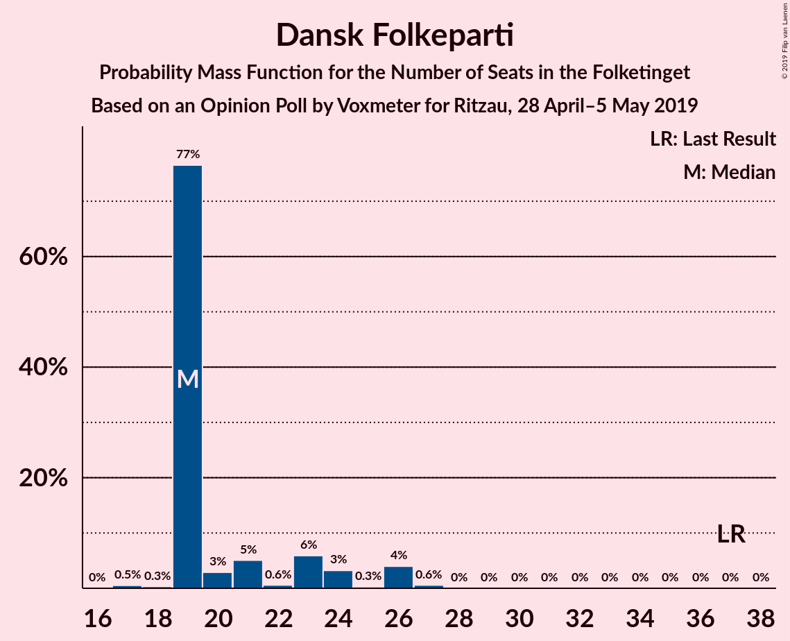

| Number of Seats | Probability | Accumulated | Special Marks |
|:---------------:|:-----------:|:-----------:|:-------------:|
| 17 | 0.5% | 100% |  |
| 18 | 0.3% | 99.4% |  |
| 19 | 77% | 99.1% | Median |
| 20 | 3% | 23% |  |
| 21 | 5% | 20% |  |
| 22 | 0.6% | 15% |  |
| 23 | 6% | 14% |  |
| 24 | 3% | 8% |  |
| 25 | 0.3% | 5% |  |
| 26 | 4% | 5% |  |
| 27 | 0.6% | 0.6% |  |
| 28 | 0% | 0% |  |
| 29 | 0% | 0% |  |
| 30 | 0% | 0% |  |
| 31 | 0% | 0% |  |
| 32 | 0% | 0% |  |
| 33 | 0% | 0% |  |
| 34 | 0% | 0% |  |
| 35 | 0% | 0% |  |
| 36 | 0% | 0% |  |
| 37 | 0% | 0% | Last Result |

### Enhedslisten–De Rød-Grønne

*For a full overview of the results for this party, see the [Enhedslisten–De Rød-Grønne](party-enhedslisten–derød-grønne.html) page.*

| Number of Seats | Probability | Accumulated | Special Marks |
|:---------------:|:-----------:|:-----------:|:-------------:|
| 14 | 0% | 100% | Last Result |
| 15 | 0.3% | 100% |  |
| 16 | 0.4% | 99.7% |  |
| 17 | 0.7% | 99.3% |  |
| 18 | 80% | 98.6% | Median |
| 19 | 8% | 19% |  |
| 20 | 1.0% | 11% |  |
| 21 | 8% | 10% |  |
| 22 | 2% | 3% |  |
| 23 | 0% | 0.8% |  |
| 24 | 0.5% | 0.8% |  |
| 25 | 0.3% | 0.3% |  |
| 26 | 0% | 0% |  |

### Radikale Venstre

*For a full overview of the results for this party, see the [Radikale Venstre](party-radikalevenstre.html) page.*

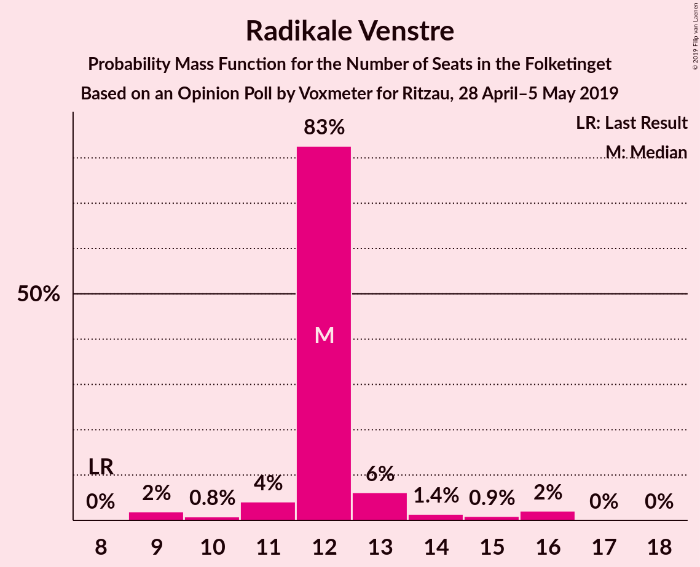

| Number of Seats | Probability | Accumulated | Special Marks |
|:---------------:|:-----------:|:-----------:|:-------------:|
| 8 | 0% | 100% | Last Result |
| 9 | 2% | 100% |  |
| 10 | 0.8% | 98% |  |
| 11 | 4% | 97% |  |
| 12 | 83% | 93% | Median |
| 13 | 6% | 11% |  |
| 14 | 1.4% | 4% |  |
| 15 | 0.9% | 3% |  |
| 16 | 2% | 2% |  |
| 17 | 0% | 0.1% |  |
| 18 | 0% | 0% |  |

### Socialistisk Folkeparti

*For a full overview of the results for this party, see the [Socialistisk Folkeparti](party-socialistiskfolkeparti.html) page.*

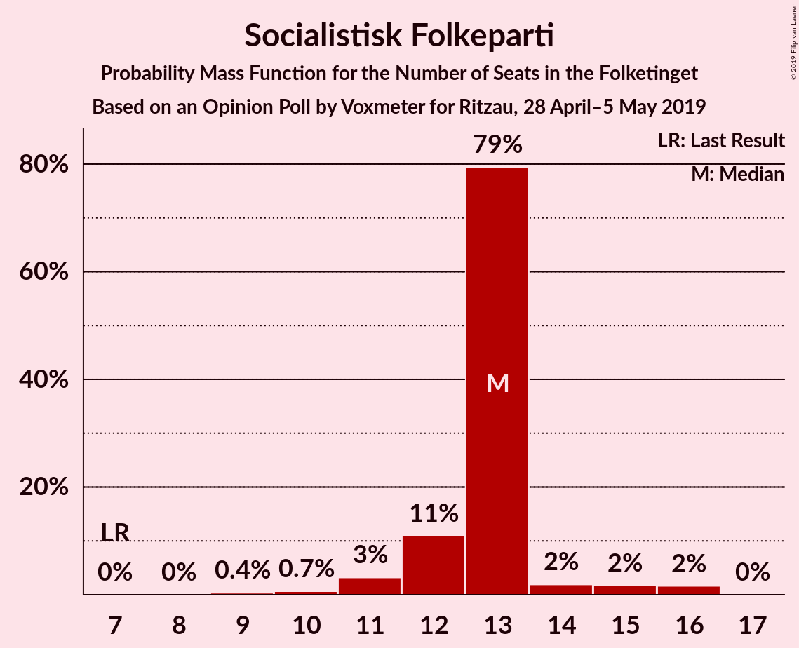

| Number of Seats | Probability | Accumulated | Special Marks |
|:---------------:|:-----------:|:-----------:|:-------------:|
| 7 | 0% | 100% | Last Result |
| 8 | 0% | 100% |  |
| 9 | 0.4% | 99.9% |  |
| 10 | 0.7% | 99.6% |  |
| 11 | 3% | 98.9% |  |
| 12 | 11% | 96% |  |
| 13 | 79% | 85% | Median |
| 14 | 2% | 5% |  |
| 15 | 2% | 3% |  |
| 16 | 2% | 2% |  |
| 17 | 0% | 0% |  |

### Liberal Alliance

*For a full overview of the results for this party, see the [Liberal Alliance](party-liberalalliance.html) page.*

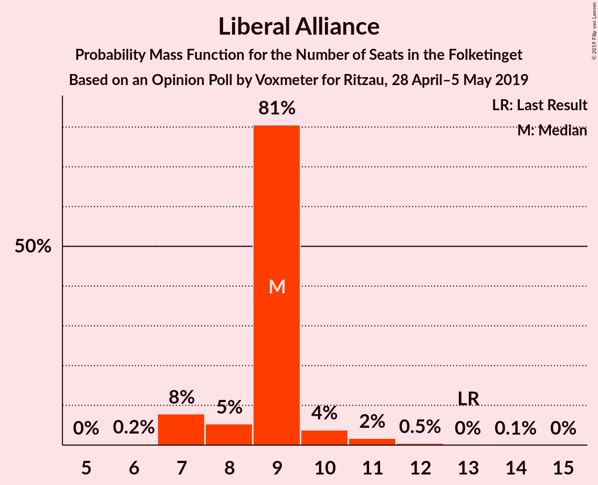

| Number of Seats | Probability | Accumulated | Special Marks |
|:---------------:|:-----------:|:-----------:|:-------------:|
| 6 | 0.2% | 100% |  |
| 7 | 8% | 99.8% |  |
| 8 | 5% | 92% |  |
| 9 | 81% | 87% | Median |
| 10 | 4% | 6% |  |
| 11 | 2% | 2% |  |
| 12 | 0.5% | 0.5% |  |
| 13 | 0% | 0.1% | Last Result |
| 14 | 0.1% | 0.1% |  |
| 15 | 0% | 0% |  |

### Det Konservative Folkeparti

*For a full overview of the results for this party, see the [Det Konservative Folkeparti](party-detkonservativefolkeparti.html) page.*

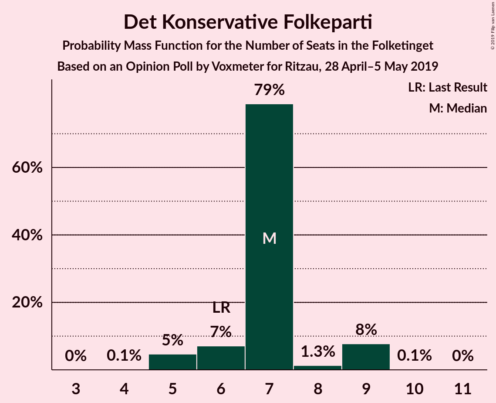

| Number of Seats | Probability | Accumulated | Special Marks |
|:---------------:|:-----------:|:-----------:|:-------------:|
| 4 | 0.1% | 100% |  |
| 5 | 5% | 99.9% |  |
| 6 | 7% | 95% | Last Result |
| 7 | 79% | 88% | Median |
| 8 | 1.3% | 9% |  |
| 9 | 8% | 8% |  |
| 10 | 0.1% | 0.1% |  |
| 11 | 0% | 0% |  |

### Alternativet

*For a full overview of the results for this party, see the [Alternativet](party-alternativet.html) page.*

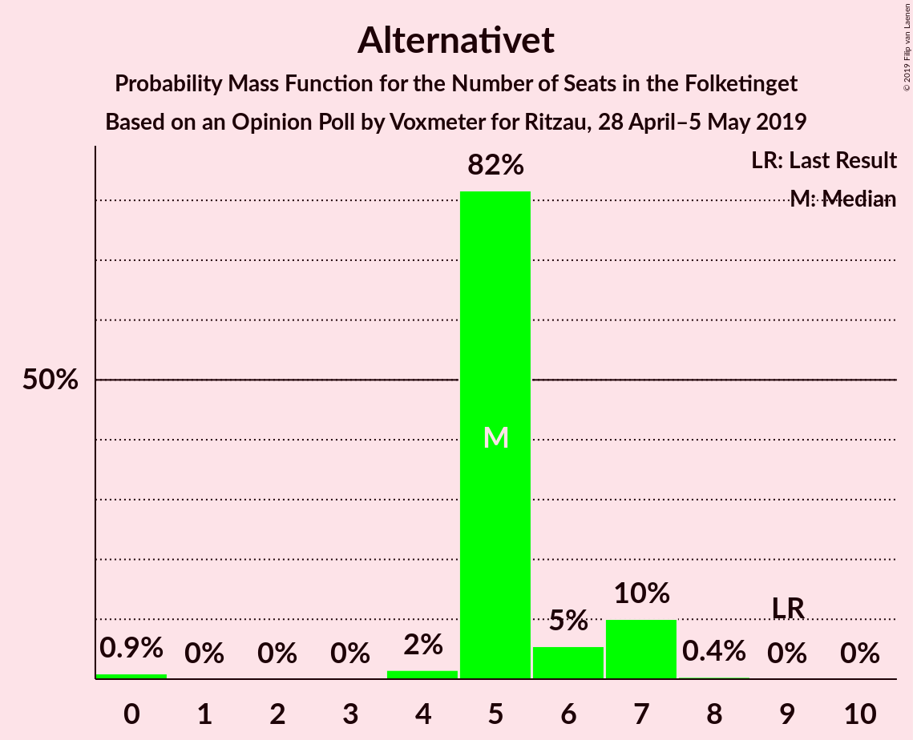

| Number of Seats | Probability | Accumulated | Special Marks |
|:---------------:|:-----------:|:-----------:|:-------------:|
| 0 | 0.9% | 100% |  |
| 1 | 0% | 99.1% |  |
| 2 | 0% | 99.1% |  |
| 3 | 0% | 99.1% |  |
| 4 | 2% | 99.1% |  |
| 5 | 82% | 98% | Median |
| 6 | 5% | 16% |  |
| 7 | 10% | 10% |  |
| 8 | 0.4% | 0.4% |  |
| 9 | 0% | 0.1% | Last Result |
| 10 | 0% | 0% |  |

### Stram Kurs

*For a full overview of the results for this party, see the [Stram Kurs](party-stramkurs.html) page.*

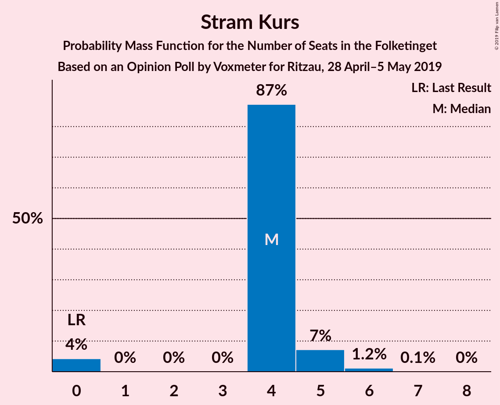

| Number of Seats | Probability | Accumulated | Special Marks |
|:---------------:|:-----------:|:-----------:|:-------------:|
| 0 | 4% | 100% | Last Result |
| 1 | 0% | 96% |  |
| 2 | 0% | 96% |  |
| 3 | 0% | 96% |  |
| 4 | 87% | 96% | Median |
| 5 | 7% | 8% |  |
| 6 | 1.2% | 1.3% |  |
| 7 | 0.1% | 0.1% |  |
| 8 | 0% | 0% |  |

### Kristendemokraterne

*For a full overview of the results for this party, see the [Kristendemokraterne](party-kristendemokraterne.html) page.*

| Number of Seats | Probability | Accumulated | Special Marks |
|:---------------:|:-----------:|:-----------:|:-------------:|
| 0 | 100% | 100% | Last Result, Median |

### Nye Borgerlige

*For a full overview of the results for this party, see the [Nye Borgerlige](party-nyeborgerlige.html) page.*

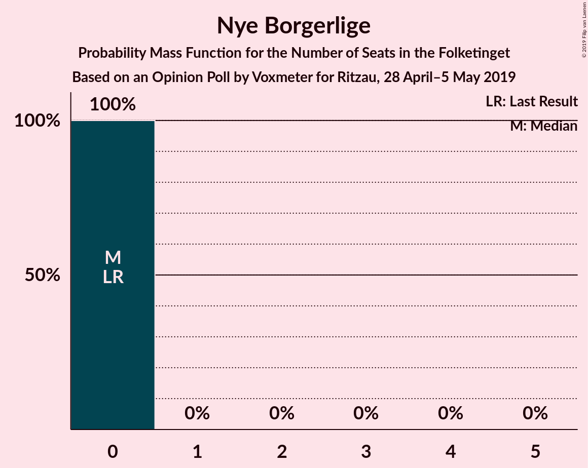

| Number of Seats | Probability | Accumulated | Special Marks |
|:---------------:|:-----------:|:-----------:|:-------------:|
| 0 | 100% | 100% | Last Result, Median |

### Klaus Riskær Pedersen

*For a full overview of the results for this party, see the [Klaus Riskær Pedersen](party-klausriskærpedersen.html) page.*

| Number of Seats | Probability | Accumulated | Special Marks |
|:---------------:|:-----------:|:-----------:|:-------------:|
| 0 | 100% | 100% | Last Result, Median |

## Coalitions

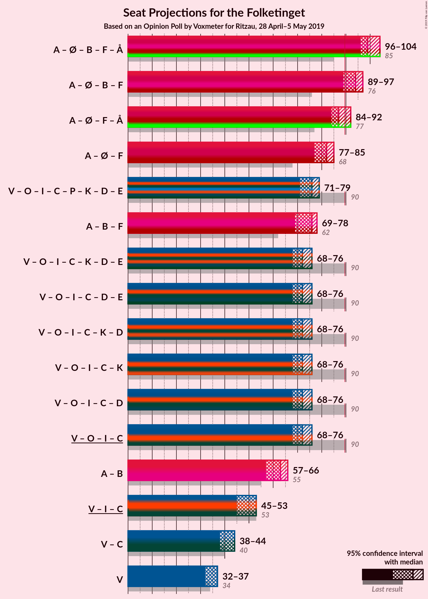

### Confidence Intervals

| Coalition | Last Result | Median | Majority? | 80% Confidence Interval | 90% Confidence Interval | 95% Confidence Interval | 99% Confidence Interval |
|:---------:|:-----------:|:------:|:---------:|:-----------------------:|:-----------------------:|:-----------------------:|:-----------------------:|
| Socialdemokraterne – Enhedslisten–De Rød-Grønne – Radikale Venstre – Socialistisk Folkeparti – Alternativet | 85 | 99 | 100% | 97–99 | 96–103 | 96–104 | 95–106 |
| Socialdemokraterne – Enhedslisten–De Rød-Grønne – Radikale Venstre – Socialistisk Folkeparti | 76 | 94 | 97% | 91–94 | 90–96 | 89–97 | 88–100 |
| Socialdemokraterne – Enhedslisten–De Rød-Grønne – Socialistisk Folkeparti – Alternativet | 77 | 87 | 6% | 84–87 | 84–91 | 84–92 | 81–93 |
| Socialdemokraterne – Enhedslisten–De Rød-Grønne – Socialistisk Folkeparti | 68 | 82 | 0% | 80–82 | 78–85 | 77–85 | 75–89 |
| Venstre – Dansk Folkeparti – Liberal Alliance – Det Konservative Folkeparti – Stram Kurs – Kristendemokraterne – Nye Borgerlige – Klaus Riskær Pedersen | 90 | 76 | 0% | 76–78 | 72–79 | 71–79 | 69–80 |
| Socialdemokraterne – Radikale Venstre – Socialistisk Folkeparti | 62 | 76 | 0% | 72–76 | 69–77 | 69–78 | 68–81 |
| Venstre – Dansk Folkeparti – Liberal Alliance – Det Konservative Folkeparti – Kristendemokraterne – Nye Borgerlige – Klaus Riskær Pedersen | 90 | 72 | 0% | 72–73 | 68–75 | 68–76 | 64–77 |
| Venstre – Dansk Folkeparti – Liberal Alliance – Det Konservative Folkeparti – Nye Borgerlige – Klaus Riskær Pedersen | 90 | 72 | 0% | 72–73 | 68–75 | 68–76 | 64–77 |
| Venstre – Dansk Folkeparti – Liberal Alliance – Det Konservative Folkeparti – Kristendemokraterne – Nye Borgerlige | 90 | 72 | 0% | 72–73 | 68–75 | 68–76 | 64–77 |
| Venstre – Dansk Folkeparti – Liberal Alliance – Det Konservative Folkeparti – Kristendemokraterne | 90 | 72 | 0% | 72–73 | 68–75 | 68–76 | 64–77 |
| Venstre – Dansk Folkeparti – Liberal Alliance – Det Konservative Folkeparti – Nye Borgerlige | 90 | 72 | 0% | 72–73 | 68–75 | 68–76 | 64–77 |
| Venstre – Dansk Folkeparti – Liberal Alliance – Det Konservative Folkeparti | 90 | 72 | 0% | 72–73 | 68–75 | 68–76 | 64–77 |
| Socialdemokraterne – Radikale Venstre | 55 | 63 | 0% | 60–63 | 57–64 | 57–66 | 57–69 |
| Venstre – Liberal Alliance – Det Konservative Folkeparti | 53 | 53 | 0% | 49–53 | 48–53 | 45–53 | 45–55 |
| Venstre – Det Konservative Folkeparti | 40 | 44 | 0% | 41–44 | 38–44 | 38–44 | 37–46 |
| Venstre | 34 | 37 | 0% | 33–37 | 33–37 | 32–37 | 31–39 |

### Socialdemokraterne – Enhedslisten–De Rød-Grønne – Radikale Venstre – Socialistisk Folkeparti – Alternativet

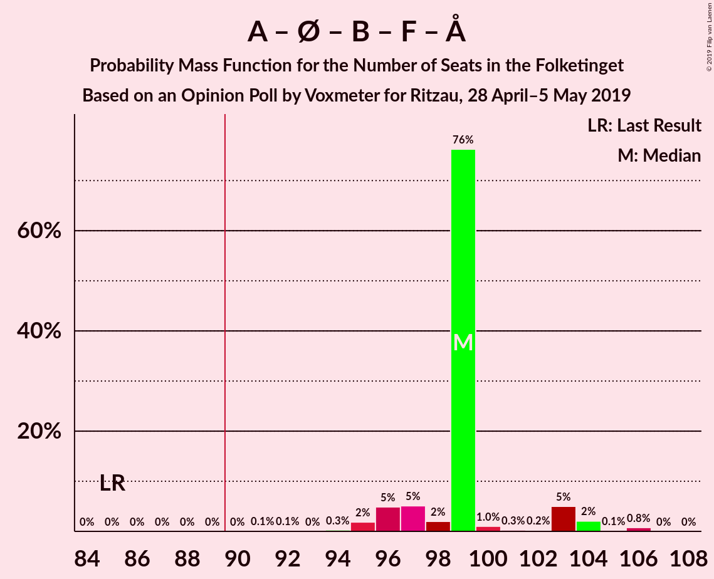

| Number of Seats | Probability | Accumulated | Special Marks |
|:---------------:|:-----------:|:-----------:|:-------------:|
| 85 | 0% | 100% | Last Result |
| 86 | 0% | 100% |  |
| 87 | 0% | 100% |  |
| 88 | 0% | 100% |  |
| 89 | 0% | 100% |  |
| 90 | 0% | 100% | Majority |
| 91 | 0.1% | 100% |  |
| 92 | 0.1% | 99.9% |  |
| 93 | 0% | 99.8% |  |
| 94 | 0.3% | 99.8% |  |
| 95 | 2% | 99.5% |  |
| 96 | 5% | 98% |  |
| 97 | 5% | 93% |  |
| 98 | 2% | 88% |  |
| 99 | 76% | 86% | Median |
| 100 | 1.0% | 9% |  |
| 101 | 0.3% | 8% |  |
| 102 | 0.2% | 8% |  |
| 103 | 5% | 8% |  |
| 104 | 2% | 3% |  |
| 105 | 0.1% | 0.8% |  |
| 106 | 0.8% | 0.8% |  |
| 107 | 0% | 0% |  |

### Socialdemokraterne – Enhedslisten–De Rød-Grønne – Radikale Venstre – Socialistisk Folkeparti

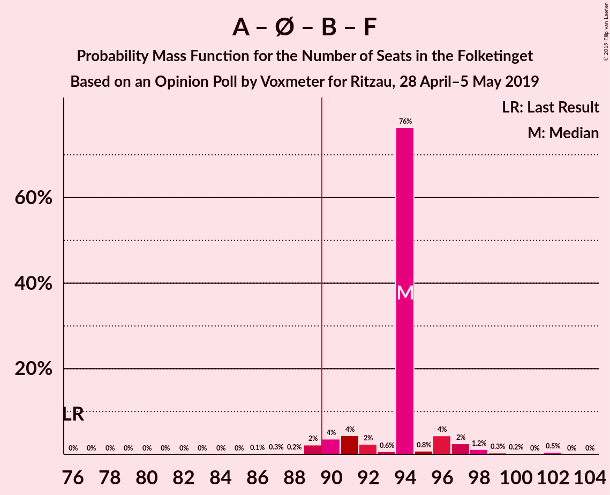

| Number of Seats | Probability | Accumulated | Special Marks |
|:---------------:|:-----------:|:-----------:|:-------------:|
| 76 | 0% | 100% | Last Result |
| 77 | 0% | 100% |  |
| 78 | 0% | 100% |  |
| 79 | 0% | 100% |  |
| 80 | 0% | 100% |  |
| 81 | 0% | 100% |  |
| 82 | 0% | 100% |  |
| 83 | 0% | 100% |  |
| 84 | 0% | 100% |  |
| 85 | 0% | 100% |  |
| 86 | 0.1% | 99.9% |  |
| 87 | 0.3% | 99.9% |  |
| 88 | 0.2% | 99.6% |  |
| 89 | 2% | 99.4% |  |
| 90 | 4% | 97% | Majority |
| 91 | 4% | 94% |  |
| 92 | 2% | 89% |  |
| 93 | 0.6% | 87% |  |
| 94 | 76% | 86% | Median |
| 95 | 0.8% | 10% |  |
| 96 | 4% | 9% |  |
| 97 | 2% | 5% |  |
| 98 | 1.2% | 2% |  |
| 99 | 0.3% | 1.1% |  |
| 100 | 0.2% | 0.7% |  |
| 101 | 0% | 0.5% |  |
| 102 | 0.5% | 0.5% |  |
| 103 | 0% | 0% |  |

### Socialdemokraterne – Enhedslisten–De Rød-Grønne – Socialistisk Folkeparti – Alternativet

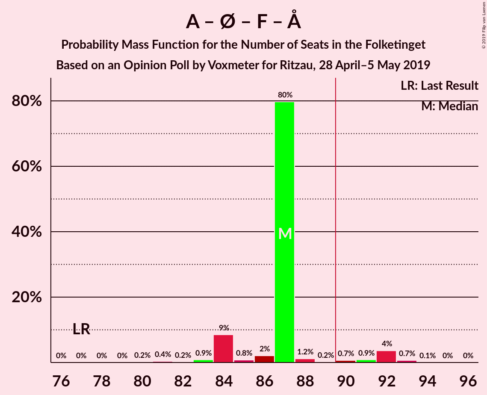

| Number of Seats | Probability | Accumulated | Special Marks |
|:---------------:|:-----------:|:-----------:|:-------------:|
| 77 | 0% | 100% | Last Result |
| 78 | 0% | 100% |  |
| 79 | 0% | 100% |  |
| 80 | 0.2% | 100% |  |
| 81 | 0.4% | 99.8% |  |
| 82 | 0.2% | 99.4% |  |
| 83 | 0.9% | 99.2% |  |
| 84 | 9% | 98% |  |
| 85 | 0.8% | 90% |  |
| 86 | 2% | 89% |  |
| 87 | 80% | 87% | Median |
| 88 | 1.2% | 7% |  |
| 89 | 0.2% | 6% |  |
| 90 | 0.7% | 6% | Majority |
| 91 | 0.9% | 5% |  |
| 92 | 4% | 4% |  |
| 93 | 0.7% | 0.8% |  |
| 94 | 0.1% | 0.1% |  |
| 95 | 0% | 0% |  |

### Socialdemokraterne – Enhedslisten–De Rød-Grønne – Socialistisk Folkeparti

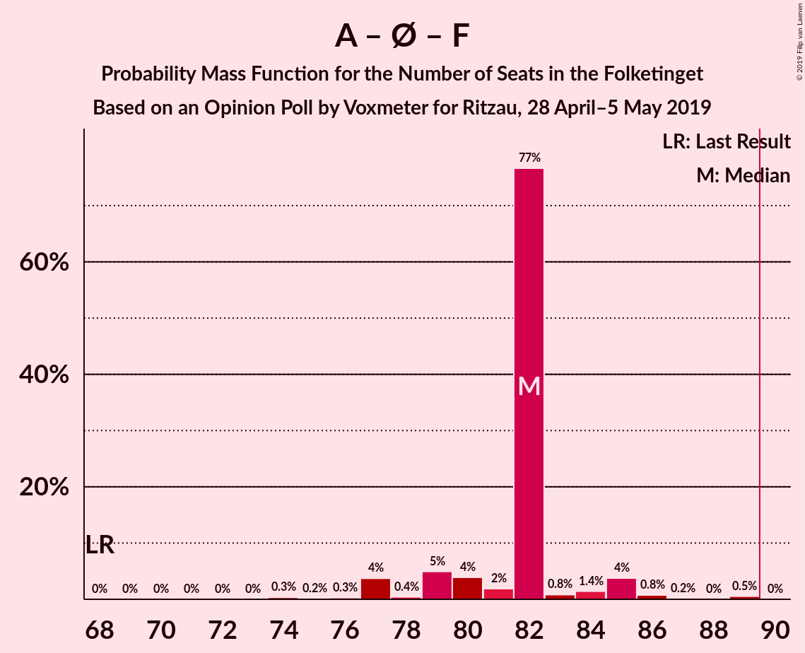

| Number of Seats | Probability | Accumulated | Special Marks |
|:---------------:|:-----------:|:-----------:|:-------------:|
| 68 | 0% | 100% | Last Result |
| 69 | 0% | 100% |  |
| 70 | 0% | 100% |  |
| 71 | 0% | 100% |  |
| 72 | 0% | 100% |  |
| 73 | 0% | 100% |  |
| 74 | 0.3% | 99.9% |  |
| 75 | 0.2% | 99.6% |  |
| 76 | 0.3% | 99.4% |  |
| 77 | 4% | 99.1% |  |
| 78 | 0.4% | 95% |  |
| 79 | 5% | 95% |  |
| 80 | 4% | 90% |  |
| 81 | 2% | 86% |  |
| 82 | 77% | 84% | Median |
| 83 | 0.8% | 8% |  |
| 84 | 1.4% | 7% |  |
| 85 | 4% | 5% |  |
| 86 | 0.8% | 2% |  |
| 87 | 0.2% | 0.8% |  |
| 88 | 0% | 0.6% |  |
| 89 | 0.5% | 0.6% |  |
| 90 | 0% | 0% | Majority |

### Venstre – Dansk Folkeparti – Liberal Alliance – Det Konservative Folkeparti – Stram Kurs – Kristendemokraterne – Nye Borgerlige – Klaus Riskær Pedersen

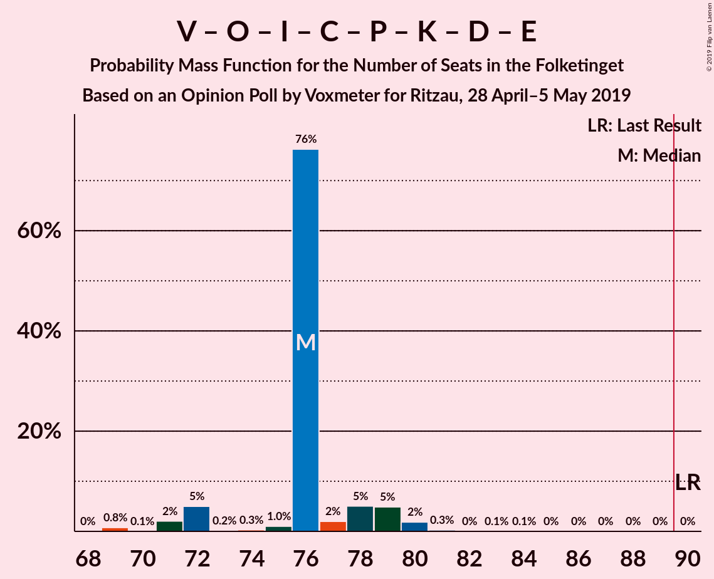

| Number of Seats | Probability | Accumulated | Special Marks |
|:---------------:|:-----------:|:-----------:|:-------------:|
| 69 | 0.8% | 100% |  |
| 70 | 0.1% | 99.2% |  |
| 71 | 2% | 99.1% |  |
| 72 | 5% | 97% |  |
| 73 | 0.2% | 92% |  |
| 74 | 0.3% | 92% |  |
| 75 | 1.0% | 92% |  |
| 76 | 76% | 91% | Median |
| 77 | 2% | 14% |  |
| 78 | 5% | 12% |  |
| 79 | 5% | 7% |  |
| 80 | 2% | 2% |  |
| 81 | 0.3% | 0.5% |  |
| 82 | 0% | 0.2% |  |
| 83 | 0.1% | 0.2% |  |
| 84 | 0.1% | 0.1% |  |
| 85 | 0% | 0% |  |
| 86 | 0% | 0% |  |
| 87 | 0% | 0% |  |
| 88 | 0% | 0% |  |
| 89 | 0% | 0% |  |
| 90 | 0% | 0% | Last Result, Majority |

### Socialdemokraterne – Radikale Venstre – Socialistisk Folkeparti

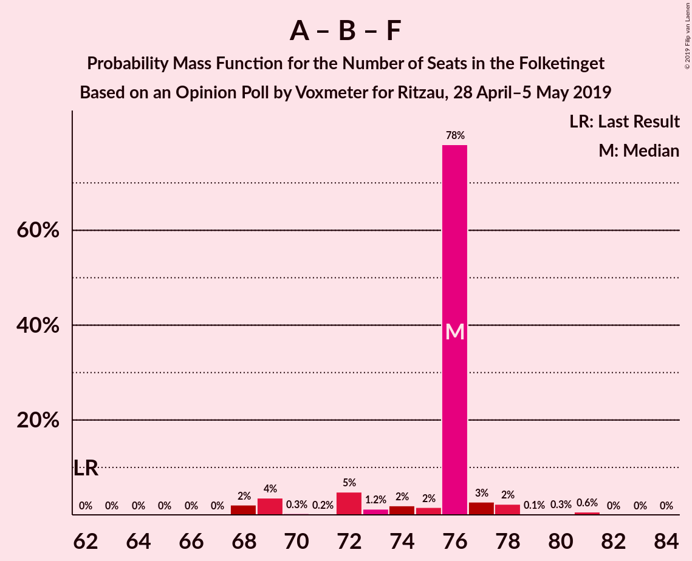

| Number of Seats | Probability | Accumulated | Special Marks |
|:---------------:|:-----------:|:-----------:|:-------------:|
| 62 | 0% | 100% | Last Result |
| 63 | 0% | 100% |  |
| 64 | 0% | 100% |  |
| 65 | 0% | 100% |  |
| 66 | 0% | 100% |  |
| 67 | 0% | 100% |  |
| 68 | 2% | 99.9% |  |
| 69 | 4% | 98% |  |
| 70 | 0.3% | 94% |  |
| 71 | 0.2% | 94% |  |
| 72 | 5% | 94% |  |
| 73 | 1.2% | 89% |  |
| 74 | 2% | 88% |  |
| 75 | 2% | 86% |  |
| 76 | 78% | 84% | Median |
| 77 | 3% | 6% |  |
| 78 | 2% | 3% |  |
| 79 | 0.1% | 1.1% |  |
| 80 | 0.3% | 1.0% |  |
| 81 | 0.6% | 0.7% |  |
| 82 | 0% | 0.1% |  |
| 83 | 0% | 0% |  |

### Venstre – Dansk Folkeparti – Liberal Alliance – Det Konservative Folkeparti – Kristendemokraterne – Nye Borgerlige – Klaus Riskær Pedersen

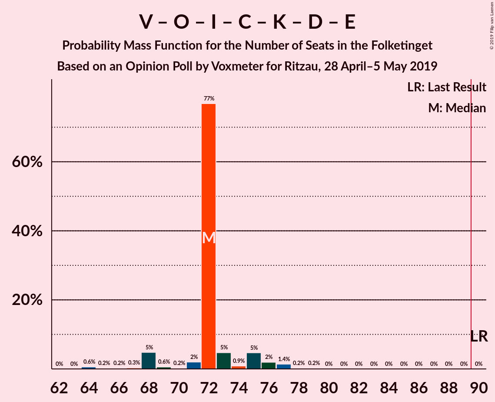

| Number of Seats | Probability | Accumulated | Special Marks |
|:---------------:|:-----------:|:-----------:|:-------------:|
| 64 | 0.6% | 100% |  |
| 65 | 0.2% | 99.4% |  |
| 66 | 0.2% | 99.1% |  |
| 67 | 0.3% | 98.9% |  |
| 68 | 5% | 98.6% |  |
| 69 | 0.6% | 94% |  |
| 70 | 0.2% | 93% |  |
| 71 | 2% | 93% |  |
| 72 | 77% | 91% | Median |
| 73 | 5% | 14% |  |
| 74 | 0.9% | 9% |  |
| 75 | 5% | 9% |  |
| 76 | 2% | 4% |  |
| 77 | 1.4% | 2% |  |
| 78 | 0.2% | 0.5% |  |
| 79 | 0.2% | 0.2% |  |
| 80 | 0% | 0% |  |
| 81 | 0% | 0% |  |
| 82 | 0% | 0% |  |
| 83 | 0% | 0% |  |
| 84 | 0% | 0% |  |
| 85 | 0% | 0% |  |
| 86 | 0% | 0% |  |
| 87 | 0% | 0% |  |
| 88 | 0% | 0% |  |
| 89 | 0% | 0% |  |
| 90 | 0% | 0% | Last Result, Majority |

### Venstre – Dansk Folkeparti – Liberal Alliance – Det Konservative Folkeparti – Nye Borgerlige – Klaus Riskær Pedersen

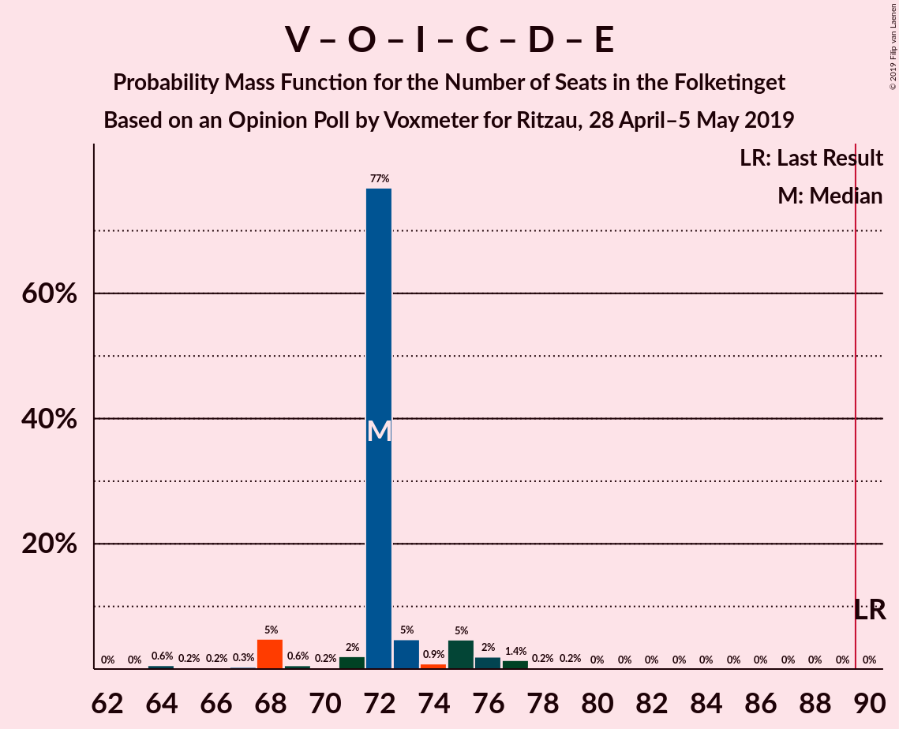

| Number of Seats | Probability | Accumulated | Special Marks |
|:---------------:|:-----------:|:-----------:|:-------------:|
| 64 | 0.6% | 100% |  |
| 65 | 0.2% | 99.4% |  |
| 66 | 0.2% | 99.1% |  |
| 67 | 0.3% | 98.9% |  |
| 68 | 5% | 98.6% |  |
| 69 | 0.6% | 94% |  |
| 70 | 0.2% | 93% |  |
| 71 | 2% | 93% |  |
| 72 | 77% | 91% | Median |
| 73 | 5% | 14% |  |
| 74 | 0.9% | 9% |  |
| 75 | 5% | 9% |  |
| 76 | 2% | 4% |  |
| 77 | 1.4% | 2% |  |
| 78 | 0.2% | 0.5% |  |
| 79 | 0.2% | 0.2% |  |
| 80 | 0% | 0% |  |
| 81 | 0% | 0% |  |
| 82 | 0% | 0% |  |
| 83 | 0% | 0% |  |
| 84 | 0% | 0% |  |
| 85 | 0% | 0% |  |
| 86 | 0% | 0% |  |
| 87 | 0% | 0% |  |
| 88 | 0% | 0% |  |
| 89 | 0% | 0% |  |
| 90 | 0% | 0% | Last Result, Majority |

### Venstre – Dansk Folkeparti – Liberal Alliance – Det Konservative Folkeparti – Kristendemokraterne – Nye Borgerlige

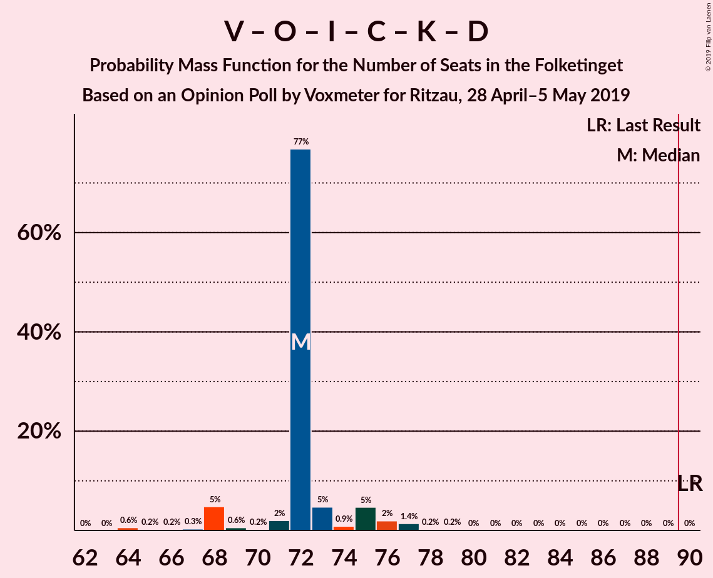

| Number of Seats | Probability | Accumulated | Special Marks |
|:---------------:|:-----------:|:-----------:|:-------------:|
| 64 | 0.6% | 100% |  |
| 65 | 0.2% | 99.4% |  |
| 66 | 0.2% | 99.1% |  |
| 67 | 0.3% | 98.9% |  |
| 68 | 5% | 98.6% |  |
| 69 | 0.6% | 94% |  |
| 70 | 0.2% | 93% |  |
| 71 | 2% | 93% |  |
| 72 | 77% | 91% | Median |
| 73 | 5% | 14% |  |
| 74 | 0.9% | 9% |  |
| 75 | 5% | 9% |  |
| 76 | 2% | 4% |  |
| 77 | 1.4% | 2% |  |
| 78 | 0.2% | 0.5% |  |
| 79 | 0.2% | 0.2% |  |
| 80 | 0% | 0% |  |
| 81 | 0% | 0% |  |
| 82 | 0% | 0% |  |
| 83 | 0% | 0% |  |
| 84 | 0% | 0% |  |
| 85 | 0% | 0% |  |
| 86 | 0% | 0% |  |
| 87 | 0% | 0% |  |
| 88 | 0% | 0% |  |
| 89 | 0% | 0% |  |
| 90 | 0% | 0% | Last Result, Majority |

### Venstre – Dansk Folkeparti – Liberal Alliance – Det Konservative Folkeparti – Kristendemokraterne

| Number of Seats | Probability | Accumulated | Special Marks |
|:---------------:|:-----------:|:-----------:|:-------------:|
| 64 | 0.6% | 100% |  |
| 65 | 0.2% | 99.4% |  |
| 66 | 0.2% | 99.1% |  |
| 67 | 0.3% | 98.9% |  |
| 68 | 5% | 98.6% |  |
| 69 | 0.6% | 94% |  |
| 70 | 0.2% | 93% |  |
| 71 | 2% | 93% |  |
| 72 | 77% | 91% | Median |
| 73 | 5% | 14% |  |
| 74 | 0.9% | 9% |  |
| 75 | 5% | 9% |  |
| 76 | 2% | 4% |  |
| 77 | 1.4% | 2% |  |
| 78 | 0.2% | 0.5% |  |
| 79 | 0.2% | 0.2% |  |
| 80 | 0% | 0% |  |
| 81 | 0% | 0% |  |
| 82 | 0% | 0% |  |
| 83 | 0% | 0% |  |
| 84 | 0% | 0% |  |
| 85 | 0% | 0% |  |
| 86 | 0% | 0% |  |
| 87 | 0% | 0% |  |
| 88 | 0% | 0% |  |
| 89 | 0% | 0% |  |
| 90 | 0% | 0% | Last Result, Majority |

### Venstre – Dansk Folkeparti – Liberal Alliance – Det Konservative Folkeparti – Nye Borgerlige

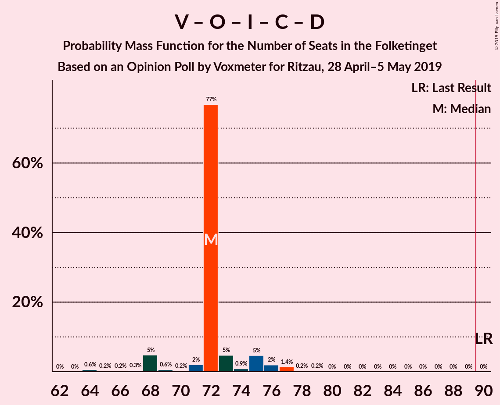

| Number of Seats | Probability | Accumulated | Special Marks |
|:---------------:|:-----------:|:-----------:|:-------------:|
| 64 | 0.6% | 100% |  |
| 65 | 0.2% | 99.4% |  |
| 66 | 0.2% | 99.1% |  |
| 67 | 0.3% | 98.9% |  |
| 68 | 5% | 98.6% |  |
| 69 | 0.6% | 94% |  |
| 70 | 0.2% | 93% |  |
| 71 | 2% | 93% |  |
| 72 | 77% | 91% | Median |
| 73 | 5% | 14% |  |
| 74 | 0.9% | 9% |  |
| 75 | 5% | 9% |  |
| 76 | 2% | 4% |  |
| 77 | 1.4% | 2% |  |
| 78 | 0.2% | 0.5% |  |
| 79 | 0.2% | 0.2% |  |
| 80 | 0% | 0% |  |
| 81 | 0% | 0% |  |
| 82 | 0% | 0% |  |
| 83 | 0% | 0% |  |
| 84 | 0% | 0% |  |
| 85 | 0% | 0% |  |
| 86 | 0% | 0% |  |
| 87 | 0% | 0% |  |
| 88 | 0% | 0% |  |
| 89 | 0% | 0% |  |
| 90 | 0% | 0% | Last Result, Majority |

### Venstre – Dansk Folkeparti – Liberal Alliance – Det Konservative Folkeparti

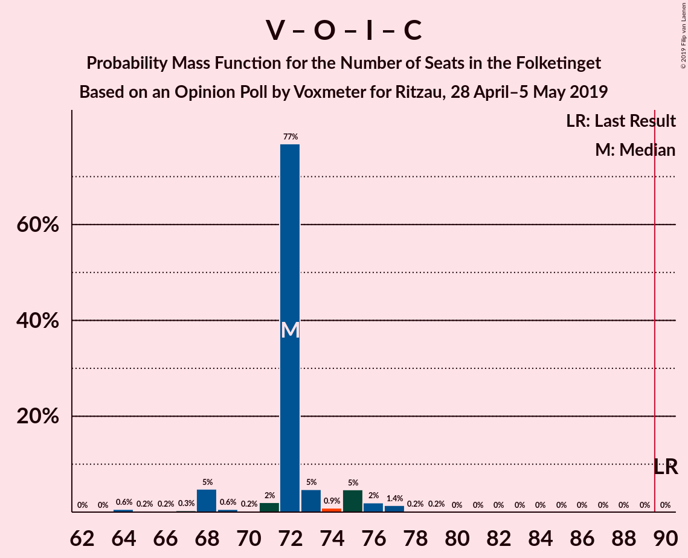

| Number of Seats | Probability | Accumulated | Special Marks |
|:---------------:|:-----------:|:-----------:|:-------------:|
| 64 | 0.6% | 100% |  |
| 65 | 0.2% | 99.4% |  |
| 66 | 0.2% | 99.1% |  |
| 67 | 0.3% | 98.9% |  |
| 68 | 5% | 98.6% |  |
| 69 | 0.6% | 94% |  |
| 70 | 0.2% | 93% |  |
| 71 | 2% | 93% |  |
| 72 | 77% | 91% | Median |
| 73 | 5% | 14% |  |
| 74 | 0.9% | 9% |  |
| 75 | 5% | 9% |  |
| 76 | 2% | 4% |  |
| 77 | 1.4% | 2% |  |
| 78 | 0.2% | 0.5% |  |
| 79 | 0.2% | 0.2% |  |
| 80 | 0% | 0% |  |
| 81 | 0% | 0% |  |
| 82 | 0% | 0% |  |
| 83 | 0% | 0% |  |
| 84 | 0% | 0% |  |
| 85 | 0% | 0% |  |
| 86 | 0% | 0% |  |
| 87 | 0% | 0% |  |
| 88 | 0% | 0% |  |
| 89 | 0% | 0% |  |
| 90 | 0% | 0% | Last Result, Majority |

### Socialdemokraterne – Radikale Venstre

| Number of Seats | Probability | Accumulated | Special Marks |
|:---------------:|:-----------:|:-----------:|:-------------:|
| 54 | 0.1% | 100% |  |
| 55 | 0% | 99.9% | Last Result |
| 56 | 0.2% | 99.9% |  |
| 57 | 6% | 99.7% |  |
| 58 | 2% | 94% |  |
| 59 | 0.6% | 92% |  |
| 60 | 5% | 92% |  |
| 61 | 3% | 87% |  |
| 62 | 1.0% | 84% |  |
| 63 | 76% | 83% | Median |
| 64 | 3% | 7% |  |
| 65 | 0.5% | 4% |  |
| 66 | 2% | 3% |  |
| 67 | 0.2% | 1.0% |  |
| 68 | 0.2% | 0.8% |  |
| 69 | 0.5% | 0.6% |  |
| 70 | 0% | 0.1% |  |
| 71 | 0% | 0% |  |

### Venstre – Liberal Alliance – Det Konservative Folkeparti

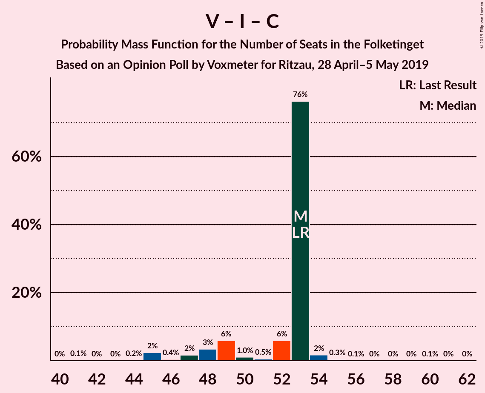

| Number of Seats | Probability | Accumulated | Special Marks |
|:---------------:|:-----------:|:-----------:|:-------------:|
| 41 | 0.1% | 100% |  |
| 42 | 0% | 99.9% |  |
| 43 | 0% | 99.9% |  |
| 44 | 0.2% | 99.9% |  |
| 45 | 2% | 99.7% |  |
| 46 | 0.4% | 97% |  |
| 47 | 2% | 97% |  |
| 48 | 3% | 95% |  |
| 49 | 6% | 92% |  |
| 50 | 1.0% | 86% |  |
| 51 | 0.5% | 85% |  |
| 52 | 6% | 84% |  |
| 53 | 76% | 78% | Last Result, Median |
| 54 | 2% | 2% |  |
| 55 | 0.3% | 0.5% |  |
| 56 | 0.1% | 0.2% |  |
| 57 | 0% | 0.1% |  |
| 58 | 0% | 0.1% |  |
| 59 | 0% | 0.1% |  |
| 60 | 0.1% | 0.1% |  |
| 61 | 0% | 0% |  |

### Venstre – Det Konservative Folkeparti

| Number of Seats | Probability | Accumulated | Special Marks |
|:---------------:|:-----------:|:-----------:|:-------------:|
| 35 | 0.1% | 100% |  |
| 36 | 0% | 99.9% |  |
| 37 | 1.4% | 99.8% |  |
| 38 | 5% | 98% |  |
| 39 | 2% | 94% |  |
| 40 | 1.1% | 92% | Last Result |
| 41 | 1.3% | 91% |  |
| 42 | 5% | 89% |  |
| 43 | 3% | 84% |  |
| 44 | 80% | 81% | Median |
| 45 | 0.5% | 1.1% |  |
| 46 | 0.4% | 0.6% |  |
| 47 | 0.1% | 0.2% |  |
| 48 | 0% | 0.1% |  |
| 49 | 0% | 0.1% |  |
| 50 | 0% | 0.1% |  |
| 51 | 0.1% | 0.1% |  |
| 52 | 0% | 0% |  |

### Venstre

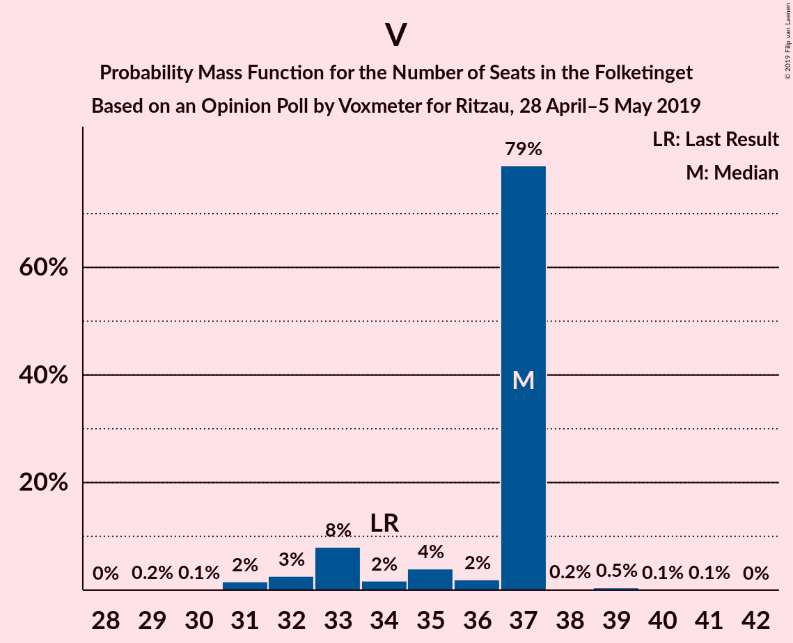

| Number of Seats | Probability | Accumulated | Special Marks |
|:---------------:|:-----------:|:-----------:|:-------------:|
| 29 | 0.2% | 100% |  |
| 30 | 0.1% | 99.8% |  |
| 31 | 2% | 99.7% |  |
| 32 | 3% | 98% |  |
| 33 | 8% | 96% |  |
| 34 | 2% | 88% | Last Result |
| 35 | 4% | 86% |  |
| 36 | 2% | 82% |  |
| 37 | 79% | 80% | Median |
| 38 | 0.2% | 0.9% |  |
| 39 | 0.5% | 0.7% |  |
| 40 | 0.1% | 0.2% |  |
| 41 | 0.1% | 0.1% |  |
| 42 | 0% | 0% |  |

## Technical Information

### Opinion Poll

+ **Polling firm:** Voxmeter
+ **Commissioner(s):** Ritzau
+ **Fieldwork period:** 28 April–5 May 2019

### Calculations

+ **Sample size:** 1045
+ **Simulations done:** 1,048,576
+ **Error estimate:** 2.35%

