# Opinion Poll by Epinion for DR, 7 May 2019

<a href="#voting-intentions">Voting Intentions</a> | <a href="#seats">Seats</a> | <a href="#coalitions">Coalitions</a> | <a href="#technical-information">Technical Information</a>

## Voting Intentions

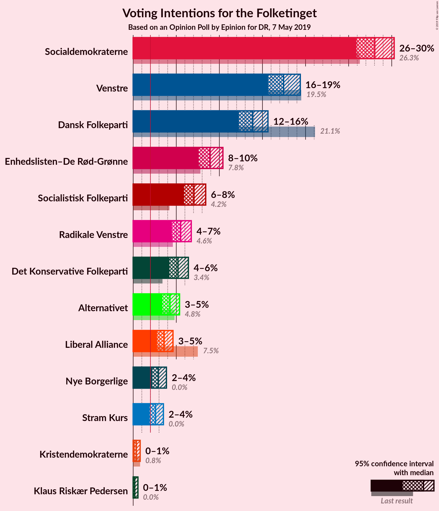

### Confidence Intervals

| Party | Last Result | Poll Result | 80% Confidence Interval | 90% Confidence Interval | 95% Confidence Interval | 99% Confidence Interval |
|:-----:|:-----------:|:-----------:|:-----------------------:|:-----------------------:|:-----------------------:|:-----------------------:|
| Socialdemokraterne | 26.3% | 28.0% | 26.6–29.5% |26.2–29.9% |25.9–30.3% |25.2–31.0% |
| Venstre | 19.5% | 17.5% | 16.3–18.7% |16.0–19.1% |15.7–19.4% |15.1–20.0% |
| Dansk Folkeparti | 21.1% | 13.9% | 12.8–15.0% |12.5–15.3% |12.3–15.6% |11.8–16.2% |
| Enhedslisten–De Rød-Grønne | 7.8% | 8.9% | 8.1–9.9% |7.8–10.2% |7.6–10.4% |7.2–10.9% |
| Socialistisk Folkeparti | 4.2% | 7.1% | 6.3–7.9% |6.1–8.2% |5.9–8.4% |5.6–8.9% |
| Radikale Venstre | 4.6% | 5.5% | 4.8–6.3% |4.6–6.5% |4.5–6.7% |4.2–7.1% |
| Det Konservative Folkeparti | 3.4% | 5.2% | 4.5–6.0% |4.4–6.2% |4.2–6.4% |3.9–6.8% |
| Alternativet | 4.8% | 4.3% | 3.7–5.0% |3.5–5.2% |3.4–5.4% |3.1–5.7% |
| Liberal Alliance | 7.5% | 3.6% | 3.0–4.3% |2.9–4.5% |2.8–4.6% |2.5–5.0% |
| Nye Borgerlige | 0.0% | 2.9% | 2.4–3.5% |2.3–3.7% |2.2–3.9% |2.0–4.2% |
| Stram Kurs | 0.0% | 2.6% | 2.1–3.2% |2.0–3.4% |1.9–3.5% |1.7–3.8% |
| Kristendemokraterne | 0.8% | 0.4% | 0.2–0.7% |0.2–0.7% |0.2–0.8% |0.1–1.0% |
| Klaus Riskær Pedersen | 0.0% | 0.2% | 0.1–0.4% |0.1–0.5% |0.1–0.5% |0.0–0.7% |

*Note:* The poll result column reflects the actual value used in the calculations. Published results may vary slightly, and in addition be rounded to fewer digits.

## Seats

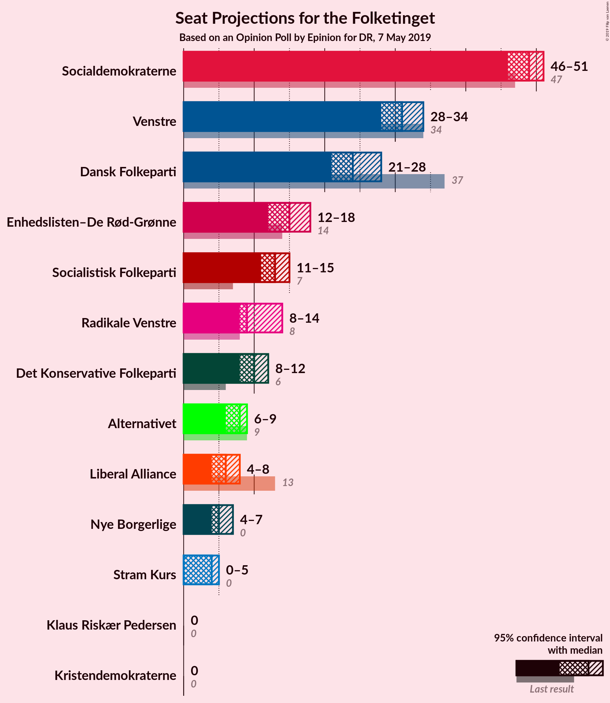

### Confidence Intervals

| Party | Last Result | Median | 80% Confidence Interval | 90% Confidence Interval | 95% Confidence Interval | 99% Confidence Interval |
|:-----:|:-----------:|:------:|:-----------------------:|:-----------------------:|:-----------------------:|:-----------------------:|
| <a href="#socialdemokraterne">Socialdemokraterne</a> | 47 | 49 | 46–51 |46–51 |46–51 |44–53 |
| <a href="#venstre">Venstre</a> | 34 | 31 | 29–33 |29–33 |28–34 |27–36 |
| <a href="#dansk-folkeparti">Dansk Folkeparti</a> | 37 | 24 | 23–26 |23–27 |21–28 |21–28 |
| <a href="#enhedslisten–de-rød-grønne">Enhedslisten–De Rød-Grønne</a> | 14 | 15 | 14–16 |13–16 |12–18 |12–19 |
| <a href="#socialistisk-folkeparti">Socialistisk Folkeparti</a> | 7 | 13 | 12–14 |12–14 |11–15 |10–16 |
| <a href="#radikale-venstre">Radikale Venstre</a> | 8 | 9 | 8–13 |8–14 |8–14 |7–14 |
| <a href="#det-konservative-folkeparti">Det Konservative Folkeparti</a> | 6 | 10 | 9–11 |8–11 |8–12 |7–12 |
| <a href="#alternativet">Alternativet</a> | 9 | 8 | 6–9 |6–9 |6–9 |6–10 |
| <a href="#liberal-alliance">Liberal Alliance</a> | 13 | 6 | 4–8 |4–8 |4–8 |4–9 |
| <a href="#nye-borgerlige">Nye Borgerlige</a> | 0 | 5 | 5–6 |5–6 |4–7 |4–7 |
| <a href="#stram-kurs">Stram Kurs</a> | 0 | 4 | 0–5 |0–5 |0–5 |0–6 |
| <a href="#kristendemokraterne">Kristendemokraterne</a> | 0 | 0 | 0 |0 |0 |0 |
| <a href="#klaus-riskær-pedersen">Klaus Riskær Pedersen</a> | 0 | 0 | 0 |0 |0 |0 |

### Socialdemokraterne

*For a full overview of the results for this party, see the [Socialdemokraterne](party-socialdemokraterne.html) page.*

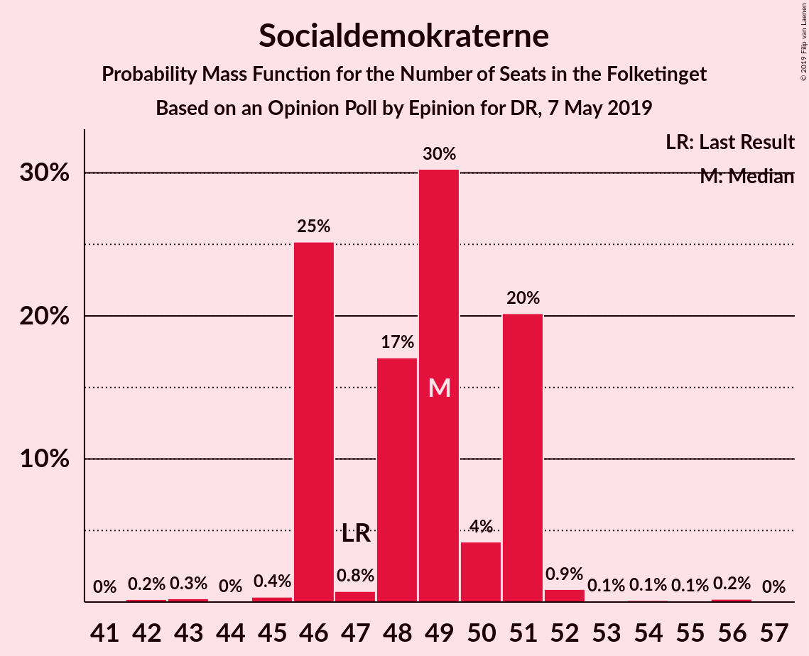

| Number of Seats | Probability | Accumulated | Special Marks |
|:---------------:|:-----------:|:-----------:|:-------------:|
| 42 | 0.2% | 100% |  |
| 43 | 0.3% | 99.8% |  |
| 44 | 0% | 99.5% |  |
| 45 | 0.4% | 99.5% |  |
| 46 | 25% | 99.1% |  |
| 47 | 0.8% | 74% | Last Result |
| 48 | 17% | 73% |  |
| 49 | 30% | 56% | Median |
| 50 | 4% | 26% |  |
| 51 | 20% | 22% |  |
| 52 | 0.9% | 1.4% |  |
| 53 | 0.1% | 0.5% |  |
| 54 | 0.1% | 0.4% |  |
| 55 | 0.1% | 0.3% |  |
| 56 | 0.2% | 0.2% |  |
| 57 | 0% | 0% |  |

### Venstre

*For a full overview of the results for this party, see the [Venstre](party-venstre.html) page.*

| Number of Seats | Probability | Accumulated | Special Marks |
|:---------------:|:-----------:|:-----------:|:-------------:|
| 26 | 0.1% | 100% |  |
| 27 | 1.2% | 99.8% |  |
| 28 | 2% | 98.7% |  |
| 29 | 12% | 97% |  |
| 30 | 4% | 84% |  |
| 31 | 39% | 81% | Median |
| 32 | 3% | 42% |  |
| 33 | 35% | 39% |  |
| 34 | 3% | 4% | Last Result |
| 35 | 0.4% | 1.0% |  |
| 36 | 0.5% | 0.6% |  |
| 37 | 0.1% | 0.1% |  |
| 38 | 0% | 0% |  |

### Dansk Folkeparti

*For a full overview of the results for this party, see the [Dansk Folkeparti](party-danskfolkeparti.html) page.*

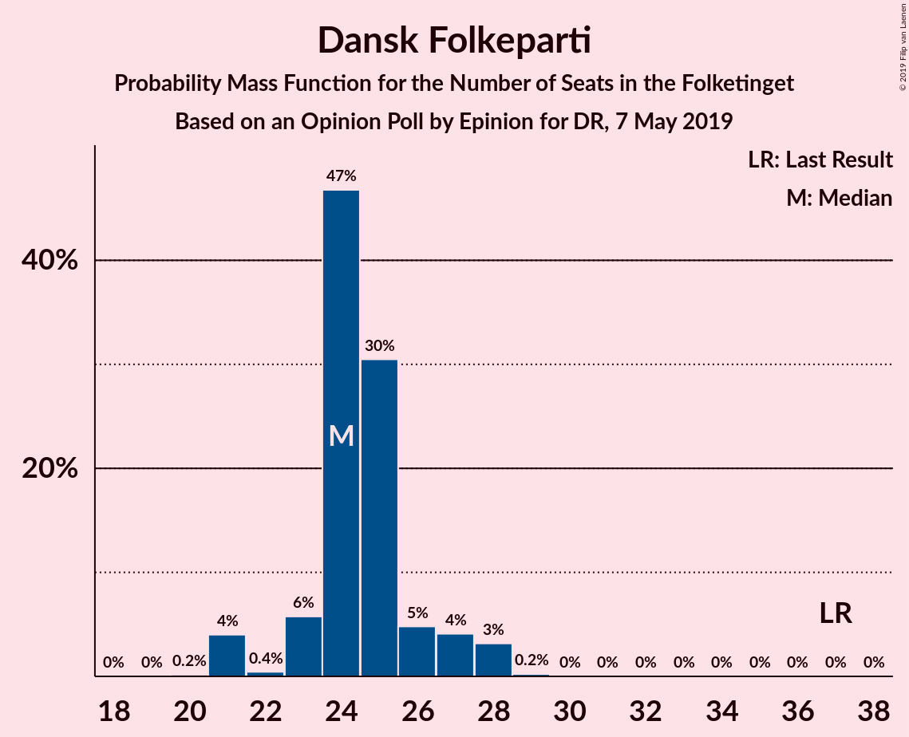

| Number of Seats | Probability | Accumulated | Special Marks |
|:---------------:|:-----------:|:-----------:|:-------------:|
| 20 | 0.2% | 100% |  |
| 21 | 4% | 99.8% |  |
| 22 | 0.4% | 96% |  |
| 23 | 6% | 95% |  |
| 24 | 47% | 90% | Median |
| 25 | 30% | 43% |  |
| 26 | 5% | 12% |  |
| 27 | 4% | 8% |  |
| 28 | 3% | 3% |  |
| 29 | 0.2% | 0.3% |  |
| 30 | 0% | 0% |  |
| 31 | 0% | 0% |  |
| 32 | 0% | 0% |  |
| 33 | 0% | 0% |  |
| 34 | 0% | 0% |  |
| 35 | 0% | 0% |  |
| 36 | 0% | 0% |  |
| 37 | 0% | 0% | Last Result |

### Enhedslisten–De Rød-Grønne

*For a full overview of the results for this party, see the [Enhedslisten–De Rød-Grønne](party-enhedslisten–derød-grønne.html) page.*

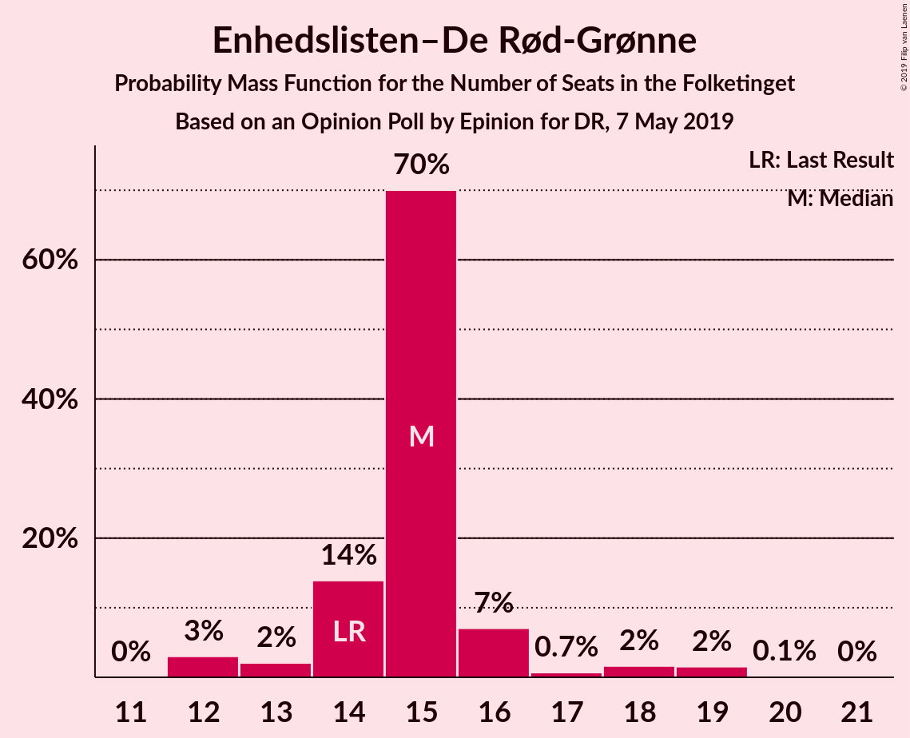

| Number of Seats | Probability | Accumulated | Special Marks |
|:---------------:|:-----------:|:-----------:|:-------------:|
| 12 | 3% | 100% |  |
| 13 | 2% | 97% |  |
| 14 | 14% | 95% | Last Result |
| 15 | 70% | 81% | Median |
| 16 | 7% | 11% |  |
| 17 | 0.7% | 4% |  |
| 18 | 2% | 3% |  |
| 19 | 2% | 2% |  |
| 20 | 0.1% | 0.1% |  |
| 21 | 0% | 0% |  |

### Socialistisk Folkeparti

*For a full overview of the results for this party, see the [Socialistisk Folkeparti](party-socialistiskfolkeparti.html) page.*

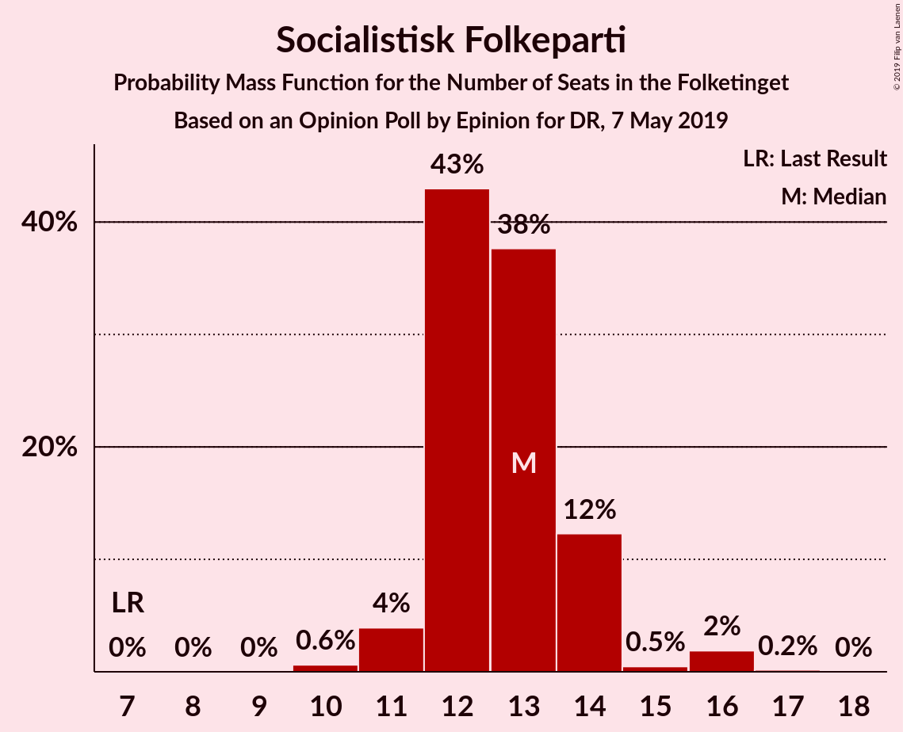

| Number of Seats | Probability | Accumulated | Special Marks |
|:---------------:|:-----------:|:-----------:|:-------------:|
| 7 | 0% | 100% | Last Result |
| 8 | 0% | 100% |  |
| 9 | 0% | 100% |  |
| 10 | 0.6% | 100% |  |
| 11 | 4% | 99.4% |  |
| 12 | 43% | 95% |  |
| 13 | 38% | 52% | Median |
| 14 | 12% | 15% |  |
| 15 | 0.5% | 3% |  |
| 16 | 2% | 2% |  |
| 17 | 0.2% | 0.2% |  |
| 18 | 0% | 0% |  |

### Radikale Venstre

*For a full overview of the results for this party, see the [Radikale Venstre](party-radikalevenstre.html) page.*

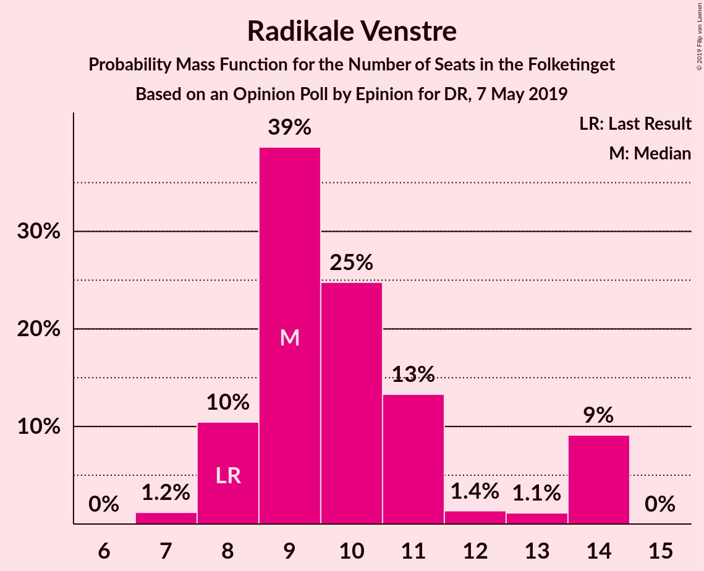

| Number of Seats | Probability | Accumulated | Special Marks |
|:---------------:|:-----------:|:-----------:|:-------------:|
| 7 | 1.2% | 100% |  |
| 8 | 10% | 98.8% | Last Result |
| 9 | 39% | 88% | Median |
| 10 | 25% | 50% |  |
| 11 | 13% | 25% |  |
| 12 | 1.4% | 12% |  |
| 13 | 1.1% | 10% |  |
| 14 | 9% | 9% |  |
| 15 | 0% | 0% |  |

### Det Konservative Folkeparti

*For a full overview of the results for this party, see the [Det Konservative Folkeparti](party-detkonservativefolkeparti.html) page.*

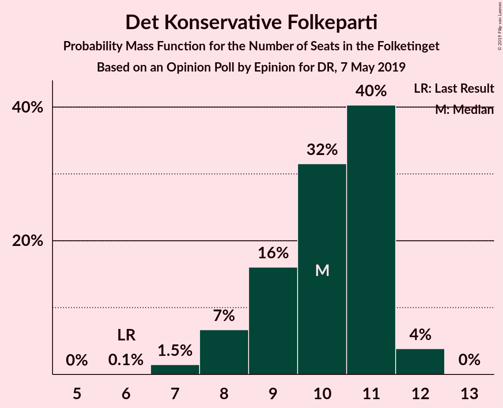

| Number of Seats | Probability | Accumulated | Special Marks |
|:---------------:|:-----------:|:-----------:|:-------------:|
| 6 | 0.1% | 100% | Last Result |
| 7 | 1.5% | 99.9% |  |
| 8 | 7% | 98% |  |
| 9 | 16% | 92% |  |
| 10 | 32% | 76% | Median |
| 11 | 40% | 44% |  |
| 12 | 4% | 4% |  |
| 13 | 0% | 0% |  |

### Alternativet

*For a full overview of the results for this party, see the [Alternativet](party-alternativet.html) page.*

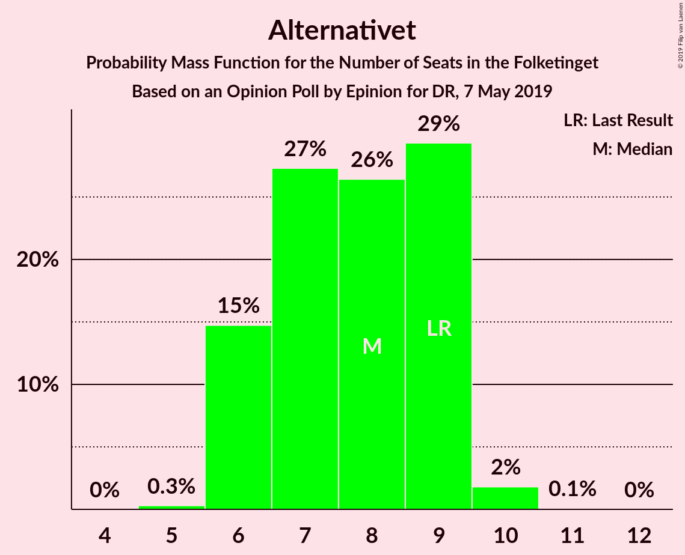

| Number of Seats | Probability | Accumulated | Special Marks |
|:---------------:|:-----------:|:-----------:|:-------------:|
| 5 | 0.3% | 100% |  |
| 6 | 15% | 99.7% |  |
| 7 | 27% | 85% |  |
| 8 | 26% | 58% | Median |
| 9 | 29% | 31% | Last Result |
| 10 | 2% | 2% |  |
| 11 | 0.1% | 0.1% |  |
| 12 | 0% | 0% |  |

### Liberal Alliance

*For a full overview of the results for this party, see the [Liberal Alliance](party-liberalalliance.html) page.*

| Number of Seats | Probability | Accumulated | Special Marks |
|:---------------:|:-----------:|:-----------:|:-------------:|
| 4 | 20% | 100% |  |
| 5 | 4% | 80% |  |
| 6 | 29% | 77% | Median |
| 7 | 37% | 48% |  |
| 8 | 9% | 11% |  |
| 9 | 2% | 2% |  |
| 10 | 0% | 0% |  |
| 11 | 0% | 0% |  |
| 12 | 0% | 0% |  |
| 13 | 0% | 0% | Last Result |

### Nye Borgerlige

*For a full overview of the results for this party, see the [Nye Borgerlige](party-nyeborgerlige.html) page.*

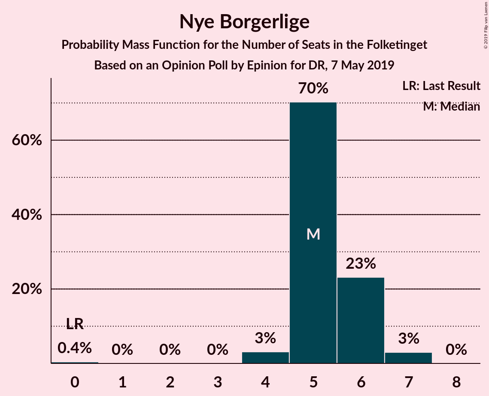

| Number of Seats | Probability | Accumulated | Special Marks |
|:---------------:|:-----------:|:-----------:|:-------------:|
| 0 | 0.4% | 100% | Last Result |
| 1 | 0% | 99.6% |  |
| 2 | 0% | 99.6% |  |
| 3 | 0% | 99.6% |  |
| 4 | 3% | 99.6% |  |
| 5 | 70% | 96% | Median |
| 6 | 23% | 26% |  |
| 7 | 3% | 3% |  |
| 8 | 0% | 0% |  |

### Stram Kurs

*For a full overview of the results for this party, see the [Stram Kurs](party-stramkurs.html) page.*

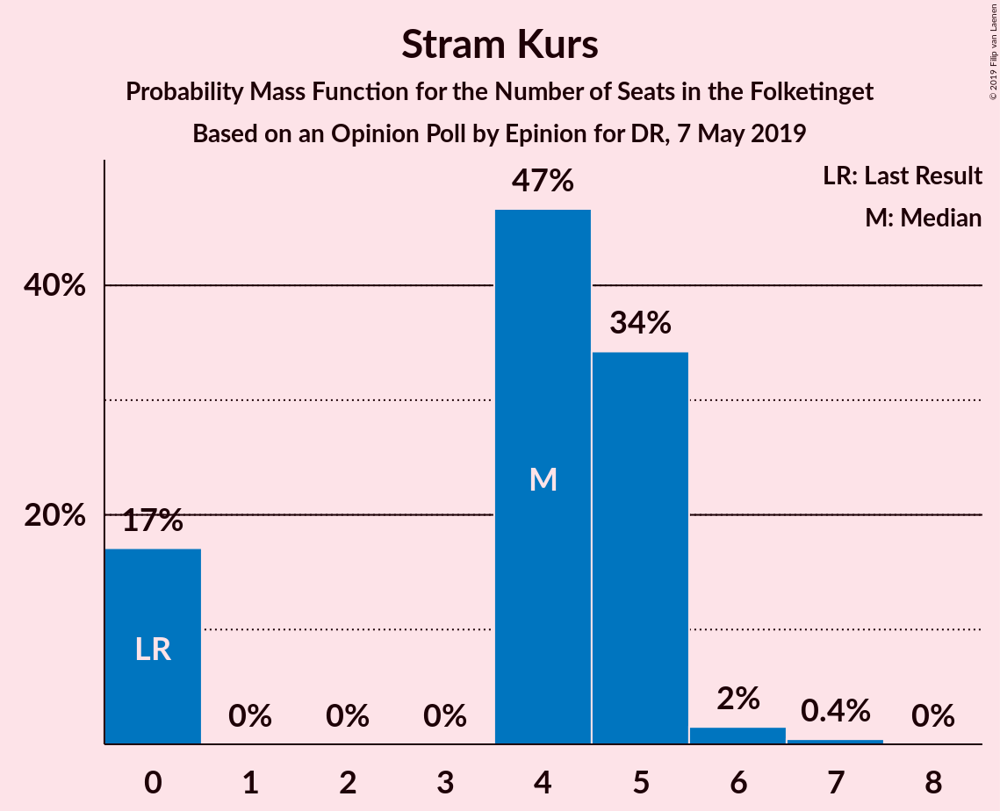

| Number of Seats | Probability | Accumulated | Special Marks |
|:---------------:|:-----------:|:-----------:|:-------------:|
| 0 | 17% | 100% | Last Result |
| 1 | 0% | 83% |  |
| 2 | 0% | 83% |  |
| 3 | 0% | 83% |  |
| 4 | 47% | 83% | Median |
| 5 | 34% | 36% |  |
| 6 | 2% | 2% |  |
| 7 | 0.4% | 0.5% |  |
| 8 | 0% | 0% |  |

### Kristendemokraterne

*For a full overview of the results for this party, see the [Kristendemokraterne](party-kristendemokraterne.html) page.*

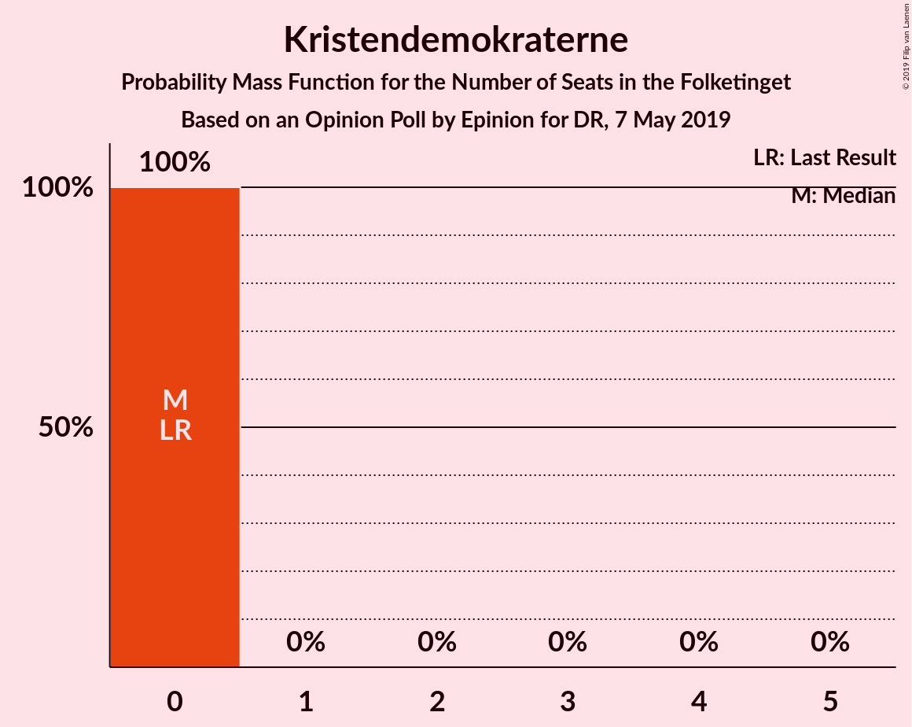

| Number of Seats | Probability | Accumulated | Special Marks |
|:---------------:|:-----------:|:-----------:|:-------------:|
| 0 | 100% | 100% | Last Result, Median |

### Klaus Riskær Pedersen

*For a full overview of the results for this party, see the [Klaus Riskær Pedersen](party-klausriskærpedersen.html) page.*

| Number of Seats | Probability | Accumulated | Special Marks |
|:---------------:|:-----------:|:-----------:|:-------------:|
| 0 | 100% | 100% | Last Result, Median |

## Coalitions

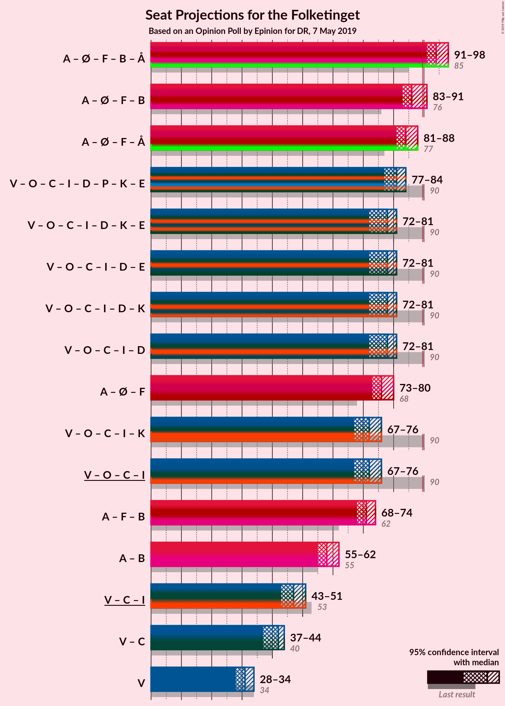

### Confidence Intervals

| Coalition | Last Result | Median | Majority? | 80% Confidence Interval | 90% Confidence Interval | 95% Confidence Interval | 99% Confidence Interval |
|:---------:|:-----------:|:------:|:---------:|:-----------------------:|:-----------------------:|:-----------------------:|:-----------------------:|
| Socialdemokraterne – Enhedslisten–De Rød-Grønne – Socialistisk Folkeparti – Radikale Venstre – Alternativet | 85 | 94 | 98.8% | 92–95 | 92–96 | 91–98 | 88–102 |
| Socialdemokraterne – Enhedslisten–De Rød-Grønne – Socialistisk Folkeparti – Radikale Venstre | 76 | 86 | 3% | 83–89 | 83–89 | 83–91 | 81–94 |
| Socialdemokraterne – Enhedslisten–De Rød-Grønne – Socialistisk Folkeparti – Alternativet | 77 | 84 | 1.0% | 81–85 | 81–87 | 81–88 | 78–92 |
| Venstre – Dansk Folkeparti – Det Konservative Folkeparti – Liberal Alliance – Nye Borgerlige – Stram Kurs – Kristendemokraterne – Klaus Riskær Pedersen | 90 | 81 | 0% | 80–83 | 79–83 | 77–84 | 73–87 |
| Venstre – Dansk Folkeparti – Det Konservative Folkeparti – Liberal Alliance – Nye Borgerlige – Kristendemokraterne – Klaus Riskær Pedersen | 90 | 78 | 0% | 75–80 | 74–81 | 72–81 | 69–84 |
| Venstre – Dansk Folkeparti – Det Konservative Folkeparti – Liberal Alliance – Nye Borgerlige – Klaus Riskær Pedersen | 90 | 78 | 0% | 75–80 | 74–81 | 72–81 | 69–84 |
| Venstre – Dansk Folkeparti – Det Konservative Folkeparti – Liberal Alliance – Nye Borgerlige – Kristendemokraterne | 90 | 78 | 0% | 75–80 | 74–81 | 72–81 | 69–84 |
| Venstre – Dansk Folkeparti – Det Konservative Folkeparti – Liberal Alliance – Nye Borgerlige | 90 | 78 | 0% | 75–80 | 74–81 | 72–81 | 69–84 |
| Socialdemokraterne – Enhedslisten–De Rød-Grønne – Socialistisk Folkeparti | 68 | 76 | 0% | 74–78 | 74–79 | 73–80 | 70–84 |
| Venstre – Dansk Folkeparti – Det Konservative Folkeparti – Liberal Alliance – Kristendemokraterne | 90 | 72 | 0% | 70–75 | 68–75 | 67–76 | 64–78 |
| Venstre – Dansk Folkeparti – Det Konservative Folkeparti – Liberal Alliance | 90 | 72 | 0% | 70–75 | 68–75 | 67–76 | 64–78 |
| Socialdemokraterne – Socialistisk Folkeparti – Radikale Venstre | 62 | 71 | 0% | 68–74 | 68–74 | 68–74 | 66–76 |
| Socialdemokraterne – Radikale Venstre | 55 | 58 | 0% | 55–62 | 55–62 | 55–62 | 54–64 |
| Venstre – Det Konservative Folkeparti – Liberal Alliance | 53 | 47 | 0% | 46–50 | 44–51 | 43–51 | 42–52 |
| Venstre – Det Konservative Folkeparti | 40 | 42 | 0% | 40–44 | 38–44 | 37–44 | 36–45 |
| Venstre | 34 | 31 | 0% | 29–33 | 29–33 | 28–34 | 27–36 |

### Socialdemokraterne – Enhedslisten–De Rød-Grønne – Socialistisk Folkeparti – Radikale Venstre – Alternativet

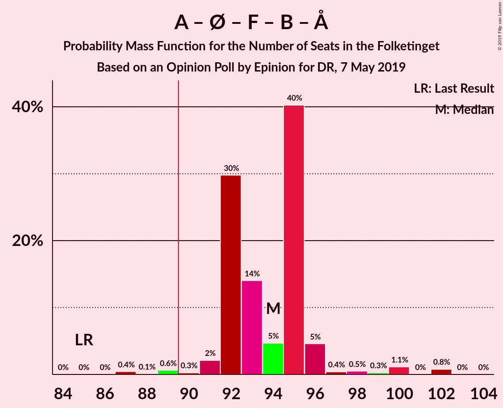

| Number of Seats | Probability | Accumulated | Special Marks |
|:---------------:|:-----------:|:-----------:|:-------------:|
| 85 | 0% | 100% | Last Result |
| 86 | 0% | 100% |  |
| 87 | 0.4% | 100% |  |
| 88 | 0.1% | 99.6% |  |
| 89 | 0.6% | 99.5% |  |
| 90 | 0.3% | 98.8% | Majority |
| 91 | 2% | 98.6% |  |
| 92 | 30% | 96% |  |
| 93 | 14% | 67% |  |
| 94 | 5% | 53% | Median |
| 95 | 40% | 48% |  |
| 96 | 5% | 8% |  |
| 97 | 0.4% | 3% |  |
| 98 | 0.5% | 3% |  |
| 99 | 0.3% | 2% |  |
| 100 | 1.1% | 2% |  |
| 101 | 0% | 0.8% |  |
| 102 | 0.8% | 0.8% |  |
| 103 | 0% | 0% |  |

### Socialdemokraterne – Enhedslisten–De Rød-Grønne – Socialistisk Folkeparti – Radikale Venstre

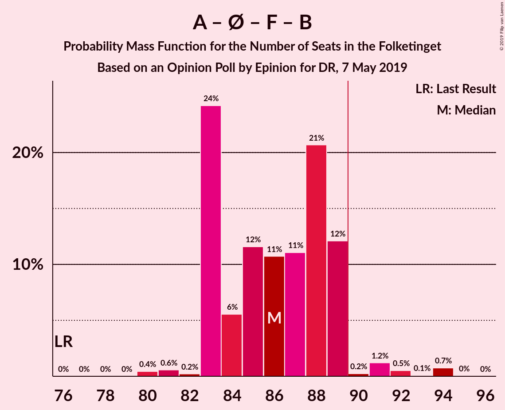

| Number of Seats | Probability | Accumulated | Special Marks |
|:---------------:|:-----------:|:-----------:|:-------------:|
| 76 | 0% | 100% | Last Result |
| 77 | 0% | 100% |  |
| 78 | 0% | 100% |  |
| 79 | 0% | 100% |  |
| 80 | 0.4% | 100% |  |
| 81 | 0.6% | 99.5% |  |
| 82 | 0.2% | 99.0% |  |
| 83 | 24% | 98.7% |  |
| 84 | 6% | 75% |  |
| 85 | 12% | 69% |  |
| 86 | 11% | 57% | Median |
| 87 | 11% | 47% |  |
| 88 | 21% | 36% |  |
| 89 | 12% | 15% |  |
| 90 | 0.2% | 3% | Majority |
| 91 | 1.2% | 3% |  |
| 92 | 0.5% | 1.4% |  |
| 93 | 0.1% | 0.9% |  |
| 94 | 0.7% | 0.8% |  |
| 95 | 0% | 0% |  |

### Socialdemokraterne – Enhedslisten–De Rød-Grønne – Socialistisk Folkeparti – Alternativet

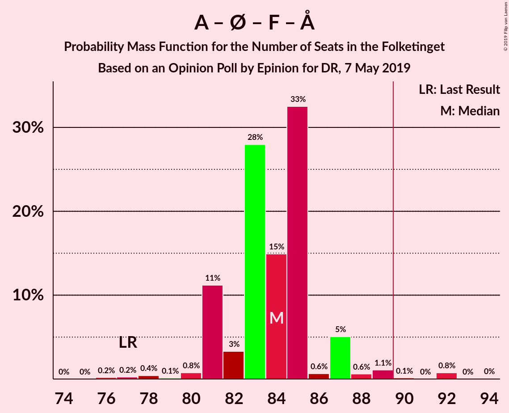

| Number of Seats | Probability | Accumulated | Special Marks |
|:---------------:|:-----------:|:-----------:|:-------------:|
| 76 | 0.2% | 100% |  |
| 77 | 0.2% | 99.8% | Last Result |
| 78 | 0.4% | 99.6% |  |
| 79 | 0.1% | 99.1% |  |
| 80 | 0.8% | 99.0% |  |
| 81 | 11% | 98% |  |
| 82 | 3% | 87% |  |
| 83 | 28% | 84% |  |
| 84 | 15% | 56% |  |
| 85 | 33% | 41% | Median |
| 86 | 0.6% | 8% |  |
| 87 | 5% | 8% |  |
| 88 | 0.6% | 3% |  |
| 89 | 1.1% | 2% |  |
| 90 | 0.1% | 1.0% | Majority |
| 91 | 0% | 0.8% |  |
| 92 | 0.8% | 0.8% |  |
| 93 | 0% | 0% |  |

### Venstre – Dansk Folkeparti – Det Konservative Folkeparti – Liberal Alliance – Nye Borgerlige – Stram Kurs – Kristendemokraterne – Klaus Riskær Pedersen

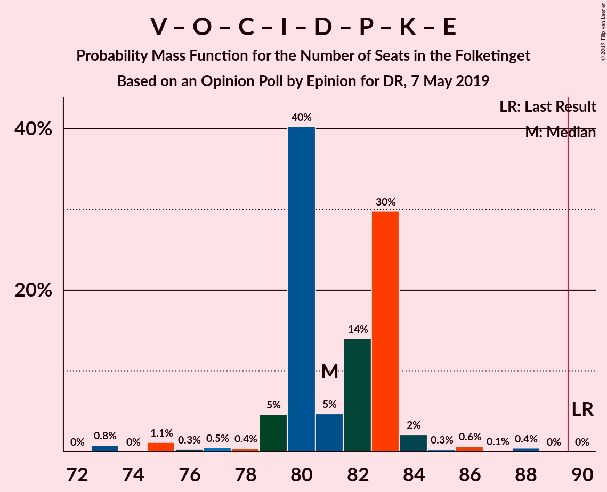

| Number of Seats | Probability | Accumulated | Special Marks |
|:---------------:|:-----------:|:-----------:|:-------------:|
| 73 | 0.8% | 100% |  |
| 74 | 0% | 99.2% |  |
| 75 | 1.1% | 99.2% |  |
| 76 | 0.3% | 98% |  |
| 77 | 0.5% | 98% |  |
| 78 | 0.4% | 97% |  |
| 79 | 5% | 97% |  |
| 80 | 40% | 92% | Median |
| 81 | 5% | 52% |  |
| 82 | 14% | 47% |  |
| 83 | 30% | 33% |  |
| 84 | 2% | 4% |  |
| 85 | 0.3% | 1.4% |  |
| 86 | 0.6% | 1.2% |  |
| 87 | 0.1% | 0.5% |  |
| 88 | 0.4% | 0.4% |  |
| 89 | 0% | 0% |  |
| 90 | 0% | 0% | Last Result, Majority |

### Venstre – Dansk Folkeparti – Det Konservative Folkeparti – Liberal Alliance – Nye Borgerlige – Kristendemokraterne – Klaus Riskær Pedersen

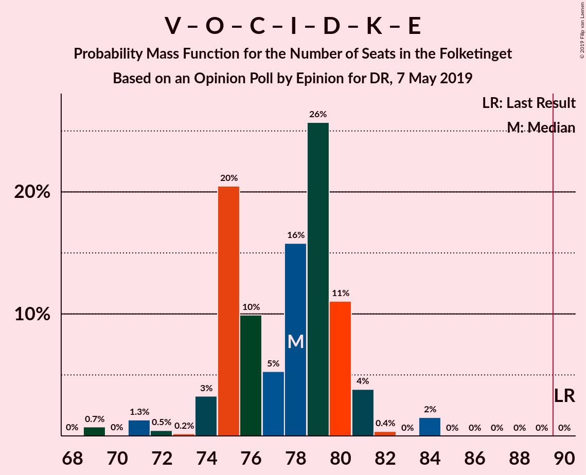

| Number of Seats | Probability | Accumulated | Special Marks |
|:---------------:|:-----------:|:-----------:|:-------------:|
| 69 | 0.7% | 100% |  |
| 70 | 0% | 99.2% |  |
| 71 | 1.3% | 99.2% |  |
| 72 | 0.5% | 98% |  |
| 73 | 0.2% | 97% |  |
| 74 | 3% | 97% |  |
| 75 | 20% | 94% |  |
| 76 | 10% | 73% | Median |
| 77 | 5% | 64% |  |
| 78 | 16% | 58% |  |
| 79 | 26% | 42% |  |
| 80 | 11% | 17% |  |
| 81 | 4% | 6% |  |
| 82 | 0.4% | 2% |  |
| 83 | 0% | 2% |  |
| 84 | 2% | 2% |  |
| 85 | 0% | 0% |  |
| 86 | 0% | 0% |  |
| 87 | 0% | 0% |  |
| 88 | 0% | 0% |  |
| 89 | 0% | 0% |  |
| 90 | 0% | 0% | Last Result, Majority |

### Venstre – Dansk Folkeparti – Det Konservative Folkeparti – Liberal Alliance – Nye Borgerlige – Klaus Riskær Pedersen

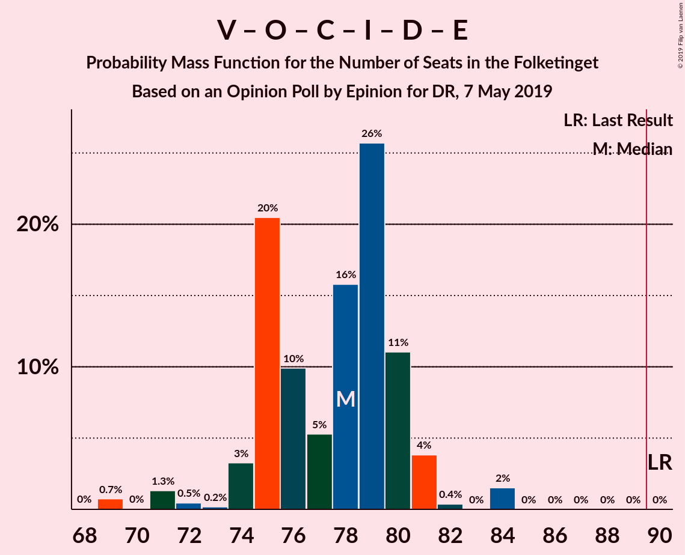

| Number of Seats | Probability | Accumulated | Special Marks |
|:---------------:|:-----------:|:-----------:|:-------------:|
| 69 | 0.7% | 100% |  |
| 70 | 0% | 99.2% |  |
| 71 | 1.3% | 99.2% |  |
| 72 | 0.5% | 98% |  |
| 73 | 0.2% | 97% |  |
| 74 | 3% | 97% |  |
| 75 | 20% | 94% |  |
| 76 | 10% | 73% | Median |
| 77 | 5% | 64% |  |
| 78 | 16% | 58% |  |
| 79 | 26% | 42% |  |
| 80 | 11% | 17% |  |
| 81 | 4% | 6% |  |
| 82 | 0.4% | 2% |  |
| 83 | 0% | 2% |  |
| 84 | 2% | 2% |  |
| 85 | 0% | 0% |  |
| 86 | 0% | 0% |  |
| 87 | 0% | 0% |  |
| 88 | 0% | 0% |  |
| 89 | 0% | 0% |  |
| 90 | 0% | 0% | Last Result, Majority |

### Venstre – Dansk Folkeparti – Det Konservative Folkeparti – Liberal Alliance – Nye Borgerlige – Kristendemokraterne

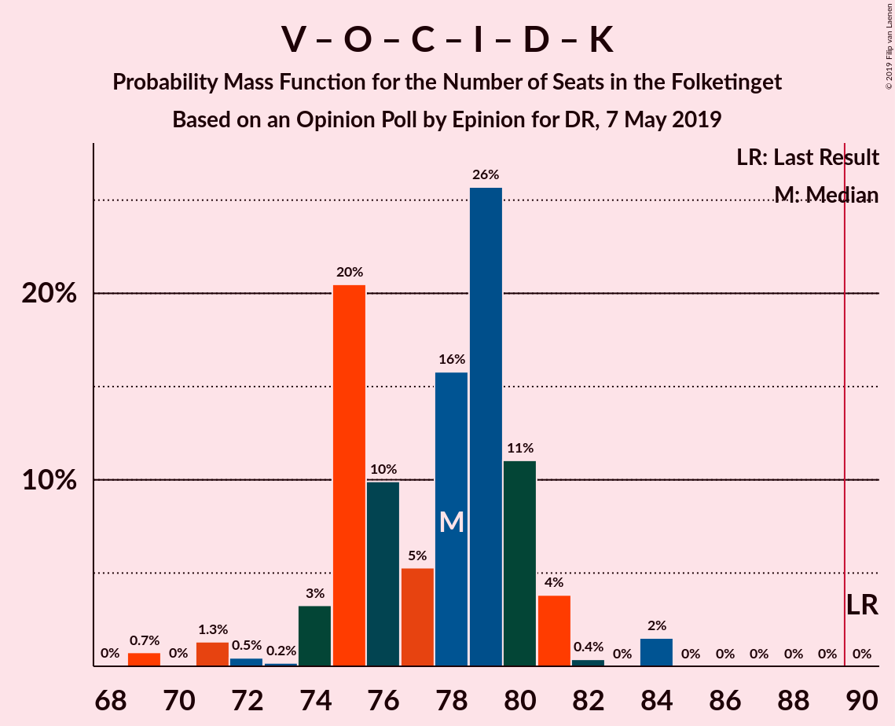

| Number of Seats | Probability | Accumulated | Special Marks |
|:---------------:|:-----------:|:-----------:|:-------------:|
| 69 | 0.7% | 100% |  |
| 70 | 0% | 99.2% |  |
| 71 | 1.3% | 99.2% |  |
| 72 | 0.5% | 98% |  |
| 73 | 0.2% | 97% |  |
| 74 | 3% | 97% |  |
| 75 | 20% | 94% |  |
| 76 | 10% | 73% | Median |
| 77 | 5% | 64% |  |
| 78 | 16% | 58% |  |
| 79 | 26% | 42% |  |
| 80 | 11% | 17% |  |
| 81 | 4% | 6% |  |
| 82 | 0.4% | 2% |  |
| 83 | 0% | 2% |  |
| 84 | 2% | 2% |  |
| 85 | 0% | 0% |  |
| 86 | 0% | 0% |  |
| 87 | 0% | 0% |  |
| 88 | 0% | 0% |  |
| 89 | 0% | 0% |  |
| 90 | 0% | 0% | Last Result, Majority |

### Venstre – Dansk Folkeparti – Det Konservative Folkeparti – Liberal Alliance – Nye Borgerlige

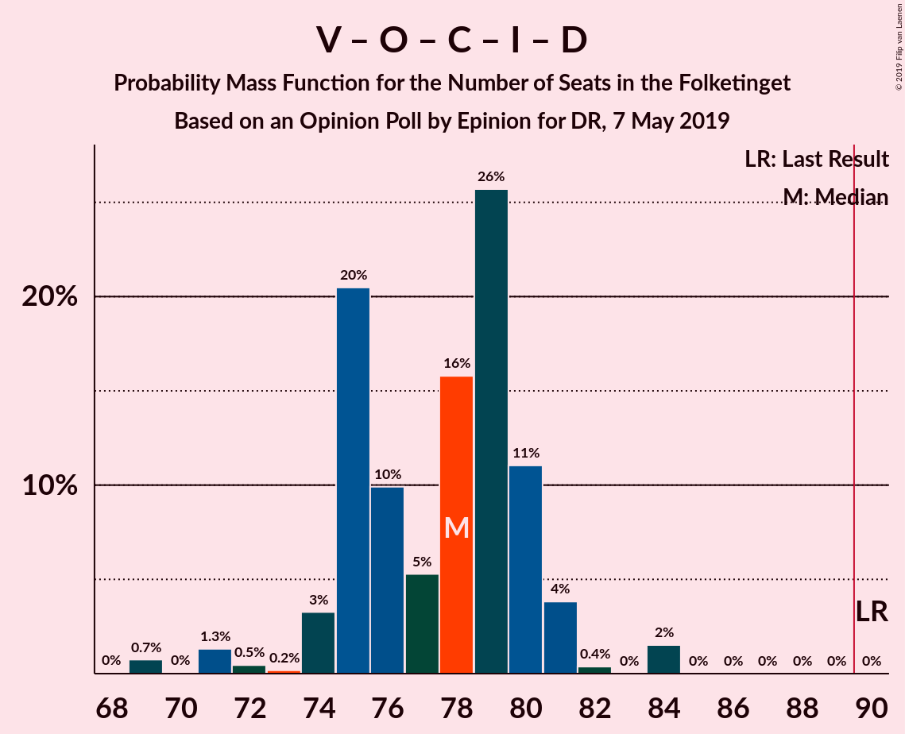

| Number of Seats | Probability | Accumulated | Special Marks |
|:---------------:|:-----------:|:-----------:|:-------------:|
| 69 | 0.7% | 100% |  |
| 70 | 0% | 99.2% |  |
| 71 | 1.3% | 99.2% |  |
| 72 | 0.5% | 98% |  |
| 73 | 0.2% | 97% |  |
| 74 | 3% | 97% |  |
| 75 | 20% | 94% |  |
| 76 | 10% | 73% | Median |
| 77 | 5% | 64% |  |
| 78 | 16% | 58% |  |
| 79 | 26% | 42% |  |
| 80 | 11% | 17% |  |
| 81 | 4% | 6% |  |
| 82 | 0.4% | 2% |  |
| 83 | 0% | 2% |  |
| 84 | 2% | 2% |  |
| 85 | 0% | 0% |  |
| 86 | 0% | 0% |  |
| 87 | 0% | 0% |  |
| 88 | 0% | 0% |  |
| 89 | 0% | 0% |  |
| 90 | 0% | 0% | Last Result, Majority |

### Socialdemokraterne – Enhedslisten–De Rød-Grønne – Socialistisk Folkeparti

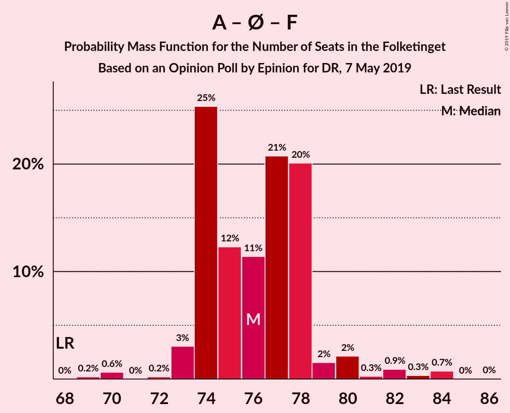

| Number of Seats | Probability | Accumulated | Special Marks |
|:---------------:|:-----------:|:-----------:|:-------------:|
| 68 | 0% | 100% | Last Result |
| 69 | 0.2% | 100% |  |
| 70 | 0.6% | 99.8% |  |
| 71 | 0% | 99.2% |  |
| 72 | 0.2% | 99.1% |  |
| 73 | 3% | 98.9% |  |
| 74 | 25% | 96% |  |
| 75 | 12% | 71% |  |
| 76 | 11% | 58% |  |
| 77 | 21% | 47% | Median |
| 78 | 20% | 26% |  |
| 79 | 2% | 6% |  |
| 80 | 2% | 4% |  |
| 81 | 0.3% | 2% |  |
| 82 | 0.9% | 2% |  |
| 83 | 0.3% | 1.1% |  |
| 84 | 0.7% | 0.8% |  |
| 85 | 0% | 0.1% |  |
| 86 | 0% | 0% |  |

### Venstre – Dansk Folkeparti – Det Konservative Folkeparti – Liberal Alliance – Kristendemokraterne

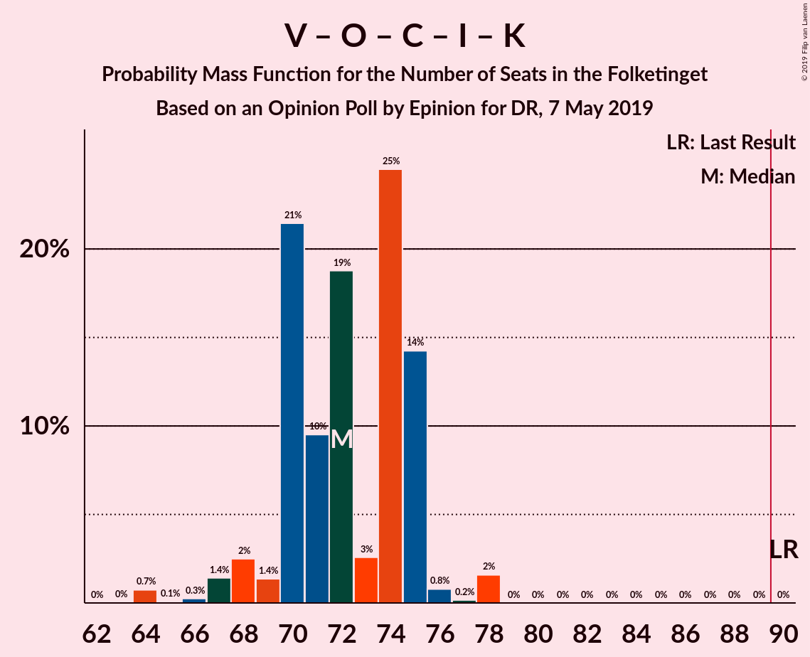

| Number of Seats | Probability | Accumulated | Special Marks |
|:---------------:|:-----------:|:-----------:|:-------------:|
| 64 | 0.7% | 100% |  |
| 65 | 0.1% | 99.2% |  |
| 66 | 0.3% | 99.2% |  |
| 67 | 1.4% | 98.9% |  |
| 68 | 2% | 97% |  |
| 69 | 1.4% | 95% |  |
| 70 | 21% | 94% |  |
| 71 | 10% | 72% | Median |
| 72 | 19% | 63% |  |
| 73 | 3% | 44% |  |
| 74 | 25% | 41% |  |
| 75 | 14% | 17% |  |
| 76 | 0.8% | 3% |  |
| 77 | 0.2% | 2% |  |
| 78 | 2% | 2% |  |
| 79 | 0% | 0% |  |
| 80 | 0% | 0% |  |
| 81 | 0% | 0% |  |
| 82 | 0% | 0% |  |
| 83 | 0% | 0% |  |
| 84 | 0% | 0% |  |
| 85 | 0% | 0% |  |
| 86 | 0% | 0% |  |
| 87 | 0% | 0% |  |
| 88 | 0% | 0% |  |
| 89 | 0% | 0% |  |
| 90 | 0% | 0% | Last Result, Majority |

### Venstre – Dansk Folkeparti – Det Konservative Folkeparti – Liberal Alliance

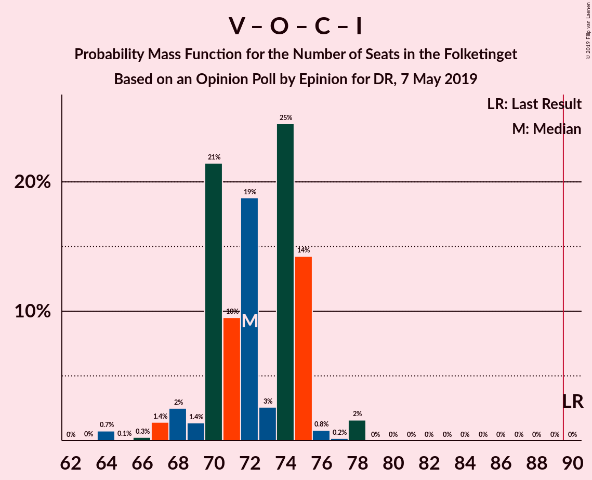

| Number of Seats | Probability | Accumulated | Special Marks |
|:---------------:|:-----------:|:-----------:|:-------------:|
| 64 | 0.7% | 100% |  |
| 65 | 0.1% | 99.2% |  |
| 66 | 0.3% | 99.2% |  |
| 67 | 1.4% | 98.9% |  |
| 68 | 2% | 97% |  |
| 69 | 1.4% | 95% |  |
| 70 | 21% | 94% |  |
| 71 | 10% | 72% | Median |
| 72 | 19% | 63% |  |
| 73 | 3% | 44% |  |
| 74 | 25% | 41% |  |
| 75 | 14% | 17% |  |
| 76 | 0.8% | 3% |  |
| 77 | 0.2% | 2% |  |
| 78 | 2% | 2% |  |
| 79 | 0% | 0% |  |
| 80 | 0% | 0% |  |
| 81 | 0% | 0% |  |
| 82 | 0% | 0% |  |
| 83 | 0% | 0% |  |
| 84 | 0% | 0% |  |
| 85 | 0% | 0% |  |
| 86 | 0% | 0% |  |
| 87 | 0% | 0% |  |
| 88 | 0% | 0% |  |
| 89 | 0% | 0% |  |
| 90 | 0% | 0% | Last Result, Majority |

### Socialdemokraterne – Socialistisk Folkeparti – Radikale Venstre

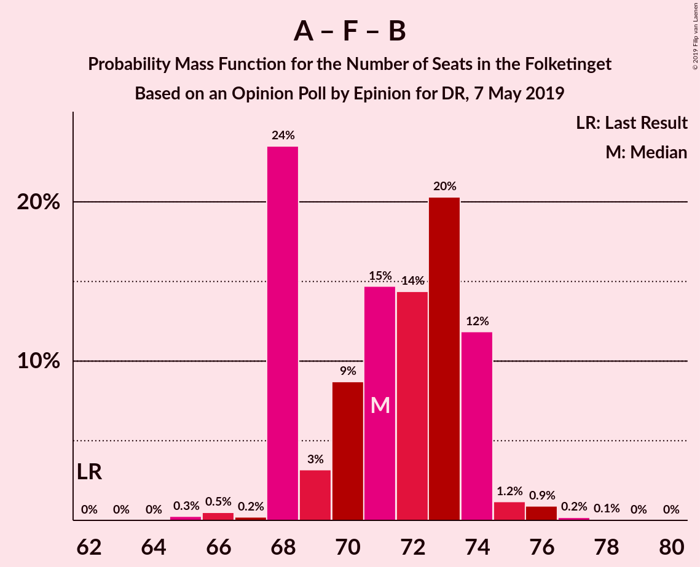

| Number of Seats | Probability | Accumulated | Special Marks |
|:---------------:|:-----------:|:-----------:|:-------------:|
| 62 | 0% | 100% | Last Result |
| 63 | 0% | 100% |  |
| 64 | 0% | 100% |  |
| 65 | 0.3% | 100% |  |
| 66 | 0.5% | 99.7% |  |
| 67 | 0.2% | 99.2% |  |
| 68 | 24% | 99.0% |  |
| 69 | 3% | 76% |  |
| 70 | 9% | 72% |  |
| 71 | 15% | 64% | Median |
| 72 | 14% | 49% |  |
| 73 | 20% | 35% |  |
| 74 | 12% | 14% |  |
| 75 | 1.2% | 2% |  |
| 76 | 0.9% | 1.2% |  |
| 77 | 0.2% | 0.3% |  |
| 78 | 0.1% | 0.1% |  |
| 79 | 0% | 0% |  |

### Socialdemokraterne – Radikale Venstre

| Number of Seats | Probability | Accumulated | Special Marks |
|:---------------:|:-----------:|:-----------:|:-------------:|
| 53 | 0.5% | 100% |  |
| 54 | 0.1% | 99.5% |  |
| 55 | 23% | 99.5% | Last Result |
| 56 | 2% | 76% |  |
| 57 | 17% | 74% |  |
| 58 | 8% | 57% | Median |
| 59 | 7% | 49% |  |
| 60 | 11% | 42% |  |
| 61 | 20% | 32% |  |
| 62 | 10% | 12% |  |
| 63 | 0.2% | 2% |  |
| 64 | 1.1% | 1.4% |  |
| 65 | 0.2% | 0.3% |  |
| 66 | 0.1% | 0.1% |  |
| 67 | 0% | 0% |  |

### Venstre – Det Konservative Folkeparti – Liberal Alliance

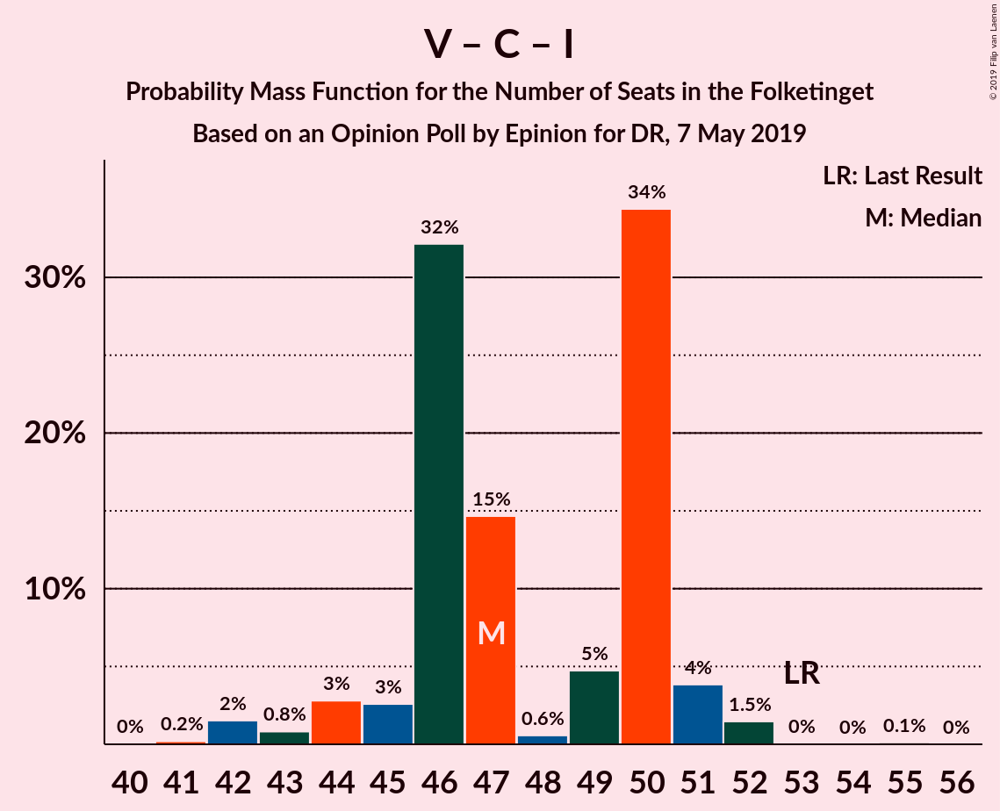

| Number of Seats | Probability | Accumulated | Special Marks |
|:---------------:|:-----------:|:-----------:|:-------------:|
| 41 | 0.2% | 100% |  |
| 42 | 2% | 99.8% |  |
| 43 | 0.8% | 98% |  |
| 44 | 3% | 97% |  |
| 45 | 3% | 95% |  |
| 46 | 32% | 92% |  |
| 47 | 15% | 60% | Median |
| 48 | 0.6% | 45% |  |
| 49 | 5% | 45% |  |
| 50 | 34% | 40% |  |
| 51 | 4% | 5% |  |
| 52 | 1.5% | 2% |  |
| 53 | 0% | 0.2% | Last Result |
| 54 | 0% | 0.1% |  |
| 55 | 0.1% | 0.1% |  |
| 56 | 0% | 0% |  |

### Venstre – Det Konservative Folkeparti

| Number of Seats | Probability | Accumulated | Special Marks |
|:---------------:|:-----------:|:-----------:|:-------------:|
| 34 | 0% | 100% |  |
| 35 | 0.2% | 99.9% |  |
| 36 | 1.2% | 99.8% |  |
| 37 | 1.4% | 98.6% |  |
| 38 | 3% | 97% |  |
| 39 | 3% | 94% |  |
| 40 | 24% | 91% | Last Result |
| 41 | 7% | 67% | Median |
| 42 | 21% | 61% |  |
| 43 | 28% | 40% |  |
| 44 | 11% | 12% |  |
| 45 | 0.7% | 1.1% |  |
| 46 | 0.3% | 0.4% |  |
| 47 | 0.1% | 0.1% |  |
| 48 | 0% | 0% |  |

### Venstre

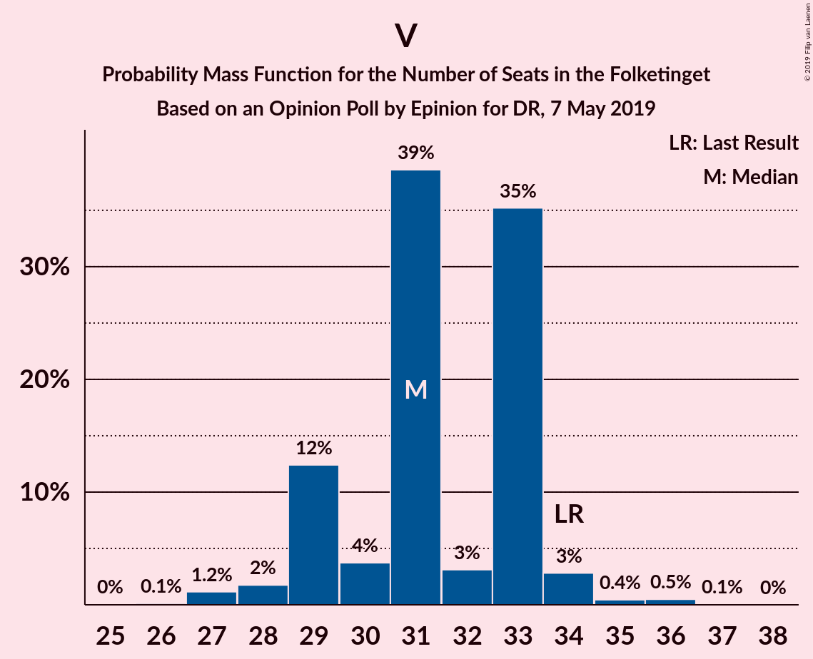

| Number of Seats | Probability | Accumulated | Special Marks |
|:---------------:|:-----------:|:-----------:|:-------------:|
| 26 | 0.1% | 100% |  |
| 27 | 1.2% | 99.8% |  |
| 28 | 2% | 98.7% |  |
| 29 | 12% | 97% |  |
| 30 | 4% | 84% |  |
| 31 | 39% | 81% | Median |
| 32 | 3% | 42% |  |
| 33 | 35% | 39% |  |
| 34 | 3% | 4% | Last Result |
| 35 | 0.4% | 1.0% |  |
| 36 | 0.5% | 0.6% |  |
| 37 | 0.1% | 0.1% |  |
| 38 | 0% | 0% |  |

## Technical Information

### Opinion Poll

+ **Polling firm:** Epinion
+ **Commissioner(s):** DR
+ **Fieldwork period:** 7 May 2019

### Calculations

+ **Sample size:** 1616
+ **Simulations done:** 1,048,576
+ **Error estimate:** 2.09%

